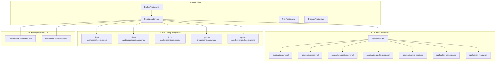
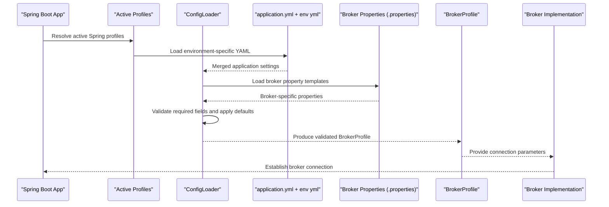
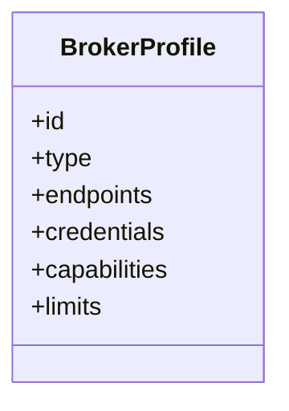
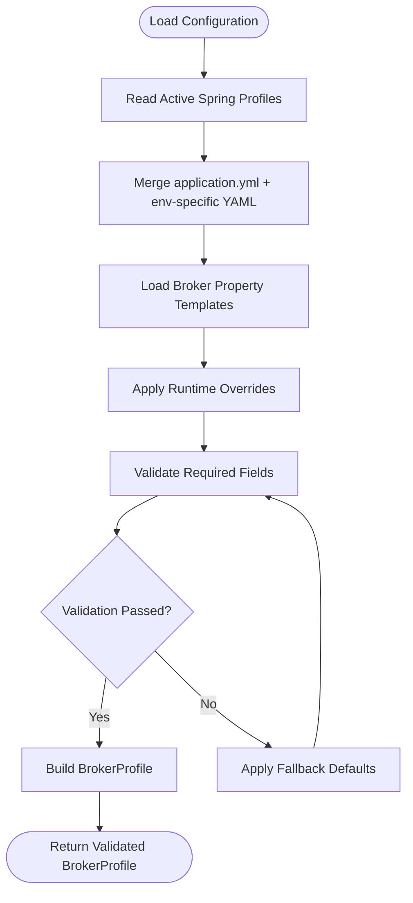
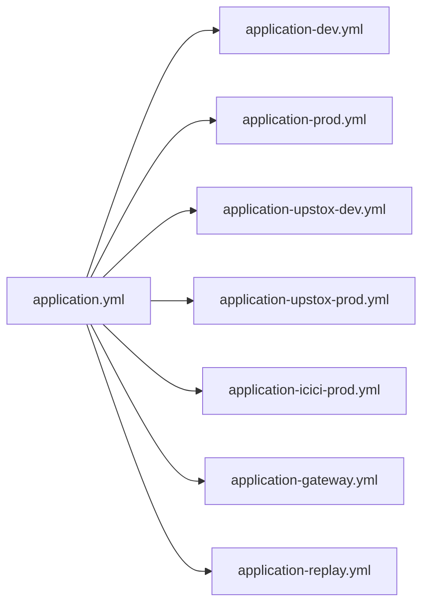
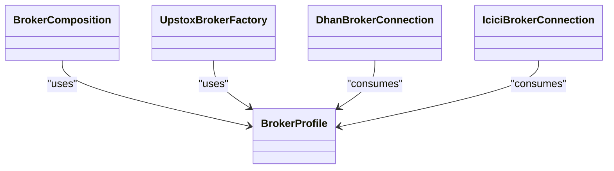
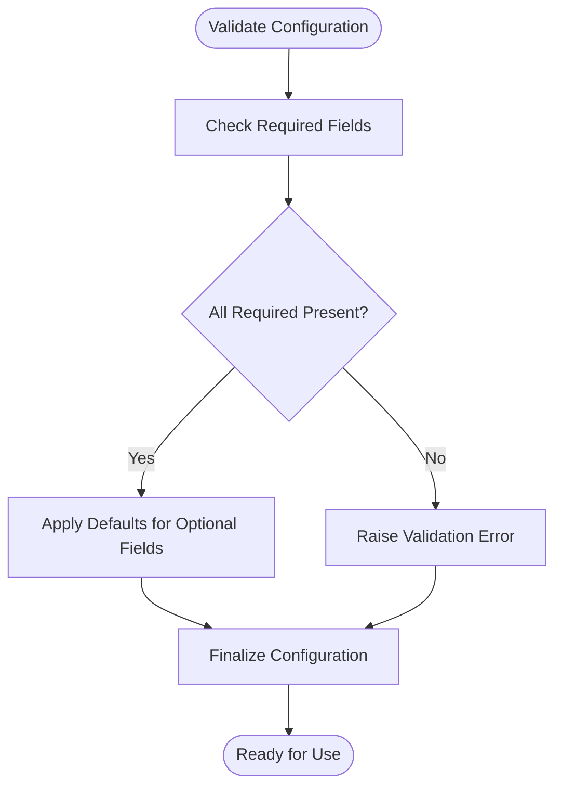
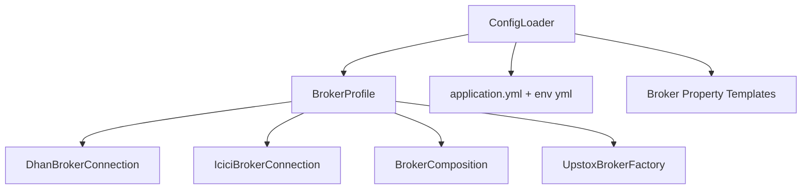

# Broker Configuration Management

<cite>
**Referenced Files in This Document**
- [BrokerProfile.java](file://composition/src/main/java/com/tradej/composition/config/BrokerProfile.java)
- [ConfigLoader.java](file://composition/src/main/java/com/tradej/composition/config/ConfigLoader.java)
- [RiskProfile.java](file://composition/src/main/java/com/tradej/composition/config/RiskProfile.java)
- [StorageProfile.java](file://composition/src/main/java/com/tradej/composition/config/StorageProfile.java)
- [application.yml](file://app/src/main/resources/application.yml)
- [application-dev.yml](file://app/src/main/resources/application-dev.yml)
- [application-prod.yml](file://app/src/main/resources/application-prod.yml)
- [application-upstox-dev.yml](file://app/src/main/resources/application-upstox-dev.yml)
- [application-upstox-prod.yml](file://app/src/main/resources/application-upstox-prod.yml)
- [application-icici-prod.yml](file://app/src/main/resources/application-icici-prod.yml)
- [application-gateway.yml](file://app/src/main/resources/application-gateway.yml)
- [application-replay.yml](file://app/src/main/resources/application-replay.yml)
- [dhan-local.properties.example](file://config/dhan-local.properties.example)
- [dhan-sandbox.properties.example](file://config/dhan-sandbox.properties.example)
- [icici-local.properties.example](file://config/icici-local.properties.example)
- [upstox-live.properties.example](file://config/upstox-live.properties.example)
- [upstox-sandbox.properties.example](file://config/upstox-sandbox.properties.example)
- [BrokerComposition.java](file://composition/src/main/java/com/tradej/composition/BrokerComposition.java)
- [UpstoxBrokerFactory.java](file://composition/src/main/java/com/tradej/composition/UpstoxBrokerFactory.java)
- [GatewayProfileContextComponentTest.java](file://app/src/test/java/com/tradej/app/config/GatewayProfileContextComponentTest.java)
- [RuntimeConfigurationTest.java](file://app/src/test/java/com/tradej/app/config/RuntimeConfigurationTest.java)
- [BrokerStartupValidatorTest.java](file://app/src/test/java/com/tradej/app/startup/BrokerStartupValidatorTest.java)
- [DhanBrokerConnection.java](file://broker/dhan/src/main/java/com/tradej/broker/dhan/DhanBrokerConnection.java)
- [IciciBrokerConnection.java](file://broker/icici/src/main/java/com/tradej/broker/icici/IciciBrokerConnection.java)
- [BrokerErrorTrackerTest.java](file://app/src/test/java/com/tradej/app/health/BrokerErrorTrackerTest.java)
</cite>

## Table of Contents
1. [Introduction](#introduction)
2. [Project Structure](#project-structure)
3. [Core Components](#core-components)
4. [Architecture Overview](#architecture-overview)
5. [Detailed Component Analysis](#detailed-component-analysis)
6. [Dependency Analysis](#dependency-analysis)
7. [Performance Considerations](#performance-considerations)
8. [Troubleshooting Guide](#troubleshooting-guide)
9. [Conclusion](#conclusion)
10. [Appendices](#appendices)

## Introduction
This document explains the broker configuration management system in the project. It covers the broker profile system, configuration file formats, environment-specific settings, the ConfigLoader implementation, validation and error handling, fallback mechanisms, examples for configuring each broker type, environment switching, runtime configuration updates, and the relationship between broker profiles and service composition. It also provides best practices for managing secrets and sensitive configuration data across environments.

## Project Structure
The broker configuration management spans several modules:
- Composition module defines broker profiles and loads configuration via ConfigLoader.
- Application resource files define Spring Boot profiles and environment-specific settings.
- Broker-specific configuration files provide property templates for Dhan, ICICI, and Upstox.
- Broker implementations consume the configured profiles to establish connections.

**Diagram sources**
- [BrokerProfile.java](file://composition/src/main/java/com/tradej/composition/config/BrokerProfile.java)
- [ConfigLoader.java](file://composition/src/main/java/com/tradej/composition/config/ConfigLoader.java)
- [application.yml](file://app/src/main/resources/application.yml)
- [application-dev.yml](file://app/src/main/resources/application-dev.yml)
- [application-prod.yml](file://app/src/main/resources/application-prod.yml)
- [application-upstox-dev.yml](file://app/src/main/resources/application-upstox-dev.yml)
- [application-upstox-prod.yml](file://app/src/main/resources/application-upstox-prod.yml)
- [application-icici-prod.yml](file://app/src/main/resources/application-icici-prod.yml)
- [application-gateway.yml](file://app/src/main/resources/application-gateway.yml)
- [application-replay.yml](file://app/src/main/resources/application-replay.yml)
- [dhan-local.properties.example](file://config/dhan-local.properties.example)
- [dhan-sandbox.properties.example](file://config/dhan-sandbox.properties.example)
- [icici-local.properties.example](file://config/icici-local.properties.example)
- [upstox-live.properties.example](file://config/upstox-live.properties.example)
- [upstox-sandbox.properties.example](file://config/upstox-sandbox.properties.example)
- [DhanBrokerConnection.java](file://broker/dhan/src/main/java/com/tradej/broker/dhan/DhanBrokerConnection.java)
- [IciciBrokerConnection.java](file://broker/icici/src/main/java/com/tradej/broker/icici/IciciBrokerConnection.java)

**Section sources**
- [BrokerProfile.java](file://composition/src/main/java/com/tradej/composition/config/BrokerProfile.java)
- [ConfigLoader.java](file://composition/src/main/java/com/tradej/composition/config/ConfigLoader.java)
- [application.yml](file://app/src/main/resources/application.yml)

## Core Components
- BrokerProfile: Defines broker identity, connection parameters, and capabilities used by the composition layer.
- ConfigLoader: Central loader that resolves active profiles, merges environment-specific settings, and validates configuration.
- RiskProfile and StorageProfile: Additional profiles used by the composition layer for risk and storage settings.
- Broker implementations (DhanBrokerConnection, IciciBrokerConnection): Consume the loaded configuration to establish and manage broker connections.

Key responsibilities:
- BrokerProfile encapsulates broker-specific identifiers and connection metadata.
- ConfigLoader reads Spring profiles, merges broker property files, validates required fields, and applies fallback defaults.
- RiskProfile and StorageProfile complement BrokerProfile in broader composition decisions.
- Broker implementations translate the loaded configuration into operational connections.

**Section sources**
- [BrokerProfile.java](file://composition/src/main/java/com/tradej/composition/config/BrokerProfile.java)
- [ConfigLoader.java](file://composition/src/main/java/com/tradej/composition/config/ConfigLoader.java)
- [RiskProfile.java](file://composition/src/main/java/com/tradej/composition/config/RiskProfile.java)
- [StorageProfile.java](file://composition/src/main/java/com/tradej/composition/config/StorageProfile.java)
- [DhanBrokerConnection.java](file://broker/dhan/src/main/java/com/tradej/broker/dhan/DhanBrokerConnection.java)
- [IciciBrokerConnection.java](file://broker/icici/src/main/java/com/tradej/broker/icici/IciciBrokerConnection.java)

## Architecture Overview
The configuration architecture integrates Spring profiles, property files, and broker-specific loaders to produce a validated runtime configuration consumed by broker implementations.

**Diagram sources**
- [ConfigLoader.java](file://composition/src/main/java/com/tradej/composition/config/ConfigLoader.java)
- [application.yml](file://app/src/main/resources/application.yml)
- [application-dev.yml](file://app/src/main/resources/application-dev.yml)
- [application-prod.yml](file://app/src/main/resources/application-prod.yml)
- [dhan-local.properties.example](file://config/dhan-local.properties.example)
- [icici-local.properties.example](file://config/icici-local.properties.example)
- [upstox-live.properties.example](file://config/upstox-live.properties.example)
- [DhanBrokerConnection.java](file://broker/dhan/src/main/java/com/tradej/broker/dhan/DhanBrokerConnection.java)
- [IciciBrokerConnection.java](file://broker/icici/src/main/java/com/tradej/broker/icici/IciciBrokerConnection.java)

## Detailed Component Analysis

### BrokerProfile Analysis
BrokerProfile defines the broker identity and connection parameters used by the composition layer. It typically includes:
- Broker identifier and type
- Endpoint URLs and credentials placeholders
- Capability flags and limits
- Environment-specific overrides

**Diagram sources**
- [BrokerProfile.java](file://composition/src/main/java/com/tradej/composition/config/BrokerProfile.java)

**Section sources**
- [BrokerProfile.java](file://composition/src/main/java/com/tradej/composition/config/BrokerProfile.java)

### ConfigLoader Analysis
ConfigLoader orchestrates configuration loading and validation:
- Resolves active Spring profiles from application.yml and environment-specific YAML files.
- Loads broker property templates and merges them with runtime overrides.
- Validates required fields and applies fallback defaults.
- Produces a validated BrokerProfile for downstream consumers.

**Diagram sources**
- [ConfigLoader.java](file://composition/src/main/java/com/tradej/composition/config/ConfigLoader.java)
- [application.yml](file://app/src/main/resources/application.yml)
- [application-dev.yml](file://app/src/main/resources/application-dev.yml)
- [application-prod.yml](file://app/src/main/resources/application-prod.yml)

**Section sources**
- [ConfigLoader.java](file://composition/src/main/java/com/tradej/composition/config/ConfigLoader.java)

### Environment-Specific Settings
Environment-specific configuration is controlled via Spring profiles:
- application.yml defines base settings and profile activation.
- application-dev.yml, application-prod.yml, application-upstox-dev.yml, application-upstox-prod.yml, application-icici-prod.yml, application-gateway.yml, application-replay.yml tailor settings per environment and broker flavor.
- Broker property templates (e.g., dhan-local.properties.example, icici-local.properties.example, upstox-live.properties.example) provide broker-specific defaults.

**Diagram sources**
- [application.yml](file://app/src/main/resources/application.yml)
- [application-dev.yml](file://app/src/main/resources/application-dev.yml)
- [application-prod.yml](file://app/src/main/resources/application-prod.yml)
- [application-upstox-dev.yml](file://app/src/main/resources/application-upstox-dev.yml)
- [application-upstox-prod.yml](file://app/src/main/resources/application-upstox-prod.yml)
- [application-icici-prod.yml](file://app/src/main/resources/application-icici-prod.yml)
- [application-gateway.yml](file://app/src/main/resources/application-gateway.yml)
- [application-replay.yml](file://app/src/main/resources/application-replay.yml)

**Section sources**
- [application.yml](file://app/src/main/resources/application.yml)
- [application-dev.yml](file://app/src/main/resources/application-dev.yml)
- [application-prod.yml](file://app/src/main/resources/application-prod.yml)
- [application-upstox-dev.yml](file://app/src/main/resources/application-upstox-dev.yml)
- [application-upstox-prod.yml](file://app/src/main/resources/application-upstox-prod.yml)
- [application-icici-prod.yml](file://app/src/main/resources/application-icici-prod.yml)
- [application-gateway.yml](file://app/src/main/resources/application-gateway.yml)
- [application-replay.yml](file://app/src/main/resources/application-replay.yml)

### Broker Property Templates
Broker property templates define the shape of broker-specific configuration:
- dhan-local.properties.example, dhan-sandbox.properties.example
- icici-local.properties.example
- upstox-live.properties.example, upstox-sandbox.properties.example

These templates guide ConfigLoader in validating and merging broker settings.

**Section sources**
- [dhan-local.properties.example](file://config/dhan-local.properties.example)
- [dhan-sandbox.properties.example](file://config/dhan-sandbox.properties.example)
- [icici-local.properties.example](file://config/icici-local.properties.example)
- [upstox-live.properties.example](file://config/upstox-live.properties.example)
- [upstox-sandbox.properties.example](file://config/upstox-sandbox.properties.example)

### Broker Implementations and Composition
Broker implementations consume the validated configuration:
- DhanBrokerConnection.java and IciciBrokerConnection.java translate BrokerProfile into operational connections.
- BrokerComposition.java and UpstoxBrokerFactory.java integrate broker profiles into the broader service composition.

**Diagram sources**
- [BrokerProfile.java](file://composition/src/main/java/com/tradej/composition/config/BrokerProfile.java)
- [DhanBrokerConnection.java](file://broker/dhan/src/main/java/com/tradej/broker/dhan/DhanBrokerConnection.java)
- [IciciBrokerConnection.java](file://broker/icici/src/main/java/com/tradej/broker/icici/IciciBrokerConnection.java)
- [BrokerComposition.java](file://composition/src/main/java/com/tradej/composition/BrokerComposition.java)
- [UpstoxBrokerFactory.java](file://composition/src/main/java/com/tradej/composition/UpstoxBrokerFactory.java)

**Section sources**
- [DhanBrokerConnection.java](file://broker/dhan/src/main/java/com/tradej/broker/dhan/DhanBrokerConnection.java)
- [IciciBrokerConnection.java](file://broker/icici/src/main/java/com/tradej/broker/icici/IciciBrokerConnection.java)
- [BrokerComposition.java](file://composition/src/main/java/com/tradej/composition/BrokerComposition.java)
- [UpstoxBrokerFactory.java](file://composition/src/main/java/com/tradej/composition/UpstoxBrokerFactory.java)

### Configuration Validation and Error Handling
Validation and error handling are enforced during configuration loading:
- Required fields are validated against broker property templates.
- Fallback defaults are applied when optional fields are missing.
- Tests validate startup behavior and runtime configuration scenarios.

**Diagram sources**
- [ConfigLoader.java](file://composition/src/main/java/com/tradej/composition/config/ConfigLoader.java)
- [BrokerStartupValidatorTest.java](file://app/src/test/java/com/tradej/app/startup/BrokerStartupValidatorTest.java)
- [RuntimeConfigurationTest.java](file://app/src/test/java/com/tradej/app/config/RuntimeConfigurationTest.java)

**Section sources**
- [ConfigLoader.java](file://composition/src/main/java/com/tradej/composition/config/ConfigLoader.java)
- [BrokerStartupValidatorTest.java](file://app/src/test/java/com/tradej/app/startup/BrokerStartupValidatorTest.java)
- [RuntimeConfigurationTest.java](file://app/src/test/java/com/tradej/app/config/RuntimeConfigurationTest.java)

### Examples: Broker Type Configuration
- Dhan: Use dhan-local.properties.example or dhan-sandbox.properties.example as templates; populate endpoint URLs, credentials, and capabilities.
- ICICI: Use icici-local.properties.example; configure session endpoints and authentication parameters.
- Upstox: Use upstox-live.properties.example or upstox-sandbox.properties.example; set live or sandbox endpoints and credentials.

These templates are merged by ConfigLoader into a validated BrokerProfile.

**Section sources**
- [dhan-local.properties.example](file://config/dhan-local.properties.example)
- [dhan-sandbox.properties.example](file://config/dhan-sandbox.properties.example)
- [icici-local.properties.example](file://config/icici-local.properties.example)
- [upstox-live.properties.example](file://config/upstox-live.properties.example)
- [upstox-sandbox.properties.example](file://config/upstox-sandbox.properties.example)
- [ConfigLoader.java](file://composition/src/main/java/com/tradej/composition/config/ConfigLoader.java)

### Environment Switching
Environment switching is achieved via Spring profiles:
- application.yml activates profiles (e.g., dev, prod, upstox-dev, upstox-prod, icici-prod).
- application-*.yml files override base settings for each environment.
- Broker property templates remain consistent; only environment-specific values change.

**Section sources**
- [application.yml](file://app/src/main/resources/application.yml)
- [application-dev.yml](file://app/src/main/resources/application-dev.yml)
- [application-prod.yml](file://app/src/main/resources/application-prod.yml)
- [application-upstox-dev.yml](file://app/src/main/resources/application-upstox-dev.yml)
- [application-upstox-prod.yml](file://app/src/main/resources/application-upstox-prod.yml)
- [application-icici-prod.yml](file://app/src/main/resources/application-icici-prod.yml)

### Runtime Configuration Updates
Runtime updates are supported through tests and composition:
- RuntimeConfigurationTest.java demonstrates runtime configuration scenarios.
- Broker implementations rely on the validated BrokerProfile produced by ConfigLoader.

**Section sources**
- [RuntimeConfigurationTest.java](file://app/src/test/java/com/tradej/app/config/RuntimeConfigurationTest.java)
- [ConfigLoader.java](file://composition/src/main/java/com/tradej/composition/config/ConfigLoader.java)

### Relationship Between Broker Profiles and Service Composition
Broker profiles feed into service composition:
- BrokerProfile is used by BrokerComposition.java and UpstoxBrokerFactory.java to wire broker services.
- These factories and compositions depend on validated configuration to initialize broker connections.

**Section sources**
- [BrokerProfile.java](file://composition/src/main/java/com/tradej/composition/config/BrokerProfile.java)
- [BrokerComposition.java](file://composition/src/main/java/com/tradej/composition/BrokerComposition.java)
- [UpstoxBrokerFactory.java](file://composition/src/main/java/com/tradej/composition/UpstoxBrokerFactory.java)

## Dependency Analysis
The configuration system exhibits layered dependencies:
- ConfigLoader depends on Spring profiles and property templates.
- Broker implementations depend on BrokerProfile.
- Composition modules depend on BrokerProfile and ConfigLoader outputs.

**Diagram sources**
- [ConfigLoader.java](file://composition/src/main/java/com/tradej/composition/config/ConfigLoader.java)
- [BrokerProfile.java](file://composition/src/main/java/com/tradej/composition/config/BrokerProfile.java)
- [DhanBrokerConnection.java](file://broker/dhan/src/main/java/com/tradej/broker/dhan/DhanBrokerConnection.java)
- [IciciBrokerConnection.java](file://broker/icici/src/main/java/com/tradej/broker/icici/IciciBrokerConnection.java)
- [BrokerComposition.java](file://composition/src/main/java/com/tradej/composition/BrokerComposition.java)
- [UpstoxBrokerFactory.java](file://composition/src/main/java/com/tradej/composition/UpstoxBrokerFactory.java)
- [application.yml](file://app/src/main/resources/application.yml)

**Section sources**
- [ConfigLoader.java](file://composition/src/main/java/com/tradej/composition/config/ConfigLoader.java)
- [BrokerProfile.java](file://composition/src/main/java/com/tradej/composition/config/BrokerProfile.java)
- [application.yml](file://app/src/main/resources/application.yml)

## Performance Considerations
- Keep property templates minimal and focused to reduce merge overhead.
- Cache validated BrokerProfile instances where appropriate to avoid repeated validation.
- Use environment-specific YAML files to avoid runtime branching logic.
- Validate early and fail fast to prevent expensive initialization failures.

## Troubleshooting Guide
Common issues and resolutions:
- Missing required fields in broker property templates cause validation errors. Ensure all required fields are present in the template and populated for the active environment.
- Incorrect profile activation leads to wrong configuration being loaded. Verify active profiles in application.yml and environment-specific YAML files.
- Runtime configuration updates require proper test coverage. Use existing tests as references for expected behavior.

**Section sources**
- [BrokerErrorTrackerTest.java](file://app/src/test/java/com/tradej/app/health/BrokerErrorTrackerTest.java)
- [BrokerStartupValidatorTest.java](file://app/src/test/java/com/tradej/app/startup/BrokerStartupValidatorTest.java)
- [RuntimeConfigurationTest.java](file://app/src/test/java/com/tradej/app/config/RuntimeConfigurationTest.java)

## Conclusion
The broker configuration management system centers on BrokerProfile and ConfigLoader, which orchestrate Spring profile resolution, property template merging, validation, and fallback application. Broker implementations consume the validated configuration to establish connections, while composition modules integrate broker services using the same configuration backbone. Environment switching is handled cleanly via Spring profiles, and runtime updates are supported through tested scenarios. Best practices emphasize early validation, clear separation of concerns, and secure handling of secrets.

## Appendices

### Best Practices for Managing Secrets and Sensitive Data
- Store secrets externally (e.g., environment variables, secret managers) and reference them in property templates.
- Never commit secrets to version control; use .gitignore entries for local overrides.
- Use environment-specific YAML files to inject secrets per environment without hardcoding.
- Validate presence of secrets during configuration loading and fail fast if missing.
- Rotate secrets regularly and update configuration accordingly.

[No sources needed since this section provides general guidance]