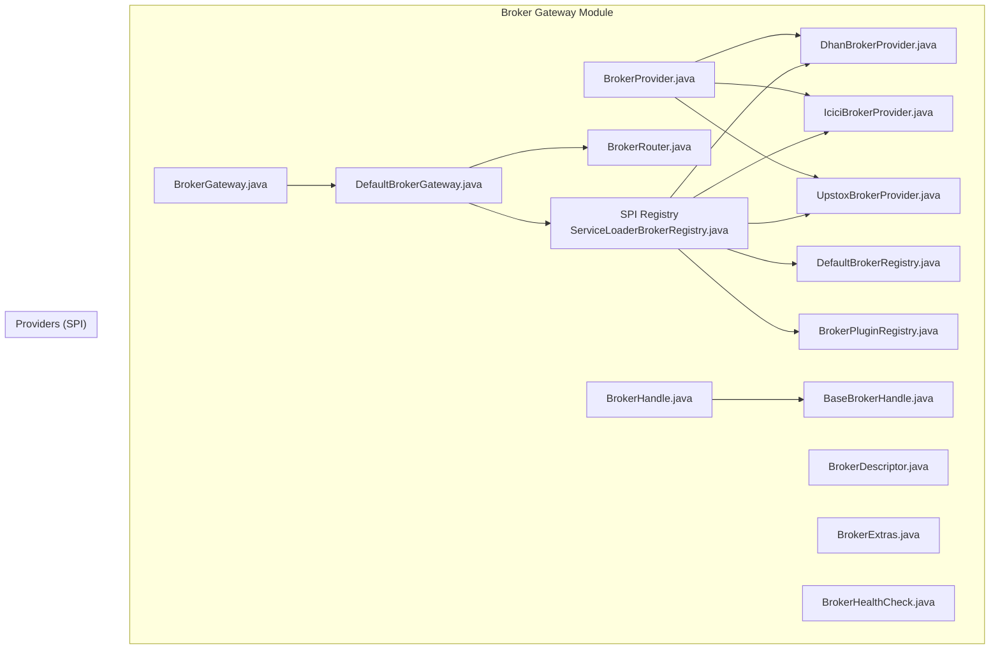
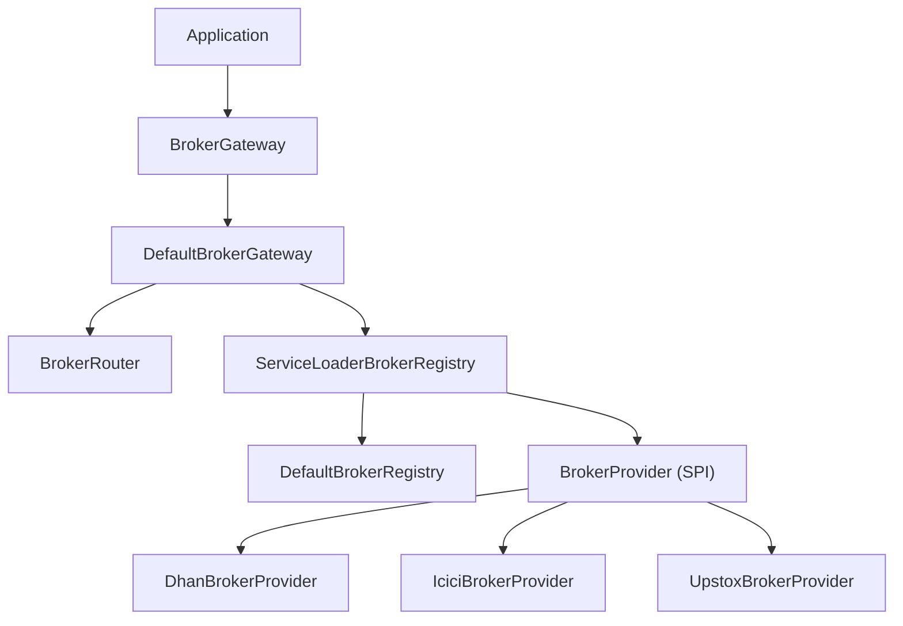
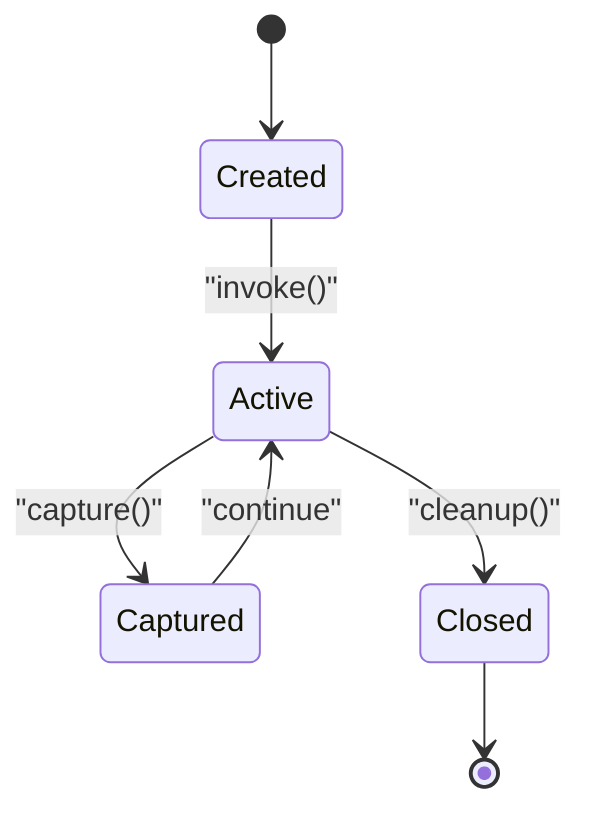
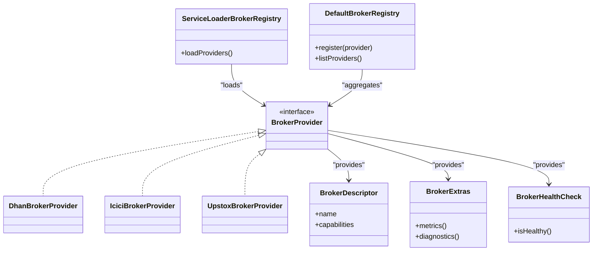
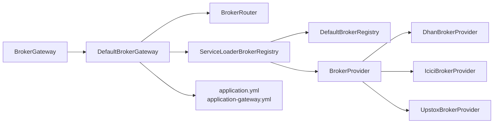

# Broker Gateway

<cite>
**Referenced Files in This Document**
- [BrokerGateway.java](file://broker-gateway/src/main/java/com/tradej/brokergateway/BrokerGateway.java)
- [DefaultBrokerGateway.java](file://broker-gateway/src/main/java/com/tradej/brokergateway/DefaultBrokerGateway.java)
- [BrokerHandle.java](file://broker-gateway/src/main/java/com/tradej/brokergateway/BrokerHandle.java)
- [BaseBrokerHandle.java](file://broker-gateway/src/main/java/com/tradej/brokergateway/BaseBrokerHandle.java)
- [BrokerRouter.java](file://broker-gateway/src/main/java/com/tradej/brokergateway/BrokerRouter.java)
- [com.tradej.brokergateway.spi.BrokerProvider](file://broker-gateway/src/main/resources/META-INF/services/com.tradej.brokergateway.spi.BrokerProvider)
- [ServiceLoaderBrokerRegistry.java](file://broker-gateway/src/main/java/com/tradej/brokergateway/spi/ServiceLoaderBrokerRegistry.java)
- [DefaultBrokerRegistry.java](file://broker-gateway/src/main/java/com/tradej/brokergateway/spi/DefaultBrokerRegistry.java)
- [BrokerProvider.java](file://broker-gateway/src/main/java/com/tradej/brokergateway/spi/BrokerProvider.java)
- [BrokerPluginRegistry.java](file://broker-gateway/src/main/java/com/tradej/brokergateway/spi/BrokerPluginRegistry.java)
- [BrokerDescriptor.java](file://broker-gateway/src/main/java/com/tradej/brokergateway/spi/BrokerDescriptor.java)
- [BrokerExtras.java](file://broker-gateway/src/main/java/com/tradej/brokergateway/spi/BrokerExtras.java)
- [BrokerHealthCheck.java](file://broker-gateway/src/main/java/com/tradej/brokergateway/spi/BrokerHealthCheck.java)
- [DhanBrokerProvider.java](file://broker-gateway/src/main/java/com/tradej/brokergateway/spi/impl/DhanBrokerProvider.java)
- [IciciBrokerProvider.java](file://broker-gateway/src/main/java/com/tradej/brokergateway/spi/impl/IciciBrokerProvider.java)
- [UpstoxBrokerProvider.java](file://broker-gateway/src/main/java/com/tradej/brokergateway/spi/impl/UpstoxBrokerProvider.java)
- [application.yml](file://app/src/main/resources/application.yml)
- [application-gateway.yml](file://app/src/main/resources/application-gateway.yml)
- [BrokerGatewayTest.java](file://broker-gateway/src/test/java/com/tradej/brokergateway/BrokerGatewayTest.java)
- [BrokerHandleTest.java](file://broker-gateway/src/test/java/com/tradej/brokergateway/BrokerHandleTest.java)
- [BrokerHandleAdvancedTest.java](file://broker-gateway/src/test/java/com/tradej/brokergateway/BrokerHandleAdvancedTest.java)
- [BrokerExplorerTest.java](file://broker-gateway/src/test/java/com/tradej/brokergateway/BrokerExplorerTest.java)
- [BrokerCertificationTest.java](file://broker-gateway/src/test/java/com/tradej/brokergateway/BrokerCertificationTest.java)
- [BrokerStartupOrchestratorAnalyticsTest.java](file://app/src/test/java/com/tradej/app/startup/BrokerStartupOrchestratorAnalyticsTest.java)
- [BrokerStartupValidatorTest.java](file://app/src/test/java/com/tradej/app/startup/BrokerStartupValidatorTest.java)
- [BrokerGatewayLiveConnectionTest.java](file://app/src/test/java/com/tradej/app/integration/BrokerGatewayLiveConnectionTest.java)
- [LoadBalancedBrokerGateway.java](file://broker/core/src/main/java/com/tradej/broker/core/routing/LoadBalancedBrokerGateway.java)
</cite>

## Table of Contents
1. [Introduction](#introduction)
2. [Project Structure](#project-structure)
3. [Core Components](#core-components)
4. [Architecture Overview](#architecture-overview)
5. [Detailed Component Analysis](#detailed-component-analysis)
6. [Dependency Analysis](#dependency-analysis)
7. [Performance Considerations](#performance-considerations)
8. [Troubleshooting Guide](#troubleshooting-guide)
9. [Conclusion](#conclusion)
10. [Appendices](#appendices)

## Introduction
This document describes the Broker Gateway system, a centralized access layer that unifies multiple broker providers behind a single interface. It covers the BrokerGateway interface, the DefaultBrokerGateway implementation, broker handle lifecycle management, dynamic broker registration via SPI, capability discovery, and operational concerns such as health monitoring, failover, and performance tuning. Practical examples illustrate handle creation, switching brokers, and error handling strategies, along with configuration guidance for profiles, connection pooling, and load balancing.

## Project Structure
The Broker Gateway resides primarily under the broker-gateway module. It integrates with provider-specific implementations (Dhan, ICICI, Upstox) and supports dynamic registration through Java SPI. Configuration is managed via Spring Boot application YAML files. Tests validate gateway behavior, handle invocation, explorer functionality, and certification checks.

**Diagram sources**
- [BrokerGateway.java](file://broker-gateway/src/main/java/com/tradej/brokergateway/BrokerGateway.java)
- [DefaultBrokerGateway.java](file://broker-gateway/src/main/java/com/tradej/brokergateway/DefaultBrokerGateway.java)
- [BrokerHandle.java](file://broker-gateway/src/main/java/com/tradej/brokergateway/BrokerHandle.java)
- [BaseBrokerHandle.java](file://broker-gateway/src/main/java/com/tradej/brokergateway/BaseBrokerHandle.java)
- [BrokerRouter.java](file://broker-gateway/src/main/java/com/tradej/brokergateway/BrokerRouter.java)
- [ServiceLoaderBrokerRegistry.java](file://broker-gateway/src/main/java/com/tradej/brokergateway/spi/ServiceLoaderBrokerRegistry.java)
- [DefaultBrokerRegistry.java](file://broker-gateway/src/main/java/com/tradej/brokergateway/spi/DefaultBrokerRegistry.java)
- [BrokerProvider.java](file://broker-gateway/src/main/java/com/tradej/brokergateway/spi/BrokerProvider.java)
- [BrokerPluginRegistry.java](file://broker-gateway/src/main/java/com/tradej/brokergateway/spi/BrokerPluginRegistry.java)
- [BrokerDescriptor.java](file://broker-gateway/src/main/java/com/tradej/brokergateway/spi/BrokerDescriptor.java)
- [BrokerExtras.java](file://broker-gateway/src/main/java/com/tradej/brokergateway/spi/BrokerExtras.java)
- [BrokerHealthCheck.java](file://broker-gateway/src/main/java/com/tradej/brokergateway/spi/BrokerHealthCheck.java)
- [DhanBrokerProvider.java](file://broker-gateway/src/main/java/com/tradej/brokergateway/spi/impl/DhanBrokerProvider.java)
- [IciciBrokerProvider.java](file://broker-gateway/src/main/java/com/tradej/brokergateway/spi/impl/IciciBrokerProvider.java)
- [UpstoxBrokerProvider.java](file://broker-gateway/src/main/java/com/tradej/brokergateway/spi/impl/UpstoxBrokerProvider.java)

**Section sources**
- [BrokerGateway.java](file://broker-gateway/src/main/java/com/tradej/brokergateway/BrokerGateway.java)
- [DefaultBrokerGateway.java](file://broker-gateway/src/main/java/com/tradej/brokergateway/DefaultBrokerGateway.java)
- [BrokerHandle.java](file://broker-gateway/src/main/java/com/tradej/brokergateway/BrokerHandle.java)
- [BaseBrokerHandle.java](file://broker-gateway/src/main/java/com/tradej/brokergateway/BaseBrokerHandle.java)
- [BrokerRouter.java](file://broker-gateway/src/main/java/com/tradej/brokergateway/BrokerRouter.java)
- [ServiceLoaderBrokerRegistry.java](file://broker-gateway/src/main/java/com/tradej/brokergateway/spi/ServiceLoaderBrokerRegistry.java)
- [DefaultBrokerRegistry.java](file://broker-gateway/src/main/java/com/tradej/brokergateway/spi/DefaultBrokerRegistry.java)
- [BrokerProvider.java](file://broker-gateway/src/main/java/com/tradej/brokergateway/spi/BrokerProvider.java)
- [BrokerPluginRegistry.java](file://broker-gateway/src/main/java/com/tradej/brokergateway/spi/BrokerPluginRegistry.java)
- [BrokerDescriptor.java](file://broker-gateway/src/main/java/com/tradej/brokergateway/spi/BrokerDescriptor.java)
- [BrokerExtras.java](file://broker-gateway/src/main/java/com/tradej/brokergateway/spi/BrokerExtras.java)
- [BrokerHealthCheck.java](file://broker-gateway/src/main/java/com/tradej/brokergateway/spi/BrokerHealthCheck.java)
- [DhanBrokerProvider.java](file://broker-gateway/src/main/java/com/tradej/brokergateway/spi/impl/DhanBrokerProvider.java)
- [IciciBrokerProvider.java](file://broker-gateway/src/main/java/com/tradej/brokergateway/spi/impl/IciciBrokerProvider.java)
- [UpstoxBrokerProvider.java](file://broker-gateway/src/main/java/com/tradej/brokergateway/spi/impl/UpstoxBrokerProvider.java)

## Core Components
- BrokerGateway: Central interface defining the contract for broker access, including methods to create handles and route requests.
- DefaultBrokerGateway: Reference implementation that orchestrates broker selection, handle creation, and routing.
- BrokerHandle and BaseBrokerHandle: Abstractions for broker operations and shared behavior across handles.
- SPI Registry: Dynamic broker provider discovery via Java SPI, enabling pluggable broker integrations.
- Broker Providers: Concrete implementations for Dhan, ICICI, and Upstox, each exposing capabilities and health checks.
- BrokerRouter: Routing logic for distributing requests across available brokers.

Key responsibilities:
- Centralized access control and request routing
- Dynamic broker registration and capability discovery
- Handle lifecycle management (creation, invocation, cleanup)
- Health monitoring and failover coordination
- Configuration-driven profile selection and pooling

**Section sources**
- [BrokerGateway.java](file://broker-gateway/src/main/java/com/tradej/brokergateway/BrokerGateway.java)
- [DefaultBrokerGateway.java](file://broker-gateway/src/main/java/com/tradej/brokergateway/DefaultBrokerGateway.java)
- [BrokerHandle.java](file://broker-gateway/src/main/java/com/tradej/brokergateway/BrokerHandle.java)
- [BaseBrokerHandle.java](file://broker-gateway/src/main/java/com/tradej/brokergateway/BaseBrokerHandle.java)
- [BrokerRouter.java](file://broker-gateway/src/main/java/com/tradej/brokergateway/BrokerRouter.java)

## Architecture Overview
The Broker Gateway follows a layered architecture:
- Application layer interacts with BrokerGateway
- DefaultBrokerGateway delegates to BrokerRouter and SPI registry
- SPI registry loads provider implementations dynamically
- Each provider exposes BrokerHandle instances for market data, orders, portfolio, and options
- Health checks and extras enable capability discovery and operational insights

**Diagram sources**
- [BrokerGateway.java](file://broker-gateway/src/main/java/com/tradej/brokergateway/BrokerGateway.java)
- [DefaultBrokerGateway.java](file://broker-gateway/src/main/java/com/tradej/brokergateway/DefaultBrokerGateway.java)
- [BrokerRouter.java](file://broker-gateway/src/main/java/com/tradej/brokergateway/BrokerRouter.java)
- [ServiceLoaderBrokerRegistry.java](file://broker-gateway/src/main/java/com/tradej/brokergateway/spi/ServiceLoaderBrokerRegistry.java)
- [DefaultBrokerRegistry.java](file://broker-gateway/src/main/java/com/tradej/brokergateway/spi/DefaultBrokerRegistry.java)
- [BrokerProvider.java](file://broker-gateway/src/main/java/com/tradej/brokergateway/spi/BrokerProvider.java)
- [DhanBrokerProvider.java](file://broker-gateway/src/main/java/com/tradej/brokergateway/spi/impl/DhanBrokerProvider.java)
- [IciciBrokerProvider.java](file://broker-gateway/src/main/java/com/tradej/brokergateway/spi/impl/IciciBrokerProvider.java)
- [UpstoxBrokerProvider.java](file://broker-gateway/src/main/java/com/tradej/brokergateway/spi/impl/UpstoxBrokerProvider.java)

## Detailed Component Analysis

### BrokerGateway Interface
Defines the primary contract for broker access, including:
- Handle creation methods for market data, orders, portfolio, and options
- Routing and selection logic for broker instances
- Integration points for configuration and health monitoring

Implementation pattern:
- Methods return BrokerHandle instances encapsulating provider-specific operations
- Routing decisions leverage BrokerRouter and current profile configuration

**Section sources**
- [BrokerGateway.java](file://broker-gateway/src/main/java/com/tradej/brokergateway/BrokerGateway.java)

### DefaultBrokerGateway Implementation
Core orchestration component:
- Maintains references to BrokerRouter and SPI registry
- Resolves active broker profile and creates appropriate handles
- Coordinates health checks and failover decisions
- Provides centralized error handling and logging

Processing logic:
- On handle creation, selects provider based on profile and availability
- Delegates routing to BrokerRouter for multi-broker scenarios
- Integrates with SPI registry for dynamic provider discovery

**Section sources**
- [DefaultBrokerGateway.java](file://broker-gateway/src/main/java/com/tradej/brokergateway/DefaultBrokerGateway.java)

### BrokerHandle Lifecycle Management
BrokerHandle abstraction:
- Encapsulates provider-specific operations for a given capability
- Supports invocation, raw capture, and lifecycle cleanup
- Extends BaseBrokerHandle for shared behavior across handle types

Lifecycle stages:
- Creation: Resolve provider and initialize handle
- Invocation: Execute operations against the underlying provider
- Cleanup: Release resources and close connections
- Monitoring: Track performance and errors during lifecycle

**Diagram sources**
- [BrokerHandle.java](file://broker-gateway/src/main/java/com/tradej/brokergateway/BrokerHandle.java)
- [BaseBrokerHandle.java](file://broker-gateway/src/main/java/com/tradej/brokergateway/BaseBrokerHandle.java)

**Section sources**
- [BrokerHandle.java](file://broker-gateway/src/main/java/com/tradej/brokergateway/BrokerHandle.java)
- [BaseBrokerHandle.java](file://broker-gateway/src/main/java/com/tradej/brokergateway/BaseBrokerHandle.java)

### SPI Broker Registration and Capability Discovery
Dynamic registration:
- Java SPI mechanism registers provider implementations
- ServiceLoaderBrokerRegistry loads providers from META-INF/services
- DefaultBrokerRegistry aggregates and exposes providers

Capability discovery:
- BrokerDescriptor defines provider metadata and capabilities
- BrokerExtras provides extended operational information
- BrokerHealthCheck enables health monitoring and readiness checks

**Diagram sources**
- [ServiceLoaderBrokerRegistry.java](file://broker-gateway/src/main/java/com/tradej/brokergateway/spi/ServiceLoaderBrokerRegistry.java)
- [DefaultBrokerRegistry.java](file://broker-gateway/src/main/java/com/tradej/brokergateway/spi/DefaultBrokerRegistry.java)
- [BrokerProvider.java](file://broker-gateway/src/main/java/com/tradej/brokergateway/spi/BrokerProvider.java)
- [BrokerDescriptor.java](file://broker-gateway/src/main/java/com/tradej/brokergateway/spi/BrokerDescriptor.java)
- [BrokerExtras.java](file://broker-gateway/src/main/java/com/tradej/brokergateway/spi/BrokerExtras.java)
- [BrokerHealthCheck.java](file://broker-gateway/src/main/java/com/tradej/brokergateway/spi/BrokerHealthCheck.java)
- [DhanBrokerProvider.java](file://broker-gateway/src/main/java/com/tradej/brokergateway/spi/impl/DhanBrokerProvider.java)
- [IciciBrokerProvider.java](file://broker-gateway/src/main/java/com/tradej/brokergateway/spi/impl/IciciBrokerProvider.java)
- [UpstoxBrokerProvider.java](file://broker-gateway/src/main/java/com/tradej/brokergateway/spi/impl/UpstoxBrokerProvider.java)

**Section sources**
- [ServiceLoaderBrokerRegistry.java](file://broker-gateway/src/main/java/com/tradej/brokergateway/spi/ServiceLoaderBrokerRegistry.java)
- [DefaultBrokerRegistry.java](file://broker-gateway/src/main/java/com/tradej/brokergateway/spi/DefaultBrokerRegistry.java)
- [BrokerProvider.java](file://broker-gateway/src/main/java/com/tradej/brokergateway/spi/BrokerProvider.java)
- [BrokerDescriptor.java](file://broker-gateway/src/main/java/com/tradej/brokergateway/spi/BrokerDescriptor.java)
- [BrokerExtras.java](file://broker-gateway/src/main/java/com/tradej/brokergateway/spi/BrokerExtras.java)
- [BrokerHealthCheck.java](file://broker-gateway/src/main/java/com/tradej/brokergateway/spi/BrokerHealthCheck.java)
- [DhanBrokerProvider.java](file://broker-gateway/src/main/java/com/tradej/brokergateway/spi/impl/DhanBrokerProvider.java)
- [IciciBrokerProvider.java](file://broker-gateway/src/main/java/com/tradej/brokergateway/spi/impl/IciciBrokerProvider.java)
- [UpstoxBrokerProvider.java](file://broker-gateway/src/main/java/com/tradej/brokergateway/spi/impl/UpstoxBrokerProvider.java)

### Broker Explorer and Certification
BrokerExplorer inspects providers and probes capabilities:
- CapabilityProbe evaluates supported features
- DefaultBrokerInspector gathers inspection reports
- Certification artifacts validate provider conformance

Operational benefits:
- Validates provider readiness before activation
- Ensures capability parity across brokers
- Supports automated certification workflows

**Section sources**
- [BrokerExplorerTest.java](file://broker-gateway/src/test/java/com/tradej/brokergateway/BrokerExplorerTest.java)
- [BrokerCertificationTest.java](file://broker-gateway/src/test/java/com/tradej/brokergateway/BrokerCertificationTest.java)

### Load Balancing and Failover
LoadBalancedBrokerGateway distributes requests across brokers:
- Implements routing strategies for high availability
- Handles failover when a broker becomes unavailable
- Supports connection pooling and retry policies

Integration:
- Works with DefaultBrokerGateway for profile-aware routing
- Leverages health checks to avoid unhealthy brokers

**Section sources**
- [LoadBalancedBrokerGateway.java](file://broker/core/src/main/java/com/tradej/broker/core/routing/LoadBalancedBrokerGateway.java)

## Dependency Analysis
Broker Gateway depends on:
- SPI registry for dynamic provider loading
- Provider implementations for concrete operations
- Configuration files for profile and connection settings
- Router for multi-broker distribution

**Diagram sources**
- [BrokerGateway.java](file://broker-gateway/src/main/java/com/tradej/brokergateway/BrokerGateway.java)
- [DefaultBrokerGateway.java](file://broker-gateway/src/main/java/com/tradej/brokergateway/DefaultBrokerGateway.java)
- [BrokerRouter.java](file://broker-gateway/src/main/java/com/tradej/brokergateway/BrokerRouter.java)
- [ServiceLoaderBrokerRegistry.java](file://broker-gateway/src/main/java/com/tradej/brokergateway/spi/ServiceLoaderBrokerRegistry.java)
- [DefaultBrokerRegistry.java](file://broker-gateway/src/main/java/com/tradej/brokergateway/spi/DefaultBrokerRegistry.java)
- [BrokerProvider.java](file://broker-gateway/src/main/java/com/tradej/brokergateway/spi/BrokerProvider.java)
- [DhanBrokerProvider.java](file://broker-gateway/src/main/java/com/tradej/brokergateway/spi/impl/DhanBrokerProvider.java)
- [IciciBrokerProvider.java](file://broker-gateway/src/main/java/com/tradej/brokergateway/spi/impl/IciciBrokerProvider.java)
- [UpstoxBrokerProvider.java](file://broker-gateway/src/main/java/com/tradej/brokergateway/spi/impl/UpstoxBrokerProvider.java)
- [application.yml](file://app/src/main/resources/application.yml)
- [application-gateway.yml](file://app/src/main/resources/application-gateway.yml)

**Section sources**
- [BrokerGateway.java](file://broker-gateway/src/main/java/com/tradej/brokergateway/BrokerGateway.java)
- [DefaultBrokerGateway.java](file://broker-gateway/src/main/java/com/tradej/brokergateway/DefaultBrokerGateway.java)
- [BrokerRouter.java](file://broker-gateway/src/main/java/com/tradej/brokergateway/BrokerRouter.java)
- [ServiceLoaderBrokerRegistry.java](file://broker-gateway/src/main/java/com/tradej/brokergateway/spi/ServiceLoaderBrokerRegistry.java)
- [DefaultBrokerRegistry.java](file://broker-gateway/src/main/java/com/tradej/brokergateway/spi/DefaultBrokerRegistry.java)
- [BrokerProvider.java](file://broker-gateway/src/main/java/com/tradej/brokergateway/spi/BrokerProvider.java)
- [DhanBrokerProvider.java](file://broker-gateway/src/main/java/com/tradej/brokergateway/spi/impl/DhanBrokerProvider.java)
- [IciciBrokerProvider.java](file://broker-gateway/src/main/java/com/tradej/brokergateway/spi/impl/IciciBrokerProvider.java)
- [UpstoxBrokerProvider.java](file://broker-gateway/src/main/java/com/tradej/brokergateway/spi/impl/UpstoxBrokerProvider.java)
- [application.yml](file://app/src/main/resources/application.yml)
- [application-gateway.yml](file://app/src/main/resources/application-gateway.yml)

## Performance Considerations
- Connection pooling: Configure per-provider connection pools in gateway profiles to minimize handshake overhead.
- Load balancing: Use LoadBalancedBrokerGateway to distribute load and improve throughput.
- Health checks: Enable periodic health checks to preemptively detect and isolate failing brokers.
- Caching: Cache frequently accessed metadata (instruments, capabilities) to reduce provider round trips.
- Retry and timeouts: Set bounded retries and timeouts to prevent cascading failures.
- Monitoring: Track handle invocation latency, error rates, and broker utilization.

[No sources needed since this section provides general guidance]

## Troubleshooting Guide
Common issues and strategies:
- Provider not discovered: Verify SPI registration and META-INF/services entries.
- Handle invocation failures: Inspect handle lifecycle and ensure proper cleanup after errors.
- Health check failures: Review BrokerHealthCheck implementations and network connectivity.
- Configuration drift: Validate broker profiles and connection settings in application YAML files.
- Live connection problems: Use integration tests to validate real broker connectivity.

Diagnostic references:
- Handle invocation tests validate operation correctness and error propagation.
- Explorer and certification tests confirm provider readiness and capability parity.
- Startup tests ensure proper broker initialization and validation.

**Section sources**
- [BrokerHandleTest.java](file://broker-gateway/src/test/java/com/tradej/brokergateway/BrokerHandleTest.java)
- [BrokerHandleAdvancedTest.java](file://broker-gateway/src/test/java/com/tradej/brokergateway/BrokerHandleAdvancedTest.java)
- [BrokerExplorerTest.java](file://broker-gateway/src/test/java/com/tradej/brokergateway/BrokerExplorerTest.java)
- [BrokerCertificationTest.java](file://broker-gateway/src/test/java/com/tradej/brokergateway/BrokerCertificationTest.java)
- [BrokerStartupOrchestratorAnalyticsTest.java](file://app/src/test/java/com/tradej/app/startup/BrokerStartupOrchestratorAnalyticsTest.java)
- [BrokerStartupValidatorTest.java](file://app/src/test/java/com/tradej/app/startup/BrokerStartupValidatorTest.java)
- [BrokerGatewayLiveConnectionTest.java](file://app/src/test/java/com/tradej/app/integration/BrokerGatewayLiveConnectionTest.java)

## Conclusion
The Broker Gateway provides a robust, extensible foundation for multi-broker trading systems. Its centralized interface, dynamic SPI-based registration, and comprehensive handle lifecycle management enable seamless broker switching, capability discovery, and operational resilience. By leveraging health monitoring, load balancing, and configuration-driven profiles, teams can achieve high availability, performance, and maintainability across diverse broker ecosystems.

[No sources needed since this section summarizes without analyzing specific files]

## Appendices

### Practical Examples

- Creating a broker handle:
  - Resolve active broker profile and invoke handle creation method on BrokerGateway.
  - Use BrokerHandle to execute operations and capture raw responses when needed.
  - Ensure cleanup after completion to release resources.

- Switching brokers:
  - Update broker profile configuration to select a new provider.
  - Validate health and capabilities via BrokerExplorer and certification checks.
  - Reinitialize handles to target the new broker.

- Error handling strategies:
  - Wrap handle invocations with bounded retries and circuit breaker patterns.
  - Log errors with metadata from ResultMetadata and inspect BrokerErrorTracker.
  - Fallback to alternate brokers using LoadBalancedBrokerGateway routing.

- Configuration options:
  - Broker profiles: Define provider credentials, endpoints, and capabilities in application YAML.
  - Connection pooling: Configure pool sizes and timeouts per provider.
  - Load balancing: Set routing weights and failure thresholds for multi-broker setups.

**Section sources**
- [BrokerGateway.java](file://broker-gateway/src/main/java/com/tradej/brokergateway/BrokerGateway.java)
- [DefaultBrokerGateway.java](file://broker-gateway/src/main/java/com/tradej/brokergateway/DefaultBrokerGateway.java)
- [BrokerHandle.java](file://broker-gateway/src/main/java/com/tradej/brokergateway/BrokerHandle.java)
- [application.yml](file://app/src/main/resources/application.yml)
- [application-gateway.yml](file://app/src/main/resources/application-gateway.yml)
- [LoadBalancedBrokerGateway.java](file://broker/core/src/main/java/com/tradej/broker/core/routing/LoadBalancedBrokerGateway.java)