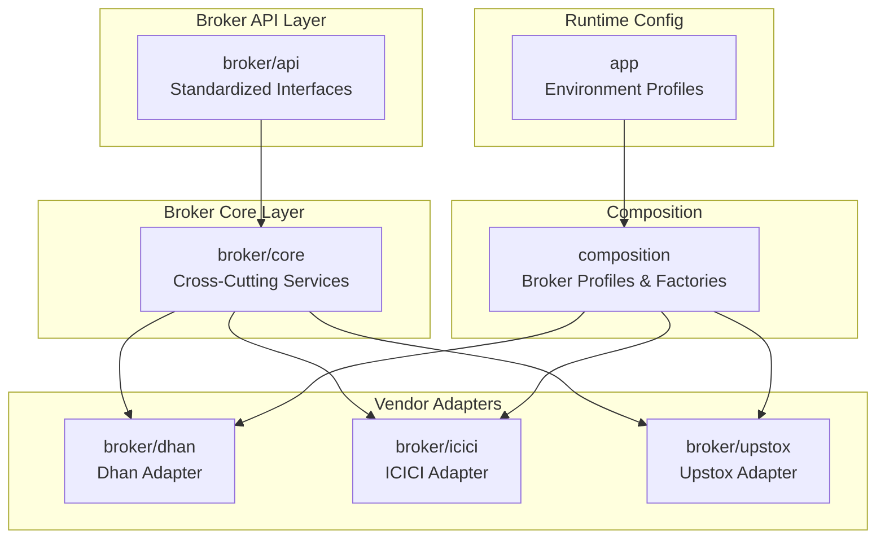
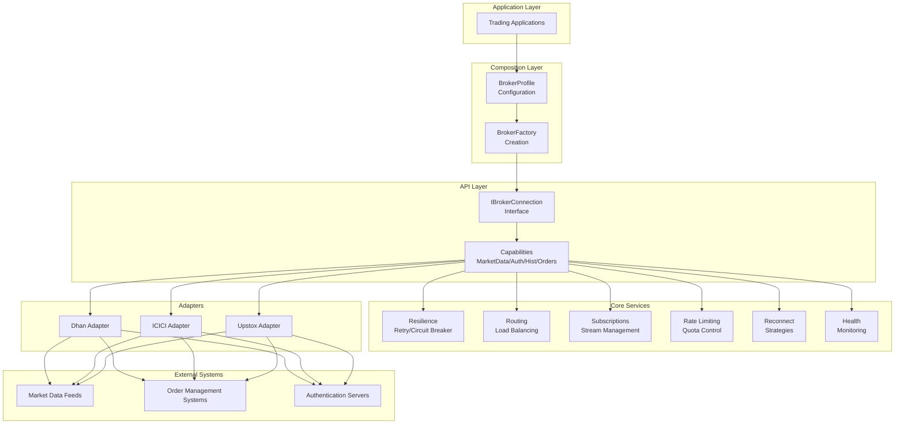
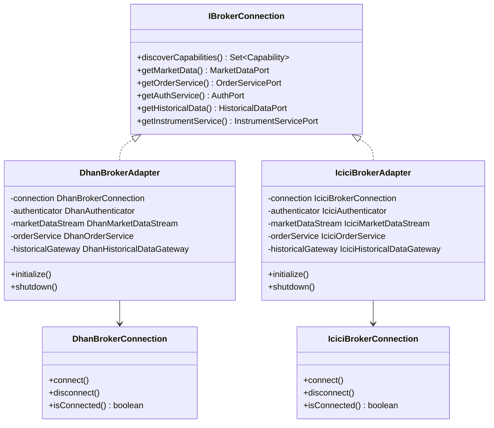
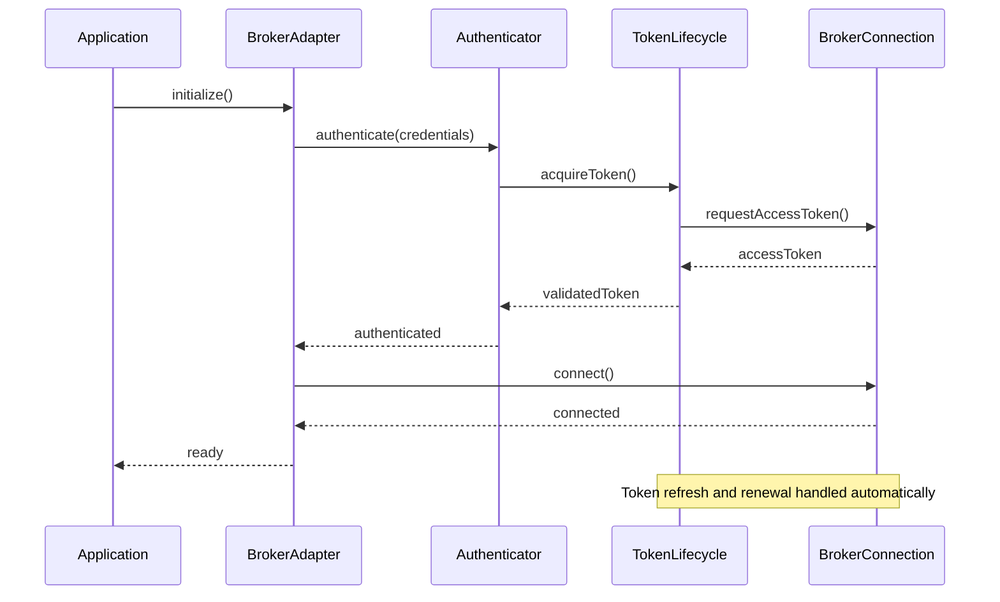
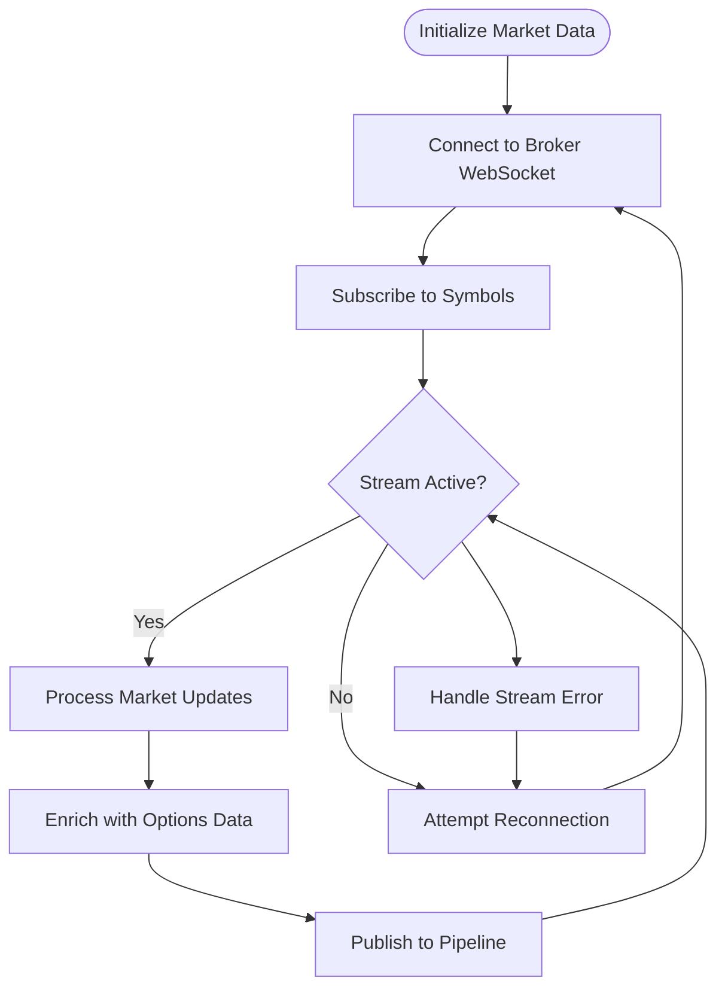
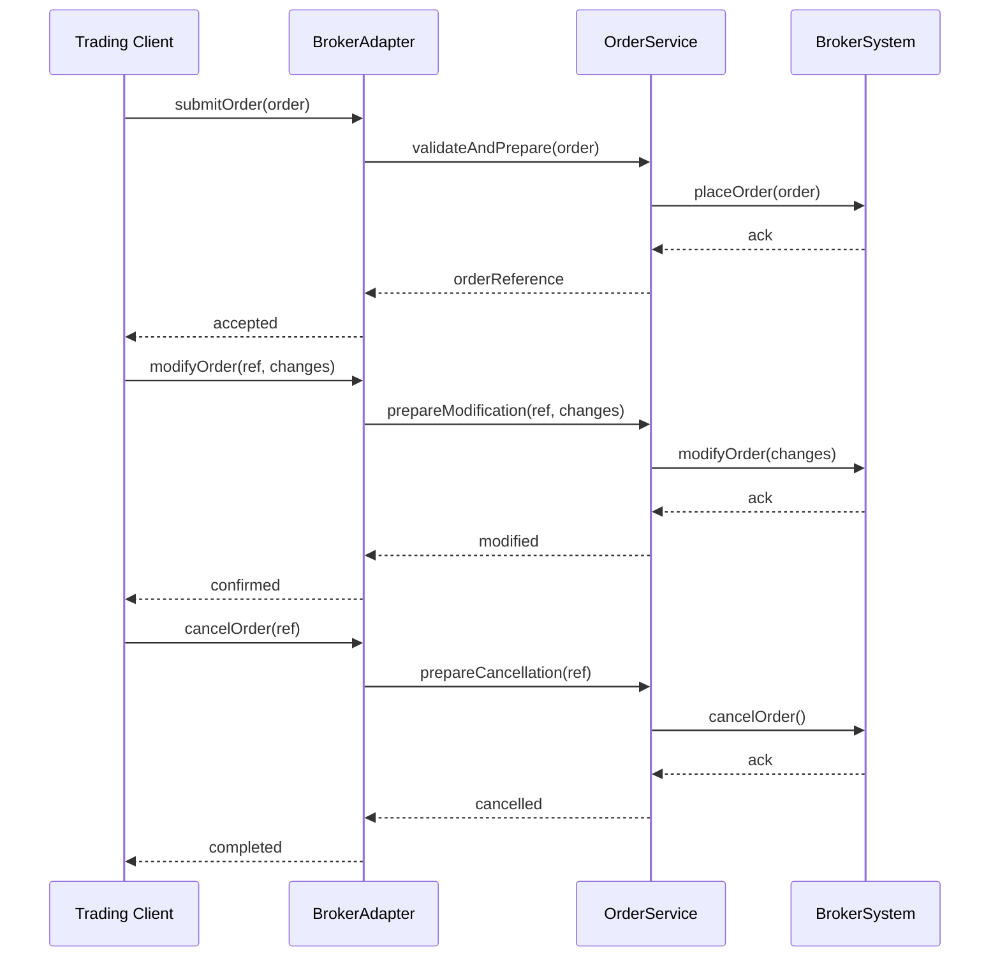
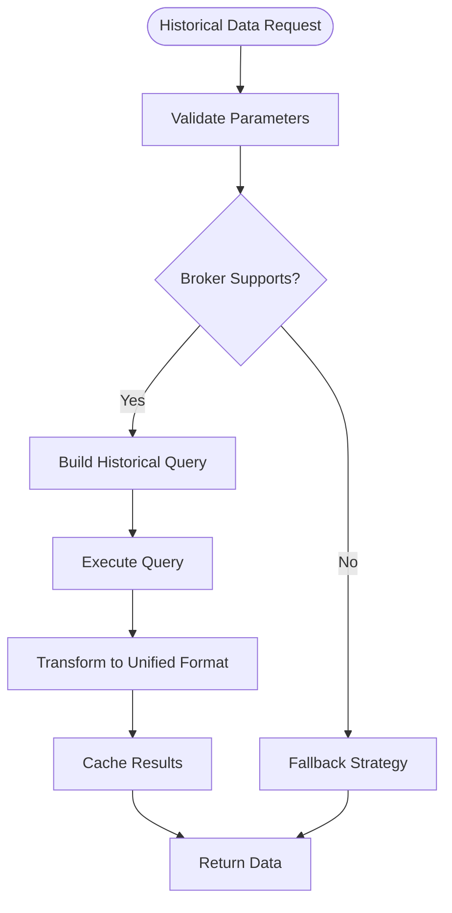
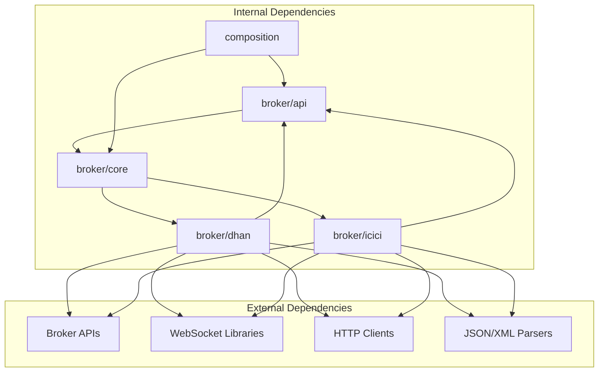

# Broker Integration System

<cite>
**Referenced Files in This Document**
- [IBrokerConnection.java](file://broker/api/src/main/java/com/tradej/broker/api/IBrokerConnection.java)
- [BrokerProfile.java](file://composition/src/main/java/com/tradej/composition/config/BrokerProfile.java)
- [DhanBrokerConnection.java](file://broker/dhan/src/main/java/com/tradej/broker/dhan/DhanBrokerConnection.java)
- [IciciBrokerConnection.java](file://broker/icici/src/main/java/com/tradej/broker/icici/IciciBrokerConnection.java)
- [application.yml](file://app/src/main/resources/application.yml)
- [application-dhan-prod.yml](file://app/src/main/resources/application-dhan-prod.yml)
- [application-icici-prod.yml](file://app/src/main/resources/application-icici-prod.yml)
- [application-upstox-prod.yml](file://app/src/main/resources/application-upstox-prod.yml)
- [BrokerComposition.java](file://composition/src/main/java/com/tradej/composition/BrokerComposition.java)
- [UpstoxBrokerFactory.java](file://composition/src/main/java/com/tradej/composition/UpstoxBrokerFactory.java)
- [DhanBrokerAdapter.java](file://broker/dhan/src/main/java/com/tradej/broker/dhan/adapter/DhanBrokerAdapter.java)
- [IciciBrokerAdapter.java](file://broker/icici/src/main/java/com/tradej/broker/icici/adapter/IciciBrokerAdapter.java)
- [DhanAuthenticator.java](file://broker/dhan/src/main/java/com/tradej/broker/dhan/auth/DhanAuthenticator.java)
- [IciciAuthenticator.java](file://broker/icici/src/main/java/com/tradej/broker/icici/auth/IciciAuthenticator.java)
- [DhanHistoricalDataGateway.java](file://broker/dhan/src/main/java/com/tradej/broker/dhan/historical/DhanHistoricalDataGateway.java)
- [IciciHistoricalDataGateway.java](file://broker/icici/src/main/java/com/tradej/broker/icici/historical/IciciHistoricalDataGateway.java)
- [DhanMarketDataStream.java](file://broker/dhan/src/main/java/com/tradej/broker/dhan/websocket/DhanMarketDataStream.java)
- [IciciMarketDataStream.java](file://broker/icici/src/main/java/com/tradej/broker/icici/websocket/IciciMarketDataStream.java)
- [DhanOrderService.java](file://broker/dhan/src/main/java/com/tradej/broker/dhan/orders/DhanOrderService.java)
- [IciciOrderService.java](file://broker/icici/src/main/java/com/tradej/broker/icici/rest/IciciOrderService.java)
- [DhanInstrumentService.java](file://broker/dhan/src/main/java/com/tradej/broker/dhan/instrument/DhanInstrumentService.java)
- [IciciInstrumentService.java](file://broker/icici/src/main/java/com/tradej/broker/icici/instrument/IciciInstrumentService.java)
- [DhanOptionsService.java](file://broker/dhan/src/main/java/com/tradej/broker/dhan/options/DhanOptionsService.java)
- [IciciOptionsService.java](file://broker/icici/src/main/java/com/tradej/broker/icici/options/IciciOptionsService.java)
- [DhanResilienceConfig.java](file://broker/dhan/src/main/java/com/tradej/broker/dhan/resilience/DhanResilienceConfig.java)
- [IciciResilienceConfig.java](file://broker/icici/src/main/java/com/tradej/broker/icici/resilience/IciciResilienceConfig.java)
- [DhanRateLimitingService.java](file://broker/dhan/src/main/java/com/tradej/broker/dhan/rate/DhanRateLimitingService.java)
- [IciciRateLimitingService.java](file://broker/icici/src/main/java/com/tradej/broker/icici/rate/IciciRateLimitingService.java)
- [DhanStartupValidator.java](file://broker/dhan/src/main/java/com/tradej/broker/dhan/startup/DhanStartupValidator.java)
- [IciciStartupValidator.java](file://broker/icici/src/main/java/com/tradej/broker/icici/startup/IciciStartupValidator.java)
- [DhanSubscriptionManager.java](file://broker/dhan/src/main/java/com/tradej/broker/dhan/subscription/DhanSubscriptionManager.java)
- [IciciSubscriptionManager.java](file://broker/icici/src/main/java/com/tradej/broker/icici/subscription/IciciSubscriptionManager.java)
- [DhanReconnectStrategy.java](file://broker/dhan/src/main/java/com/tradej/broker/dhan/reconnect/DhanReconnectStrategy.java)
- [IciciReconnectStrategy.java](file://broker/icici/src/main/java/com/tradej/broker/icici/reconnect/IciciReconnectStrategy.java)
- [DhanTokenLifecycle.java](file://broker/dhan/src/main/java/com/tradej/broker/dhan/auth/DhanTokenLifecycle.java)
- [IciciTokenLifecycle.java](file://broker/icici/src/main/java/com/tradej/broker/icici/auth/IciciTokenLifecycle.java)
- [DhanHealthIndicator.java](file://broker/dhan/src/main/java/com/tradej/broker/dhan/health/DhanHealthIndicator.java)
- [IciciHealthIndicator.java](file://broker/icici/src/main/java/com/tradej/broker/icici/health/IciciHealthIndicator.java)
- [DhanGatewayBenchmark.java](file://broker/core/src/jmh/java/com/tradej/broker/core/benchmark/DhanGatewayBenchmark.java)
- [IciciGatewayBenchmark.java](file://broker/core/src/jmh/java/com/tradej/broker/core/benchmark/IciciGatewayBenchmark.java)
</cite>

## Table of Contents
1. [Introduction](#introduction)
2. [Project Structure](#project-structure)
3. [Core Components](#core-components)
4. [Architecture Overview](#architecture-overview)
5. [Detailed Component Analysis](#detailed-component-analysis)
6. [Dependency Analysis](#dependency-analysis)
7. [Performance Considerations](#performance-considerations)
8. [Troubleshooting Guide](#troubleshooting-guide)
9. [Conclusion](#conclusion)

## Introduction
This document describes the multi-broker integration system that enables unified access to multiple Indian derivatives brokers (Dhan, ICICI, Upstox) through a standardized adapter pattern. The system provides consistent interfaces for market data streaming, order management, authentication, and historical data access while supporting dynamic broker selection and capability discovery. It also documents the broker profile configuration system and service composition architecture that ensures maintainability and extensibility across different broker implementations.

## Project Structure
The broker integration system is organized into layered modules:
- broker/api: Defines standardized interfaces and models for broker interactions
- broker/core: Implements shared cross-cutting concerns (resilience, routing, subscriptions, health)
- broker/{dhan,icici,upstox}: Contains vendor-specific adapters and services
- composition: Provides broker profile configuration and composition factories
- app: Contains runtime configuration profiles for each broker

**Diagram sources**
- [IBrokerConnection.java:1-200](file://broker/api/src/main/java/com/tradej/broker/api/IBrokerConnection.java#L1-L200)
- [BrokerComposition.java:1-200](file://composition/src/main/java/com/tradej/composition/BrokerComposition.java#L1-L200)
- [BrokerProfile.java:1-200](file://composition/src/main/java/com/tradej/composition/config/BrokerProfile.java#L1-L200)

**Section sources**
- [IBrokerConnection.java:1-200](file://broker/api/src/main/java/com/tradej/broker/api/IBrokerConnection.java#L1-L200)
- [BrokerProfile.java:1-200](file://composition/src/main/java/com/tradej/composition/config/BrokerProfile.java#L1-L200)

## Core Components
The system centers around a broker adapter pattern with standardized interfaces:

### Standardized Interfaces
- IBrokerConnection: Defines the primary contract for broker connectivity, enabling capability discovery and service orchestration
- Capability interfaces: Separate ports for market data, order management, authentication, historical data, and instruments
- Model abstractions: Unified DTOs for orders, quotes, positions, and instruments across brokers

### Cross-Cutting Services
- Resilience: Retry policies, circuit breakers, and backoff strategies
- Routing: Dynamic load balancing and failover mechanisms
- Subscriptions: Stream lifecycle management and recovery
- Health monitoring: Per-broker health indicators and alerts
- Rate limiting: Quota enforcement and throttling
- Reconnection: Graceful reconnection strategies

### Vendor-Specific Adapters
- Dhan adapter: WebSocket-based market data, REST-based order management, token lifecycle, and comprehensive option chain support
- ICICI adapter: REST-based order management, WebSocket market data, session lifecycle, and instrument services
- Upstox adapter: Protocol buffer-based communication and specialized streaming

**Section sources**
- [IBrokerConnection.java:1-200](file://broker/api/src/main/java/com/tradej/broker/api/IBrokerConnection.java#L1-L200)
- [DhanBrokerAdapter.java:1-200](file://broker/dhan/src/main/java/com/tradej/broker/dhan/adapter/DhanBrokerAdapter.java#L1-L200)
- [IciciBrokerAdapter.java:1-200](file://broker/icici/src/main/java/com/tradej/broker/icici/adapter/IciciBrokerAdapter.java#L1-L200)

## Architecture Overview
The system follows a layered architecture with clear separation of concerns:

**Diagram sources**
- [BrokerComposition.java:1-200](file://composition/src/main/java/com/tradej/composition/BrokerComposition.java#L1-L200)
- [UpstoxBrokerFactory.java:1-200](file://composition/src/main/java/com/tradej/composition/UpstoxBrokerFactory.java#L1-L200)
- [IBrokerConnection.java:1-200](file://broker/api/src/main/java/com/tradej/broker/api/IBrokerConnection.java#L1-L200)

## Detailed Component Analysis

### Broker Adapter Pattern
The adapter pattern encapsulates vendor-specific implementations behind standardized interfaces:

**Diagram sources**
- [IBrokerConnection.java:1-200](file://broker/api/src/main/java/com/tradej/broker/api/IBrokerConnection.java#L1-L200)
- [DhanBrokerAdapter.java:1-200](file://broker/dhan/src/main/java/com/tradej/broker/dhan/adapter/DhanBrokerAdapter.java#L1-L200)
- [IciciBrokerAdapter.java:1-200](file://broker/icici/src/main/java/com/tradej/broker/icici/adapter/IciciBrokerAdapter.java#L1-L200)
- [DhanBrokerConnection.java:1-200](file://broker/dhan/src/main/java/com/tradej/broker/dhan/DhanBrokerConnection.java#L1-L200)
- [IciciBrokerConnection.java:1-200](file://broker/icici/src/main/java/com/tradej/broker/icici/IciciBrokerConnection.java#L1-L200)

### Authentication Flow
Both adapters implement robust authentication with token lifecycle management:

**Diagram sources**
- [DhanAuthenticator.java:1-200](file://broker/dhan/src/main/java/com/tradej/broker/dhan/auth/DhanAuthenticator.java#L1-L200)
- [IciciAuthenticator.java:1-200](file://broker/icici/src/main/java/com/tradej/broker/icici/auth/IciciAuthenticator.java#L1-L200)
- [DhanTokenLifecycle.java:1-200](file://broker/dhan/src/main/java/com/tradej/broker/dhan/auth/DhanTokenLifecycle.java#L1-L200)
- [IciciTokenLifecycle.java:1-200](file://broker/icici/src/main/java/com/tradej/broker/icici/auth/IciciTokenLifecycle.java#L1-L200)

### Market Data Streaming
Market data streaming is implemented via WebSocket connections with subscription management:

**Diagram sources**
- [DhanMarketDataStream.java:1-200](file://broker/dhan/src/main/java/com/tradej/broker/dhan/websocket/DhanMarketDataStream.java#L1-L200)
- [IciciMarketDataStream.java:1-200](file://broker/icici/src/main/java/com/tradej/broker/icici/websocket/IciciMarketDataStream.java#L1-L200)
- [DhanSubscriptionManager.java:1-200](file://broker/dhan/src/main/java/com/tradej/broker/dhan/subscription/DhanSubscriptionManager.java#L1-L200)
- [IciciSubscriptionManager.java:1-200](file://broker/icici/src/main/java/com/tradej/broker/icici/subscription/IciciSubscriptionManager.java#L1-L200)

### Order Management Lifecycle
Order management follows a standardized lifecycle across brokers:

**Diagram sources**
- [DhanOrderService.java:1-200](file://broker/dhan/src/main/java/com/tradej/broker/dhan/orders/DhanOrderService.java#L1-L200)
- [IciciOrderService.java:1-200](file://broker/icici/src/main/java/com/tradej/broker/icici/rest/IciciOrderService.java#L1-L200)

### Historical Data Access
Historical data retrieval is standardized with vendor-specific implementations:

**Diagram sources**
- [DhanHistoricalDataGateway.java:1-200](file://broker/dhan/src/main/java/com/tradej/broker/dhan/historical/DhanHistoricalDataGateway.java#L1-L200)
- [IciciHistoricalDataGateway.java:1-200](file://broker/icici/src/main/java/com/tradej/broker/icici/historical/IciciHistoricalDataGateway.java#L1-L200)

## Dependency Analysis
The system exhibits loose coupling through standardized interfaces and strong cohesion within vendor adapters:

**Diagram sources**
- [IBrokerConnection.java:1-200](file://broker/api/src/main/java/com/tradej/broker/api/IBrokerConnection.java#L1-L200)
- [BrokerComposition.java:1-200](file://composition/src/main/java/com/tradej/composition/BrokerComposition.java#L1-L200)

**Section sources**
- [IBrokerConnection.java:1-200](file://broker/api/src/main/java/com/tradej/broker/api/IBrokerConnection.java#L1-L200)
- [BrokerComposition.java:1-200](file://composition/src/main/java/com/tradej/composition/BrokerComposition.java#L1-L200)

## Performance Considerations
The system incorporates several performance optimization strategies:

### Benchmarking and Measurement
- Dedicated microbenchmark suites for gateway performance evaluation
- Throughput measurements for market data streams and order processing
- Latency profiling for authentication and connection establishment

### Scalability Patterns
- Connection pooling and reuse across multiple symbols
- Asynchronous processing for non-blocking operations
- Efficient serialization/deserialization for high-frequency data
- Memory-efficient streaming for large historical datasets

### Resource Management
- Automatic cleanup of unused connections and subscriptions
- Configurable buffer sizes for market data streams
- Adaptive rate limiting based on broker capacity
- Circuit breaker protection against downstream failures

**Section sources**
- [DhanGatewayBenchmark.java:1-200](file://broker/core/src/jmh/java/com/tradej/broker/core/benchmark/DhanGatewayBenchmark.java#L1-L200)
- [IciciGatewayBenchmark.java:1-200](file://broker/core/src/jmh/java/com/tradej/broker/core/benchmark/IciciGatewayBenchmark.java#L1-L200)

## Troubleshooting Guide
Common issues and their resolution strategies:

### Connection Issues
- Verify broker credentials and token validity
- Check network connectivity and firewall settings
- Monitor connection retry attempts and backoff intervals
- Review broker-specific connection timeouts and keepalive settings

### Authentication Failures
- Validate API keys and secrets
- Check token expiration and renewal mechanisms
- Review authentication endpoint availability
- Confirm proper credential encoding and transmission

### Market Data Problems
- Verify symbol resolution and exchange mappings
- Check subscription status and reconnection logic
- Monitor stream quality and latency metrics
- Review data transformation and enrichment processes

### Order Management Errors
- Validate order parameter formats and constraints
- Check order state transitions and acknowledgments
- Monitor order book synchronization
- Review cancellation and modification workflows

### Performance Degradation
- Analyze throughput and latency metrics
- Review rate limiting configurations
- Check resource utilization and garbage collection
- Validate caching effectiveness and cache invalidation

**Section sources**
- [DhanReconnectStrategy.java:1-200](file://broker/dhan/src/main/java/com/tradej/broker/dhan/reconnect/DhanReconnectStrategy.java#L1-L200)
- [IciciReconnectStrategy.java:1-200](file://broker/icici/src/main/java/com/tradej/broker/icici/reconnect/IciciReconnectStrategy.java#L1-L200)
- [DhanHealthIndicator.java:1-200](file://broker/dhan/src/main/java/com/tradej/broker/dhan/health/DhanHealthIndicator.java#L1-L200)
- [IciciHealthIndicator.java:1-200](file://broker/icici/src/main/java/com/tradej/broker/icici/health/IciciHealthIndicator.java#L1-L200)

## Conclusion
The multi-broker integration system successfully implements a scalable, maintainable architecture for connecting to multiple broker platforms through a standardized adapter pattern. The system provides consistent capabilities across market data streaming, order management, authentication, and historical data access while supporting dynamic broker selection and capability discovery. The modular design enables easy extension to new brokers and ensures operational reliability through comprehensive resilience, monitoring, and performance optimization features.