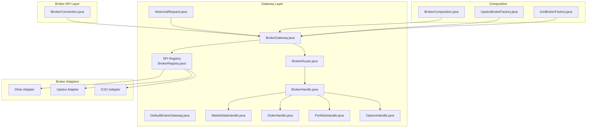
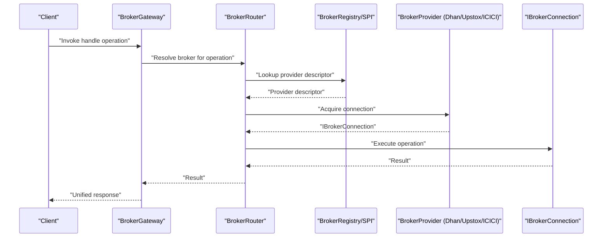
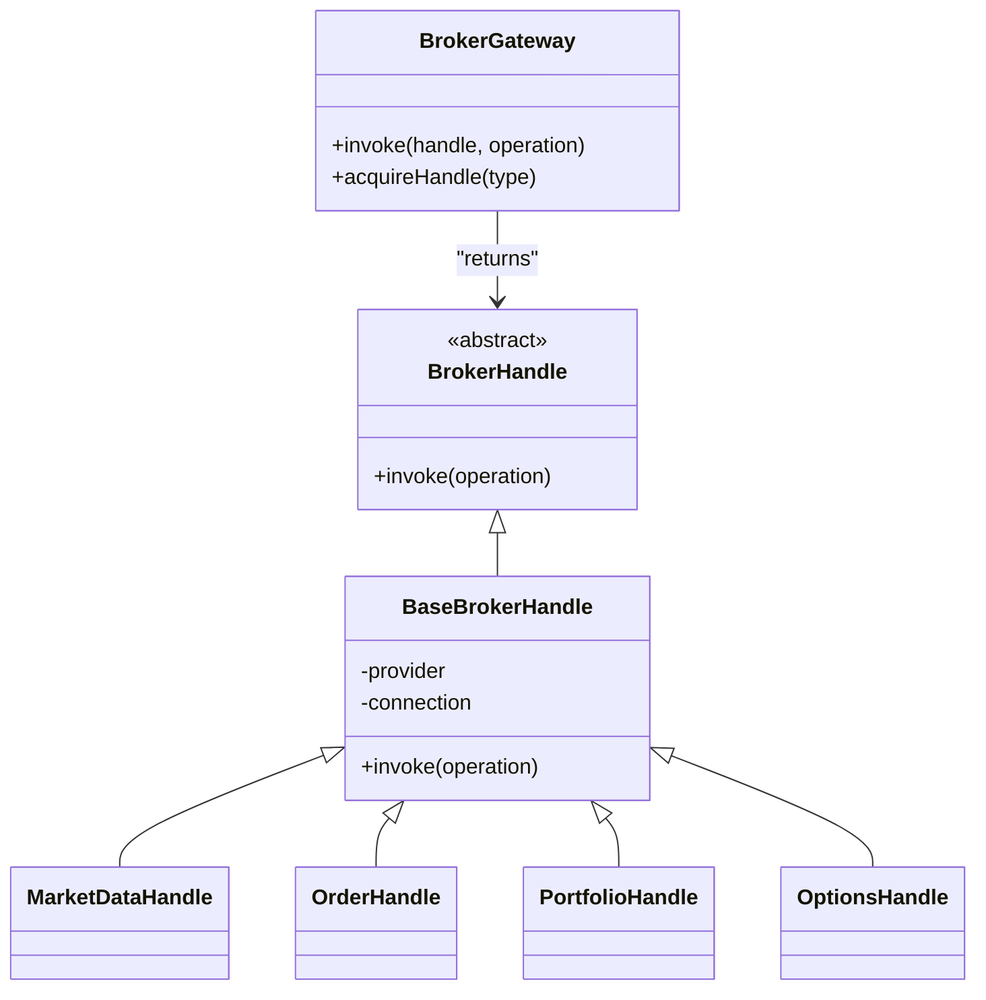
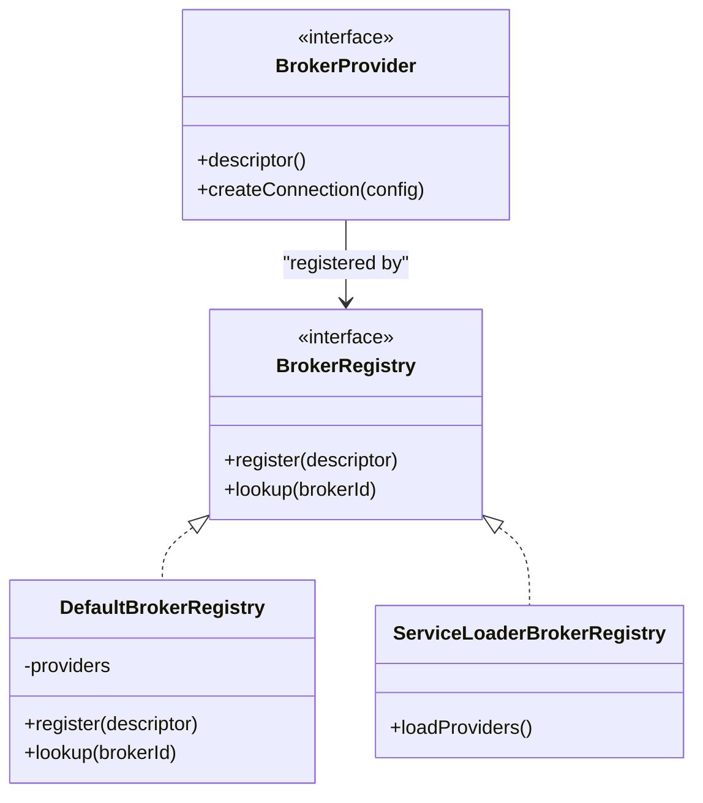
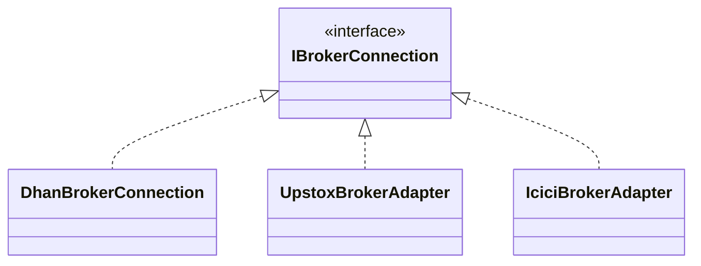
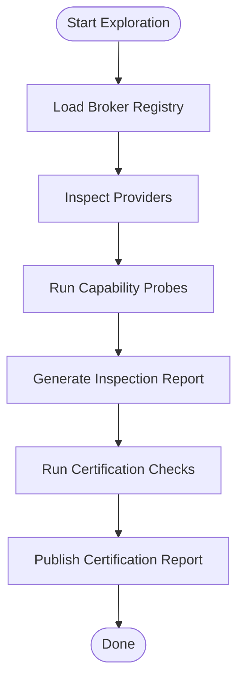
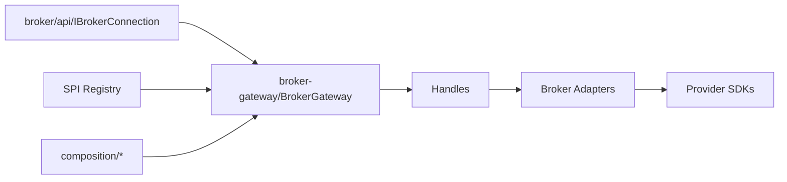

# Broker Integration System

<cite>
**Referenced Files in This Document**
- [IBrokerConnection.java](file://broker/api/src/main/java/com/tradej/broker/api/IBrokerConnection.java)
- [BrokerGateway.java](file://broker-gateway/src/main/java/com/tradej/brokergateway/BrokerGateway.java)
- [DefaultBrokerGateway.java](file://broker-gateway/src/main/java/com/tradej/brokergateway/DefaultBrokerGateway.java)
- [BrokerHandle.java](file://broker-gateway/src/main/java/com/tradej/brokergateway/BrokerHandle.java)
- [BaseBrokerHandle.java](file://broker-gateway/src/main/java/com/tradej/brokergateway/BaseBrokerHandle.java)
- [BrokerRouter.java](file://broker-gateway/src/main/java/com/tradej/brokergateway/BrokerRouter.java)
- [MarketDataHandle.java](file://broker-gateway/src/main/java/com/tradej/brokergateway/MarketDataHandle.java)
- [OrderHandle.java](file://broker-gateway/src/main/java/com/tradej/brokergateway/OrderHandle.java)
- [PortfolioHandle.java](file://broker-gateway/src/main/java/com/tradej/brokergateway/PortfolioHandle.java)
- [OptionsHandle.java](file://broker-gateway/src/main/java/com/tradej/brokergateway/OptionsHandle.java)
- [HistoricalRequest.java](file://broker-gateway/src/main/java/com/tradej/brokergateway/HistoricalRequest.java)
- [BrokerRegistry.java](file://broker-gateway/src/main/java/com/tradej/brokergateway/spi/BrokerRegistry.java)
- [DefaultBrokerRegistry.java](file://broker-gateway/src/main/java/com/tradej/brokergateway/spi/DefaultBrokerRegistry.java)
- [ServiceLoaderBrokerRegistry.java](file://broker-gateway/src/main/java/com/tradej/brokergateway/spi/ServiceLoaderBrokerRegistry.java)
- [BrokerProvider.java](file://broker-gateway/src/main/java/com/tradej/brokergateway/spi/BrokerProvider.java)
- [DhanBrokerProvider.java](file://broker-gateway/src/main/java/com/tradej/brokergateway/spi/impl/DhanBrokerProvider.java)
- [IciciBrokerProvider.java](file://broker-gateway/src/main/java/com/tradej/brokergateway/spi/impl/IciciBrokerProvider.java)
- [UpstoxBrokerProvider.java](file://broker-gateway/src/main/java/com/tradej/brokergateway/spi/impl/UpstoxBrokerProvider.java)
- [BrokerExplorer.java](file://broker-gateway/src/main/java/com/tradej/brokergateway/explorer/BrokerExplorer.java)
- [DefaultBrokerInspector.java](file://broker-gateway/src/main/java/com/tradej/brokergateway/explorer/DefaultBrokerInspector.java)
- [CapabilityProbe.java](file://broker-gateway/src/main/java/com/tradej/brokergateway/explorer/CapabilityProbe.java)
- [BrokerCertification.java](file://broker-gateway/src/main/java/com/tradej/brokergateway/certification/BrokerCertification.java)
- [CertificationReport.java](file://broker-gateway/src/main/java/com/tradej/brokergateway/certification/CertificationReport.java)
- [application.yml](file://app/src/main/resources/application.yml)
- [application-dev.yml](file://app/src/main/resources/application-dev.yml)
- [application-prod.yml](file://app/src/main/resources/application-prod.yml)
- [application-gateway.yml](file://app/src/main/resources/application-gateway.yml)
- [application-upstox-dev.yml](file://app/src/main/resources/application-upstox-dev.yml)
- [application-upstox-prod.yml](file://app/src/main/resources/application-upstox-prod.yml)
- [application-icici-prod.yml](file://app/src/main/resources/application-icici-prod.yml)
- [dhan-local.properties.example](file://config/dhan-local.properties.example)
- [icici-local.properties.example](file://config/icici-local.properties.example)
- [upstox-live.properties.example](file://config/upstox-live.properties.example)
- [upstox-sandbox.properties.example](file://config/upstox-sandbox.properties.example)
- [BrokerComposition.java](file://composition/src/main/java/com/tradej/composition/BrokerComposition.java)
- [IciciBrokerFactory.java](file://composition/src/main/java/com/tradej/composition/IciciBrokerFactory.java)
- [UpstoxBrokerFactory.java](file://composition/src/main/java/com/tradej/composition/UpstoxBrokerFactory.java)
- [BrokerStartupOrchestratorAnalyticsTest.java](file://app/src/test/java/com/tradej/app/startup/BrokerStartupOrchestratorAnalyticsTest.java)
- [BrokerStartupValidatorTest.java](file://app/src/test/java/com/tradej/app/startup/BrokerStartupValidatorTest.java)
- [DhanTokenLifecycleIntegrationTest.java](file://app/src/test/java/com/tradej/app/integration/DhanTokenLifecycleIntegrationTest.java)
- [IciciTokenLifecycleIntegrationTest.java](file://app/src/test/java/com/tradej/app/integration/IciciTokenLifecycleIntegrationTest.java)
- [UpstoxMarketFeedIntegrationTest.java](file://app/src/test/java/com/tradej/app/integration/UpstoxMarketFeedIntegrationTest.java)
- [BrokerGatewayTest.java](file://broker-gateway/src/test/java/com/tradej/brokergateway/BrokerGatewayTest.java)
- [BrokerExplorerTest.java](file://broker-gateway/src/test/java/com/tradej/brokergateway/BrokerExplorerTest.java)
- [BrokerHandleTest.java](file://broker-gateway/src/test/java/com/tradej/brokergateway/BrokerHandleTest.java)
- [BrokerHandleInvokeTest.java](file://broker-gateway/src/test/java/com/tradej/brokergateway/BrokerHandleInvokeTest.java)
- [BrokerHandleAdvancedTest.java](file://broker-gateway/src/test/java/com/tradej/brokergateway/BrokerHandleAdvancedTest.java)
- [BrokerCertificationTest.java](file://broker-gateway/src/test/java/com/tradej/brokergateway/BrokerCertificationTest.java)
- [DhanBrokerProviderTest.java](file://broker-gateway/src/test/java/com/tradej/brokergateway/spi/impl/DhanBrokerProviderTest.java)
- [IciciBrokerProviderTest.java](file://broker-gateway/src/test/java/com/tradej/brokergateway/spi/impl/IciciBrokerProviderTest.java)
- [UpstoxBrokerProviderTest.java](file://broker-gateway/src/test/java/com/tradej/brokergateway/spi/impl/UpstoxBrokerProviderTest.java)
- [BrokerPluginRegistryTest.java](file://broker-gateway/src/test/java/com/tradej/brokergateway/spi/BrokerPluginRegistryTest.java)
- [BrokerPluginRegistryConcurrencyTest.java](file://broker-gateway/src/test/java/com/tradej/brokergateway/spi/BrokerPluginRegistryConcurrencyTest.java)
- [BrokerRegistryTest.java](file://broker-gateway/src/test/java/com/tradej/brokergateway/spi/BrokerRegistryTest.java)
- [DuckDbQueryEngineTest.java](file://broker-gateway/src/test/java/com/tradej/brokergateway/query/DuckDbQueryEngineTest.java)
- [DuckDbQueryEngineTransactionalTest.java](file://broker-gateway/src/test/java/com/tradej/brokergateway/query/DuckDbQueryEngineTransactionalTest.java)
- [QueryMetricsTest.java](file://broker-gateway/src/test/java/com/tradej/brokergateway/query/QueryMetricsTest.java)
- [BrokerGatewayLiveConnectionTest.java](file://app/src/test/java/com/tradej/app/integration/BrokerGatewayLiveConnectionTest.java)
- [GatewayWebSocketLifecycleTest.java](file://app/src/test/java/com/tradej/app/integration/GatewayWebSocketLifecycleTest.java)
- [GatewayReplaySmokeTest.java](file://app/src/test/java/com/tradej/app/integration/GatewayReplaySmokeTest.java)
- [GatewayCheckSpeedLiveTest.java](file://app/src/test/java/com/tradej/app/integration/GatewayCheckSpeedLiveTest.java)
- [BrokerExplorerBenchmark.java](file://broker/core/src/jmh/java/com/tradej/broker/core/benchmark/BrokerExplorerBenchmark.java)
- [LoadBalancedGatewayBenchmark.java](file://broker/core/src/jmh/java/com/tradej/broker/core/benchmark/LoadBalancedGatewayBenchmark.java)
- [TokenLifecycleBenchmark.java](file://broker/core/src/jmh/java/com/tradej/broker/core/benchmark/TokenLifecycleBenchmark.java)
- [SubscriptionLookupBenchmark.java](file://broker/core/src/jmh/java/com/tradej/broker/core/benchmark/SubscriptionLookupBenchmark.java)
- [CircuitBreakerBenchmark.java](file://broker/core/src/jmh/java/com/tradej/broker/core/benchmark/CircuitBreakerBenchmark.java)
- [BROKER_GATEWAY_ARCHITECTURE_REVIEW.md](file://docs/reports/BROKER_GATEWAY_ARCHITECTURE_REVIEW_2026-06-06.md)
- [BROKER_CAPABILITY_MATRIX.md](file://docs/BROKER_CAPABILITY_MATRIX.md)
- [BROKER_CERTIFICATION_REPORT.md](file://docs/BROKER_CERTIFICATION_REPORT.md)
- [UPSTOX_API_GAP_ANALYSIS.md](file://docs/UPSTOX_API_GAP_ANALYSIS.md)
- [TRADEJ_INSTITUTIONAL_ARCHITECTURE.md](file://docs/TRADEJ_INSTITUTIONAL_ARCHITECTURE.md)
</cite>

## Table of Contents
1. [Introduction](#introduction)
2. [Project Structure](#project-structure)
3. [Core Components](#core-components)
4. [Architecture Overview](#architecture-overview)
5. [Detailed Component Analysis](#detailed-component-analysis)
6. [Dependency Analysis](#dependency-analysis)
7. [Performance Considerations](#performance-considerations)
8. [Troubleshooting Guide](#troubleshooting-guide)
9. [Conclusion](#conclusion)
10. [Appendices](#appendices)

## Introduction
This document describes the broker integration system that enables unified access to multiple brokerage providers (Dhan, Upstox, ICICI Direct) through a common gateway. It explains the broker gateway architecture, dynamic broker registration via SPI, and unified access patterns. It documents the adapter pattern implementation for each broker, handle management, connection lifecycle, capability discovery, configuration, authentication mechanisms, error handling strategies, practical integration examples, custom broker development guidelines, and troubleshooting common issues.

## Project Structure
The broker integration spans several modules:
- broker/api: Defines the broker-agnostic API contract (connection interface and shared models).
- broker/core: Implements core gateway logic, resilience, routing, subscriptions, and utilities.
- broker-gateway: Provides the gateway orchestration, handles, SPI registry, explorer, and certification.
- broker/{dhan, icici, upstox}: Broker-specific adapters implementing provider-specific protocols.
- composition: Composes runtime wiring for brokers and profiles.
- app: Application configuration and integration tests.
- docs: Architectural and capability documentation.

**Diagram sources**
- [BrokerGateway.java:1-200](file://broker-gateway/src/main/java/com/tradej/brokergateway/BrokerGateway.java#L1-L200)
- [DefaultBrokerGateway.java:1-200](file://broker-gateway/src/main/java/com/tradej/brokergateway/DefaultBrokerGateway.java#L1-L200)
- [BrokerRouter.java:1-200](file://broker-gateway/src/main/java/com/tradej/brokergateway/BrokerRouter.java#L1-L200)
- [BrokerHandle.java:1-200](file://broker-gateway/src/main/java/com/tradej/brokergateway/BrokerHandle.java#L1-L200)
- [MarketDataHandle.java:1-200](file://broker-gateway/src/main/java/com/tradej/brokergateway/MarketDataHandle.java#L1-L200)
- [OrderHandle.java:1-200](file://broker-gateway/src/main/java/com/tradej/brokergateway/OrderHandle.java#L1-L200)
- [PortfolioHandle.java:1-200](file://broker-gateway/src/main/java/com/tradej/brokergateway/PortfolioHandle.java#L1-L200)
- [OptionsHandle.java:1-200](file://broker-gateway/src/main/java/com/tradej/brokergateway/OptionsHandle.java#L1-L200)
- [BrokerRegistry.java:1-200](file://broker-gateway/src/main/java/com/tradej/brokergateway/spi/BrokerRegistry.java#L1-L200)
- [BrokerComposition.java:1-200](file://composition/src/main/java/com/tradej/composition/BrokerComposition.java#L1-L200)
- [UpstoxBrokerFactory.java:1-200](file://composition/src/main/java/com/tradej/composition/UpstoxBrokerFactory.java#L1-L200)
- [IciciBrokerFactory.java:1-200](file://composition/src/main/java/com/tradej/composition/IciciBrokerFactory.java#L1-L200)

**Section sources**
- [BrokerGateway.java:1-200](file://broker-gateway/src/main/java/com/tradej/brokergateway/BrokerGateway.java#L1-L200)
- [BrokerRegistry.java:1-200](file://broker-gateway/src/main/java/com/tradej/brokergateway/spi/BrokerRegistry.java#L1-L200)
- [BrokerComposition.java:1-200](file://composition/src/main/java/com/tradej/composition/BrokerComposition.java#L1-L200)

## Core Components
- Broker API contract: Defines the connection abstraction and shared models for all brokers.
- Gateway orchestration: Routes requests to appropriate broker handles and manages lifecycle.
- Handle abstractions: Specialized handles for market data, orders, portfolio, and options.
- SPI registry: Dynamically discovers and registers broker providers.
- Explorer and certification: Capability probing and certification reporting.
- Composition: Wiring of broker factories and runtime profiles.

Key implementation references:
- [IBrokerConnection.java:1-200](file://broker/api/src/main/java/com/tradej/broker/api/IBrokerConnection.java#L1-L200)
- [BrokerGateway.java:1-200](file://broker-gateway/src/main/java/com/tradej/brokergateway/BrokerGateway.java#L1-L200)
- [DefaultBrokerGateway.java:1-200](file://broker-gateway/src/main/java/com/tradej/brokergateway/DefaultBrokerGateway.java#L1-L200)
- [BrokerHandle.java:1-200](file://broker-gateway/src/main/java/com/tradej/brokergateway/BrokerHandle.java#L1-L200)
- [BaseBrokerHandle.java:1-200](file://broker-gateway/src/main/java/com/tradej/brokergateway/BaseBrokerHandle.java#L1-L200)
- [BrokerRouter.java:1-200](file://broker-gateway/src/main/java/com/tradej/brokergateway/BrokerRouter.java#L1-L200)
- [MarketDataHandle.java:1-200](file://broker-gateway/src/main/java/com/tradej/brokergateway/MarketDataHandle.java#L1-L200)
- [OrderHandle.java:1-200](file://broker-gateway/src/main/java/com/tradej/brokergateway/OrderHandle.java#L1-L200)
- [PortfolioHandle.java:1-200](file://broker-gateway/src/main/java/com/tradej/brokergateway/PortfolioHandle.java#L1-L200)
- [OptionsHandle.java:1-200](file://broker-gateway/src/main/java/com/tradej/brokergateway/OptionsHandle.java#L1-L200)
- [HistoricalRequest.java:1-200](file://broker-gateway/src/main/java/com/tradej/brokergateway/HistoricalRequest.java#L1-L200)

**Section sources**
- [IBrokerConnection.java:1-200](file://broker/api/src/main/java/com/tradej/broker/api/IBrokerConnection.java#L1-L200)
- [BrokerGateway.java:1-200](file://broker-gateway/src/main/java/com/tradej/brokergateway/BrokerGateway.java#L1-L200)
- [BrokerHandle.java:1-200](file://broker-gateway/src/main/java/com/tradej/brokergateway/BrokerHandle.java#L1-L200)
- [BaseBrokerHandle.java:1-200](file://broker-gateway/src/main/java/com/tradej/brokergateway/BaseBrokerHandle.java#L1-L200)

## Architecture Overview
The gateway exposes unified handles to clients. Internally, it routes calls to the appropriate broker provider via the SPI registry and broker router. Each provider adapter implements the broker API and encapsulates provider-specific protocols, authentication, and capabilities.

**Diagram sources**
- [BrokerGateway.java:1-200](file://broker-gateway/src/main/java/com/tradej/brokergateway/BrokerGateway.java#L1-L200)
- [BrokerRouter.java:1-200](file://broker-gateway/src/main/java/com/tradej/brokergateway/BrokerRouter.java#L1-L200)
- [BrokerRegistry.java:1-200](file://broker-gateway/src/main/java/com/tradej/brokergateway/spi/BrokerRegistry.java#L1-L200)
- [BrokerProvider.java:1-200](file://broker-gateway/src/main/java/com/tradej/brokergateway/spi/BrokerProvider.java#L1-L200)
- [IBrokerConnection.java:1-200](file://broker/api/src/main/java/com/tradej/broker/api/IBrokerConnection.java#L1-L200)

## Detailed Component Analysis

### Broker Gateway and Handles
The gateway orchestrates broker operations and exposes typed handles for market data, orders, portfolio, and options. Each handle encapsulates provider-specific invocation semantics while maintaining a consistent interface.

**Diagram sources**
- [BrokerGateway.java:1-200](file://broker-gateway/src/main/java/com/tradej/brokergateway/BrokerGateway.java#L1-L200)
- [BrokerHandle.java:1-200](file://broker-gateway/src/main/java/com/tradej/brokergateway/BrokerHandle.java#L1-L200)
- [BaseBrokerHandle.java:1-200](file://broker-gateway/src/main/java/com/tradej/brokergateway/BaseBrokerHandle.java#L1-L200)
- [MarketDataHandle.java:1-200](file://broker-gateway/src/main/java/com/tradej/brokergateway/MarketDataHandle.java#L1-L200)
- [OrderHandle.java:1-200](file://broker-gateway/src/main/java/com/tradej/brokergateway/OrderHandle.java#L1-L200)
- [PortfolioHandle.java:1-200](file://broker-gateway/src/main/java/com/tradej/brokergateway/PortfolioHandle.java#L1-L200)
- [OptionsHandle.java:1-200](file://broker-gateway/src/main/java/com/tradej/brokergateway/OptionsHandle.java#L1-L200)

**Section sources**
- [BrokerGateway.java:1-200](file://broker-gateway/src/main/java/com/tradej/brokergateway/BrokerGateway.java#L1-L200)
- [BrokerHandle.java:1-200](file://broker-gateway/src/main/java/com/tradej/brokergateway/BrokerHandle.java#L1-L200)
- [BaseBrokerHandle.java:1-200](file://broker-gateway/src/main/java/com/tradej/brokergateway/BaseBrokerHandle.java#L1-L200)

### SPI and Dynamic Registration
The system uses a Service Provider Interface to dynamically register broker providers. The registry supports both default and service-loader-based discovery.

**Diagram sources**
- [BrokerRegistry.java:1-200](file://broker-gateway/src/main/java/com/tradej/brokergateway/spi/BrokerRegistry.java#L1-L200)
- [DefaultBrokerRegistry.java:1-200](file://broker-gateway/src/main/java/com/tradej/brokergateway/spi/DefaultBrokerRegistry.java#L1-L200)
- [ServiceLoaderBrokerRegistry.java:1-200](file://broker-gateway/src/main/java/com/tradej/brokergateway/spi/ServiceLoaderBrokerRegistry.java#L1-L200)
- [BrokerProvider.java:1-200](file://broker-gateway/src/main/java/com/tradej/brokergateway/spi/BrokerProvider.java#L1-L200)

**Section sources**
- [BrokerRegistry.java:1-200](file://broker-gateway/src/main/java/com/tradej/brokergateway/spi/BrokerRegistry.java#L1-L200)
- [DefaultBrokerRegistry.java:1-200](file://broker-gateway/src/main/java/com/tradej/brokergateway/spi/DefaultBrokerRegistry.java#L1-L200)
- [ServiceLoaderBrokerRegistry.java:1-200](file://broker-gateway/src/main/java/com/tradej/brokergateway/spi/ServiceLoaderBrokerRegistry.java#L1-L200)
- [BrokerProvider.java:1-200](file://broker-gateway/src/main/java/com/tradej/brokergateway/spi/BrokerProvider.java#L1-L200)

### Adapter Pattern Implementation (Dhan, Upstox, ICICI)
Each broker adapter implements the broker API and provides:
- Authentication and token/session lifecycle
- Market data streaming and historical retrieval
- Order placement, modification, cancellation, and query
- Portfolio and holdings management
- Options chain and Greeks
- Resilience and rate limiting
- Startup validation and health checks

**Diagram sources**
- [IBrokerConnection.java:1-200](file://broker/api/src/main/java/com/tradej/broker/api/IBrokerConnection.java#L1-L200)
- [DhanBrokerConnection.java:1-200](file://broker/dhan/src/main/java/com/tradej/broker/dhan/DhanBrokerConnection.java#L1-L200)

**Section sources**
- [IBrokerConnection.java:1-200](file://broker/api/src/main/java/com/tradej/broker/api/IBrokerConnection.java#L1-L200)

### Capability Discovery and Exploration
The explorer inspects registered brokers and probes their capabilities (e.g., websocket, news, kill switch, session risk). Certification compiles capability matrices and reports.

**Diagram sources**
- [BrokerExplorer.java:1-200](file://broker-gateway/src/main/java/com/tradej/brokergateway/explorer/BrokerExplorer.java#L1-L200)
- [DefaultBrokerInspector.java:1-200](file://broker-gateway/src/main/java/com/tradej/brokergateway/explorer/DefaultBrokerInspector.java#L1-L200)
- [CapabilityProbe.java:1-200](file://broker-gateway/src/main/java/com/tradej/brokergateway/explorer/CapabilityProbe.java#L1-L200)
- [BrokerCertification.java:1-200](file://broker-gateway/src/main/java/com/tradej/brokergateway/certification/BrokerCertification.java#L1-L200)
- [CertificationReport.java:1-200](file://broker-gateway/src/main/java/com/tradej/brokergateway/certification/CertificationReport.java#L1-L200)

**Section sources**
- [BrokerExplorer.java:1-200](file://broker-gateway/src/main/java/com/tradej/brokergateway/explorer/BrokerExplorer.java#L1-L200)
- [DefaultBrokerInspector.java:1-200](file://broker-gateway/src/main/java/com/tradej/brokergateway/explorer/DefaultBrokerInspector.java#L1-L200)
- [CapabilityProbe.java:1-200](file://broker-gateway/src/main/java/com/tradej/brokergateway/explorer/CapabilityProbe.java#L1-L200)
- [BrokerCertification.java:1-200](file://broker-gateway/src/main/java/com/tradej/brokergateway/certification/BrokerCertification.java#L1-L200)
- [CertificationReport.java:1-200](file://broker-gateway/src/main/java/com/tradej/brokergateway/certification/CertificationReport.java#L1-L200)

### Connection Lifecycle and Health Management
- Token/session lifecycle: Providers manage authentication tokens and refresh sessions.
- Health checks: Built-in health checks per broker.
- Resilience: Retry, circuit breakers, and backoff strategies.
- Reconnect logic: Automatic reconnection on failures.

References:
- [DhanTokenLifecycleIntegrationTest.java:1-200](file://app/src/test/java/com/tradej/app/integration/DhanTokenLifecycleIntegrationTest.java#L1-L200)
- [IciciTokenLifecycleIntegrationTest.java:1-200](file://app/src/test/java/com/tradej/app/integration/IciciTokenLifecycleIntegrationTest.java#L1-L200)
- [BrokerPluginRegistryTest.java:1-200](file://broker-gateway/src/test/java/com/tradej/brokergateway/spi/BrokerPluginRegistryTest.java#L1-L200)
- [BrokerPluginRegistryConcurrencyTest.java:1-200](file://broker-gateway/src/test/java/com/tradej/brokergateway/spi/BrokerPluginRegistryConcurrencyTest.java#L1-L200)

**Section sources**
- [DhanTokenLifecycleIntegrationTest.java:1-200](file://app/src/test/java/com/tradej/app/integration/DhanTokenLifecycleIntegrationTest.java#L1-L200)
- [IciciTokenLifecycleIntegrationTest.java:1-200](file://app/src/test/java/com/tradej/app/integration/IciciTokenLifecycleIntegrationTest.java#L1-L200)
- [BrokerPluginRegistryTest.java:1-200](file://broker-gateway/src/test/java/com/tradej/brokergateway/spi/BrokerPluginRegistryTest.java#L1-L200)
- [BrokerPluginRegistryConcurrencyTest.java:1-200](file://broker-gateway/src/test/java/com/tradej/brokergateway/spi/BrokerPluginRegistryConcurrencyTest.java#L1-L200)

### Unified Access Patterns
- Market data: LTP, depth, candles, OHLC.
- Orders: Place, modify, cancel, query book/trades.
- Portfolio: Holdings, positions, balances.
- Options: Chain, expiries, Greeks.
- Historical data: Bars and ticks retrieval.

References:
- [MarketDataHandle.java:1-200](file://broker-gateway/src/main/java/com/tradej/brokergateway/MarketDataHandle.java#L1-L200)
- [OrderHandle.java:1-200](file://broker-gateway/src/main/java/com/tradej/brokergateway/OrderHandle.java#L1-L200)
- [PortfolioHandle.java:1-200](file://broker-gateway/src/main/java/com/tradej/brokergateway/PortfolioHandle.java#L1-L200)
- [OptionsHandle.java:1-200](file://broker-gateway/src/main/java/com/tradej/brokergateway/OptionsHandle.java#L1-L200)
- [HistoricalRequest.java:1-200](file://broker-gateway/src/main/java/com/tradej/brokergateway/HistoricalRequest.java#L1-L200)

**Section sources**
- [MarketDataHandle.java:1-200](file://broker-gateway/src/main/java/com/tradej/brokergateway/MarketDataHandle.java#L1-L200)
- [OrderHandle.java:1-200](file://broker-gateway/src/main/java/com/tradej/brokergateway/OrderHandle.java#L1-L200)
- [PortfolioHandle.java:1-200](file://broker-gateway/src/main/java/com/tradej/brokergateway/PortfolioHandle.java#L1-L200)
- [OptionsHandle.java:1-200](file://broker-gateway/src/main/java/com/tradej/brokergateway/OptionsHandle.java#L1-L200)
- [HistoricalRequest.java:1-200](file://broker-gateway/src/main/java/com/tradej/brokergateway/HistoricalRequest.java#L1-L200)

## Dependency Analysis
The gateway depends on the broker API and SPI registry. Broker adapters depend on their respective provider SDKs and share common resilience and routing utilities. Composition wires runtime profiles and factories.

**Diagram sources**
- [IBrokerConnection.java:1-200](file://broker/api/src/main/java/com/tradej/broker/api/IBrokerConnection.java#L1-L200)
- [BrokerGateway.java:1-200](file://broker-gateway/src/main/java/com/tradej/brokergateway/BrokerGateway.java#L1-L200)
- [BrokerRegistry.java:1-200](file://broker-gateway/src/main/java/com/tradej/brokergateway/spi/BrokerRegistry.java#L1-L200)
- [BrokerComposition.java:1-200](file://composition/src/main/java/com/tradej/composition/BrokerComposition.java#L1-L200)

**Section sources**
- [BrokerGateway.java:1-200](file://broker-gateway/src/main/java/com/tradej/brokergateway/BrokerGateway.java#L1-L200)
- [BrokerRegistry.java:1-200](file://broker-gateway/src/main/java/com/tradej/brokergateway/spi/BrokerRegistry.java#L1-L200)
- [BrokerComposition.java:1-200](file://composition/src/main/java/com/tradej/composition/BrokerComposition.java#L1-L200)

## Performance Considerations
- Benchmarking: Dedicated JMH benchmarks for explorer, load-balanced gateway, token lifecycle, subscription lookup, and circuit breaker.
- Recommendations:
  - Use handle-level caching for frequent queries.
  - Tune subscription sizes and rates per broker.
  - Employ circuit breakers and backoff strategies.
  - Monitor latency and throughput via built-in metrics.

References:
- [BrokerExplorerBenchmark.java:1-200](file://broker/core/src/jmh/java/com/tradej/broker/core/benchmark/BrokerExplorerBenchmark.java#L1-L200)
- [LoadBalancedGatewayBenchmark.java:1-200](file://broker/core/src/jmh/java/com/tradej/broker/core/benchmark/LoadBalancedGatewayBenchmark.java#L1-L200)
- [TokenLifecycleBenchmark.java:1-200](file://broker/core/src/jmh/java/com/tradej/broker/core/benchmark/TokenLifecycleBenchmark.java#L1-L200)
- [SubscriptionLookupBenchmark.java:1-200](file://broker/core/src/jmh/java/com/tradej/broker/core/benchmark/SubscriptionLookupBenchmark.java#L1-L200)
- [CircuitBreakerBenchmark.java:1-200](file://broker/core/src/jmh/java/com/tradej/broker/core/benchmark/CircuitBreakerBenchmark.java#L1-L200)

**Section sources**
- [BrokerExplorerBenchmark.java:1-200](file://broker/core/src/jmh/java/com/tradej/broker/core/benchmark/BrokerExplorerBenchmark.java#L1-L200)
- [LoadBalancedGatewayBenchmark.java:1-200](file://broker/core/src/jmh/java/com/tradej/broker/core/benchmark/LoadBalancedGatewayBenchmark.java#L1-L200)
- [TokenLifecycleBenchmark.java:1-200](file://broker/core/src/jmh/java/com/tradej/broker/core/benchmark/TokenLifecycleBenchmark.java#L1-L200)
- [SubscriptionLookupBenchmark.java:1-200](file://broker/core/src/jmh/java/com/tradej/broker/core/benchmark/SubscriptionLookupBenchmark.java#L1-L200)
- [CircuitBreakerBenchmark.java:1-200](file://broker/core/src/jmh/java/com/tradej/broker/core/benchmark/CircuitBreakerBenchmark.java#L1-L200)

## Troubleshooting Guide
Common issues and resolutions:
- Authentication failures: Verify provider credentials and token lifecycle flows.
- Connection drops: Check health checks and reconnect logic.
- Rate limits: Implement provider-specific throttling and backoff.
- Capability mismatches: Use explorer and certification reports to validate supported features.
- Configuration errors: Validate application and property files for the target broker profile.

References:
- [BrokerGatewayLiveConnectionTest.java:1-200](file://app/src/test/java/com/tradej/app/integration/BrokerGatewayLiveConnectionTest.java#L1-L200)
- [GatewayWebSocketLifecycleTest.java:1-200](file://app/src/test/java/com/tradej/app/integration/GatewayWebSocketLifecycleTest.java#L1-L200)
- [GatewayReplaySmokeTest.java:1-200](file://app/src/test/java/com/tradej/app/integration/GatewayReplaySmokeTest.java#L1-L200)
- [GatewayCheckSpeedLiveTest.java:1-200](file://app/src/test/java/com/tradej/app/integration/GatewayCheckSpeedLiveTest.java#L1-L200)
- [BrokerExplorerTest.java:1-200](file://broker-gateway/src/test/java/com/tradej/brokergateway/BrokerExplorerTest.java#L1-L200)
- [BrokerCertificationTest.java:1-200](file://broker-gateway/src/test/java/com/tradej/brokergateway/BrokerCertificationTest.java#L1-L200)

**Section sources**
- [BrokerGatewayLiveConnectionTest.java:1-200](file://app/src/test/java/com/tradej/app/integration/BrokerGatewayLiveConnectionTest.java#L1-L200)
- [GatewayWebSocketLifecycleTest.java:1-200](file://app/src/test/java/com/tradej/app/integration/GatewayWebSocketLifecycleTest.java#L1-L200)
- [GatewayReplaySmokeTest.java:1-200](file://app/src/test/java/com/tradej/app/integration/GatewayReplaySmokeTest.java#L1-L200)
- [GatewayCheckSpeedLiveTest.java:1-200](file://app/src/test/java/com/tradej/app/integration/GatewayCheckSpeedLiveTest.java#L1-L200)
- [BrokerExplorerTest.java:1-200](file://broker-gateway/src/test/java/com/tradej/brokergateway/BrokerExplorerTest.java#L1-L200)
- [BrokerCertificationTest.java:1-200](file://broker-gateway/src/test/java/com/tradej/brokergateway/BrokerCertificationTest.java#L1-L200)

## Conclusion
The broker integration system provides a robust, extensible framework for unified access to multiple brokers. Through the SPI-based provider model, adapter pattern, and handle abstractions, it achieves dynamic registration, consistent APIs, and strong operational controls. The explorer and certification tooling ensure capability visibility and compliance, while benchmarks and resilience features support high-performance, reliable trading operations.

## Appendices

### Configuration Options
- Global application settings: [application.yml:1-200](file://app/src/main/resources/application.yml#L1-L200), [application-dev.yml:1-200](file://app/src/main/resources/application-dev.yml#L1-L200), [application-prod.yml:1-200](file://app/src/main/resources/application-prod.yml#L1-L200), [application-gateway.yml:1-200](file://app/src/main/resources/application-gateway.yml#L1-L200)
- Broker-specific profiles:
  - Upstox dev/prod: [application-upstox-dev.yml:1-200](file://app/src/main/resources/application-upstox-dev.yml#L1-L200), [application-upstox-prod.yml:1-200](file://app/src/main/resources/application-upstox-prod.yml#L1-L200)
  - ICICI prod: [application-icici-prod.yml:1-200](file://app/src/main/resources/application-icici-prod.yml#L1-L200)
- Properties examples:
  - Dhan local sandbox/live: [dhan-local.properties.example:1-200](file://config/dhan-local.properties.example#L1-L200)
  - ICICI local: [icici-local.properties.example:1-200](file://config/icici-local.properties.example#L1-L200)
  - Upstox live/sandbox: [upstox-live.properties.example:1-200](file://config/upstox-live.properties.example#L1-L200), [upstox-sandbox.properties.example:1-200](file://config/upstox-sandbox.properties.example#L1-L200)

**Section sources**
- [application.yml:1-200](file://app/src/main/resources/application.yml#L1-L200)
- [application-dev.yml:1-200](file://app/src/main/resources/application-dev.yml#L1-L200)
- [application-prod.yml:1-200](file://app/src/main/resources/application-prod.yml#L1-L200)
- [application-gateway.yml:1-200](file://app/src/main/resources/application-gateway.yml#L1-L200)
- [application-upstox-dev.yml:1-200](file://app/src/main/resources/application-upstox-dev.yml#L1-L200)
- [application-upstox-prod.yml:1-200](file://app/src/main/resources/application-upstox-prod.yml#L1-L200)
- [application-icici-prod.yml:1-200](file://app/src/main/resources/application-icici-prod.yml#L1-L200)
- [dhan-local.properties.example:1-200](file://config/dhan-local.properties.example#L1-L200)
- [icici-local.properties.example:1-200](file://config/icici-local.properties.example#L1-L200)
- [upstox-live.properties.example:1-200](file://config/upstox-live.properties.example#L1-L200)
- [upstox-sandbox.properties.example:1-200](file://config/upstox-sandbox.properties.example#L1-L200)

### Authentication Mechanisms
- Token/session lifecycle management is implemented per broker adapter.
- Tests validate token refresh and session health for Dhan and ICICI.

References:
- [DhanTokenLifecycleIntegrationTest.java:1-200](file://app/src/test/java/com/tradej/app/integration/DhanTokenLifecycleIntegrationTest.java#L1-L200)
- [IciciTokenLifecycleIntegrationTest.java:1-200](file://app/src/test/java/com/tradej/app/integration/IciciTokenLifecycleIntegrationTest.java#L1-L200)

**Section sources**
- [DhanTokenLifecycleIntegrationTest.java:1-200](file://app/src/test/java/com/tradej/app/integration/DhanTokenLifecycleIntegrationTest.java#L1-L200)
- [IciciTokenLifecycleIntegrationTest.java:1-200](file://app/src/test/java/com/tradej/app/integration/IciciTokenLifecycleIntegrationTest.java#L1-L200)

### Practical Examples
- Market feed integration tests demonstrate live data ingestion for Upstox.
- Order lifecycle tests cover placement, modification, cancellation, and querying.
- Historical data retrieval tests validate bar generation and tick replay.

References:
- [UpstoxMarketFeedIntegrationTest.java:1-200](file://app/src/test/java/com/tradej/app/integration/UpstoxMarketFeedIntegrationTest.java#L1-L200)
- [BrokerGatewayTest.java:1-200](file://broker-gateway/src/test/java/com/tradej/brokergateway/BrokerGatewayTest.java#L1-L200)
- [BrokerHandleTest.java:1-200](file://broker-gateway/src/test/java/com/tradej/brokergateway/BrokerHandleTest.java#L1-L200)
- [BrokerHandleInvokeTest.java:1-200](file://broker-gateway/src/test/java/com/tradej/brokergateway/BrokerHandleInvokeTest.java#L1-L200)
- [BrokerHandleAdvancedTest.java:1-200](file://broker-gateway/src/test/java/com/tradej/brokergateway/BrokerHandleAdvancedTest.java#L1-L200)

**Section sources**
- [UpstoxMarketFeedIntegrationTest.java:1-200](file://app/src/test/java/com/tradej/app/integration/UpstoxMarketFeedIntegrationTest.java#L1-L200)
- [BrokerGatewayTest.java:1-200](file://broker-gateway/src/test/java/com/tradej/brokergateway/BrokerGatewayTest.java#L1-L200)
- [BrokerHandleTest.java:1-200](file://broker-gateway/src/test/java/com/tradej/brokergateway/BrokerHandleTest.java#L1-L200)
- [BrokerHandleInvokeTest.java:1-200](file://broker-gateway/src/test/java/com/tradej/brokergateway/BrokerHandleInvokeTest.java#L1-L200)
- [BrokerHandleAdvancedTest.java:1-200](file://broker-gateway/src/test/java/com/tradej/brokergateway/BrokerHandleAdvancedTest.java#L1-L200)

### Custom Broker Development
Steps to add a new broker:
1. Implement IBrokerConnection in a new adapter module.
2. Create a BrokerProvider that returns the adapter and metadata.
3. Register the provider via SPI or default registry.
4. Add configuration profiles and properties.
5. Write tests for authentication, connectivity, and capability coverage.
6. Validate with explorer and certification.

References:
- [BrokerProvider.java:1-200](file://broker-gateway/src/main/java/com/tradej/brokergateway/spi/BrokerProvider.java#L1-L200)
- [DhanBrokerProvider.java:1-200](file://broker-gateway/src/main/java/com/tradej/brokergateway/spi/impl/DhanBrokerProvider.java#L1-L200)
- [IciciBrokerProvider.java:1-200](file://broker-gateway/src/main/java/com/tradej/brokergateway/spi/impl/IciciBrokerProvider.java#L1-L200)
- [UpstoxBrokerProvider.java:1-200](file://broker-gateway/src/main/java/com/tradej/brokergateway/spi/impl/UpstoxBrokerProvider.java#L1-L200)
- [BrokerPluginRegistryTest.java:1-200](file://broker-gateway/src/test/java/com/tradej/brokergateway/spi/BrokerPluginRegistryTest.java#L1-L200)
- [BrokerPluginRegistryConcurrencyTest.java:1-200](file://broker-gateway/src/test/java/com/tradej/brokergateway/spi/BrokerPluginRegistryConcurrencyTest.java#L1-L200)

**Section sources**
- [BrokerProvider.java:1-200](file://broker-gateway/src/main/java/com/tradej/brokergateway/spi/BrokerProvider.java#L1-L200)
- [DhanBrokerProvider.java:1-200](file://broker-gateway/src/main/java/com/tradej/brokergateway/spi/impl/DhanBrokerProvider.java#L1-L200)
- [IciciBrokerProvider.java:1-200](file://broker-gateway/src/main/java/com/tradej/brokergateway/spi/impl/IciciBrokerProvider.java#L1-L200)
- [UpstoxBrokerProvider.java:1-200](file://broker-gateway/src/main/java/com/tradej/brokergateway/spi/impl/UpstoxBrokerProvider.java#L1-L200)
- [BrokerPluginRegistryTest.java:1-200](file://broker-gateway/src/test/java/com/tradej/brokergateway/spi/BrokerPluginRegistryTest.java#L1-L200)
- [BrokerPluginRegistryConcurrencyTest.java:1-200](file://broker-gateway/src/test/java/com/tradej/brokergateway/spi/BrokerPluginRegistryConcurrencyTest.java#L1-L200)

### Error Handling Strategies
- Circuit breakers and retry policies prevent cascading failures.
- Health indicators monitor broker availability and performance.
- Startup validators ensure proper initialization order and readiness.

References:
- [BrokerStartupOrchestratorAnalyticsTest.java:1-200](file://app/src/test/java/com/tradej/app/startup/BrokerStartupOrchestratorAnalyticsTest.java#L1-L200)
- [BrokerStartupValidatorTest.java:1-200](file://app/src/test/java/com/tradej/app/startup/BrokerStartupValidatorTest.java#L1-L200)

**Section sources**
- [BrokerStartupOrchestratorAnalyticsTest.java:1-200](file://app/src/test/java/com/tradej/app/startup/BrokerStartupOrchestratorAnalyticsTest.java#L1-L200)
- [BrokerStartupValidatorTest.java:1-200](file://app/src/test/java/com/tradej/app/startup/BrokerStartupValidatorTest.java#L1-L200)

### Architectural and Capability References
- Gateway architecture review: [BROKER_GATEWAY_ARCHITECTURE_REVIEW.md:1-200](file://docs/reports/BROKER_GATEWAY_ARCHITECTURE_REVIEW_2026-06-06.md#L1-L200)
- Capability matrix: [BROKER_CAPABILITY_MATRIX.md:1-200](file://docs/BROKER_CAPABILITY_MATRIX.md#L1-L200)
- Certification report: [BROKER_CERTIFICATION_REPORT.md:1-200](file://docs/BROKER_CERTIFICATION_REPORT.md#L1-L200)
- Upstox API gap analysis: [UPSTOX_API_GAP_ANALYSIS.md:1-200](file://docs/UPSTOX_API_GAP_ANALYSIS.md#L1-L200)
- Institutional architecture: [TRADEJ_INSTITUTIONAL_ARCHITECTURE.md:1-200](file://docs/TRADEJ_INSTITUTIONAL_ARCHITECTURE.md#L1-L200)

**Section sources**
- [BROKER_GATEWAY_ARCHITECTURE_REVIEW.md:1-200](file://docs/reports/BROKER_GATEWAY_ARCHITECTURE_REVIEW_2026-06-06.md#L1-L200)
- [BROKER_CAPABILITY_MATRIX.md:1-200](file://docs/BROKER_CAPABILITY_MATRIX.md#L1-L200)
- [BROKER_CERTIFICATION_REPORT.md:1-200](file://docs/BROKER_CERTIFICATION_REPORT.md#L1-L200)
- [UPSTOX_API_GAP_ANALYSIS.md:1-200](file://docs/UPSTOX_API_GAP_ANALYSIS.md#L1-L200)
- [TRADEJ_INSTITUTIONAL_ARCHITECTURE.md:1-200](file://docs/TRADEJ_INSTITUTIONAL_ARCHITECTURE.md#L1-L200)