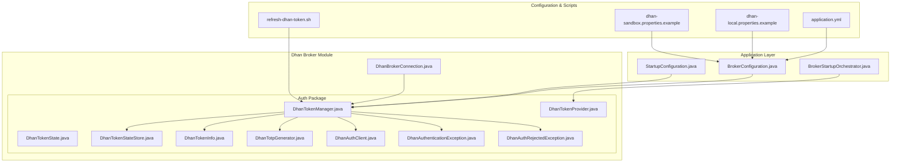
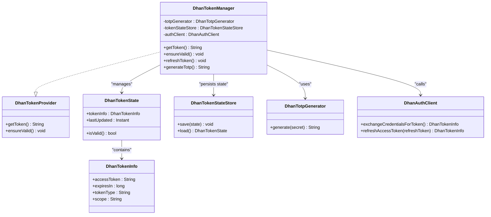
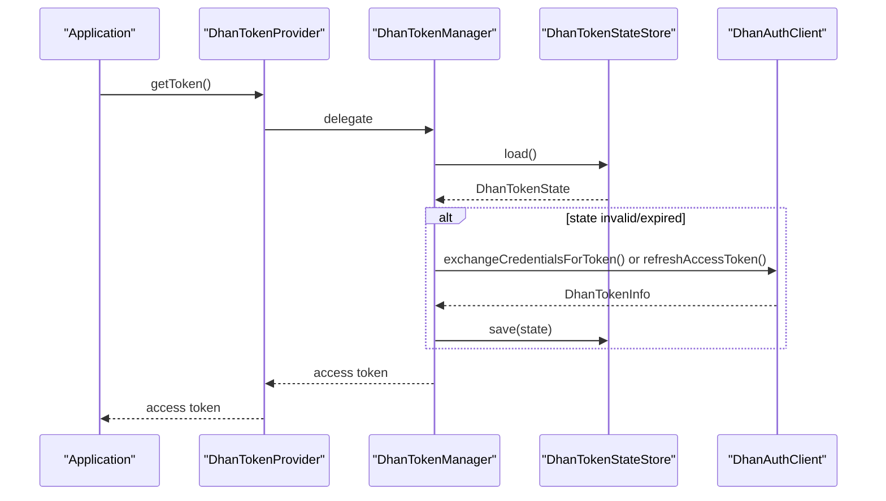
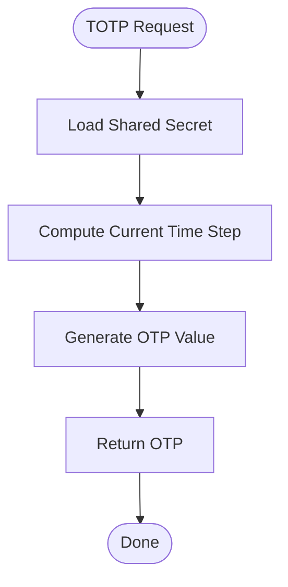
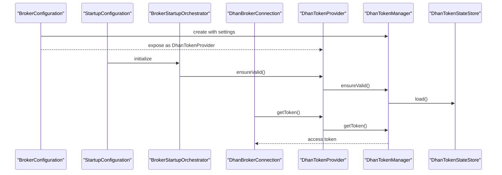
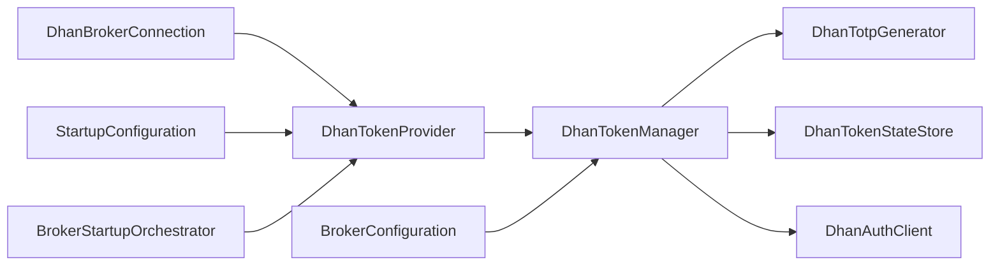

# Authentication System

<cite>
**Referenced Files in This Document**
- [DhanTokenManager.java](file://broker/dhan/src/main/java/com/tradej/broker/dhan/auth/DhanTokenManager.java)
- [DhanTokenProvider.java](file://broker/dhan/src/main/java/com/tradej/broker/dhan/auth/DhanTokenProvider.java)
- [DhanTokenState.java](file://broker/dhan/src/main/java/com/tradej/broker/dhan/auth/DhanTokenState.java)
- [DhanTokenStateStore.java](file://broker/dhan/src/main/java/com/tradej/broker/dhan/auth/DhanTokenStateStore.java)
- [DhanTokenInfo.java](file://broker/dhan/src/main/java/com/tradej/broker/dhan/auth/DhanTokenInfo.java)
- [DhanTotpGenerator.java](file://broker/dhan/src/main/java/com/tradej/broker/dhan/auth/DhanTotpGenerator.java)
- [DhanAuthClient.java](file://broker/dhan/src/main/java/com/tradej/broker/dhan/auth/DhanAuthClient.java)
- [DhanAuthenticationException.java](file://broker/dhan/src/main/java/com/tradej/broker/dhan/auth/DhanAuthenticationException.java)
- [DhanAuthRejectedException.java](file://broker/dhan/src/main/java/com/tradej/broker/dhan/auth/DhanAuthRejectedException.java)
- [DhanBrokerConnection.java](file://broker/dhan/src/main/java/com/tradej/broker/dhan/DhanBrokerConnection.java)
- [BrokerConfiguration.java](file://app/src/main/java/com/tradej/app/config/BrokerConfiguration.java)
- [StartupConfiguration.java](file://app/src/main/java/com/tradej/app/config/StartupConfiguration.java)
- [BrokerStartupOrchestrator.java](file://app/src/main/java/com/tradej/app/startup/BrokerStartupOrchestrator.java)
- [DhanTokenLifecycleIntegrationTest.java](file://app/src/test/java/com/tradej/app/integration/DhanTokenLifecycleIntegrationTest.java)
- [DhanTokenForcedGenerationIntegrationTest.java](file://app/src/test/java/com/tradej/app/integration/DhanTokenForcedGenerationIntegrationTest.java)
- [LiveDhanAuthSession.java](file://app/src/test/java/com/tradej/app/integration/LiveDhanAuthSession.java)
- [LiveDhanTestSupport.java](file://app/src/test/java/com/tradej/app/integration/LiveDhanTestSupport.java)
- [application.yml](file://app/src/main/resources/application.yml)
- [dhan-local.properties.example](file://config/dhan-local.properties.example)
- [dhan-sandbox.properties.example](file://config/dhan-sandbox.properties.example)
- [refresh-dhan-token.sh](file://scripts/refresh-dhan-token.sh)
</cite>

## Table of Contents
1. [Introduction](#introduction)
2. [Project Structure](#project-structure)
3. [Core Components](#core-components)
4. [Architecture Overview](#architecture-overview)
5. [Detailed Component Analysis](#detailed-component-analysis)
6. [Dependency Analysis](#dependency-analysis)
7. [Performance Considerations](#performance-considerations)
8. [Troubleshooting Guide](#troubleshooting-guide)
9. [Conclusion](#conclusion)
10. [Appendices](#appendices)

## Introduction
This document provides comprehensive documentation for the Dhan authentication system within the Trade-J platform. It covers OAuth token management (acquisition, refresh cycles, and state persistence), TOTP (Time-Based One-Time Password) generation and validation, the end-to-end authentication flow from initial setup to session lifecycle management, secure token storage mechanisms, security considerations, error handling for authentication failures, and practical examples for configuration, token expiration handling, and secure storage. The goal is to enable developers and operators to configure, operate, and troubleshoot Dhan authentication reliably and securely.

## Project Structure
The Dhan authentication system is implemented primarily in the broker/dhan module under the auth package. It integrates with the broader application via configuration and startup orchestration, and is exercised through integration tests and operational scripts.

Key locations:
- Authentication core: broker/dhan/src/main/java/com/tradej/broker/dhan/auth
- Broker connection integration: broker/dhan/src/main/java/com/tradej/broker/dhan/DhanBrokerConnection.java
- Application integration: app/src/main/java/com/tradej/app/config and app/src/main/java/com/tradej/app/startup
- Configuration examples: config/dhan-*.properties.example
- Operational scripts: scripts/refresh-dhan-token.sh
- Tests: app/src/test/java/com/tradej/app/integration

**Diagram sources**
- [BrokerConfiguration.java](file://app/src/main/java/com/tradej/app/config/BrokerConfiguration.java)
- [StartupConfiguration.java](file://app/src/main/java/com/tradej/app/config/StartupConfiguration.java)
- [BrokerStartupOrchestrator.java](file://app/src/main/java/com/tradej/app/startup/BrokerStartupOrchestrator.java)
- [DhanBrokerConnection.java](file://broker/dhan/src/main/java/com/tradej/broker/dhan/DhanBrokerConnection.java)
- [DhanTokenManager.java](file://broker/dhan/src/main/java/com/tradej/broker/dhan/auth/DhanTokenManager.java)
- [DhanTokenProvider.java](file://broker/dhan/src/main/java/com/tradej/broker/dhan/auth/DhanTokenProvider.java)
- [DhanTokenState.java](file://broker/dhan/src/main/java/com/tradej/broker/dhan/auth/DhanTokenState.java)
- [DhanTokenStateStore.java](file://broker/dhan/src/main/java/com/tradej/broker/dhan/auth/DhanTokenStateStore.java)
- [DhanTokenInfo.java](file://broker/dhan/src/main/java/com/tradej/broker/dhan/auth/DhanTokenInfo.java)
- [DhanTotpGenerator.java](file://broker/dhan/src/main/java/com/tradej/broker/dhan/auth/DhanTotpGenerator.java)
- [DhanAuthClient.java](file://broker/dhan/src/main/java/com/tradej/broker/dhan/auth/DhanAuthClient.java)
- [DhanAuthenticationException.java](file://broker/dhan/src/main/java/com/tradej/broker/dhan/auth/DhanAuthenticationException.java)
- [DhanAuthRejectedException.java](file://broker/dhan/src/main/java/com/tradej/broker/dhan/auth/DhanAuthRejectedException.java)
- [application.yml](file://app/src/main/resources/application.yml)
- [dhan-local.properties.example](file://config/dhan-local.properties.example)
- [dhan-sandbox.properties.example](file://config/dhan-sandbox.properties.example)
- [refresh-dhan-token.sh](file://scripts/refresh-dhan-token.sh)

**Section sources**
- [BrokerConfiguration.java](file://app/src/main/java/com/tradej/app/config/BrokerConfiguration.java)
- [StartupConfiguration.java](file://app/src/main/java/com/tradej/app/config/StartupConfiguration.java)
- [BrokerStartupOrchestrator.java](file://app/src/main/java/com/tradej/app/startup/BrokerStartupOrchestrator.java)
- [DhanBrokerConnection.java](file://broker/dhan/src/main/java/com/tradej/broker/dhan/DhanBrokerConnection.java)
- [application.yml](file://app/src/main/resources/application.yml)
- [dhan-local.properties.example](file://config/dhan-local.properties.example)
- [dhan-sandbox.properties.example](file://config/dhan-sandbox.properties.example)
- [refresh-dhan-token.sh](file://scripts/refresh-dhan-token.sh)

## Core Components
This section introduces the primary building blocks of the Dhan authentication system and their roles.

- DhanTokenProvider: Interface defining the contract for obtaining a valid token.
- DhanTokenManager: Implements token lifecycle management, including acquisition, refresh, and validation.
- DhanTokenState: Encapsulates current token state and metadata.
- DhanTokenStateStore: Persists and retrieves token state to durable storage.
- DhanTokenInfo: Holds OAuth token details and related attributes.
- DhanTotpGenerator: Generates TOTP values for two-factor authentication.
- DhanAuthClient: Handles communication with Dhan's authentication endpoints.
- DhanAuthenticationException / DhanAuthRejectedException: Exception types for authentication failure scenarios.

These components work together to ensure secure, resilient, and observable authentication for Dhan brokerage connections.

**Section sources**
- [DhanTokenProvider.java](file://broker/dhan/src/main/java/com/tradej/broker/dhan/auth/DhanTokenProvider.java)
- [DhanTokenManager.java](file://broker/dhan/src/main/java/com/tradej/broker/dhan/auth/DhanTokenManager.java)
- [DhanTokenState.java](file://broker/dhan/src/main/java/com/tradej/broker/dhan/auth/DhanTokenState.java)
- [DhanTokenStateStore.java](file://broker/dhan/src/main/java/com/tradej/broker/dhan/auth/DhanTokenStateStore.java)
- [DhanTokenInfo.java](file://broker/dhan/src/main/java/com/tradej/broker/dhan/auth/DhanTokenInfo.java)
- [DhanTotpGenerator.java](file://broker/dhan/src/main/java/com/tradej/broker/dhan/auth/DhanTotpGenerator.java)
- [DhanAuthClient.java](file://broker/dhan/src/main/java/com/tradej/broker/dhan/auth/DhanAuthClient.java)
- [DhanAuthenticationException.java](file://broker/dhan/src/main/java/com/tradej/broker/dhan/auth/DhanAuthenticationException.java)
- [DhanAuthRejectedException.java](file://broker/dhan/src/main/java/com/tradej/broker/dhan/auth/DhanAuthRejectedException.java)

## Architecture Overview
The authentication architecture centers around DhanTokenManager orchestrating token operations, with DhanTotpGenerator supporting TOTP-based MFA, DhanAuthClient handling OAuth interactions, and DhanTokenStateStore persisting state. Application configuration wires the provider into startup and runtime flows.

**Diagram sources**
- [DhanTokenProvider.java](file://broker/dhan/src/main/java/com/tradej/broker/dhan/auth/DhanTokenProvider.java)
- [DhanTokenManager.java](file://broker/dhan/src/main/java/com/tradej/broker/dhan/auth/DhanTokenManager.java)
- [DhanTokenState.java](file://broker/dhan/src/main/java/com/tradej/broker/dhan/auth/DhanTokenState.java)
- [DhanTokenStateStore.java](file://broker/dhan/src/main/java/com/tradej/broker/dhan/auth/DhanTokenStateStore.java)
- [DhanTokenInfo.java](file://broker/dhan/src/main/java/com/tradej/broker/dhan/auth/DhanTokenInfo.java)
- [DhanTotpGenerator.java](file://broker/dhan/src/main/java/com/tradej/broker/dhan/auth/DhanTotpGenerator.java)
- [DhanAuthClient.java](file://broker/dhan/src/main/java/com/tradej/broker/dhan/auth/DhanAuthClient.java)

## Detailed Component Analysis

### OAuth Token Management
DhanTokenManager implements the token lifecycle:
- Acquisition: Uses DhanAuthClient to exchange credentials for an initial access token and refresh token.
- Refresh cycles: Detects expiration and refreshes tokens via DhanAuthClient.refreshAccessToken.
- State persistence: Saves and loads token state using DhanTokenStateStore for durability across restarts.
- Validation: Provides ensureValid to proactively validate and refresh tokens before use.

**Diagram sources**
- [DhanTokenManager.java](file://broker/dhan/src/main/java/com/tradej/broker/dhan/auth/DhanTokenManager.java)
- [DhanTokenStateStore.java](file://broker/dhan/src/main/java/com/tradej/broker/dhan/auth/DhanTokenStateStore.java)
- [DhanAuthClient.java](file://broker/dhan/src/main/java/com/tradej/broker/dhan/auth/DhanAuthClient.java)
- [DhanTokenProvider.java](file://broker/dhan/src/main/java/com/tradej/broker/dhan/auth/DhanTokenProvider.java)

**Section sources**
- [DhanTokenManager.java](file://broker/dhan/src/main/java/com/tradej/broker/dhan/auth/DhanTokenManager.java)
- [DhanTokenStateStore.java](file://broker/dhan/src/main/java/com/tradej/broker/dhan/auth/DhanTokenStateStore.java)
- [DhanAuthClient.java](file://broker/dhan/src/main/java/com/tradej/broker/dhan/auth/DhanAuthClient.java)
- [DhanTokenProvider.java](file://broker/dhan/src/main/java/com/tradej/broker/dhan/auth/DhanTokenProvider.java)

### TOTP Generation and Validation
DhanTotpGenerator produces time-based one-time passwords used during MFA flows. The generator relies on a shared secret configured in the Dhan connection settings. DhanTokenManager coordinates TOTP usage during authentication flows, ensuring timely and accurate OTP values.

**Diagram sources**
- [DhanTotpGenerator.java](file://broker/dhan/src/main/java/com/tradej/broker/dhan/auth/DhanTotpGenerator.java)
- [DhanTokenManager.java](file://broker/dhan/src/main/java/com/tradej/broker/dhan/auth/DhanTokenManager.java)

**Section sources**
- [DhanTotpGenerator.java](file://broker/dhan/src/main/java/com/tradej/broker/dhan/auth/DhanTotpGenerator.java)
- [DhanTokenManager.java](file://broker/dhan/src/main/java/com/tradej/broker/dhan/auth/DhanTokenManager.java)

### Authentication Flow: From Setup to Session Lifecycle
The end-to-end flow integrates configuration, provider wiring, and lifecycle checks:

1. Configuration: application.yml and dhan-*.properties.example define broker profiles and credentials.
2. Provider Wiring: BrokerConfiguration creates DhanTokenManager as DhanTokenProvider.
3. Startup Validation: StartupConfiguration and BrokerStartupOrchestrator call ensureValid to validate tokens at startup.
4. Runtime Usage: DhanBrokerConnection obtains tokens via DhanTokenProvider for authenticated requests.
5. Persistence: DhanTokenStateStore persists state to survive restarts.
6. Operational Refresh: scripts/refresh-dhan-token.sh triggers token refresh when needed.

**Diagram sources**
- [BrokerConfiguration.java](file://app/src/main/java/com/tradej/app/config/BrokerConfiguration.java)
- [StartupConfiguration.java](file://app/src/main/java/com/tradej/app/config/StartupConfiguration.java)
- [BrokerStartupOrchestrator.java](file://app/src/main/java/com/tradej/app/startup/BrokerStartupOrchestrator.java)
- [DhanBrokerConnection.java](file://broker/dhan/src/main/java/com/tradej/broker/dhan/DhanBrokerConnection.java)
- [DhanTokenProvider.java](file://broker/dhan/src/main/java/com/tradej/broker/dhan/auth/DhanTokenProvider.java)
- [DhanTokenManager.java](file://broker/dhan/src/main/java/com/tradej/broker/dhan/auth/DhanTokenManager.java)
- [DhanTokenStateStore.java](file://broker/dhan/src/main/java/com/tradej/broker/dhan/auth/DhanTokenStateStore.java)

**Section sources**
- [BrokerConfiguration.java](file://app/src/main/java/com/tradej/app/config/BrokerConfiguration.java)
- [StartupConfiguration.java](file://app/src/main/java/com/tradej/app/config/StartupConfiguration.java)
- [BrokerStartupOrchestrator.java](file://app/src/main/java/com/tradej/app/startup/BrokerStartupOrchestrator.java)
- [DhanBrokerConnection.java](file://broker/dhan/src/main/java/com/tradej/broker/dhan/DhanBrokerConnection.java)
- [application.yml](file://app/src/main/resources/application.yml)
- [dhan-local.properties.example](file://config/dhan-local.properties.example)
- [dhan-sandbox.properties.example](file://config/dhan-sandbox.properties.example)
- [refresh-dhan-token.sh](file://scripts/refresh-dhan-token.sh)

### Token Storage Mechanisms and Security Considerations
- Durable Persistence: DhanTokenStateStore persists token state to ensure continuity across restarts.
- Secure Secrets: TOTP shared secrets and OAuth credentials are loaded from configuration files (dhan-*.properties.example).
- Least Privilege: Tokens are stored encrypted at rest where applicable and accessed only by the token manager.
- Network Security: Auth exchanges occur over HTTPS to protect tokens in transit.
- Operational Controls: refresh-dhan-token.sh enables safe, scripted refreshes without exposing secrets.

Security best practices:
- Rotate TOTP secrets periodically.
- Restrict access to configuration files and logs containing sensitive data.
- Monitor token refresh events and failures.
- Enforce strict file permissions on state storage locations.

**Section sources**
- [DhanTokenStateStore.java](file://broker/dhan/src/main/java/com/tradej/broker/dhan/auth/DhanTokenStateStore.java)
- [dhan-local.properties.example](file://config/dhan-local.properties.example)
- [dhan-sandbox.properties.example](file://config/dhan-sandbox.properties.example)
- [refresh-dhan-token.sh](file://scripts/refresh-dhan-token.sh)

### Error Handling for Authentication Failures
Common exceptions and handling:
- DhanAuthenticationException: Wraps authentication errors (e.g., invalid credentials, network issues).
- DhanAuthRejectedException: Indicates explicit rejection by the authentication server.
- Retry and Backoff: Implement retry with exponential backoff for transient failures.
- Fallback Strategies: On persistent failure, alert operators and block dependent operations until resolved.

Operational guidance:
- Log detailed error context (HTTP status, error codes, timestamps).
- Trigger alerts for repeated failures.
- Provide manual override mechanisms (e.g., forced token regeneration via integration tests).

**Section sources**
- [DhanAuthenticationException.java](file://broker/dhan/src/main/java/com/tradej/broker/dhan/auth/DhanAuthenticationException.java)
- [DhanAuthRejectedException.java](file://broker/dhan/src/main/java/com/tradej/broker/dhan/auth/DhanAuthRejectedException.java)
- [DhanTokenManager.java](file://broker/dhan/src/main/java/com/tradej/broker/dhan/auth/DhanTokenManager.java)

### Practical Examples

- Configure authentication credentials:
  - Set broker profile and credentials in application.yml and dhan-*.properties.example.
  - Reference property placeholders consistently across BrokerConfiguration.

- Handle token expiration:
  - Use ensureValid during startup and runtime to proactively refresh tokens.
  - Integrate refresh logic in scheduled tasks or reactive triggers.

- Implement secure token storage:
  - Persist state via DhanTokenStateStore.
  - Protect state files with OS-level permissions and encryption at rest.

- Operational refresh:
  - Invoke refresh-dhan-token.sh to refresh tokens outside normal operation windows.

**Section sources**
- [application.yml](file://app/src/main/resources/application.yml)
- [dhan-local.properties.example](file://config/dhan-local.properties.example)
- [dhan-sandbox.properties.example](file://config/dhan-sandbox.properties.example)
- [BrokerConfiguration.java](file://app/src/main/java/com/tradej/app/config/BrokerConfiguration.java)
- [DhanTokenManager.java](file://broker/dhan/src/main/java/com/tradej/broker/dhan/auth/DhanTokenManager.java)
- [DhanTokenStateStore.java](file://broker/dhan/src/main/java/com/tradej/broker/dhan/auth/DhanTokenStateStore.java)
- [refresh-dhan-token.sh](file://scripts/refresh-dhan-token.sh)

## Dependency Analysis
The authentication system exhibits clear separation of concerns:
- DhanTokenManager depends on DhanTotpGenerator, DhanTokenStateStore, and DhanAuthClient.
- DhanBrokerConnection depends on DhanTokenProvider for token retrieval.
- Application wiring exposes DhanTokenManager as DhanTokenProvider via BrokerConfiguration and StartupConfiguration.
- Tests validate lifecycle and forced generation scenarios.

**Diagram sources**
- [DhanTokenManager.java](file://broker/dhan/src/main/java/com/tradej/broker/dhan/auth/DhanTokenManager.java)
- [DhanTotpGenerator.java](file://broker/dhan/src/main/java/com/tradej/broker/dhan/auth/DhanTotpGenerator.java)
- [DhanTokenStateStore.java](file://broker/dhan/src/main/java/com/tradej/broker/dhan/auth/DhanTokenStateStore.java)
- [DhanAuthClient.java](file://broker/dhan/src/main/java/com/tradej/broker/dhan/auth/DhanAuthClient.java)
- [DhanBrokerConnection.java](file://broker/dhan/src/main/java/com/tradej/broker/dhan/DhanBrokerConnection.java)
- [DhanTokenProvider.java](file://broker/dhan/src/main/java/com/tradej/broker/dhan/auth/DhanTokenProvider.java)
- [BrokerConfiguration.java](file://app/src/main/java/com/tradej/app/config/BrokerConfiguration.java)
- [StartupConfiguration.java](file://app/src/main/java/com/tradej/app/config/StartupConfiguration.java)
- [BrokerStartupOrchestrator.java](file://app/src/main/java/com/tradej/app/startup/BrokerStartupOrchestrator.java)

**Section sources**
- [DhanTokenManager.java](file://broker/dhan/src/main/java/com/tradej/broker/dhan/auth/DhanTokenManager.java)
- [DhanBrokerConnection.java](file://broker/dhan/src/main/java/com/tradej/broker/dhan/DhanBrokerConnection.java)
- [BrokerConfiguration.java](file://app/src/main/java/com/tradej/app/config/BrokerConfiguration.java)
- [StartupConfiguration.java](file://app/src/main/java/com/tradej/app/config/StartupConfiguration.java)
- [BrokerStartupOrchestrator.java](file://app/src/main/java/com/tradej/app/startup/BrokerStartupOrchestrator.java)

## Performance Considerations
- Minimize redundant token refreshes by checking expiration proactively.
- Batch refresh operations during low-traffic periods.
- Cache tokens per-process and coordinate refresh across threads safely.
- Monitor latency of auth exchanges and set timeouts accordingly.
- Use asynchronous refresh to avoid blocking request paths.

## Troubleshooting Guide
Common issues and resolutions:
- Invalid credentials or rejected tokens:
  - Verify property values in dhan-*.properties.example and application.yml.
  - Confirm TOTP shared secret alignment with the broker.
- Token expiration during runtime:
  - Ensure ensureValid is called before issuing authenticated requests.
  - Review DhanTokenStateStore persistence and file permissions.
- Network connectivity issues:
  - Check outbound HTTPS access to Dhan endpoints.
  - Validate proxy and firewall rules.
- Operational refresh failures:
  - Use refresh-dhan-token.sh to force refresh and inspect logs.
  - Confirm cron or scheduled job execution.

Validation via tests:
- DhanTokenLifecycleIntegrationTest validates token lifecycle and persistence.
- DhanTokenForcedGenerationIntegrationTest exercises forced token regeneration.

**Section sources**
- [DhanTokenLifecycleIntegrationTest.java](file://app/src/test/java/com/tradej/app/integration/DhanTokenLifecycleIntegrationTest.java)
- [DhanTokenForcedGenerationIntegrationTest.java](file://app/src/test/java/com/tradej/app/integration/DhanTokenForcedGenerationIntegrationTest.java)
- [LiveDhanAuthSession.java](file://app/src/test/java/com/tradej/app/integration/LiveDhanAuthSession.java)
- [LiveDhanTestSupport.java](file://app/src/test/java/com/tradej/app/integration/LiveDhanTestSupport.java)
- [refresh-dhan-token.sh](file://scripts/refresh-dhan-token.sh)

## Conclusion
The Dhan authentication system provides a robust, modular framework for managing OAuth tokens, integrating TOTP-based MFA, and maintaining secure, persistent session state. Its design emphasizes clear interfaces, observable lifecycle management, and operational safety through configuration-driven setup, startup validation, and scripted refresh capabilities. By following the security and troubleshooting guidance herein, teams can deploy and operate Dhan authentication with confidence.

## Appendices

### Configuration Reference
- Broker profile and credentials:
  - application.yml: Broker profile selection and environment-specific overrides.
  - dhan-local.properties.example: Local development credentials and settings.
  - dhan-sandbox.properties.example: Sandbox environment credentials and settings.

- Example property keys (names are illustrative):
  - dhan.client.id
  - dhan.client.secret
  - dhan.totp.secret
  - dhan.auth.base-url
  - dhan.token.state.path

- Notes:
  - Replace placeholder values with real credentials.
  - Keep property files out of version control; use environment variables or secure vaults in production.

**Section sources**
- [application.yml](file://app/src/main/resources/application.yml)
- [dhan-local.properties.example](file://config/dhan-local.properties.example)
- [dhan-sandbox.properties.example](file://config/dhan-sandbox.properties.example)

### Operational Scripts
- refresh-dhan-token.sh:
  - Purpose: Refresh Dhan tokens via the token manager.
  - Usage: Execute in maintenance windows; review logs for success/failure.

**Section sources**
- [refresh-dhan-token.sh](file://scripts/refresh-dhan-token.sh)