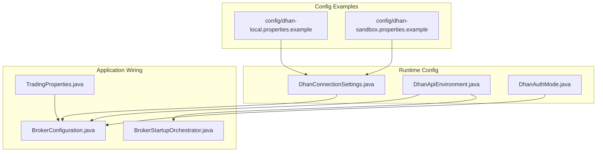
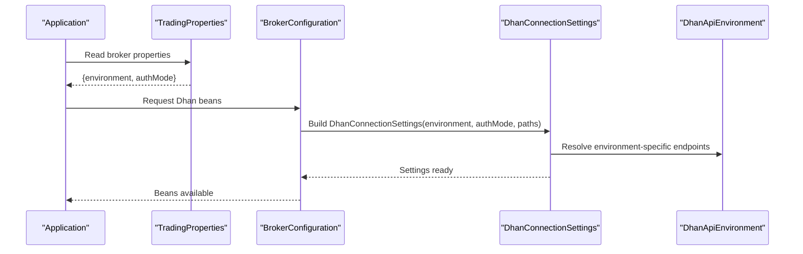
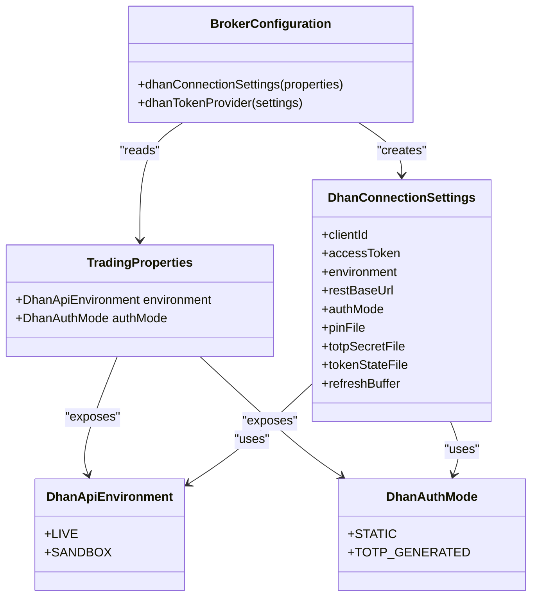

# Configuration and Setup

<cite>
**Referenced Files in This Document**
- [dhan-local.properties](file://config/dhan-local.properties)
- [dhan-sandbox.properties](file://config/dhan-sandbox.properties)
- [dhan-local.properties.example](file://config/dhan-local.properties.example)
- [dhan-sandbox.properties.example](file://config/dhan-sandbox.properties.example)
- [DhanConnectionSettings.java](file://broker/dhan/src/main/java/com/tradej/broker/dhan/config/DhanConnectionSettings.java)
- [DhanApiEnvironment.java](file://broker/dhan/src/main/java/com/tradej/broker/dhan/config/DhanApiEnvironment.java)
- [DhanAuthMode.java](file://broker/dhan/src/main/java/com/tradej/broker/dhan/config/DhanAuthMode.java)
- [BrokerConfiguration.java](file://app/src/main/java/com/tradej/app/config/BrokerConfiguration.java)
- [TradingProperties.java](file://app/src/main/java/com/tradej/app/config/TradingProperties.java)
- [BrokerStartupOrchestrator.java](file://app/src/main/java/com/tradej/app/startup/BrokerStartupOrchestrator.java)
- [LiveDhanTestSupport.java](file://app/src/test/java/com/tradej/app/integration/LiveDhanTestSupport.java)
- [DhanRefreshProductionTokenIntegrationTest.java](file://app/src/test/java/com/tradej/app/integration/DhanRefreshProductionTokenIntegrationTest.java)
- [DhanTokenLifecycleIntegrationTest.java](file://app/src/test/java/com/tradej/app/integration/DhanTokenLifecycleIntegrationTest.java)
- [DhanTokenForcedGenerationIntegrationTest.java](file://app/src/test/java/com/tradej/app/integration/DhanTokenForcedGenerationIntegrationTest.java)
- [run-full-regression.sh](file://scripts/run-full-regression.sh)
- [USAGE_GUIDE.md](file://docs/USAGE_GUIDE.md)
- [CONFIG.md](file://CONFIG.md)
- [ARCHITECTURE.md](file://ARCHITECTURE.md)
</cite>

## Table of Contents
1. [Introduction](#introduction)
2. [Project Structure](#project-structure)
3. [Core Components](#core-components)
4. [Architecture Overview](#architecture-overview)
5. [Detailed Component Analysis](#detailed-component-analysis)
6. [Dependency Analysis](#dependency-analysis)
7. [Performance Considerations](#performance-considerations)
8. [Troubleshooting Guide](#troubleshooting-guide)
9. [Conclusion](#conclusion)
10. [Appendices](#appendices)

## Introduction
This document explains how to configure and set up the Dhan broker integration in the project. It covers connection settings, authentication parameters, environment configurations, property file setup for sandbox and production, configuration validation, environment-specific behavior, and troubleshooting. It also provides step-by-step setup guides for different deployment scenarios, along with guidance on rate limiting, retry policies, and connection pooling.

## Project Structure
The Dhan configuration spans example property files under the config directory and the runtime configuration classes under broker/dhan/config. Application-level wiring and environment selection are handled in app/src/main/java/com/tradej/app/config.

**Diagram sources**
- [dhan-local.properties.example](file://config/dhan-local.properties.example)
- [dhan-sandbox.properties.example](file://config/dhan-sandbox.properties.example)
- [DhanConnectionSettings.java](file://broker/dhan/src/main/java/com/tradej/broker/dhan/config/DhanConnectionSettings.java)
- [DhanApiEnvironment.java](file://broker/dhan/src/main/java/com/tradej/broker/dhan/config/DhanApiEnvironment.java)
- [DhanAuthMode.java](file://broker/dhan/src/main/java/com/tradej/broker/dhan/config/DhanAuthMode.java)
- [BrokerConfiguration.java](file://app/src/main/java/com/tradej/app/config/BrokerConfiguration.java)
- [TradingProperties.java](file://app/src/main/java/com/tradej/app/config/TradingProperties.java)
- [BrokerStartupOrchestrator.java](file://app/src/main/java/com/tradej/app/startup/BrokerStartupOrchestrator.java)

**Section sources**
- [dhan-local.properties.example](file://config/dhan-local.properties.example)
- [dhan-sandbox.properties.example](file://config/dhan-sandbox.properties.example)
- [DhanConnectionSettings.java](file://broker/dhan/src/main/java/com/tradej/broker/dhan/config/DhanConnectionSettings.java)
- [DhanApiEnvironment.java](file://broker/dhan/src/main/java/com/tradej/broker/dhan/config/DhanApiEnvironment.java)
- [DhanAuthMode.java](file://broker/dhan/src/main/java/com/tradej/broker/dhan/config/DhanAuthMode.java)
- [BrokerConfiguration.java](file://app/src/main/java/com/tradej/app/config/BrokerConfiguration.java)
- [TradingProperties.java](file://app/src/main/java/com/tradej/app/config/TradingProperties.java)
- [BrokerStartupOrchestrator.java](file://app/src/main/java/com/tradej/app/startup/BrokerStartupOrchestrator.java)

## Core Components
- DhanConnectionSettings: Encapsulates connection parameters such as client ID, access token, environment, REST base URL, auth mode, pin file, totp secret file, token state file, and refresh buffer. It provides factory methods for sandbox and live defaults and supports overriding values for testing and integration.
- DhanApiEnvironment: Enumerates supported environments (LIVE, SANDBOX).
- DhanAuthMode: Enumerates authentication modes (STATIC, TOTP_GENERATED).
- BrokerConfiguration: Creates DhanConnectionSettings and DhanTokenProvider beans from application properties.
- TradingProperties: Exposes broker configuration properties including environment and auth mode with defaults.
- BrokerStartupOrchestrator: Selects environment and orchestrates startup behavior based on DhanApiEnvironment.

Key responsibilities:
- Centralized configuration creation and validation
- Environment-aware behavior selection
- Token lifecycle management and refresh buffer configuration

**Section sources**
- [DhanConnectionSettings.java](file://broker/dhan/src/main/java/com/tradej/broker/dhan/config/DhanConnectionSettings.java)
- [DhanApiEnvironment.java](file://broker/dhan/src/main/java/com/tradej/broker/dhan/config/DhanApiEnvironment.java)
- [DhanAuthMode.java](file://broker/dhan/src/main/java/com/tradej/broker/dhan/config/DhanAuthMode.java)
- [BrokerConfiguration.java](file://app/src/main/java/com/tradej/app/config/BrokerConfiguration.java)
- [TradingProperties.java](file://app/src/main/java/com/tradej/app/config/TradingProperties.java)
- [BrokerStartupOrchestrator.java](file://app/src/main/java/com/tradej/app/startup/BrokerStartupOrchestrator.java)

## Architecture Overview
The Dhan integration follows a layered approach:
- Property files define environment-specific secrets and paths.
- Application properties feed runtime configuration classes.
- BrokerConfiguration wires beans for token provider and connection settings.
- Startup orchestrator selects environment and coordinates initialization.

**Diagram sources**
- [TradingProperties.java](file://app/src/main/java/com/tradej/app/config/TradingProperties.java)
- [BrokerConfiguration.java](file://app/src/main/java/com/tradej/app/config/BrokerConfiguration.java)
- [DhanConnectionSettings.java](file://broker/dhan/src/main/java/com/tradej/broker/dhan/config/DhanConnectionSettings.java)
- [DhanApiEnvironment.java](file://broker/dhan/src/main/java/com/tradej/broker/dhan/config/DhanApiEnvironment.java)

## Detailed Component Analysis

### Property File Setup (Sandbox and Production)
- Sandbox configuration:
  - Copy example sandbox properties to the active sandbox properties file.
  - Populate sandbox client ID and access token.
  - Optionally override REST base URL, pin file, totp secret file, token state file, and refresh buffer.
- Production configuration:
  - Copy example local properties to the active local properties file.
  - Populate production client ID and access token.
  - Optionally override REST base URL, pin file, totp secret file, token state file, and refresh buffer.

Validation and discovery:
- Tests and scripts validate presence of required property files and credentials.
- Integration tests preflight auth against sandbox endpoints.

Practical steps:
- For sandbox: create config/dhan-sandbox.properties from the example and set sandbox client ID and access token.
- For production: create config/dhan-local.properties from the example and set production client ID and access token.
- Confirm environment selection via application properties (default LIVE) and auth mode (default STATIC).

**Section sources**
- [dhan-sandbox.properties.example](file://config/dhan-sandbox.properties.example)
- [dhan-local.properties.example](file://config/dhan-local.properties.example)
- [dhan-sandbox.properties](file://config/dhan-sandbox.properties)
- [dhan-local.properties](file://config/dhan-local.properties)
- [run-full-regression.sh](file://scripts/run-full-regression.sh)
- [USAGE_GUIDE.md](file://docs/USAGE_GUIDE.md)
- [CONFIG.md](file://CONFIG.md)

### Connection Settings and Authentication Parameters
- Required parameters:
  - Client ID: identifies the application with Dhan.
  - Access token: authenticates requests; can be static or generated via TOTP.
- Optional parameters:
  - REST base URL: overrides default sandbox/live endpoints.
  - Auth mode: STATIC or TOTP_GENERATED.
  - Pin file: path to a file containing a pin used during token generation.
  - TOTP secret file: path to a file containing a TOTP secret used during token generation.
  - Token state file: path to persist token state across restarts.
  - Refresh buffer: seconds before expiry to trigger refresh.

Environment-specific defaults:
- Sandbox environment resolves to sandbox endpoints.
- Live environment resolves to production endpoints.

Factory methods:
- Sandbox defaults: constructs settings with sandbox environment and defaults for paths and refresh buffer.
- Live defaults: constructs settings with live environment and defaults for paths and refresh buffer.
- Overriding defaults: allows explicit values for all parameters in tests and integration setups.

**Section sources**
- [DhanConnectionSettings.java](file://broker/dhan/src/main/java/com/tradej/broker/dhan/config/DhanConnectionSettings.java)
- [DhanApiEnvironment.java](file://broker/dhan/src/main/java/com/tradej/broker/dhan/config/DhanApiEnvironment.java)
- [DhanAuthMode.java](file://broker/dhan/src/main/java/com/tradej/broker/dhan/config/DhanAuthMode.java)
- [LiveDhanTestSupport.java](file://app/src/test/java/com/tradej/app/integration/LiveDhanTestSupport.java)

### Environment Selection and Validation
- Application properties expose broker.environment and broker.authMode with defaults.
- BrokerStartupOrchestrator selects environment and routes startup logic accordingly.
- Integration tests validate credentials presence and preflight auth for sandbox.

Validation flow:
- Presence checks for property files and credentials.
- Preflight auth against sandbox endpoint to ensure validity.
- Environment-aware selection for live vs sandbox.

**Section sources**
- [TradingProperties.java](file://app/src/main/java/com/tradej/app/config/TradingProperties.java)
- [BrokerStartupOrchestrator.java](file://app/src/main/java/com/tradej/app/startup/BrokerStartupOrchestrator.java)
- [LiveDhanTestSupport.java](file://app/src/test/java/com/tradej/app/integration/LiveDhanTestSupport.java)

### Token Lifecycle and Refresh Behavior
- Token state persistence: token state file stores state across restarts.
- Refresh buffer: controls early refresh window before token expiry.
- Auth modes:
  - STATIC: uses provided access token.
  - TOTP_GENERATED: generates tokens using TOTP secret and pin.

Integration tests demonstrate:
- Forced token generation and lifecycle management.
- Refresh behavior for production tokens.
- Conditional assumptions based on auth mode.

**Section sources**
- [DhanConnectionSettings.java](file://broker/dhan/src/main/java/com/tradej/broker/dhan/config/DhanConnectionSettings.java)
- [DhanTokenLifecycleIntegrationTest.java](file://app/src/test/java/com/tradej/app/integration/DhanTokenLifecycleIntegrationTest.java)
- [DhanRefreshProductionTokenIntegrationTest.java](file://app/src/test/java/com/tradej/app/integration/DhanRefreshProductionTokenIntegrationTest.java)
- [DhanTokenForcedGenerationIntegrationTest.java](file://app/src/test/java/com/tradej/app/integration/DhanTokenForcedGenerationIntegrationTest.java)

### Rate Limiting, Retry Policies, and Connection Pooling
- Rate limiting:
  - DhanConnectionSettings exposes a refresh buffer parameter to schedule token refreshes before expiry.
  - Integration tests conditionally skip or adjust behavior based on rate limit constraints.
- Retry policies:
  - No explicit retry policy is defined in the examined configuration classes.
  - Implement retries at the HTTP client layer if needed.
- Connection pooling:
  - No explicit connection pool configuration is defined in the examined configuration classes.
  - Configure HTTP client pooling at the application layer if required.

Recommendations:
- Use the refresh buffer to avoid hitting rate limits near expiry.
- Add HTTP client retry and backoff strategies as needed.
- Configure connection pooling at the HTTP client level if the underlying client supports it.

**Section sources**
- [DhanConnectionSettings.java](file://broker/dhan/src/main/java/com/tradej/broker/dhan/config/DhanConnectionSettings.java)
- [DhanRefreshProductionTokenIntegrationTest.java](file://app/src/test/java/com/tradej/app/integration/DhanRefreshProductionTokenIntegrationTest.java)

### Step-by-Step Setup Guides

#### Sandbox Deployment
1. Copy the sandbox example properties to the active sandbox properties file.
2. Set sandbox client ID and access token.
3. Optionally set REST base URL, pin file, totp secret file, token state file, and refresh buffer.
4. Verify credentials and preflight auth using integration test helpers.
5. Confirm environment selection is SANDBOX.

**Section sources**
- [dhan-sandbox.properties.example](file://config/dhan-sandbox.properties.example)
- [dhan-sandbox.properties](file://config/dhan-sandbox.properties)
- [LiveDhanTestSupport.java](file://app/src/test/java/com/tradej/app/integration/LiveDhanTestSupport.java)
- [TradingProperties.java](file://app/src/main/java/com/tradej/app/config/TradingProperties.java)

#### Production Deployment
1. Copy the local example properties to the active local properties file.
2. Set production client ID and access token.
3. Optionally set REST base URL, pin file, totp secret file, token state file, and refresh buffer.
4. Confirm environment selection is LIVE.
5. Validate token lifecycle and refresh behavior in integration tests.

**Section sources**
- [dhan-local.properties.example](file://config/dhan-local.properties.example)
- [dhan-local.properties](file://config/dhan-local.properties)
- [TradingProperties.java](file://app/src/main/java/com/tradej/app/config/TradingProperties.java)
- [DhanRefreshProductionTokenIntegrationTest.java](file://app/src/test/java/com/tradej/app/integration/DhanRefreshProductionTokenIntegrationTest.java)

#### Environment-Specific Settings
- Sandbox:
  - Base URL defaults to sandbox endpoints.
  - Credentials validated via sandbox preflight.
- Live:
  - Base URL defaults to production endpoints.
  - Token lifecycle managed with refresh buffer.

**Section sources**
- [DhanApiEnvironment.java](file://broker/dhan/src/main/java/com/tradej/broker/dhan/config/DhanApiEnvironment.java)
- [LiveDhanTestSupport.java](file://app/src/test/java/com/tradej/app/integration/LiveDhanTestSupport.java)

## Dependency Analysis
The configuration classes depend on each other as follows:
- DhanConnectionSettings depends on DhanApiEnvironment and DhanAuthMode.
- BrokerConfiguration depends on TradingProperties and creates DhanConnectionSettings and DhanTokenProvider.
- BrokerStartupOrchestrator depends on TradingProperties and DhanApiEnvironment.

**Diagram sources**
- [TradingProperties.java](file://app/src/main/java/com/tradej/app/config/TradingProperties.java)
- [DhanApiEnvironment.java](file://broker/dhan/src/main/java/com/tradej/broker/dhan/config/DhanApiEnvironment.java)
- [DhanAuthMode.java](file://broker/dhan/src/main/java/com/tradej/broker/dhan/config/DhanAuthMode.java)
- [DhanConnectionSettings.java](file://broker/dhan/src/main/java/com/tradej/broker/dhan/config/DhanConnectionSettings.java)
- [BrokerConfiguration.java](file://app/src/main/java/com/tradej/app/config/BrokerConfiguration.java)

**Section sources**
- [TradingProperties.java](file://app/src/main/java/com/tradej/app/config/TradingProperties.java)
- [DhanConnectionSettings.java](file://broker/dhan/src/main/java/com/tradej/broker/dhan/config/DhanConnectionSettings.java)
- [BrokerConfiguration.java](file://app/src/main/java/com/tradej/app/config/BrokerConfiguration.java)

## Performance Considerations
- Token refresh timing:
  - Adjust refresh buffer to schedule token refreshes before expiry to avoid throttling.
- Network throughput:
  - Configure HTTP client connection pooling and timeouts at the application layer if needed.
- Retry strategy:
  - Implement retries with exponential backoff for transient failures.
- Monitoring:
  - Track token refresh latency and HTTP response times to tune performance.

[No sources needed since this section provides general guidance]

## Troubleshooting Guide
Common issues and resolutions:
- Missing property files:
  - Ensure config/dhan-sandbox.properties and/or config/dhan-local.properties exist.
  - Scripts and tests validate presence and report missing files.
- Missing credentials:
  - Set sandbox or local client ID and access token.
  - Integration tests preflight auth and skip tests when credentials are missing.
- Environment mismatch:
  - Confirm broker.environment defaults to LIVE; override to SANDBOX for sandbox testing.
- Auth mode mismatch:
  - STATIC requires access token; TOTP_GENERATED requires pin and totp secret files.
- Token lifecycle problems:
  - Verify token state file path and refresh buffer.
  - Use integration tests to validate forced generation and refresh behavior.

**Section sources**
- [run-full-regression.sh](file://scripts/run-full-regression.sh)
- [LiveDhanTestSupport.java](file://app/src/test/java/com/tradej/app/integration/LiveDhanTestSupport.java)
- [TradingProperties.java](file://app/src/main/java/com/tradej/app/config/TradingProperties.java)
- [DhanRefreshProductionTokenIntegrationTest.java](file://app/src/test/java/com/tradej/app/integration/DhanRefreshProductionTokenIntegrationTest.java)
- [DhanTokenLifecycleIntegrationTest.java](file://app/src/test/java/com/tradej/app/integration/DhanTokenLifecycleIntegrationTest.java)
- [DhanTokenForcedGenerationIntegrationTest.java](file://app/src/test/java/com/tradej/app/integration/DhanTokenForcedGenerationIntegrationTest.java)

## Conclusion
The Dhan broker configuration centers around environment-aware settings, authentication modes, and token lifecycle management. By correctly setting up sandbox and production property files, selecting the appropriate environment, and tuning refresh behavior, you can achieve reliable connectivity and predictable performance. Use the provided integration tests and scripts as references for validation and troubleshooting.

[No sources needed since this section summarizes without analyzing specific files]

## Appendices

### Appendix A: Example Property Keys and Defaults
- Sandbox:
  - dhan.sandbox.clientId
  - dhan.sandbox.accessToken
  - dhan.sandbox.restBaseUrl (defaults to sandbox base URL)
  - dhan.sandbox.pin.file
  - dhan.sandbox.totp.secret.file
  - dhan.sandbox.token.state.file
  - dhan.sandbox.refresh.buffer.seconds
- Local (Production):
  - dhan.local.clientId
  - dhan.local.accessToken
  - dhan.local.restBaseUrl (defaults to production base URL)
  - dhan.local.pin.file
  - dhan.local.totp.secret.file
  - dhan.local.token.state.file
  - dhan.local.refresh.buffer.seconds

**Section sources**
- [dhan-sandbox.properties.example](file://config/dhan-sandbox.properties.example)
- [dhan-local.properties.example](file://config/dhan-local.properties.example)
- [LiveDhanTestSupport.java](file://app/src/test/java/com/tradej/app/integration/LiveDhanTestSupport.java)

### Appendix B: Environment and Auth Mode Defaults
- Default environment: LIVE
- Default auth mode: STATIC
- Override via application properties or integration test helpers.

**Section sources**
- [TradingProperties.java](file://app/src/main/java/com/tradej/app/config/TradingProperties.java)
- [BrokerStartupOrchestrator.java](file://app/src/main/java/com/tradej/app/startup/BrokerStartupOrchestrator.java)