# Dhan Broker Integration

<cite>
**Referenced Files in This Document**
- [DhanBrokerConnection.java](file://broker/dhan/src/main/java/com/tradej/broker/dhan/DhanBrokerConnection.java)
- [DhanTokenManager.java](file://broker/dhan/src/main/java/com/tradej/broker/dhan/auth/DhanTokenManager.java)
- [DhanAuthClient.java](file://broker/dhan/src/main/java/com/tradej/broker/dhan/auth/DhanAuthClient.java)
- [DhanTokenInfo.java](file://broker/dhan/src/main/java/com/tradej/broker/dhan/auth/DhanTokenInfo.java)
- [DhanTokenStateStore.java](file://broker/dhan/src/main/java/com/tradej/broker/dhan/auth/DhanTokenStateStore.java)
- [DhanTokenState.java](file://broker/dhan/src/main/java/com/tradej/broker/dhan/auth/DhanTokenState.java)
- [DhanMarketDataProvider.java](file://broker/dhan/src/main/java/com/tradej/broker/dhan/adapter/DhanMarketDataProvider.java)
- [DhanMarketFeedWebSocketClient.java](file://broker/dhan/src/main/java/com/tradej/broker/dhan/websocket/DhanMarketFeedWebSocketClient.java)
- [DhanBinaryParser.java](file://broker/dhan/src/main/java/com/tradej/broker/dhan/websocket/DhanBinaryParser.java)
- [DhanMarketFeedBinaryParser.java](file://broker/dhan/src/main/java/com/tradej/broker/dhan/websocket/feed/DhanMarketFeedBinaryParser.java)
- [DhanTwentyDepthWebSocketClient.java](file://broker/dhan/src/main/java/com/tradej/broker/dhan/depth/DhanTwentyDepthWebSocketClient.java)
- [DhanHistoricalDataClient.java](file://broker/dhan/src/main/java/com/tradej/broker/dhan/historical/DhanHistoricalDataClient.java)
- [DhanHistoricalDataMapper.java](file://broker/dhan/src/main/java/com/tradej/broker/dhan/historical/DhanHistoricalDataMapper.java)
- [DhanRestOrderClient.java](file://broker/dhan/src/main/java/com/tradej/broker/dhan/orders/DhanRestOrderClient.java)
- [DhanOrderCommandAdapter.java](file://broker/dhan/src/main/java/com/tradej/broker/dhan/adapter/DhanOrderCommandAdapter.java)
- [DhanOrderQueryAdapter.java](file://broker/dhan/src/main/java/com/tradej/broker/dhan/adapter/DhanOrderQueryAdapter.java)
- [DhanPortfolioProvider.java](file://broker/dhan/src/main/java/com/tradej/broker/dhan/adapter/DhanPortfolioProvider.java)
- [DhanMarginProvider.java](file://broker/dhan/src/main/java/com/tradej/broker/dhan/adapter/DhanMarginProvider.java)
- [DhanSessionRiskProvider.java](file://broker/dhan/src/main/java/com/tradej/broker/dhan/adapter/DhanSessionRiskProvider.java)
- [DhanOptionChainClient.java](file://broker/dhan/src/main/java/com/tradej/broker/dhan/options/DhanOptionChainClient.java)
- [DhanOptionChainResponseMapper.java](file://broker/dhan/src/main/java/com/tradej/broker/dhan/options/DhanOptionChainResponseMapper.java)
- [DhanRollingOptionClient.java](file://broker/dhan/src/main/java/com/tradej/broker/dhan/options/DhanRollingOptionClient.java)
- [DhanRollingOptionMapper.java](file://broker/dhan/src/main/java/com/tradej/broker/dhan/options/DhanRollingOptionMapper.java)
- [DhanRollingOptionWireMapper.java](file://broker/dhan/src/main/java/com/tradej/broker/dhan/options/DhanRollingOptionWireMapper.java)
- [OptionExpiryCache.java](file://broker/dhan/src/main/java/com/tradej/broker/dhan/options/OptionExpiryCache.java)
- [StrikeSelectionSupport.java](file://broker/dhan/src/main/java/com/tradej/broker/dhan/options/StrikeSelectionSupport.java)
- [DhanRetryExecutor.java](file://broker/dhan/src/main/java/com/tradej/broker/dhan/resilience/DhanRetryExecutor.java)
- [DhanExceptionUtil.java](file://broker/dhan/src/main/java/com/tradej/broker/dhan/exceptions/DhanExceptionUtil.java)
- [DhanBrokerException.java](file://broker/dhan/src/main/java/com/tradej/broker/dhan/exceptions/DhanBrokerException.java)
- [DhanHttpException.java](file://broker/dhan/src/main/java/com/tradej/broker/dhan/exceptions/DhanHttpException.java)
- [DhanValidationException.java](file://broker/dhan/src/main/java/com/tradej/broker/dhan/exceptions/DhanValidationException.java)
- [DhanApiEndpoints.java](file://broker/dhan/src/main/java/com/tradej/broker/dhan/constants/DhanApiEndpoints.java)
- [DhanApiUrlResolver.java](file://broker/dhan/src/main/java/com/tradej/broker/dhan/constants/DhanApiUrlResolver.java)
- [DhanApiEnvironment.java](file://broker/dhan/src/main/java/com/tradej/broker/dhan/config/DhanApiEnvironment.java)
- [DhanConnectionSettings.java](file://broker/dhan/src/main/java/com/tradej/broker/dhan/config/DhanConnectionSettings.java)
- [DhanBrokerStartup.java](file://broker/dhan/src/main/java/com/tradej/broker/dhan/config/DhanBrokerStartup.java)
- [DhanAuthenticatedHttpClient.java](file://broker/dhan/src/main/java/com/tradej/broker/dhan/http/DhanAuthenticatedHttpClient.java)
- [DhanInstrumentCatalog.java](file://broker/dhan/src/main/java/com/tradej/broker/dhan/instrument/DhanInstrumentCatalog.java)
- [DhanInstrumentLoader.java](file://broker/dhan/src/main/java/com/tradej/broker/dhan/instrument/DhanInstrumentLoader.java)
- [DhanSegmentMapper.java](file://broker/dhan/src/main/java/com/tradej/broker/dhan/instrument/DhanSegmentMapper.java)
- [DhanSymbolNormalizer.java](file://broker/dhan/src/main/java/com/tradej/broker/dhan/instrument/DhanSymbolNormalizer.java)
- [DhanMapper.java](file://broker/dhan/src/main/java/com/tradej/broker/dhan/mapper/DhanMapper.java)
- [DhanJsonMapper.java](file://broker/dhan/src/main/java/com/tradej/broker/dhan/mapper/DhanJsonMapper.java)
- [DhanPayloadNormalizer.java](file://broker/dhan/src/main/java/com/tradej/broker/dhan/mapper/DhanPayloadNormalizer.java)
- [DhanApiConverters.java](file://broker/dhan/src/main/java/com/tradej/broker/dhan/mapper/DhanApiConverters.java)
- [DhanFieldMapper.java](file://broker/dhan/src/main/java/com/tradej/broker/dhan/mapper/DhanFieldMapper.java)
- [DhanJsonResponse.java](file://broker/dhan/src/main/java/com/tradej/broker/dhan/mapper/DhanJsonResponse.java)
- [DhanWebSocketHealthMonitor.java](file://broker/dhan/src/main/java/com/tradej/broker/dhan/websocket/DhanWebSocketHealthMonitor.java)
- [DhanWebSocketMultiplexer.java](file://broker/dhan/src/main/java/com/tradej/broker/dhan/websocket/DhanWebSocketMultiplexer.java)
- [DhanWebSocketSubscriptionManager.java](file://broker/dhan/src/main/java/com/tradej/broker/dhan/websocket/DhanWebSocketSubscriptionManager.java)
- [DhanBaseRestAdapter.java](file://broker/dhan/src/main/java/com/tradej/broker/dhan/adapter/DhanBaseRestAdapter.java)
- [DhanOrderValidator.java](file://broker/dhan/src/main/java/com/tradej/broker/dhan/validator/DhanOrderValidator.java)
- [DhanClientHolder.java](file://broker/dhan/src/main/java/com/tradej/broker/dhan/client/DhanClientHolder.java)
- [DhanTotpGenerator.java](file://broker/dhan/src/main/java/com/tradej/broker/dhan/auth/DhanTotpGenerator.java)
- [LiveDhanAuthSession.java](file://app/src/test/java/com/tradej/app/integration/LiveDhanAuthSession.java)
- [LiveDhanTestSupport.java](file://app/src/test/java/com/tradej/app/integration/LiveDhanTestSupport.java)
- [DhanMarketFeedWebSocketFullIntegrationTest.java](file://app/src/test/java/com/tradej/app/integration/DhanMarketFeedWebSocketFullIntegrationTest.java)
- [DhanMarketFeedWebSocketIntegrationTest.java](file://app/src/test/java/com/tradej/app/integration/DhanMarketFeedWebSocketIntegrationTest.java)
- [DhanMarketFeedWebSocketQuoteIntegrationTest.java](file://app/src/test/java/com/tradej/app/integration/DhanMarketFeedWebSocketQuoteIntegrationTest.java)
- [DhanMarketDepthIntegrationTest.java](file://app/src/test/java/com/tradej/app/integration/DhanMarketDepthIntegrationTest.java)
- [DhanHistoricalDataIntegrationTest.java](file://app/src/test/java/com/tradej/app/integration/DhanHistoricalDataIntegrationTest.java)
- [DhanOrderLifecycleIntegrationTest.java](file://app/src/test/java/com/tradej/app/integration/DhanOrderLifecycleIntegrationTest.java)
- [DhanOrderModifyIntegrationTest.java](file://app/src/test/java/com/tradej/app/integration/DhanOrderModifyIntegrationTest.java)
- [DhanOrderQueryIntegrationTest.java](file://app/src/test/java/com/tradej/app/integration/DhanOrderQueryIntegrationTest.java)
- [DhanOrderQueryLiveIntegrationTest.java](file://app/src/test/java/com/tradej/app/integration/DhanOrderQueryLiveIntegrationTest.java)
- [DhanPortfolioIntegrationTest.java](file://app/src/test/java/com/tradej/app/integration/DhanPortfolioIntegrationTest.java)
- [DhanMarginIntegrationTest.java](file://app/src/test/java/com/tradej/app/integration/DhanMarginIntegrationTest.java)
- [DhanSessionRiskIntegrationTest.java](file://app/src/test/java/com/tradej/app/integration/DhanSessionRiskIntegrationTest.java)
- [DhanStrikeSelectionIntegrationTest.java](file://app/src/test/java/com/tradej/app/integration/DhanStrikeSelectionIntegrationTest.java)
- [DhanRollingOptionDownloadIntegrationTest.java](file://app/src/test/java/com/tradej/app/integration/DhanRollingOptionDownloadIntegrationTest.java)
- [DhanRollingOptionIntegrationTest.java](file://app/src/test/java/com/tradej/app/integration/DhanRollingOptionIntegrationTest.java)
- [DhanTokenLifecycleIntegrationTest.java](file://app/src/test/java/com/tradej/app/integration/DhanTokenLifecycleIntegrationTest.java)
- [DhanTokenForcedGenerationIntegrationTest.java](file://app/src/test/java/com/tradej/app/integration/DhanTokenForcedGenerationIntegrationTest.java)
- [DhanRefreshProductionTokenIntegrationTest.java](file://app/src/test/java/com/tradej/app/integration/DhanRefreshProductionTokenIntegrationTest.java)
- [dhan-local.properties.example](file://config/dhan-local.properties.example)
- [dhan-sandbox.properties.example](file://config/dhan-sandbox.properties.example)
</cite>

## Table of Contents
1. [Introduction](#introduction)
2. [Project Structure](#project-structure)
3. [Core Components](#core-components)
4. [Architecture Overview](#architecture-overview)
5. [Detailed Component Analysis](#detailed-component-analysis)
6. [Dependency Analysis](#dependency-analysis)
7. [Performance Considerations](#performance-considerations)
8. [Troubleshooting Guide](#troubleshooting-guide)
9. [Conclusion](#conclusion)
10. [Appendices](#appendices)

## Introduction
This document provides comprehensive documentation for the Dhan broker integration within the Trade-J system. It explains the authentication system including token lifecycle and session handling, market data streaming via WebSocket connections and depth feeds, historical data access, order management operations (place, modify, cancel, query), options trading support (option chain retrieval, strike selection, rolling options), portfolio and margin management, risk monitoring, configuration options, rate limiting strategies, and error handling patterns. Practical examples demonstrate connecting to Dhan, subscribing to market data, and executing orders.

## Project Structure
The Dhan integration is organized into cohesive packages that separate concerns across authentication, market data, order management, options, historical data, instruments, mapping, resilience, and configuration. The primary entry point for the Dhan broker connection is the DhanBrokerConnection class, which orchestrates adapters and clients for various broker capabilities.

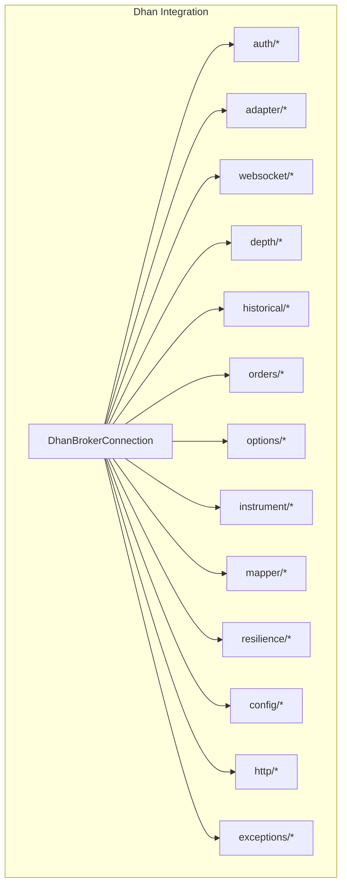

**Diagram sources**
- [DhanBrokerConnection.java](file://broker/dhan/src/main/java/com/tradej/broker/dhan/DhanBrokerConnection.java)
- [DhanTokenManager.java](file://broker/dhan/src/main/java/com/tradej/broker/dhan/auth/DhanTokenManager.java)
- [DhanMarketDataProvider.java](file://broker/dhan/src/main/java/com/tradej/broker/dhan/adapter/DhanMarketDataProvider.java)
- [DhanMarketFeedWebSocketClient.java](file://broker/dhan/src/main/java/com/tradej/broker/dhan/websocket/DhanMarketFeedWebSocketClient.java)
- [DhanRestOrderClient.java](file://broker/dhan/src/main/java/com/tradej/broker/dhan/orders/DhanRestOrderClient.java)
- [DhanOptionChainClient.java](file://broker/dhan/src/main/java/com/tradej/broker/dhan/options/DhanOptionChainClient.java)
- [DhanHistoricalDataClient.java](file://broker/dhan/src/main/java/com/tradej/broker/dhan/historical/DhanHistoricalDataClient.java)
- [DhanInstrumentCatalog.java](file://broker/dhan/src/main/java/com/tradej/broker/dhan/instrument/DhanInstrumentCatalog.java)
- [DhanAuthenticatedHttpClient.java](file://broker/dhan/src/main/java/com/tradej/broker/dhan/http/DhanAuthenticatedHttpClient.java)
- [DhanRetryExecutor.java](file://broker/dhan/src/main/java/com/tradej/broker/dhan/resilience/DhanRetryExecutor.java)
- [DhanApiEnvironment.java](file://broker/dhan/src/main/java/com/tradej/broker/dhan/config/DhanApiEnvironment.java)

**Section sources**
- [DhanBrokerConnection.java](file://broker/dhan/src/main/java/com/tradej/broker/dhan/DhanBrokerConnection.java)

## Core Components
- Authentication and Token Management: Centralized token lifecycle, provider, and state management for secure API access.
- Market Data Streaming: WebSocket clients for real-time market feeds and depth feeds, with binary parsing and subscription management.
- Historical Data Access: REST client and mapper for OHLCV bars and other historical datasets.
- Order Management: REST client and adapters for placing, modifying, canceling, and querying orders.
- Options Trading: Clients and mappers for option chain retrieval, strike selection, and rolling options handling.
- Portfolio and Risk: Providers for portfolio holdings, margins, and session risk monitoring.
- Instrument Catalog: Loader and normalizer for instrument definitions and segment mapping.
- Resilience and Exceptions: Retry executor and exception utilities for robust error handling.
- Configuration: Environment-specific settings and connection parameters.

**Section sources**
- [DhanTokenManager.java](file://broker/dhan/src/main/java/com/tradej/broker/dhan/auth/DhanTokenManager.java)
- [DhanMarketDataProvider.java](file://broker/dhan/src/main/java/com/tradej/broker/dhan/adapter/DhanMarketDataProvider.java)
- [DhanMarketFeedWebSocketClient.java](file://broker/dhan/src/main/java/com/tradej/broker/dhan/websocket/DhanMarketFeedWebSocketClient.java)
- [DhanHistoricalDataClient.java](file://broker/dhan/src/main/java/com/tradej/broker/dhan/historical/DhanHistoricalDataClient.java)
- [DhanRestOrderClient.java](file://broker/dhan/src/main/java/com/tradej/broker/dhan/orders/DhanRestOrderClient.java)
- [DhanOptionChainClient.java](file://broker/dhan/src/main/java/com/tradej/broker/dhan/options/DhanOptionChainClient.java)
- [DhanPortfolioProvider.java](file://broker/dhan/src/main/java/com/tradej/broker/dhan/adapter/DhanPortfolioProvider.java)
- [DhanMarginProvider.java](file://broker/dhan/src/main/java/com/tradej/broker/dhan/adapter/DhanMarginProvider.java)
- [DhanSessionRiskProvider.java](file://broker/dhan/src/main/java/com/tradej/broker/dhan/adapter/DhanSessionRiskProvider.java)
- [DhanInstrumentCatalog.java](file://broker/dhan/src/main/java/com/tradej/broker/dhan/instrument/DhanInstrumentCatalog.java)
- [DhanRetryExecutor.java](file://broker/dhan/src/main/java/com/tradej/broker/dhan/resilience/DhanRetryExecutor.java)
- [DhanExceptionUtil.java](file://broker/dhan/src/main/java/com/tradej/broker/dhan/exceptions/DhanExceptionUtil.java)

## Architecture Overview
The Dhan integration follows a layered architecture:
- Connection orchestration via DhanBrokerConnection
- Adapter pattern for domain-specific operations (market data, orders, portfolio)
- WebSocket clients for streaming feeds and depth
- REST clients for historical data and order operations
- Instrument resolution and normalization
- Resilience and exception handling
- Configuration and environment-aware settings

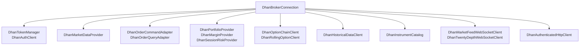

**Diagram sources**
- [DhanBrokerConnection.java](file://broker/dhan/src/main/java/com/tradej/broker/dhan/DhanBrokerConnection.java)
- [DhanTokenManager.java](file://broker/dhan/src/main/java/com/tradej/broker/dhan/auth/DhanTokenManager.java)
- [DhanMarketDataProvider.java](file://broker/dhan/src/main/java/com/tradej/broker/dhan/adapter/DhanMarketDataProvider.java)
- [DhanOrderCommandAdapter.java](file://broker/dhan/src/main/java/com/tradej/broker/dhan/adapter/DhanOrderCommandAdapter.java)
- [DhanOrderQueryAdapter.java](file://broker/dhan/src/main/java/com/tradej/broker/dhan/adapter/DhanOrderQueryAdapter.java)
- [DhanPortfolioProvider.java](file://broker/dhan/src/main/java/com/tradej/broker/dhan/adapter/DhanPortfolioProvider.java)
- [DhanMarginProvider.java](file://broker/dhan/src/main/java/com/tradej/broker/dhan/adapter/DhanMarginProvider.java)
- [DhanSessionRiskProvider.java](file://broker/dhan/src/main/java/com/tradej/broker/dhan/adapter/DhanSessionRiskProvider.java)
- [DhanOptionChainClient.java](file://broker/dhan/src/main/java/com/tradej/broker/dhan/options/DhanOptionChainClient.java)
- [DhanRollingOptionClient.java](file://broker/dhan/src/main/java/com/tradej/broker/dhan/options/DhanRollingOptionClient.java)
- [DhanHistoricalDataClient.java](file://broker/dhan/src/main/java/com/tradej/broker/dhan/historical/DhanHistoricalDataClient.java)
- [DhanInstrumentCatalog.java](file://broker/dhan/src/main/java/com/tradej/broker/dhan/instrument/DhanInstrumentCatalog.java)
- [DhanMarketFeedWebSocketClient.java](file://broker/dhan/src/main/java/com/tradej/broker/dhan/websocket/DhanMarketFeedWebSocketClient.java)
- [DhanTwentyDepthWebSocketClient.java](file://broker/dhan/src/main/java/com/tradej/broker/dhan/depth/DhanTwentyDepthWebSocketClient.java)
- [DhanAuthenticatedHttpClient.java](file://broker/dhan/src/main/java/com/tradej/broker/dhan/http/DhanAuthenticatedHttpClient.java)

## Detailed Component Analysis

### Authentication System and Session Handling
The authentication subsystem manages OAuth-style token acquisition, refresh, and state persistence. It includes:
- Token provider and manager for lifecycle operations
- Token info and state representation
- Token state store for persistence
- Auth client for initiating authentication flows
- Optional TOTP generation support

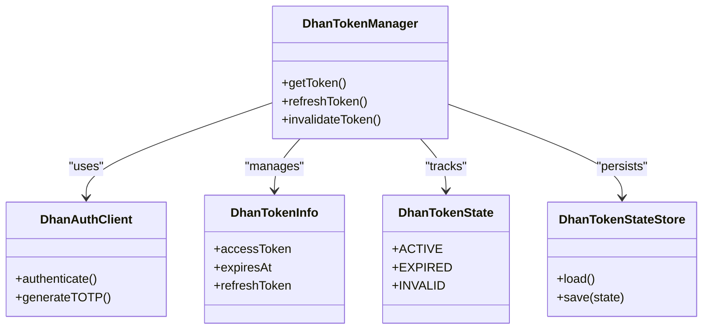

**Diagram sources**
- [DhanTokenManager.java](file://broker/dhan/src/main/java/com/tradej/broker/dhan/auth/DhanTokenManager.java)
- [DhanAuthClient.java](file://broker/dhan/src/main/java/com/tradej/broker/dhan/auth/DhanAuthClient.java)
- [DhanTokenInfo.java](file://broker/dhan/src/main/java/com/tradej/broker/dhan/auth/DhanTokenInfo.java)
- [DhanTokenState.java](file://broker/dhan/src/main/java/com/tradej/broker/dhan/auth/DhanTokenState.java)
- [DhanTokenStateStore.java](file://broker/dhan/src/main/java/com/tradej/broker/dhan/auth/DhanTokenStateStore.java)

Key flows:
- Token acquisition and refresh are orchestrated by the token manager, which delegates to the auth client.
- Token state transitions are tracked and persisted via the token state store.
- TOTP generation supports two-factor authentication scenarios.

Practical example references:
- [DhanTokenLifecycleIntegrationTest.java](file://app/src/test/java/com/tradej/app/integration/DhanTokenLifecycleIntegrationTest.java)
- [DhanTokenForcedGenerationIntegrationTest.java](file://app/src/test/java/com/tradej/app/integration/DhanTokenForcedGenerationIntegrationTest.java)
- [DhanRefreshProductionTokenIntegrationTest.java](file://app/src/test/java/com/tradej/app/integration/DhanRefreshProductionTokenIntegrationTest.java)
- [LiveDhanAuthSession.java](file://app/src/test/java/com/tradej/app/integration/LiveDhanAuthSession.java)

**Section sources**
- [DhanTokenManager.java](file://broker/dhan/src/main/java/com/tradej/broker/dhan/auth/DhanTokenManager.java)
- [DhanAuthClient.java](file://broker/dhan/src/main/java/com/tradej/broker/dhan/auth/DhanAuthClient.java)
- [DhanTokenInfo.java](file://broker/dhan/src/main/java/com/tradej/broker/dhan/auth/DhanTokenInfo.java)
- [DhanTokenStateStore.java](file://broker/dhan/src/main/java/com/tradej/broker/dhan/auth/DhanTokenStateStore.java)
- [DhanTokenState.java](file://broker/dhan/src/main/java/com/tradej/broker/dhan/auth/DhanTokenState.java)
- [DhanTotpGenerator.java](file://broker/dhan/src/main/java/com/tradej/broker/dhan/auth/DhanTotpGenerator.java)

### Market Data Streaming
Real-time market data is delivered via WebSocket connections with specialized binary parsers and subscription management.

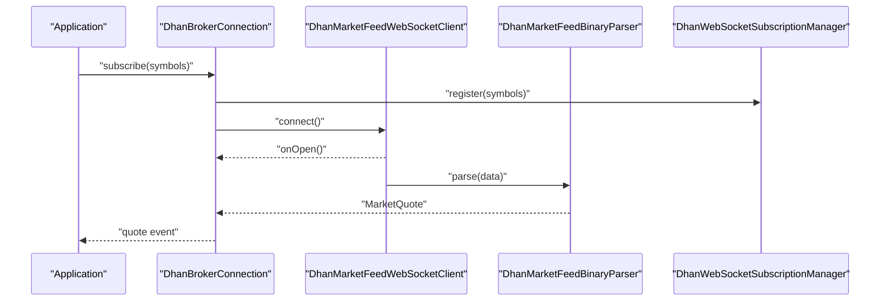

**Diagram sources**
- [DhanMarketFeedWebSocketClient.java](file://broker/dhan/src/main/java/com/tradej/broker/dhan/websocket/DhanMarketFeedWebSocketClient.java)
- [DhanMarketFeedBinaryParser.java](file://broker/dhan/src/main/java/com/tradej/broker/dhan/websocket/feed/DhanMarketFeedBinaryParser.java)
- [DhanWebSocketSubscriptionManager.java](file://broker/dhan/src/main/java/com/tradej/broker/dhan/websocket/DhanWebSocketSubscriptionManager.java)

Additional depth streaming:
- Twenty-depth WebSocket client handles depth book updates.
- Binary parser decodes exchange-specific wire formats.

Practical example references:
- [DhanMarketFeedWebSocketFullIntegrationTest.java](file://app/src/test/java/com/tradej/app/integration/DhanMarketFeedWebSocketFullIntegrationTest.java)
- [DhanMarketFeedWebSocketIntegrationTest.java](file://app/src/test/java/com/tradej/app/integration/DhanMarketFeedWebSocketIntegrationTest.java)
- [DhanMarketFeedWebSocketQuoteIntegrationTest.java](file://app/src/test/java/com/tradej/app/integration/DhanMarketFeedWebSocketQuoteIntegrationTest.java)
- [DhanMarketDepthIntegrationTest.java](file://app/src/test/java/com/tradej/app/integration/DhanMarketDepthIntegrationTest.java)

**Section sources**
- [DhanMarketDataProvider.java](file://broker/dhan/src/main/java/com/tradej/broker/dhan/adapter/DhanMarketDataProvider.java)
- [DhanMarketFeedWebSocketClient.java](file://broker/dhan/src/main/java/com/tradej/broker/dhan/websocket/DhanMarketFeedWebSocketClient.java)
- [DhanBinaryParser.java](file://broker/dhan/src/main/java/com/tradej/broker/dhan/websocket/DhanBinaryParser.java)
- [DhanMarketFeedBinaryParser.java](file://broker/dhan/src/main/java/com/tradej/broker/dhan/websocket/feed/DhanMarketFeedBinaryParser.java)
- [DhanTwentyDepthWebSocketClient.java](file://broker/dhan/src/main/java/com/tradej/broker/dhan/depth/DhanTwentyDepthWebSocketClient.java)
- [DhanWebSocketHealthMonitor.java](file://broker/dhan/src/main/java/com/tradej/broker/dhan/websocket/DhanWebSocketHealthMonitor.java)

### Historical Data Access
Historical data is retrieved via REST endpoints and mapped to internal bar structures.

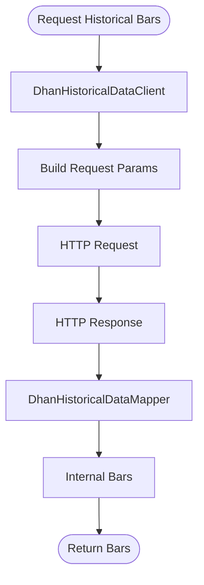

**Diagram sources**
- [DhanHistoricalDataClient.java](file://broker/dhan/src/main/java/com/tradej/broker/dhan/historical/DhanHistoricalDataClient.java)
- [DhanHistoricalDataMapper.java](file://broker/dhan/src/main/java/com/tradej/broker/dhan/historical/DhanHistoricalDataMapper.java)

Practical example references:
- [DhanHistoricalDataIntegrationTest.java](file://app/src/test/java/com/tradej/app/integration/DhanHistoricalDataIntegrationTest.java)

**Section sources**
- [DhanHistoricalDataClient.java](file://broker/dhan/src/main/java/com/tradej/broker/dhan/historical/DhanHistoricalDataClient.java)
- [DhanHistoricalDataMapper.java](file://broker/dhan/src/main/java/com/tradej/broker/dhan/historical/DhanHistoricalDataMapper.java)

### Order Management
Order operations are handled through REST clients and adapters that translate domain commands to broker-specific requests.

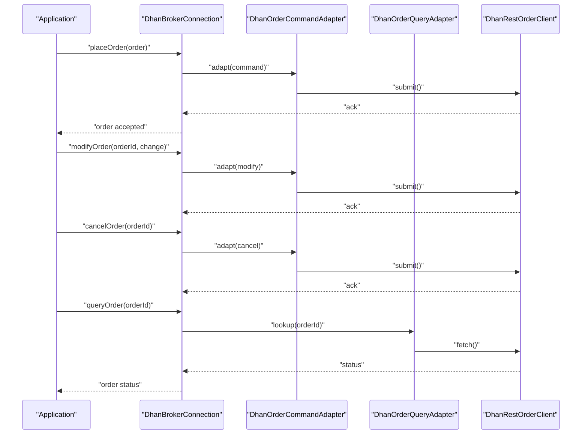

**Diagram sources**
- [DhanRestOrderClient.java](file://broker/dhan/src/main/java/com/tradej/broker/dhan/orders/DhanRestOrderClient.java)
- [DhanOrderCommandAdapter.java](file://broker/dhan/src/main/java/com/tradej/broker/dhan/adapter/DhanOrderCommandAdapter.java)
- [DhanOrderQueryAdapter.java](file://broker/dhan/src/main/java/com/tradej/broker/dhan/adapter/DhanOrderQueryAdapter.java)

Practical example references:
- [DhanOrderLifecycleIntegrationTest.java](file://app/src/test/java/com/tradej/app/integration/DhanOrderLifecycleIntegrationTest.java)
- [DhanOrderModifyIntegrationTest.java](file://app/src/test/java/com/tradej/app/integration/DhanOrderModifyIntegrationTest.java)
- [DhanOrderQueryIntegrationTest.java](file://app/src/test/java/com/tradej/app/integration/DhanOrderQueryIntegrationTest.java)
- [DhanOrderQueryLiveIntegrationTest.java](file://app/src/test/java/com/tradej/app/integration/DhanOrderQueryLiveIntegrationTest.java)

**Section sources**
- [DhanRestOrderClient.java](file://broker/dhan/src/main/java/com/tradej/broker/dhan/orders/DhanRestOrderClient.java)
- [DhanOrderCommandAdapter.java](file://broker/dhan/src/main/java/com/tradej/broker/dhan/adapter/DhanOrderCommandAdapter.java)
- [DhanOrderQueryAdapter.java](file://broker/dhan/src/main/java/com/tradej/broker/dhan/adapter/DhanOrderQueryAdapter.java)
- [DhanOrderValidator.java](file://broker/dhan/src/main/java/com/tradej/broker/dhan/validator/DhanOrderValidator.java)

### Options Trading Support
Options functionality includes option chain retrieval, strike selection, and rolling options handling.

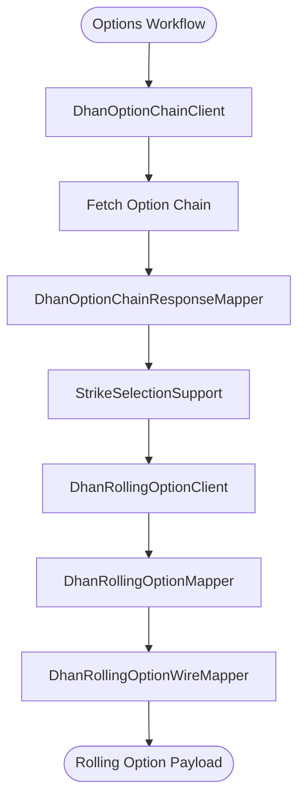

**Diagram sources**
- [DhanOptionChainClient.java](file://broker/dhan/src/main/java/com/tradej/broker/dhan/options/DhanOptionChainClient.java)
- [DhanOptionChainResponseMapper.java](file://broker/dhan/src/main/java/com/tradej/broker/dhan/options/DhanOptionChainResponseMapper.java)
- [DhanRollingOptionClient.java](file://broker/dhan/src/main/java/com/tradej/broker/dhan/options/DhanRollingOptionClient.java)
- [DhanRollingOptionMapper.java](file://broker/dhan/src/main/java/com/tradej/broker/dhan/options/DhanRollingOptionMapper.java)
- [DhanRollingOptionWireMapper.java](file://broker/dhan/src/main/java/com/tradej/broker/dhan/options/DhanRollingOptionWireMapper.java)
- [OptionExpiryCache.java](file://broker/dhan/src/main/java/com/tradej/broker/dhan/options/OptionExpiryCache.java)
- [StrikeSelectionSupport.java](file://broker/dhan/src/main/java/com/tradej/broker/dhan/options/StrikeSelectionSupport.java)

Practical example references:
- [DhanStrikeSelectionIntegrationTest.java](file://app/src/test/java/com/tradej/app/integration/DhanStrikeSelectionIntegrationTest.java)
- [DhanRollingOptionDownloadIntegrationTest.java](file://app/src/test/java/com/tradej/app/integration/DhanRollingOptionDownloadIntegrationTest.java)
- [DhanRollingOptionIntegrationTest.java](file://app/src/test/java/com/tradej/app/integration/DhanRollingOptionIntegrationTest.java)

**Section sources**
- [DhanOptionChainClient.java](file://broker/dhan/src/main/java/com/tradej/broker/dhan/options/DhanOptionChainClient.java)
- [DhanOptionChainResponseMapper.java](file://broker/dhan/src/main/java/com/tradej/broker/dhan/options/DhanOptionChainResponseMapper.java)
- [DhanRollingOptionClient.java](file://broker/dhan/src/main/java/com/tradej/broker/dhan/options/DhanRollingOptionClient.java)
- [DhanRollingOptionMapper.java](file://broker/dhan/src/main/java/com/tradej/broker/dhan/options/DhanRollingOptionMapper.java)
- [DhanRollingOptionWireMapper.java](file://broker/dhan/src/main/java/com/tradej/broker/dhan/options/DhanRollingOptionWireMapper.java)
- [OptionExpiryCache.java](file://broker/dhan/src/main/java/com/tradej/broker/dhan/options/OptionExpiryCache.java)
- [StrikeSelectionSupport.java](file://broker/dhan/src/main/java/com/tradej/broker/dhan/options/StrikeSelectionSupport.java)

### Portfolio Management, Margin Calculation, and Risk Monitoring
Portfolio and risk capabilities are exposed via dedicated providers:
- Portfolio provider retrieves holdings and positions
- Margin provider computes exposure and margin requirements
- Session risk provider monitors intraday risk limits and alerts

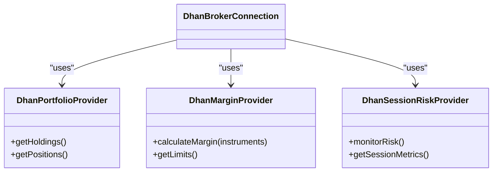

**Diagram sources**
- [DhanPortfolioProvider.java](file://broker/dhan/src/main/java/com/tradej/broker/dhan/adapter/DhanPortfolioProvider.java)
- [DhanMarginProvider.java](file://broker/dhan/src/main/java/com/tradej/broker/dhan/adapter/DhanMarginProvider.java)
- [DhanSessionRiskProvider.java](file://broker/dhan/src/main/java/com/tradej/broker/dhan/adapter/DhanSessionRiskProvider.java)

Practical example references:
- [DhanPortfolioIntegrationTest.java](file://app/src/test/java/com/tradej/app/integration/DhanPortfolioIntegrationTest.java)
- [DhanMarginIntegrationTest.java](file://app/src/test/java/com/tradej/app/integration/DhanMarginIntegrationTest.java)
- [DhanSessionRiskIntegrationTest.java](file://app/src/test/java/com/tradej/app/integration/DhanSessionRiskIntegrationTest.java)

**Section sources**
- [DhanPortfolioProvider.java](file://broker/dhan/src/main/java/com/tradej/broker/dhan/adapter/DhanPortfolioProvider.java)
- [DhanMarginProvider.java](file://broker/dhan/src/main/java/com/tradej/broker/dhan/adapter/DhanMarginProvider.java)
- [DhanSessionRiskProvider.java](file://broker/dhan/src/main/java/com/tradej/broker/dhan/adapter/DhanSessionRiskProvider.java)

### Configuration and Rate Limiting
Configuration is environment-driven and includes connection settings and endpoints. Rate limiting is enforced through category-based throttling and retry policies.

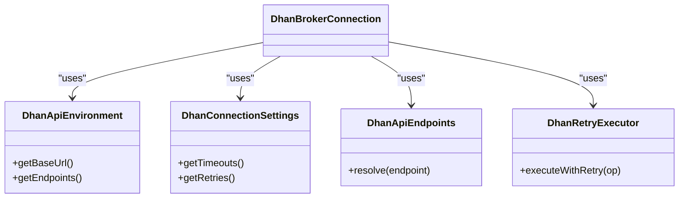

**Diagram sources**
- [DhanApiEnvironment.java](file://broker/dhan/src/main/java/com/tradej/broker/dhan/config/DhanApiEnvironment.java)
- [DhanConnectionSettings.java](file://broker/dhan/src/main/java/com/tradej/broker/dhan/config/DhanConnectionSettings.java)
- [DhanApiEndpoints.java](file://broker/dhan/src/main/java/com/tradej/broker/dhan/constants/DhanApiEndpoints.java)
- [DhanRetryExecutor.java](file://broker/dhan/src/main/java/com/tradej/broker/dhan/resilience/DhanRetryExecutor.java)

Practical example references:
- [DhanBrokerStartup.java](file://broker/dhan/src/main/java/com/tradej/broker/dhan/config/DhanBrokerStartup.java)
- [dhan-local.properties.example](file://config/dhan-local.properties.example)
- [dhan-sandbox.properties.example](file://config/dhan-sandbox.properties.example)

**Section sources**
- [DhanApiEnvironment.java](file://broker/dhan/src/main/java/com/tradej/broker/dhan/config/DhanApiEnvironment.java)
- [DhanConnectionSettings.java](file://broker/dhan/src/main/java/com/tradej/broker/dhan/config/DhanConnectionSettings.java)
- [DhanApiEndpoints.java](file://broker/dhan/src/main/java/com/tradej/broker/dhan/constants/DhanApiEndpoints.java)
- [DhanRetryExecutor.java](file://broker/dhan/src/main/java/com/tradej/broker/dhan/resilience/DhanRetryExecutor.java)

### Error Handling Patterns
Robust error handling is implemented via exception utilities and categorized exceptions for HTTP, validation, and broker-specific errors.

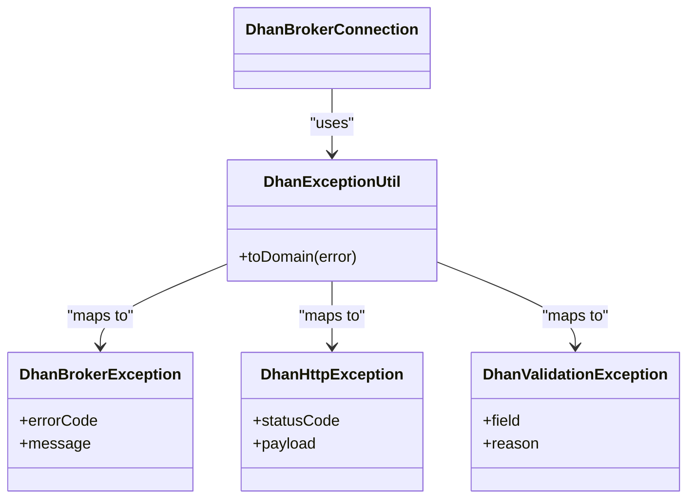

**Diagram sources**
- [DhanExceptionUtil.java](file://broker/dhan/src/main/java/com/tradej/broker/dhan/exceptions/DhanExceptionUtil.java)
- [DhanBrokerException.java](file://broker/dhan/src/main/java/com/tradej/broker/dhan/exceptions/DhanBrokerException.java)
- [DhanHttpException.java](file://broker/dhan/src/main/java/com/tradej/broker/dhan/exceptions/DhanHttpException.java)
- [DhanValidationException.java](file://broker/dhan/src/main/java/com/tradej/broker/dhan/exceptions/DhanValidationException.java)

**Section sources**
- [DhanExceptionUtil.java](file://broker/dhan/src/main/java/com/tradej/broker/dhan/exceptions/DhanExceptionUtil.java)
- [DhanBrokerException.java](file://broker/dhan/src/main/java/com/tradej/broker/dhan/exceptions/DhanBrokerException.java)
- [DhanHttpException.java](file://broker/dhan/src/main/java/com/tradej/broker/dhan/exceptions/DhanHttpException.java)
- [DhanValidationException.java](file://broker/dhan/src/main/java/com/tradej/broker/dhan/exceptions/DhanValidationException.java)

## Dependency Analysis
The Dhan integration exhibits strong cohesion within functional domains and low coupling through adapters and shared clients.

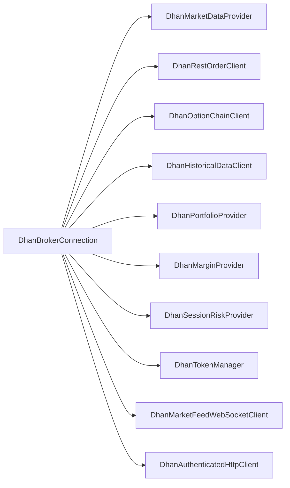

**Diagram sources**
- [DhanBrokerConnection.java](file://broker/dhan/src/main/java/com/tradej/broker/dhan/DhanBrokerConnection.java)
- [DhanMarketDataProvider.java](file://broker/dhan/src/main/java/com/tradej/broker/dhan/adapter/DhanMarketDataProvider.java)
- [DhanRestOrderClient.java](file://broker/dhan/src/main/java/com/tradej/broker/dhan/orders/DhanRestOrderClient.java)
- [DhanOptionChainClient.java](file://broker/dhan/src/main/java/com/tradej/broker/dhan/options/DhanOptionChainClient.java)
- [DhanHistoricalDataClient.java](file://broker/dhan/src/main/java/com/tradej/broker/dhan/historical/DhanHistoricalDataClient.java)
- [DhanPortfolioProvider.java](file://broker/dhan/src/main/java/com/tradej/broker/dhan/adapter/DhanPortfolioProvider.java)
- [DhanMarginProvider.java](file://broker/dhan/src/main/java/com/tradej/broker/dhan/adapter/DhanMarginProvider.java)
- [DhanSessionRiskProvider.java](file://broker/dhan/src/main/java/com/tradej/broker/dhan/adapter/DhanSessionRiskProvider.java)
- [DhanTokenManager.java](file://broker/dhan/src/main/java/com/tradej/broker/dhan/auth/DhanTokenManager.java)
- [DhanMarketFeedWebSocketClient.java](file://broker/dhan/src/main/java/com/tradej/broker/dhan/websocket/DhanMarketFeedWebSocketClient.java)
- [DhanAuthenticatedHttpClient.java](file://broker/dhan/src/main/java/com/tradej/broker/dhan/http/DhanAuthenticatedHttpClient.java)

**Section sources**
- [DhanBrokerConnection.java](file://broker/dhan/src/main/java/com/tradej/broker/dhan/DhanBrokerConnection.java)

## Performance Considerations
- WebSocket multiplexing and subscription management reduce connection overhead and improve throughput for high-frequency feeds.
- Binary parsing minimizes CPU overhead for real-time data processing.
- Retry executor with exponential backoff mitigates transient failures while avoiding overload.
- Instrument catalog caching reduces repeated network calls for symbol resolution.
- Category-based rate limiting prevents throttling and improves stability under load.

[No sources needed since this section provides general guidance]

## Troubleshooting Guide
Common issues and resolutions:
- Authentication failures: Verify token state and refresh cycles; check TOTP generation if enabled.
- WebSocket disconnections: Inspect health monitor and reconnection logic; validate subscription registration.
- Order submission errors: Validate order payload via order validator; inspect HTTP exceptions and broker error codes.
- Historical data gaps: Confirm request parameters and mapper correctness; handle partial responses gracefully.
- Options chain anomalies: Validate expiry cache and strike selection logic; ensure proper wire mapping for rolling options.

Practical example references:
- [DhanTokenLifecycleIntegrationTest.java](file://app/src/test/java/com/tradej/app/integration/DhanTokenLifecycleIntegrationTest.java)
- [DhanMarketFeedWebSocketIntegrationTest.java](file://app/src/test/java/com/tradej/app/integration/DhanMarketFeedWebSocketIntegrationTest.java)
- [DhanOrderQueryIntegrationTest.java](file://app/src/test/java/com/tradej/app/integration/DhanOrderQueryIntegrationTest.java)
- [DhanHistoricalDataIntegrationTest.java](file://app/src/test/java/com/tradej/app/integration/DhanHistoricalDataIntegrationTest.java)
- [DhanRollingOptionIntegrationTest.java](file://app/src/test/java/com/tradej/app/integration/DhanRollingOptionIntegrationTest.java)

**Section sources**
- [DhanExceptionUtil.java](file://broker/dhan/src/main/java/com/tradej/broker/dhan/exceptions/DhanExceptionUtil.java)
- [DhanBrokerException.java](file://broker/dhan/src/main/java/com/tradej/broker/dhan/exceptions/DhanBrokerException.java)
- [DhanHttpException.java](file://broker/dhan/src/main/java/com/tradej/broker/dhan/exceptions/DhanHttpException.java)
- [DhanValidationException.java](file://broker/dhan/src/main/java/com/tradej/broker/dhan/exceptions/DhanValidationException.java)

## Conclusion
The Dhan broker integration provides a robust, resilient, and feature-complete interface for trading operations in India’s derivatives and equity markets. Its modular design, comprehensive error handling, and extensive testing coverage enable reliable production deployments. The documented components and flows serve as a blueprint for connecting, subscribing, and trading via Dhan.

[No sources needed since this section summarizes without analyzing specific files]

## Appendices

### Practical Examples Index
- Connecting to Dhan and authenticating:
  - [LiveDhanAuthSession.java](file://app/src/test/java/com/tradej/app/integration/LiveDhanAuthSession.java)
  - [DhanTokenLifecycleIntegrationTest.java](file://app/src/test/java/com/tradej/app/integration/DhanTokenLifecycleIntegrationTest.java)
- Subscribing to market data:
  - [DhanMarketFeedWebSocketFullIntegrationTest.java](file://app/src/test/java/com/tradej/app/integration/DhanMarketFeedWebSocketFullIntegrationTest.java)
  - [DhanMarketDepthIntegrationTest.java](file://app/src/test/java/com/tradej/app/integration/DhanMarketDepthIntegrationTest.java)
- Executing orders:
  - [DhanOrderLifecycleIntegrationTest.java](file://app/src/test/java/com/tradej/app/integration/DhanOrderLifecycleIntegrationTest.java)
  - [DhanOrderModifyIntegrationTest.java](file://app/src/test/java/com/tradej/app/integration/DhanOrderModifyIntegrationTest.java)
  - [DhanOrderQueryIntegrationTest.java](file://app/src/test/java/com/tradej/app/integration/DhanOrderQueryIntegrationTest.java)
- Historical data retrieval:
  - [DhanHistoricalDataIntegrationTest.java](file://app/src/test/java/com/tradej/app/integration/DhanHistoricalDataIntegrationTest.java)
- Options trading:
  - [DhanStrikeSelectionIntegrationTest.java](file://app/src/test/java/com/tradej/app/integration/DhanStrikeSelectionIntegrationTest.java)
  - [DhanRollingOptionDownloadIntegrationTest.java](file://app/src/test/java/com/tradej/app/integration/DhanRollingOptionDownloadIntegrationTest.java)
  - [DhanRollingOptionIntegrationTest.java](file://app/src/test/java/com/tradej/app/integration/DhanRollingOptionIntegrationTest.java)
- Portfolio, margin, and risk:
  - [DhanPortfolioIntegrationTest.java](file://app/src/test/java/com/tradej/app/integration/DhanPortfolioIntegrationTest.java)
  - [DhanMarginIntegrationTest.java](file://app/src/test/java/com/tradej/app/integration/DhanMarginIntegrationTest.java)
  - [DhanSessionRiskIntegrationTest.java](file://app/src/test/java/com/tradej/app/integration/DhanSessionRiskIntegrationTest.java)

**Section sources**
- [LiveDhanAuthSession.java](file://app/src/test/java/com/tradej/app/integration/LiveDhanAuthSession.java)
- [DhanTokenLifecycleIntegrationTest.java](file://app/src/test/java/com/tradej/app/integration/DhanTokenLifecycleIntegrationTest.java)
- [DhanMarketFeedWebSocketFullIntegrationTest.java](file://app/src/test/java/com/tradej/app/integration/DhanMarketFeedWebSocketFullIntegrationTest.java)
- [DhanMarketDepthIntegrationTest.java](file://app/src/test/java/com/tradej/app/integration/DhanMarketDepthIntegrationTest.java)
- [DhanOrderLifecycleIntegrationTest.java](file://app/src/test/java/com/tradej/app/integration/DhanOrderLifecycleIntegrationTest.java)
- [DhanOrderModifyIntegrationTest.java](file://app/src/test/java/com/tradej/app/integration/DhanOrderModifyIntegrationTest.java)
- [DhanOrderQueryIntegrationTest.java](file://app/src/test/java/com/tradej/app/integration/DhanOrderQueryIntegrationTest.java)
- [DhanHistoricalDataIntegrationTest.java](file://app/src/test/java/com/tradej/app/integration/DhanHistoricalDataIntegrationTest.java)
- [DhanStrikeSelectionIntegrationTest.java](file://app/src/test/java/com/tradej/app/integration/DhanStrikeSelectionIntegrationTest.java)
- [DhanRollingOptionDownloadIntegrationTest.java](file://app/src/test/java/com/tradej/app/integration/DhanRollingOptionDownloadIntegrationTest.java)
- [DhanRollingOptionIntegrationTest.java](file://app/src/test/java/com/tradej/app/integration/DhanRollingOptionIntegrationTest.java)
- [DhanPortfolioIntegrationTest.java](file://app/src/test/java/com/tradej/app/integration/DhanPortfolioIntegrationTest.java)
- [DhanMarginIntegrationTest.java](file://app/src/test/java/com/tradej/app/integration/DhanMarginIntegrationTest.java)
- [DhanSessionRiskIntegrationTest.java](file://app/src/test/java/com/tradej/app/integration/DhanSessionRiskIntegrationTest.java)