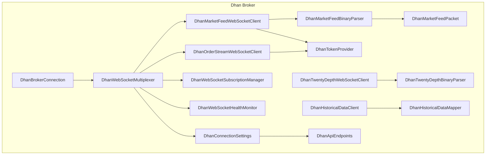
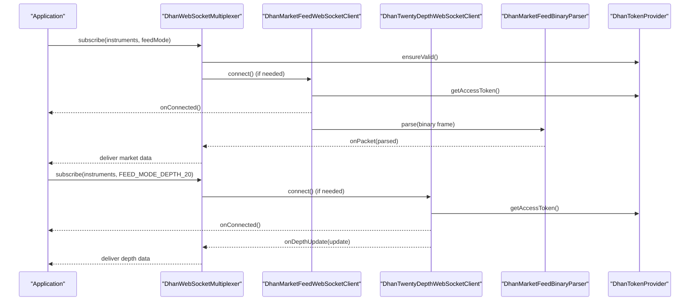
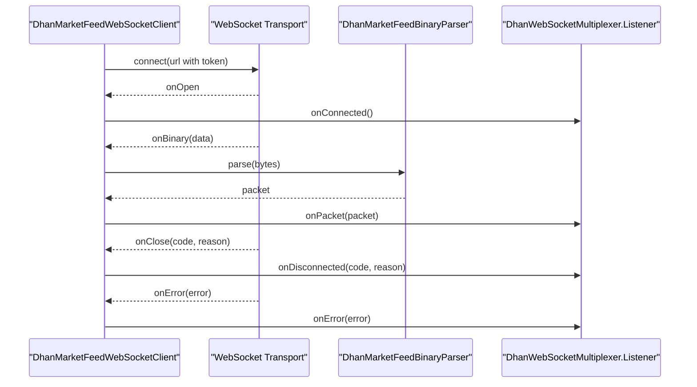
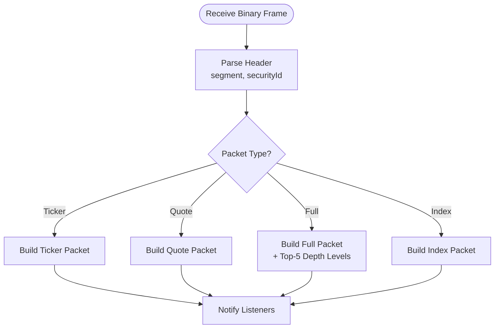
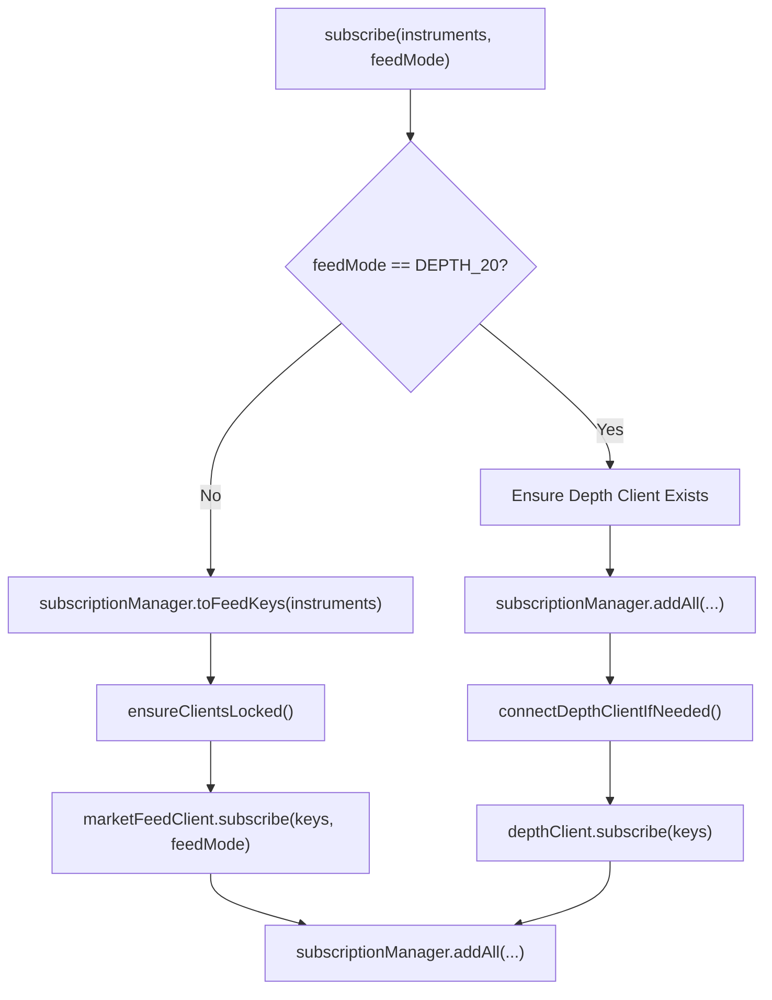
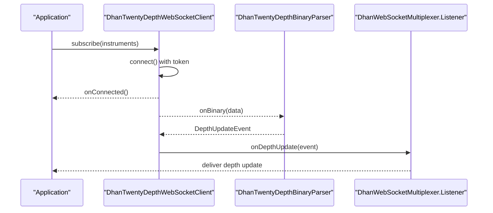
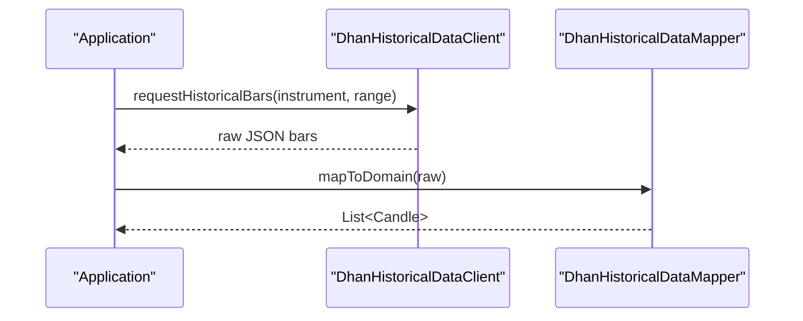
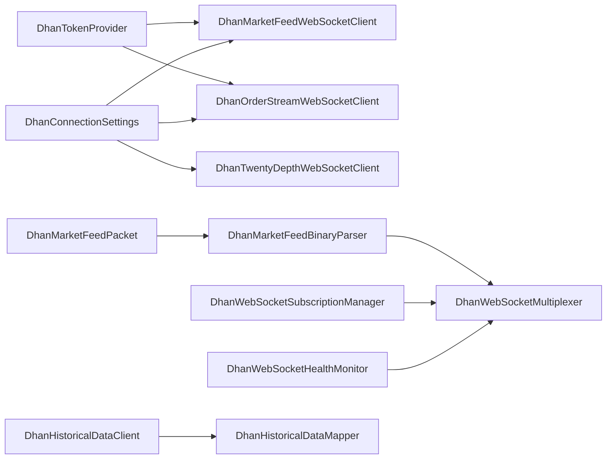

# Market Data Streaming

<cite>
**Referenced Files in This Document**
- [DhanBrokerConnection.java](file://broker/dhan/src/main/java/com/tradej/broker/dhan/DhanBrokerConnection.java)
- [DhanWebSocketMultiplexer.java](file://broker/dhan/src/main/java/com/tradej/broker/dhan/websocket/DhanWebSocketMultiplexer.java)
- [DhanMarketFeedWebSocketClient.java](file://broker/dhan/src/main/java/com/tradej/broker/dhan/websocket/DhanMarketFeedWebSocketClient.java)
- [DhanOrderStreamWebSocketClient.java](file://broker/dhan/src/main/java/com/tradej/broker/dhan/websocket/DhanOrderStreamWebSocketClient.java)
- [DhanMarketFeedBinaryParser.java](file://broker/dhan/src/main/java/com/tradej/broker/dhan/websocket/feed/DhanMarketFeedBinaryParser.java)
- [DhanMarketFeedPacket.java](file://broker/dhan/src/main/java/com/tradej/broker/dhan/websocket/feed/DhanMarketFeedPacket.java)
- [DhanTwentyDepthWebSocketClient.java](file://broker/dhan/src/main/java/com/tradej/broker/dhan/depth/DhanTwentyDepthWebSocketClient.java)
- [DhanTwentyDepthBinaryParser.java](file://broker/dhan/src/main/java/com/tradej/broker/dhan/depth/DhanTwentyDepthBinaryParser.java)
- [DhanHistoricalDataClient.java](file://broker/dhan/src/main/java/com/tradej/broker/dhan/historical/DhanHistoricalDataClient.java)
- [DhanHistoricalDataMapper.java](file://broker/dhan/src/main/java/com/tradej/broker/dhan/historical/DhanHistoricalDataMapper.java)
- [DhanApiEndpoints.java](file://broker/dhan/src/main/java/com/tradej/broker/dhan/constants/DhanApiEndpoints.java)
- [DhanConnectionSettings.java](file://broker/dhan/src/main/java/com/tradej/broker/dhan/config/DhanConnectionSettings.java)
- [DhanTokenProvider.java](file://broker/dhan/src/main/java/com/tradej/broker/dhan/auth/DhanTokenProvider.java)
- [DhanWebSocketHealthMonitor.java](file://broker/dhan/src/main/java/com/tradej/broker/dhan/websocket/DhanWebSocketHealthMonitor.java)
- [DhanWebSocketSubscriptionManager.java](file://broker/dhan/src/main/java/com/tradej/broker/dhan/websocket/DhanWebSocketSubscriptionManager.java)
- [DhanMarketDataProvider.java](file://broker/dhan/src/main/java/com/tradej/broker/dhan/adapter/DhanMarketDataProvider.java)
- [DhanJsonMapper.java](file://broker/dhan/src/main/java/com/tradej/broker/dhan/mapper/DhanJsonMapper.java)
- [DhanMarketFeedWebSocketFullIntegrationTest.java](file://app/src/test/java/com/tradej/app/integration/DhanMarketFeedWebSocketFullIntegrationTest.java)
- [DhanMarketFeedWebSocketIntegrationTest.java](file://app/src/test/java/com/tradej/app/integration/DhanMarketFeedWebSocketIntegrationTest.java)
- [DhanMarketFeedWebSocketQuoteIntegrationTest.java](file://app/src/test/java/com/tradej/app/integration/DhanMarketFeedWebSocketQuoteIntegrationTest.java)
- [DhanMarketDepthIntegrationTest.java](file://app/src/test/java/com/tradej/app/integration/DhanMarketDepthIntegrationTest.java)
- [DhanTwentyDepthIntegrationTest.java](file://app/src/test/java/com/tradej/app/integration/DhanTwentyDepthIntegrationTest.java)
- [DhanHistoricalDataIntegrationTest.java](file://app/src/test/java/com/tradej/app/integration/DhanHistoricalDataIntegrationTest.java)
</cite>

## Table of Contents
1. [Introduction](#introduction)
2. [Project Structure](#project-structure)
3. [Core Components](#core-components)
4. [Architecture Overview](#architecture-overview)
5. [Detailed Component Analysis](#detailed-component-analysis)
6. [Dependency Analysis](#dependency-analysis)
7. [Performance Considerations](#performance-considerations)
8. [Troubleshooting Guide](#troubleshooting-guide)
9. [Conclusion](#conclusion)
10. [Appendices](#appendices)

## Introduction
This document explains Dhan's market data streaming capabilities within the system. It covers WebSocket connection establishment and maintenance for real-time market data feeds, binary protocol parsing for quotes, depth data, and streaming updates, subscription management for instruments and watchlists, the 20-depth market depth provider, and historical data access patterns. Practical examples demonstrate connecting to market data streams, handling connection drops, and implementing efficient data consumption patterns.

## Project Structure
The Dhan integration resides under broker/dhan and includes:
- WebSocket clients for market feed and order streams
- Binary parsers for live market packets and 20-depth updates
- Subscription managers and multiplexer coordinating connections and resubscription
- Historical data client and mapper
- Token provider and connection settings
- Integration tests validating end-to-end behavior

**Diagram sources**
- [DhanBrokerConnection.java](file://broker/dhan/src/main/java/com/tradej/broker/dhan/DhanBrokerConnection.java)
- [DhanWebSocketMultiplexer.java](file://broker/dhan/src/main/java/com/tradej/broker/dhan/websocket/DhanWebSocketMultiplexer.java)
- [DhanMarketFeedWebSocketClient.java](file://broker/dhan/src/main/java/com/tradej/broker/dhan/websocket/DhanMarketFeedWebSocketClient.java)
- [DhanOrderStreamWebSocketClient.java](file://broker/dhan/src/main/java/com/tradej/broker/dhan/websocket/DhanOrderStreamWebSocketClient.java)
- [DhanMarketFeedBinaryParser.java](file://broker/dhan/src/main/java/com/tradej/broker/dhan/websocket/feed/DhanMarketFeedBinaryParser.java)
- [DhanMarketFeedPacket.java](file://broker/dhan/src/main/java/com/tradej/broker/dhan/websocket/feed/DhanMarketFeedPacket.java)
- [DhanTwentyDepthWebSocketClient.java](file://broker/dhan/src/main/java/com/tradej/broker/dhan/depth/DhanTwentyDepthWebSocketClient.java)
- [DhanTwentyDepthBinaryParser.java](file://broker/dhan/src/main/java/com/tradej/broker/dhan/depth/DhanTwentyDepthBinaryParser.java)
- [DhanHistoricalDataClient.java](file://broker/dhan/src/main/java/com/tradej/broker/dhan/historical/DhanHistoricalDataClient.java)
- [DhanHistoricalDataMapper.java](file://broker/dhan/src/main/java/com/tradej/broker/dhan/historical/DhanHistoricalDataMapper.java)
- [DhanTokenProvider.java](file://broker/dhan/src/main/java/com/tradej/broker/dhan/auth/DhanTokenProvider.java)
- [DhanConnectionSettings.java](file://broker/dhan/src/main/java/com/tradej/broker/dhan/config/DhanConnectionSettings.java)
- [DhanApiEndpoints.java](file://broker/dhan/src/main/java/com/tradej/broker/dhan/constants/DhanApiEndpoints.java)
- [DhanWebSocketHealthMonitor.java](file://broker/dhan/src/main/java/com/tradej/broker/dhan/websocket/DhanWebSocketHealthMonitor.java)
- [DhanWebSocketSubscriptionManager.java](file://broker/dhan/src/main/java/com/tradej/broker/dhan/websocket/DhanWebSocketSubscriptionManager.java)

**Section sources**
- [DhanBrokerConnection.java](file://broker/dhan/src/main/java/com/tradej/broker/dhan/DhanBrokerConnection.java)
- [DhanWebSocketMultiplexer.java](file://broker/dhan/src/main/java/com/tradej/broker/dhan/websocket/DhanWebSocketMultiplexer.java)
- [DhanConnectionSettings.java](file://broker/dhan/src/main/java/com/tradej/broker/dhan/config/DhanConnectionSettings.java)

## Core Components
- DhanWebSocketMultiplexer: Orchestrates market and order stream WebSocket clients, manages subscriptions, handles reconnection and resubscription, and publishes health events.
- DhanMarketFeedWebSocketClient: Establishes and maintains the market data WebSocket connection, parses binary frames, and notifies listeners.
- DhanOrderStreamWebSocketClient: Manages the order stream WebSocket connection for order-related updates.
- DhanMarketFeedBinaryParser: Parses binary protocol frames into structured packets (Ticker, Quote, Full, Index).
- DhanMarketFeedPacket: Sealed interface and records representing parsed market data payloads.
- DhanTwentyDepthWebSocketClient: Dedicated transport for 20-level depth updates with subscription and parsing.
- DhanTwentyDepthBinaryParser: Parses 20-depth binary frames into depth update events.
- DhanHistoricalDataClient and DhanHistoricalDataMapper: Retrieve historical bars and normalize responses.
- DhanTokenProvider and DhanConnectionSettings: Provide access tokens and configure endpoints and client identifiers.
- DhanWebSocketHealthMonitor and DhanWebSocketSubscriptionManager: Track connectivity health and manage subscription state.

**Section sources**
- [DhanWebSocketMultiplexer.java](file://broker/dhan/src/main/java/com/tradej/broker/dhan/websocket/DhanWebSocketMultiplexer.java)
- [DhanMarketFeedWebSocketClient.java](file://broker/dhan/src/main/java/com/tradej/broker/dhan/websocket/DhanMarketFeedWebSocketClient.java)
- [DhanOrderStreamWebSocketClient.java](file://broker/dhan/src/main/java/com/tradej/broker/dhan/websocket/DhanOrderStreamWebSocketClient.java)
- [DhanMarketFeedBinaryParser.java](file://broker/dhan/src/main/java/com/tradej/broker/dhan/websocket/feed/DhanMarketFeedBinaryParser.java)
- [DhanMarketFeedPacket.java](file://broker/dhan/src/main/java/com/tradej/broker/dhan/websocket/feed/DhanMarketFeedPacket.java)
- [DhanTwentyDepthWebSocketClient.java](file://broker/dhan/src/main/java/com/tradej/broker/dhan/depth/DhanTwentyDepthWebSocketClient.java)
- [DhanTwentyDepthBinaryParser.java](file://broker/dhan/src/main/java/com/tradej/broker/dhan/depth/DhanTwentyDepthBinaryParser.java)
- [DhanHistoricalDataClient.java](file://broker/dhan/src/main/java/com/tradej/broker/dhan/historical/DhanHistoricalDataClient.java)
- [DhanHistoricalDataMapper.java](file://broker/dhan/src/main/java/com/tradej/broker/dhan/historical/DhanHistoricalDataMapper.java)
- [DhanTokenProvider.java](file://broker/dhan/src/main/java/com/tradej/broker/dhan/auth/DhanTokenProvider.java)
- [DhanConnectionSettings.java](file://broker/dhan/src/main/java/com/tradej/broker/dhan/config/DhanConnectionSettings.java)
- [DhanWebSocketHealthMonitor.java](file://broker/dhan/src/main/java/com/tradej/broker/dhan/websocket/DhanWebSocketHealthMonitor.java)
- [DhanWebSocketSubscriptionManager.java](file://broker/dhan/src/main/java/com/tradej/broker/dhan/websocket/DhanWebSocketSubscriptionManager.java)

## Architecture Overview
The system establishes two primary WebSocket connections:
- Market feed WebSocket for real-time quotes and full packets
- 20-depth WebSocket for 20-level order book updates
A multiplexer coordinates both transports, manages subscriptions, and ensures resubscription upon reconnect. Historical data is accessed via REST endpoints mapped to domain models.

**Diagram sources**
- [DhanWebSocketMultiplexer.java](file://broker/dhan/src/main/java/com/tradej/broker/dhan/websocket/DhanWebSocketMultiplexer.java)
- [DhanMarketFeedWebSocketClient.java](file://broker/dhan/src/main/java/com/tradej/broker/dhan/websocket/DhanMarketFeedWebSocketClient.java)
- [DhanTwentyDepthWebSocketClient.java](file://broker/dhan/src/main/java/com/tradej/broker/dhan/depth/DhanTwentyDepthWebSocketClient.java)
- [DhanMarketFeedBinaryParser.java](file://broker/dhan/src/main/java/com/tradej/broker/dhan/websocket/feed/DhanMarketFeedBinaryParser.java)
- [DhanTokenProvider.java](file://broker/dhan/src/main/java/com/tradej/broker/dhan/auth/DhanTokenProvider.java)

## Detailed Component Analysis

### WebSocket Connection Establishment and Maintenance
- Market feed connection:
  - Uses configured endpoints and client ID, appends access token and auth type.
  - Sets Origin header as required by the endpoint.
  - Handles onOpen, onBinary, onClose, and onError callbacks.
  - Requests one frame per cycle to control throughput.
- Order stream connection:
  - Shares token provider and connection settings with market feed.
- Multiplexer lifecycle:
  - Ensures clients are bound and connected.
  - Wires listeners to propagate connection, disconnection, and error events.
  - Schedules resubscription after successful connection.
  - Tracks health and publishes events for monitoring.

**Diagram sources**
- [DhanMarketFeedWebSocketClient.java](file://broker/dhan/src/main/java/com/tradej/broker/dhan/websocket/DhanMarketFeedWebSocketClient.java)
- [DhanMarketFeedBinaryParser.java](file://broker/dhan/src/main/java/com/tradej/broker/dhan/websocket/feed/DhanMarketFeedBinaryParser.java)
- [DhanWebSocketMultiplexer.java](file://broker/dhan/src/main/java/com/tradej/broker/dhan/websocket/DhanWebSocketMultiplexer.java)

**Section sources**
- [DhanMarketFeedWebSocketClient.java](file://broker/dhan/src/main/java/com/tradej/broker/dhan/websocket/DhanMarketFeedWebSocketClient.java)
- [DhanWebSocketMultiplexer.java](file://broker/dhan/src/main/java/com/tradej/broker/dhan/websocket/DhanWebSocketMultiplexer.java)
- [DhanApiEndpoints.java](file://broker/dhan/src/main/java/com/tradej/broker/dhan/constants/DhanApiEndpoints.java)
- [DhanConnectionSettings.java](file://broker/dhan/src/main/java/com/tradej/broker/dhan/config/DhanConnectionSettings.java)
- [DhanTokenProvider.java](file://broker/dhan/src/main/java/com/tradej/broker/dhan/auth/DhanTokenProvider.java)

### Binary Protocol Parsing for Market Quotes and Full Packets
- Packet types:
  - Ticker: last traded price and time.
  - Quote: LTP, LTQ, LTT, average price, volume, total buy/sell quantities, OHLC.
  - Full: Includes top-N depth levels (bids/asks) with quantities and number of orders.
  - Index: Segment and security identifier.
- Parsing logic:
  - Reads fixed-width fields from binary buffer.
  - Converts float prices to formatted strings.
  - Builds lists of depth levels for top 5 levels in the Full packet.
- Delivery:
  - Parsed packets are delivered to subscribers with associated feed mode.

**Diagram sources**
- [DhanMarketFeedBinaryParser.java](file://broker/dhan/src/main/java/com/tradej/broker/dhan/websocket/feed/DhanMarketFeedBinaryParser.java)
- [DhanMarketFeedPacket.java](file://broker/dhan/src/main/java/com/tradej/broker/dhan/websocket/feed/DhanMarketFeedPacket.java)

**Section sources**
- [DhanMarketFeedBinaryParser.java](file://broker/dhan/src/main/java/com/tradej/broker/dhan/websocket/feed/DhanMarketFeedBinaryParser.java)
- [DhanMarketFeedPacket.java](file://broker/dhan/src/main/java/com/tradej/broker/dhan/websocket/feed/DhanMarketFeedPacket.java)

### Subscription Management for Instruments and Watchlists
- Subscription modes:
  - Regular market feed (quotes/fulls).
  - 20-depth feed requiring a dedicated depth client and live token.
- Subscription manager:
  - Translates instrument requests into subscription keys.
  - Coordinates adding subscriptions and connecting depth client when needed.
  - Maintains connection state for depth client separately.
- Multiplexer responsibilities:
  - Validates feed mode and ensures clients are bound.
  - Subscribes to market feed keys and triggers depth client subscription for 20-depth mode.
  - Records market events for health monitoring.

**Diagram sources**
- [DhanWebSocketMultiplexer.java](file://broker/dhan/src/main/java/com/tradej/broker/dhan/websocket/DhanWebSocketMultiplexer.java)
- [DhanWebSocketSubscriptionManager.java](file://broker/dhan/src/main/java/com/tradej/broker/dhan/websocket/DhanWebSocketSubscriptionManager.java)

**Section sources**
- [DhanWebSocketMultiplexer.java](file://broker/dhan/src/main/java/com/tradej/broker/dhan/websocket/DhanWebSocketMultiplexer.java)
- [DhanWebSocketSubscriptionManager.java](file://broker/dhan/src/main/java/com/tradej/broker/dhan/websocket/DhanWebSocketSubscriptionManager.java)

### 20-Level Market Depth Provider and Order Book Management
- Dedicated transport:
  - Uses a separate WebSocket URL for 20-depth updates.
  - Manages subscription requests and maintains connection state.
- Parsing:
  - Binary parser decodes depth updates and constructs depth change events.
- Consumption:
  - Listeners receive depth updates for building and maintaining order books.
- Integration:
  - Depth updates are integrated alongside regular market data through the multiplexer.

**Diagram sources**
- [DhanTwentyDepthWebSocketClient.java](file://broker/dhan/src/main/java/com/tradej/broker/dhan/depth/DhanTwentyDepthWebSocketClient.java)
- [DhanTwentyDepthBinaryParser.java](file://broker/dhan/src/main/java/com/tradej/broker/dhan/depth/DhanTwentyDepthBinaryParser.java)
- [DhanWebSocketMultiplexer.java](file://broker/dhan/src/main/java/com/tradej/broker/dhan/websocket/DhanWebSocketMultiplexer.java)

**Section sources**
- [DhanTwentyDepthWebSocketClient.java](file://broker/dhan/src/main/java/com/tradej/broker/dhan/depth/DhanTwentyDepthWebSocketClient.java)
- [DhanTwentyDepthBinaryParser.java](file://broker/dhan/src/main/java/com/tradej/broker/dhan/depth/DhanTwentyDepthBinaryParser.java)

### Historical Data Access Patterns and Candlesticks
- Historical data client:
  - Issues REST requests to fetch historical OHLCV bars.
- Mapper:
  - Normalizes JSON responses into domain candle objects.
- Usage:
  - Applications can request bars for specific instruments and date ranges.
- Integration tests:
  - Validate historical bar retrieval and mapping.

**Diagram sources**
- [DhanHistoricalDataClient.java](file://broker/dhan/src/main/java/com/tradej/broker/dhan/historical/DhanHistoricalDataClient.java)
- [DhanHistoricalDataMapper.java](file://broker/dhan/src/main/java/com/tradej/broker/dhan/historical/DhanHistoricalDataMapper.java)

**Section sources**
- [DhanHistoricalDataClient.java](file://broker/dhan/src/main/java/com/tradej/broker/dhan/historical/DhanHistoricalDataClient.java)
- [DhanHistoricalDataMapper.java](file://broker/dhan/src/main/java/com/tradej/broker/dhan/historical/DhanHistoricalDataMapper.java)
- [DhanHistoricalDataIntegrationTest.java](file://app/src/test/java/com/tradej/app/integration/DhanHistoricalDataIntegrationTest.java)

### Practical Examples

#### Connecting to Market Data Streams
- Steps:
  - Initialize DhanWebSocketMultiplexer with connection settings and token provider.
  - Subscribe to instruments with desired feed mode (e.g., quotes or full).
  - Register a listener to receive parsed packets.
  - On connection, the multiplexer schedules resubscription and publishes health events.

**Section sources**
- [DhanWebSocketMultiplexer.java](file://broker/dhan/src/main/java/com/tradej/broker/dhan/websocket/DhanWebSocketMultiplexer.java)
- [DhanMarketFeedWebSocketClient.java](file://broker/dhan/src/main/java/com/tradej/broker/dhan/websocket/DhanMarketFeedWebSocketClient.java)
- [DhanMarketFeedWebSocketIntegrationTest.java](file://app/src/test/java/com/tradej/app/integration/DhanMarketFeedWebSocketIntegrationTest.java)

#### Handling Connection Drops and Reconnection
- Behavior:
  - On close or error, the client sets connected=false and notifies listeners.
  - Multiplexer resets timestamps, publishes health events, and schedules resubscription.
  - On reconnect, it re-establishes subscriptions automatically.

**Section sources**
- [DhanMarketFeedWebSocketClient.java](file://broker/dhan/src/main/java/com/tradej/broker/dhan/websocket/DhanMarketFeedWebSocketClient.java)
- [DhanWebSocketMultiplexer.java](file://broker/dhan/src/main/java/com/tradej/broker/dhan/websocket/DhanWebSocketMultiplexer.java)
- [DhanWebSocketHealthMonitor.java](file://broker/dhan/src/main/java/com/tradej/broker/dhan/websocket/DhanWebSocketHealthMonitor.java)

#### Efficient Data Consumption Patterns
- Backpressure:
  - Client requests one frame per cycle to avoid overload.
- Minimal parsing:
  - Binary parser reads only required fields and formats prices consistently.
- Subscription batching:
  - Multiplexer adds subscriptions atomically and connects clients once.

**Section sources**
- [DhanMarketFeedWebSocketClient.java](file://broker/dhan/src/main/java/com/tradej/broker/dhan/websocket/DhanMarketFeedWebSocketClient.java)
- [DhanMarketFeedBinaryParser.java](file://broker/dhan/src/main/java/com/tradej/broker/dhan/websocket/feed/DhanMarketFeedBinaryParser.java)
- [DhanWebSocketMultiplexer.java](file://broker/dhan/src/main/java/com/tradej/broker/dhan/websocket/DhanWebSocketMultiplexer.java)

## Dependency Analysis
- Coupling:
  - Multiplexer depends on token provider, connection settings, and subscription manager.
  - Market and order stream clients depend on token provider and connection settings.
  - Binary parsers depend on shared packet models and exchange segment definitions.
- Cohesion:
  - Each WebSocket client encapsulates transport concerns.
  - Subscription manager centralizes subscription logic.
- External dependencies:
  - REST endpoints for historical data.
  - WebSocket endpoints for market and depth feeds.

**Diagram sources**
- [DhanTokenProvider.java](file://broker/dhan/src/main/java/com/tradej/broker/dhan/auth/DhanTokenProvider.java)
- [DhanConnectionSettings.java](file://broker/dhan/src/main/java/com/tradej/broker/dhan/config/DhanConnectionSettings.java)
- [DhanMarketFeedWebSocketClient.java](file://broker/dhan/src/main/java/com/tradej/broker/dhan/websocket/DhanMarketFeedWebSocketClient.java)
- [DhanOrderStreamWebSocketClient.java](file://broker/dhan/src/main/java/com/tradej/broker/dhan/websocket/DhanOrderStreamWebSocketClient.java)
- [DhanTwentyDepthWebSocketClient.java](file://broker/dhan/src/main/java/com/tradej/broker/dhan/depth/DhanTwentyDepthWebSocketClient.java)
- [DhanMarketFeedBinaryParser.java](file://broker/dhan/src/main/java/com/tradej/broker/dhan/websocket/feed/DhanMarketFeedBinaryParser.java)
- [DhanMarketFeedPacket.java](file://broker/dhan/src/main/java/com/tradej/broker/dhan/websocket/feed/DhanMarketFeedPacket.java)
- [DhanWebSocketSubscriptionManager.java](file://broker/dhan/src/main/java/com/tradej/broker/dhan/websocket/DhanWebSocketSubscriptionManager.java)
- [DhanWebSocketHealthMonitor.java](file://broker/dhan/src/main/java/com/tradej/broker/dhan/websocket/DhanWebSocketHealthMonitor.java)
- [DhanHistoricalDataClient.java](file://broker/dhan/src/main/java/com/tradej/broker/dhan/historical/DhanHistoricalDataClient.java)
- [DhanHistoricalDataMapper.java](file://broker/dhan/src/main/java/com/tradej/broker/dhan/historical/DhanHistoricalDataMapper.java)

**Section sources**
- [DhanWebSocketMultiplexer.java](file://broker/dhan/src/main/java/com/tradej/broker/dhan/websocket/DhanWebSocketMultiplexer.java)
- [DhanWebSocketSubscriptionManager.java](file://broker/dhan/src/main/java/com/tradej/broker/dhan/websocket/DhanWebSocketSubscriptionManager.java)
- [DhanMarketFeedWebSocketClient.java](file://broker/dhan/src/main/java/com/tradej/broker/dhan/websocket/DhanMarketFeedWebSocketClient.java)
- [DhanOrderStreamWebSocketClient.java](file://broker/dhan/src/main/java/com/tradej/broker/dhan/websocket/DhanOrderStreamWebSocketClient.java)
- [DhanTwentyDepthWebSocketClient.java](file://broker/dhan/src/main/java/com/tradej/broker/dhan/depth/DhanTwentyDepthWebSocketClient.java)
- [DhanHistoricalDataClient.java](file://broker/dhan/src/main/java/com/tradej/broker/dhan/historical/DhanHistoricalDataClient.java)

## Performance Considerations
- Throughput control:
  - Request one frame per cycle to prevent buffer overflow and reduce CPU usage.
- Price formatting:
  - Consistent decimal formatting avoids repeated computations.
- Subscription batching:
  - Adding multiple subscriptions before connecting reduces handshake overhead.
- Health monitoring:
  - Timestamp resets and health events enable proactive recovery.

[No sources needed since this section provides general guidance]

## Troubleshooting Guide
- Authentication failures:
  - Invalid/expired token codes trigger explicit broker errors and health events.
- Connection drops:
  - onClose and onError handlers mark clients as disconnected and notify listeners.
- Resubscription:
  - Multiplexer schedules resubscription after successful reconnection.
- Monitoring:
  - Health monitor tracks connectivity and publishes events for diagnostics.

**Section sources**
- [DhanWebSocketMultiplexer.java](file://broker/dhan/src/main/java/com/tradej/broker/dhan/websocket/DhanWebSocketMultiplexer.java)
- [DhanWebSocketHealthMonitor.java](file://broker/dhan/src/main/java/com/tradej/broker/dhan/websocket/DhanWebSocketHealthMonitor.java)
- [DhanMarketFeedWebSocketClient.java](file://broker/dhan/src/main/java/com/tradej/broker/dhan/websocket/DhanMarketFeedWebSocketClient.java)

## Conclusion
Dhan’s market data streaming integrates robust WebSocket transports, precise binary parsing, and resilient subscription management. The multiplexer centralizes connection orchestration, while dedicated clients handle specialized feeds. Historical data retrieval complements real-time streams. The provided examples and patterns enable reliable, efficient consumption of market data.

[No sources needed since this section summarizes without analyzing specific files]

## Appendices

### Integration Tests Overview
- Market feed:
  - Full integration validates end-to-end streaming behavior.
  - Quote-only integration focuses on quote delivery.
- Market depth:
  - Validates 20-depth subscription and update handling.
- Historical data:
  - Verifies bar retrieval and mapping.

**Section sources**
- [DhanMarketFeedWebSocketFullIntegrationTest.java](file://app/src/test/java/com/tradej/app/integration/DhanMarketFeedWebSocketFullIntegrationTest.java)
- [DhanMarketFeedWebSocketIntegrationTest.java](file://app/src/test/java/com/tradej/app/integration/DhanMarketFeedWebSocketIntegrationTest.java)
- [DhanMarketFeedWebSocketQuoteIntegrationTest.java](file://app/src/test/java/com/tradej/app/integration/DhanMarketFeedWebSocketQuoteIntegrationTest.java)
- [DhanMarketDepthIntegrationTest.java](file://app/src/test/java/com/tradej/app/integration/DhanMarketDepthIntegrationTest.java)
- [DhanTwentyDepthIntegrationTest.java](file://app/src/test/java/com/tradej/app/integration/DhanTwentyDepthIntegrationTest.java)
- [DhanHistoricalDataIntegrationTest.java](file://app/src/test/java/com/tradej/app/integration/DhanHistoricalDataIntegrationTest.java)