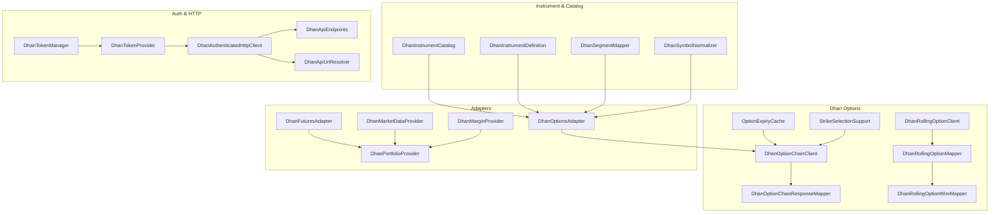
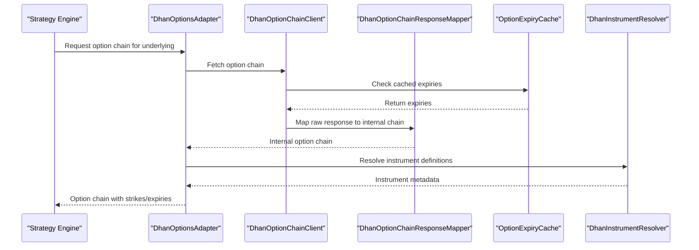
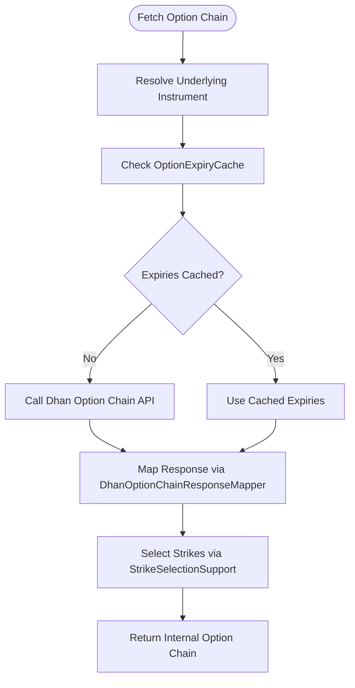
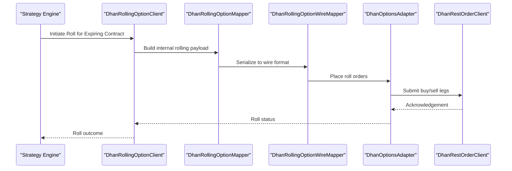
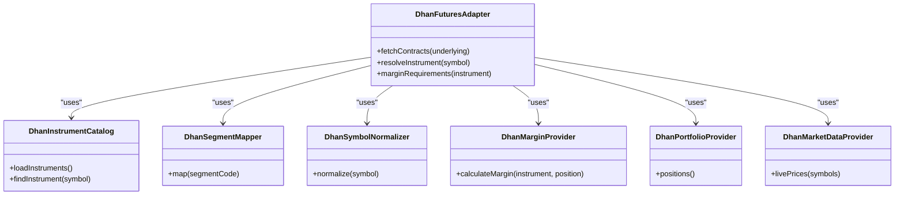
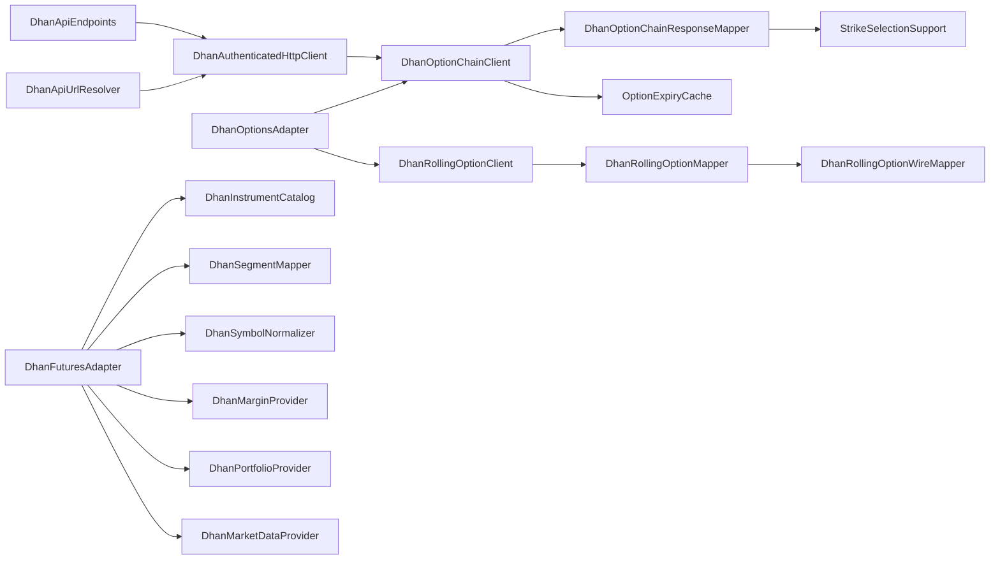

# Options Trading

<cite>
**Referenced Files in This Document**
- [DhanOptionChainClient.java](file://broker/dhan/src/main/java/com/tradej/broker/dhan/options/DhanOptionChainClient.java)
- [DhanOptionChainResponseMapper.java](file://broker/dhan/src/main/java/com/tradej/broker/dhan/options/DhanOptionChainResponseMapper.java)
- [DhanRollingOptionClient.java](file://broker/dhan/src/main/java/com/tradej/broker/dhan/options/DhanRollingOptionClient.java)
- [DhanRollingOptionMapper.java](file://broker/dhan/src/main/java/com/tradej/broker/dhan/options/DhanRollingOptionMapper.java)
- [DhanRollingOptionWireMapper.java](file://broker/dhan/src/main/java/com/tradej/broker/dhan/options/DhanRollingOptionWireMapper.java)
- [OptionExpiryCache.java](file://broker/dhan/src/main/java/com/tradej/broker/dhan/options/OptionExpiryCache.java)
- [StrikeSelectionSupport.java](file://broker/dhan/src/main/java/com/tradej/broker/dhan/options/StrikeSelectionSupport.java)
- [DhanOptionsAdapter.java](file://broker/dhan/src/main/java/com/tradej/broker/dhan/adapter/DhanOptionsAdapter.java)
- [DhanFuturesAdapter.java](file://broker/dhan/src/main/java/com/tradej/broker/dhan/adapter/DhanFuturesAdapter.java)
- [DhanOrderValidator.java](file://broker/dhan/src/main/java/com/tradej/broker/dhan/validator/DhanOrderValidator.java)
- [DhanInstrumentCatalog.java](file://broker/dhan/src/main/java/com/tradej/broker/dhan/instrument/DhanInstrumentCatalog.java)
- [DhanInstrumentDefinition.java](file://broker/dhan/src/main/java/com/tradej/broker/dhan/instrument/DhanInstrumentDefinition.java)
- [DhanSegmentMapper.java](file://broker/dhan/src/main/java/com/tradej/broker/dhan/instrument/DhanSegmentMapper.java)
- [DhanSymbolNormalizer.java](file://broker/dhan/src/main/java/com/tradej/broker/dhan/instrument/DhanSymbolNormalizer.java)
- [DhanMarketDataProvider.java](file://broker/dhan/src/main/java/com/tradej/broker/dhan/adapter/DhanMarketDataProvider.java)
- [DhanPortfolioProvider.java](file://broker/dhan/src/main/java/com/tradej/broker/dhan/adapter/DhanPortfolioProvider.java)
- [DhanMarginProvider.java](file://broker/dhan/src/main/java/com/tradej/broker/dhan/adapter/DhanMarginProvider.java)
- [DhanClientHolder.java](file://broker/dhan/src/main/java/com/tradej/broker/dhan/client/DhanClientHolder.java)
- [DhanBrokerConnection.java](file://broker/dhan/src/main/java/com/tradej/broker/dhan/DhanBrokerConnection.java)
- [DhanApiEndpoints.java](file://broker/dhan/src/main/java/com/tradej/broker/dhan/constants/DhanApiEndpoints.java)
- [DhanApiUrlResolver.java](file://broker/dhan/src/main/java/com/tradej/broker/dhan/constants/DhanApiUrlResolver.java)
- [DhanAuthenticatedHttpClient.java](file://broker/dhan/src/main/java/com/tradej/broker/dhan/http/DhanAuthenticatedHttpClient.java)
- [DhanExceptionUtil.java](file://broker/dhan/src/main/java/com/tradej/broker/dhan/exceptions/DhanExceptionUtil.java)
- [DhanBrokerException.java](file://broker/dhan/src/main/java/com/tradej/broker/dhan/exceptions/DhanBrokerException.java)
- [DhanValidationException.java](file://broker/dhan/src/main/java/com/tradej/broker/dhan/exceptions/DhanValidationException.java)
- [DhanTokenManager.java](file://broker/dhan/src/main/java/com/tradej/broker/dhan/auth/DhanTokenManager.java)
- [DhanTokenProvider.java](file://broker/dhan/src/main/java/com/tradej/broker/dhan/auth/DhanTokenProvider.java)
- [DhanTokenStateStore.java](file://broker/dhan/src/main/java/com/tradej/broker/dhan/auth/DhanTokenStateStore.java)
- [DhanTokenInfo.java](file://broker/dhan/src/main/java/com/tradej/broker/dhan/auth/DhanTokenInfo.java)
- [DhanOrderCommandAdapter.java](file://broker/dhan/src/main/java/com/tradej/broker/dhan/adapter/DhanOrderCommandAdapter.java)
- [DhanOrderQueryAdapter.java](file://broker/dhan/src/main/java/com/tradej/broker/dhan/adapter/DhanOrderQueryAdapter.java)
- [DhanRestOrderClient.java](file://broker/dhan/src/main/java/com/tradej/broker/dhan/orders/DhanRestOrderClient.java)
- [DhanMarketFeedWebSocketClient.java](file://broker/dhan/src/main/java/com/tradej/broker/dhan/websocket/DhanMarketFeedWebSocketClient.java)
- [DhanWebSocketMultiplexer.java](file://broker/dhan/src/main/java/com/tradej/broker/dhan/websocket/DhanWebSocketMultiplexer.java)
- [DhanWebSocketSubscriptionManager.java](file://broker/dhan/src/main/java/com/tradej/broker/dhan/websocket/DhanWebSocketSubscriptionManager.java)
- [DhanTwentyDepthWebSocketClient.java](file://broker/dhan/src/main/java/com/tradej/broker/dhan/depth/DhanTwentyDepthWebSocketClient.java)
- [DhanTwentyDepthBinaryParser.java](file://broker/dhan/src/main/java/com/tradej/broker/dhan/depth/DhanTwentyDepthBinaryParser.java)
- [DhanMarketDataProvider.java](file://broker/dhan/src/main/java/com/tradej/broker/dhan/adapter/DhanMarketDataProvider.java)
- [DhanPortfolioProvider.java](file://broker/dhan/src/main/java/com/tradej/broker/dhan/adapter/DhanPortfolioProvider.java)
- [DhanMarginProvider.java](file://broker/dhan/src/main/java/com/tradej/broker/dhan/adapter/DhanMarginProvider.java)
- [DhanHistoricalDataClient.java](file://broker/dhan/src/main/java/com/tradej/broker/dhan/historical/DhanHistoricalDataClient.java)
- [DhanHistoricalDataMapper.java](file://broker/dhan/src/main/java/com/tradej/broker/dhan/historical/DhanHistoricalDataMapper.java)
- [DhanApiConverters.java](file://broker/dhan/src/main/java/com/tradej/broker/dhan/mapper/DhanApiConverters.java)
- [DhanFieldMapper.java](file://broker/dhan/src/main/java/com/tradej/broker/dhan/mapper/DhanFieldMapper.java)
- [DhanJsonMapper.java](file://broker/dhan/src/main/java/com/tradej/broker/dhan/mapper/DhanJsonMapper.java)
- [DhanJsonResponse.java](file://broker/dhan/src/main/java/com/tradej/broker/dhan/mapper/DhanJsonResponse.java)
- [DhanPayloadNormalizer.java](file://broker/dhan/src/main/java/com/tradej/broker/dhan/mapper/DhanPayloadNormalizer.java)
- [DhanBaseRestAdapter.java](file://broker/dhan/src/main/java/com/tradej/broker/dhan/adapter/DhanBaseRestAdapter.java)
- [DhanBracketOrderAdapter.java](file://broker/dhan/src/main/java/com/tradej/broker/dhan/adapter/DhanBracketOrderAdapter.java)
- [DhanGttOrderAdapter.java](file://broker/dhan/src/main/java/com/tradej/broker/dhan/adapter/DhanGttOrderAdapter.java)
- [DhanSliceOrderAdapter.java](file://broker/dhan/src/main/java/com/tradej/broker/dhan/adapter/DhanSliceOrderAdapter.java)
- [DhanConditionalAlertProvider.java](file://broker/dhan/src/main/java/com/tradej/broker/dhan/adapter/DhanConditionalAlertProvider.java)
- [DhanInstrumentResolver.java](file://broker/dhan/src/main/java/com/tradej/broker/dhan/adapter/DhanInstrumentResolver.java)
- [InMemoryInstrumentResolver.java](file://broker/dhan/src/main/java/com/tradej/broker/dhan/adapter/InMemoryInstrumentResolver.java)
- [DhanSessionRiskProvider.java](file://broker/dhan/src/main/java/com/tradej/broker/dhan/adapter/DhanSessionRiskProvider.java)
- [DhanOrderStreamWebSocketClient.java](file://broker/dhan/src/main/java/com/tradej/broker/dhan/websocket/DhanOrderStreamWebSocketClient.java)
- [DhanWebSocketHealthMonitor.java](file://broker/dhan/src/main/java/com/tradej/broker/dhan/websocket/DhanWebSocketHealthMonitor.java)
- [DhanBinaryParser.java](file://broker/dhan/src/main/java/com/tradej/broker/dhan/websocket/DhanBinaryParser.java)
- [ParsedFeedFrame.java](file://broker/dhan/src/main/java/com/tradej/broker/dhan/websocket/ParsedFeedFrame.java)
- [DhanMarketFeedBinaryParser.java](file://broker/dhan/src/main/java/com/tradej/broker/dhan/websocket/feed/DhanMarketFeedBinaryParser.java)
- [DhanMarketFeedPacket.java](file://broker/dhan/src/main/java/com/tradej/broker/dhan/websocket/feed/DhanMarketFeedPacket.java)
- [DhanRetryExecutor.java](file://broker/dhan/src/main/java/com/tradej/broker/dhan/resilience/DhanRetryExecutor.java)
- [DhanRateLimitCategory.java](file://broker/dhan/src/main/java/com/tradej/broker/dhan/rate/ApiCategory.java)
- [DhanBrokerStartup.java](file://broker/dhan/src/main/java/com/tradej/broker/dhan/config/DhanBrokerStartup.java)
- [DhanConnectionSettings.java](file://broker/dhan/src/main/java/com/tradej/broker/dhan/config/DhanConnectionSettings.java)
- [DhanApiEnvironment.java](file://broker/dhan/src/main/java/com/tradej/broker/dhan/config/DhanApiEnvironment.java)
- [DhanAuthMode.java](file://broker/dhan/src/main/java/com/tradej/broker/dhan/config/DhanAuthMode.java)
- [DhanConfigPaths.java](file://broker/dhan/src/main/java/com/tradej/broker/dhan/config/DhanConfigPaths.java)
- [DhanProtocolConstants.java](file://broker/dhan/src/main/java/com/tradej/broker/dhan/constants/DhanProtocolConstants.java)
- [DhanExchangeSegmentCodes.java](file://broker/dhan/src/main/java/com/tradej/broker/dhan/depth/DhanExchangeSegmentCodes.java)
- [DhanEdisFormResult.java](file://broker/dhan/src/main/java/com/tradej/broker/dhan/domain/DhanEdisFormResult.java)
- [DhanEdisInquiryResult.java](file://broker/dhan/src/main/java/com/tradej/broker/dhan/domain/DhanEdisInquiryResult.java)
- [DhanLedgerEntry.java](file://broker/dhan/src/main/java/com/tradej/broker/dhan/domain/DhanLedgerEntry.java)
- [DhanProfileInfo.java](file://broker/dhan/src/main/java/com/tradej/broker/dhan/domain/DhanProfileInfo.java)
- [DhanTotpGenerator.java](file://broker/dhan/src/main/java/com/tradej/broker/dhan/auth/DhanTotpGenerator.java)
- [DhanAuthClient.java](file://broker/dhan/src/main/java/com/tradej/broker/dhan/auth/DhanAuthClient.java)
- [DhanAuthRejectedException.java](file://broker/dhan/src/main/java/com/tradej/broker/dhan/auth/DhanAuthRejectedException.java)
- [DhanAuthenticationException.java](file://broker/dhan/src/main/java/com/tradej/broker/dhan/auth/DhanAuthenticationException.java)
- [DhanInstrumentLoader.java](file://broker/dhan/src/main/java/com/tradej/broker/dhan/instrument/DhanInstrumentLoader.java)
- [DhanBaseRestAdapter.java](file://broker/dhan/src/main/java/com/tradej/broker/dhan/adapter/DhanBaseRestAdapter.java)
- [DhanBracketOrderAdapter.java](file://broker/dhan/src/main/java/com/tradej/broker/dhan/adapter/DhanBracketOrderAdapter.java)
- [DhanGttOrderAdapter.java](file://broker/dhan/src/main/java/com/tradej/broker/dhan/adapter/DhanGttOrderAdapter.java)
- [DhanSliceOrderAdapter.java](file://broker/dhan/src/main/java/com/tradej/broker/dhan/adapter/DhanSliceOrderAdapter.java)
- [DhanConditionalAlertProvider.java](file://broker/dhan/src/main/java/com/tradej/broker/dhan/adapter/DhanConditionalAlertProvider.java)
- [DhanInstrumentResolver.java](file://broker/dhan/src/main/java/com/tradej/broker/dhan/adapter/DhanInstrumentResolver.java)
- [InMemoryInstrumentResolver.java](file://broker/dhan/src/main/java/com/tradej/broker/dhan/adapter/InMemoryInstrumentResolver.java)
- [DhanSessionRiskProvider.java](file://broker/dhan/src/main/java/com/tradej/broker/dhan/adapter/DhanSessionRiskProvider.java)
- [DhanOrderStreamWebSocketClient.java](file://broker/dhan/src/main/java/com/tradej/broker/dhan/websocket/DhanOrderStreamWebSocketClient.java)
- [DhanWebSocketHealthMonitor.java](file://broker/dhan/src/main/java/com/tradej/broker/dhan/websocket/DhanWebSocketHealthMonitor.java)
- [DhanBinaryParser.java](file://broker/dhan/src/main/java/com/tradej/broker/dhan/websocket/DhanBinaryParser.java)
- [ParsedFeedFrame.java](file://broker/dhan/src/main/java/com/tradej/broker/dhan/websocket/ParsedFeedFrame.java)
- [DhanMarketFeedBinaryParser.java](file://broker/dhan/src/main/java/com/tradej/broker/dhan/websocket/feed/DhanMarketFeedBinaryParser.java)
- [DhanMarketFeedPacket.java](file://broker/dhan/src/main/java/com/tradej/broker/dhan/websocket/feed/DhanMarketFeedPacket.java)
- [DhanRetryExecutor.java](file://broker/dhan/src/main/java/com/tradej/broker/dhan/resilience/DhanRetryExecutor.java)
- [DhanRateLimitCategory.java](file://broker/dhan/src/main/java/com/tradej/broker/dhan/rate/ApiCategory.java)
- [DhanBrokerStartup.java](file://broker/dhan/src/main/java/com/tradej/broker/dhan/config/DhanBrokerStartup.java)
- [DhanConnectionSettings.java](file://broker/dhan/src/main/java/com/tradej/broker/dhan/config/DhanConnectionSettings.java)
- [DhanApiEnvironment.java](file://broker/dhan/src/main/java/com/tradej/broker/dhan/config/DhanApiEnvironment.java)
- [DhanAuthMode.java](file://broker/dhan/src/main/java/com/tradej/broker/dhan/config/DhanAuthMode.java)
- [DhanConfigPaths.java](file://broker/dhan/src/main/java/com/tradej/broker/dhan/config/DhanConfigPaths.java)
- [DhanProtocolConstants.java](file://broker/dhan/src/main/java/com/tradej/broker/dhan/constants/DhanProtocolConstants.java)
- [DhanExchangeSegmentCodes.java](file://broker/dhan/src/main/java/com/tradej/broker/dhan/depth/DhanExchangeSegmentCodes.java)
- [DhanEdisFormResult.java](file://broker/dhan/src/main/java/com/tradej/broker/dhan/domain/DhanEdisFormResult.java)
- [DhanEdisInquiryResult.java](file://broker/dhan/src/main/java/com/tradej/broker/dhan/domain/DhanEdisInquiryResult.java)
- [DhanLedgerEntry.java](file://broker/dhan/src/main/java/com/tradej/broker/dhan/domain/DhanLedgerEntry.java)
- [DhanProfileInfo.java](file://broker/dhan/src/main/java/com/tradej/broker/dhan/domain/DhanProfileInfo.java)
- [DhanTotpGenerator.java](file://broker/dhan/src/main/java/com/tradej/broker/dhan/auth/DhanTotpGenerator.java)
- [DhanAuthClient.java](file://broker/dhan/src/main/java/com/tradej/broker/dhan/auth/DhanAuthClient.java)
- [DhanAuthRejectedException.java](file://broker/dhan/src/main/java/com/tradej/broker/dhan/auth/DhanAuthRejectedException.java)
- [DhanAuthenticationException.java](file://broker/dhan/src/main/java/com/tradej/broker/dhan/auth/DhanAuthenticationException.java)
- [DhanInstrumentLoader.java](file://broker/dhan/src/main/java/com/tradej/broker/dhan/instrument/DhanInstrumentLoader.java)
- [DhanOptionChainResponseMapperTest.java](file://broker/dhan/src/test/java/com/tradej/broker/dhan/options/DhanOptionChainResponseMapperTest.java)
- [DhanRollingOptionMapperTest.java](file://broker/dhan/src/test/java/com/tradej/broker/dhan/options/DhanRollingOptionMapperTest.java)
- [DhanRollingOptionWireMapperTest.java](file://broker/dhan/src/test/java/com/tradej/broker/dhan/options/DhanRollingOptionWireMapperTest.java)
- [OptionExpiryCacheTest.java](file://broker/dhan/src/test/java/com/tradej/broker/dhan/options/OptionExpiryCacheTest.java)
- [DhanFieldMapperTest.java](file://broker/dhan/src/test/java/com/tradej/broker/dhan/mapper/DhanFieldMapperTest.java)
- [DhanBrokerException.java](file://broker/dhan/src/main/java/com/tradej/broker/dhan/exceptions/DhanBrokerException.java)
- [DhanValidationException.java](file://broker/dhan/src/main/java/com/tradej/broker/dhan/exceptions/DhanValidationException.java)
- [DhanExceptionUtil.java](file://broker/dhan/src/main/java/com/tradej/broker/dhan/exceptions/DhanExceptionUtil.java)
- [DhanAuthenticatedHttpClient.java](file://broker/dhan/src/main/java/com/tradej/broker/dhan/http/DhanAuthenticatedHttpClient.java)
- [DhanApiEndpoints.java](file://broker/dhan/src/main/java/com/tradej/broker/dhan/constants/DhanApiEndpoints.java)
- [DhanApiUrlResolver.java](file://broker/dhan/src/main/java/com/tradej/broker/dhan/constants/DhanApiUrlResolver.java)
- [DhanClientHolder.java](file://broker/dhan/src/main/java/com/tradej/broker/dhan/client/DhanClientHolder.java)
- [DhanBrokerConnection.java](file://broker/dhan/src/main/java/com/tradej/broker/dhan/DhanBrokerConnection.java)
- [DhanTokenManager.java](file://broker/dhan/src/main/java/com/tradej/broker/dhan/auth/DhanTokenManager.java)
- [DhanTokenProvider.java](file://broker/dhan/src/main/java/com/tradej/broker/dhan/auth/DhanTokenProvider.java)
- [DhanTokenStateStore.java](file://broker/dhan/src/main/java/com/tradej/broker/dhan/auth/DhanTokenStateStore.java)
- [DhanTokenInfo.java](file://broker/dhan/src/main/java/com/tradej/broker/dhan/auth/DhanTokenInfo.java)
- [DhanOrderCommandAdapter.java](file://broker/dhan/src/main/java/com/tradej/broker/dhan/adapter/DhanOrderCommandAdapter.java)
- [DhanOrderQueryAdapter.java](file://broker/dhan/src/main/java/com/tradej/broker/dhan/adapter/DhanOrderQueryAdapter.java)
- [DhanRestOrderClient.java](file://broker/dhan/src/main/java/com/tradej/broker/dhan/orders/DhanRestOrderClient.java)
- [DhanMarketFeedWebSocketClient.java](file://broker/dhan/src/main/java/com/tradej/broker/dhan/websocket/DhanMarketFeedWebSocketClient.java)
- [DhanWebSocketMultiplexer.java](file://broker/dhan/src/main/java/com/tradej/broker/dhan/websocket/DhanWebSocketMultiplexer.java)
- [DhanWebSocketSubscriptionManager.java](file://broker/dhan/src/main/java/com/tradej/broker/dhan/websocket/DhanWebSocketSubscriptionManager.java)
- [DhanTwentyDepthWebSocketClient.java](file://broker/dhan/src/main/java/com/tradej/broker/dhan/depth/DhanTwentyDepthWebSocketClient.java)
- [DhanTwentyDepthBinaryParser.java](file://broker/dhan/src/main/java/com/tradej/broker/dhan/depth/DhanTwentyDepthBinaryParser.java)
- [DhanMarketDataProvider.java](file://broker/dhan/src/main/java/com/tradej/broker/dhan/adapter/DhanMarketDataProvider.java)
- [DhanPortfolioProvider.java](file://broker/dhan/src/main/java/com/tradej/broker/dhan/adapter/DhanPortfolioProvider.java)
- [DhanMarginProvider.java](file://broker/dhan/src/main/java/com/tradej/broker/dhan/adapter/DhanMarginProvider.java)
- [DhanHistoricalDataClient.java](file://broker/dhan/src/main/java/com/tradej/broker/dhan/historical/DhanHistoricalDataClient.java)
- [DhanHistoricalDataMapper.java](file://broker/dhan/src/main/java/com/tradej/broker/dhan/historical/DhanHistoricalDataMapper.java)
- [DhanApiConverters.java](file://broker/dhan/src/main/java/com/tradej/broker/dhan/mapper/DhanApiConverters.java)
- [DhanFieldMapper.java](file://broker/dhan/src/main/java/com/tradej/broker/dhan/mapper/DhanFieldMapper.java)
- [DhanJsonMapper.java](file://broker/dhan/src/main/java/com/tradej/broker/dhan/mapper/DhanJsonMapper.java)
- [DhanJsonResponse.java](file://broker/dhan/src/main/java/com/tradej/broker/dhan/mapper/DhanJsonResponse.java)
- [DhanPayloadNormalizer.java](file://broker/dhan/src/main/java/com/tradej/broker/dhan/mapper/DhanPayloadNormalizer.java)
- [DhanBaseRestAdapter.java](file://broker/dhan/src/main/java/com/tradej/broker/dhan/adapter/DhanBaseRestAdapter.java)
- [DhanBracketOrderAdapter.java](file://broker/dhan/src/main/java/com/tradej/broker/dhan/adapter/DhanBracketOrderAdapter.java)
- [DhanGttOrderAdapter.java](file://broker/dhan/src/main/java/com/tradej/broker/dhan/adapter/DhanGttOrderAdapter.java)
- [DhanSliceOrderAdapter.java](file://broker/dhan/src/main/java/com/tradej/broker/dhan/adapter/DhanSliceOrderAdapter.java)
- [DhanConditionalAlertProvider.java](file://broker/dhan/src/main/java/com/tradej/broker/dhan/adapter/DhanConditionalAlertProvider.java)
- [DhanInstrumentResolver.java](file://broker/dhan/src/main/java/com/tradej/broker/dhan/adapter/DhanInstrumentResolver.java)
- [InMemoryInstrumentResolver.java](file://broker/dhan/src/main/java/com/tradej/broker/dhan/adapter/InMemoryInstrumentResolver.java)
- [DhanSessionRiskProvider.java](file://broker/dhan/src/main/java/com/tradej/broker/dhan/adapter/DhanSessionRiskProvider.java)
- [DhanOrderStreamWebSocketClient.java](file://broker/dhan/src/main/java/com/tradej/broker/dhan/websocket/DhanOrderStreamWebSocketClient.java)
- [DhanWebSocketHealthMonitor.java](file://broker/dhan/src/main/java/com/tradej/broker/dhan/websocket/DhanWebSocketHealthMonitor.java)
- [DhanBinaryParser.java](file://broker/dhan/src/main/java/com/tradej/broker/dhan/websocket/DhanBinaryParser.java)
- [ParsedFeedFrame.java](file://broker/dhan/src/main/java/com/tradej/broker/dhan/websocket/ParsedFeedFrame.java)
- [DhanMarketFeedBinaryParser.java](file://broker/dhan/src/main/java/com/tradej/broker/dhan/websocket/feed/DhanMarketFeedBinaryParser.java)
- [DhanMarketFeedPacket.java](file://broker/dhan/src/main/java/com/tradej/broker/dhan/websocket/feed/DhanMarketFeedPacket.java)
- [DhanRetryExecutor.java](file://broker/dhan/src/main/java/com/tradej/broker/dhan/resilience/DhanRetryExecutor.java)
- [DhanRateLimitCategory.java](file://broker/dhan/src/main/java/com/tradej/broker/dhan/rate/ApiCategory.java)
- [DhanBrokerStartup.java](file://broker/dhan/src/main/java/com/tradej/broker/dhan/config/DhanBrokerStartup.java)
- [DhanConnectionSettings.java](file://broker/dhan/src/main/java/com/tradej/broker/dhan/config/DhanConnectionSettings.java)
- [DhanApiEnvironment.java](file://broker/dhan/src/main/java/com/tradej/broker/dhan/config/DhanApiEnvironment.java)
- [DhanAuthMode.java](file://broker/dhan/src/main/java/com/tradej/broker/dhan/config/DhanAuthMode.java)
- [DhanConfigPaths.java](file://broker/dhan/src/main/java/com/tradej/broker/dhan/config/DhanConfigPaths.java)
- [DhanProtocolConstants.java](file://broker/dhan/src/main/java/com/tradej/broker/dhan/constants/DhanProtocolConstants.java)
- [DhanExchangeSegmentCodes.java](file://broker/dhan/src/main/java/com/tradej/broker/dhan/depth/DhanExchangeSegmentCodes.java)
- [DhanEdisFormResult.java](file://broker/dhan/src/main/java/com/tradej/broker/dhan/domain/DhanEdisFormResult.java)
- [DhanEdisInquiryResult.java](file://broker/dhan/src/main/java/com/tradej/broker/dhan/domain/DhanEdisInquiryResult.java)
- [DhanLedgerEntry.java](file://broker/dhan/src/main/java/com/tradej/broker/dhan/domain/DhanLedgerEntry.java)
- [DhanProfileInfo.java](file://broker/dhan/src/main/java/com/tradej/broker/dhan/domain/DhanProfileInfo.java)
- [DhanTotpGenerator.java](file://broker/dhan/src/main/java/com/tradej/broker/dhan/auth/DhanTotpGenerator.java)
- [DhanAuthClient.java](file://broker/dhan/src/main/java/com/tradej/broker/dhan/auth/DhanAuthClient.java)
- [DhanAuthRejectedException.java](file://broker/dhan/src/main/java/com/tradej/broker/dhan/auth/DhanAuthRejectedException.java)
- [DhanAuthenticationException.java](file://broker/dhan/src/main/java/com/tradej/broker/dhan/auth/DhanAuthenticationException.java)
- [DhanInstrumentLoader.java](file://broker/dhan/src/main/java/com/tradej/broker/dhan/instrument/DhanInstrumentLoader.java)
</cite>

## Table of Contents
1. [Introduction](#introduction)
2. [Project Structure](#project-structure)
3. [Core Components](#core-components)
4. [Architecture Overview](#architecture-overview)
5. [Detailed Component Analysis](#detailed-component-analysis)
6. [Dependency Analysis](#dependency-analysis)
7. [Performance Considerations](#performance-considerations)
8. [Troubleshooting Guide](#troubleshooting-guide)
9. [Conclusion](#conclusion)
10. [Appendices](#appendices)

## Introduction
This document explains Dhan options trading capabilities in the Trade-J codebase. It covers:
- Option chain retrieval and data mapping
- Expiry handling and caching
- Strike selection mechanisms
- Rolling options functionality including automatic contract rollover and expiry management
- Futures trading support including contract specification and margin requirements
- Validation rules, pricing considerations, and risk management features

The goal is to provide a practical, code-mapped guide for building robust options strategies while leveraging Dhan’s adapters, clients, and supporting infrastructure.

## Project Structure
Dhan options-related logic resides primarily under broker/dhan/options and is integrated with adapters, instruments, market data, portfolio, margin, and order management components.

**Diagram sources**
- [DhanOptionChainClient.java](file://broker/dhan/src/main/java/com/tradej/broker/dhan/options/DhanOptionChainClient.java)
- [DhanOptionChainResponseMapper.java](file://broker/dhan/src/main/java/com/tradej/broker/dhan/options/DhanOptionChainResponseMapper.java)
- [DhanRollingOptionClient.java](file://broker/dhan/src/main/java/com/tradej/broker/dhan/options/DhanRollingOptionClient.java)
- [DhanRollingOptionMapper.java](file://broker/dhan/src/main/java/com/tradej/broker/dhan/options/DhanRollingOptionMapper.java)
- [DhanRollingOptionWireMapper.java](file://broker/dhan/src/main/java/com/tradej/broker/dhan/options/DhanRollingOptionWireMapper.java)
- [OptionExpiryCache.java](file://broker/dhan/src/main/java/com/tradej/broker/dhan/options/OptionExpiryCache.java)
- [StrikeSelectionSupport.java](file://broker/dhan/src/main/java/com/tradej/broker/dhan/options/StrikeSelectionSupport.java)
- [DhanOptionsAdapter.java](file://broker/dhan/src/main/java/com/tradej/broker/dhan/adapter/DhanOptionsAdapter.java)
- [DhanFuturesAdapter.java](file://broker/dhan/src/main/java/com/tradej/broker/dhan/adapter/DhanFuturesAdapter.java)
- [DhanMarketDataProvider.java](file://broker/dhan/src/main/java/com/tradej/broker/dhan/adapter/DhanMarketDataProvider.java)
- [DhanPortfolioProvider.java](file://broker/dhan/src/main/java/com/tradej/broker/dhan/adapter/DhanPortfolioProvider.java)
- [DhanMarginProvider.java](file://broker/dhan/src/main/java/com/tradej/broker/dhan/adapter/DhanMarginProvider.java)
- [DhanInstrumentCatalog.java](file://broker/dhan/src/main/java/com/tradej/broker/dhan/instrument/DhanInstrumentCatalog.java)
- [DhanInstrumentDefinition.java](file://broker/dhan/src/main/java/com/tradej/broker/dhan/instrument/DhanInstrumentDefinition.java)
- [DhanSegmentMapper.java](file://broker/dhan/src/main/java/com/tradej/broker/dhan/instrument/DhanSegmentMapper.java)
- [DhanSymbolNormalizer.java](file://broker/dhan/src/main/java/com/tradej/broker/dhan/instrument/DhanSymbolNormalizer.java)
- [DhanTokenManager.java](file://broker/dhan/src/main/java/com/tradej/broker/dhan/auth/DhanTokenManager.java)
- [DhanTokenProvider.java](file://broker/dhan/src/main/java/com/tradej/broker/dhan/auth/DhanTokenProvider.java)
- [DhanAuthenticatedHttpClient.java](file://broker/dhan/src/main/java/com/tradej/broker/dhan/http/DhanAuthenticatedHttpClient.java)
- [DhanApiEndpoints.java](file://broker/dhan/src/main/java/com/tradej/broker/dhan/constants/DhanApiEndpoints.java)
- [DhanApiUrlResolver.java](file://broker/dhan/src/main/java/com/tradej/broker/dhan/constants/DhanApiUrlResolver.java)

**Section sources**
- [DhanOptionChainClient.java](file://broker/dhan/src/main/java/com/tradej/broker/dhan/options/DhanOptionChainClient.java)
- [DhanRollingOptionClient.java](file://broker/dhan/src/main/java/com/tradej/broker/dhan/options/DhanRollingOptionClient.java)
- [DhanOptionsAdapter.java](file://broker/dhan/src/main/java/com/tradej/broker/dhan/adapter/DhanOptionsAdapter.java)
- [DhanFuturesAdapter.java](file://broker/dhan/src/main/java/com/tradej/broker/dhan/adapter/DhanFuturesAdapter.java)

## Core Components
- Option Chain Client: Retrieves option chains for underlying instruments and normalizes responses.
- Option Chain Response Mapper: Translates raw API responses into internal option chain structures.
- Rolling Option Client: Manages rolling operations across expiring contracts.
- Rolling Option Mappers: Convert wire payloads to internal rolling structures and vice versa.
- Option Expiry Cache: Caches expiry lists to reduce repeated network calls.
- Strike Selection Support: Provides logic to select strikes based on criteria (e.g., at-the-money, nearest).
- Adapters: Bridge internal systems to Dhan’s options and futures APIs.
- Instrument Catalog and Resolvers: Define and normalize instrument identifiers for options and futures.
- Market Data, Portfolio, and Margin Providers: Supply real-time data, positions, and margin requirements.
- Authentication and HTTP Layer: Handles token lifecycle, endpoint resolution, and HTTP requests.

**Section sources**
- [DhanOptionChainClient.java](file://broker/dhan/src/main/java/com/tradej/broker/dhan/options/DhanOptionChainClient.java)
- [DhanOptionChainResponseMapper.java](file://broker/dhan/src/main/java/com/tradej/broker/dhan/options/DhanOptionChainResponseMapper.java)
- [DhanRollingOptionClient.java](file://broker/dhan/src/main/java/com/tradej/broker/dhan/options/DhanRollingOptionClient.java)
- [DhanRollingOptionMapper.java](file://broker/dhan/src/main/java/com/tradej/broker/dhan/options/DhanRollingOptionMapper.java)
- [DhanRollingOptionWireMapper.java](file://broker/dhan/src/main/java/com/tradej/broker/dhan/options/DhanRollingOptionWireMapper.java)
- [OptionExpiryCache.java](file://broker/dhan/src/main/java/com/tradej/broker/dhan/options/OptionExpiryCache.java)
- [StrikeSelectionSupport.java](file://broker/dhan/src/main/java/com/tradej/broker/dhan/options/StrikeSelectionSupport.java)
- [DhanOptionsAdapter.java](file://broker/dhan/src/main/java/com/tradej/broker/dhan/adapter/DhanOptionsAdapter.java)
- [DhanFuturesAdapter.java](file://broker/dhan/src/main/java/com/tradej/broker/dhan/adapter/DhanFuturesAdapter.java)
- [DhanInstrumentCatalog.java](file://broker/dhan/src/main/java/com/tradej/broker/dhan/instrument/DhanInstrumentCatalog.java)
- [DhanInstrumentDefinition.java](file://broker/dhan/src/main/java/com/tradej/broker/dhan/instrument/DhanInstrumentDefinition.java)
- [DhanSegmentMapper.java](file://broker/dhan/src/main/java/com/tradej/broker/dhan/instrument/DhanSegmentMapper.java)
- [DhanSymbolNormalizer.java](file://broker/dhan/src/main/java/com/tradej/broker/dhan/instrument/DhanSymbolNormalizer.java)
- [DhanMarketDataProvider.java](file://broker/dhan/src/main/java/com/tradej/broker/dhan/adapter/DhanMarketDataProvider.java)
- [DhanPortfolioProvider.java](file://broker/dhan/src/main/java/com/tradej/broker/dhan/adapter/DhanPortfolioProvider.java)
- [DhanMarginProvider.java](file://broker/dhan/src/main/java/com/tradej/broker/dhan/adapter/DhanMarginProvider.java)

## Architecture Overview
The options trading flow integrates HTTP clients, adapters, and mappers to fetch and transform data, then exposes it to downstream systems for strategy execution and risk management.

**Diagram sources**
- [DhanOptionsAdapter.java](file://broker/dhan/src/main/java/com/tradej/broker/dhan/adapter/DhanOptionsAdapter.java)
- [DhanOptionChainClient.java](file://broker/dhan/src/main/java/com/tradej/broker/dhan/options/DhanOptionChainClient.java)
- [DhanOptionChainResponseMapper.java](file://broker/dhan/src/main/java/com/tradej/broker/dhan/options/DhanOptionChainResponseMapper.java)
- [OptionExpiryCache.java](file://broker/dhan/src/main/java/com/tradej/broker/dhan/options/OptionExpiryCache.java)
- [DhanInstrumentResolver.java](file://broker/dhan/src/main/java/com/tradej/broker/dhan/adapter/DhanInstrumentResolver.java)

## Detailed Component Analysis

### Option Chain Retrieval and Data Mapping
- Retrieval: The Option Chain Client queries Dhan endpoints for a given underlying instrument and expiration cycle.
- Expiry Handling: Expiries are cached to avoid redundant API calls and to support consistent selection logic.
- Mapping: The Response Mapper transforms provider-specific payloads into internal option chain structures, including strike prices, option types, and metadata.
- Strike Selection: StrikeSelectionSupport chooses appropriate strikes based on user-defined criteria.

**Diagram sources**
- [DhanOptionChainClient.java](file://broker/dhan/src/main/java/com/tradej/broker/dhan/options/DhanOptionChainClient.java)
- [DhanOptionChainResponseMapper.java](file://broker/dhan/src/main/java/com/tradej/broker/dhan/options/DhanOptionChainResponseMapper.java)
- [OptionExpiryCache.java](file://broker/dhan/src/main/java/com/tradej/broker/dhan/options/OptionExpiryCache.java)
- [StrikeSelectionSupport.java](file://broker/dhan/src/main/java/com/tradej/broker/dhan/options/StrikeSelectionSupport.java)

**Section sources**
- [DhanOptionChainClient.java](file://broker/dhan/src/main/java/com/tradej/broker/dhan/options/DhanOptionChainClient.java)
- [DhanOptionChainResponseMapper.java](file://broker/dhan/src/main/java/com/tradej/broker/dhan/options/DhanOptionChainResponseMapper.java)
- [OptionExpiryCache.java](file://broker/dhan/src/main/java/com/tradej/broker/dhan/options/OptionExpiryCache.java)
- [StrikeSelectionSupport.java](file://broker/dhan/src/main/java/com/tradej/broker/dhan/options/StrikeSelectionSupport.java)

### Rolling Option Functionality
Rolling involves replacing expiring options with new contracts, often to maintain exposure while moving into the next expiration cycle. The process includes:
- Detecting expiring contracts
- Identifying target expiries and strikes
- Executing roll orders via adapters and order clients
- Managing wire payloads and internal structures

**Diagram sources**
- [DhanRollingOptionClient.java](file://broker/dhan/src/main/java/com/tradej/broker/dhan/options/DhanRollingOptionClient.java)
- [DhanRollingOptionMapper.java](file://broker/dhan/src/main/java/com/tradej/broker/dhan/options/DhanRollingOptionMapper.java)
- [DhanRollingOptionWireMapper.java](file://broker/dhan/src/main/java/com/tradej/broker/dhan/options/DhanRollingOptionWireMapper.java)
- [DhanOptionsAdapter.java](file://broker/dhan/src/main/java/com/tradej/broker/dhan/adapter/DhanOptionsAdapter.java)
- [DhanRestOrderClient.java](file://broker/dhan/src/main/java/com/tradej/broker/dhan/orders/DhanRestOrderClient.java)

**Section sources**
- [DhanRollingOptionClient.java](file://broker/dhan/src/main/java/com/tradej/broker/dhan/options/DhanRollingOptionClient.java)
- [DhanRollingOptionMapper.java](file://broker/dhan/src/main/java/com/tradej/broker/dhan/options/DhanRollingOptionMapper.java)
- [DhanRollingOptionWireMapper.java](file://broker/dhan/src/main/java/com/tradej/broker/dhan/options/DhanRollingOptionWireMapper.java)

### Futures Trading Support
Futures trading leverages dedicated adapters and instrument resolvers:
- Contract Specification: Instruments are normalized and mapped to exchange segments and symbols.
- Margin Requirements: Margin provider supplies margin calculations and updates.
- Portfolio and Market Data: Portfolio provider aggregates positions; market data provider supplies live prices.

**Diagram sources**
- [DhanFuturesAdapter.java](file://broker/dhan/src/main/java/com/tradej/broker/dhan/adapter/DhanFuturesAdapter.java)
- [DhanInstrumentCatalog.java](file://broker/dhan/src/main/java/com/tradej/broker/dhan/instrument/DhanInstrumentCatalog.java)
- [DhanSegmentMapper.java](file://broker/dhan/src/main/java/com/tradej/broker/dhan/instrument/DhanSegmentMapper.java)
- [DhanSymbolNormalizer.java](file://broker/dhan/src/main/java/com/tradej/broker/dhan/instrument/DhanSymbolNormalizer.java)
- [DhanMarginProvider.java](file://broker/dhan/src/main/java/com/tradej/broker/dhan/adapter/DhanMarginProvider.java)
- [DhanPortfolioProvider.java](file://broker/dhan/src/main/java/com/tradej/broker/dhan/adapter/DhanPortfolioProvider.java)
- [DhanMarketDataProvider.java](file://broker/dhan/src/main/java/com/tradej/broker/dhan/adapter/DhanMarketDataProvider.java)

**Section sources**
- [DhanFuturesAdapter.java](file://broker/dhan/src/main/java/com/tradej/broker/dhan/adapter/DhanFuturesAdapter.java)
- [DhanInstrumentCatalog.java](file://broker/dhan/src/main/java/com/tradej/broker/dhan/instrument/DhanInstrumentCatalog.java)
- [DhanSegmentMapper.java](file://broker/dhan/src/main/java/com/tradej/broker/dhan/instrument/DhanSegmentMapper.java)
- [DhanSymbolNormalizer.java](file://broker/dhan/src/main/java/com/tradej/broker/dhan/instrument/DhanSymbolNormalizer.java)
- [DhanMarginProvider.java](file://broker/dhan/src/main/java/com/tradej/broker/dhan/adapter/DhanMarginProvider.java)
- [DhanPortfolioProvider.java](file://broker/dhan/src/main/java/com/tradej/broker/dhan/adapter/DhanPortfolioProvider.java)
- [DhanMarketDataProvider.java](file://broker/dhan/src/main/java/com/tradej/broker/dhan/adapter/DhanMarketDataProvider.java)

### Practical Examples

- Retrieve Option Chain
  - Steps: Resolve underlying instrument, fetch expiries from cache or API, map response, select strikes.
  - References: [DhanOptionChainClient.java](file://broker/dhan/src/main/java/com/tradej/broker/dhan/options/DhanOptionChainClient.java), [DhanOptionChainResponseMapper.java](file://broker/dhan/src/main/java/com/tradej/broker/dhan/options/DhanOptionChainResponseMapper.java), [OptionExpiryCache.java](file://broker/dhan/src/main/java/com/tradej/broker/dhan/options/OptionExpiryCache.java), [StrikeSelectionSupport.java](file://broker/dhan/src/main/java/com/tradej/broker/dhan/options/StrikeSelectionSupport.java)

- Select Strike Prices
  - Criteria: ATM, nearest, user-defined distance from underlying price.
  - References: [StrikeSelectionSupport.java](file://broker/dhan/src/main/java/com/tradej/broker/dhan/options/StrikeSelectionSupport.java)

- Manage Expiring Contracts
  - Strategy: Monitor expiries, prepare roll payloads, submit orders, track outcomes.
  - References: [DhanRollingOptionClient.java](file://broker/dhan/src/main/java/com/tradej/broker/dhan/options/DhanRollingOptionClient.java), [DhanRollingOptionMapper.java](file://broker/dhan/src/main/java/com/tradej/broker/dhan/options/DhanRollingOptionMapper.java), [DhanRollingOptionWireMapper.java](file://broker/dhan/src/main/java/com/tradej/broker/dhan/options/DhanRollingOptionWireMapper.java)

- Implement Rolling Strategies
  - Example: Replace near-expiry put with next-expiry put at same or adjusted strike.
  - References: [DhanOptionsAdapter.java](file://broker/dhan/src/main/java/com/tradej/broker/dhan/adapter/DhanOptionsAdapter.java), [DhanRestOrderClient.java](file://broker/dhan/src/main/java/com/tradej/broker/dhan/orders/DhanRestOrderClient.java)

- Futures Contract Specification and Margin
  - Steps: Normalize symbol, resolve segment, compute margin, monitor portfolio and live prices.
  - References: [DhanFuturesAdapter.java](file://broker/dhan/src/main/java/com/tradej/broker/dhan/adapter/DhanFuturesAdapter.java), [DhanInstrumentCatalog.java](file://broker/dhan/src/main/java/com/tradej/broker/dhan/instrument/DhanInstrumentCatalog.java), [DhanSegmentMapper.java](file://broker/dhan/src/main/java/com/tradej/broker/dhan/instrument/DhanSegmentMapper.java), [DhanSymbolNormalizer.java](file://broker/dhan/src/main/java/com/tradej/broker/dhan/instrument/DhanSymbolNormalizer.java), [DhanMarginProvider.java](file://broker/dhan/src/main/java/com/tradej/broker/dhan/adapter/DhanMarginProvider.java), [DhanPortfolioProvider.java](file://broker/dhan/src/main/java/com/tradej/broker/dhan/adapter/DhanPortfolioProvider.java), [DhanMarketDataProvider.java](file://broker/dhan/src/main/java/com/tradej/broker/dhan/adapter/DhanMarketDataProvider.java)

**Section sources**
- [DhanOptionChainClient.java](file://broker/dhan/src/main/java/com/tradej/broker/dhan/options/DhanOptionChainClient.java)
- [DhanOptionChainResponseMapper.java](file://broker/dhan/src/main/java/com/tradej/broker/dhan/options/DhanOptionChainResponseMapper.java)
- [OptionExpiryCache.java](file://broker/dhan/src/main/java/com/tradej/broker/dhan/options/OptionExpiryCache.java)
- [StrikeSelectionSupport.java](file://broker/dhan/src/main/java/com/tradej/broker/dhan/options/StrikeSelectionSupport.java)
- [DhanRollingOptionClient.java](file://broker/dhan/src/main/java/com/tradej/broker/dhan/options/DhanRollingOptionClient.java)
- [DhanRollingOptionMapper.java](file://broker/dhan/src/main/java/com/tradej/broker/dhan/options/DhanRollingOptionMapper.java)
- [DhanRollingOptionWireMapper.java](file://broker/dhan/src/main/java/com/tradej/broker/dhan/options/DhanRollingOptionWireMapper.java)
- [DhanOptionsAdapter.java](file://broker/dhan/src/main/java/com/tradej/broker/dhan/adapter/DhanOptionsAdapter.java)
- [DhanRestOrderClient.java](file://broker/dhan/src/main/java/com/tradej/broker/dhan/orders/DhanRestOrderClient.java)
- [DhanFuturesAdapter.java](file://broker/dhan/src/main/java/com/tradej/broker/dhan/adapter/DhanFuturesAdapter.java)
- [DhanInstrumentCatalog.java](file://broker/dhan/src/main/java/com/tradej/broker/dhan/instrument/DhanInstrumentCatalog.java)
- [DhanSegmentMapper.java](file://broker/dhan/src/main/java/com/tradej/broker/dhan/instrument/DhanSegmentMapper.java)
- [DhanSymbolNormalizer.java](file://broker/dhan/src/main/java/com/tradej/broker/dhan/instrument/DhanSymbolNormalizer.java)
- [DhanMarginProvider.java](file://broker/dhan/src/main/java/com/tradej/broker/dhan/adapter/DhanMarginProvider.java)
- [DhanPortfolioProvider.java](file://broker/dhan/src/main/java/com/tradej/broker/dhan/adapter/DhanPortfolioProvider.java)
- [DhanMarketDataProvider.java](file://broker/dhan/src/main/java/com/tradej/broker/dhan/adapter/DhanMarketDataProvider.java)

### Options-Specific Validation Rules, Pricing Considerations, and Risk Management
- Validation Rules
  - Order validation ensures correct option leg composition, proper expiry alignment, and instrument eligibility.
  - References: [DhanOrderValidator.java](file://broker/dhan/src/main/java/com/tradej/broker/dhan/validator/DhanOrderValidator.java)

- Pricing Considerations
  - Market data providers supply live bid/ask/last prices for options and underlying.
  - References: [DhanMarketDataProvider.java](file://broker/dhan/src/main/java/com/tradej/broker/dhan/adapter/DhanMarketDataProvider.java)

- Risk Management
  - Session risk provider enforces session-level limits and controls.
  - References: [DhanSessionRiskProvider.java](file://broker/dhan/src/main/java/com/tradej/broker/dhan/adapter/DhanSessionRiskProvider.java)

**Section sources**
- [DhanOrderValidator.java](file://broker/dhan/src/main/java/com/tradej/broker/dhan/validator/DhanOrderValidator.java)
- [DhanMarketDataProvider.java](file://broker/dhan/src/main/java/com/tradej/broker/dhan/adapter/DhanMarketDataProvider.java)
- [DhanSessionRiskProvider.java](file://broker/dhan/src/main/java/com/tradej/broker/dhan/adapter/DhanSessionRiskProvider.java)

## Dependency Analysis
Key dependencies and relationships:
- Option Chain Client depends on HTTP client and endpoint resolver.
- Response Mapper depends on field and JSON mappers for normalization.
- Rolling clients depend on mappers and adapters for order placement.
- Instrument resolvers and catalogs depend on segment and symbol mappers.
- Market data, portfolio, and margin providers integrate with adapters.

**Diagram sources**
- [DhanApiEndpoints.java](file://broker/dhan/src/main/java/com/tradej/broker/dhan/constants/DhanApiEndpoints.java)
- [DhanApiUrlResolver.java](file://broker/dhan/src/main/java/com/tradej/broker/dhan/constants/DhanApiUrlResolver.java)
- [DhanAuthenticatedHttpClient.java](file://broker/dhan/src/main/java/com/tradej/broker/dhan/http/DhanAuthenticatedHttpClient.java)
- [DhanOptionChainClient.java](file://broker/dhan/src/main/java/com/tradej/broker/dhan/options/DhanOptionChainClient.java)
- [DhanOptionChainResponseMapper.java](file://broker/dhan/src/main/java/com/tradej/broker/dhan/options/DhanOptionChainResponseMapper.java)
- [StrikeSelectionSupport.java](file://broker/dhan/src/main/java/com/tradej/broker/dhan/options/StrikeSelectionSupport.java)
- [OptionExpiryCache.java](file://broker/dhan/src/main/java/com/tradej/broker/dhan/options/OptionExpiryCache.java)
- [DhanRollingOptionClient.java](file://broker/dhan/src/main/java/com/tradej/broker/dhan/options/DhanRollingOptionClient.java)
- [DhanRollingOptionMapper.java](file://broker/dhan/src/main/java/com/tradej/broker/dhan/options/DhanRollingOptionMapper.java)
- [DhanRollingOptionWireMapper.java](file://broker/dhan/src/main/java/com/tradej/broker/dhan/options/DhanRollingOptionWireMapper.java)
- [DhanOptionsAdapter.java](file://broker/dhan/src/main/java/com/tradej/broker/dhan/adapter/DhanOptionsAdapter.java)
- [DhanFuturesAdapter.java](file://broker/dhan/src/main/java/com/tradej/broker/dhan/adapter/DhanFuturesAdapter.java)
- [DhanInstrumentCatalog.java](file://broker/dhan/src/main/java/com/tradej/broker/dhan/instrument/DhanInstrumentCatalog.java)
- [DhanSegmentMapper.java](file://broker/dhan/src/main/java/com/tradej/broker/dhan/instrument/DhanSegmentMapper.java)
- [DhanSymbolNormalizer.java](file://broker/dhan/src/main/java/com/tradej/broker/dhan/instrument/DhanSymbolNormalizer.java)
- [DhanMarginProvider.java](file://broker/dhan/src/main/java/com/tradej/broker/dhan/adapter/DhanMarginProvider.java)
- [DhanPortfolioProvider.java](file://broker/dhan/src/main/java/com/tradej/broker/dhan/adapter/DhanPortfolioProvider.java)
- [DhanMarketDataProvider.java](file://broker/dhan/src/main/java/com/tradej/broker/dhan/adapter/DhanMarketDataProvider.java)

**Section sources**
- [DhanApiEndpoints.java](file://broker/dhan/src/main/java/com/tradej/broker/dhan/constants/DhanApiEndpoints.java)
- [DhanApiUrlResolver.java](file://broker/dhan/src/main/java/com/tradej/broker/dhan/constants/DhanApiUrlResolver.java)
- [DhanAuthenticatedHttpClient.java](file://broker/dhan/src/main/java/com/tradej/broker/dhan/http/DhanAuthenticatedHttpClient.java)
- [DhanOptionChainClient.java](file://broker/dhan/src/main/java/com/tradej/broker/dhan/options/DhanOptionChainClient.java)
- [DhanOptionChainResponseMapper.java](file://broker/dhan/src/main/java/com/tradej/broker/dhan/options/DhanOptionChainResponseMapper.java)
- [DhanRollingOptionClient.java](file://broker/dhan/src/main/java/com/tradej/broker/dhan/options/DhanRollingOptionClient.java)
- [DhanRollingOptionMapper.java](file://broker/dhan/src/main/java/com/tradej/broker/dhan/options/DhanRollingOptionMapper.java)
- [DhanRollingOptionWireMapper.java](file://broker/dhan/src/main/java/com/tradej/broker/dhan/options/DhanRollingOptionWireMapper.java)
- [DhanOptionsAdapter.java](file://broker/dhan/src/main/java/com/tradej/broker/dhan/adapter/DhanOptionsAdapter.java)
- [DhanFuturesAdapter.java](file://broker/dhan/src/main/java/com/tradej/broker/dhan/adapter/DhanFuturesAdapter.java)
- [DhanInstrumentCatalog.java](file://broker/dhan/src/main/java/com/tradej/broker/dhan/instrument/DhanInstrumentCatalog.java)
- [DhanSegmentMapper.java](file://broker/dhan/src/main/java/com/tradej/broker/dhan/instrument/DhanSegmentMapper.java)
- [DhanSymbolNormalizer.java](file://broker/dhan/src/main/java/com/tradej/broker/dhan/instrument/DhanSymbolNormalizer.java)
- [DhanMarginProvider.java](file://broker/dhan/src/main/java/com/tradej/broker/dhan/adapter/DhanMarginProvider.java)
- [DhanPortfolioProvider.java](file://broker/dhan/src/main/java/com/tradej/broker/dhan/adapter/DhanPortfolioProvider.java)
- [DhanMarketDataProvider.java](file://broker/dhan/src/main/java/com/tradej/broker/dhan/adapter/DhanMarketDataProvider.java)

## Performance Considerations
- Caching: Use OptionExpiryCache to minimize repeated API calls for expiries.
- Batch Requests: Group instrument resolutions and market data fetches where supported.
- Efficient Mapping: Keep mappers lean and avoid unnecessary conversions.
- Retry and Backoff: Apply retry policies for transient failures in HTTP client.
- Streaming Updates: Prefer WebSocket feeds for real-time market data to reduce polling overhead.

[No sources needed since this section provides general guidance]

## Troubleshooting Guide
Common issues and remedies:
- Authentication Failures
  - Symptoms: Unauthorized or invalid token errors when fetching option chains or placing orders.
  - Actions: Refresh tokens via token manager/provider, verify credentials, check token state store.
  - References: [DhanTokenManager.java](file://broker/dhan/src/main/java/com/tradej/broker/dhan/auth/DhanTokenManager.java), [DhanTokenProvider.java](file://broker/dhan/src/main/java/com/tradej/broker/dhan/auth/DhanTokenProvider.java), [DhanTokenStateStore.java](file://broker/dhan/src/main/java/com/tradej/broker/dhan/auth/DhanTokenStateStore.java), [DhanTokenInfo.java](file://broker/dhan/src/main/java/com/tradej/broker/dhan/auth/DhanTokenInfo.java)

- HTTP/Endpoint Errors
  - Symptoms: 4xx/5xx responses from Dhan endpoints.
  - Actions: Inspect resolved URLs, verify API endpoints, enable retries with backoff.
  - References: [DhanAuthenticatedHttpClient.java](file://broker/dhan/src/main/java/com/tradej/broker/dhan/http/DhanAuthenticatedHttpClient.java), [DhanApiEndpoints.java](file://broker/dhan/src/main/java/com/tradej/broker/dhan/constants/DhanApiEndpoints.java), [DhanApiUrlResolver.java](file://broker/dhan/src/main/java/com/tradej/broker/dhan/constants/DhanApiUrlResolver.java), [DhanRetryExecutor.java](file://broker/dhan/src/main/java/com/tradej/broker/dhan/resilience/DhanRetryExecutor.java)

- Validation Failures
  - Symptoms: Orders rejected due to invalid option legs or mismatched expiries.
  - Actions: Validate option chain expiries against rolling targets; confirm strike selection logic.
  - References: [DhanOrderValidator.java](file://broker/dhan/src/main/java/com/tradej/broker/dhan/validator/DhanOrderValidator.java), [DhanOptionChainResponseMapper.java](file://broker/dhan/src/main/java/com/tradej/broker/dhan/options/DhanOptionChainResponseMapper.java), [DhanRollingOptionMapper.java](file://broker/dhan/src/main/java/com/tradej/broker/dhan/options/DhanRollingOptionMapper.java)

- Data Mapping Issues
  - Symptoms: Incorrect strike prices or missing expiries in option chain.
  - Actions: Verify field and JSON mappers; inspect payload normalization and converters.
  - References: [DhanFieldMapper.java](file://broker/dhan/src/main/java/com/tradej/broker/dhan/mapper/DhanFieldMapper.java), [DhanJsonMapper.java](file://broker/dhan/src/main/java/com/tradej/broker/dhan/mapper/DhanJsonMapper.java), [DhanPayloadNormalizer.java](file://broker/dhan/src/main/java/com/tradej/broker/dhan/mapper/DhanPayloadNormalizer.java), [DhanApiConverters.java](file://broker/dhan/src/main/java/com/tradej/broker/dhan/mapper/DhanApiConverters.java)

- Exception Handling
  - Symptoms: Unexpected runtime errors during option or futures operations.
  - Actions: Log and inspect DhanBrokerException and DhanValidationException instances; escalate via DhanExceptionUtil.
  - References: [DhanBrokerException.java](file://broker/dhan/src/main/java/com/tradej/broker/dhan/exceptions/DhanBrokerException.java), [DhanValidationException.java](file://broker/dhan/src/main/java/com/tradej/broker/dhan/exceptions/DhanValidationException.java), [DhanExceptionUtil.java](file://broker/dhan/src/main/java/com/tradej/broker/dhan/exceptions/DhanExceptionUtil.java)

**Section sources**
- [DhanTokenManager.java](file://broker/dhan/src/main/java/com/tradej/broker/dhan/auth/DhanTokenManager.java)
- [DhanTokenProvider.java](file://broker/dhan/src/main/java/com/tradej/broker/dhan/auth/DhanTokenProvider.java)
- [DhanTokenStateStore.java](file://broker/dhan/src/main/java/com/tradej/broker/dhan/auth/DhanTokenStateStore.java)
- [DhanTokenInfo.java](file://broker/dhan/src/main/java/com/tradej/broker/dhan/auth/DhanTokenInfo.java)
- [DhanAuthenticatedHttpClient.java](file://broker/dhan/src/main/java/com/tradej/broker/dhan/http/DhanAuthenticatedHttpClient.java)
- [DhanApiEndpoints.java](file://broker/dhan/src/main/java/com/tradej/broker/dhan/constants/DhanApiEndpoints.java)
- [DhanApiUrlResolver.java](file://broker/dhan/src/main/java/com/tradej/broker/dhan/constants/DhanApiUrlResolver.java)
- [DhanRetryExecutor.java](file://broker/dhan/src/main/java/com/tradej/broker/dhan/resilience/DhanRetryExecutor.java)
- [DhanOrderValidator.java](file://broker/dhan/src/main/java/com/tradej/broker/dhan/validator/DhanOrderValidator.java)
- [DhanOptionChainResponseMapper.java](file://broker/dhan/src/main/java/com/tradej/broker/dhan/options/DhanOptionChainResponseMapper.java)
- [DhanRollingOptionMapper.java](file://broker/dhan/src/main/java/com/tradej/broker/dhan/options/DhanRollingOptionMapper.java)
- [DhanFieldMapper.java](file://broker/dhan/src/main/java/com/tradej/broker/dhan/mapper/DhanFieldMapper.java)
- [DhanJsonMapper.java](file://broker/dhan/src/main/java/com/tradej/broker/dhan/mapper/DhanJsonMapper.java)
- [DhanPayloadNormalizer.java](file://broker/dhan/src/main/java/com/tradej/broker/dhan/mapper/DhanPayloadNormalizer.java)
- [DhanApiConverters.java](file://broker/dhan/src/main/java/com/tradej/broker/dhan/mapper/DhanApiConverters.java)
- [DhanBrokerException.java](file://broker/dhan/src/main/java/com/tradej/broker/dhan/exceptions/DhanBrokerException.java)
- [DhanValidationException.java](file://broker/dhan/src/main/java/com/tradej/broker/dhan/exceptions/DhanValidationException.java)
- [DhanExceptionUtil.java](file://broker/dhan/src/main/java/com/tradej/broker/dhan/exceptions/DhanExceptionUtil.java)

## Conclusion
Dhan options trading in Trade-J is built around a cohesive set of clients, adapters, and mappers that handle option chain retrieval, expiry caching, strike selection, rolling operations, and futures support. Robust validation, pricing, and risk management are integrated through dedicated validators, market data providers, and session risk controls. By leveraging caches, efficient mapping, and resilient HTTP handling, the system supports scalable and reliable options strategies.

[No sources needed since this section summarizes without analyzing specific files]

## Appendices

### Appendix A: Endpoints and Configuration
- Endpoint Resolution: URL resolver constructs base URLs for Dhan APIs.
- HTTP Client: Authenticated HTTP client handles requests with tokens and headers.
- References: [DhanApiUrlResolver.java](file://broker/dhan/src/main/java/com/tradej/broker/dhan/constants/DhanApiUrlResolver.java), [DhanAuthenticatedHttpClient.java](file://broker/dhan/src/main/java/com/tradej/broker/dhan/http/DhanAuthenticatedHttpClient.java)

**Section sources**
- [DhanApiUrlResolver.java](file://broker/dhan/src/main/java/com/tradej/broker/dhan/constants/DhanApiUrlResolver.java)
- [DhanAuthenticatedHttpClient.java](file://broker/dhan/src/main/java/com/tradej/broker/dhan/http/DhanAuthenticatedHttpClient.java)

### Appendix B: Tests and Coverage
- Option Chain Response Mapper tests validate mapping correctness.
- Rolling Option Mapper and Wire Mapper tests validate serialization/deserialization.
- Option Expiry Cache tests validate caching behavior.
- Field Mapper tests validate field-level transformations.
- References: [DhanOptionChainResponseMapperTest.java](file://broker/dhan/src/test/java/com/tradej/broker/dhan/options/DhanOptionChainResponseMapperTest.java), [DhanRollingOptionMapperTest.java](file://broker/dhan/src/test/java/com/tradej/broker/dhan/options/DhanRollingOptionMapperTest.java), [DhanRollingOptionWireMapperTest.java](file://broker/dhan/src/test/java/com/tradej/broker/dhan/options/DhanRollingOptionWireMapperTest.java), [OptionExpiryCacheTest.java](file://broker/dhan/src/test/java/com/tradej/broker/dhan/options/OptionExpiryCacheTest.java), [DhanFieldMapperTest.java](file://broker/dhan/src/test/java/com/tradej/broker/dhan/mapper/DhanFieldMapperTest.java)

**Section sources**
- [DhanOptionChainResponseMapperTest.java](file://broker/dhan/src/test/java/com/tradej/broker/dhan/options/DhanOptionChainResponseMapperTest.java)
- [DhanRollingOptionMapperTest.java](file://broker/dhan/src/test/java/com/tradej/broker/dhan/options/DhanRollingOptionMapperTest.java)
- [DhanRollingOptionWireMapperTest.java](file://broker/dhan/src/test/java/com/tradej/broker/dhan/options/DhanRollingOptionWireMapperTest.java)
- [OptionExpiryCacheTest.java](file://broker/dhan/src/test/java/com/tradej/broker/dhan/options/OptionExpiryCacheTest.java)
- [DhanFieldMapperTest.java](file://broker/dhan/src/test/java/com/tradej/broker/dhan/mapper/DhanFieldMapperTest.java)