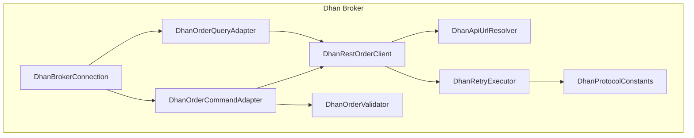
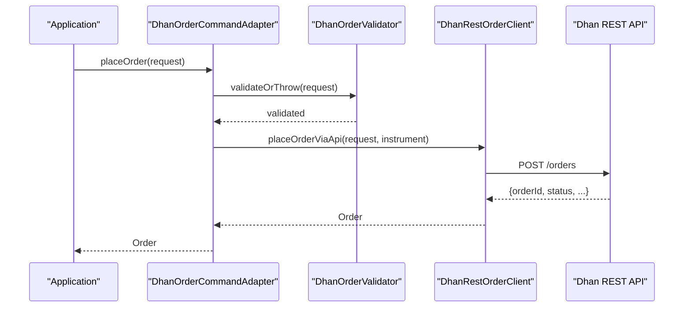
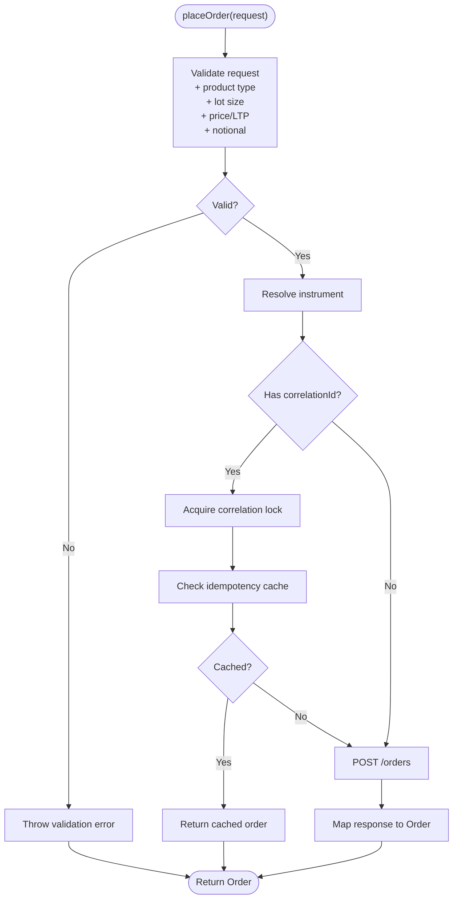
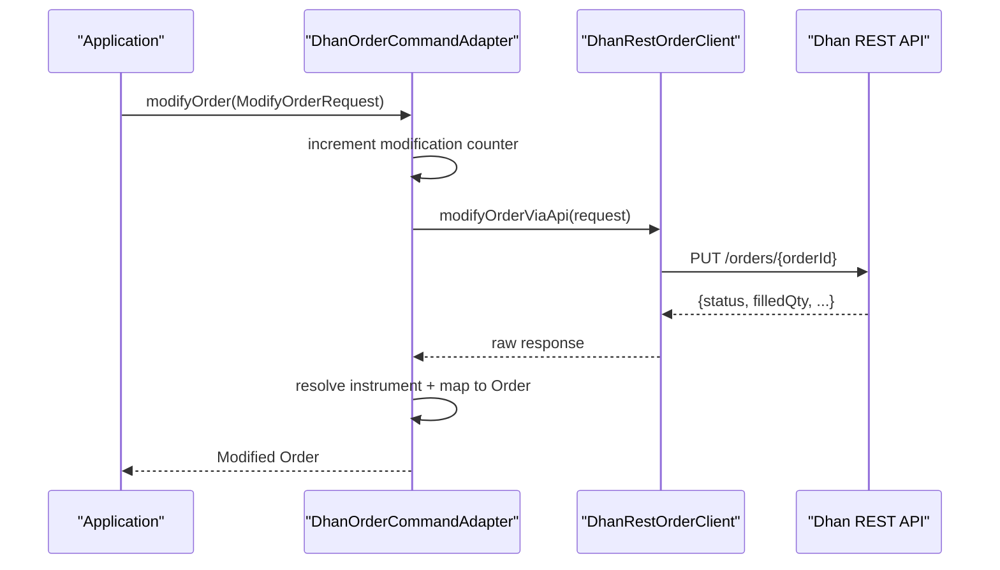
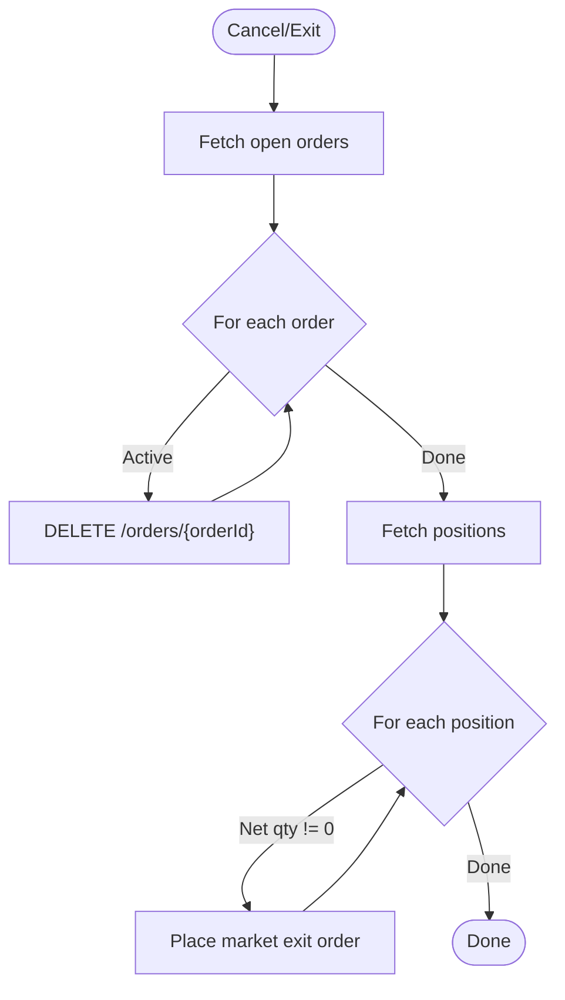
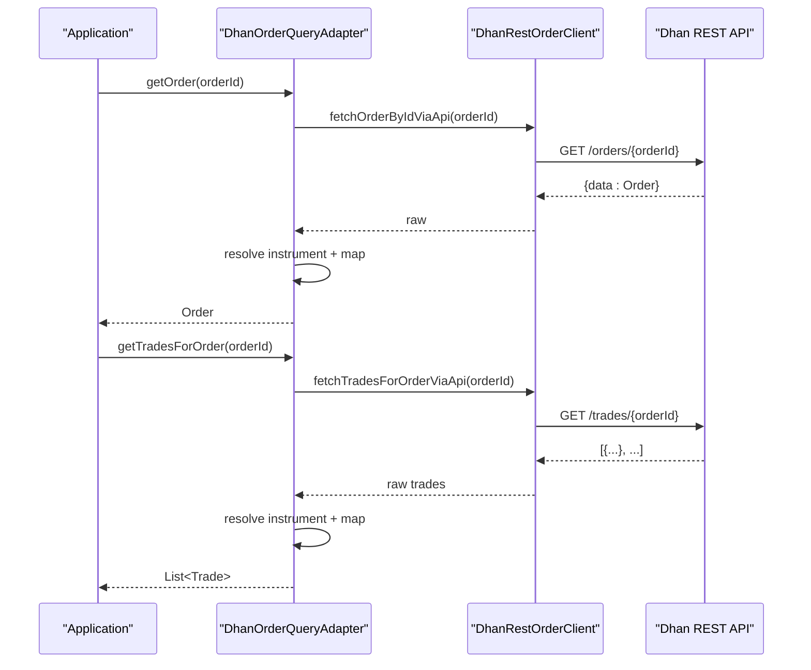
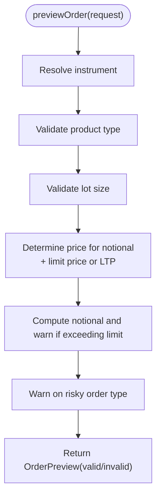
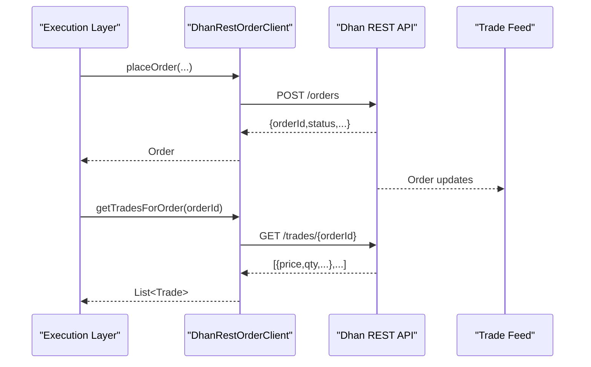
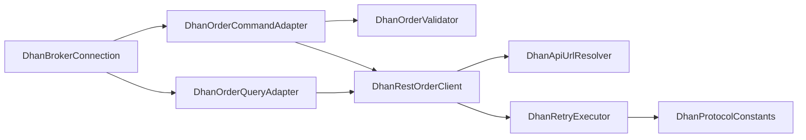

# Order Management

<cite>
**Referenced Files in This Document**
- [DhanRestOrderClient.java](file://broker/dhan/src/main/java/com/tradej/broker/dhan/orders/DhanRestOrderClient.java)
- [DhanOrderValidator.java](file://broker/dhan/src/main/java/com/tradej/broker/dhan/validator/DhanOrderValidator.java)
- [DhanApiEndpoints.java](file://broker/dhan/src/main/java/com/tradej/broker/dhan/constants/DhanApiEndpoints.java)
- [DhanApiUrlResolver.java](file://broker/dhan/src/main/java/com/tradej/broker/dhan/constants/DhanApiUrlResolver.java)
- [DhanRetryExecutor.java](file://broker/dhan/src/main/java/com/tradej/broker/dhan/resilience/DhanRetryExecutor.java)
- [DhanProtocolConstants.java](file://broker/dhan/src/main/java/com/tradej/broker/dhan/constants/DhanProtocolConstants.java)
- [DhanBrokerConnection.java](file://broker/dhan/src/main/java/com/tradej/broker/dhan/DhanBrokerConnection.java)
- [DhanOrderCommandAdapter.java](file://broker/dhan/src/main/java/com/tradej/broker/dhan/adapter/DhanOrderCommandAdapter.java)
- [DhanOrderQueryAdapter.java](file://broker/dhan/src/main/java/com/tradej/broker/dhan/adapter/DhanOrderQueryAdapter.java)
- [openapi.yaml](file://docs/openapi.yaml)
- [DhanOrderLifecycleIntegrationTest.java](file://app/src/test/java/com/tradej/app/integration/DhanOrderLifecycleIntegrationTest.java)
</cite>

## Table of Contents
1. [Introduction](#introduction)
2. [Project Structure](#project-structure)
3. [Core Components](#core-components)
4. [Architecture Overview](#architecture-overview)
5. [Detailed Component Analysis](#detailed-component-analysis)
6. [Dependency Analysis](#dependency-analysis)
7. [Performance Considerations](#performance-considerations)
8. [Troubleshooting Guide](#troubleshooting-guide)
9. [Conclusion](#conclusion)
10. [Appendices](#appendices)

## Introduction
This document describes Dhan’s order management system within the Trade-J platform. It covers order placement, modification, cancellation, and querying through the REST API, along with validation rules, state transitions, execution reporting, and error handling. Practical examples demonstrate placing market, limit, and stop-loss orders, modifying active orders, and querying order history. The system integrates a robust validation layer, resilient HTTP client, and sandbox/live dual-mode operation.

## Project Structure
The order management functionality resides primarily in the Dhan broker module. Key areas:
- REST client for orders and supporting endpoints
- Validation logic for product types, lot sizes, prices, and notional limits
- URL resolution and endpoint constants
- Resilience and rate-limiting configuration
- Adapters that expose the order commands and queries via a unified interface

**Diagram sources**
- [DhanBrokerConnection.java:64-422](file://broker/dhan/src/main/java/com/tradej/broker/dhan/DhanBrokerConnection.java#L64-L422)
- [DhanOrderCommandAdapter.java:29-183](file://broker/dhan/src/main/java/com/tradej/broker/dhan/adapter/DhanOrderCommandAdapter.java#L29-L183)
- [DhanOrderQueryAdapter.java:19-195](file://broker/dhan/src/main/java/com/tradej/broker/dhan/adapter/DhanOrderQueryAdapter.java#L19-L195)
- [DhanRestOrderClient.java:26-526](file://broker/dhan/src/main/java/com/tradej/broker/dhan/orders/DhanRestOrderClient.java#L26-L526)
- [DhanOrderValidator.java:40-411](file://broker/dhan/src/main/java/com/tradej/broker/dhan/validator/DhanOrderValidator.java#L40-L411)
- [DhanApiUrlResolver.java:5-148](file://broker/dhan/src/main/java/com/tradej/broker/dhan/constants/DhanApiUrlResolver.java#L5-L148)
- [DhanRetryExecutor.java:18-55](file://broker/dhan/src/main/java/com/tradej/broker/dhan/resilience/DhanRetryExecutor.java#L18-L55)
- [DhanProtocolConstants.java:16-196](file://broker/dhan/src/main/java/com/tradej/broker/dhan/constants/DhanProtocolConstants.java#L16-L196)

**Section sources**
- [DhanBrokerConnection.java:64-422](file://broker/dhan/src/main/java/com/tradej/broker/dhan/DhanBrokerConnection.java#L64-L422)
- [DhanOrderCommandAdapter.java:29-183](file://broker/dhan/src/main/java/com/tradej/broker/dhan/adapter/DhanOrderCommandAdapter.java#L29-L183)
- [DhanOrderQueryAdapter.java:19-195](file://broker/dhan/src/main/java/com/tradej/broker/dhan/adapter/DhanOrderQueryAdapter.java#L19-L195)
- [DhanRestOrderClient.java:26-526](file://broker/dhan/src/main/java/com/tradej/broker/dhan/orders/DhanRestOrderClient.java#L26-L526)
- [DhanOrderValidator.java:40-411](file://broker/dhan/src/main/java/com/tradej/broker/dhan/validator/DhanOrderValidator.java#L40-L411)
- [DhanApiUrlResolver.java:5-148](file://broker/dhan/src/main/java/com/tradej/broker/dhan/constants/DhanApiUrlResolver.java#L5-L148)
- [DhanRetryExecutor.java:18-55](file://broker/dhan/src/main/java/com/tradej/broker/dhan/resilience/DhanRetryExecutor.java#L18-L55)
- [DhanProtocolConstants.java:16-196](file://broker/dhan/src/main/java/com/tradej/broker/dhan/constants/DhanProtocolConstants.java#L16-L196)

## Core Components
- DhanRestOrderClient: Implements REST calls for placing, modifying, cancelling, and querying orders; supports sandbox and live modes; handles trades and positions retrieval.
- DhanOrderValidator: Enforces product-type compatibility, lot-size rules, price checks, notional limits, and warns on risky order types.
- DhanOrderCommandAdapter: Orchestrates order placement and modification, applies validation, idempotency, and safeguards (e.g., modification caps).
- DhanOrderQueryAdapter: Retrieves order and trade details, resolves instrument metadata, and computes derived metrics like average executed price.
- DhanApiUrlResolver and DhanApiEndpoints: Centralize endpoint construction and constants.
- DhanRetryExecutor and DhanProtocolConstants: Provide retry policies, circuit breaking, and rate limits tailored for order operations.

**Section sources**
- [DhanRestOrderClient.java:26-526](file://broker/dhan/src/main/java/com/tradej/broker/dhan/orders/DhanRestOrderClient.java#L26-L526)
- [DhanOrderValidator.java:40-411](file://broker/dhan/src/main/java/com/tradej/broker/dhan/validator/DhanOrderValidator.java#L40-L411)
- [DhanOrderCommandAdapter.java:29-183](file://broker/dhan/src/main/java/com/tradej/broker/dhan/adapter/DhanOrderCommandAdapter.java#L29-L183)
- [DhanOrderQueryAdapter.java:19-195](file://broker/dhan/src/main/java/com/tradej/broker/dhan/adapter/DhanOrderQueryAdapter.java#L19-L195)
- [DhanApiUrlResolver.java:5-148](file://broker/dhan/src/main/java/com/tradej/broker/dhan/constants/DhanApiUrlResolver.java#L5-L148)
- [DhanApiEndpoints.java:10-128](file://broker/dhan/src/main/java/com/tradej/broker/dhan/constants/DhanApiEndpoints.java#L10-L128)
- [DhanRetryExecutor.java:18-55](file://broker/dhan/src/main/java/com/tradej/broker/dhan/resilience/DhanRetryExecutor.java#L18-L55)
- [DhanProtocolConstants.java:16-196](file://broker/dhan/src/main/java/com/tradej/broker/dhan/constants/DhanProtocolConstants.java#L16-L196)

## Architecture Overview
The order lifecycle flows through adapters to the REST client, which interacts with Dhan endpoints. Validation occurs before placing orders. Resilience and rate limiting govern retries and throughput. Sandbox mode enables safe testing without affecting live accounts.

**Diagram sources**
- [DhanOrderCommandAdapter.java:55-95](file://broker/dhan/src/main/java/com/tradej/broker/dhan/adapter/DhanOrderCommandAdapter.java#L55-L95)
- [DhanOrderValidator.java:182-204](file://broker/dhan/src/main/java/com/tradej/broker/dhan/validator/DhanOrderValidator.java#L182-L204)
- [DhanRestOrderClient.java:145-152](file://broker/dhan/src/main/java/com/tradej/broker/dhan/orders/DhanRestOrderClient.java#L145-L152)
- [DhanApiUrlResolver.java:48-54](file://broker/dhan/src/main/java/com/tradej/broker/dhan/constants/DhanApiUrlResolver.java#L48-L54)

## Detailed Component Analysis

### Order Placement Workflow
- Validation: Product type allowed for the segment, lot size compliance, price presence for limit orders, notional limit awareness, and order type warning.
- Instrument resolution: Ensures symbol and segment match known definitions.
- Idempotency: Correlation ID locking prevents duplicate submissions.
- REST call: POST /orders with payload containing clientId, securityId, segment, side, product type, order type, validity, quantity, and optional price/trigger price.
- Sandbox vs live: Sandbox returns mapped Order; live returns raw response wrapped and mapped.

**Diagram sources**
- [DhanOrderCommandAdapter.java:55-95](file://broker/dhan/src/main/java/com/tradej/broker/dhan/adapter/DhanOrderCommandAdapter.java#L55-L95)
- [DhanOrderValidator.java:96-174](file://broker/dhan/src/main/java/com/tradej/broker/dhan/validator/DhanOrderValidator.java#L96-L174)
- [DhanRestOrderClient.java:460-481](file://broker/dhan/src/main/java/com/tradej/broker/dhan/orders/DhanRestOrderClient.java#L460-L481)

**Section sources**
- [DhanOrderCommandAdapter.java:55-95](file://broker/dhan/src/main/java/com/tradej/broker/dhan/adapter/DhanOrderCommandAdapter.java#L55-L95)
- [DhanOrderValidator.java:96-174](file://broker/dhan/src/main/java/com/tradej/broker/dhan/validator/DhanOrderValidator.java#L96-L174)
- [DhanRestOrderClient.java:460-481](file://broker/dhan/src/main/java/com/tradej/broker/dhan/orders/DhanRestOrderClient.java#L460-L481)

### Order Modification Workflow
- Modification cap: Limits modifications per order to prevent excessive churn.
- Payload composition: Updates quantity, price, trigger price, order type, and validity.
- REST call: PUT /orders/{orderId} with partial fields.
- Instrument resolution: Ensures consistent symbol/segment mapping after modification.

**Diagram sources**
- [DhanOrderCommandAdapter.java:103-125](file://broker/dhan/src/main/java/com/tradej/broker/dhan/adapter/DhanOrderCommandAdapter.java#L103-L125)
- [DhanRestOrderClient.java:154-166](file://broker/dhan/src/main/java/com/tradej/broker/dhan/orders/DhanRestOrderClient.java#L154-L166)

**Section sources**
- [DhanOrderCommandAdapter.java:103-125](file://broker/dhan/src/main/java/com/tradej/broker/dhan/adapter/DhanOrderCommandAdapter.java#L103-L125)
- [DhanRestOrderClient.java:154-166](file://broker/dhan/src/main/java/com/tradej/broker/dhan/orders/DhanRestOrderClient.java#L154-L166)

### Order Cancellation and Square-Off
- Single cancellation: DELETE /orders/{orderId}.
- Cancel all open orders: Fetch order book, filter active orders, and cancel each.
- Square-off intraday positions: Cancel open orders, then place market orders to exit positions.

**Diagram sources**
- [DhanOrderCommandAdapter.java:127-163](file://broker/dhan/src/main/java/com/tradej/broker/dhan/adapter/DhanOrderCommandAdapter.java#L127-L163)
- [DhanRestOrderClient.java:168-175](file://broker/dhan/src/main/java/com/tradej/broker/dhan/orders/DhanRestOrderClient.java#L168-L175)
- [DhanRestOrderClient.java:204-219](file://broker/dhan/src/main/java/com/tradej/broker/dhan/orders/DhanRestOrderClient.java#L204-L219)

**Section sources**
- [DhanOrderCommandAdapter.java:127-163](file://broker/dhan/src/main/java/com/tradej/broker/dhan/adapter/DhanOrderCommandAdapter.java#L127-L163)
- [DhanRestOrderClient.java:168-175](file://broker/dhan/src/main/java/com/tradej/broker/dhan/orders/DhanRestOrderClient.java#L168-L175)
- [DhanRestOrderClient.java:204-219](file://broker/dhan/src/main/java/com/tradej/broker/dhan/orders/DhanRestOrderClient.java#L204-L219)

### Order Querying and Reporting
- Get order by orderId or external correlationId.
- Retrieve order book and trade book; resolve instrument metadata for canonical symbols and segments.
- Compute derived metrics: average executed price and earliest exchange timestamp for an order.

**Diagram sources**
- [DhanOrderQueryAdapter.java:35-73](file://broker/dhan/src/main/java/com/tradej/broker/dhan/adapter/DhanOrderQueryAdapter.java#L35-L73)
- [DhanOrderQueryAdapter.java:105-122](file://broker/dhan/src/main/java/com/tradej/broker/dhan/adapter/DhanOrderQueryAdapter.java#L105-L122)
- [DhanRestOrderClient.java:79-93](file://broker/dhan/src/main/java/com/tradej/broker/dhan/orders/DhanRestOrderClient.java#L79-L93)
- [DhanRestOrderClient.java:118-134](file://broker/dhan/src/main/java/com/tradej/broker/dhan/orders/DhanRestOrderClient.java#L118-L134)

**Section sources**
- [DhanOrderQueryAdapter.java:35-73](file://broker/dhan/src/main/java/com/tradej/broker/dhan/adapter/DhanOrderQueryAdapter.java#L35-L73)
- [DhanOrderQueryAdapter.java:105-122](file://broker/dhan/src/main/java/com/tradej/broker/dhan/adapter/DhanOrderQueryAdapter.java#L105-L122)
- [DhanRestOrderClient.java:79-93](file://broker/dhan/src/main/java/com/tradej/broker/dhan/orders/DhanRestOrderClient.java#L79-L93)
- [DhanRestOrderClient.java:118-134](file://broker/dhan/src/main/java/com/tradej/broker/dhan/orders/DhanRestOrderClient.java#L118-L134)

### Order Validation Process
- Product type validation: Enforce allowed product types per exchange segment; disallow CNC/MTF for F&O/commodity/currency segments.
- Lot size validation: Quantity must be a multiple of instrument lot size for F&O instruments.
- Price checks: Limit orders require a positive price; market orders require live LTP for notional calculation.
- Notional limits: Warn when notional exceeds configured maximum (₹50,000 default).
- Order type defaults: Warn on market orders; suggest limit orders for price control.

**Diagram sources**
- [DhanOrderValidator.java:96-174](file://broker/dhan/src/main/java/com/tradej/broker/dhan/validator/DhanOrderValidator.java#L96-L174)
- [DhanOrderValidator.java:209-248](file://broker/dhan/src/main/java/com/tradej/broker/dhan/validator/DhanOrderValidator.java#L209-L248)
- [DhanOrderValidator.java:253-273](file://broker/dhan/src/main/java/com/tradej/broker/dhan/validator/DhanOrderValidator.java#L253-L273)
- [DhanOrderValidator.java:280-327](file://broker/dhan/src/main/java/com/tradej/broker/dhan/validator/DhanOrderValidator.java#L280-L327)
- [DhanOrderValidator.java:332-352](file://broker/dhan/src/main/java/com/tradej/broker/dhan/validator/DhanOrderValidator.java#L332-L352)
- [DhanOrderValidator.java:357-371](file://broker/dhan/src/main/java/com/tradej/broker/dhan/validator/DhanOrderValidator.java#L357-L371)
- [DhanProtocolConstants.java:178-179](file://broker/dhan/src/main/java/com/tradej/broker/dhan/constants/DhanProtocolConstants.java#L178-L179)

**Section sources**
- [DhanOrderValidator.java:96-174](file://broker/dhan/src/main/java/com/tradej/broker/dhan/validator/DhanOrderValidator.java#L96-L174)
- [DhanOrderValidator.java:209-248](file://broker/dhan/src/main/java/com/tradej/broker/dhan/validator/DhanOrderValidator.java#L209-L248)
- [DhanOrderValidator.java:253-273](file://broker/dhan/src/main/java/com/tradej/broker/dhan/validator/DhanOrderValidator.java#L253-L273)
- [DhanOrderValidator.java:280-327](file://broker/dhan/src/main/java/com/tradej/broker/dhan/validator/DhanOrderValidator.java#L280-L327)
- [DhanOrderValidator.java:332-352](file://broker/dhan/src/main/java/com/tradej/broker/dhan/validator/DhanOrderValidator.java#L332-L352)
- [DhanOrderValidator.java:357-371](file://broker/dhan/src/main/java/com/tradej/broker/dhan/validator/DhanOrderValidator.java#L357-L371)
- [DhanProtocolConstants.java:178-179](file://broker/dhan/src/main/java/com/tradej/broker/dhan/constants/DhanProtocolConstants.java#L178-L179)

### Order Routing, Execution, and Fill Reporting
- Routing: Orders are routed to Dhan via REST endpoints determined by DhanApiUrlResolver.
- Execution: REST client executes requests with resilience and rate limiting.
- Fill reporting: Trades are retrieved via /trades and /trades/{orderId}; adapter resolves instrument metadata and computes average executed price.

**Diagram sources**
- [DhanRestOrderClient.java:145-152](file://broker/dhan/src/main/java/com/tradej/broker/dhan/orders/DhanRestOrderClient.java#L145-L152)
- [DhanRestOrderClient.java:118-134](file://broker/dhan/src/main/java/com/tradej/broker/dhan/orders/DhanRestOrderClient.java#L118-L134)
- [DhanApiUrlResolver.java:56-82](file://broker/dhan/src/main/java/com/tradej/broker/dhan/constants/DhanApiUrlResolver.java#L56-L82)

**Section sources**
- [DhanRestOrderClient.java:145-152](file://broker/dhan/src/main/java/com/tradej/broker/dhan/orders/DhanRestOrderClient.java#L145-L152)
- [DhanRestOrderClient.java:118-134](file://broker/dhan/src/main/java/com/tradej/broker/dhan/orders/DhanRestOrderClient.java#L118-L134)
- [DhanApiUrlResolver.java:56-82](file://broker/dhan/src/main/java/com/tradej/broker/dhan/constants/DhanApiUrlResolver.java#L56-L82)

### Practical Examples
- Placing a market order: Provide symbol, segment, side, quantity, product type (e.g., INTRADAY), validity (DAY), and correlationId for idempotency. The system validates and submits via POST /orders.
- Placing a limit order: Same as market but include a positive price in paisa.
- Placing a stop-loss order: Include a trigger price in paisa alongside order type STOP_MARKET or STOP_LIMIT.
- Modifying an active order: Use ModifyOrderRequest with orderId and desired fields (quantity, price, triggerPrice, orderType, validity).
- Querying order history: Use getOrder(orderId) or getOrderBook(); for fills, use getTradesForOrder(orderId).

These examples are demonstrated in integration tests and adapter flows.

**Section sources**
- [DhanOrderCommandAdapter.java:55-95](file://broker/dhan/src/main/java/com/tradej/broker/dhan/adapter/DhanOrderCommandAdapter.java#L55-L95)
- [DhanOrderCommandAdapter.java:103-125](file://broker/dhan/src/main/java/com/tradej/broker/dhan/adapter/DhanOrderCommandAdapter.java#L103-L125)
- [DhanOrderQueryAdapter.java:35-73](file://broker/dhan/src/main/java/com/tradej/broker/dhan/adapter/DhanOrderQueryAdapter.java#L35-L73)
- [DhanOrderQueryAdapter.java:105-122](file://broker/dhan/src/main/java/com/tradej/broker/dhan/adapter/DhanOrderQueryAdapter.java#L105-L122)
- [DhanOrderLifecycleIntegrationTest.java:36-76](file://app/src/test/java/com/tradej/app/integration/DhanOrderLifecycleIntegrationTest.java#L36-L76)

## Dependency Analysis
- Coupling: DhanBrokerConnection composes adapters and clients; adapters depend on the REST client and validator.
- Cohesion: Each class has a single responsibility—validation, REST calls, or query mapping.
- External dependencies: Dhan REST endpoints, rate limiter, and circuit breaker.
- Resilience: DhanRetryExecutor classifies auth errors and applies retry policies per API category.

**Diagram sources**
- [DhanBrokerConnection.java:112-253](file://broker/dhan/src/main/java/com/tradej/broker/dhan/DhanBrokerConnection.java#L112-L253)
- [DhanOrderCommandAdapter.java:39-53](file://broker/dhan/src/main/java/com/tradej/broker/dhan/adapter/DhanOrderCommandAdapter.java#L39-L53)
- [DhanOrderQueryAdapter.java:23-33](file://broker/dhan/src/main/java/com/tradej/broker/dhan/adapter/DhanOrderQueryAdapter.java#L23-L33)
- [DhanRestOrderClient.java:33-43](file://broker/dhan/src/main/java/com/tradej/broker/dhan/orders/DhanRestOrderClient.java#L33-L43)
- [DhanApiUrlResolver.java:8-14](file://broker/dhan/src/main/java/com/tradej/broker/dhan/constants/DhanApiUrlResolver.java#L8-L14)
- [DhanRetryExecutor.java:20-26](file://broker/dhan/src/main/java/com/tradej/broker/dhan/resilience/DhanRetryExecutor.java#L20-L26)
- [DhanProtocolConstants.java:186-194](file://broker/dhan/src/main/java/com/tradej/broker/dhan/constants/DhanProtocolConstants.java#L186-L194)

**Section sources**
- [DhanBrokerConnection.java:112-253](file://broker/dhan/src/main/java/com/tradej/broker/dhan/DhanBrokerConnection.java#L112-L253)
- [DhanOrderCommandAdapter.java:39-53](file://broker/dhan/src/main/java/com/tradej/broker/dhan/adapter/DhanOrderCommandAdapter.java#L39-L53)
- [DhanOrderQueryAdapter.java:23-33](file://broker/dhan/src/main/java/com/tradej/broker/dhan/adapter/DhanOrderQueryAdapter.java#L23-L33)
- [DhanRestOrderClient.java:33-43](file://broker/dhan/src/main/java/com/tradej/broker/dhan/orders/DhanRestOrderClient.java#L33-L43)
- [DhanApiUrlResolver.java:8-14](file://broker/dhan/src/main/java/com/tradej/broker/dhan/constants/DhanApiUrlResolver.java#L8-L14)
- [DhanRetryExecutor.java:20-26](file://broker/dhan/src/main/java/com/tradej/broker/dhan/resilience/DhanRetryExecutor.java#L20-L26)
- [DhanProtocolConstants.java:186-194](file://broker/dhan/src/main/java/com/tradej/broker/dhan/constants/DhanProtocolConstants.java#L186-L194)

## Performance Considerations
- Rate limiting: Token buckets enforce throughput caps per API category (ORDER, DATA, QUOTE, OPTION_CHAIN, NON_TRADING).
- Retries: Backoff strategy with thresholds and circuit breaker prevents overload during transient failures.
- Order modifications: Built-in cap prevents excessive modification churn.
- Sandbox mode: Enables safe testing without impacting live throughput.

[No sources needed since this section provides general guidance]

## Troubleshooting Guide
Common issues and resolutions:
- Invalid instrument or segment: Ensure symbol and exchange segment match known definitions; validation throws descriptive errors.
- Product type mismatch: Verify allowed product types per segment; validator reports disallowed combinations.
- Lot size violation: Adjust quantity to be a multiple of the instrument’s lot size for F&O segments.
- Missing LTP for market orders: Provide a limit price or ensure market data connectivity for live LTP.
- Network failures: Resilient client retries with backoff; monitor circuit breaker state.
- Exchange rejections: Inspect rejection reason returned in order/trade payloads; adjust request accordingly.

**Section sources**
- [DhanOrderValidator.java:100-124](file://broker/dhan/src/main/java/com/tradej/broker/dhan/validator/DhanOrderValidator.java#L100-L124)
- [DhanOrderValidator.java:214-248](file://broker/dhan/src/main/java/com/tradej/broker/dhan/validator/DhanOrderValidator.java#L214-L248)
- [DhanOrderValidator.java:258-273](file://broker/dhan/src/main/java/com/tradej/broker/dhan/validator/DhanOrderValidator.java#L258-L273)
- [DhanOrderValidator.java:302-327](file://broker/dhan/src/main/java/com/tradej/broker/dhan/validator/DhanOrderValidator.java#L302-L327)
- [DhanRetryExecutor.java:36-41](file://broker/dhan/src/main/java/com/tradej/broker/dhan/resilience/DhanRetryExecutor.java#L36-L41)
- [DhanProtocolConstants.java:103-142](file://broker/dhan/src/main/java/com/tradej/broker/dhan/constants/DhanProtocolConstants.java#L103-L142)

## Conclusion
Dhan’s order management system provides a robust, validated, and resilient pathway for placing, modifying, cancelling, and querying orders. The modular design separates concerns across adapters, validators, and REST clients, while sandbox mode supports safe experimentation. Strong validation rules, rate limiting, and retry logic help maintain reliability under varying conditions.

[No sources needed since this section summarizes without analyzing specific files]

## Appendices

### REST Endpoints Overview
- Orders: POST /orders, GET /orders, GET /orders/{orderId}, PUT /orders/{orderId}, DELETE /orders/{orderId}, GET /orders/external/{correlationId}
- Trades: GET /trades, GET /trades/{orderId}
- Positions: GET /positions
- Kill Switch: PUT /killswitch

Note: Additional endpoints exist for advanced order types and administrative functions.

**Section sources**
- [DhanApiUrlResolver.java:48-98](file://broker/dhan/src/main/java/com/tradej/broker/dhan/constants/DhanApiUrlResolver.java#L48-L98)
- [DhanApiEndpoints.java:40-75](file://broker/dhan/src/main/java/com/tradej/broker/dhan/constants/DhanApiEndpoints.java#L40-L75)