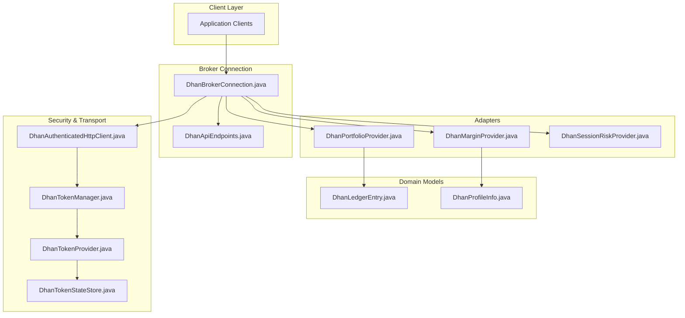
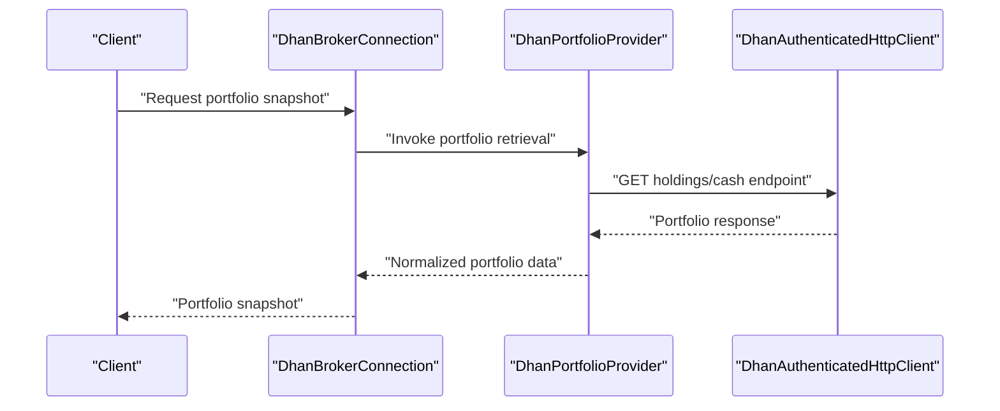
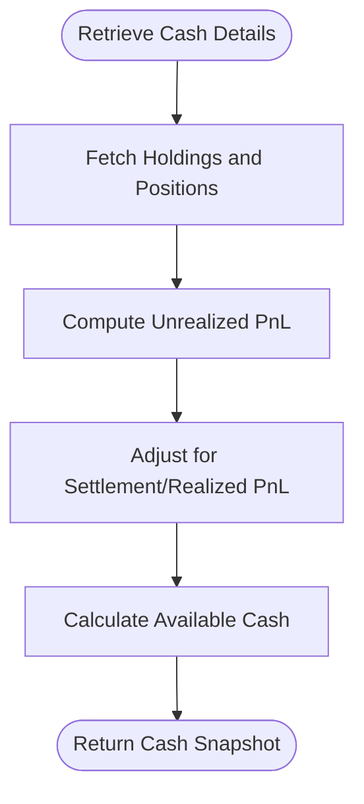
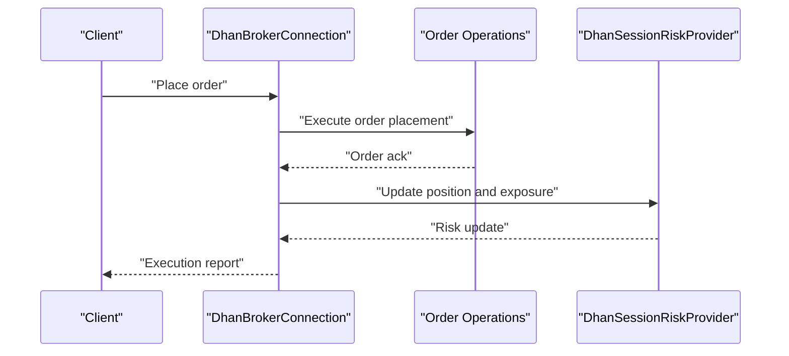
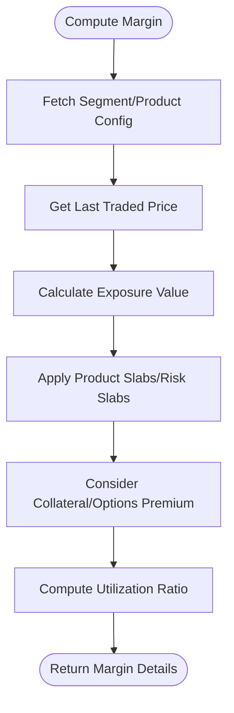
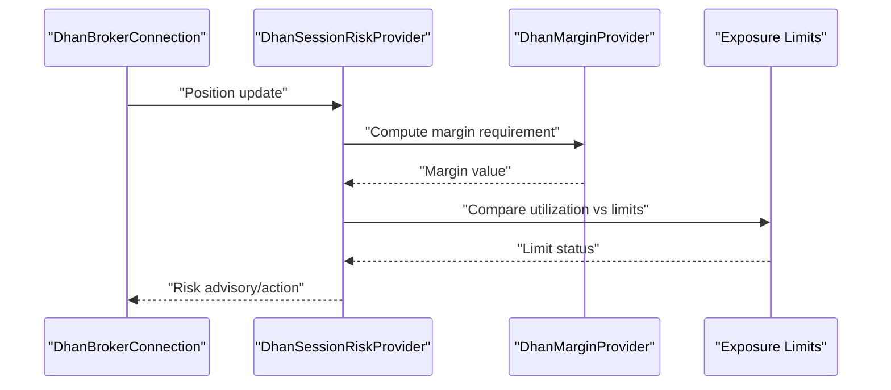
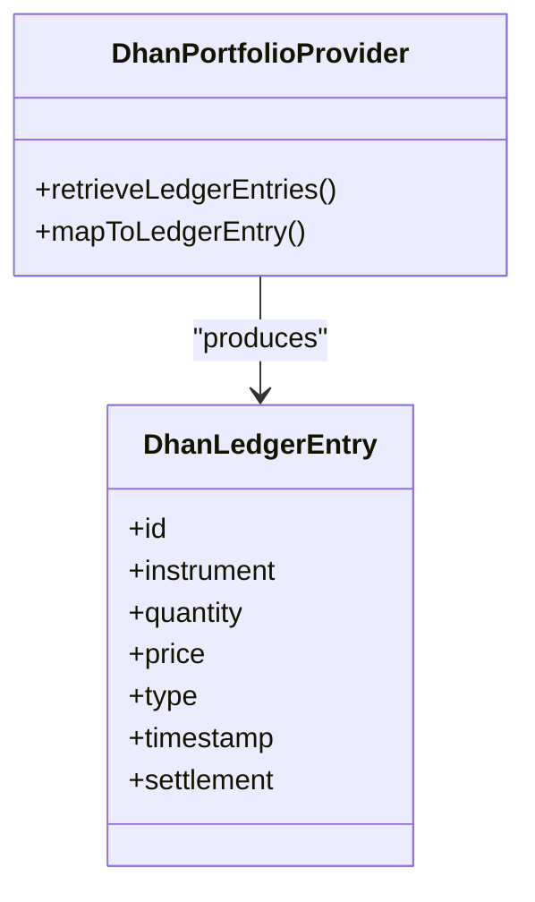
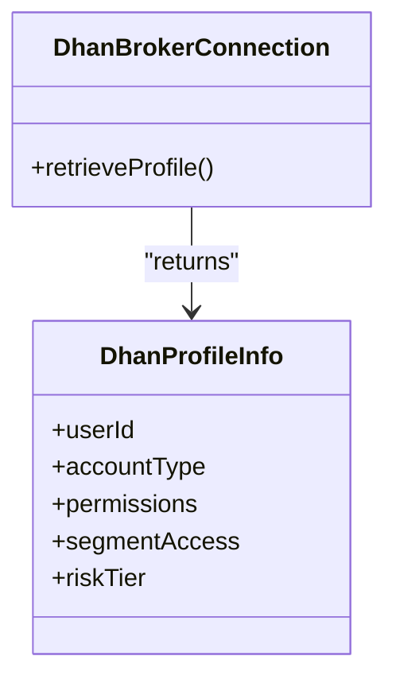
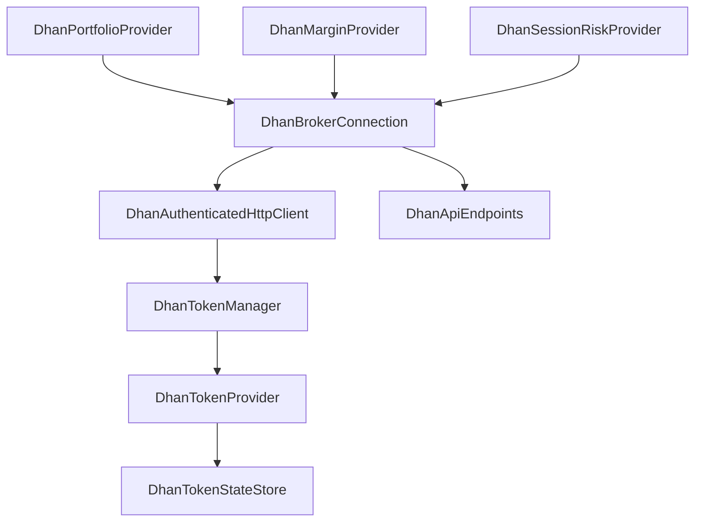

# Portfolio and Margin Management

<cite>
**Referenced Files in This Document**
- [DhanPortfolioProvider.java](file://broker/dhan/src/main/java/com/tradej/broker/dhan/adapter/DhanPortfolioProvider.java)
- [DhanMarginProvider.java](file://broker/dhan/src/main/java/com/tradej/broker/dhan/adapter/DhanMarginProvider.java)
- [DhanSessionRiskProvider.java](file://broker/dhan/src/main/java/com/tradej/broker/dhan/adapter/DhanSessionRiskProvider.java)
- [DhanLedgerEntry.java](file://broker/dhan/src/main/java/com/tradej/broker/dhan/domain/DhanLedgerEntry.java)
- [DhanProfileInfo.java](file://broker/dhan/src/main/java/com/tradej/broker/dhan/domain/DhanProfileInfo.java)
- [DhanBrokerConnection.java](file://broker/dhan/src/main/java/com/tradej/broker/dhan/DhanBrokerConnection.java)
- [DhanApiEndpoints.java](file://broker/dhan/src/main/java/com/tradej/broker/dhan/constants/DhanApiEndpoints.java)
- [DhanAuthenticatedHttpClient.java](file://broker/dhan/src/main/java/com/tradej/broker/dhan/http/DhanAuthenticatedHttpClient.java)
- [DhanTokenManager.java](file://broker/dhan/src/main/java/com/tradej/broker/dhan/auth/DhanTokenManager.java)
- [DhanTokenProvider.java](file://broker/dhan/src/main/java/com/tradej/broker/dhan/auth/DhanTokenProvider.java)
- [DhanTokenStateStore.java](file://broker/dhan/src/main/java/com/tradej/broker/dhan/auth/DhanTokenStateStore.java)
- [DhanPortfolioIntegrationTest.java](file://app/src/test/java/com/tradej/app/integration/DhanPortfolioIntegrationTest.java)
- [DhanMarginIntegrationTest.java](file://app/src/test/java/com/tradej/app/integration/DhanMarginIntegrationTest.java)
- [DhanSessionRiskIntegrationTest.java](file://app/src/test/java/com/tradej/app/integration/DhanSessionRiskIntegrationTest.java)
- [DhanOrderLifecycleIntegrationTest.java](file://app/src/test/java/com/tradej/app/integration/DhanOrderLifecycleIntegrationTest.java)
- [DhanOrderQueryIntegrationTest.java](file://app/src/test/java/com/tradej/app/integration/DhanOrderQueryIntegrationTest.java)
- [DhanOrderQueryLiveIntegrationTest.java](file://app/src/test/java/com/tradej/app/integration/DhanOrderQueryLiveIntegrationTest.java)
- [DhanOrderModifyIntegrationTest.java](file://app/src/test/java/com/tradej/app/integration/DhanOrderModifyIntegrationTest.java)
- [DhanCancelAllIntegrationTest.java](file://app/src/test/java/com/tradej/app/integration/DhanCancelAllIntegrationTest.java)
- [DhanSquareOffIntegrationTest.java](file://app/src/test/java/com/tradej/app/integration/DhanSquareOffIntegrationTest.java)
- [DhanSuperOrderIntegrationTest.java](file://app/src/test/java/com/tradej/app/integration/DhanSuperOrderIntegrationTest.java)
- [DhanSliceOrderIntegrationTest.java](file://app/src/test/java/com/tradej/app/integration/DhanSliceOrderIntegrationTest.java)
- [DhanBracketOrderIntegrationTest.java](file://app/src/test/java/com/tradej/app/integration/DhanBracketOrderIntegrationTest.java)
- [DhanGttOrderIntegrationTest.java](file://app/src/test/java/com/tradej/app/integration/DhanGttOrderIntegrationTest.java)
- [DhanMarketFeedWebSocketIntegrationTest.java](file://app/src/test/java/com/tradej/app/integration/DhanMarketFeedWebSocketIntegrationTest.java)
- [DhanMarketFeedWebSocketQuoteIntegrationTest.java](file://app/src/test/java/com/tradej/app/integration/DhanMarketFeedWebSocketQuoteIntegrationTest.java)
- [DhanMarketFeedWebSocketFullIntegrationTest.java](file://app/src/test/java/com/tradej/app/integration/DhanMarketFeedWebSocketFullIntegrationTest.java)
- [DhanMarketDepthIntegrationTest.java](file://app/src/test/java/com/tradej/app/integration/DhanMarketDepthIntegrationTest.java)
- [DhanTwentyDepthIntegrationTest.java](file://app/src/test/java/com/tradej/app/integration/DhanTwentyDepthIntegrationTest.java)
- [DhanBatchQuoteIntegrationTest.java](file://app/src/test/java/com/tradej/app/integration/DhanBatchQuoteIntegrationTest.java)
- [DhanHistoricalDataIntegrationTest.java](file://app/src/test/java/com/tradej/app/integration/DhanHistoricalDataIntegrationTest.java)
- [DhanDerivativesIntegrationTest.java](file://app/src/test/java/com/tradej/app/integration/DhanDerivativesIntegrationTest.java)
- [DhanRollingOptionIntegrationTest.java](file://app/src/test/java/com/tradej/app/integration/DhanRollingOptionIntegrationTest.java)
- [DhanRollingOptionDownloadIntegrationTest.java](file://app/src/test/java/com/tradej/app/integration/DhanRollingOptionDownloadIntegrationTest.java)
- [DhanStrikeSelectionIntegrationTest.java](file://app/src/test/java/com/tradej/app/integration/DhanStrikeSelectionIntegrationTest.java)
- [DhanForeverOrderIntegrationTest.java](file://app/src/test/java/com/tradej/app/integration/DhanForeverOrderIntegrationTest.java)
- [DhanTokenLifecycleIntegrationTest.java](file://app/src/test/java/com/tradej/app/integration/DhanTokenLifecycleIntegrationTest.java)
- [DhanTokenForcedGenerationIntegrationTest.java](file://app/src/test/java/com/tradej/app/integration/DhanTokenForcedGenerationIntegrationTest.java)
- [DhanRefreshProductionTokenIntegrationTest.java](file://app/src/test/java/com/tradej/app/integration/DhanRefreshProductionTokenIntegrationTest.java)
- [LiveDhanTestSupport.java](file://app/src/test/java/com/tradej/app/integration/LiveDhanTestSupport.java)
- [LiveDhanAuthSession.java](file://app/src/test/java/com/tradej/app/integration/LiveDhanAuthSession.java)
- [DHAN_SAFETY_RULES_PLAN.md](file://broker/dhan/DHAN_SAFETY_RULES_PLAN.md)
</cite>

## Table of Contents
1. [Introduction](#introduction)
2. [Project Structure](#project-structure)
3. [Core Components](#core-components)
4. [Architecture Overview](#architecture-overview)
5. [Detailed Component Analysis](#detailed-component-analysis)
6. [Dependency Analysis](#dependency-analysis)
7. [Performance Considerations](#performance-considerations)
8. [Troubleshooting Guide](#troubleshooting-guide)
9. [Conclusion](#conclusion)
10. [Appendices](#appendices)

## Introduction
This document provides comprehensive documentation for Dhan portfolio and margin management features within the Trade-J ecosystem. It covers portfolio holdings retrieval, cash balance tracking, position management, margin calculation methodologies, exposure limits, margin utilization monitoring, ledger entry processing, transaction history tracking, and profile information retrieval including account details and trading permissions. Practical examples demonstrate querying portfolio snapshots, monitoring margin requirements, tracking position changes, and implementing margin-aware trading strategies. Edge cases in margin calculations and real-time margin updates are addressed to ensure robust operational handling.

## Project Structure
The Dhan integration resides primarily under the Dhan broker module. Key areas relevant to portfolio and margin management include:
- Adapter layer for portfolio, margin, session risk, and order-related operations
- Domain models for ledger entries and profile information
- Authentication and HTTP client components for secure API access
- Integration tests validating end-to-end workflows for portfolio, margin, and risk operations

```mermaid
graph TB
subgraph "Dhan Broker"
DP["DhanPortfolioProvider.java"]
DM["DhanMarginProvider.java"]
DSR["DhanSessionRiskProvider.java"]
DLE["DhanLedgerEntry.java"]
DPI["DhanProfileInfo.java"]
DBC["DhanBrokerConnection.java"]
DAHC["DhanAuthenticatedHttpClient.java"]
DTM["DhanTokenManager.java"]
DTP["DhanTokenProvider.java"]
DTS["DhanTokenStateStore.java"]
DAE["DhanApiEndpoints.java"]
end
subgraph "Integration Tests"
IPT["DhanPortfolioIntegrationTest.java"]
IMT["DhanMarginIntegrationTest.java"]
ISRT["DhanSessionRiskIntegrationTest.java"]
IOLT["DhanOrderLifecycleIntegrationTest.java"]
IQ["DhanOrderQueryIntegrationTest.java"]
IQL["DhanOrderQueryLiveIntegrationTest.java"]
IMT2["DhanOrderModifyIntegrationTest.java"]
ICA["DhanCancelAllIntegrationTest.java"]
ISO["DhanSquareOffIntegrationTest.java"]
ISO2["DhanSuperOrderIntegrationTest.java"]
ISO3["DhanSliceOrderIntegrationTest.java"]
ISO4["DhanBracketOrderIntegrationTest.java"]
ISO5["DhanGttOrderIntegrationTest.java"]
IMF["DhanMarketFeedWebSocketIntegrationTest.java"]
IMQ["DhanMarketFeedWebSocketQuoteIntegrationTest.java"]
IMF2["DhanMarketFeedWebSocketFullIntegrationTest.java"]
IMD["DhanMarketDepthIntegrationTest.java"]
ITD["DhanTwentyDepthIntegrationTest.java"]
IBQ["DhanBatchQuoteIntegrationTest.java"]
IHD["DhanHistoricalDataIntegrationTest.java"]
IDV["DhanDerivativesIntegrationTest.java"]
IRO["DhanRollingOptionIntegrationTest.java"]
IRD["DhanRollingOptionDownloadIntegrationTest.java"]
ISS["DhanStrikeSelectionIntegrationTest.java"]
IFO["DhanForeverOrderIntegrationTest.java"]
ITL["DhanTokenLifecycleIntegrationTest.java"]
ITFG["DhanTokenForcedGenerationIntegrationTest.java"]
IRT["DhanRefreshProductionTokenIntegrationTest.java"]
end
DP --> DBC
DM --> DBC
DSR --> DBC
DBC --> DAHC
DAHC --> DTM
DTM --> DTP
DTP --> DTS
DBC --> DAE
IPT --> DP
IMT --> DM
ISRT --> DSR
IOLT --> DBC
IQ --> DBC
IQL --> DBC
IMT2 --> DBC
ICA --> DBC
ISO --> DBC
ISO2 --> DBC
ISO3 --> DBC
ISO4 --> DBC
ISO5 --> DBC
IMF --> DBC
IMQ --> DBC
IMF2 --> DBC
IMD --> DBC
ITD --> DBC
IBQ --> DBC
IHD --> DBC
IDV --> DBC
IRO --> DBC
IRD --> DBC
ISS --> DBC
IFO --> DBC
ITL --> DTM
ITFG --> DTM
IRT --> DTM
```

**Diagram sources**
- [DhanPortfolioProvider.java](file://broker/dhan/src/main/java/com/tradej/broker/dhan/adapter/DhanPortfolioProvider.java)
- [DhanMarginProvider.java](file://broker/dhan/src/main/java/com/tradej/broker/dhan/adapter/DhanMarginProvider.java)
- [DhanSessionRiskProvider.java](file://broker/dhan/src/main/java/com/tradej/broker/dhan/adapter/DhanSessionRiskProvider.java)
- [DhanLedgerEntry.java](file://broker/dhan/src/main/java/com/tradej/broker/dhan/domain/DhanLedgerEntry.java)
- [DhanProfileInfo.java](file://broker/dhan/src/main/java/com/tradej/broker/dhan/domain/DhanProfileInfo.java)
- [DhanBrokerConnection.java](file://broker/dhan/src/main/java/com/tradej/broker/dhan/DhanBrokerConnection.java)
- [DhanAuthenticatedHttpClient.java](file://broker/dhan/src/main/java/com/tradej/broker/dhan/http/DhanAuthenticatedHttpClient.java)
- [DhanTokenManager.java](file://broker/dhan/src/main/java/com/tradej/broker/dhan/auth/DhanTokenManager.java)
- [DhanTokenProvider.java](file://broker/dhan/src/main/java/com/tradej/broker/dhan/auth/DhanTokenProvider.java)
- [DhanTokenStateStore.java](file://broker/dhan/src/main/java/com/tradej/broker/dhan/auth/DhanTokenStateStore.java)
- [DhanApiEndpoints.java](file://broker/dhan/src/main/java/com/tradej/broker/dhan/constants/DhanApiEndpoints.java)
- [DhanPortfolioIntegrationTest.java](file://app/src/test/java/com/tradej/app/integration/DhanPortfolioIntegrationTest.java)
- [DhanMarginIntegrationTest.java](file://app/src/test/java/com/tradej/app/integration/DhanMarginIntegrationTest.java)
- [DhanSessionRiskIntegrationTest.java](file://app/src/test/java/com/tradej/app/integration/DhanSessionRiskIntegrationTest.java)

**Section sources**
- [DhanBrokerConnection.java](file://broker/dhan/src/main/java/com/tradej/broker/dhan/DhanBrokerConnection.java)
- [DhanPortfolioProvider.java](file://broker/dhan/src/main/java/com/tradej/broker/dhan/adapter/DhanPortfolioProvider.java)
- [DhanMarginProvider.java](file://broker/dhan/src/main/java/com/tradej/broker/dhan/adapter/DhanMarginProvider.java)
- [DhanSessionRiskProvider.java](file://broker/dhan/src/main/java/com/tradej/broker/dhan/adapter/DhanSessionRiskProvider.java)
- [DhanLedgerEntry.java](file://broker/dhan/src/main/java/com/tradej/broker/dhan/domain/DhanLedgerEntry.java)
- [DhanProfileInfo.java](file://broker/dhan/src/main/java/com/tradej/broker/dhan/domain/DhanProfileInfo.java)
- [DhanAuthenticatedHttpClient.java](file://broker/dhan/src/main/java/com/tradej/broker/dhan/http/DhanAuthenticatedHttpClient.java)
- [DhanTokenManager.java](file://broker/dhan/src/main/java/com/tradej/broker/dhan/auth/DhanTokenManager.java)
- [DhanTokenProvider.java](file://broker/dhan/src/main/java/com/tradej/broker/dhan/auth/DhanTokenProvider.java)
- [DhanTokenStateStore.java](file://broker/dhan/src/main/java/com/tradej/broker/dhan/auth/DhanTokenStateStore.java)
- [DhanApiEndpoints.java](file://broker/dhan/src/main/java/com/tradej/broker/dhan/constants/DhanApiEndpoints.java)

## Core Components
This section outlines the primary building blocks for portfolio and margin management:

- Portfolio Provider: Retrieves portfolio holdings, cash balances, and position details via Dhan APIs.
- Margin Provider: Computes margin requirements, utilization, and exposure limits for positions.
- Session Risk Provider: Monitors real-time margin utilization and enforces session-level risk controls.
- Ledger Entry Model: Represents transaction history entries for audit and reconciliation.
- Profile Info Model: Encapsulates account and trading permission details for risk and compliance checks.
- Authentication and HTTP Client: Manages secure API communication with Dhan, including token lifecycle and retries.

Key responsibilities:
- Portfolio holdings retrieval and aggregation
- Cash balance tracking and availability computation
- Position management including net positions, buy/sell quantities, and unrealized PnL
- Margin calculation methodologies and utilization monitoring
- Exposure limit enforcement and real-time updates
- Ledger entry processing and transaction history tracking
- Profile information retrieval for account details and trading permissions

**Section sources**
- [DhanPortfolioProvider.java](file://broker/dhan/src/main/java/com/tradej/broker/dhan/adapter/DhanPortfolioProvider.java)
- [DhanMarginProvider.java](file://broker/dhan/src/main/java/com/tradej/broker/dhan/adapter/DhanMarginProvider.java)
- [DhanSessionRiskProvider.java](file://broker/dhan/src/main/java/com/tradej/broker/dhan/adapter/DhanSessionRiskProvider.java)
- [DhanLedgerEntry.java](file://broker/dhan/src/main/java/com/tradej/broker/dhan/domain/DhanLedgerEntry.java)
- [DhanProfileInfo.java](file://broker/dhan/src/main/java/com/tradej/broker/dhan/domain/DhanProfileInfo.java)
- [DhanAuthenticatedHttpClient.java](file://broker/dhan/src/main/java/com/tradej/broker/dhan/http/DhanAuthenticatedHttpClient.java)
- [DhanTokenManager.java](file://broker/dhan/src/main/java/com/tradej/broker/dhan/auth/DhanTokenManager.java)

## Architecture Overview
The Dhan portfolio and margin management architecture integrates tightly with the broker connection and HTTP client layers. Authentication is handled centrally, enabling secure access to portfolio, margin, and risk endpoints. Integration tests validate end-to-end flows for portfolio queries, margin computations, and risk monitoring.

**Diagram sources**
- [DhanBrokerConnection.java](file://broker/dhan/src/main/java/com/tradej/broker/dhan/DhanBrokerConnection.java)
- [DhanApiEndpoints.java](file://broker/dhan/src/main/java/com/tradej/broker/dhan/constants/DhanApiEndpoints.java)
- [DhanPortfolioProvider.java](file://broker/dhan/src/main/java/com/tradej/broker/dhan/adapter/DhanPortfolioProvider.java)
- [DhanMarginProvider.java](file://broker/dhan/src/main/java/com/tradej/broker/dhan/adapter/DhanMarginProvider.java)
- [DhanSessionRiskProvider.java](file://broker/dhan/src/main/java/com/tradej/broker/dhan/adapter/DhanSessionRiskProvider.java)
- [DhanLedgerEntry.java](file://broker/dhan/src/main/java/com/tradej/broker/dhan/domain/DhanLedgerEntry.java)
- [DhanProfileInfo.java](file://broker/dhan/src/main/java/com/tradej/broker/dhan/domain/DhanProfileInfo.java)
- [DhanAuthenticatedHttpClient.java](file://broker/dhan/src/main/java/com/tradej/broker/dhan/http/DhanAuthenticatedHttpClient.java)
- [DhanTokenManager.java](file://broker/dhan/src/main/java/com/tradej/broker/dhan/auth/DhanTokenManager.java)
- [DhanTokenProvider.java](file://broker/dhan/src/main/java/com/tradej/broker/dhan/auth/DhanTokenProvider.java)
- [DhanTokenStateStore.java](file://broker/dhan/src/main/java/com/tradej/broker/dhan/auth/DhanTokenStateStore.java)

## Detailed Component Analysis

### Portfolio Holdings Retrieval
Portfolio provider retrieves holdings, cash balances, and position details. It aggregates data from Dhan endpoints and normalizes responses into internal models for downstream consumption.

**Diagram sources**
- [DhanBrokerConnection.java](file://broker/dhan/src/main/java/com/tradej/broker/dhan/DhanBrokerConnection.java)
- [DhanPortfolioProvider.java](file://broker/dhan/src/main/java/com/tradej/broker/dhan/adapter/DhanPortfolioProvider.java)
- [DhanAuthenticatedHttpClient.java](file://broker/dhan/src/main/java/com/tradej/broker/dhan/http/DhanAuthenticatedHttpClient.java)

Practical example scenarios:
- Query portfolio snapshot for a given trading segment
- Track cash balance changes after order executions
- Monitor position changes across intraday sessions

**Section sources**
- [DhanPortfolioProvider.java](file://broker/dhan/src/main/java/com/tradej/broker/dhan/adapter/DhanPortfolioProvider.java)
- [DhanPortfolioIntegrationTest.java](file://app/src/test/java/com/tradej/app/integration/DhanPortfolioIntegrationTest.java)

### Cash Balance Tracking
Cash balance tracking involves retrieving available funds, unsettled amounts, and realized/unrealized PnL. The provider consolidates these metrics to compute usable liquidity for subsequent orders.

**Diagram sources**
- [DhanPortfolioProvider.java](file://broker/dhan/src/main/java/com/tradej/broker/dhan/adapter/DhanPortfolioProvider.java)

**Section sources**
- [DhanPortfolioProvider.java](file://broker/dhan/src/main/java/com/tradej/broker/dhan/adapter/DhanPortfolioProvider.java)

### Position Management
Position management encompasses net positions, buy/sell quantities, and exposure per instrument. It supports square-off operations, slicing orders, and bracket/GTT strategies.

**Diagram sources**
- [DhanBrokerConnection.java](file://broker/dhan/src/main/java/com/tradej/broker/dhan/DhanBrokerConnection.java)
- [DhanSessionRiskProvider.java](file://broker/dhan/src/main/java/com/tradej/broker/dhan/adapter/DhanSessionRiskProvider.java)
- [DhanOrderLifecycleIntegrationTest.java](file://app/src/test/java/com/tradej/app/integration/DhanOrderLifecycleIntegrationTest.java)

Practical example scenarios:
- Implement margin-aware order sizing to stay within exposure limits
- Monitor position changes after partial fills and cancellations
- Apply slice order strategy to reduce intraday volatility exposure

**Section sources**
- [DhanSessionRiskProvider.java](file://broker/dhan/src/main/java/com/tradej/broker/dhan/adapter/DhanSessionRiskProvider.java)
- [DhanOrderLifecycleIntegrationTest.java](file://app/src/test/java/com/tradej/app/integration/DhanOrderLifecycleIntegrationTest.java)
- [DhanOrderQueryIntegrationTest.java](file://app/src/test/java/com/tradej/app/integration/DhanOrderQueryIntegrationTest.java)
- [DhanOrderQueryLiveIntegrationTest.java](file://app/src/test/java/com/tradej/app/integration/DhanOrderQueryLiveIntegrationTest.java)
- [DhanOrderModifyIntegrationTest.java](file://app/src/test/java/com/tradej/app/integration/DhanOrderModifyIntegrationTest.java)
- [DhanCancelAllIntegrationTest.java](file://app/src/test/java/com/tradej/app/integration/DhanCancelAllIntegrationTest.java)
- [DhanSquareOffIntegrationTest.java](file://app/src/test/java/com/tradej/app/integration/DhanSquareOffIntegrationTest.java)
- [DhanSuperOrderIntegrationTest.java](file://app/src/test/java/com/tradej/app/integration/DhanSuperOrderIntegrationTest.java)
- [DhanSliceOrderIntegrationTest.java](file://app/src/test/java/com/tradej/app/integration/DhanSliceOrderIntegrationTest.java)
- [DhanBracketOrderIntegrationTest.java](file://app/src/test/java/com/tradej/app/integration/DhanBracketOrderIntegrationTest.java)
- [DhanGttOrderIntegrationTest.java](file://app/src/test/java/com/tradej/app/integration/DhanGttOrderIntegrationTest.java)

### Margin Calculation Methodologies
Margin provider computes initial and maintenance margins, collateral adjustments, and utilization ratios. It considers product type, segment, and instrument-specific factors.

**Diagram sources**
- [DhanMarginProvider.java](file://broker/dhan/src/main/java/com/tradej/broker/dhan/adapter/DhanMarginProvider.java)

Edge cases and considerations:
- Options premium impact on net margin requirement
- Product-type differences (NRML, MIS, CO, BO) affecting slabs
- Multi-leg strategies requiring combined margin assessment
- Real-time price sensitivity and slippage adjustments

**Section sources**
- [DhanMarginProvider.java](file://broker/dhan/src/main/java/com/tradej/broker/dhan/adapter/DhanMarginProvider.java)
- [DhanMarginIntegrationTest.java](file://app/src/test/java/com/tradej/app/integration/DhanMarginIntegrationTest.java)

### Exposure Limits and Utilization Monitoring
Session risk provider monitors exposure against configured limits and enforces controls in real time. It tracks utilization across segments and instruments.

**Diagram sources**
- [DhanSessionRiskProvider.java](file://broker/dhan/src/main/java/com/tradej/broker/dhan/adapter/DhanSessionRiskProvider.java)
- [DhanMarginProvider.java](file://broker/dhan/src/main/java/com/tradej/broker/dhan/adapter/DhanMarginProvider.java)
- [DhanSessionRiskIntegrationTest.java](file://app/src/test/java/com/tradej/app/integration/DhanSessionRiskIntegrationTest.java)

**Section sources**
- [DhanSessionRiskProvider.java](file://broker/dhan/src/main/java/com/tradej/broker/dhan/adapter/DhanSessionRiskProvider.java)
- [DhanSessionRiskIntegrationTest.java](file://app/src/test/java/com/tradej/app/integration/DhanSessionRiskIntegrationTest.java)

### Ledger Entry Processing and Transaction History
Ledger entry model captures transaction history for audit and reconciliation. Providers map raw API responses to standardized ledger entries.

**Diagram sources**
- [DhanLedgerEntry.java](file://broker/dhan/src/main/java/com/tradej/broker/dhan/domain/DhanLedgerEntry.java)
- [DhanPortfolioProvider.java](file://broker/dhan/src/main/java/com/tradej/broker/dhan/adapter/DhanPortfolioProvider.java)

**Section sources**
- [DhanLedgerEntry.java](file://broker/dhan/src/main/java/com/tradej/broker/dhan/domain/DhanLedgerEntry.java)
- [DhanPortfolioProvider.java](file://broker/dhan/src/main/java/com/tradej/broker/dhan/adapter/DhanPortfolioProvider.java)

### Profile Information Retrieval
Profile info model encapsulates account details and trading permissions. It informs risk configuration and order validity checks.

**Diagram sources**
- [DhanProfileInfo.java](file://broker/dhan/src/main/java/com/tradej/broker/dhan/domain/DhanProfileInfo.java)
- [DhanBrokerConnection.java](file://broker/dhan/src/main/java/com/tradej/broker/dhan/DhanBrokerConnection.java)

**Section sources**
- [DhanProfileInfo.java](file://broker/dhan/src/main/java/com/tradej/broker/dhan/domain/DhanProfileInfo.java)
- [DhanBrokerConnection.java](file://broker/dhan/src/main/java/com/tradej/broker/dhan/DhanBrokerConnection.java)

## Dependency Analysis
The portfolio and margin subsystems depend on the broker connection, HTTP client, and authentication components. Cohesion is strong within adapters and domain models, while coupling is managed through well-defined interfaces and shared configuration.

**Diagram sources**
- [DhanPortfolioProvider.java](file://broker/dhan/src/main/java/com/tradej/broker/dhan/adapter/DhanPortfolioProvider.java)
- [DhanMarginProvider.java](file://broker/dhan/src/main/java/com/tradej/broker/dhan/adapter/DhanMarginProvider.java)
- [DhanSessionRiskProvider.java](file://broker/dhan/src/main/java/com/tradej/broker/dhan/adapter/DhanSessionRiskProvider.java)
- [DhanBrokerConnection.java](file://broker/dhan/src/main/java/com/tradej/broker/dhan/DhanBrokerConnection.java)
- [DhanAuthenticatedHttpClient.java](file://broker/dhan/src/main/java/com/tradej/broker/dhan/http/DhanAuthenticatedHttpClient.java)
- [DhanTokenManager.java](file://broker/dhan/src/main/java/com/tradej/broker/dhan/auth/DhanTokenManager.java)
- [DhanTokenProvider.java](file://broker/dhan/src/main/java/com/tradej/broker/dhan/auth/DhanTokenProvider.java)
- [DhanTokenStateStore.java](file://broker/dhan/src/main/java/com/tradej/broker/dhan/auth/DhanTokenStateStore.java)
- [DhanApiEndpoints.java](file://broker/dhan/src/main/java/com/tradej/broker/dhan/constants/DhanApiEndpoints.java)

**Section sources**
- [DhanPortfolioProvider.java](file://broker/dhan/src/main/java/com/tradej/broker/dhan/adapter/DhanPortfolioProvider.java)
- [DhanMarginProvider.java](file://broker/dhan/src/main/java/com/tradej/broker/dhan/adapter/DhanMarginProvider.java)
- [DhanSessionRiskProvider.java](file://broker/dhan/src/main/java/com/tradej/broker/dhan/adapter/DhanSessionRiskProvider.java)
- [DhanBrokerConnection.java](file://broker/dhan/src/main/java/com/tradej/broker/dhan/DhanBrokerConnection.java)
- [DhanAuthenticatedHttpClient.java](file://broker/dhan/src/main/java/com/tradej/broker/dhan/http/DhanAuthenticatedHttpClient.java)
- [DhanTokenManager.java](file://broker/dhan/src/main/java/com/tradej/broker/dhan/auth/DhanTokenManager.java)
- [DhanTokenProvider.java](file://broker/dhan/src/main/java/com/tradej/broker/dhan/auth/DhanTokenProvider.java)
- [DhanTokenStateStore.java](file://broker/dhan/src/main/java/com/tradej/broker/dhan/auth/DhanTokenStateStore.java)
- [DhanApiEndpoints.java](file://broker/dhan/src/main/java/com/tradej/broker/dhan/constants/DhanApiEndpoints.java)

## Performance Considerations
- Minimize redundant API calls by caching normalized responses for portfolio and margin data
- Batch requests for market data and ledger queries to reduce latency
- Implement efficient parsing and mapping for high-frequency updates
- Use connection pooling and retry strategies for resilient API access
- Monitor token lifecycle to avoid unnecessary re-authentication overhead

## Troubleshooting Guide
Common issues and resolutions:
- Authentication failures: Verify token state and provider configuration; ensure token refresh mechanisms are active
- Rate limiting: Implement backoff and retry policies; monitor API category usage
- Margin calculation discrepancies: Validate product slabs and instrument configurations; confirm real-time price inputs
- Position mismatches: Reconcile with order query and ledger entries; investigate partial fills and cancellations
- Real-time updates: Confirm WebSocket subscriptions and health monitoring are active

Operational references:
- Token lifecycle and refresh testing
- Order lifecycle and query validation
- Market data and depth integration verification

**Section sources**
- [DhanTokenLifecycleIntegrationTest.java](file://app/src/test/java/com/tradej/app/integration/DhanTokenLifecycleIntegrationTest.java)
- [DhanTokenForcedGenerationIntegrationTest.java](file://app/src/test/java/com/tradej/app/integration/DhanTokenForcedGenerationIntegrationTest.java)
- [DhanRefreshProductionTokenIntegrationTest.java](file://app/src/test/java/com/tradej/app/integration/DhanRefreshProductionTokenIntegrationTest.java)
- [DhanOrderLifecycleIntegrationTest.java](file://app/src/test/java/com/tradej/app/integration/DhanOrderLifecycleIntegrationTest.java)
- [DhanOrderQueryIntegrationTest.java](file://app/src/test/java/com/tradej/app/integration/DhanOrderQueryIntegrationTest.java)
- [DhanOrderQueryLiveIntegrationTest.java](file://app/src/test/java/com/tradej/app/integration/DhanOrderQueryLiveIntegrationTest.java)
- [DhanMarketFeedWebSocketIntegrationTest.java](file://app/src/test/java/com/tradej/app/integration/DhanMarketFeedWebSocketIntegrationTest.java)
- [DhanMarketFeedWebSocketQuoteIntegrationTest.java](file://app/src/test/java/com/tradej/app/integration/DhanMarketFeedWebSocketQuoteIntegrationTest.java)
- [DhanMarketFeedWebSocketFullIntegrationTest.java](file://app/src/test/java/com/tradej/app/integration/DhanMarketFeedWebSocketFullIntegrationTest.java)
- [DhanMarketDepthIntegrationTest.java](file://app/src/test/java/com/tradej/app/integration/DhanMarketDepthIntegrationTest.java)
- [DhanTwentyDepthIntegrationTest.java](file://app/src/test/java/com/tradej/app/integration/DhanTwentyDepthIntegrationTest.java)
- [DhanBatchQuoteIntegrationTest.java](file://app/src/test/java/com/tradej/app/integration/DhanBatchQuoteIntegrationTest.java)

## Conclusion
The Dhan portfolio and margin management capabilities are built around a cohesive adapter layer, robust authentication, and comprehensive integration testing. Portfolio holdings, cash balances, and positions are retrievable and trackable, while margin calculations and session risk monitoring provide real-time safeguards. Ledger entries and profile information enable auditability and compliance. The documented workflows, edge cases, and troubleshooting steps support reliable operation of margin-aware trading strategies.

## Appendices

### Safety Rules and Operational Guidelines
- Adhere to configured exposure limits and utilize session risk advisories
- Validate margin requirements before placing orders, especially for options and multi-leg strategies
- Monitor real-time updates and reconcile discrepancies promptly
- Maintain secure token management and refresh procedures

**Section sources**
- [DHAN_SAFETY_RULES_PLAN.md](file://broker/dhan/DHAN_SAFETY_RULES_PLAN.md)