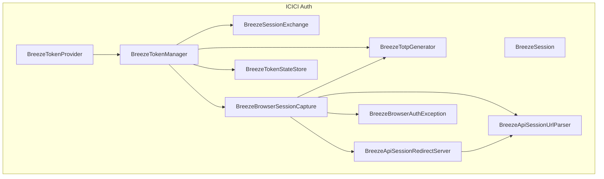
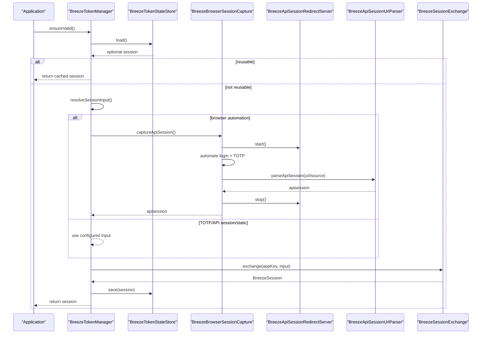
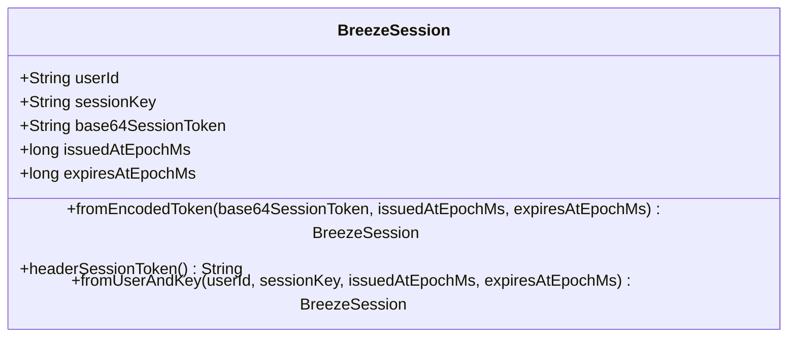
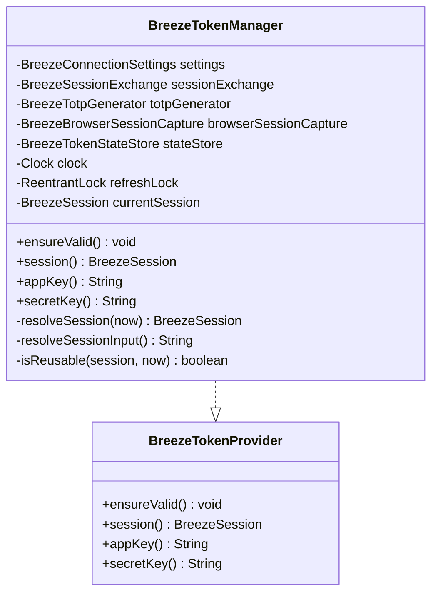
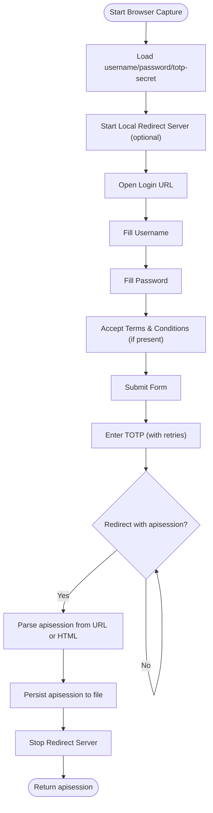
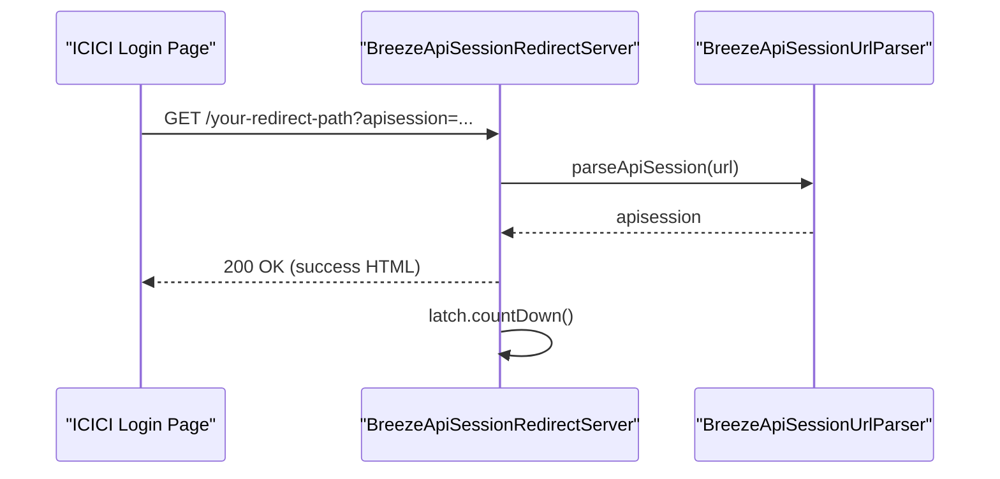
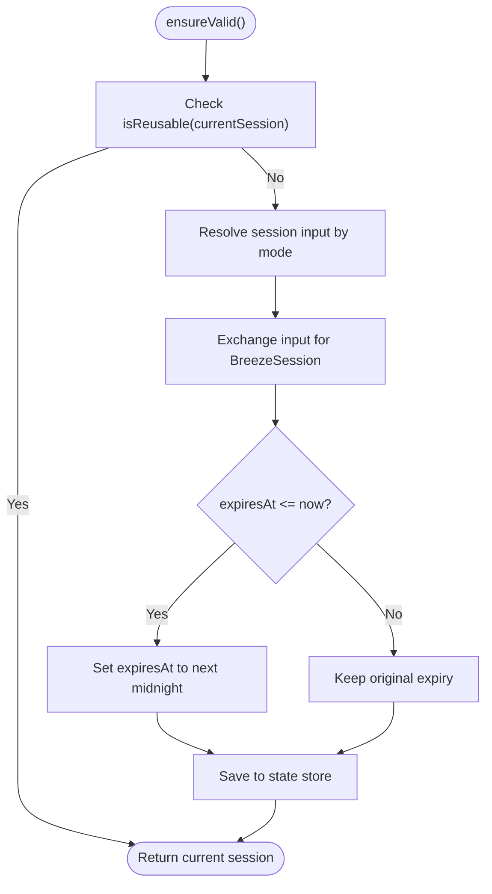
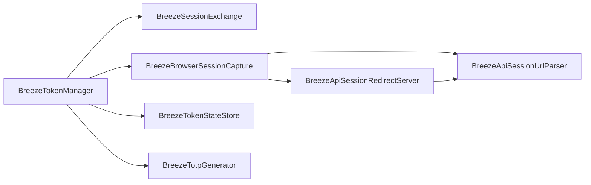

# Authentication and Session Management

<cite>
**Referenced Files in This Document**
- [BreezeSession.java](file://broker/icici/src/main/java/com/tradej/broker/icici/auth/BreezeSession.java)
- [BreezeTokenProvider.java](file://broker/icici/src/main/java/com/tradej/broker/icici/auth/BreezeTokenProvider.java)
- [BreezeTokenManager.java](file://broker/icici/src/main/java/com/tradej/broker/icici/auth/BreezeTokenManager.java)
- [BreezeBrowserSessionCapture.java](file://broker/icici/src/main/java/com/tradej/broker/icici/auth/BreezeBrowserSessionCapture.java)
- [BreezeApiSessionRedirectServer.java](file://broker/icici/src/main/java/com/tradej/broker/icici/auth/BreezeApiSessionRedirectServer.java)
- [BreezeApiSessionUrlParser.java](file://broker/icici/src/main/java/com/tradej/broker/icici/auth/BreezeApiSessionUrlParser.java)
- [BreezeTokenStateStore.java](file://broker/icici/src/main/java/com/tradej/broker/icici/auth/BreezeTokenStateStore.java)
- [BreezeTotpGenerator.java](file://broker/icici/src/main/java/com/tradej/broker/icici/auth/BreezeTotpGenerator.java)
- [BreezeSessionExchange.java](file://broker/icici/src/main/java/com/tradej/broker/icici/auth/BreezeSessionExchange.java)
- [BreezeBrowserAuthException.java](file://broker/icici/src/main/java/com/tradej/broker/icici/auth/BreezeBrowserAuthException.java)
</cite>

## Table of Contents
1. [Introduction](#introduction)
2. [Project Structure](#project-structure)
3. [Core Components](#core-components)
4. [Architecture Overview](#architecture-overview)
5. [Detailed Component Analysis](#detailed-component-analysis)
6. [Dependency Analysis](#dependency-analysis)
7. [Performance Considerations](#performance-considerations)
8. [Troubleshooting Guide](#troubleshooting-guide)
9. [Conclusion](#conclusion)
10. [Appendices](#appendices)

## Introduction
This document explains the ICICI Direct authentication system built around the Breeze API. It covers the browser-based OAuth-like flow, session establishment, token acquisition, automatic refresh, and secure handling of sensitive credentials. It documents the redirect server used to capture OAuth callbacks, the BreezeSession abstraction, and the token lifecycle management including expiry detection and renewal. Practical examples and security considerations are included to help operators set up and troubleshoot authentication reliably.

## Project Structure
The ICICI authentication subsystem resides under the ICICI broker module’s auth package. The key components are:
- BreezeSession: immutable session data holder and header encoder
- BreezeTokenProvider: interface for token providers
- BreezeTokenManager: orchestrates session resolution, refresh, and persistence
- BreezeBrowserSessionCapture: automates login and captures apisession
- BreezeApiSessionRedirectServer: local HTTP server to receive OAuth callbacks
- BreezeApiSessionUrlParser: extracts apisession from URLs or HTML
- BreezeTokenStateStore: persists and loads sessions to/from disk
- BreezeTotpGenerator: generates TOTP codes for TOTP-based flows
- BreezeSessionExchange: exchanges session input for a BreezeSession
- BreezeBrowserAuthException: specialized exception type for browser auth failures

**Diagram sources**
- [BreezeTokenManager.java:12-156](file://broker/icici/src/main/java/com/tradej/broker/icici/auth/BreezeTokenManager.java#L12-L156)
- [BreezeBrowserSessionCapture.java:35-491](file://broker/icici/src/main/java/com/tradej/broker/icici/auth/BreezeBrowserSessionCapture.java#L35-L491)
- [BreezeApiSessionRedirectServer.java:18-97](file://broker/icici/src/main/java/com/tradej/broker/icici/auth/BreezeApiSessionRedirectServer.java#L18-L97)
- [BreezeApiSessionUrlParser.java](file://broker/icici/src/main/java/com/tradej/broker/icici/auth/BreezeApiSessionUrlParser.java)
- [BreezeTokenStateStore.java](file://broker/icici/src/main/java/com/tradej/broker/icici/auth/BreezeTokenStateStore.java)
- [BreezeTotpGenerator.java](file://broker/icici/src/main/java/com/tradej/broker/icici/auth/BreezeTotpGenerator.java)
- [BreezeSessionExchange.java](file://broker/icici/src/main/java/com/tradej/broker/icici/auth/BreezeSessionExchange.java)
- [BreezeBrowserAuthException.java](file://broker/icici/src/main/java/com/tradej/broker/icici/auth/BreezeBrowserAuthException.java)

**Section sources**
- [BreezeTokenManager.java:12-156](file://broker/icici/src/main/java/com/tradej/broker/icici/auth/BreezeTokenManager.java#L12-L156)
- [BreezeBrowserSessionCapture.java:35-491](file://broker/icici/src/main/java/com/tradej/broker/icici/auth/BreezeBrowserSessionCapture.java#L35-L491)

## Core Components
- BreezeSession: Encapsulates ICICI session identity and lifetime, encodes the session token for HTTP headers, and decodes stored tokens.
- BreezeTokenProvider: Defines the contract for ensuring a valid session and exposing app/secret keys.
- BreezeTokenManager: Central coordinator that decides whether to reuse an existing session, load from persistent storage, or acquire a new session via browser automation or TOTP/API session input. It manages refresh timing and persistence.
- BreezeBrowserSessionCapture: Automates Chrome login, enters credentials and TOTP, waits for redirect, and captures the apisession either via a local redirect server or by scraping the browser URL.
- BreezeApiSessionRedirectServer: A lightweight HTTP server bound to localhost that receives the OAuth callback and extracts the apisession.
- BreezeApiSessionUrlParser: Parses apisession from the redirect URL or page content.
- BreezeTokenStateStore: Reads/writes persisted sessions to a file.
- BreezeTotpGenerator: Generates TOTP codes with clock drift tolerance.
- BreezeSessionExchange: Exchanges a session input (apisession/TOTP/API session) for a BreezeSession with issuance and expiry metadata.
- BreezeBrowserAuthException: Exception type for browser automation errors.

**Section sources**
- [BreezeSession.java:6-44](file://broker/icici/src/main/java/com/tradej/broker/icici/auth/BreezeSession.java#L6-L44)
- [BreezeTokenProvider.java:3-11](file://broker/icici/src/main/java/com/tradej/broker/icici/auth/BreezeTokenProvider.java#L3-L11)
- [BreezeTokenManager.java:12-156](file://broker/icici/src/main/java/com/tradej/broker/icici/auth/BreezeTokenManager.java#L12-L156)
- [BreezeBrowserSessionCapture.java:35-491](file://broker/icici/src/main/java/com/tradej/broker/icici/auth/BreezeBrowserSessionCapture.java#L35-L491)
- [BreezeApiSessionRedirectServer.java:18-97](file://broker/icici/src/main/java/com/tradej/broker/icici/auth/BreezeApiSessionRedirectServer.java#L18-L97)
- [BreezeApiSessionUrlParser.java](file://broker/icici/src/main/java/com/tradej/broker/icici/auth/BreezeApiSessionUrlParser.java)
- [BreezeTokenStateStore.java](file://broker/icici/src/main/java/com/tradej/broker/icici/auth/BreezeTokenStateStore.java)
- [BreezeTotpGenerator.java](file://broker/icici/src/main/java/com/tradej/broker/icici/auth/BreezeTotpGenerator.java)
- [BreezeSessionExchange.java](file://broker/icici/src/main/java/com/tradej/broker/icici/auth/BreezeSessionExchange.java)
- [BreezeBrowserAuthException.java](file://broker/icici/src/main/java/com/tradej/broker/icici/auth/BreezeBrowserAuthException.java)

## Architecture Overview
The ICICI authentication flow integrates browser automation, a local redirect server, and a token manager to maintain a valid session. The flow supports multiple auth modes: browser automation, TOTP generation, API session file, and static token. Sessions are persisted and reused until expiration, with automatic refresh triggered before the expiry threshold.

**Diagram sources**
- [BreezeTokenManager.java:52-131](file://broker/icici/src/main/java/com/tradej/broker/icici/auth/BreezeTokenManager.java#L52-L131)
- [BreezeBrowserSessionCapture.java:83-166](file://broker/icici/src/main/java/com/tradej/broker/icici/auth/BreezeBrowserSessionCapture.java#L83-L166)
- [BreezeApiSessionRedirectServer.java:39-88](file://broker/icici/src/main/java/com/tradej/broker/icici/auth/BreezeApiSessionRedirectServer.java#L39-L88)
- [BreezeApiSessionUrlParser.java](file://broker/icici/src/main/java/com/tradej/broker/icici/auth/BreezeApiSessionUrlParser.java)
- [BreezeSessionExchange.java](file://broker/icici/src/main/java/com/tradej/broker/icici/auth/BreezeSessionExchange.java)
- [BreezeTokenStateStore.java](file://broker/icici/src/main/java/com/tradej/broker/icici/auth/BreezeTokenStateStore.java)

## Detailed Component Analysis

### BreezeSession
BreezeSession is a compact record holding:
- userId
- sessionKey
- base64SessionToken
- issuedAtEpochMs
- expiresAtEpochMs

It provides:
- Decoding from a base64-encoded token string
- Encoding for the X-SessionToken header
- Construction from user ID and session key

**Diagram sources**
- [BreezeSession.java:6-44](file://broker/icici/src/main/java/com/tradej/broker/icici/auth/BreezeSession.java#L6-L44)

**Section sources**
- [BreezeSession.java:6-44](file://broker/icici/src/main/java/com/tradej/broker/icici/auth/BreezeSession.java#L6-L44)

### BreezeTokenProvider and BreezeTokenManager
BreezeTokenProvider defines the contract for session retrieval and credential exposure. BreezeTokenManager implements:
- Session reuse validation with a configurable refresh buffer
- Mode-driven session resolution (browser automation, TOTP, API session, static)
- Exchange of session input into a BreezeSession
- Persistence via BreezeTokenStateStore
- Thread-safe refresh using a lock

**Diagram sources**
- [BreezeTokenProvider.java:3-11](file://broker/icici/src/main/java/com/tradej/broker/icici/auth/BreezeTokenProvider.java#L3-L11)
- [BreezeTokenManager.java:12-156](file://broker/icici/src/main/java/com/tradej/broker/icici/auth/BreezeTokenManager.java#L12-L156)

**Section sources**
- [BreezeTokenProvider.java:3-11](file://broker/icici/src/main/java/com/tradej/broker/icici/auth/BreezeTokenProvider.java#L3-L11)
- [BreezeTokenManager.java:52-156](file://broker/icici/src/main/java/com/tradej/broker/icici/auth/BreezeTokenManager.java#L52-L156)

### BreezeBrowserSessionCapture
Automates the browser login process:
- Starts a local redirect server if available
- Opens the ICICI login URL and auto-submits the initial form
- Locates username/password fields and submits
- Accepts terms and conditions if present
- Enters TOTP with clock drift retries
- Captures apisession from the redirect URL via the redirect server or page source
- Persists the apisession to a file for reuse

**Diagram sources**
- [BreezeBrowserSessionCapture.java:83-166](file://broker/icici/src/main/java/com/tradej/broker/icici/auth/BreezeBrowserSessionCapture.java#L83-L166)
- [BreezeApiSessionRedirectServer.java:39-88](file://broker/icici/src/main/java/com/tradej/broker/icici/auth/BreezeApiSessionRedirectServer.java#L39-L88)
- [BreezeApiSessionUrlParser.java](file://broker/icici/src/main/java/com/tradej/broker/icici/auth/BreezeApiSessionUrlParser.java)

**Section sources**
- [BreezeBrowserSessionCapture.java:83-166](file://broker/icici/src/main/java/com/tradej/broker/icici/auth/BreezeBrowserSessionCapture.java#L83-L166)

### BreezeApiSessionRedirectServer
A minimal HTTP server listening on localhost that:
- Registers a single context path for the redirect
- Extracts apisession from the callback query string
- Returns a success page and signals completion
- Times out if no callback arrives within the configured window

**Diagram sources**
- [BreezeApiSessionRedirectServer.java:39-88](file://broker/icici/src/main/java/com/tradej/broker/icici/auth/BreezeApiSessionRedirectServer.java#L39-L88)
- [BreezeApiSessionUrlParser.java](file://broker/icici/src/main/java/com/tradej/broker/icici/auth/BreezeApiSessionUrlParser.java)

**Section sources**
- [BreezeApiSessionRedirectServer.java:18-97](file://broker/icici/src/main/java/com/tradej/broker/icici/auth/BreezeApiSessionRedirectServer.java#L18-L97)

### Token Lifecycle Management
The lifecycle includes:
- Expiry detection: sessions are considered reusable until within a refresh buffer of expiry
- Renewal: when not reusable, resolves session input based on configured mode, exchanges it, adjusts expiry to the next midnight boundary, saves to state store, and returns the session
- Error handling: timeouts, missing parameters, invalid formats, and browser automation failures are surfaced as BreezeBrowserAuthException

**Diagram sources**
- [BreezeTokenManager.java:52-117](file://broker/icici/src/main/java/com/tradej/broker/icici/auth/BreezeTokenManager.java#L52-L117)
- [BreezeSessionExchange.java](file://broker/icici/src/main/java/com/tradej/broker/icici/auth/BreezeSessionExchange.java)

**Section sources**
- [BreezeTokenManager.java:52-156](file://broker/icici/src/main/java/com/tradej/broker/icici/auth/BreezeTokenManager.java#L52-L156)

### BreezeSessionExchange and BreezeTotpGenerator
- BreezeSessionExchange: Converts a session input (apisession/TOTP/API session) into a BreezeSession with issuance and expiry timestamps.
- BreezeTotpGenerator: Produces TOTP codes with a small clock drift window to improve robustness against time skew.

**Section sources**
- [BreezeSessionExchange.java](file://broker/icici/src/main/java/com/tradej/broker/icici/auth/BreezeSessionExchange.java)
- [BreezeTotpGenerator.java](file://broker/icici/src/main/java/com/tradej/broker/icici/auth/BreezeTotpGenerator.java)

## Dependency Analysis
The following diagram shows the primary dependencies among the authentication components:

**Diagram sources**
- [BreezeTokenManager.java:12-49](file://broker/icici/src/main/java/com/tradej/broker/icici/auth/BreezeTokenManager.java#L12-L49)
- [BreezeBrowserSessionCapture.java:35-77](file://broker/icici/src/main/java/com/tradej/broker/icici/auth/BreezeBrowserSessionCapture.java#L35-L77)
- [BreezeApiSessionRedirectServer.java:18-37](file://broker/icici/src/main/java/com/tradej/broker/icici/auth/BreezeApiSessionRedirectServer.java#L18-L37)
- [BreezeApiSessionUrlParser.java](file://broker/icici/src/main/java/com/tradej/broker/icici/auth/BreezeApiSessionUrlParser.java)

**Section sources**
- [BreezeTokenManager.java:12-49](file://broker/icici/src/main/java/com/tradej/broker/icici/auth/BreezeTokenManager.java#L12-L49)
- [BreezeBrowserSessionCapture.java:35-77](file://broker/icici/src/main/java/com/tradej/broker/icici/auth/BreezeBrowserSessionCapture.java#L35-L77)

## Performance Considerations
- Headless vs. headed Chrome: Headless mode reduces overhead but may trigger anti-bot protections; enabling headed mode can improve reliability on problematic login skins.
- Refresh buffer: Configure a sufficient buffer to avoid frequent refreshes near expiry; this reduces redundant exchanges.
- Local redirect server: Starting the redirect server introduces minimal overhead; if unavailable, the system falls back to scraping the browser URL.
- Persistence: Persisting sessions avoids repeated browser automation and speeds up subsequent runs.

[No sources needed since this section provides general guidance]

## Troubleshooting Guide
Common issues and resolutions:
- Timed out waiting for redirect callback: Ensure the redirect URL matches the app’s registered redirect and that the local redirect server is reachable on the configured port/path.
- Missing apisession parameter: Verify the redirect URL contains the apisession query parameter and that the redirect server is started before login.
- Interrupted while waiting: Check for thread interruption or excessive delays in the browser automation flow.
- TOTP rejected after retries: Confirm the TOTP secret file is correct and synchronized with the authenticator app; the generator tolerates small clock drift.
- Login submit did not reach OTP page: Validate username/password, ensure the Terms & Conditions checkbox is accepted, and consider disabling headless mode if blocked.
- Could not locate login element: The selectors used are resilient but may fail on heavily customized login pages; verify network stability and page rendering.
- Failed to persist API session: Ensure write permissions to the configured session file path.

**Section sources**
- [BreezeApiSessionRedirectServer.java:43-61](file://broker/icici/src/main/java/com/tradej/broker/icici/auth/BreezeApiSessionRedirectServer.java#L43-L61)
- [BreezeBrowserSessionCapture.java:358-365](file://broker/icici/src/main/java/com/tradej/broker/icici/auth/BreezeBrowserSessionCapture.java#L358-L365)
- [BreezeBrowserSessionCapture.java:249-251](file://broker/icici/src/main/java/com/tradej/broker/icici/auth/BreezeBrowserSessionCapture.java#L249-L251)
- [BreezeBrowserSessionCapture.java:432-439](file://broker/icici/src/main/java/com/tradej/broker/icici/auth/BreezeBrowserSessionCapture.java#L432-L439)
- [BreezeBrowserSessionCapture.java:402-404](file://broker/icici/src/main/java/com/tradej/broker/icici/auth/BreezeBrowserSessionCapture.java#L402-L404)
- [BreezeBrowserSessionCapture.java:471-474](file://broker/icici/src/main/java/com/tradej/broker/icici/auth/BreezeBrowserSessionCapture.java#L471-L474)

## Conclusion
The ICICI Direct authentication system combines a robust browser automation flow with a local redirect server and a resilient token manager. Sessions are modeled as BreezeSession records, persisted securely, and refreshed automatically before expiry. The design supports multiple auth modes and provides clear error signaling to aid troubleshooting. Operators should focus on correct redirect configuration, reliable credentials, and appropriate refresh buffers to maintain uninterrupted connectivity.

[No sources needed since this section summarizes without analyzing specific files]

## Appendices

### Practical Setup Examples
- Browser automation mode:
  - Prepare username, password, and TOTP secret files.
  - Configure the redirect port and path to match the registered redirect URL.
  - Run the token manager; it will start the redirect server, automate login, capture apisession, and persist it.
- TOTP-generated mode:
  - Provide a TOTP secret file.
  - The manager will generate a TOTP code and exchange it for a session.
- API session mode:
  - Provide an API session file containing the apisession value.
  - The manager will read and use it directly.
- Static token mode:
  - Provide a static session token in the connection settings.
  - The manager constructs a session with a midnight expiry boundary.

[No sources needed since this section provides general guidance]

### Security Considerations
- Protect secret files: Ensure filesystem permissions restrict access to username, password, TOTP secret, and API session files.
- Minimize exposure: Prefer headless mode for production environments; disable unnecessary Chrome options that reveal automation.
- Network isolation: Bind the redirect server to localhost to prevent external access.
- Logging: Avoid logging sensitive tokens; sanitize logs during troubleshooting.
- Refresh buffer: Use a conservative buffer to reduce the risk of operating with expired sessions.

[No sources needed since this section provides general guidance]