# ICICI Direct Integration

<cite>
**Referenced Files in This Document**
- [IciciBrokerConnection.java](file://broker/icici/src/main/java/com/tradej/broker/icici/IciciBrokerConnection.java)
- [BreezeSession.java](file://broker/icici/src/main/java/com/tradej/broker/icici/auth/BreezeSession.java)
- [BreezeTokenManager.java](file://broker/icici/src/main/java/com/tradej/broker/icici/auth/BreezeTokenManager.java)
- [BreezeTokenProvider.java](file://broker/icici/src/main/java/com/tradej/broker/icici/auth/BreezeTokenProvider.java)
- [BreezeTokenStateStore.java](file://broker/icici/src/main/java/com/tradej/broker/icici/auth/BreezeTokenStateStore.java)
- [BreezeApiSessionRedirectServer.java](file://broker/icici/src/main/java/com/tradej/broker/icici/auth/BreezeApiSessionRedirectServer.java)
- [BreezeApiSessionUrlParser.java](file://broker/icici/src/main/java/com/tradej/broker/icici/auth/BreezeApiSessionUrlParser.java)
- [BreezeBrowserSessionCapture.java](file://broker/icici/src/main/java/com/tradej/broker/icici/auth/BreezeBrowserSessionCapture.java)
- [BreezeAuthenticatedHttpClient.java](file://broker/icici/src/main/java/com/tradej/broker/icici/http/BreezeAuthenticatedHttpClient.java)
- [BreezeRequestSigner.java](file://broker/icici/src/main/java/com/tradej/broker/icici/http/BreezeRequestSigner.java)
- [BreezeHistoricalRestClient.java](file://broker/icici/src/main/java/com/tradej/broker/icici/rest/BreezeHistoricalRestClient.java)
- [BreezeMarketDataRestClient.java](file://broker/icici/src/main/java/com/tradej/broker/icici/rest/BreezeMarketDataRestClient.java)
- [BreezeOptionChainRestClient.java](file://broker/icici/src/main/java/com/tradej/broker/icici/rest/BreezeOptionChainRestClient.java)
- [BreezeOrderRestClient.java](file://broker/icici/src/main/java/com/tradej/broker/icici/rest/BreezeOrderRestClient.java)
- [BreezePortfolioRestClient.java](file://broker/icici/src/main/java/com/tradej/broker/icici/rest/BreezePortfolioRestClient.java)
- [BreezeHistoricalDataService.java](file://broker/icici/src/main/java/com/tradej/broker/icici/historical/BreezeHistoricalDataService.java)
- [BreezeInstrumentLoader.java](file://broker/icici/src/main/java/com/tradej/broker/icici/instrument/BreezeInstrumentLoader.java)
- [BreezeInstrumentResolver.java](file://broker/icici/src/main/java/com/tradej/broker/icici/instrument/BreezeInstrumentResolver.java)
- [IciciExchangeSegmentMapper.java](file://broker/icici/src/main/java/com/tradej/broker/icici/mapper/IciciExchangeSegmentMapper.java)
- [BreezeDomainMapper.java](file://broker/icici/src/main/java/com/tradej/broker/icici/mapper/BreezeDomainMapper.java)
- [BreezeWebSocketMultiplexer.java](file://broker/icici/src/main/java/com/tradej/broker/icici/websocket/BreezeWebSocketMultiplexer.java)
- [BreezeApiEndpoints.java](file://broker/icici/src/main/java/com/tradej/broker/icici/constants/BreezeApiEndpoints.java)
- [BreezeConnectionSettings.java](file://broker/icici/src/main/java/com/tradej/broker/icici/config/BreezeConnectionSettings.java)
- [IciciAuthMode.java](file://broker/icici/src/main/java/com/tradej/broker/icici/config/IciciAuthMode.java)
- [IciciMarketDataProvider.java](file://broker/icici/src/main/java/com/tradej/broker/icici/adapter/IciciMarketDataProvider.java)
- [IciciPortfolioProvider.java](file://broker/icici/src/main/java/com/tradej/broker/icici/adapter/IciciPortfolioProvider.java)
- [IciciOrderCommandAdapter.java](file://broker/icici/src/main/java/com/tradej/broker/icici/adapter/IciciOrderCommandAdapter.java)
- [IciciOrderQueryAdapter.java](file://broker/icici/src/main/java/com/tradej/broker/icici/adapter/IciciOrderQueryAdapter.java)
- [IciciMarginProvider.java](file://broker/icici/src/main/java/com/tradej/broker/icici/adapter/IciciMarginProvider.java)
- [IciciFuturesProvider.java](file://broker/icici/src/main/java/com/tradej/broker/icici/adapter/IciciFuturesProvider.java)
- [IciciOptionsProvider.java](file://broker/icici/src/main/java/com/tradej/broker/icici/adapter/IciciOptionsProvider.java)
- [icici-local.properties.example](file://config/icici-local.properties.example)
- [IciciAuthenticatedRequestIntegrationTest.java](file://app/src/test/java/com/tradej/app/integration/IciciAuthenticatedRequestIntegrationTest.java)
- [IciciMarketDataIntegrationTest.java](file://app/src/test/java/com/tradej/app/integration/IciciMarketDataIntegrationTest.java)
- [IciciMarketFeedIntegrationTest.java](file://app/src/test/java/com/tradej/app/integration/IciciMarketFeedIntegrationTest.java)
- [IciciOrderLifecycleIntegrationTest.java](file://app/src/test/java/com/tradej/app/integration/IciciOrderLifecycleIntegrationTest.java)
- [IciciPortfolioIntegrationTest.java](file://app/src/test/java/com/tradej/app/integration/IciciPortfolioIntegrationTest.java)
- [IciciRefreshSessionIntegrationTest.java](file://app/src/test/java/com/tradej/app/integration/IciciRefreshSessionIntegrationTest.java)
- [IciciTokenLifecycleIntegrationTest.java](file://app/src/test/java/com/tradej/app/integration/IciciTokenLifecycleIntegrationTest.java)
- [IciciHistoricalDataIntegrationTest.java](file://app/src/test/java/com/tradej/app/integration/IciciHistoricalDataIntegrationTest.java)
- [LiveIciciTestSupport.java](file://app/src/test/java/com/tradej/app/integration/LiveIciciTestSupport.java)
- [ICICI_BREEZE_REMEDIATION_PLAN.md](file://plans/ICICI_BREEZE_REMEDIATION_PLAN.md)
</cite>

## Table of Contents
1. [Introduction](#introduction)
2. [Project Structure](#project-structure)
3. [Core Components](#core-components)
4. [Architecture Overview](#architecture-overview)
5. [Detailed Component Analysis](#detailed-component-analysis)
6. [Dependency Analysis](#dependency-analysis)
7. [Performance Considerations](#performance-considerations)
8. [Troubleshooting Guide](#troubleshooting-guide)
9. [Conclusion](#conclusion)
10. [Appendices](#appendices)

## Introduction
This document provides comprehensive documentation for the ICICI Direct broker integration built on the Breeze API. It explains the authentication system (browser-based authentication, session management, and token lifecycle), market data streaming capabilities and limitations, order management functionality and supported order types, portfolio management and margin handling, instrument resolution and exchange segment mapping, configuration requirements, connection setup, error handling patterns, and current limitations compared to other brokers such as Dhan and Upstox. Practical ICICI-specific workflows and integration patterns are included to guide developers integrating with the Breeze API via this codebase.

## Project Structure
The ICICI integration resides under the broker/icici module and follows a layered architecture:
- Authentication: Browser-based OAuth capture, session parsing, token management, and provider/state store
- HTTP Layer: Signed requests, authenticated HTTP client, and request signing
- REST Clients: Historical data, market data, option chain, order, and portfolio REST clients
- Instrument Resolution: Loader, resolver, and exchange segment mapping
- Adapters: Market data, portfolio, orders, margins, futures, and options providers
- Streaming: WebSocket multiplexer for real-time data
- Configuration: Connection settings and authentication mode

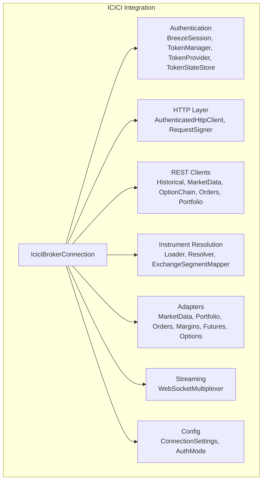

**Diagram sources**
- [IciciBrokerConnection.java](file://broker/icici/src/main/java/com/tradej/broker/icici/IciciBrokerConnection.java)
- [BreezeSession.java](file://broker/icici/src/main/java/com/tradej/broker/icici/auth/BreezeSession.java)
- [BreezeTokenManager.java](file://broker/icici/src/main/java/com/tradej/broker/icici/auth/BreezeTokenManager.java)
- [BreezeAuthenticatedHttpClient.java](file://broker/icici/src/main/java/com/tradej/broker/icici/http/BreezeAuthenticatedHttpClient.java)
- [BreezeHistoricalRestClient.java](file://broker/icici/src/main/java/com/tradej/broker/icici/rest/BreezeHistoricalRestClient.java)
- [BreezeInstrumentLoader.java](file://broker/icici/src/main/java/com/tradej/broker/icici/instrument/BreezeInstrumentLoader.java)
- [IciciExchangeSegmentMapper.java](file://broker/icici/src/main/java/com/tradej/broker/icici/mapper/IciciExchangeSegmentMapper.java)
- [IciciMarketDataProvider.java](file://broker/icici/src/main/java/com/tradej/broker/icici/adapter/IciciMarketDataProvider.java)
- [BreezeWebSocketMultiplexer.java](file://broker/icici/src/main/java/com/tradej/broker/icici/websocket/BreezeWebSocketMultiplexer.java)
- [BreezeConnectionSettings.java](file://broker/icici/src/main/java/com/tradej/broker/icici/config/BreezeConnectionSettings.java)

**Section sources**
- [IciciBrokerConnection.java](file://broker/icici/src/main/java/com/tradej/broker/icici/IciciBrokerConnection.java)

## Core Components
- Authentication subsystem: Handles browser-based OAuth callback capture, session parsing, token acquisition, rotation, and persistence
- HTTP layer: Provides signed request generation and authenticated HTTP client for API calls
- REST clients: Encapsulate Breeze API endpoints for historical data, market data, option chain, orders, and portfolio
- Instrument resolution: Loads instruments, resolves symbols to Breeze identifiers, and maps exchange segments
- Adapters: Translate Breeze API responses into domain models for market data, portfolio, orders, margins, futures, and options
- Streaming: WebSocket multiplexer for real-time market data streams
- Configuration: Connection settings and authentication mode selection

**Section sources**
- [BreezeSession.java](file://broker/icici/src/main/java/com/tradej/broker/icici/auth/BreezeSession.java)
- [BreezeTokenManager.java](file://broker/icici/src/main/java/com/tradej/broker/icici/auth/BreezeTokenManager.java)
- [BreezeAuthenticatedHttpClient.java](file://broker/icici/src/main/java/com/tradej/broker/icici/http/BreezeAuthenticatedHttpClient.java)
- [BreezeHistoricalRestClient.java](file://broker/icici/src/main/java/com/tradej/broker/icici/rest/BreezeHistoricalRestClient.java)
- [BreezeInstrumentLoader.java](file://broker/icici/src/main/java/com/tradej/broker/icici/instrument/BreezeInstrumentLoader.java)
- [IciciExchangeSegmentMapper.java](file://broker/icici/src/main/java/com/tradej/broker/icici/mapper/IciciExchangeSegmentMapper.java)
- [IciciMarketDataProvider.java](file://broker/icici/src/main/java/com/tradej/broker/icici/adapter/IciciMarketDataProvider.java)
- [BreezeWebSocketMultiplexer.java](file://broker/icici/src/main/java/com/tradej/broker/icici/websocket/BreezeWebSocketMultiplexer.java)
- [BreezeConnectionSettings.java](file://broker/icici/src/main/java/com/tradej/broker/icici/config/BreezeConnectionSettings.java)

## Architecture Overview
The ICICI integration centers around the broker connection orchestrating authentication, HTTP communication, REST clients, instrument resolution, adapters, and streaming. The authentication subsystem captures browser sessions, manages tokens, and persists state. The HTTP layer signs requests and executes authenticated calls. REST clients encapsulate Breeze endpoints. Instrument resolution ensures correct symbol mapping and exchange segment handling. Adapters convert raw API responses into domain models. Streaming provides real-time market data via WebSocket.

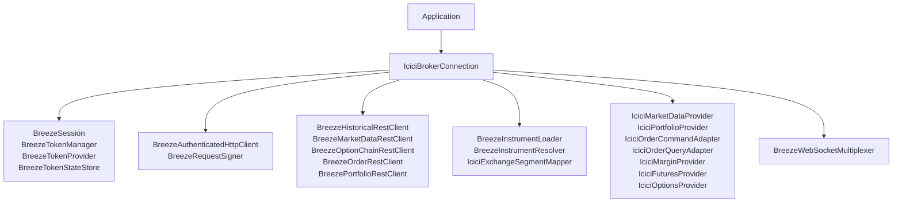

**Diagram sources**
- [IciciBrokerConnection.java](file://broker/icici/src/main/java/com/tradej/broker/icici/IciciBrokerConnection.java)
- [BreezeSession.java](file://broker/icici/src/main/java/com/tradej/broker/icici/auth/BreezeSession.java)
- [BreezeTokenManager.java](file://broker/icici/src/main/java/com/tradej/broker/icici/auth/BreezeTokenManager.java)
- [BreezeTokenProvider.java](file://broker/icici/src/main/java/com/tradej/broker/icici/auth/BreezeTokenProvider.java)
- [BreezeTokenStateStore.java](file://broker/icici/src/main/java/com/tradej/broker/icici/auth/BreezeTokenStateStore.java)
- [BreezeAuthenticatedHttpClient.java](file://broker/icici/src/main/java/com/tradej/broker/icici/http/BreezeAuthenticatedHttpClient.java)
- [BreezeRequestSigner.java](file://broker/icici/src/main/java/com/tradej/broker/icici/http/BreezeRequestSigner.java)
- [BreezeHistoricalRestClient.java](file://broker/icici/src/main/java/com/tradej/broker/icici/rest/BreezeHistoricalRestClient.java)
- [BreezeMarketDataRestClient.java](file://broker/icici/src/main/java/com/tradej/broker/icici/rest/BreezeMarketDataRestClient.java)
- [BreezeOptionChainRestClient.java](file://broker/icici/src/main/java/com/tradej/broker/icici/rest/BreezeOptionChainRestClient.java)
- [BreezeOrderRestClient.java](file://broker/icici/src/main/java/com/tradej/broker/icici/rest/BreezeOrderRestClient.java)
- [BreezePortfolioRestClient.java](file://broker/icici/src/main/java/com/tradej/broker/icici/rest/BreezePortfolioRestClient.java)
- [BreezeInstrumentLoader.java](file://broker/icici/src/main/java/com/tradej/broker/icici/instrument/BreezeInstrumentLoader.java)
- [BreezeInstrumentResolver.java](file://broker/icici/src/main/java/com/tradej/broker/icici/instrument/BreezeInstrumentResolver.java)
- [IciciExchangeSegmentMapper.java](file://broker/icici/src/main/java/com/tradej/broker/icici/mapper/IciciExchangeSegmentMapper.java)
- [IciciMarketDataProvider.java](file://broker/icici/src/main/java/com/tradej/broker/icici/adapter/IciciMarketDataProvider.java)
- [IciciPortfolioProvider.java](file://broker/icici/src/main/java/com/tradej/broker/icici/adapter/IciciPortfolioProvider.java)
- [IciciOrderCommandAdapter.java](file://broker/icici/src/main/java/com/tradej/broker/icici/adapter/IciciOrderCommandAdapter.java)
- [IciciOrderQueryAdapter.java](file://broker/icici/src/main/java/com/tradej/broker/icici/adapter/IciciOrderQueryAdapter.java)
- [IciciMarginProvider.java](file://broker/icici/src/main/java/com/tradej/broker/icici/adapter/IciciMarginProvider.java)
- [IciciFuturesProvider.java](file://broker/icici/src/main/java/com/tradej/broker/icici/adapter/IciciFuturesProvider.java)
- [IciciOptionsProvider.java](file://broker/icici/src/main/java/com/tradej/broker/icici/adapter/IciciOptionsProvider.java)
- [BreezeWebSocketMultiplexer.java](file://broker/icici/src/main/java/com/tradej/broker/icici/websocket/BreezeWebSocketMultiplexer.java)

## Detailed Component Analysis

### Authentication System: Browser-Based OAuth, Session Management, and Token Lifecycle
The authentication subsystem handles browser-based OAuth, session capture, token lifecycle, and persistence:
- Browser session capture: Redirect server listens for OAuth callbacks and parses session parameters
- Session parsing: Extracts session tokens and state from the callback URL
- Token management: Acquires, rotates, and validates tokens; persists state for reuse
- Provider and state store: Supplies tokens to HTTP client and maintains token state

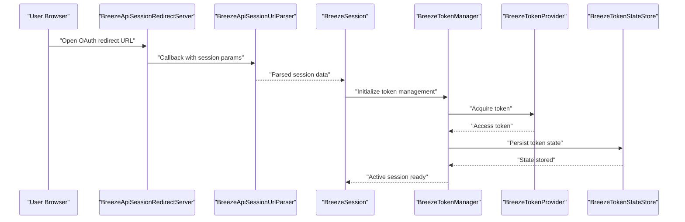

**Diagram sources**
- [BreezeApiSessionRedirectServer.java](file://broker/icici/src/main/java/com/tradej/broker/icici/auth/BreezeApiSessionRedirectServer.java)
- [BreezeApiSessionUrlParser.java](file://broker/icici/src/main/java/com/tradej/broker/icici/auth/BreezeApiSessionUrlParser.java)
- [BreezeSession.java](file://broker/icici/src/main/java/com/tradej/broker/icici/auth/BreezeSession.java)
- [BreezeTokenManager.java](file://broker/icici/src/main/java/com/tradej/broker/icici/auth/BreezeTokenManager.java)
- [BreezeTokenProvider.java](file://broker/icici/src/main/java/com/tradej/broker/icici/auth/BreezeTokenProvider.java)
- [BreezeTokenStateStore.java](file://broker/icici/src/main/java/com/tradej/broker/icici/auth/BreezeTokenStateStore.java)

Key implementation patterns:
- OAuth callback handling and URL parameter extraction
- Token acquisition and rotation strategies
- Secure token state persistence and retrieval
- Exception handling for browser authentication failures

**Section sources**
- [BreezeApiSessionRedirectServer.java](file://broker/icici/src/main/java/com/tradej/broker/icici/auth/BreezeApiSessionRedirectServer.java)
- [BreezeApiSessionUrlParser.java](file://broker/icici/src/main/java/com/tradej/broker/icici/auth/BreezeApiSessionUrlParser.java)
- [BreezeBrowserSessionCapture.java](file://broker/icici/src/main/java/com/tradej/broker/icici/auth/BreezeBrowserSessionCapture.java)
- [BreezeSession.java](file://broker/icici/src/main/java/com/tradej/broker/icici/auth/BreezeSession.java)
- [BreezeTokenManager.java](file://broker/icici/src/main/java/com/tradej/broker/icici/auth/BreezeTokenManager.java)
- [BreezeTokenProvider.java](file://broker/icici/src/main/java/com/tradej/broker/icici/auth/BreezeTokenProvider.java)
- [BreezeTokenStateStore.java](file://broker/icici/src/main/java/com/tradej/broker/icici/auth/BreezeTokenStateStore.java)

### HTTP Layer: Signed Requests and Authenticated Client
The HTTP layer signs requests and executes authenticated calls to Breeze API endpoints:
- Request signing: Generates signatures for API requests using shared secrets
- Authenticated HTTP client: Executes requests with proper headers and credentials
- Exception handling: Wraps HTTP errors into domain-specific exceptions

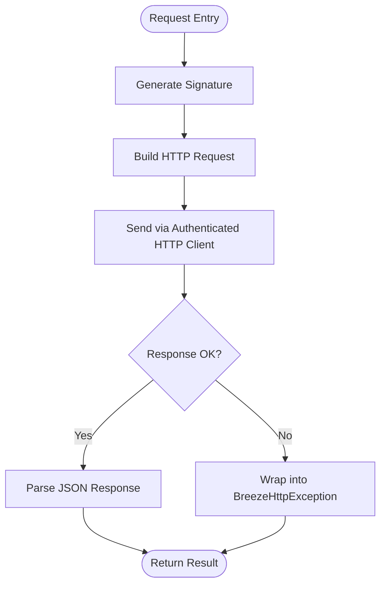

**Diagram sources**
- [BreezeRequestSigner.java](file://broker/icici/src/main/java/com/tradej/broker/icici/http/BreezeRequestSigner.java)
- [BreezeAuthenticatedHttpClient.java](file://broker/icici/src/main/java/com/tradej/broker/icici/http/BreezeAuthenticatedHttpClient.java)
- [BreezeHttpException.java](file://broker/icici/src/main/java/com/tradej/broker/icici/http/BreezeHttpException.java)

**Section sources**
- [BreezeRequestSigner.java](file://broker/icici/src/main/java/com/tradej/broker/icici/http/BreezeRequestSigner.java)
- [BreezeAuthenticatedHttpClient.java](file://broker/icici/src/main/java/com/tradej/broker/icici/http/BreezeAuthenticatedHttpClient.java)
- [BreezeHttpException.java](file://broker/icici/src/main/java/com/tradej/broker/icici/http/BreezeHttpException.java)

### REST Clients: Historical Data, Market Data, Option Chain, Orders, and Portfolio
REST clients encapsulate Breeze API endpoints:
- Historical data: Fetches OHLCV bars with pagination and windowing controls
- Market data: Retrieves quotes and streaming feeds
- Option chain: Resolves option instruments and strikes
- Orders: Places, modifies, cancels, and queries orders
- Portfolio: Retrieves holdings, positions, and margins

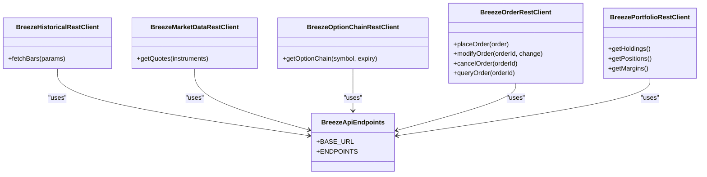

**Diagram sources**
- [BreezeHistoricalRestClient.java](file://broker/icici/src/main/java/com/tradej/broker/icici/rest/BreezeHistoricalRestClient.java)
- [BreezeMarketDataRestClient.java](file://broker/icici/src/main/java/com/tradej/broker/icici/rest/BreezeMarketDataRestClient.java)
- [BreezeOptionChainRestClient.java](file://broker/icici/src/main/java/com/tradej/broker/icici/rest/BreezeOptionChainRestClient.java)
- [BreezeOrderRestClient.java](file://broker/icici/src/main/java/com/tradej/broker/icici/rest/BreezeOrderRestClient.java)
- [BreezePortfolioRestClient.java](file://broker/icici/src/main/java/com/tradej/broker/icici/rest/BreezePortfolioRestClient.java)
- [BreezeApiEndpoints.java](file://broker/icici/src/main/java/com/tradej/broker/icici/constants/BreezeApiEndpoints.java)

**Section sources**
- [BreezeHistoricalRestClient.java](file://broker/icici/src/main/java/com/tradej/broker/icici/rest/BreezeHistoricalRestClient.java)
- [BreezeMarketDataRestClient.java](file://broker/icici/src/main/java/com/tradej/broker/icici/rest/BreezeMarketDataRestClient.java)
- [BreezeOptionChainRestClient.java](file://broker/icici/src/main/java/com/tradej/broker/icici/rest/BreezeOptionChainRestClient.java)
- [BreezeOrderRestClient.java](file://broker/icici/src/main/java/com/tradej/broker/icici/rest/BreezeOrderRestClient.java)
- [BreezePortfolioRestClient.java](file://broker/icici/src/main/java/com/tradej/broker/icici/rest/BreezePortfolioRestClient.java)
- [BreezeApiEndpoints.java](file://broker/icici/src/main/java/com/tradej/broker/icici/constants/BreezeApiEndpoints.java)

### Market Data Streaming and Limitations
The integration includes a WebSocket multiplexer for streaming market data. However, streaming capabilities and depth may differ from other brokers. Tests indicate live market feed integration exists but requires careful configuration and monitoring.

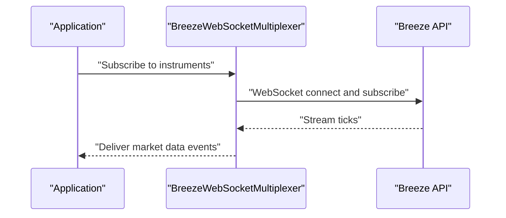

**Diagram sources**
- [BreezeWebSocketMultiplexer.java](file://broker/icici/src/main/java/com/tradej/broker/icici/websocket/BreezeWebSocketMultiplexer.java)

Limitations observed:
- Streaming depth and frequency may be constrained compared to other brokers
- Real-time tick delivery depends on network stability and API rate limits
- Some exchanges or instrument types may not be fully supported in streaming mode

**Section sources**
- [BreezeWebSocketMultiplexer.java](file://broker/icici/src/main/java/com/tradej/broker/icici/websocket/BreezeWebSocketMultiplexer.java)
- [IciciMarketFeedIntegrationTest.java](file://app/src/test/java/com/tradej/app/integration/IciciMarketFeedIntegrationTest.java)

### Order Management: Functionality and Supported Types
Order management integrates via REST clients and adapters:
- Place orders: Equity, currency, and derivative orders
- Modify orders: Change quantity/price within allowed limits
- Cancel orders: Single or bulk cancellation
- Query orders: Track status and fills
- Supported order types: Market, Limit, Stop Loss, and bracket orders where supported by Breeze

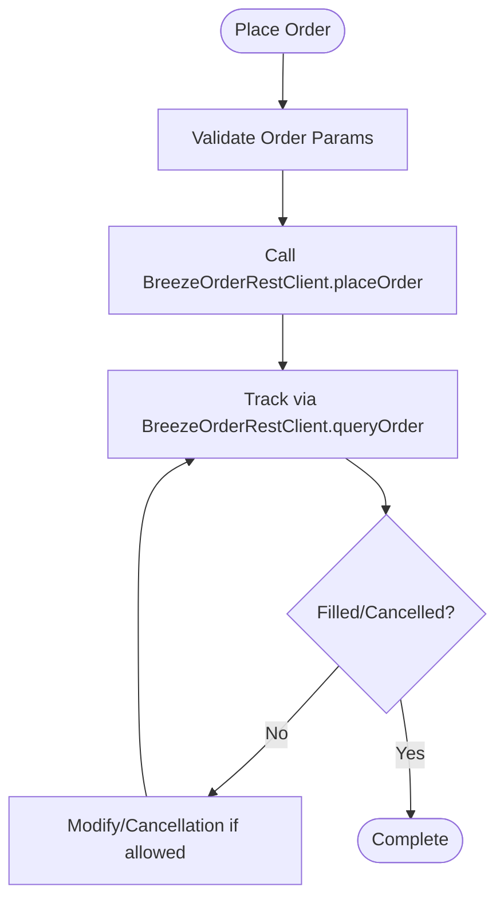

**Diagram sources**
- [IciciOrderCommandAdapter.java](file://broker/icici/src/main/java/com/tradej/broker/icici/adapter/IciciOrderCommandAdapter.java)
- [IciciOrderQueryAdapter.java](file://broker/icici/src/main/java/com/tradej/broker/icici/adapter/IciciOrderQueryAdapter.java)
- [BreezeOrderRestClient.java](file://broker/icici/src/main/java/com/tradej/broker/icici/rest/BreezeOrderRestClient.java)

**Section sources**
- [IciciOrderCommandAdapter.java](file://broker/icici/src/main/java/com/tradej/broker/icici/adapter/IciciOrderCommandAdapter.java)
- [IciciOrderQueryAdapter.java](file://broker/icici/src/main/java/com/tradej/broker/icici/adapter/IciciOrderQueryAdapter.java)
- [BreezeOrderRestClient.java](file://broker/icici/src/main/java/com/tradej/broker/icici/rest/BreezeOrderRestClient.java)
- [IciciOrderLifecycleIntegrationTest.java](file://app/src/test/java/com/tradej/app/integration/IciciOrderLifecycleIntegrationTest.java)

### Portfolio Management and Margin Handling
Portfolio and margin handling are exposed via REST clients and adapters:
- Holdings: Retrieve equity and derivative holdings
- Positions: Net/future-style positions per instrument
- Margins: Span and exposure margins as provided by Breeze

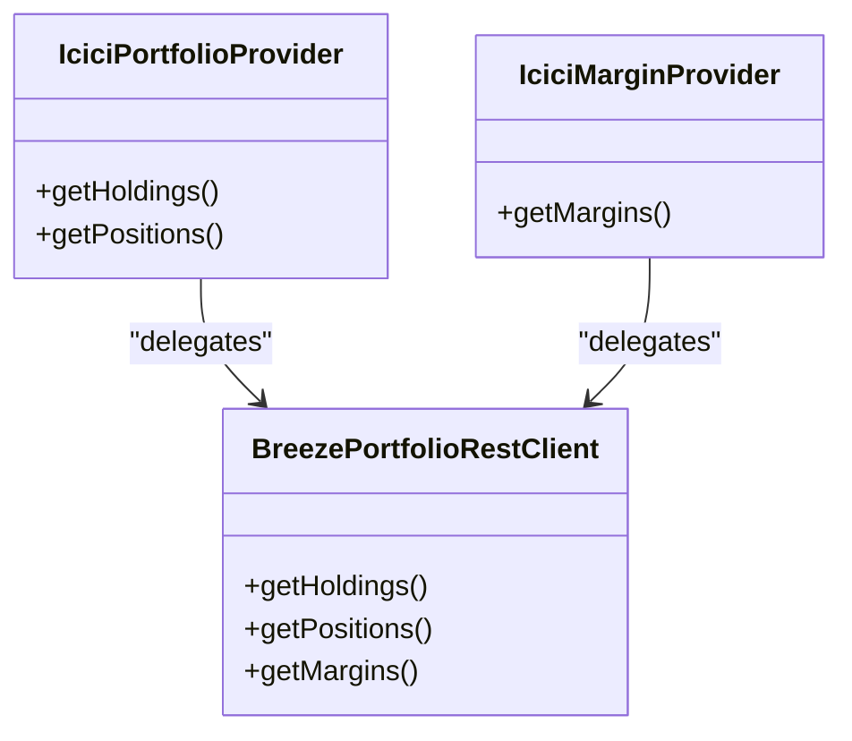

**Diagram sources**
- [IciciPortfolioProvider.java](file://broker/icici/src/main/java/com/tradej/broker/icici/adapter/IciciPortfolioProvider.java)
- [IciciMarginProvider.java](file://broker/icici/src/main/java/com/tradej/broker/icici/adapter/IciciMarginProvider.java)
- [BreezePortfolioRestClient.java](file://broker/icici/src/main/java/com/tradej/broker/icici/rest/BreezePortfolioRestClient.java)

**Section sources**
- [IciciPortfolioProvider.java](file://broker/icici/src/main/java/com/tradej/broker/icici/adapter/IciciPortfolioProvider.java)
- [IciciMarginProvider.java](file://broker/icici/src/main/java/com/tradej/broker/icici/adapter/IciciMarginProvider.java)
- [BreezePortfolioRestClient.java](file://broker/icici/src/main/java/com/tradej/broker/icici/rest/BreezePortfolioRestClient.java)
- [IciciPortfolioIntegrationTest.java](file://app/src/test/java/com/tradej/app/integration/IciciPortfolioIntegrationTest.java)

### Instrument Resolution and Exchange Segment Mapping
Instrument resolution ensures correct symbol-to-ID mapping and exchange segment handling:
- Loader: Loads instrument metadata from Breeze
- Resolver: Resolves user-friendly symbols to Breeze identifiers
- Exchange segment mapper: Maps exchange codes to Breeze segments

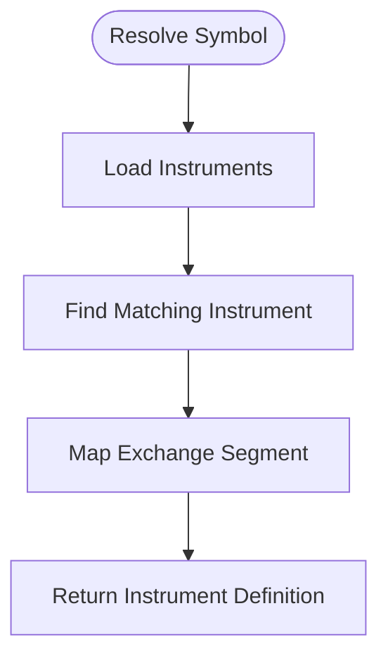

**Diagram sources**
- [BreezeInstrumentLoader.java](file://broker/icici/src/main/java/com/tradej/broker/icici/instrument/BreezeInstrumentLoader.java)
- [BreezeInstrumentResolver.java](file://broker/icici/src/main/java/com/tradej/broker/icici/instrument/BreezeInstrumentResolver.java)
- [IciciExchangeSegmentMapper.java](file://broker/icici/src/main/java/com/tradej/broker/icici/mapper/IciciExchangeSegmentMapper.java)

**Section sources**
- [BreezeInstrumentLoader.java](file://broker/icici/src/main/java/com/tradej/broker/icici/instrument/BreezeInstrumentLoader.java)
- [BreezeInstrumentResolver.java](file://broker/icici/src/main/java/com/tradej/broker/icici/instrument/BreezeInstrumentResolver.java)
- [IciciExchangeSegmentMapper.java](file://broker/icici/src/main/java/com/tradej/broker/icici/mapper/IciciExchangeSegmentMapper.java)

### Configuration Requirements and Connection Setup
Configuration includes connection settings and authentication mode:
- Connection settings: Base URLs, timeouts, retry policies
- Authentication mode: Selects browser OAuth or API key modes
- Local properties: Example property file for local development

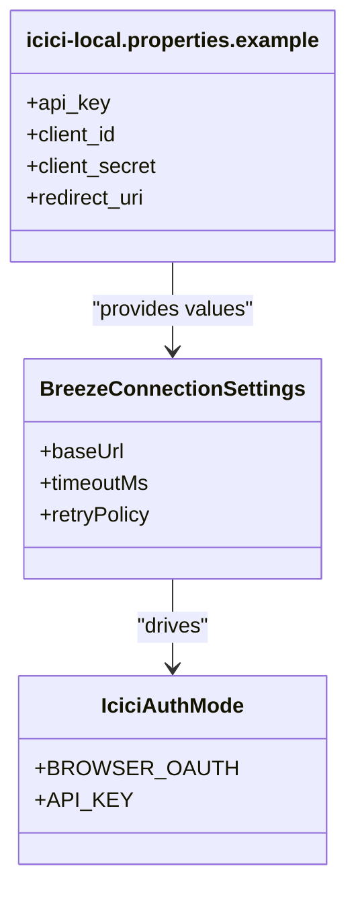

**Diagram sources**
- [BreezeConnectionSettings.java](file://broker/icici/src/main/java/com/tradej/broker/icici/config/BreezeConnectionSettings.java)
- [IciciAuthMode.java](file://broker/icici/src/main/java/com/tradej/broker/icici/config/IciciAuthMode.java)
- [icici-local.properties.example](file://config/icici-local.properties.example)

**Section sources**
- [BreezeConnectionSettings.java](file://broker/icici/src/main/java/com/tradej/broker/icici/config/BreezeConnectionSettings.java)
- [IciciAuthMode.java](file://broker/icici/src/main/java/com/tradej/broker/icici/config/IciciAuthMode.java)
- [icici-local.properties.example](file://config/icici-local.properties.example)

### Error Handling Patterns
Error handling wraps HTTP exceptions and authentication failures:
- HTTP exceptions: Wrapped into domain-specific exceptions with structured error details
- Authentication exceptions: Browser authentication failures and session parsing errors
- Resilience executor: Provides retry and fallback mechanisms for transient failures

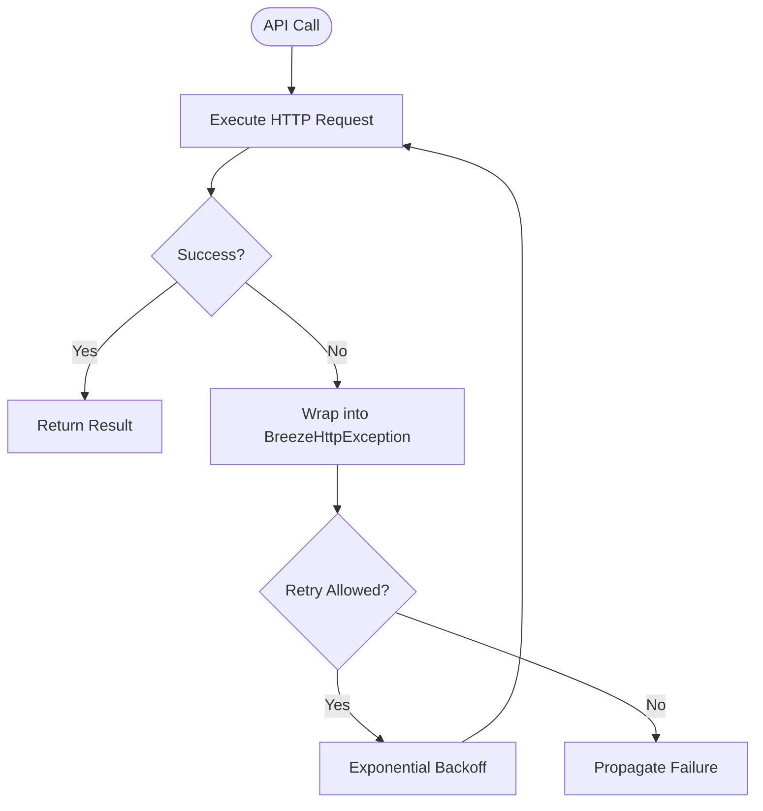

**Diagram sources**
- [BreezeHttpException.java](file://broker/icici/src/main/java/com/tradej/broker/icici/http/BreezeHttpException.java)
- [IciciResilienceExecutor.java](file://broker/icici/src/main/java/com/tradej/broker/icici/resilience/IciciResilienceExecutor.java)

**Section sources**
- [BreezeHttpException.java](file://broker/icici/src/main/java/com/tradej/broker/icici/http/BreezeHttpException.java)
- [IciciResilienceExecutor.java](file://broker/icici/src/main/java/com/tradej/broker/icici/resilience/IciciResilienceExecutor.java)

### Practical ICICI Workflows and Integration Patterns
Common workflows validated by integration tests:
- Authenticated request flow: Establish session, acquire token, execute protected requests
- Market data retrieval: Fetch quotes and handle streaming updates
- Order lifecycle: Place, track, modify, and cancel orders
- Portfolio and margin queries: Retrieve holdings and exposure
- Historical data ingestion: Paginate and window historical bars safely

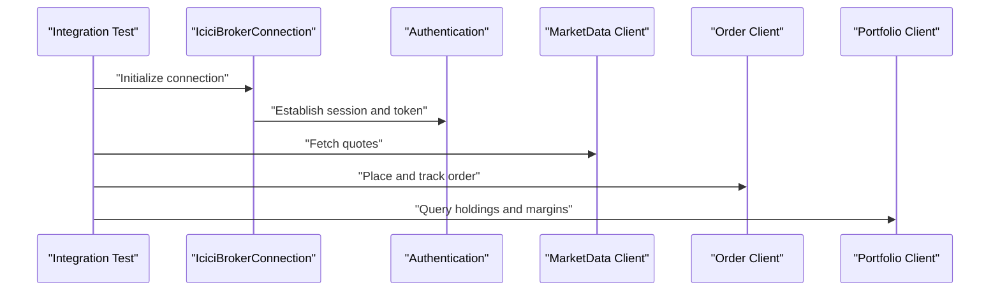

**Diagram sources**
- [IciciAuthenticatedRequestIntegrationTest.java](file://app/src/test/java/com/tradej/app/integration/IciciAuthenticatedRequestIntegrationTest.java)
- [IciciMarketDataIntegrationTest.java](file://app/src/test/java/com/tradej/app/integration/IciciMarketDataIntegrationTest.java)
- [IciciOrderLifecycleIntegrationTest.java](file://app/src/test/java/com/tradej/app/integration/IciciOrderLifecycleIntegrationTest.java)
- [IciciPortfolioIntegrationTest.java](file://app/src/test/java/com/tradej/app/integration/IciciPortfolioIntegrationTest.java)
- [IciciHistoricalDataIntegrationTest.java](file://app/src/test/java/com/tradej/app/integration/IciciHistoricalDataIntegrationTest.java)

**Section sources**
- [IciciAuthenticatedRequestIntegrationTest.java](file://app/src/test/java/com/tradej/app/integration/IciciAuthenticatedRequestIntegrationTest.java)
- [IciciMarketDataIntegrationTest.java](file://app/src/test/java/com/tradej/app/integration/IciciMarketDataIntegrationTest.java)
- [IciciMarketFeedIntegrationTest.java](file://app/src/test/java/com/tradej/app/integration/IciciMarketFeedIntegrationTest.java)
- [IciciOrderLifecycleIntegrationTest.java](file://app/src/test/java/com/tradej/app/integration/IciciOrderLifecycleIntegrationTest.java)
- [IciciPortfolioIntegrationTest.java](file://app/src/test/java/com/tradej/app/integration/IciciPortfolioIntegrationTest.java)
- [IciciRefreshSessionIntegrationTest.java](file://app/src/test/java/com/tradej/app/integration/IciciRefreshSessionIntegrationTest.java)
- [IciciTokenLifecycleIntegrationTest.java](file://app/src/test/java/com/tradej/app/integration/IciciTokenLifecycleIntegrationTest.java)
- [IciciHistoricalDataIntegrationTest.java](file://app/src/test/java/com/tradej/app/integration/IciciHistoricalDataIntegrationTest.java)
- [LiveIciciTestSupport.java](file://app/src/test/java/com/tradej/app/integration/LiveIciciTestSupport.java)

## Dependency Analysis
The ICICI integration exhibits strong cohesion within functional layers and moderate coupling to external APIs. Authentication, HTTP, REST clients, instrument resolution, adapters, and streaming form the core dependency chain. Configuration drives behavior across components.

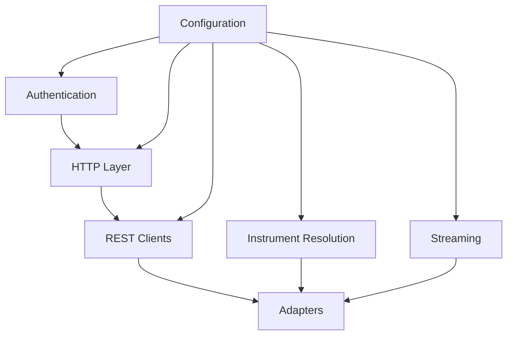

**Diagram sources**
- [IciciBrokerConnection.java](file://broker/icici/src/main/java/com/tradej/broker/icici/IciciBrokerConnection.java)
- [BreezeSession.java](file://broker/icici/src/main/java/com/tradej/broker/icici/auth/BreezeSession.java)
- [BreezeAuthenticatedHttpClient.java](file://broker/icici/src/main/java/com/tradej/broker/icici/http/BreezeAuthenticatedHttpClient.java)
- [BreezeHistoricalRestClient.java](file://broker/icici/src/main/java/com/tradej/broker/icici/rest/BreezeHistoricalRestClient.java)
- [BreezeInstrumentLoader.java](file://broker/icici/src/main/java/com/tradej/broker/icici/instrument/BreezeInstrumentLoader.java)
- [IciciExchangeSegmentMapper.java](file://broker/icici/src/main/java/com/tradej/broker/icici/mapper/IciciExchangeSegmentMapper.java)
- [IciciMarketDataProvider.java](file://broker/icici/src/main/java/com/tradej/broker/icici/adapter/IciciMarketDataProvider.java)
- [BreezeWebSocketMultiplexer.java](file://broker/icici/src/main/java/com/tradej/broker/icici/websocket/BreezeWebSocketMultiplexer.java)
- [BreezeConnectionSettings.java](file://broker/icici/src/main/java/com/tradej/broker/icici/config/BreezeConnectionSettings.java)

**Section sources**
- [IciciBrokerConnection.java](file://broker/icici/src/main/java/com/tradej/broker/icici/IciciBrokerConnection.java)

## Performance Considerations
- Token lifecycle: Minimize token refresh frequency; persist state to reduce latency
- Request signing: Batch requests where possible to reduce overhead
- Streaming: Tune subscription lists to balance coverage and bandwidth
- Pagination: Use windowed historical data fetching to avoid large payloads
- Resilience: Apply exponential backoff and circuit breaker patterns for transient failures

[No sources needed since this section provides general guidance]

## Troubleshooting Guide
Common issues and resolutions:
- Authentication failures: Verify OAuth callback URL, session parsing, and browser capture steps
- Token expiration: Implement token refresh and state persistence checks
- HTTP errors: Inspect wrapped exceptions for structured error details and retry logic
- Streaming disconnections: Reconnect using the WebSocket multiplexer and re-subscribe instruments
- Instrument resolution errors: Validate exchange segment mapping and loader metadata

**Section sources**
- [BreezeBrowserAuthException.java](file://broker/icici/src/main/java/com/tradej/broker/icici/auth/BreezeBrowserAuthException.java)
- [BreezeHttpException.java](file://broker/icici/src/main/java/com/tradej/broker/icici/http/BreezeHttpException.java)
- [IciciRefreshSessionIntegrationTest.java](file://app/src/test/java/com/tradej/app/integration/IciciRefreshSessionIntegrationTest.java)
- [IciciTokenLifecycleIntegrationTest.java](file://app/src/test/java/com/tradej/app/integration/IciciTokenLifecycleIntegrationTest.java)

## Conclusion
The ICICI Direct integration leverages the Breeze API with a robust authentication system, secure HTTP layer, comprehensive REST clients, and domain adapters. While market data streaming and depth may have limitations compared to other brokers, the integration provides solid order management, portfolio, and margin capabilities. Configuration and resilience patterns enable reliable operation in production environments. Ongoing remediation efforts aim to address gaps and align with broader broker integration standards.

[No sources needed since this section summarizes without analyzing specific files]

## Appendices

### Current Limitations Compared to Dhan and Upstox Integrations
- Streaming depth and coverage: May be more limited than Upstox; Dhan offers richer streaming features
- Order types and routing: Feature parity varies; some advanced order types may not be supported
- Portfolio and margin granularity: Differences in reporting and calculation semantics
- Instrument coverage: Some derivatives or exchanges may have restricted support
- Remediation plan: Active remediation efforts target feature gaps and integration parity

**Section sources**
- [ICICI_BREEZE_REMEDIATION_PLAN.md](file://plans/ICICI_BREEZE_REMEDIATION_PLAN.md)