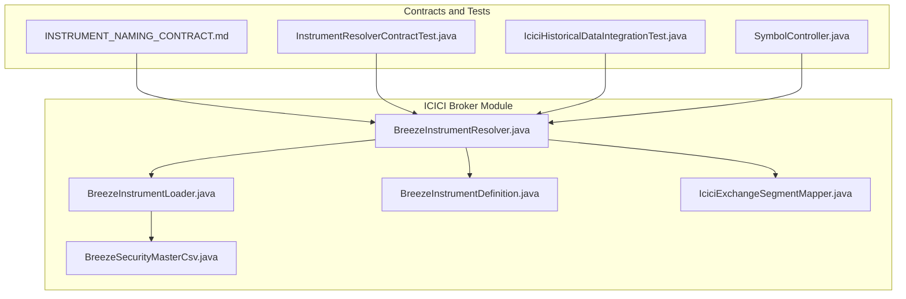
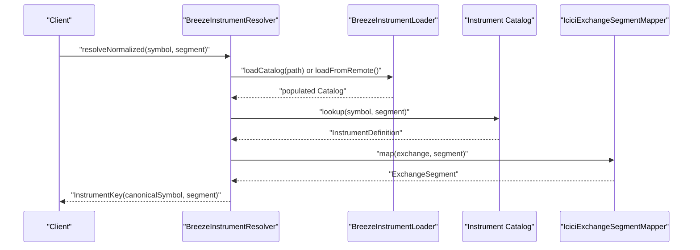
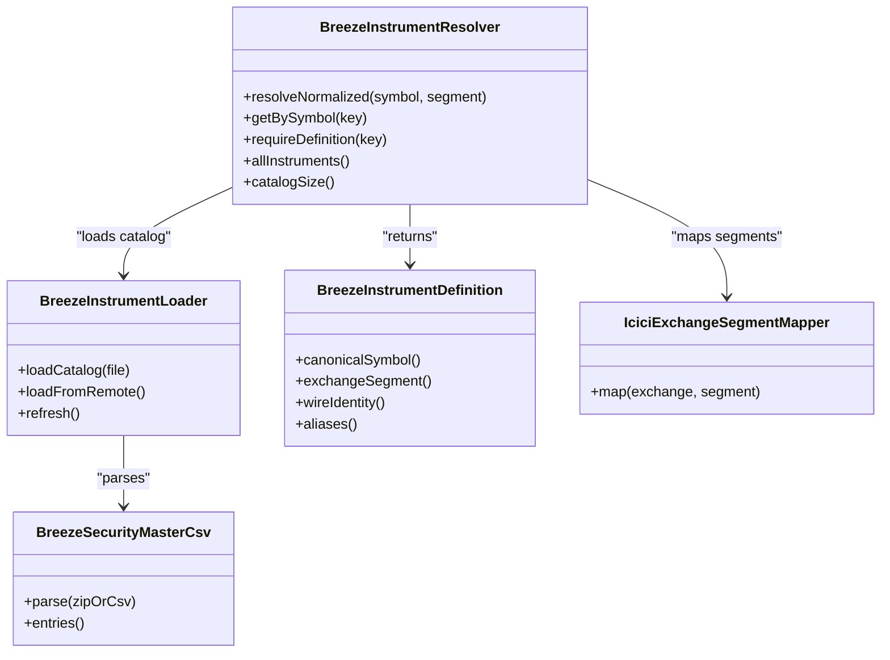
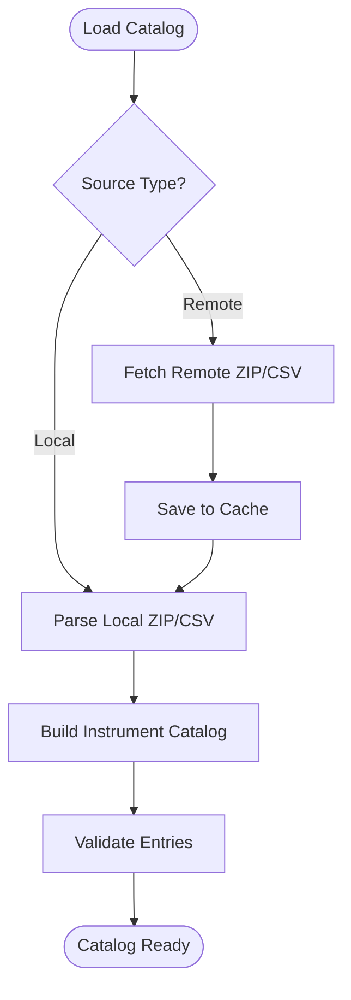
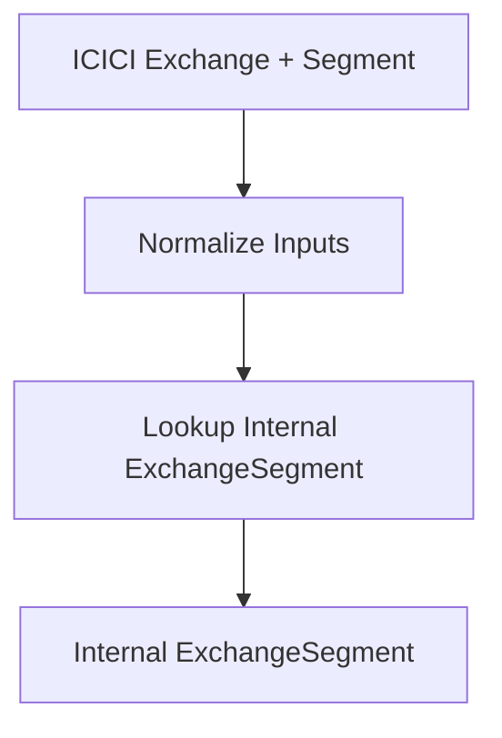
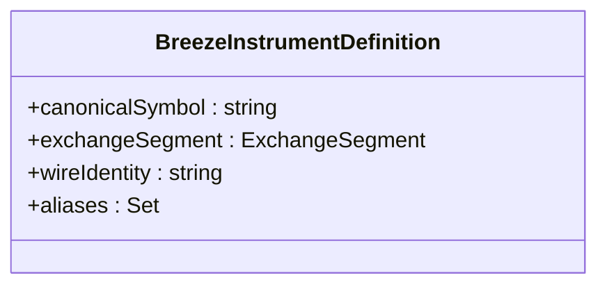
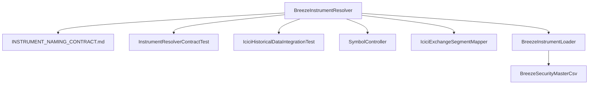

# Instrument Resolution and Exchange Mapping

<cite>
**Referenced Files in This Document**
- [BreezeInstrumentResolver.java](file://broker/icici/src/main/java/com/tradej/broker/icici/instrument/BreezeInstrumentResolver.java)
- [BreezeInstrumentLoader.java](file://broker/icici/src/main/java/com/tradej/broker/icici/instrument/BreezeInstrumentLoader.java)
- [BreezeSecurityMasterCsv.java](file://broker/icici/src/main/java/com/tradej/broker/icici/instrument/BreezeSecurityMasterCsv.java)
- [BreezeInstrumentDefinition.java](file://broker/icici/src/main/java/com/tradej/broker/icici/instrument/BreezeInstrumentDefinition.java)
- [IciciExchangeSegmentMapper.java](file://broker/icici/src/main/java/com/tradej/broker/icici/mapper/IciciExchangeSegmentMapper.java)
- [INSTRUMENT_NAMING_CONTRACT.md](file://docs/contracts/INSTRUMENT_NAMING_CONTRACT.md)
- [InstrumentResolverContractTest.java](file://broker/api/src/testFixtures/java/com/tradej/broker/api/port/InstrumentResolverContractTest.java)
- [IciciHistoricalDataIntegrationTest.java](file://app/src/test/java/com/tradej/app/integration/IciciHistoricalDataIntegrationTest.java)
- [SymbolController.java](file://app/src/main/java/com/tradej/app/api/SymbolController.java)
</cite>

## Table of Contents
1. [Introduction](#introduction)
2. [Project Structure](#project-structure)
3. [Core Components](#core-components)
4. [Architecture Overview](#architecture-overview)
5. [Detailed Component Analysis](#detailed-component-analysis)
6. [Dependency Analysis](#dependency-analysis)
7. [Performance Considerations](#performance-considerations)
8. [Troubleshooting Guide](#troubleshooting-guide)
9. [Conclusion](#conclusion)
10. [Appendices](#appendices)

## Introduction
This document explains the ICICI Direct (Breeze) instrument resolution and exchange mapping systems within the Trade-J platform. It covers how symbols are normalized and resolved to ICICI-specific identifiers, how the instrument catalog is loaded from the SecurityMaster CSV, and how exchange segments are mapped across market domains. Practical workflows, common symbol formats, and troubleshooting guidance are included to help developers and operators maintain accurate instrument coverage and resolve mapping limitations effectively.

## Project Structure
The ICICI instrument resolution system resides under the ICICI broker module and integrates with shared contracts and tests that define expected behavior and validate correctness.

**Diagram sources**
- [BreezeInstrumentResolver.java](file://broker/icici/src/main/java/com/tradej/broker/icici/instrument/BreezeInstrumentResolver.java)
- [BreezeInstrumentLoader.java](file://broker/icici/src/main/java/com/tradej/broker/icici/instrument/BreezeInstrumentLoader.java)
- [BreezeSecurityMasterCsv.java](file://broker/icici/src/main/java/com/tradej/broker/icici/instrument/BreezeSecurityMasterCsv.java)
- [BreezeInstrumentDefinition.java](file://broker/icici/src/main/java/com/tradej/broker/icici/instrument/BreezeInstrumentDefinition.java)
- [IciciExchangeSegmentMapper.java](file://broker/icici/src/main/java/com/tradej/broker/icici/mapper/IciciExchangeSegmentMapper.java)
- [INSTRUMENT_NAMING_CONTRACT.md](file://docs/contracts/INSTRUMENT_NAMING_CONTRACT.md)
- [InstrumentResolverContractTest.java](file://broker/api/src/testFixtures/java/com/tradej/broker/api/port/InstrumentResolverContractTest.java)
- [IciciHistoricalDataIntegrationTest.java](file://app/src/test/java/com/tradej/app/integration/IciciHistoricalDataIntegrationTest.java)
- [SymbolController.java](file://app/src/main/java/com/tradej/app/api/SymbolController.java)

**Section sources**
- [BreezeInstrumentResolver.java](file://broker/icici/src/main/java/com/tradej/broker/icici/instrument/BreezeInstrumentResolver.java)
- [BreezeInstrumentLoader.java](file://broker/icici/src/main/java/com/tradej/broker/icici/instrument/BreezeInstrumentLoader.java)
- [BreezeSecurityMasterCsv.java](file://broker/icici/src/main/java/com/tradej/broker/icici/instrument/BreezeSecurityMasterCsv.java)
- [BreezeInstrumentDefinition.java](file://broker/icici/src/main/java/com/tradej/broker/icici/instrument/BreezeInstrumentDefinition.java)
- [IciciExchangeSegmentMapper.java](file://broker/icici/src/main/java/com/tradej/broker/icici/mapper/IciciExchangeSegmentMapper.java)
- [INSTRUMENT_NAMING_CONTRACT.md](file://docs/contracts/INSTRUMENT_NAMING_CONTRACT.md)
- [InstrumentResolverContractTest.java](file://broker/api/src/testFixtures/java/com/tradej/broker/api/port/InstrumentResolverContractTest.java)
- [IciciHistoricalDataIntegrationTest.java](file://app/src/test/java/com/tradej/app/integration/IciciHistoricalDataIntegrationTest.java)
- [SymbolController.java](file://app/src/main/java/com/tradej/app/api/SymbolController.java)

## Core Components
- Instrument Resolver: Converts normalized symbols and exchange segments into ICICI wire identities and vice versa, supporting aliases and canonical forms.
- Instrument Loader: Loads the SecurityMaster CSV to populate the instrument catalog and supports remote loading and local caching.
- Security Master CSV Parser: Parses ICICI SecurityMaster ZIP/CSV to extract instrument definitions and aliases.
- Instrument Definition: Represents parsed instrument metadata including canonical symbol, exchange segment, and broker-specific identifiers.
- Exchange Segment Mapper: Translates ICICI exchange and segment identifiers into internal ExchangeSegment values.

These components collectively ensure that external inputs (standard NSE symbols, normalized futures/options contracts) are consistently mapped to ICICI wire identities used in API requests.

**Section sources**
- [BreezeInstrumentResolver.java](file://broker/icici/src/main/java/com/tradej/broker/icici/instrument/BreezeInstrumentResolver.java)
- [BreezeInstrumentLoader.java](file://broker/icici/src/main/java/com/tradej/broker/icici/instrument/BreezeInstrumentLoader.java)
- [BreezeSecurityMasterCsv.java](file://broker/icici/src/main/java/com/tradej/broker/icici/instrument/BreezeSecurityMasterCsv.java)
- [BreezeInstrumentDefinition.java](file://broker/icici/src/main/java/com/tradej/broker/icici/instrument/BreezeInstrumentDefinition.java)
- [IciciExchangeSegmentMapper.java](file://broker/icici/src/main/java/com/tradej/broker/icici/mapper/IciciExchangeSegmentMapper.java)

## Architecture Overview
The ICICI instrument resolution pipeline follows a contract-driven design: external inputs are normalized and resolved against a loaded catalog, while adapter boundaries translate canonical identities to broker-specific wire formats.

**Diagram sources**
- [BreezeInstrumentResolver.java](file://broker/icici/src/main/java/com/tradej/broker/icici/instrument/BreezeInstrumentResolver.java)
- [BreezeInstrumentLoader.java](file://broker/icici/src/main/java/com/tradej/broker/icici/instrument/BreezeInstrumentLoader.java)
- [IciciExchangeSegmentMapper.java](file://broker/icici/src/main/java/com/tradej/broker/icici/mapper/IciciExchangeSegmentMapper.java)

## Detailed Component Analysis

### Instrument Resolver Implementation
The resolver encapsulates symbol normalization and alias resolution, returning a stable canonical identity for downstream use. It ensures that:
- Normalized futures/options contracts resolve to canonical symbols.
- Equity aliases (e.g., RELIANCE ↔ RELIND) resolve to the same canonical symbol.
- Exchange segments are validated and mapped to internal representations.

**Diagram sources**
- [BreezeInstrumentResolver.java](file://broker/icici/src/main/java/com/tradej/broker/icici/instrument/BreezeInstrumentResolver.java)
- [BreezeInstrumentLoader.java](file://broker/icici/src/main/java/com/tradej/broker/icici/instrument/BreezeInstrumentLoader.java)
- [BreezeSecurityMasterCsv.java](file://broker/icici/src/main/java/com/tradej/broker/icici/instrument/BreezeSecurityMasterCsv.java)
- [BreezeInstrumentDefinition.java](file://broker/icici/src/main/java/com/tradej/broker/icici/instrument/BreezeInstrumentDefinition.java)
- [IciciExchangeSegmentMapper.java](file://broker/icici/src/main/java/com/tradej/broker/icici/mapper/IciciExchangeSegmentMapper.java)

**Section sources**
- [BreezeInstrumentResolver.java](file://broker/icici/src/main/java/com/tradej/broker/icici/instrument/BreezeInstrumentResolver.java)
- [BreezeInstrumentLoader.java](file://broker/icici/src/main/java/com/tradej/broker/icici/instrument/BreezeInstrumentLoader.java)
- [BreezeSecurityMasterCsv.java](file://broker/icici/src/main/java/com/tradej/broker/icici/instrument/BreezeSecurityMasterCsv.java)
- [BreezeInstrumentDefinition.java](file://broker/icici/src/main/java/com/tradej/broker/icici/instrument/BreezeInstrumentDefinition.java)
- [IciciExchangeSegmentMapper.java](file://broker/icici/src/main/java/com/tradej/broker/icici/mapper/IciciExchangeSegmentMapper.java)

### Instrument Loader and Security Master CSV Processing
The loader manages catalog ingestion from:
- Local ZIP/CSV files (cached SecurityMaster).
- Remote endpoints for fresh data.

The parser extracts instrument definitions and maintains alias mappings, enabling robust resolution for both standardized and broker-specific identifiers.

**Diagram sources**
- [BreezeInstrumentLoader.java](file://broker/icici/src/main/java/com/tradej/broker/icici/instrument/BreezeInstrumentLoader.java)
- [BreezeSecurityMasterCsv.java](file://broker/icici/src/main/java/com/tradej/broker/icici/instrument/BreezeSecurityMasterCsv.java)

**Section sources**
- [BreezeInstrumentLoader.java](file://broker/icici/src/main/java/com/tradej/broker/icici/instrument/BreezeInstrumentLoader.java)
- [BreezeSecurityMasterCsv.java](file://broker/icici/src/main/java/com/tradej/broker/icici/instrument/BreezeSecurityMasterCsv.java)

### Exchange Segment Mapping
The segment mapper translates ICICI exchange and segment identifiers into internal ExchangeSegment values, ensuring consistent handling across the system.

**Diagram sources**
- [IciciExchangeSegmentMapper.java](file://broker/icici/src/main/java/com/tradej/broker/icici/mapper/IciciExchangeSegmentMapper.java)

**Section sources**
- [IciciExchangeSegmentMapper.java](file://broker/icici/src/main/java/com/tradej/broker/icici/mapper/IciciExchangeSegmentMapper.java)

### Instrument Definition Structures
Instrument definitions capture canonical symbols, exchange segments, wire identities, and aliases. They serve as the authoritative record for resolution and mapping.

**Diagram sources**
- [BreezeInstrumentDefinition.java](file://broker/icici/src/main/java/com/tradej/broker/icici/instrument/BreezeInstrumentDefinition.java)

**Section sources**
- [BreezeInstrumentDefinition.java](file://broker/icici/src/main/java/com/tradej/broker/icici/instrument/BreezeInstrumentDefinition.java)

### Symbol Normalization and Lookup Optimization
Normalization ensures consistent representation across inputs. Lookup optimization relies on:
- Pre-populated catalogs from SecurityMaster.
- Efficient indexing of canonical symbols and aliases.
- Contract-driven resolution rules that minimize ambiguity.

Practical examples:
- Equity resolution: Standard NSE symbols resolve to canonical symbols; aliases resolve to the same canonical identity.
- Futures/Options resolution: ContractSymbolNormalizer output resolves to canonical futures/options symbols.

**Section sources**
- [INSTRUMENT_NAMING_CONTRACT.md](file://docs/contracts/INSTRUMENT_NAMING_CONTRACT.md)
- [InstrumentResolverContractTest.java](file://broker/api/src/testFixtures/java/com/tradej/broker/api/port/InstrumentResolverContractTest.java)

## Dependency Analysis
The ICICI instrument resolution system depends on:
- Shared contracts defining canonical identity and resolution rules.
- Integration tests validating catalog loading and symbol resolution.
- UI/API controllers deriving instrument types and segments for display.

**Diagram sources**
- [BreezeInstrumentResolver.java](file://broker/icici/src/main/java/com/tradej/broker/icici/instrument/BreezeInstrumentResolver.java)
- [INSTRUMENT_NAMING_CONTRACT.md](file://docs/contracts/INSTRUMENT_NAMING_CONTRACT.md)
- [InstrumentResolverContractTest.java](file://broker/api/src/testFixtures/java/com/tradej/broker/api/port/InstrumentResolverContractTest.java)
- [IciciHistoricalDataIntegrationTest.java](file://app/src/test/java/com/tradej/app/integration/IciciHistoricalDataIntegrationTest.java)
- [SymbolController.java](file://app/src/main/java/com/tradej/app/api/SymbolController.java)
- [IciciExchangeSegmentMapper.java](file://broker/icici/src/main/java/com/tradej/broker/icici/mapper/IciciExchangeSegmentMapper.java)
- [BreezeInstrumentLoader.java](file://broker/icici/src/main/java/com/tradej/broker/icici/instrument/BreezeInstrumentLoader.java)
- [BreezeSecurityMasterCsv.java](file://broker/icici/src/main/java/com/tradej/broker/icici/instrument/BreezeSecurityMasterCsv.java)

**Section sources**
- [BreezeInstrumentResolver.java](file://broker/icici/src/main/java/com/tradej/broker/icici/instrument/BreezeInstrumentResolver.java)
- [INSTRUMENT_NAMING_CONTRACT.md](file://docs/contracts/INSTRUMENT_NAMING_CONTRACT.md)
- [InstrumentResolverContractTest.java](file://broker/api/src/testFixtures/java/com/tradej/broker/api/port/InstrumentResolverContractTest.java)
- [IciciHistoricalDataIntegrationTest.java](file://app/src/test/java/com/tradej/app/integration/IciciHistoricalDataIntegrationTest.java)
- [SymbolController.java](file://app/src/main/java/com/tradej/app/api/SymbolController.java)
- [IciciExchangeSegmentMapper.java](file://broker/icici/src/main/java/com/tradej/broker/icici/mapper/IciciExchangeSegmentMapper.java)
- [BreezeInstrumentLoader.java](file://broker/icici/src/main/java/com/tradej/broker/icici/instrument/BreezeInstrumentLoader.java)
- [BreezeSecurityMasterCsv.java](file://broker/icici/src/main/java/com/tradej/broker/icici/instrument/BreezeSecurityMasterCsv.java)

## Performance Considerations
- Prefer pre-loading catalogs during startup to avoid runtime latency.
- Cache SecurityMaster locally to reduce network overhead and improve reliability.
- Use normalized symbols and canonical identities to minimize repeated resolution work.
- Batch symbol resolution requests where possible to reduce adapter round-trips.

## Troubleshooting Guide
Common issues and resolutions:
- Empty catalog after loading: Verify SecurityMaster ZIP/CSV availability and parsing success; confirm remote fetch succeeds when local cache is missing.
- Unknown symbol errors: Ensure the symbol exists in the catalog or alias mappings; validate exchange segment alignment.
- Inconsistent instrument types: Confirm SymbolController classification aligns with instrument definitions and exchange segments.
- Partial F&O mapping: Recognize that ICICI SecurityMaster mapping for futures/options is partial; rely on equity alias resolution and normalized contract symbols for reliable resolution.

Validation references:
- Integration test validates catalog loading and symbol resolution for common equities.
- Contract tests enforce catalog size, presence of instruments, and symbol resolution behavior.
- Controller logic demonstrates how instrument types and segments are derived for display.

**Section sources**
- [IciciHistoricalDataIntegrationTest.java](file://app/src/test/java/com/tradej/app/integration/IciciHistoricalDataIntegrationTest.java)
- [InstrumentResolverContractTest.java](file://broker/api/src/testFixtures/java/com/tradej/broker/api/port/InstrumentResolverContractTest.java)
- [SymbolController.java](file://app/src/main/java/com/tradej/app/api/SymbolController.java)

## Conclusion
The ICICI instrument resolution system provides a robust, contract-driven mechanism for normalizing symbols, resolving aliases, and mapping exchange segments. By leveraging the SecurityMaster catalog and strict canonical identity rules, it ensures consistent behavior across adapters and services. While F&O mapping remains partially dependent on SecurityMaster, equity alias resolution and normalized contract symbols offer reliable coverage for most trading scenarios.

## Appendices

### Practical Resolution Workflows
- Equity resolution: Provide standard NSE symbol; resolver returns canonical identity and validates against catalog.
- Futures/Options resolution: Provide normalized contract symbol; resolver maps to canonical identity using catalog and segment mapping.
- Alias resolution: Provide known alias (e.g., RELIND for RELIANCE); resolver maps to canonical symbol consistently.

### Common Symbol Formats
- Equity: Standard NSE symbols (e.g., RELIANCE).
- Futures/Options: Normalized contract symbols (e.g., NIFTY 30 JUN FUT, BANKNIFTY 30 JUN 30000 CALL).
- ICICI wire identity: Breeze ShortName extracted from SecurityMaster (e.g., RELIND).

### Instrument Coverage and Limitations
- Equity alias coverage: Fully supported via SecurityMaster mappings.
- F&O coverage: Partially supported; rely on normalized contract symbols and available SecurityMaster entries.
- Exchange segments: Mapped via IciciExchangeSegmentMapper to internal ExchangeSegment values.

**Section sources**
- [INSTRUMENT_NAMING_CONTRACT.md](file://docs/contracts/INSTRUMENT_NAMING_CONTRACT.md)
- [IciciHistoricalDataIntegrationTest.java](file://app/src/test/java/com/tradej/app/integration/IciciHistoricalDataIntegrationTest.java)