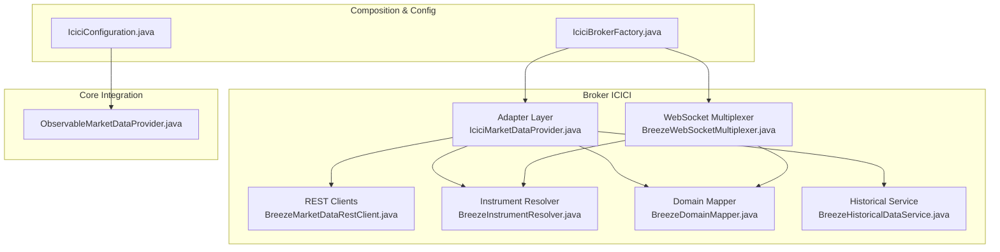
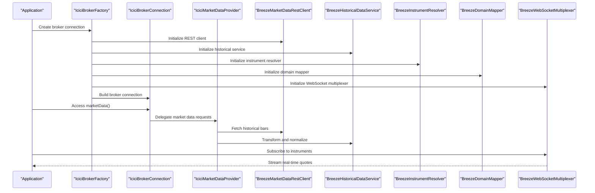
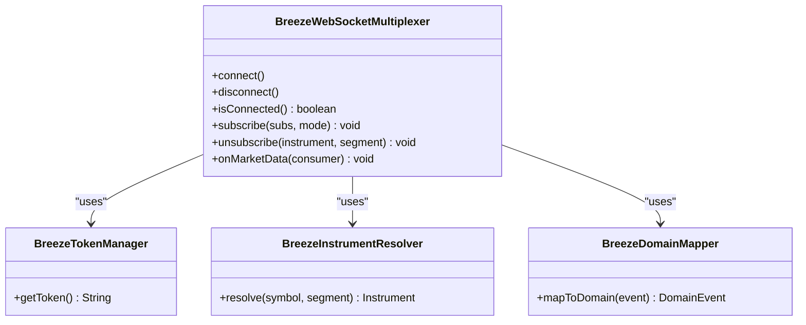
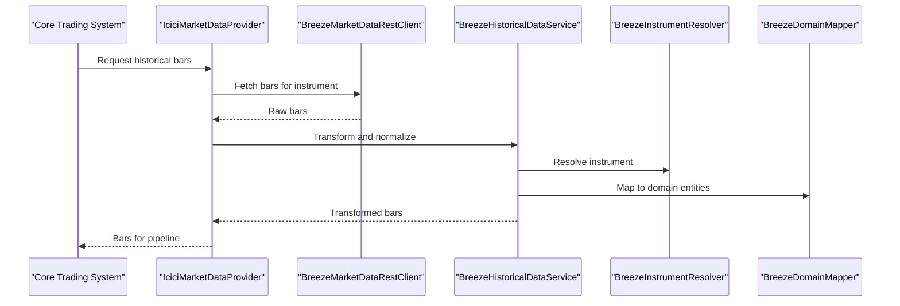
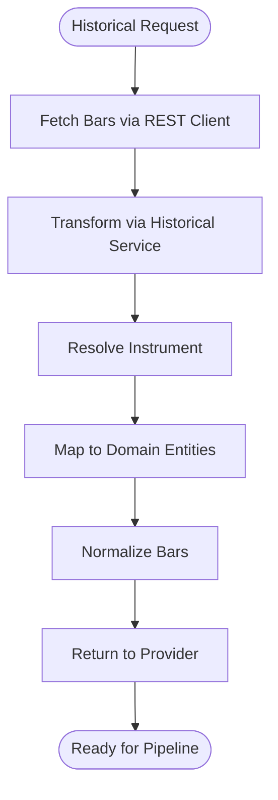
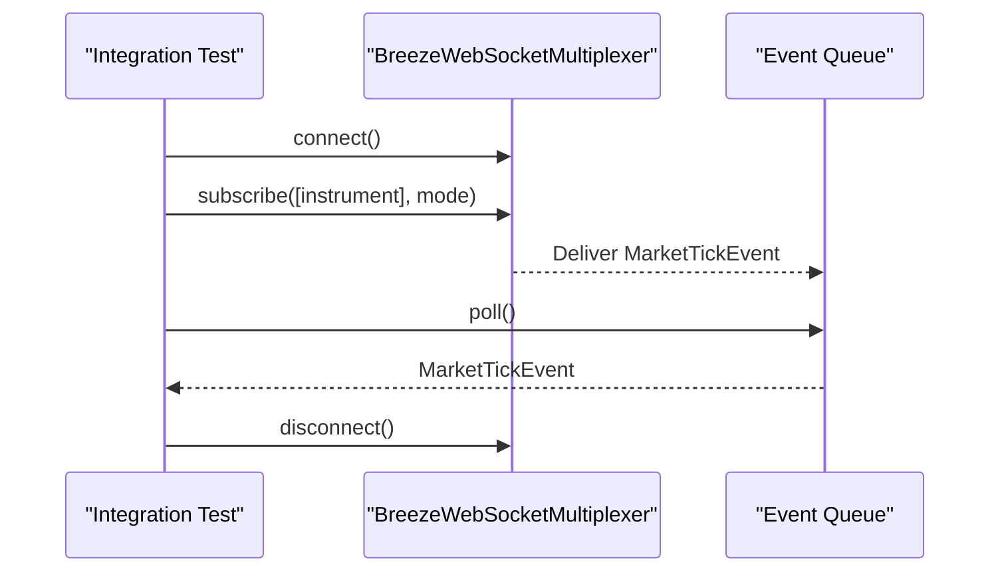
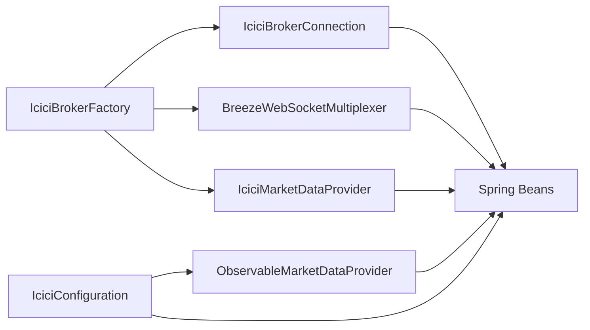
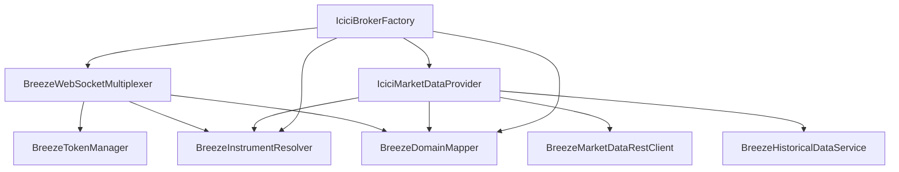

# Market Data Streaming and WebSocket Integration

<cite>
**Referenced Files in This Document**
- [BreezeWebSocketMultiplexer.java](file://broker/icici/src/main/java/com/tradej/broker/icici/websocket/BreezeWebSocketMultiplexer.java)
- [IciciMarketDataProvider.java](file://broker/icici/src/main/java/com/tradej/broker/icici/adapter/IciciMarketDataProvider.java)
- [BreezeMarketDataRestClient.java](file://broker/icici/src/main/java/com/tradej/broker/icici/rest/BreezeMarketDataRestClient.java)
- [IciciBrokerFactory.java](file://composition/src/main/java/com/tradej/composition/IciciBrokerFactory.java)
- [IciciConfiguration.java](file://app/src/main/java/com/tradej/app/config/IciciConfiguration.java)
- [IciciMarketFeedIntegrationTest.java](file://app/src/test/java/com/tradej/app/integration/IciciMarketFeedIntegrationTest.java)
- [BreezeHistoricalDataService.java](file://broker/icici/src/main/java/com/tradej/broker/icici/historical/BreezeHistoricalDataService.java)
- [BreezeConnectionSettings.java](file://broker/icici/src/main/java/com/tradej/broker/icici/config/BreezeConnectionSettings.java)
- [BreezeTokenManager.java](file://broker/icici/src/main/java/com/tradej/broker/icici/auth/BreezeTokenManager.java)
- [BreezeInstrumentResolver.java](file://broker/icici/src/main/java/com/tradej/broker/icici/instrument/BreezeInstrumentResolver.java)
- [BreezeDomainMapper.java](file://broker/icici/src/main/java/com/tradej/broker/icici/mapper/BreezeDomainMapper.java)
- [ObservableMarketDataProvider.java](file://core/src/main/java/com/tradej/core/infrastructure/ObservableMarketDataProvider.java)
</cite>

## Table of Contents
1. [Introduction](#introduction)
2. [Project Structure](#project-structure)
3. [Core Components](#core-components)
4. [Architecture Overview](#architecture-overview)
5. [Detailed Component Analysis](#detailed-component-analysis)
6. [Dependency Analysis](#dependency-analysis)
7. [Performance Considerations](#performance-considerations)
8. [Troubleshooting Guide](#troubleshooting-guide)
9. [Conclusion](#conclusion)

## Introduction
This document explains the ICICI Direct market data streaming capabilities implemented in the codebase. It covers the WebSocket multiplexer that enables multiple concurrent market data streams, the market data provider adapter integrating with the core trading system, historical data retrieval via REST APIs, and the data transformation pipeline. It also documents subscription management, real-time quote handling, depth-of-market streaming, configuration options, error recovery mechanisms, and performance optimization techniques. Limitations compared to other broker integrations are highlighted along with guidance for optimal usage patterns.

## Project Structure
The ICICI integration is organized under the broker module with clear separation of concerns:
- Adapter layer: Market data provider, order adapters, portfolio and margin providers
- REST clients: Historical, market data, option chain, order, and portfolio REST clients
- WebSocket: Multiplexer for real-time streaming
- Instrument resolution and mapping: Resolving instruments and mapping domain entities
- Composition and configuration: Factory wiring and Spring configuration beans

**Diagram sources**
- [IciciBrokerFactory.java:82-111](file://composition/src/main/java/com/tradej/composition/IciciBrokerFactory.java#L82-L111)
- [IciciConfiguration.java:114-164](file://app/src/main/java/com/tradej/app/config/IciciConfiguration.java#L114-L164)
- [BreezeWebSocketMultiplexer.java](file://broker/icici/src/main/java/com/tradej/broker/icici/websocket/BreezeWebSocketMultiplexer.java)
- [IciciMarketDataProvider.java](file://broker/icici/src/main/java/com/tradej/broker/icici/adapter/IciciMarketDataProvider.java)
- [BreezeMarketDataRestClient.java](file://broker/icici/src/main/java/com/tradej/broker/icici/rest/BreezeMarketDataRestClient.java)
- [BreezeInstrumentResolver.java](file://broker/icici/src/main/java/com/tradej/broker/icici/instrument/BreezeInstrumentResolver.java)
- [BreezeDomainMapper.java](file://broker/icici/src/main/java/com/tradej/broker/icici/mapper/BreezeDomainMapper.java)
- [BreezeHistoricalDataService.java](file://broker/icici/src/main/java/com/tradej/broker/icici/historical/BreezeHistoricalDataService.java)
- [ObservableMarketDataProvider.java](file://core/src/main/java/com/tradej/core/infrastructure/ObservableMarketDataProvider.java)

**Section sources**
- [IciciBrokerFactory.java:82-111](file://composition/src/main/java/com/tradej/composition/IciciBrokerFactory.java#L82-L111)
- [IciciConfiguration.java:114-164](file://app/src/main/java/com/tradej/app/config/IciciConfiguration.java#L114-L164)

## Core Components
- WebSocket Multiplexer: Manages a single connection multiplexing multiple market data subscriptions for real-time streaming.
- Market Data Provider Adapter: Bridges REST historical data and transforms it for the core trading system.
- REST Clients: Provide programmatic access to ICICI Breeze API endpoints for market data and historical bars.
- Instrument Resolution and Mapping: Converts broker-specific identifiers to unified domain entities.
- Composition and Configuration: Wires the multiplexer and provider into the application context and exposes observable market data.

Key responsibilities:
- Real-time streaming: Subscribe/unsubscribe to instruments, receive and transform quotes, handle connection lifecycle.
- Historical data: Request OHLCV bars via REST, apply transformations, and expose through the provider interface.
- Integration: Provide observable market data to the broader trading pipeline.

**Section sources**
- [BreezeWebSocketMultiplexer.java](file://broker/icici/src/main/java/com/tradej/broker/icici/websocket/BreezeWebSocketMultiplexer.java)
- [IciciMarketDataProvider.java:20-40](file://broker/icici/src/main/java/com/tradej/broker/icici/adapter/IciciMarketDataProvider.java#L20-L40)
- [BreezeMarketDataRestClient.java](file://broker/icici/src/main/java/com/tradej/broker/icici/rest/BreezeMarketDataRestClient.java)
- [IciciBrokerFactory.java:82-111](file://composition/src/main/java/com/tradej/composition/IciciBrokerFactory.java#L82-L111)
- [IciciConfiguration.java:114-164](file://app/src/main/java/com/tradej/app/config/IciciConfiguration.java#L114-L164)

## Architecture Overview
The ICICI market data architecture integrates REST-based historical data retrieval with a WebSocket multiplexer for real-time streaming. The factory wires the multiplexer and provider into the broker connection, while configuration exposes observable market data to the application.

**Diagram sources**
- [IciciBrokerFactory.java:82-111](file://composition/src/main/java/com/tradej/composition/IciciBrokerFactory.java#L82-L111)
- [IciciMarketDataProvider.java:20-40](file://broker/icici/src/main/java/com/tradej/broker/icici/adapter/IciciMarketDataProvider.java#L20-L40)
- [BreezeMarketDataRestClient.java](file://broker/icici/src/main/java/com/tradej/broker/icici/rest/BreezeMarketDataRestClient.java)
- [BreezeHistoricalDataService.java](file://broker/icici/src/main/java/com/tradej/broker/icici/historical/BreezeHistoricalDataService.java)
- [BreezeInstrumentResolver.java](file://broker/icici/src/main/java/com/tradej/broker/icici/instrument/BreezeInstrumentResolver.java)
- [BreezeDomainMapper.java](file://broker/icici/src/main/java/com/tradej/broker/icici/mapper/BreezeDomainMapper.java)
- [BreezeWebSocketMultiplexer.java](file://broker/icici/src/main/java/com/tradej/broker/icici/websocket/BreezeWebSocketMultiplexer.java)

## Detailed Component Analysis

### WebSocket Multiplexer Implementation
The WebSocket multiplexer manages a single connection that multiplexes multiple market data subscriptions. It supports subscribing to instruments with different feed modes and handles connection lifecycle events.

Key capabilities:
- Single connection multiplexing multiple instruments
- Subscription management with instrument identifiers and exchange segments
- Real-time quote delivery to subscribers
- Connection state monitoring and reconnection coordination

**Diagram sources**
- [BreezeWebSocketMultiplexer.java](file://broker/icici/src/main/java/com/tradej/broker/icici/websocket/BreezeWebSocketMultiplexer.java)
- [BreezeTokenManager.java](file://broker/icici/src/main/java/com/tradej/broker/icici/auth/BreezeTokenManager.java)
- [BreezeInstrumentResolver.java](file://broker/icici/src/main/java/com/tradej/broker/icici/instrument/BreezeInstrumentResolver.java)
- [BreezeDomainMapper.java](file://broker/icici/src/main/java/com/tradej/broker/icici/mapper/BreezeDomainMapper.java)

**Section sources**
- [BreezeWebSocketMultiplexer.java](file://broker/icici/src/main/java/com/tradej/broker/icici/websocket/BreezeWebSocketMultiplexer.java)
- [IciciMarketFeedIntegrationTest.java:34-60](file://app/src/test/java/com/tradej/app/integration/IciciMarketFeedIntegrationTest.java#L34-L60)

### Market Data Provider Adapter
The market data provider adapter integrates REST-based historical data retrieval with the core trading system. It delegates to the REST client for historical bars and uses the instrument resolver and domain mapper for transformations.

Responsibilities:
- Historical bar retrieval via REST client
- Instrument resolution and domain mapping
- Exposing market data to the observable provider

**Diagram sources**
- [IciciMarketDataProvider.java:20-40](file://broker/icici/src/main/java/com/tradej/broker/icici/adapter/IciciMarketDataProvider.java#L20-L40)
- [BreezeMarketDataRestClient.java](file://broker/icici/src/main/java/com/tradej/broker/icici/rest/BreezeMarketDataRestClient.java)
- [BreezeHistoricalDataService.java](file://broker/icici/src/main/java/com/tradej/broker/icici/historical/BreezeHistoricalDataService.java)
- [BreezeInstrumentResolver.java](file://broker/icici/src/main/java/com/tradej/broker/icici/instrument/BreezeInstrumentResolver.java)
- [BreezeDomainMapper.java](file://broker/icici/src/main/java/com/tradej/broker/icici/mapper/BreezeDomainMapper.java)

**Section sources**
- [IciciMarketDataProvider.java:20-40](file://broker/icici/src/main/java/com/tradej/broker/icici/adapter/IciciMarketDataProvider.java#L20-L40)
- [BreezeMarketDataRestClient.java](file://broker/icici/src/main/java/com/tradej/broker/icici/rest/BreezeMarketDataRestClient.java)

### Historical Data Retrieval and Transformation
Historical data retrieval leverages the REST client and a dedicated historical service that applies transformations and normalization. The service uses the instrument resolver and domain mapper to produce consistent domain entities for downstream consumption.

**Diagram sources**
- [BreezeMarketDataRestClient.java](file://broker/icici/src/main/java/com/tradej/broker/icici/rest/BreezeMarketDataRestClient.java)
- [BreezeHistoricalDataService.java](file://broker/icici/src/main/java/com/tradej/broker/icici/historical/BreezeHistoricalDataService.java)
- [BreezeInstrumentResolver.java](file://broker/icici/src/main/java/com/tradej/broker/icici/instrument/BreezeInstrumentResolver.java)
- [BreezeDomainMapper.java](file://broker/icici/src/main/java/com/tradej/broker/icici/mapper/BreezeDomainMapper.java)

**Section sources**
- [BreezeHistoricalDataService.java](file://broker/icici/src/main/java/com/tradej/broker/icici/historical/BreezeHistoricalDataService.java)

### Subscription Management and Real-Time Quote Handling
The WebSocket multiplexer manages subscriptions and delivers real-time quotes. Integration tests demonstrate connecting, subscribing to instruments, and receiving market tick events.

**Diagram sources**
- [IciciMarketFeedIntegrationTest.java:34-60](file://app/src/test/java/com/tradej/app/integration/IciciMarketFeedIntegrationTest.java#L34-L60)
- [BreezeWebSocketMultiplexer.java](file://broker/icici/src/main/java/com/tradej/broker/icici/websocket/BreezeWebSocketMultiplexer.java)

**Section sources**
- [IciciMarketFeedIntegrationTest.java:34-60](file://app/src/test/java/com/tradej/app/integration/IciciMarketFeedIntegrationTest.java#L34-L60)

### Configuration Options and Integration Points
The factory constructs the broker connection with the multiplexer and provider, while configuration exposes observable market data and other broker services as Spring beans.

**Diagram sources**
- [IciciBrokerFactory.java:82-111](file://composition/src/main/java/com/tradej/composition/IciciBrokerFactory.java#L82-L111)
- [IciciConfiguration.java:114-164](file://app/src/main/java/com/tradej/app/config/IciciConfiguration.java#L114-L164)

**Section sources**
- [IciciBrokerFactory.java:82-111](file://composition/src/main/java/com/tradej/composition/IciciBrokerFactory.java#L82-L111)
- [IciciConfiguration.java:114-164](file://app/src/main/java/com/tradej/app/config/IciciConfiguration.java#L114-L164)

## Dependency Analysis
The ICICI market data stack exhibits clear layering with low coupling between components. The multiplexer depends on token management, instrument resolution, and domain mapping. The provider depends on REST clients, historical service, instrument resolution, and mapping.

**Diagram sources**
- [BreezeWebSocketMultiplexer.java](file://broker/icici/src/main/java/com/tradej/broker/icici/websocket/BreezeWebSocketMultiplexer.java)
- [BreezeTokenManager.java](file://broker/icici/src/main/java/com/tradej/broker/icici/auth/BreezeTokenManager.java)
- [BreezeInstrumentResolver.java](file://broker/icici/src/main/java/com/tradej/broker/icici/instrument/BreezeInstrumentResolver.java)
- [BreezeDomainMapper.java](file://broker/icici/src/main/java/com/tradej/broker/icici/mapper/BreezeDomainMapper.java)
- [IciciMarketDataProvider.java:20-40](file://broker/icici/src/main/java/com/tradej/broker/icici/adapter/IciciMarketDataProvider.java#L20-L40)
- [BreezeMarketDataRestClient.java](file://broker/icici/src/main/java/com/tradej/broker/icici/rest/BreezeMarketDataRestClient.java)
- [BreezeHistoricalDataService.java](file://broker/icici/src/main/java/com/tradej/broker/icici/historical/BreezeHistoricalDataService.java)
- [IciciBrokerFactory.java:82-111](file://composition/src/main/java/com/tradej/composition/IciciBrokerFactory.java#L82-L111)

**Section sources**
- [IciciBrokerFactory.java:82-111](file://composition/src/main/java/com/tradej/composition/IciciBrokerFactory.java#L82-L111)
- [IciciMarketDataProvider.java:20-40](file://broker/icici/src/main/java/com/tradej/broker/icici/adapter/IciciMarketDataProvider.java#L20-L40)

## Performance Considerations
- WebSocket multiplexing reduces connection overhead by consolidating multiple subscriptions onto a single connection.
- Instrument resolution and domain mapping should be cached to minimize repeated lookups during high-frequency streaming.
- Historical REST calls should leverage pagination and appropriate intervals to avoid excessive load.
- Backpressure handling in the event queue ensures the system remains responsive under bursty data loads.
- Connection pooling and keep-alive settings should be tuned for latency-sensitive environments.

## Troubleshooting Guide
Common issues and remedies:
- Connection failures: Verify token validity and network connectivity; ensure proper reconnection listeners are registered.
- Subscription errors: Confirm instrument identifiers and exchange segments; validate that the instrument resolver has loaded remote definitions.
- Historical data gaps: Check REST endpoint availability and retry policies; ensure interval and date range parameters are valid.
- Mapping inconsistencies: Validate domain mapper configurations and instrument definitions; confirm consistent naming conventions.
- Event throughput drops: Monitor queue sizes and backpressure; adjust buffer sizes and consumer thread pools.

**Section sources**
- [BreezeWebSocketMultiplexer.java](file://broker/icici/src/main/java/com/tradej/broker/icici/websocket/BreezeWebSocketMultiplexer.java)
- [IciciMarketFeedIntegrationTest.java:34-60](file://app/src/test/java/com/tradej/app/integration/IciciMarketFeedIntegrationTest.java#L34-L60)

## Conclusion
The ICICI Direct market data implementation combines a WebSocket multiplexer for efficient real-time streaming with REST-based historical data retrieval and robust transformation layers. The factory and configuration integrate these components into the broader trading system, exposing observable market data and supporting subscription management. While the current implementation focuses on real-time streaming and historical bars, enhancements such as depth-of-market streaming and expanded feed modes could further align it with other broker integrations. For optimal usage, leverage the multiplexer for concurrent subscriptions, cache instrument resolutions, and tune connection settings for performance and reliability.