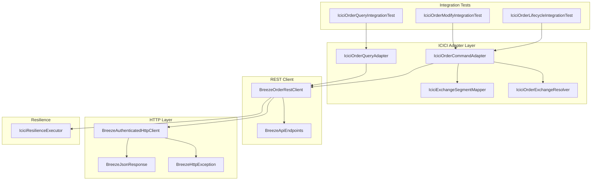
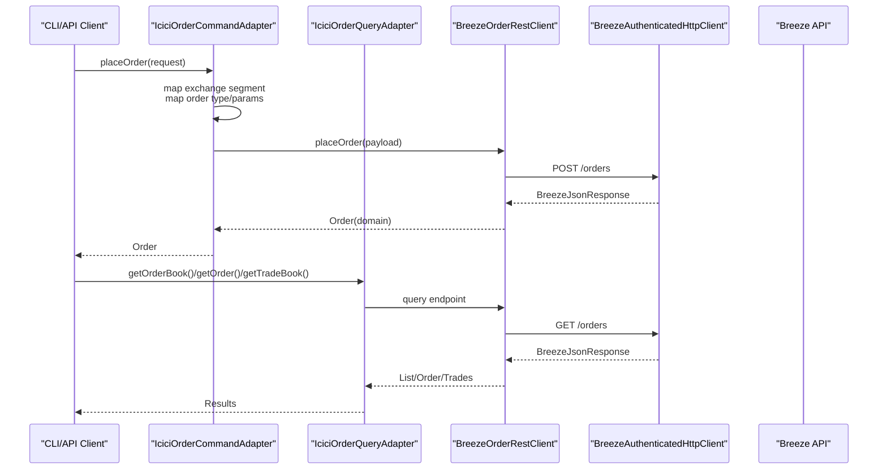
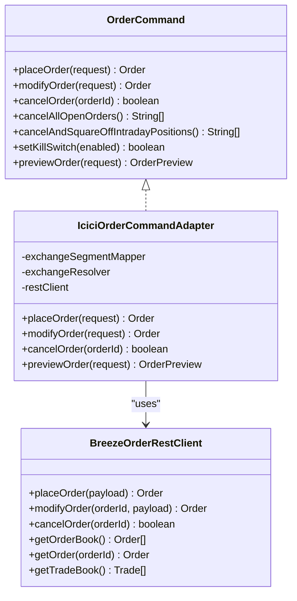
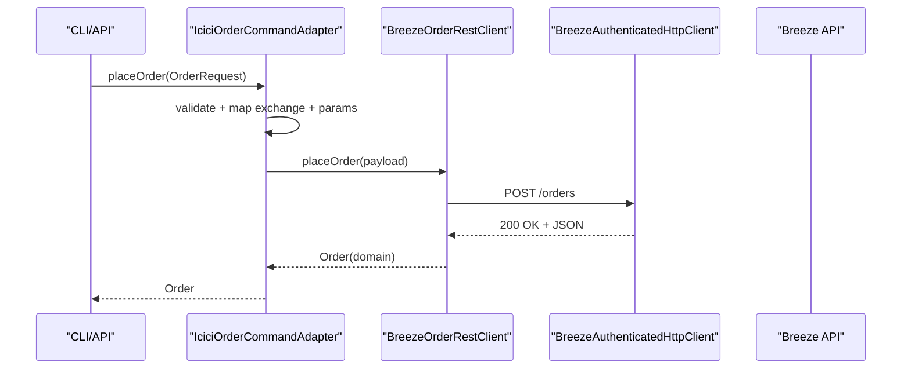
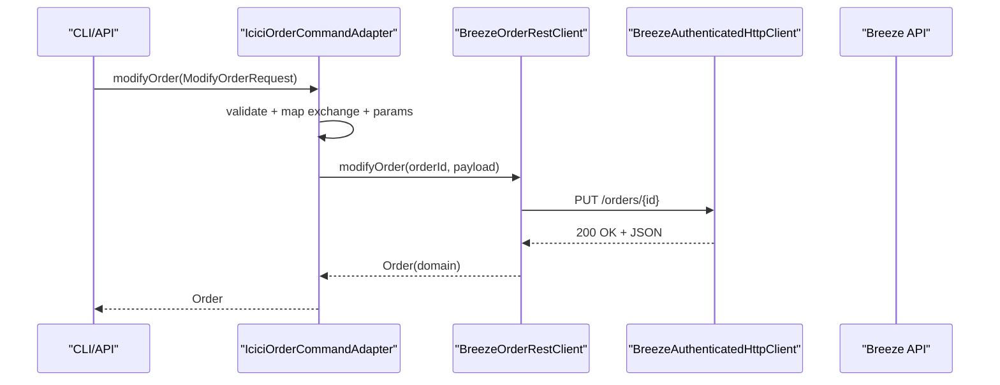
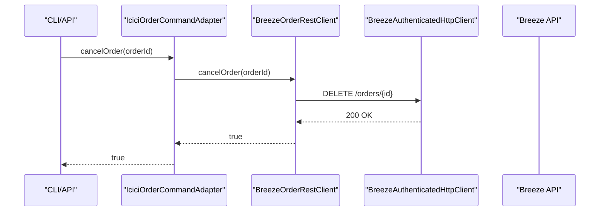
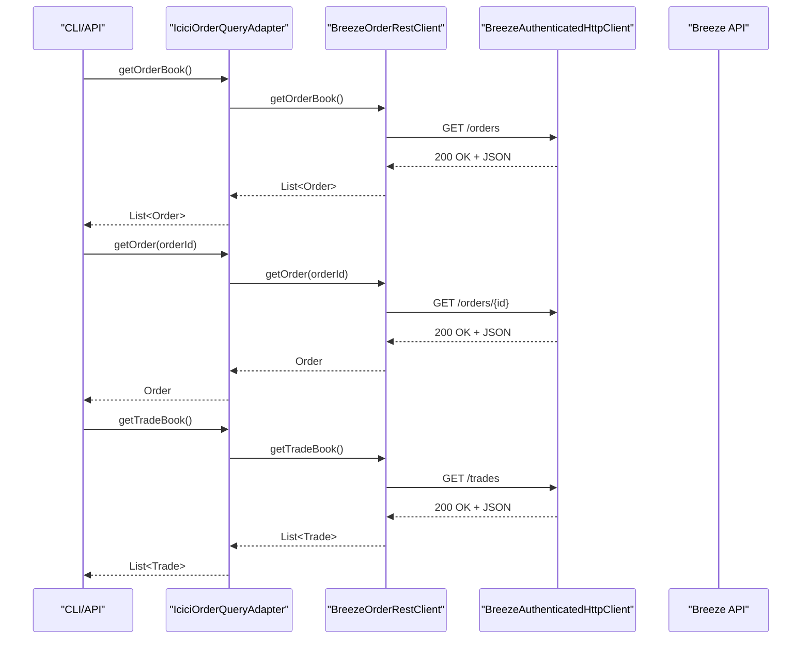
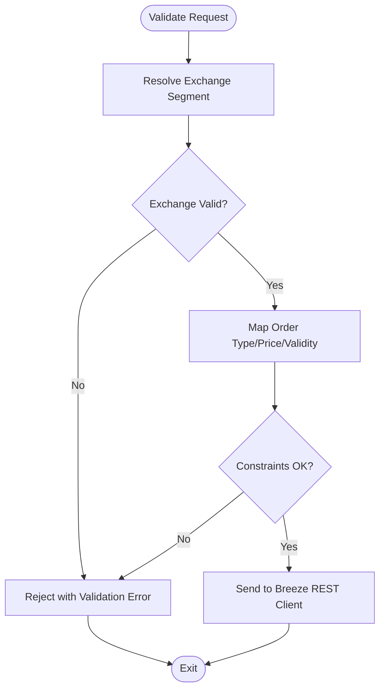
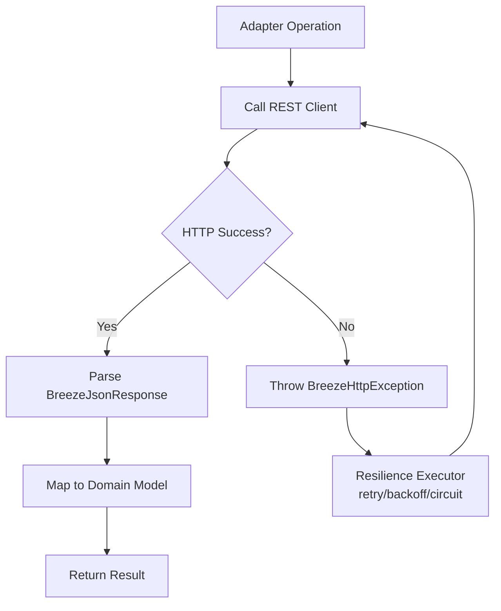
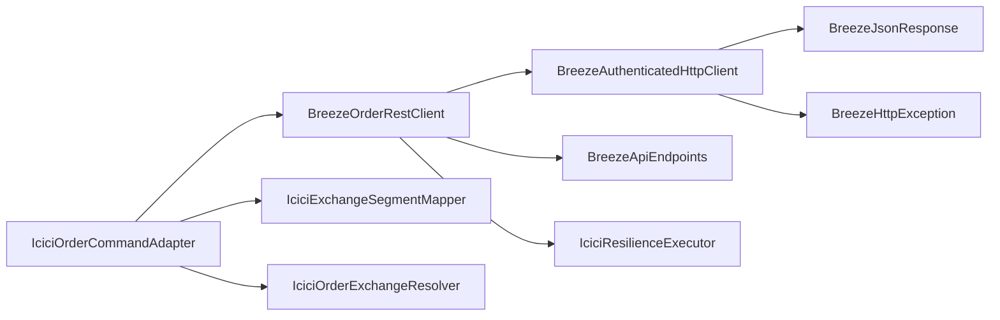

# Order Management and Execution

<cite>
**Referenced Files in This Document**
- [IciciOrderCommandAdapter.java](file://broker/icici/src/main/java/com/tradej/broker/icici/adapter/IciciOrderCommandAdapter.java)
- [IciciOrderQueryAdapter.java](file://broker/icici/src/main/java/com/tradej/broker/icici/adapter/IciciOrderQueryAdapter.java)
- [BreezeOrderRestClient.java](file://broker/icici/src/main/java/com/tradej/broker/icici/rest/BreezeOrderRestClient.java)
- [OrderCommand.java](file://broker/api/src/main/java/com/tradej/broker/api/port/OrderCommand.java)
- [IciciBrokerConnection.java](file://broker/icici/src/main/java/com/tradej/broker/icici/IciciBrokerConnection.java)
- [BreezeApiEndpoints.java](file://broker/icici/src/main/java/com/tradej/broker/icici/constants/BreezeApiEndpoints.java)
- [BreezeAuthenticatedHttpClient.java](file://broker/icici/src/main/java/com/tradej/broker/icici/http/BreezeAuthenticatedHttpClient.java)
- [BreezeJsonResponse.java](file://broker/icici/src/main/java/com/tradej/broker/icici/http/BreezeJsonResponse.java)
- [BreezeHttpException.java](file://broker/icici/src/main/java/com/tradej/broker/icici/http/BreezeHttpException.java)
- [IciciExchangeSegmentMapper.java](file://broker/icici/src/main/java/com/tradej/broker/icici/mapper/IciciExchangeSegmentMapper.java)
- [IciciOrderExchangeResolver.java](file://broker/icici/src/main/java/com/tradej/broker/icici/adapter/IciciOrderExchangeResolver.java)
- [IciciResilienceExecutor.java](file://broker/icici/src/main/java/com/tradej/broker/icici/resilience/IciciResilienceExecutor.java)
- [IciciOrderLifecycleIntegrationTest.java](file://app/src/test/java/com/tradej/app/integration/IciciOrderLifecycleIntegrationTest.java)
- [IciciOrderModifyIntegrationTest.java](file://app/src/test/java/com/tradej/app/integration/IciciOrderModifyIntegrationTest.java)
- [IciciOrderQueryIntegrationTest.java](file://app/src/test/java/com/tradej/app/integration/IciciOrderQueryIntegrationTest.java)
- [CliTradingCommands.java](file://cli/src/main/java/com/tradej/cli/command/CliTradingCommands.java)
- [OrderController.java](file://app/src/main/java/com/tradej/app/api/OrderController.java)
- [ObservableOrderCommandTest.java](file://app/src/test/java/com/tradej/app/metrics/ObservableOrderCommandTest.java)
</cite>

## Table of Contents
1. [Introduction](#introduction)
2. [Project Structure](#project-structure)
3. [Core Components](#core-components)
4. [Architecture Overview](#architecture-overview)
5. [Detailed Component Analysis](#detailed-component-analysis)
6. [Dependency Analysis](#dependency-analysis)
7. [Performance Considerations](#performance-considerations)
8. [Troubleshooting Guide](#troubleshooting-guide)
9. [Conclusion](#conclusion)
10. [Appendices](#appendices)

## Introduction
This document explains the ICICI Direct order management functionality built on the Breeze API. It covers the order command adapter implementation, mapping to Breeze API order types, REST client operations for placement, modification, cancellation, and querying, validation and parameter constraints, status tracking, execution reporting, error handling patterns, practical workflows, batch operations, and integration points. It also highlights current limitations compared to other broker integrations.

## Project Structure
The ICICI integration resides under the broker/icici module and exposes an OrderCommand adapter backed by a Breeze REST client. Key areas:
- Adapter layer: IciciOrderCommandAdapter and IciciOrderQueryAdapter implement the cross-broker OrderCommand and query interfaces.
- REST client: BreezeOrderRestClient encapsulates Breeze API endpoints for orders.
- HTTP layer: BreezeAuthenticatedHttpClient handles authenticated requests, BreezeJsonResponse and BreezeHttpException standardize responses and errors.
- Exchange mapping: IciciExchangeSegmentMapper and IciciOrderExchangeResolver translate exchange segments to Breeze codes.
- Resilience: IciciResilienceExecutor wraps operations with retry/backoff and circuit-breaking.
- Integration tests: IciciOrderLifecycleIntegrationTest, IciciOrderModifyIntegrationTest, and IciciOrderQueryIntegrationTest validate end-to-end behavior.

**Diagram sources**
- [IciciOrderCommandAdapter.java](file://broker/icici/src/main/java/com/tradej/broker/icici/adapter/IciciOrderCommandAdapter.java)
- [IciciOrderQueryAdapter.java](file://broker/icici/src/main/java/com/tradej/broker/icici/adapter/IciciOrderQueryAdapter.java)
- [BreezeOrderRestClient.java](file://broker/icici/src/main/java/com/tradej/broker/icici/rest/BreezeOrderRestClient.java)
- [BreezeApiEndpoints.java](file://broker/icici/src/main/java/com/tradej/broker/icici/constants/BreezeApiEndpoints.java)
- [BreezeAuthenticatedHttpClient.java](file://broker/icici/src/main/java/com/tradej/broker/icici/http/BreezeAuthenticatedHttpClient.java)
- [BreezeJsonResponse.java](file://broker/icici/src/main/java/com/tradej/broker/icici/http/BreezeJsonResponse.java)
- [BreezeHttpException.java](file://broker/icici/src/main/java/com/tradej/broker/icici/http/BreezeHttpException.java)
- [IciciExchangeSegmentMapper.java](file://broker/icici/src/main/java/com/tradej/broker/icici/mapper/IciciExchangeSegmentMapper.java)
- [IciciOrderExchangeResolver.java](file://broker/icici/src/main/java/com/tradej/broker/icici/adapter/IciciOrderExchangeResolver.java)
- [IciciResilienceExecutor.java](file://broker/icici/src/main/java/com/tradej/broker/icici/resilience/IciciResilienceExecutor.java)
- [IciciOrderLifecycleIntegrationTest.java](file://app/src/test/java/com/tradej/app/integration/IciciOrderLifecycleIntegrationTest.java)
- [IciciOrderModifyIntegrationTest.java](file://app/src/test/java/com/tradej/app/integration/IciciOrderModifyIntegrationTest.java)
- [IciciOrderQueryIntegrationTest.java](file://app/src/test/java/com/tradej/app/integration/IciciOrderQueryIntegrationTest.java)

**Section sources**
- [IciciOrderCommandAdapter.java](file://broker/icici/src/main/java/com/tradej/broker/icici/adapter/IciciOrderCommandAdapter.java)
- [BreezeOrderRestClient.java](file://broker/icici/src/main/java/com/tradej/broker/icici/rest/BreezeOrderRestClient.java)
- [BreezeApiEndpoints.java](file://broker/icici/src/main/java/com/tradej/broker/icici/constants/BreezeApiEndpoints.java)
- [BreezeAuthenticatedHttpClient.java](file://broker/icici/src/main/java/com/tradej/broker/icici/http/BreezeAuthenticatedHttpClient.java)
- [BreezeJsonResponse.java](file://broker/icici/src/main/java/com/tradej/broker/icici/http/BreezeJsonResponse.java)
- [BreezeHttpException.java](file://broker/icici/src/main/java/com/tradej/broker/icici/http/BreezeHttpException.java)
- [IciciExchangeSegmentMapper.java](file://broker/icici/src/main/java/com/tradej/broker/icici/mapper/IciciExchangeSegmentMapper.java)
- [IciciOrderExchangeResolver.java](file://broker/icici/src/main/java/com/tradej/broker/icici/adapter/IciciOrderExchangeResolver.java)
- [IciciResilienceExecutor.java](file://broker/icici/src/main/java/com/tradej/broker/icici/resilience/IciciResilienceExecutor.java)
- [IciciOrderLifecycleIntegrationTest.java](file://app/src/test/java/com/tradej/app/integration/IciciOrderLifecycleIntegrationTest.java)
- [IciciOrderModifyIntegrationTest.java](file://app/src/test/java/com/tradej/app/integration/IciciOrderModifyIntegrationTest.java)
- [IciciOrderQueryIntegrationTest.java](file://app/src/test/java/com/tradej/app/integration/IciciOrderQueryIntegrationTest.java)

## Core Components
- OrderCommand interface defines the contract for placing, modifying, cancelling, previewing orders, and managing kill switches.
- IciciOrderCommandAdapter implements OrderCommand using BreezeOrderRestClient and exchange segment mapping.
- IciciOrderQueryAdapter implements order query operations (order book, individual order, trade book) via BreezeOrderRestClient.
- BreezeOrderRestClient encapsulates Breeze endpoints for orders, including placement, modification, cancellation, and queries.
- HTTP layer handles authenticated requests, JSON parsing, and error propagation.
- Resilience layer adds robustness around order operations.

Key responsibilities:
- Parameter mapping: Converts core domain enums (OrderType, Side, ProductType, Validity) to Breeze-compatible values.
- Exchange resolution: Translates exchange segments to Breeze exchange codes.
- Validation: Enforces constraints (e.g., price/quantity granularity, valid order types) before sending requests.
- Error handling: Wraps HTTP exceptions and maps them to standardized broker exceptions.

**Section sources**
- [OrderCommand.java](file://broker/api/src/main/java/com/tradej/broker/api/port/OrderCommand.java)
- [IciciOrderCommandAdapter.java](file://broker/icici/src/main/java/com/tradej/broker/icici/adapter/IciciOrderCommandAdapter.java)
- [IciciOrderQueryAdapter.java](file://broker/icici/src/main/java/com/tradej/broker/icici/adapter/IciciOrderQueryAdapter.java)
- [BreezeOrderRestClient.java](file://broker/icici/src/main/java/com/tradej/broker/icici/rest/BreezeOrderRestClient.java)

## Architecture Overview
The ICICI order flow integrates CLI/API clients with adapters and the Breeze REST client. The adapter translates domain requests to Breeze payloads, executes REST calls, and maps responses back to domain models.

**Diagram sources**
- [IciciOrderCommandAdapter.java](file://broker/icici/src/main/java/com/tradej/broker/icici/adapter/IciciOrderCommandAdapter.java)
- [IciciOrderQueryAdapter.java](file://broker/icici/src/main/java/com/tradej/broker/icici/adapter/IciciOrderQueryAdapter.java)
- [BreezeOrderRestClient.java](file://broker/icici/src/main/java/com/tradej/broker/icici/rest/BreezeOrderRestClient.java)
- [BreezeAuthenticatedHttpClient.java](file://broker/icici/src/main/java/com/tradej/broker/icici/http/BreezeAuthenticatedHttpClient.java)

## Detailed Component Analysis

### Order Command Adapter Implementation
The adapter implements the OrderCommand interface and orchestrates order lifecycle operations against Breeze.

Key behaviors:
- Exchange mapping: Uses IciciExchangeSegmentMapper and IciciOrderExchangeResolver to convert exchange segments to Breeze codes.
- Parameter mapping: Converts core enums to Breeze-compatible values; validates constraints before sending.
- Retry/backoff: Delegates to IciciResilienceExecutor for robust operation execution.
- Response mapping: Converts Breeze JSON responses to domain Order/Trade models.

**Diagram sources**
- [OrderCommand.java](file://broker/api/src/main/java/com/tradej/broker/api/port/OrderCommand.java)
- [IciciOrderCommandAdapter.java](file://broker/icici/src/main/java/com/tradej/broker/icici/adapter/IciciOrderCommandAdapter.java)
- [BreezeOrderRestClient.java](file://broker/icici/src/main/java/com/tradej/broker/icici/rest/BreezeOrderRestClient.java)
- [IciciExchangeSegmentMapper.java](file://broker/icici/src/main/java/com/tradej/broker/icici/mapper/IciciExchangeSegmentMapper.java)
- [IciciOrderExchangeResolver.java](file://broker/icici/src/main/java/com/tradej/broker/icici/adapter/IciciOrderExchangeResolver.java)
- [IciciResilienceExecutor.java](file://broker/icici/src/main/java/com/tradej/broker/icici/resilience/IciciResilienceExecutor.java)

**Section sources**
- [IciciOrderCommandAdapter.java](file://broker/icici/src/main/java/com/tradej/broker/icici/adapter/IciciOrderCommandAdapter.java)
- [IciciExchangeSegmentMapper.java](file://broker/icici/src/main/java/com/tradej/broker/icici/mapper/IciciExchangeSegmentMapper.java)
- [IciciOrderExchangeResolver.java](file://broker/icici/src/main/java/com/tradej/broker/icici/adapter/IciciOrderExchangeResolver.java)
- [IciciResilienceExecutor.java](file://broker/icici/src/main/java/com/tradej/broker/icici/resilience/IciciResilienceExecutor.java)

### Order Placement Workflow
End-to-end placement flow:
1. CLI/API constructs OrderRequest with symbol, side, quantity, price, product type, validity, and exchange segment.
2. Adapter resolves exchange code and maps order type/parameters.
3. BreezeOrderRestClient builds payload and posts to Breeze API.
4. Response parsed via BreezeJsonResponse and mapped to Order.

**Diagram sources**
- [IciciOrderCommandAdapter.java](file://broker/icici/src/main/java/com/tradej/broker/icici/adapter/IciciOrderCommandAdapter.java)
- [BreezeOrderRestClient.java](file://broker/icici/src/main/java/com/tradej/broker/icici/rest/BreezeOrderRestClient.java)
- [BreezeAuthenticatedHttpClient.java](file://broker/icici/src/main/java/com/tradej/broker/icici/http/BreezeAuthenticatedHttpClient.java)

**Section sources**
- [IciciOrderCommandAdapter.java](file://broker/icici/src/main/java/com/tradej/broker/icici/adapter/IciciOrderCommandAdapter.java)
- [BreezeOrderRestClient.java](file://broker/icici/src/main/java/com/tradej/broker/icici/rest/BreezeOrderRestClient.java)

### Order Modification Workflow
Modification supports updating quantity, price, and trigger price. The adapter resolves exchange code and sends a PATCH-like update via the REST client.

**Diagram sources**
- [IciciOrderCommandAdapter.java](file://broker/icici/src/main/java/com/tradej/broker/icici/adapter/IciciOrderCommandAdapter.java)
- [BreezeOrderRestClient.java](file://broker/icici/src/main/java/com/tradej/broker/icici/rest/BreezeOrderRestClient.java)
- [BreezeAuthenticatedHttpClient.java](file://broker/icici/src/main/java/com/tradej/broker/icici/http/BreezeAuthenticatedHttpClient.java)

**Section sources**
- [IciciOrderCommandAdapter.java](file://broker/icici/src/main/java/com/tradej/broker/icici/adapter/IciciOrderCommandAdapter.java)
- [BreezeOrderRestClient.java](file://broker/icici/src/main/java/com/tradej/broker/icici/rest/BreezeOrderRestClient.java)

### Order Cancellation Workflow
Cancellation accepts an order ID and invokes the REST client to delete the order resource.

**Diagram sources**
- [IciciOrderCommandAdapter.java](file://broker/icici/src/main/java/com/tradej/broker/icici/adapter/IciciOrderCommandAdapter.java)
- [BreezeOrderRestClient.java](file://broker/icici/src/main/java/com/tradej/broker/icici/rest/BreezeOrderRestClient.java)
- [BreezeAuthenticatedHttpClient.java](file://broker/icici/src/main/java/com/tradej/broker/icici/http/BreezeAuthenticatedHttpClient.java)

**Section sources**
- [IciciOrderCommandAdapter.java](file://broker/icici/src/main/java/com/tradej/broker/icici/adapter/IciciOrderCommandAdapter.java)
- [BreezeOrderRestClient.java](file://broker/icici/src/main/java/com/tradej/broker/icici/rest/BreezeOrderRestClient.java)

### Order Query Operations
Query adapters expose:
- getOrderBook(): Open orders
- getOrder(orderId): Single order by ID
- getTradeBook(): Executed trades

**Diagram sources**
- [IciciOrderQueryAdapter.java](file://broker/icici/src/main/java/com/tradej/broker/icici/adapter/IciciOrderQueryAdapter.java)
- [BreezeOrderRestClient.java](file://broker/icici/src/main/java/com/tradej/broker/icici/rest/BreezeOrderRestClient.java)
- [BreezeAuthenticatedHttpClient.java](file://broker/icici/src/main/java/com/tradej/broker/icici/http/BreezeAuthenticatedHttpClient.java)

**Section sources**
- [IciciOrderQueryAdapter.java](file://broker/icici/src/main/java/com/tradej/broker/icici/adapter/IciciOrderQueryAdapter.java)
- [BreezeOrderRestClient.java](file://broker/icici/src/main/java/com/tradej/broker/icici/rest/BreezeOrderRestClient.java)

### Order Validation and Parameter Constraints
Validation occurs at the adapter level:
- Exchange segment mapping: Ensures the requested segment resolves to a valid Breeze exchange code.
- Order type mapping: Validates core enums align with supported Breeze order types.
- Price/quantity constraints: Enforces broker-specific granularity and limits.
- Required fields: Ensures mandatory fields (symbol, side, quantity) are present.

**Diagram sources**
- [IciciOrderCommandAdapter.java](file://broker/icici/src/main/java/com/tradej/broker/icici/adapter/IciciOrderCommandAdapter.java)
- [IciciExchangeSegmentMapper.java](file://broker/icici/src/main/java/com/tradej/broker/icici/mapper/IciciExchangeSegmentMapper.java)
- [IciciOrderExchangeResolver.java](file://broker/icici/src/main/java/com/tradej/broker/icici/adapter/IciciOrderExchangeResolver.java)

**Section sources**
- [IciciOrderCommandAdapter.java](file://broker/icici/src/main/java/com/tradej/broker/icici/adapter/IciciOrderCommandAdapter.java)
- [IciciExchangeSegmentMapper.java](file://broker/icici/src/main/java/com/tradej/broker/icici/mapper/IciciExchangeSegmentMapper.java)
- [IciciOrderExchangeResolver.java](file://broker/icici/src/main/java/com/tradej/broker/icici/adapter/IciciOrderExchangeResolver.java)

### Order Status Tracking and Execution Reporting
- Status updates: Adapter maps Breeze order statuses to domain status values.
- Execution reporting: Trade book retrieval provides filled quantities, prices, and timestamps.
- Real-time integration: Streaming components (not covered here) complement REST queries for live updates.

**Section sources**
- [IciciOrderQueryAdapter.java](file://broker/icici/src/main/java/com/tradej/broker/icici/adapter/IciciOrderQueryAdapter.java)
- [BreezeOrderRestClient.java](file://broker/icici/src/main/java/com/tradej/broker/icici/rest/BreezeOrderRestClient.java)

### Error Handling Patterns
- HTTP exceptions: BreezeHttpException wraps low-level failures.
- JSON parsing: BreezeJsonResponse standardizes successful responses.
- Resilience: IciciResilienceExecutor applies retries/backoff and circuit breaking.
- Validation errors: Adapter rejects invalid requests early with clear messages.

**Diagram sources**
- [BreezeHttpException.java](file://broker/icici/src/main/java/com/tradej/broker/icici/http/BreezeHttpException.java)
- [BreezeJsonResponse.java](file://broker/icici/src/main/java/com/tradej/broker/icici/http/BreezeJsonResponse.java)
- [IciciResilienceExecutor.java](file://broker/icici/src/main/java/com/tradej/broker/icici/resilience/IciciResilienceExecutor.java)
- [BreezeAuthenticatedHttpClient.java](file://broker/icici/src/main/java/com/tradej/broker/icici/http/BreezeAuthenticatedHttpClient.java)

**Section sources**
- [BreezeHttpException.java](file://broker/icici/src/main/java/com/tradej/broker/icici/http/BreezeHttpException.java)
- [BreezeJsonResponse.java](file://broker/icici/src/main/java/com/tradej/broker/icici/http/BreezeJsonResponse.java)
- [IciciResilienceExecutor.java](file://broker/icici/src/main/java/com/tradej/broker/icici/resilience/IciciResilienceExecutor.java)
- [BreezeAuthenticatedHttpClient.java](file://broker/icici/src/main/java/com/tradej/broker/icici/http/BreezeAuthenticatedHttpClient.java)

### Practical Examples and Workflows
Common workflows:
- Place market buy order: Construct OrderRequest with side BUY, quantity, symbol, and validity DAY; adapter maps and sends to Breeze.
- Modify limit order: Provide ModifyOrderRequest with new price/quantity; adapter validates and updates.
- Cancel open order: Call cancelOrder with order ID; adapter delegates to REST client.
- Batch operations: Use CLI commands to place multiple orders or cancel batches; leverage order book queries to stage operations.

Integration points:
- CLI trading commands: Place, modify, cancel, and query orders.
- API controller: Exposes endpoints for modify and cancel in live mode.
- Metrics: ObservableOrderCommandTest demonstrates instrumentation hooks.

**Section sources**
- [CliTradingCommands.java](file://cli/src/main/java/com/tradej/cli/command/CliTradingCommands.java)
- [OrderController.java](file://app/src/main/java/com/tradej/app/api/OrderController.java)
- [ObservableOrderCommandTest.java](file://app/src/test/java/com/tradej/app/metrics/ObservableOrderCommandTest.java)

### Limitations Compared to Other Integrations
- Exchange hardcoding fix: A remediation plan documents replacing hardcoded exchanges with IciciExchangeSegmentMapper across order adapters.
- Order types: Current mapping supports core order types; advanced GTT/conditional orders may require additional Breeze endpoints.
- Execution capabilities: REST client focuses on core order operations; streaming and advanced order types are not covered in this adapter.

**Section sources**
- [IciciOrderCommandAdapter.java](file://broker/icici/src/main/java/com/tradej/broker/icici/adapter/IciciOrderCommandAdapter.java)
- [IciciOrderQueryAdapter.java](file://broker/icici/src/main/java/com/tradej/broker/icici/adapter/IciciOrderQueryAdapter.java)

## Dependency Analysis
The adapter depends on the REST client, exchange mappers, and resilience executor. The REST client depends on the authenticated HTTP client and Breeze endpoints.

**Diagram sources**
- [IciciOrderCommandAdapter.java](file://broker/icici/src/main/java/com/tradej/broker/icici/adapter/IciciOrderCommandAdapter.java)
- [BreezeOrderRestClient.java](file://broker/icici/src/main/java/com/tradej/broker/icici/rest/BreezeOrderRestClient.java)
- [IciciExchangeSegmentMapper.java](file://broker/icici/src/main/java/com/tradej/broker/icici/mapper/IciciExchangeSegmentMapper.java)
- [IciciOrderExchangeResolver.java](file://broker/icici/src/main/java/com/tradej/broker/icici/adapter/IciciOrderExchangeResolver.java)
- [IciciResilienceExecutor.java](file://broker/icici/src/main/java/com/tradej/broker/icici/resilience/IciciResilienceExecutor.java)
- [BreezeAuthenticatedHttpClient.java](file://broker/icici/src/main/java/com/tradej/broker/icici/http/BreezeAuthenticatedHttpClient.java)
- [BreezeApiEndpoints.java](file://broker/icici/src/main/java/com/tradej/broker/icici/constants/BreezeApiEndpoints.java)
- [BreezeJsonResponse.java](file://broker/icici/src/main/java/com/tradej/broker/icici/http/BreezeJsonResponse.java)
- [BreezeHttpException.java](file://broker/icici/src/main/java/com/tradej/broker/icici/http/BreezeHttpException.java)

**Section sources**
- [IciciOrderCommandAdapter.java](file://broker/icici/src/main/java/com/tradej/broker/icici/adapter/IciciOrderCommandAdapter.java)
- [BreezeOrderRestClient.java](file://broker/icici/src/main/java/com/tradej/broker/icici/rest/BreezeOrderRestClient.java)
- [IciciResilienceExecutor.java](file://broker/icici/src/main/java/com/tradej/broker/icici/resilience/IciciResilienceExecutor.java)
- [BreezeAuthenticatedHttpClient.java](file://broker/icici/src/main/java/com/tradej/broker/icici/http/BreezeAuthenticatedHttpClient.java)
- [BreezeApiEndpoints.java](file://broker/icici/src/main/java/com/tradej/broker/icici/constants/BreezeApiEndpoints.java)

## Performance Considerations
- Resilience: Use IciciResilienceExecutor to avoid thundering herds and reduce failure cascades.
- Payload minimization: Only include fields present in ModifyOrderRequest to reduce payload size.
- Batch operations: Prefer bulk cancellation APIs if available; otherwise, parallelize within safe bounds.
- Monitoring: Instrument order operations to track latency and error rates.

[No sources needed since this section provides general guidance]

## Troubleshooting Guide
Common issues and resolutions:
- Authentication failures: Verify Breeze session/token state and refresh flows.
- Validation errors: Ensure exchange segment, order type, and price/quantity constraints are met.
- Network errors: Leverage resilience executor retry/backoff; monitor circuit breaker state.
- Parsing errors: Confirm BreezeJsonResponse shape and handle unexpected fields gracefully.

**Section sources**
- [BreezeHttpException.java](file://broker/icici/src/main/java/com/tradej/broker/icici/http/BreezeHttpException.java)
- [BreezeJsonResponse.java](file://broker/icici/src/main/java/com/tradej/broker/icici/http/BreezeJsonResponse.java)
- [IciciResilienceExecutor.java](file://broker/icici/src/main/java/com/tradej/broker/icici/resilience/IciciResilienceExecutor.java)

## Conclusion
The ICICI Direct integration provides a robust adapter layer over Breeze API for order placement, modification, cancellation, and querying. It enforces validation, maps exchange segments, and leverages resilience for reliability. While core functionality is solid, ongoing improvements include dynamic exchange mapping and expanded order type coverage.

[No sources needed since this section summarizes without analyzing specific files]

## Appendices

### Order Types and Exchange Mapping Reference
- Order types: Mapped from core enums to Breeze-compatible values in the adapter.
- Exchange segments: Resolved via IciciExchangeSegmentMapper and IciciOrderExchangeResolver to Breeze exchange codes.

**Section sources**
- [IciciOrderCommandAdapter.java](file://broker/icici/src/main/java/com/tradej/broker/icici/adapter/IciciOrderCommandAdapter.java)
- [IciciExchangeSegmentMapper.java](file://broker/icici/src/main/java/com/tradej/broker/icici/mapper/IciciExchangeSegmentMapper.java)
- [IciciOrderExchangeResolver.java](file://broker/icici/src/main/java/com/tradej/broker/icici/adapter/IciciOrderExchangeResolver.java)

### Integration Test Coverage
- Lifecycle: End-to-end order placement, modification, and cancellation verified.
- Modify: Specific scenarios for modifying orders validated.
- Query: Order book and individual order retrieval tested.

**Section sources**
- [IciciOrderLifecycleIntegrationTest.java](file://app/src/test/java/com/tradej/app/integration/IciciOrderLifecycleIntegrationTest.java)
- [IciciOrderModifyIntegrationTest.java](file://app/src/test/java/com/tradej/app/integration/IciciOrderModifyIntegrationTest.java)
- [IciciOrderQueryIntegrationTest.java](file://app/src/test/java/com/tradej/app/integration/IciciOrderQueryIntegrationTest.java)