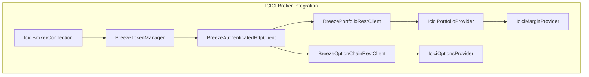
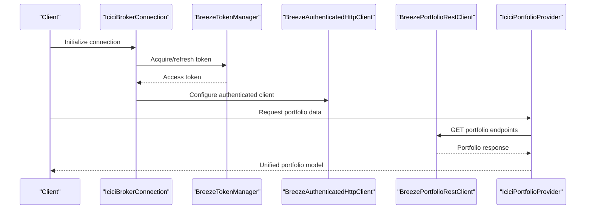
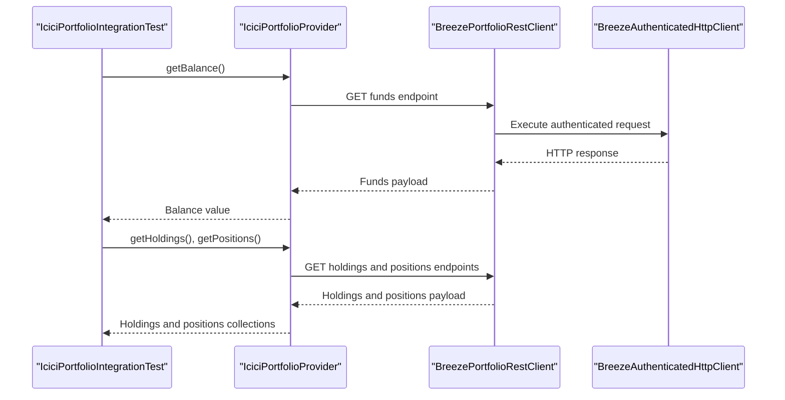
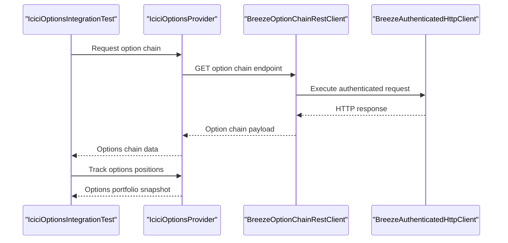
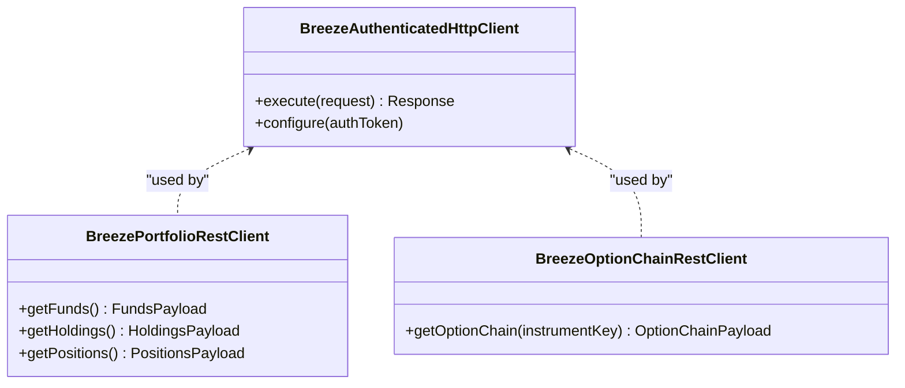
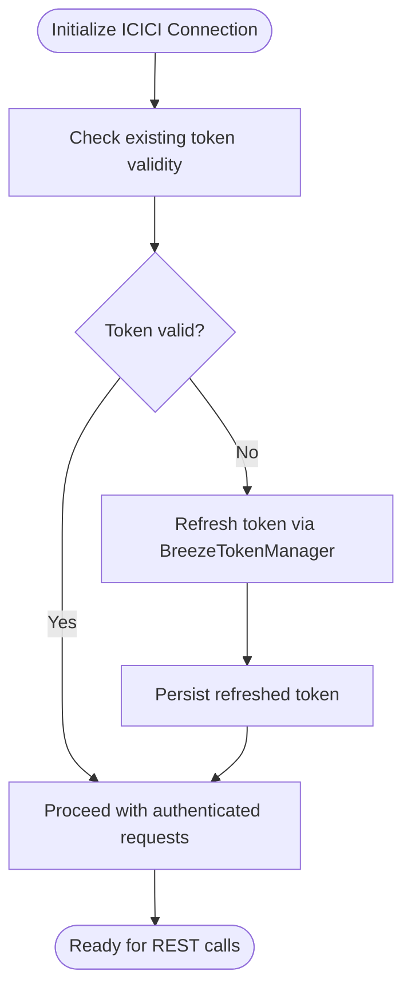
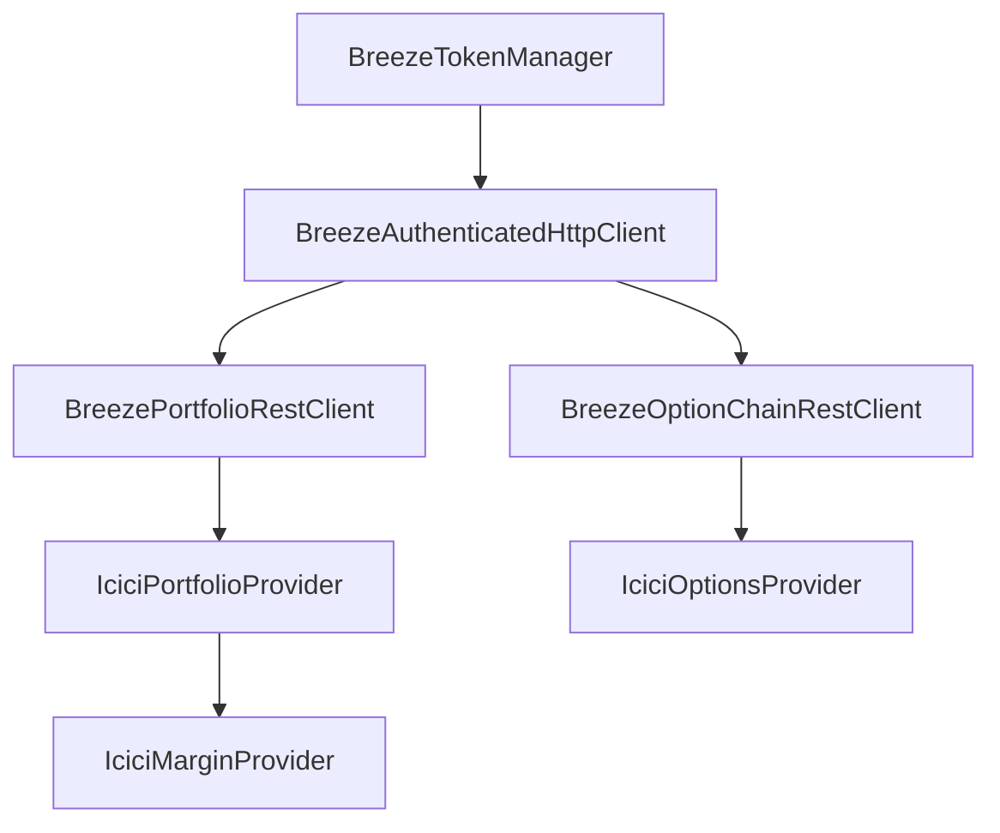

# Portfolio Management and Margin Handling

<cite>
**Referenced Files in This Document**
- [IciciPortfolioProvider.java](file://broker/icici/src/main/java/com/tradej/broker/icici/adapter/IciciPortfolioProvider.java)
- [IciciMarginProvider.java](file://broker/icici/src/main/java/com/tradej/broker/icici/adapter/IciciMarginProvider.java)
- [IciciOptionsProvider.java](file://broker/icici/src/main/java/com/tradej/broker/icici/adapter/IciciOptionsProvider.java)
- [BreezePortfolioRestClient.java](file://broker/icici/src/main/java/com/tradej/broker/icici/rest/BreezePortfolioRestClient.java)
- [BreezeOptionChainRestClient.java](file://broker/icici/src/main/java/com/tradej/broker/icici/rest/BreezeOptionChainRestClient.java)
- [BreezeAuthenticatedHttpClient.java](file://broker/icici/src/main/java/com/tradej/broker/icici/http/BreezeAuthenticatedHttpClient.java)
- [BreezeTokenManager.java](file://broker/icici/src/main/java/com/tradej/broker/icici/auth/BreezeTokenManager.java)
- [BreezeApiEndpoints.java](file://broker/icici/src/main/java/com/tradej/broker/icici/constants/BreezeApiEndpoints.java)
- [IciciPortfolioIntegrationTest.java](file://app/src/test/java/com/tradej/app/integration/IciciPortfolioIntegrationTest.java)
- [IciciBrokerConnection.java](file://broker/icici/src/main/java/com/tradej/broker/icici/IciciBrokerConnection.java)
</cite>

## Table of Contents
1. [Introduction](#introduction)
2. [Project Structure](#project-structure)
3. [Core Components](#core-components)
4. [Architecture Overview](#architecture-overview)
5. [Detailed Component Analysis](#detailed-component-analysis)
6. [Dependency Analysis](#dependency-analysis)
7. [Performance Considerations](#performance-considerations)
8. [Troubleshooting Guide](#troubleshooting-guide)
9. [Conclusion](#conclusion)

## Introduction
This document provides comprehensive documentation for ICICI Direct portfolio and margin management capabilities within the Trade-J brokerage integration. It explains the portfolio provider implementation for retrieving account holdings, positions, and unrealized gains/losses, documents margin calculation and availability through the margin provider adapter, covers option chain retrieval and options portfolio tracking, and details the REST client implementations for portfolio data access and update mechanisms. Practical examples demonstrate portfolio queries, margin calculations, and position monitoring, while acknowledging current limitations compared to other broker integrations and providing guidance for optimal portfolio management workflows.

## Project Structure
The ICICI Direct integration follows a modular architecture with dedicated components for authentication, HTTP communication, REST clients, domain mapping, and provider adapters. Key areas include:
- Authentication and session management via token-based flows
- REST clients for portfolio and options data retrieval
- Provider adapters implementing portfolio, margin, and options capabilities
- Domain mappers for translating broker-specific responses to unified models

**Diagram sources**
- [IciciBrokerConnection.java](file://broker/icici/src/main/java/com/tradej/broker/icici/IciciBrokerConnection.java)
- [BreezeTokenManager.java](file://broker/icici/src/main/java/com/tradej/broker/icici/auth/BreezeTokenManager.java)
- [BreezeAuthenticatedHttpClient.java](file://broker/icici/src/main/java/com/tradej/broker/icici/http/BreezeAuthenticatedHttpClient.java)
- [BreezePortfolioRestClient.java](file://broker/icici/src/main/java/com/tradej/broker/icici/rest/BreezePortfolioRestClient.java)
- [BreezeOptionChainRestClient.java](file://broker/icici/src/main/java/com/tradej/broker/icici/rest/BreezeOptionChainRestClient.java)
- [IciciPortfolioProvider.java](file://broker/icici/src/main/java/com/tradej/broker/icici/adapter/IciciPortfolioProvider.java)
- [IciciMarginProvider.java](file://broker/icici/src/main/java/com/tradej/broker/icici/adapter/IciciMarginProvider.java)
- [IciciOptionsProvider.java](file://broker/icici/src/main/java/com/tradej/broker/icici/adapter/IciciOptionsProvider.java)

**Section sources**
- [IciciBrokerConnection.java](file://broker/icici/src/main/java/com/tradej/broker/icici/IciciBrokerConnection.java)
- [BreezeTokenManager.java](file://broker/icici/src/main/java/com/tradej/broker/icici/auth/BreezeTokenManager.java)
- [BreezeAuthenticatedHttpClient.java](file://broker/icici/src/main/java/com/tradej/broker/icici/http/BreezeAuthenticatedHttpClient.java)
- [BreezePortfolioRestClient.java](file://broker/icici/src/main/java/com/tradej/broker/icici/rest/BreezePortfolioRestClient.java)
- [BreezeOptionChainRestClient.java](file://broker/icici/src/main/java/com/tradej/broker/icici/rest/BreezeOptionChainRestClient.java)
- [IciciPortfolioProvider.java](file://broker/icici/src/main/java/com/tradej/broker/icici/adapter/IciciPortfolioProvider.java)
- [IciciMarginProvider.java](file://broker/icici/src/main/java/com/tradej/broker/icici/adapter/IciciMarginProvider.java)
- [IciciOptionsProvider.java](file://broker/icici/src/main/java/com/tradej/broker/icici/adapter/IciciOptionsProvider.java)

## Core Components
This section outlines the primary components responsible for portfolio, margin, and options management in the ICICI Direct integration.

- Portfolio Provider: Retrieves account funds, holdings, and positions, and computes unrealized gains/losses.
- Margin Provider: Calculates available margin and maintains margin-related state.
- Options Provider: Manages option chain retrieval and options portfolio tracking.
- REST Clients: Encapsulate HTTP requests for portfolio and options data.
- Authentication and HTTP Layer: Handles token lifecycle and secure HTTP communication.

**Section sources**
- [IciciPortfolioProvider.java](file://broker/icici/src/main/java/com/tradej/broker/icici/adapter/IciciPortfolioProvider.java)
- [IciciMarginProvider.java](file://broker/icici/src/main/java/com/tradej/broker/icici/adapter/IciciMarginProvider.java)
- [IciciOptionsProvider.java](file://broker/icici/src/main/java/com/tradej/broker/icici/adapter/IciciOptionsProvider.java)
- [BreezePortfolioRestClient.java](file://broker/icici/src/main/java/com/tradej/broker/icici/rest/BreezePortfolioRestClient.java)
- [BreezeOptionChainRestClient.java](file://broker/icici/src/main/java/com/tradej/broker/icici/rest/BreezeOptionChainRestClient.java)
- [BreezeAuthenticatedHttpClient.java](file://broker/icici/src/main/java/com/tradej/broker/icici/http/BreezeAuthenticatedHttpClient.java)
- [BreezeTokenManager.java](file://broker/icici/src/main/java/com/tradej/broker/icici/auth/BreezeTokenManager.java)

## Architecture Overview
The ICICI Direct integration employs a layered architecture:
- Connection Layer: Establishes and manages the broker connection.
- Authentication Layer: Handles token acquisition, refresh, and storage.
- HTTP Layer: Provides authenticated HTTP client for REST communications.
- REST Client Layer: Implements broker-specific REST endpoints for portfolio and options.
- Provider Adapter Layer: Translates REST responses into unified portfolio, margin, and options models.
- Domain Mapping: Converts broker-specific identifiers and segments to internal models.

**Diagram sources**
- [IciciBrokerConnection.java](file://broker/icici/src/main/java/com/tradej/broker/icici/IciciBrokerConnection.java)
- [BreezeTokenManager.java](file://broker/icici/src/main/java/com/tradej/broker/icici/auth/BreezeTokenManager.java)
- [BreezeAuthenticatedHttpClient.java](file://broker/icici/src/main/java/com/tradej/broker/icici/http/BreezeAuthenticatedHttpClient.java)
- [BreezePortfolioRestClient.java](file://broker/icici/src/main/java/com/tradej/broker/icici/rest/BreezePortfolioRestClient.java)
- [IciciPortfolioProvider.java](file://broker/icici/src/main/java/com/tradej/broker/icici/adapter/IciciPortfolioProvider.java)

## Detailed Component Analysis

### Portfolio Provider Implementation
The portfolio provider retrieves account funds, holdings, and positions, and computes unrealized gains/losses. Integration tests validate fund balance retrieval and confirm holdings/positions availability.

Key responsibilities:
- Fetch account balance (cash component)
- Retrieve equity and commodity holdings
- Retrieve futures and options positions
- Compute unrealized P&L across asset classes
- Expose consolidated portfolio state for downstream systems

**Diagram sources**
- [IciciPortfolioIntegrationTest.java](file://app/src/test/java/com/tradej/app/integration/IciciPortfolioIntegrationTest.java)
- [IciciPortfolioProvider.java](file://broker/icici/src/main/java/com/tradej/broker/icici/adapter/IciciPortfolioProvider.java)
- [BreezePortfolioRestClient.java](file://broker/icici/src/main/java/com/tradej/broker/icici/rest/BreezePortfolioRestClient.java)
- [BreezeAuthenticatedHttpClient.java](file://broker/icici/src/main/java/com/tradej/broker/icici/http/BreezeAuthenticatedHttpClient.java)

Practical examples (from integration tests):
- Fund balance retrieval validates non-negative cash balances.
- Holdings and positions retrieval confirms availability of portfolio data.

**Section sources**
- [IciciPortfolioIntegrationTest.java](file://app/src/test/java/com/tradej/app/integration/IciciPortfolioIntegrationTest.java)
- [IciciPortfolioProvider.java](file://broker/icici/src/main/java/com/tradej/broker/icici/adapter/IciciPortfolioProvider.java)
- [BreezePortfolioRestClient.java](file://broker/icici/src/main/java/com/tradej/broker/icici/rest/BreezePortfolioRestClient.java)

### Margin Provider Implementation
The margin provider adapter encapsulates margin calculation and availability logic. It consumes margin-related data from the broker and exposes unified margin state for risk enforcement and order placement.

Responsibilities:
- Retrieve margin summary and limits
- Track used and available margins
- Support margin-aware order validation
- Integrate with risk enforcement workflows

Note: The margin provider leverages the authenticated HTTP client and broker endpoints configured through the connection layer.

**Section sources**
- [IciciMarginProvider.java](file://broker/icici/src/main/java/com/tradej/broker/icici/adapter/IciciMarginProvider.java)
- [BreezeAuthenticatedHttpClient.java](file://broker/icici/src/main/java/com/tradej/broker/icici/http/BreezeAuthenticatedHttpClient.java)

### Options Provider and Option Chain Retrieval
The options provider manages option chain retrieval and options portfolio tracking. It integrates with the options REST client to fetch strike prices, expirations, and Greeks, and maintains options positions for P&L computation.

**Diagram sources**
- [IciciOptionsProvider.java](file://broker/icici/src/main/java/com/tradej/broker/icici/adapter/IciciOptionsProvider.java)
- [BreezeOptionChainRestClient.java](file://broker/icici/src/main/java/com/tradej/broker/icici/rest/BreezeOptionChainRestClient.java)
- [BreezeAuthenticatedHttpClient.java](file://broker/icici/src/main/java/com/tradej/broker/icici/http/BreezeAuthenticatedHttpClient.java)

**Section sources**
- [IciciOptionsProvider.java](file://broker/icici/src/main/java/com/tradej/broker/icici/adapter/IciciOptionsProvider.java)
- [BreezeOptionChainRestClient.java](file://broker/icici/src/main/java/com/tradej/broker/icici/rest/BreezeOptionChainRestClient.java)

### REST Client Implementations
REST clients abstract broker-specific HTTP interactions for portfolio and options data.

Portfolio REST Client:
- Executes authenticated requests for funds, holdings, and positions
- Parses responses into domain models
- Integrates with retry and resilience strategies

Options REST Client:
- Retrieves option chain data including strikes and expirations
- Supports filtering and pagination where applicable
- Returns structured payloads for options provider consumption

**Diagram sources**
- [BreezeAuthenticatedHttpClient.java](file://broker/icici/src/main/java/com/tradej/broker/icici/http/BreezeAuthenticatedHttpClient.java)
- [BreezePortfolioRestClient.java](file://broker/icici/src/main/java/com/tradej/broker/icici/rest/BreezePortfolioRestClient.java)
- [BreezeOptionChainRestClient.java](file://broker/icici/src/main/java/com/tradej/broker/icici/rest/BreezeOptionChainRestClient.java)

**Section sources**
- [BreezeAuthenticatedHttpClient.java](file://broker/icici/src/main/java/com/tradej/broker/icici/http/BreezeAuthenticatedHttpClient.java)
- [BreezePortfolioRestClient.java](file://broker/icici/src/main/java/com/tradej/broker/icici/rest/BreezePortfolioRestClient.java)
- [BreezeOptionChainRestClient.java](file://broker/icici/src/main/java/com/tradej/broker/icici/rest/BreezeOptionChainRestClient.java)

### Authentication and Token Management
The integration relies on a token manager to acquire and refresh access tokens, ensuring authenticated requests to broker endpoints. The authenticated HTTP client applies tokens to outgoing requests.

**Diagram sources**
- [BreezeTokenManager.java](file://broker/icici/src/main/java/com/tradej/broker/icici/auth/BreezeTokenManager.java)
- [BreezeAuthenticatedHttpClient.java](file://broker/icici/src/main/java/com/tradej/broker/icici/http/BreezeAuthenticatedHttpClient.java)

**Section sources**
- [BreezeTokenManager.java](file://broker/icici/src/main/java/com/tradej/broker/icici/auth/BreezeTokenManager.java)
- [BreezeAuthenticatedHttpClient.java](file://broker/icici/src/main/java/com/tradej/broker/icici/http/BreezeAuthenticatedHttpClient.java)

## Dependency Analysis
The ICICI integration exhibits clear layering with low coupling between components. Providers depend on REST clients, which depend on the authenticated HTTP client. The token manager is central to authentication flow and is consumed by the HTTP client.

**Diagram sources**
- [BreezeTokenManager.java](file://broker/icici/src/main/java/com/tradej/broker/icici/auth/BreezeTokenManager.java)
- [BreezeAuthenticatedHttpClient.java](file://broker/icici/src/main/java/com/tradej/broker/icici/http/BreezeAuthenticatedHttpClient.java)
- [BreezePortfolioRestClient.java](file://broker/icici/src/main/java/com/tradej/broker/icici/rest/BreezePortfolioRestClient.java)
- [BreezeOptionChainRestClient.java](file://broker/icici/src/main/java/com/tradej/broker/icici/rest/BreezeOptionChainRestClient.java)
- [IciciPortfolioProvider.java](file://broker/icici/src/main/java/com/tradej/broker/icici/adapter/IciciPortfolioProvider.java)
- [IciciMarginProvider.java](file://broker/icici/src/main/java/com/tradej/broker/icici/adapter/IciciMarginProvider.java)
- [IciciOptionsProvider.java](file://broker/icici/src/main/java/com/tradej/broker/icici/adapter/IciciOptionsProvider.java)

**Section sources**
- [BreezeTokenManager.java](file://broker/icici/src/main/java/com/tradej/broker/icici/auth/BreezeTokenManager.java)
- [BreezeAuthenticatedHttpClient.java](file://broker/icici/src/main/java/com/tradej/broker/icici/http/BreezeAuthenticatedHttpClient.java)
- [BreezePortfolioRestClient.java](file://broker/icici/src/main/java/com/tradej/broker/icici/rest/BreezePortfolioRestClient.java)
- [BreezeOptionChainRestClient.java](file://broker/icici/src/main/java/com/tradej/broker/icici/rest/BreezeOptionChainRestClient.java)
- [IciciPortfolioProvider.java](file://broker/icici/src/main/java/com/tradej/broker/icici/adapter/IciciPortfolioProvider.java)
- [IciciMarginProvider.java](file://broker/icici/src/main/java/com/tradej/broker/icici/adapter/IciciMarginProvider.java)
- [IciciOptionsProvider.java](file://broker/icici/src/main/java/com/tradej/broker/icici/adapter/IciciOptionsProvider.java)

## Performance Considerations
- Rate limiting: Apply rate limits to REST calls to avoid throttling and ensure reliable data retrieval.
- Retry and backoff: Implement resilient retry strategies for transient failures in REST responses.
- Caching: Cache frequently accessed data like option chains and instrument metadata to reduce latency.
- Batch operations: Where supported, batch requests for holdings and positions to minimize round trips.
- Token lifecycle: Minimize token refresh frequency by reusing valid tokens and refreshing proactively.

## Troubleshooting Guide
Common issues and resolutions:
- Authentication failures: Verify token validity and refresh mechanism; ensure proper token storage and retrieval.
- Network errors: Implement retry logic and circuit breaker patterns around REST calls.
- Data inconsistencies: Validate payload parsing and handle partial or missing fields gracefully.
- Endpoint errors: Confirm endpoint URLs and parameters align with broker API documentation.

Operational checks:
- Confirm connection initialization and token acquisition succeed before invoking REST clients.
- Validate that REST responses are parsed into expected domain models.
- Monitor error rates and implement logging for failed requests.

**Section sources**
- [BreezeTokenManager.java](file://broker/icici/src/main/java/com/tradej/broker/icici/auth/BreezeTokenManager.java)
- [BreezeAuthenticatedHttpClient.java](file://broker/icici/src/main/java/com/tradej/broker/icici/http/BreezeAuthenticatedHttpClient.java)
- [BreezePortfolioRestClient.java](file://broker/icici/src/main/java/com/tradej/broker/icici/rest/BreezePortfolioRestClient.java)
- [BreezeOptionChainRestClient.java](file://broker/icici/src/main/java/com/tradej/broker/icici/rest/BreezeOptionChainRestClient.java)

## Conclusion
The ICICI Direct integration provides robust portfolio, margin, and options capabilities through a clean layered architecture. The portfolio provider delivers account funds, holdings, and positions with computed unrealized gains/losses, while the margin provider supports margin-aware workflows. The options provider enables option chain retrieval and options portfolio tracking. REST clients encapsulate broker-specific HTTP interactions, and the authentication layer ensures secure and reliable access. While the current implementation focuses on core portfolio and options features, enhancements such as expanded derivative coverage, advanced margin analytics, and real-time updates could further align with other broker integrations. Adopting the recommended performance and resilience strategies will improve reliability and responsiveness for portfolio management workflows.