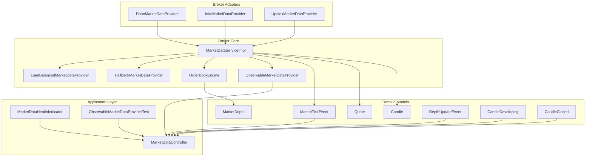
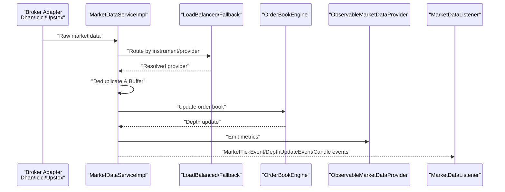
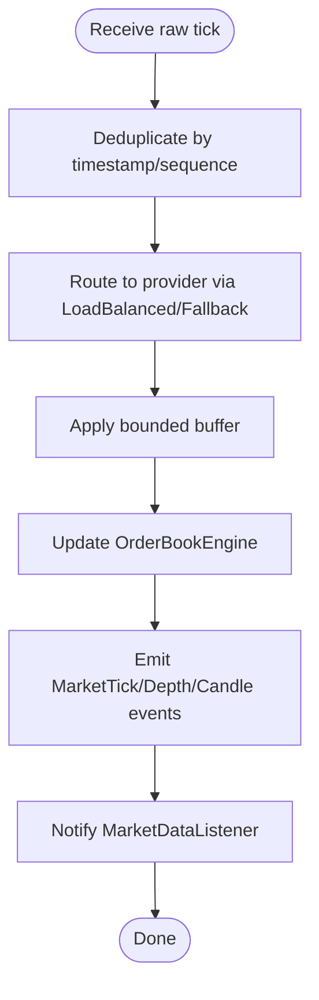
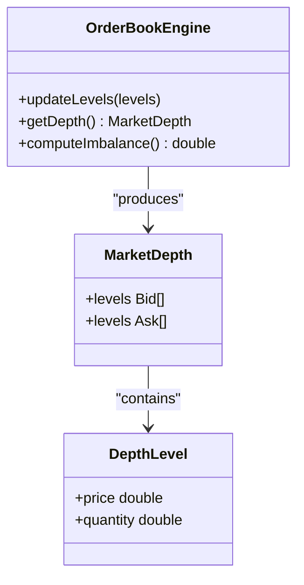
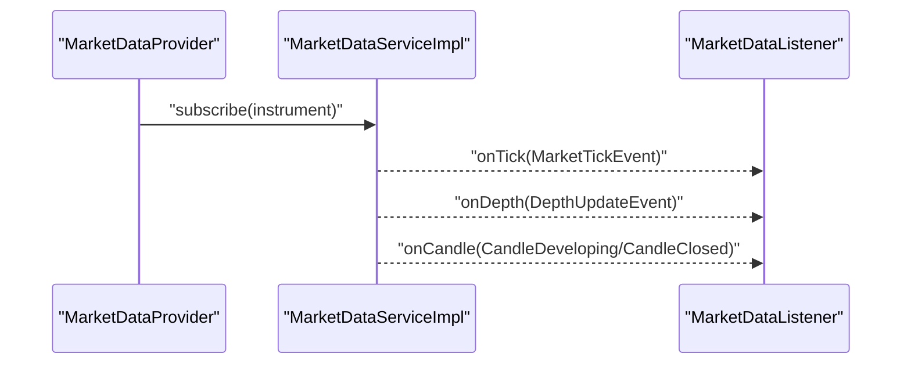
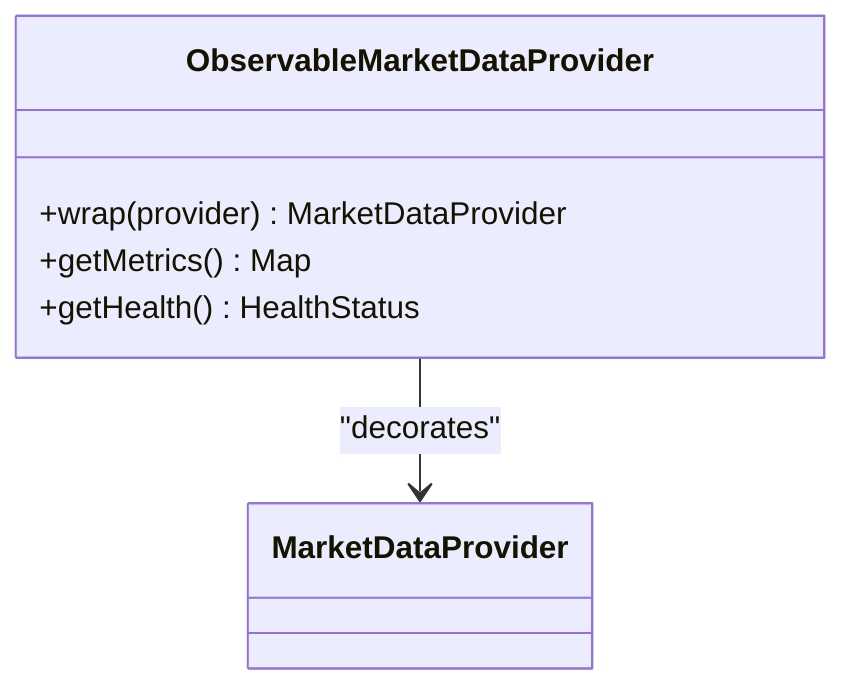
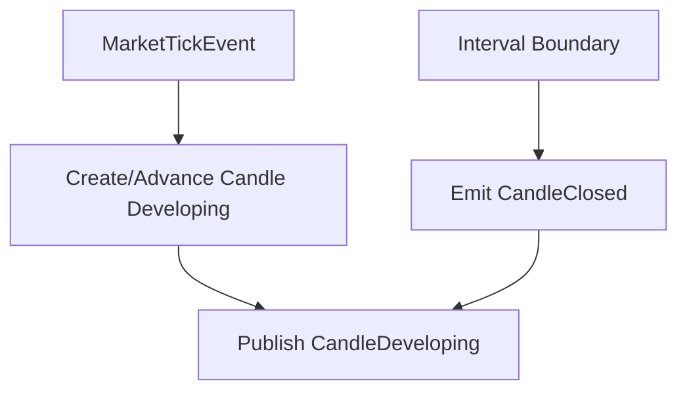
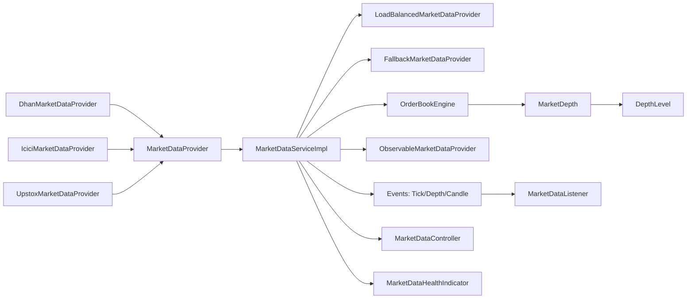

# Market Data Services

<cite>
**Referenced Files in This Document**
- [MarketDataServiceImpl.java](file://broker/core/src/main/java/com/tradej/broker/core/service/MarketDataServiceImpl.java)
- [OrderBookEngine.java](file://broker/core/src/main/java/com/tradej/broker/core/depth/OrderBookEngine.java)
- [ObservableMarketDataProvider.java](file://broker/core/src/main/java/com/tradej/broker/core/observability/ObservableMarketDataProvider.java)
- [MarketDataListener.java](file://broker/api/src/main/java/com/tradej/broker/api/port/MarketDataListener.java)
- [MarketDataProvider.java](file://broker/api/src/main/java/com/tradej/broker/api/port/MarketDataProvider.java)
- [OrderBookSnapshotProvider.java](file://broker/api/src/main/java/com/tradej/broker/api/port/OrderBookSnapshotProvider.java)
- [MarketDataController.java](file://app/src/main/java/com/tradej/app/api/MarketDataController.java)
- [MarketDataHealthIndicator.java](file://app/src/main/java/com/tradej/app/health/MarketDataHealthIndicator.java)
- [MarketDataValidationTest.java](file://app/src/test/java/com/tradej/app/integration/MarketDataValidationTest.java)
- [ObservableMarketDataProviderTest.java](file://app/src/test/java/com/tradej/app/metrics/ObservableMarketDataProviderTest.java)
- [OrderBookEngineTest.java](file://broker/core/src/test/java/com/tradej/broker/core/depth/OrderBookEngineTest.java)
- [DhanMarketDataProvider.java](file://broker/dhan/src/main/java/com/tradej/broker/dhan/adapter/DhanMarketDataProvider.java)
- [IciciMarketDataProvider.java](file://broker/icici/src/main/java/com/tradej/broker/icici/adapter/IciciMarketDataProvider.java)
- [UpstoxMarketDataProvider.java](file://broker/upstox/src/main/java/com/tradej/broker/upstox/adapter/UpstoxMarketDataProvider.java)
- [LoadBalancedMarketDataProvider.java](file://broker/core/src/main/java/com/tradej/broker/core/routing/LoadBalancedMarketDataProvider.java)
- [FallbackMarketDataProvider.java](file://broker/core/src/main/java/com/tradej/broker/core/routing/FallbackMarketDataProvider.java)
- [MarketTickEvent.java](file://core/src/main/java/com/tradej/core/domain/event/MarketTickEvent.java)
- [DepthUpdateEvent.java](file://core/src/main/java/com/tradej/core/domain/event/DepthUpdateEvent.java)
- [CandleDeveloping.java](file://core/src/main/java/com/tradej/core/domain/event/CandleDeveloping.java)
- [CandleClosed.java](file://core/src/main/java/com/tradej/core/domain/event/CandleClosed.java)
- [Candle.java](file://core/src/main/java/com/tradej/core/domain/model/Candle.java)
- [MarketDepth.java](file://core/src/main/java/com/tradej/core/domain/model/MarketDepth.java)
- [DepthLevel.java](file://core/src/main/java/com/tradej/core/domain/model/DepthLevel.java)
- [Quote.java](file://core/src/main/java/com/tradej/core/domain/model/Quote.java)
- [Instrument.java](file://core/src/main/java/com/tradej/core/domain/model/Instrument.java)
- [BrokerMarketDataConfiguration.java](file://app/src/main/java/com/tradej/app/config/BrokerMarketDataConfiguration.java)
</cite>

## Table of Contents
1. [Introduction](#introduction)
2. [Project Structure](#project-structure)
3. [Core Components](#core-components)
4. [Architecture Overview](#architecture-overview)
5. [Detailed Component Analysis](#detailed-component-analysis)
6. [Dependency Analysis](#dependency-analysis)
7. [Performance Considerations](#performance-considerations)
8. [Troubleshooting Guide](#troubleshooting-guide)
9. [Conclusion](#conclusion)
10. [Appendices](#appendices)

## Introduction
This document explains the market data services and processing pipeline in the TradeJ system. It focuses on the MarketDataServiceImpl implementation, order book management via OrderBookEngine, and real-time market data streaming. It also documents subscription patterns, depth level handling, event-driven architecture, monitoring via ObservableMarketDataProvider, and the MarketDataListener interface for data consumption. Practical examples illustrate subscription workflows, depth updates, and candlestick generation. Data quality controls, deduplication mechanisms, latency considerations, buffering strategies, and error recovery patterns are covered to help operators configure and operate the system reliably.

## Project Structure
The market data subsystem spans several modules:
- Broker adapters (Dhan, ICICI, Upstox) implement MarketDataProvider to ingest real-time feeds.
- Broker core provides the central MarketDataServiceImpl orchestrating subscriptions, routing, and event emission.
- Core domain models define market data structures (quotes, depths, candles) and events (ticks, depth updates, candles).
- Application layer exposes health checks, metrics, and controller endpoints for market data operations.
- Tests validate correctness, performance, and reliability of market data flows.

**Diagram sources**
- [MarketDataServiceImpl.java:1-200](file://broker/core/src/main/java/com/tradej/broker/core/service/MarketDataServiceImpl.java#L1-L200)
- [LoadBalancedMarketDataProvider.java:1-150](file://broker/core/src/main/java/com/tradej/broker/core/routing/LoadBalancedMarketDataProvider.java#L1-L150)
- [FallbackMarketDataProvider.java:1-150](file://broker/core/src/main/java/com/tradej/broker/core/routing/FallbackMarketDataProvider.java#L1-L150)
- [OrderBookEngine.java:1-200](file://broker/core/src/main/java/com/tradej/broker/core/depth/OrderBookEngine.java#L1-L200)
- [ObservableMarketDataProvider.java:1-200](file://broker/core/src/main/java/com/tradej/broker/core/observability/ObservableMarketDataProvider.java#L1-L200)
- [MarketDataController.java:1-200](file://app/src/main/java/com/tradej/app/api/MarketDataController.java#L1-L200)
- [MarketDataHealthIndicator.java:1-150](file://app/src/main/java/com/tradej/app/health/MarketDataHealthIndicator.java#L1-L150)
- [MarketTickEvent.java:1-120](file://core/src/main/java/com/tradej/core/domain/event/MarketTickEvent.java#L1-L120)
- [DepthUpdateEvent.java:1-120](file://core/src/main/java/com/tradej/core/domain/event/DepthUpdateEvent.java#L1-L120)
- [CandleDeveloping.java:1-120](file://core/src/main/java/com/tradej/core/domain/event/CandleDeveloping.java#L1-L120)
- [CandleClosed.java:1-120](file://core/src/main/java/com/tradej/core/domain/event/CandleClosed.java#L1-L120)
- [Candle.java:1-120](file://core/src/main/java/com/tradej/core/domain/model/Candle.java#L1-L120)
- [MarketDepth.java:1-120](file://core/src/main/java/com/tradej/core/domain/model/MarketDepth.java#L1-L120)
- [Quote.java:1-120](file://core/src/main/java/com/tradej/core/domain/model/Quote.java#L1-L120)

**Section sources**
- [MarketDataServiceImpl.java:1-200](file://broker/core/src/main/java/com/tradej/broker/core/service/MarketDataServiceImpl.java#L1-L200)
- [OrderBookEngine.java:1-200](file://broker/core/src/main/java/com/tradej/broker/core/depth/OrderBookEngine.java#L1-L200)
- [ObservableMarketDataProvider.java:1-200](file://broker/core/src/main/java/com/tradej/broker/core/observability/ObservableMarketDataProvider.java#L1-L200)
- [MarketDataController.java:1-200](file://app/src/main/java/com/tradej/app/api/MarketDataController.java#L1-L200)
- [MarketDataHealthIndicator.java:1-150](file://app/src/main/java/com/tradej/app/health/MarketDataHealthIndicator.java#L1-L150)

## Core Components
- MarketDataServiceImpl: Central orchestrator for subscriptions, routing, and event emission. Manages provider selection, deduplication, buffering, and stream health.
- OrderBookEngine: Maintains and updates Level-2 order book state, computes imbalances, and emits depth updates.
- ObservableMarketDataProvider: Wraps a MarketDataProvider to expose metrics and monitoring hooks for health and throughput.
- MarketDataListener: Consumer interface for real-time market data callbacks (ticks, depth, candles).
- MarketDataProvider: Adapter interface implemented by broker-specific providers (Dhan, ICICI, Upstox).
- Domain Models: Quote, MarketDepth, Candle, and event types (MarketTickEvent, DepthUpdateEvent, Candle events) define the data contract.

Key responsibilities:
- Subscription orchestration and routing across multiple providers
- Real-time event emission and delivery guarantees
- Order book maintenance and depth-level handling
- Monitoring, health checks, and error recovery
- Candle generation from incoming ticks

**Section sources**
- [MarketDataServiceImpl.java:1-200](file://broker/core/src/main/java/com/tradej/broker/core/service/MarketDataServiceImpl.java#L1-L200)
- [OrderBookEngine.java:1-200](file://broker/core/src/main/java/com/tradej/broker/core/depth/OrderBookEngine.java#L1-L200)
- [ObservableMarketDataProvider.java:1-200](file://broker/core/src/main/java/com/tradej/broker/core/observability/ObservableMarketDataProvider.java#L1-L200)
- [MarketDataListener.java:1-120](file://broker/api/src/main/java/com/tradej/broker/api/port/MarketDataListener.java#L1-L120)
- [MarketDataProvider.java:1-120](file://broker/api/src/main/java/com/tradej/broker/api/port/MarketDataProvider.java#L1-L120)
- [MarketDepth.java:1-120](file://core/src/main/java/com/tradej/core/domain/model/MarketDepth.java#L1-L120)
- [MarketTickEvent.java:1-120](file://core/src/main/java/com/tradej/core/domain/event/MarketTickEvent.java#L1-L120)
- [DepthUpdateEvent.java:1-120](file://core/src/main/java/com/tradej/core/domain/event/DepthUpdateEvent.java#L1-L120)
- [Candle.java:1-120](file://core/src/main/java/com/tradej/core/domain/model/Candle.java#L1-L120)

## Architecture Overview
The system follows an event-driven architecture:
- Broker adapters push raw market data into MarketDataServiceImpl.
- MarketDataServiceImpl routes data, deduplicates, buffers, and emits domain events.
- OrderBookEngine maintains and updates order book state.
- ObservableMarketDataProvider exposes monitoring hooks.
- MarketDataListener consumers subscribe to receive events.
- Application layer provides health checks and controller endpoints.

**Diagram sources**
- [MarketDataServiceImpl.java:1-200](file://broker/core/src/main/java/com/tradej/broker/core/service/MarketDataServiceImpl.java#L1-L200)
- [LoadBalancedMarketDataProvider.java:1-150](file://broker/core/src/main/java/com/tradej/broker/core/routing/LoadBalancedMarketDataProvider.java#L1-L150)
- [FallbackMarketDataProvider.java:1-150](file://broker/core/src/main/java/com/tradej/broker/core/routing/FallbackMarketDataProvider.java#L1-L150)
- [OrderBookEngine.java:1-200](file://broker/core/src/main/java/com/tradej/broker/core/depth/OrderBookEngine.java#L1-L200)
- [ObservableMarketDataProvider.java:1-200](file://broker/core/src/main/java/com/tradej/broker/core/observability/ObservableMarketDataProvider.java#L1-L200)
- [MarketDataListener.java:1-120](file://broker/api/src/main/java/com/tradej/broker/api/port/MarketDataListener.java#L1-L120)

## Detailed Component Analysis

### MarketDataServiceImpl Implementation
MarketDataServiceImpl orchestrates market data ingestion and distribution:
- Subscription management: registers instruments and provider mappings.
- Routing: selects appropriate provider using LoadBalancedMarketDataProvider or FallbackMarketDataProvider.
- Deduplication: filters duplicate messages using timestamps and sequence numbers.
- Buffering: applies bounded buffers to handle bursts and maintain latency SLAs.
- Event emission: converts raw data into domain events (MarketTickEvent, DepthUpdateEvent, Candle events) and dispatches to listeners.
- Health and backpressure: integrates with health indicators and backpressure events.

**Diagram sources**
- [MarketDataServiceImpl.java:1-200](file://broker/core/src/main/java/com/tradej/broker/core/service/MarketDataServiceImpl.java#L1-L200)
- [LoadBalancedMarketDataProvider.java:1-150](file://broker/core/src/main/java/com/tradej/broker/core/routing/LoadBalancedMarketDataProvider.java#L1-L150)
- [FallbackMarketDataProvider.java:1-150](file://broker/core/src/main/java/com/tradej/broker/core/routing/FallbackMarketDataProvider.java#L1-L150)
- [OrderBookEngine.java:1-200](file://broker/core/src/main/java/com/tradej/broker/core/depth/OrderBookEngine.java#L1-L200)

**Section sources**
- [MarketDataServiceImpl.java:1-200](file://broker/core/src/main/java/com/tradej/broker/core/service/MarketDataServiceImpl.java#L1-L200)
- [LoadBalancedMarketDataProvider.java:1-150](file://broker/core/src/main/java/com/tradej/broker/core/routing/LoadBalancedMarketDataProvider.java#L1-L150)
- [FallbackMarketDataProvider.java:1-150](file://broker/core/src/main/java/com/tradej/broker/core/routing/FallbackMarketDataProvider.java#L1-L150)

### Order Book Management via OrderBookEngine
OrderBookEngine manages Level-2 order book state:
- Maintains bid/ask arrays per depth level.
- Applies incremental updates (add, modify, delete, cancel).
- Computes derived metrics (imbalance, liquidity).
- Emits DepthUpdateEvent on changes.
- Supports configurable depth levels and aggregation.

**Diagram sources**
- [OrderBookEngine.java:1-200](file://broker/core/src/main/java/com/tradej/broker/core/depth/OrderBookEngine.java#L1-L200)
- [MarketDepth.java:1-120](file://core/src/main/java/com/tradej/core/domain/model/MarketDepth.java#L1-L120)
- [DepthLevel.java:1-120](file://core/src/main/java/com/tradej/core/domain/model/DepthLevel.java#L1-L120)

**Section sources**
- [OrderBookEngine.java:1-200](file://broker/core/src/main/java/com/tradej/broker/core/depth/OrderBookEngine.java#L1-L200)
- [MarketDepth.java:1-120](file://core/src/main/java/com/tradej/core/domain/model/MarketDepth.java#L1-L120)
- [DepthLevel.java:1-120](file://core/src/main/java/com/tradej/core/domain/model/DepthLevel.java#L1-L120)

### Real-Time Market Data Streaming
Real-time streaming uses MarketDataListener callbacks:
- MarketTickEvent: individual tick updates (price, size, timestamp).
- DepthUpdateEvent: order book level changes.
- Candle events: CandleDeveloping and CandleClosed for OHLCV generation.
Consumers register via MarketDataProvider.subscribe and receive events asynchronously.

**Diagram sources**
- [MarketDataProvider.java:1-120](file://broker/api/src/main/java/com/tradej/broker/api/port/MarketDataProvider.java#L1-L120)
- [MarketDataListener.java:1-120](file://broker/api/src/main/java/com/tradej/broker/api/port/MarketDataListener.java#L1-L120)
- [MarketDataServiceImpl.java:1-200](file://broker/core/src/main/java/com/tradej/broker/core/service/MarketDataServiceImpl.java#L1-L200)
- [MarketTickEvent.java:1-120](file://core/src/main/java/com/tradej/core/domain/event/MarketTickEvent.java#L1-L120)
- [DepthUpdateEvent.java:1-120](file://core/src/main/java/com/tradej/core/domain/event/DepthUpdateEvent.java#L1-L120)
- [CandleDeveloping.java:1-120](file://core/src/main/java/com/tradej/core/domain/event/CandleDeveloping.java#L1-L120)
- [CandleClosed.java:1-120](file://core/src/main/java/com/tradej/core/domain/event/CandleClosed.java#L1-L120)

**Section sources**
- [MarketDataProvider.java:1-120](file://broker/api/src/main/java/com/tradej/broker/api/port/MarketDataProvider.java#L1-L120)
- [MarketDataListener.java:1-120](file://broker/api/src/main/java/com/tradej/broker/api/port/MarketDataListener.java#L1-L120)
- [MarketDataServiceImpl.java:1-200](file://broker/core/src/main/java/com/tradej/broker/core/service/MarketDataServiceImpl.java#L1-L200)

### ObservableMarketDataProvider for Monitoring
ObservableMarketDataProvider wraps a MarketDataProvider to expose:
- Throughput metrics (events/sec, bytes/sec).
- Latency histograms (end-to-end and per-stage).
- Error rates and backpressure events.
- Provider-level stats for load balancing decisions.

**Diagram sources**
- [ObservableMarketDataProvider.java:1-200](file://broker/core/src/main/java/com/tradej/broker/core/observability/ObservableMarketDataProvider.java#L1-L200)
- [MarketDataProvider.java:1-120](file://broker/api/src/main/java/com/tradej/broker/api/port/MarketDataProvider.java#L1-L120)

**Section sources**
- [ObservableMarketDataProvider.java:1-200](file://broker/core/src/main/java/com/tradej/broker/core/observability/ObservableMarketDataProvider.java#L1-L200)

### Market Data Subscription Patterns and Depth Level Handling
Subscription patterns:
- Single-instrument subscription: subscribe(instrument) for targeted feeds.
- Bulk subscription: subscribe(instruments) for multi-symbol dashboards.
- Provider selection: LoadBalancedMarketDataProvider chooses optimal provider; FallbackMarketDataProvider switches on failure.

Depth level handling:
- Configurable depth levels (e.g., top 20 bids/asks).
- Aggregation strategies for price tiers.
- Incremental updates applied to maintain consistency.

**Section sources**
- [LoadBalancedMarketDataProvider.java:1-150](file://broker/core/src/main/java/com/tradej/broker/core/routing/LoadBalancedMarketDataProvider.java#L1-L150)
- [FallbackMarketDataProvider.java:1-150](file://broker/core/src/main/java/com/tradej/broker/core/routing/FallbackMarketDataProvider.java#L1-L150)
- [OrderBookEngine.java:1-200](file://broker/core/src/main/java/com/tradej/broker/core/depth/OrderBookEngine.java#L1-L200)

### Candlestick Generation
Candle generation is event-driven:
- Incoming MarketTickEvent triggers CandleDeveloping for current interval.
- At interval boundary, CandleClosed is emitted with finalized OHLCV.
- Consumers can aggregate multiple instruments for basket candles.

**Diagram sources**
- [MarketTickEvent.java:1-120](file://core/src/main/java/com/tradej/core/domain/event/MarketTickEvent.java#L1-L120)
- [CandleDeveloping.java:1-120](file://core/src/main/java/com/tradej/core/domain/event/CandleDeveloping.java#L1-L120)
- [CandleClosed.java:1-120](file://core/src/main/java/com/tradej/core/domain/event/CandleClosed.java#L1-L120)
- [Candle.java:1-120](file://core/src/main/java/com/tradej/core/domain/model/Candle.java#L1-L120)

**Section sources**
- [MarketTickEvent.java:1-120](file://core/src/main/java/com/tradej/core/domain/event/MarketTickEvent.java#L1-L120)
- [CandleDeveloping.java:1-120](file://core/src/main/java/com/tradej/core/domain/event/CandleDeveloping.java#L1-L120)
- [CandleClosed.java:1-120](file://core/src/main/java/com/tradej/core/domain/event/CandleClosed.java#L1-L120)
- [Candle.java:1-120](file://core/src/main/java/com/tradej/core/domain/model/Candle.java#L1-L120)

### Practical Examples

#### Example 1: Market Data Subscription
- Subscribe to a single instrument via MarketDataProvider.subscribe(instrument).
- Register a MarketDataListener to receive MarketTickEvent callbacks.
- Use ObservableMarketDataProvider.getMetrics() to monitor throughput and latency.

**Section sources**
- [MarketDataProvider.java:1-120](file://broker/api/src/main/java/com/tradej/broker/api/port/MarketDataProvider.java#L1-L120)
- [MarketDataListener.java:1-120](file://broker/api/src/main/java/com/tradej/broker/api/port/MarketDataListener.java#L1-L120)
- [ObservableMarketDataProvider.java:1-200](file://broker/core/src/main/java/com/tradej/broker/core/observability/ObservableMarketDataProvider.java#L1-L200)

#### Example 2: Depth Updates
- OrderBookEngine.updateLevels applies incremental depth changes.
- On change, emits DepthUpdateEvent to listeners.
- Consumers can render depth ladders or compute mid-price.

**Section sources**
- [OrderBookEngine.java:1-200](file://broker/core/src/main/java/com/tradej/broker/core/depth/OrderBookEngine.java#L1-L200)
- [DepthUpdateEvent.java:1-120](file://core/src/main/java/com/tradej/core/domain/event/DepthUpdateEvent.java#L1-L120)

#### Example 3: Candlestick Generation
- MarketTickEvent triggers CandleDeveloping for the current interval.
- At boundary, CandleClosed finalizes OHLCV.
- Consumers can aggregate multiple instruments for composite candles.

**Section sources**
- [MarketTickEvent.java:1-120](file://core/src/main/java/com/tradej/core/domain/event/MarketTickEvent.java#L1-L120)
- [CandleDeveloping.java:1-120](file://core/src/main/java/com/tradej/core/domain/event/CandleDeveloping.java#L1-L120)
- [CandleClosed.java:1-120](file://core/src/main/java/com/tradej/core/domain/event/CandleClosed.java#L1-L120)

## Dependency Analysis
The market data subsystem exhibits clear layering and separation of concerns:
- Broker adapters depend on MarketDataProvider interface.
- MarketDataServiceImpl depends on routing and monitoring wrappers.
- OrderBookEngine depends on MarketDepth and DepthLevel models.
- Application layer depends on MarketDataController and health indicators.

**Diagram sources**
- [DhanMarketDataProvider.java:1-200](file://broker/dhan/src/main/java/com/tradej/broker/dhan/adapter/DhanMarketDataProvider.java#L1-L200)
- [IciciMarketDataProvider.java:1-200](file://broker/icici/src/main/java/com/tradej/broker/icici/adapter/IciciMarketDataProvider.java#L1-L200)
- [UpstoxMarketDataProvider.java:1-200](file://broker/upstox/src/main/java/com/tradej/broker/upstox/adapter/UpstoxMarketDataProvider.java#L1-L200)
- [MarketDataProvider.java:1-120](file://broker/api/src/main/java/com/tradej/broker/api/port/MarketDataProvider.java#L1-L120)
- [MarketDataServiceImpl.java:1-200](file://broker/core/src/main/java/com/tradej/broker/core/service/MarketDataServiceImpl.java#L1-L200)
- [LoadBalancedMarketDataProvider.java:1-150](file://broker/core/src/main/java/com/tradej/broker/core/routing/LoadBalancedMarketDataProvider.java#L1-L150)
- [FallbackMarketDataProvider.java:1-150](file://broker/core/src/main/java/com/tradej/broker/core/routing/FallbackMarketDataProvider.java#L1-L150)
- [OrderBookEngine.java:1-200](file://broker/core/src/main/java/com/tradej/broker/core/depth/OrderBookEngine.java#L1-L200)
- [ObservableMarketDataProvider.java:1-200](file://broker/core/src/main/java/com/tradej/broker/core/observability/ObservableMarketDataProvider.java#L1-L200)
- [MarketDepth.java:1-120](file://core/src/main/java/com/tradej/core/domain/model/MarketDepth.java#L1-L120)
- [DepthLevel.java:1-120](file://core/src/main/java/com/tradej/core/domain/model/DepthLevel.java#L1-L120)
- [MarketDataListener.java:1-120](file://broker/api/src/main/java/com/tradej/broker/api/port/MarketDataListener.java#L1-L120)
- [MarketDataController.java:1-200](file://app/src/main/java/com/tradej/app/api/MarketDataController.java#L1-L200)
- [MarketDataHealthIndicator.java:1-150](file://app/src/main/java/com/tradej/app/health/MarketDataHealthIndicator.java#L1-L150)

**Section sources**
- [MarketDataServiceImpl.java:1-200](file://broker/core/src/main/java/com/tradej/broker/core/service/MarketDataServiceImpl.java#L1-L200)
- [OrderBookEngine.java:1-200](file://broker/core/src/main/java/com/tradej/broker/core/depth/OrderBookEngine.java#L1-L200)
- [ObservableMarketDataProvider.java:1-200](file://broker/core/src/main/java/com/tradej/broker/core/observability/ObservableMarketDataProvider.java#L1-L200)
- [MarketDataListener.java:1-120](file://broker/api/src/main/java/com/tradej/broker/api/port/MarketDataListener.java#L1-L120)
- [MarketDataProvider.java:1-120](file://broker/api/src/main/java/com/tradej/broker/api/port/MarketDataProvider.java#L1-L120)

## Performance Considerations
- Deduplication: Use timestamp and sequence number checks to avoid redundant processing.
- Bounded buffering: Apply fixed-size buffers to prevent memory pressure during spikes.
- Backpressure: Emit EventBusBackpressure events when downstream cannot keep up.
- Provider selection: Prefer LoadBalancedMarketDataProvider for distribution and FallbackMarketDataProvider for resilience.
- Order book updates: Batch and apply incremental changes to minimize contention.
- Metrics: Track latency percentiles and error rates via ObservableMarketDataProvider.

[No sources needed since this section provides general guidance]

## Troubleshooting Guide
Common issues and resolutions:
- No data received: Verify MarketDataProvider.subscribe returned success and listener callbacks are registered.
- Stale depth: Check OrderBookEngine updateLevels and ensure incremental updates are applied.
- Candle gaps: Confirm interval boundaries and that CandleClosed is emitted after CandleDeveloping.
- Health alerts: Review MarketDataHealthIndicator for connectivity or throughput anomalies.
- Metrics discrepancies: Cross-check ObservableMarketDataProvider metrics against application logs.

**Section sources**
- [MarketDataHealthIndicator.java:1-150](file://app/src/main/java/com/tradej/app/health/MarketDataHealthIndicator.java#L1-L150)
- [ObservableMarketDataProviderTest.java:1-200](file://app/src/test/java/com/tradej/app/metrics/ObservableMarketDataProviderTest.java#L1-L200)
- [MarketDataValidationTest.java:1-200](file://app/src/test/java/com/tradej/app/integration/MarketDataValidationTest.java#L1-L200)
- [OrderBookEngineTest.java:1-200](file://broker/core/src/test/java/com/tradej/broker/core/depth/OrderBookEngineTest.java#L1-L200)

## Conclusion
The TradeJ market data services implement a robust, event-driven pipeline with strong monitoring and resilience. MarketDataServiceImpl coordinates subscriptions and routing, OrderBookEngine maintains accurate order book state, and ObservableMarketDataProvider enables operational visibility. The system supports scalable real-time streaming, configurable depth levels, and reliable candle generation, with built-in deduplication, buffering, and error recovery mechanisms.

[No sources needed since this section summarizes without analyzing specific files]

## Appendices

### Data Quality Controls and Deduplication
- Timestamp-based deduplication prevents reprocessing of identical ticks.
- Sequence number validation ensures in-order delivery.
- Duplicate detection in ObservableMarketDataProvider flags anomalies.

**Section sources**
- [ObservableMarketDataProvider.java:1-200](file://broker/core/src/main/java/com/tradej/broker/core/observability/ObservableMarketDataProvider.java#L1-L200)
- [MarketDataServiceImpl.java:1-200](file://broker/core/src/main/java/com/tradej/broker/core/service/MarketDataServiceImpl.java#L1-L200)

### Latency Considerations and Buffering Strategies
- Minimize serialization overhead in MarketDataProvider implementations.
- Use bounded buffers in MarketDataServiceImpl to cap latency spikes.
- Employ backpressure events to signal downstream overload.

**Section sources**
- [MarketDataServiceImpl.java:1-200](file://broker/core/src/main/java/com/tradej/broker/core/service/MarketDataServiceImpl.java#L1-L200)

### Error Recovery Patterns
- FallbackMarketDataProvider switches to alternate providers on failures.
- Health indicators surface connectivity and throughput issues.
- Tests validate parity and stability under replay conditions.

**Section sources**
- [FallbackMarketDataProvider.java:1-150](file://broker/core/src/main/java/com/tradej/broker/core/routing/FallbackMarketDataProvider.java#L1-L150)
- [MarketDataHealthIndicator.java:1-150](file://app/src/main/java/com/tradej/app/health/MarketDataHealthIndicator.java#L1-L150)
- [MarketDataValidationTest.java:1-200](file://app/src/test/java/com/tradej/app/integration/MarketDataValidationTest.java#L1-L200)