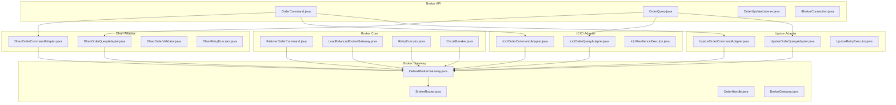
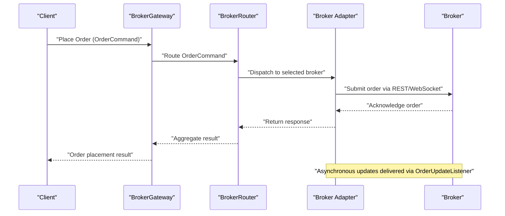
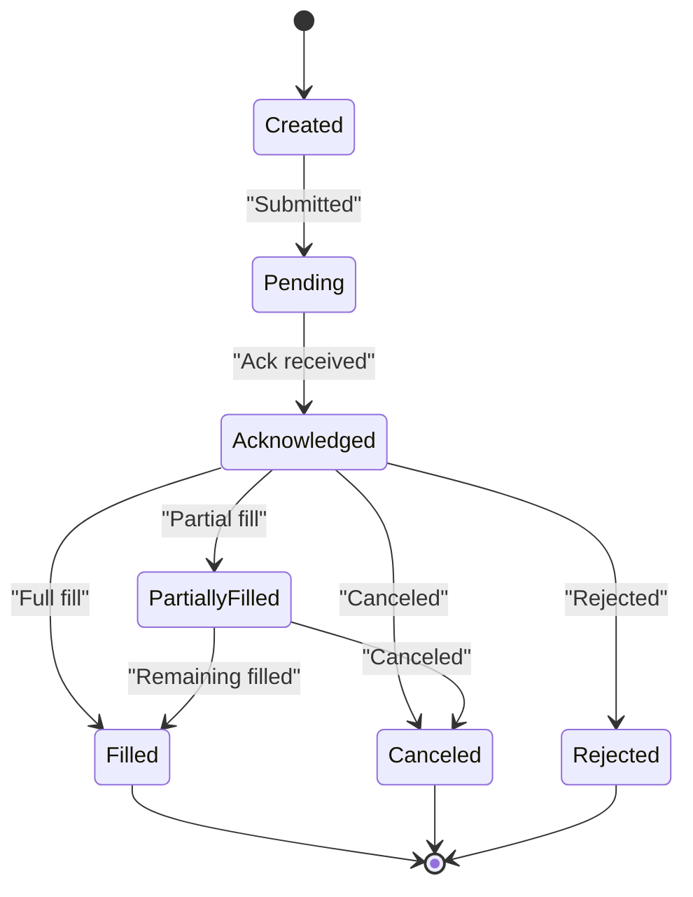
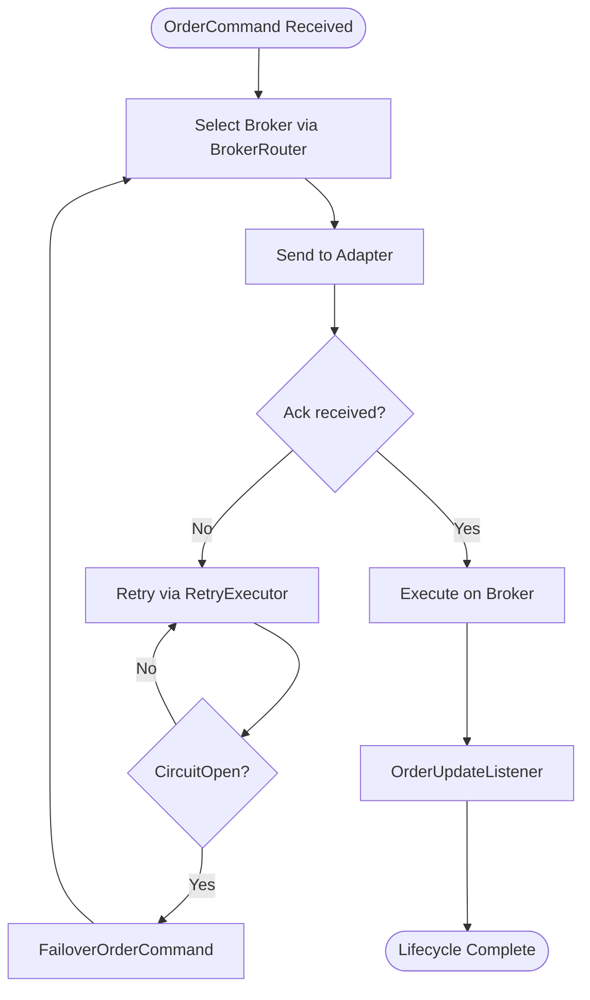
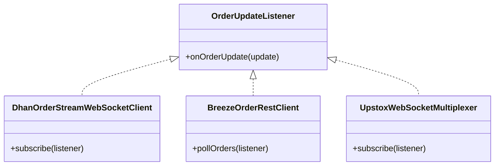
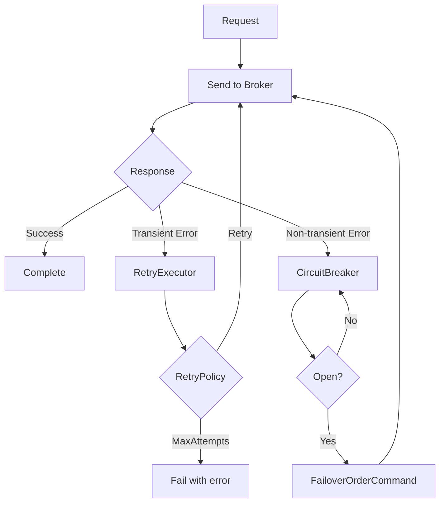
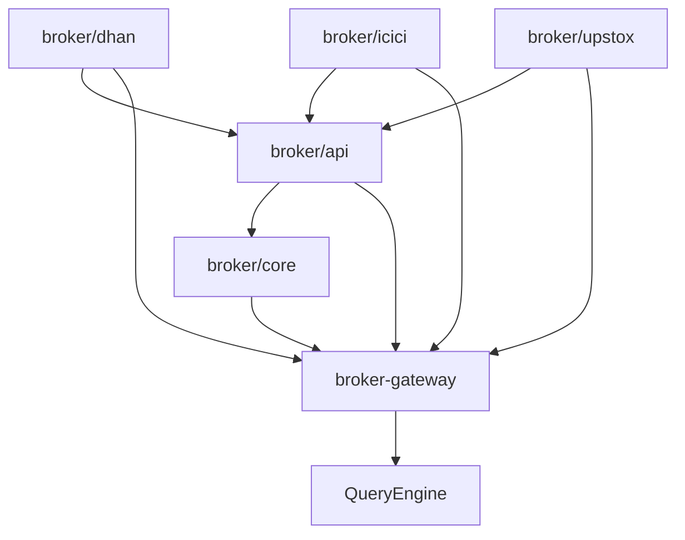

# Order Management Services

<cite>
**Referenced Files in This Document**
- [OrderCommand.java](file://broker/api/src/main/java/com/tradej/broker/api/port/OrderCommand.java)
- [OrderQuery.java](file://broker/api/src/main/java/com/tradej/broker/api/port/OrderQuery.java)
- [OrderUpdateListener.java](file://broker/api/src/main/java/com/tradej/broker/api/port/OrderUpdateListener.java)
- [IBrokerConnection.java](file://broker/api/src/main/java/com/tradej/broker/api/IBrokerConnection.java)
- [FailoverOrderCommand.java](file://broker/core/src/main/java/com/tradej/broker/core/routing/FailoverOrderCommand.java)
- [LoadBalancedBrokerGateway.java](file://broker/core/src/main/java/com/tradej/broker/core/routing/LoadBalancedBrokerGateway.java)
- [BrokerRouter.java](file://broker-gateway/src/main/java/com/tradej/brokergateway/BrokerRouter.java)
- [OrderHandle.java](file://broker-gateway/src/main/java/com/tradej/brokergateway/OrderHandle.java)
- [DhanOrderCommandAdapter.java](file://broker/dhan/src/main/java/com/tradej/broker/dhan/adapter/DhanOrderCommandAdapter.java)
- [DhanOrderQueryAdapter.java](file://broker/dhan/src/main/java/com/tradej/broker/dhan/adapter/DhanOrderQueryAdapter.java)
- [IciciOrderCommandAdapter.java](file://broker/icici/src/main/java/com/tradej/broker/icici/adapter/IciciOrderCommandAdapter.java)
- [IciciOrderQueryAdapter.java](file://broker/icici/src/main/java/com/tradej/broker/icici/adapter/IciciOrderQueryAdapter.java)
- [UpstoxOrderCommandAdapter.java](file://broker/upstox/src/main/java/com/tradej/broker/upstox/adapter/UpstoxOrderCommandAdapter.java)
- [UpstoxOrderQueryAdapter.java](file://broker/upstox/src/main/java/com/tradej/broker/upstox/adapter/UpstoxOrderQueryAdapter.java)
- [DhanOrderValidator.java](file://broker/dhan/src/main/java/com/tradej/broker/dhan/validator/DhanOrderValidator.java)
- [DhanRetryExecutor.java](file://broker/dhan/src/main/java/com/tradej/broker/dhan/resilience/DhanRetryExecutor.java)
- [IciciResilienceExecutor.java](file://broker/icici/src/main/java/com/tradej/broker/icici/resilience/IciciResilienceExecutor.java)
- [UpstoxRetryExecutor.java](file://broker/upstox/src/main/java/com/tradej/broker/upstox/resilience/UpstoxRetryExecutor.java)
- [ObservableOrderCommand.java](file://broker/core/src/main/java/com/tradej/broker/core/observability/ObservableOrderCommand.java)
- [DefaultTokenLifecycleService.java](file://broker/core/src/main/java/com/tradej/broker/core/auth/DefaultTokenLifecycleService.java)
- [TokenLifecycleService.java](file://broker/api/src/main/java/com/tradej/broker/api/auth/TokenLifecycleService.java)
- [BrokerErrorCategory.java](file://broker/api/src/main/java/com/tradej/broker/api/resilience/BrokerErrorCategory.java)
- [RetryPolicy.java](file://broker/core/src/main/java/com/tradej/broker/core/resilience/RetryPolicy.java)
- [RetryExecutor.java](file://broker/core/src/main/java/com/tradej/broker/core/resilience/RetryExecutor.java)
- [CircuitBreaker.java](file://broker/core/src/main/java/com/tradej/broker/core/resilience/CircuitBreaker.java)
- [CircuitBreakerConfig.java](file://broker/core/src/main/java/com/tradej/broker/core/resilience/CircuitBreakerConfig.java)
- [BackoffStrategy.java](file://broker/core/src/main/java/com/tradej/broker/core/resilience/BackoffStrategy.java)
- [MultiBucketRateLimiter.java](file://broker/core/src/main/java/com/tradej/broker/core/rate/MultiBucketRateLimiter.java)
- [RateLimitConfig.java](file://broker/core/src/main/java/com/tradej/broker/core/rate/RateLimitConfig.java)
- [TokenBucketRateLimiter.java](file://broker/core/src/main/java/com/tradej/broker/core/rate/TokenBucketRateLimiter.java)
- [DuckDbQueryEngine.java](file://broker-gateway/src/main/java/com/tradej/brokergateway/query/DuckDbQueryEngine.java)
- [QueryEngine.java](file://broker-gateway/src/main/java/com/tradej/brokergateway/query/QueryEngine.java)
- [QueryResult.java](file://broker-gateway/src/main/java/com/tradej/brokergateway/query/QueryResult.java)
- [DuckDbQueryEngine.java](file://broker-gateway/src/main/java/com/tradej/brokergateway/query/DuckDbQueryEngine.java)
- [MarketDatasource.java](file://broker-gateway/src/main/java/com/tradej/brokergateway/query/MarketDatasource.java)
- [OptionAnalytics.java](file://broker-gateway/src/main/java/com/tradej/brokergateway/query/OptionAnalytics.java)
- [QueryMetrics.java](file://broker-gateway/src/main/java/com/tradej/brokergateway/query/QueryMetrics.java)
- [BrokerExplorer.java](file://broker-gateway/src/main/java/com/tradej/brokergateway/explorer/BrokerExplorer.java)
- [BrokerInspector.java](file://broker-gateway/src/main/java/com/tradej/brokergateway/explorer/BrokerInspector.java)
- [DefaultBrokerInspector.java](file://broker-gateway/src/main/java/com/tradej/brokergateway/explorer/DefaultBrokerInspector.java)
- [BrokerCertification.java](file://broker-gateway/src/main/java/com/tradej/brokergateway/certification/BrokerCertification.java)
- [CertificationReport.java](file://broker-gateway/src/main/java/com/tradej/brokergateway/certification/CertificationReport.java)
- [CertificationStatus.java](file://broker-gateway/src/main/java/com/tradej/brokergateway/certification/CertificationStatus.java)
- [CertificationArtifact.java](file://broker-gateway/src/main/java/com/tradej/brokergateway/certification/CertificationArtifact.java)
- [CertificationArtifactStore.java](file://broker-gateway/src/main/java/com/tradej/brokergateway/certification/CertificationArtifactStore.java)
- [CertificationCheck.java](file://broker-gateway/src/main/java/com/tradej/brokergateway/certification/CertificationCheck.java)
- [BrokerHandle.java](file://broker-gateway/src/main/java/com/tradej/brokergateway/BrokerHandle.java)
- [MarketDataHandle.java](file://broker-gateway/src/main/java/com/tradej/brokergateway/MarketDataHandle.java)
- [PortfolioHandle.java](file://broker-gateway/src/main/java/com/tradej/brokergateway/PortfolioHandle.java)
- [OptionsHandle.java](file://broker-gateway/src/main/java/com/tradej/brokergateway/OptionsHandle.java)
- [HistoricalRequest.java](file://broker-gateway/src/main/java/com/tradej/brokergateway/HistoricalRequest.java)
- [BrokerGateway.java](file://broker-gateway/src/main/java/com/tradej/brokergateway/BrokerGateway.java)
- [DefaultBrokerGateway.java](file://broker-gateway/src/main/java/com/tradej/brokergateway/DefaultBrokerGateway.java)
- [BaseBrokerHandle.java](file://broker-gateway/src/main/java/com/tradej/brokergateway/BaseBrokerHandle.java)
- [BrokerProvider.java](file://broker-gateway/src/main/java/com/tradej/brokergateway/spi/BrokerProvider.java)
- [BrokerRegistry.java](file://broker-gateway/src/main/java/com/tradej/brokergateway/spi/BrokerRegistry.java)
- [DefaultBrokerRegistry.java](file://broker-gateway/src/main/java/com/tradej/brokergateway/spi/DefaultBrokerRegistry.java)
- [ServiceLoaderBrokerRegistry.java](file://broker-gateway/src/main/java/com/tradej/brokergateway/spi/ServiceLoaderBrokerRegistry.java)
- [BrokerDescriptor.java](file://broker-gateway/src/main/java/com/tradej/brokergateway/spi/BrokerDescriptor.java)
- [BrokerExtras.java](file://broker-gateway/src/main/java/com/tradej/brokergateway/spi/BrokerExtras.java)
- [BrokerHealthCheck.java](file://broker-gateway/src/main/java/com/tradej/brokergateway/spi/BrokerHealthCheck.java)
- [IciciBrokerProvider.java](file://broker-gateway/src/main/java/com/tradej/brokergateway/spi/impl/IciciBrokerProvider.java)
- [UpstoxBrokerProvider.java](file://broker-gateway/src/main/java/com/tradej/brokergateway/spi/impl/UpstoxBrokerProvider.java)
- [DhanBrokerProvider.java](file://broker-gateway/src/main/java/com/tradej/brokergateway/spi/impl/DhanBrokerProvider.java)
- [IciciExtras.java](file://broker-gateway/src/main/java/com/tradej/brokergateway/spi/impl/IciciExtras.java)
- [UpstoxExtras.java](file://broker-gateway/src/main/java/com/tradej/brokergateway/spi/impl/UpstoxExtras.java)
- [DhanExtras.java](file://broker-gateway/src/main/java/com/tradej/brokergateway/spi/impl/DhanExtras.java)
- [IciciHealthCheck.java](file://broker-gateway/src/main/java/com/tradej/brokergateway/spi/impl/IciciHealthCheck.java)
- [UpstoxHealthCheck.java](file://broker-gateway/src/main/java/com/tradej/brokergateway/spi/impl/UpstoxHealthCheck.java)
- [DhanHealthCheck.java](file://broker-gateway/src/main/java/com/tradej/brokergateway/spi/impl/DhanHealthCheck.java)
- [BrokerStartupContributor.java](file://broker/api/src/main/java/com/tradej/broker/api/startup/BrokerStartupContributor.java)
- [BrokerLifecycleManager.java](file://broker/core/src/main/java/com/tradej/broker/core/startup/BrokerLifecycleManager.java)
- [BrokerStartupValidator.java](file://broker/core/src/main/java/com/tradej/broker/core/startup/BrokerStartupValidator.java)
- [BrokerExplorerTest.java](file://broker-gateway/src/test/java/com/tradej/brokergateway/BrokerExplorerTest.java)
- [BrokerGatewayTest.java](file://broker-gateway/src/test/java/com/tradej/brokergateway/BrokerGatewayTest.java)
- [BrokerRouterTest.java](file://broker-gateway/src/test/java/com/tradej/brokergateway/BrokerRouterTest.java)
- [DhanOrderLifecycleIntegrationTest.java](file://app/src/test/java/com/tradej/app/integration/DhanOrderLifecycleIntegrationTest.java)
- [DhanOrderModifyIntegrationTest.java](file://app/src/test/java/com/tradej/app/integration/DhanOrderModifyIntegrationTest.java)
- [DhanOrderQueryIntegrationTest.java](file://app/src/test/java/com/tradej/app/integration/DhanOrderQueryIntegrationTest.java)
- [IciciOrderLifecycleIntegrationTest.java](file://app/src/test/java/com/tradej/app/integration/IciciOrderLifecycleIntegrationTest.java)
- [UpstoxOrderLifecycleIntegrationTest.java](file://app/src/test/java/com/tradej/app/integration/UpstoxOrderLifecycleIntegrationTest.java)
- [OrderReplayIntegrationTest.java](file://app/src/test/java/com/tradej/app/integration/OrderReplayIntegrationTest.java)
- [OrderPartiallyFilledHotPathComponentTest.java](file://app/src/test/java/com/tradej/app/integration/OrderPartiallyFilledHotPathComponentTest.java)
- [OrderControllerComponentTest.java](file://app/src/test/java/com/tradej/app/api/OrderControllerComponentTest.java)
- [ObservableOrderCommandTest.java](file://app/src/test/java/com/tradej/app/metrics/ObservableOrderCommandTest.java)
</cite>

## Table of Contents
1. [Introduction](#introduction)
2. [Project Structure](#project-structure)
3. [Core Components](#core-components)
4. [Architecture Overview](#architecture-overview)
5. [Detailed Component Analysis](#detailed-component-analysis)
6. [Dependency Analysis](#dependency-analysis)
7. [Performance Considerations](#performance-considerations)
8. [Troubleshooting Guide](#troubleshooting-guide)
9. [Conclusion](#conclusion)
10. [Appendices](#appendices)

## Introduction
This document explains order management services across multiple brokers in the system. It covers the order lifecycle from placement to completion, command processing, and query mechanisms. It documents the OrderCommand interface, OrderQuery patterns, and OrderUpdateListener implementations. It also details order routing, execution algorithms, and status tracking across broker adapters for Dhan, ICICI, and Upstox. Practical examples illustrate order placement, modification, cancellation, and querying. The guide addresses retry mechanisms, error handling strategies, idempotency patterns, order validation, broker-specific constraints, and performance optimization techniques. Guidance is provided for implementing custom order handlers and integrating with external order management systems.

## Project Structure
The order management system is organized around three primary layers:
- Broker API: Defines cross-broker abstractions for commands, queries, and listeners.
- Broker Adapters: Implementations per broker (Dhan, ICICI, Upstox) that translate API calls to broker-specific protocols.
- Broker Gateway: Provides routing, load balancing, and orchestration across broker adapters.

**Diagram sources**
- [OrderCommand.java](file://broker/api/src/main/java/com/tradej/broker/api/port/OrderCommand.java)
- [OrderQuery.java](file://broker/api/src/main/java/com/tradej/broker/api/port/OrderQuery.java)
- [OrderUpdateListener.java](file://broker/api/src/main/java/com/tradej/broker/api/port/OrderUpdateListener.java)
- [IBrokerConnection.java](file://broker/api/src/main/java/com/tradej/broker/api/IBrokerConnection.java)
- [FailoverOrderCommand.java](file://broker/core/src/main/java/com/tradej/broker/core/routing/FailoverOrderCommand.java)
- [LoadBalancedBrokerGateway.java](file://broker/core/src/main/java/com/tradej/broker/core/routing/LoadBalancedBrokerGateway.java)
- [BrokerRouter.java](file://broker-gateway/src/main/java/com/tradej/brokergateway/BrokerRouter.java)
- [OrderHandle.java](file://broker-gateway/src/main/java/com/tradej/brokergateway/OrderHandle.java)
- [DefaultBrokerGateway.java](file://broker-gateway/src/main/java/com/tradej/brokergateway/DefaultBrokerGateway.java)
- [BrokerGateway.java](file://broker-gateway/src/main/java/com/tradej/brokergateway/BrokerGateway.java)
- [DhanOrderCommandAdapter.java](file://broker/dhan/src/main/java/com/tradej/broker/dhan/adapter/DhanOrderCommandAdapter.java)
- [DhanOrderQueryAdapter.java](file://broker/dhan/src/main/java/com/tradej/broker/dhan/adapter/DhanOrderQueryAdapter.java)
- [DhanOrderValidator.java](file://broker/dhan/src/main/java/com/tradej/broker/dhan/validator/DhanOrderValidator.java)
- [DhanRetryExecutor.java](file://broker/dhan/src/main/java/com/tradej/broker/dhan/resilience/DhanRetryExecutor.java)
- [IciciOrderCommandAdapter.java](file://broker/icici/src/main/java/com/tradej/broker/icici/adapter/IciciOrderCommandAdapter.java)
- [IciciOrderQueryAdapter.java](file://broker/icici/src/main/java/com/tradej/broker/icici/adapter/IciciOrderQueryAdapter.java)
- [IciciResilienceExecutor.java](file://broker/icici/src/main/java/com/tradej/broker/icici/resilience/IciciResilienceExecutor.java)
- [UpstoxOrderCommandAdapter.java](file://broker/upstox/src/main/java/com/tradej/broker/upstox/adapter/UpstoxOrderCommandAdapter.java)
- [UpstoxOrderQueryAdapter.java](file://broker/upstox/src/main/java/com/tradej/broker/upstox/adapter/UpstoxOrderQueryAdapter.java)
- [UpstoxRetryExecutor.java](file://broker/upstox/src/main/java/com/tradej/broker/upstox/resilience/UpstoxRetryExecutor.java)

**Section sources**
- [OrderCommand.java](file://broker/api/src/main/java/com/tradej/broker/api/port/OrderCommand.java)
- [OrderQuery.java](file://broker/api/src/main/java/com/tradej/broker/api/port/OrderQuery.java)
- [OrderUpdateListener.java](file://broker/api/src/main/java/com/tradej/broker/api/port/OrderUpdateListener.java)
- [IBrokerConnection.java](file://broker/api/src/main/java/com/tradej/broker/api/IBrokerConnection.java)
- [FailoverOrderCommand.java](file://broker/core/src/main/java/com/tradej/broker/core/routing/FailoverOrderCommand.java)
- [LoadBalancedBrokerGateway.java](file://broker/core/src/main/java/com/tradej/broker/core/routing/LoadBalancedBrokerGateway.java)
- [BrokerRouter.java](file://broker-gateway/src/main/java/com/tradej/brokergateway/BrokerRouter.java)
- [OrderHandle.java](file://broker-gateway/src/main/java/com/tradej/brokergateway/OrderHandle.java)
- [DefaultBrokerGateway.java](file://broker-gateway/src/main/java/com/tradej/brokergateway/DefaultBrokerGateway.java)
- [BrokerGateway.java](file://broker-gateway/src/main/java/com/tradej/brokergateway/BrokerGateway.java)

## Core Components
This section documents the foundational interfaces and core components used to manage orders across brokers.

- OrderCommand: Defines the contract for placing, amending, and canceling orders. It encapsulates order identity, instrument, side, quantity, price, type, and optional advanced features (e.g., bracket, GTT).
- OrderQuery: Encapsulates query criteria for retrieving orders by various filters (client order ID, broker order ID, status, date range).
- OrderUpdateListener: Receives asynchronous updates on order state transitions (new, filled, canceled, rejected, modified).
- IBrokerConnection: Establishes and maintains connection state with a broker, including token lifecycle and health monitoring.

Key implementation patterns:
- Adapter pattern: Each broker adapter implements OrderCommand and OrderQuery to translate generic commands into broker-specific payloads.
- Observability: ObservableOrderCommand tracks latency and throughput for order commands.
- Resilience: RetryExecutor, CircuitBreaker, and BackoffStrategy provide robustness against transient failures.
- Routing: FailoverOrderCommand and LoadBalancedBrokerGateway enable high availability and failover.

**Section sources**
- [OrderCommand.java](file://broker/api/src/main/java/com/tradej/broker/api/port/OrderCommand.java)
- [OrderQuery.java](file://broker/api/src/main/java/com/tradej/broker/api/port/OrderQuery.java)
- [OrderUpdateListener.java](file://broker/api/src/main/java/com/tradej/broker/api/port/OrderUpdateListener.java)
- [IBrokerConnection.java](file://broker/api/src/main/java/com/tradej/broker/api/IBrokerConnection.java)
- [ObservableOrderCommand.java](file://broker/core/src/main/java/com/tradej/broker/core/observability/ObservableOrderCommand.java)
- [RetryExecutor.java](file://broker/core/src/main/java/com/tradej/broker/core/resilience/RetryExecutor.java)
- [CircuitBreaker.java](file://broker/core/src/main/java/com/tradej/broker/core/resilience/CircuitBreaker.java)
- [BackoffStrategy.java](file://broker/core/src/main/java/com/tradej/broker/core/resilience/BackoffStrategy.java)
- [FailoverOrderCommand.java](file://broker/core/src/main/java/com/tradej/broker/core/routing/FailoverOrderCommand.java)
- [LoadBalancedBrokerGateway.java](file://broker/core/src/main/java/com/tradej/broker/core/routing/LoadBalancedBrokerGateway.java)

## Architecture Overview
The order management architecture spans three layers:
- API Layer: Defines cross-broker contracts for commands, queries, and listeners.
- Adapter Layer: Implements broker-specific logic for order placement, modification, cancellation, and querying.
- Gateway Layer: Routes requests to appropriate brokers, manages load balancing, and aggregates results.

**Diagram sources**
- [BrokerGateway.java](file://broker-gateway/src/main/java/com/tradej/brokergateway/BrokerGateway.java)
- [DefaultBrokerGateway.java](file://broker-gateway/src/main/java/com/tradej/brokergateway/DefaultBrokerGateway.java)
- [BrokerRouter.java](file://broker-gateway/src/main/java/com/tradej/brokergateway/BrokerRouter.java)
- [OrderHandle.java](file://broker-gateway/src/main/java/com/tradej/brokergateway/OrderHandle.java)
- [DhanOrderCommandAdapter.java](file://broker/dhan/src/main/java/com/tradej/broker/dhan/adapter/DhanOrderCommandAdapter.java)
- [IciciOrderCommandAdapter.java](file://broker/icici/src/main/java/com/tradej/broker/icici/adapter/IciciOrderCommandAdapter.java)
- [UpstoxOrderCommandAdapter.java](file://broker/upstox/src/main/java/com/tradej/broker/upstox/adapter/UpstoxOrderCommandAdapter.java)

## Detailed Component Analysis

### OrderCommand Interface
OrderCommand defines the canonical order payload and metadata. It includes:
- Identity: client order ID, broker order ID
- Instrument: symbol, segment, exchange
- Side and Quantity: buy/sell, quantity
- Price and Type: limit/stop/stop-limit/market
- Optional fields: validity, disclosed quantity, trigger price, variety (regular, bracket, GTT, cover)
- Advanced features: bracket order parameters, GTT rules, slice order configuration

Implementation highlights:
- DhanOrderCommandAdapter translates OrderCommand into Dhan-specific payloads and enforces Dhan-specific constraints.
- IciciOrderCommandAdapter adapts to ICICI Breeze APIs with exchange-specific nuances.
- UpstoxOrderCommandAdapter maps to Upstox endpoints and handles variety-specific semantics.

Practical examples (paths):
- Place market order: [OrderCommand.java](file://broker/api/src/main/java/com/tradej/broker/api/port/OrderCommand.java)
- Place bracket order: [DhanBracketOrderAdapter.java](file://broker/dhan/src/main/java/com/tradej/broker/dhan/adapter/DhanBracketOrderAdapter.java)
- Place GTT order: [DhanGttOrderAdapter.java](file://broker/dhan/src/main/java/com/tradej/broker/dhan/adapter/DhanGttOrderAdapter.java)
- Place cover order: [DhanCoverOrderAdapter.java](file://broker/dhan/src/main/java/com/tradej/broker/dhan/adapter/DhanCoverOrderAdapter.java)

**Section sources**
- [OrderCommand.java](file://broker/api/src/main/java/com/tradej/broker/api/port/OrderCommand.java)
- [DhanOrderCommandAdapter.java](file://broker/dhan/src/main/java/com/tradej/broker/dhan/adapter/DhanOrderCommandAdapter.java)
- [IciciOrderCommandAdapter.java](file://broker/icici/src/main/java/com/tradej/broker/icici/adapter/IciciOrderCommandAdapter.java)
- [UpstoxOrderCommandAdapter.java](file://broker/upstox/src/main/java/com/tradej/broker/upstox/adapter/UpstoxOrderCommandAdapter.java)

### OrderQuery Patterns
OrderQuery enables retrieval of orders by multiple criteria:
- By client order ID
- By broker order ID
- By status (open, filled, canceled, rejected)
- By date range and instrument

Implementation highlights:
- DhanOrderQueryAdapter, IciciOrderQueryAdapter, and UpstoxOrderQueryAdapter implement broker-specific query semantics.
- QueryEngine and DuckDbQueryEngine provide backend query capabilities for historical and analytics workloads.

Practical examples (paths):
- Query by client order ID: [OrderQuery.java](file://broker/api/src/main/java/com/tradej/broker/api/port/OrderQuery.java)
- Query by status: [DuckDbQueryEngine.java](file://broker-gateway/src/main/java/com/tradej/brokergateway/query/DuckDbQueryEngine.java)
- Query historical orders: [HistoricalRequest.java](file://broker-gateway/src/main/java/com/tradej/brokergateway/HistoricalRequest.java)

**Section sources**
- [OrderQuery.java](file://broker/api/src/main/java/com/tradej/broker/api/port/OrderQuery.java)
- [DhanOrderQueryAdapter.java](file://broker/dhan/src/main/java/com/tradej/broker/dhan/adapter/DhanOrderQueryAdapter.java)
- [IciciOrderQueryAdapter.java](file://broker/icici/src/main/java/com/tradej/broker/icici/adapter/IciciOrderQueryAdapter.java)
- [UpstoxOrderQueryAdapter.java](file://broker/upstox/src/main/java/com/tradej/broker/upstox/adapter/UpstoxOrderQueryAdapter.java)
- [DuckDbQueryEngine.java](file://broker-gateway/src/main/java/com/tradej/brokergateway/query/DuckDbQueryEngine.java)
- [HistoricalRequest.java](file://broker-gateway/src/main/java/com/tradej/brokergateway/HistoricalRequest.java)

### OrderUpdateListener Implementations
OrderUpdateListener receives asynchronous order state updates:
- New, partially filled, fully filled, canceled, rejected, modified
- Broker-specific normalization and enrichment

Implementation highlights:
- Each broker adapter registers listeners to receive real-time order updates via WebSocket or REST callbacks.
- Listeners are integrated into the gateway’s routing and aggregation logic.

Practical examples (paths):
- Listener registration and update handling: [OrderUpdateListener.java](file://broker/api/src/main/java/com/tradej/broker/api/port/OrderUpdateListener.java)
- Dhan order stream listener: [DhanOrderStreamWebSocketClient.java](file://broker/dhan/src/main/java/com/tradej/broker/dhan/websocket/DhanOrderStreamWebSocketClient.java)
- ICICI order stream listener: [BreezeOrderRestClient.java](file://broker/icici/src/main/java/com/tradej/broker/icici/rest/BreezeOrderRestClient.java)
- Upstox order stream listener: [UpstoxWebSocketMultiplexer.java](file://broker/upstox/src/main/java/com/tradej/broker/upstox/websocket/UpstoxWebSocketMultiplexer.java)

**Section sources**
- [OrderUpdateListener.java](file://broker/api/src/main/java/com/tradej/broker/api/port/OrderUpdateListener.java)
- [DhanOrderStreamWebSocketClient.java](file://broker/dhan/src/main/java/com/tradej/broker/dhan/websocket/DhanOrderStreamWebSocketClient.java)
- [BreezeOrderRestClient.java](file://broker/icici/src/main/java/com/tradej/broker/icici/rest/BreezeOrderRestClient.java)
- [UpstoxWebSocketMultiplexer.java](file://broker/upstox/src/main/java/com/tradej/broker/upstox/websocket/UpstoxWebSocketMultiplexer.java)

### Order Lifecycle Management
The lifecycle spans creation, routing, execution, and completion:
- Creation: Client submits OrderCommand via BrokerGateway.
- Routing: BrokerRouter selects the appropriate broker adapter.
- Execution: Adapter sends request to broker; OrderUpdateListener receives updates.
- Completion: Final state recorded and returned to client.

**Diagram sources**
- [OrderUpdateListener.java](file://broker/api/src/main/java/com/tradej/broker/api/port/OrderUpdateListener.java)
- [DhanOrderCommandAdapter.java](file://broker/dhan/src/main/java/com/tradej/broker/dhan/adapter/DhanOrderCommandAdapter.java)
- [IciciOrderCommandAdapter.java](file://broker/icici/src/main/java/com/tradej/broker/icici/adapter/IciciOrderCommandAdapter.java)
- [UpstoxOrderCommandAdapter.java](file://broker/upstox/src/main/java/com/tradej/broker/upstox/adapter/UpstoxOrderCommandAdapter.java)

**Section sources**
- [OrderUpdateListener.java](file://broker/api/src/main/java/com/tradej/broker/api/port/OrderUpdateListener.java)
- [BrokerRouter.java](file://broker-gateway/src/main/java/com/tradej/brokergateway/BrokerRouter.java)
- [DefaultBrokerGateway.java](file://broker-gateway/src/main/java/com/tradej/brokergateway/DefaultBrokerGateway.java)

### Order Routing and Execution Algorithms
Routing and execution are handled by:
- LoadBalancedBrokerGateway: Distributes load across broker instances.
- FailoverOrderCommand: Retries failed commands on alternate brokers.
- RetryExecutor and CircuitBreaker: Manage retries and protect upstream services.
- BackoffStrategy: Exponential or jittered backoff policies.

**Diagram sources**
- [LoadBalancedBrokerGateway.java](file://broker/core/src/main/java/com/tradej/broker/core/routing/LoadBalancedBrokerGateway.java)
- [FailoverOrderCommand.java](file://broker/core/src/main/java/com/tradej/broker/core/routing/FailoverOrderCommand.java)
- [RetryExecutor.java](file://broker/core/src/main/java/com/tradej/broker/core/resilience/RetryExecutor.java)
- [CircuitBreaker.java](file://broker/core/src/main/java/com/tradej/broker/core/resilience/CircuitBreaker.java)
- [BackoffStrategy.java](file://broker/core/src/main/java/com/tradej/broker/core/resilience/BackoffStrategy.java)

**Section sources**
- [LoadBalancedBrokerGateway.java](file://broker/core/src/main/java/com/tradej/broker/core/routing/LoadBalancedBrokerGateway.java)
- [FailoverOrderCommand.java](file://broker/core/src/main/java/com/tradej/broker/core/routing/FailoverOrderCommand.java)
- [RetryExecutor.java](file://broker/core/src/main/java/com/tradej/broker/core/resilience/RetryExecutor.java)
- [CircuitBreaker.java](file://broker/core/src/main/java/com/tradej/broker/core/resilience/CircuitBreaker.java)
- [BackoffStrategy.java](file://broker/core/src/main/java/com/tradej/broker/core/resilience/BackoffStrategy.java)

### Status Tracking Across Broker Adapters
Each broker adapter normalizes order status and events:
- Dhan: Uses WebSocket order streams and REST acknowledgments.
- ICICI: REST-based order endpoints with periodic sync.
- Upstox: WebSocket multiplexing with normalized order events.

**Diagram sources**
- [OrderUpdateListener.java](file://broker/api/src/main/java/com/tradej/broker/api/port/OrderUpdateListener.java)
- [DhanOrderStreamWebSocketClient.java](file://broker/dhan/src/main/java/com/tradej/broker/dhan/websocket/DhanOrderStreamWebSocketClient.java)
- [BreezeOrderRestClient.java](file://broker/icici/src/main/java/com/tradej/broker/icici/rest/BreezeOrderRestClient.java)
- [UpstoxWebSocketMultiplexer.java](file://broker/upstox/src/main/java/com/tradej/broker/upstox/websocket/UpstoxWebSocketMultiplexer.java)

**Section sources**
- [OrderUpdateListener.java](file://broker/api/src/main/java/com/tradej/broker/api/port/OrderUpdateListener.java)
- [DhanOrderStreamWebSocketClient.java](file://broker/dhan/src/main/java/com/tradej/broker/dhan/websocket/DhanOrderStreamWebSocketClient.java)
- [BreezeOrderRestClient.java](file://broker/icici/src/main/java/com/tradej/broker/icici/rest/BreezeOrderRestClient.java)
- [UpstoxWebSocketMultiplexer.java](file://broker/upstox/src/main/java/com/tradej/broker/upstox/websocket/UpstoxWebSocketMultiplexer.java)

### Practical Examples

#### Placing an Order
Steps:
- Build OrderCommand with instrument, side, quantity, and price.
- Submit via BrokerGateway; receive acknowledgment.
- Subscribe to OrderUpdateListener for updates.

References:
- [OrderCommand.java](file://broker/api/src/main/java/com/tradej/broker/api/port/OrderCommand.java)
- [BrokerGateway.java](file://broker-gateway/src/main/java/com/tradej/brokergateway/BrokerGateway.java)
- [OrderUpdateListener.java](file://broker/api/src/main/java/com/tradej/broker/api/port/OrderUpdateListener.java)

#### Modifying an Order
Steps:
- Query current order via OrderQuery.
- Issue modified OrderCommand with adjusted quantity/price.
- Observe Modified state via OrderUpdateListener.

References:
- [OrderQuery.java](file://broker/api/src/main/java/com/tradej/broker/api/port/OrderQuery.java)
- [DhanOrderModifyIntegrationTest.java](file://app/src/test/java/com/tradej/app/integration/DhanOrderModifyIntegrationTest.java)

#### Canceling an Order
Steps:
- Issue cancel OrderCommand for the target order.
- Await Canceled state via OrderUpdateListener.

References:
- [OrderCommand.java](file://broker/api/src/main/java/com/tradej/broker/api/port/OrderCommand.java)
- [DhanOrderLifecycleIntegrationTest.java](file://app/src/test/java/com/tradej/app/integration/DhanOrderLifecycleIntegrationTest.java)

#### Querying Orders
Steps:
- Construct OrderQuery with filters.
- Execute via BrokerGateway; process QueryResult.

References:
- [OrderQuery.java](file://broker/api/src/main/java/com/tradej/broker/api/port/OrderQuery.java)
- [DuckDbQueryEngine.java](file://broker-gateway/src/main/java/com/tradej/brokergateway/query/DuckDbQueryEngine.java)
- [DuckDbQueryEngine.java](file://broker-gateway/src/main/java/com/tradej/brokergateway/query/DuckDbQueryEngine.java)

**Section sources**
- [OrderCommand.java](file://broker/api/src/main/java/com/tradej/broker/api/port/OrderCommand.java)
- [OrderQuery.java](file://broker/api/src/main/java/com/tradej/broker/api/port/OrderQuery.java)
- [OrderUpdateListener.java](file://broker/api/src/main/java/com/tradej/broker/api/port/OrderUpdateListener.java)
- [BrokerGateway.java](file://broker-gateway/src/main/java/com/tradej/brokergateway/BrokerGateway.java)
- [DuckDbQueryEngine.java](file://broker-gateway/src/main/java/com/tradej/brokergateway/query/DuckDbQueryEngine.java)
- [DhanOrderModifyIntegrationTest.java](file://app/src/test/java/com/tradej/app/integration/DhanOrderModifyIntegrationTest.java)
- [DhanOrderLifecycleIntegrationTest.java](file://app/src/test/java/com/tradej/app/integration/DhanOrderLifecycleIntegrationTest.java)

### Retry Mechanisms, Error Handling, and Idempotency
- RetryExecutor: Configurable retry with backoff strategies.
- CircuitBreaker: Opens on repeated failures to prevent cascading errors.
- BackoffStrategy: Exponential or jittered backoff.
- Idempotency: Client order ID ensures idempotent re-submissions.

**Diagram sources**
- [RetryExecutor.java](file://broker/core/src/main/java/com/tradej/broker/core/resilience/RetryExecutor.java)
- [RetryPolicy.java](file://broker/core/src/main/java/com/tradej/broker/core/resilience/RetryPolicy.java)
- [CircuitBreaker.java](file://broker/core/src/main/java/com/tradej/broker/core/resilience/CircuitBreaker.java)
- [BackoffStrategy.java](file://broker/core/src/main/java/com/tradej/broker/core/resilience/BackoffStrategy.java)
- [FailoverOrderCommand.java](file://broker/core/src/main/java/com/tradej/broker/core/routing/FailoverOrderCommand.java)

**Section sources**
- [RetryExecutor.java](file://broker/core/src/main/java/com/tradej/broker/core/resilience/RetryExecutor.java)
- [RetryPolicy.java](file://broker/core/src/main/java/com/tradej/broker/core/resilience/RetryPolicy.java)
- [CircuitBreaker.java](file://broker/core/src/main/java/com/tradej/broker/core/resilience/CircuitBreaker.java)
- [BackoffStrategy.java](file://broker/core/src/main/java/com/tradej/broker/core/resilience/BackoffStrategy.java)
- [FailoverOrderCommand.java](file://broker/core/src/main/java/com/tradej/broker/core/routing/FailoverOrderCommand.java)

### Order Validation and Broker-Specific Constraints
- DhanOrderValidator: Enforces Dhan-specific constraints (e.g., product type, validity window, minimum quantity).
- ICICI and Upstox adapters apply their own validation rules during command translation.

References:
- [DhanOrderValidator.java](file://broker/dhan/src/main/java/com/tradej/broker/dhan/validator/DhanOrderValidator.java)
- [DhanOrderCommandAdapter.java](file://broker/dhan/src/main/java/com/tradej/broker/dhan/adapter/DhanOrderCommandAdapter.java)
- [IciciOrderCommandAdapter.java](file://broker/icici/src/main/java/com/tradej/broker/icici/adapter/IciciOrderCommandAdapter.java)
- [UpstoxOrderCommandAdapter.java](file://broker/upstox/src/main/java/com/tradej/broker/upstox/adapter/UpstoxOrderCommandAdapter.java)

**Section sources**
- [DhanOrderValidator.java](file://broker/dhan/src/main/java/com/tradej/broker/dhan/validator/DhanOrderValidator.java)
- [DhanOrderCommandAdapter.java](file://broker/dhan/src/main/java/com/tradej/broker/dhan/adapter/DhanOrderCommandAdapter.java)
- [IciciOrderCommandAdapter.java](file://broker/icici/src/main/java/com/tradej/broker/icici/adapter/IciciOrderCommandAdapter.java)
- [UpstoxOrderCommandAdapter.java](file://broker/upstox/src/main/java/com/tradej/broker/upstox/adapter/UpstoxOrderCommandAdapter.java)

### Performance Optimization Techniques
- Token lifecycle management: DefaultTokenLifecycleService and TokenLifecycleService coordinate token refresh to minimize latency.
- Rate limiting: MultiBucketRateLimiter and TokenBucketRateLimiter enforce per-broker limits.
- Observability: ObservableOrderCommand tracks command latency and throughput.
- Load balancing: LoadBalancedBrokerGateway distributes traffic across brokers.

References:
- [DefaultTokenLifecycleService.java](file://broker/core/src/main/java/com/tradej/broker/core/auth/DefaultTokenLifecycleService.java)
- [TokenLifecycleService.java](file://broker/api/src/main/java/com/tradej/broker/api/auth/TokenLifecycleService.java)
- [MultiBucketRateLimiter.java](file://broker/core/src/main/java/com/tradej/broker/core/rate/MultiBucketRateLimiter.java)
- [TokenBucketRateLimiter.java](file://broker/core/src/main/java/com/tradej/broker/core/rate/TokenBucketRateLimiter.java)
- [ObservableOrderCommand.java](file://broker/core/src/main/java/com/tradej/broker/core/observability/ObservableOrderCommand.java)
- [LoadBalancedBrokerGateway.java](file://broker/core/src/main/java/com/tradej/broker/core/routing/LoadBalancedBrokerGateway.java)

**Section sources**
- [DefaultTokenLifecycleService.java](file://broker/core/src/main/java/com/tradej/broker/core/auth/DefaultTokenLifecycleService.java)
- [TokenLifecycleService.java](file://broker/api/src/main/java/com/tradej/broker/api/auth/TokenLifecycleService.java)
- [MultiBucketRateLimiter.java](file://broker/core/src/main/java/com/tradej/broker/core/rate/MultiBucketRateLimiter.java)
- [TokenBucketRateLimiter.java](file://broker/core/src/main/java/com/tradej/broker/core/rate/TokenBucketRateLimiter.java)
- [ObservableOrderCommand.java](file://broker/core/src/main/java/com/tradej/broker/core/observability/ObservableOrderCommand.java)
- [LoadBalancedBrokerGateway.java](file://broker/core/src/main/java/com/tradej/broker/core/routing/LoadBalancedBrokerGateway.java)

### Implementing Custom Order Handlers and Integrating with External Systems
- Implement OrderCommand and OrderQuery adapters for new brokers following existing patterns.
- Integrate OrderUpdateListener to consume broker-specific order streams.
- Use BrokerProvider and BrokerRegistry SPIs to register new broker integrations.
- Leverage BrokerExplorer and BrokerInspector for capability probing and certification.

References:
- [BrokerProvider.java](file://broker-gateway/src/main/java/com/tradej/brokergateway/spi/BrokerProvider.java)
- [BrokerRegistry.java](file://broker-gateway/src/main/java/com/tradej/brokergateway/spi/BrokerRegistry.java)
- [DefaultBrokerRegistry.java](file://broker-gateway/src/main/java/com/tradej/brokergateway/spi/DefaultBrokerRegistry.java)
- [ServiceLoaderBrokerRegistry.java](file://broker-gateway/src/main/java/com/tradej/brokergateway/spi/ServiceLoaderBrokerRegistry.java)
- [BrokerExplorer.java](file://broker-gateway/src/main/java/com/tradej/brokergateway/explorer/BrokerExplorer.java)
- [BrokerInspector.java](file://broker-gateway/src/main/java/com/tradej/brokergateway/explorer/BrokerInspector.java)
- [DefaultBrokerInspector.java](file://broker-gateway/src/main/java/com/tradej/brokergateway/explorer/DefaultBrokerInspector.java)

**Section sources**
- [BrokerProvider.java](file://broker-gateway/src/main/java/com/tradej/brokergateway/spi/BrokerProvider.java)
- [BrokerRegistry.java](file://broker-gateway/src/main/java/com/tradej/brokergateway/spi/BrokerRegistry.java)
- [DefaultBrokerRegistry.java](file://broker-gateway/src/main/java/com/tradej/brokergateway/spi/DefaultBrokerRegistry.java)
- [ServiceLoaderBrokerRegistry.java](file://broker-gateway/src/main/java/com/tradej/brokergateway/spi/ServiceLoaderBrokerRegistry.java)
- [BrokerExplorer.java](file://broker-gateway/src/main/java/com/tradej/brokergateway/explorer/BrokerExplorer.java)
- [BrokerInspector.java](file://broker-gateway/src/main/java/com/tradej/brokergateway/explorer/BrokerInspector.java)
- [DefaultBrokerInspector.java](file://broker-gateway/src/main/java/com/tradej/brokergateway/explorer/DefaultBrokerInspector.java)

## Dependency Analysis
The order management system exhibits layered dependencies:
- API depends on core resilience and observability.
- Adapters depend on API contracts and broker-specific clients.
- Gateway orchestrates routing and query engines.

**Diagram sources**
- [OrderCommand.java](file://broker/api/src/main/java/com/tradej/broker/api/port/OrderCommand.java)
- [OrderQuery.java](file://broker/api/src/main/java/com/tradej/broker/api/port/OrderQuery.java)
- [OrderUpdateListener.java](file://broker/api/src/main/java/com/tradej/broker/api/port/OrderUpdateListener.java)
- [BrokerGateway.java](file://broker-gateway/src/main/java/com/tradej/brokergateway/BrokerGateway.java)
- [DuckDbQueryEngine.java](file://broker-gateway/src/main/java/com/tradej/brokergateway/query/DuckDbQueryEngine.java)
- [DhanOrderCommandAdapter.java](file://broker/dhan/src/main/java/com/tradej/broker/dhan/adapter/DhanOrderCommandAdapter.java)
- [IciciOrderCommandAdapter.java](file://broker/icici/src/main/java/com/tradej/broker/icici/adapter/IciciOrderCommandAdapter.java)
- [UpstoxOrderCommandAdapter.java](file://broker/upstox/src/main/java/com/tradej/broker/upstox/adapter/UpstoxOrderCommandAdapter.java)

**Section sources**
- [OrderCommand.java](file://broker/api/src/main/java/com/tradej/broker/api/port/OrderCommand.java)
- [OrderQuery.java](file://broker/api/src/main/java/com/tradej/broker/api/port/OrderQuery.java)
- [OrderUpdateListener.java](file://broker/api/src/main/java/com/tradej/broker/api/port/OrderUpdateListener.java)
- [BrokerGateway.java](file://broker-gateway/src/main/java/com/tradej/brokergateway/BrokerGateway.java)
- [DuckDbQueryEngine.java](file://broker-gateway/src/main/java/com/tradej/brokergateway/query/DuckDbQueryEngine.java)
- [DhanOrderCommandAdapter.java](file://broker/dhan/src/main/java/com/tradej/broker/dhan/adapter/DhanOrderCommandAdapter.java)
- [IciciOrderCommandAdapter.java](file://broker/icici/src/main/java/com/tradej/broker/icici/adapter/IciciOrderCommandAdapter.java)
- [UpstoxOrderCommandAdapter.java](file://broker/upstox/src/main/java/com/tradej/broker/upstox/adapter/UpstoxOrderCommandAdapter.java)

## Performance Considerations
- Minimize round trips by batching queries and leveraging WebSocket streams.
- Apply rate limiting per broker to avoid throttling.
- Use observability metrics to identify slow adapters and optimize hot paths.
- Employ circuit breakers to protect downstream systems during outages.

[No sources needed since this section provides general guidance]

## Troubleshooting Guide
Common issues and resolutions:
- Transient network errors: Inspect RetryExecutor and BackoffStrategy configurations.
- Circuit breaker tripping: Review CircuitBreaker thresholds and failure rates.
- Authentication failures: Verify TokenLifecycleService and token rotation.
- Query timeouts: Tune QueryEngine and DuckDbQueryEngine settings.
- Broker capability mismatches: Use BrokerExplorer and BrokerInspector to validate capabilities.

References:
- [RetryExecutor.java](file://broker/core/src/main/java/com/tradej/broker/core/resilience/RetryExecutor.java)
- [BackoffStrategy.java](file://broker/core/src/main/java/com/tradej/broker/core/resilience/BackoffStrategy.java)
- [CircuitBreaker.java](file://broker/core/src/main/java/com/tradej/broker/core/resilience/CircuitBreaker.java)
- [DefaultTokenLifecycleService.java](file://broker/core/src/main/java/com/tradej/broker/core/auth/DefaultTokenLifecycleService.java)
- [DuckDbQueryEngine.java](file://broker-gateway/src/main/java/com/tradej/brokergateway/query/DuckDbQueryEngine.java)
- [BrokerExplorer.java](file://broker-gateway/src/main/java/com/tradej/brokergateway/explorer/BrokerExplorer.java)
- [BrokerInspector.java](file://broker-gateway/src/main/java/com/tradej/brokergateway/explorer/BrokerInspector.java)

**Section sources**
- [RetryExecutor.java](file://broker/core/src/main/java/com/tradej/broker/core/resilience/RetryExecutor.java)
- [BackoffStrategy.java](file://broker/core/src/main/java/com/tradej/broker/core/resilience/BackoffStrategy.java)
- [CircuitBreaker.java](file://broker/core/src/main/java/com/tradej/broker/core/resilience/CircuitBreaker.java)
- [DefaultTokenLifecycleService.java](file://broker/core/src/main/java/com/tradej/broker/core/auth/DefaultTokenLifecycleService.java)
- [DuckDbQueryEngine.java](file://broker-gateway/src/main/java/com/tradej/brokergateway/query/DuckDbQueryEngine.java)
- [BrokerExplorer.java](file://broker-gateway/src/main/java/com/tradej/brokergateway/explorer/BrokerExplorer.java)
- [BrokerInspector.java](file://broker-gateway/src/main/java/com/tradej/brokergateway/explorer/BrokerInspector.java)

## Conclusion
The order management services provide a robust, extensible framework for multi-broker order lifecycle handling. The API layer standardizes commands, queries, and listeners; adapters implement broker-specific logic; and the gateway orchestrates routing, resilience, and observability. With built-in retry, circuit breaking, and rate limiting, the system supports high-throughput, low-latency order processing while maintaining compliance with broker-specific constraints.

[No sources needed since this section summarizes without analyzing specific files]

## Appendices

### API Contracts Reference
- OrderCommand: [OrderCommand.java](file://broker/api/src/main/java/com/tradej/broker/api/port/OrderCommand.java)
- OrderQuery: [OrderQuery.java](file://broker/api/src/main/java/com/tradej/broker/api/port/OrderQuery.java)
- OrderUpdateListener: [OrderUpdateListener.java](file://broker/api/src/main/java/com/tradej/broker/api/port/OrderUpdateListener.java)

**Section sources**
- [OrderCommand.java](file://broker/api/src/main/java/com/tradej/broker/api/port/OrderCommand.java)
- [OrderQuery.java](file://broker/api/src/main/java/com/tradej/broker/api/port/OrderQuery.java)
- [OrderUpdateListener.java](file://broker/api/src/main/java/com/tradej/broker/api/port/OrderUpdateListener.java)

### Broker Integration Reference
- Dhan adapters: [DhanOrderCommandAdapter.java](file://broker/dhan/src/main/java/com/tradej/broker/dhan/adapter/DhanOrderCommandAdapter.java), [DhanOrderQueryAdapter.java](file://broker/dhan/src/main/java/com/tradej/broker/dhan/adapter/DhanOrderQueryAdapter.java)
- ICICI adapters: [IciciOrderCommandAdapter.java](file://broker/icici/src/main/java/com/tradej/broker/icici/adapter/IciciOrderCommandAdapter.java), [IciciOrderQueryAdapter.java](file://broker/icici/src/main/java/com/tradej/broker/icici/adapter/IciciOrderQueryAdapter.java)
- Upstox adapters: [UpstoxOrderCommandAdapter.java](file://broker/upstox/src/main/java/com/tradej/broker/upstox/adapter/UpstoxOrderCommandAdapter.java), [UpstoxOrderQueryAdapter.java](file://broker/upstox/src/main/java/com/tradej/broker/upstox/adapter/UpstoxOrderQueryAdapter.java)

**Section sources**
- [DhanOrderCommandAdapter.java](file://broker/dhan/src/main/java/com/tradej/broker/dhan/adapter/DhanOrderCommandAdapter.java)
- [DhanOrderQueryAdapter.java](file://broker/dhan/src/main/java/com/tradej/broker/dhan/adapter/DhanOrderQueryAdapter.java)
- [IciciOrderCommandAdapter.java](file://broker/icici/src/main/java/com/tradej/broker/icici/adapter/IciciOrderCommandAdapter.java)
- [IciciOrderQueryAdapter.java](file://broker/icici/src/main/java/com/tradej/broker/icici/adapter/IciciOrderQueryAdapter.java)
- [UpstoxOrderCommandAdapter.java](file://broker/upstox/src/main/java/com/tradej/broker/upstox/adapter/UpstoxOrderCommandAdapter.java)
- [UpstoxOrderQueryAdapter.java](file://broker/upstox/src/main/java/com/tradej/broker/upstox/adapter/UpstoxOrderQueryAdapter.java)

### Testing and Certification References
- Order lifecycle tests: [DhanOrderLifecycleIntegrationTest.java](file://app/src/test/java/com/tradej/app/integration/DhanOrderLifecycleIntegrationTest.java), [IciciOrderLifecycleIntegrationTest.java](file://app/src/test/java/com/tradej/app/integration/IciciOrderLifecycleIntegrationTest.java), [UpstoxOrderLifecycleIntegrationTest.java](file://app/src/test/java/com/tradej/app/integration/UpstoxOrderLifecycleIntegrationTest.java)
- Order modify tests: [DhanOrderModifyIntegrationTest.java](file://app/src/test/java/com/tradej/app/integration/DhanOrderModifyIntegrationTest.java)
- Order query tests: [DhanOrderQueryIntegrationTest.java](file://app/src/test/java/com/tradej/app/integration/DhanOrderQueryIntegrationTest.java)
- Replay and hot-path tests: [OrderReplayIntegrationTest.java](file://app/src/test/java/com/tradej/app/integration/OrderReplayIntegrationTest.java), [OrderPartiallyFilledHotPathComponentTest.java](file://app/src/test/java/com/tradej/app/integration/OrderPartiallyFilledHotPathComponentTest.java)
- Gateway tests: [BrokerExplorerTest.java](file://broker-gateway/src/test/java/com/tradej/brokergateway/BrokerExplorerTest.java), [BrokerGatewayTest.java](file://broker-gateway/src/test/java/com/tradej/brokergateway/BrokerGatewayTest.java), [BrokerRouterTest.java](file://broker-gateway/src/test/java/com/tradej/brokergateway/BrokerRouterTest.java)

**Section sources**
- [DhanOrderLifecycleIntegrationTest.java](file://app/src/test/java/com/tradej/app/integration/DhanOrderLifecycleIntegrationTest.java)
- [IciciOrderLifecycleIntegrationTest.java](file://app/src/test/java/com/tradej/app/integration/IciciOrderLifecycleIntegrationTest.java)
- [UpstoxOrderLifecycleIntegrationTest.java](file://app/src/test/java/com/tradej/app/integration/UpstoxOrderLifecycleIntegrationTest.java)
- [DhanOrderModifyIntegrationTest.java](file://app/src/test/java/com/tradej/app/integration/DhanOrderModifyIntegrationTest.java)
- [DhanOrderQueryIntegrationTest.java](file://app/src/test/java/com/tradej/app/integration/DhanOrderQueryIntegrationTest.java)
- [OrderReplayIntegrationTest.java](file://app/src/test/java/com/tradej/app/integration/OrderReplayIntegrationTest.java)
- [OrderPartiallyFilledHotPathComponentTest.java](file://app/src/test/java/com/tradej/app/integration/OrderPartiallyFilledHotPathComponentTest.java)
- [BrokerExplorerTest.java](file://broker-gateway/src/test/java/com/tradej/brokergateway/BrokerExplorerTest.java)
- [BrokerGatewayTest.java](file://broker-gateway/src/test/java/com/tradej/brokergateway/BrokerGatewayTest.java)
- [BrokerRouterTest.java](file://broker-gateway/src/test/java/com/tradej/brokergateway/BrokerRouterTest.java)