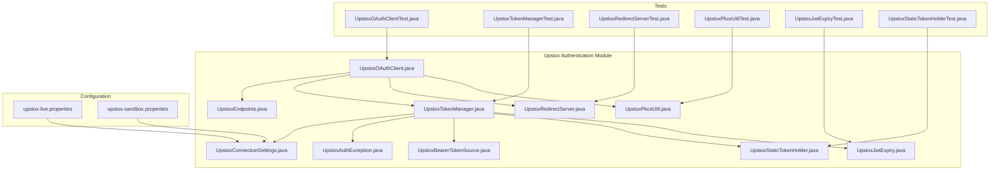
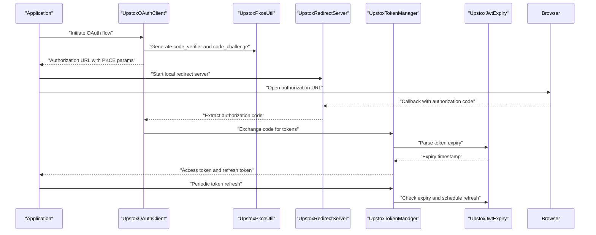
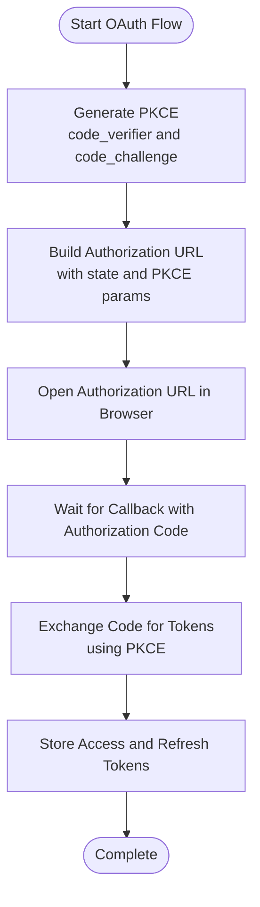
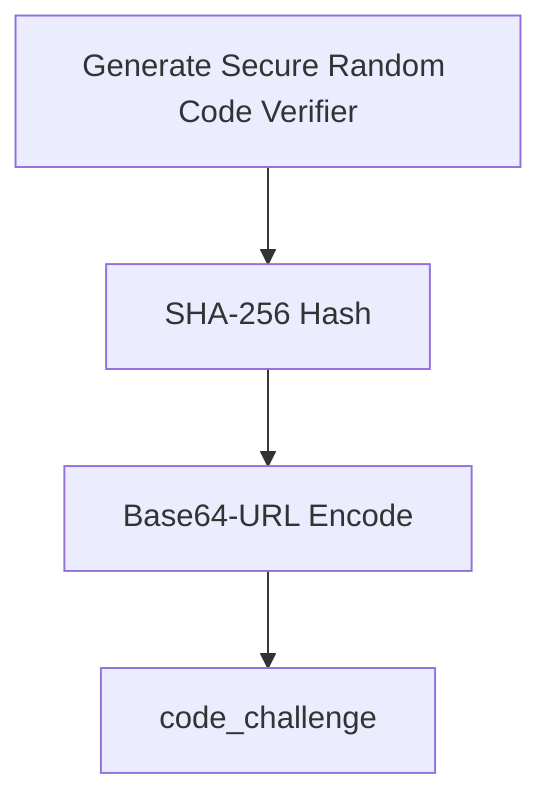
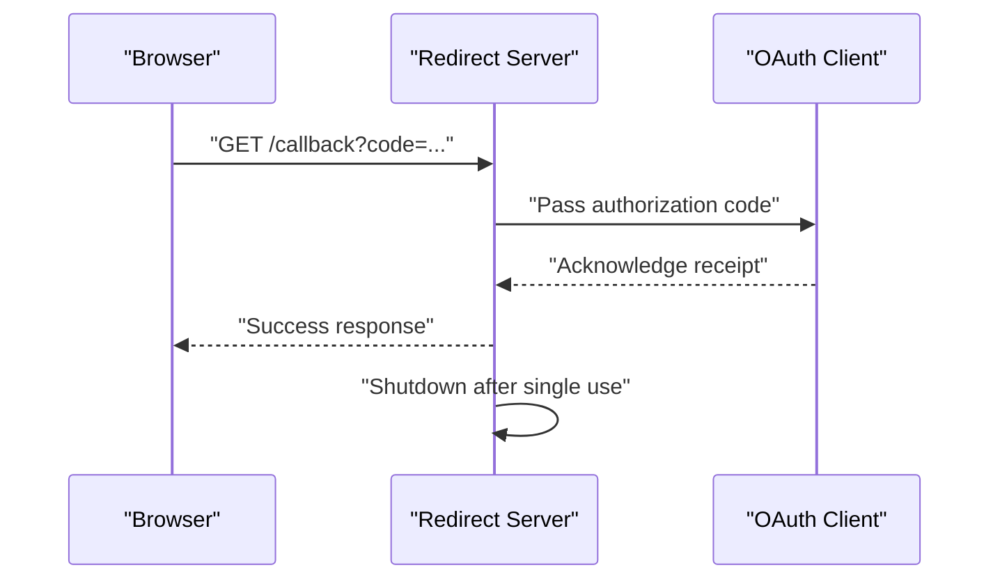
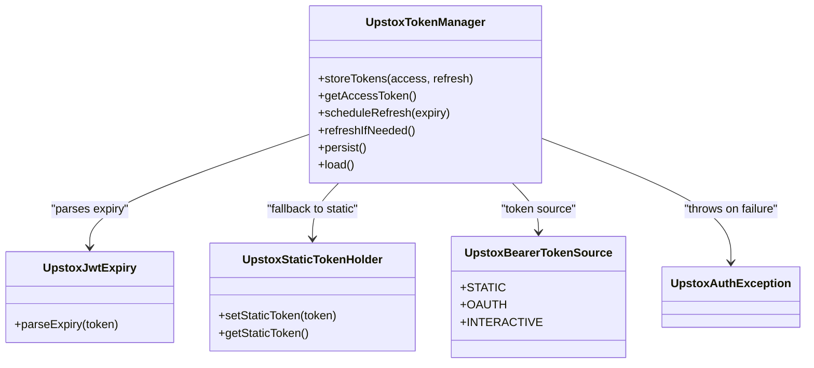
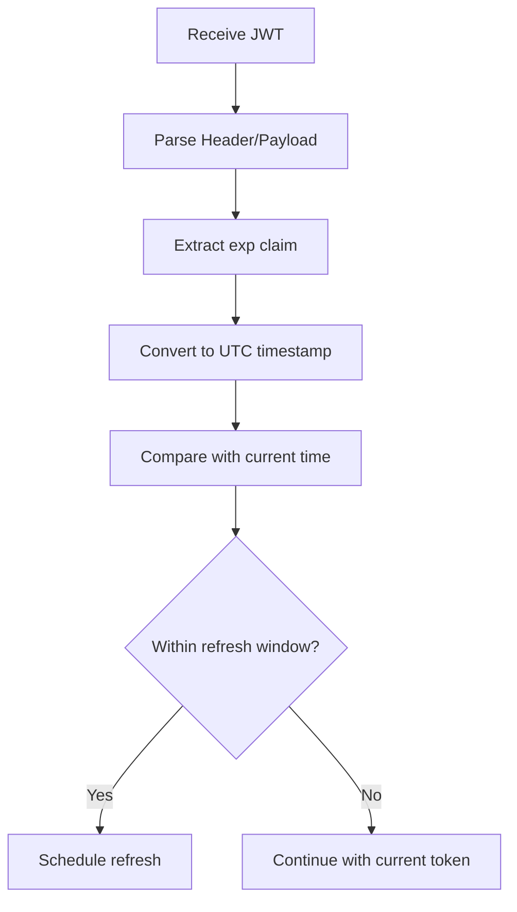
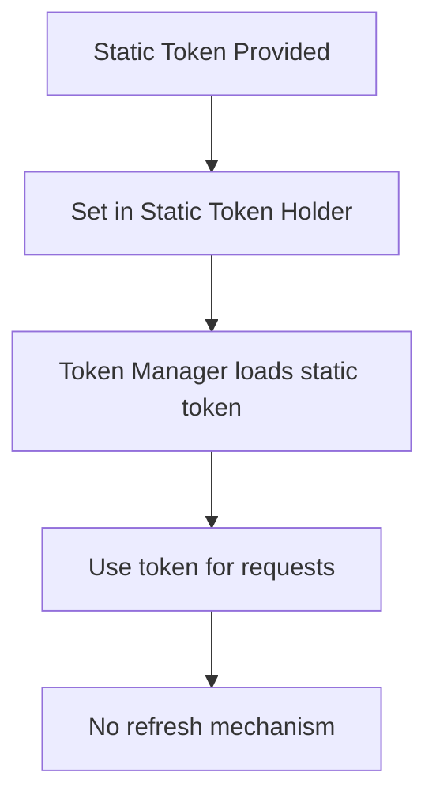
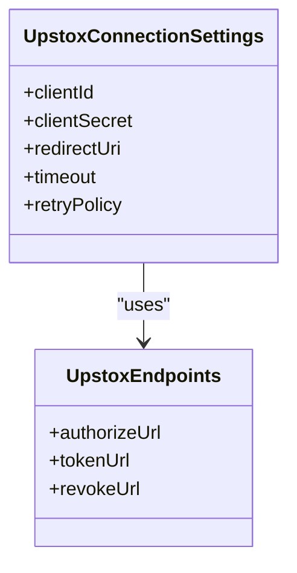
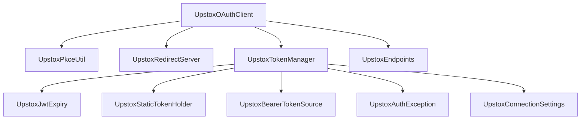

# Authentication System

<cite>
**Referenced Files in This Document**
- [UpstoxOAuthClient.java](file://broker/upstox/src/main/java/com/tradej/broker/upstox/auth/UpstoxOAuthClient.java)
- [UpstoxPkceUtil.java](file://broker/upstox/src/main/java/com/tradej/broker/upstox/auth/UpstoxPkceUtil.java)
- [UpstoxRedirectServer.java](file://broker/upstox/src/main/java/com/tradej/broker/upstox/auth/UpstoxRedirectServer.java)
- [UpstoxTokenManager.java](file://broker/upstox/src/main/java/com/tradej/broker/upstox/auth/UpstoxTokenManager.java)
- [UpstoxJwtExpiry.java](file://broker/upstox/src/main/java/com/tradej/broker/upstox/auth/UpstoxJwtExpiry.java)
- [UpstoxStaticTokenHolder.java](file://broker/upstox/src/main/java/com/tradej/broker/upstox/auth/UpstoxStaticTokenHolder.java)
- [UpstoxBearerTokenSource.java](file://broker/upstox/src/main/java/com/tradej/broker/upstox/auth/UpstoxBearerTokenSource.java)
- [UpstoxAuthException.java](file://broker/upstox/src/main/java/com/tradej/broker/upstox/auth/UpstoxAuthException.java)
- [UpstoxEndpoints.java](file://broker/upstox/src/main/java/com/tradej/broker/upstox/constants/UpstoxEndpoints.java)
- [UpstoxConnectionSettings.java](file://broker/upstox/src/main/java/com/tradej/broker/upstox/config/UpstoxConnectionSettings.java)
- [upstox-live.properties](file://config/upstox-live.properties)
- [upstox-sandbox.properties](file://config/upstox-sandbox.properties)
- [UpstoxOAuthClientTest.java](file://broker/upstox/src/test/java/com/tradej/broker/upstox/auth/UpstoxOAuthClientTest.java)
- [UpstoxTokenManagerTest.java](file://broker/upstox/src/test/java/com/tradej/broker/upstox/auth/UpstoxTokenManagerTest.java)
- [UpstoxRedirectServerTest.java](file://broker/upstox/src/test/java/com/tradej/broker/upstox/auth/UpstoxRedirectServerTest.java)
- [UpstoxPkceUtilTest.java](file://broker/upstox/src/test/java/com/tradej/broker/upstox/auth/UpstoxPkceUtilTest.java)
- [UpstoxJwtExpiryTest.java](file://broker/upstox/src/test/java/com/tradej/broker/upstox/auth/UpstoxJwtExpiryTest.java)
- [UpstoxStaticTokenHolderTest.java](file://broker/upstox/src/test/java/com/tradej/broker/upstox/auth/UpstoxStaticTokenHolderTest.java)
- [UpstoxBrokerConnection.java](file://broker/upstox/src/main/java/com/tradej/broker/upstox/UpstoxBrokerConnection.java)
- [TokenSource.java](file://broker/api/src/main/java/com/tradej/broker/api/auth/TokenSource.java)
</cite>

## Table of Contents
1. [Introduction](#introduction)
2. [Project Structure](#project-structure)
3. [Core Components](#core-components)
4. [Architecture Overview](#architecture-overview)
5. [Detailed Component Analysis](#detailed-component-analysis)
6. [Dependency Analysis](#dependency-analysis)
7. [Performance Considerations](#performance-considerations)
8. [Troubleshooting Guide](#troubleshooting-guide)
9. [Conclusion](#conclusion)
10. [Appendices](#appendices)

## Introduction
This document provides comprehensive documentation for the Upstox authentication system within the Trade-J project. It explains the OAuth 2.0 Authorization Code with Proof Key for Code Exchange (PKCE) flow, JWT token handling and expiry management, automatic refresh mechanisms, local redirect server implementation for browser-based authentication, static token support for automated environments, and token persistence strategies. Practical examples and troubleshooting guidance are included to help developers integrate and operate secure authentication flows.

## Project Structure
The Upstox authentication implementation resides under the Upstox broker module. Key authentication-related packages and files include:
- Authentication core: OAuth client, PKCE utilities, redirect server, token manager, JWT expiry handling, static token holder, bearer token source, and exception types
- Configuration: connection settings and environment endpoints
- Tests: unit tests validating OAuth flow, PKCE, redirect server, JWT expiry, and static token holder behavior

**Diagram sources**
- [UpstoxOAuthClient.java](file://broker/upstox/src/main/java/com/tradej/broker/upstox/auth/UpstoxOAuthClient.java)
- [UpstoxPkceUtil.java](file://broker/upstox/src/main/java/com/tradej/broker/upstox/auth/UpstoxPkceUtil.java)
- [UpstoxRedirectServer.java](file://broker/upstox/src/main/java/com/tradej/broker/upstox/auth/UpstoxRedirectServer.java)
- [UpstoxTokenManager.java](file://broker/upstox/src/main/java/com/tradej/broker/upstox/auth/UpstoxTokenManager.java)
- [UpstoxJwtExpiry.java](file://broker/upstox/src/main/java/com/tradej/broker/upstox/auth/UpstoxJwtExpiry.java)
- [UpstoxStaticTokenHolder.java](file://broker/upstox/src/main/java/com/tradej/broker/upstox/auth/UpstoxStaticTokenHolder.java)
- [UpstoxBearerTokenSource.java](file://broker/upstox/src/main/java/com/tradej/broker/upstox/auth/UpstoxBearerTokenSource.java)
- [UpstoxAuthException.java](file://broker/upstox/src/main/java/com/tradej/broker/upstox/auth/UpstoxAuthException.java)
- [UpstoxEndpoints.java](file://broker/upstox/src/main/java/com/tradej/broker/upstox/constants/UpstoxEndpoints.java)
- [UpstoxConnectionSettings.java](file://broker/upstox/src/main/java/com/tradej/broker/upstox/config/UpstoxConnectionSettings.java)
- [upstox-live.properties](file://config/upstox-live.properties)
- [upstox-sandbox.properties](file://config/upstox-sandbox.properties)
- [UpstoxOAuthClientTest.java](file://broker/upstox/src/test/java/com/tradej/broker/upstox/auth/UpstoxOAuthClientTest.java)
- [UpstoxTokenManagerTest.java](file://broker/upstox/src/test/java/com/tradej/broker/upstox/auth/UpstoxTokenManagerTest.java)
- [UpstoxRedirectServerTest.java](file://broker/upstox/src/test/java/com/tradej/broker/upstox/auth/UpstoxRedirectServerTest.java)
- [UpstoxPkceUtilTest.java](file://broker/upstox/src/test/java/com/tradej/broker/upstox/auth/UpstoxPkceUtilTest.java)
- [UpstoxJwtExpiryTest.java](file://broker/upstox/src/test/java/com/tradej/broker/upstox/auth/UpstoxJwtExpiryTest.java)
- [UpstoxStaticTokenHolderTest.java](file://broker/upstox/src/test/java/com/tradej/broker/upstox/auth/UpstoxStaticTokenHolderTest.java)

**Section sources**
- [UpstoxOAuthClient.java](file://broker/upstox/src/main/java/com/tradej/broker/upstox/auth/UpstoxOAuthClient.java)
- [UpstoxPkceUtil.java](file://broker/upstox/src/main/java/com/tradej/broker/upstox/auth/UpstoxPkceUtil.java)
- [UpstoxRedirectServer.java](file://broker/upstox/src/main/java/com/tradej/broker/upstox/auth/UpstoxRedirectServer.java)
- [UpstoxTokenManager.java](file://broker/upstox/src/main/java/com/tradej/broker/upstox/auth/UpstoxTokenManager.java)
- [UpstoxJwtExpiry.java](file://broker/upstox/src/main/java/com/tradej/broker/upstox/auth/UpstoxJwtExpiry.java)
- [UpstoxStaticTokenHolder.java](file://broker/upstox/src/main/java/com/tradej/broker/upstox/auth/UpstoxStaticTokenHolder.java)
- [UpstoxBearerTokenSource.java](file://broker/upstox/src/main/java/com/tradej/broker/upstox/auth/UpstoxBearerTokenSource.java)
- [UpstoxAuthException.java](file://broker/upstox/src/main/java/com/tradej/broker/upstox/auth/UpstoxAuthException.java)
- [UpstoxEndpoints.java](file://broker/upstox/src/main/java/com/tradej/broker/upstox/constants/UpstoxEndpoints.java)
- [UpstoxConnectionSettings.java](file://broker/upstox/src/main/java/com/tradej/broker/upstox/config/UpstoxConnectionSettings.java)
- [upstox-live.properties](file://config/upstox-live.properties)
- [upstox-sandbox.properties](file://config/upstox-sandbox.properties)
- [UpstoxOAuthClientTest.java](file://broker/upstox/src/test/java/com/tradej/broker/upstox/auth/UpstoxOAuthClientTest.java)
- [UpstoxTokenManagerTest.java](file://broker/upstox/src/test/java/com/tradej/broker/upstox/auth/UpstoxTokenManagerTest.java)
- [UpstoxRedirectServerTest.java](file://broker/upstox/src/test/java/com/tradej/broker/upstox/auth/UpstoxRedirectServerTest.java)
- [UpstoxPkceUtilTest.java](file://broker/upstox/src/test/java/com/tradej/broker/upstox/auth/UpstoxPkceUtilTest.java)
- [UpstoxJwtExpiryTest.java](file://broker/upstox/src/test/java/com/tradej/broker/upstox/auth/UpstoxJwtExpiryTest.java)
- [UpstoxStaticTokenHolderTest.java](file://broker/upstox/src/test/java/com/tradej/broker/upstox/auth/UpstoxStaticTokenHolderTest.java)

## Core Components
This section outlines the primary authentication components and their roles:
- OAuth client: orchestrates the Authorization Code with PKCE flow, handles authorization URL construction, PKCE challenge generation, and token exchange
- PKCE utilities: generate code verifier and code challenge per PKCE specification
- Redirect server: runs a local HTTP server to receive the authorization callback and extract the authorization code
- Token manager: manages token lifecycle, JWT expiry parsing, automatic refresh, and persistence strategies
- JWT expiry: parses token expiry timestamps and determines refresh timing
- Static token holder: supports pre-configured tokens for automated environments without interactive login
- Bearer token source: enumerates token acquisition sources (STATIC, OAUTH, INTERACTIVE)
- Exception types: specialized exceptions for authentication failures

Key responsibilities:
- Authorization code generation and PKCE challenge creation
- Local callback handling via redirect server
- Token exchange and refresh
- JWT expiry management and automatic refresh
- Static token fallback for headless environments
- Persistence and retrieval of tokens

**Section sources**
- [UpstoxOAuthClient.java](file://broker/upstox/src/main/java/com/tradej/broker/upstox/auth/UpstoxOAuthClient.java)
- [UpstoxPkceUtil.java](file://broker/upstox/src/main/java/com/tradej/broker/upstox/auth/UpstoxPkceUtil.java)
- [UpstoxRedirectServer.java](file://broker/upstox/src/main/java/com/tradej/broker/upstox/auth/UpstoxRedirectServer.java)
- [UpstoxTokenManager.java](file://broker/upstox/src/main/java/com/tradej/broker/upstox/auth/UpstoxTokenManager.java)
- [UpstoxJwtExpiry.java](file://broker/upstox/src/main/java/com/tradej/broker/upstox/auth/UpstoxJwtExpiry.java)
- [UpstoxStaticTokenHolder.java](file://broker/upstox/src/main/java/com/tradej/broker/upstox/auth/UpstoxStaticTokenHolder.java)
- [UpstoxBearerTokenSource.java](file://broker/upstox/src/main/java/com/tradej/broker/upstox/auth/UpstoxBearerTokenSource.java)
- [UpstoxAuthException.java](file://broker/upstox/src/main/java/com/tradej/broker/upstox/auth/UpstoxAuthException.java)

## Architecture Overview
The Upstox authentication system integrates OAuth 2.0 PKCE with a local redirect server for browser-based authorization, followed by token exchange and lifecycle management. The token manager coordinates JWT expiry parsing, refresh scheduling, and persistence.

**Diagram sources**
- [UpstoxOAuthClient.java](file://broker/upstox/src/main/java/com/tradej/broker/upstox/auth/UpstoxOAuthClient.java)
- [UpstoxPkceUtil.java](file://broker/upstox/src/main/java/com/tradej/broker/upstox/auth/UpstoxPkceUtil.java)
- [UpstoxRedirectServer.java](file://broker/upstox/src/main/java/com/tradej/broker/upstox/auth/UpstoxRedirectServer.java)
- [UpstoxTokenManager.java](file://broker/upstox/src/main/java/com/tradej/broker/upstox/auth/UpstoxTokenManager.java)
- [UpstoxJwtExpiry.java](file://broker/upstox/src/main/java/com/tradej/broker/upstox/auth/UpstoxJwtExpiry.java)

## Detailed Component Analysis

### OAuth Client (Authorization Code with PKCE)
The OAuth client coordinates the PKCE-enabled authorization code flow:
- Generates PKCE parameters (code verifier and code challenge)
- Constructs the authorization URL with state and PKCE parameters
- Receives the authorization code via the local redirect server
- Exchanges the authorization code for tokens using PKCE

**Diagram sources**
- [UpstoxOAuthClient.java](file://broker/upstox/src/main/java/com/tradej/broker/upstox/auth/UpstoxOAuthClient.java)
- [UpstoxPkceUtil.java](file://broker/upstox/src/main/java/com/tradej/broker/upstox/auth/UpstoxPkceUtil.java)
- [UpstoxRedirectServer.java](file://broker/upstox/src/main/java/com/tradej/broker/upstox/auth/UpstoxRedirectServer.java)

**Section sources**
- [UpstoxOAuthClient.java](file://broker/upstox/src/main/java/com/tradej/broker/upstox/auth/UpstoxOAuthClient.java)
- [UpstoxPkceUtil.java](file://broker/upstox/src/main/java/com/tradej/broker/upstox/auth/UpstoxPkceUtil.java)
- [UpstoxRedirectServer.java](file://broker/upstox/src/main/java/com/tradej/broker/upstox/auth/UpstoxRedirectServer.java)

### PKCE Utilities
PKCE utilities implement the OAuth 2.0 PKCE specification:
- Generate a secure random code verifier
- Create a SHA-256 hash of the code verifier and base64-url encode it as the code challenge

**Diagram sources**
- [UpstoxPkceUtil.java](file://broker/upstox/src/main/java/com/tradej/broker/upstox/auth/UpstoxPkceUtil.java)

**Section sources**
- [UpstoxPkceUtil.java](file://broker/upstox/src/main/java/com/tradej/broker/upstox/auth/UpstoxPkceUtil.java)

### Redirect Server (Local Callback Handling)
The redirect server runs a local HTTP endpoint to capture the authorization code:
- Starts a local server on a free port
- Handles the callback path and extracts the authorization code
- Returns a response to the browser and shuts down gracefully

**Diagram sources**
- [UpstoxRedirectServer.java](file://broker/upstox/src/main/java/com/tradej/broker/upstox/auth/UpstoxRedirectServer.java)
- [UpstoxOAuthClient.java](file://broker/upstox/src/main/java/com/tradej/broker/upstox/auth/UpstoxOAuthClient.java)

**Section sources**
- [UpstoxRedirectServer.java](file://broker/upstox/src/main/java/com/tradej/broker/upstox/auth/UpstoxRedirectServer.java)

### Token Manager (Lifecycle, Expiry, Refresh)
The token manager controls token lifecycle:
- Stores access and refresh tokens
- Parses JWT expiry timestamps
- Schedules automatic refresh before expiry
- Supports persistence and retrieval strategies
- Integrates with static token holder for automated environments

**Diagram sources**
- [UpstoxTokenManager.java](file://broker/upstox/src/main/java/com/tradej/broker/upstox/auth/UpstoxTokenManager.java)
- [UpstoxJwtExpiry.java](file://broker/upstox/src/main/java/com/tradej/broker/upstox/auth/UpstoxJwtExpiry.java)
- [UpstoxStaticTokenHolder.java](file://broker/upstox/src/main/java/com/tradej/broker/upstox/auth/UpstoxStaticTokenHolder.java)
- [UpstoxBearerTokenSource.java](file://broker/upstox/src/main/java/com/tradej/broker/upstox/auth/UpstoxBearerTokenSource.java)
- [UpstoxAuthException.java](file://broker/upstox/src/main/java/com/tradej/broker/upstox/auth/UpstoxAuthException.java)

**Section sources**
- [UpstoxTokenManager.java](file://broker/upstox/src/main/java/com/tradej/broker/upstox/auth/UpstoxTokenManager.java)
- [UpstoxJwtExpiry.java](file://broker/upstox/src/main/java/com/tradej/broker/upstox/auth/UpstoxJwtExpiry.java)
- [UpstoxStaticTokenHolder.java](file://broker/upstox/src/main/java/com/tradej/broker/upstox/auth/UpstoxStaticTokenHolder.java)
- [UpstoxBearerTokenSource.java](file://broker/upstox/src/main/java/com/tradej/broker/upstox/auth/UpstoxBearerTokenSource.java)
- [UpstoxAuthException.java](file://broker/upstox/src/main/java/com/tradej/broker/upstox/auth/UpstoxAuthException.java)

### JWT Expiry Handling
JWT expiry parsing ensures timely refresh:
- Extracts expiry timestamp from JWT payload
- Determines refresh timing based on configured thresholds
- Coordinates with token manager to schedule refresh

**Diagram sources**
- [UpstoxJwtExpiry.java](file://broker/upstox/src/main/java/com/tradej/broker/upstox/auth/UpstoxJwtExpiry.java)
- [UpstoxTokenManager.java](file://broker/upstox/src/main/java/com/tradej/broker/upstox/auth/UpstoxTokenManager.java)

**Section sources**
- [UpstoxJwtExpiry.java](file://broker/upstox/src/main/java/com/tradej/broker/upstox/auth/UpstoxJwtExpiry.java)

### Static Token Support (Automated Environments)
Static token holder enables automated environments:
- Accepts a pre-configured token
- Provides token without interactive login
- Used when TokenSource indicates STATIC

**Diagram sources**
- [UpstoxStaticTokenHolder.java](file://broker/upstox/src/main/java/com/tradej/broker/upstox/auth/UpstoxStaticTokenHolder.java)
- [UpstoxTokenManager.java](file://broker/upstox/src/main/java/com/tradej/broker/upstox/auth/UpstoxTokenManager.java)
- [UpstoxBearerTokenSource.java](file://broker/upstox/src/main/java/com/tradej/broker/upstox/auth/UpstoxBearerTokenSource.java)

**Section sources**
- [UpstoxStaticTokenHolder.java](file://broker/upstox/src/main/java/com/tradej/broker/upstox/auth/UpstoxStaticTokenHolder.java)
- [UpstoxBearerTokenSource.java](file://broker/upstox/src/main/java/com/tradej/broker/upstox/auth/UpstoxBearerTokenSource.java)

### Configuration and Environment Endpoints
Connection settings and endpoints define environment-specific configuration:
- Connection settings: client credentials, timeouts, retry policies
- Endpoints: authorization, token exchange, and revocation URLs

**Diagram sources**
- [UpstoxConnectionSettings.java](file://broker/upstox/src/main/java/com/tradej/broker/upstox/config/UpstoxConnectionSettings.java)
- [UpstoxEndpoints.java](file://broker/upstox/src/main/java/com/tradej/broker/upstox/constants/UpstoxEndpoints.java)

**Section sources**
- [UpstoxConnectionSettings.java](file://broker/upstox/src/main/java/com/tradej/broker/upstox/config/UpstoxConnectionSettings.java)
- [UpstoxEndpoints.java](file://broker/upstox/src/main/java/com/tradej/broker/upstox/constants/UpstoxEndpoints.java)

## Dependency Analysis
The authentication components depend on each other as follows:
- OAuth client depends on PKCE utilities and redirect server
- Token manager depends on JWT expiry parser, static token holder, bearer token source, and exception types
- Connection settings and endpoints provide configuration for OAuth client and token manager

**Diagram sources**
- [UpstoxOAuthClient.java](file://broker/upstox/src/main/java/com/tradej/broker/upstox/auth/UpstoxOAuthClient.java)
- [UpstoxPkceUtil.java](file://broker/upstox/src/main/java/com/tradej/broker/upstox/auth/UpstoxPkceUtil.java)
- [UpstoxRedirectServer.java](file://broker/upstox/src/main/java/com/tradej/broker/upstox/auth/UpstoxRedirectServer.java)
- [UpstoxTokenManager.java](file://broker/upstox/src/main/java/com/tradej/broker/upstox/auth/UpstoxTokenManager.java)
- [UpstoxJwtExpiry.java](file://broker/upstox/src/main/java/com/tradej/broker/upstox/auth/UpstoxJwtExpiry.java)
- [UpstoxStaticTokenHolder.java](file://broker/upstox/src/main/java/com/tradej/broker/upstox/auth/UpstoxStaticTokenHolder.java)
- [UpstoxBearerTokenSource.java](file://broker/upstox/src/main/java/com/tradej/broker/upstox/auth/UpstoxBearerTokenSource.java)
- [UpstoxAuthException.java](file://broker/upstox/src/main/java/com/tradej/broker/upstox/auth/UpstoxAuthException.java)
- [UpstoxEndpoints.java](file://broker/upstox/src/main/java/com/tradej/broker/upstox/constants/UpstoxEndpoints.java)
- [UpstoxConnectionSettings.java](file://broker/upstox/src/main/java/com/tradej/broker/upstox/config/UpstoxConnectionSettings.java)

**Section sources**
- [UpstoxOAuthClient.java](file://broker/upstox/src/main/java/com/tradej/broker/upstox/auth/UpstoxOAuthClient.java)
- [UpstoxTokenManager.java](file://broker/upstox/src/main/java/com/tradej/broker/upstox/auth/UpstoxTokenManager.java)

## Performance Considerations
- Minimize network latency by using efficient PKCE parameter generation and short-lived authorization codes
- Optimize redirect server startup/shutdown to reduce overhead during callback handling
- Schedule token refreshes proactively to avoid last-minute refresh failures
- Cache parsed JWT expiry to avoid repeated parsing operations
- Use connection settings with appropriate timeouts and retry policies to balance responsiveness and reliability

## Troubleshooting Guide
Common authentication errors and resolutions:
- Authorization code not received: verify redirect server is running and accessible, confirm callback URL matches configuration
- PKCE mismatch: ensure code verifier and code challenge are generated consistently and transmitted correctly
- Token exchange failure: check client credentials, authorization code validity, and endpoint reachability
- JWT expiry parsing errors: validate token format and ensure proper timezone handling
- Static token issues: confirm static token is set and TokenSource is configured correctly

Diagnostic steps:
- Enable logging around OAuth client, redirect server, and token manager
- Validate PKCE parameter generation and transmission
- Confirm environment endpoints and connection settings
- Verify token persistence and loading mechanisms

**Section sources**
- [UpstoxAuthException.java](file://broker/upstox/src/main/java/com/tradej/broker/upstox/auth/UpstoxAuthException.java)
- [UpstoxOAuthClientTest.java](file://broker/upstox/src/test/java/com/tradej/broker/upstox/auth/UpstoxOAuthClientTest.java)
- [UpstoxRedirectServerTest.java](file://broker/upstox/src/test/java/com/tradej/broker/upstox/auth/UpstoxRedirectServerTest.java)
- [UpstoxTokenManagerTest.java](file://broker/upstox/src/test/java/com/tradej/broker/upstox/auth/UpstoxTokenManagerTest.java)
- [UpstoxJwtExpiryTest.java](file://broker/upstox/src/test/java/com/tradej/broker/upstox/auth/UpstoxJwtExpiryTest.java)
- [UpstoxPkceUtilTest.java](file://broker/upstox/src/test/java/com/tradej/broker/upstox/auth/UpstoxPkceUtilTest.java)
- [UpstoxStaticTokenHolderTest.java](file://broker/upstox/src/test/java/com/tradej/broker/upstox/auth/UpstoxStaticTokenHolderTest.java)

## Conclusion
The Upstox authentication system implements a robust OAuth 2.0 PKCE flow with local callback handling, comprehensive JWT expiry management, and automatic refresh mechanisms. It supports both interactive browser-based authentication and static token usage for automated environments. Proper configuration of endpoints and connection settings, combined with resilient token persistence and error handling, ensures secure and reliable authentication across diverse deployment scenarios.

## Appendices

### Practical Setup Examples
- Configure environment endpoints and connection settings for sandbox or live environments
- Initialize OAuth client with PKCE utilities and redirect server
- Set up token manager with JWT expiry parsing and refresh scheduling
- Provide static token for automated environments when TokenSource indicates STATIC

### Security Best Practices
- Use HTTPS endpoints and secure redirect URIs
- Store client secrets securely and avoid embedding in client-side code
- Rotate tokens regularly and handle revocation appropriately
- Validate PKCE parameters rigorously and enforce strict state checks
- Monitor token expiry and refresh windows to prevent unauthorized access

**Section sources**
- [upstox-live.properties](file://config/upstox-live.properties)
- [upstox-sandbox.properties](file://config/upstox-sandbox.properties)
- [UpstoxBearerTokenSource.java](file://broker/api/src/main/java/com/tradej/broker/api/auth/TokenSource.java)
- [UpstoxBrokerConnection.java](file://broker/upstox/src/main/java/com/tradej/broker/upstox/UpstoxBrokerConnection.java)