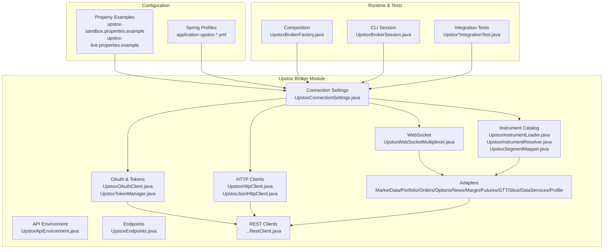
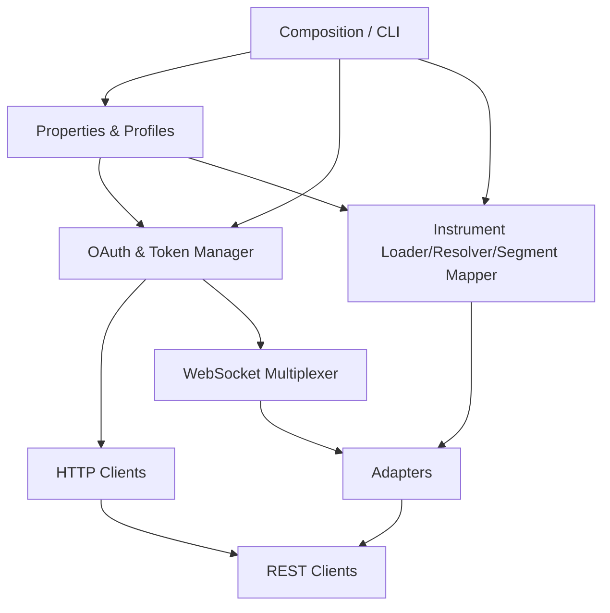
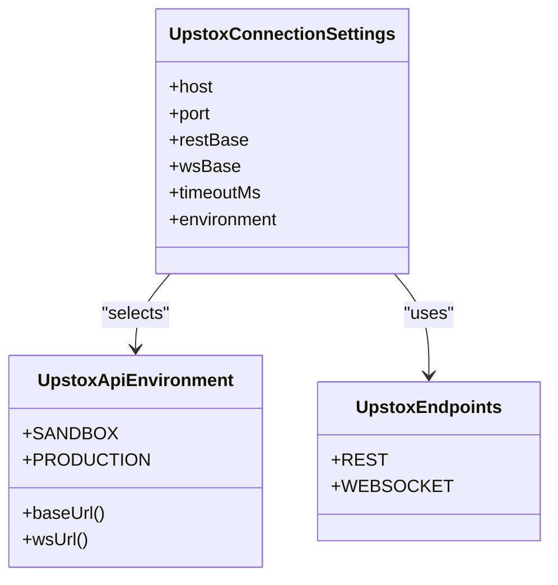
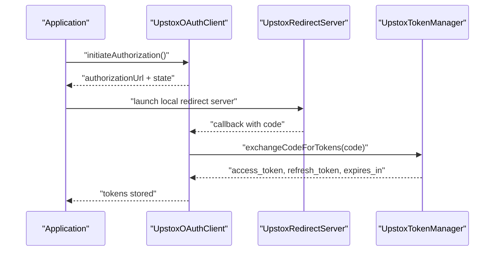
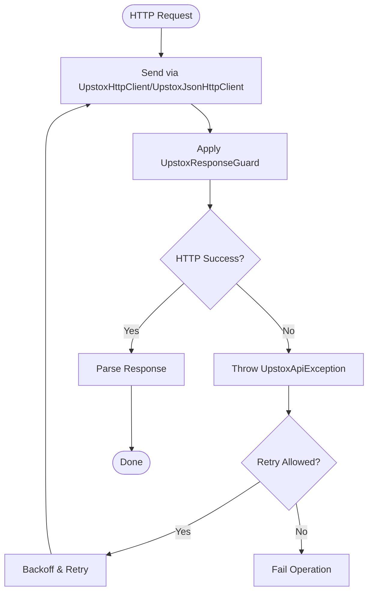
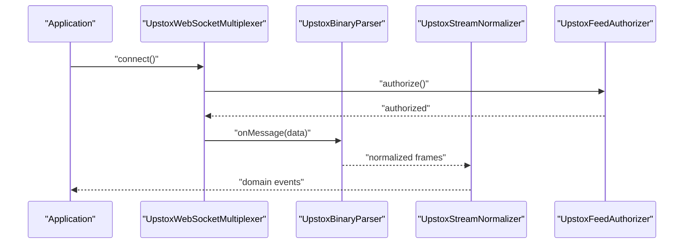
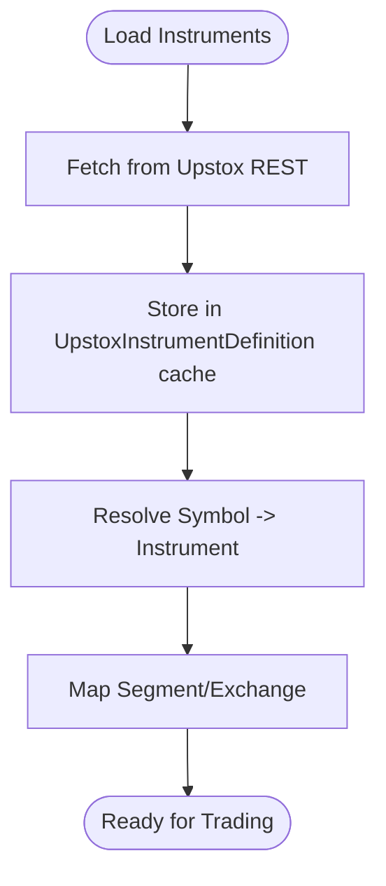
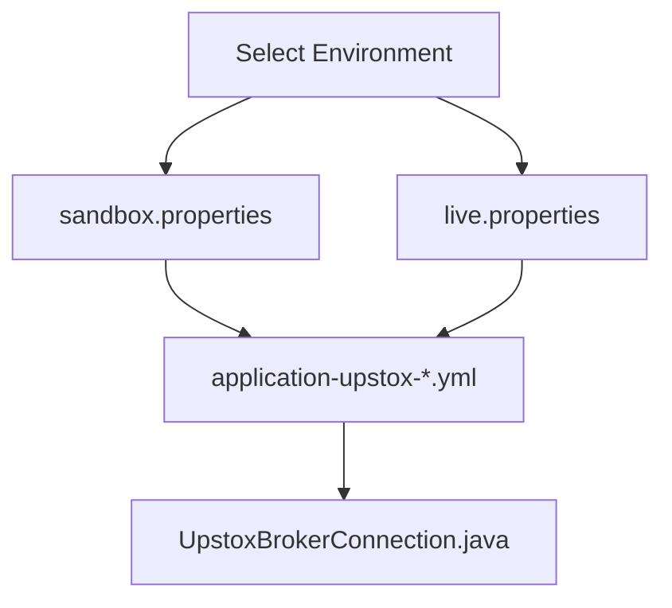
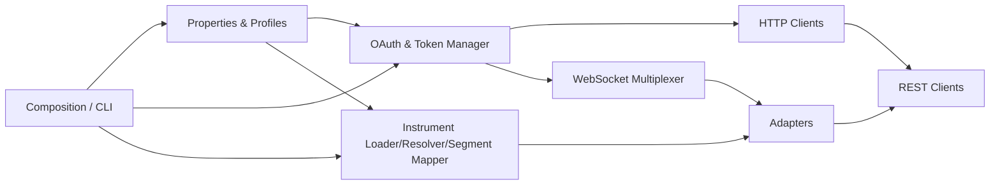

# Configuration & Setup

<cite>
**Referenced Files in This Document**
- [upstox-sandbox.properties.example](file://config/upstox-sandbox.properties.example)
- [upstox-live.properties.example](file://config/upstox-live.properties.example)
- [application-upstox-dev.yml](file://app/src/main/resources/application-upstox-dev.yml)
- [application-upstox-prod.yml](file://app/src/main/resources/application-upstox-prod.yml)
- [application-upstox-analytics.yml](file://app/src/main/resources/application-upstox-analytics.yml)
- [UpstoxConnectionSettings.java](file://broker/upstox/src/main/java/com/tradej/broker/upstox/config/UpstoxConnectionSettings.java)
- [UpstoxApiEnvironment.java](file://broker/upstox/src/main/java/com/tradej/broker/upstox/config/UpstoxApiEnvironment.java)
- [UpstoxEndpoints.java](file://broker/upstox/src/main/java/com/tradej/broker/upstox/constants/UpstoxEndpoints.java)
- [UpstoxOAuthClient.java](file://broker/upstox/src/main/java/com/tradej/broker/upstox/auth/UpstoxOAuthClient.java)
- [UpstoxTokenManager.java](file://broker/upstox/src/main/java/com/tradej/broker/upstox/auth/UpstoxTokenManager.java)
- [UpstoxInstrumentLoader.java](file://broker/upstox/src/main/java/com/tradej/broker/upstox/instrument/UpstoxInstrumentLoader.java)
- [UpstoxInstrumentResolver.java](file://broker/upstox/src/main/java/com/tradej/broker/upstox/instrument/UpstoxInstrumentResolver.java)
- [UpstoxSegmentMapper.java](file://broker/upstox/src/main/java/com/tradej/broker/upstox/instrument/UpstoxSegmentMapper.java)
- [UpstoxHttpClient.java](file://broker/upstox/src/main/java/com/tradej/broker/upstox/http/UpstoxHttpClient.java)
- [UpstoxJsonHttpClient.java](file://broker/upstox/src/main/java/com/tradej/broker/upstox/http/UpstoxJsonHttpClient.java)
- [UpstoxWebSocketMultiplexer.java](file://broker/upstox/src/main/java/com/tradej/broker/upstox/websocket/UpstoxWebSocketMultiplexer.java)
- [UpstoxBrokerConnection.java](file://broker/upstox/src/main/java/com/tradej/broker/upstox/UpstoxBrokerConnection.java)
- [UpstoxHistoricalDataService.java](file://broker/upstox/src/main/java/com/tradej/broker/upstox/historical/UpstoxHistoricalDataService.java)
- [UpstoxMarketDataProvider.java](file://broker/upstox/src/main/java/com/tradej/broker/upstox/adapter/UpstoxMarketDataProvider.java)
- [UpstoxPortfolioProvider.java](file://broker/upstox/src/main/java/com/tradej/broker/upstox/adapter/UpstoxPortfolioProvider.java)
- [UpstoxOrderCommandAdapter.java](file://broker/upstox/src/main/java/com/tradej/broker/upstox/adapter/UpstoxOrderCommandAdapter.java)
- [UpstoxOrderQueryAdapter.java](file://broker/upstox/src/main/java/com/tradej/broker/upstox/adapter/UpstoxOrderQueryAdapter.java)
- [UpstoxOptionsProvider.java](file://broker/upstox/src/main/java/com/tradej/broker/upstox/adapter/UpstoxOptionsProvider.java)
- [UpstoxNewsProvider.java](file://broker/upstox/src/main/java/com/tradej/broker/upstox/adapter/UpstoxNewsProvider.java)
- [UpstoxMarginProvider.java](file://broker/upstox/src/main/java/com/tradej/broker/upstox/adapter/UpstoxMarginProvider.java)
- [UpstoxFuturesProvider.java](file://broker/upstox/src/main/java/com/tradej/broker/upstox/adapter/UpstoxFuturesProvider.java)
- [UpstoxGttOrderAdapter.java](file://broker/upstox/src/main/java/com/tradej/broker/upstox/adapter/UpstoxGttOrderAdapter.java)
- [UpstoxSliceOrderAdapter.java](file://broker/upstox/src/main/java/com/tradej/broker/upstox/adapter/UpstoxSliceOrderAdapter.java)
- [UpstoxDataServicesProvider.java](file://broker/upstox/src/main/java/com/tradej/broker/upstox/adapter/UpstoxDataServicesProvider.java)
- [UpstoxProfileProvider.java](file://broker/upstox/src/main/java/com/tradej/broker/upstox/adapter/UpstoxProfileProvider.java)
- [UpstoxFeedAuthorizer.java](file://broker/upstox/src/main/java/com/tradej/broker/upstox/websocket/UpstoxFeedAuthorizer.java)
- [UpstoxBinaryParser.java](file://broker/upstox/src/main/java/com/tradej/broker/upstox/websocket/UpstoxBinaryParser.java)
- [UpstoxPortfolioStreamParser.java](file://broker/upstox/src/main/java/com/tradej/broker/upstox/websocket/UpstoxPortfolioStreamParser.java)
- [UpstoxStreamNormalizer.java](file://broker/upstox/src/main/java/com/tradej/broker/upstox/websocket/UpstoxStreamNormalizer.java)
- [UpstoxRetryExecutor.java](file://broker/upstox/src/main/java/com/tradej/broker/upstox/resilience/UpstoxRetryExecutor.java)
- [UpstoxApiException.java](file://broker/upstox/src/main/java/com/tradej/broker/upstox/http/UpstoxApiException.java)
- [UpstoxResponseGuard.java](file://broker/upstox/src/main/java/com/tradej/broker/upstox/http/UpstoxResponseGuard.java)
- [UpstoxHistoricalCandleMapper.java](file://broker/upstox/src/main/java/com/tradej/broker/upstox/historical/UpstoxHistoricalCandleMapper.java)
- [UpstoxDomainMapper.java](file://broker/upstox/src/main/java/com/tradej/broker/upstox/mapper/UpstoxDomainMapper.java)
- [UpstoxInstrumentDefinition.java](file://broker/upstox/src/main/java/com/tradej/broker/upstox/instrument/UpstoxInstrumentDefinition.java)
- [UpstoxExpiredOptionService.java](file://broker/upstox/src/main/java/com/tradej/broker/upstox/expired/UpstoxExpiredOptionService.java)
- [UpstoxExpiredOptionMapper.java](file://broker/upstox/src/main/java/com/tradej/broker/upstox/expired/UpstoxExpiredOptionMapper.java)
- [UpstoxBrokerFactory.java](file://composition/src/main/java/com/tradej/composition/UpstoxBrokerFactory.java)
- [UpstoxBrokerSession.java](file://cli/src/main/java/com/tradej/cli/standalone/UpstoxBrokerSession.java)
- [UpstoxTokenExpiry.java](file://broker/upstox/src/main/java/com/tradej/broker/upstox/auth/UpstoxTokenExpiry.java)
- [UpstoxJwtExpiry.java](file://broker/upstox/src/main/java/com/tradej/broker/upstox/auth/UpstoxJwtExpiry.java)
- [UpstoxStaticTokenHolder.java](file://broker/upstox/src/main/java/com/tradej/broker/upstox/auth/UpstoxStaticTokenHolder.java)
- [UpstoxAnalyticsTokenHolder.java](file://broker/upstox/src/main/java/com/tradej/broker/upstox/auth/UpstoxAnalyticsTokenHolder.java)
- [UpstoxPkceUtil.java](file://broker/upstox/src/main/java/com/tradej/broker/upstox/auth/UpstoxPkceUtil.java)
- [UpstoxRedirectServer.java](file://broker/upstox/src/main/java/com/tradej/broker/upstox/auth/UpstoxRedirectServer.java)
- [UpstoxAuthException.java](file://broker/upstox/src/main/java/com/tradej/broker/upstox/auth/UpstoxAuthException.java)
- [UpstoxDataServicesRestClient.java](file://broker/upstox/src/main/java/com/tradej/broker/upstox/rest/UpstoxDataServicesRestClient.java)
- [UpstoxExpiredInstrumentRestClient.java](file://broker/upstox/src/main/java/com/tradej/broker/upstox/rest/UpstoxExpiredInstrumentRestClient.java)
- [UpstoxGttRestClient.java](file://broker/upstox/src/main/java/com/tradej/broker/upstox/rest/UpstoxGttRestClient.java)
- [UpstoxHistoricalDataRestClient.java](file://broker/upstox/src/main/java/com/tradej/broker/upstox/rest/UpstoxHistoricalDataRestClient.java)
- [UpstoxMarketDataRestClient.java](file://broker/upstox/src/main/java/com/tradej/broker/upstox/rest/UpstoxMarketDataRestClient.java)
- [UpstoxNewsRestClient.java](file://broker/upstox/src/main/java/com/tradej/broker/upstox/rest/UpstoxNewsRestClient.java)
- [UpstoxOptionChainRestClient.java](file://broker/upstox/src/main/java/com/tradej/broker/upstox/rest/UpstoxOptionChainRestClient.java)
- [UpstoxOrderRestClient.java](file://broker/upstox/src/main/java/com/tradej/broker/upstox/rest/UpstoxOrderRestClient.java)
- [UpstoxPortfolioRestClient.java](file://broker/upstox/src/main/java/com/tradej/broker/upstox/rest/UpstoxPortfolioRestClient.java)
- [UpstoxProfileRestClient.java](file://broker/upstox/src/main/java/com/tradej/broker/upstox/rest/UpstoxProfileRestClient.java)
- [UpstoxDataComposition.java](file://core/src/main/java/com/tradej/core/DataComposition.java)
- [UpstoxExecutionComposition.java](file://core/src/main/java/com/tradej/core/ExecutionComposition.java)
- [UpstoxPipelineComposition.java](file://core/src/main/java/com/tradej/core/PipelineComposition.java)
- [UpstoxFullComposition.java](file://core/src/main/java/com/tradej/core/FullComposition.java)
- [UpstoxClockComposition.java](file://core/src/main/java/com/tradej/core/ClockComposition.java)
- [UpstoxBrokerComposition.java](file://core/src/main/java/com/tradej/core/BrokerComposition.java)
- [UpstoxHealthIndicatorTest.java](file://app/src/test/java/com/tradej/app/health/UpstoxHealthIndicatorTest.java)
- [UpstoxMarketFeedIntegrationTest.java](file://app/src/test/java/com/tradej/app/integration/UpstoxMarketFeedIntegrationTest.java)
- [UpstoxHistoricalDataLiveIntegrationTest.java](file://app/src/test/java/com/tradej/app/integration/UpstoxHistoricalDataLiveIntegrationTest.java)
- [UpstoxOrderLifecycleIntegrationTest.java](file://app/src/test/java/com/tradej/app/integration/UpstoxOrderLifecycleIntegrationTest.java)
- [UpstoxPortfolioIntegrationTest.java](file://app/src/test/java/com/tradej/app/integration/UpstoxPortfolioIntegrationTest.java)
- [UpstoxTokenLifecycleIntegrationTest.java](file://app/src/test/java/com/tradej/app/integration/UpstoxTokenLifecycleIntegrationTest.java)
- [UpstoxRegressionPreflightIntegrationTest.java](file://app/src/test/java/com/tradej/app/integration/UpstoxRegressionPreflightIntegrationTest.java)
- [UpstoxEquityBackfillLiveIntegrationTest.java](file://app/src/test/java/com/tradej/app/integration/UpstoxEquityBackfillLiveIntegrationTest.java)
- [UpstoxExpiredInstrumentsLiveIntegrationTest.java](file://app/src/test/java/com/tradej/app/integration/UpstoxExpiredInstrumentsLiveIntegrationTest.java)
- [UpstoxNewsIntegrationTest.java](file://app/src/test/java/com/tradej/app/integration/UpstoxNewsIntegrationTest.java)
- [LiveUpstoxTestSupport.java](file://app/src/test/java/com/tradej/app/integration/LiveUpstoxTestSupport.java)
- [UpstoxBrokerConnectionContractTest.java](file://broker/upstox/src/test/java/com/tradej/broker/upstox/IBrokerConnectionContractTest.java)
- [UpstoxBrokerConnectionContractTest.java](file://broker/core/src/test/java/com/tradej/broker/core/IBrokerConnectionContractTest.java)
- [UpstoxBrokerConnectionContractTest.java](file://broker/api/src/test/java/com/tradej/broker/api/IBrokerConnectionContractTest.java)
- [UpstoxBrokerConnectionContractTest.java](file://broker/dhan/src/test/java/com/tradej/broker/dhan/IBrokerConnectionContractTest.java)
- [UpstoxBrokerConnectionContractTest.java](file://broker/icici/src/test/java/com/tradej/broker/icici/IBrokerConnectionContractTest.java)
</cite>

## Table of Contents
1. [Introduction](#introduction)
2. [Project Structure](#project-structure)
3. [Core Components](#core-components)
4. [Architecture Overview](#architecture-overview)
5. [Detailed Component Analysis](#detailed-component-analysis)
6. [Dependency Analysis](#dependency-analysis)
7. [Performance Considerations](#performance-considerations)
8. [Troubleshooting Guide](#troubleshooting-guide)
9. [Conclusion](#conclusion)
10. [Appendices](#appendices)

## Introduction
This document explains how to configure and set up the Upstox broker integration in the project. It covers connection settings, API environment configuration, authentication parameter setup, instrument catalog loading, symbol resolution, exchange mapping, sandbox versus production environments, property file configuration, environment-specific settings, API endpoint configuration, rate limiting parameters, connection pool settings, and step-by-step setup guides for development, staging, and production. It also addresses common configuration issues, troubleshooting steps, and best practices for secure credential management.

## Project Structure
The Upstox integration spans several modules:
- Configuration examples under config for sandbox and live environments
- Spring profiles under app/src/main/resources for environment-specific application settings
- Upstox broker module containing connection settings, OAuth, HTTP clients, WebSocket, instrument mapping, adapters, and REST clients
- Composition and CLI modules that wire Upstox into the runtime and testing harnesses

**Diagram sources**
- [UpstoxConnectionSettings.java](file://broker/upstox/src/main/java/com/tradej/broker/upstox/config/UpstoxConnectionSettings.java)
- [UpstoxApiEnvironment.java](file://broker/upstox/src/main/java/com/tradej/broker/upstox/config/UpstoxApiEnvironment.java)
- [UpstoxEndpoints.java](file://broker/upstox/src/main/java/com/tradej/broker/upstox/constants/UpstoxEndpoints.java)
- [UpstoxOAuthClient.java](file://broker/upstox/src/main/java/com/tradej/broker/upstox/auth/UpstoxOAuthClient.java)
- [UpstoxTokenManager.java](file://broker/upstox/src/main/java/com/tradej/broker/upstox/auth/UpstoxTokenManager.java)
- [UpstoxHttpClient.java](file://broker/upstox/src/main/java/com/tradej/broker/upstox/http/UpstoxHttpClient.java)
- [UpstoxJsonHttpClient.java](file://broker/upstox/src/main/java/com/tradej/broker/upstox/http/UpstoxJsonHttpClient.java)
- [UpstoxWebSocketMultiplexer.java](file://broker/upstox/src/main/java/com/tradej/broker/upstox/websocket/UpstoxWebSocketMultiplexer.java)
- [UpstoxInstrumentLoader.java](file://broker/upstox/src/main/java/com/tradej/broker/upstox/instrument/UpstoxInstrumentLoader.java)
- [UpstoxInstrumentResolver.java](file://broker/upstox/src/main/java/com/tradej/broker/upstox/instrument/UpstoxInstrumentResolver.java)
- [UpstoxSegmentMapper.java](file://broker/upstox/src/main/java/com/tradej/broker/upstox/instrument/UpstoxSegmentMapper.java)
- [UpstoxBrokerFactory.java](file://composition/src/main/java/com/tradej/composition/UpstoxBrokerFactory.java)
- [UpstoxBrokerSession.java](file://cli/src/main/java/com/tradej/cli/standalone/UpstoxBrokerSession.java)

**Section sources**
- [upstox-sandbox.properties.example](file://config/upstox-sandbox.properties.example)
- [upstox-live.properties.example](file://config/upstox-live.properties.example)
- [application-upstox-dev.yml](file://app/src/main/resources/application-upstox-dev.yml)
- [application-upstox-prod.yml](file://app/src/main/resources/application-upstox-prod.yml)
- [application-upstox-analytics.yml](file://app/src/main/resources/application-upstox-analytics.yml)

## Core Components
- Connection settings encapsulate host endpoints, timeouts, and environment selection.
- API environment defines sandbox versus production endpoints and base URLs.
- Endpoints enumerate REST and WebSocket URIs used by REST clients and WebSocket multiplexer.
- OAuth client and token manager handle PKCE-based authorization, token acquisition, refresh, and expiry handling.
- HTTP clients provide JSON and generic HTTP transport with response guards and exceptions.
- WebSocket multiplexer manages feed streams, parsing, normalization, and authorizers.
- Instrument loader, resolver, and segment mapper handle catalog loading, symbol-to-instrument resolution, and exchange mapping.
- Adapters translate broker events and commands to/from internal domain models.
- REST clients implement typed calls to Upstox APIs for market data, orders, portfolio, options, news, GTT, profile, and historical data.
- Composition and CLI integrate Upstox into runtime and standalone sessions.

**Section sources**
- [UpstoxConnectionSettings.java](file://broker/upstox/src/main/java/com/tradej/broker/upstox/config/UpstoxConnectionSettings.java)
- [UpstoxApiEnvironment.java](file://broker/upstox/src/main/java/com/tradej/broker/upstox/config/UpstoxApiEnvironment.java)
- [UpstoxEndpoints.java](file://broker/upstox/src/main/java/com/tradej/broker/upstox/constants/UpstoxEndpoints.java)
- [UpstoxOAuthClient.java](file://broker/upstox/src/main/java/com/tradej/broker/upstox/auth/UpstoxOAuthClient.java)
- [UpstoxTokenManager.java](file://broker/upstox/src/main/java/com/tradej/broker/upstox/auth/UpstoxTokenManager.java)
- [UpstoxHttpClient.java](file://broker/upstox/src/main/java/com/tradej/broker/upstox/http/UpstoxHttpClient.java)
- [UpstoxJsonHttpClient.java](file://broker/upstox/src/main/java/com/tradej/broker/upstox/http/UpstoxJsonHttpClient.java)
- [UpstoxWebSocketMultiplexer.java](file://broker/upstox/src/main/java/com/tradej/broker/upstox/websocket/UpstoxWebSocketMultiplexer.java)
- [UpstoxInstrumentLoader.java](file://broker/upstox/src/main/java/com/tradej/broker/upstox/instrument/UpstoxInstrumentLoader.java)
- [UpstoxInstrumentResolver.java](file://broker/upstox/src/main/java/com/tradej/broker/upstox/instrument/UpstoxInstrumentResolver.java)
- [UpstoxSegmentMapper.java](file://broker/upstox/src/main/java/com/tradej/broker/upstox/instrument/UpstoxSegmentMapper.java)
- [UpstoxBrokerFactory.java](file://composition/src/main/java/com/tradej/composition/UpstoxBrokerFactory.java)
- [UpstoxBrokerSession.java](file://cli/src/main/java/com/tradej/cli/standalone/UpstoxBrokerSession.java)

## Architecture Overview
The Upstox integration follows a layered architecture:
- Configuration layer: property files and Spring profiles define environment and credentials.
- Authentication layer: OAuth client and token manager manage authorization lifecycle.
- Transport layer: HTTP clients and WebSocket multiplexer handle network communication.
- Domain layer: adapters and REST clients translate broker operations to Upstox APIs.
- Instrument layer: loader, resolver, and mapper maintain symbol catalogs and exchange mappings.
- Runtime layer: composition and CLI assemble components for execution and testing.

**Diagram sources**
- [UpstoxConnectionSettings.java](file://broker/upstox/src/main/java/com/tradej/broker/upstox/config/UpstoxConnectionSettings.java)
- [UpstoxOAuthClient.java](file://broker/upstox/src/main/java/com/tradej/broker/upstox/auth/UpstoxOAuthClient.java)
- [UpstoxTokenManager.java](file://broker/upstox/src/main/java/com/tradej/broker/upstox/auth/UpstoxTokenManager.java)
- [UpstoxHttpClient.java](file://broker/upstox/src/main/java/com/tradej/broker/upstox/http/UpstoxHttpClient.java)
- [UpstoxJsonHttpClient.java](file://broker/upstox/src/main/java/com/tradej/broker/upstox/http/UpstoxJsonHttpClient.java)
- [UpstoxWebSocketMultiplexer.java](file://broker/upstox/src/main/java/com/tradej/broker/upstox/websocket/UpstoxWebSocketMultiplexer.java)
- [UpstoxInstrumentLoader.java](file://broker/upstox/src/main/java/com/tradej/broker/upstox/instrument/UpstoxInstrumentLoader.java)
- [UpstoxInstrumentResolver.java](file://broker/upstox/src/main/java/com/tradej/broker/upstox/instrument/UpstoxInstrumentResolver.java)
- [UpstoxSegmentMapper.java](file://broker/upstox/src/main/java/com/tradej/broker/upstox/instrument/UpstoxSegmentMapper.java)
- [UpstoxBrokerFactory.java](file://composition/src/main/java/com/tradej/composition/UpstoxBrokerFactory.java)
- [UpstoxBrokerSession.java](file://cli/src/main/java/com/tradej/cli/standalone/UpstoxBrokerSession.java)

## Detailed Component Analysis

### Connection Settings and API Environment
- Connection settings encapsulate endpoint hosts, ports, timeouts, and environment selection.
- API environment distinguishes sandbox and production endpoints and base URLs.
- Endpoints define REST and WebSocket URIs used by clients and multiplexer.

**Diagram sources**
- [UpstoxConnectionSettings.java](file://broker/upstox/src/main/java/com/tradej/broker/upstox/config/UpstoxConnectionSettings.java)
- [UpstoxApiEnvironment.java](file://broker/upstox/src/main/java/com/tradej/broker/upstox/config/UpstoxApiEnvironment.java)
- [UpstoxEndpoints.java](file://broker/upstox/src/main/java/com/tradej/broker/upstox/constants/UpstoxEndpoints.java)

**Section sources**
- [UpstoxConnectionSettings.java](file://broker/upstox/src/main/java/com/tradej/broker/upstox/config/UpstoxConnectionSettings.java)
- [UpstoxApiEnvironment.java](file://broker/upstox/src/main/java/com/tradej/broker/upstox/config/UpstoxApiEnvironment.java)
- [UpstoxEndpoints.java](file://broker/upstox/src/main/java/com/tradej/broker/upstox/constants/UpstoxEndpoints.java)

### Authentication and Token Management
- OAuth client handles PKCE authorization code flow, redirect server, and authorization URL generation.
- Token manager manages access and refresh tokens, expiry handling, and token holder abstractions.
- Static and analytics token holders support different authentication modes.

**Diagram sources**
- [UpstoxOAuthClient.java](file://broker/upstox/src/main/java/com/tradej/broker/upstox/auth/UpstoxOAuthClient.java)
- [UpstoxRedirectServer.java](file://broker/upstox/src/main/java/com/tradej/broker/upstox/auth/UpstoxRedirectServer.java)
- [UpstoxTokenManager.java](file://broker/upstox/src/main/java/com/tradej/broker/upstox/auth/UpstoxTokenManager.java)
- [UpstoxTokenExpiry.java](file://broker/upstox/src/main/java/com/tradej/broker/upstox/auth/UpstoxTokenExpiry.java)
- [UpstoxJwtExpiry.java](file://broker/upstox/src/main/java/com/tradej/broker/upstox/auth/UpstoxJwtExpiry.java)
- [UpstoxStaticTokenHolder.java](file://broker/upstox/src/main/java/com/tradej/broker/upstox/auth/UpstoxStaticTokenHolder.java)
- [UpstoxAnalyticsTokenHolder.java](file://broker/upstox/src/main/java/com/tradej/broker/upstox/auth/UpstoxAnalyticsTokenHolder.java)
- [UpstoxPkceUtil.java](file://broker/upstox/src/main/java/com/tradej/broker/upstox/auth/UpstoxPkceUtil.java)

**Section sources**
- [UpstoxOAuthClient.java](file://broker/upstox/src/main/java/com/tradej/broker/upstox/auth/UpstoxOAuthClient.java)
- [UpstoxRedirectServer.java](file://broker/upstox/src/main/java/com/tradej/broker/upstox/auth/UpstoxRedirectServer.java)
- [UpstoxTokenManager.java](file://broker/upstox/src/main/java/com/tradej/broker/upstox/auth/UpstoxTokenManager.java)
- [UpstoxTokenExpiry.java](file://broker/upstox/src/main/java/com/tradej/broker/upstox/auth/UpstoxTokenExpiry.java)
- [UpstoxJwtExpiry.java](file://broker/upstox/src/main/java/com/tradej/broker/upstox/auth/UpstoxJwtExpiry.java)
- [UpstoxStaticTokenHolder.java](file://broker/upstox/src/main/java/com/tradej/broker/upstox/auth/UpstoxStaticTokenHolder.java)
- [UpstoxAnalyticsTokenHolder.java](file://broker/upstox/src/main/java/com/tradej/broker/upstox/auth/UpstoxAnalyticsTokenHolder.java)
- [UpstoxPkceUtil.java](file://broker/upstox/src/main/java/com/tradej/broker/upstox/auth/UpstoxPkceUtil.java)

### HTTP Clients and Resilience
- HTTP clients provide synchronous and JSON-specific HTTP transport with response guards and exceptions.
- Retry executor implements resilient retry policies for transient failures.

**Diagram sources**
- [UpstoxHttpClient.java](file://broker/upstox/src/main/java/com/tradej/broker/upstox/http/UpstoxHttpClient.java)
- [UpstoxJsonHttpClient.java](file://broker/upstox/src/main/java/com/tradej/broker/upstox/http/UpstoxJsonHttpClient.java)
- [UpstoxResponseGuard.java](file://broker/upstox/src/main/java/com/tradej/broker/upstox/http/UpstoxResponseGuard.java)
- [UpstoxApiException.java](file://broker/upstox/src/main/java/com/tradej/broker/upstox/http/UpstoxApiException.java)
- [UpstoxRetryExecutor.java](file://broker/upstox/src/main/java/com/tradej/broker/upstox/resilience/UpstoxRetryExecutor.java)

**Section sources**
- [UpstoxHttpClient.java](file://broker/upstox/src/main/java/com/tradej/broker/upstox/http/UpstoxHttpClient.java)
- [UpstoxJsonHttpClient.java](file://broker/upstox/src/main/java/com/tradej/broker/upstox/http/UpstoxJsonHttpClient.java)
- [UpstoxResponseGuard.java](file://broker/upstox/src/main/java/com/tradej/broker/upstox/http/UpstoxResponseGuard.java)
- [UpstoxApiException.java](file://broker/upstox/src/main/java/com/tradej/broker/upstox/http/UpstoxApiException.java)
- [UpstoxRetryExecutor.java](file://broker/upstox/src/main/java/com/tradej/broker/upstox/resilience/UpstoxRetryExecutor.java)

### WebSocket Streaming
- WebSocket multiplexer manages feed streams, binary parsing, portfolio parsing, and stream normalization.
- Feed authorizer handles authentication for WebSocket connections.

**Diagram sources**
- [UpstoxWebSocketMultiplexer.java](file://broker/upstox/src/main/java/com/tradej/broker/upstox/websocket/UpstoxWebSocketMultiplexer.java)
- [UpstoxBinaryParser.java](file://broker/upstox/src/main/java/com/tradej/broker/upstox/websocket/UpstoxBinaryParser.java)
- [UpstoxPortfolioStreamParser.java](file://broker/upstox/src/main/java/com/tradej/broker/upstox/websocket/UpstoxPortfolioStreamParser.java)
- [UpstoxStreamNormalizer.java](file://broker/upstox/src/main/java/com/tradej/broker/upstox/websocket/UpstoxStreamNormalizer.java)
- [UpstoxFeedAuthorizer.java](file://broker/upstox/src/main/java/com/tradej/broker/upstox/websocket/UpstoxFeedAuthorizer.java)

**Section sources**
- [UpstoxWebSocketMultiplexer.java](file://broker/upstox/src/main/java/com/tradej/broker/upstox/websocket/UpstoxWebSocketMultiplexer.java)
- [UpstoxBinaryParser.java](file://broker/upstox/src/main/java/com/tradej/broker/upstox/websocket/UpstoxBinaryParser.java)
- [UpstoxPortfolioStreamParser.java](file://broker/upstox/src/main/java/com/tradej/broker/upstox/websocket/UpstoxPortfolioStreamParser.java)
- [UpstoxStreamNormalizer.java](file://broker/upstox/src/main/java/com/tradej/broker/upstox/websocket/UpstoxStreamNormalizer.java)
- [UpstoxFeedAuthorizer.java](file://broker/upstox/src/main/java/com/tradej/broker/upstox/websocket/UpstoxFeedAuthorizer.java)

### Instrument Catalog Loading, Symbol Resolution, and Exchange Mapping
- Instrument loader fetches and loads instrument definitions.
- Instrument resolver maps symbols to instruments using segment mapping.
- Segment mapper translates exchange identifiers and segments.

**Diagram sources**
- [UpstoxInstrumentLoader.java](file://broker/upstox/src/main/java/com/tradej/broker/upstox/instrument/UpstoxInstrumentLoader.java)
- [UpstoxInstrumentResolver.java](file://broker/upstox/src/main/java/com/tradej/broker/upstox/instrument/UpstoxInstrumentResolver.java)
- [UpstoxSegmentMapper.java](file://broker/upstox/src/main/java/com/tradej/broker/upstox/instrument/UpstoxSegmentMapper.java)
- [UpstoxInstrumentDefinition.java](file://broker/upstox/src/main/java/com/tradej/broker/upstox/instrument/UpstoxInstrumentDefinition.java)

**Section sources**
- [UpstoxInstrumentLoader.java](file://broker/upstox/src/main/java/com/tradej/broker/upstox/instrument/UpstoxInstrumentLoader.java)
- [UpstoxInstrumentResolver.java](file://broker/upstox/src/main/java/com/tradej/broker/upstox/instrument/UpstoxInstrumentResolver.java)
- [UpstoxSegmentMapper.java](file://broker/upstox/src/main/java/com/tradej/broker/upstox/instrument/UpstoxSegmentMapper.java)
- [UpstoxInstrumentDefinition.java](file://broker/upstox/src/main/java/com/tradej/broker/upstox/instrument/UpstoxInstrumentDefinition.java)

### Adapters and REST Clients
- Adapters provide market data, portfolio, order commands/queries, options, news, margin, futures, GTT, slice orders, data services, and profile integrations.
- REST clients implement typed calls to Upstox APIs.

```mermaid
classDiagram
class UpstoxMarketDataProvider
class UpstoxPortfolioProvider
class UpstoxOrderCommandAdapter
class UpstoxOrderQueryAdapter
class UpstoxOptionsProvider
class UpstoxNewsProvider
class UpstoxMarginProvider
class UpstoxFuturesProvider
class UpstoxGttOrderAdapter
class UpstoxSliceOrderAdapter
class UpstoxDataServicesProvider
class UpstoxProfileProvider
class UpstoxMarketDataRestClient
class UpstoxPortfolioRestClient
class UpstoxOrderRestClient
class UpstoxOptionChainRestClient
class UpstoxNewsRestClient
class UpstoxHistoricalDataRestClient
class UpstoxGttRestClient
class UpstoxDataServicesRestClient
class UpstoxProfileRestClient
class UpstoxExpiredInstrumentRestClient
UpstoxMarketDataProvider --> UpstoxMarketDataRestClient : "uses"
UpstoxPortfolioProvider --> UpstoxPortfolioRestClient : "uses"
UpstoxOrderCommandAdapter --> UpstoxOrderRestClient : "uses"
UpstoxOrderQueryAdapter --> UpstoxOrderRestClient : "uses"
UpstoxOptionsProvider --> UpstoxOptionChainRestClient : "uses"
UpstoxNewsProvider --> UpstoxNewsRestClient : "uses"
UpstoxHistoricalDataService --> UpstoxHistoricalDataRestClient : "uses"
UpstoxGttOrderAdapter --> UpstoxGttRestClient : "uses"
UpstoxDataServicesProvider --> UpstoxDataServicesRestClient : "uses"
UpstoxProfileProvider --> UpstoxProfileRestClient : "uses"
```

**Diagram sources**
- [UpstoxMarketDataProvider.java](file://broker/upstox/src/main/java/com/tradej/broker/upstox/adapter/UpstoxMarketDataProvider.java)
- [UpstoxPortfolioProvider.java](file://broker/upstox/src/main/java/com/tradej/broker/upstox/adapter/UpstoxPortfolioProvider.java)
- [UpstoxOrderCommandAdapter.java](file://broker/upstox/src/main/java/com/tradej/broker/upstox/adapter/UpstoxOrderCommandAdapter.java)
- [UpstoxOrderQueryAdapter.java](file://broker/upstox/src/main/java/com/tradej/broker/upstox/adapter/UpstoxOrderQueryAdapter.java)
- [UpstoxOptionsProvider.java](file://broker/upstox/src/main/java/com/tradej/broker/upstox/adapter/UpstoxOptionsProvider.java)
- [UpstoxNewsProvider.java](file://broker/upstox/src/main/java/com/tradej/broker/upstox/adapter/UpstoxNewsProvider.java)
- [UpstoxMarginProvider.java](file://broker/upstox/src/main/java/com/tradej/broker/upstox/adapter/UpstoxMarginProvider.java)
- [UpstoxFuturesProvider.java](file://broker/upstox/src/main/java/com/tradej/broker/upstox/adapter/UpstoxFuturesProvider.java)
- [UpstoxGttOrderAdapter.java](file://broker/upstox/src/main/java/com/tradej/broker/upstox/adapter/UpstoxGttOrderAdapter.java)
- [UpstoxSliceOrderAdapter.java](file://broker/upstox/src/main/java/com/tradej/broker/upstox/adapter/UpstoxSliceOrderAdapter.java)
- [UpstoxDataServicesProvider.java](file://broker/upstox/src/main/java/com/tradej/broker/upstox/adapter/UpstoxDataServicesProvider.java)
- [UpstoxProfileProvider.java](file://broker/upstox/src/main/java/com/tradej/broker/upstox/adapter/UpstoxProfileProvider.java)
- [UpstoxMarketDataRestClient.java](file://broker/upstox/src/main/java/com/tradej/broker/upstox/rest/UpstoxMarketDataRestClient.java)
- [UpstoxPortfolioRestClient.java](file://broker/upstox/src/main/java/com/tradej/broker/upstox/rest/UpstoxPortfolioRestClient.java)
- [UpstoxOrderRestClient.java](file://broker/upstox/src/main/java/com/tradej/broker/upstox/rest/UpstoxOrderRestClient.java)
- [UpstoxOptionChainRestClient.java](file://broker/upstox/src/main/java/com/tradej/broker/upstox/rest/UpstoxOptionChainRestClient.java)
- [UpstoxNewsRestClient.java](file://broker/upstox/src/main/java/com/tradej/broker/upstox/rest/UpstoxNewsRestClient.java)
- [UpstoxHistoricalDataRestClient.java](file://broker/upstox/src/main/java/com/tradej/broker/upstox/rest/UpstoxHistoricalDataRestClient.java)
- [UpstoxGttRestClient.java](file://broker/upstox/src/main/java/com/tradej/broker/upstox/rest/UpstoxGttRestClient.java)
- [UpstoxDataServicesRestClient.java](file://broker/upstox/src/main/java/com/tradej/broker/upstox/rest/UpstoxDataServicesRestClient.java)
- [UpstoxProfileRestClient.java](file://broker/upstox/src/main/java/com/tradej/broker/upstox/rest/UpstoxProfileRestClient.java)
- [UpstoxExpiredInstrumentRestClient.java](file://broker/upstox/src/main/java/com/tradej/broker/upstox/rest/UpstoxExpiredInstrumentRestClient.java)

**Section sources**
- [UpstoxMarketDataProvider.java](file://broker/upstox/src/main/java/com/tradej/broker/upstox/adapter/UpstoxMarketDataProvider.java)
- [UpstoxPortfolioProvider.java](file://broker/upstox/src/main/java/com/tradej/broker/upstox/adapter/UpstoxPortfolioProvider.java)
- [UpstoxOrderCommandAdapter.java](file://broker/upstox/src/main/java/com/tradej/broker/upstox/adapter/UpstoxOrderCommandAdapter.java)
- [UpstoxOrderQueryAdapter.java](file://broker/upstox/src/main/java/com/tradej/broker/upstox/adapter/UpstoxOrderQueryAdapter.java)
- [UpstoxOptionsProvider.java](file://broker/upstox/src/main/java/com/tradej/broker/upstox/adapter/UpstoxOptionsProvider.java)
- [UpstoxNewsProvider.java](file://broker/upstox/src/main/java/com/tradej/broker/upstox/adapter/UpstoxNewsProvider.java)
- [UpstoxMarginProvider.java](file://broker/upstox/src/main/java/com/tradej/broker/upstox/adapter/UpstoxMarginProvider.java)
- [UpstoxFuturesProvider.java](file://broker/upstox/src/main/java/com/tradej/broker/upstox/adapter/UpstoxFuturesProvider.java)
- [UpstoxGttOrderAdapter.java](file://broker/upstox/src/main/java/com/tradej/broker/upstox/adapter/UpstoxGttOrderAdapter.java)
- [UpstoxSliceOrderAdapter.java](file://broker/upstox/src/main/java/com/tradej/broker/upstox/adapter/UpstoxSliceOrderAdapter.java)
- [UpstoxDataServicesProvider.java](file://broker/upstox/src/main/java/com/tradej/broker/upstox/adapter/UpstoxDataServicesProvider.java)
- [UpstoxProfileProvider.java](file://broker/upstox/src/main/java/com/tradej/broker/upstox/adapter/UpstoxProfileProvider.java)
- [UpstoxMarketDataRestClient.java](file://broker/upstox/src/main/java/com/tradej/broker/upstox/rest/UpstoxMarketDataRestClient.java)
- [UpstoxPortfolioRestClient.java](file://broker/upstox/src/main/java/com/tradej/broker/upstox/rest/UpstoxPortfolioRestClient.java)
- [UpstoxOrderRestClient.java](file://broker/upstox/src/main/java/com/tradej/broker/upstox/rest/UpstoxOrderRestClient.java)
- [UpstoxOptionChainRestClient.java](file://broker/upstox/src/main/java/com/tradej/broker/upstox/rest/UpstoxOptionChainRestClient.java)
- [UpstoxNewsRestClient.java](file://broker/upstox/src/main/java/com/tradej/broker/upstox/rest/UpstoxNewsRestClient.java)
- [UpstoxHistoricalDataRestClient.java](file://broker/upstox/src/main/java/com/tradej/broker/upstox/rest/UpstoxHistoricalDataRestClient.java)
- [UpstoxGttRestClient.java](file://broker/upstox/src/main/java/com/tradej/broker/upstox/rest/UpstoxGttRestClient.java)
- [UpstoxDataServicesRestClient.java](file://broker/upstox/src/main/java/com/tradej/broker/upstox/rest/UpstoxDataServicesRestClient.java)
- [UpstoxProfileRestClient.java](file://broker/upstox/src/main/java/com/tradej/broker/upstox/rest/UpstoxProfileRestClient.java)
- [UpstoxExpiredInstrumentRestClient.java](file://broker/upstox/src/main/java/com/tradej/broker/upstox/rest/UpstoxExpiredInstrumentRestClient.java)

### Sandbox vs Production Environment Setup
- Sandbox and live property examples define client credentials, redirect URI, and environment-specific endpoints.
- Spring profiles select the appropriate environment and activate Upstox components.

**Diagram sources**
- [upstox-sandbox.properties.example](file://config/upstox-sandbox.properties.example)
- [upstox-live.properties.example](file://config/upstox-live.properties.example)
- [application-upstox-dev.yml](file://app/src/main/resources/application-upstox-dev.yml)
- [application-upstox-prod.yml](file://app/src/main/resources/application-upstox-prod.yml)
- [application-upstox-analytics.yml](file://app/src/main/resources/application-upstox-analytics.yml)
- [UpstoxBrokerConnection.java](file://broker/upstox/src/main/java/com/tradej/broker/upstox/UpstoxBrokerConnection.java)

**Section sources**
- [upstox-sandbox.properties.example](file://config/upstox-sandbox.properties.example)
- [upstox-live.properties.example](file://config/upstox-live.properties.example)
- [application-upstox-dev.yml](file://app/src/main/resources/application-upstox-dev.yml)
- [application-upstox-prod.yml](file://app/src/main/resources/application-upstox-prod.yml)
- [application-upstox-analytics.yml](file://app/src/main/resources/application-upstox-analytics.yml)
- [UpstoxBrokerConnection.java](file://broker/upstox/src/main/java/com/tradej/broker/upstox/UpstoxBrokerConnection.java)

### Property File Configuration and Environment-Specific Settings
- Property files provide client ID, client secret, redirect URI, and environment selection.
- Spring profiles enable/disable Upstox beans and set environment-specific properties.

**Section sources**
- [upstox-sandbox.properties.example](file://config/upstox-sandbox.properties.example)
- [upstox-live.properties.example](file://config/upstox-live.properties.example)
- [application-upstox-dev.yml](file://app/src/main/resources/application-upstox-dev.yml)
- [application-upstox-prod.yml](file://app/src/main/resources/application-upstox-prod.yml)
- [application-upstox-analytics.yml](file://app/src/main/resources/application-upstox-analytics.yml)

### API Endpoint Configuration
- Endpoints enumeration lists REST and WebSocket URIs used by REST clients and WebSocket multiplexer.
- Connection settings and API environment determine base URLs and environment-specific paths.

**Section sources**
- [UpstoxEndpoints.java](file://broker/upstox/src/main/java/com/tradej/broker/upstox/constants/UpstoxEndpoints.java)
- [UpstoxConnectionSettings.java](file://broker/upstox/src/main/java/com/tradej/broker/upstox/config/UpstoxConnectionSettings.java)
- [UpstoxApiEnvironment.java](file://broker/upstox/src/main/java/com/tradej/broker/upstox/config/UpstoxApiEnvironment.java)

### Rate Limiting Parameters and Connection Pool Settings
- HTTP clients and resilience components implement retry and backoff policies suitable for rate-limited environments.
- Connection pool settings are configured via underlying HTTP client configuration and environment-specific timeouts.

**Section sources**
- [UpstoxHttpClient.java](file://broker/upstox/src/main/java/com/tradej/broker/upstox/http/UpstoxHttpClient.java)
- [UpstoxJsonHttpClient.java](file://broker/upstox/src/main/java/com/tradej/broker/upstox/http/UpstoxJsonHttpClient.java)
- [UpstoxRetryExecutor.java](file://broker/upstox/src/main/java/com/tradej/broker/upstox/resilience/UpstoxRetryExecutor.java)
- [UpstoxConnectionSettings.java](file://broker/upstox/src/main/java/com/tradej/broker/upstox/config/UpstoxConnectionSettings.java)

### Step-by-Step Setup Guides

#### Development Environment
- Copy the sandbox property example to a writable properties file and populate credentials.
- Activate the development Spring profile to load sandbox endpoints and components.
- Launch the CLI session or runtime composition to initialize Upstox broker.

**Section sources**
- [upstox-sandbox.properties.example](file://config/upstox-sandbox.properties.example)
- [application-upstox-dev.yml](file://app/src/main/resources/application-upstox-dev.yml)
- [UpstoxBrokerSession.java](file://cli/src/main/java/com/tradej/cli/standalone/UpstoxBrokerSession.java)

#### Staging Environment
- Use staging property values aligned with sandbox settings for pre-production validation.
- Activate the analytics profile to enable analytics-related Upstox features.

**Section sources**
- [upstox-sandbox.properties.example](file://config/upstox-sandbox.properties.example)
- [application-upstox-analytics.yml](file://app/src/main/resources/application-upstox-analytics.yml)

#### Production Environment
- Copy the live property example to a writable properties file and populate production credentials.
- Activate the production Spring profile to load production endpoints and components.
- Ensure secure storage of credentials and enable token refresh mechanisms.

**Section sources**
- [upstox-live.properties.example](file://config/upstox-live.properties.example)
- [application-upstox-prod.yml](file://app/src/main/resources/application-upstox-prod.yml)

### Best Practices for Secure Credential Management
- Store client secrets and tokens securely using environment variables or secret managers.
- Rotate tokens regularly and monitor expiry using token manager’s expiry handling.
- Use PKCE-based OAuth flows and validate redirect URIs.
- Restrict access to property files and logs containing sensitive data.

**Section sources**
- [UpstoxOAuthClient.java](file://broker/upstox/src/main/java/com/tradej/broker/upstox/auth/UpstoxOAuthClient.java)
- [UpstoxTokenManager.java](file://broker/upstox/src/main/java/com/tradej/broker/upstox/auth/UpstoxTokenManager.java)
- [UpstoxTokenExpiry.java](file://broker/upstox/src/main/java/com/tradej/broker/upstox/auth/UpstoxTokenExpiry.java)
- [UpstoxJwtExpiry.java](file://broker/upstox/src/main/java/com/tradej/broker/upstox/auth/UpstoxJwtExpiry.java)
- [UpstoxStaticTokenHolder.java](file://broker/upstox/src/main/java/com/tradej/broker/upstox/auth/UpstoxStaticTokenHolder.java)
- [UpstoxAnalyticsTokenHolder.java](file://broker/upstox/src/main/java/com/tradej/broker/upstox/auth/UpstoxAnalyticsTokenHolder.java)
- [UpstoxPkceUtil.java](file://broker/upstox/src/main/java/com/tradej/broker/upstox/auth/UpstoxPkceUtil.java)

## Dependency Analysis
The Upstox broker module exhibits clear layering and low coupling:
- Configuration depends on environment selection and property files.
- Authentication depends on OAuth client and token manager.
- Transport depends on HTTP clients and WebSocket multiplexer.
- Domain depends on adapters and REST clients.
- Instrument layer depends on loader, resolver, and segment mapper.
- Runtime composes components via factory and CLI.

**Diagram sources**
- [UpstoxConnectionSettings.java](file://broker/upstox/src/main/java/com/tradej/broker/upstox/config/UpstoxConnectionSettings.java)
- [UpstoxOAuthClient.java](file://broker/upstox/src/main/java/com/tradej/broker/upstox/auth/UpstoxOAuthClient.java)
- [UpstoxTokenManager.java](file://broker/upstox/src/main/java/com/tradej/broker/upstox/auth/UpstoxTokenManager.java)
- [UpstoxHttpClient.java](file://broker/upstox/src/main/java/com/tradej/broker/upstox/http/UpstoxHttpClient.java)
- [UpstoxJsonHttpClient.java](file://broker/upstox/src/main/java/com/tradej/broker/upstox/http/UpstoxJsonHttpClient.java)
- [UpstoxWebSocketMultiplexer.java](file://broker/upstox/src/main/java/com/tradej/broker/upstox/websocket/UpstoxWebSocketMultiplexer.java)
- [UpstoxInstrumentLoader.java](file://broker/upstox/src/main/java/com/tradej/broker/upstox/instrument/UpstoxInstrumentLoader.java)
- [UpstoxInstrumentResolver.java](file://broker/upstox/src/main/java/com/tradej/broker/upstox/instrument/UpstoxInstrumentResolver.java)
- [UpstoxSegmentMapper.java](file://broker/upstox/src/main/java/com/tradej/broker/upstox/instrument/UpstoxSegmentMapper.java)
- [UpstoxBrokerFactory.java](file://composition/src/main/java/com/tradej/composition/UpstoxBrokerFactory.java)
- [UpstoxBrokerSession.java](file://cli/src/main/java/com/tradej/cli/standalone/UpstoxBrokerSession.java)

**Section sources**
- [UpstoxBrokerFactory.java](file://composition/src/main/java/com/tradej/composition/UpstoxBrokerFactory.java)
- [UpstoxBrokerSession.java](file://cli/src/main/java/com/tradej/cli/standalone/UpstoxBrokerSession.java)

## Performance Considerations
- Tune HTTP client timeouts and retry backoff based on expected latency and rate limits.
- Use WebSocket streams for real-time feeds and REST for on-demand queries.
- Cache instrument definitions and symbol mappings to reduce repeated lookups.
- Monitor token expiry and refresh proactively to avoid throttling.

[No sources needed since this section provides general guidance]

## Troubleshooting Guide
Common issues and resolutions:
- Authorization failures: Verify OAuth client configuration, PKCE state, and redirect server setup.
- Token expiry: Ensure token manager refreshes tokens and updates holders.
- Network errors: Confirm endpoints, environment selection, and HTTP client configuration.
- Instrument resolution failures: Validate instrument loader and segment mapper mappings.
- WebSocket connection issues: Check feed authorizer and stream normalizer.

**Section sources**
- [UpstoxOAuthClient.java](file://broker/upstox/src/main/java/com/tradej/broker/upstox/auth/UpstoxOAuthClient.java)
- [UpstoxTokenManager.java](file://broker/upstox/src/main/java/com/tradej/broker/upstox/auth/UpstoxTokenManager.java)
- [UpstoxTokenExpiry.java](file://broker/upstox/src/main/java/com/tradej/broker/upstox/auth/UpstoxTokenExpiry.java)
- [UpstoxJwtExpiry.java](file://broker/upstox/src/main/java/com/tradej/broker/upstox/auth/UpstoxJwtExpiry.java)
- [UpstoxStaticTokenHolder.java](file://broker/upstox/src/main/java/com/tradej/broker/upstox/auth/UpstoxStaticTokenHolder.java)
- [UpstoxAnalyticsTokenHolder.java](file://broker/upstox/src/main/java/com/tradej/broker/upstox/auth/UpstoxAnalyticsTokenHolder.java)
- [UpstoxPkceUtil.java](file://broker/upstox/src/main/java/com/tradej/broker/upstox/auth/UpstoxPkceUtil.java)
- [UpstoxHttpClient.java](file://broker/upstox/src/main/java/com/tradej/broker/upstox/http/UpstoxHttpClient.java)
- [UpstoxJsonHttpClient.java](file://broker/upstox/src/main/java/com/tradej/broker/upstox/http/UpstoxJsonHttpClient.java)
- [UpstoxResponseGuard.java](file://broker/upstox/src/main/java/com/tradej/broker/upstox/http/UpstoxResponseGuard.java)
- [UpstoxApiException.java](file://broker/upstox/src/main/java/com/tradej/broker/upstox/http/UpstoxApiException.java)
- [UpstoxInstrumentLoader.java](file://broker/upstox/src/main/java/com/tradej/broker/upstox/instrument/UpstoxInstrumentLoader.java)
- [UpstoxInstrumentResolver.java](file://broker/upstox/src/main/java/com/tradej/broker/upstox/instrument/UpstoxInstrumentResolver.java)
- [UpstoxSegmentMapper.java](file://broker/upstox/src/main/java/com/tradej/broker/upstox/instrument/UpstoxSegmentMapper.java)
- [UpstoxWebSocketMultiplexer.java](file://broker/upstox/src/main/java/com/tradej/broker/upstox/websocket/UpstoxWebSocketMultiplexer.java)
- [UpstoxFeedAuthorizer.java](file://broker/upstox/src/main/java/com/tradej/broker/upstox/websocket/UpstoxFeedAuthorizer.java)
- [UpstoxBinaryParser.java](file://broker/upstox/src/main/java/com/tradej/broker/upstox/websocket/UpstoxBinaryParser.java)
- [UpstoxPortfolioStreamParser.java](file://broker/upstox/src/main/java/com/tradej/broker/upstox/websocket/UpstoxPortfolioStreamParser.java)
- [UpstoxStreamNormalizer.java](file://broker/upstox/src/main/java/com/tradej/broker/upstox/websocket/UpstoxStreamNormalizer.java)

## Conclusion
The Upstox broker integration is modular and configurable, supporting sandbox and production environments through property files and Spring profiles. Authentication is handled via OAuth with PKCE, while HTTP and WebSocket transports provide robust connectivity. Instrument catalog loading and symbol resolution are supported by dedicated loaders and mappers. Following the step-by-step setup guides and best practices ensures reliable and secure operation across development, staging, and production environments.

[No sources needed since this section summarizes without analyzing specific files]

## Appendices

### Appendix A: Environment Profiles Reference
- Development: application-upstox-dev.yml
- Production: application-upstox-prod.yml
- Analytics: application-upstox-analytics.yml

**Section sources**
- [application-upstox-dev.yml](file://app/src/main/resources/application-upstox-dev.yml)
- [application-upstox-prod.yml](file://app/src/main/resources/application-upstox-prod.yml)
- [application-upstox-analytics.yml](file://app/src/main/resources/application-upstox-analytics.yml)

### Appendix B: Example Property Files
- Sandbox: upstox-sandbox.properties.example
- Live: upstox-live.properties.example

**Section sources**
- [upstox-sandbox.properties.example](file://config/upstox-sandbox.properties.example)
- [upstox-live.properties.example](file://config/upstox-live.properties.example)