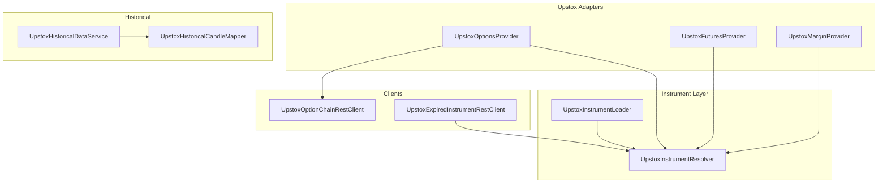
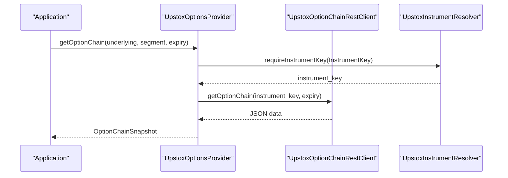
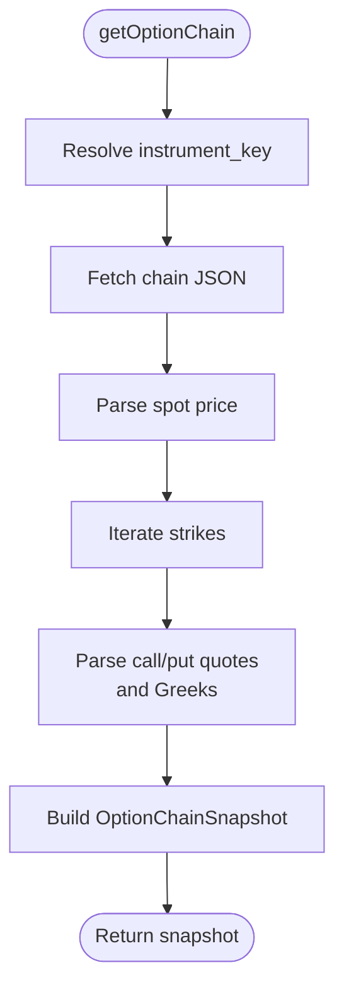
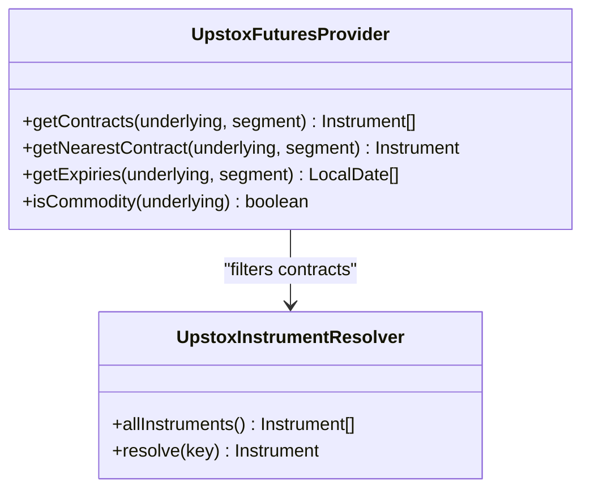
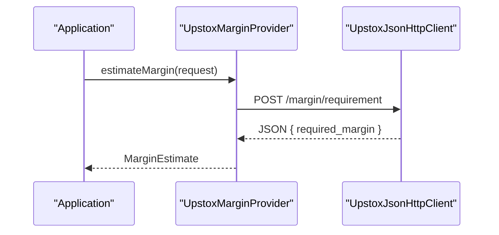
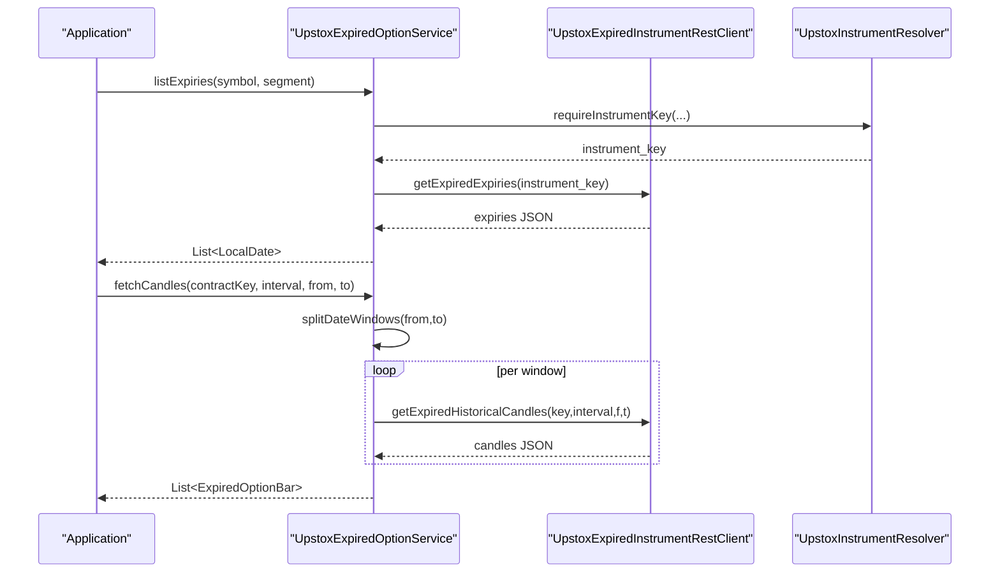
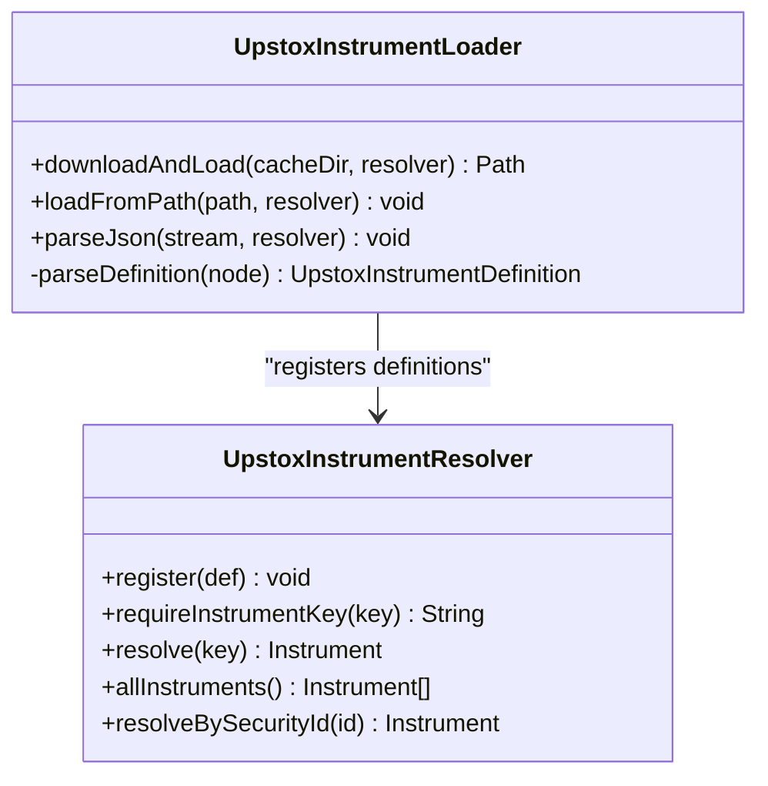
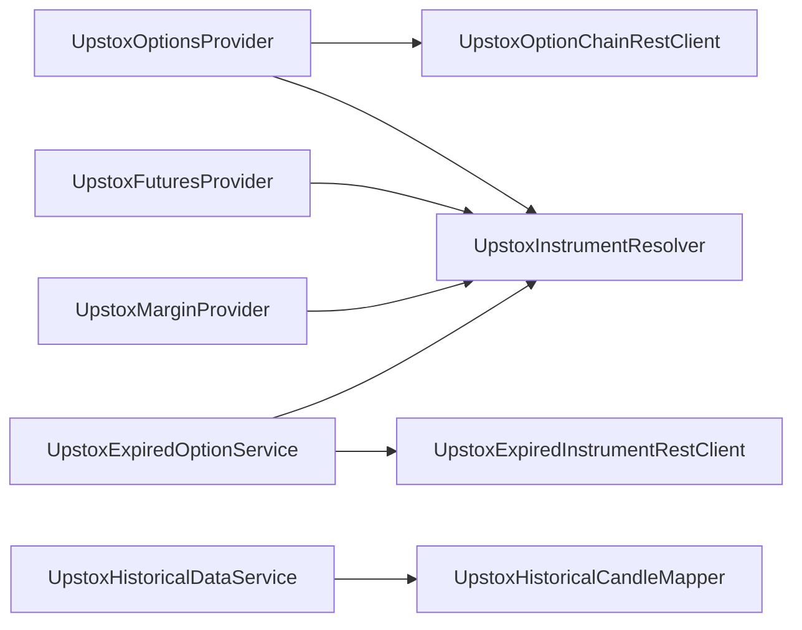

# Derivatives, Options & Futures

<cite>
**Referenced Files in This Document**
- [UpstoxOptionsProvider.java](file://broker/upstox/src/main/java/com/tradej/broker/upstox/adapter/UpstoxOptionsProvider.java)
- [UpstoxFuturesProvider.java](file://broker/upstox/src/main/java/com/tradej/broker/upstox/adapter/UpstoxFuturesProvider.java)
- [UpstoxMarginProvider.java](file://broker/upstox/src/main/java/com/tradej/broker/upstox/adapter/UpstoxMarginProvider.java)
- [UpstoxExpiredOptionService.java](file://broker/upstox/src/main/java/com/tradej/broker/upstox/expired/UpstoxExpiredOptionService.java)
- [UpstoxInstrumentResolver.java](file://broker/upstox/src/main/java/com/tradej/broker/upstox/instrument/UpstoxInstrumentResolver.java)
- [UpstoxInstrumentLoader.java](file://broker/upstox/src/main/java/com/tradej/broker/upstox/instrument/UpstoxInstrumentLoader.java)
- [UpstoxOptionChainRestClient.java](file://broker/upstox/src/main/java/com/tradej/broker/upstox/rest/UpstoxOptionChainRestClient.java)
- [UpstoxExpiredInstrumentRestClient.java](file://broker/upstox/src/main/java/com/tradej/broker/upstox/rest/UpstoxExpiredInstrumentRestClient.java)
- [OptionsProvider.java](file://broker/api/src/main/java/com/tradej/broker/api/port/OptionsProvider.java)
- [FuturesProvider.java](file://broker/api/src/main/java/com/tradej/broker/api/port/FuturesProvider.java)
- [OptionStrikeResolver.java](file://trading/options-analytics/src/main/java/com/tradej/options/service/OptionStrikeResolver.java)
- [UpstoxHistoricalDataService.java](file://broker/upstox/src/main/java/com/tradej/broker/upstox/historical/UpstoxHistoricalDataService.java)
- [UpstoxHistoricalCandleMapper.java](file://broker/upstox/src/main/java/com/tradej/broker/upstox/historical/UpstoxHistoricalCandleMapper.java)
- [UpstoxEndpoints.java](file://broker/upstox/src/main/java/com/tradej/broker/upstox/constants/UpstoxEndpoints.java)
- [UpstoxBrokerConnection.java](file://broker/upstox/src/main/java/com/tradej/broker/upstox/UpstoxBrokerConnection.java)
- [UpstoxMarketFeedIntegrationTest.java](file://app/src/test/java/com/tradej/app/integration/UpstoxMarketFeedIntegrationTest.java)
- [UpstoxExpiredInstrumentsLiveIntegrationTest.java](file://app/src/test/java/com/tradej/app/integration/UpstoxExpiredInstrumentsLiveIntegrationTest.java)
</cite>

## Table of Contents
1. [Introduction](#introduction)
2. [Project Structure](#project-structure)
3. [Core Components](#core-components)
4. [Architecture Overview](#architecture-overview)
5. [Detailed Component Analysis](#detailed-component-analysis)
6. [Dependency Analysis](#dependency-analysis)
7. [Performance Considerations](#performance-considerations)
8. [Troubleshooting Guide](#troubleshooting-guide)
9. [Conclusion](#conclusion)
10. [Appendices](#appendices)

## Introduction
This document explains Upstox derivatives capabilities in the Trade-J codebase, focusing on options and futures trading. It covers:
- Options: chain retrieval, strike selection, and expiration handling
- Futures: contract discovery, nearest contract selection, and expiry listing
- Margin estimation for futures
- Expired options: settlement-aware queries and historical bars
- Instrument resolution, symbol normalization, and contract metadata management
- Practical examples for strategies, Greeks management, and futures position management
- Instrument catalog loading, symbol mapping, and derivative-specific risk management

## Project Structure
The Upstox integration is organized around adapters, clients, resolvers, loaders, and services that implement the broker API ports for options, futures, and margin. Historical and expired instruments are handled via dedicated clients and services.

**Diagram sources**
- [UpstoxOptionsProvider.java:25-36](file://broker/upstox/src/main/java/com/tradej/broker/upstox/adapter/UpstoxOptionsProvider.java#L25-L36)
- [UpstoxFuturesProvider.java:12-18](file://broker/upstox/src/main/java/com/tradej/broker/upstox/adapter/UpstoxFuturesProvider.java#L12-L18)
- [UpstoxMarginProvider.java:14-22](file://broker/upstox/src/main/java/com/tradej/broker/upstox/adapter/UpstoxMarginProvider.java#L14-L22)
- [UpstoxOptionChainRestClient.java:14-20](file://broker/upstox/src/main/java/com/tradej/broker/upstox/rest/UpstoxOptionChainRestClient.java#L14-L20)
- [UpstoxExpiredInstrumentRestClient.java:16-29](file://broker/upstox/src/main/java/com/tradej/broker/upstox/rest/UpstoxExpiredInstrumentRestClient.java#L16-L29)
- [UpstoxInstrumentResolver.java:20-38](file://broker/upstox/src/main/java/com/tradej/broker/upstox/instrument/UpstoxInstrumentResolver.java#L20-L38)
- [UpstoxInstrumentLoader.java:25-40](file://broker/upstox/src/main/java/com/tradej/broker/upstox/instrument/UpstoxInstrumentLoader.java#L25-L40)
- [UpstoxHistoricalDataService.java](file://broker/upstox/src/main/java/com/tradej/broker/upstox/historical/UpstoxHistoricalDataService.java)
- [UpstoxHistoricalCandleMapper.java](file://broker/upstox/src/main/java/com/tradej/broker/upstox/historical/UpstoxHistoricalCandleMapper.java)

**Section sources**
- [UpstoxOptionsProvider.java:25-36](file://broker/upstox/src/main/java/com/tradej/broker/upstox/adapter/UpstoxOptionsProvider.java#L25-L36)
- [UpstoxFuturesProvider.java:12-18](file://broker/upstox/src/main/java/com/tradej/broker/upstox/adapter/UpstoxFuturesProvider.java#L12-L18)
- [UpstoxInstrumentResolver.java:20-38](file://broker/upstox/src/main/java/com/tradej/broker/upstox/instrument/UpstoxInstrumentResolver.java#L20-L38)

## Core Components
- OptionsProvider implementation for Upstox: retrieves expiries, option contracts, option chain snapshots, and Greeks; does not implement rolling expired history semantics.
- FuturesProvider implementation for Upstox: lists contracts, finds nearest contract by expiry, lists expiries, and indicates non-commodity segment.
- MarginProvider implementation for Upstox: estimates margin for futures using a REST endpoint.
- InstrumentResolver and InstrumentLoader: manage contract metadata, symbol normalization, and instrument catalog loading.
- ExpiredOptionService: handles expired options expiries, contracts, and historical candles with date-windowing.
- OptionChainRestClient and ExpiredInstrumentRestClient: REST clients for Upstox endpoints.

**Section sources**
- [OptionsProvider.java:16-28](file://broker/api/src/main/java/com/tradej/broker/api/port/OptionsProvider.java#L16-L28)
- [FuturesProvider.java:9-17](file://broker/api/src/main/java/com/tradej/broker/api/port/FuturesProvider.java#L9-L17)
- [UpstoxOptionsProvider.java:25-36](file://broker/upstox/src/main/java/com/tradej/broker/upstox/adapter/UpstoxOptionsProvider.java#L25-L36)
- [UpstoxFuturesProvider.java:12-18](file://broker/upstox/src/main/java/com/tradej/broker/upstox/adapter/UpstoxFuturesProvider.java#L12-L18)
- [UpstoxMarginProvider.java:14-22](file://broker/upstox/src/main/java/com/tradej/broker/upstox/adapter/UpstoxMarginProvider.java#L14-L22)
- [UpstoxInstrumentResolver.java:20-38](file://broker/upstox/src/main/java/com/tradej/broker/upstox/instrument/UpstoxInstrumentResolver.java#L20-L38)
- [UpstoxInstrumentLoader.java:25-40](file://broker/upstox/src/main/java/com/tradej/broker/upstox/instrument/UpstoxInstrumentLoader.java#L25-L40)
- [UpstoxExpiredOptionService.java:18-34](file://broker/upstox/src/main/java/com/tradej/broker/upstox/expired/UpstoxExpiredOptionService.java#L18-L34)
- [UpstoxOptionChainRestClient.java:14-20](file://broker/upstox/src/main/java/com/tradej/broker/upstox/rest/UpstoxOptionChainRestClient.java#L14-L20)
- [UpstoxExpiredInstrumentRestClient.java:16-29](file://broker/upstox/src/main/java/com/tradej/broker/upstox/rest/UpstoxExpiredInstrumentRestClient.java#L16-L29)

## Architecture Overview
The Upstox adapters implement the broker API ports and delegate to REST clients. Instrument metadata is loaded into a resolver that normalizes symbols and maps domain keys to Upstox instrument keys. Historical and expired data are accessed via specialized clients and services.

**Diagram sources**
- [UpstoxOptionsProvider.java:66-90](file://broker/upstox/src/main/java/com/tradej/broker/upstox/adapter/UpstoxOptionsProvider.java#L66-L90)
- [UpstoxOptionChainRestClient.java:26-28](file://broker/upstox/src/main/java/com/tradej/broker/upstox/rest/UpstoxOptionChainRestClient.java#L26-L28)
- [UpstoxInstrumentResolver.java:43-58](file://broker/upstox/src/main/java/com/tradej/broker/upstox/instrument/UpstoxInstrumentResolver.java#L43-L58)

## Detailed Component Analysis

### Options Trading
- Expiries: resolved via REST and normalized instrument keys; results are sorted and distinct.
- Contracts: filtered from the in-memory instrument catalog by underlying, segment, and expiry.
- Chain snapshot: parsed from REST response, including spot price and per-strike call/put quotes with Greeks.
- Greeks: optional fields mapped into OptionGreeks.
- Strike selection: not implemented in Upstox adapter; use OptionStrikeResolver to select ATM/ITM/OTM strikes from provider.

**Diagram sources**
- [UpstoxOptionsProvider.java:66-90](file://broker/upstox/src/main/java/com/tradej/broker/upstox/adapter/UpstoxOptionsProvider.java#L66-L90)
- [UpstoxOptionChainRestClient.java:26-28](file://broker/upstox/src/main/java/com/tradej/broker/upstox/rest/UpstoxOptionChainRestClient.java#L26-L28)

Practical example: Select ATM/ITM/OTM strikes for a strategy
- Use OptionStrikeResolver to compute a strike based on spot, selection kind, and depth.
- Retrieve call/put contracts for the selected expiry and strike from the options provider.

**Section sources**
- [UpstoxOptionsProvider.java:38-53](file://broker/upstox/src/main/java/com/tradej/broker/upstox/adapter/UpstoxOptionsProvider.java#L38-L53)
- [UpstoxOptionsProvider.java:55-63](file://broker/upstox/src/main/java/com/tradej/broker/upstox/adapter/UpstoxOptionsProvider.java#L55-L63)
- [UpstoxOptionsProvider.java:65-90](file://broker/upstox/src/main/java/com/tradej/broker/upstox/adapter/UpstoxOptionsProvider.java#L65-L90)
- [UpstoxOptionsProvider.java:92-100](file://broker/upstox/src/main/java/com/tradej/broker/upstox/adapter/UpstoxOptionsProvider.java#L92-L100)
- [OptionStrikeResolver.java:22-57](file://trading/options-analytics/src/main/java/com/tradej/options/service/OptionStrikeResolver.java#L22-L57)
- [OptionsProvider.java:16-28](file://broker/api/src/main/java/com/tradej/broker/api/port/OptionsProvider.java#L16-L28)

### Futures Trading
- Contracts: filter instruments by type prefix indicating futures.
- Nearest contract: minimum expiry among available futures.
- Expiries: collect distinct expiries from futures contracts.
- Commodity flag: Upstox futures provider reports non-commodity for its segments.

**Diagram sources**
- [UpstoxFuturesProvider.java:12-18](file://broker/upstox/src/main/java/com/tradej/broker/upstox/adapter/UpstoxFuturesProvider.java#L12-L18)
- [UpstoxInstrumentResolver.java:100-102](file://broker/upstox/src/main/java/com/tradej/broker/upstox/instrument/UpstoxInstrumentResolver.java#L100-L102)

**Section sources**
- [UpstoxFuturesProvider.java:20-45](file://broker/upstox/src/main/java/com/tradej/broker/upstox/adapter/UpstoxFuturesProvider.java#L20-L45)
- [UpstoxInstrumentResolver.java:100-102](file://broker/upstox/src/main/java/com/tradej/broker/upstox/instrument/UpstoxInstrumentResolver.java#L100-L102)

### Margin Requirements
- Futures margin estimation uses a REST endpoint with instrument_key, quantity, price, and transaction side.
- Response maps to a MarginEstimate with required margin.

**Diagram sources**
- [UpstoxMarginProvider.java:24-42](file://broker/upstox/src/main/java/com/tradej/broker/upstox/adapter/UpstoxMarginProvider.java#L24-L42)
- [UpstoxEndpoints.java](file://broker/upstox/src/main/java/com/tradej/broker/upstox/constants/UpstoxEndpoints.java)

**Section sources**
- [UpstoxMarginProvider.java:24-42](file://broker/upstox/src/main/java/com/tradej/broker/upstox/adapter/UpstoxMarginProvider.java#L24-L42)

### Expired Options Handling and Settlement
- Upstox does not support rolling offset semantics for expired option history; use contract-native APIs.
- ExpiredOptionService resolves instrument keys, lists expiries, lists contracts, and fetches historical candles with date-windowing to avoid API limits.

**Diagram sources**
- [UpstoxExpiredOptionService.java:43-86](file://broker/upstox/src/main/java/com/tradej/broker/upstox/expired/UpstoxExpiredOptionService.java#L43-L86)
- [UpstoxExpiredInstrumentRestClient.java:31-67](file://broker/upstox/src/main/java/com/tradej/broker/upstox/rest/UpstoxExpiredInstrumentRestClient.java#L31-L67)
- [UpstoxInstrumentResolver.java:36-41](file://broker/upstox/src/main/java/com/tradej/broker/upstox/instrument/UpstoxInstrumentResolver.java#L36-L41)

**Section sources**
- [UpstoxOptionsProvider.java:102-108](file://broker/upstox/src/main/java/com/tradej/broker/upstox/adapter/UpstoxOptionsProvider.java#L102-L108)
- [UpstoxExpiredOptionService.java:18-34](file://broker/upstox/src/main/java/com/tradej/broker/upstox/expired/UpstoxExpiredOptionService.java#L18-L34)
- [UpstoxExpiredInstrumentRestClient.java:16-29](file://broker/upstox/src/main/java/com/tradej/broker/upstox/rest/UpstoxExpiredInstrumentRestClient.java#L16-L29)

### Instrument Resolution, Symbol Normalization, and Contract Metadata
- InstrumentResolver maintains maps for instrument_key, domain keys, and tokens; supports normalized symbol lookup.
- InstrumentLoader downloads and parses the Upstox instrument master (JSON/GZ), mapping fields to Instrument records and registering them into the resolver.
- Segment mapping supports legacy exchanges and modern segments.

**Diagram sources**
- [UpstoxInstrumentLoader.java:25-40](file://broker/upstox/src/main/java/com/tradej/broker/upstox/instrument/UpstoxInstrumentLoader.java#L25-L40)
- [UpstoxInstrumentLoader.java:83-95](file://broker/upstox/src/main/java/com/tradej/broker/upstox/instrument/UpstoxInstrumentLoader.java#L83-L95)
- [UpstoxInstrumentResolver.java:20-38](file://broker/upstox/src/main/java/com/tradej/broker/upstox/instrument/UpstoxInstrumentResolver.java#L20-L38)

**Section sources**
- [UpstoxInstrumentResolver.java:43-58](file://broker/upstox/src/main/java/com/tradej/broker/upstox/instrument/UpstoxInstrumentResolver.java#L43-L58)
- [UpstoxInstrumentResolver.java:84-92](file://broker/upstox/src/main/java/com/tradej/broker/upstox/instrument/UpstoxInstrumentResolver.java#L84-L92)
- [UpstoxInstrumentLoader.java:97-124](file://broker/upstox/src/main/java/com/tradej/broker/upstox/instrument/UpstoxInstrumentLoader.java#L97-L124)
- [UpstoxInstrumentLoader.java:142-155](file://broker/upstox/src/main/java/com/tradej/broker/upstox/instrument/UpstoxInstrumentLoader.java#L142-L155)

### Historical Option Data Access
- Historical data is accessed via UpstoxHistoricalDataService and mapped via UpstoxHistoricalCandleMapper.
- Integration tests demonstrate live market feed and historical data retrieval.

**Section sources**
- [UpstoxHistoricalDataService.java](file://broker/upstox/src/main/java/com/tradej/broker/upstox/historical/UpstoxHistoricalDataService.java)
- [UpstoxHistoricalCandleMapper.java](file://broker/upstox/src/main/java/com/tradej/broker/upstox/historical/UpstoxHistoricalCandleMapper.java)
- [UpstoxMarketFeedIntegrationTest.java](file://app/src/test/java/com/tradej/app/integration/UpstoxMarketFeedIntegrationTest.java)
- [UpstoxExpiredInstrumentsLiveIntegrationTest.java](file://app/src/test/java/com/tradej/app/integration/UpstoxExpiredInstrumentsLiveIntegrationTest.java)

### Practical Examples

#### Implementing an Options Strategy (e.g., Long Straddle)
- Step 1: Get expiries and choose nearest/third Friday.
- Step 2: Compute ATM strike using OptionStrikeResolver.
- Step 3: Retrieve call and put contracts for the strike and expiry.
- Step 4: Place orders via order adapters and monitor Greeks via OptionsProvider.getGreeks.

**Section sources**
- [OptionStrikeResolver.java:22-57](file://trading/options-analytics/src/main/java/com/tradej/options/service/OptionStrikeResolver.java#L22-L57)
- [UpstoxOptionsProvider.java:92-100](file://broker/upstox/src/main/java/com/tradej/broker/upstox/adapter/UpstoxOptionsProvider.java#L92-L100)

#### Managing Option Greeks
- Use OptionsProvider.getGreeks to fetch delta, gamma, theta, vega, and IV.
- Track Greeks across strikes and expiries to adjust hedge ratios and monitor decay.

**Section sources**
- [UpstoxOptionsProvider.java:92-100](file://broker/upstox/src/main/java/com/tradej/broker/upstox/adapter/UpstoxOptionsProvider.java#L92-L100)
- [OptionsProvider.java:23-23](file://broker/api/src/main/java/com/tradej/broker/api/port/OptionsProvider.java#L23-L23)

#### Futures Position Management
- Use FuturesProvider to discover contracts and nearest contract.
- Estimate margins via UpstoxMarginProvider for sizing and risk controls.
- Monitor underlying expiries to roll positions proactively.

**Section sources**
- [UpstoxFuturesProvider.java:29-45](file://broker/upstox/src/main/java/com/tradej/broker/upstox/adapter/UpstoxFuturesProvider.java#L29-L45)
- [UpstoxMarginProvider.java:24-42](file://broker/upstox/src/main/java/com/tradej/broker/upstox/adapter/UpstoxMarginProvider.java#L24-L42)

#### Instrument Catalog Loading and Symbol Mapping
- Download and load the instrument master using UpstoxInstrumentLoader.
- Resolve instrument keys and symbols via UpstoxInstrumentResolver.
- Use normalized symbols for consistent cross-module behavior.

**Section sources**
- [UpstoxInstrumentLoader.java:45-63](file://broker/upstox/src/main/java/com/tradej/broker/upstox/instrument/UpstoxInstrumentLoader.java#L45-L63)
- [UpstoxInstrumentLoader.java:83-95](file://broker/upstox/src/main/java/com/tradej/broker/upstox/instrument/UpstoxInstrumentLoader.java#L83-L95)
- [UpstoxInstrumentResolver.java:43-58](file://broker/upstox/src/main/java/com/tradej/broker/upstox/instrument/UpstoxInstrumentResolver.java#L43-L58)

#### Derivative-Specific Risk Management
- Options: monitor theta decay, Vega sensitivity, and IV term structure; use Greeks to dynamically hedge deltas.
- Futures: track basis risk, roll timing based on expiries, and enforce margin buffers.

[No sources needed since this section provides general guidance]

## Dependency Analysis
The Upstox adapters depend on REST clients and the instrument resolver. Historical and expired services depend on REST clients and the resolver. The broker API ports define the contracts that adapters implement.

**Diagram sources**
- [UpstoxOptionsProvider.java:29-35](file://broker/upstox/src/main/java/com/tradej/broker/upstox/adapter/UpstoxOptionsProvider.java#L29-L35)
- [UpstoxFuturesProvider.java:14-17](file://broker/upstox/src/main/java/com/tradej/broker/upstox/adapter/UpstoxFuturesProvider.java#L14-L17)
- [UpstoxMarginProvider.java:18-21](file://broker/upstox/src/main/java/com/tradej/broker/upstox/adapter/UpstoxMarginProvider.java#L18-L21)
- [UpstoxExpiredOptionService.java:22-33](file://broker/upstox/src/main/java/com/tradej/broker/upstox/expired/UpstoxExpiredOptionService.java#L22-L33)
- [UpstoxOptionChainRestClient.java:14-20](file://broker/upstox/src/main/java/com/tradej/broker/upstox/rest/UpstoxOptionChainRestClient.java#L14-L20)
- [UpstoxExpiredInstrumentRestClient.java:16-29](file://broker/upstox/src/main/java/com/tradej/broker/upstox/rest/UpstoxExpiredInstrumentRestClient.java#L16-L29)

**Section sources**
- [UpstoxBrokerConnection.java](file://broker/upstox/src/main/java/com/tradej/broker/upstox/UpstoxBrokerConnection.java)

## Performance Considerations
- Instrument catalog size: resolver caches are concurrent maps; ensure the catalog is loaded once and reused.
- REST calls: batch requests where possible; leverage instrument key lookups to avoid repeated symbol normalization.
- Expired candles: date-windowing prevents hitting API limits; tune window size for throughput vs. latency.
- Margin estimation: keep payload minimal and reuse client instances.

[No sources needed since this section provides general guidance]

## Troubleshooting Guide
- No instrument_key found: ensure the instrument catalog is loaded before resolving keys.
- Empty option chain: verify instrument_key and expiry formatting; confirm segment mapping.
- Expired history errors: ensure the contract key is correct and dates are within supported range; check date-window boundaries.
- Margin estimation failures: validate instrument_key and payload fields.

**Section sources**
- [UpstoxInstrumentResolver.java:56-58](file://broker/upstox/src/main/java/com/tradej/broker/upstox/instrument/UpstoxInstrumentResolver.java#L56-L58)
- [UpstoxExpiredOptionService.java:70-72](file://broker/upstox/src/main/java/com/tradej/broker/upstox/expired/UpstoxExpiredOptionService.java#L70-L72)

## Conclusion
The Trade-J Upstox integration provides robust support for options and futures trading, instrument metadata management, and expired instruments. By leveraging adapters, resolvers, and REST clients, applications can implement strategies, manage risk via Greeks and margins, and handle settlement and historical data effectively.

[No sources needed since this section summarizes without analyzing specific files]

## Appendices

### API Ports Implemented by Upstox
- OptionsProvider: expiries, contracts, chain snapshot, Greeks, expired history semantics, strike selection.
- FuturesProvider: contracts, nearest contract, expiries, commodity flag.
- MarginProvider: futures margin estimation.

**Section sources**
- [OptionsProvider.java:16-28](file://broker/api/src/main/java/com/tradej/broker/api/port/OptionsProvider.java#L16-L28)
- [FuturesProvider.java:9-17](file://broker/api/src/main/java/com/tradej/broker/api/port/FuturesProvider.java#L9-L17)