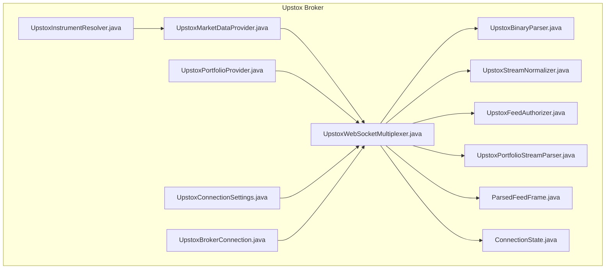
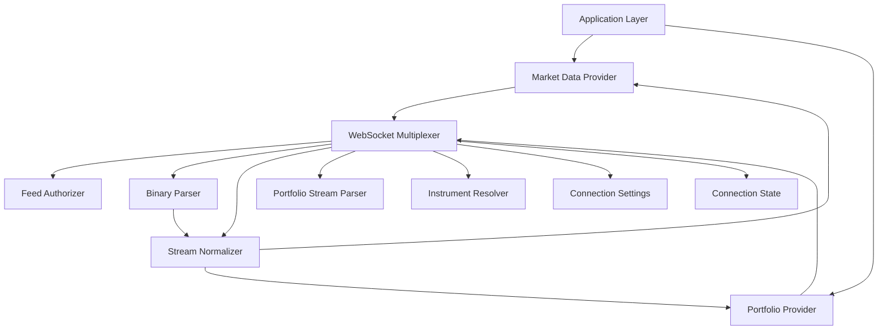
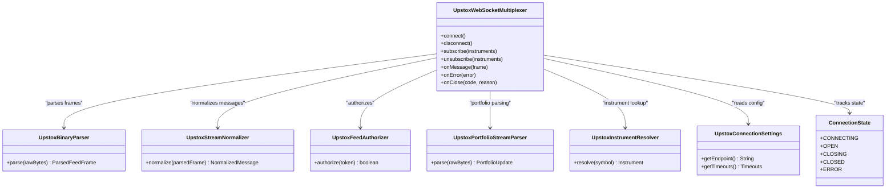
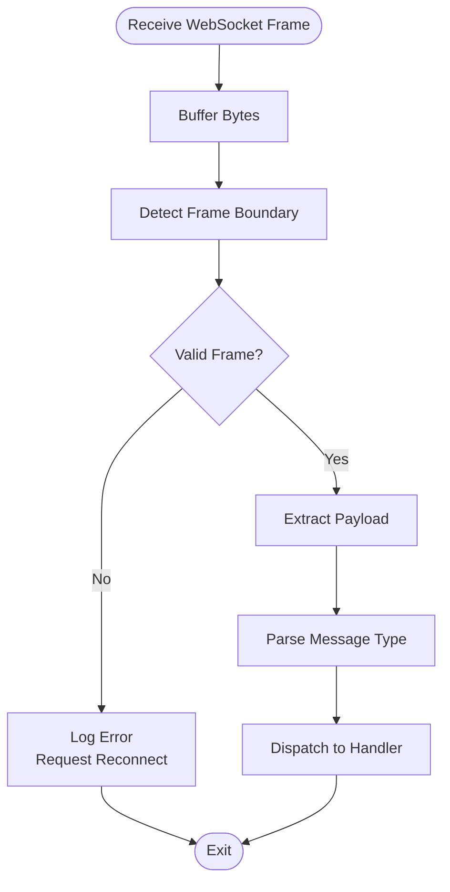
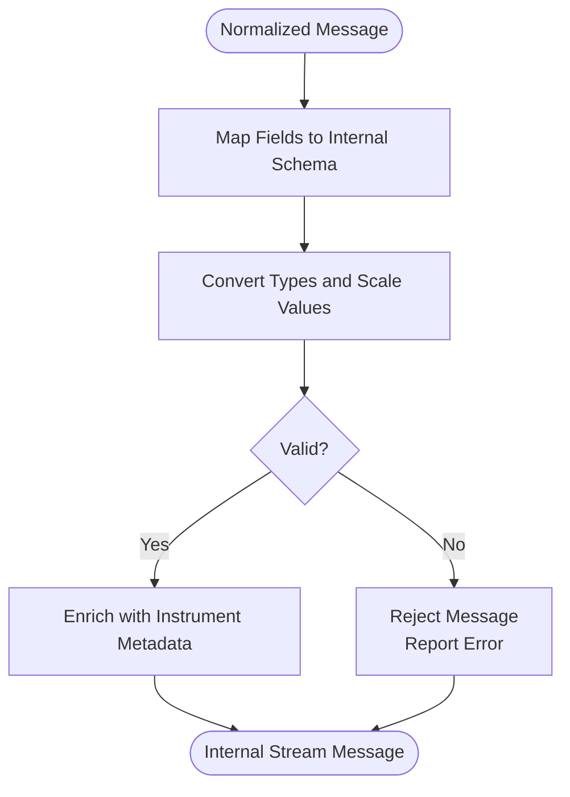
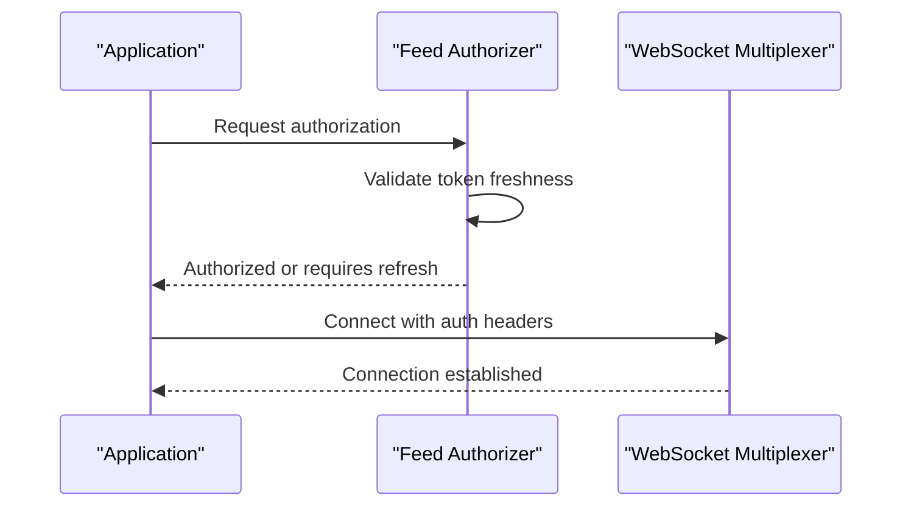
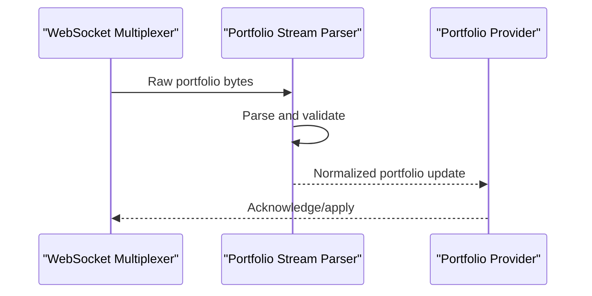
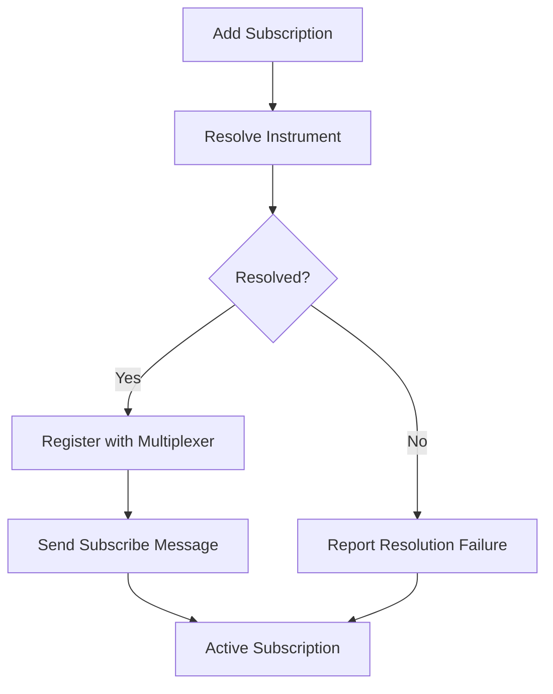
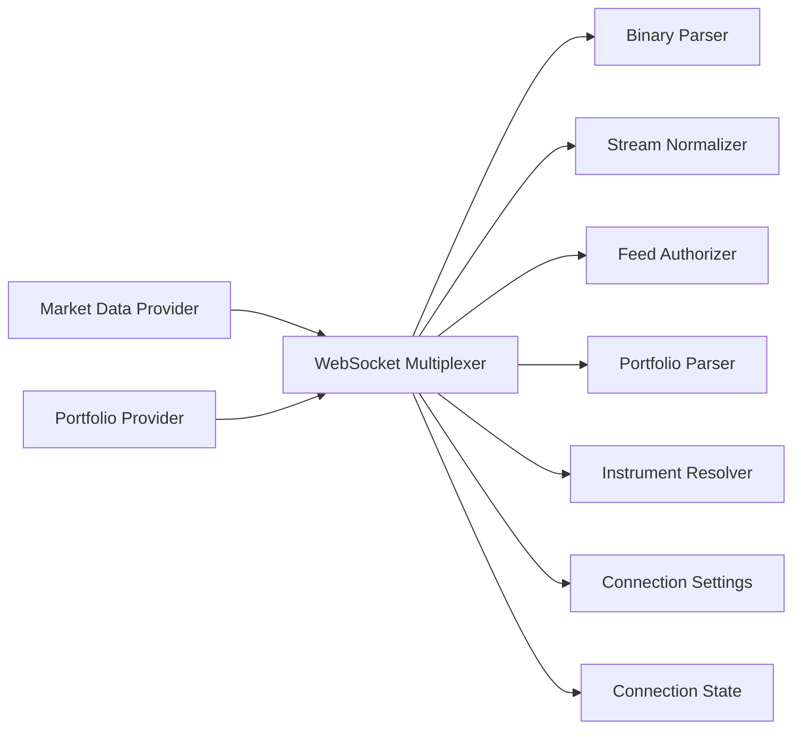

# Market Data Streaming

<cite>
**Referenced Files in This Document**
- [UpstoxWebSocketMultiplexer.java](file://broker/upstox/src/main/java/com/tradej/broker/upstox/websocket/UpstoxWebSocketMultiplexer.java)
- [UpstoxBinaryParser.java](file://broker/upstox/src/main/java/com/tradej/broker/upstox/websocket/UpstoxBinaryParser.java)
- [UpstoxStreamNormalizer.java](file://broker/upstox/src/main/java/com/tradej/broker/upstox/websocket/UpstoxStreamNormalizer.java)
- [UpstoxFeedAuthorizer.java](file://broker/upstox/src/main/java/com/tradej/broker/upstox/websocket/UpstoxFeedAuthorizer.java)
- [UpstoxPortfolioStreamParser.java](file://broker/upstox/src/main/java/com/tradej/broker/upstox/websocket/UpstoxPortfolioStreamParser.java)
- [ParsedFeedFrame.java](file://broker/upstox/src/main/java/com/tradej/broker/upstox/websocket/ParsedFeedFrame.java)
- [ConnectionState.java](file://broker/upstox/src/main/java/com/tradej/broker/upstox/websocket/ConnectionState.java)
- [UpstoxMarketDataProvider.java](file://broker/upstox/src/main/java/com/tradej/broker/upstox/adapter/UpstoxMarketDataProvider.java)
- [UpstoxPortfolioProvider.java](file://broker/upstox/src/main/java/com/tradej/broker/upstox/adapter/UpstoxPortfolioProvider.java)
- [UpstoxInstrumentResolver.java](file://broker/upstox/src/main/java/com/tradej/broker/upstox/instrument/UpstoxInstrumentResolver.java)
- [UpstoxConnectionSettings.java](file://broker/upstox/src/main/java/com/tradej/broker/upstox/config/UpstoxConnectionSettings.java)
- [UpstoxBrokerConnection.java](file://broker/upstox/src/main/java/com/tradej/broker/upstox/UpstoxBrokerConnection.java)
- [UpstoxMarketFeedIntegrationTest.java](file://app/src/test/java/com/tradej/app/integration/UpstoxMarketFeedIntegrationTest.java)
- [LiveUpstoxTestSupport.java](file://app/src/test/java/com/tradej/app/integration/LiveUpstoxTestSupport.java)
- [GatewayWebSocketLifecycleTest.java](file://app/src/test/java/com/tradej/app/integration/GatewayWebSocketLifecycleTest.java)
- [SubscriptionCoordinatorTest.java](file://app/src/test/java/com/tradej/app/subscription/SubscriptionCoordinatorTest.java)
- [SubscriptionManagerTest.java](file://app/src/test/java/com/tradej/app/subscription/SubscriptionManagerTest.java)
- [SubscriptionRecoveryReconnectComponentTest.java](file://app/src/test/java/com/tradej/app/subscription/SubscriptionRecoveryReconnectComponentTest.java)
- [MarketDataHealthIndicatorTest.java](file://app/src/test/java/com/tradej/app/health/MarketDataHealthIndicatorTest.java)
- [UpstoxHealthIndicatorTest.java](file://app/src/test/java/com/tradej/app/health/UpstoxHealthIndicatorTest.java)
</cite>

## Table of Contents
1. [Introduction](#introduction)
2. [Project Structure](#project-structure)
3. [Core Components](#core-components)
4. [Architecture Overview](#architecture-overview)
5. [Detailed Component Analysis](#detailed-component-analysis)
6. [Dependency Analysis](#dependency-analysis)
7. [Performance Considerations](#performance-considerations)
8. [Troubleshooting Guide](#troubleshooting-guide)
9. [Conclusion](#conclusion)
10. [Appendices](#appendices)

## Introduction
This document explains the Upstox market data streaming implementation within the system. It covers WebSocket connection establishment, feed authorization, real-time quote delivery, binary protocol parsing, message framing, data normalization, market depth streaming, order book updates, portfolio stream handling, subscription management, instrument resolution, and connection health monitoring. Practical examples demonstrate setting up market data feeds, handling connection drops, and building resilient streaming architectures. Performance optimization, bandwidth considerations, and error recovery strategies are also addressed.

## Project Structure
The Upstox streaming stack resides under the Upstox broker module and integrates with adapters for market data and portfolio streams, along with supporting components for instrumentation, authorization, and connection lifecycle management.

**Diagram sources**
- [UpstoxWebSocketMultiplexer.java](file://broker/upstox/src/main/java/com/tradej/broker/upstox/websocket/UpstoxWebSocketMultiplexer.java)
- [UpstoxBinaryParser.java](file://broker/upstox/src/main/java/com/tradej/broker/upstox/websocket/UpstoxBinaryParser.java)
- [UpstoxStreamNormalizer.java](file://broker/upstox/src/main/java/com/tradej/broker/upstox/websocket/UpstoxStreamNormalizer.java)
- [UpstoxFeedAuthorizer.java](file://broker/upstox/src/main/java/com/tradej/broker/upstox/websocket/UpstoxFeedAuthorizer.java)
- [UpstoxPortfolioStreamParser.java](file://broker/upstox/src/main/java/com/tradej/broker/upstox/websocket/UpstoxPortfolioStreamParser.java)
- [ParsedFeedFrame.java](file://broker/upstox/src/main/java/com/tradej/broker/upstox/websocket/ParsedFeedFrame.java)
- [ConnectionState.java](file://broker/upstox/src/main/java/com/tradej/broker/upstox/websocket/ConnectionState.java)
- [UpstoxMarketDataProvider.java](file://broker/upstox/src/main/java/com/tradej/broker/upstox/adapter/UpstoxMarketDataProvider.java)
- [UpstoxPortfolioProvider.java](file://broker/upstox/src/main/java/com/tradej/broker/upstox/adapter/UpstoxPortfolioProvider.java)
- [UpstoxInstrumentResolver.java](file://broker/upstox/src/main/java/com/tradej/broker/upstox/instrument/UpstoxInstrumentResolver.java)
- [UpstoxConnectionSettings.java](file://broker/upstox/src/main/java/com/tradej/broker/upstox/config/UpstoxConnectionSettings.java)
- [UpstoxBrokerConnection.java](file://broker/upstox/src/main/java/com/tradej/broker/upstox/UpstoxBrokerConnection.java)

**Section sources**
- [UpstoxWebSocketMultiplexer.java](file://broker/upstox/src/main/java/com/tradej/broker/upstox/websocket/UpstoxWebSocketMultiplexer.java)
- [UpstoxConnectionSettings.java](file://broker/upstox/src/main/java/com/tradej/broker/upstox/config/UpstoxConnectionSettings.java)
- [UpstoxBrokerConnection.java](file://broker/upstox/src/main/java/com/tradej/broker/upstox/UpstoxBrokerConnection.java)

## Core Components
- WebSocket Multiplexer: Orchestrates connection lifecycle, subscription management, and dispatch of parsed messages to appropriate handlers.
- Binary Parser: Decodes raw binary frames into structured feed messages.
- Stream Normalizer: Transforms vendor-specific message formats into unified internal representations.
- Feed Authorizer: Manages authorization tokens and handshake sequences for feed access.
- Portfolio Stream Parser: Parses portfolio-specific streaming updates.
- Instrument Resolver: Resolves instrument identifiers and metadata for subscriptions.
- Connection Settings: Provides environment-specific configuration for WebSocket endpoints and timeouts.
- Market Data Provider and Portfolio Provider: Adapters exposing normalized market data and portfolio streams to the broader system.

**Section sources**
- [UpstoxWebSocketMultiplexer.java](file://broker/upstox/src/main/java/com/tradej/broker/upstox/websocket/UpstoxWebSocketMultiplexer.java)
- [UpstoxBinaryParser.java](file://broker/upstox/src/main/java/com/tradej/broker/upstox/websocket/UpstoxBinaryParser.java)
- [UpstoxStreamNormalizer.java](file://broker/upstox/src/main/java/com/tradej/broker/upstox/websocket/UpstoxStreamNormalizer.java)
- [UpstoxFeedAuthorizer.java](file://broker/upstox/src/main/java/com/tradej/broker/upstox/websocket/UpstoxFeedAuthorizer.java)
- [UpstoxPortfolioStreamParser.java](file://broker/upstox/src/main/java/com/tradej/broker/upstox/websocket/UpstoxPortfolioStreamParser.java)
- [UpstoxInstrumentResolver.java](file://broker/upstox/src/main/java/com/tradej/broker/upstox/instrument/UpstoxInstrumentResolver.java)
- [UpstoxConnectionSettings.java](file://broker/upstox/src/main/java/com/tradej/broker/upstox/config/UpstoxConnectionSettings.java)
- [UpstoxMarketDataProvider.java](file://broker/upstox/src/main/java/com/tradej/broker/upstox/adapter/UpstoxMarketDataProvider.java)
- [UpstoxPortfolioProvider.java](file://broker/upstox/src/main/java/com/tradej/broker/upstox/adapter/UpstoxPortfolioProvider.java)

## Architecture Overview
The streaming architecture follows a layered pattern:
- Transport Layer: WebSocket multiplexer manages connections and subscriptions.
- Parsing Layer: Binary parser decodes frames; normalizer standardizes messages.
- Business Layer: Market data and portfolio providers expose normalized streams.
- Instrumentation Layer: Instrument resolver and connection settings support discovery and configuration.
- Health Monitoring: Tests and health indicators track connection and feed reliability.

**Diagram sources**
- [UpstoxWebSocketMultiplexer.java](file://broker/upstox/src/main/java/com/tradej/broker/upstox/websocket/UpstoxWebSocketMultiplexer.java)
- [UpstoxBinaryParser.java](file://broker/upstox/src/main/java/com/tradej/broker/upstox/websocket/UpstoxBinaryParser.java)
- [UpstoxStreamNormalizer.java](file://broker/upstox/src/main/java/com/tradej/broker/upstox/websocket/UpstoxStreamNormalizer.java)
- [UpstoxPortfolioStreamParser.java](file://broker/upstox/src/main/java/com/tradej/broker/upstox/websocket/UpstoxPortfolioStreamParser.java)
- [UpstoxFeedAuthorizer.java](file://broker/upstox/src/main/java/com/tradej/broker/upstox/websocket/UpstoxFeedAuthorizer.java)
- [UpstoxInstrumentResolver.java](file://broker/upstox/src/main/java/com/tradej/broker/upstox/instrument/UpstoxInstrumentResolver.java)
- [UpstoxConnectionSettings.java](file://broker/upstox/src/main/java/com/tradej/broker/upstox/config/UpstoxConnectionSettings.java)
- [ConnectionState.java](file://broker/upstox/src/main/java/com/tradej/broker/upstox/websocket/ConnectionState.java)
- [UpstoxMarketDataProvider.java](file://broker/upstox/src/main/java/com/tradej/broker/upstox/adapter/UpstoxMarketDataProvider.java)
- [UpstoxPortfolioProvider.java](file://broker/upstox/src/main/java/com/tradej/broker/upstox/adapter/UpstoxPortfolioProvider.java)

## Detailed Component Analysis

### WebSocket Multiplexer
Responsibilities:
- Establish and maintain WebSocket connections.
- Manage subscription lists and dispatch incoming messages to handlers.
- Coordinate authorization, parsing, and normalization stages.
- Track connection state transitions and health.

Key behaviors:
- Connection lifecycle orchestration.
- Subscription aggregation and per-stream routing.
- Error propagation and recovery signaling.

**Diagram sources**
- [UpstoxWebSocketMultiplexer.java](file://broker/upstox/src/main/java/com/tradej/broker/upstox/websocket/UpstoxWebSocketMultiplexer.java)
- [UpstoxBinaryParser.java](file://broker/upstox/src/main/java/com/tradej/broker/upstox/websocket/UpstoxBinaryParser.java)
- [UpstoxStreamNormalizer.java](file://broker/upstox/src/main/java/com/tradej/broker/upstox/websocket/UpstoxStreamNormalizer.java)
- [UpstoxFeedAuthorizer.java](file://broker/upstox/src/main/java/com/tradej/broker/upstox/websocket/UpstoxFeedAuthorizer.java)
- [UpstoxPortfolioStreamParser.java](file://broker/upstox/src/main/java/com/tradej/broker/upstox/websocket/UpstoxPortfolioStreamParser.java)
- [UpstoxInstrumentResolver.java](file://broker/upstox/src/main/java/com/tradej/broker/upstox/instrument/UpstoxInstrumentResolver.java)
- [UpstoxConnectionSettings.java](file://broker/upstox/src/main/java/com/tradej/broker/upstox/config/UpstoxConnectionSettings.java)
- [ConnectionState.java](file://broker/upstox/src/main/java/com/tradej/broker/upstox/websocket/ConnectionState.java)

**Section sources**
- [UpstoxWebSocketMultiplexer.java](file://broker/upstox/src/main/java/com/tradej/broker/upstox/websocket/UpstoxWebSocketMultiplexer.java)
- [ConnectionState.java](file://broker/upstox/src/main/java/com/tradej/broker/upstox/websocket/ConnectionState.java)

### Binary Protocol Parsing and Message Framing
Responsibilities:
- Decode raw binary WebSocket frames into structured feed frames.
- Identify message boundaries and handle partial reads.
- Validate frame integrity and extract payload segments.

Processing logic:
- Frame detection and buffering.
- Payload extraction and type identification.
- Error handling for malformed frames.

**Diagram sources**
- [UpstoxBinaryParser.java](file://broker/upstox/src/main/java/com/tradej/broker/upstox/websocket/UpstoxBinaryParser.java)
- [ParsedFeedFrame.java](file://broker/upstox/src/main/java/com/tradej/broker/upstox/websocket/ParsedFeedFrame.java)

**Section sources**
- [UpstoxBinaryParser.java](file://broker/upstox/src/main/java/com/tradej/broker/upstox/websocket/UpstoxBinaryParser.java)
- [ParsedFeedFrame.java](file://broker/upstox/src/main/java/com/tradej/broker/upstox/websocket/ParsedFeedFrame.java)

### Stream Normalization
Responsibilities:
- Convert vendor-specific message formats into unified internal representations.
- Enforce consistent field naming and data types across streams.
- Support market depth and portfolio update normalization.

Processing logic:
- Schema mapping and field alignment.
- Data type conversion and scaling.
- Validation and enrichment with instrument metadata.

**Diagram sources**
- [UpstoxStreamNormalizer.java](file://broker/upstox/src/main/java/com/tradej/broker/upstox/websocket/UpstoxStreamNormalizer.java)

**Section sources**
- [UpstoxStreamNormalizer.java](file://broker/upstox/src/main/java/com/tradej/broker/upstox/websocket/UpstoxStreamNormalizer.java)

### Feed Authorization
Responsibilities:
- Manage OAuth/PKCE-based authorization for feed access.
- Refresh tokens and handle expiry scenarios.
- Coordinate handshake with the WebSocket endpoint.

Processing logic:
- Token acquisition and storage.
- Authorization header injection for WebSocket upgrade.
- Retry on transient authorization failures.

**Diagram sources**
- [UpstoxFeedAuthorizer.java](file://broker/upstox/src/main/java/com/tradej/broker/upstox/websocket/UpstoxFeedAuthorizer.java)
- [UpstoxWebSocketMultiplexer.java](file://broker/upstox/src/main/java/com/tradej/broker/upstox/websocket/UpstoxWebSocketMultiplexer.java)

**Section sources**
- [UpstoxFeedAuthorizer.java](file://broker/upstox/src/main/java/com/tradej/broker/upstox/websocket/UpstoxFeedAuthorizer.java)

### Portfolio Stream Handling
Responsibilities:
- Parse portfolio-specific streaming updates.
- Normalize positions, holdings, and account balances.
- Route updates to portfolio provider for downstream consumption.

Processing logic:
- Identify portfolio message types.
- Extract position and balance fields.
- Apply normalization and validation.

**Diagram sources**
- [UpstoxPortfolioStreamParser.java](file://broker/upstox/src/main/java/com/tradej/broker/upstox/websocket/UpstoxPortfolioStreamParser.java)
- [UpstoxPortfolioProvider.java](file://broker/upstox/src/main/java/com/tradej/broker/upstox/adapter/UpstoxPortfolioProvider.java)

**Section sources**
- [UpstoxPortfolioStreamParser.java](file://broker/upstox/src/main/java/com/tradej/broker/upstox/websocket/UpstoxPortfolioStreamParser.java)
- [UpstoxPortfolioProvider.java](file://broker/upstox/src/main/java/com/tradej/broker/upstox/adapter/UpstoxPortfolioProvider.java)

### Market Depth Streaming and Order Book Updates
Market depth streaming is handled through the multiplexer and normalized market data provider. Subscriptions aggregate instruments, and the binary parser delivers depth messages that are normalized into internal representations for order book updates.

Key considerations:
- Efficient subscription batching to reduce overhead.
- Real-time normalization of depth levels and timestamps.
- Robust handling of incremental vs full-book updates.

[No sources needed since this section synthesizes behavior without analyzing specific files]

### Subscription Management and Instrument Resolution
Responsibilities:
- Aggregate instrument subscriptions and manage per-stream routing.
- Resolve instrument identifiers to ensure accurate feed targeting.
- Recover from subscription errors and re-establish missing subscriptions.

Processing logic:
- Subscription registration and de-duplication.
- Instrument resolution via resolver.
- Recovery and re-subscription on connection events.

**Diagram sources**
- [UpstoxInstrumentResolver.java](file://broker/upstox/src/main/java/com/tradej/broker/upstox/instrument/UpstoxInstrumentResolver.java)
- [UpstoxWebSocketMultiplexer.java](file://broker/upstox/src/main/java/com/tradej/broker/upstox/websocket/UpstoxWebSocketMultiplexer.java)

**Section sources**
- [UpstoxInstrumentResolver.java](file://broker/upstox/src/main/java/com/tradej/broker/upstox/instrument/UpstoxInstrumentResolver.java)
- [UpstoxWebSocketMultiplexer.java](file://broker/upstox/src/main/java/com/tradej/broker/upstox/websocket/UpstoxWebSocketMultiplexer.java)

### Connection Health Monitoring
Health monitoring is supported by dedicated tests and health indicators that validate:
- WebSocket lifecycle stability.
- Feed availability and latency.
- Authorization and subscription health.

Practices:
- Periodic liveness checks.
- Error counters and alert thresholds.
- Automated recovery triggers on sustained failures.

**Section sources**
- [GatewayWebSocketLifecycleTest.java](file://app/src/test/java/com/tradej/app/integration/GatewayWebSocketLifecycleTest.java)
- [MarketDataHealthIndicatorTest.java](file://app/src/test/java/com/tradej/app/health/MarketDataHealthIndicatorTest.java)
- [UpstoxHealthIndicatorTest.java](file://app/src/test/java/com/tradej/app/health/UpstoxHealthIndicatorTest.java)

### Practical Examples

#### Setting Up Market Data Feeds
Steps:
- Initialize connection settings with endpoint and timeouts.
- Create a WebSocket multiplexer instance.
- Configure authorization with the feed authorizer.
- Subscribe to instruments via the instrument resolver.
- Start the multiplexer and monitor health.

References:
- [UpstoxConnectionSettings.java](file://broker/upstox/src/main/java/com/tradej/broker/upstox/config/UpstoxConnectionSettings.java)
- [UpstoxWebSocketMultiplexer.java](file://broker/upstox/src/main/java/com/tradej/broker/upstox/websocket/UpstoxWebSocketMultiplexer.java)
- [UpstoxFeedAuthorizer.java](file://broker/upstox/src/main/java/com/tradej/broker/upstox/websocket/UpstoxFeedAuthorizer.java)
- [UpstoxInstrumentResolver.java](file://broker/upstox/src/main/java/com/tradej/broker/upstox/instrument/UpstoxInstrumentResolver.java)

#### Handling Connection Drops
Strategies:
- Automatic reconnection with exponential backoff.
- Re-authorize and re-subscribe to all instruments.
- Validate subscription recovery via tests.

References:
- [UpstoxWebSocketMultiplexer.java](file://broker/upstox/src/main/java/com/tradej/broker/upstox/websocket/UpstoxWebSocketMultiplexer.java)
- [SubscriptionRecoveryReconnectComponentTest.java](file://app/src/test/java/com/tradej/app/subscription/SubscriptionRecoveryReconnectComponentTest.java)

#### Implementing Resilient Streaming Architectures
Patterns:
- Circuit breaker for feed endpoints.
- Batch subscription requests to minimize overhead.
- Separate channels for market depth and portfolio updates.

References:
- [UpstoxWebSocketMultiplexer.java](file://broker/upstox/src/main/java/com/tradej/broker/upstox/websocket/UpstoxWebSocketMultiplexer.java)
- [UpstoxPortfolioStreamParser.java](file://broker/upstox/src/main/java/com/tradej/broker/upstox/websocket/UpstoxPortfolioStreamParser.java)
- [UpstoxStreamNormalizer.java](file://broker/upstox/src/main/java/com/tradej/broker/upstox/websocket/UpstoxStreamNormalizer.java)

## Dependency Analysis
The Upstox streaming stack exhibits low coupling and high cohesion:
- Multiplexer depends on parser, normalizer, authorizer, and resolver.
- Providers consume normalized messages from the multiplexer.
- Tests validate lifecycle, recovery, and health.

**Diagram sources**
- [UpstoxWebSocketMultiplexer.java](file://broker/upstox/src/main/java/com/tradej/broker/upstox/websocket/UpstoxWebSocketMultiplexer.java)
- [UpstoxBinaryParser.java](file://broker/upstox/src/main/java/com/tradej/broker/upstox/websocket/UpstoxBinaryParser.java)
- [UpstoxStreamNormalizer.java](file://broker/upstox/src/main/java/com/tradej/broker/upstox/websocket/UpstoxStreamNormalizer.java)
- [UpstoxFeedAuthorizer.java](file://broker/upstox/src/main/java/com/tradej/broker/upstox/websocket/UpstoxFeedAuthorizer.java)
- [UpstoxPortfolioStreamParser.java](file://broker/upstox/src/main/java/com/tradej/broker/upstox/websocket/UpstoxPortfolioStreamParser.java)
- [UpstoxInstrumentResolver.java](file://broker/upstox/src/main/java/com/tradej/broker/upstox/instrument/UpstoxInstrumentResolver.java)
- [UpstoxConnectionSettings.java](file://broker/upstox/src/main/java/com/tradej/broker/upstox/config/UpstoxConnectionSettings.java)
- [ConnectionState.java](file://broker/upstox/src/main/java/com/tradej/broker/upstox/websocket/ConnectionState.java)
- [UpstoxMarketDataProvider.java](file://broker/upstox/src/main/java/com/tradej/broker/upstox/adapter/UpstoxMarketDataProvider.java)
- [UpstoxPortfolioProvider.java](file://broker/upstox/src/main/java/com/tradej/broker/upstox/adapter/UpstoxPortfolioProvider.java)

**Section sources**
- [UpstoxWebSocketMultiplexer.java](file://broker/upstox/src/main/java/com/tradej/broker/upstox/websocket/UpstoxWebSocketMultiplexer.java)
- [UpstoxMarketDataProvider.java](file://broker/upstox/src/main/java/com/tradej/broker/upstox/adapter/UpstoxMarketDataProvider.java)
- [UpstoxPortfolioProvider.java](file://broker/upstox/src/main/java/com/tradej/broker/upstox/adapter/UpstoxPortfolioProvider.java)

## Performance Considerations
- Minimize per-message parsing overhead by batching subscriptions and using efficient binary parsing.
- Apply normalization selectively to required fields to reduce CPU usage.
- Tune connection timeouts and heartbeat intervals to balance responsiveness and resource usage.
- Monitor bandwidth utilization and adjust subscription frequency for dense instruments.
- Use connection pooling and reuse strategies where applicable to reduce handshake overhead.

[No sources needed since this section provides general guidance]

## Troubleshooting Guide
Common issues and resolutions:
- Connection drops: Verify authorization renewal and re-subscription flows; check health indicators for persistent failures.
- Malformed frames: Inspect binary parser logs and ensure proper frame boundary detection.
- Instrument resolution failures: Confirm symbol mappings and resolver cache status.
- Slow feed delivery: Review subscription counts and normalize only essential fields.

References:
- [GatewayWebSocketLifecycleTest.java](file://app/src/test/java/com/tradej/app/integration/GatewayWebSocketLifecycleTest.java)
- [SubscriptionCoordinatorTest.java](file://app/src/test/java/com/tradej/app/subscription/SubscriptionCoordinatorTest.java)
- [SubscriptionManagerTest.java](file://app/src/test/java/com/tradej/app/subscription/SubscriptionManagerTest.java)
- [MarketDataHealthIndicatorTest.java](file://app/src/test/java/com/tradej/app/health/MarketDataHealthIndicatorTest.java)
- [UpstoxHealthIndicatorTest.java](file://app/src/test/java/com/tradej/app/health/UpstoxHealthIndicatorTest.java)

**Section sources**
- [GatewayWebSocketLifecycleTest.java](file://app/src/test/java/com/tradej/app/integration/GatewayWebSocketLifecycleTest.java)
- [SubscriptionCoordinatorTest.java](file://app/src/test/java/com/tradej/app/subscription/SubscriptionCoordinatorTest.java)
- [SubscriptionManagerTest.java](file://app/src/test/java/com/tradej/app/subscription/SubscriptionManagerTest.java)
- [MarketDataHealthIndicatorTest.java](file://app/src/test/java/com/tradej/app/health/MarketDataHealthIndicatorTest.java)
- [UpstoxHealthIndicatorTest.java](file://app/src/test/java/com/tradej/app/health/UpstoxHealthIndicatorTest.java)

## Conclusion
The Upstox market data streaming implementation provides a robust, modular architecture for real-time financial data delivery. By separating concerns across transport, parsing, normalization, and subscription management, the system achieves scalability, resilience, and maintainability. The included tests and health indicators enable confident operation in production environments.

[No sources needed since this section summarizes without analyzing specific files]

## Appendices

### Example Integration Tests
- Market feed integration tests validate end-to-end connectivity and message delivery.
- Live test support provides controlled environments for testing.
- Subscription recovery and lifecycle tests ensure resilience against network issues.

References:
- [UpstoxMarketFeedIntegrationTest.java](file://app/src/test/java/com/tradej/app/integration/UpstoxMarketFeedIntegrationTest.java)
- [LiveUpstoxTestSupport.java](file://app/src/test/java/com/tradej/app/integration/LiveUpstoxTestSupport.java)
- [GatewayWebSocketLifecycleTest.java](file://app/src/test/java/com/tradej/app/integration/GatewayWebSocketLifecycleTest.java)
- [SubscriptionCoordinatorTest.java](file://app/src/test/java/com/tradej/app/subscription/SubscriptionCoordinatorTest.java)
- [SubscriptionManagerTest.java](file://app/src/test/java/com/tradej/app/subscription/SubscriptionManagerTest.java)
- [SubscriptionRecoveryReconnectComponentTest.java](file://app/src/test/java/com/tradej/app/subscription/SubscriptionRecoveryReconnectComponentTest.java)

**Section sources**
- [UpstoxMarketFeedIntegrationTest.java](file://app/src/test/java/com/tradej/app/integration/UpstoxMarketFeedIntegrationTest.java)
- [LiveUpstoxTestSupport.java](file://app/src/test/java/com/tradej/app/integration/LiveUpstoxTestSupport.java)
- [GatewayWebSocketLifecycleTest.java](file://app/src/test/java/com/tradej/app/integration/GatewayWebSocketLifecycleTest.java)
- [SubscriptionCoordinatorTest.java](file://app/src/test/java/com/tradej/app/subscription/SubscriptionCoordinatorTest.java)
- [SubscriptionManagerTest.java](file://app/src/test/java/com/tradej/app/subscription/SubscriptionManagerTest.java)
- [SubscriptionRecoveryReconnectComponentTest.java](file://app/src/test/java/com/tradej/app/subscription/SubscriptionRecoveryReconnectComponentTest.java)