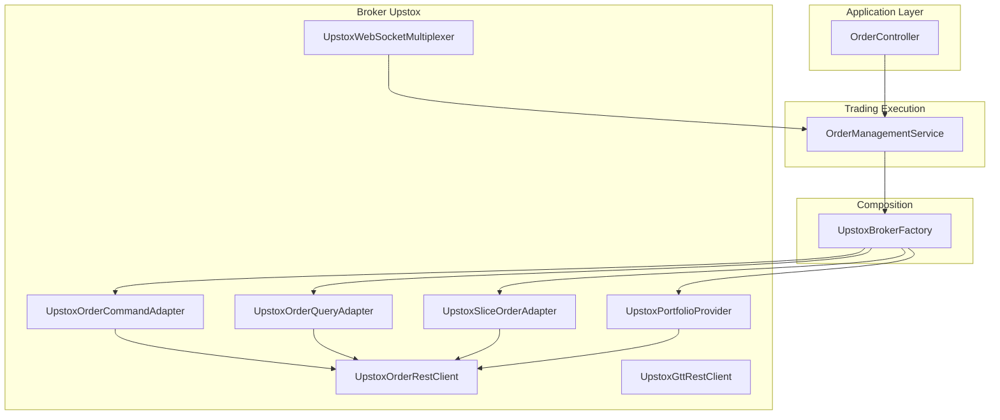
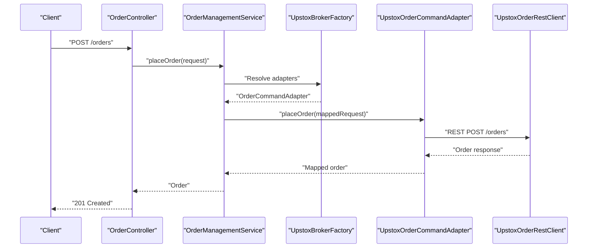
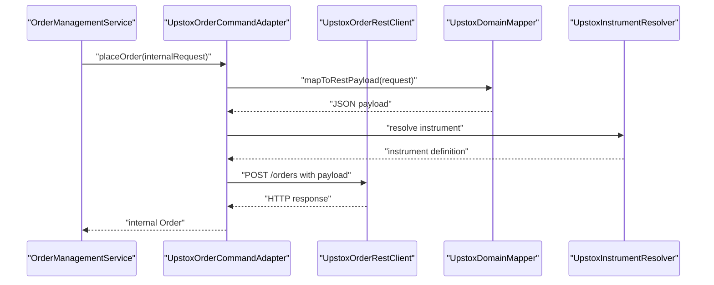
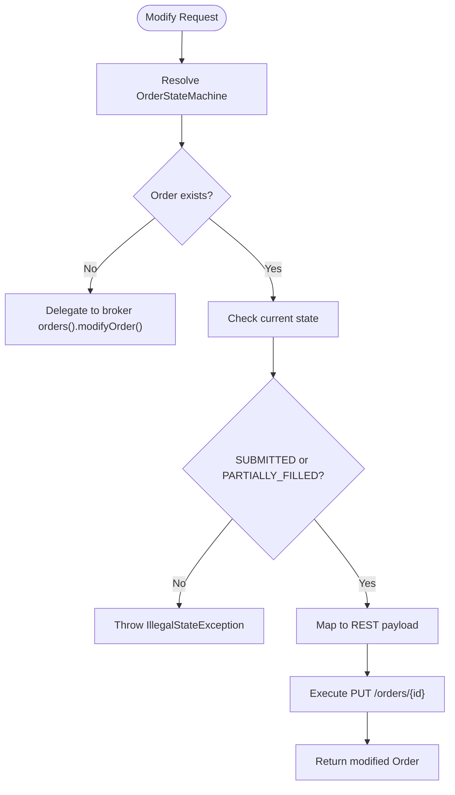
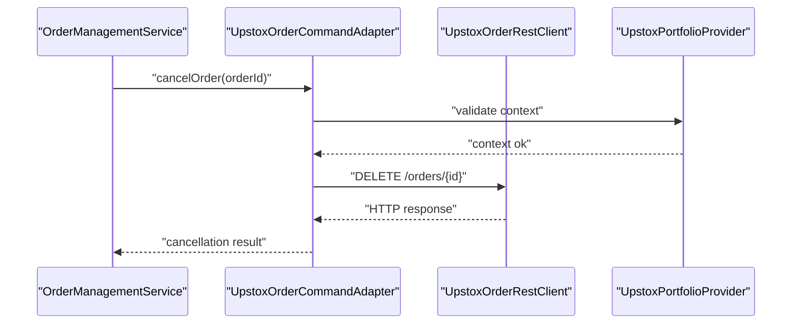
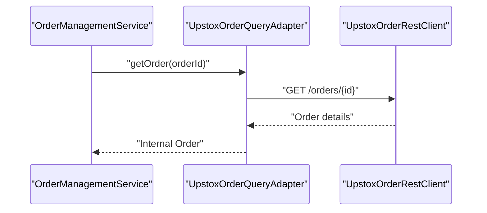
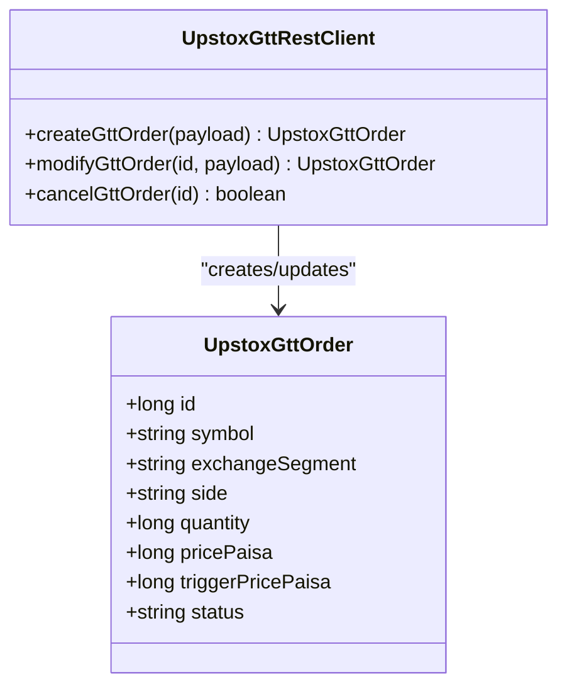
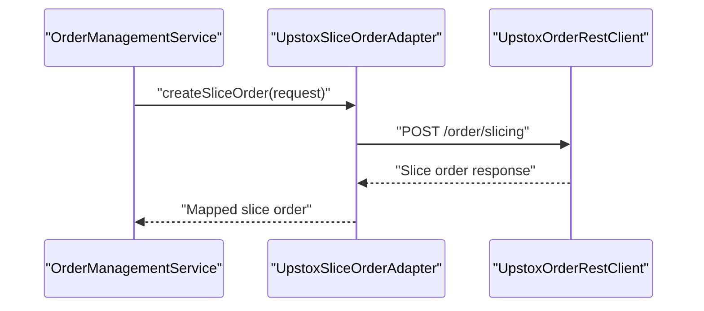
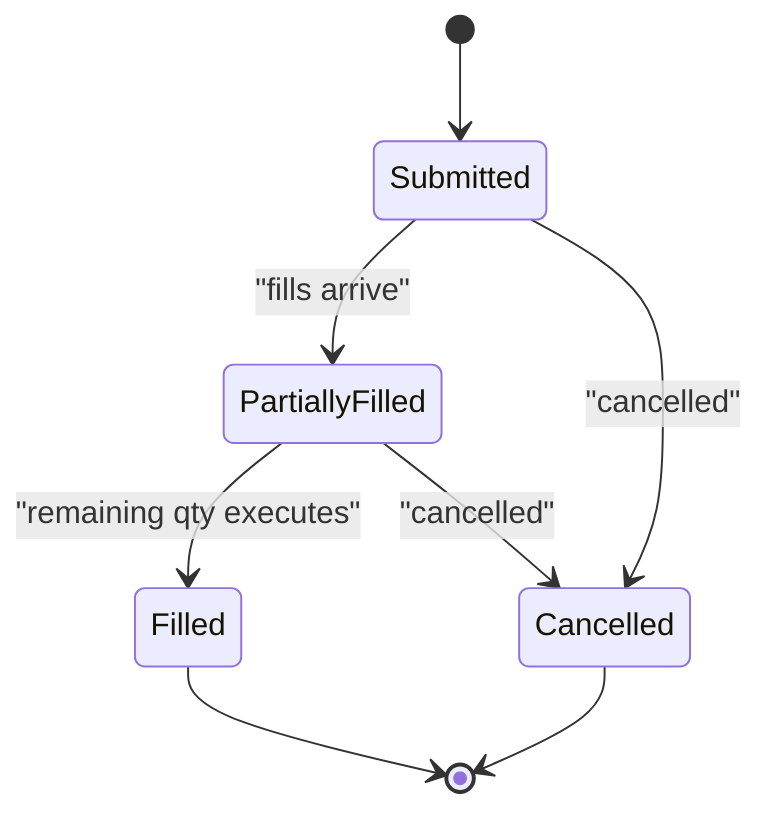
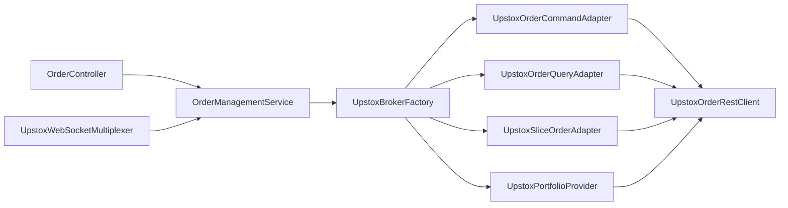

# Order Management

<cite>
**Referenced Files in This Document**
- [UpstoxBrokerFactory.java](file://composition/src/main/java/com/tradej/composition/UpstoxBrokerFactory.java)
- [UpstoxOrderRestClient.java](file://broker/upstox/src/main/java/com/tradej/broker/upstox/rest/UpstoxOrderRestClient.java)
- [UpstoxOrderCommandAdapter.java](file://broker/upstox/src/main/java/com/tradej/broker/upstox/adapter/UpstoxOrderCommandAdapter.java)
- [UpstoxOrderQueryAdapter.java](file://broker/upstox/src/main/java/com/tradej/broker/upstox/adapter/UpstoxOrderQueryAdapter.java)
- [UpstoxSliceOrderAdapter.java](file://broker/upstox/src/main/java/com/tradej/broker/upstox/adapter/UpstoxSliceOrderAdapter.java)
- [UpstoxGttOrder.java](file://broker/upstox/src/main/java/com/tradej/broker/upstox/domain/UpstoxGttOrder.java)
- [UpstoxEndpoints.java](file://broker/upstox/src/main/java/com/tradej/broker/upstox/constants/UpstoxEndpoints.java)
- [OrderManagementService.java](file://trading/execution/src/main/java/com/tradej/execution/service/OrderManagementService.java)
- [OrderController.java](file://app/src/main/java/com/tradej/app/api/OrderController.java)
- [ModifyOrderApiRequest.java](file://app/src/main/java/com/tradej/app/api/dto/ModifyOrderApiRequest.java)
- [UPSTOX_API_GAP_ANALYSIS.md](file://docs/UPSTOX_API_GAP_ANALYSIS.md)
- [UpstoxBrokerConnection.java](file://broker/upstox/src/main/java/com/tradej/broker/upstox/UpstoxBrokerConnection.java)
- [UpstoxPortfolioProvider.java](file://broker/upstox/src/main/java/com/tradej/broker/upstox/adapter/UpstoxPortfolioProvider.java)
- [UpstoxPortfolioRestClient.java](file://broker/upstox/src/main/java/com/tradej/broker/upstox/rest/UpstoxPortfolioRestClient.java)
- [UpstoxMarginProvider.java](file://broker/upstox/src/main/java/com/tradej/broker/upstox/adapter/UpstoxMarginProvider.java)
- [UpstoxDomainMapper.java](file://broker/upstox/src/main/java/com/tradej/broker/upstox/mapper/UpstoxDomainMapper.java)
- [UpstoxInstrumentResolver.java](file://broker/upstox/src/main/java/com/tradej/broker/upstox/instrument/UpstoxInstrumentResolver.java)
- [UpstoxGttRestClient.java](file://broker/upstox/src/main/java/com/tradej/broker/upstox/rest/UpstoxGttRestClient.java)
- [UpstoxWebSocketMultiplexer.java](file://broker/upstox/src/main/java/com/tradej/broker/upstox/websocket/UpstoxWebSocketMultiplexer.java)
- [UpstoxStreamNormalizer.java](file://broker/upstox/src/main/java/com/tradej/broker/upstox/websocket/UpstoxStreamNormalizer.java)
</cite>

## Table of Contents
1. [Introduction](#introduction)
2. [Project Structure](#project-structure)
3. [Core Components](#core-components)
4. [Architecture Overview](#architecture-overview)
5. [Detailed Component Analysis](#detailed-component-analysis)
6. [Dependency Analysis](#dependency-analysis)
7. [Performance Considerations](#performance-considerations)
8. [Troubleshooting Guide](#troubleshooting-guide)
9. [Conclusion](#conclusion)
10. [Appendices](#appendices)

## Introduction
This document provides comprehensive documentation for Upstox order management functionality within the system. It covers REST and WebSocket-based order operations, including placement, modification, cancellation, and querying. Advanced order types such as Good Till Triggered (GTT), slice orders, and bracket orders are explained alongside order state management, lifecycle tracking, and status updates. The document also details validation, parameter mapping, error handling strategies, and practical examples for implementing order workflows, handling partial fills, and managing complex order scenarios. Performance considerations for high-frequency trading environments are included.

## Project Structure
The Upstox order management implementation spans several modules:
- Composition: Factory wiring for Upstox broker components, including order command/query adapters and slice order command.
- Broker Upstox: REST clients, adapters, domain models, WebSocket stream handling, and HTTP utilities.
- Trading Execution: Centralized order management service that coordinates state transitions and delegates to broker adapters.
- Application Layer: API controllers exposing order operations to external clients.

**Diagram sources**
- [UpstoxBrokerFactory.java](file://composition/src/main/java/com/tradej/composition/UpstoxBrokerFactory.java)
- [UpstoxOrderRestClient.java](file://broker/upstox/src/main/java/com/tradej/broker/upstox/rest/UpstoxOrderRestClient.java)
- [UpstoxOrderCommandAdapter.java](file://broker/upstox/src/main/java/com/tradej/broker/upstox/adapter/UpstoxOrderCommandAdapter.java)
- [UpstoxOrderQueryAdapter.java](file://broker/upstox/src/main/java/com/tradej/broker/upstox/adapter/UpstoxOrderQueryAdapter.java)
- [UpstoxSliceOrderAdapter.java](file://broker/upstox/src/main/java/com/tradej/broker/upstox/adapter/UpstoxSliceOrderAdapter.java)
- [UpstoxPortfolioProvider.java](file://broker/upstox/src/main/java/com/tradej/broker/upstox/adapter/UpstoxPortfolioProvider.java)
- [UpstoxWebSocketMultiplexer.java](file://broker/upstox/src/main/java/com/tradej/broker/upstox/websocket/UpstoxWebSocketMultiplexer.java)
- [OrderController.java](file://app/src/main/java/com/tradej/app/api/OrderController.java)
- [OrderManagementService.java](file://trading/execution/src/main/java/com/tradej/execution/service/OrderManagementService.java)

**Section sources**
- [UpstoxBrokerFactory.java](file://composition/src/main/java/com/tradej/composition/UpstoxBrokerFactory.java)
- [OrderController.java](file://app/src/main/java/com/tradej/app/api/OrderController.java)
- [OrderManagementService.java](file://trading/execution/src/main/java/com/tradej/execution/service/OrderManagementService.java)

## Core Components
- OrderCommandAdapter: Translates internal order requests into Upstox REST calls for placement and modification.
- OrderQueryAdapter: Translates internal queries into Upstox REST calls for order retrieval and status checks.
- SliceOrderAdapter: Manages slice order creation and lifecycle via Upstox REST endpoints.
- GTT Client: Handles Good Till Triggered order creation and lifecycle via Upstox REST endpoints.
- Portfolio Provider: Retrieves portfolio and holdings for margin and position validation.
- WebSocket Multiplexer: Streams real-time order and portfolio updates for lifecycle tracking.
- OrderManagementService: Central coordinator enforcing state-based validations and delegating to broker adapters.
- REST Clients: Typed clients for Upstox endpoints including orders, GTT, portfolio, and market data.

Key responsibilities:
- Parameter mapping from internal domain to Upstox API payloads.
- Validation of order states prior to modification or cancellation.
- Real-time status updates via WebSocket streams.
- Error propagation and resilience through retry executors.

**Section sources**
- [UpstoxOrderCommandAdapter.java](file://broker/upstox/src/main/java/com/tradej/broker/upstox/adapter/UpstoxOrderCommandAdapter.java)
- [UpstoxOrderQueryAdapter.java](file://broker/upstox/src/main/java/com/tradej/broker/upstox/adapter/UpstoxOrderQueryAdapter.java)
- [UpstoxSliceOrderAdapter.java](file://broker/upstox/src/main/java/com/tradej/broker/upstox/adapter/UpstoxSliceOrderAdapter.java)
- [UpstoxGttRestClient.java](file://broker/upstox/src/main/java/com/tradej/broker/upstox/rest/UpstoxGttRestClient.java)
- [UpstoxPortfolioProvider.java](file://broker/upstox/src/main/java/com/tradej/broker/upstox/adapter/UpstoxPortfolioProvider.java)
- [UpstoxWebSocketMultiplexer.java](file://broker/upstox/src/main/java/com/tradej/broker/upstox/websocket/UpstoxWebSocketMultiplexer.java)
- [OrderManagementService.java](file://trading/execution/src/main/java/com/tradej/execution/service/OrderManagementService.java)

## Architecture Overview
The order management architecture integrates REST and WebSocket channels:
- REST: Used for placing, modifying, cancelling, and querying orders; retrieving portfolio and GTT details.
- WebSocket: Provides real-time order and portfolio updates for lifecycle tracking and status synchronization.

**Diagram sources**
- [OrderController.java](file://app/src/main/java/com/tradej/app/api/OrderController.java)
- [OrderManagementService.java](file://trading/execution/src/main/java/com/tradej/execution/service/OrderManagementService.java)
- [UpstoxBrokerFactory.java](file://composition/src/main/java/com/tradej/composition/UpstoxBrokerFactory.java)
- [UpstoxOrderCommandAdapter.java](file://broker/upstox/src/main/java/com/tradej/broker/upstox/adapter/UpstoxOrderCommandAdapter.java)
- [UpstoxOrderRestClient.java](file://broker/upstox/src/main/java/com/tradej/broker/upstox/rest/UpstoxOrderRestClient.java)

## Detailed Component Analysis

### REST Order Placement
- Endpoint mapping: The REST client invokes the Upstox endpoint for order placement.
- Payload construction: Internal order request is mapped to Upstox JSON payload via the domain mapper and instrument resolver.
- Response handling: The adapter converts the REST response into the internal order model.

**Diagram sources**
- [UpstoxOrderCommandAdapter.java](file://broker/upstox/src/main/java/com/tradej/broker/upstox/adapter/UpstoxOrderCommandAdapter.java)
- [UpstoxOrderRestClient.java](file://broker/upstox/src/main/java/com/tradej/broker/upstox/rest/UpstoxOrderRestClient.java)
- [UpstoxDomainMapper.java](file://broker/upstox/src/main/java/com/tradej/broker/upstox/mapper/UpstoxDomainMapper.java)
- [UpstoxInstrumentResolver.java](file://broker/upstox/src/main/java/com/tradej/broker/upstox/instrument/UpstoxInstrumentResolver.java)

**Section sources**
- [UpstoxOrderCommandAdapter.java](file://broker/upstox/src/main/java/com/tradej/broker/upstox/adapter/UpstoxOrderCommandAdapter.java)
- [UpstoxOrderRestClient.java](file://broker/upstox/src/main/java/com/tradej/broker/upstox/rest/UpstoxOrderRestClient.java)
- [UpstoxDomainMapper.java](file://broker/upstox/src/main/java/com/tradej/broker/upstox/mapper/UpstoxDomainMapper.java)
- [UpstoxInstrumentResolver.java](file://broker/upstox/src/main/java/com/tradej/broker/upstox/instrument/UpstoxInstrumentResolver.java)

### REST Order Modification
- State validation: Modification is allowed only when the order is in SUBMITTED or PARTIALLY_FILLED state.
- Request mapping: The adapter constructs a modification payload with updated parameters.
- Execution: The REST client performs a PUT operation to the order endpoint.

**Diagram sources**
- [OrderManagementService.java](file://trading/execution/src/main/java/com/tradej/execution/service/OrderManagementService.java)
- [UpstoxOrderCommandAdapter.java](file://broker/upstox/src/main/java/com/tradej/broker/upstox/adapter/UpstoxOrderCommandAdapter.java)
- [UpstoxOrderRestClient.java](file://broker/upstox/src/main/java/com/tradej/broker/upstox/rest/UpstoxOrderRestClient.java)

**Section sources**
- [OrderManagementService.java](file://trading/execution/src/main/java/com/tradej/execution/service/OrderManagementService.java)
- [UpstoxOrderCommandAdapter.java](file://broker/upstox/src/main/java/com/tradej/broker/upstox/adapter/UpstoxOrderCommandAdapter.java)
- [UpstoxOrderRestClient.java](file://broker/upstox/src/main/java/com/tradej/broker/upstox/rest/UpstoxOrderRestClient.java)

### REST Order Cancellation
- Endpoint invocation: The adapter calls the cancellation endpoint for a given order ID.
- Portfolio context: Portfolio provider ensures account and position context for cancellation decisions.
- Response: Returns cancellation outcome for the caller.

**Diagram sources**
- [UpstoxOrderCommandAdapter.java](file://broker/upstox/src/main/java/com/tradej/broker/upstox/adapter/UpstoxOrderCommandAdapter.java)
- [UpstoxOrderRestClient.java](file://broker/upstox/src/main/java/com/tradej/broker/upstox/rest/UpstoxOrderRestClient.java)
- [UpstoxPortfolioProvider.java](file://broker/upstox/src/main/java/com/tradej/broker/upstox/adapter/UpstoxPortfolioProvider.java)

**Section sources**
- [UpstoxOrderCommandAdapter.java](file://broker/upstox/src/main/java/com/tradej/broker/upstox/adapter/UpstoxOrderCommandAdapter.java)
- [UpstoxOrderRestClient.java](file://broker/upstox/src/main/java/com/tradej/broker/upstox/rest/UpstoxOrderRestClient.java)
- [UpstoxPortfolioProvider.java](file://broker/upstox/src/main/java/com/tradej/broker/upstox/adapter/UpstoxPortfolioProvider.java)

### REST Order Querying
- Retrieval: The query adapter fetches order details and book/book history via REST endpoints.
- Status mapping: Converts REST responses into internal order status and projections.
- Trade and position queries: Integrated with portfolio and holdings providers for comprehensive views.

**Diagram sources**
- [UpstoxOrderQueryAdapter.java](file://broker/upstox/src/main/java/com/tradej/broker/upstox/adapter/UpstoxOrderQueryAdapter.java)
- [UpstoxOrderRestClient.java](file://broker/upstox/src/main/java/com/tradej/broker/upstox/rest/UpstoxOrderRestClient.java)

**Section sources**
- [UpstoxOrderQueryAdapter.java](file://broker/upstox/src/main/java/com/tradej/broker/upstox/adapter/UpstoxOrderQueryAdapter.java)
- [UpstoxOrderRestClient.java](file://broker/upstox/src/main/java/com/tradej/broker/upstox/rest/UpstoxOrderRestClient.java)

### GTT Orders (Good Till Triggered)
- Domain model: GTT order encapsulates trigger conditions and recurring behavior.
- REST client: Dedicated client handles creation, modification, and cancellation of GTT orders.
- Lifecycle: GTT orders persist until triggered or manually cancelled; integrated with order state machines for visibility.

**Diagram sources**
- [UpstoxGttOrder.java](file://broker/upstox/src/main/java/com/tradej/broker/upstox/domain/UpstoxGttOrder.java)
- [UpstoxGttRestClient.java](file://broker/upstox/src/main/java/com/tradej/broker/upstox/rest/UpstoxGttRestClient.java)

**Section sources**
- [UpstoxGttOrder.java](file://broker/upstox/src/main/java/com/tradej/broker/upstox/domain/UpstoxGttOrder.java)
- [UpstoxGttRestClient.java](file://broker/upstox/src/main/java/com/tradej/broker/upstox/rest/UpstoxGttRestClient.java)

### Slice Orders
- Adapter: Specialized adapter for slice order creation and lifecycle management.
- REST integration: Uses Upstox REST endpoints for slice order operations.
- Instrument resolution: Ensures correct symbol and segment mapping for slice order legs.

**Diagram sources**
- [UpstoxSliceOrderAdapter.java](file://broker/upstox/src/main/java/com/tradej/broker/upstox/adapter/UpstoxSliceOrderAdapter.java)
- [UpstoxOrderRestClient.java](file://broker/upstox/src/main/java/com/tradej/broker/upstox/rest/UpstoxOrderRestClient.java)

**Section sources**
- [UpstoxSliceOrderAdapter.java](file://broker/upstox/src/main/java/com/tradej/broker/upstox/adapter/UpstoxSliceOrderAdapter.java)
- [UpstoxOrderRestClient.java](file://broker/upstox/src/main/java/com/tradej/broker/upstox/rest/UpstoxOrderRestClient.java)

### Bracket Orders
- Implementation note: Bracket orders are not present in the current Upstox adapter implementations. They would require multi-leg order orchestration and stop/limit leg management, typically handled via separate endpoints and state coordination.
- Recommendation: Integrate with Upstox multi-order endpoints and implement a composite order manager that tracks parent and bracket legs, ensuring coordinated cancellations and partial fills.

[No sources needed since this section does not analyze specific files]

### Order State Management and Lifecycle Tracking
- State machine: The service maintains per-order state machines to enforce valid transitions and prevent invalid modifications.
- WebSocket updates: The WebSocket multiplexer normalizes stream events into order and portfolio updates, keeping state synchronized.
- Projection: The service exposes order projections for read-only views and diagnostics.

**Diagram sources**
- [OrderManagementService.java](file://trading/execution/src/main/java/com/tradej/execution/service/OrderManagementService.java)
- [UpstoxWebSocketMultiplexer.java](file://broker/upstox/src/main/java/com/tradej/broker/upstox/websocket/UpstoxWebSocketMultiplexer.java)
- [UpstoxStreamNormalizer.java](file://broker/upstox/src/main/java/com/tradej/broker/upstox/websocket/UpstoxStreamNormalizer.java)

**Section sources**
- [OrderManagementService.java](file://trading/execution/src/main/java/com/tradej/execution/service/OrderManagementService.java)
- [UpstoxWebSocketMultiplexer.java](file://broker/upstox/src/main/java/com/tradej/broker/upstox/websocket/UpstoxWebSocketMultiplexer.java)
- [UpstoxStreamNormalizer.java](file://broker/upstox/src/main/java/com/tradej/broker/upstox/websocket/UpstoxStreamNormalizer.java)

### Parameter Mapping and Validation
- Parameter mapping: The domain mapper translates internal enums and values (e.g., order type, validity, price units) into Upstox-compatible payloads.
- Validation: The service validates order states before modification and cancels invalid operations early.
- Instrument resolution: Ensures correct symbol and segment mapping for accurate order routing.

**Section sources**
- [UpstoxDomainMapper.java](file://broker/upstox/src/main/java/com/tradej/broker/upstox/mapper/UpstoxDomainMapper.java)
- [UpstoxInstrumentResolver.java](file://broker/upstox/src/main/java/com/tradej/broker/upstox/instrument/UpstoxInstrumentResolver.java)
- [OrderManagementService.java](file://trading/execution/src/main/java/com/tradej/execution/service/OrderManagementService.java)

### Error Handling Strategies
- HTTP exceptions: REST clients propagate API errors with structured responses for downstream handling.
- Retry and resilience: Retry executor wraps API calls to handle transient failures.
- Validation errors: Service throws explicit exceptions for invalid state transitions or unsupported operations.
- WebSocket errors: Stream normalizer handles malformed frames and dispatches appropriate error signals.

**Section sources**
- [UpstoxOrderRestClient.java](file://broker/upstox/src/main/java/com/tradej/broker/upstox/rest/UpstoxOrderRestClient.java)
- [UpstoxOrderCommandAdapter.java](file://broker/upstox/src/main/java/com/tradej/broker/upstox/adapter/UpstoxOrderCommandAdapter.java)
- [OrderManagementService.java](file://trading/execution/src/main/java/com/tradej/execution/service/OrderManagementService.java)

### Practical Examples and Workflows
- Placing an order: Build an internal order request, pass through the controller to the service, which delegates to the adapter and REST client.
- Modifying an order: Ensure the order is in SUBMITTED or PARTIALLY_FILLED state; map parameters and issue a REST update.
- Cancelling an order: Validate context and issue a REST delete; confirm cancellation via query.
- Handling partial fills: Subscribe to WebSocket updates; reconcile fills against the order projection; update state accordingly.
- Managing complex scenarios: Use GTT for conditional triggers and slice orders for liquidity provision; coordinate via state machines and adapters.

**Section sources**
- [OrderController.java](file://app/src/main/java/com/tradej/app/api/OrderController.java)
- [OrderManagementService.java](file://trading/execution/src/main/java/com/tradej/execution/service/OrderManagementService.java)
- [UpstoxOrderCommandAdapter.java](file://broker/upstox/src/main/java/com/tradej/broker/upstox/adapter/UpstoxOrderCommandAdapter.java)
- [UpstoxOrderRestClient.java](file://broker/upstox/src/main/java/com/tradej/broker/upstox/rest/UpstoxOrderRestClient.java)
- [UpstoxWebSocketMultiplexer.java](file://broker/upstox/src/main/java/com/tradej/broker/upstox/websocket/UpstoxWebSocketMultiplexer.java)

## Dependency Analysis
The Upstox order management module exhibits clear separation of concerns:
- Composition layer wires adapters and clients.
- Adapters encapsulate REST client usage and mapping logic.
- Service layer enforces business rules and state transitions.
- WebSocket layer provides real-time updates.

**Diagram sources**
- [UpstoxBrokerFactory.java](file://composition/src/main/java/com/tradej/composition/UpstoxBrokerFactory.java)
- [UpstoxOrderCommandAdapter.java](file://broker/upstox/src/main/java/com/tradej/broker/upstox/adapter/UpstoxOrderCommandAdapter.java)
- [UpstoxOrderQueryAdapter.java](file://broker/upstox/src/main/java/com/tradej/broker/upstox/adapter/UpstoxOrderQueryAdapter.java)
- [UpstoxSliceOrderAdapter.java](file://broker/upstox/src/main/java/com/tradej/broker/upstox/adapter/UpstoxSliceOrderAdapter.java)
- [UpstoxPortfolioProvider.java](file://broker/upstox/src/main/java/com/tradej/broker/upstox/adapter/UpstoxPortfolioProvider.java)
- [UpstoxOrderRestClient.java](file://broker/upstox/src/main/java/com/tradej/broker/upstox/rest/UpstoxOrderRestClient.java)
- [OrderManagementService.java](file://trading/execution/src/main/java/com/tradej/execution/service/OrderManagementService.java)
- [OrderController.java](file://app/src/main/java/com/tradej/app/api/OrderController.java)
- [UpstoxWebSocketMultiplexer.java](file://broker/upstox/src/main/java/com/tradej/broker/upstox/websocket/UpstoxWebSocketMultiplexer.java)

**Section sources**
- [UpstoxBrokerFactory.java](file://composition/src/main/java/com/tradej/composition/UpstoxBrokerFactory.java)
- [OrderManagementService.java](file://trading/execution/src/main/java/com/tradej/execution/service/OrderManagementService.java)

## Performance Considerations
- Asynchronous streaming: Use WebSocket multiplexer for low-latency order and portfolio updates.
- Batch operations: Prefer bulk cancellation endpoints where available to reduce API overhead.
- Idempotency: Ensure order placement and modification requests are idempotent to handle retries safely.
- Rate limiting: Respect Upstox rate limits; employ backoff strategies and queue orders when necessary.
- Memory footprint: Keep order state machines compact; periodically prune finalized orders.
- High-frequency trading: Minimize round trips by batching queries and leveraging streaming updates.

[No sources needed since this section provides general guidance]

## Troubleshooting Guide
Common issues and resolutions:
- Invalid state modification: Ensure the order is in SUBMITTED or PARTIALLY_FILLED before attempting modifications.
- Authentication failures: Verify bearer token availability and refresh tokens as needed.
- Network errors: Utilize resilient HTTP clients with retry policies for transient failures.
- Partial fills not reflected: Confirm WebSocket subscription is active and stream normalizer is processing updates.
- Instrument resolution errors: Validate symbol and segment mapping against Upstox master data.

**Section sources**
- [OrderManagementService.java](file://trading/execution/src/main/java/com/tradej/execution/service/OrderManagementService.java)
- [UpstoxOrderRestClient.java](file://broker/upstox/src/main/java/com/tradej/broker/upstox/rest/UpstoxOrderRestClient.java)
- [UpstoxWebSocketMultiplexer.java](file://broker/upstox/src/main/java/com/tradej/broker/upstox/websocket/UpstoxWebSocketMultiplexer.java)

## Conclusion
The Upstox order management implementation provides robust REST and WebSocket capabilities for order lifecycle operations. The factory-based composition ensures clean separation of concerns, while the service layer enforces state-based validations. GTT and slice order support extends functionality for conditional and liquidity-driven strategies. For advanced features like bracket orders, additional integration with Upstox multi-order endpoints and composite order management is recommended.

[No sources needed since this section summarizes without analyzing specific files]

## Appendices

### API Endpoints and Coverage
- Defined endpoints include order placement, modification, cancellation, and query.
- Missing endpoints include multi-order operations and certain portfolio conversions; consult the gap analysis for a complete list.

**Section sources**
- [UPSTOX_API_GAP_ANALYSIS.md](file://docs/UPSTOX_API_GAP_ANALYSIS.md)

### Example API Requests and Responses
- Place order: POST /orders with mapped payload; expect order response with status and identifiers.
- Modify order: PUT /orders/{id} with updated parameters; expect modified order response.
- Cancel order: DELETE /orders/{id}; expect cancellation confirmation.
- GTT order: POST /gtt/orders with trigger conditions; expect GTT order response.
- Slice order: POST /order/slicing with slice parameters; expect slice order response.

**Section sources**
- [UpstoxOrderRestClient.java](file://broker/upstox/src/main/java/com/tradej/broker/upstox/rest/UpstoxOrderRestClient.java)
- [UpstoxGttRestClient.java](file://broker/upstox/src/main/java/com/tradej/broker/upstox/rest/UpstoxGttRestClient.java)
- [UpstoxEndpoints.java](file://broker/upstox/src/main/java/com/tradej/broker/upstox/constants/UpstoxEndpoints.java)