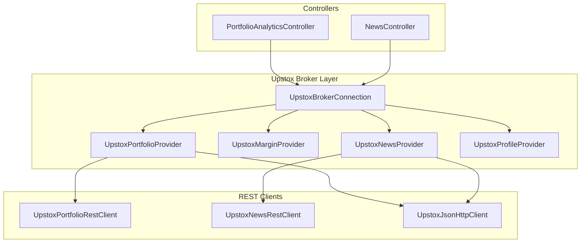
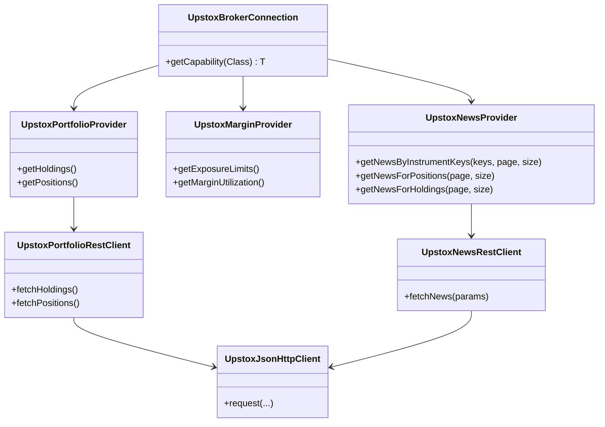
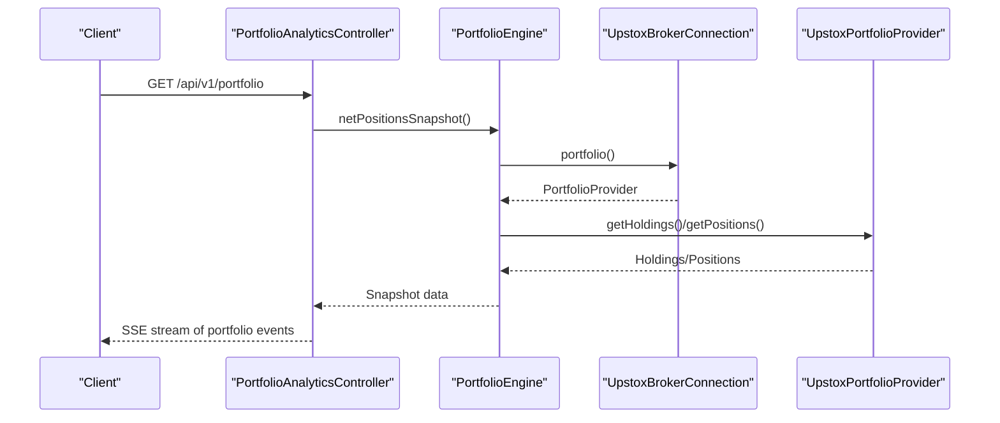
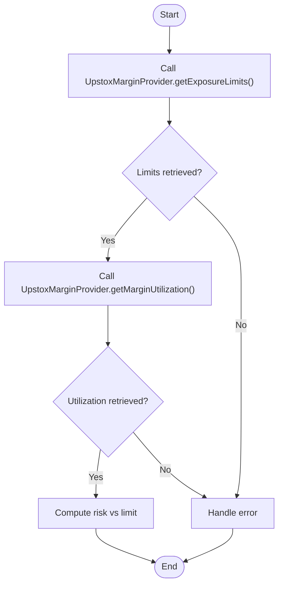
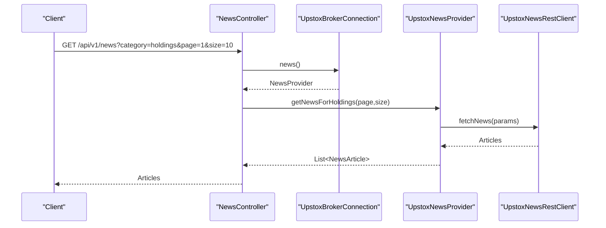
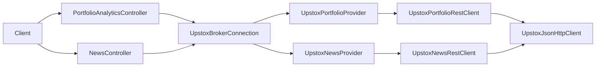
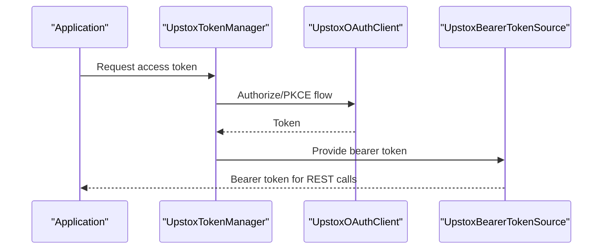
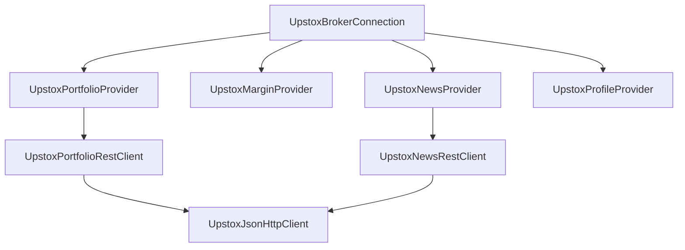

# Portfolio, Margin & News

<cite>
**Referenced Files in This Document**
- [UpstoxBrokerConnection.java](file://broker/upstox/src/main/java/com/tradej/broker/upstox/UpstoxBrokerConnection.java)
- [UpstoxPortfolioProvider.java](file://broker/upstox/src/main/java/com/tradej/broker/upstox/adapter/UpstoxPortfolioProvider.java)
- [UpstoxMarginProvider.java](file://broker/upstox/src/main/java/com/tradej/broker/upstox/adapter/UpstoxMarginProvider.java)
- [UpstoxNewsProvider.java](file://broker/upstox/src/main/java/com/tradej/broker/upstox/adapter/UpstoxNewsProvider.java)
- [UpstoxPortfolioRestClient.java](file://broker/upstox/src/main/java/com/tradej/broker/upstox/rest/UpstoxPortfolioRestClient.java)
- [UpstoxNewsRestClient.java](file://broker/upstox/src/main/java/com/tradej/broker/upstox/rest/UpstoxNewsRestClient.java)
- [UpstoxEndpoints.java](file://broker/upstox/src/main/java/com/tradej/broker/upstox/constants/UpstoxEndpoints.java)
- [UpstoxHttpClient.java](file://broker/upstox/src/main/java/com/tradej/broker/upstox/http/UpstoxHttpClient.java)
- [UpstoxJsonHttpClient.java](file://broker/upstox/src/main/java/com/tradej/broker/upstox/http/UpstoxJsonHttpClient.java)
- [UpstoxResponseGuard.java](file://broker/upstox/src/main/java/com/tradej/broker/upstox/http/UpstoxResponseGuard.java)
- [UpstoxApiException.java](file://broker/upstox/src/main/java/com/tradej/broker/upstox/http/UpstoxApiException.java)
- [UpstoxOAuthClient.java](file://broker/upstox/src/main/java/com/tradej/broker/upstox/auth/UpstoxOAuthClient.java)
- [UpstoxTokenManager.java](file://broker/upstox/src/main/java/com/tradej/broker/upstox/auth/UpstoxTokenManager.java)
- [UpstoxBearerTokenSource.java](file://broker/upstox/src/main/java/com/tradej/broker/upstox/auth/UpstoxBearerTokenSource.java)
- [UpstoxProfileProvider.java](file://broker/upstox/src/main/java/com/tradej/broker/upstox/adapter/UpstoxProfileProvider.java)
- [NewsController.java](file://app/src/main/java/com/tradej/app/api/NewsController.java)
- [PortfolioAnalyticsController.java](file://app/src/main/java/com/tradej/app/api/PortfolioAnalyticsController.java)
- [UpstoxNewsIntegrationTest.java](file://app/src/test/java/com/tradej/app/integration/UpstoxNewsIntegrationTest.java)
- [UPSTOX_API_GAP_ANALYSIS.md](file://docs/UPSTOX_API_GAP_ANALYSIS.md)
</cite>

## Table of Contents
1. [Introduction](#introduction)
2. [Project Structure](#project-structure)
3. [Core Components](#core-components)
4. [Architecture Overview](#architecture-overview)
5. [Detailed Component Analysis](#detailed-component-analysis)
6. [Dependency Analysis](#dependency-analysis)
7. [Performance Considerations](#performance-considerations)
8. [Troubleshooting Guide](#troubleshooting-guide)
9. [Conclusion](#conclusion)
10. [Appendices](#appendices)

## Introduction
This document explains how the system integrates with Upstox for portfolio management, margin handling, and news. It covers:
- Retrieving portfolio holdings and computing unrealized profit/loss
- Monitoring account balances and exposure limits
- Tracking margin utilization and risk
- Fetching market news and deriving sentiment for positions
- Exposing REST endpoints for portfolio, margin, and news
- Practical examples for dashboards, risk assessment, and news-driven strategies
- Data freshness, caching, and real-time update strategies

## Project Structure
The Upstox integration is organized around capability providers and REST clients:
- Broker connection facade exposes capabilities (portfolio, margin, news, market data, instruments, etc.)
- Provider adapters translate broker responses into domain models
- REST clients encapsulate HTTP calls and response parsing
- Controllers expose endpoints for portfolio analytics and news retrieval

**Diagram sources**
- [UpstoxBrokerConnection.java:28-31](file://broker/upstox/src/main/java/com/tradej/broker/upstox/UpstoxBrokerConnection.java#L28-L31)
- [UpstoxPortfolioProvider.java](file://broker/upstox/src/main/java/com/tradej/broker/upstox/adapter/UpstoxPortfolioProvider.java)
- [UpstoxMarginProvider.java](file://broker/upstox/src/main/java/com/tradej/broker/upstox/adapter/UpstoxMarginProvider.java)
- [UpstoxNewsProvider.java](file://broker/upstox/src/main/java/com/tradej/broker/upstox/adapter/UpstoxNewsProvider.java)
- [UpstoxProfileProvider.java](file://broker/upstox/src/main/java/com/tradej/broker/upstox/adapter/UpstoxProfileProvider.java)
- [UpstoxPortfolioRestClient.java](file://broker/upstox/src/main/java/com/tradej/broker/upstox/rest/UpstoxPortfolioRestClient.java)
- [UpstoxNewsRestClient.java](file://broker/upstox/src/main/java/com/tradej/broker/upstox/rest/UpstoxNewsRestClient.java)
- [UpstoxJsonHttpClient.java](file://broker/upstox/src/main/java/com/tradej/broker/upstox/http/UpstoxJsonHttpClient.java)
- [PortfolioAnalyticsController.java:18-60](file://app/src/main/java/com/tradej/app/api/PortfolioAnalyticsController.java#L18-L60)
- [NewsController.java:16-60](file://app/src/main/java/com/tradej/app/api/NewsController.java#L16-L60)

**Section sources**
- [UpstoxBrokerConnection.java:1-31](file://broker/upstox/src/main/java/com/tradej/broker/upstox/UpstoxBrokerConnection.java#L1-L31)

## Core Components
- UpstoxBrokerConnection: Facade exposing capabilities such as portfolio, margin, news, market data, futures, options, instruments, and websockets.
- UpstoxPortfolioProvider: Translates Upstox portfolio REST responses into domain holdings and positions.
- UpstoxMarginProvider: Computes margin requirements and utilization from Upstox endpoints.
- UpstoxNewsProvider: Aggregates news for instruments, positions, and holdings.
- UpstoxPortfolioRestClient and UpstoxNewsRestClient: Encapsulate HTTP calls to Upstox endpoints.
- UpstoxJsonHttpClient: Shared JSON HTTP client for Upstox REST calls.
- Controllers: PortfolioAnalyticsController streams portfolio analytics via SSE; NewsController serves news endpoints.

**Section sources**
- [UpstoxBrokerConnection.java:1-31](file://broker/upstox/src/main/java/com/tradej/broker/upstox/UpstoxBrokerConnection.java#L1-L31)
- [UpstoxPortfolioProvider.java](file://broker/upstox/src/main/java/com/tradej/broker/upstox/adapter/UpstoxPortfolioProvider.java)
- [UpstoxMarginProvider.java](file://broker/upstox/src/main/java/com/tradej/broker/upstox/adapter/UpstoxMarginProvider.java)
- [UpstoxNewsProvider.java](file://broker/upstox/src/main/java/com/tradej/broker/upstox/adapter/UpstoxNewsProvider.java)
- [UpstoxPortfolioRestClient.java](file://broker/upstox/src/main/java/com/tradej/broker/upstox/rest/UpstoxPortfolioRestClient.java)
- [UpstoxNewsRestClient.java](file://broker/upstox/src/main/java/com/tradej/broker/upstox/rest/UpstoxNewsRestClient.java)
- [UpstoxJsonHttpClient.java](file://broker/upstox/src/main/java/com/tradej/broker/upstox/http/UpstoxJsonHttpClient.java)
- [PortfolioAnalyticsController.java:18-60](file://app/src/main/java/com/tradej/app/api/PortfolioAnalyticsController.java#L18-L60)
- [NewsController.java:16-60](file://app/src/main/java/com/tradej/app/api/NewsController.java#L16-L60)

## Architecture Overview
The Upstox integration follows a layered pattern:
- Capability exposure via UpstoxBrokerConnection
- Provider adapters for portfolio, margin, and news
- REST clients for Upstox endpoints
- Controllers for external consumption

**Diagram sources**
- [UpstoxBrokerConnection.java:28-31](file://broker/upstox/src/main/java/com/tradej/broker/upstox/UpstoxBrokerConnection.java#L28-L31)
- [UpstoxPortfolioProvider.java](file://broker/upstox/src/main/java/com/tradej/broker/upstox/adapter/UpstoxPortfolioProvider.java)
- [UpstoxMarginProvider.java](file://broker/upstox/src/main/java/com/tradej/broker/upstox/adapter/UpstoxMarginProvider.java)
- [UpstoxNewsProvider.java](file://broker/upstox/src/main/java/com/tradej/broker/upstox/adapter/UpstoxNewsProvider.java)
- [UpstoxPortfolioRestClient.java](file://broker/upstox/src/main/java/com/tradej/broker/upstox/rest/UpstoxPortfolioRestClient.java)
- [UpstoxNewsRestClient.java](file://broker/upstox/src/main/java/com/tradej/broker/upstox/rest/UpstoxNewsRestClient.java)
- [UpstoxJsonHttpClient.java](file://broker/upstox/src/main/java/com/tradej/broker/upstox/http/UpstoxJsonHttpClient.java)

## Detailed Component Analysis

### Portfolio Holdings and Unrealized P&L
- Holdings retrieval: Implemented via UpstoxPortfolioProvider backed by UpstoxPortfolioRestClient.
- Positions retrieval: Also via UpstoxPortfolioProvider.
- Unrealized P&L computation: Typically derived from current market prices and holding cost bases; the PortfolioAnalyticsController streams portfolio snapshots suitable for building P&L views.

**Diagram sources**
- [PortfolioAnalyticsController.java:18-60](file://app/src/main/java/com/tradej/app/api/PortfolioAnalyticsController.java#L18-L60)
- [UpstoxBrokerConnection.java:28-31](file://broker/upstox/src/main/java/com/tradej/broker/upstox/UpstoxBrokerConnection.java#L28-L31)
- [UpstoxPortfolioProvider.java](file://broker/upstox/src/main/java/com/tradej/broker/upstox/adapter/UpstoxPortfolioProvider.java)

**Section sources**
- [PortfolioAnalyticsController.java:18-60](file://app/src/main/java/com/tradej/app/api/PortfolioAnalyticsController.java#L18-L60)
- [UpstoxPortfolioProvider.java](file://broker/upstox/src/main/java/com/tradej/broker/upstox/adapter/UpstoxPortfolioProvider.java)

### Account Balance and Exposure Limits
- Exposure limits and margin utilization: Provided by UpstoxMarginProvider.
- Typical flows include fetching exposure thresholds and current utilization to assess risk capacity.

**Diagram sources**
- [UpstoxMarginProvider.java](file://broker/upstox/src/main/java/com/tradej/broker/upstox/adapter/UpstoxMarginProvider.java)

**Section sources**
- [UpstoxMarginProvider.java](file://broker/upstox/src/main/java/com/tradej/broker/upstox/adapter/UpstoxMarginProvider.java)

### News Retrieval and Sentiment
- News retrieval: Implemented by UpstoxNewsProvider backed by UpstoxNewsRestClient.
- Categories supported include instrument keys, positions, and holdings.
- Integration tests demonstrate fetching news for holdings and validating article metadata.

**Diagram sources**
- [NewsController.java:16-60](file://app/src/main/java/com/tradej/app/api/NewsController.java#L16-L60)
- [UpstoxBrokerConnection.java:28-31](file://broker/upstox/src/main/java/com/tradej/broker/upstox/UpstoxBrokerConnection.java#L28-L31)
- [UpstoxNewsProvider.java](file://broker/upstox/src/main/java/com/tradej/broker/upstox/adapter/UpstoxNewsProvider.java)
- [UpstoxNewsRestClient.java](file://broker/upstox/src/main/java/com/tradej/broker/upstox/rest/UpstoxNewsRestClient.java)

**Section sources**
- [NewsController.java:16-60](file://app/src/main/java/com/tradej/app/api/NewsController.java#L16-L60)
- [UpstoxNewsProvider.java](file://broker/upstox/src/main/java/com/tradej/broker/upstox/adapter/UpstoxNewsProvider.java)
- [UpstoxNewsRestClient.java](file://broker/upstox/src/main/java/com/tradej/broker/upstox/rest/UpstoxNewsRestClient.java)
- [UpstoxNewsIntegrationTest.java:156-181](file://app/src/test/java/com/tradej/app/integration/UpstoxNewsIntegrationTest.java#L156-L181)

### REST API Integration
- Portfolio endpoint: PortfolioAnalyticsController streams portfolio analytics via SSE.
- News endpoint: NewsController routes requests to UpstoxNewsProvider based on category.
- Underlying REST clients handle Upstox endpoint URLs and JSON parsing.

**Diagram sources**
- [PortfolioAnalyticsController.java:18-60](file://app/src/main/java/com/tradej/app/api/PortfolioAnalyticsController.java#L18-L60)
- [NewsController.java:16-60](file://app/src/main/java/com/tradej/app/api/NewsController.java#L16-L60)
- [UpstoxBrokerConnection.java:28-31](file://broker/upstox/src/main/java/com/tradej/broker/upstox/UpstoxBrokerConnection.java#L28-L31)
- [UpstoxPortfolioRestClient.java](file://broker/upstox/src/main/java/com/tradej/broker/upstox/rest/UpstoxPortfolioRestClient.java)
- [UpstoxNewsRestClient.java](file://broker/upstox/src/main/java/com/tradej/broker/upstox/rest/UpstoxNewsRestClient.java)
- [UpstoxJsonHttpClient.java](file://broker/upstox/src/main/java/com/tradej/broker/upstox/http/UpstoxJsonHttpClient.java)

**Section sources**
- [PortfolioAnalyticsController.java:18-60](file://app/src/main/java/com/tradej/app/api/PortfolioAnalyticsController.java#L18-L60)
- [NewsController.java:16-60](file://app/src/main/java/com/tradej/app/api/NewsController.java#L16-L60)
- [UpstoxEndpoints.java](file://broker/upstox/src/main/java/com/tradej/broker/upstox/constants/UpstoxEndpoints.java)

### Authentication and Token Management
- OAuth and token management are handled by UpstoxOAuthClient and UpstoxTokenManager, with bearer token sourcing via UpstoxBearerTokenSource.
- These components ensure authenticated REST calls to Upstox endpoints.

**Diagram sources**
- [UpstoxTokenManager.java](file://broker/upstox/src/main/java/com/tradej/broker/upstox/auth/UpstoxTokenManager.java)
- [UpstoxOAuthClient.java](file://broker/upstox/src/main/java/com/tradej/broker/upstox/auth/UpstoxOAuthClient.java)
- [UpstoxBearerTokenSource.java](file://broker/upstox/src/main/java/com/tradej/broker/upstox/auth/UpstoxBearerTokenSource.java)

**Section sources**
- [UpstoxTokenManager.java](file://broker/upstox/src/main/java/com/tradej/broker/upstox/auth/UpstoxTokenManager.java)
- [UpstoxOAuthClient.java](file://broker/upstox/src/main/java/com/tradej/broker/upstox/auth/UpstoxOAuthClient.java)
- [UpstoxBearerTokenSource.java](file://broker/upstox/src/main/java/com/tradej/broker/upstox/auth/UpstoxBearerTokenSource.java)

### Profile Information Access
- UpstoxProfileProvider exposes user profile information through the broker connection, enabling dashboard personalization and account-specific settings.

**Section sources**
- [UpstoxProfileProvider.java](file://broker/upstox/src/main/java/com/tradej/broker/upstox/adapter/UpstoxProfileProvider.java)
- [UpstoxBrokerConnection.java:17-20](file://broker/upstox/src/main/java/com/tradej/broker/upstox/UpstoxBrokerConnection.java#L17-L20)

## Dependency Analysis
- UpstoxBrokerConnection aggregates capabilities and delegates to provider adapters.
- Providers depend on REST clients, which depend on the shared JSON HTTP client.
- Controllers depend on the broker connection to obtain providers.

**Diagram sources**
- [UpstoxBrokerConnection.java:28-31](file://broker/upstox/src/main/java/com/tradej/broker/upstox/UpstoxBrokerConnection.java#L28-L31)
- [UpstoxPortfolioProvider.java](file://broker/upstox/src/main/java/com/tradej/broker/upstox/adapter/UpstoxPortfolioProvider.java)
- [UpstoxMarginProvider.java](file://broker/upstox/src/main/java/com/tradej/broker/upstox/adapter/UpstoxMarginProvider.java)
- [UpstoxNewsProvider.java](file://broker/upstox/src/main/java/com/tradej/broker/upstox/adapter/UpstoxNewsProvider.java)
- [UpstoxPortfolioRestClient.java](file://broker/upstox/src/main/java/com/tradej/broker/upstox/rest/UpstoxPortfolioRestClient.java)
- [UpstoxNewsRestClient.java](file://broker/upstox/src/main/java/com/tradej/broker/upstox/rest/UpstoxNewsRestClient.java)
- [UpstoxJsonHttpClient.java](file://broker/upstox/src/main/java/com/tradej/broker/upstox/http/UpstoxJsonHttpClient.java)

**Section sources**
- [UpstoxBrokerConnection.java:1-31](file://broker/upstox/src/main/java/com/tradej/broker/upstox/UpstoxBrokerConnection.java#L1-L31)

## Performance Considerations
- Minimize redundant REST calls by batching requests where Upstox allows (e.g., multiple instrument keys in a single news call).
- Use pagination for news and portfolio endpoints to avoid large payloads.
- Cache frequently accessed data (e.g., instrument definitions, profile info) with appropriate TTLs.
- Stream portfolio analytics via SSE to reduce polling overhead.
- Apply backoff and retry strategies for transient failures using the shared HTTP client.

## Troubleshooting Guide
- HTTP exceptions: UpstoxApiException indicates upstream errors; inspect response guards and status codes.
- Authentication failures: Verify token lifecycle via UpstoxTokenManager and UpstoxBearerTokenSource.
- Response parsing: UpstoxResponseGuard validates responses; ensure JSON shapes match expectations.
- Integration tests: Use UpstoxNewsIntegrationTest as a reference for end-to-end news retrieval validation.

**Section sources**
- [UpstoxApiException.java](file://broker/upstox/src/main/java/com/tradej/broker/upstox/http/UpstoxApiException.java)
- [UpstoxResponseGuard.java](file://broker/upstox/src/main/java/com/tradej/broker/upstox/http/UpstoxResponseGuard.java)
- [UpstoxTokenManager.java](file://broker/upstox/src/main/java/com/tradej/broker/upstox/auth/UpstoxTokenManager.java)
- [UpstoxBearerTokenSource.java](file://broker/upstox/src/main/java/com/tradej/broker/upstox/auth/UpstoxBearerTokenSource.java)
- [UpstoxNewsIntegrationTest.java:156-181](file://app/src/test/java/com/tradej/app/integration/UpstoxNewsIntegrationTest.java#L156-L181)

## Conclusion
The Upstox integration provides robust capabilities for portfolio, margin, and news. By leveraging provider adapters and REST clients, the system supports real-time dashboards, risk-aware trading, and news-driven strategies. Proper caching, SSE streaming, and resilient HTTP handling ensure reliable operation under live market conditions.

## Appendices

### Practical Examples
- Portfolio monitoring dashboard:
  - Subscribe to SSE from PortfolioAnalyticsController to receive periodic portfolio snapshots.
  - Combine holdings and positions with market data to compute unrealized P&L.
- Margin risk assessment:
  - Retrieve exposure limits and current utilization; alert when utilization exceeds thresholds.
- News-driven strategies:
  - Fetch news for holdings and filter by sentiment; trigger alerts or rebalancing actions.

### Data Freshness, Caching, and Real-Time Updates
- Freshness: Use SSE for near-real-time updates; poll at intervals for non-streaming endpoints.
- Caching: Cache instrument metadata and profile info; invalidate on change events.
- Real-time updates: Combine SSE with Upstox websockets where available; ensure graceful reconnection.

### Known Gaps and Remediation
- Current gaps include missing tests for several Upstox providers and WebSocket multiplexing.
- Remediation roadmap prioritizes GTT orders, order WebSocket connectivity, and multi-order slicing.

**Section sources**
- [UPSTOX_API_GAP_ANALYSIS.md:362-396](file://docs/UPSTOX_API_GAP_ANALYSIS.md#L362-L396)