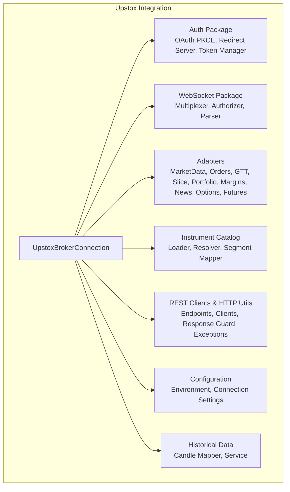
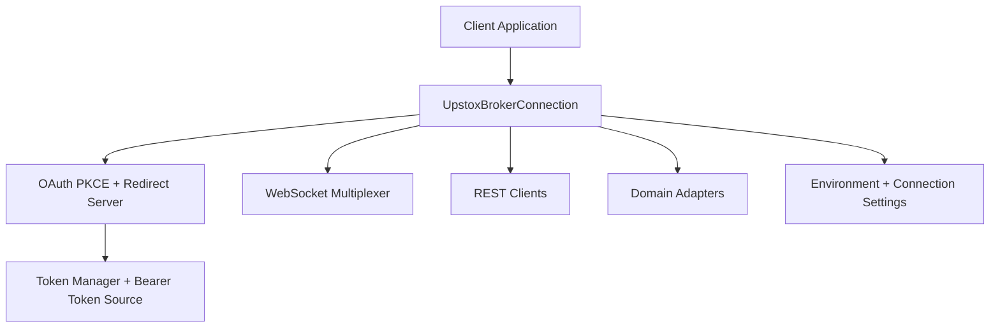
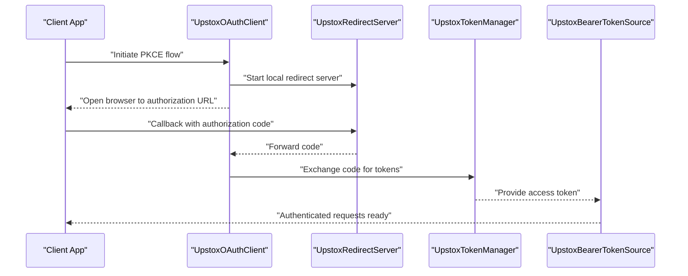
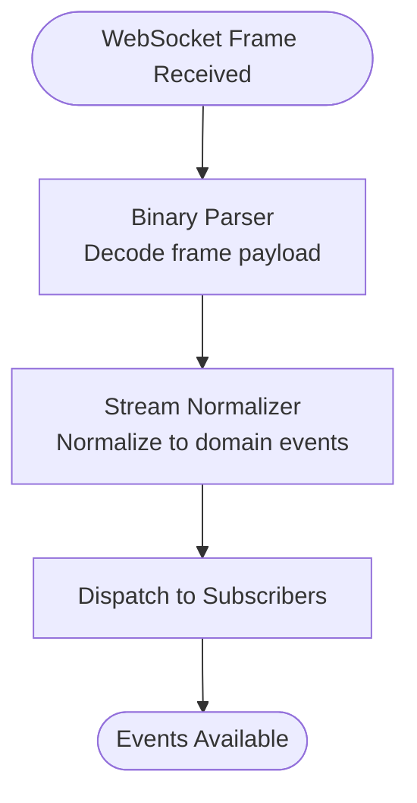
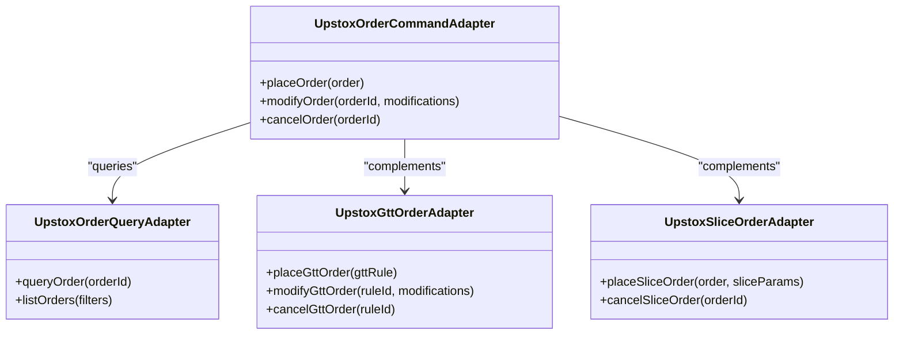
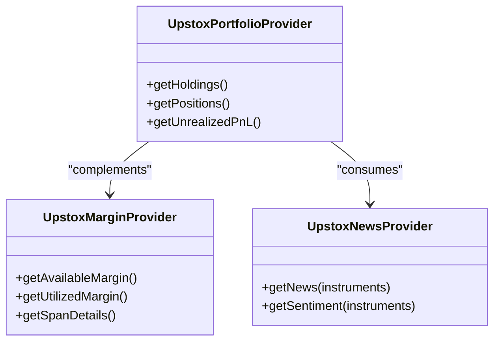
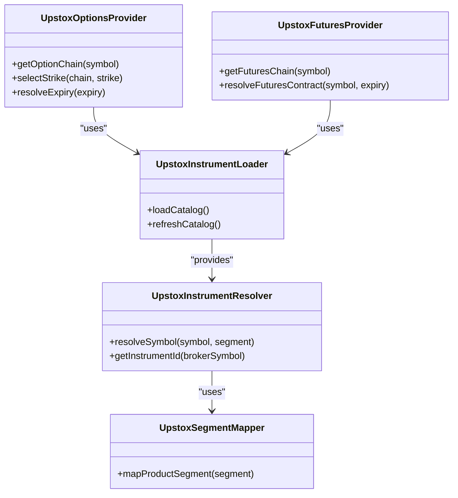
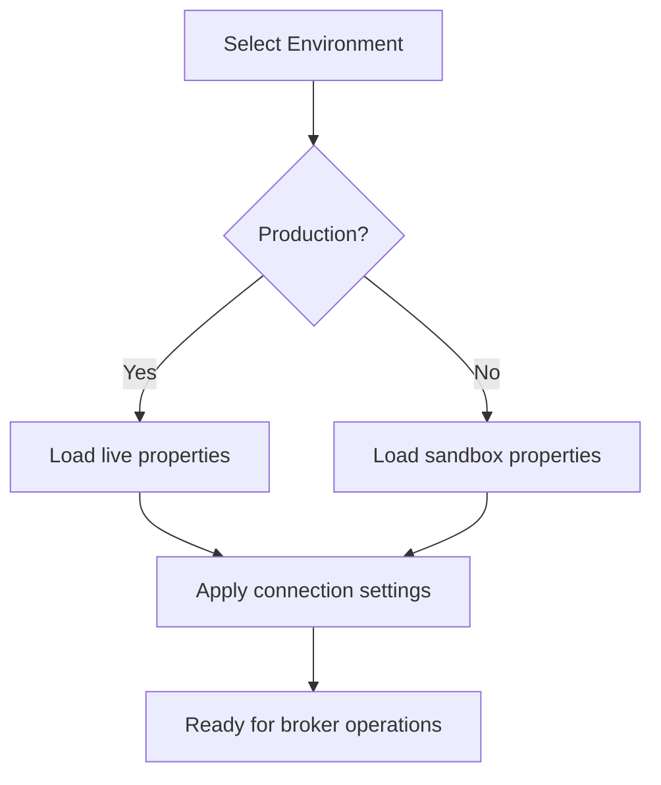
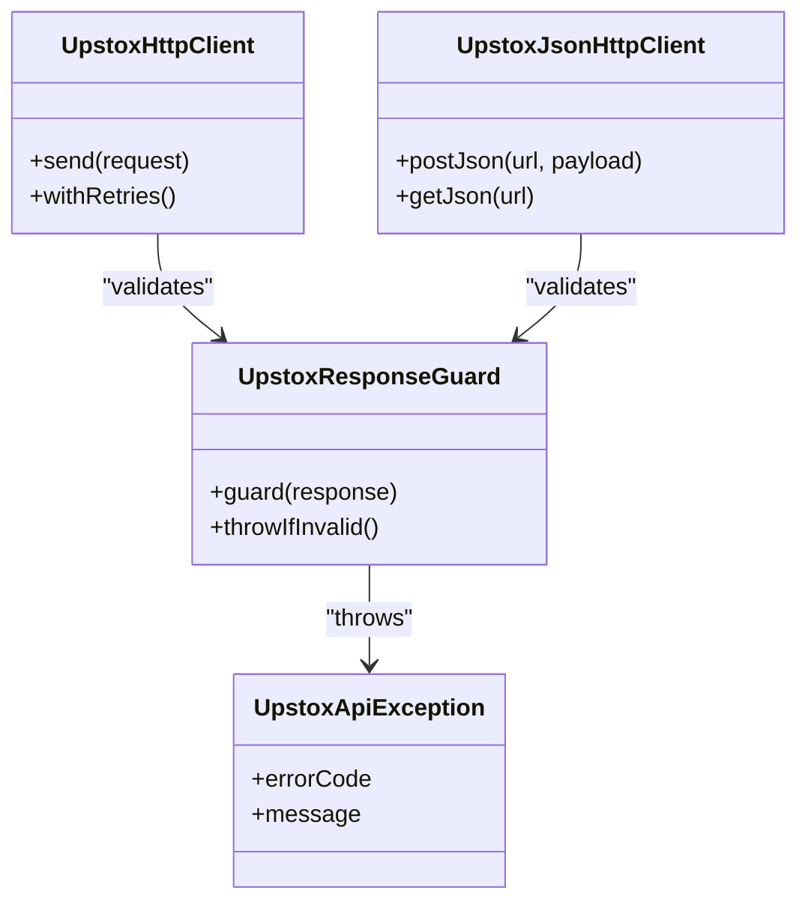
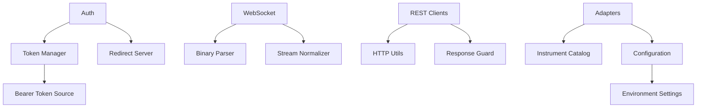

# Upstox Broker Integration

<cite>
**Referenced Files in This Document**
- [UpstoxBrokerConnection.java](file://broker/upstox/src/main/java/com/tradej/broker/upstox/UpstoxBrokerConnection.java)
- [UpstoxOAuthClient.java](file://broker/upstox/src/main/java/com/tradej/broker/upstox/auth/UpstoxOAuthClient.java)
- [UpstoxRedirectServer.java](file://broker/upstox/src/main/java/com/tradej/broker/upstox/auth/UpstoxRedirectServer.java)
- [UpstoxPkceUtil.java](file://broker/upstox/src/main/java/com/tradej/broker/upstox/auth/UpstoxPkceUtil.java)
- [UpstoxTokenManager.java](file://broker/upstox/src/main/java/com/tradej/broker/upstox/auth/UpstoxTokenManager.java)
- [UpstoxBearerTokenSource.java](file://broker/upstox/src/main/java/com/tradej/broker/upstox/auth/UpstoxBearerTokenSource.java)
- [UpstoxJwtExpiry.java](file://broker/upstox/src/main/java/com/tradej/broker/upstox/auth/UpstoxJwtExpiry.java)
- [UpstoxTokenExpiry.java](file://broker/upstox/src/main/java/com/tradej/broker/upstox/auth/UpstoxTokenExpiry.java)
- [UpstoxMarketDataProvider.java](file://broker/upstox/src/main/java/com/tradej/broker/upstox/adapter/UpstoxMarketDataProvider.java)
- [UpstoxWebSocketMultiplexer.java](file://broker/upstox/src/main/java/com/tradej/broker/upstox/websocket/UpstoxWebSocketMultiplexer.java)
- [UpstoxFeedAuthorizer.java](file://broker/upstox/src/main/java/com/tradej/broker/upstox/websocket/UpstoxFeedAuthorizer.java)
- [UpstoxBinaryParser.java](file://broker/upstox/src/main/java/com/tradej/broker/upstox/websocket/UpstoxBinaryParser.java)
- [UpstoxPortfolioStreamParser.java](file://broker/upstox/src/main/java/com/tradej/broker/upstox/websocket/UpstoxPortfolioStreamParser.java)
- [UpstoxStreamNormalizer.java](file://broker/upstox/src/main/java/com/tradej/broker/upstox/websocket/UpstoxStreamNormalizer.java)
- [ParsedFeedFrame.java](file://broker/upstox/src/main/java/com/tradej/broker/upstox/websocket/ParsedFeedFrame.java)
- [UpstoxOrderCommandAdapter.java](file://broker/upstox/src/main/java/com/tradej/broker/upstox/adapter/UpstoxOrderCommandAdapter.java)
- [UpstoxOrderQueryAdapter.java](file://broker/upstox/src/main/java/com/tradej/broker/upstox/adapter/UpstoxOrderQueryAdapter.java)
- [UpstoxGttOrderAdapter.java](file://broker/upstox/src/main/java/com/tradej/broker/upstox/adapter/UpstoxGttOrderAdapter.java)
- [UpstoxSliceOrderAdapter.java](file://broker/upstox/src/main/java/com/tradej/broker/upstox/adapter/UpstoxSliceOrderAdapter.java)
- [UpstoxPortfolioProvider.java](file://broker/upstox/src/main/java/com/tradej/broker/upstox/adapter/UpstoxPortfolioProvider.java)
- [UpstoxMarginProvider.java](file://broker/upstox/src/main/java/com/tradej/broker/upstox/adapter/UpstoxMarginProvider.java)
- [UpstoxNewsProvider.java](file://broker/upstox/src/main/java/com/tradej/broker/upstox/adapter/UpstoxNewsProvider.java)
- [UpstoxOptionsProvider.java](file://broker/upstox/src/main/java/com/tradej/broker/upstox/adapter/UpstoxOptionsProvider.java)
- [UpstoxFuturesProvider.java](file://broker/upstox/src/main/java/com/tradej/broker/upstox/adapter/UpstoxFuturesProvider.java)
- [UpstoxInstrumentLoader.java](file://broker/upstox/src/main/java/com/tradej/broker/upstox/instrument/UpstoxInstrumentLoader.java)
- [UpstoxInstrumentResolver.java](file://broker/upstox/src/main/java/com/tradej/broker/upstox/instrument/UpstoxInstrumentResolver.java)
- [UpstoxSegmentMapper.java](file://broker/upstox/src/main/java/com/tradej/broker/upstox/instrument/UpstoxSegmentMapper.java)
- [UpstoxEndpoints.java](file://broker/upstox/src/main/java/com/tradej/broker/upstox/constants/UpstoxEndpoints.java)
- [UpstoxConnectionSettings.java](file://broker/upstox/src/main/java/com/tradej/broker/upstox/config/UpstoxConnectionSettings.java)
- [UpstoxApiEnvironment.java](file://broker/upstox/src/main/java/com/tradej/broker/upstox/config/UpstoxApiEnvironment.java)
- [UpstoxHistoricalDataService.java](file://broker/upstox/src/main/java/com/tradej/broker/upstox/historical/UpstoxHistoricalCandleMapper.java)
- [UpstoxHistoricalDataService.java](file://broker/upstox/src/main/java/com/tradej/broker/upstox/historical/UpstoxHistoricalDataService.java)
- [UpstoxHttpClient.java](file://broker/upstox/src/main/java/com/tradej/broker/upstox/http/UpstoxHttpClient.java)
- [UpstoxJsonHttpClient.java](file://broker/upstox/src/main/java/com/tradej/broker/upstox/http/UpstoxJsonHttpClient.java)
- [UpstoxResponseGuard.java](file://broker/upstox/src/main/java/com/tradej/broker/upstox/http/UpstoxResponseGuard.java)
- [UpstoxApiException.java](file://broker/upstox/src/main/java/com/tradej/broker/upstox/http/UpstoxApiException.java)
- [upstox-live.properties.example](file://config/upstox-live.properties.example)
- [upstox-sandbox.properties.example](file://config/upstox-sandbox.properties.example)
- [UpstoxMarketFeedIntegrationTest.java](file://app/src/test/java/com/tradej/app/integration/UpstoxMarketFeedIntegrationTest.java)
- [UpstoxNewsIntegrationTest.java](file://app/src/test/java/com/tradej/app/integration/UpstoxNewsIntegrationTest.java)
- [LiveUpstoxTestSupport.java](file://app/src/test/java/com/tradej/app/integration/LiveUpstoxTestSupport.java)
</cite>

## Table of Contents
1. [Introduction](#introduction)
2. [Project Structure](#project-structure)
3. [Core Components](#core-components)
4. [Architecture Overview](#architecture-overview)
5. [Detailed Component Analysis](#detailed-component-analysis)
6. [Dependency Analysis](#dependency-analysis)
7. [Performance Considerations](#performance-considerations)
8. [Troubleshooting Guide](#troubleshooting-guide)
9. [Conclusion](#conclusion)
10. [Appendices](#appendices)

## Introduction
This document provides comprehensive documentation for the Upstox broker integration within the Trade-J ecosystem. It explains the authentication system (OAuth PKCE flow, JWT token handling), market data streaming (WebSocket connections, real-time quotes, market depth), order management (advanced order types, GTT orders, bracket orders), derivatives support (options and futures), portfolio management and margin handling, news integration, configuration management, instrument catalog loading, and robust error handling strategies. Practical examples demonstrate connection setup, authentication flows, and trading strategy implementation.

## Project Structure
The Upstox integration is organized into cohesive packages:
- Authentication: OAuth PKCE, redirect server, token management, JWT expiry handling
- Market Data: WebSocket multiplexer, feed authorizer, binary parser, stream normalizer
- Adapters: Market data, orders, GTT, slice orders, portfolio, margins, news, options, futures
- Instrument Catalog: Loader, resolver, segment mapping
- REST Clients and HTTP Utilities: Endpoints, clients, response guards, exceptions
- Configuration: Environment and connection settings
- Historical Data: Candle mapper and service
- Tests: Integration tests validating market feeds, news, and live sessions

**Diagram sources**
- [UpstoxBrokerConnection.java](file://broker/upstox/src/main/java/com/tradej/broker/upstox/UpstoxBrokerConnection.java)
- [UpstoxOAuthClient.java](file://broker/upstox/src/main/java/com/tradej/broker/upstox/auth/UpstoxOAuthClient.java)
- [UpstoxWebSocketMultiplexer.java](file://broker/upstox/src/main/java/com/tradej/broker/upstox/websocket/UpstoxWebSocketMultiplexer.java)
- [UpstoxMarketDataProvider.java](file://broker/upstox/src/main/java/com/tradej/broker/upstox/adapter/UpstoxMarketDataProvider.java)
- [UpstoxInstrumentLoader.java](file://broker/upstox/src/main/java/com/tradej/broker/upstox/instrument/UpstoxInstrumentLoader.java)
- [UpstoxEndpoints.java](file://broker/upstox/src/main/java/com/tradej/broker/upstox/constants/UpstoxEndpoints.java)
- [UpstoxConnectionSettings.java](file://broker/upstox/src/main/java/com/tradej/broker/upstox/config/UpstoxConnectionSettings.java)
- [UpstoxHistoricalDataService.java](file://broker/upstox/src/main/java/com/tradej/broker/upstox/historical/UpstoxHistoricalDataService.java)

**Section sources**
- [UpstoxBrokerConnection.java](file://broker/upstox/src/main/java/com/tradej/broker/upstox/UpstoxBrokerConnection.java)
- [UpstoxOAuthClient.java](file://broker/upstox/src/main/java/com/tradej/broker/upstox/auth/UpstoxOAuthClient.java)
- [UpstoxWebSocketMultiplexer.java](file://broker/upstox/src/main/java/com/tradej/broker/upstox/websocket/UpstoxWebSocketMultiplexer.java)
- [UpstoxEndpoints.java](file://broker/upstox/src/main/java/com/tradej/broker/upstox/constants/UpstoxEndpoints.java)
- [UpstoxConnectionSettings.java](file://broker/upstox/src/main/java/com/tradej/broker/upstox/config/UpstoxConnectionSettings.java)

## Core Components
- Authentication subsystem: Implements OAuth PKCE, manages redirect server, handles JWT expiry, and token lifecycle via bearer token source and token manager.
- Market data streaming: Provides WebSocket multiplexer, feed authorizer, binary parser, and stream normalizer for real-time quotes and depth.
- Order management adapters: Support market, limit, stop-loss, bracket orders, GTT, and slice orders.
- Portfolio and risk: Portfolio provider, margin provider, and news provider enable position tracking and market sentiment.
- Instrument catalog: Loader and resolver manage instrument definitions and segment mapping for accurate symbol resolution.
- REST clients and HTTP utilities: Typed clients for market data, orders, GTT, portfolio, news, and historical data with robust response guarding and exception handling.
- Configuration: Environment-aware settings and connection parameters for sandbox/live modes.

**Section sources**
- [UpstoxOAuthClient.java](file://broker/upstox/src/main/java/com/tradej/broker/upstox/auth/UpstoxOAuthClient.java)
- [UpstoxRedirectServer.java](file://broker/upstox/src/main/java/com/tradej/broker/upstox/auth/UpstoxRedirectServer.java)
- [UpstoxTokenManager.java](file://broker/upstox/src/main/java/com/tradej/broker/upstox/auth/UpstoxTokenManager.java)
- [UpstoxBearerTokenSource.java](file://broker/upstox/src/main/java/com/tradej/broker/upstox/auth/UpstoxBearerTokenSource.java)
- [UpstoxJwtExpiry.java](file://broker/upstox/src/main/java/com/tradej/broker/upstox/auth/UpstoxJwtExpiry.java)
- [UpstoxTokenExpiry.java](file://broker/upstox/src/main/java/com/tradej/broker/upstox/auth/UpstoxTokenExpiry.java)
- [UpstoxMarketDataProvider.java](file://broker/upstox/src/main/java/com/tradej/broker/upstox/adapter/UpstoxMarketDataProvider.java)
- [UpstoxWebSocketMultiplexer.java](file://broker/upstox/src/main/java/com/tradej/broker/upstox/websocket/UpstoxWebSocketMultiplexer.java)
- [UpstoxOrderCommandAdapter.java](file://broker/upstox/src/main/java/com/tradej/broker/upstox/adapter/UpstoxOrderCommandAdapter.java)
- [UpstoxOrderQueryAdapter.java](file://broker/upstox/src/main/java/com/tradej/broker/upstox/adapter/UpstoxOrderQueryAdapter.java)
- [UpstoxGttOrderAdapter.java](file://broker/upstox/src/main/java/com/tradej/broker/upstox/adapter/UpstoxGttOrderAdapter.java)
- [UpstoxSliceOrderAdapter.java](file://broker/upstox/src/main/java/com/tradej/broker/upstox/adapter/UpstoxSliceOrderAdapter.java)
- [UpstoxPortfolioProvider.java](file://broker/upstox/src/main/java/com/tradej/broker/upstox/adapter/UpstoxPortfolioProvider.java)
- [UpstoxMarginProvider.java](file://broker/upstox/src/main/java/com/tradej/broker/upstox/adapter/UpstoxMarginProvider.java)
- [UpstoxNewsProvider.java](file://broker/upstox/src/main/java/com/tradej/broker/upstox/adapter/UpstoxNewsProvider.java)
- [UpstoxOptionsProvider.java](file://broker/upstox/src/main/java/com/tradej/broker/upstox/adapter/UpstoxOptionsProvider.java)
- [UpstoxFuturesProvider.java](file://broker/upstox/src/main/java/com/tradej/broker/upstox/adapter/UpstoxFuturesProvider.java)
- [UpstoxInstrumentLoader.java](file://broker/upstox/src/main/java/com/tradej/broker/upstox/instrument/UpstoxInstrumentLoader.java)
- [UpstoxInstrumentResolver.java](file://broker/upstox/src/main/java/com/tradej/broker/upstox/instrument/UpstoxInstrumentResolver.java)
- [UpstoxSegmentMapper.java](file://broker/upstox/src/main/java/com/tradej/broker/upstox/instrument/UpstoxSegmentMapper.java)
- [UpstoxEndpoints.java](file://broker/upstox/src/main/java/com/tradej/broker/upstox/constants/UpstoxEndpoints.java)
- [UpstoxConnectionSettings.java](file://broker/upstox/src/main/java/com/tradej/broker/upstox/config/UpstoxConnectionSettings.java)
- [UpstoxHistoricalDataService.java](file://broker/upstox/src/main/java/com/tradej/broker/upstox/historical/UpstoxHistoricalDataService.java)
- [UpstoxHttpClient.java](file://broker/upstox/src/main/java/com/tradej/broker/upstox/http/UpstoxHttpClient.java)
- [UpstoxJsonHttpClient.java](file://broker/upstox/src/main/java/com/tradej/broker/upstox/http/UpstoxJsonHttpClient.java)
- [UpstoxResponseGuard.java](file://broker/upstox/src/main/java/com/tradej/broker/upstox/http/UpstoxResponseGuard.java)
- [UpstoxApiException.java](file://broker/upstox/src/main/java/com/tradej/broker/upstox/http/UpstoxApiException.java)

## Architecture Overview
The Upstox integration follows a layered architecture:
- Entry point: UpstoxBrokerConnection orchestrates initialization, authentication, and service wiring.
- Authentication: OAuth PKCE flow with local redirect server, token refresh, and JWT expiry management.
- Streaming: WebSocket multiplexer receives binary frames, parses them, normalizes events, and dispatches to subscribers.
- REST Layer: Typed clients encapsulate Upstox API endpoints for market data, orders, GTT, portfolio, news, and historical data.
- Domain Adapters: Translate broker-specific responses into unified domain models for trading and analytics.
- Configuration: Environment-aware settings and property-driven configuration for sandbox/live deployments.

**Diagram sources**
- [UpstoxBrokerConnection.java](file://broker/upstox/src/main/java/com/tradej/broker/upstox/UpstoxBrokerConnection.java)
- [UpstoxOAuthClient.java](file://broker/upstox/src/main/java/com/tradej/broker/upstox/auth/UpstoxOAuthClient.java)
- [UpstoxRedirectServer.java](file://broker/upstox/src/main/java/com/tradej/broker/upstox/auth/UpstoxRedirectServer.java)
- [UpstoxTokenManager.java](file://broker/upstox/src/main/java/com/tradej/broker/upstox/auth/UpstoxTokenManager.java)
- [UpstoxBearerTokenSource.java](file://broker/upstox/src/main/java/com/tradej/broker/upstox/auth/UpstoxBearerTokenSource.java)
- [UpstoxWebSocketMultiplexer.java](file://broker/upstox/src/main/java/com/tradej/broker/upstox/websocket/UpstoxWebSocketMultiplexer.java)
- [UpstoxEndpoints.java](file://broker/upstox/src/main/java/com/tradej/broker/upstox/constants/UpstoxEndpoints.java)
- [UpstoxConnectionSettings.java](file://broker/upstox/src/main/java/com/tradej/broker/upstox/config/UpstoxConnectionSettings.java)

## Detailed Component Analysis

### Authentication System
The authentication subsystem implements OAuth PKCE with a local redirect server and robust token lifecycle management:
- OAuth PKCE: Generates challenges and verifiers, constructs authorization URLs, and exchanges authorization codes for tokens.
- Redirect Server: Runs a lightweight HTTP server locally to receive the authorization callback.
- Token Management: Manages access tokens, refresh tokens, JWT expiry, and automatic renewal.
- Bearer Token Source: Supplies authenticated requests with current tokens.
- Token Expiry: Tracks JWT and token expiry to prevent unauthorized requests.

**Diagram sources**
- [UpstoxOAuthClient.java](file://broker/upstox/src/main/java/com/tradej/broker/upstox/auth/UpstoxOAuthClient.java)
- [UpstoxRedirectServer.java](file://broker/upstox/src/main/java/com/tradej/broker/upstox/auth/UpstoxRedirectServer.java)
- [UpstoxTokenManager.java](file://broker/upstox/src/main/java/com/tradej/broker/upstox/auth/UpstoxTokenManager.java)
- [UpstoxBearerTokenSource.java](file://broker/upstox/src/main/java/com/tradej/broker/upstox/auth/UpstoxBearerTokenSource.java)

Key implementation references:
- PKCE utilities and OAuth client flow: [UpstoxOAuthClient.java](file://broker/upstox/src/main/java/com/tradej/broker/upstox/auth/UpstoxOAuthClient.java), [UpstoxPkceUtil.java](file://broker/upstox/src/main/java/com/tradej/broker/upstox/auth/UpstoxPkceUtil.java)
- Redirect server for callbacks: [UpstoxRedirectServer.java](file://broker/upstox/src/main/java/com/tradej/broker/upstox/auth/UpstoxRedirectServer.java)
- Token manager and expiry handling: [UpstoxTokenManager.java](file://broker/upstox/src/main/java/com/tradej/broker/upstox/auth/UpstoxTokenManager.java), [UpstoxJwtExpiry.java](file://broker/upstox/src/main/java/com/tradej/broker/upstox/auth/UpstoxJwtExpiry.java), [UpstoxTokenExpiry.java](file://broker/upstox/src/main/java/com/tradej/broker/upstox/auth/UpstoxTokenExpiry.java)
- Bearer token source for authenticated requests: [UpstoxBearerTokenSource.java](file://broker/upstox/src/main/java/com/tradej/broker/upstox/auth/UpstoxBearerTokenSource.java)

**Section sources**
- [UpstoxOAuthClient.java](file://broker/upstox/src/main/java/com/tradej/broker/upstox/auth/UpstoxOAuthClient.java)
- [UpstoxRedirectServer.java](file://broker/upstox/src/main/java/com/tradej/broker/upstox/auth/UpstoxRedirectServer.java)
- [UpstoxPkceUtil.java](file://broker/upstox/src/main/java/com/tradej/broker/upstox/auth/UpstoxPkceUtil.java)
- [UpstoxTokenManager.java](file://broker/upstox/src/main/java/com/tradej/broker/upstox/auth/UpstoxTokenManager.java)
- [UpstoxBearerTokenSource.java](file://broker/upstox/src/main/java/com/tradej/broker/upstox/auth/UpstoxBearerTokenSource.java)
- [UpstoxJwtExpiry.java](file://broker/upstox/src/main/java/com/tradej/broker/upstox/auth/UpstoxJwtExpiry.java)
- [UpstoxTokenExpiry.java](file://broker/upstox/src/main/java/com/tradej/broker/upstox/auth/UpstoxTokenExpiry.java)

### Market Data Streaming
Real-time market data is handled via a WebSocket multiplexer with specialized parsers and normalizers:
- WebSocket Multiplexer: Establishes and maintains WebSocket connections, manages connection state, and routes frames.
- Feed Authorizer: Authenticates streams with broker credentials.
- Binary Parser: Decodes broker-specific binary frames into structured messages.
- Stream Normalizer: Converts raw frames into normalized domain events for downstream consumers.
- Portfolio Stream Parser: Specialized parser for portfolio-related updates.

**Diagram sources**
- [UpstoxWebSocketMultiplexer.java](file://broker/upstox/src/main/java/com/tradej/broker/upstox/websocket/UpstoxWebSocketMultiplexer.java)
- [UpstoxFeedAuthorizer.java](file://broker/upstox/src/main/java/com/tradej/broker/upstox/websocket/UpstoxFeedAuthorizer.java)
- [UpstoxBinaryParser.java](file://broker/upstox/src/main/java/com/tradej/broker/upstox/websocket/UpstoxBinaryParser.java)
- [UpstoxStreamNormalizer.java](file://broker/upstox/src/main/java/com/tradej/broker/upstox/websocket/UpstoxStreamNormalizer.java)
- [UpstoxPortfolioStreamParser.java](file://broker/upstox/src/main/java/com/tradej/broker/upstox/websocket/UpstoxPortfolioStreamParser.java)
- [ParsedFeedFrame.java](file://broker/upstox/src/main/java/com/tradej/broker/upstox/websocket/ParsedFeedFrame.java)

Implementation references:
- Multiplexer orchestration and state management: [UpstoxWebSocketMultiplexer.java](file://broker/upstox/src/main/java/com/tradej/broker/upstox/websocket/UpstoxWebSocketMultiplexer.java)
- Feed authorization and connection lifecycle: [UpstoxFeedAuthorizer.java](file://broker/upstox/src/main/java/com/tradej/broker/upstox/websocket/UpstoxFeedAuthorizer.java)
- Binary parsing and normalized event generation: [UpstoxBinaryParser.java](file://broker/upstox/src/main/java/com/tradej/broker/upstox/websocket/UpstoxBinaryParser.java), [UpstoxStreamNormalizer.java](file://broker/upstox/src/main/java/com/tradej/broker/upstox/websocket/UpstoxStreamNormalizer.java), [ParsedFeedFrame.java](file://broker/upstox/src/main/java/com/tradej/broker/upstox/websocket/ParsedFeedFrame.java)
- Portfolio-specific parsing: [UpstoxPortfolioStreamParser.java](file://broker/upstox/src/main/java/com/tradej/broker/upstox/websocket/UpstoxPortfolioStreamParser.java)

**Section sources**
- [UpstoxWebSocketMultiplexer.java](file://broker/upstox/src/main/java/com/tradej/broker/upstox/websocket/UpstoxWebSocketMultiplexer.java)
- [UpstoxFeedAuthorizer.java](file://broker/upstox/src/main/java/com/tradej/broker/upstox/websocket/UpstoxFeedAuthorizer.java)
- [UpstoxBinaryParser.java](file://broker/upstox/src/main/java/com/tradej/broker/upstox/websocket/UpstoxBinaryParser.java)
- [UpstoxStreamNormalizer.java](file://broker/upstox/src/main/java/com/tradej/broker/upstox/websocket/UpstoxStreamNormalizer.java)
- [UpstoxPortfolioStreamParser.java](file://broker/upstox/src/main/java/com/tradej/broker/upstox/websocket/UpstoxPortfolioStreamParser.java)
- [ParsedFeedFrame.java](file://broker/upstox/src/main/java/com/tradej/broker/upstox/websocket/ParsedFeedFrame.java)

### Order Management
The integration supports multiple order types and lifecycle operations:
- Market and Limit Orders: Basic execution types with price and quantity parameters.
- Stop Loss Orders: Trigger-based orders to exit or enter positions.
- Bracket Orders: One-cancels-other combinations for profit-taking and stop-loss.
- GTT (Good-Till-Time) Orders: Conditional orders with time-based triggers.
- Slice Orders: Volume-weighted slicing for large orders to minimize market impact.

**Diagram sources**
- [UpstoxOrderCommandAdapter.java](file://broker/upstox/src/main/java/com/tradej/broker/upstox/adapter/UpstoxOrderCommandAdapter.java)
- [UpstoxOrderQueryAdapter.java](file://broker/upstox/src/main/java/com/tradej/broker/upstox/adapter/UpstoxOrderQueryAdapter.java)
- [UpstoxGttOrderAdapter.java](file://broker/upstox/src/main/java/com/tradej/broker/upstox/adapter/UpstoxGttOrderAdapter.java)
- [UpstoxSliceOrderAdapter.java](file://broker/upstox/src/main/java/com/tradej/broker/upstox/adapter/UpstoxSliceOrderAdapter.java)

Implementation references:
- Order command adapter for placement/modification/cancellation: [UpstoxOrderCommandAdapter.java](file://broker/upstox/src/main/java/com/tradej/broker/upstox/adapter/UpstoxOrderCommandAdapter.java)
- Order query adapter for status and history: [UpstoxOrderQueryAdapter.java](file://broker/upstox/src/main/java/com/tradej/broker/upstox/adapter/UpstoxOrderQueryAdapter.java)
- GTT order adapter for time-bound conditions: [UpstoxGttOrderAdapter.java](file://broker/upstox/src/main/java/com/tradej/broker/upstox/adapter/UpstoxGttOrderAdapter.java)
- Slice order adapter for volume slicing: [UpstoxSliceOrderAdapter.java](file://broker/upstox/src/main/java/com/tradej/broker/upstox/adapter/UpstoxSliceOrderAdapter.java)

**Section sources**
- [UpstoxOrderCommandAdapter.java](file://broker/upstox/src/main/java/com/tradej/broker/upstox/adapter/UpstoxOrderCommandAdapter.java)
- [UpstoxOrderQueryAdapter.java](file://broker/upstox/src/main/java/com/tradej/broker/upstox/adapter/UpstoxOrderQueryAdapter.java)
- [UpstoxGttOrderAdapter.java](file://broker/upstox/src/main/java/com/tradej/broker/upstox/adapter/UpstoxGttOrderAdapter.java)
- [UpstoxSliceOrderAdapter.java](file://broker/upstox/src/main/java/com/tradej/broker/upstox/adapter/UpstoxSliceOrderAdapter.java)

### Portfolio Management and Margin
Portfolio and margin providers deliver position tracking and risk metrics:
- Portfolio Provider: Aggregates holdings, P&L, and exposure across instruments.
- Margin Provider: Computes margin requirements, utilization, and limits.
- News Provider: Streams market-moving news and sentiment indicators.

**Diagram sources**
- [UpstoxPortfolioProvider.java](file://broker/upstox/src/main/java/com/tradej/broker/upstox/adapter/UpstoxPortfolioProvider.java)
- [UpstoxMarginProvider.java](file://broker/upstox/src/main/java/com/tradej/broker/upstox/adapter/UpstoxMarginProvider.java)
- [UpstoxNewsProvider.java](file://broker/upstox/src/main/java/com/tradej/broker/upstox/adapter/UpstoxNewsProvider.java)

Implementation references:
- Portfolio aggregation and position metrics: [UpstoxPortfolioProvider.java](file://broker/upstox/src/main/java/com/tradej/broker/upstox/adapter/UpstoxPortfolioProvider.java)
- Margin computation and span details: [UpstoxMarginProvider.java](file://broker/upstox/src/main/java/com/tradej/broker/upstox/adapter/UpstoxMarginProvider.java)
- News and sentiment delivery: [UpstoxNewsProvider.java](file://broker/upstox/src/main/java/com/tradej/broker/upstox/adapter/UpstoxNewsProvider.java)

**Section sources**
- [UpstoxPortfolioProvider.java](file://broker/upstox/src/main/java/com/tradej/broker/upstox/adapter/UpstoxPortfolioProvider.java)
- [UpstoxMarginProvider.java](file://broker/upstox/src/main/java/com/tradej/broker/upstox/adapter/UpstoxMarginProvider.java)
- [UpstoxNewsProvider.java](file://broker/upstox/src/main/java/com/tradej/broker/upstox/adapter/UpstoxNewsProvider.java)

### Options and Futures Trading
Derivatives support includes instrument resolution and contract specifications:
- Options Provider: Resolves option chains, strike selection, and expiry handling.
- Futures Provider: Manages futures contracts, tick sizes, and rollovers.
- Instrument Loader and Resolver: Loads catalogs and resolves symbols to broker identifiers.
- Segment Mapper: Maps product segments (e.g., EQ, FUT, OPT) to broker conventions.

**Diagram sources**
- [UpstoxOptionsProvider.java](file://broker/upstox/src/main/java/com/tradej/broker/upstox/adapter/UpstoxOptionsProvider.java)
- [UpstoxFuturesProvider.java](file://broker/upstox/src/main/java/com/tradej/broker/upstox/adapter/UpstoxFuturesProvider.java)
- [UpstoxInstrumentLoader.java](file://broker/upstox/src/main/java/com/tradej/broker/upstox/instrument/UpstoxInstrumentLoader.java)
- [UpstoxInstrumentResolver.java](file://broker/upstox/src/main/java/com/tradej/broker/upstox/instrument/UpstoxInstrumentResolver.java)
- [UpstoxSegmentMapper.java](file://broker/upstox/src/main/java/com/tradej/broker/upstox/instrument/UpstoxSegmentMapper.java)

Implementation references:
- Options chain and strike resolution: [UpstoxOptionsProvider.java](file://broker/upstox/src/main/java/com/tradej/broker/upstox/adapter/UpstoxOptionsProvider.java)
- Futures contract resolution: [UpstoxFuturesProvider.java](file://broker/upstox/src/main/java/com/tradej/broker/upstox/adapter/UpstoxFuturesProvider.java)
- Instrument catalog loading and refresh: [UpstoxInstrumentLoader.java](file://broker/upstox/src/main/java/com/tradej/broker/upstox/instrument/UpstoxInstrumentLoader.java)
- Symbol resolution and instrument ID mapping: [UpstoxInstrumentResolver.java](file://broker/upstox/src/main/java/com/tradej/broker/upstox/instrument/UpstoxInstrumentResolver.java)
- Product segment mapping: [UpstoxSegmentMapper.java](file://broker/upstox/src/main/java/com/tradej/broker/upstox/instrument/UpstoxSegmentMapper.java)

**Section sources**
- [UpstoxOptionsProvider.java](file://broker/upstox/src/main/java/com/tradej/broker/upstox/adapter/UpstoxOptionsProvider.java)
- [UpstoxFuturesProvider.java](file://broker/upstox/src/main/java/com/tradej/broker/upstox/adapter/UpstoxFuturesProvider.java)
- [UpstoxInstrumentLoader.java](file://broker/upstox/src/main/java/com/tradej/broker/upstox/instrument/UpstoxInstrumentLoader.java)
- [UpstoxInstrumentResolver.java](file://broker/upstox/src/main/java/com/tradej/broker/upstox/instrument/UpstoxInstrumentResolver.java)
- [UpstoxSegmentMapper.java](file://broker/upstox/src/main/java/com/tradej/broker/upstox/instrument/UpstoxSegmentMapper.java)

### Configuration Management
Environment-aware configuration enables seamless sandbox and live deployments:
- Environment Settings: Sandbox vs. production endpoints and policies.
- Connection Settings: Hosts, ports, timeouts, and retry policies.
- Property Examples: Live and sandbox property templates guide deployment.

**Diagram sources**
- [UpstoxApiEnvironment.java](file://broker/upstox/src/main/java/com/tradej/broker/upstox/config/UpstoxApiEnvironment.java)
- [UpstoxConnectionSettings.java](file://broker/upstox/src/main/java/com/tradej/broker/upstox/config/UpstoxConnectionSettings.java)
- [upstox-live.properties.example](file://config/upstox-live.properties.example)
- [upstox-sandbox.properties.example](file://config/upstox-sandbox.properties.example)

Implementation references:
- Environment enumeration and endpoint mapping: [UpstoxApiEnvironment.java](file://broker/upstox/src/main/java/com/tradej/broker/upstox/config/UpstoxApiEnvironment.java)
- Connection parameters and defaults: [UpstoxConnectionSettings.java](file://broker/upstox/src/main/java/com/tradej/broker/upstox/config/UpstoxConnectionSettings.java)
- Property templates for deployment: [upstox-live.properties.example](file://config/upstox-live.properties.example), [upstox-sandbox.properties.example](file://config/upstox-sandbox.properties.example)

**Section sources**
- [UpstoxApiEnvironment.java](file://broker/upstox/src/main/java/com/tradej/broker/upstox/config/UpstoxApiEnvironment.java)
- [UpstoxConnectionSettings.java](file://broker/upstox/src/main/java/com/tradej/broker/upstox/config/UpstoxConnectionSettings.java)
- [upstox-live.properties.example](file://config/upstox-live.properties.example)
- [upstox-sandbox.properties.example](file://config/upstox-sandbox.properties.example)

### HTTP Utilities and REST Clients
Robust HTTP utilities and typed REST clients ensure reliable API interactions:
- HTTP Client: Generic HTTP client with retries and error handling.
- JSON HTTP Client: Specialized client for JSON payloads and content negotiation.
- Response Guard: Validates responses and raises typed exceptions.
- REST Clients: Typed clients for market data, orders, GTT, portfolio, news, and historical data.

**Diagram sources**
- [UpstoxHttpClient.java](file://broker/upstox/src/main/java/com/tradej/broker/upstox/http/UpstoxHttpClient.java)
- [UpstoxJsonHttpClient.java](file://broker/upstox/src/main/java/com/tradej/broker/upstox/http/UpstoxJsonHttpClient.java)
- [UpstoxResponseGuard.java](file://broker/upstox/src/main/java/com/tradej/broker/upstox/http/UpstoxResponseGuard.java)
- [UpstoxApiException.java](file://broker/upstox/src/main/java/com/tradej/broker/upstox/http/UpstoxApiException.java)

Implementation references:
- Generic HTTP client and retry logic: [UpstoxHttpClient.java](file://broker/upstox/src/main/java/com/tradej/broker/upstox/http/UpstoxHttpClient.java)
- JSON client for structured payloads: [UpstoxJsonHttpClient.java](file://broker/upstox/src/main/java/com/tradej/broker/upstox/http/UpstoxJsonHttpClient.java)
- Response validation and exception mapping: [UpstoxResponseGuard.java](file://broker/upstox/src/main/java/com/tradej/broker/upstox/http/UpstoxResponseGuard.java), [UpstoxApiException.java](file://broker/upstox/src/main/java/com/tradej/broker/upstox/http/UpstoxApiException.java)

**Section sources**
- [UpstoxHttpClient.java](file://broker/upstox/src/main/java/com/tradej/broker/upstox/http/UpstoxHttpClient.java)
- [UpstoxJsonHttpClient.java](file://broker/upstox/src/main/java/com/tradej/broker/upstox/http/UpstoxJsonHttpClient.java)
- [UpstoxResponseGuard.java](file://broker/upstox/src/main/java/com/tradej/broker/upstox/http/UpstoxResponseGuard.java)
- [UpstoxApiException.java](file://broker/upstox/src/main/java/com/tradej/broker/upstox/http/UpstoxApiException.java)

### Historical Data
Historical candle data is mapped and served through dedicated services:
- Candle Mapper: Transforms broker candles into standardized domain candles.
- Historical Data Service: Retrieves historical bars for charting and backtesting.

Implementation references:
- Candle mapping and normalization: [UpstoxHistoricalDataService.java](file://broker/upstox/src/main/java/com/tradej/broker/upstox/historical/UpstoxHistoricalCandleMapper.java)
- Historical data retrieval and caching: [UpstoxHistoricalDataService.java](file://broker/upstox/src/main/java/com/tradej/broker/upstox/historical/UpstoxHistoricalDataService.java)

**Section sources**
- [UpstoxHistoricalDataService.java](file://broker/upstox/src/main/java/com/tradej/broker/upstox/historical/UpstoxHistoricalDataService.java)
- [UpstoxHistoricalDataService.java](file://broker/upstox/src/main/java/com/tradej/broker/upstox/historical/UpstoxHistoricalCandleMapper.java)

## Dependency Analysis
The Upstox integration exhibits strong cohesion within functional domains and clean separation of concerns:
- Authentication depends on PKCE utilities and redirect server, coordinated by token manager and bearer token source.
- Streaming depends on WebSocket multiplexer, feed authorizer, and parsers; normalized events decouple from transport.
- REST clients depend on HTTP utilities and response guards; typed clients isolate endpoint concerns.
- Adapters depend on instrument catalog and segment mapping for symbol resolution.
- Configuration drives environment-specific behavior across all components.

**Diagram sources**
- [UpstoxOAuthClient.java](file://broker/upstox/src/main/java/com/tradej/broker/upstox/auth/UpstoxOAuthClient.java)
- [UpstoxRedirectServer.java](file://broker/upstox/src/main/java/com/tradej/broker/upstox/auth/UpstoxRedirectServer.java)
- [UpstoxTokenManager.java](file://broker/upstox/src/main/java/com/tradej/broker/upstox/auth/UpstoxTokenManager.java)
- [UpstoxBearerTokenSource.java](file://broker/upstox/src/main/java/com/tradej/broker/upstox/auth/UpstoxBearerTokenSource.java)
- [UpstoxWebSocketMultiplexer.java](file://broker/upstox/src/main/java/com/tradej/broker/upstox/websocket/UpstoxWebSocketMultiplexer.java)
- [UpstoxBinaryParser.java](file://broker/upstox/src/main/java/com/tradej/broker/upstox/websocket/UpstoxBinaryParser.java)
- [UpstoxStreamNormalizer.java](file://broker/upstox/src/main/java/com/tradej/broker/upstox/websocket/UpstoxStreamNormalizer.java)
- [UpstoxHttpClient.java](file://broker/upstox/src/main/java/com/tradej/broker/upstox/http/UpstoxHttpClient.java)
- [UpstoxJsonHttpClient.java](file://broker/upstox/src/main/java/com/tradej/broker/upstox/http/UpstoxJsonHttpClient.java)
- [UpstoxResponseGuard.java](file://broker/upstox/src/main/java/com/tradej/broker/upstox/http/UpstoxResponseGuard.java)
- [UpstoxInstrumentLoader.java](file://broker/upstox/src/main/java/com/tradej/broker/upstox/instrument/UpstoxInstrumentLoader.java)
- [UpstoxApiEnvironment.java](file://broker/upstox/src/main/java/com/tradej/broker/upstox/config/UpstoxApiEnvironment.java)
- [UpstoxConnectionSettings.java](file://broker/upstox/src/main/java/com/tradej/broker/upstox/config/UpstoxConnectionSettings.java)

**Section sources**
- [UpstoxOAuthClient.java](file://broker/upstox/src/main/java/com/tradej/broker/upstox/auth/UpstoxOAuthClient.java)
- [UpstoxRedirectServer.java](file://broker/upstox/src/main/java/com/tradej/broker/upstox/auth/UpstoxRedirectServer.java)
- [UpstoxTokenManager.java](file://broker/upstox/src/main/java/com/tradej/broker/upstox/auth/UpstoxTokenManager.java)
- [UpstoxBearerTokenSource.java](file://broker/upstox/src/main/java/com/tradej/broker/upstox/auth/UpstoxBearerTokenSource.java)
- [UpstoxWebSocketMultiplexer.java](file://broker/upstox/src/main/java/com/tradej/broker/upstox/websocket/UpstoxWebSocketMultiplexer.java)
- [UpstoxBinaryParser.java](file://broker/upstox/src/main/java/com/tradej/broker/upstox/websocket/UpstoxBinaryParser.java)
- [UpstoxStreamNormalizer.java](file://broker/upstox/src/main/java/com/tradej/broker/upstox/websocket/UpstoxStreamNormalizer.java)
- [UpstoxHttpClient.java](file://broker/upstox/src/main/java/com/tradej/broker/upstox/http/UpstoxHttpClient.java)
- [UpstoxJsonHttpClient.java](file://broker/upstox/src/main/java/com/tradej/broker/upstox/http/UpstoxJsonHttpClient.java)
- [UpstoxResponseGuard.java](file://broker/upstox/src/main/java/com/tradej/broker/upstox/http/UpstoxResponseGuard.java)
- [UpstoxInstrumentLoader.java](file://broker/upstox/src/main/java/com/tradej/broker/upstox/instrument/UpstoxInstrumentLoader.java)
- [UpstoxApiEnvironment.java](file://broker/upstox/src/main/java/com/tradej/broker/upstox/config/UpstoxApiEnvironment.java)
- [UpstoxConnectionSettings.java](file://broker/upstox/src/main/java/com/tradej/broker/upstox/config/UpstoxConnectionSettings.java)

## Performance Considerations
- WebSocket multiplexing reduces connection overhead and improves throughput for high-frequency feeds.
- Stream normalization minimizes downstream processing costs by pre-aggregating and structuring events.
- HTTP clients leverage retries and response guards to handle transient failures efficiently.
- Instrument catalog loading and caching reduce symbol resolution latency during trading.
- Historical data services employ efficient candle mapping and caching strategies for backtesting and analytics.

[No sources needed since this section provides general guidance]

## Troubleshooting Guide
Common issues and resolutions:
- Authentication Failures: Verify PKCE verifier/challenge alignment, redirect URI correctness, and local port availability for the redirect server.
- Token Expiry: Ensure token manager refreshes tokens before expiry and that JWT expiry is monitored to prevent unauthorized requests.
- WebSocket Disconnections: Confirm feed authorizer credentials, network stability, and multiplexer reconnection logic.
- REST API Errors: Inspect response guard validations and typed exceptions to diagnose malformed responses or rate-limiting.
- Instrument Resolution: Validate instrument loader refresh and segment mapper mappings for accurate symbol resolution.

**Section sources**
- [UpstoxOAuthClient.java](file://broker/upstox/src/main/java/com/tradej/broker/upstox/auth/UpstoxOAuthClient.java)
- [UpstoxRedirectServer.java](file://broker/upstox/src/main/java/com/tradej/broker/upstox/auth/UpstoxRedirectServer.java)
- [UpstoxTokenManager.java](file://broker/upstox/src/main/java/com/tradej/broker/upstox/auth/UpstoxTokenManager.java)
- [UpstoxJwtExpiry.java](file://broker/upstox/src/main/java/com/tradej/broker/upstox/auth/UpstoxJwtExpiry.java)
- [UpstoxTokenExpiry.java](file://broker/upstox/src/main/java/com/tradej/broker/upstox/auth/UpstoxTokenExpiry.java)
- [UpstoxWebSocketMultiplexer.java](file://broker/upstox/src/main/java/com/tradej/broker/upstox/websocket/UpstoxWebSocketMultiplexer.java)
- [UpstoxFeedAuthorizer.java](file://broker/upstox/src/main/java/com/tradej/broker/upstox/websocket/UpstoxFeedAuthorizer.java)
- [UpstoxResponseGuard.java](file://broker/upstox/src/main/java/com/tradej/broker/upstox/http/UpstoxResponseGuard.java)
- [UpstoxApiException.java](file://broker/upstox/src/main/java/com/tradej/broker/upstox/http/UpstoxApiException.java)
- [UpstoxInstrumentLoader.java](file://broker/upstox/src/main/java/com/tradej/broker/upstox/instrument/UpstoxInstrumentLoader.java)
- [UpstoxSegmentMapper.java](file://broker/upstox/src/main/java/com/tradej/broker/upstox/instrument/UpstoxSegmentMapper.java)

## Conclusion
The Upstox broker integration delivers a robust, modular, and production-ready solution for trading and market data within the Trade-J platform. Its OAuth PKCE-based authentication, resilient WebSocket streaming, comprehensive order management, derivatives support, portfolio and margin services, and environment-aware configuration collectively enable scalable and reliable trading operations. The documented components and flows provide a clear blueprint for deployment, extension, and maintenance.

[No sources needed since this section summarizes without analyzing specific files]

## Appendices

### Practical Setup Examples
- Setting up Upstox connections:
  - Configure environment and connection settings: [UpstoxApiEnvironment.java](file://broker/upstox/src/main/java/com/tradej/broker/upstox/config/UpstoxApiEnvironment.java), [UpstoxConnectionSettings.java](file://broker/upstox/src/main/java/com/tradej/broker/upstox/config/UpstoxConnectionSettings.java)
  - Load property templates for live/sandbox: [upstox-live.properties.example](file://config/upstox-live.properties.example), [upstox-sandbox.properties.example](file://config/upstox-sandbox.properties.example)
- Handling authentication flows:
  - Initiate PKCE and redirect server: [UpstoxOAuthClient.java](file://broker/upstox/src/main/java/com/tradej/broker/upstox/auth/UpstoxOAuthClient.java), [UpstoxRedirectServer.java](file://broker/upstox/src/main/java/com/tradej/broker/upstox/auth/UpstoxRedirectServer.java)
  - Manage tokens and JWT expiry: [UpstoxTokenManager.java](file://broker/upstox/src/main/java/com/tradej/broker/upstox/auth/UpstoxTokenManager.java), [UpstoxJwtExpiry.java](file://broker/upstox/src/main/java/com/tradej/broker/upstox/auth/UpstoxJwtExpiry.java), [UpstoxTokenExpiry.java](file://broker/upstox/src/main/java/com/tradej/broker/upstox/auth/UpstoxTokenExpiry.java)
- Implementing trading strategies:
  - Subscribe to market data via WebSocket: [UpstoxWebSocketMultiplexer.java](file://broker/upstox/src/main/java/com/tradej/broker/upstox/websocket/UpstoxWebSocketMultiplexer.java)
  - Place and manage orders: [UpstoxOrderCommandAdapter.java](file://broker/upstox/src/main/java/com/tradej/broker/upstox/adapter/UpstoxOrderCommandAdapter.java), [UpstoxOrderQueryAdapter.java](file://broker/upstox/src/main/java/com/tradej/broker/upstox/adapter/UpstoxOrderQueryAdapter.java)
  - Use GTT and slice orders for advanced execution: [UpstoxGttOrderAdapter.java](file://broker/upstox/src/main/java/com/tradej/broker/upstox/adapter/UpstoxGttOrderAdapter.java), [UpstoxSliceOrderAdapter.java](file://broker/upstox/src/main/java/com/tradej/broker/upstox/adapter/UpstoxSliceOrderAdapter.java)
  - Resolve instruments and manage derivatives: [UpstoxInstrumentLoader.java](file://broker/upstox/src/main/java/com/tradej/broker/upstox/instrument/UpstoxInstrumentLoader.java), [UpstoxInstrumentResolver.java](file://broker/upstox/src/main/java/com/tradej/broker/upstox/instrument/UpstoxInstrumentResolver.java), [UpstoxOptionsProvider.java](file://broker/upstox/src/main/java/com/tradej/broker/upstox/adapter/UpstoxOptionsProvider.java), [UpstoxFuturesProvider.java](file://broker/upstox/src/main/java/com/tradej/broker/upstox/adapter/UpstoxFuturesProvider.java)
  - Monitor portfolio and margins: [UpstoxPortfolioProvider.java](file://broker/upstox/src/main/java/com/tradej/broker/upstox/adapter/UpstoxPortfolioProvider.java), [UpstoxMarginProvider.java](file://broker/upstox/src/main/java/com/tradej/broker/upstox/adapter/UpstoxMarginProvider.java)
  - Integrate news for sentiment: [UpstoxNewsProvider.java](file://broker/upstox/src/main/java/com/tradej/broker/upstox/adapter/UpstoxNewsProvider.java)

**Section sources**
- [UpstoxApiEnvironment.java](file://broker/upstox/src/main/java/com/tradej/broker/upstox/config/UpstoxApiEnvironment.java)
- [UpstoxConnectionSettings.java](file://broker/upstox/src/main/java/com/tradej/broker/upstox/config/UpstoxConnectionSettings.java)
- [upstox-live.properties.example](file://config/upstox-live.properties.example)
- [upstox-sandbox.properties.example](file://config/upstox-sandbox.properties.example)
- [UpstoxOAuthClient.java](file://broker/upstox/src/main/java/com/tradej/broker/upstox/auth/UpstoxOAuthClient.java)
- [UpstoxRedirectServer.java](file://broker/upstox/src/main/java/com/tradej/broker/upstox/auth/UpstoxRedirectServer.java)
- [UpstoxTokenManager.java](file://broker/upstox/src/main/java/com/tradej/broker/upstox/auth/UpstoxTokenManager.java)
- [UpstoxJwtExpiry.java](file://broker/upstox/src/main/java/com/tradej/broker/upstox/auth/UpstoxJwtExpiry.java)
- [UpstoxTokenExpiry.java](file://broker/upstox/src/main/java/com/tradej/broker/upstox/auth/UpstoxTokenExpiry.java)
- [UpstoxWebSocketMultiplexer.java](file://broker/upstox/src/main/java/com/tradej/broker/upstox/websocket/UpstoxWebSocketMultiplexer.java)
- [UpstoxOrderCommandAdapter.java](file://broker/upstox/src/main/java/com/tradej/broker/upstox/adapter/UpstoxOrderCommandAdapter.java)
- [UpstoxOrderQueryAdapter.java](file://broker/upstox/src/main/java/com/tradej/broker/upstox/adapter/UpstoxOrderQueryAdapter.java)
- [UpstoxGttOrderAdapter.java](file://broker/upstox/src/main/java/com/tradej/broker/upstox/adapter/UpstoxGttOrderAdapter.java)
- [UpstoxSliceOrderAdapter.java](file://broker/upstox/src/main/java/com/tradej/broker/upstox/adapter/UpstoxSliceOrderAdapter.java)
- [UpstoxInstrumentLoader.java](file://broker/upstox/src/main/java/com/tradej/broker/upstox/instrument/UpstoxInstrumentLoader.java)
- [UpstoxInstrumentResolver.java](file://broker/upstox/src/main/java/com/tradej/broker/upstox/instrument/UpstoxInstrumentResolver.java)
- [UpstoxOptionsProvider.java](file://broker/upstox/src/main/java/com/tradej/broker/upstox/adapter/UpstoxOptionsProvider.java)
- [UpstoxFuturesProvider.java](file://broker/upstox/src/main/java/com/tradej/broker/upstox/adapter/UpstoxFuturesProvider.java)
- [UpstoxPortfolioProvider.java](file://broker/upstox/src/main/java/com/tradej/broker/upstox/adapter/UpstoxPortfolioProvider.java)
- [UpstoxMarginProvider.java](file://broker/upstox/src/main/java/com/tradej/broker/upstox/adapter/UpstoxMarginProvider.java)
- [UpstoxNewsProvider.java](file://broker/upstox/src/main/java/com/tradej/broker/upstox/adapter/UpstoxNewsProvider.java)

### Integration Tests References
- Market feed integration tests validate WebSocket connectivity and quote reception: [UpstoxMarketFeedIntegrationTest.java](file://app/src/test/java/com/tradej/app/integration/UpstoxMarketFeedIntegrationTest.java)
- News integration tests verify news and sentiment delivery: [UpstoxNewsIntegrationTest.java](file://app/src/test/java/com/tradej/app/integration/UpstoxNewsIntegrationTest.java)
- Live session support for Upstox testing: [LiveUpstoxTestSupport.java](file://app/src/test/java/com/tradej/app/integration/LiveUpstoxTestSupport.java)

**Section sources**
- [UpstoxMarketFeedIntegrationTest.java](file://app/src/test/java/com/tradej/app/integration/UpstoxMarketFeedIntegrationTest.java)
- [UpstoxNewsIntegrationTest.java](file://app/src/test/java/com/tradej/app/integration/UpstoxNewsIntegrationTest.java)
- [LiveUpstoxTestSupport.java](file://app/src/test/java/com/tradej/app/integration/LiveUpstoxTestSupport.java)