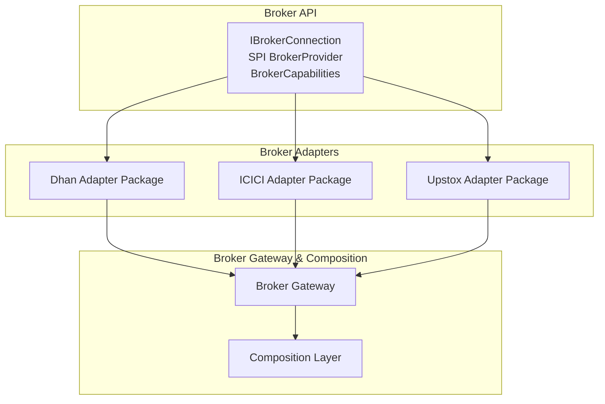
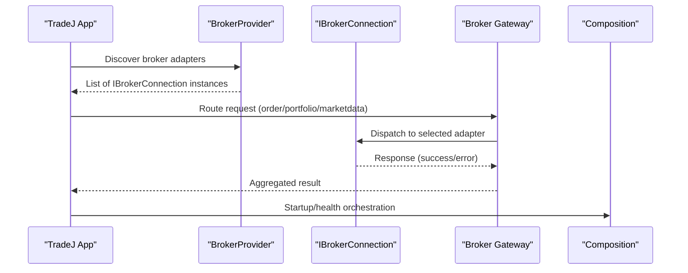
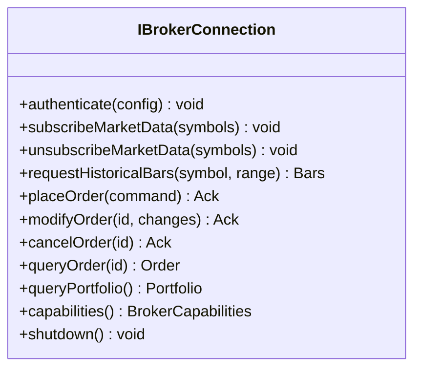
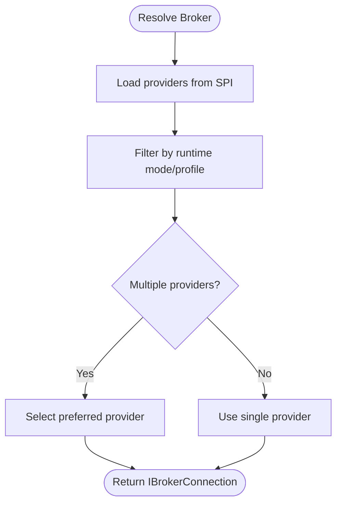
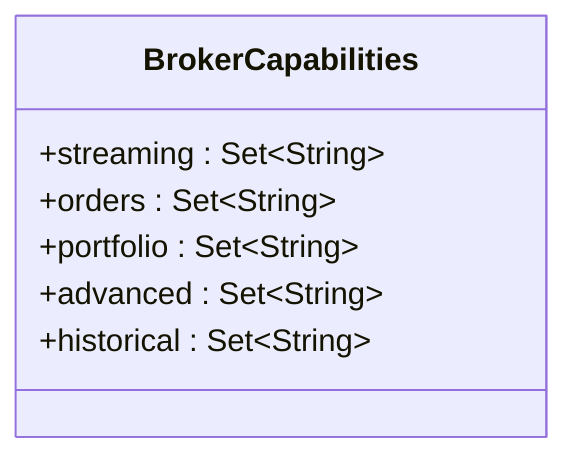
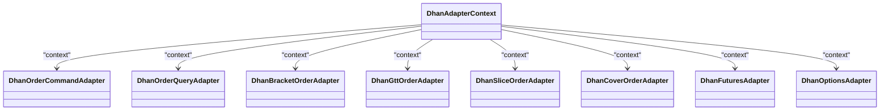
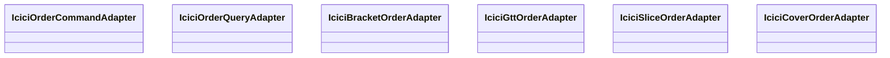
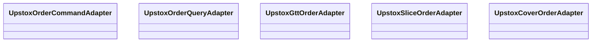
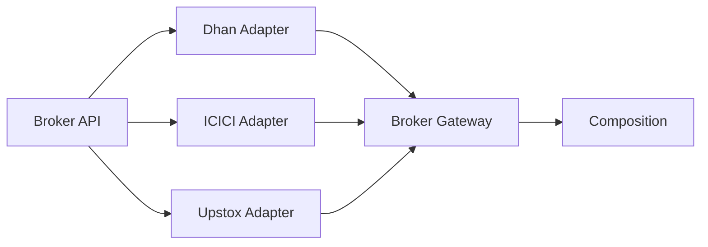

# Broker Integration

<cite>
**Referenced Files in This Document**
- [IBrokerConnection.java](file://broker/api/src/main/java/com/tradej/broker/api/IBrokerConnection.java)
- [BrokerProvider.java](file://broker/api/src/main/java/com/tradej/broker/api/spi/BrokerProvider.java)
- [BrokerCapabilities.java](file://broker/api/src/main/java/com/tradej/broker/api/model/BrokerCapabilities.java)
- [DhanAdapterContext.java](file://broker/dhan/src/main/java/com/tradej/broker/dhan/adapter/DhanAdapterContext.java)
- [DhanOrderCommandAdapter.java](file://broker/dhan/src/main/java/com/tradej/broker/dhan/adapter/DhanOrderCommandAdapter.java)
- [DhanOrderQueryAdapter.java](file://broker/dhan/src/main/java/com/tradej/broker/dhan/adapter/DhanOrderQueryAdapter.java)
- [DhanBracketOrderAdapter.java](file://broker/dhan/src/main/java/com/tradej/broker/dhan/adapter/DhanBracketOrderAdapter.java)
- [DhanGttOrderAdapter.java](file://broker/dhan/src/main/java/com/tradej/broker/dhan/adapter/DhanGttOrderAdapter.java)
- [DhanSliceOrderAdapter.java](file://broker/dhan/src/main/java/com/tradej/broker/dhan/adapter/DhanSliceOrderAdapter.java)
- [DhanCoverOrderAdapter.java](file://broker/dhan/src/main/java/com/tradej/broker/dhan/adapter/DhanCoverOrderAdapter.java)
- [DhanFuturesAdapter.java](file://broker/dhan/src/main/java/com/tradej/broker/dhan/adapter/DhanFuturesAdapter.java)
- [DhanOptionsAdapter.java](file://broker/dhan/src/main/java/com/tradej/broker/dhan/adapter/DhanOptionsAdapter.java)
- [IciciOrderCommandAdapter.java](file://broker/icici/src/main/java/com/tradej/broker/icici/adapter/IciciOrderCommandAdapter.java)
- [IciciOrderQueryAdapter.java](file://broker/icici/src/main/java/com/tradej/broker/icici/adapter/IciciOrderQueryAdapter.java)
- [IciciBracketOrderAdapter.java](file://broker/icici/src/main/java/com/tradej/broker/icici/adapter/IciciBracketOrderAdapter.java)
- [IciciGttOrderAdapter.java](file://broker/icici/src/main/java/com/tradej/broker/icici/adapter/IciciGttOrderAdapter.java)
- [IciciSliceOrderAdapter.java](file://broker/icici/src/main/java/com/tradej/broker/icici/adapter/IciciSliceOrderAdapter.java)
- [IciciCoverOrderAdapter.java](file://broker/icici/src/main/java/com/tradej/broker/icici/adapter/IciciCoverOrderAdapter.java)
- [UpstoxOrderCommandAdapter.java](file://broker/upstox/src/main/java/com/tradej/broker/upstox/adapter/UpstoxOrderCommandAdapter.java)
- [UpstoxOrderQueryAdapter.java](file://broker/upstox/src/main/java/com/tradej/broker/upstox/adapter/UpstoxOrderQueryAdapter.java)
- [UpstoxGttOrderAdapter.java](file://broker/upstox/src/main/java/com/tradej/broker/upstox/adapter/UpstoxGttOrderAdapter.java)
- [UpstoxSliceOrderAdapter.java](file://broker/upstox/src/main/java/com/tradej/broker/upstox/adapter/UpstoxSliceOrderAdapter.java)
- [UpstoxCoverOrderAdapter.java](file://broker/upstox/src/main/java/com/tradej/broker/upstox/adapter/UpstoxCoverOrderAdapter.java)
- [application.yml](file://app/src/main/resources/application.yml)
- [application-dev.yml](file://app/src/main/resources/application-dev.yml)
- [application-prod.yml](file://app/src/main/resources/application-prod.yml)
- [application-test.yml](file://app/src/main/resources/application-test.yml)
- [dhan-local.properties.example](file://config/dhan-local.properties.example)
- [dhan-sandbox.properties.example](file://config/dhan-sandbox.properties.example)
- [icici-local.properties.example](file://config/icici-local.properties.example)
- [upstox-live.properties.example](file://config/upstox-live.properties.example)
- [upstox-sandbox.properties.example](file://config/upstox-sandbox.properties.example)
- [BrokerGatewayTest.java](file://broker-gateway/src/test/java/com/tradej/brokergateway/BrokerGatewayTest.java)
- [BrokerExplorerTest.java](file://broker-gateway/src/test/java/com/tradej/brokergateway/BrokerExplorerTest.java)
- [BrokerRouterTest.java](file://broker-gateway/src/test/java/com/tradej/brokergateway/BrokerRouterTest.java)
- [BrokerHandleTest.java](file://broker-gateway/src/test/java/com/tradej/brokergateway/BrokerHandleTest.java)
- [BrokerHandleAdvancedTest.java](file://broker-gateway/src/test/java/com/tradej/brokergateway/BrokerHandleAdvancedTest.java)
- [BrokerCertificationTest.java](file://broker-gateway/src/test/java/com/tradej/brokergateway/BrokerCertificationTest.java)
- [IBrokerConnectionContractTest.java](file://broker/api/testFixtures/java/com/tradej/broker/api/IBrokerConnectionContractTest.java)
- [BrokerContractSuite.java](file://broker/api/testFixtures/java/com/tradej/broker/api/BrokerContractSuite.java)
- [BrokerAdapterConfigurationTest.java](file://app/src/test/java/com/tradej/app/config/BrokerAdapterConfigurationTest.java)
- [GatewayBrokerConfigurationTest.java](file://app/src/test/java/com/tradej/app/config/GatewayBrokerConfigurationTest.java)
- [GatewayWebSocketConfigurationTest.java](file://app/src/test/java/com/tradej/app/config/GatewayWebSocketConfigurationTest.java)
- [RuntimeConfigurationTest.java](file://app/src/test/java/com/tradej/app/config/RuntimeConfigurationTest.java)
- [BrokerStartupOrchestratorTest.java](file://app/src/test/java/com/tradej/app/startup/BrokerStartupOrchestratorTest.java)
- [BrokerStartupValidatorTest.java](file://app/src/test/java/com/tradej/app/startup/BrokerStartupValidatorTest.java)
- [BrokerFailoverEndToEndTest.java](file://app/src/test/java/com/tradej/app/e2e/BrokerFailoverEndToEndTest.java)
- [MarketDataFlowEndToEndTest.java](file://app/src/test/java/com/tradej/app/e2e/MarketDataFlowEndToEndTest.java)
- [OrderExecutionFlowEndToEndTest.java](file://app/src/test/java/com/tradej/app/e2e/OrderExecutionFlowEndToEndTest.java)
- [DhanMarketFeedWebSocketIntegrationTest.java](file://app/src/test/java/com/tradej/app/integration/DhanMarketFeedWebSocketIntegrationTest.java)
- [DhanOrderLifecycleIntegrationTest.java](file://app/src/test/java/com/tradej/app/integration/DhanOrderLifecycleIntegrationTest.java)
- [DhanPortfolioIntegrationTest.java](file://app/src/test/java/com/tradej/app/integration/DhanPortfolioIntegrationTest.java)
- [IciciMarketFeedIntegrationTest.java](file://app/src/test/java/com/tradej/app/integration/IciciMarketFeedIntegrationTest.java)
- [IciciOrderLifecycleIntegrationTest.java](file://app/src/test/java/com/tradej/app/integration/IciciOrderLifecycleIntegrationTest.java)
- [IciciPortfolioIntegrationTest.java](file://app/src/test/java/com/tradej/app/integration/IciciPortfolioIntegrationTest.java)
- [UpstoxMarketFeedIntegrationTest.java](file://app/src/test/java/com/tradej/app/integration/UpstoxMarketFeedIntegrationTest.java)
- [UpstoxOrderLifecycleIntegrationTest.java](file://app/src/test/java/com/tradej/app/integration/UpstoxOrderLifecycleIntegrationTest.java)
- [UpstoxPortfolioIntegrationTest.java](file://app/src/test/java/com/tradej/app/integration/UpstoxPortfolioIntegrationTest.java)
- [LiveDhanTestSupport.java](file://app/src/test/java/com/tradej/app/integration/LiveDhanTestSupport.java)
- [LiveIciciTestSupport.java](file://app/src/test/java/com/tradej/app/integration/LiveIciciTestSupport.java)
- [LiveUpstoxTestSupport.java](file://app/src/test/java/com/tradej/app/integration/LiveUpstoxTestSupport.java)
- [DhanTokenLifecycleIntegrationTest.java](file://app/src/test/java/com/tradej/app/integration/DhanTokenLifecycleIntegrationTest.java)
- [IciciTokenLifecycleIntegrationTest.java](file://app/src/test/java/com/tradej/app/integration/IciciTokenLifecycleIntegrationTest.java)
- [IciciRefreshSessionIntegrationTest.java](file://app/src/test/java/com/tradej/app/integration/IciciRefreshSessionIntegrationTest.java)
- [UpstoxRegressionPreflightIntegrationTest.java](file://app/src/test/java/com/tradej/app/integration/UpstoxRegressionPreflightIntegrationTest.java)
- [DhanKillSwitchIntegrationTest.java](file://app/src/test/java/com/tradej/app/integration/DhanKillSwitchIntegrationTest.java)
- [DhanMarginIntegrationTest.java](file://app/src/test/java/com/tradej/app/integration/DhanMarginIntegrationTest.java)
- [DhanMarketDepthIntegrationTest.java](file://app/src/test/java/com/tradej/app/integration/DhanMarketDepthIntegrationTest.java)
- [DhanSuperOrderIntegrationTest.java](file://app/src/test/java/com/tradej/app/integration/DhanSuperOrderIntegrationTest.java)
- [DhanSliceOrderIntegrationTest.java](file://app/src/test/java/com/tradej/app/integration/DhanSliceOrderIntegrationTest.java)
- [DhanDerivativesIntegrationTest.java](file://app/src/test/java/com/tradej/app/integration/DhanDerivativesIntegrationTest.java)
- [DhanAlertIntegrationTest.java](file://app/src/test/java/com/tradej/app/integration/DhanAlertIntegrationTest.java)
- [DhanNewsIntegrationTest.java](file://app/src/test/java/com/tradej/app/integration/DhanNewsIntegrationTest.java)
- [DhanSessionRiskIntegrationTest.java](file://app/src/test/java/com/tradej/app/integration/DhanSessionRiskIntegrationTest.java)
- [DhanBatchQuoteIntegrationTest.java](file://app/src/test/java/com/tradej/app/integration/DhanBatchQuoteIntegrationTest.java)
- [DhanCancelAllIntegrationTest.java](file://app/src/test/java/com/tradej/app/integration/DhanCancelAllIntegrationTest.java)
- [DhanSquareOffIntegrationTest.java](file://app/src/test/java/com/tradej/app/integration/DhanSquareOffIntegrationTest.java)
- [DhanStrikeSelectionIntegrationTest.java](file://app/src/test/java/com/tradej/app/integration/DhanStrikeSelectionIntegrationTest.java)
- [DhanRollingOptionIntegrationTest.java](file://app/src/test/java/com/tradej/app/integration/DhanRollingOptionIntegrationTest.java)
- [DhanForeverOrderIntegrationTest.java](file://app/src/test/java/com/tradej/app/integration/DhanForeverOrderIntegrationTest.java)
- [DhanOptionChainIntegrationTest.java](file://app/src/test/java/com/tradej/app/integration/DhanOptionChainIntegrationTest.java)
- [DhanHistoricalDataIntegrationTest.java](file://app/src/test/java/com/tradej/app/integration/DhanHistoricalDataIntegrationTest.java)
- [DhanTwentyDepthIntegrationTest.java](file://app/src/test/java/com/tradej/app/integration/DhanTwentyDepthIntegrationTest.java)
- [DhanAuthenticatedRequestIntegrationTest.java](file://app/src/test/java/com/tradej/app/integration/DhanAuthenticatedRequestIntegrationTest.java)
- [IciciHistoricalDataIntegrationTest.java](file://app/src/test/java/com/tradej/app/integration/IciciHistoricalDataIntegrationTest.java)
- [IciciOptionChainIntegrationTest.java](file://app/src/test/java/com/tradej/app/integration/IciciOptionChainIntegrationTest.java)
- [IciciMarginIntegrationTest.java](file://app/src/test/java/com/tradej/app/integration/IciciMarginIntegrationTest.java)
- [UpstoxHistoricalDataLiveIntegrationTest.java](file://app/src/test/java/com/tradej/app/integration/UpstoxHistoricalDataLiveIntegrationTest.java)
- [UpstoxExpiredInstrumentsLiveIntegrationTest.java](file://app/src/test/java/com/tradej/app/integration/UpstoxExpiredInstrumentsLiveIntegrationTest.java)
- [UpstoxEquityBackfillLiveIntegrationTest.java](file://app/src/test/java/com/tradej/app/integration/UpstoxEquityBackfillLiveIntegrationTest.java)
- [UpstoxNewsIntegrationTest.java](file://app/src/test/java/com/tradej/app/integration/UpstoxNewsIntegrationTest.java)
- [UpstoxOptionChainIntegrationTest.java](file://app/src/test/java/com/tradej/app/integration/UpstoxOptionChainIntegrationTest.java)
- [UpstoxMarginIntegrationTest.java](file://app/src/test/java/com/tradej/app/integration/UpstoxMarginIntegrationTest.java)
- [UpstoxPortfolioIntegrationTest.java](file://app/src/test/java/com/tradej/app/integration/UpstoxPortfolioIntegrationTest.java)
- [UpstoxMarketFeedIntegrationTest.java](file://app/src/test/java/com/tradej/app/integration/UpstoxMarketFeedIntegrationTest.java)
- [UpstoxOrderLifecycleIntegrationTest.java](file://app/src/test/java/com/tradej/app/integration/UpstoxOrderLifecycleIntegrationTest.java)
- [UpstoxPortfolioIntegrationTest.java](file://app/src/test/java/com/tradej/app/integration/UpstoxPortfolioIntegrationTest.java)
- [BrokerExplorerBenchmark.java](file://broker/core/src/jmh/java/com/tradej/broker/core/benchmark/BrokerExplorerBenchmark.java)
- [LoadBalancedGatewayBenchmark.java](file://broker/core/src/jmh/java/com/tradej/broker/core/benchmark/LoadBalancedGatewayBenchmark.java)
- [SubscriptionLookupBenchmark.java](file://broker/core/src/jmh/java/com/tradej/broker/core/benchmark/SubscriptionLookupBenchmark.java)
- [TokenLifecycleBenchmark.java](file://broker/core/src/jmh/java/com/tradej/broker/core/benchmark/TokenLifecycleBenchmark.java)
- [CircuitBreakerBenchmark.java](file://broker/core/src/jmh/java/com/tradej/broker/core/benchmark/CircuitBreakerBenchmark.java)
- [BrokerComposition.java](file://composition/runtime/chronicle/dlq/.../BrokerComposition.java)
- [FullComposition.java](file://composition/src/main/java/com/tradej/composition/FullComposition.java)
- [BrokerComposition.java](file://composition/src/main/java/com/tradej/composition/BrokerComposition.java)
- [BrokerStartupOrchestratorAnalyticsTest.java](file://app/src/test/java/com/tradej/app/startup/BrokerStartupOrchestratorAnalyticsTest.java)
- [BrokerStartupOrchestratorTest.java](file://app/src/test/java/com/tradej/app/startup/BrokerStartupOrchestratorTest.java)
- [BrokerStartupValidatorTest.java](file://app/src/test/java/com/tradej/app/startup/BrokerStartupValidatorTest.java)
- [BrokerErrorTrackerTest.java](file://app/src/test/java/com/tradej/app/health/BrokerErrorTrackerTest.java)
- [PlatformHealthIndicatorTest.java](file://app/src/test/java/com/tradej/app/health/PlatformHealthIndicatorTest.java)
- [UpstoxHealthIndicatorTest.java](file://app/src/test/java/com/tradej/app/health/UpstoxHealthIndicatorTest.java)
- [MarketDataHealthIndicatorTest.java](file://app/src/test/java/com/tradej/app/health/MarketDataHealthIndicatorTest.java)
- [OrderPipelineHealthIndicatorTest.java](file://app/src/test/java/com/tradej/app/health/OrderPipelineHealthIndicatorTest.java)
- [BrokerIsolationArchitectureTest.java](file://architecture-test/src/test/java/com/tradej/architecture/BrokerIsolationArchitectureTest.java)
- [BrokerCompositionArchitectureTest.java](file://architecture-test/src/test/java/com/tradej/architecture/BrokerCompositionArchitectureTest.java)
- [BrokerStartupOrchestratorTest.java](file://app/src/test/java/com/tradej/app/startup/BrokerStartupOrchestratorTest.java)
- [BrokerStartupValidatorTest.java](file://app/src/test/java/com/tradej/app/startup/BrokerStartupValidatorTest.java)
- [BrokerAdapterConfigurationTest.java](file://app/src/test/java/com/tradej/app/config/BrokerAdapterConfigurationTest.java)
- [GatewayBrokerConfigurationTest.java](file://app/src/test/java/com/tradej/app/config/GatewayBrokerConfigurationTest.java)
- [GatewayWebSocketConfigurationTest.java](file://app/src/test/java/com/tradej/app/config/GatewayWebSocketConfigurationTest.java)
- [RuntimeConfigurationTest.java](file://app/src/test/java/com/tradej/app/config/RuntimeConfigurationTest.java)
- [BrokerFailoverEndToEndTest.java](file://app/src/test/java/com/tradej/app/e2e/BrokerFailoverEndToEndTest.java)
- [MarketDataFlowEndToEndTest.java](file://app/src/test/java/com/tradej/app/e2e/MarketDataFlowEndToEndTest.java)
- [OrderExecutionFlowEndToEndTest.java](file://app/src/test/java/com/tradej/app/e2e/OrderExecutionFlowEndToEndTest.java)
- [DhanMarketFeedWebSocketIntegrationTest.java](file://app/src/test/java/com/tradej/app/integration/DhanMarketFeedWebSocketIntegrationTest.java)
- [DhanOrderLifecycleIntegrationTest.java](file://app/src/test/java/com/tradej/app/integration/DhanOrderLifecycleIntegrationTest.java)
- [DhanPortfolioIntegrationTest.java](file://app/src/test/java/com/tradej/app/integration/DhanPortfolioIntegrationTest.java)
- [IciciMarketFeedIntegrationTest.java](file://app/src/test/java/com/tradej/app/integration/IciciMarketFeedIntegrationTest.java)
- [IciciOrderLifecycleIntegrationTest.java](file://app/src/test/java/com/tradej/app/integration/IciciOrderLifecycleIntegrationTest.java)
- [IciciPortfolioIntegrationTest.java](file://app/src/test/java/com/tradej/app/integration/IciciPortfolioIntegrationTest.java)
- [UpstoxMarketFeedIntegrationTest.java](file://app/src/test/java/com/tradej/app/integration/UpstoxMarketFeedIntegrationTest.java)
- [UpstoxOrderLifecycleIntegrationTest.java](file://app/src/test/java/com/tradej/app/integration/UpstoxOrderLifecycleIntegrationTest.java)
- [UpstoxPortfolioIntegrationTest.java](file://app/src/test/java/com/tradej/app/integration/UpstoxPortfolioIntegrationTest.java)
- [LiveDhanTestSupport.java](file://app/src/test/java/com/tradej/app/integration/LiveDhanTestSupport.java)
- [LiveIciciTestSupport.java](file://app/src/test/java/com/tradej/app/integration/LiveIciciTestSupport.java)
- [LiveUpstoxTestSupport.java](file://app/src/test/java/com/tradej/app/integration/LiveUpstoxTestSupport.java)
- [DhanTokenLifecycleIntegrationTest.java](file://app/src/test/java/com/tradej/app/integration/DhanTokenLifecycleIntegrationTest.java)
- [IciciTokenLifecycleIntegrationTest.java](file://app/src/test/java/com/tradej/app/integration/IciciTokenLifecycleIntegrationTest.java)
- [IciciRefreshSessionIntegrationTest.java](file://app/src/test/java/com/tradej/app/integration/IciciRefreshSessionIntegrationTest.java)
- [UpstoxRegressionPreflightIntegrationTest.java](file://app/src/test/java/com/tradej/app/integration/UpstoxRegressionPreflightIntegrationTest.java)
- [DhanKillSwitchIntegrationTest.java](file://app/src/test/java/com/tradej/app/integration/DhanKillSwitchIntegrationTest.java)
- [DhanMarginIntegrationTest.java](file://app/src/test/java/com/tradej/app/integration/DhanMarginIntegrationTest.java)
- [DhanMarketDepthIntegrationTest.java](file://app/src/test/java/com/tradej/app/integration/DhanMarketDepthIntegrationTest.java)
- [DhanSuperOrderIntegrationTest.java](file://app/src/test/java/com/tradej/app/integration/DhanSuperOrderIntegrationTest.java)
- [DhanSliceOrderIntegrationTest.java](file://app/src/test/java/com/tradej/app/integration/DhanSliceOrderIntegrationTest.java)
- [DhanDerivativesIntegrationTest.java](file://app/src/test/java/com/tradej/app/integration/DhanDerivativesIntegrationTest.java)
- [DhanAlertIntegrationTest.java](file://app/src/test/java/com/tradej/app/integration/DhanAlertIntegrationTest.java)
- [DhanNewsIntegrationTest.java](file://app/src/test/java/com/tradej/app/integration/DhanNewsIntegrationTest.java)
- [DhanSessionRiskIntegrationTest.java](file://app/src/test/java/com/tradej/app/integration/DhanSessionRiskIntegrationTest.java)
- [DhanBatchQuoteIntegrationTest.java](file://app/src/test/java/com/tradej/app/integration/DhanBatchQuoteIntegrationTest.java)
- [DhanCancelAllIntegrationTest.java](file://app/src/test/java/com/tradej/app/integration/DhanCancelAllIntegrationTest.java)
- [DhanSquareOffIntegrationTest.java](file://app/src/test/java/com/tradej/app/integration/DhanSquareOffIntegrationTest.java)
- [DhanStrikeSelectionIntegrationTest.java](file://app/src/test/java/com/tradej/app/integration/DhanStrikeSelectionIntegrationTest.java)
- [DhanRollingOptionIntegrationTest.java](file://app/src/test/java/com/tradej/app/integration/DhanRollingOptionIntegrationTest.java)
- [DhanForeverOrderIntegrationTest.java](file://app/src/test/java/com/tradej/app/integration/DhanForeverOrderIntegrationTest.java)
- [DhanOptionChainIntegrationTest.java](file://app/src/test/java/com/tradej/app/integration/DhanOptionChainIntegrationTest.java)
- [DhanHistoricalDataIntegrationTest.java](file://app/src/test/java/com/tradej/app/integration/DhanHistoricalDataIntegrationTest.java)
- [DhanTwentyDepthIntegrationTest.java](file://app/src/test/java/com/tradej/app/integration/DhanTwentyDepthIntegrationTest.java)
- [DhanAuthenticatedRequestIntegrationTest.java](file://app/src/test/java/com/tradej/app/integration/DhanAuthenticatedRequestIntegrationTest.java)
- [IciciHistoricalDataIntegrationTest.java](file://app/src/test/java/com/tradej/app/integration/IciciHistoricalDataIntegrationTest.java)
- [IciciOptionChainIntegrationTest.java](file://app/src/test/java/com/tradej/app/integration/IciciOptionChainIntegrationTest.java)
- [IciciMarginIntegrationTest.java](file://app/src/test/java/com/tradej/app/integration/IciciMarginIntegrationTest.java)
- [UpstoxHistoricalDataLiveIntegrationTest.java](file://app/src/test/java/com/tradej/app/integration/UpstoxHistoricalDataLiveIntegrationTest.java)
- [UpstoxExpiredInstrumentsLiveIntegrationTest.java](file://app/src/test/java/com/tradej/app/integration/UpstoxExpiredInstrumentsLiveIntegrationTest.java)
- [UpstoxEquityBackfillLiveIntegrationTest.java](file://app/src/test/java/com/tradej/app/integration/UpstoxEquityBackfillLiveIntegrationTest.java)
- [UpstoxNewsIntegrationTest.java](file://app/src/test/java/com/tradej/app/integration/UpstoxNewsIntegrationTest.java)
- [UpstoxOptionChainIntegrationTest.java](file://app/src/test/java/com/tradej/app/integration/UpstoxOptionChainIntegrationTest.java)
- [UpstoxMarginIntegrationTest.java](file://app/src/test/java/com/tradej/app/integration/UpstoxMarginIntegrationTest.java)
- [UpstoxPortfolioIntegrationTest.java](file://app/src/test/java/com/tradej/app/integration/UpstoxPortfolioIntegrationTest.java)
- [UpstoxMarketFeedIntegrationTest.java](file://app/src/test/java/com/tradej/app/integration/UpstoxMarketFeedIntegrationTest.java)
- [UpstoxOrderLifecycleIntegrationTest.java](file://app/src/test/java/com/tradej/app/integration/UpstoxOrderLifecycleIntegrationTest.java)
- [UpstoxPortfolioIntegrationTest.java](file://app/src/test/java/com/tradej/app/integration/UpstoxPortfolioIntegrationTest.java)
</cite>

## Table of Contents
1. [Introduction](#introduction)
2. [Project Structure](#project-structure)
3. [Core Components](#core-components)
4. [Architecture Overview](#architecture-overview)
5. [Detailed Component Analysis](#detailed-component-analysis)
6. [Dependency Analysis](#dependency-analysis)
7. [Performance Considerations](#performance-considerations)
8. [Troubleshooting Guide](#troubleshooting-guide)
9. [Conclusion](#conclusion)
10. [Appendices](#appendices)

## Introduction
This document explains the TradeJ broker integration architecture and provides a comprehensive guide to implementing, configuring, and operating multiple broker adapters (Dhan, ICICI, Upstox). It covers the standardized IBrokerConnection interface, the broker provider pattern, capability management, and adapter implementations for authentication, market data streaming, order routing, and portfolio management. It also documents configuration requirements, capability matrices, broker-specific features, testing strategies, and operational concerns such as failover, rate limiting, and connection management.

## Project Structure
TradeJ organizes broker integration across three primary layers:
- Broker API: Defines the standardized contract (IBrokerConnection), SPI (BrokerProvider), and capability model (BrokerCapabilities).
- Broker Adapters: Implementation packages per broker (Dhan, ICICI, Upstox) containing adapters for orders, market data, portfolio, and specialized features.
- Broker Gateway and Composition: Provides runtime orchestration, discovery, load balancing, and lifecycle management across adapters.

**Diagram sources**
- [IBrokerConnection.java:1-200](file://broker/api/src/main/java/com/tradej/broker/api/IBrokerConnection.java#L1-L200)
- [BrokerProvider.java:1-200](file://broker/api/src/main/java/com/tradej/broker/api/spi/BrokerProvider.java#L1-L200)
- [BrokerCapabilities.java:1-200](file://broker/api/src/main/java/com/tradej/broker/api/model/BrokerCapabilities.java#L1-L200)
- [DhanAdapterContext.java:1-200](file://broker/dhan/src/main/java/com/tradej/broker/dhan/adapter/DhanAdapterContext.java#L1-L200)
- [BrokerGatewayTest.java:1-200](file://broker-gateway/src/test/java/com/tradej/brokergateway/BrokerGatewayTest.java#L1-L200)
- [FullComposition.java:1-200](file://composition/src/main/java/com/tradej/composition/FullComposition.java#L1-L200)

**Section sources**
- [IBrokerConnection.java:1-200](file://broker/api/src/main/java/com/tradej/broker/api/IBrokerConnection.java#L1-L200)
- [BrokerProvider.java:1-200](file://broker/api/src/main/java/com/tradej/broker/api/spi/BrokerProvider.java#L1-L200)
- [BrokerCapabilities.java:1-200](file://broker/api/src/main/java/com/tradej/broker/api/model/BrokerCapabilities.java#L1-L200)
- [DhanAdapterContext.java:1-200](file://broker/dhan/src/main/java/com/tradej/broker/dhan/adapter/DhanAdapterContext.java#L1-L200)
- [BrokerGatewayTest.java:1-200](file://broker-gateway/src/test/java/com/tradej/brokergateway/BrokerGatewayTest.java#L1-L200)
- [FullComposition.java:1-200](file://composition/src/main/java/com/tradej/composition/FullComposition.java#L1-L200)

## Core Components
- IBrokerConnection: Standardized interface that all broker adapters implement. It defines the contract for authentication, market data subscriptions, order routing, portfolio queries, and lifecycle management.
- BrokerProvider: SPI that allows dynamic discovery and instantiation of broker adapters based on configuration and runtime selection.
- BrokerCapabilities: Capability matrix that enumerates supported features per broker (e.g., bracket orders, GTT, slicing, news, session risk, kill switch, WebSocket streaming).

Key responsibilities:
- Authentication: Token/session management, refresh, and lifecycle.
- Market Data: Streaming LTP, quotes, depth, candles, and historical bars.
- Orders: Place, modify, cancel, query, and advanced order types (bracket, covered, GTT, slicing).
- Portfolio: Positions, holdings, and balances.
- Health and Resilience: Health checks, circuit breakers, and failover.

**Section sources**
- [IBrokerConnection.java:1-200](file://broker/api/src/main/java/com/tradej/broker/api/IBrokerConnection.java#L1-L200)
- [BrokerProvider.java:1-200](file://broker/api/src/main/java/com/tradej/broker/api/spi/BrokerProvider.java#L1-L200)
- [BrokerCapabilities.java:1-200](file://broker/api/src/main/java/com/tradej/broker/api/model/BrokerCapabilities.java#L1-L200)

## Architecture Overview
The broker integration follows a plugin-style architecture:
- Adapters implement IBrokerConnection and register via BrokerProvider.
- Broker Gateway resolves and routes requests to the appropriate adapter.
- Composition layer manages startup, health, and runtime orchestration.
- Tests and benchmarks validate contracts, performance, and end-to-end flows.

**Diagram sources**
- [BrokerProvider.java:1-200](file://broker/api/src/main/java/com/tradej/broker/api/spi/BrokerProvider.java#L1-L200)
- [IBrokerConnection.java:1-200](file://broker/api/src/main/java/com/tradej/broker/api/IBrokerConnection.java#L1-L200)
- [BrokerGatewayTest.java:1-200](file://broker-gateway/src/test/java/com/tradej/brokergateway/BrokerGatewayTest.java#L1-L200)
- [FullComposition.java:1-200](file://composition/src/main/java/com/tradej/composition/FullComposition.java#L1-L200)

## Detailed Component Analysis

### IBrokerConnection Contract
IBrokerConnection defines the canonical interface for all broker adapters. It encapsulates:
- Authentication and session lifecycle
- Market data streaming and historical retrieval
- Order placement, modification, cancellation, and querying
- Portfolio and position management
- Capability reporting and health monitoring

Implementation pattern:
- Each broker adapter implements IBrokerConnection and registers through BrokerProvider.
- Methods are designed for asynchronous operation and resilience (timeouts, retries, backoff).

**Diagram sources**
- [IBrokerConnection.java:1-200](file://broker/api/src/main/java/com/tradej/broker/api/IBrokerConnection.java#L1-L200)

**Section sources**
- [IBrokerConnection.java:1-200](file://broker/api/src/main/java/com/tradej/broker/api/IBrokerConnection.java#L1-L200)

### Broker Provider Pattern
BrokerProvider enables dynamic discovery and selection of broker adapters. It supports:
- Loading adapters from META-INF/services
- Filtering by runtime mode and profile
- Returning a prioritized list for routing and failover

**Diagram sources**
- [BrokerProvider.java:1-200](file://broker/api/src/main/java/com/tradej/broker/api/spi/BrokerProvider.java#L1-L200)

**Section sources**
- [BrokerProvider.java:1-200](file://broker/api/src/main/java/com/tradej/broker/api/spi/BrokerProvider.java#L1-L200)

### Capability Management System
BrokerCapabilities enumerates supported features per broker. Typical capabilities include:
- Streaming: LTP, Quote, Depth, OHLC, Candles
- Orders: Market, Limit, Stop, Bracket, Cover, GTT, Slice
- Portfolio: Positions, Holdings, Balance
- Advanced: Kill Switch, Session Risk, News, Option Greeks
- Historical: Bars by timeframe and date range

**Diagram sources**
- [BrokerCapabilities.java:1-200](file://broker/api/src/main/java/com/tradej/broker/api/model/BrokerCapabilities.java#L1-L200)

**Section sources**
- [BrokerCapabilities.java:1-200](file://broker/api/src/main/java/com/tradej/broker/api/model/BrokerCapabilities.java#L1-L200)

### Dhan Adapter Implementation
Dhan adapter package provides specialized adapters for:
- Order Command and Query
- Bracket, GTT, Slice, Cover orders
- Futures and Options
- Market data streaming and depth
- Portfolio and margin management
- Advanced features: Kill Switch, Session Risk, News, Batch Quotes, Cancel All, Square Off, Strike Selection, Rolling Options, Forever Orders, Option Chain, Historical Data, Twenty Depth, Authenticated Requests

**Diagram sources**
- [DhanAdapterContext.java:1-200](file://broker/dhan/src/main/java/com/tradej/broker/dhan/adapter/DhanAdapterContext.java#L1-L200)
- [DhanOrderCommandAdapter.java:1-200](file://broker/dhan/src/main/java/com/tradej/broker/dhan/adapter/DhanOrderCommandAdapter.java#L1-L200)
- [DhanOrderQueryAdapter.java:1-200](file://broker/dhan/src/main/java/com/tradej/broker/dhan/adapter/DhanOrderQueryAdapter.java#L1-L200)
- [DhanBracketOrderAdapter.java:1-200](file://broker/dhan/src/main/java/com/tradej/broker/dhan/adapter/DhanBracketOrderAdapter.java#L1-L200)
- [DhanGttOrderAdapter.java:1-200](file://broker/dhan/src/main/java/com/tradej/broker/dhan/adapter/DhanGttOrderAdapter.java#L1-L200)
- [DhanSliceOrderAdapter.java:1-200](file://broker/dhan/src/main/java/com/tradej/broker/dhan/adapter/DhanSliceOrderAdapter.java#L1-L200)
- [DhanCoverOrderAdapter.java:1-200](file://broker/dhan/src/main/java/com/tradej/broker/dhan/adapter/DhanCoverOrderAdapter.java#L1-L200)
- [DhanFuturesAdapter.java:1-200](file://broker/dhan/src/main/java/com/tradej/broker/dhan/adapter/DhanFuturesAdapter.java#L1-L200)
- [DhanOptionsAdapter.java:1-200](file://broker/dhan/src/main/java/com/tradej/broker/dhan/adapter/DhanOptionsAdapter.java#L1-L200)

**Section sources**
- [DhanAdapterContext.java:1-200](file://broker/dhan/src/main/java/com/tradej/broker/dhan/adapter/DhanAdapterContext.java#L1-L200)
- [DhanOrderCommandAdapter.java:1-200](file://broker/dhan/src/main/java/com/tradej/broker/dhan/adapter/DhanOrderCommandAdapter.java#L1-L200)
- [DhanOrderQueryAdapter.java:1-200](file://broker/dhan/src/main/java/com/tradej/broker/dhan/adapter/DhanOrderQueryAdapter.java#L1-L200)
- [DhanBracketOrderAdapter.java:1-200](file://broker/dhan/src/main/java/com/tradej/broker/dhan/adapter/DhanBracketOrderAdapter.java#L1-L200)
- [DhanGttOrderAdapter.java:1-200](file://broker/dhan/src/main/java/com/tradej/broker/dhan/adapter/DhanGttOrderAdapter.java#L1-L200)
- [DhanSliceOrderAdapter.java:1-200](file://broker/dhan/src/main/java/com/tradej/broker/dhan/adapter/DhanSliceOrderAdapter.java#L1-L200)
- [DhanCoverOrderAdapter.java:1-200](file://broker/dhan/src/main/java/com/tradej/broker/dhan/adapter/DhanCoverOrderAdapter.java#L1-L200)
- [DhanFuturesAdapter.java:1-200](file://broker/dhan/src/main/java/com/tradej/broker/dhan/adapter/DhanFuturesAdapter.java#L1-L200)
- [DhanOptionsAdapter.java:1-200](file://broker/dhan/src/main/java/com/tradej/broker/dhan/adapter/DhanOptionsAdapter.java#L1-L200)

### ICICI Adapter Implementation
ICICI adapter package provides:
- Order Command and Query adapters
- Bracket, GTT, Slice, Cover order adapters
- Market data streaming and historical bars
- Portfolio and margin management
- Option chain and Greeks
- Token lifecycle and session refresh

**Diagram sources**
- [IciciOrderCommandAdapter.java:1-200](file://broker/icici/src/main/java/com/tradej/broker/icici/adapter/IciciOrderCommandAdapter.java#L1-L200)
- [IciciOrderQueryAdapter.java:1-200](file://broker/icici/src/main/java/com/tradej/broker/icici/adapter/IciciOrderQueryAdapter.java#L1-L200)
- [IciciBracketOrderAdapter.java:1-200](file://broker/icici/src/main/java/com/tradej/broker/icici/adapter/IciciBracketOrderAdapter.java#L1-L200)
- [IciciGttOrderAdapter.java:1-200](file://broker/icici/src/main/java/com/tradej/broker/icici/adapter/IciciGttOrderAdapter.java#L1-L200)
- [IciciSliceOrderAdapter.java:1-200](file://broker/icici/src/main/java/com/tradej/broker/icici/adapter/IciciSliceOrderAdapter.java#L1-L200)
- [IciciCoverOrderAdapter.java:1-200](file://broker/icici/src/main/java/com/tradej/broker/icici/adapter/IciciCoverOrderAdapter.java#L1-L200)

**Section sources**
- [IciciOrderCommandAdapter.java:1-200](file://broker/icici/src/main/java/com/tradej/broker/icici/adapter/IciciOrderCommandAdapter.java#L1-L200)
- [IciciOrderQueryAdapter.java:1-200](file://broker/icici/src/main/java/com/tradej/broker/icici/adapter/IciciOrderQueryAdapter.java#L1-L200)
- [IciciBracketOrderAdapter.java:1-200](file://broker/icici/src/main/java/com/tradej/broker/icici/adapter/IciciBracketOrderAdapter.java#L1-L200)
- [IciciGttOrderAdapter.java:1-200](file://broker/icici/src/main/java/com/tradej/broker/icici/adapter/IciciGttOrderAdapter.java#L1-L200)
- [IciciSliceOrderAdapter.java:1-200](file://broker/icici/src/main/java/com/tradej/broker/icici/adapter/IciciSliceOrderAdapter.java#L1-L200)
- [IciciCoverOrderAdapter.java:1-200](file://broker/icici/src/main/java/com/tradej/broker/icici/adapter/IciciCoverOrderAdapter.java#L1-L200)

### Upstox Adapter Implementation
Upstox adapter package provides:
- Order Command and Query adapters
- GTT, Slice, Cover order adapters
- Market data streaming and historical bars
- Portfolio and margin management
- Option chain and Greeks
- News and expired instruments handling

**Diagram sources**
- [UpstoxOrderCommandAdapter.java:1-200](file://broker/upstox/src/main/java/com/tradej/broker/upstox/adapter/UpstoxOrderCommandAdapter.java#L1-L200)
- [UpstoxOrderQueryAdapter.java:1-200](file://broker/upstox/src/main/java/com/tradej/broker/upstox/adapter/UpstoxOrderQueryAdapter.java#L1-L200)
- [UpstoxGttOrderAdapter.java:1-200](file://broker/upstox/src/main/java/com/tradej/broker/upstox/adapter/UpstoxGttOrderAdapter.java#L1-L200)
- [UpstoxSliceOrderAdapter.java:1-200](file://broker/upstox/src/main/java/com/tradej/broker/upstox/adapter/UpstoxSliceOrderAdapter.java#L1-L200)
- [UpstoxCoverOrderAdapter.java:1-200](file://broker/upstox/src/main/java/com/tradej/broker/upstox/adapter/UpstoxCoverOrderAdapter.java#L1-L200)

**Section sources**
- [UpstoxOrderCommandAdapter.java:1-200](file://broker/upstox/src/main/java/com/tradej/broker/upstox/adapter/UpstoxOrderCommandAdapter.java#L1-L200)
- [UpstoxOrderQueryAdapter.java:1-200](file://broker/upstox/src/main/java/com/tradej/broker/upstox/adapter/UpstoxOrderQueryAdapter.java#L1-L200)
- [UpstoxGttOrderAdapter.java:1-200](file://broker/upstox/src/main/java/com/tradej/broker/upstox/adapter/UpstoxGttOrderAdapter.java#L1-L200)
- [UpstoxSliceOrderAdapter.java:1-200](file://broker/upstox/src/main/java/com/tradej/broker/upstox/adapter/UpstoxSliceOrderAdapter.java#L1-L200)
- [UpstoxCoverOrderAdapter.java:1-200](file://broker/upstox/src/main/java/com/tradej/broker/upstox/adapter/UpstoxCoverOrderAdapter.java#L1-L200)

### Configuration Requirements
Configuration is managed via Spring profiles and property files:
- Global runtime configuration: application.yml and environment-specific files (dev/prod/test)
- Broker-specific credentials and endpoints:
  - Dhan: dhan-local.properties.example and dhan-sandbox.properties.example
  - ICICI: icici-local.properties.example
  - Upstox: upstox-live.properties.example and upstox-sandbox.properties.example

Typical configuration keys include:
- broker.name: adapter selection
- broker.auth.*: credentials and tokens
- broker.streaming.*: endpoint URLs and WS settings
- broker.historical.*: base URLs and query parameters
- broker.orders.*: routing and limits
- broker.portfolio.*: account identifiers and permissions

**Section sources**
- [application.yml:1-200](file://app/src/main/resources/application.yml#L1-L200)
- [application-dev.yml:1-200](file://app/src/main/resources/application-dev.yml#L1-L200)
- [application-prod.yml:1-200](file://app/src/main/resources/application-prod.yml#L1-L200)
- [application-test.yml:1-200](file://app/src/main/resources/application-test.yml#L1-L200)
- [dhan-local.properties.example:1-200](file://config/dhan-local.properties.example#L1-L200)
- [dhan-sandbox.properties.example:1-200](file://config/dhan-sandbox.properties.example#L1-L200)
- [icici-local.properties.example:1-200](file://config/icici-local.properties.example#L1-L200)
- [upstox-live.properties.example:1-200](file://config/upstox-live.properties.example#L1-L200)
- [upstox-sandbox.properties.example:1-200](file://config/upstox-sandbox.properties.example#L1-L200)

### Capability Matrices
BrokerCapabilities lists supported features per broker. Example matrices (subject to current implementation):
- Dhan: Streaming (LTP, Quote, Depth, OHLC, Candles), Orders (Market, Limit, Stop, Bracket, Cover, GTT, Slice), Portfolio (Positions, Holdings, Balance), Advanced (Kill Switch, Session Risk, News), Historical (Bars)
- ICICI: Streaming (LTP, Quote, Depth), Orders (Market, Limit, Stop, Bracket, Cover, GTT, Slice), Portfolio (Positions, Holdings, Balance), Historical (Bars), Option Chain
- Upstox: Streaming (LTP, Quote, Depth), Orders (Market, Limit, Stop, GTT, Slice, Cover), Portfolio (Positions, Holdings, Balance), Historical (Bars), Option Chain, News

**Section sources**
- [BrokerCapabilities.java:1-200](file://broker/api/src/main/java/com/tradej/broker/api/model/BrokerCapabilities.java#L1-L200)

### Broker-Specific Features
- Dhan: Kill Switch, Session Risk, News, Batch Quotes, Cancel All, Square Off, Strike Selection, Rolling Options, Forever Orders, Option Chain, Historical Data, Twenty Depth, Authenticated Requests
- ICICI: Option Chain, Greeks, Token Lifecycle, Session Refresh
- Upstox: News, Expired Instruments, Equity Backfill, Option Chain, Historical Data

**Section sources**
- [DhanKillSwitchIntegrationTest.java:1-200](file://app/src/test/java/com/tradej/app/integration/DhanKillSwitchIntegrationTest.java#L1-L200)
- [DhanSessionRiskIntegrationTest.java:1-200](file://app/src/test/java/com/tradej/app/integration/DhanSessionRiskIntegrationTest.java#L1-L200)
- [DhanNewsIntegrationTest.java:1-200](file://app/src/test/java/com/tradej/app/integration/DhanNewsIntegrationTest.java#L1-L200)
- [DhanBatchQuoteIntegrationTest.java:1-200](file://app/src/test/java/com/tradej/app/integration/DhanBatchQuoteIntegrationTest.java#L1-L200)
- [DhanCancelAllIntegrationTest.java:1-200](file://app/src/test/java/com/tradej/app/integration/DhanCancelAllIntegrationTest.java#L1-L200)
- [DhanSquareOffIntegrationTest.java:1-200](file://app/src/test/java/com/tradej/app/integration/DhanSquareOffIntegrationTest.java#L1-L200)
- [DhanStrikeSelectionIntegrationTest.java:1-200](file://app/src/test/java/com/tradej/app/integration/DhanStrikeSelectionIntegrationTest.java#L1-L200)
- [DhanRollingOptionIntegrationTest.java:1-200](file://app/src/test/java/com/tradej/app/integration/DhanRollingOptionIntegrationTest.java#L1-L200)
- [DhanForeverOrderIntegrationTest.java:1-200](file://app/src/test/java/com/tradej/app/integration/DhanForeverOrderIntegrationTest.java#L1-L200)
- [DhanOptionChainIntegrationTest.java:1-200](file://app/src/test/java/com/tradej/app/integration/DhanOptionChainIntegrationTest.java#L1-L200)
- [DhanHistoricalDataIntegrationTest.java:1-200](file://app/src/test/java/com/tradej/app/integration/DhanHistoricalDataIntegrationTest.java#L1-L200)
- [DhanTwentyDepthIntegrationTest.java:1-200](file://app/src/test/java/com/tradej/app/integration/DhanTwentyDepthIntegrationTest.java#L1-L200)
- [DhanAuthenticatedRequestIntegrationTest.java:1-200](file://app/src/test/java/com/tradej/app/integration/DhanAuthenticatedRequestIntegrationTest.java#L1-L200)
- [IciciOptionChainIntegrationTest.java:1-200](file://app/src/test/java/com/tradej/app/integration/IciciOptionChainIntegrationTest.java#L1-L200)
- [IciciTokenLifecycleIntegrationTest.java:1-200](file://app/src/test/java/com/tradej/app/integration/IciciTokenLifecycleIntegrationTest.java#L1-L200)
- [IciciRefreshSessionIntegrationTest.java:1-200](file://app/src/test/java/com/tradej/app/integration/IciciRefreshSessionIntegrationTest.java#L1-L200)
- [UpstoxNewsIntegrationTest.java:1-200](file://app/src/test/java/com/tradej/app/integration/UpstoxNewsIntegrationTest.java#L1-L200)
- [UpstoxExpiredInstrumentsLiveIntegrationTest.java:1-200](file://app/src/test/java/com/tradej/app/integration/UpstoxExpiredInstrumentsLiveIntegrationTest.java#L1-L200)
- [UpstoxEquityBackfillLiveIntegrationTest.java:1-200](file://app/src/test/java/com/tradej/app/integration/UpstoxEquityBackfillLiveIntegrationTest.java#L1-L200)
- [UpstoxOptionChainIntegrationTest.java:1-200](file://app/src/test/java/com/tradej/app/integration/UpstoxOptionChainIntegrationTest.java#L1-L200)
- [UpstoxHistoricalDataLiveIntegrationTest.java:1-200](file://app/src/test/java/com/tradej/app/integration/UpstoxHistoricalDataLiveIntegrationTest.java#L1-L200)

### Examples of Broker Adapter Development
Steps to add a new broker adapter:
1. Define IBrokerConnection implementation in a new package under broker/<broker-name>.
2. Implement authentication, market data, order routing, and portfolio methods.
3. Register via SPI by adding META-INF/services entries.
4. Add capability declarations in BrokerCapabilities.
5. Write integration tests mirroring existing patterns (e.g., Dhan/Icici/Upstox tests).
6. Configure properties and update application profiles.

Reference implementations:
- Dhan adapter context and order adapters
- ICICI order adapters and option chain integration
- Upstox order adapters and news integration

**Section sources**
- [DhanAdapterContext.java:1-200](file://broker/dhan/src/main/java/com/tradej/broker/dhan/adapter/DhanAdapterContext.java#L1-L200)
- [IciciOrderCommandAdapter.java:1-200](file://broker/icici/src/main/java/com/tradej/broker/icici/adapter/IciciOrderCommandAdapter.java#L1-L200)
- [UpstoxOrderCommandAdapter.java:1-200](file://broker/upstox/src/main/java/com/tradej/broker/upstox/adapter/UpstoxOrderCommandAdapter.java#L1-L200)

### Testing Strategies
- Contract tests: IBrokerConnectionContractTest validates the standardized interface.
- Broker contract suite: BrokerContractSuite ensures consistent behavior across adapters.
- Gateway tests: BrokerGatewayTest, BrokerExplorerTest, BrokerRouterTest, BrokerHandleTest, BrokerHandleAdvancedTest validate routing and lifecycle.
- End-to-end tests: BrokerFailoverEndToEndTest, MarketDataFlowEndToEndTest, OrderExecutionFlowEndToEndTest verify integrated flows.
- Live integration tests: Dhan/Icici/Upstox market feed, order lifecycle, portfolio, and advanced features.
- Benchmark tests: BrokerExplorerBenchmark, LoadBalancedGatewayBenchmark, SubscriptionLookupBenchmark, TokenLifecycleBenchmark, CircuitBreakerBenchmark measure performance and resilience.

**Section sources**
- [IBrokerConnectionContractTest.java:1-200](file://broker/api/testFixtures/java/com/tradej/broker/api/IBrokerConnectionContractTest.java#L1-L200)
- [BrokerContractSuite.java:1-200](file://broker/api/testFixtures/java/com/tradej/broker/api/BrokerContractSuite.java#L1-L200)
- [BrokerGatewayTest.java:1-200](file://broker-gateway/src/test/java/com/tradej/brokergateway/BrokerGatewayTest.java#L1-L200)
- [BrokerExplorerTest.java:1-200](file://broker-gateway/src/test/java/com/tradej/brokergateway/BrokerExplorerTest.java#L1-L200)
- [BrokerRouterTest.java:1-200](file://broker-gateway/src/test/java/com/tradej/brokergateway/BrokerRouterTest.java#L1-L200)
- [BrokerHandleTest.java:1-200](file://broker-gateway/src/test/java/com/tradej/brokergateway/BrokerHandleTest.java#L1-L200)
- [BrokerHandleAdvancedTest.java:1-200](file://broker-gateway/src/test/java/com/tradej/brokergateway/BrokerHandleAdvancedTest.java#L1-L200)
- [BrokerFailoverEndToEndTest.java:1-200](file://app/src/test/java/com/tradej/app/e2e/BrokerFailoverEndToEndTest.java#L1-L200)
- [MarketDataFlowEndToEndTest.java:1-200](file://app/src/test/java/com/tradej/app/e2e/MarketDataFlowEndToEndTest.java#L1-L200)
- [OrderExecutionFlowEndToEndTest.java:1-200](file://app/src/test/java/com/tradej/app/e2e/OrderExecutionFlowEndToEndTest.java#L1-L200)
- [BrokerExplorerBenchmark.java:1-200](file://broker/core/src/jmh/java/com/tradej/broker/core/benchmark/BrokerExplorerBenchmark.java#L1-L200)
- [LoadBalancedGatewayBenchmark.java:1-200](file://broker/core/src/jmh/java/com/tradej/broker/core/benchmark/LoadBalancedGatewayBenchmark.java#L1-L200)
- [SubscriptionLookupBenchmark.java:1-200](file://broker/core/src/jmh/java/com/tradej/broker/core/benchmark/SubscriptionLookupBenchmark.java#L1-L200)
- [TokenLifecycleBenchmark.java:1-200](file://broker/core/src/jmh/java/com/tradej/broker/core/benchmark/TokenLifecycleBenchmark.java#L1-L200)
- [CircuitBreakerBenchmark.java:1-200](file://broker/core/src/jmh/java/com/tradej/broker/core/benchmark/CircuitBreakerBenchmark.java#L1-L200)

### Troubleshooting Common Integration Issues
- Authentication failures: Verify broker credentials and token lifecycle flows (DhanTokenLifecycleIntegrationTest, IciciTokenLifecycleIntegrationTest, IciciRefreshSessionIntegrationTest).
- Market data gaps: Confirm streaming subscriptions and WebSocket connectivity (DhanMarketFeedWebSocketIntegrationTest, IciciMarketFeedIntegrationTest, UpstoxMarketFeedIntegrationTest).
- Order routing anomalies: Validate order adapters and lifecycle tests (DhanOrderLifecycleIntegrationTest, IciciOrderLifecycleIntegrationTest, UpstoxOrderLifecycleIntegrationTest).
- Portfolio inconsistencies: Review portfolio adapters and tests (DhanPortfolioIntegrationTest, IciciPortfolioIntegrationTest, UpstoxPortfolioIntegrationTest).
- Health and resilience: Monitor health indicators and error trackers (BrokerErrorTrackerTest, PlatformHealthIndicatorTest, UpstoxHealthIndicatorTest, MarketDataHealthIndicatorTest, OrderPipelineHealthIndicatorTest).

**Section sources**
- [DhanTokenLifecycleIntegrationTest.java:1-200](file://app/src/test/java/com/tradej/app/integration/DhanTokenLifecycleIntegrationTest.java#L1-L200)
- [IciciTokenLifecycleIntegrationTest.java:1-200](file://app/src/test/java/com/tradej/app/integration/IciciTokenLifecycleIntegrationTest.java#L1-L200)
- [IciciRefreshSessionIntegrationTest.java:1-200](file://app/src/test/java/com/tradej/app/integration/IciciRefreshSessionIntegrationTest.java#L1-L200)
- [DhanMarketFeedWebSocketIntegrationTest.java:1-200](file://app/src/test/java/com/tradej/app/integration/DhanMarketFeedWebSocketIntegrationTest.java#L1-L200)
- [IciciMarketFeedIntegrationTest.java:1-200](file://app/src/test/java/com/tradej/app/integration/IciciMarketFeedIntegrationTest.java#L1-L200)
- [UpstoxMarketFeedIntegrationTest.java:1-200](file://app/src/test/java/com/tradej/app/integration/UpstoxMarketFeedIntegrationTest.java#L1-L200)
- [DhanOrderLifecycleIntegrationTest.java:1-200](file://app/src/test/java/com/tradej/app/integration/DhanOrderLifecycleIntegrationTest.java#L1-L200)
- [IciciOrderLifecycleIntegrationTest.java:1-200](file://app/src/test/java/com/tradej/app/integration/IciciOrderLifecycleIntegrationTest.java#L1-L200)
- [UpstoxOrderLifecycleIntegrationTest.java:1-200](file://app/src/test/java/com/tradej/app/integration/UpstoxOrderLifecycleIntegrationTest.java#L1-L200)
- [DhanPortfolioIntegrationTest.java:1-200](file://app/src/test/java/com/tradej/app/integration/DhanPortfolioIntegrationTest.java#L1-L200)
- [IciciPortfolioIntegrationTest.java:1-200](file://app/src/test/java/com/tradej/app/integration/IciciPortfolioIntegrationTest.java#L1-L200)
- [UpstoxPortfolioIntegrationTest.java:1-200](file://app/src/test/java/com/tradej/app/integration/UpstoxPortfolioIntegrationTest.java#L1-L200)
- [BrokerErrorTrackerTest.java:1-200](file://app/src/test/java/com/tradej/app/health/BrokerErrorTrackerTest.java#L1-L200)
- [PlatformHealthIndicatorTest.java:1-200](file://app/src/test/java/com/tradej/app/health/PlatformHealthIndicatorTest.java#L1-L200)
- [UpstoxHealthIndicatorTest.java:1-200](file://app/src/test/java/com/tradej/app/health/UpstoxHealthIndicatorTest.java#L1-L200)
- [MarketDataHealthIndicatorTest.java:1-200](file://app/src/test/java/com/tradej/app/health/MarketDataHealthIndicatorTest.java#L1-L200)
- [OrderPipelineHealthIndicatorTest.java:1-200](file://app/src/test/java/com/tradej/app/health/OrderPipelineHealthIndicatorTest.java#L1-L200)

## Dependency Analysis
Broker integration exhibits layered dependencies:
- API depends on SPI and models but no concrete broker logic.
- Adapters depend on API and broker-specific SDKs or HTTP clients.
- Gateway depends on API and adapters for routing and orchestration.
- Composition depends on gateway and runtime configuration.

**Diagram sources**
- [IBrokerConnection.java:1-200](file://broker/api/src/main/java/com/tradej/broker/api/IBrokerConnection.java#L1-L200)
- [DhanAdapterContext.java:1-200](file://broker/dhan/src/main/java/com/tradej/broker/dhan/adapter/DhanAdapterContext.java#L1-L200)
- [BrokerGatewayTest.java:1-200](file://broker-gateway/src/test/java/com/tradej/brokergateway/BrokerGatewayTest.java#L1-L200)
- [FullComposition.java:1-200](file://composition/src/main/java/com/tradej/composition/FullComposition.java#L1-L200)

**Section sources**
- [IBrokerConnection.java:1-200](file://broker/api/src/main/java/com/tradej/broker/api/IBrokerConnection.java#L1-L200)
- [DhanAdapterContext.java:1-200](file://broker/dhan/src/main/java/com/tradej/broker/dhan/adapter/DhanAdapterContext.java#L1-L200)
- [BrokerGatewayTest.java:1-200](file://broker-gateway/src/test/java/com/tradej/brokergateway/BrokerGatewayTest.java#L1-L200)
- [FullComposition.java:1-200](file://composition/src/main/java/com/tradej/composition/FullComposition.java#L1-L200)

## Performance Considerations
- Benchmarking: Use JMH benchmarks to measure broker explorer, gateway load balancing, subscription lookup, token lifecycle, and circuit breaker performance.
- Streaming throughput: Optimize WebSocket batching and subscription management.
- Rate limiting: Respect broker-imposed limits; implement backpressure and retry with exponential backoff.
- Memory and CPU: Prefer streaming adapters with minimal allocations; reuse connections and buffers.

**Section sources**
- [BrokerExplorerBenchmark.java:1-200](file://broker/core/src/jmh/java/com/tradej/broker/core/benchmark/BrokerExplorerBenchmark.java#L1-L200)
- [LoadBalancedGatewayBenchmark.java:1-200](file://broker/core/src/jmh/java/com/tradej/broker/core/benchmark/LoadBalancedGatewayBenchmark.java#L1-L200)
- [SubscriptionLookupBenchmark.java:1-200](file://broker/core/src/jmh/java/com/tradej/broker/core/benchmark/SubscriptionLookupBenchmark.java#L1-L200)
- [TokenLifecycleBenchmark.java:1-200](file://broker/core/src/jmh/java/com/tradej/broker/core/benchmark/TokenLifecycleBenchmark.java#L1-L200)
- [CircuitBreakerBenchmark.java:1-200](file://broker/core/src/jmh/java/com/tradej/broker/core/benchmark/CircuitBreakerBenchmark.java#L1-L200)

## Troubleshooting Guide
- Authentication: Validate credentials and token rotation flows; use dedicated token lifecycle tests.
- Market Data: Confirm WebSocket connectivity and subscription correctness; use market feed integration tests.
- Orders: Verify order adapters and lifecycle; use order lifecycle tests.
- Portfolio: Ensure portfolio adapters return consistent data; use portfolio integration tests.
- Health: Monitor health indicators and error trackers for early detection of issues.

**Section sources**
- [DhanTokenLifecycleIntegrationTest.java:1-200](file://app/src/test/java/com/tradej/app/integration/DhanTokenLifecycleIntegrationTest.java#L1-L200)
- [IciciTokenLifecycleIntegrationTest.java:1-200](file://app/src/test/java/com/tradej/app/integration/IciciTokenLifecycleIntegrationTest.java#L1-L200)
- [IciciRefreshSessionIntegrationTest.java:1-200](file://app/src/test/java/com/tradej/app/integration/IciciRefreshSessionIntegrationTest.java#L1-L200)
- [DhanMarketFeedWebSocketIntegrationTest.java:1-200](file://app/src/test/java/com/tradej/app/integration/DhanMarketFeedWebSocketIntegrationTest.java#L1-L200)
- [IciciMarketFeedIntegrationTest.java:1-200](file://app/src/test/java/com/tradej/app/integration/IciciMarketFeedIntegrationTest.java#L1-L200)
- [UpstoxMarketFeedIntegrationTest.java:1-200](file://app/src/test/java/com/tradej/app/integration/UpstoxMarketFeedIntegrationTest.java#L1-L200)
- [DhanOrderLifecycleIntegrationTest.java:1-200](file://app/src/test/java/com/tradej/app/integration/DhanOrderLifecycleIntegrationTest.java#L1-L200)
- [IciciOrderLifecycleIntegrationTest.java:1-200](file://app/src/test/java/com/tradej/app/integration/IciciOrderLifecycleIntegrationTest.java#L1-L200)
- [UpstoxOrderLifecycleIntegrationTest.java:1-200](file://app/src/test/java/com/tradej/app/integration/UpstoxOrderLifecycleIntegrationTest.java#L1-L200)
- [DhanPortfolioIntegrationTest.java:1-200](file://app/src/test/java/com/tradej/app/integration/DhanPortfolioIntegrationTest.java#L1-L200)
- [IciciPortfolioIntegrationTest.java:1-200](file://app/src/test/java/com/tradej/app/integration/IciciPortfolioIntegrationTest.java#L1-L200)
- [UpstoxPortfolioIntegrationTest.java:1-200](file://app/src/test/java/com/tradej/app/integration/UpstoxPortfolioIntegrationTest.java#L1-L200)
- [BrokerErrorTrackerTest.java:1-200](file://app/src/test/java/com/tradej/app/health/BrokerErrorTrackerTest.java#L1-L200)
- [PlatformHealthIndicatorTest.java:1-200](file://app/src/test/java/com/tradej/app/health/PlatformHealthIndicatorTest.java#L1-L200)
- [UpstoxHealthIndicatorTest.java:1-200](file://app/src/test/java/com/tradej/app/health/UpstoxHealthIndicatorTest.java#L1-L200)
- [MarketDataHealthIndicatorTest.java:1-200](file://app/src/test/java/com/tradej/app/health/MarketDataHealthIndicatorTest.java#L1-L200)
- [OrderPipelineHealthIndicatorTest.java:1-200](file://app/src/test/java/com/tradej/app/health/OrderPipelineHealthIndicatorTest.java#L1-L200)

## Conclusion
TradeJ’s broker integration architecture provides a robust, extensible framework for connecting multiple brokers through a standardized interface and capability-driven design. By adhering to the IBrokerConnection contract, leveraging the broker provider pattern, and following the tested configurations and integration patterns, teams can reliably add, operate, and troubleshoot broker adapters while maintaining high availability, performance, and compliance with broker-specific constraints.

## Appendices
- Configuration examples and property files for Dhan, ICICI, and Upstox
- Integration test suites for market data, orders, portfolio, and advanced features
- Benchmark tests for performance and resilience

**Section sources**
- [application.yml:1-200](file://app/src/main/resources/application.yml#L1-L200)
- [application-dev.yml:1-200](file://app/src/main/resources/application-dev.yml#L1-L200)
- [application-prod.yml:1-200](file://app/src/main/resources/application-prod.yml#L1-L200)
- [application-test.yml:1-200](file://app/src/main/resources/application-test.yml#L1-L200)
- [dhan-local.properties.example:1-200](file://config/dhan-local.properties.example#L1-L200)
- [dhan-sandbox.properties.example:1-200](file://config/dhan-sandbox.properties.example#L1-L200)
- [icici-local.properties.example:1-200](file://config/icici-local.properties.example#L1-L200)
- [upstox-live.properties.example:1-200](file://config/upstox-live.properties.example#L1-L200)
- [upstox-sandbox.properties.example:1-200](file://config/upstox-sandbox.properties.example#L1-L200)
- [BrokerAdapterConfigurationTest.java:1-200](file://app/src/test/java/com/tradej/app/config/BrokerAdapterConfigurationTest.java#L1-L200)
- [GatewayBrokerConfigurationTest.java:1-200](file://app/src/test/java/com/tradej/app/config/GatewayBrokerConfigurationTest.java#L1-L200)
- [GatewayWebSocketConfigurationTest.java:1-200](file://app/src/test/java/com/tradej/app/config/GatewayWebSocketConfigurationTest.java#L1-L200)
- [RuntimeConfigurationTest.java:1-200](file://app/src/test/java/com/tradej/app/config/RuntimeConfigurationTest.java#L1-L200)
- [BrokerStartupOrchestratorTest.java:1-200](file://app/src/test/java/com/tradej/app/startup/BrokerStartupOrchestratorTest.java#L1-L200)
- [BrokerStartupValidatorTest.java:1-200](file://app/src/test/java/com/tradej/app/startup/BrokerStartupValidatorTest.java#L1-L200)
- [BrokerFailoverEndToEndTest.java:1-200](file://app/src/test/java/com/tradej/app/e2e/BrokerFailoverEndToEndTest.java#L1-L200)
- [MarketDataFlowEndToEndTest.java:1-200](file://app/src/test/java/com/tradej/app/e2e/MarketDataFlowEndToEndTest.java#L1-L200)
- [OrderExecutionFlowEndToEndTest.java:1-200](file://app/src/test/java/com/tradej/app/e2e/OrderExecutionFlowEndToEndTest.java#L1-L200)
- [DhanMarketFeedWebSocketIntegrationTest.java:1-200](file://app/src/test/java/com/tradej/app/integration/DhanMarketFeedWebSocketIntegrationTest.java#L1-L200)
- [DhanOrderLifecycleIntegrationTest.java:1-200](file://app/src/test/java/com/tradej/app/integration/DhanOrderLifecycleIntegrationTest.java#L1-L200)
- [DhanPortfolioIntegrationTest.java:1-200](file://app/src/test/java/com/tradej/app/integration/DhanPortfolioIntegrationTest.java#L1-L200)
- [IciciMarketFeedIntegrationTest.java:1-200](file://app/src/test/java/com/tradej/app/integration/IciciMarketFeedIntegrationTest.java#L1-L200)
- [IciciOrderLifecycleIntegrationTest.java:1-200](file://app/src/test/java/com/tradej/app/integration/IciciOrderLifecycleIntegrationTest.java#L1-L200)
- [IciciPortfolioIntegrationTest.java:1-200](file://app/src/test/java/com/tradej/app/integration/IciciPortfolioIntegrationTest.java#L1-L200)
- [UpstoxMarketFeedIntegrationTest.java:1-200](file://app/src/test/java/com/tradej/app/integration/UpstoxMarketFeedIntegrationTest.java#L1-L200)
- [UpstoxOrderLifecycleIntegrationTest.java:1-200](file://app/src/test/java/com/tradej/app/integration/UpstoxOrderLifecycleIntegrationTest.java#L1-L200)
- [UpstoxPortfolioIntegrationTest.java:1-200](file://app/src/test/java/com/tradej/app/integration/UpstoxPortfolioIntegrationTest.java#L1-L200)
- [LiveDhanTestSupport.java:1-200](file://app/src/test/java/com/tradej/app/integration/LiveDhanTestSupport.java#L1-L200)
- [LiveIciciTestSupport.java:1-200](file://app/src/test/java/com/tradej/app/integration/LiveIciciTestSupport.java#L1-L200)
- [LiveUpstoxTestSupport.java:1-200](file://app/src/test/java/com/tradej/app/integration/LiveUpstoxTestSupport.java#L1-L200)
- [DhanKillSwitchIntegrationTest.java:1-200](file://app/src/test/java/com/tradej/app/integration/DhanKillSwitchIntegrationTest.java#L1-L200)
- [DhanSessionRiskIntegrationTest.java:1-200](file://app/src/test/java/com/tradej/app/integration/DhanSessionRiskIntegrationTest.java#L1-L200)
- [DhanNewsIntegrationTest.java:1-200](file://app/src/test/java/com/tradej/app/integration/DhanNewsIntegrationTest.java#L1-L200)
- [DhanBatchQuoteIntegrationTest.java:1-200](file://app/src/test/java/com/tradej/app/integration/DhanBatchQuoteIntegrationTest.java#L1-L200)
- [DhanCancelAllIntegrationTest.java:1-200](file://app/src/test/java/com/tradej/app/integration/DhanCancelAllIntegrationTest.java#L1-L200)
- [DhanSquareOffIntegrationTest.java:1-200](file://app/src/test/java/com/tradej/app/integration/DhanSquareOffIntegrationTest.java#L1-L200)
- [DhanStrikeSelectionIntegrationTest.java:1-200](file://app/src/test/java/com/tradej/app/integration/DhanStrikeSelectionIntegrationTest.java#L1-L200)
- [DhanRollingOptionIntegrationTest.java:1-200](file://app/src/test/java/com/tradej/app/integration/DhanRollingOptionIntegrationTest.java#L1-L200)
- [DhanForeverOrderIntegrationTest.java:1-200](file://app/src/test/java/com/tradej/app/integration/DhanForeverOrderIntegrationTest.java#L1-L200)
- [DhanOptionChainIntegrationTest.java:1-200](file://app/src/test/java/com/tradej/app/integration/DhanOptionChainIntegrationTest.java#L1-L200)
- [DhanHistoricalDataIntegrationTest.java:1-200](file://app/src/test/java/com/tradej/app/integration/DhanHistoricalDataIntegrationTest.java#L1-L200)
- [DhanTwentyDepthIntegrationTest.java:1-200](file://app/src/test/java/com/tradej/app/integration/DhanTwentyDepthIntegrationTest.java#L1-L200)
- [DhanAuthenticatedRequestIntegrationTest.java:1-200](file://app/src/test/java/com/tradej/app/integration/DhanAuthenticatedRequestIntegrationTest.java#L1-L200)
- [IciciHistoricalDataIntegrationTest.java:1-200](file://app/src/test/java/com/tradej/app/integration/IciciHistoricalDataIntegrationTest.java#L1-L200)
- [IciciOptionChainIntegrationTest.java:1-200](file://app/src/test/java/com/tradej/app/integration/IciciOptionChainIntegrationTest.java#L1-L200)
- [IciciMarginIntegrationTest.java:1-200](file://app/src/test/java/com/tradej/app/integration/IciciMarginIntegrationTest.java#L1-L200)
- [UpstoxHistoricalDataLiveIntegrationTest.java:1-200](file://app/src/test/java/com/tradej/app/integration/UpstoxHistoricalDataLiveIntegrationTest.java#L1-L200)
- [UpstoxExpiredInstrumentsLiveIntegrationTest.java:1-200](file://app/src/test/java/com/tradej/app/integration/UpstoxExpiredInstrumentsLiveIntegrationTest.java#L1-L200)
- [UpstoxEquityBackfillLiveIntegrationTest.java:1-200](file://app/src/test/java/com/tradej/app/integration/UpstoxEquityBackfillLiveIntegrationTest.java#L1-L200)
- [UpstoxNewsIntegrationTest.java:1-200](file://app/src/test/java/com/tradej/app/integration/UpstoxNewsIntegrationTest.java#L1-L200)
- [UpstoxOptionChainIntegrationTest.java:1-200](file://app/src/test/java/com/tradej/app/integration/UpstoxOptionChainIntegrationTest.java#L1-L200)
- [UpstoxMarginIntegrationTest.java:1-200](file://app/src/test/java/com/tradej/app/integration/UpstoxMarginIntegrationTest.java#L1-L200)
- [UpstoxPortfolioIntegrationTest.java:1-200](file://app/src/test/java/com/tradej/app/integration/UpstoxPortfolioIntegrationTest.java#L1-L200)
- [UpstoxMarketFeedIntegrationTest.java:1-200](file://app/src/test/java/com/tradej/app/integration/UpstoxMarketFeedIntegrationTest.java#L1-L200)
- [UpstoxOrderLifecycleIntegrationTest.java:1-200](file://app/src/test/java/com/tradej/app/integration/UpstoxOrderLifecycleIntegrationTest.java#L1-L200)
- [UpstoxPortfolioIntegrationTest.java:1-200](file://app/src/test/java/com/tradej/app/integration/UpstoxPortfolioIntegrationTest.java#L1-L200)