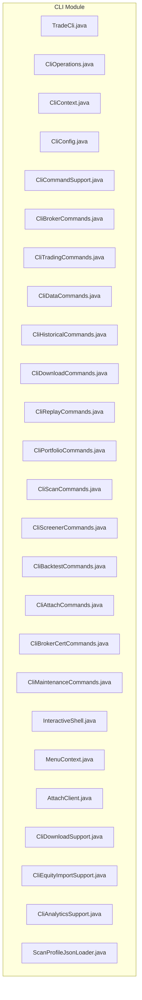
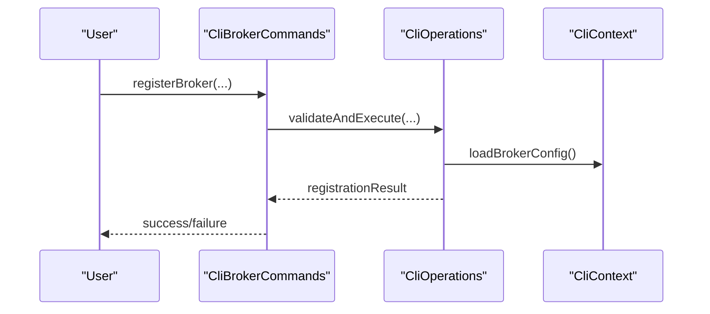
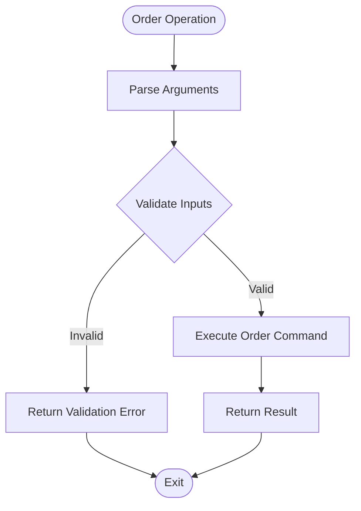
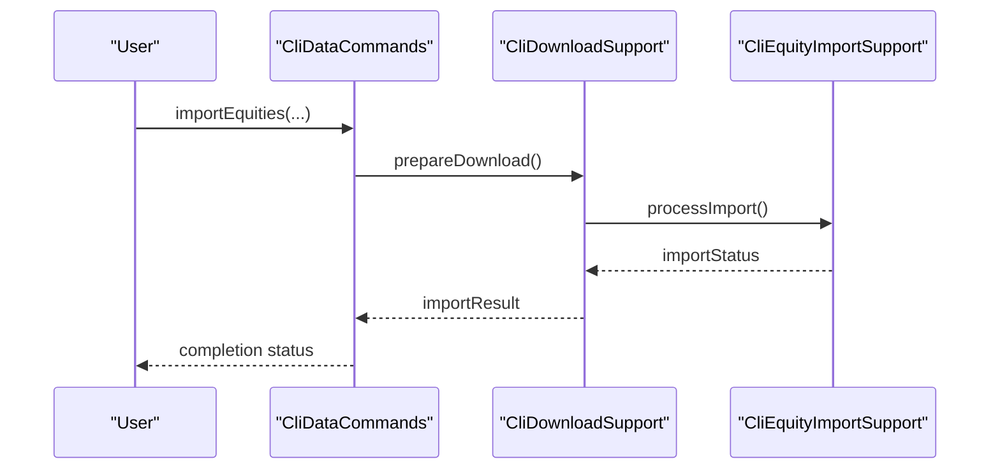
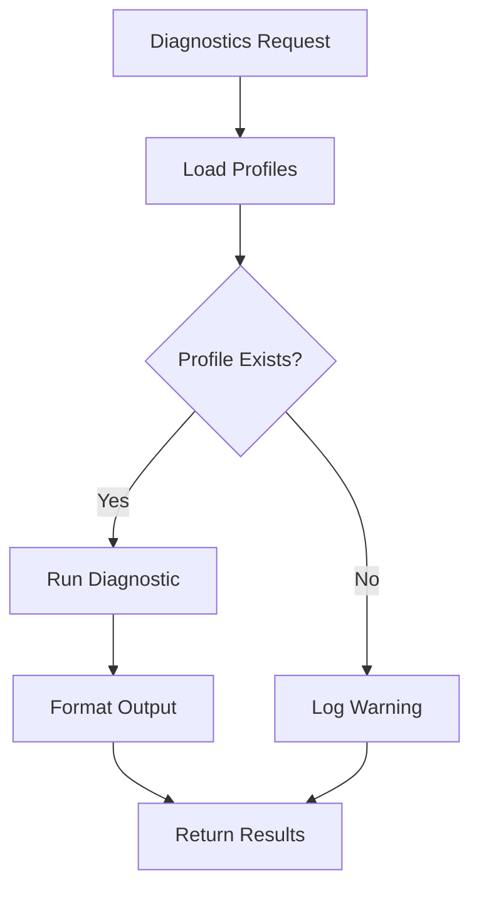
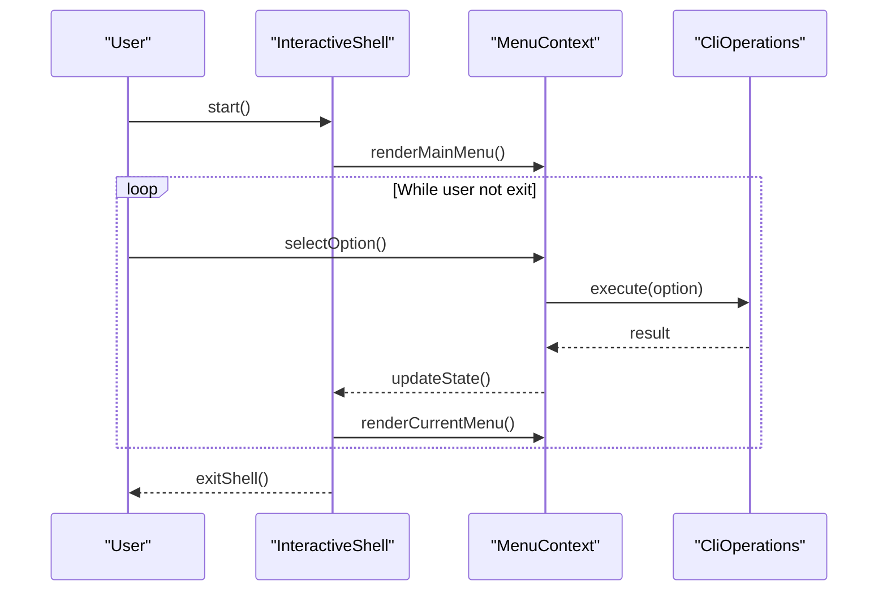
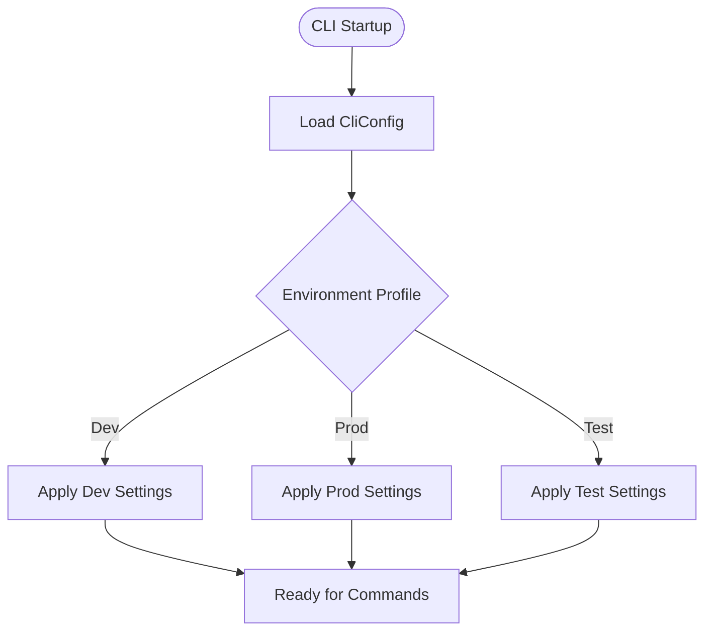
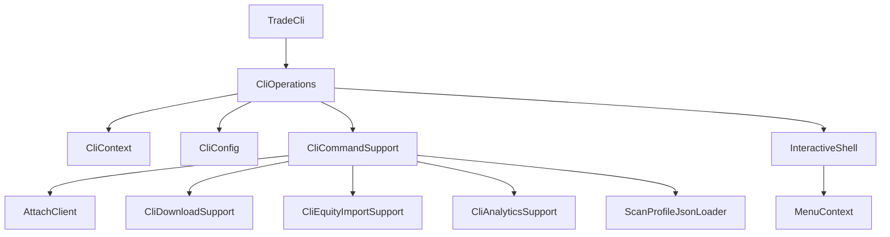

# Command Line Interface

<cite>
**Referenced Files in This Document**
- [TradeCli.java](file://cli/src/main/java/com/tradej/cli/TradeCli.java)
- [CliOperations.java](file://cli/src/main/java/com/tradej/cli/CliOperations.java)
- [CliContext.java](file://cli/src/main/java/com/tradej/cli/CliContext.java)
- [CliConfig.java](file://cli/src/main/java/com/tradej/cli/config/CliConfig.java)
- [CliCommandSupport.java](file://cli/src/main/java/com/tradej/cli/command/CliCommandSupport.java)
- [CliBrokerCommands.java](file://cli/src/main/java/com/tradej/cli/command/CliBrokerCommands.java)
- [CliTradingCommands.java](file://cli/src/main/java/com/tradej/cli/command/CliTradingCommands.java)
- [CliDataCommands.java](file://cli/src/main/java/com/tradej/cli/command/CliDataCommands.java)
- [CliHistoricalCommands.java](file://cli/src/main/java/com/tradej/cli/command/CliHistoricalCommands.java)
- [CliDownloadCommands.java](file://cli/src/main/java/com/tradej/cli/command/CliDownloadCommands.java)
- [CliReplayCommands.java](file://cli/src/main/java/com/tradej/cli/command/CliReplayCommands.java)
- [CliPortfolioCommands.java](file://cli/src/main/java/com/tradej/cli/command/CliPortfolioCommands.java)
- [CliScanCommands.java](file://cli/src/main/java/com/tradej/cli/command/CliScanCommands.java)
- [CliScreenerCommands.java](file://cli/src/main/java/com/tradej/cli/command/CliScreenerCommands.java)
- [CliBacktestCommands.java](file://cli/src/main/java/com/tradej/cli/command/CliBacktestCommands.java)
- [CliAttachCommands.java](file://cli/src/main/java/com/tradej/cli/command/CliAttachCommands.java)
- [CliBrokerCertCommands.java](file://cli/src/main/java/com/tradej/cli/command/CliBrokerCertCommands.java)
- [CliMaintenanceCommands.java](file://cli/src/main/java/com/tradej/cli/command/CliMaintenanceCommands.java)
- [InteractiveShell.java](file://cli/src/main/java/com/tradej/cli/interactive/InteractiveShell.java)
- [MenuContext.java](file://cli/src/main/java/com/tradej/cli/interactive/MenuContext.java)
- [AttachClient.java](file://cli/src/main/java/com/tradej/cli/attach/AttachClient.java)
- [CliDownloadSupport.java](file://cli/src/main/java/com/tradej/cli/download/CliDownloadSupport.java)
- [CliEquityImportSupport.java](file://cli/src/main/java/com/tradej/cli/download/CliEquityImportSupport.java)
- [CliAnalyticsSupport.java](file://cli/src/main/java/com/tradej/cli/analytics/CliAnalyticsSupport.java)
- [ScanProfileJsonLoader.java](file://cli/src/main/java/com/tradej/cli/scan/ScanProfileJsonLoader.java)
- [CLI.md](file://CLI.md)
- [CONFIG.md](file://CONFIG.md)
- [build.gradle](file://cli/build.gradle)
</cite>

## Table of Contents
1. [Introduction](#introduction)
2. [Project Structure](#project-structure)
3. [Core Components](#core-components)
4. [Architecture Overview](#architecture-overview)
5. [Detailed Component Analysis](#detailed-component-analysis)
6. [Dependency Analysis](#dependency-analysis)
7. [Performance Considerations](#performance-considerations)
8. [Troubleshooting Guide](#troubleshooting-guide)
9. [Conclusion](#conclusion)
10. [Appendices](#appendices)

## Introduction
This document describes the command-line interface (CLI) system built with the Picocli framework. It explains the CLI architecture, command pattern implementation, configuration management, and operational commands for broker management, order operations, data management, and system diagnostics. It also covers interactive shell functionality, output formatting options, and scripting capabilities, with practical examples and troubleshooting procedures.

## Project Structure
The CLI module organizes functionality into cohesive packages:
- Root CLI entry point and orchestration
- Command groups for operational domains
- Configuration and context management
- Interactive shell and attach utilities
- Download and analytics helpers
- Standalone broker session factories

**Diagram sources**
- [TradeCli.java](file://cli/src/main/java/com/tradej/cli/TradeCli.java)
- [CliOperations.java](file://cli/src/main/java/com/tradej/cli/CliOperations.java)
- [CliContext.java](file://cli/src/main/java/com/tradej/cli/CliContext.java)
- [CliConfig.java](file://cli/src/main/java/com/tradej/cli/config/CliConfig.java)
- [CliCommandSupport.java](file://cli/src/main/java/com/tradej/cli/command/CliCommandSupport.java)
- [CliBrokerCommands.java](file://cli/src/main/java/com/tradej/cli/command/CliBrokerCommands.java)
- [CliTradingCommands.java](file://cli/src/main/java/com/tradej/cli/command/CliTradingCommands.java)
- [CliDataCommands.java](file://cli/src/main/java/com/tradej/cli/command/CliDataCommands.java)
- [CliHistoricalCommands.java](file://cli/src/main/java/com/tradej/cli/command/CliHistoricalCommands.java)
- [CliDownloadCommands.java](file://cli/src/main/java/com/tradej/cli/command/CliDownloadCommands.java)
- [CliReplayCommands.java](file://cli/src/main/java/com/tradej/cli/command/CliReplayCommands.java)
- [CliPortfolioCommands.java](file://cli/src/main/java/com/tradej/cli/command/CliPortfolioCommands.java)
- [CliScanCommands.java](file://cli/src/main/java/com/tradej/cli/command/CliScanCommands.java)
- [CliScreenerCommands.java](file://cli/src/main/java/com/tradej/cli/command/CliScreenerCommands.java)
- [CliBacktestCommands.java](file://cli/src/main/java/com/tradej/cli/command/CliBacktestCommands.java)
- [CliAttachCommands.java](file://cli/src/main/java/com/tradej/cli/command/CliAttachCommands.java)
- [CliBrokerCertCommands.java](file://cli/src/main/java/com/tradej/cli/command/CliBrokerCertCommands.java)
- [CliMaintenanceCommands.java](file://cli/src/main/java/com/tradej/cli/command/CliMaintenanceCommands.java)
- [InteractiveShell.java](file://cli/src/main/java/com/tradej/cli/interactive/InteractiveShell.java)
- [MenuContext.java](file://cli/src/main/java/com/tradej/cli/interactive/MenuContext.java)
- [AttachClient.java](file://cli/src/main/java/com/tradej/cli/attach/AttachClient.java)
- [CliDownloadSupport.java](file://cli/src/main/java/com/tradej/cli/download/CliDownloadSupport.java)
- [CliEquityImportSupport.java](file://cli/src/main/java/com/tradej/cli/download/CliEquityImportSupport.java)
- [CliAnalyticsSupport.java](file://cli/src/main/java/com/tradej/cli/analytics/CliAnalyticsSupport.java)
- [ScanProfileJsonLoader.java](file://cli/src/main/java/com/tradej/cli/scan/ScanProfileJsonLoader.java)

**Section sources**
- [CLI.md](file://CLI.md)
- [CONFIG.md](file://CONFIG.md)

## Core Components
- TradeCli: Entry point that delegates to Picocli-generated command classes and orchestrates operations.
- CliOperations: Centralized operation coordinator that executes command logic and integrates with runtime services.
- CliContext: Provides shared state and runtime context for CLI operations.
- CliConfig: Manages CLI configuration and environment-specific settings.

Key responsibilities:
- Parse command-line arguments using Picocli annotations
- Route commands to appropriate handlers
- Manage configuration and runtime context
- Coordinate with broker sessions and data services

**Section sources**
- [TradeCli.java:1-200](file://cli/src/main/java/com/tradej/cli/TradeCli.java#L1-L200)
- [CliOperations.java:1-200](file://cli/src/main/java/com/tradej/cli/CliOperations.java#L1-L200)
- [CliContext.java:1-150](file://cli/src/main/java/com/tradej/cli/CliContext.java#L1-L150)
- [CliConfig.java:1-120](file://cli/src/main/java/com/tradej/cli/config/CliConfig.java#L1-L120)

## Architecture Overview
The CLI follows a modular command pattern with a central entry point and domain-specific command groups. Commands are structured as subcommands under a root command, enabling hierarchical navigation and discoverability.

```mermaid
graph TB
Root["TradeCli (Root)"]
Ops["CliOperations"]
Ctx["CliContext"]
Cfg["CliConfig"]
subgraph "Command Groups"
Broker["CliBrokerCommands"]
Trading["CliTradingCommands"]
Data["CliDataCommands"]
Historical["CliHistoricalCommands"]
Download["CliDownloadCommands"]
Replay["CliReplayCommands"]
Portfolio["CliPortfolioCommands"]
Scan["CliScanCommands"]
Screener["CliScreenerCommands"]
Backtest["CliBacktestCommands"]
Attach["CliAttachCommands"]
Cert["CliBrokerCertCommands"]
Maintenance["CliMaintenanceCommands"]
end
subgraph "Utilities"
Shell["InteractiveShell"]
Menu["MenuContext"]
AttachClient["AttachClient"]
DL["CliDownloadSupport"]
EI["CliEquityImportSupport"]
Analytics["CliAnalyticsSupport"]
ScanLoader["ScanProfileJsonLoader"]
end
Root --> Broker
Root --> Trading
Root --> Data
Root --> Historical
Root --> Download
Root --> Replay
Root --> Portfolio
Root --> Scan
Root --> Screener
Root --> Backtest
Root --> Attach
Root --> Cert
Root --> Maintenance
Broker --> Ops
Trading --> Ops
Data --> Ops
Historical --> Ops
Download --> Ops
Replay --> Ops
Portfolio --> Ops
Scan --> Ops
Screener --> Ops
Backtest --> Ops
Attach --> Ops
Cert --> Ops
Maintenance --> Ops
Ops --> Ctx
Ops --> Cfg
Shell --> Menu
Attach --> AttachClient
Download --> DL
Download --> EI
Scan --> ScanLoader
Analytics --> Ops
```

**Diagram sources**
- [TradeCli.java:1-200](file://cli/src/main/java/com/tradej/cli/TradeCli.java#L1-L200)
- [CliOperations.java:1-200](file://cli/src/main/java/com/tradej/cli/CliOperations.java#L1-L200)
- [CliContext.java:1-150](file://cli/src/main/java/com/tradej/cli/CliContext.java#L1-L150)
- [CliConfig.java:1-120](file://cli/src/main/java/com/tradej/cli/config/CliConfig.java#L1-L120)
- [CliBrokerCommands.java](file://cli/src/main/java/com/tradej/cli/command/CliBrokerCommands.java)
- [CliTradingCommands.java](file://cli/src/main/java/com/tradej/cli/command/CliTradingCommands.java)
- [CliDataCommands.java](file://cli/src/main/java/com/tradej/cli/command/CliDataCommands.java)
- [CliHistoricalCommands.java](file://cli/src/main/java/com/tradej/cli/command/CliHistoricalCommands.java)
- [CliDownloadCommands.java](file://cli/src/main/java/com/tradej/cli/command/CliDownloadCommands.java)
- [CliReplayCommands.java](file://cli/src/main/java/com/tradej/cli/command/CliReplayCommands.java)
- [CliPortfolioCommands.java](file://cli/src/main/java/com/tradej/cli/command/CliPortfolioCommands.java)
- [CliScanCommands.java](file://cli/src/main/java/com/tradej/cli/command/CliScanCommands.java)
- [CliScreenerCommands.java](file://cli/src/main/java/com/tradej/cli/command/CliScreenerCommands.java)
- [CliBacktestCommands.java](file://cli/src/main/java/com/tradej/cli/command/CliBacktestCommands.java)
- [CliAttachCommands.java](file://cli/src/main/java/com/tradej/cli/command/CliAttachCommands.java)
- [CliBrokerCertCommands.java](file://cli/src/main/java/com/tradej/cli/command/CliBrokerCertCommands.java)
- [CliMaintenanceCommands.java](file://cli/src/main/java/com/tradej/cli/command/CliMaintenanceCommands.java)
- [InteractiveShell.java](file://cli/src/main/java/com/tradej/cli/interactive/InteractiveShell.java)
- [MenuContext.java](file://cli/src/main/java/com/tradej/cli/interactive/MenuContext.java)
- [AttachClient.java](file://cli/src/main/java/com/tradej/cli/attach/AttachClient.java)
- [CliDownloadSupport.java](file://cli/src/main/java/com/tradej/cli/download/CliDownloadSupport.java)
- [CliEquityImportSupport.java](file://cli/src/main/java/com/tradej/cli/download/CliEquityImportSupport.java)
- [CliAnalyticsSupport.java](file://cli/src/main/java/com/tradej/cli/analytics/CliAnalyticsSupport.java)
- [ScanProfileJsonLoader.java](file://cli/src/main/java/com/tradej/cli/scan/ScanProfileJsonLoader.java)

## Detailed Component Analysis

### Command Pattern Implementation
Commands are organized into domain-specific groups, each implementing a set of related operations. The command support base class provides shared utilities for argument parsing, validation, and output formatting.

```mermaid
classDiagram
class CliCommandSupport {
+validateArgs()
+formatOutput()
+loadConfig()
}
class CliBrokerCommands {
+registerBroker()
+listBrokers()
+removeBroker()
}
class CliTradingCommands {
+placeOrder()
+modifyOrder()
+cancelOrder()
+queryOrder()
}
class CliDataCommands {
+listSymbols()
+describeSymbol()
+searchSymbols()
}
class CliHistoricalCommands {
+downloadBars()
+listStoredBars()
}
class CliDownloadCommands {
+importEquities()
+syncInstruments()
}
class CliReplayCommands {
+startReplay()
+pauseReplay()
+stopReplay()
}
class CliPortfolioCommands {
+viewPositions()
+viewHoldings()
+riskMetrics()
}
class CliScanCommands {
+runScan()
+listProfiles()
}
class CliScreenerCommands {
+screenInstruments()
+exportResults()
}
class CliBacktestCommands {
+runBacktest()
+analyzeResults()
}
class CliAttachCommands {
+attachTerminal()
+detachTerminal()
}
class CliBrokerCertCommands {
+issueCertificate()
+revokeCertificate()
}
class CliMaintenanceCommands {
+clearCache()
+repairDatabase()
}
CliCommandSupport <|-- CliBrokerCommands
CliCommandSupport <|-- CliTradingCommands
CliCommandSupport <|-- CliDataCommands
CliCommandSupport <|-- CliHistoricalCommands
CliCommandSupport <|-- CliDownloadCommands
CliCommandSupport <|-- CliReplayCommands
CliCommandSupport <|-- CliPortfolioCommands
CliCommandSupport <|-- CliScanCommands
CliCommandSupport <|-- CliScreenerCommands
CliCommandSupport <|-- CliBacktestCommands
CliCommandSupport <|-- CliAttachCommands
CliCommandSupport <|-- CliBrokerCertCommands
CliCommandSupport <|-- CliMaintenanceCommands
```

**Diagram sources**
- [CliCommandSupport.java](file://cli/src/main/java/com/tradej/cli/command/CliCommandSupport.java)
- [CliBrokerCommands.java](file://cli/src/main/java/com/tradej/cli/command/CliBrokerCommands.java)
- [CliTradingCommands.java](file://cli/src/main/java/com/tradej/cli/command/CliTradingCommands.java)
- [CliDataCommands.java](file://cli/src/main/java/com/tradej/cli/command/CliDataCommands.java)
- [CliHistoricalCommands.java](file://cli/src/main/java/com/tradej/cli/command/CliHistoricalCommands.java)
- [CliDownloadCommands.java](file://cli/src/main/java/com/tradej/cli/command/CliDownloadCommands.java)
- [CliReplayCommands.java](file://cli/src/main/java/com/tradej/cli/command/CliReplayCommands.java)
- [CliPortfolioCommands.java](file://cli/src/main/java/com/tradej/cli/command/CliPortfolioCommands.java)
- [CliScanCommands.java](file://cli/src/main/java/com/tradej/cli/command/CliScanCommands.java)
- [CliScreenerCommands.java](file://cli/src/main/java/com/tradej/cli/command/CliScreenerCommands.java)
- [CliBacktestCommands.java](file://cli/src/main/java/com/tradej/cli/command/CliBacktestCommands.java)
- [CliAttachCommands.java](file://cli/src/main/java/com/tradej/cli/command/CliAttachCommands.java)
- [CliBrokerCertCommands.java](file://cli/src/main/java/com/tradej/cli/command/CliBrokerCertCommands.java)
- [CliMaintenanceCommands.java](file://cli/src/main/java/com/tradej/cli/command/CliMaintenanceCommands.java)

**Section sources**
- [CliCommandSupport.java](file://cli/src/main/java/com/tradej/cli/command/CliCommandSupport.java)
- [CliBrokerCommands.java](file://cli/src/main/java/com/tradej/cli/command/CliBrokerCommands.java)
- [CliTradingCommands.java](file://cli/src/main/java/com/tradej/cli/command/CliTradingCommands.java)
- [CliDataCommands.java](file://cli/src/main/java/com/tradej/cli/command/CliDataCommands.java)
- [CliHistoricalCommands.java](file://cli/src/main/java/com/tradej/cli/command/CliHistoricalCommands.java)
- [CliDownloadCommands.java](file://cli/src/main/java/com/tradej/cli/command/CliDownloadCommands.java)
- [CliReplayCommands.java](file://cli/src/main/java/com/tradej/cli/command/CliReplayCommands.java)
- [CliPortfolioCommands.java](file://cli/src/main/java/com/tradej/cli/command/CliPortfolioCommands.java)
- [CliScanCommands.java](file://cli/src/main/java/com/tradej/cli/command/CliScanCommands.java)
- [CliScreenerCommands.java](file://cli/src/main/java/com/tradej/cli/command/CliScreenerCommands.java)
- [CliBacktestCommands.java](file://cli/src/main/java/com/tradej/cli/command/CliBacktestCommands.java)
- [CliAttachCommands.java](file://cli/src/main/java/com/tradej/cli/command/CliAttachCommands.java)
- [CliBrokerCertCommands.java](file://cli/src/main/java/com/tradej/cli/command/CliBrokerCertCommands.java)
- [CliMaintenanceCommands.java](file://cli/src/main/java/com/tradej/cli/command/CliMaintenanceCommands.java)

### Operational Commands

#### Broker Management
- Register and manage broker connections
- List and remove brokers
- Issue and revoke certificates

**Diagram sources**
- [CliBrokerCommands.java](file://cli/src/main/java/com/tradej/cli/command/CliBrokerCommands.java)
- [CliOperations.java](file://cli/src/main/java/com/tradej/cli/CliOperations.java)
- [CliContext.java](file://cli/src/main/java/com/tradej/cli/CliContext.java)

**Section sources**
- [CliBrokerCommands.java](file://cli/src/main/java/com/tradej/cli/command/CliBrokerCommands.java)
- [CliBrokerCertCommands.java](file://cli/src/main/java/com/tradej/cli/command/CliBrokerCertCommands.java)

#### Order Operations
- Place, modify, cancel, and query orders
- Support for various order types and validations

**Diagram sources**
- [CliTradingCommands.java](file://cli/src/main/java/com/tradej/cli/command/CliTradingCommands.java)
- [CliOperations.java](file://cli/src/main/java/com/tradej/cli/CliOperations.java)

**Section sources**
- [CliTradingCommands.java](file://cli/src/main/java/com/tradej/cli/command/CliTradingCommands.java)

#### Data Management
- List and describe instruments
- Search symbols and export results
- Import equities and sync instruments

**Diagram sources**
- [CliDataCommands.java](file://cli/src/main/java/com/tradej/cli/command/CliDataCommands.java)
- [CliDownloadCommands.java](file://cli/src/main/java/com/tradej/cli/command/CliDownloadCommands.java)
- [CliDownloadSupport.java](file://cli/src/main/java/com/tradej/cli/download/CliDownloadSupport.java)
- [CliEquityImportSupport.java](file://cli/src/main/java/com/tradej/cli/download/CliEquityImportSupport.java)

**Section sources**
- [CliDataCommands.java](file://cli/src/main/java/com/tradej/cli/command/CliDataCommands.java)
- [CliDownloadCommands.java](file://cli/src/main/java/com/tradej/cli/command/CliDownloadCommands.java)
- [CliDownloadSupport.java](file://cli/src/main/java/com/tradej/cli/download/CliDownloadSupport.java)
- [CliEquityImportSupport.java](file://cli/src/main/java/com/tradej/cli/download/CliEquityImportSupport.java)

#### System Diagnostics
- Replay controls and historical data operations
- Portfolio views and risk metrics
- Scan and screener utilities

**Diagram sources**
- [CliReplayCommands.java](file://cli/src/main/java/com/tradej/cli/command/CliReplayCommands.java)
- [CliPortfolioCommands.java](file://cli/src/main/java/com/tradej/cli/command/CliPortfolioCommands.java)
- [CliScanCommands.java](file://cli/src/main/java/com/tradej/cli/command/CliScanCommands.java)
- [CliScreenerCommands.java](file://cli/src/main/java/com/tradej/cli/command/CliScreenerCommands.java)
- [ScanProfileJsonLoader.java](file://cli/src/main/java/com/tradej/cli/scan/ScanProfileJsonLoader.java)

**Section sources**
- [CliReplayCommands.java](file://cli/src/main/java/com/tradej/cli/command/CliReplayCommands.java)
- [CliPortfolioCommands.java](file://cli/src/main/java/com/tradej/cli/command/CliPortfolioCommands.java)
- [CliScanCommands.java](file://cli/src/main/java/com/tradej/cli/command/CliScanCommands.java)
- [CliScreenerCommands.java](file://cli/src/main/java/com/tradej/cli/command/CliScreenerCommands.java)
- [ScanProfileJsonLoader.java](file://cli/src/main/java/com/tradej/cli/scan/ScanProfileJsonLoader.java)

### Interactive Shell Functionality
The interactive shell provides a menu-driven interface for common operations, allowing users to navigate menus, select options, and execute commands without typing long command lines.

**Diagram sources**
- [InteractiveShell.java](file://cli/src/main/java/com/tradej/cli/interactive/InteractiveShell.java)
- [MenuContext.java](file://cli/src/main/java/com/tradej/cli/interactive/MenuContext.java)
- [CliOperations.java](file://cli/src/main/java/com/tradej/cli/CliOperations.java)

**Section sources**
- [InteractiveShell.java](file://cli/src/main/java/com/tradej/cli/interactive/InteractiveShell.java)
- [MenuContext.java](file://cli/src/main/java/com/tradej/cli/interactive/MenuContext.java)

### Configuration Management
CLI configuration is centralized and environment-aware, supporting different profiles and runtime modes. Configuration loading ensures that commands operate with the correct settings.

**Diagram sources**
- [CliConfig.java](file://cli/src/main/java/com/tradej/cli/config/CliConfig.java)
- [CliContext.java](file://cli/src/main/java/com/tradej/cli/CliContext.java)

**Section sources**
- [CliConfig.java](file://cli/src/main/java/com/tradej/cli/config/CliConfig.java)
- [CliContext.java](file://cli/src/main/java/com/tradej/cli/CliContext.java)

### Output Formatting Options
Commands support multiple output formats and verbosity levels. Shared formatting utilities ensure consistent presentation across all command groups.

- JSON output for machine-readable results
- Tabular output for human-readable summaries
- Verbose mode for detailed logging
- Quiet mode for minimal output

**Section sources**
- [CliCommandSupport.java](file://cli/src/main/java/com/tradej/cli/command/CliCommandSupport.java)

### Scripting Capabilities
The CLI supports scripting through:
- Batch execution of commands
- Exit codes for automation
- Standard output capture for downstream processing
- Environment variable overrides for configuration

Practical examples:
- Automated broker registration script
- Daily portfolio report generation
- Historical data import automation

**Section sources**
- [TradeCli.java](file://cli/src/main/java/com/tradej/cli/TradeCli.java)
- [CliOperations.java](file://cli/src/main/java/com/tradej/cli/CliOperations.java)

## Dependency Analysis
The CLI module exhibits strong cohesion within functional groups and moderate coupling to shared utilities and context.

**Diagram sources**
- [TradeCli.java](file://cli/src/main/java/com/tradej/cli/TradeCli.java)
- [CliOperations.java](file://cli/src/main/java/com/tradej/cli/CliOperations.java)
- [CliContext.java](file://cli/src/main/java/com/tradej/cli/CliContext.java)
- [CliConfig.java](file://cli/src/main/java/com/tradej/cli/config/CliConfig.java)
- [CliCommandSupport.java](file://cli/src/main/java/com/tradej/cli/command/CliCommandSupport.java)
- [AttachClient.java](file://cli/src/main/java/com/tradej/cli/attach/AttachClient.java)
- [CliDownloadSupport.java](file://cli/src/main/java/com/tradej/cli/download/CliDownloadSupport.java)
- [CliEquityImportSupport.java](file://cli/src/main/java/com/tradej/cli/download/CliEquityImportSupport.java)
- [CliAnalyticsSupport.java](file://cli/src/main/java/com/tradej/cli/analytics/CliAnalyticsSupport.java)
- [ScanProfileJsonLoader.java](file://cli/src/main/java/com/tradej/cli/scan/ScanProfileJsonLoader.java)
- [InteractiveShell.java](file://cli/src/main/java/com/tradej/cli/interactive/InteractiveShell.java)
- [MenuContext.java](file://cli/src/main/java/com/tradej/cli/interactive/MenuContext.java)

**Section sources**
- [build.gradle](file://cli/build.gradle)

## Performance Considerations
- Minimize repeated configuration loads by caching in CliContext
- Use streaming output for large datasets
- Implement pagination for list operations
- Leverage asynchronous execution for long-running tasks
- Optimize download operations with progress reporting

## Troubleshooting Guide
Common issues and resolutions:
- Authentication failures: Verify broker credentials and certificates
- Network connectivity: Check proxy settings and firewall rules
- Data import errors: Validate file formats and permissions
- Memory issues: Increase heap size and tune garbage collection
- Permission denied: Ensure proper file and directory permissions

Diagnostic steps:
1. Enable verbose logging
2. Validate configuration files
3. Test individual commands in isolation
4. Review recent log entries
5. Recreate sessions if stale

**Section sources**
- [CliOperations.java](file://cli/src/main/java/com/tradej/cli/CliOperations.java)
- [CliContext.java](file://cli/src/main/java/com/tradej/cli/CliContext.java)

## Conclusion
The CLI system provides a robust, extensible command-line interface leveraging the Picocli framework. Its modular design, centralized configuration, and comprehensive command coverage enable efficient operational workflows, interactive exploration, and reliable automation. The architecture supports future enhancements while maintaining backward compatibility and clear separation of concerns.

## Appendices

### Practical Examples

#### Broker Management
- Register a new broker connection
- List registered brokers
- Remove a broker by ID

#### Order Operations
- Place a market buy order
- Modify an existing order price
- Cancel a pending order
- Query order status by ID

#### Data Management
- Import equity instruments
- Sync instrument metadata
- Export symbol lists

#### System Diagnostics
- Start a replay session
- View portfolio positions
- Run a screening scan
- Generate backtest reports

### Configuration Reference
- Environment profiles: dev, test, prod
- Broker-specific settings
- Logging levels and formats
- Output preferences

**Section sources**
- [CLI.md](file://CLI.md)
- [CONFIG.md](file://CONFIG.md)