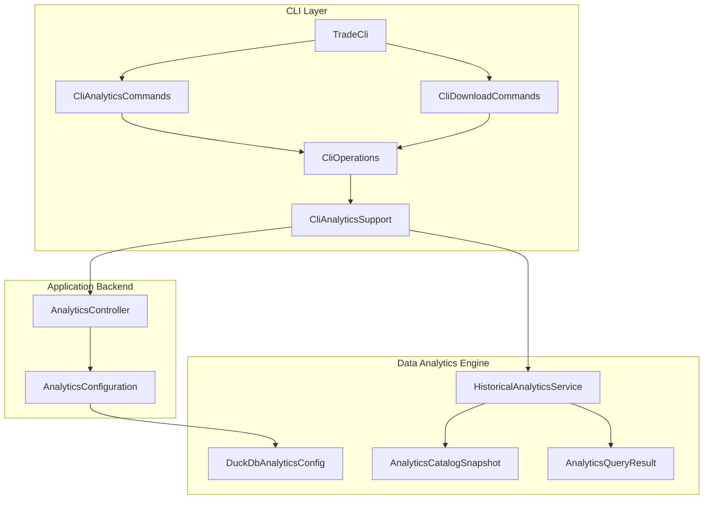
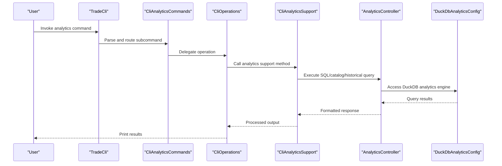
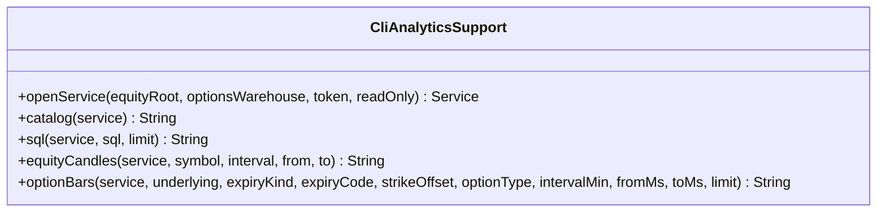
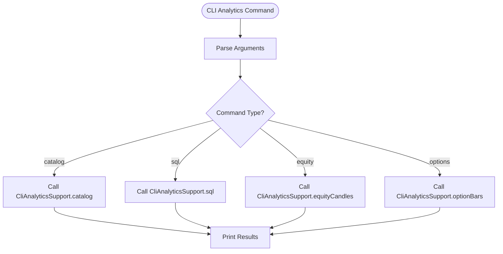
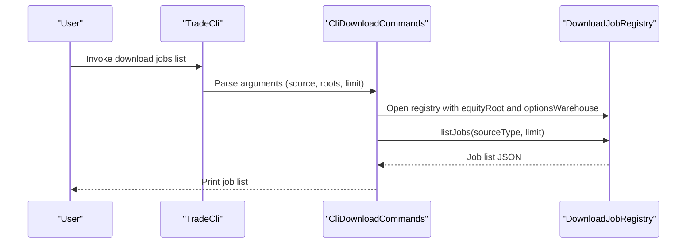
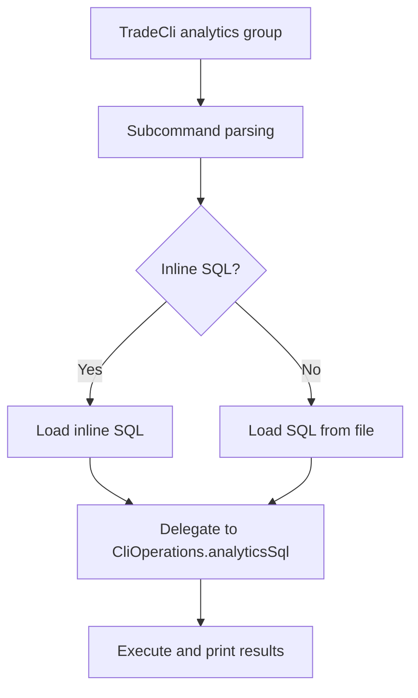
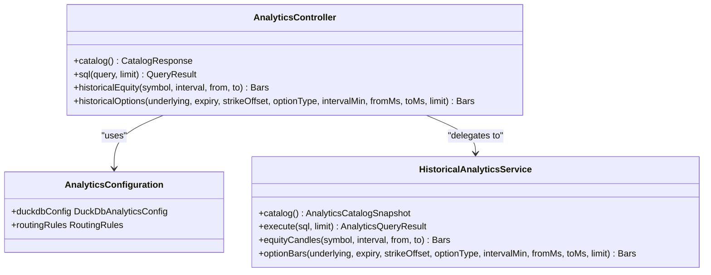
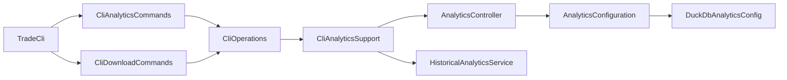

# Analytics Commands

<cite>
**Referenced Files in This Document**
- [CliAnalyticsSupport.java](file://cli/src/main/java/com/tradej/cli/analytics/CliAnalyticsSupport.java)
- [CliAnalyticsCommands.java](file://cli/src/main/java/com/tradej/cli/command/CliAnalyticsCommands.java)
- [CliDownloadCommands.java](file://cli/src/main/java/com/tradej/cli/command/CliDownloadCommands.java)
- [TradeCli.java](file://cli/src/main/java/com/tradej/cli/TradeCli.java)
- [CliOperations.java](file://cli/src/main/java/com/tradej/cli/CliOperations.java)
- [AnalyticsController.java](file://app/src/main/java/com/tradej/app/api/AnalyticsController.java)
- [AnalyticsConfiguration.java](file://app/src/main/java/com/tradej/app/config/AnalyticsConfiguration.java)
- [DuckDbAnalyticsConfig.java](file://data/analytics/src/main/java/com/tradej/analytics/config/DuckDbAnalyticsConfig.java)
- [HistoricalAnalyticsService.java](file://core/src/main/java/com/tradej/core/domain/port/HistoricalAnalyticsService.java)
- [AnalyticsCatalogSnapshot.java](file://core/src/main/java/com/tradej/core/domain/model/AnalyticsCatalogSnapshot.java)
- [AnalyticsQueryResult.java](file://core/src/main/java/com/tradej/core/domain/model/AnalyticsQueryResult.java)
- [CLI.md](file://CLI.md)
</cite>

## Table of Contents
1. [Introduction](#introduction)
2. [Project Structure](#project-structure)
3. [Core Components](#core-components)
4. [Architecture Overview](#architecture-overview)
5. [Detailed Component Analysis](#detailed-component-analysis)
6. [Dependency Analysis](#dependency-analysis)
7. [Performance Considerations](#performance-considerations)
8. [Troubleshooting Guide](#troubleshooting-guide)
9. [Conclusion](#conclusion)
10. [Appendices](#appendices)

## Introduction
This document explains the analytics commands available in the CLI, focusing on historical data retrieval, market data queries, analytical report generation, and bulk data export. It documents the CliAnalyticsSupport functionality for data processing and formatting, details download commands for exporting market data, historical candles, and analytical results, and provides examples of data querying, report generation, and bulk data export. It also outlines command parameters, filtering options, output formatting, guidelines for building custom analytics pipelines, automation strategies, and performance considerations for large-scale data queries.

## Project Structure
The analytics capabilities are primarily implemented in the CLI module with supporting components in the application backend and data analytics subsystems. The CLI exposes commands for:
- Catalog discovery and SQL-based analytics queries
- Historical equity and options bar retrieval
- Download job listing and export operations
- Standalone market data access

**Diagram sources**
- [TradeCli.java](file://cli/src/main/java/com/tradej/cli/TradeCli.java)
- [CliAnalyticsCommands.java](file://cli/src/main/java/com/tradej/cli/command/CliAnalyticsCommands.java)
- [CliDownloadCommands.java](file://cli/src/main/java/com/tradej/cli/command/CliDownloadCommands.java)
- [CliOperations.java](file://cli/src/main/java/com/tradej/cli/CliOperations.java)
- [CliAnalyticsSupport.java](file://cli/src/main/java/com/tradej/cli/analytics/CliAnalyticsSupport.java)
- [AnalyticsController.java](file://app/src/main/java/com/tradej/app/api/AnalyticsController.java)
- [AnalyticsConfiguration.java](file://app/src/main/java/com/tradej/app/config/AnalyticsConfiguration.java)
- [DuckDbAnalyticsConfig.java](file://data/analytics/src/main/java/com/tradej/analytics/config/DuckDbAnalyticsConfig.java)
- [HistoricalAnalyticsService.java](file://core/src/main/java/com/tradej/core/domain/port/HistoricalAnalyticsService.java)
- [AnalyticsCatalogSnapshot.java](file://core/src/main/java/com/tradej/core/domain/model/AnalyticsCatalogSnapshot.java)
- [AnalyticsQueryResult.java](file://core/src/main/java/com/tradej/core/domain/model/AnalyticsQueryResult.java)

**Section sources**
- [TradeCli.java](file://cli/src/main/java/com/tradej/cli/TradeCli.java)
- [CliAnalyticsCommands.java](file://cli/src/main/java/com/tradej/cli/command/CliAnalyticsCommands.java)
- [CliDownloadCommands.java](file://cli/src/main/java/com/tradej/cli/command/CliDownloadCommands.java)
- [CliOperations.java](file://cli/src/main/java/com/tradej/cli/CliOperations.java)
- [CliAnalyticsSupport.java](file://cli/src/main/java/com/tradej/cli/analytics/CliAnalyticsSupport.java)
- [AnalyticsController.java](file://app/src/main/java/com/tradej/app/api/AnalyticsController.java)
- [AnalyticsConfiguration.java](file://app/src/main/java/com/tradej/app/config/AnalyticsConfiguration.java)
- [DuckDbAnalyticsConfig.java](file://data/analytics/src/main/java/com/tradej/analytics/config/DuckDbAnalyticsConfig.java)
- [HistoricalAnalyticsService.java](file://core/src/main/java/com/tradej/core/domain/port/HistoricalAnalyticsService.java)
- [AnalyticsCatalogSnapshot.java](file://core/src/main/java/com/tradej/core/domain/model/AnalyticsCatalogSnapshot.java)
- [AnalyticsQueryResult.java](file://core/src/main/java/com/tradej/core/domain/model/AnalyticsQueryResult.java)

## Core Components
- CliAnalyticsSupport: Provides the core data processing and formatting utilities for analytics operations, including catalog discovery, SQL execution, and historical candle retrieval for equities and options.
- CliAnalyticsCommands: Defines CLI subcommands for analytics catalog, SQL queries, and historical data retrieval.
- CliDownloadCommands: Exposes commands for listing download jobs and exporting market data and analytical results.
- TradeCli: Root CLI entry that wires subcommands and parses arguments.
- AnalyticsController and AnalyticsConfiguration: Application-layer APIs and configuration for analytics services.
- DuckDbAnalyticsConfig: Data analytics engine configuration enabling DuckDB-backed analytics.
- HistoricalAnalyticsService: Core port for historical analytics operations.
- AnalyticsCatalogSnapshot and AnalyticsQueryResult: Domain models representing catalog snapshots and query results.

Key responsibilities:
- Catalog discovery and SQL-driven analytics via CliAnalyticsSupport
- Parameterized historical equity and options bar retrieval
- Bulk export and download job management
- Integration with backend analytics services and DuckDB engine

**Section sources**
- [CliAnalyticsSupport.java](file://cli/src/main/java/com/tradej/cli/analytics/CliAnalyticsSupport.java)
- [CliAnalyticsCommands.java](file://cli/src/main/java/com/tradej/cli/command/CliAnalyticsCommands.java)
- [CliDownloadCommands.java](file://cli/src/main/java/com/tradej/cli/command/CliDownloadCommands.java)
- [TradeCli.java](file://cli/src/main/java/com/tradej/cli/TradeCli.java)
- [AnalyticsController.java](file://app/src/main/java/com/tradej/app/api/AnalyticsController.java)
- [AnalyticsConfiguration.java](file://app/src/main/java/com/tradej/app/config/AnalyticsConfiguration.java)
- [DuckDbAnalyticsConfig.java](file://data/analytics/src/main/java/com/tradej/analytics/config/DuckDbAnalyticsConfig.java)
- [HistoricalAnalyticsService.java](file://core/src/main/java/com/tradej/core/domain/port/HistoricalAnalyticsService.java)
- [AnalyticsCatalogSnapshot.java](file://core/src/main/java/com/tradej/core/domain/model/AnalyticsCatalogSnapshot.java)
- [AnalyticsQueryResult.java](file://core/src/main/java/com/tradej/core/domain/model/AnalyticsQueryResult.java)

## Architecture Overview
The analytics workflow spans CLI parsing, command dispatch, analytics support utilities, and backend services. SQL queries and catalog operations are executed against DuckDB-backed analytics, while historical data retrieval leverages the historical analytics service port.

**Diagram sources**
- [TradeCli.java](file://cli/src/main/java/com/tradej/cli/TradeCli.java)
- [CliAnalyticsCommands.java](file://cli/src/main/java/com/tradej/cli/command/CliAnalyticsCommands.java)
- [CliOperations.java](file://cli/src/main/java/com/tradej/cli/CliOperations.java)
- [CliAnalyticsSupport.java](file://cli/src/main/java/com/tradej/cli/analytics/CliAnalyticsSupport.java)
- [AnalyticsController.java](file://app/src/main/java/com/tradej/app/api/AnalyticsController.java)
- [DuckDbAnalyticsConfig.java](file://data/analytics/src/main/java/com/tradej/analytics/config/DuckDbAnalyticsConfig.java)

## Detailed Component Analysis

### CliAnalyticsSupport
Responsibilities:
- Open analytics service connections with configurable roots
- Retrieve analytics catalog metadata
- Execute SQL queries with optional row limits
- Fetch historical equity candles with date range filters
- Retrieve options bars with underlying, expiry, strike offset, option type, and interval filters

Processing logic highlights:
- Service lifecycle management via try-with-resources
- SQL execution with configurable limits
- Parameterized historical queries for equities and options
- Output formatting for CLI consumption

**Diagram sources**
- [CliAnalyticsSupport.java](file://cli/src/main/java/com/tradej/cli/analytics/CliAnalyticsSupport.java)

**Section sources**
- [CliAnalyticsSupport.java](file://cli/src/main/java/com/tradej/cli/analytics/CliAnalyticsSupport.java)

### CliAnalyticsCommands
Responsibilities:
- Define subcommands for analytics catalog, SQL queries, and historical data retrieval
- Map CLI arguments to analytics support methods
- Provide user-friendly command names and help text

Key commands:
- analytics catalog: List available analytics catalogs
- analytics sql: Execute SQL against the analytics engine with optional limit
- analytics query equity: Retrieve historical equity candles with symbol, interval, and date range
- analytics query options: Retrieve historical options bars with underlying, expiry, strike offset, option type, interval, and timestamp range

**Diagram sources**
- [CliAnalyticsCommands.java](file://cli/src/main/java/com/tradej/cli/command/CliAnalyticsCommands.java)
- [CliAnalyticsSupport.java](file://cli/src/main/java/com/tradej/cli/analytics/CliAnalyticsSupport.java)

**Section sources**
- [CliAnalyticsCommands.java](file://cli/src/main/java/com/tradej/cli/command/CliAnalyticsCommands.java)

### CliDownloadCommands
Responsibilities:
- List download jobs from configured equity and options warehouses
- Export market data and analytical results to external systems
- Manage job registry and output formatting

Key operations:
- download jobs list: Enumerate recent download jobs filtered by source type and limit
- Integration with historical ingest job registry for bulk operations

**Diagram sources**
- [CliDownloadCommands.java](file://cli/src/main/java/com/tradej/cli/command/CliDownloadCommands.java)

**Section sources**
- [CliDownloadCommands.java](file://cli/src/main/java/com/tradej/cli/command/CliDownloadCommands.java)

### TradeCli Integration
Responsibilities:
- Define top-level analytics command groups and subcommands
- Parse inline SQL or load SQL from file
- Validate required parameters and route to appropriate operations

Key behaviors:
- Inline SQL vs file-based SQL loading
- Argument validation and error reporting
- Delegation to CliOperations for execution

**Diagram sources**
- [TradeCli.java](file://cli/src/main/java/com/tradej/cli/TradeCli.java)

**Section sources**
- [TradeCli.java](file://cli/src/main/java/com/tradej/cli/TradeCli.java)

### Backend Integration and Data Models
- AnalyticsController: Exposes endpoints for analytics operations integrated with the CLI commands.
- AnalyticsConfiguration: Configures analytics services and routing.
- DuckDbAnalyticsConfig: Enables DuckDB-backed analytics engine for SQL execution and catalog operations.
- HistoricalAnalyticsService: Port abstraction for historical data retrieval.
- AnalyticsCatalogSnapshot and AnalyticsQueryResult: Domain models for catalog metadata and query results.

**Diagram sources**
- [AnalyticsController.java](file://app/src/main/java/com/tradej/app/api/AnalyticsController.java)
- [AnalyticsConfiguration.java](file://app/src/main/java/com/tradej/app/config/AnalyticsConfiguration.java)
- [DuckDbAnalyticsConfig.java](file://data/analytics/src/main/java/com/tradej/analytics/config/DuckDbAnalyticsConfig.java)
- [HistoricalAnalyticsService.java](file://core/src/main/java/com/tradej/core/domain/port/HistoricalAnalyticsService.java)
- [AnalyticsCatalogSnapshot.java](file://core/src/main/java/com/tradej/core/domain/model/AnalyticsCatalogSnapshot.java)
- [AnalyticsQueryResult.java](file://core/src/main/java/com/tradej/core/domain/model/AnalyticsQueryResult.java)

**Section sources**
- [AnalyticsController.java](file://app/src/main/java/com/tradej/app/api/AnalyticsController.java)
- [AnalyticsConfiguration.java](file://app/src/main/java/com/tradej/app/config/AnalyticsConfiguration.java)
- [DuckDbAnalyticsConfig.java](file://data/analytics/src/main/java/com/tradej/analytics/config/DuckDbAnalyticsConfig.java)
- [HistoricalAnalyticsService.java](file://core/src/main/java/com/tradej/core/domain/port/HistoricalAnalyticsService.java)
- [AnalyticsCatalogSnapshot.java](file://core/src/main/java/com/tradej/core/domain/model/AnalyticsCatalogSnapshot.java)
- [AnalyticsQueryResult.java](file://core/src/main/java/com/tradej/core/domain/model/AnalyticsQueryResult.java)

## Dependency Analysis
The CLI analytics commands depend on:
- CliOperations for command orchestration
- CliAnalyticsSupport for data processing and formatting
- Backend AnalyticsController and configuration for SQL execution and catalog access
- DuckDB analytics engine for query processing
- HistoricalAnalyticsService port for historical data retrieval
- DownloadJobRegistry for bulk export operations

**Diagram sources**
- [TradeCli.java](file://cli/src/main/java/com/tradej/cli/TradeCli.java)
- [CliAnalyticsCommands.java](file://cli/src/main/java/com/tradej/cli/command/CliAnalyticsCommands.java)
- [CliDownloadCommands.java](file://cli/src/main/java/com/tradej/cli/command/CliDownloadCommands.java)
- [CliOperations.java](file://cli/src/main/java/com/tradej/cli/CliOperations.java)
- [CliAnalyticsSupport.java](file://cli/src/main/java/com/tradej/cli/analytics/CliAnalyticsSupport.java)
- [AnalyticsController.java](file://app/src/main/java/com/tradej/app/api/AnalyticsController.java)
- [AnalyticsConfiguration.java](file://app/src/main/java/com/tradej/app/config/AnalyticsConfiguration.java)
- [DuckDbAnalyticsConfig.java](file://data/analytics/src/main/java/com/tradej/analytics/config/DuckDbAnalyticsConfig.java)
- [HistoricalAnalyticsService.java](file://core/src/main/java/com/tradej/core/domain/port/HistoricalAnalyticsService.java)

**Section sources**
- [TradeCli.java](file://cli/src/main/java/com/tradej/cli/TradeCli.java)
- [CliAnalyticsCommands.java](file://cli/src/main/java/com/tradej/cli/command/CliAnalyticsCommands.java)
- [CliDownloadCommands.java](file://cli/src/main/java/com/tradej/cli/command/CliDownloadCommands.java)
- [CliOperations.java](file://cli/src/main/java/com/tradej/cli/CliOperations.java)
- [CliAnalyticsSupport.java](file://cli/src/main/java/com/tradej/cli/analytics/CliAnalyticsSupport.java)
- [AnalyticsController.java](file://app/src/main/java/com/tradej/app/api/AnalyticsController.java)
- [AnalyticsConfiguration.java](file://app/src/main/java/com/tradej/app/config/AnalyticsConfiguration.java)
- [DuckDbAnalyticsConfig.java](file://data/analytics/src/main/java/com/tradej/analytics/config/DuckDbAnalyticsConfig.java)
- [HistoricalAnalyticsService.java](file://core/src/main/java/com/tradej/core/domain/port/HistoricalAnalyticsService.java)

## Performance Considerations
- Limit SQL result sets: Use the limit parameter to constrain output size and reduce memory overhead.
- Filter early: Apply date ranges, intervals, and symbol filters to minimize dataset size before aggregation.
- Batch exports: Prefer download jobs for large-scale exports to avoid CLI timeouts and excessive memory usage.
- DuckDB optimization: Ensure indexes and partitioning are configured appropriately for frequent queries.
- Streaming output: For large datasets, consider piping CLI output to external processors to avoid buffering.
- Connection reuse: Reuse analytics service connections within a single CLI invocation to reduce overhead.

[No sources needed since this section provides general guidance]

## Troubleshooting Guide
Common issues and resolutions:
- Missing SQL input: Provide either inline SQL or a file path; otherwise, argument validation will fail.
- Empty or invalid catalog: Verify warehouse roots and token configuration; re-run catalog discovery after correcting paths.
- Large result sets: Reduce the limit or refine filters to improve responsiveness.
- Historical query errors: Confirm symbol formatting, interval validity, and date range ordering.
- Download job failures: Inspect job registry output and warehouse permissions; retry with corrected parameters.

**Section sources**
- [TradeCli.java](file://cli/src/main/java/com/tradej/cli/TradeCli.java)
- [CliAnalyticsSupport.java](file://cli/src/main/java/com/tradej/cli/analytics/CliAnalyticsSupport.java)
- [CliDownloadCommands.java](file://cli/src/main/java/com/tradej/cli/command/CliDownloadCommands.java)

## Conclusion
The CLI analytics suite provides robust capabilities for discovering catalogs, executing SQL queries, retrieving historical equity and options data, and exporting results via download jobs. By leveraging CliAnalyticsSupport and integrating with backend analytics services and DuckDB, users can build efficient analytics pipelines and automate data collection processes. Proper parameterization, filtering, and performance tuning enable scalable operations across large datasets.

[No sources needed since this section summarizes without analyzing specific files]

## Appendices

### Command Reference and Examples
- Catalog discovery
  - Purpose: List available analytics catalogs
  - Example: analytics catalog --equity-root <path> --options-warehouse <path>
- SQL queries
  - Purpose: Execute SQL against the analytics engine
  - Example: analytics sql --equity-root <path> --options-warehouse <path> --inline-sql "<SQL>" --limit 1000
- Historical equity candles
  - Purpose: Retrieve OHLCV bars for an equity symbol
  - Example: analytics query equity --equity-root <path> --options-warehouse <path> --symbol <symbol> --interval <interval> --from <YYYY-MM-DD> --to <YYYY-MM-DD>
- Historical options bars
  - Purpose: Retrieve bars for options contracts
  - Example: analytics query options --equity-root <path> --options-warehouse <path> --underlying <symbol> --expiry-kind <kind> --expiry-code <code> --strike-offset <offset> --option-type <type> --interval-min <minutes> --from-ms <epoch> --to-ms <epoch> --limit 1000
- Download jobs
  - Purpose: List recent download jobs
  - Example: download jobs list --source <SOURCE> --equity-root <path> --options-warehouse <path> --limit 100

Filtering and formatting:
- Filters: Date ranges, intervals, symbols, underlying, expiry, strike offsets, option types, and timestamps
- Output: JSON formatted results suitable for piping to external tools

Automation guidelines:
- Build custom pipelines by chaining CLI commands with shell scripting
- Use download jobs for scheduled bulk exports
- Store SQL queries in files and reference via --file for reproducibility

**Section sources**
- [CliAnalyticsCommands.java](file://cli/src/main/java/com/tradej/cli/command/CliAnalyticsCommands.java)
- [CliDownloadCommands.java](file://cli/src/main/java/com/tradej/cli/command/CliDownloadCommands.java)
- [TradeCli.java](file://cli/src/main/java/com/tradej/cli/TradeCli.java)
- [CLI.md](file://CLI.md)