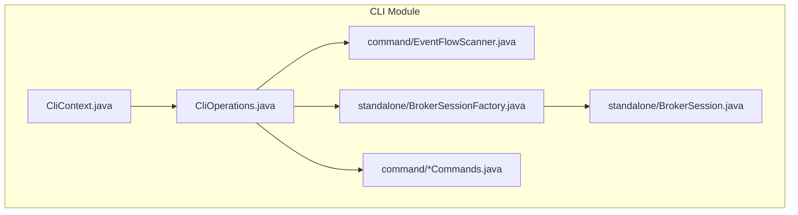
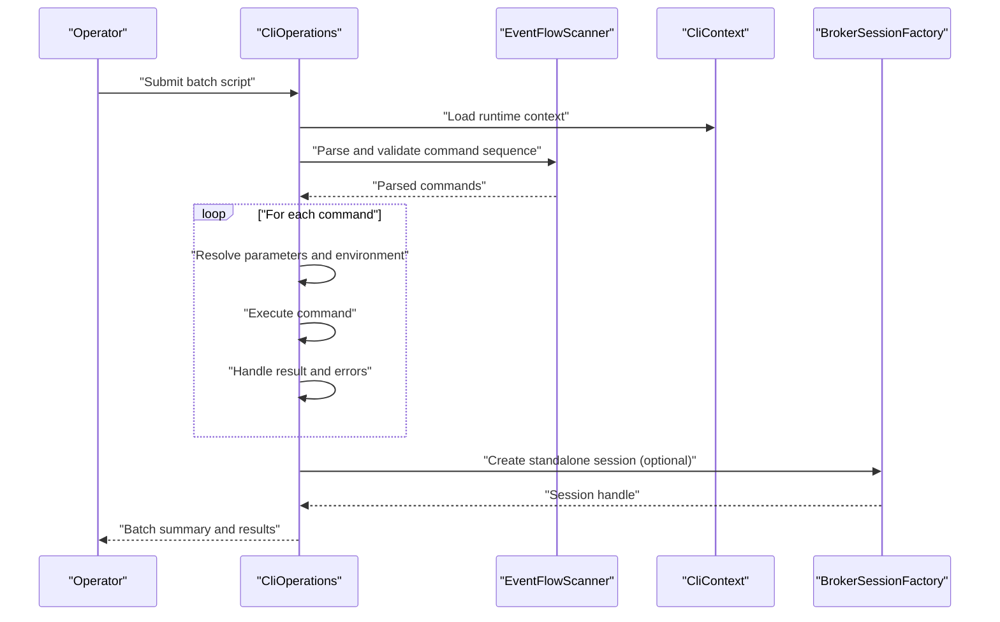
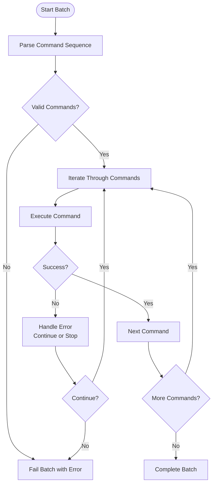
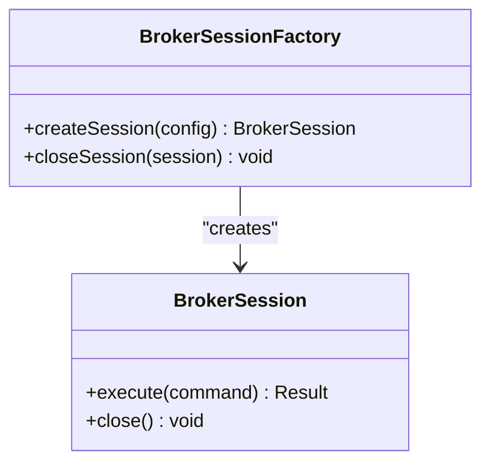
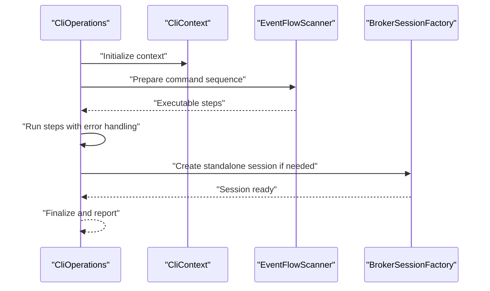
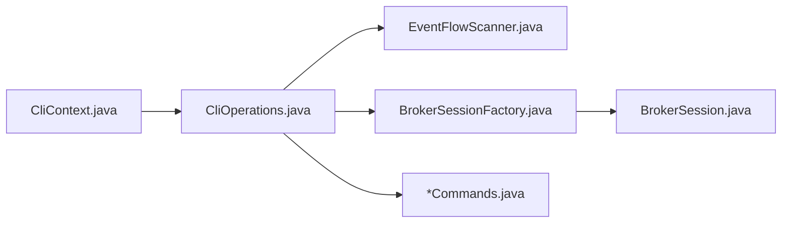

# Batch Processing

<cite>
**Referenced Files in This Document**
- [EventFlowScanner.java](file://cli/src/main/java/com/tradej/cli/command/EventFlowScanner.java)
- [BrokerSessionFactory.java](file://cli/src/main/java/com/tradej/cli/standalone/BrokerSessionFactory.java)
- [BrokerSession.java](file://cli/src/main/java/com/tradej/cli/standalone/BrokerSession.java)
- [CliOperations.java](file://cli/src/main/java/com/tradej/cli/CliOperations.java)
- [CliContext.java](file://cli/src/main/java/com/tradej/cli/CliContext.java)
- [CliCommandsCommand.java](file://cli/src/main/java/com/tradej/cli/command/CliCommandsCommand.java)
- [CliBrokerCommands.java](file://cli/src/main/java/com/tradej/cli/command/CliBrokerCommands.java)
- [CliPortfolioCommands.java](file://cli/src/main/java/com/tradej/cli/command/CliPortfolioCommands.java)
- [CliMarketCommands.java](file://cli/src/main/java/com/tradej/cli/command/CliMarketCommands.java)
- [CliHistoricalCommands.java](file://cli/src/main/java/com/tradej/cli/command/CliHistoricalCommands.java)
- [CliDownloadCommands.java](file://cli/src/main/java/com/tradej/cli/command/CliDownloadCommands.java)
- [CliScanCommands.java](file://cli/src/main/java/com/tradej/cli/command/CliScanCommands.java)
- [CliReplayCommands.java](file://cli/src/main/java/com/tradej/cli/command/CliReplayCommands.java)
- [CliBacktestCommands.java](file://cli/src/main/java/com/tradej/cli/command/CliBacktestCommands.java)
- [CliTradingCommands.java](file://cli/src/main/java/com/tradej/cli/command/CliTradingCommands.java)
- [CliDataCommands.java](file://cli/src/main/java/com/tradej/cli/command/CliDataCommands.java)
- [CliAnalyticsCommands.java](file://cli/src/main/java/com/tradej/cli/command/CliAnalyticsCommands.java)
- [CliGatewayCommands.java](file://cli/src/main/java/com/tradej/cli/command/CliGatewayCommands.java)
- [CliBrokerGatewayCommands.java](file://cli/src/main/java/com/tradej/cli/command/CliBrokerGatewayCommands.java)
- [CliAttachCommands.java](file://cli/src/main/java/com/tradej/cli/command/CliAttachCommands.java)
- [CliApiCommand.java](file://cli/src/main/java/com/tradej/cli/command/CliApiCommand.java)
- [CliHelpCommand.java](file://cli/src/main/java/com/tradej/cli/command/CliHelpCommand.java)
- [CliDoctorCommand.java](file://cli/src/main/java/com/tradej/cli/command/CliDoctorCommand.java)
- [CliMonitorCommand.java](file://cli/src/main/java/com/tradej/cli/command/CliMonitorCommand.java)
- [CliReadinessCommand.java](file://cli/src/main/java/com/tradej/cli/command/CliReadinessCommand.java)
- [CliCoverageCommand.java](file://cli/src/main/java/com/tradej/cli/command/CliCoverageCommand.java)
- [CliRegressionCommand.java](file://cli/src/main/java/com/tradej/cli/command/CliRegressionCommand.java)
- [CliScreenerCommands.java](file://cli/src/main/java/com/tradej/cli/command/CliScreenerCommands.java)
- [CliIndicatorsCommand.java](file://cli/src/main/java/com/tradej/cli/command/CliIndicatorsCommand.java)
- [CliFlowsCommand.java](file://cli/src/main/java/com/tradej/cli/command/CliFlowsCommand.java)
- [CliEventsCommand.java](file://cli/src/main/java/com/tradej/cli/command/CliEventsCommand.java)
- [CliComputeCommand.java](file://cli/src/main/java/com/tradej/cli/command/CliComputeCommand.java)
- [CliDashboardCommand.java](file://cli/src/main/java/com/tradej/cli/command/CliDashboardCommand.java)
- [CliArchitectureCommand.java](file://cli/src/main/java/com/tradej/cli/command/CliArchitectureCommand.java)
- [CliBrokerCertCommands.java](file://cli/src/main/java/com/tradej/cli/command/CliBrokerCertCommands.java)
- [CliMaintenanceCommands.java](file://cli/src/main/java/com/tradej/cli/command/CliMaintenanceCommands.java)
- [CliPluginsCommand.java](file://cli/src/main/java/com/tradej/cli/command/CliPluginsCommand.java)
- [CliModulesCommand.java](file://cli/src/main/java/com/tradej/cli/command/CliModulesCommand.java)
- [CliCapabilitiesCommand.java](file://cli/src/main/java/com/tradej/cli/command/CliCapabilitiesCommand.java)
- [CliDocsCommand.java](file://cli/src/main/java/com/tradej/cli/command/CliDocsCommand.java)
- [CliBrokerCommands.java](file://cli/src/main/java/com/tradej/cli/command/CliBrokerCommands.java)
- [CliPortfolioCommands.java](file://cli/src/main/java/com/tradej/cli/command/CliPortfolioCommands.java)
- [CliMarketCommands.java](file://cli/src/main/java/com/tradej/cli/command/CliMarketCommands.java)
- [CliHistoricalCommands.java](file://cli/src/main/java/com/tradej/cli/command/CliHistoricalCommands.java)
- [CliDownloadCommands.java](file://cli/src/main/java/com/tradej/cli/command/CliDownloadCommands.java)
- [CliScanCommands.java](file://cli/src/main/java/com/tradej/cli/command/CliScanCommands.java)
- [CliReplayCommands.java](file://cli/src/main/java/com/tradej/cli/command/CliReplayCommands.java)
- [CliBacktestCommands.java](file://cli/src/main/java/com/tradej/cli/command/CliBacktestCommands.java)
- [CliTradingCommands.java](file://cli/src/main/java/com/tradej/cli/command/CliTradingCommands.java)
- [CliDataCommands.java](file://cli/src/main/java/com/tradej/cli/command/CliDataCommands.java)
- [CliAnalyticsCommands.java](file://cli/src/main/java/com/tradej/cli/command/CliAnalyticsCommands.java)
- [CliGatewayCommands.java](file://cli/src/main/java/com/tradej/cli/command/CliGatewayCommands.java)
- [CliBrokerGatewayCommands.java](file://cli/src/main/java/com/tradej/cli/command/CliBrokerGatewayCommands.java)
- [CliAttachCommands.java](file://cli/src/main/java/com/tradej/cli/command/CliAttachCommands.java)
- [CliApiCommand.java](file://cli/src/main/java/com/tradej/cli/command/CliApiCommand.java)
- [CliHelpCommand.java](file://cli/src/main/java/com/tradej/cli/command/CliHelpCommand.java)
- [CliDoctorCommand.java](file://cli/src/main/java/com/tradej/cli/command/CliDoctorCommand.java)
- [CliMonitorCommand.java](file://cli/src/main/java/com/tradej/cli/command/CliMonitorCommand.java)
- [CliReadinessCommand.java](file://cli/src/main/java/com/tradej/cli/command/CliReadinessCommand.java)
- [CliCoverageCommand.java](file://cli/src/main/java/com/tradej/cli/command/CliCoverageCommand.java)
- [CliRegressionCommand.java](file://cli/src/main/java/com/tradej/cli/command/CliRegressionCommand.java)
- [CliScreenerCommands.java](file://cli/src/main/java/com/tradej/cli/command/CliScreenerCommands.java)
- [CliIndicatorsCommand.java](file://cli/src/main/java/com/tradej/cli/command/CliIndicatorsCommand.java)
- [CliFlowsCommand.java](file://cli/src/main/java/com/tradej/cli/command/CliFlowsCommand.java)
- [CliEventsCommand.java](file://cli/src/main/java/com/tradej/cli/command/CliEventsCommand.java)
- [CliComputeCommand.java](file://cli/src/main/java/com/tradej/cli/command/CliComputeCommand.java)
- [CliDashboardCommand.java](file://cli/src/main/java/com/tradej/cli/command/CliDashboardCommand.java)
- [CliArchitectureCommand.java](file://cli/src/main/java/com/tradej/cli/command/CliArchitectureCommand.java)
- [CliBrokerCertCommands.java](file://cli/src/main/java/com/tradej/cli/command/CliBrokerCertCommands.java)
- [CliMaintenanceCommands.java](file://cli/src/main/java/com/tradej/cli/command/CliMaintenanceCommands.java)
- [CliPluginsCommand.java](file://cli/src/main/java/com/tradej/cli/command/CliPluginsCommand.java)
- [CliModulesCommand.java](file://cli/src/main/java/com/tradej/cli/command/CliModulesCommand.java)
- [CliCapabilitiesCommand.java](file://cli/src/main/java/com/tradej/cli/command/CliCapabilitiesCommand.java)
- [CliDocsCommand.java](file://cli/src/main/java/com/tradej/cli/command/CliDocsCommand.java)
</cite>

## Table of Contents
1. [Introduction](#introduction)
2. [Project Structure](#project-structure)
3. [Core Components](#core-components)
4. [Architecture Overview](#architecture-overview)
5. [Detailed Component Analysis](#detailed-component-analysis)
6. [Dependency Analysis](#dependency-analysis)
7. [Performance Considerations](#performance-considerations)
8. [Troubleshooting Guide](#troubleshooting-guide)
9. [Conclusion](#conclusion)
10. [Appendices](#appendices)

## Introduction
This document explains batch processing capabilities in the CLI, focusing on command scripting, batch execution workflows, and automation patterns. It documents the EventFlowScanner for processing command sequences and the BrokerSessionFactory for standalone broker connections. It also covers file-based command execution, conditional processing, error handling in batch scenarios, performance optimization, resource management, monitoring, and integration with external scheduling systems.

## Project Structure
The CLI module organizes commands under a dedicated package and exposes a central context and operations interface. Batch-oriented capabilities are primarily implemented via:
- Command scanning and execution orchestration
- Standalone broker session management
- Centralized CLI operations and context

**Diagram sources**
- [CliContext.java](file://cli/src/main/java/com/tradej/cli/CliContext.java)
- [CliOperations.java](file://cli/src/main/java/com/tradej/cli/CliOperations.java)
- [EventFlowScanner.java](file://cli/src/main/java/com/tradej/cli/command/EventFlowScanner.java)
- [BrokerSessionFactory.java](file://cli/src/main/java/com/tradej/cli/standalone/BrokerSessionFactory.java)
- [BrokerSession.java](file://cli/src/main/java/com/tradej/cli/standalone/BrokerSession.java)
- [CliCommandsCommand.java](file://cli/src/main/java/com/tradej/cli/command/CliCommandsCommand.java)

**Section sources**
- [CliContext.java](file://cli/src/main/java/com/tradej/cli/CliContext.java)
- [CliOperations.java](file://cli/src/main/java/com/tradej/cli/CliOperations.java)
- [EventFlowScanner.java](file://cli/src/main/java/com/tradej/cli/command/EventFlowScanner.java)
- [BrokerSessionFactory.java](file://cli/src/main/java/com/tradej/cli/standalone/BrokerSessionFactory.java)
- [BrokerSession.java](file://cli/src/main/java/com/tradej/cli/standalone/BrokerSession.java)

## Core Components
- EventFlowScanner: Scans and executes command sequences, enabling batch-style processing of CLI commands.
- BrokerSessionFactory: Creates and manages standalone broker sessions for offline or isolated operations.
- CliOperations: Provides the operational layer that orchestrates command execution, batching, and integration with the CLI context.
- CliContext: Holds runtime context and configuration for CLI operations, including batch execution parameters.

Key responsibilities:
- EventFlowScanner: Parses command sequences, validates syntax, and executes commands in order with optional branching and error handling.
- BrokerSessionFactory: Establishes broker connections outside of the main runtime, enabling batch jobs to operate independently.
- CliOperations: Coordinates execution across commands, manages state, and integrates with CliContext for configuration and logging.
- CliContext: Supplies environment-specific settings, credentials, and runtime modes that influence batch behavior.

**Section sources**
- [EventFlowScanner.java](file://cli/src/main/java/com/tradej/cli/command/EventFlowScanner.java)
- [BrokerSessionFactory.java](file://cli/src/main/java/com/tradej/cli/standalone/BrokerSessionFactory.java)
- [BrokerSession.java](file://cli/src/main/java/com/tradej/cli/standalone/BrokerSession.java)
- [CliOperations.java](file://cli/src/main/java/com/tradej/cli/CliOperations.java)
- [CliContext.java](file://cli/src/main/java/com/tradej/cli/CliContext.java)

## Architecture Overview
The batch execution architecture centers on CliOperations invoking EventFlowScanner to process command sequences and leveraging CliContext for runtime configuration. BrokerSessionFactory supports standalone broker connections for batch workloads.

**Diagram sources**
- [CliOperations.java](file://cli/src/main/java/com/tradej/cli/CliOperations.java)
- [EventFlowScanner.java](file://cli/src/main/java/com/tradej/cli/command/EventFlowScanner.java)
- [CliContext.java](file://cli/src/main/java/com/tradej/cli/CliContext.java)
- [BrokerSessionFactory.java](file://cli/src/main/java/com/tradej/cli/standalone/BrokerSessionFactory.java)

## Detailed Component Analysis

### EventFlowScanner: Command Sequence Processor
EventFlowScanner is responsible for scanning and executing command sequences. It parses command lists, applies conditional logic, and handles errors during batch execution.

Processing logic highlights:
- Command parsing and validation
- Conditional branching and iteration constructs
- Error propagation and recovery strategies
- Integration with CliContext for environment-aware execution

**Diagram sources**
- [EventFlowScanner.java](file://cli/src/main/java/com/tradej/cli/command/EventFlowScanner.java)

**Section sources**
- [EventFlowScanner.java](file://cli/src/main/java/com/tradej/cli/command/EventFlowScanner.java)

### BrokerSessionFactory: Standalone Broker Connections
BrokerSessionFactory creates and manages standalone broker sessions, enabling batch jobs to operate independently of the main runtime. This is essential for automation and off-hours processing.

Key aspects:
- Session creation and lifecycle management
- Isolation from main runtime for reliability
- Support for multiple broker implementations

**Diagram sources**
- [BrokerSessionFactory.java](file://cli/src/main/java/com/tradej/cli/standalone/BrokerSessionFactory.java)
- [BrokerSession.java](file://cli/src/main/java/com/tradej/cli/standalone/BrokerSession.java)

**Section sources**
- [BrokerSessionFactory.java](file://cli/src/main/java/com/tradej/cli/standalone/BrokerSessionFactory.java)
- [BrokerSession.java](file://cli/src/main/java/com/tradej/cli/standalone/BrokerSession.java)

### CliOperations and CliContext: Execution Orchestration
CliOperations coordinates batch execution, while CliContext supplies runtime configuration and environment settings. Together they enable robust automation pipelines.

Responsibilities:
- CliOperations: Orchestrates command execution, manages state, and integrates with EventFlowScanner and BrokerSessionFactory.
- CliContext: Provides environment-specific configuration, credentials, and runtime modes.

**Diagram sources**
- [CliOperations.java](file://cli/src/main/java/com/tradej/cli/CliOperations.java)
- [CliContext.java](file://cli/src/main/java/com/tradej/cli/CliContext.java)
- [EventFlowScanner.java](file://cli/src/main/java/com/tradej/cli/command/EventFlowScanner.java)
- [BrokerSessionFactory.java](file://cli/src/main/java/com/tradej/cli/standalone/BrokerSessionFactory.java)

**Section sources**
- [CliOperations.java](file://cli/src/main/java/com/tradej/cli/CliOperations.java)
- [CliContext.java](file://cli/src/main/java/com/tradej/cli/CliContext.java)

### Command Categories and Batch Patterns
The CLI exposes numerous command categories suitable for batch processing. Typical batch patterns include:
- Data ingestion and historical downloads
- Market data retrieval and scanning
- Portfolio and position management
- Backtesting and analytics
- Gateway and broker operations

Representative command categories:
- Data and market commands
- Historical and download commands
- Scan and screener commands
- Replay and backtest commands
- Trading and portfolio commands
- Gateway and broker commands
- Analytics and compute commands

These categories can be scripted and executed in sequence for automation pipelines.

**Section sources**
- [CliDataCommands.java](file://cli/src/main/java/com/tradej/cli/command/CliDataCommands.java)
- [CliMarketCommands.java](file://cli/src/main/java/com/tradej/cli/command/CliMarketCommands.java)
- [CliHistoricalCommands.java](file://cli/src/main/java/com/tradej/cli/command/CliHistoricalCommands.java)
- [CliDownloadCommands.java](file://cli/src/main/java/com/tradej/cli/command/CliDownloadCommands.java)
- [CliScanCommands.java](file://cli/src/main/java/com/tradej/cli/command/CliScanCommands.java)
- [CliScreenerCommands.java](file://cli/src/main/java/com/tradej/cli/command/CliScreenerCommands.java)
- [CliReplayCommands.java](file://cli/src/main/java/com/tradej/cli/command/CliReplayCommands.java)
- [CliBacktestCommands.java](file://cli/src/main/java/com/tradej/cli/command/CliBacktestCommands.java)
- [CliTradingCommands.java](file://cli/src/main/java/com/tradej/cli/command/CliTradingCommands.java)
- [CliPortfolioCommands.java](file://cli/src/main/java/com/tradej/cli/command/CliPortfolioCommands.java)
- [CliGatewayCommands.java](file://cli/src/main/java/com/tradej/cli/command/CliGatewayCommands.java)
- [CliBrokerGatewayCommands.java](file://cli/src/main/java/com/tradej/cli/command/CliBrokerGatewayCommands.java)
- [CliAnalyticsCommands.java](file://cli/src/main/java/com/tradej/cli/command/CliAnalyticsCommands.java)
- [CliComputeCommand.java](file://cli/src/main/java/com/tradej/cli/command/CliComputeCommand.java)

## Dependency Analysis
The CLI batch processing stack exhibits clear separation of concerns:
- CliContext supplies configuration and environment.
- CliOperations orchestrates execution and integrates with scanners and factories.
- EventFlowScanner performs command parsing and execution.
- BrokerSessionFactory enables standalone broker connectivity.

**Diagram sources**
- [CliContext.java](file://cli/src/main/java/com/tradej/cli/CliContext.java)
- [CliOperations.java](file://cli/src/main/java/com/tradej/cli/CliOperations.java)
- [EventFlowScanner.java](file://cli/src/main/java/com/tradej/cli/command/EventFlowScanner.java)
- [BrokerSessionFactory.java](file://cli/src/main/java/com/tradej/cli/standalone/BrokerSessionFactory.java)
- [BrokerSession.java](file://cli/src/main/java/com/tradej/cli/standalone/BrokerSession.java)

**Section sources**
- [CliContext.java](file://cli/src/main/java/com/tradej/cli/CliContext.java)
- [CliOperations.java](file://cli/src/main/java/com/tradej/cli/CliOperations.java)
- [EventFlowScanner.java](file://cli/src/main/java/com/tradej/cli/command/EventFlowScanner.java)
- [BrokerSessionFactory.java](file://cli/src/main/java/com/tradej/cli/standalone/BrokerSessionFactory.java)
- [BrokerSession.java](file://cli/src/main/java/com/tradej/cli/standalone/BrokerSession.java)

## Performance Considerations
- Concurrency and throughput: Batch execution should leverage asynchronous command execution where appropriate to maximize throughput while respecting rate limits and resource constraints.
- Resource management: Use BrokerSessionFactory to isolate batch workloads and avoid contention with the main runtime. Close sessions promptly after completion.
- I/O optimization: Batch file-based operations (downloads, scans) should chunk requests and reuse connections to minimize overhead.
- Monitoring and observability: Integrate with CLI monitoring commands to track progress and detect bottlenecks.
- Retry and backoff: Implement retry policies with exponential backoff for transient failures in batch jobs.

[No sources needed since this section provides general guidance]

## Troubleshooting Guide
Common issues and remedies in batch scenarios:
- Command validation failures: Ensure command syntax and parameters conform to expectations; use the help command to verify usage.
- Broker connection errors: Verify credentials and network connectivity; use standalone sessions to isolate issues.
- Rate limiting and throttling: Apply backoff and pacing strategies; reduce concurrency for sensitive endpoints.
- Memory and resource exhaustion: Monitor resource usage; break large batches into smaller chunks.
- Error handling: Use conditional processing to skip or continue on failure; maintain logs for diagnostics.

**Section sources**
- [CliHelpCommand.java](file://cli/src/main/java/com/tradej/cli/command/CliHelpCommand.java)
- [CliDoctorCommand.java](file://cli/src/main/java/com/tradej/cli/command/CliDoctorCommand.java)
- [CliMonitorCommand.java](file://cli/src/main/java/com/tradej/cli/command/CliMonitorCommand.java)
- [CliReadinessCommand.java](file://cli/src/main/java/com/tradej/cli/command/CliReadinessCommand.java)
- [CliCoverageCommand.java](file://cli/src/main/java/com/tradej/cli/command/CliCoverageCommand.java)
- [CliRegressionCommand.java](file://cli/src/main/java/com/tradej/cli/command/CliRegressionCommand.java)

## Conclusion
The CLI’s batch processing capabilities combine a robust command scanner, a flexible execution layer, and standalone broker connectivity to support scalable automation. By structuring workloads as command sequences, managing resources carefully, and integrating monitoring and error handling, teams can build reliable pipelines that process large datasets and integrate with external schedulers.

[No sources needed since this section summarizes without analyzing specific files]

## Appendices

### A. Creating Command Scripts
- Define a sequence of commands aligned with the available categories.
- Use conditional processing to branch based on outcomes.
- Persist scripts for repeatable execution and version control.

**Section sources**
- [CliCommandsCommand.java](file://cli/src/main/java/com/tradej/cli/command/CliCommandsCommand.java)
- [EventFlowScanner.java](file://cli/src/main/java/com/tradej/cli/command/EventFlowScanner.java)

### B. Scheduling Automated Tasks
- Use external schedulers to trigger CLI batch runs at desired cadence.
- Employ standalone broker sessions to decouple batch jobs from interactive sessions.
- Capture and forward logs for audit and alerting.

**Section sources**
- [BrokerSessionFactory.java](file://cli/src/main/java/com/tradej/cli/standalone/BrokerSessionFactory.java)
- [CliMonitorCommand.java](file://cli/src/main/java/com/tradej/cli/command/CliMonitorCommand.java)

### C. Processing Large Datasets
- Chunk operations across instruments or timeframes.
- Use replay and backtest commands for historical processing.
- Apply pacing and retry strategies to manage latency and throughput.

**Section sources**
- [CliReplayCommands.java](file://cli/src/main/java/com/tradej/cli/command/CliReplayCommands.java)
- [CliBacktestCommands.java](file://cli/src/main/java/com/tradej/cli/command/CliBacktestCommands.java)
- [CliHistoricalCommands.java](file://cli/src/main/java/com/tradej/cli/command/CliHistoricalCommands.java)

### D. Monitoring Batch Operations
- Utilize built-in monitoring commands to observe progress and health.
- Aggregate logs and metrics for dashboards and alerts.
- Track success rates, latency, and resource utilization.

**Section sources**
- [CliMonitorCommand.java](file://cli/src/main/java/com/tradej/cli/command/CliMonitorCommand.java)
- [CliDashboardCommand.java](file://cli/src/main/java/com/tradej/cli/command/CliDashboardCommand.java)