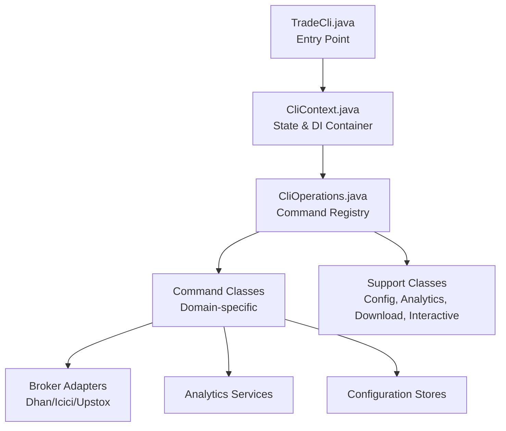
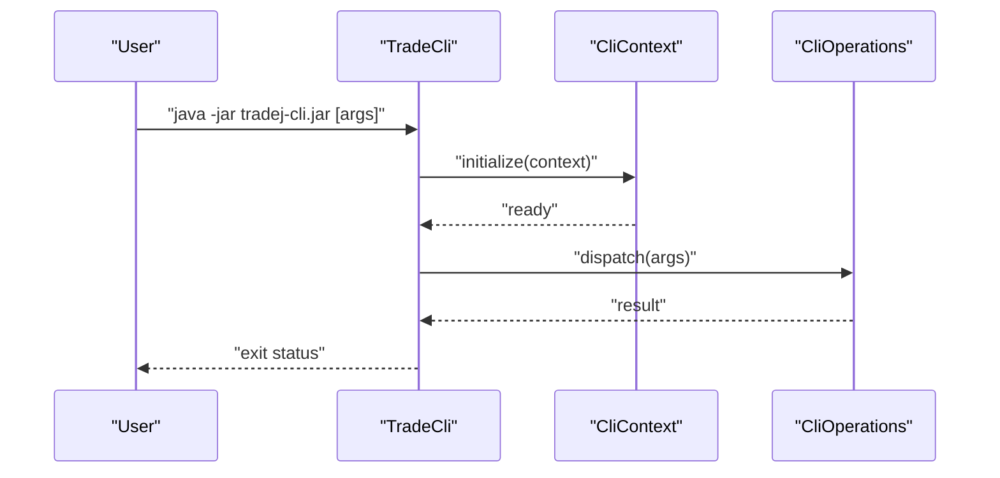
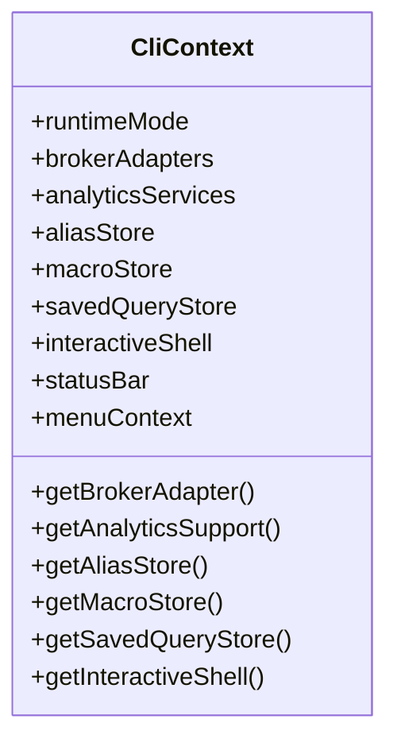
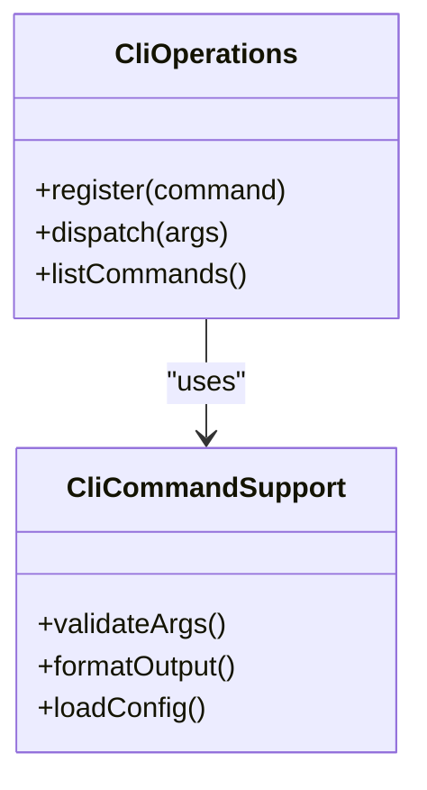
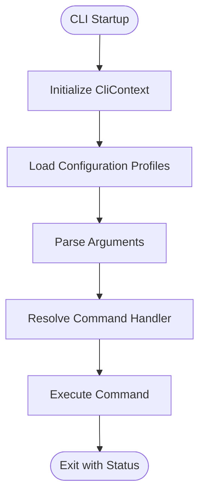
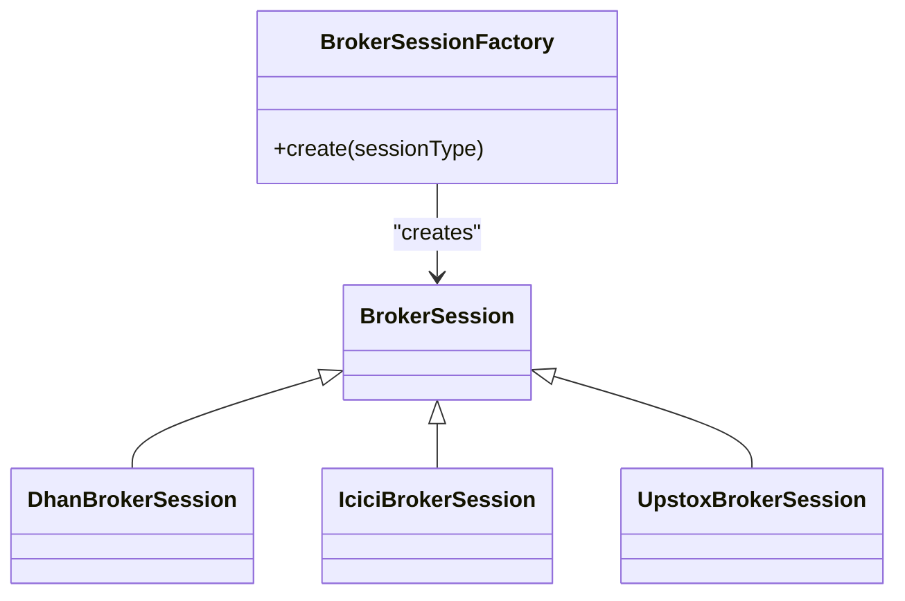
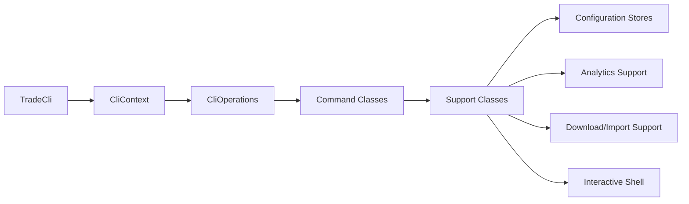

# CLI Architecture

<cite>
**Referenced Files in This Document**
- [TradeCli.java](file://cli/src/main/java/com/tradej/cli/TradeCli.java)
- [CliContext.java](file://cli/src/main/java/com/tradej/cli/CliContext.java)
- [CliOperations.java](file://cli/src/main/java/com/tradej/cli/CliOperations.java)
- [CliCommandSupport.java](file://cli/src/main/java/com/tradej/cli/command/CliCommandSupport.java)
- [CliAnalyticsCommands.java](file://cli/src/main/java/com/tradej/cli/command/CliAnalyticsCommands.java)
- [CliBrokerCommands.java](file://cli/src/main/java/com/tradej/cli/command/CliBrokerCommands.java)
- [CliDataCommands.java](file://cli/src/main/java/com/tradej/cli/command/CliDataCommands.java)
- [CliDownloadCommands.java](file://cli/src/main/java/com/tradej/cli/command/CliDownloadCommands.java)
- [CliGatewayCommands.java](file://cli/src/main/java/com/tradej/cli/command/CliGatewayCommands.java)
- [CliHelpCommand.java](file://cli/src/main/java/com/tradej/cli/command/CliHelpCommand.java)
- [CliPortfolioCommands.java](file://cli/src/main/java/com/tradej/cli/command/CliPortfolioCommands.java)
- [CliReplayCommands.java](file://cli/src/main/java/com/tradej/cli/command/CliReplayCommands.java)
- [CliScanCommands.java](file://cli/src/main/java/com/tradej/cli/command/CliScanCommands.java)
- [CliTradingCommands.java](file://cli/src/main/java/com/tradej/cli/command/CliTradingCommands.java)
- [CliAttachCommands.java](file://cli/src/main/java/com/tradej/cli/command/CliAttachCommands.java)
- [CliBacktestCommands.java](file://cli/src/main/java/com/tradej/cli/command/CliBacktestCommands.java)
- [CliDoctorCommand.java](file://cli/src/main/java/com/tradej/cli/command/CliDoctorCommand.java)
- [CliModulesCommand.java](file://cli/src/main/java/com/tradej/cli/command/CliModulesCommand.java)
- [CliReadinessCommand.java](file://cli/src/main/java/com/tradej/cli/command/CliReadinessCommand.java)
- [CliRegressionCommand.java](file://cli/src/main/java/com/tradej/cli/command/CliRegressionCommand.java)
- [CliScreenerCommands.java](file://cli/src/main/java/com/tradej/cli/command/CliScreenerCommands.java)
- [CliCapabilitiesCommand.java](file://cli/src/main/java/com/tradej/cli/command/CliCapabilitiesCommand.java)
- [CliBrokerGatewayCommands.java](file://cli/src/main/java/com/tradej/cli/command/CliBrokerGatewayCommands.java)
- [CliBrokersCommand.java](file://cli/src/main/java/com/tradej/cli/command/CliBrokersCommand.java)
- [CliCertifyCommand.java](file://cli/src/main/java/com/tradej/cli/command/CliCertifyCommand.java)
- [CliCommandsCommand.java](file://cli/src/main/java/com/tradej/cli/command/CliCommandsCommand.java)
- [CliComputeCommand.java](file://cli/src/main/java/com/tradej/cli/command/CliComputeCommand.java)
- [CliCoverageCommand.java](file://cli/src/main/java/com/tradej/cli/command/CliCoverageCommand.java)
- [CliDashboardCommand.java](file://cli/src/main/java/com/tradej/cli/command/CliDashboardCommand.java)
- [CliEventsCommand.java](file://cli/src/main/java/com/tradej/cli/command/CliEventsCommand.java)
- [CliFlowsCommand.java](file://cli/src/main/java/com/tradej/cli/command/CliFlowsCommand.java)
- [CliHistoricalCommands.java](file://cli/src/main/java/com/tradej/cli/command/CliHistoricalCommands.java)
- [CliIndicatorsCommand.java](file://cli/src/main/java/com/tradej/cli/command/CliIndicatorsCommand.java)
- [CliMaintenanceCommands.java](file://cli/src/main/java/com/tradej/cli/command/CliMaintenanceCommands.java)
- [CliMarketCommands.java](file://cli/src/main/java/com/tradej/cli/command/CliMarketCommands.java)
- [CliMonitorCommand.java](file://cli/src/main/java/com/tradej/cli/command/CliMonitorCommand.java)
- [CliPluginsCommand.java](file://cli/src/main/java/com/tradej/cli/command/CliPluginsCommand.java)
- [CliApiCommand.java](file://cli/src/main/java/com/tradej/cli/command/CliApiCommand.java)
- [CliArchitectureCommand.java](file://cli/src/main/java/com/tradej/cli/command/CliArchitectureCommand.java)
- [CliDocsCommand.java](file://cli/src/main/java/com/tradej/cli/command/CliDocsCommand.java)
- [CliReplayConsoleCommand.java](file://cli/src/main/java/com/tradej/cli/command/CliReplayConsoleCommand.java)
- [CliDownloadSupport.java](file://cli/src/main/java/com/tradej/cli/download/CliDownloadSupport.java)
- [CliEquityImportSupport.java](file://cli/src/main/java/com/tradej/cli/download/CliEquityImportSupport.java)
- [CliAnalyticsSupport.java](file://cli/src/main/java/com/tradej/cli/analytics/CliAnalyticsSupport.java)
- [AttachClient.java](file://cli/src/main/java/com/tradej/cli/attach/AttachClient.java)
- [InteractiveShell.java](file://cli/src/main/java/com/tradej/cli/interactive/InteractiveShell.java)
- [MenuContext.java](file://cli/src/main/java/com/tradej/cli/interactive/MenuContext.java)
- [StatusBar.java](file://cli/src/main/java/com/tradej/cli/interactive/StatusBar.java)
- [BrokerSession.java](file://cli/src/main/java/com/tradej/cli/standalone/BrokerSession.java)
- [BrokerSessionFactory.java](file://cli/src/main/java/com/tradej/cli/standalone/BrokerSessionFactory.java)
- [DhanBrokerSession.java](file://cli/src/main/java/com/tradej/cli/standalone/DhanBrokerSession.java)
- [IciciBrokerSession.java](file://cli/src/main/java/com/tradej/cli/standalone/IciciBrokerSession.java)
- [UpstoxBrokerSession.java](file://cli/src/main/java/com/tradej/cli/standalone/UpstoxBrokerSession.java)
- [AliasStore.java](file://cli/src/main/java/com/tradej/cli/config/AliasStore.java)
- [MacroStore.java](file://cli/src/main/java/com/tradej/cli/config/MacroStore.java)
- [SavedQueryStore.java](file://cli/src/main/java/com/tradej/cli/config/SavedQueryStore.java)
- [CliConfig.java](file://cli/src/main/java/com/tradej/cli/config/CliConfig.java)
- [ScanProfileJsonLoader.java](file://cli/src/main/java/com/tradej/cli/scan/ScanProfileJsonLoader.java)
- [ModuleDependencyGraph.java](file://cli/src/main/java/com/tradej/cli/command/ModuleDependencyGraph.java)
- [EventFlowScanner.java](file://cli/src/main/java/com/tradej/cli/command/EventFlowScanner.java)
- [CLI.md](file://CLI.md)
- [CONFIG.md](file://CONFIG.md)
</cite>

## Table of Contents
1. [Introduction](#introduction)
2. [Project Structure](#project-structure)
3. [Core Components](#core-components)
4. [Architecture Overview](#architecture-overview)
5. [Detailed Component Analysis](#detailed-component-analysis)
6. [Dependency Analysis](#dependency-analysis)
7. [Performance Considerations](#performance-considerations)
8. [Troubleshooting Guide](#troubleshooting-guide)
9. [Conclusion](#conclusion)
10. [Appendices](#appendices)

## Introduction
This document explains the CLI architecture of the Trade-J system. It covers the overall design, command parsing mechanism, and context management system. It documents the TradeCli entry point, CliContext for state management, and CliOperations for core functionality. It also details the command registration system, dependency injection, and modular architecture. Examples of CLI initialization, configuration loading, and command execution flow are included, along with integration points for broker adapters, analytics services, and configuration management. Finally, it provides guidelines for extending the CLI architecture and adding new command categories.

## Project Structure
The CLI module is organized around a small set of core classes and a large set of command classes grouped by functional domains. Supporting packages include configuration stores, analytics helpers, interactive shell utilities, standalone broker sessions, and download/import helpers.

```mermaid
graph TB
subgraph "CLI Core"
TC["TradeCli.java"]
CCtx["CliContext.java"]
COps["CliOperations.java"]
CmdSup["CliCommandSupport.java"]
end
subgraph "Command Categories"
CA["CliAnalyticsCommands.java"]
CB["CliBrokerCommands.java"]
CD["CliDataCommands.java"]
CDown["CliDownloadCommands.java"]
CG["CliGatewayCommands.java"]
CHelp["CliHelpCommand.java"]
CP["CliPortfolioCommands.java"]
CR["CliReplayCommands.java"]
CS["CliScanCommands.java"]
CT["CliTradingCommands.java"]
CAttach["CliAttachCommands.java"]
CBack["CliBacktestCommands.java"]
CDoc["CliDoctorCommand.java"]
CMods["CliModulesCommand.java"]
CRead["CliReadinessCommand.java"]
CReg["CliRegressionCommand.java"]
CScreener["CliScreenerCommands.java"]
CCap["CliCapabilitiesCommand.java"]
CBGW["CliBrokerGatewayCommands.java"]
CBrokers["CliBrokersCommand.java"]
CCert["CliCertifyCommand.java"]
CComm["CliCommandsCommand.java"]
CComp["CliComputeCommand.java"]
CCov["CliCoverageCommand.java"]
CDash["CliDashboardCommand.java"]
CEv["CliEventsCommand.java"]
CFlo["CliFlowsCommand.java"]
CHist["CliHistoricalCommands.java"]
CInd["CliIndicatorsCommand.java"]
CMaint["CliMaintenanceCommands.java"]
CMark["CliMarketCommands.java"]
CMon["CliMonitorCommand.java"]
CPlug["CliPluginsCommand.java"]
CApi["CliApiCommand.java"]
CArch["CliArchitectureCommand.java"]
CDocs["CliDocsCommand.java"]
CRC["CliReplayConsoleCommand.java"]
end
subgraph "Support"
DownSup["CliDownloadSupport.java"]
EqImp["CliEquityImportSupport.java"]
AnaSup["CliAnalyticsSupport.java"]
Attach["AttachClient.java"]
Shell["InteractiveShell.java"]
Menu["MenuContext.java"]
Status["StatusBar.java"]
Alias["AliasStore.java"]
Macro["MacroStore.java"]
SavedQ["SavedQueryStore.java"]
Cfg["CliConfig.java"]
ScanProf["ScanProfileJsonLoader.java"]
ModDep["ModuleDependencyGraph.java"]
EvFlow["EventFlowScanner.java"]
end
TC --> CCtx
TC --> COps
CCtx --> CmdSup
COps --> CA
COps --> CB
COps --> CD
COps --> CDown
COps --> CG
COps --> CP
COps --> CR
COps --> CS
COps --> CT
COps --> CAttach
COps --> CBack
COps --> CDoc
COps --> CMods
COps --> CRead
COps --> CReg
COps --> CScreener
COps --> CCap
COps --> CBGW
COps --> CBrokers
COps --> CCert
COps --> CComm
COps --> CComp
COps --> CCov
COps --> CDash
COps --> CEv
COps --> CFlo
COps --> CHist
COps --> CInd
COps --> CMaint
COps --> CMark
COps --> CMon
COps --> CPlug
COps --> CA
COps --> CArch
COps --> CDocs
COps --> CRC
COps --> DownSup
COps --> EqImp
COps --> AnaSup
COps --> Attach
COps --> Shell
COps --> Menu
COps --> Status
COps --> Alias
COps --> Macro
COps --> SavedQ
COps --> Cfg
COps --> ScanProf
COps --> ModDep
COps --> EvFlow
```

**Diagram sources**
- [TradeCli.java](file://cli/src/main/java/com/tradej/cli/TradeCli.java)
- [CliContext.java](file://cli/src/main/java/com/tradej/cli/CliContext.java)
- [CliOperations.java](file://cli/src/main/java/com/tradej/cli/CliOperations.java)
- [CliCommandSupport.java](file://cli/src/main/java/com/tradej/cli/command/CliCommandSupport.java)
- [CliAnalyticsCommands.java](file://cli/src/main/java/com/tradej/cli/command/CliAnalyticsCommands.java)
- [CliBrokerCommands.java](file://cli/src/main/java/com/tradej/cli/command/CliBrokerCommands.java)
- [CliDataCommands.java](file://cli/src/main/java/com/tradej/cli/command/CliDataCommands.java)
- [CliDownloadCommands.java](file://cli/src/main/java/com/tradej/cli/command/CliDownloadCommands.java)
- [CliGatewayCommands.java](file://cli/src/main/java/com/tradej/cli/command/CliGatewayCommands.java)
- [CliHelpCommand.java](file://cli/src/main/java/com/tradej/cli/command/CliHelpCommand.java)
- [CliPortfolioCommands.java](file://cli/src/main/java/com/tradej/cli/command/CliPortfolioCommands.java)
- [CliReplayCommands.java](file://cli/src/main/java/com/tradej/cli/command/CliReplayCommands.java)
- [CliScanCommands.java](file://cli/src/main/java/com/tradej/cli/command/CliScanCommands.java)
- [CliTradingCommands.java](file://cli/src/main/java/com/tradej/cli/command/CliTradingCommands.java)
- [CliAttachCommands.java](file://cli/src/main/java/com/tradej/cli/command/CliAttachCommands.java)
- [CliBacktestCommands.java](file://cli/src/main/java/com/tradej/cli/command/CliBacktestCommands.java)
- [CliDoctorCommand.java](file://cli/src/main/java/com/tradej/cli/command/CliDoctorCommand.java)
- [CliModulesCommand.java](file://cli/src/main/java/com/tradej/cli/command/CliModulesCommand.java)
- [CliReadinessCommand.java](file://cli/src/main/java/com/tradej/cli/command/CliReadinessCommand.java)
- [CliRegressionCommand.java](file://cli/src/main/java/com/tradej/cli/command/CliRegressionCommand.java)
- [CliScreenerCommands.java](file://cli/src/main/java/com/tradej/cli/command/CliScreenerCommands.java)
- [CliCapabilitiesCommand.java](file://cli/src/main/java/com/tradej/cli/command/CliCapabilitiesCommand.java)
- [CliBrokerGatewayCommands.java](file://cli/src/main/java/com/tradej/cli/command/CliBrokerGatewayCommands.java)
- [CliBrokersCommand.java](file://cli/src/main/java/com/tradej/cli/command/CliBrokersCommand.java)
- [CliCertifyCommand.java](file://cli/src/main/java/com/tradej/cli/command/CliCertifyCommand.java)
- [CliCommandsCommand.java](file://cli/src/main/java/com/tradej/cli/command/CliCommandsCommand.java)
- [CliComputeCommand.java](file://cli/src/main/java/com/tradej/cli/command/CliComputeCommand.java)
- [CliCoverageCommand.java](file://cli/src/main/java/com/tradej/cli/command/CliCoverageCommand.java)
- [CliDashboardCommand.java](file://cli/src/main/java/com/tradej/cli/command/CliDashboardCommand.java)
- [CliEventsCommand.java](file://cli/src/main/java/com/tradej/cli/command/CliEventsCommand.java)
- [CliFlowsCommand.java](file://cli/src/main/java/com/tradej/cli/command/CliFlowsCommand.java)
- [CliHistoricalCommands.java](file://cli/src/main/java/com/tradej/cli/command/CliHistoricalCommands.java)
- [CliIndicatorsCommand.java](file://cli/src/main/java/com/tradej/cli/command/CliIndicatorsCommand.java)
- [CliMaintenanceCommands.java](file://cli/src/main/java/com/tradej/cli/command/CliMaintenanceCommands.java)
- [CliMarketCommands.java](file://cli/src/main/java/com/tradej/cli/command/CliMarketCommands.java)
- [CliMonitorCommand.java](file://cli/src/main/java/com/tradej/cli/command/CliMonitorCommand.java)
- [CliPluginsCommand.java](file://cli/src/main/java/com/tradej/cli/command/CliPluginsCommand.java)
- [CliApiCommand.java](file://cli/src/main/java/com/tradej/cli/command/CliApiCommand.java)
- [CliArchitectureCommand.java](file://cli/src/main/java/com/tradej/cli/command/CliArchitectureCommand.java)
- [CliDocsCommand.java](file://cli/src/main/java/com/tradej/cli/command/CliDocsCommand.java)
- [CliReplayConsoleCommand.java](file://cli/src/main/java/com/tradej/cli/command/CliReplayConsoleCommand.java)
- [CliDownloadSupport.java](file://cli/src/main/java/com/tradej/cli/download/CliDownloadSupport.java)
- [CliEquityImportSupport.java](file://cli/src/main/java/com/tradej/cli/download/CliEquityImportSupport.java)
- [CliAnalyticsSupport.java](file://cli/src/main/java/com/tradej/cli/analytics/CliAnalyticsSupport.java)
- [AttachClient.java](file://cli/src/main/java/com/tradej/cli/attach/AttachClient.java)
- [InteractiveShell.java](file://cli/src/main/java/com/tradej/cli/interactive/InteractiveShell.java)
- [MenuContext.java](file://cli/src/main/java/com/tradej/cli/interactive/MenuContext.java)
- [StatusBar.java](file://cli/src/main/java/com/tradej/cli/interactive/StatusBar.java)
- [AliasStore.java](file://cli/src/main/java/com/tradej/cli/config/AliasStore.java)
- [MacroStore.java](file://cli/src/main/java/com/tradej/cli/config/MacroStore.java)
- [SavedQueryStore.java](file://cli/src/main/java/com/tradej/cli/config/SavedQueryStore.java)
- [CliConfig.java](file://cli/src/main/java/com/tradej/cli/config/CliConfig.java)
- [ScanProfileJsonLoader.java](file://cli/src/main/java/com/tradej/cli/scan/ScanProfileJsonLoader.java)
- [ModuleDependencyGraph.java](file://cli/src/main/java/com/tradej/cli/command/ModuleDependencyGraph.java)
- [EventFlowScanner.java](file://cli/src/main/java/com/tradej/cli/command/EventFlowScanner.java)

**Section sources**
- [TradeCli.java](file://cli/src/main/java/com/tradej/cli/TradeCli.java)
- [CliContext.java](file://cli/src/main/java/com/tradej/cli/CliContext.java)
- [CliOperations.java](file://cli/src/main/java/com/tradej/cli/CliOperations.java)
- [CliCommandSupport.java](file://cli/src/main/java/com/tradej/cli/command/CliCommandSupport.java)

## Core Components
- TradeCli: The primary CLI entry point responsible for initializing the runtime context, parsing arguments, and dispatching commands. It orchestrates the lifecycle from startup to command execution.
- CliContext: Central state container holding configuration, runtime mode, broker adapters, analytics services, and other shared resources. It ensures consistent access across commands and operations.
- CliOperations: The core operation hub that aggregates command implementations across domains (analytics, broker, data, download, gateway, portfolio, replay, scan, trading, etc.) and exposes them to TradeCli for execution.

Key responsibilities:
- TradeCli initializes CliContext and delegates command resolution to CliOperations.
- CliContext manages shared dependencies and provides accessors for broker adapters, analytics, configuration stores, and interactive components.
- CliOperations groups related commands by category and exposes them via a unified interface.

**Section sources**
- [TradeCli.java](file://cli/src/main/java/com/tradej/cli/TradeCli.java)
- [CliContext.java](file://cli/src/main/java/com/tradej/cli/CliContext.java)
- [CliOperations.java](file://cli/src/main/java/com/tradej/cli/CliOperations.java)

## Architecture Overview
The CLI follows a layered architecture:
- Entry Point Layer: TradeCli bootstraps the CLI and parses arguments.
- Context Management Layer: CliContext centralizes state and dependencies.
- Command Dispatch Layer: CliOperations routes commands to appropriate handlers.
- Command Implementation Layer: Domain-specific command classes implement functionality.
- Support Layer: Configuration stores, analytics helpers, interactive shell, and standalone broker sessions provide auxiliary capabilities.

**Diagram sources**
- [TradeCli.java](file://cli/src/main/java/com/tradej/cli/TradeCli.java)
- [CliContext.java](file://cli/src/main/java/com/tradej/cli/CliContext.java)
- [CliOperations.java](file://cli/src/main/java/com/tradej/cli/CliOperations.java)

## Detailed Component Analysis

### TradeCli Entry Point
TradeCli is responsible for:
- Initializing the CLI runtime and loading configuration profiles.
- Building CliContext with broker adapters, analytics services, and configuration stores.
- Parsing command-line arguments and delegating to CliOperations for execution.
- Handling help and diagnostic commands before normal execution.

Typical flow:
- Initialize runtime mode and load application profiles.
- Construct CliContext with broker factories and analytics providers.
- Parse arguments and resolve target command.
- Execute command via CliOperations and return exit status.

**Diagram sources**
- [TradeCli.java](file://cli/src/main/java/com/tradej/cli/TradeCli.java)
- [CliContext.java](file://cli/src/main/java/com/tradej/cli/CliContext.java)
- [CliOperations.java](file://cli/src/main/java/com/tradej/cli/CliOperations.java)

**Section sources**
- [TradeCli.java](file://cli/src/main/java/com/tradej/cli/TradeCli.java)

### CliContext: State Management and Dependency Injection
CliContext acts as a centralized dependency container:
- Holds runtime mode, broker adapters, analytics services, and configuration stores.
- Provides accessors for broker session factories and analytics support.
- Manages interactive shell components (menu, status bar).
- Exposes configuration stores for aliases, macros, and saved queries.

Design implications:
- Reduces coupling between commands and external systems.
- Enables consistent initialization and lifecycle management.
- Supports modular extension by injecting new services during construction.

**Diagram sources**
- [CliContext.java](file://cli/src/main/java/com/tradej/cli/CliContext.java)

**Section sources**
- [CliContext.java](file://cli/src/main/java/com/tradej/cli/CliContext.java)

### CliOperations: Command Registration and Dispatch
CliOperations aggregates command implementations across domains:
- Analytics commands, broker commands, data commands, download commands, gateway commands, portfolio commands, replay commands, scan commands, trading commands, and more.
- Provides a unified dispatch mechanism to route parsed arguments to the correct command handler.
- Integrates with CliCommandSupport for shared utilities and validation.

Extensibility:
- New command categories can be added by registering new command classes under the appropriate domain.
- Commands can leverage CliContext for shared services and configuration.

**Diagram sources**
- [CliOperations.java](file://cli/src/main/java/com/tradej/cli/CliOperations.java)
- [CliCommandSupport.java](file://cli/src/main/java/com/tradej/cli/command/CliCommandSupport.java)

**Section sources**
- [CliOperations.java](file://cli/src/main/java/com/tradej/cli/CliOperations.java)
- [CliCommandSupport.java](file://cli/src/main/java/com/tradej/cli/command/CliCommandSupport.java)

### Command Categories and Examples
The CLI organizes commands by functional domains. Below are representative categories and their roles:

- Analytics: Commands for analytics-related tasks.
- Broker: Commands interacting with broker adapters (Dhan, Icici, Upstox).
- Data: Commands for data ingestion and management.
- Download: Commands for downloading datasets and importing equities.
- Gateway: Commands for broker gateway operations.
- Help: Built-in help command for discovering commands.
- Portfolio: Commands for portfolio analytics and management.
- Replay: Commands for replay and simulation.
- Scan: Commands for scanning instruments and strategies.
- Trading: Commands for trading operations and monitoring.
- Attach: Commands for attaching clients and sessions.
- Backtest: Commands for backtesting strategies.
- Doctor: Commands for diagnostics and health checks.
- Modules: Commands for module introspection.
- Readiness: Commands for readiness checks.
- Regression: Commands for regression testing.
- Screener: Commands for screening instruments.
- Capabilities: Commands for broker capability discovery.
- BrokerGateway: Commands for broker gateway management.
- Brokers: Commands for broker management.
- Certify: Commands for certification workflows.
- Commands: Commands for listing and managing commands.
- Compute: Commands for compute-intensive tasks.
- Coverage: Commands for coverage reporting.
- Dashboard: Commands for dashboard operations.
- Events: Commands for event management.
- Flows: Commands for flow visualization.
- Historical: Commands for historical data operations.
- Indicators: Commands for indicator computations.
- Maintenance: Commands for maintenance tasks.
- Market: Commands for market data operations.
- Monitor: Commands for monitoring.
- Plugins: Commands for plugin management.
- API: Commands for API operations.
- Architecture: Commands for architecture inspection.
- Docs: Commands for documentation generation.
- ReplayConsole: Commands for replay console operations.

Examples of command execution flow:
- Initialization: TradeCli constructs CliContext and loads configuration.
- Configuration Loading: CliContext initializes configuration stores and broker adapters.
- Command Execution: CliOperations resolves the target command and executes it with context.

**Diagram sources**
- [TradeCli.java](file://cli/src/main/java/com/tradej/cli/TradeCli.java)
- [CliContext.java](file://cli/src/main/java/com/tradej/cli/CliContext.java)
- [CliOperations.java](file://cli/src/main/java/com/tradej/cli/CliOperations.java)

**Section sources**
- [CliAnalyticsCommands.java](file://cli/src/main/java/com/tradej/cli/command/CliAnalyticsCommands.java)
- [CliBrokerCommands.java](file://cli/src/main/java/com/tradej/cli/command/CliBrokerCommands.java)
- [CliDataCommands.java](file://cli/src/main/java/com/tradej/cli/command/CliDataCommands.java)
- [CliDownloadCommands.java](file://cli/src/main/java/com/tradej/cli/command/CliDownloadCommands.java)
- [CliGatewayCommands.java](file://cli/src/main/java/com/tradej/cli/command/CliGatewayCommands.java)
- [CliHelpCommand.java](file://cli/src/main/java/com/tradej/cli/command/CliHelpCommand.java)
- [CliPortfolioCommands.java](file://cli/src/main/java/com/tradej/cli/command/CliPortfolioCommands.java)
- [CliReplayCommands.java](file://cli/src/main/java/com/tradej/cli/command/CliReplayCommands.java)
- [CliScanCommands.java](file://cli/src/main/java/com/tradej/cli/command/CliScanCommands.java)
- [CliTradingCommands.java](file://cli/src/main/java/com/tradej/cli/command/CliTradingCommands.java)
- [CliAttachCommands.java](file://cli/src/main/java/com/tradej/cli/command/CliAttachCommands.java)
- [CliBacktestCommands.java](file://cli/src/main/java/com/tradej/cli/command/CliBacktestCommands.java)
- [CliDoctorCommand.java](file://cli/src/main/java/com/tradej/cli/command/CliDoctorCommand.java)
- [CliModulesCommand.java](file://cli/src/main/java/com/tradej/cli/command/CliModulesCommand.java)
- [CliReadinessCommand.java](file://cli/src/main/java/com/tradej/cli/command/CliReadinessCommand.java)
- [CliRegressionCommand.java](file://cli/src/main/java/com/tradej/cli/command/CliRegressionCommand.java)
- [CliScreenerCommands.java](file://cli/src/main/java/com/tradej/cli/command/CliScreenerCommands.java)
- [CliCapabilitiesCommand.java](file://cli/src/main/java/com/tradej/cli/command/CliCapabilitiesCommand.java)
- [CliBrokerGatewayCommands.java](file://cli/src/main/java/com/tradej/cli/command/CliBrokerGatewayCommands.java)
- [CliBrokersCommand.java](file://cli/src/main/java/com/tradej/cli/command/CliBrokersCommand.java)
- [CliCertifyCommand.java](file://cli/src/main/java/com/tradej/cli/command/CliCertifyCommand.java)
- [CliCommandsCommand.java](file://cli/src/main/java/com/tradej/cli/command/CliCommandsCommand.java)
- [CliComputeCommand.java](file://cli/src/main/java/com/tradej/cli/command/CliComputeCommand.java)
- [CliCoverageCommand.java](file://cli/src/main/java/com/tradej/cli/command/CliCoverageCommand.java)
- [CliDashboardCommand.java](file://cli/src/main/java/com/tradej/cli/command/CliDashboardCommand.java)
- [CliEventsCommand.java](file://cli/src/main/java/com/tradej/cli/command/CliEventsCommand.java)
- [CliFlowsCommand.java](file://cli/src/main/java/com/tradej/cli/command/CliFlowsCommand.java)
- [CliHistoricalCommands.java](file://cli/src/main/java/com/tradej/cli/command/CliHistoricalCommands.java)
- [CliIndicatorsCommand.java](file://cli/src/main/java/com/tradej/cli/command/CliIndicatorsCommand.java)
- [CliMaintenanceCommands.java](file://cli/src/main/java/com/tradej/cli/command/CliMaintenanceCommands.java)
- [CliMarketCommands.java](file://cli/src/main/java/com/tradej/cli/command/CliMarketCommands.java)
- [CliMonitorCommand.java](file://cli/src/main/java/com/tradej/cli/command/CliMonitorCommand.java)
- [CliPluginsCommand.java](file://cli/src/main/java/com/tradej/cli/command/CliPluginsCommand.java)
- [CliApiCommand.java](file://cli/src/main/java/com/tradej/cli/command/CliApiCommand.java)
- [CliArchitectureCommand.java](file://cli/src/main/java/com/tradej/cli/command/CliArchitectureCommand.java)
- [CliDocsCommand.java](file://cli/src/main/java/com/tradej/cli/command/CliDocsCommand.java)
- [CliReplayConsoleCommand.java](file://cli/src/main/java/com/tradej/cli/command/CliReplayConsoleCommand.java)

### Support Components
- CliDownloadSupport and CliEquityImportSupport: Provide download and import utilities for datasets and equities.
- CliAnalyticsSupport: Encapsulates analytics service integrations.
- AttachClient: Facilitates client attachment for interactive sessions.
- InteractiveShell, MenuContext, StatusBar: Provide interactive UI components for menu navigation and status reporting.
- Configuration stores (AliasStore, MacroStore, SavedQueryStore): Manage aliases, macros, and saved queries.
- CliConfig: Central configuration holder for CLI settings.
- ScanProfileJsonLoader: Loads scan profile configurations.
- ModuleDependencyGraph and EventFlowScanner: Tools for module and event flow analysis.

**Section sources**
- [CliDownloadSupport.java](file://cli/src/main/java/com/tradej/cli/download/CliDownloadSupport.java)
- [CliEquityImportSupport.java](file://cli/src/main/java/com/tradej/cli/download/CliEquityImportSupport.java)
- [CliAnalyticsSupport.java](file://cli/src/main/java/com/tradej/cli/analytics/CliAnalyticsSupport.java)
- [AttachClient.java](file://cli/src/main/java/com/tradej/cli/attach/AttachClient.java)
- [InteractiveShell.java](file://cli/src/main/java/com/tradej/cli/interactive/InteractiveShell.java)
- [MenuContext.java](file://cli/src/main/java/com/tradej/cli/interactive/MenuContext.java)
- [StatusBar.java](file://cli/src/main/java/com/tradej/cli/interactive/StatusBar.java)
- [AliasStore.java](file://cli/src/main/java/com/tradej/cli/config/AliasStore.java)
- [MacroStore.java](file://cli/src/main/java/com/tradej/cli/config/MacroStore.java)
- [SavedQueryStore.java](file://cli/src/main/java/com/tradej/cli/config/SavedQueryStore.java)
- [CliConfig.java](file://cli/src/main/java/com/tradej/cli/config/CliConfig.java)
- [ScanProfileJsonLoader.java](file://cli/src/main/java/com/tradej/cli/scan/ScanProfileJsonLoader.java)
- [ModuleDependencyGraph.java](file://cli/src/main/java/com/tradej/cli/command/ModuleDependencyGraph.java)
- [EventFlowScanner.java](file://cli/src/main/java/com/tradej/cli/command/EventFlowScanner.java)

### Standalone Broker Sessions
The CLI supports standalone broker sessions for Dhan, Icici, and Upstox. These are encapsulated in dedicated classes and factories to enable isolated operations outside the main runtime.

**Diagram sources**
- [BrokerSessionFactory.java](file://cli/src/main/java/com/tradej/cli/standalone/BrokerSessionFactory.java)
- [BrokerSession.java](file://cli/src/main/java/com/tradej/cli/standalone/BrokerSession.java)
- [DhanBrokerSession.java](file://cli/src/main/java/com/tradej/cli/standalone/DhanBrokerSession.java)
- [IciciBrokerSession.java](file://cli/src/main/java/com/tradej/cli/standalone/IciciBrokerSession.java)
- [UpstoxBrokerSession.java](file://cli/src/main/java/com/tradej/cli/standalone/UpstoxBrokerSession.java)

**Section sources**
- [BrokerSessionFactory.java](file://cli/src/main/java/com/tradej/cli/standalone/BrokerSessionFactory.java)
- [BrokerSession.java](file://cli/src/main/java/com/tradej/cli/standalone/BrokerSession.java)
- [DhanBrokerSession.java](file://cli/src/main/java/com/tradej/cli/standalone/DhanBrokerSession.java)
- [IciciBrokerSession.java](file://cli/src/main/java/com/tradej/cli/standalone/IciciBrokerSession.java)
- [UpstoxBrokerSession.java](file://cli/src/main/java/com/tradej/cli/standalone/UpstoxBrokerSession.java)

## Dependency Analysis
The CLI exhibits low coupling and high cohesion:
- TradeCli depends on CliContext and CliOperations.
- CliOperations depends on CliCommandSupport and aggregates command classes by domain.
- Commands depend on CliContext for shared services and configuration stores.
- Support components are loosely coupled and reusable across commands.

Potential circular dependencies:
- None observed among core CLI classes. Commands remain stateless and delegate to CliContext for stateful operations.

External dependencies:
- Broker adapters (Dhan/Icici/Upstox) accessed via CliContext.
- Analytics services accessed via CliContext.
- Configuration stores accessed via CliContext.

**Diagram sources**
- [TradeCli.java](file://cli/src/main/java/com/tradej/cli/TradeCli.java)
- [CliContext.java](file://cli/src/main/java/com/tradej/cli/CliContext.java)
- [CliOperations.java](file://cli/src/main/java/com/tradej/cli/CliOperations.java)

**Section sources**
- [TradeCli.java](file://cli/src/main/java/com/tradej/cli/TradeCli.java)
- [CliContext.java](file://cli/src/main/java/com/tradej/cli/CliContext.java)
- [CliOperations.java](file://cli/src/main/java/com/tradej/cli/CliOperations.java)

## Performance Considerations
- Lazy initialization: CliContext can defer heavy initialization until commands require specific services.
- Command caching: Frequently used command metadata can be cached to reduce reflection overhead.
- Batch operations: Some commands may benefit from batching operations to minimize I/O and network calls.
- Memory footprint: Interactive shell components should be disposed of after use to avoid leaks.

## Troubleshooting Guide
Common issues and resolutions:
- Configuration loading failures: Verify application profiles and environment variables. Check CliContext initialization and configuration store loading.
- Broker adapter errors: Confirm broker credentials and session validity. Use CliDoctorCommand for diagnostics.
- Command resolution failures: Ensure command names match registered handlers. Use CliCommandsCommand to list available commands.
- Interactive shell problems: Validate menu context and status bar initialization. Check for missing dependencies in CliContext.

Diagnostic commands:
- CliDoctorCommand: Health checks and environment diagnostics.
- CliReadinessCommand: Readiness verification for brokers and analytics.
- CliCoverageCommand: Coverage reporting for command categories.
- CliModulesCommand: Module introspection and dependency analysis.

**Section sources**
- [CliDoctorCommand.java](file://cli/src/main/java/com/tradej/cli/command/CliDoctorCommand.java)
- [CliReadinessCommand.java](file://cli/src/main/java/com/tradej/cli/command/CliReadinessCommand.java)
- [CliCoverageCommand.java](file://cli/src/main/java/com/tradej/cli/command/CliCoverageCommand.java)
- [CliModulesCommand.java](file://cli/src/main/java/com/tradej/cli/command/CliModulesCommand.java)

## Conclusion
The CLI architecture centers on a clean separation of concerns: TradeCli handles bootstrap and dispatch, CliContext manages state and dependencies, and CliOperations aggregates and routes commands. The modular design enables easy extension with new command categories and integration with broker adapters, analytics services, and configuration management. Following the guidelines below will help maintain consistency and scalability as the CLI evolves.

## Appendices

### CLI Initialization Example
- TradeCli constructs CliContext with runtime mode and configuration profiles.
- CliContext initializes configuration stores and broker adapters.
- CliOperations registers command handlers and prepares for argument parsing.

**Section sources**
- [TradeCli.java](file://cli/src/main/java/com/tradej/cli/TradeCli.java)
- [CliContext.java](file://cli/src/main/java/com/tradej/cli/CliContext.java)
- [CliOperations.java](file://cli/src/main/java/com/tradej/cli/CliOperations.java)

### Configuration Loading Example
- CliContext loads application profiles and sets runtime mode.
- Configuration stores (AliasStore, MacroStore, SavedQueryStore) are initialized and made available to commands.

**Section sources**
- [CliContext.java](file://cli/src/main/java/com/tradej/cli/CliContext.java)
- [AliasStore.java](file://cli/src/main/java/com/tradej/cli/config/AliasStore.java)
- [MacroStore.java](file://cli/src/main/java/com/tradej/cli/config/MacroStore.java)
- [SavedQueryStore.java](file://cli/src/main/java/com/tradej/cli/config/SavedQueryStore.java)

### Command Execution Flow Example
- TradeCli parses arguments and delegates to CliOperations.
- CliOperations resolves the target command and executes it with context.
- Results are formatted and returned to the caller.

**Section sources**
- [TradeCli.java](file://cli/src/main/java/com/tradej/cli/TradeCli.java)
- [CliOperations.java](file://cli/src/main/java/com/tradej/cli/CliOperations.java)

### Integration Points
- Broker adapters: Accessed via CliContext.getBrokerAdapter().
- Analytics services: Accessed via CliContext.getAnalyticsSupport().
- Configuration management: Managed by CliContext and exposed via configuration stores.

**Section sources**
- [CliContext.java](file://cli/src/main/java/com/tradej/cli/CliContext.java)
- [CliAnalyticsSupport.java](file://cli/src/main/java/com/tradej/cli/analytics/CliAnalyticsSupport.java)

### Guidelines for Extending the CLI Architecture
- Add new command classes under the appropriate domain package.
- Register new commands in CliOperations.
- Leverage CliCommandSupport for shared utilities and validation.
- Inject new services into CliContext during construction.
- Use configuration stores for persistent settings and user preferences.
- Provide diagnostic commands for new functionality.

**Section sources**
- [CliOperations.java](file://cli/src/main/java/com/tradej/cli/CliOperations.java)
- [CliCommandSupport.java](file://cli/src/main/java/com/tradej/cli/command/CliCommandSupport.java)
- [CliContext.java](file://cli/src/main/java/com/tradej/cli/CliContext.java)