# Command Line Interface

<cite>
**Referenced Files in This Document**
- [TradeCli.java](file://cli/src/main/java/com/tradej/cli/TradeCli.java)
- [CliContext.java](file://cli/src/main/java/com/tradej/cli/CliContext.java)
- [CliOperations.java](file://cli/src/main/java/com/tradej/cli/CliOperations.java)
- [InteractiveShell.java](file://cli/src/main/java/com/tradej/cli/interactive/InteractiveShell.java)
- [CliTradingCommands.java](file://cli/src/main/java/com/tradej/cli/command/CliTradingCommands.java)
- [CliPortfolioCommands.java](file://cli/src/main/java/com/tradej/cli/command/CliPortfolioCommands.java)
- [CliMarketCommands.java](file://cli/src/main/java/com/tradej/cli/command/CliMarketCommands.java)
- [CliHistoricalCommands.java](file://cli/src/main/java/com/tradej/cli/command/CliHistoricalCommands.java)
- [CliAnalyticsCommands.java](file://cli/src/main/java/com/tradej/cli/command/CliAnalyticsCommands.java)
- [CliBrokerCommands.java](file://cli/src/main/java/com/tradej/cli/command/CliBrokerCommands.java)
- [CliBrokerGatewayCommands.java](file://cli/src/main/java/com/tradej/cli/command/CliBrokerGatewayCommands.java)
- [CliDownloadCommands.java](file://cli/src/main/java/com/tradej/cli/command/CliDownloadCommands.java)
- [CliAttachCommands.java](file://cli/src/main/java/com/tradej/cli/command/CliAttachCommands.java)
- [CliReplayCommands.java](file://cli/src/main/java/com/tradej/cli/command/CliReplayCommands.java)
- [CliBacktestCommands.java](file://cli/src/main/java/com/tradej/cli/command/CliBacktestCommands.java)
- [CliScanCommands.java](file://cli/src/main/java/com/tradej/cli/command/CliScanCommands.java)
- [CliScreenerCommands.java](file://cli/src/main/java/com/tradej/cli/command/CliScreenerCommands.java)
- [CliDataCommands.java](file://cli/src/main/java/com/tradej/cli/command/CliDataCommands.java)
- [CliCommandsCommand.java](file://cli/src/main/java/com/tradej/cli/command/CliCommandsCommand.java)
- [CliHelpCommand.java](file://cli/src/main/java/com/tradej/cli/command/CliHelpCommand.java)
- [CliDoctorCommand.java](file://cli/src/main/java/com/tradej/cli/command/CliDoctorCommand.java)
- [CliReadinessCommand.java](file://cli/src/main/java/com/tradej/cli/command/CliReadinessCommand.java)
- [CliCoverageCommand.java](file://cli/src/main/java/com/tradej/cli/command/CliCoverageCommand.java)
- [CliRegressionCommand.java](file://cli/src/main/java/com/tradej/cli/command/CliRegressionCommand.java)
- [CliCertifyCommand.java](file://cli/src/main/java/com/tradej/cli/command/CliCertifyCommand.java)
- [CliBrokerCertCommands.java](file://cli/src/main/java/com/tradej/cli/command/CliBrokerCertCommands.java)
- [CliCapabilitiesCommand.java](file://cli/src/main/java/com/tradej/cli/command/CliCapabilitiesCommand.java)
- [CliModulesCommand.java](file://cli/src/main/java/com/tradej/cli/command/CliModulesCommand.java)
- [CliPluginsCommand.java](file://cli/src/main/java/com/tradej/cli/command/CliPluginsCommand.java)
- [CliApiCommand.java](file://cli/src/main/java/com/tradej/cli/command/CliApiCommand.java)
- [CliArchitectureCommand.java](file://cli/src/main/java/com/tradej/cli/command/CliArchitectureCommand.java)
- [CliFlowsCommand.java](file://cli/src/main/java/com/tradej/cli/command/CliFlowsCommand.java)
- [CliEventsCommand.java](file://cli/src/main/java/com/tradej/cli/command/CliEventsCommand.java)
- [CliDashboardCommand.java](file://cli/src/main/java/com/tradej/cli/command/CliDashboardCommand.java)
- [CliIndicatorsCommand.java](file://cli/src/main/java/com/tradej/cli/command/CliIndicatorsCommand.java)
- [CliComputeCommand.java](file://cli/src/main/java/com/tradej/cli/command/CliComputeCommand.java)
- [CliMaintenanceCommands.java](file://cli/src/main/java/com/tradej/cli/command/CliMaintenanceCommands.java)
- [CliGatewayCommands.java](file://cli/src/main/java/com/tradej/cli/command/CliGatewayCommands.java)
- [CliDataSourcesCommand.java](file://cli/src/main/java/com/tradej/cli/command/CliDataSourcesCommand.java)
- [CliDocsCommand.java](file://cli/src/main/java/com/tradej/cli/command/CliDocsCommand.java)
- [CliMonitorCommand.java](file://cli/src/main/java/com/tradej/cli/command/CliMonitorCommand.java)
- [CliCommandSupport.java](file://cli/src/main/java/com/tradej/cli/command/CliCommandSupport.java)
- [CliAnalyticsSupport.java](file://cli/src/main/java/com/tradej/cli/analytics/CliAnalyticsSupport.java)
- [CliDownloadSupport.java](file://cli/src/main/java/com/tradej/cli/download/CliDownloadSupport.java)
- [AttachClient.java](file://cli/src/main/java/com/tradej/cli/attach/AttachClient.java)
- [BrokerSession.java](file://cli/src/main/java/com/tradej/cli/standalone/BrokerSession.java)
- [IciciBrokerSession.java](file://cli/src/main/java/com/tradej/cli/standalone/IciciBrokerSession.java)
- [UpstoxBrokerSession.java](file://cli/src/main/java/com/tradej/cli/standalone/UpstoxBrokerSession.java)
- [DhanBrokerSession.java](file://cli/src/main/java/com/tradej/cli/standalone/DhanBrokerSession.java)
- [application.yml](file://app/src/main/resources/application.yml)
- [CLI.md](file://CLI.md)
- [CONFIG.md](file://CONFIG.md)
- [TRADEJ_ARCHITECTURE_CLASS_FLOWS_REPORT.md](file://TRADEJ_ARCHITECTURE_CLASS_FLOWS_REPORT.md)
</cite>

## Table of Contents
1. [Introduction](#introduction)
2. [Project Structure](#project-structure)
3. [Core Components](#core-components)
4. [Architecture Overview](#architecture-overview)
5. [Detailed Component Analysis](#detailed-component-analysis)
6. [Dependency Analysis](#dependency-analysis)
7. [Performance Considerations](#performance-considerations)
8. [Troubleshooting Guide](#troubleshooting-guide)
9. [Conclusion](#conclusion)
10. [Appendices](#appendices)

## Introduction
This document provides comprehensive documentation for the Command Line Interface (CLI) of the TradeJ system. It explains the CLI architecture, command structure, and interactive shell functionality. It documents trading commands for order placement, market data retrieval, and portfolio management, as well as analytics commands for historical data queries and reporting. Practical examples of CLI usage, batch processing, and automation scripts are included, along with integration details for broker adapters, real-time data access, and configuration management. Finally, it provides guidelines for extending CLI functionality and developing custom commands.

## Project Structure
The CLI module is organized around a central entry point and a modular command framework. Commands are grouped by functional domains (trading, portfolio, market data, analytics, brokers, replay, backtesting, scanning, etc.). Supporting components include interactive shell, analytics helpers, download utilities, attach clients, and standalone broker sessions.

```mermaid
graph TB
subgraph "CLI Core"
TC["TradeCli.java"]
CCtx["CliContext.java"]
COp["CliOperations.java"]
end
subgraph "Interactive Shell"
IS["InteractiveShell.java"]
end
subgraph "Command Modules"
CT["CliTradingCommands.java"]
CP["CliPortfolioCommands.java"]
CM["CliMarketCommands.java"]
CH["CliHistoricalCommands.java"]
CA["CliAnalyticsCommands.java"]
CB["CliBrokerCommands.java"]
CBG["CliBrokerGatewayCommands.java"]
CD["CliDownloadCommands.java"]
CAT["CliAttachCommands.java"]
CR["CliReplayCommands.java"]
CBT["CliBacktestCommands.java"]
CSC["CliScanCommands.java"]
CSCN["CliScreenerCommands.java"]
CDC["CliDataCommands.java"]
CMDS["CliCommandsCommand.java"]
HELP["CliHelpCommand.java"]
DOC["CliDoctorCommand.java"]
READ["CliReadinessCommand.java"]
COV["CliCoverageCommand.java"]
REG["CliRegressionCommand.java"]
CERT["CliCertifyCommand.java"]
CBC["CliBrokerCertCommands.java"]
CAP["CliCapabilitiesCommand.java"]
MOD["CliModulesCommand.java"]
PLG["CliPluginsCommand.java"]
API["CliApiCommand.java"]
ARC["CliArchitectureCommand.java"]
FLO["CliFlowsCommand.java"]
EVT["CliEventsCommand.java"]
DASH["CliDashboardCommand.java"]
IND["CliIndicatorsCommand.java"]
CMP["CliComputeCommand.java"]
MAINT["CliMaintenanceCommands.java"]
GW["CliGatewayCommands.java"]
DS["CliDataSourcesCommand.java"]
DOCS["CliDocsCommand.java"]
MON["CliMonitorCommand.java"]
end
subgraph "Support Utilities"
CAS["CliAnalyticsSupport.java"]
CDS["CliDownloadSupport.java"]
AC["AttachClient.java"]
BS["BrokerSession.java"]
IBS["IciciBrokerSession.java"]
UBS["UpstoxBrokerSession.java"]
DBS["DhanBrokerSession.java"]
end
TC --> CCtx
TC --> COp
CCtx --> IS
COp --> CT
COp --> CP
COp --> CM
COp --> CH
COp --> CA
COp --> CB
COp --> CBG
COp --> CD
COp --> CAT
COp --> CR
COp --> CBT
COp --> CSC
COp --> CSCN
COp --> CDC
COp --> CMDS
COp --> HELP
COp --> DOC
COp --> READ
COp --> COV
COp --> REG
COp --> CERT
COp --> CBC
COp --> CAP
COp --> MOD
COp --> PLG
COp --> API
COp --> ARC
COp --> FLO
COp --> EVT
COp --> DASH
COp --> IND
COp --> CMP
COp --> MAINT
COp --> GW
COp --> DS
COp --> DOCS
COp --> MON
COp --> CAS
COp --> CDS
COp --> AC
COp --> BS
COp --> IBS
COp --> UBS
COp --> DBS
```

**Diagram sources**
- [TradeCli.java](file://cli/src/main/java/com/tradej/cli/TradeCli.java)
- [CliContext.java](file://cli/src/main/java/com/tradej/cli/CliContext.java)
- [CliOperations.java](file://cli/src/main/java/com/tradej/cli/CliOperations.java)
- [InteractiveShell.java](file://cli/src/main/java/com/tradej/cli/interactive/InteractiveShell.java)
- [CliTradingCommands.java](file://cli/src/main/java/com/tradej/cli/command/CliTradingCommands.java)
- [CliPortfolioCommands.java](file://cli/src/main/java/com/tradej/cli/command/CliPortfolioCommands.java)
- [CliMarketCommands.java](file://cli/src/main/java/com/tradej/cli/command/CliMarketCommands.java)
- [CliHistoricalCommands.java](file://cli/src/main/java/com/tradej/cli/command/CliHistoricalCommands.java)
- [CliAnalyticsCommands.java](file://cli/src/main/java/com/tradej/cli/command/CliAnalyticsCommands.java)
- [CliBrokerCommands.java](file://cli/src/main/java/com/tradej/cli/command/CliBrokerCommands.java)
- [CliBrokerGatewayCommands.java](file://cli/src/main/java/com/tradej/cli/command/CliBrokerGatewayCommands.java)
- [CliDownloadCommands.java](file://cli/src/main/java/com/tradej/cli/command/CliDownloadCommands.java)
- [CliAttachCommands.java](file://cli/src/main/java/com/tradej/cli/command/CliAttachCommands.java)
- [CliReplayCommands.java](file://cli/src/main/java/com/tradej/cli/command/CliReplayCommands.java)
- [CliBacktestCommands.java](file://cli/src/main/java/com/tradej/cli/command/CliBacktestCommands.java)
- [CliScanCommands.java](file://cli/src/main/java/com/tradej/cli/command/CliScanCommands.java)
- [CliScreenerCommands.java](file://cli/src/main/java/com/tradej/cli/command/CliScreenerCommands.java)
- [CliDataCommands.java](file://cli/src/main/java/com/tradej/cli/command/CliDataCommands.java)
- [CliCommandsCommand.java](file://cli/src/main/java/com/tradej/cli/command/CliCommandsCommand.java)
- [CliHelpCommand.java](file://cli/src/main/java/com/tradej/cli/command/CliHelpCommand.java)
- [CliDoctorCommand.java](file://cli/src/main/java/com/tradej/cli/command/CliDoctorCommand.java)
- [CliReadinessCommand.java](file://cli/src/main/java/com/tradej/cli/command/CliReadinessCommand.java)
- [CliCoverageCommand.java](file://cli/src/main/java/com/tradej/cli/command/CliCoverageCommand.java)
- [CliRegressionCommand.java](file://cli/src/main/java/com/tradej/cli/command/CliRegressionCommand.java)
- [CliCertifyCommand.java](file://cli/src/main/java/com/tradej/cli/command/CliCertifyCommand.java)
- [CliBrokerCertCommands.java](file://cli/src/main/java/com/tradej/cli/command/CliBrokerCertCommands.java)
- [CliCapabilitiesCommand.java](file://cli/src/main/java/com/tradej/cli/command/CliCapabilitiesCommand.java)
- [CliModulesCommand.java](file://cli/src/main/java/com/tradej/cli/command/CliModulesCommand.java)
- [CliPluginsCommand.java](file://cli/src/main/java/com/tradej/cli/command/CliPluginsCommand.java)
- [CliApiCommand.java](file://cli/src/main/java/com/tradej/cli/command/CliApiCommand.java)
- [CliArchitectureCommand.java](file://cli/src/main/java/com/tradej/cli/command/CliArchitectureCommand.java)
- [CliFlowsCommand.java](file://cli/src/main/java/com/tradej/cli/command/CliFlowsCommand.java)
- [CliEventsCommand.java](file://cli/src/main/java/com/tradej/cli/command/CliEventsCommand.java)
- [CliDashboardCommand.java](file://cli/src/main/java/com/tradej/cli/command/CliDashboardCommand.java)
- [CliIndicatorsCommand.java](file://cli/src/main/java/com/tradej/cli/command/CliIndicatorsCommand.java)
- [CliComputeCommand.java](file://cli/src/main/java/com/tradej/cli/command/CliComputeCommand.java)
- [CliMaintenanceCommands.java](file://cli/src/main/java/com/tradej/cli/command/CliMaintenanceCommands.java)
- [CliGatewayCommands.java](file://cli/src/main/java/com/tradej/cli/command/CliGatewayCommands.java)
- [CliDataSourcesCommand.java](file://cli/src/main/java/com/tradej/cli/command/CliDataSourcesCommand.java)
- [CliDocsCommand.java](file://cli/src/main/java/com/tradej/cli/command/CliDocsCommand.java)
- [CliMonitorCommand.java](file://cli/src/main/java/com/tradej/cli/command/CliMonitorCommand.java)
- [CliAnalyticsSupport.java](file://cli/src/main/java/com/tradej/cli/analytics/CliAnalyticsSupport.java)
- [CliDownloadSupport.java](file://cli/src/main/java/com/tradej/cli/download/CliDownloadSupport.java)
- [AttachClient.java](file://cli/src/main/java/com/tradej/cli/attach/AttachClient.java)
- [BrokerSession.java](file://cli/src/main/java/com/tradej/cli/standalone/BrokerSession.java)
- [IciciBrokerSession.java](file://cli/src/main/java/com/tradej/cli/standalone/IciciBrokerSession.java)
- [UpstoxBrokerSession.java](file://cli/src/main/java/com/tradej/cli/standalone/UpstoxBrokerSession.java)
- [DhanBrokerSession.java](file://cli/src/main/java/com/tradej/cli/standalone/DhanBrokerSession.java)

**Section sources**
- [TradeCli.java](file://cli/src/main/java/com/tradej/cli/TradeCli.java)
- [CliContext.java](file://cli/src/main/java/com/tradej/cli/CliContext.java)
- [CliOperations.java](file://cli/src/main/java/com/tradej/cli/CliOperations.java)

## Core Components
- Central CLI entry point orchestrating command parsing and execution.
- Context and operations abstractions managing runtime state and command dispatch.
- Interactive shell enabling menu-driven workflows and status reporting.
- Modular command classes implementing domain-specific actions.
- Support utilities for analytics, downloads, attaching, and standalone broker sessions.

Key responsibilities:
- Parse user input and route to appropriate command handlers.
- Manage configuration and runtime profiles.
- Provide real-time feedback via interactive shell and structured output.
- Integrate with broker adapters and gateway services for live data and order execution.

**Section sources**
- [TradeCli.java](file://cli/src/main/java/com/tradej/cli/TradeCli.java)
- [CliContext.java](file://cli/src/main/java/com/tradej/cli/CliContext.java)
- [CliOperations.java](file://cli/src/main/java/com/tradej/cli/CliOperations.java)
- [InteractiveShell.java](file://cli/src/main/java/com/tradej/cli/interactive/InteractiveShell.java)

## Architecture Overview
The CLI architecture follows a layered design:
- Presentation layer: Interactive shell and command-line parsing.
- Application layer: Command handlers and operation orchestration.
- Integration layer: Broker adapters, gateway services, and external systems.
- Persistence/configuration layer: YAML-based runtime configuration and local stores.

```mermaid
graph TB
User["User"]
Shell["InteractiveShell.java"]
Parser["TradeCli.java"]
Ops["CliOperations.java"]
Ctx["CliContext.java"]
subgraph "Commands"
T["CliTradingCommands.java"]
P["CliPortfolioCommands.java"]
M["CliMarketCommands.java"]
H["CliHistoricalCommands.java"]
A["CliAnalyticsCommands.java"]
B["CliBrokerCommands.java"]
BG["CliBrokerGatewayCommands.java"]
DL["CliDownloadCommands.java"]
AT["CliAttachCommands.java"]
RP["CliReplayCommands.java"]
BT["CliBacktestCommands.java"]
SC["CliScanCommands.java"]
SN["CliScreenerCommands.java"]
DC["CliDataCommands.java"]
OT["Other Commands..."]
end
subgraph "Support"
AS["CliAnalyticsSupport.java"]
DS["CliDownloadSupport.java"]
AC["AttachClient.java"]
BS["BrokerSession.java"]
IBS["IciciBrokerSession.java"]
UBS["UpstoxBrokerSession.java"]
DBS["DhanBrokerSession.java"]
end
User --> Shell
Shell --> Parser
Parser --> Ops
Ops --> Ctx
Ops --> T
Ops --> P
Ops --> M
Ops --> H
Ops --> A
Ops --> B
Ops --> BG
Ops --> DL
Ops --> AT
Ops --> RP
Ops --> BT
Ops --> SC
Ops --> SN
Ops --> DC
Ops --> OT
Ops --> AS
Ops --> DS
Ops --> AC
Ops --> BS
Ops --> IBS
Ops --> UBS
Ops --> DBS
```

**Diagram sources**
- [TradeCli.java](file://cli/src/main/java/com/tradej/cli/TradeCli.java)
- [CliOperations.java](file://cli/src/main/java/com/tradej/cli/CliOperations.java)
- [CliContext.java](file://cli/src/main/java/com/tradej/cli/CliContext.java)
- [InteractiveShell.java](file://cli/src/main/java/com/tradej/cli/interactive/InteractiveShell.java)
- [CliTradingCommands.java](file://cli/src/main/java/com/tradej/cli/command/CliTradingCommands.java)
- [CliPortfolioCommands.java](file://cli/src/main/java/com/tradej/cli/command/CliPortfolioCommands.java)
- [CliMarketCommands.java](file://cli/src/main/java/com/tradej/cli/command/CliMarketCommands.java)
- [CliHistoricalCommands.java](file://cli/src/main/java/com/tradej/cli/command/CliHistoricalCommands.java)
- [CliAnalyticsCommands.java](file://cli/src/main/java/com/tradej/cli/command/CliAnalyticsCommands.java)
- [CliBrokerCommands.java](file://cli/src/main/java/com/tradej/cli/command/CliBrokerCommands.java)
- [CliBrokerGatewayCommands.java](file://cli/src/main/java/com/tradej/cli/command/CliBrokerGatewayCommands.java)
- [CliDownloadCommands.java](file://cli/src/main/java/com/tradej/cli/command/CliDownloadCommands.java)
- [CliAttachCommands.java](file://cli/src/main/java/com/tradej/cli/command/CliAttachCommands.java)
- [CliReplayCommands.java](file://cli/src/main/java/com/tradej/cli/command/CliReplayCommands.java)
- [CliBacktestCommands.java](file://cli/src/main/java/com/tradej/cli/command/CliBacktestCommands.java)
- [CliScanCommands.java](file://cli/src/main/java/com/tradej/cli/command/CliScanCommands.java)
- [CliScreenerCommands.java](file://cli/src/main/java/com/tradej/cli/command/CliScreenerCommands.java)
- [CliDataCommands.java](file://cli/src/main/java/com/tradej/cli/command/CliDataCommands.java)
- [CliAnalyticsSupport.java](file://cli/src/main/java/com/tradej/cli/analytics/CliAnalyticsSupport.java)
- [CliDownloadSupport.java](file://cli/src/main/java/com/tradej/cli/download/CliDownloadSupport.java)
- [AttachClient.java](file://cli/src/main/java/com/tradej/cli/attach/AttachClient.java)
- [BrokerSession.java](file://cli/src/main/java/com/tradej/cli/standalone/BrokerSession.java)
- [IciciBrokerSession.java](file://cli/src/main/java/com/tradej/cli/standalone/IciciBrokerSession.java)
- [UpstoxBrokerSession.java](file://cli/src/main/java/com/tradej/cli/standalone/UpstoxBrokerSession.java)
- [DhanBrokerSession.java](file://cli/src/main/java/com/tradej/cli/standalone/DhanBrokerSession.java)

## Detailed Component Analysis

### CLI Entry Point and Context
- TradeCli.java initializes the CLI, sets up argument parsing, and delegates to command handlers.
- CliContext.java manages runtime context, configuration profiles, and shared services.
- CliOperations.java coordinates command execution, error handling, and output formatting.

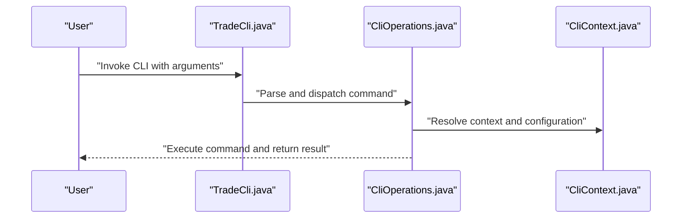

**Diagram sources**
- [TradeCli.java](file://cli/src/main/java/com/tradej/cli/TradeCli.java)
- [CliOperations.java](file://cli/src/main/java/com/tradej/cli/CliOperations.java)
- [CliContext.java](file://cli/src/main/java/com/tradej/cli/CliContext.java)

**Section sources**
- [TradeCli.java](file://cli/src/main/java/com/tradej/cli/TradeCli.java)
- [CliContext.java](file://cli/src/main/java/com/tradej/cli/CliContext.java)
- [CliOperations.java](file://cli/src/main/java/com/tradej/cli/CliOperations.java)

### Interactive Shell
The interactive shell provides a menu-driven interface with status reporting and navigation. It integrates with the CLI context to maintain state across commands and offers quick access to common workflows.

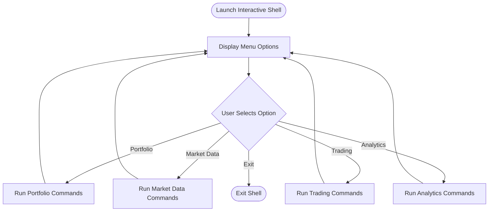

**Diagram sources**
- [InteractiveShell.java](file://cli/src/main/java/com/tradej/cli/interactive/InteractiveShell.java)

**Section sources**
- [InteractiveShell.java](file://cli/src/main/java/com/tradej/cli/interactive/InteractiveShell.java)

### Trading Commands
Trading commands enable order placement, modification, cancellation, and lifecycle monitoring. They integrate with broker adapters and gateway services for live order execution.

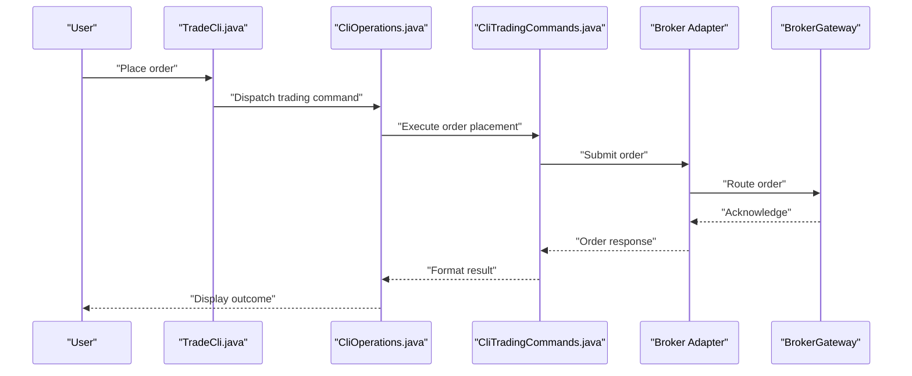

**Diagram sources**
- [CliTradingCommands.java](file://cli/src/main/java/com/tradej/cli/command/CliTradingCommands.java)
- [CliBrokerCommands.java](file://cli/src/main/java/com/tradej/cli/command/CliBrokerCommands.java)
- [CliBrokerGatewayCommands.java](file://cli/src/main/java/com/tradej/cli/command/CliBrokerGatewayCommands.java)

**Section sources**
- [CliTradingCommands.java](file://cli/src/main/java/com/tradej/cli/command/CliTradingCommands.java)
- [CliBrokerCommands.java](file://cli/src/main/java/com/tradej/cli/command/CliBrokerCommands.java)
- [CliBrokerGatewayCommands.java](file://cli/src/main/java/com/tradej/cli/command/CliBrokerGatewayCommands.java)

### Market Data Retrieval
Market data commands fetch real-time and historical market information, including quotes, depths, and OHLC bars. They leverage gateway connections and broker feeds.

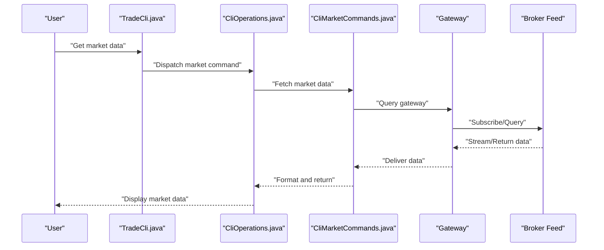

**Diagram sources**
- [CliMarketCommands.java](file://cli/src/main/java/com/tradej/cli/command/CliMarketCommands.java)
- [CliBrokerGatewayCommands.java](file://cli/src/main/java/com/tradej/cli/command/CliBrokerGatewayCommands.java)

**Section sources**
- [CliMarketCommands.java](file://cli/src/main/java/com/tradej/cli/command/CliMarketCommands.java)
- [CliBrokerGatewayCommands.java](file://cli/src/main/java/com/tradej/cli/command/CliBrokerGatewayCommands.java)

### Portfolio Management
Portfolio commands retrieve balances, holdings, positions, and PnL snapshots. They integrate with broker adapters and portfolio services.

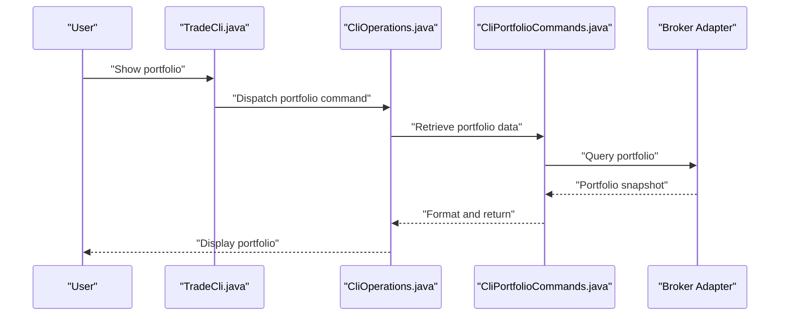

**Diagram sources**
- [CliPortfolioCommands.java](file://cli/src/main/java/com/tradej/cli/command/CliPortfolioCommands.java)
- [CliBrokerCommands.java](file://cli/src/main/java/com/tradej/cli/command/CliBrokerCommands.java)

**Section sources**
- [CliPortfolioCommands.java](file://cli/src/main/java/com/tradej/cli/command/CliPortfolioCommands.java)
- [CliBrokerCommands.java](file://cli/src/main/java/com/tradej/cli/command/CliBrokerCommands.java)

### Analytics Commands
Analytics commands query historical datasets and generate reports. They use analytics support utilities and data sources.

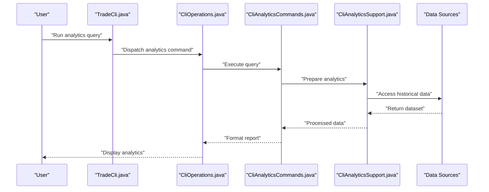

**Diagram sources**
- [CliAnalyticsCommands.java](file://cli/src/main/java/com/tradej/cli/command/CliAnalyticsCommands.java)
- [CliAnalyticsSupport.java](file://cli/src/main/java/com/tradej/cli/analytics/CliAnalyticsSupport.java)
- [CliDataSourcesCommand.java](file://cli/src/main/java/com/tradej/cli/command/CliDataSourcesCommand.java)

**Section sources**
- [CliAnalyticsCommands.java](file://cli/src/main/java/com/tradej/cli/command/CliAnalyticsCommands.java)
- [CliAnalyticsSupport.java](file://cli/src/main/java/com/tradej/cli/analytics/CliAnalyticsSupport.java)
- [CliDataSourcesCommand.java](file://cli/src/main/java/com/tradej/cli/command/CliDataSourcesCommand.java)

### Broker Integration and Real-Time Data
Broker commands manage connections, capabilities, and certifications. Attach commands facilitate real-time data streaming and subscription management.

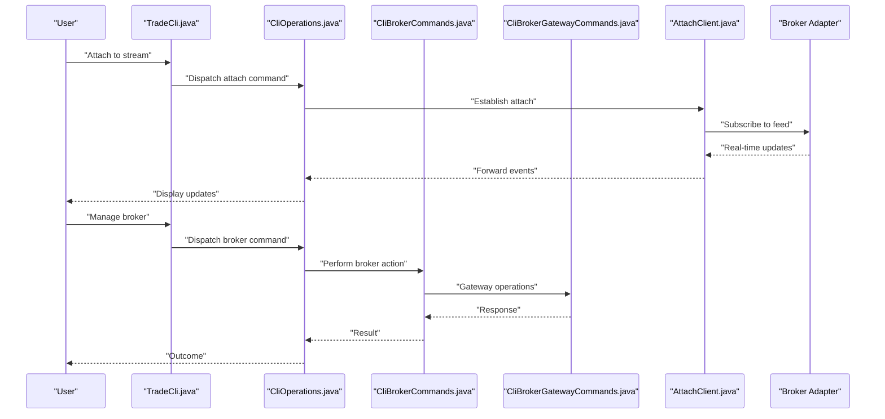

**Diagram sources**
- [CliBrokerCommands.java](file://cli/src/main/java/com/tradej/cli/command/CliBrokerCommands.java)
- [CliBrokerGatewayCommands.java](file://cli/src/main/java/com/tradej/cli/command/CliBrokerGatewayCommands.java)
- [CliAttachCommands.java](file://cli/src/main/java/com/tradej/cli/command/CliAttachCommands.java)
- [AttachClient.java](file://cli/src/main/java/com/tradej/cli/attach/AttachClient.java)

**Section sources**
- [CliBrokerCommands.java](file://cli/src/main/java/com/tradej/cli/command/CliBrokerCommands.java)
- [CliBrokerGatewayCommands.java](file://cli/src/main/java/com/tradej/cli/command/CliBrokerGatewayCommands.java)
- [CliAttachCommands.java](file://cli/src/main/java/com/tradej/cli/command/CliAttachCommands.java)
- [AttachClient.java](file://cli/src/main/java/com/tradej/cli/attach/AttachClient.java)

### Download and Replay Commands
Download commands fetch historical datasets for offline processing. Replay commands simulate past market conditions for testing strategies.

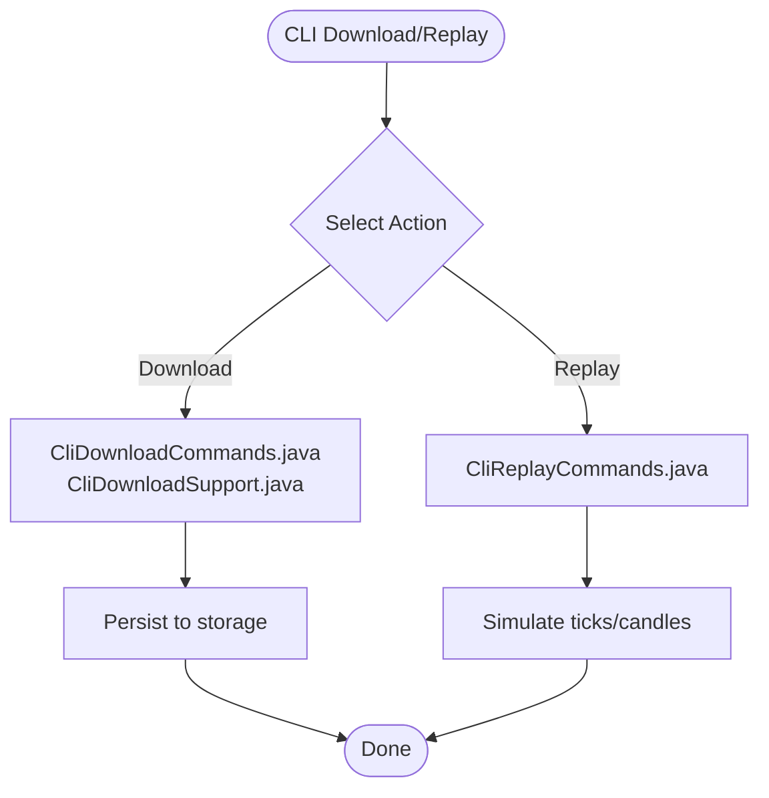

**Diagram sources**
- [CliDownloadCommands.java](file://cli/src/main/java/com/tradej/cli/command/CliDownloadCommands.java)
- [CliDownloadSupport.java](file://cli/src/main/java/com/tradej/cli/download/CliDownloadSupport.java)
- [CliReplayCommands.java](file://cli/src/main/java/com/tradej/cli/command/CliReplayCommands.java)

**Section sources**
- [CliDownloadCommands.java](file://cli/src/main/java/com/tradej/cli/command/CliDownloadCommands.java)
- [CliDownloadSupport.java](file://cli/src/main/java/com/tradej/cli/download/CliDownloadSupport.java)
- [CliReplayCommands.java](file://cli/src/main/java/com/tradej/cli/command/CliReplayCommands.java)

### Scanning and Screener Commands
Scan and screener commands identify instruments meeting specific criteria, supporting discovery and selection workflows.

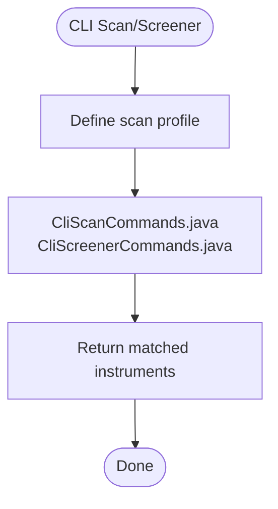

**Diagram sources**
- [CliScanCommands.java](file://cli/src/main/java/com/tradej/cli/command/CliScanCommands.java)
- [CliScreenerCommands.java](file://cli/src/main/java/com/tradej/cli/command/CliScreenerCommands.java)

**Section sources**
- [CliScanCommands.java](file://cli/src/main/java/com/tradej/cli/command/CliScanCommands.java)
- [CliScreenerCommands.java](file://cli/src/main/java/com/tradej/cli/command/CliScreenerCommands.java)

### Additional Commands and Utilities
Additional command categories include help, doctor diagnostics, readiness checks, coverage reports, regression tests, certifications, capabilities, modules, plugins, APIs, architecture review, flows, events, dashboards, indicators, compute tasks, maintenance, gateway management, data sources, documentation, and monitoring.

```mermaid
classDiagram
class CliHelpCommand
class CliDoctorCommand
class CliReadinessCommand
class CliCoverageCommand
class CliRegressionCommand
class CliCertifyCommand
class CliBrokerCertCommands
class CliCapabilitiesCommand
class CliModulesCommand
class CliPluginsCommand
class CliApiCommand
class CliArchitectureCommand
class CliFlowsCommand
class CliEventsCommand
class CliDashboardCommand
class CliIndicatorsCommand
class CliComputeCommand
class CliMaintenanceCommands
class CliGatewayCommands
class CliDataSourcesCommand
class CliDocsCommand
class CliMonitorCommand
class CliCommandSupport
```

**Diagram sources**
- [CliHelpCommand.java](file://cli/src/main/java/com/tradej/cli/command/CliHelpCommand.java)
- [CliDoctorCommand.java](file://cli/src/main/java/com/tradej/cli/command/CliDoctorCommand.java)
- [CliReadinessCommand.java](file://cli/src/main/java/com/tradej/cli/command/CliReadinessCommand.java)
- [CliCoverageCommand.java](file://cli/src/main/java/com/tradej/cli/command/CliCoverageCommand.java)
- [CliRegressionCommand.java](file://cli/src/main/java/com/tradej/cli/command/CliRegressionCommand.java)
- [CliCertifyCommand.java](file://cli/src/main/java/com/tradej/cli/command/CliCertifyCommand.java)
- [CliBrokerCertCommands.java](file://cli/src/main/java/com/tradej/cli/command/CliBrokerCertCommands.java)
- [CliCapabilitiesCommand.java](file://cli/src/main/java/com/tradej/cli/command/CliCapabilitiesCommand.java)
- [CliModulesCommand.java](file://cli/src/main/java/com/tradej/cli/command/CliModulesCommand.java)
- [CliPluginsCommand.java](file://cli/src/main/java/com/tradej/cli/command/CliPluginsCommand.java)
- [CliApiCommand.java](file://cli/src/main/java/com/tradej/cli/command/CliApiCommand.java)
- [CliArchitectureCommand.java](file://cli/src/main/java/com/tradej/cli/command/CliArchitectureCommand.java)
- [CliFlowsCommand.java](file://cli/src/main/java/com/tradej/cli/command/CliFlowsCommand.java)
- [CliEventsCommand.java](file://cli/src/main/java/com/tradej/cli/command/CliEventsCommand.java)
- [CliDashboardCommand.java](file://cli/src/main/java/com/tradej/cli/command/CliDashboardCommand.java)
- [CliIndicatorsCommand.java](file://cli/src/main/java/com/tradej/cli/command/CliIndicatorsCommand.java)
- [CliComputeCommand.java](file://cli/src/main/java/com/tradej/cli/command/CliComputeCommand.java)
- [CliMaintenanceCommands.java](file://cli/src/main/java/com/tradej/cli/command/CliMaintenanceCommands.java)
- [CliGatewayCommands.java](file://cli/src/main/java/com/tradej/cli/command/CliGatewayCommands.java)
- [CliDataSourcesCommand.java](file://cli/src/main/java/com/tradej/cli/command/CliDataSourcesCommand.java)
- [CliDocsCommand.java](file://cli/src/main/java/com/tradej/cli/command/CliDocsCommand.java)
- [CliMonitorCommand.java](file://cli/src/main/java/com/tradej/cli/command/CliMonitorCommand.java)
- [CliCommandSupport.java](file://cli/src/main/java/com/tradej/cli/command/CliCommandSupport.java)

**Section sources**
- [CliHelpCommand.java](file://cli/src/main/java/com/tradej/cli/command/CliHelpCommand.java)
- [CliDoctorCommand.java](file://cli/src/main/java/com/tradej/cli/command/CliDoctorCommand.java)
- [CliReadinessCommand.java](file://cli/src/main/java/com/tradej/cli/command/CliReadinessCommand.java)
- [CliCoverageCommand.java](file://cli/src/main/java/com/tradej/cli/command/CliCoverageCommand.java)
- [CliRegressionCommand.java](file://cli/src/main/java/com/tradej/cli/command/CliRegressionCommand.java)
- [CliCertifyCommand.java](file://cli/src/main/java/com/tradej/cli/command/CliCertifyCommand.java)
- [CliBrokerCertCommands.java](file://cli/src/main/java/com/tradej/cli/command/CliBrokerCertCommands.java)
- [CliCapabilitiesCommand.java](file://cli/src/main/java/com/tradej/cli/command/CliCapabilitiesCommand.java)
- [CliModulesCommand.java](file://cli/src/main/java/com/tradej/cli/command/CliModulesCommand.java)
- [CliPluginsCommand.java](file://cli/src/main/java/com/tradej/cli/command/CliPluginsCommand.java)
- [CliApiCommand.java](file://cli/src/main/java/com/tradej/cli/command/CliApiCommand.java)
- [CliArchitectureCommand.java](file://cli/src/main/java/com/tradej/cli/command/CliArchitectureCommand.java)
- [CliFlowsCommand.java](file://cli/src/main/java/com/tradej/cli/command/CliFlowsCommand.java)
- [CliEventsCommand.java](file://cli/src/main/java/com/tradej/cli/command/CliEventsCommand.java)
- [CliDashboardCommand.java](file://cli/src/main/java/com/tradej/cli/command/CliDashboardCommand.java)
- [CliIndicatorsCommand.java](file://cli/src/main/java/com/tradej/cli/command/CliIndicatorsCommand.java)
- [CliComputeCommand.java](file://cli/src/main/java/com/tradej/cli/command/CliComputeCommand.java)
- [CliMaintenanceCommands.java](file://cli/src/main/java/com/tradej/cli/command/CliMaintenanceCommands.java)
- [CliGatewayCommands.java](file://cli/src/main/java/com/tradej/cli/command/CliGatewayCommands.java)
- [CliDataSourcesCommand.java](file://cli/src/main/java/com/tradej/cli/command/CliDataSourcesCommand.java)
- [CliDocsCommand.java](file://cli/src/main/java/com/tradej/cli/command/CliDocsCommand.java)
- [CliMonitorCommand.java](file://cli/src/main/java/com/tradej/cli/command/CliMonitorCommand.java)
- [CliCommandSupport.java](file://cli/src/main/java/com/tradej/cli/command/CliCommandSupport.java)

## Dependency Analysis
The CLI module exhibits strong cohesion within functional domains and moderate coupling to shared context and operations. Dependencies primarily flow from command classes to support utilities and broker integrations.

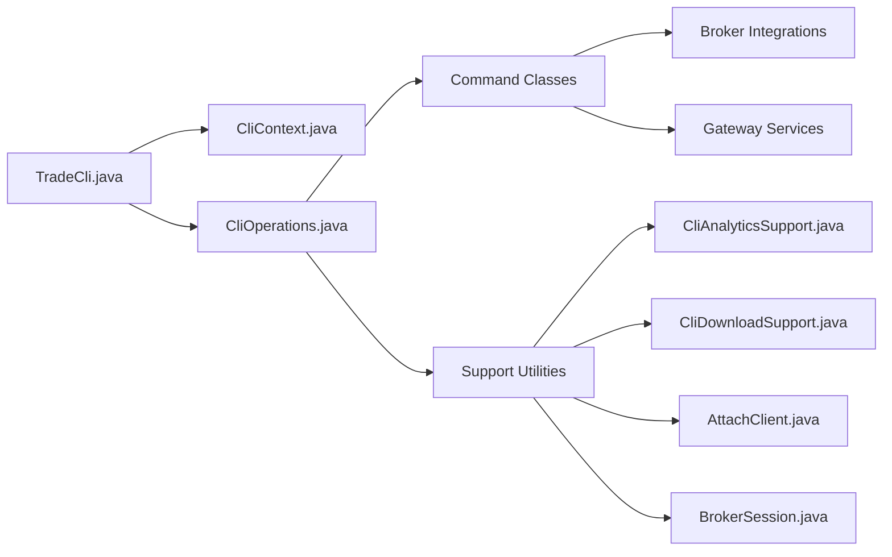

**Diagram sources**
- [TradeCli.java](file://cli/src/main/java/com/tradej/cli/TradeCli.java)
- [CliContext.java](file://cli/src/main/java/com/tradej/cli/CliContext.java)
- [CliOperations.java](file://cli/src/main/java/com/tradej/cli/CliOperations.java)
- [CliAnalyticsSupport.java](file://cli/src/main/java/com/tradej/cli/analytics/CliAnalyticsSupport.java)
- [CliDownloadSupport.java](file://cli/src/main/java/com/tradej/cli/download/CliDownloadSupport.java)
- [AttachClient.java](file://cli/src/main/java/com/tradej/cli/attach/AttachClient.java)
- [BrokerSession.java](file://cli/src/main/java/com/tradej/cli/standalone/BrokerSession.java)

**Section sources**
- [TradeCli.java](file://cli/src/main/java/com/tradej/cli/TradeCli.java)
- [CliContext.java](file://cli/src/main/java/com/tradej/cli/CliContext.java)
- [CliOperations.java](file://cli/src/main/java/com/tradej/cli/CliOperations.java)

## Performance Considerations
- Batch processing: Group related commands to minimize repeated context initialization.
- Streaming data: Use attach commands for continuous feeds to avoid polling overhead.
- Historical queries: Prefer range-limited requests and pagination to reduce payload sizes.
- Parallelism: Where safe, run independent scans or downloads concurrently.
- Output formatting: Defer heavy formatting until after data aggregation to improve throughput.

## Troubleshooting Guide
Common issues and resolutions:
- Authentication failures: Verify broker credentials and token lifecycles via doctor and readiness commands.
- Connectivity problems: Use monitor and gateway commands to inspect connection health.
- Data gaps: Confirm historical downloads and replay sessions; re-run downloads if necessary.
- Command errors: Review command-specific help and logs; use doctor diagnostics for deeper insights.

**Section sources**
- [CliDoctorCommand.java](file://cli/src/main/java/com/tradej/cli/command/CliDoctorCommand.java)
- [CliReadinessCommand.java](file://cli/src/main/java/com/tradej/cli/command/CliReadinessCommand.java)
- [CliMonitorCommand.java](file://cli/src/main/java/com/tradej/cli/command/CliMonitorCommand.java)
- [CliHelpCommand.java](file://cli/src/main/java/com/tradej/cli/command/CliHelpCommand.java)

## Conclusion
The TradeJ CLI provides a robust, extensible foundation for trading operations, market data access, portfolio management, analytics, and brokerage integration. Its modular design supports both interactive workflows and automated scripting, while built-in diagnostics and monitoring aid operational reliability.

## Appendices

### Practical CLI Usage Examples
- Interactive shell: Launch the shell and navigate menus for quick access to trading, market data, and portfolio commands.
- Batch processing: Chain commands in scripts to automate order placement, portfolio snapshots, and analytics queries.
- Automation: Schedule recurring tasks using cron or task schedulers to execute download, replay, and reporting commands.

### Configuration Management
- Runtime configuration: Adjust profiles and settings via YAML configuration files and environment-specific overrides.
- Local stores: Use alias, macro, and saved query stores to persist frequently used command templates.

**Section sources**
- [application.yml](file://app/src/main/resources/application.yml)
- [CONFIG.md](file://CONFIG.md)

### Extending CLI Functionality
- Add new command classes under the command package, implementing the required interfaces.
- Register commands in the operations dispatcher and wire to context services.
- Provide help and validation through dedicated support utilities.
- Integrate with broker adapters and gateway services for live data and order execution.

**Section sources**
- [CliCommandSupport.java](file://cli/src/main/java/com/tradej/cli/command/CliCommandSupport.java)
- [CliBrokerCommands.java](file://cli/src/main/java/com/tradej/cli/command/CliBrokerCommands.java)
- [CliBrokerGatewayCommands.java](file://cli/src/main/java/com/tradej/cli/command/CliBrokerGatewayCommands.java)

### Broker Adapter Integration
- Standalone sessions: Use broker session factories to establish and manage broker connections.
- Real-time data: Employ attach clients for subscribing to market streams and receiving updates.
- Historical data: Utilize download and replay commands to ingest and simulate historical datasets.

**Section sources**
- [BrokerSession.java](file://cli/src/main/java/com/tradej/cli/standalone/BrokerSession.java)
- [IciciBrokerSession.java](file://cli/src/main/java/com/tradej/cli/standalone/IciciBrokerSession.java)
- [UpstoxBrokerSession.java](file://cli/src/main/java/com/tradej/cli/standalone/UpstoxBrokerSession.java)
- [DhanBrokerSession.java](file://cli/src/main/java/com/tradej/cli/standalone/DhanBrokerSession.java)
- [AttachClient.java](file://cli/src/main/java/com/tradej/cli/attach/AttachClient.java)
- [CliDownloadCommands.java](file://cli/src/main/java/com/tradej/cli/command/CliDownloadCommands.java)
- [CliReplayCommands.java](file://cli/src/main/java/com/tradej/cli/command/CliReplayCommands.java)

### Reference Materials
- CLI overview and usage guide: See the project's CLI documentation for high-level guidance.
- Architecture flows: Consult the architecture flows report for system-wide context.

**Section sources**
- [CLI.md](file://CLI.md)
- [TRADEJ_ARCHITECTURE_CLASS_FLOWS_REPORT.md](file://TRADEJ_ARCHITECTURE_CLASS_FLOWS_REPORT.md)