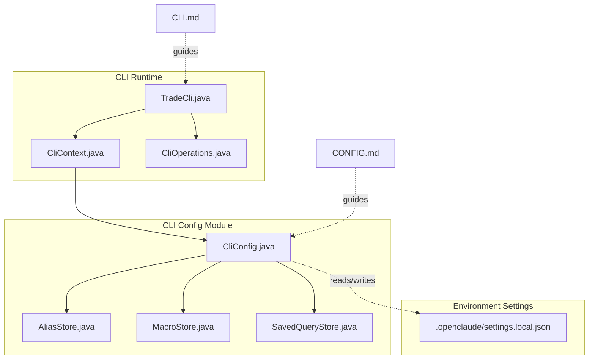
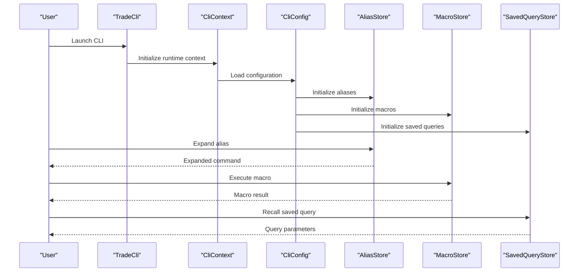
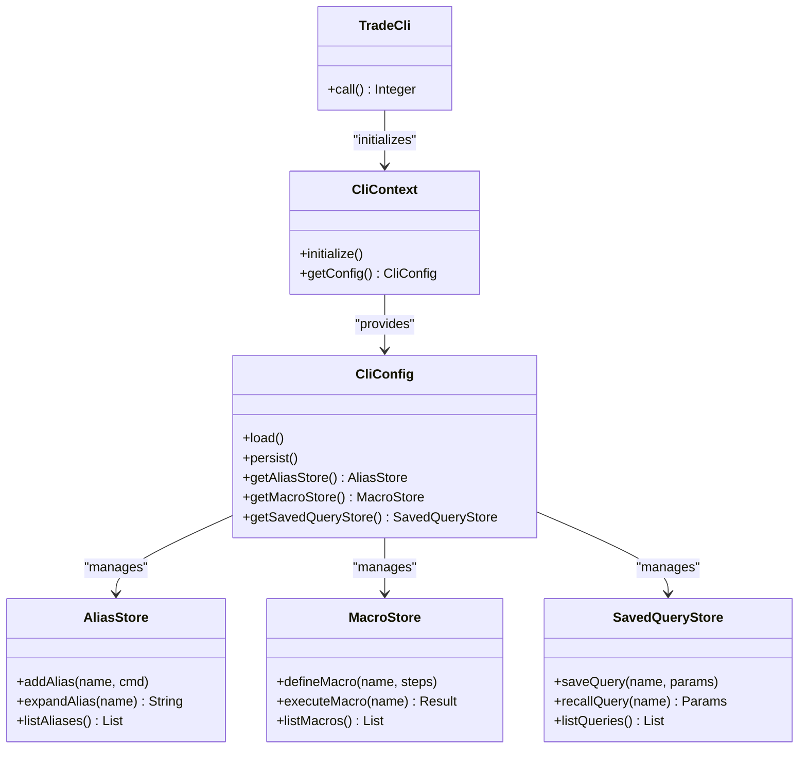
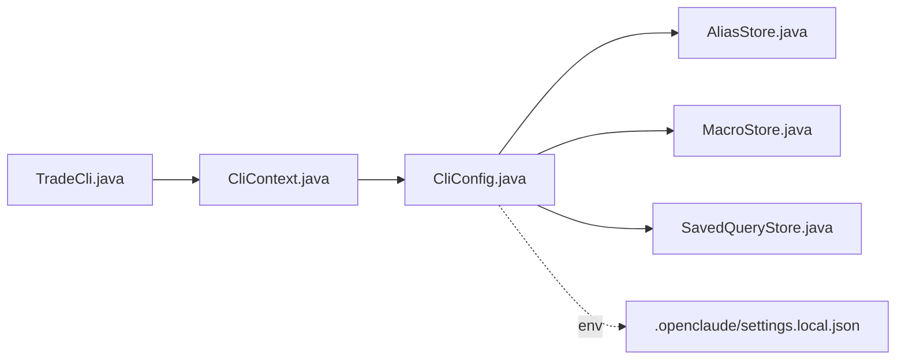

# Configuration Management

<cite>
**Referenced Files in This Document**
- [CliConfig.java](file://cli/src/main/java/com/tradej/cli/config/CliConfig.java)
- [AliasStore.java](file://cli/src/main/java/com/tradej/cli/config/AliasStore.java)
- [MacroStore.java](file://cli/src/main/java/com/tradej/cli/config/MacroStore.java)
- [SavedQueryStore.java](file://cli/src/main/java/com/tradej/cli/config/SavedQueryStore.java)
- [TradeCli.java](file://cli/src/main/java/com/tradej/cli/TradeCli.java)
- [CliContext.java](file://cli/src/main/java/com/tradej/cli/CliContext.java)
- [CliOperations.java](file://cli/src/main/java/com/tradej/cli/CliOperations.java)
- [settings.local.json](file://.openclaude/settings.local.json)
- [CONFIG.md](file://CONFIG.md)
- [CLI.md](file://CLI.md)
</cite>

## Table of Contents
1. [Introduction](#introduction)
2. [Project Structure](#project-structure)
3. [Core Components](#core-components)
4. [Architecture Overview](#architecture-overview)
5. [Detailed Component Analysis](#detailed-component-analysis)
6. [Dependency Analysis](#dependency-analysis)
7. [Performance Considerations](#performance-considerations)
8. [Troubleshooting Guide](#troubleshooting-guide)
9. [Conclusion](#conclusion)
10. [Appendices](#appendices)

## Introduction
This document explains the CLI configuration management system in the Trade-J project. It focuses on how user preferences and settings are stored and managed, including:
- CliConfig: central configuration holder
- AliasStore: command shortcuts
- MacroStore: reusable command sequences
- SavedQueryStore: frequently used queries

It also documents configuration file formats, storage mechanisms, environment-specific settings, and practical workflows for setting up aliases, creating macros, and managing saved queries. Finally, it outlines the configuration lifecycle, import/export considerations, backup procedures, customization guidelines, and optimization tips for efficient CLI usage.

## Project Structure
The CLI configuration subsystem resides under the CLI module and integrates with the broader CLI runtime. Key files include:
- Configuration stores: CliConfig, AliasStore, MacroStore, SavedQueryStore
- CLI bootstrap and runtime: TradeCli, CliContext, CliOperations
- Environment-specific settings: .openclaude/settings.local.json
- Project documentation: CONFIG.md, CLI.md

**Diagram sources**
- [CliConfig.java](file://cli/src/main/java/com/tradej/cli/config/CliConfig.java)
- [AliasStore.java](file://cli/src/main/java/com/tradej/cli/config/AliasStore.java)
- [MacroStore.java](file://cli/src/main/java/com/tradej/cli/config/MacroStore.java)
- [SavedQueryStore.java](file://cli/src/main/java/com/tradej/cli/config/SavedQueryStore.java)
- [TradeCli.java](file://cli/src/main/java/com/tradej/cli/TradeCli.java)
- [CliContext.java](file://cli/src/main/java/com/tradej/cli/CliContext.java)
- [CliOperations.java](file://cli/src/main/java/com/tradej/cli/CliOperations.java)
- [settings.local.json](file://.openclaude/settings.local.json)
- [CONFIG.md](file://CONFIG.md)
- [CLI.md](file://CLI.md)

**Section sources**
- [CliConfig.java](file://cli/src/main/java/com/tradej/cli/config/CliConfig.java)
- [AliasStore.java](file://cli/src/main/java/com/tradej/cli/config/AliasStore.java)
- [MacroStore.java](file://cli/src/main/java/com/tradej/cli/config/MacroStore.java)
- [SavedQueryStore.java](file://cli/src/main/java/com/tradej/cli/config/SavedQueryStore.java)
- [TradeCli.java](file://cli/src/main/java/com/tradej/cli/TradeCli.java)
- [CliContext.java](file://cli/src/main/java/com/tradej/cli/CliContext.java)
- [CliOperations.java](file://cli/src/main/java/com/tradej/cli/CliOperations.java)
- [settings.local.json](file://.openclaude/settings.local.json)
- [CONFIG.md](file://CONFIG.md)
- [CLI.md](file://CLI.md)

## Core Components
This section introduces the core configuration components and their roles.

- CliConfig
  - Central configuration holder that orchestrates alias, macro, and saved query stores.
  - Manages persistence and retrieval of user preferences and settings.
  - Integrates with environment-specific settings via the local settings file.

- AliasStore
  - Stores command shortcuts (aliases) for frequently used commands.
  - Provides lookup and expansion of aliases to full command invocations.

- MacroStore
  - Stores reusable command sequences (macros) that can be executed as a single action.
  - Supports structured definition and execution of multi-step workflows.

- SavedQueryStore
  - Stores frequently used queries (e.g., market data filters, scans).
  - Enables quick recall and reuse of complex query configurations.

**Section sources**
- [CliConfig.java](file://cli/src/main/java/com/tradej/cli/config/CliConfig.java)
- [AliasStore.java](file://cli/src/main/java/com/tradej/cli/config/AliasStore.java)
- [MacroStore.java](file://cli/src/main/java/com/tradej/cli/config/MacroStore.java)
- [SavedQueryStore.java](file://cli/src/main/java/com/tradej/cli/config/SavedQueryStore.java)

## Architecture Overview
The CLI configuration architecture ties together the runtime, configuration stores, and environment settings. The CLI bootstrap initializes the runtime context, which loads configuration and exposes stores for aliases, macros, and saved queries.

**Diagram sources**
- [TradeCli.java](file://cli/src/main/java/com/tradej/cli/TradeCli.java)
- [CliContext.java](file://cli/src/main/java/com/tradej/cli/CliContext.java)
- [CliConfig.java](file://cli/src/main/java/com/tradej/cli/config/CliConfig.java)
- [AliasStore.java](file://cli/src/main/java/com/tradej/cli/config/AliasStore.java)
- [MacroStore.java](file://cli/src/main/java/com/tradej/cli/config/MacroStore.java)
- [SavedQueryStore.java](file://cli/src/main/java/com/tradej/cli/config/SavedQueryStore.java)

## Detailed Component Analysis

### CliConfig
CliConfig is the central configuration manager. It coordinates loading, persisting, and exposing settings across the CLI runtime. It interacts with:
- AliasStore for command shortcuts
- MacroStore for reusable sequences
- SavedQueryStore for frequently used queries
- Environment-specific settings via the local settings file

Key responsibilities:
- Load configuration at startup
- Persist updates to stores
- Expose configuration to runtime components
- Manage environment-specific overrides

Operational flow:
- On initialization, CliConfig reads the environment settings file and applies defaults.
- It initializes the three stores and wires them to the runtime context.
- It handles updates and ensures consistency across stores.

**Section sources**
- [CliConfig.java](file://cli/src/main/java/com/tradej/cli/config/CliConfig.java)

### AliasStore
AliasStore manages command shortcuts. Users define aliases for long or frequently used commands. The store supports:
- Adding and removing aliases
- Expanding aliases to full command strings
- Listing configured aliases
- Persisting alias definitions

Typical usage pattern:
- Define an alias for a common command
- Invoke the alias to expand to the full command
- Remove or update aliases as workflows evolve

**Section sources**
- [AliasStore.java](file://cli/src/main/java/com/tradej/cli/config/AliasStore.java)

### MacroStore
MacroStore manages reusable command sequences. Macros enable multi-step workflows to be executed as a single action. The store supports:
- Defining macros from command sequences
- Executing macros
- Listing and editing existing macros
- Persisting macro definitions

Typical usage pattern:
- Record a sequence of commands as a macro
- Execute the macro to run the sequence
- Refine or remove macros based on feedback

**Section sources**
- [MacroStore.java](file://cli/src/main/java/com/tradej/cli/config/MacroStore.java)

### SavedQueryStore
SavedQueryStore manages frequently used queries. These are complex query configurations (e.g., market scans, filters) that benefit from being saved and reused. The store supports:
- Saving queries with descriptive names
- Loading and applying saved queries
- Editing and deleting saved queries
- Persisting query definitions

Typical usage pattern:
- Build a complex query once
- Save it for later reuse
- Apply saved queries to quickly reproduce results

**Section sources**
- [SavedQueryStore.java](file://cli/src/main/java/com/tradej/cli/config/SavedQueryStore.java)

### Environment-Specific Settings
Environment-specific settings are loaded from a local settings file. This enables per-environment overrides and secrets management without hardcoding values in the application.

- Location: .openclaude/settings.local.json
- Purpose: Override defaults and inject environment-specific values
- Scope: Applied during configuration load to influence runtime behavior

**Section sources**
- [settings.local.json](file://.openclaude/settings.local.json)

### CLI Runtime Integration
The CLI runtime integrates configuration stores through:
- TradeCli: Entry point that launches the CLI and initializes the runtime
- CliContext: Runtime context that holds configuration and exposes stores
- CliOperations: Operations layer that uses stores to fulfill user requests

**Diagram sources**
- [TradeCli.java](file://cli/src/main/java/com/tradej/cli/TradeCli.java)
- [CliContext.java](file://cli/src/main/java/com/tradej/cli/CliContext.java)
- [CliConfig.java](file://cli/src/main/java/com/tradej/cli/config/CliConfig.java)
- [AliasStore.java](file://cli/src/main/java/com/tradej/cli/config/AliasStore.java)
- [MacroStore.java](file://cli/src/main/java/com/tradej/cli/config/MacroStore.java)
- [SavedQueryStore.java](file://cli/src/main/java/com/tradej/cli/config/SavedQueryStore.java)

**Section sources**
- [TradeCli.java](file://cli/src/main/java/com/tradej/cli/TradeCli.java)
- [CliContext.java](file://cli/src/main/java/com/tradej/cli/CliContext.java)
- [CliOperations.java](file://cli/src/main/java/com/tradej/cli/CliOperations.java)

## Dependency Analysis
The configuration system exhibits low coupling and high cohesion among stores, with CliConfig acting as the central coordinator. Dependencies:
- CliConfig depends on AliasStore, MacroStore, and SavedQueryStore
- Runtime components depend on CliConfig for configuration access
- Environment settings influence configuration loading but remain separate concerns

**Diagram sources**
- [TradeCli.java](file://cli/src/main/java/com/tradej/cli/TradeCli.java)
- [CliContext.java](file://cli/src/main/java/com/tradej/cli/CliContext.java)
- [CliConfig.java](file://cli/src/main/java/com/tradej/cli/config/CliConfig.java)
- [AliasStore.java](file://cli/src/main/java/com/tradej/cli/config/AliasStore.java)
- [MacroStore.java](file://cli/src/main/java/com/tradej/cli/config/MacroStore.java)
- [SavedQueryStore.java](file://cli/src/main/java/com/tradej/cli/config/SavedQueryStore.java)
- [settings.local.json](file://.openclaude/settings.local.json)

**Section sources**
- [CliConfig.java](file://cli/src/main/java/com/tradej/cli/config/CliConfig.java)
- [AliasStore.java](file://cli/src/main/java/com/tradej/cli/config/AliasStore.java)
- [MacroStore.java](file://cli/src/main/java/com/tradej/cli/config/MacroStore.java)
- [SavedQueryStore.java](file://cli/src/main/java/com/tradej/cli/config/SavedQueryStore.java)
- [TradeCli.java](file://cli/src/main/java/com/tradej/cli/TradeCli.java)
- [CliContext.java](file://cli/src/main/java/com/tradej/cli/CliContext.java)
- [settings.local.json](file://.openclaude/settings.local.json)

## Performance Considerations
- Minimize repeated disk I/O by caching configuration in memory after initial load
- Batch writes when persisting configuration updates to reduce overhead
- Keep alias and macro definitions concise to avoid excessive parsing costs
- Use lazy initialization for stores to defer expensive operations until needed
- Avoid deep nesting in macros to keep execution predictable and fast

## Troubleshooting Guide
Common issues and resolutions:
- Configuration not loading
  - Verify environment settings file exists and is readable
  - Check for syntax errors in the settings file
  - Confirm default values are applied when settings are missing

- Aliases not expanding
  - Ensure the alias name is correctly registered
  - Check for typos in the alias invocation
  - Confirm the alias store is initialized and persisted

- Macros failing to execute
  - Validate macro steps are well-formed
  - Check permissions and prerequisites for each step
  - Review macro store logs for errors

- Saved queries not recalled
  - Confirm the query name exists and is spelled correctly
  - Verify query parameters are compatible with current runtime
  - Re-save the query if parameters changed

- Import/export and backup
  - Export configuration by serializing stores to a portable format
  - Backup configuration files regularly
  - Restore by reapplying exported data to the stores

**Section sources**
- [CliConfig.java](file://cli/src/main/java/com/tradej/cli/config/CliConfig.java)
- [AliasStore.java](file://cli/src/main/java/com/tradej/cli/config/AliasStore.java)
- [MacroStore.java](file://cli/src/main/java/com/tradej/cli/config/MacroStore.java)
- [SavedQueryStore.java](file://cli/src/main/java/com/tradej/cli/config/SavedQueryStore.java)
- [settings.local.json](file://.openclaude/settings.local.json)

## Conclusion
The CLI configuration management system provides a robust foundation for storing user preferences, shortcuts, reusable workflows, and frequently used queries. By leveraging CliConfig as the central coordinator and integrating environment-specific settings, users can tailor the CLI to their workflows while maintaining portability and reliability. Following the guidelines in this document will help streamline setup, optimize performance, and ensure smooth operation across environments.

## Appendices

### Configuration File Formats
- Environment settings: JSON-based file for environment-specific overrides
- Stores: Serialized representations of aliases, macros, and saved queries
- Defaults: Embedded defaults applied when settings are missing

**Section sources**
- [settings.local.json](file://.openclaude/settings.local.json)
- [CliConfig.java](file://cli/src/main/java/com/tradej/cli/config/CliConfig.java)

### Setting Up Aliases
- Define an alias for a commonly used command
- Use the alias to expand to the full command
- Periodically review and prune unused aliases

**Section sources**
- [AliasStore.java](file://cli/src/main/java/com/tradej/cli/config/AliasStore.java)

### Creating Macros
- Record a sequence of commands as a macro
- Execute the macro to run the sequence
- Refine or remove macros based on feedback

**Section sources**
- [MacroStore.java](file://cli/src/main/java/com/tradej/cli/config/MacroStore.java)

### Managing Saved Queries
- Save complex queries with descriptive names
- Apply saved queries to quickly reproduce results
- Update queries when underlying parameters change

**Section sources**
- [SavedQueryStore.java](file://cli/src/main/java/com/tradej/cli/config/SavedQueryStore.java)

### Configuration Lifecycle
- Initialization: Load environment settings and initialize stores
- Runtime: Read/write configuration as needed
- Persistence: Save updates to stores
- Cleanup: Gracefully shut down and flush pending writes

**Section sources**
- [CliConfig.java](file://cli/src/main/java/com/tradej/cli/config/CliConfig.java)
- [TradeCli.java](file://cli/src/main/java/com/tradej/cli/TradeCli.java)
- [CliContext.java](file://cli/src/main/java/com/tradej/cli/CliContext.java)

### Import/Export and Backup Procedures
- Export: Serialize stores to a portable format
- Import: Rehydrate stores from exported data
- Backup: Regularly snapshot configuration files and stores
- Restore: Apply backups to return to a known good state

**Section sources**
- [CliConfig.java](file://cli/src/main/java/com/tradej/cli/config/CliConfig.java)
- [AliasStore.java](file://cli/src/main/java/com/tradej/cli/config/AliasStore.java)
- [MacroStore.java](file://cli/src/main/java/com/tradej/cli/config/MacroStore.java)
- [SavedQueryStore.java](file://cli/src/main/java/com/tradej/cli/config/SavedQueryStore.java)

### Customizing the CLI Environment
- Use environment-specific settings to override defaults
- Adjust runtime behavior through configuration
- Integrate with external tools and credentials via environment settings

**Section sources**
- [settings.local.json](file://.openclaude/settings.local.json)
- [CliConfig.java](file://cli/src/main/java/com/tradej/cli/config/CliConfig.java)

### Workflow Efficiency Guidelines
- Prefer aliases for repetitive tasks
- Encapsulate complex sequences in macros
- Reuse saved queries to accelerate analysis
- Keep configuration organized and documented
- Automate repetitive configuration tasks where possible

**Section sources**
- [AliasStore.java](file://cli/src/main/java/com/tradej/cli/config/AliasStore.java)
- [MacroStore.java](file://cli/src/main/java/com/tradej/cli/config/MacroStore.java)
- [SavedQueryStore.java](file://cli/src/main/java/com/tradej/cli/config/SavedQueryStore.java)
- [CONFIG.md](file://CONFIG.md)
- [CLI.md](file://CLI.md)