# Interactive Shell

<cite>
**Referenced Files in This Document**
- [InteractiveShell.java](file://cli/src/main/java/com/tradej/cli/interactive/InteractiveShell.java)
- [MenuContext.java](file://cli/src/main/java/com/tradej/cli/interactive/MenuContext.java)
- [StatusBar.java](file://cli/src/main/java/com/tradej/cli/interactive/StatusBar.java)
- [CommandSuggester.java](file://cli/src/main/java/com/tradej/cli/output/CommandSuggester.java)
- [Ansi.java](file://cli/src/main/java/com/tradej/cli/output/Ansi.java)
- [AliasStore.java](file://cli/src/main/java/com/tradej/cli/config/AliasStore.java)
- [MacroStore.java](file://cli/src/main/java/com/tradej/cli/config/MacroStore.java)
- [SavedQueryStore.java](file://cli/src/main/java/com/tradej/cli/config/SavedQueryStore.java)
- [TradeCli.java](file://cli/src/main/java/com/tradej/cli/TradeCli.java)
</cite>

## Table of Contents
1. [Introduction](#introduction)
2. [Project Structure](#project-structure)
3. [Core Components](#core-components)
4. [Architecture Overview](#architecture-overview)
5. [Detailed Component Analysis](#detailed-component-analysis)
6. [Dependency Analysis](#dependency-analysis)
7. [Performance Considerations](#performance-considerations)
8. [Troubleshooting Guide](#troubleshooting-guide)
9. [Conclusion](#conclusion)
10. [Appendices](#appendices)

## Introduction
This document explains the interactive shell functionality of the CLI, focusing on the InteractiveShell implementation, menu navigation system, and user interface components. It documents the MenuContext for managing shell state, StatusBar for displaying system status, and persistent command history. It also covers interactive mode features such as auto-completion, help system, aliases, macros, saved queries, command execution, real-time feedback, and error handling. Practical usage examples, navigation patterns, and guidance for extending the shell with new features are included.

## Project Structure
The interactive shell resides in the CLI module under the interactive package. It integrates with the broader command framework powered by picocli and JLine, and leverages configuration stores for aliases, macros, and saved queries. The TradeCli root command wires the interactive mode into the overall CLI.

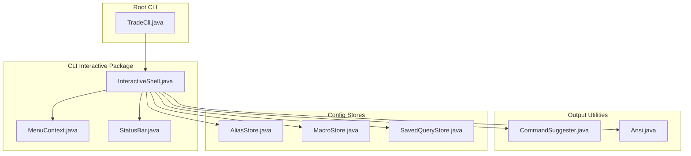

**Diagram sources**
- [InteractiveShell.java:1-338](file://cli/src/main/java/com/tradej/cli/interactive/InteractiveShell.java#L1-L338)
- [MenuContext.java:1-47](file://cli/src/main/java/com/tradej/cli/interactive/MenuContext.java#L1-L47)
- [StatusBar.java:1-74](file://cli/src/main/java/com/tradej/cli/interactive/StatusBar.java#L1-L74)
- [CommandSuggester.java:1-90](file://cli/src/main/java/com/tradej/cli/output/CommandSuggester.java#L1-L90)
- [Ansi.java:1-152](file://cli/src/main/java/com/tradej/cli/output/Ansi.java#L1-L152)
- [AliasStore.java:1-131](file://cli/src/main/java/com/tradej/cli/config/AliasStore.java#L1-L131)
- [MacroStore.java:1-102](file://cli/src/main/java/com/tradej/cli/config/MacroStore.java#L1-L102)
- [SavedQueryStore.java:1-95](file://cli/src/main/java/com/tradej/cli/config/SavedQueryStore.java#L1-L95)
- [TradeCli.java:127-192](file://cli/src/main/java/com/tradej/cli/TradeCli.java#L127-L192)

**Section sources**
- [TradeCli.java:127-192](file://cli/src/main/java/com/tradej/cli/TradeCli.java#L127-L192)
- [InteractiveShell.java:49-185](file://cli/src/main/java/com/tradej/cli/interactive/InteractiveShell.java#L49-L185)

## Core Components
- InteractiveShell: REPL engine integrating JLine and picocli, with persistent history, tab completion, built-in commands, and alias/macro/query management.
- MenuContext: Provides access to CLI context, operations, and LineReader for interactive prompts and headers.
- StatusBar: Renders dynamic status information (broker/profile/attach state/time) for the terminal.
- CommandSuggester: Generates helpful suggestions for typos using edit distance.
- Ansi: Utility for colorized terminal output with automatic detection of color support.
- AliasStore: Persistent alias store for command shortcuts.
- MacroStore: Persistent macro store for multi-command sequences.
- SavedQueryStore: Persistent store for saved SQL queries.

**Section sources**
- [InteractiveShell.java:49-185](file://cli/src/main/java/com/tradej/cli/interactive/InteractiveShell.java#L49-L185)
- [MenuContext.java:8-47](file://cli/src/main/java/com/tradej/cli/interactive/MenuContext.java#L8-L47)
- [StatusBar.java:20-74](file://cli/src/main/java/com/tradej/cli/interactive/StatusBar.java#L20-L74)
- [CommandSuggester.java:19-90](file://cli/src/main/java/com/tradej/cli/output/CommandSuggester.java#L19-L90)
- [Ansi.java:9-152](file://cli/src/main/java/com/tradej/cli/output/Ansi.java#L9-L152)
- [AliasStore.java:32-131](file://cli/src/main/java/com/tradej/cli/config/AliasStore.java#L32-L131)
- [MacroStore.java:32-102](file://cli/src/main/java/com/tradej/cli/config/MacroStore.java#L32-L102)
- [SavedQueryStore.java:28-95](file://cli/src/main/java/com/tradej/cli/config/SavedQueryStore.java#L28-L95)

## Architecture Overview
The interactive shell builds a JLine terminal, registers picocli commands, and runs a REPL loop. It handles built-in commands (exit/clear), alias expansion, macro execution, and persistent history. Errors are handled via a dedicated exception handler that also suggests corrections using CommandSuggester.

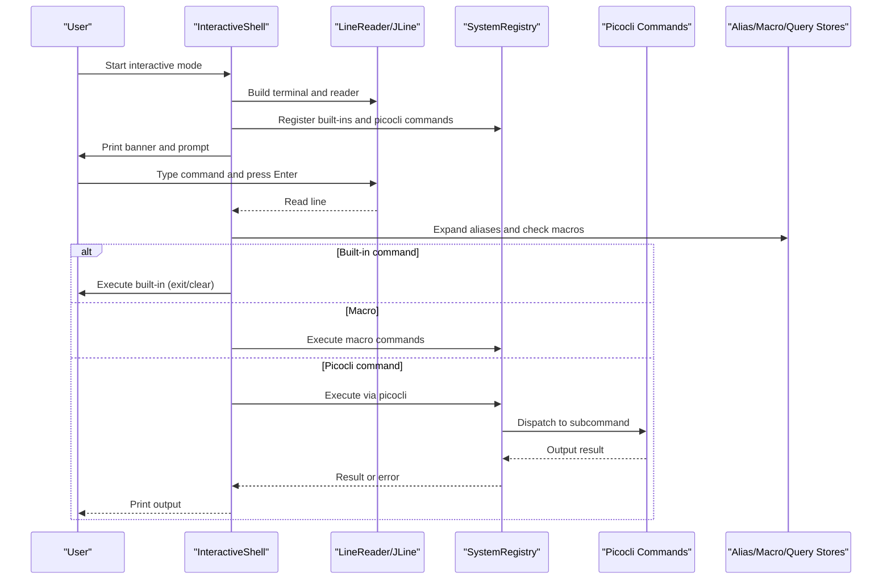

**Diagram sources**
- [InteractiveShell.java:69-185](file://cli/src/main/java/com/tradej/cli/interactive/InteractiveShell.java#L69-L185)
- [CommandSuggester.java:57-67](file://cli/src/main/java/com/tradej/cli/output/CommandSuggester.java#L57-L67)

**Section sources**
- [InteractiveShell.java:69-185](file://cli/src/main/java/com/tradej/cli/interactive/InteractiveShell.java#L69-L185)

## Detailed Component Analysis

### InteractiveShell
InteractiveShell orchestrates the REPL loop, terminal setup, command parsing, and execution. It integrates:
- Terminal and LineReader for input and output
- JLine completer and parser for tab completion and history
- SystemRegistry for built-in commands (help, clear, exit)
- Picocli CommandLine for dispatching commands
- Persistent history file in ~/.tradej/history
- Built-in commands: exit/quit, clear, alias, macro, query
- Exception handling with suggestion fallback

Key behaviors:
- Detects dumb terminals and exits gracefully with guidance
- Prints a welcome banner with status header and hints
- Supports alias expansion before execution
- Executes macros by expanding a macro name into a sequence of commands
- Persists command history to disk
- Uses ReplExceptionHandler to provide friendly error messages and suggestions

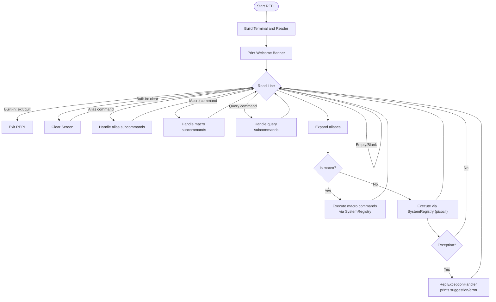

**Diagram sources**
- [InteractiveShell.java:69-185](file://cli/src/main/java/com/tradej/cli/interactive/InteractiveShell.java#L69-L185)

**Section sources**
- [InteractiveShell.java:49-185](file://cli/src/main/java/com/tradej/cli/interactive/InteractiveShell.java#L49-L185)
- [InteractiveShell.java:207-215](file://cli/src/main/java/com/tradej/cli/interactive/InteractiveShell.java#L207-L215)

### MenuContext
MenuContext encapsulates the interactive context for prompts and headers:
- Holds references to CliContext, CliOperations, and LineReader
- Provides prompt() to read user input with defaults
- Provides headerLine() to render a contextual header line

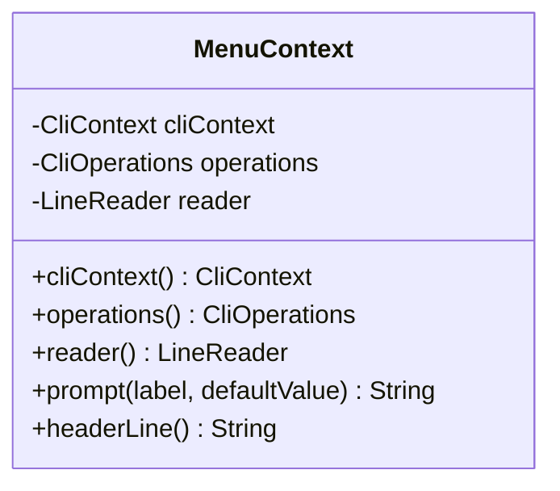

**Diagram sources**
- [MenuContext.java:8-47](file://cli/src/main/java/com/tradej/cli/interactive/MenuContext.java#L8-L47)

**Section sources**
- [MenuContext.java:8-47](file://cli/src/main/java/com/tradej/cli/interactive/MenuContext.java#L8-L47)

### StatusBar
StatusBar renders dynamic status information:
- Broker type and profile
- Attach reachability indicator
- Current time
- Two rendering modes: compact header and inline status

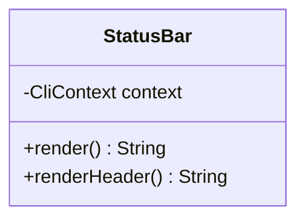

**Diagram sources**
- [StatusBar.java:20-74](file://cli/src/main/java/com/tradej/cli/interactive/StatusBar.java#L20-L74)

**Section sources**
- [StatusBar.java:20-74](file://cli/src/main/java/com/tradej/cli/interactive/StatusBar.java#L20-L74)

### CommandSuggester
CommandSuggester computes suggestions for unknown commands using Levenshtein edit distance and pattern matching. It formats a friendly “Did you mean?” message.

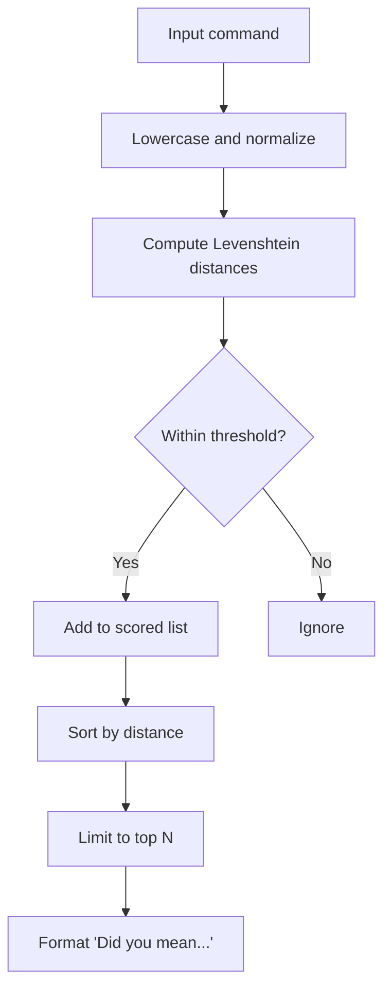

**Diagram sources**
- [CommandSuggester.java:33-67](file://cli/src/main/java/com/tradej/cli/output/CommandSuggester.java#L33-L67)

**Section sources**
- [CommandSuggester.java:19-90](file://cli/src/main/java/com/tradej/cli/output/CommandSuggester.java#L19-L90)

### ANSI Utilities
Ansi provides colorized output and semantic formatters. It automatically disables colors when output is piped or redirected and respects NO_COLOR.

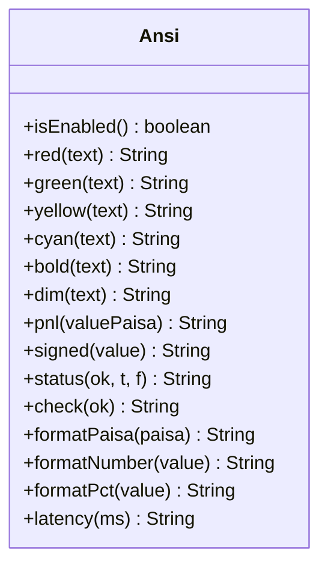

**Diagram sources**
- [Ansi.java:9-152](file://cli/src/main/java/com/tradej/cli/output/Ansi.java#L9-L152)

**Section sources**
- [Ansi.java:9-152](file://cli/src/main/java/com/tradej/cli/output/Ansi.java#L9-L152)

### AliasStore
AliasStore persists aliases to ~/.tradej/aliases.properties and supports add/remove/list operations. It expands the first token of a command line.

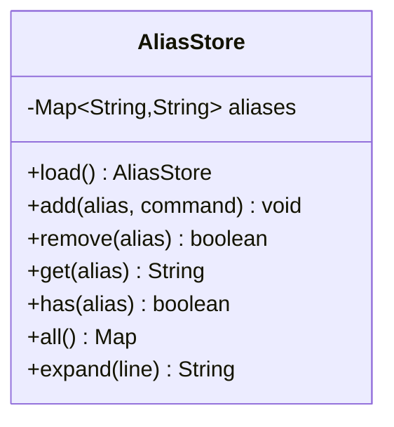

**Diagram sources**
- [AliasStore.java:32-131](file://cli/src/main/java/com/tradej/cli/config/AliasStore.java#L32-L131)

**Section sources**
- [AliasStore.java:32-131](file://cli/src/main/java/com/tradej/cli/config/AliasStore.java#L32-L131)

### MacroStore
MacroStore persists macros to ~/.tradej/macros.properties, storing command sequences separated by a special delimiter. It supports add/remove/list operations and macro execution.

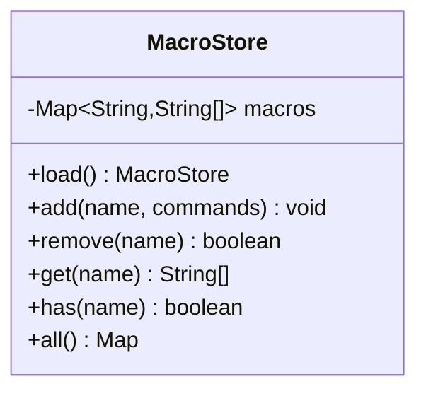

**Diagram sources**
- [MacroStore.java:32-102](file://cli/src/main/java/com/tradej/cli/config/MacroStore.java#L32-L102)

**Section sources**
- [MacroStore.java:32-102](file://cli/src/main/java/com/tradej/cli/config/MacroStore.java#L32-L102)

### SavedQueryStore
SavedQueryStore persists saved SQL queries to ~/.tradej/queries.properties and supports save/load/list/remove operations.

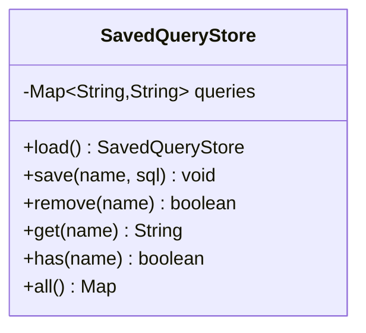

**Diagram sources**
- [SavedQueryStore.java:28-95](file://cli/src/main/java/com/tradej/cli/config/SavedQueryStore.java#L28-L95)

**Section sources**
- [SavedQueryStore.java:28-95](file://cli/src/main/java/com/tradej/cli/config/SavedQueryStore.java#L28-L95)

### Integration with TradeCli
TradeCli defines the root command and registers the interactive subcommand. When invoked, it creates CliContext and CliOperations and starts InteractiveShell.

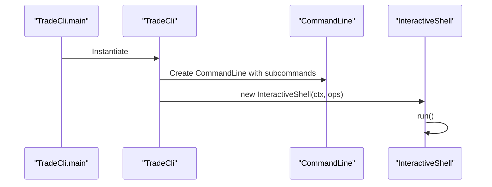

**Diagram sources**
- [TradeCli.java:127-192](file://cli/src/main/java/com/tradej/cli/TradeCli.java#L127-L192)
- [TradeCli.java:207-214](file://cli/src/main/java/com/tradej/cli/TradeCli.java#L207-L214)

**Section sources**
- [TradeCli.java:127-192](file://cli/src/main/java/com/tradej/cli/TradeCli.java#L127-L192)
- [TradeCli.java:207-214](file://cli/src/main/java/com/tradej/cli/TradeCli.java#L207-L214)

## Dependency Analysis
The interactive shell depends on:
- JLine for terminal input/output and completion
- Picocli for command parsing and dispatch
- CliContext/CliOperations for runtime context and operations
- Stores for persistent user preferences (aliases, macros, queries)
- Ansi for colored output

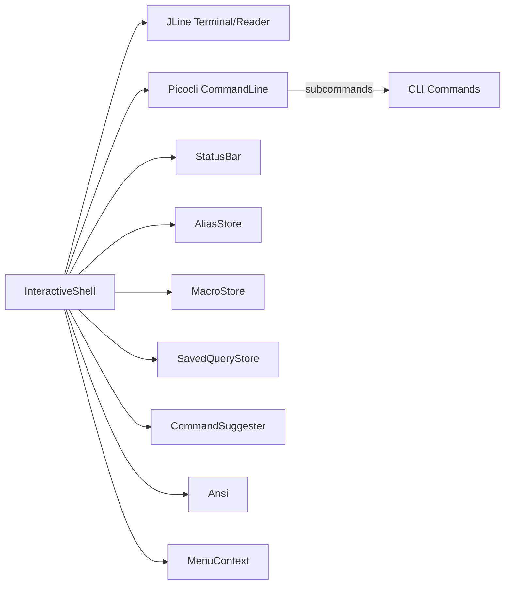

**Diagram sources**
- [InteractiveShell.java:13-21](file://cli/src/main/java/com/tradej/cli/interactive/InteractiveShell.java#L13-L21)
- [TradeCli.java:38-126](file://cli/src/main/java/com/tradej/cli/TradeCli.java#L38-L126)

**Section sources**
- [InteractiveShell.java:13-21](file://cli/src/main/java/com/tradej/cli/interactive/InteractiveShell.java#L13-L21)
- [TradeCli.java:38-126](file://cli/src/main/java/com/tradej/cli/TradeCli.java#L38-L126)

## Performance Considerations
- History file I/O: Persistent history is written per command; ensure adequate disk performance on constrained environments.
- Completion: JLine’s completer enumerates all commands; keep the command tree lean to avoid slowdowns.
- Suggestions: CommandSuggester computes edit distances; limit suggestion count and thresholds to maintain responsiveness.
- Color detection: Ansi disables colors when output is not a TTY; avoid heavy color computations when piping output.

## Troubleshooting Guide
Common issues and resolutions:
- No interactive terminal detected: The shell checks for a real terminal and warns to use non-interactive commands or run from a proper terminal.
- Unknown command errors: The exception handler suggests similar commands using CommandSuggester.
- Macro execution failures: Macros are executed via SystemRegistry; individual command errors are isolated and logged.
- History not saving: Verify ~/.tradej/history permissions and disk availability.
- Aliases/macros/queries not loading: Confirm file existence and read permissions for ~/.tradej/*.properties.

**Section sources**
- [InteractiveShell.java:69-77](file://cli/src/main/java/com/tradej/cli/interactive/InteractiveShell.java#L69-L77)
- [InteractiveShell.java:315-336](file://cli/src/main/java/com/tradej/cli/interactive/InteractiveShell.java#L315-L336)
- [AliasStore.java:47-61](file://cli/src/main/java/com/tradej/cli/config/AliasStore.java#L47-L61)
- [MacroStore.java:45-61](file://cli/src/main/java/com/tradej/cli/config/MacroStore.java#L45-L61)
- [SavedQueryStore.java:43-57](file://cli/src/main/java/com/tradej/cli/config/SavedQueryStore.java#L43-L57)

## Conclusion
The interactive shell provides a robust, extensible REPL environment integrating JLine and picocli. It offers persistent history, tab completion, aliases, macros, saved queries, and a helpful status bar. The design cleanly separates concerns across components, enabling straightforward enhancements such as custom menus, additional suggestion strategies, or new persistent stores.

## Appendices

### Usage Examples and Navigation Patterns
- Starting the interactive shell:
  - From the root CLI, run the interactive subcommand to enter the REPL.
- Basic REPL commands:
  - Use TAB for auto-completion of commands and options.
  - Type help for command listings and clear to clear the screen.
  - Exit or quit to leave the shell.
- Managing aliases:
  - Add shortcuts for long commands; list and remove as needed.
- Using macros:
  - Record sequences of commands; run macros to replay them.
- Saved queries:
  - Save frequently used SQL queries; load them quickly by name.
- Real-time status:
  - The status bar shows broker/profile/attach state and current time.

### Enhancing the Interactive Experience
- New persistent features:
  - Create a new Store similar to AliasStore/MacroStore/SavedQueryStore.
  - Add a REPL command group (e.g., myfeature) with subcommands for list/add/remove/etc.
  - Wire the store into InteractiveShell and integrate with SystemRegistry.
- Auto-completion improvements:
  - Extend CommandSuggester with domain-specific heuristics.
  - Adjust suggestion thresholds and counts for responsiveness.
- Help system:
  - Add contextual help for complex commands and macros.
- Error handling:
  - Customize ReplExceptionHandler for domain-specific diagnostics.
- UI polish:
  - Enhance StatusBar with additional metrics or toggles.
  - Improve ANSI formatting for richer output.