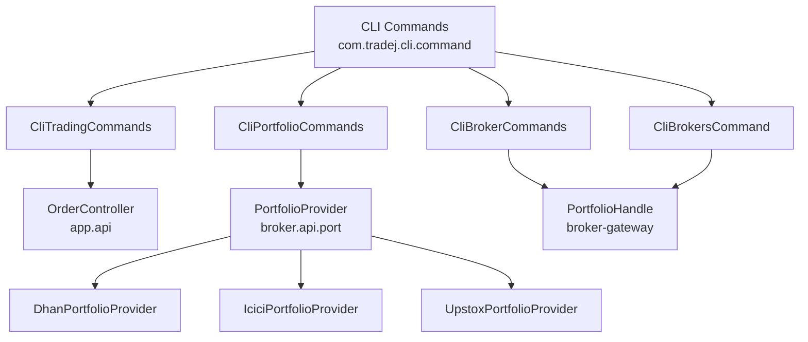
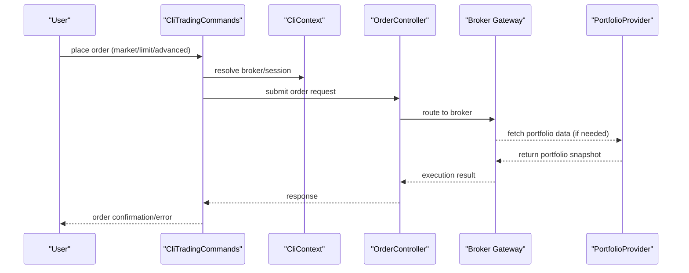
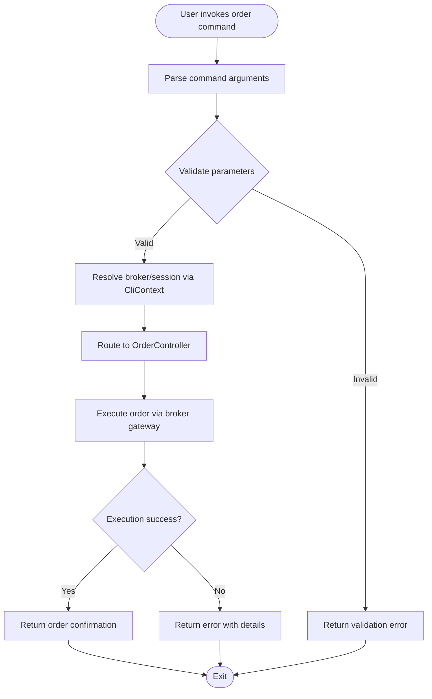
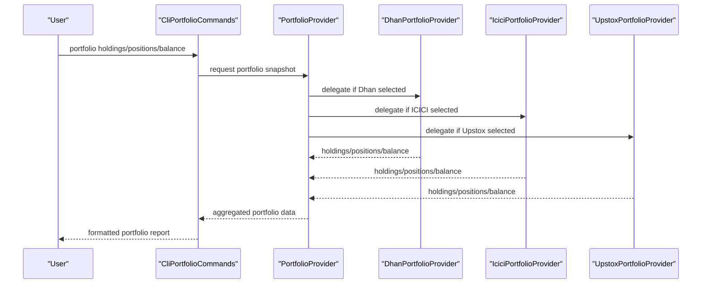
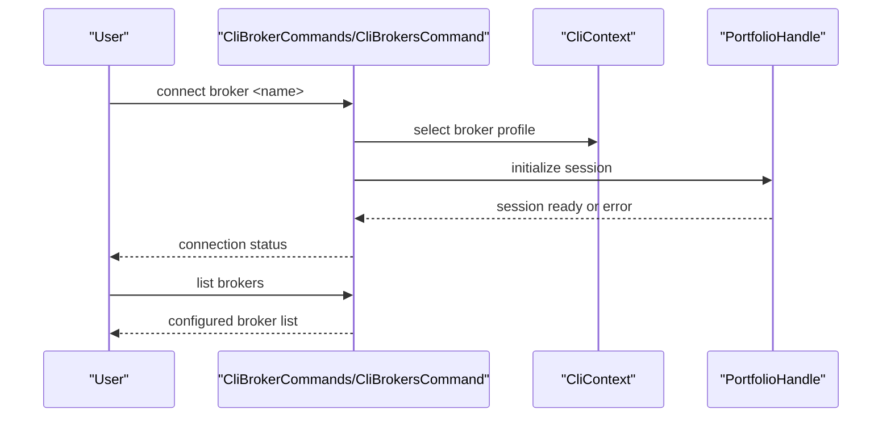
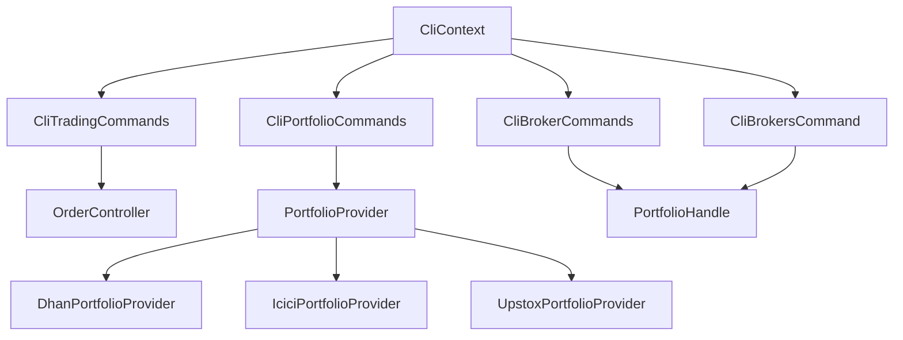

# Trading Commands

<cite>
**Referenced Files in This Document**
- [CliTradingCommands.java](file://cli/src/main/java/com/tradej/cli/command/CliTradingCommands.java)
- [CliPortfolioCommands.java](file://cli/src/main/java/com/tradej/cli/command/CliPortfolioCommands.java)
- [CliBrokerCommands.java](file://cli/src/main/java/com/tradej/cli/command/CliBrokerCommands.java)
- [CliBrokersCommand.java](file://cli/src/main/java/com/tradej/cli/command/CliBrokersCommand.java)
- [CliContext.java](file://cli/src/main/java/com/tradej/cli/CliContext.java)
- [OrderController.java](file://app/src/main/java/com/tradej/app/api/OrderController.java)
- [PortfolioProvider.java](file://broker/api/src/main/java/com/tradej/broker/api/port/PortfolioProvider.java)
- [DhanPortfolioProvider.java](file://broker/dhan/src/main/java/com/tradej/broker/dhan/adapter/DhanPortfolioProvider.java)
- [IciciPortfolioProvider.java](file://broker/icici/src/main/java/com/tradej/broker/icici/adapter/IciciPortfolioProvider.java)
- [UpstoxPortfolioProvider.java](file://broker/upstox/src/main/java/com/tradej/broker/upstox/adapter/UpstoxPortfolioProvider.java)
- [PortfolioHandle.java](file://broker-gateway/src/main/java/com/tradej/brokergateway/PortfolioHandle.java)
- [README.md](file://README.md)
- [CLI.md](file://CLI.md)
- [CONFIG.md](file://CONFIG.md)
</cite>

## Table of Contents
1. [Introduction](#introduction)
2. [Project Structure](#project-structure)
3. [Core Components](#core-components)
4. [Architecture Overview](#architecture-overview)
5. [Detailed Component Analysis](#detailed-component-analysis)
6. [Dependency Analysis](#dependency-analysis)
7. [Performance Considerations](#performance-considerations)
8. [Troubleshooting Guide](#troubleshooting-guide)
9. [Conclusion](#conclusion)
10. [Appendices](#appendices)

## Introduction
This document provides comprehensive documentation for trading commands in the CLI. It covers order placement commands (market orders, limit orders, and advanced order types), portfolio management commands (position viewing, holdings analysis, and account balance queries), and broker-specific commands for connecting to different brokers and managing broker sessions. Practical examples, command syntax, parameter validation, error handling, automation guidelines, and best practices for CLI-based trading operations are included.

## Project Structure
The CLI module organizes trading-related commands under the com.tradej.cli.command package. Key command classes include:
- CliTradingCommands: Handles order placement and lifecycle commands
- CliPortfolioCommands: Manages portfolio queries (positions, holdings, balances)
- CliBrokerCommands: Connects to and manages a single broker session
- CliBrokersCommand: Lists and orchestrates multiple broker connections

These commands integrate with backend services and broker adapters via the broker gateway and controller APIs.

**Diagram sources**
- [CliTradingCommands.java](file://cli/src/main/java/com/tradej/cli/command/CliTradingCommands.java)
- [CliPortfolioCommands.java](file://cli/src/main/java/com/tradej/cli/command/CliPortfolioCommands.java)
- [CliBrokerCommands.java](file://cli/src/main/java/com/tradej/cli/command/CliBrokerCommands.java)
- [CliBrokersCommand.java](file://cli/src/main/java/com/tradej/cli/command/CliBrokersCommand.java)
- [OrderController.java](file://app/src/main/java/com/tradej/app/api/OrderController.java)
- [PortfolioProvider.java](file://broker/api/src/main/java/com/tradej/broker/api/port/PortfolioProvider.java)
- [DhanPortfolioProvider.java](file://broker/dhan/src/main/java/com/tradej/broker/dhan/adapter/DhanPortfolioProvider.java)
- [IciciPortfolioProvider.java](file://broker/icici/src/main/java/com/tradej/broker/icici/adapter/IciciPortfolioProvider.java)
- [UpstoxPortfolioProvider.java](file://broker/upstox/src/main/java/com/tradej/broker/upstox/adapter/UpstoxPortfolioProvider.java)
- [PortfolioHandle.java](file://broker-gateway/src/main/java/com/tradej/brokergateway/PortfolioHandle.java)

**Section sources**
- [CliTradingCommands.java](file://cli/src/main/java/com/tradej/cli/command/CliTradingCommands.java)
- [CliPortfolioCommands.java](file://cli/src/main/java/com/tradej/cli/command/CliPortfolioCommands.java)
- [CliBrokerCommands.java](file://cli/src/main/java/com/tradej/cli/command/CliBrokerCommands.java)
- [CliBrokersCommand.java](file://cli/src/main/java/com/tradej/cli/command/CliBrokersCommand.java)

## Core Components
This section outlines the primary CLI components for trading operations and their responsibilities.

- CliTradingCommands
  - Purpose: Provides order placement and lifecycle commands (market, limit, advanced orders)
  - Key responsibilities:
    - Parse and validate order parameters
    - Route commands to backend OrderController
    - Handle order placement, modification, cancellation, and query
  - Integration: Uses CliContext for broker selection and session management

- CliPortfolioCommands
  - Purpose: Queries portfolio data (positions, holdings, balances)
  - Key responsibilities:
    - Retrieve portfolio snapshots from broker adapters
    - Aggregate across supported brokers via PortfolioProvider
  - Integration: Uses PortfolioProvider implementations per broker

- CliBrokerCommands
  - Purpose: Establishes and manages a single broker session
  - Key responsibilities:
    - Initialize broker connection
    - Manage session lifecycle and token refresh
  - Integration: Delegates to PortfolioHandle for session orchestration

- CliBrokersCommand
  - Purpose: Lists and orchestrates multiple broker connections
  - Key responsibilities:
    - Enumerate configured brokers
    - Coordinate multi-broker operations

**Section sources**
- [CliTradingCommands.java](file://cli/src/main/java/com/tradej/cli/command/CliTradingCommands.java)
- [CliPortfolioCommands.java](file://cli/src/main/java/com/tradej/cli/command/CliPortfolioCommands.java)
- [CliBrokerCommands.java](file://cli/src/main/java/com/tradej/cli/command/CliBrokerCommands.java)
- [CliBrokersCommand.java](file://cli/src/main/java/com/tradej/cli/command/CliBrokersCommand.java)
- [CliContext.java](file://cli/src/main/java/com/tradej/cli/CliContext.java)

## Architecture Overview
The CLI trading architecture connects user commands to backend services and broker adapters through a layered design. Orders are routed to the OrderController, while portfolio queries are handled by broker-specific PortfolioProvider implementations accessed via the broker gateway.

**Diagram sources**
- [CliTradingCommands.java](file://cli/src/main/java/com/tradej/cli/command/CliTradingCommands.java)
- [CliContext.java](file://cli/src/main/java/com/tradej/cli/CliContext.java)
- [OrderController.java](file://app/src/main/java/com/tradej/app/api/OrderController.java)
- [PortfolioProvider.java](file://broker/api/src/main/java/com/tradej/broker/api/port/PortfolioProvider.java)

## Detailed Component Analysis

### Order Placement Commands
This component handles market orders, limit orders, and advanced order types. It validates parameters, resolves the broker session, and routes requests to the backend OrderController.

- Parameter validation:
  - Enforce required fields (symbol, quantity, side)
  - Validate price constraints for limit orders
  - Ensure order type compatibility with selected broker
- Error handling:
  - Session errors (invalid token, disconnected)
  - Broker-side validation failures
  - Network timeouts and retries

**Diagram sources**
- [CliTradingCommands.java](file://cli/src/main/java/com/tradej/cli/command/CliTradingCommands.java)
- [CliContext.java](file://cli/src/main/java/com/tradej/cli/CliContext.java)
- [OrderController.java](file://app/src/main/java/com/tradej/app/api/OrderController.java)

**Section sources**
- [CliTradingCommands.java](file://cli/src/main/java/com/tradej/cli/command/CliTradingCommands.java)
- [CliContext.java](file://cli/src/main/java/com/tradej/cli/CliContext.java)
- [OrderController.java](file://app/src/main/java/com/tradej/app/api/OrderController.java)

### Portfolio Management Commands
This component retrieves portfolio data across positions, holdings, and account balances. It leverages broker-specific PortfolioProvider implementations.

- Supported queries:
  - Positions: open positions, unrealized PnL, quantity
  - Holdings: equity and derivatives holdings
  - Balances: available cash, collateral, exposure
- Multi-broker aggregation:
  - Unified interface via PortfolioProvider
  - Broker-specific adapters for Dhan, ICICI, Upstox

**Diagram sources**
- [CliPortfolioCommands.java](file://cli/src/main/java/com/tradej/cli/command/CliPortfolioCommands.java)
- [PortfolioProvider.java](file://broker/api/src/main/java/com/tradej/broker/api/port/PortfolioProvider.java)
- [DhanPortfolioProvider.java](file://broker/dhan/src/main/java/com/tradej/broker/dhan/adapter/DhanPortfolioProvider.java)
- [IciciPortfolioProvider.java](file://broker/icici/src/main/java/com/tradej/broker/icici/adapter/IciciPortfolioProvider.java)
- [UpstoxPortfolioProvider.java](file://broker/upstox/src/main/java/com/tradej/broker/upstox/adapter/UpstoxPortfolioProvider.java)

**Section sources**
- [CliPortfolioCommands.java](file://cli/src/main/java/com/tradej/cli/command/CliPortfolioCommands.java)
- [PortfolioProvider.java](file://broker/api/src/main/java/com/tradej/broker/api/port/PortfolioProvider.java)
- [DhanPortfolioProvider.java](file://broker/dhan/src/main/java/com/tradej/broker/dhan/adapter/DhanPortfolioProvider.java)
- [IciciPortfolioProvider.java](file://broker/icici/src/main/java/com/tradej/broker/icici/adapter/IciciPortfolioProvider.java)
- [UpstoxPortfolioProvider.java](file://broker/upstox/src/main/java/com/tradej/broker/upstox/adapter/UpstoxPortfolioProvider.java)

### Broker-Specific Commands
These commands manage broker connections and sessions, enabling switching between brokers and listing available configurations.

- Broker connection:
  - Select broker by name/profile
  - Initialize credentials and tokens
  - Maintain session state
- Broker listing:
  - Enumerate configured brokers
  - Show status and capabilities

**Diagram sources**
- [CliBrokerCommands.java](file://cli/src/main/java/com/tradej/cli/command/CliBrokerCommands.java)
- [CliBrokersCommand.java](file://cli/src/main/java/com/tradej/cli/command/CliBrokersCommand.java)
- [CliContext.java](file://cli/src/main/java/com/tradej/cli/CliContext.java)
- [PortfolioHandle.java](file://broker-gateway/src/main/java/com/tradej/brokergateway/PortfolioHandle.java)

**Section sources**
- [CliBrokerCommands.java](file://cli/src/main/java/com/tradej/cli/command/CliBrokerCommands.java)
- [CliBrokersCommand.java](file://cli/src/main/java/com/tradej/cli/command/CliBrokersCommand.java)
- [CliContext.java](file://cli/src/main/java/com/tradej/cli/CliContext.java)
- [PortfolioHandle.java](file://broker-gateway/src/main/java/com/tradej/brokergateway/PortfolioHandle.java)

## Dependency Analysis
The CLI trading commands depend on backend controllers and broker adapters. The following diagram illustrates key dependencies:

**Diagram sources**
- [CliContext.java](file://cli/src/main/java/com/tradej/cli/CliContext.java)
- [CliTradingCommands.java](file://cli/src/main/java/com/tradej/cli/command/CliTradingCommands.java)
- [CliPortfolioCommands.java](file://cli/src/main/java/com/tradej/cli/command/CliPortfolioCommands.java)
- [CliBrokerCommands.java](file://cli/src/main/java/com/tradej/cli/command/CliBrokerCommands.java)
- [CliBrokersCommand.java](file://cli/src/main/java/com/tradej/cli/command/CliBrokersCommand.java)
- [OrderController.java](file://app/src/main/java/com/tradej/app/api/OrderController.java)
- [PortfolioProvider.java](file://broker/api/src/main/java/com/tradej/broker/api/port/PortfolioProvider.java)
- [DhanPortfolioProvider.java](file://broker/dhan/src/main/java/com/tradej/broker/dhan/adapter/DhanPortfolioProvider.java)
- [IciciPortfolioProvider.java](file://broker/icici/src/main/java/com/tradej/broker/icici/adapter/IciciPortfolioProvider.java)
- [UpstoxPortfolioProvider.java](file://broker/upstox/src/main/java/com/tradej/broker/upstox/adapter/UpstoxPortfolioProvider.java)
- [PortfolioHandle.java](file://broker-gateway/src/main/java/com/tradej/brokergateway/PortfolioHandle.java)

**Section sources**
- [CliContext.java](file://cli/src/main/java/com/tradej/cli/CliContext.java)
- [CliTradingCommands.java](file://cli/src/main/java/com/tradej/cli/command/CliTradingCommands.java)
- [CliPortfolioCommands.java](file://cli/src/main/java/com/tradej/cli/command/CliPortfolioCommands.java)
- [CliBrokerCommands.java](file://cli/src/main/java/com/tradej/cli/command/CliBrokerCommands.java)
- [CliBrokersCommand.java](file://cli/src/main/java/com/tradej/cli/command/CliBrokersCommand.java)
- [OrderController.java](file://app/src/main/java/com/tradej/app/api/OrderController.java)
- [PortfolioProvider.java](file://broker/api/src/main/java/com/tradej/broker/api/port/PortfolioProvider.java)
- [DhanPortfolioProvider.java](file://broker/dhan/src/main/java/com/tradej/broker/dhan/adapter/DhanPortfolioProvider.java)
- [IciciPortfolioProvider.java](file://broker/icici/src/main/java/com/tradej/broker/icici/adapter/IciciPortfolioProvider.java)
- [UpstoxPortfolioProvider.java](file://broker/upstox/src/main/java/com/tradej/broker/upstox/adapter/UpstoxPortfolioProvider.java)
- [PortfolioHandle.java](file://broker-gateway/src/main/java/com/tradej/brokergateway/PortfolioHandle.java)

## Performance Considerations
- Minimize round trips by batching related queries (e.g., portfolio summary and recent trades)
- Cache frequently accessed symbols and instrument metadata
- Use asynchronous execution for long-running operations (e.g., historical downloads)
- Apply rate limiting to avoid broker throttling
- Monitor network latency and retry with exponential backoff for transient failures

## Troubleshooting Guide
Common issues and resolutions:
- Authentication failures:
  - Regenerate tokens or refresh sessions using broker-specific commands
  - Verify credentials and permissions
- Connectivity problems:
  - Reconnect to the broker and reinitialize the session
  - Check broker gateway health and network stability
- Validation errors:
  - Review parameter constraints (price, quantity, order type)
  - Confirm symbol availability and market hours
- Multi-broker conflicts:
  - Explicitly select a broker before issuing commands
  - Avoid concurrent operations across different brokers

**Section sources**
- [CliBrokerCommands.java](file://cli/src/main/java/com/tradej/cli/command/CliBrokerCommands.java)
- [CliBrokersCommand.java](file://cli/src/main/java/com/tradej/cli/command/CliBrokersCommand.java)
- [CliPortfolioCommands.java](file://cli/src/main/java/com/tradej/cli/command/CliPortfolioCommands.java)
- [CliTradingCommands.java](file://cli/src/main/java/com/tradej/cli/command/CliTradingCommands.java)

## Conclusion
The CLI trading commands provide a robust foundation for order placement, portfolio management, and broker session control. By leveraging validated parameters, unified broker interfaces, and resilient error handling, users can automate trading tasks and integrate with external systems effectively. Following best practices ensures reliability, performance, and scalability across diverse trading scenarios.

## Appendices

### Command Syntax and Examples
- Order placement
  - Place a market buy order for a symbol with a specified quantity
  - Place a limit sell order with price and validity constraints
  - Submit advanced order types (bracket, stop-loss, etc.) via broker-specific capabilities
- Portfolio queries
  - View current positions and unrealized PnL
  - List holdings across asset classes
  - Retrieve account balance and exposure metrics
- Broker management
  - Connect to a specific broker by name
  - List all configured brokers and their statuses
  - Switch between brokers for subsequent commands

### Parameter Validation and Error Handling
- Validation:
  - Required fields enforced before submission
  - Price and quantity bounds checked
  - Order type compatibility verified
- Error handling:
  - Session and authentication errors surfaced clearly
  - Broker-side validation messages returned to the CLI
  - Retry mechanisms for transient failures

### Automation and Integration Guidelines
- Scripting:
  - Use non-interactive modes for automated runs
  - Persist session state and handle token refresh
- External systems:
  - Integrate via broker gateway APIs
  - Implement webhook or streaming for real-time updates
- Best practices:
  - Log all actions and outcomes
  - Monitor execution latency and throughput
  - Apply circuit breakers for safety

**Section sources**
- [README.md](file://README.md)
- [CLI.md](file://CLI.md)
- [CONFIG.md](file://CONFIG.md)