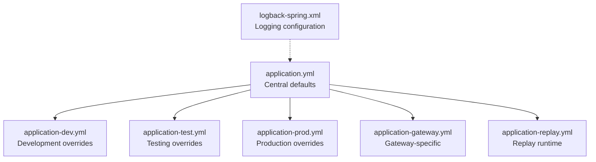
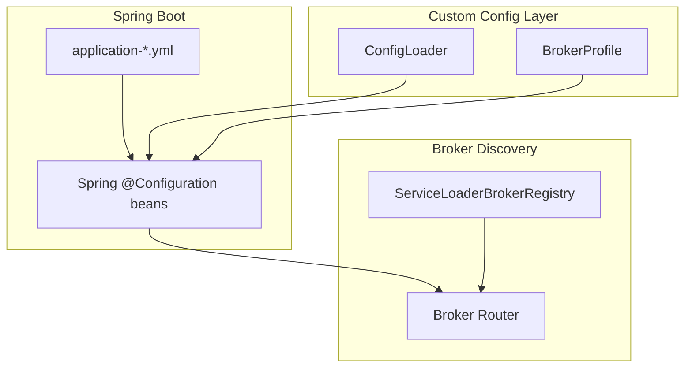
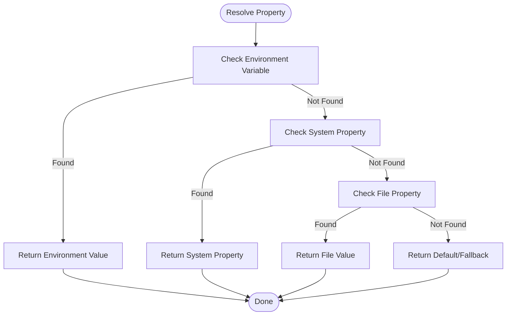
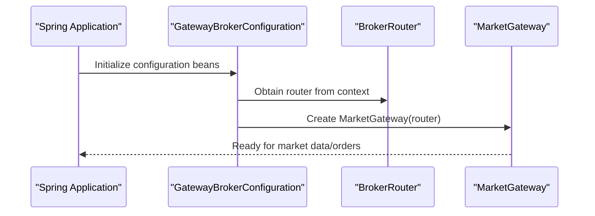
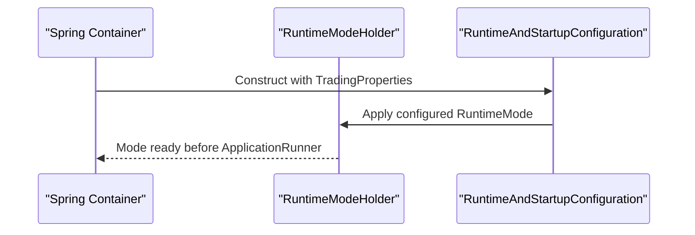
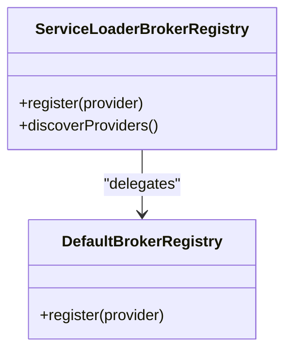
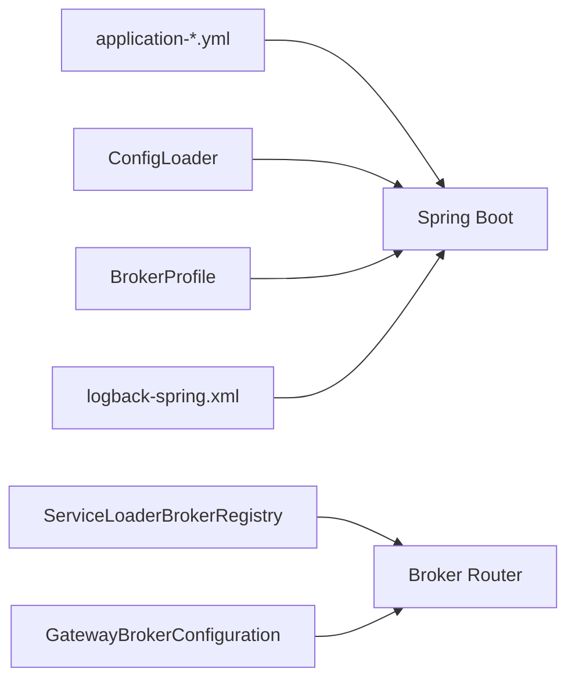

# Configuration & Deployment

<cite>
**Referenced Files in This Document**
- [application.yml](file://app/src/main/resources/application.yml)
- [application-dev.yml](file://app/src/main/resources/application-dev.yml)
- [application-test.yml](file://app/src/main/resources/application-test.yml)
- [application-prod.yml](file://app/src/main/resources/application-prod.yml)
- [application-gateway.yml](file://app/src/main/resources/application-gateway.yml)
- [application-replay.yml](file://app/src/main/resources/application-replay.yml)
- [logback-spring.xml](file://app/src/main/resources/logback-spring.xml)
- [ConfigLoader.java](file://composition/src/main/java/com/tradej/composition/config/ConfigLoader.java)
- [BrokerProfile.java](file://composition/src/main/java/com/tradej/composition/config/BrokerProfile.java)
- [GatewayBrokerConfiguration.java](file://app/src/main/java/com/tradej/app/config/GatewayBrokerConfiguration.java)
- [RuntimeConfigurationTest.java](file://app/src/test/java/com/tradej/app/config/RuntimeConfigurationTest.java)
- [ServiceLoaderBrokerRegistry.java](file://broker/api/src/main/java/com/tradej/broker/api/spi/ServiceLoaderBrokerRegistry.java)
- [ci.yml](file://.github/workflows/ci.yml)
- [PRODUCTION_DEPLOYMENT_GUIDE.md](file://PRODUCTION_DEPLOYMENT_GUIDE.md)
- [CONFIG.md](file://CONFIG.md)
- [README.md](file://README.md)
</cite>

## Table of Contents
1. [Introduction](#introduction)
2. [Project Structure](#project-structure)
3. [Core Components](#core-components)
4. [Architecture Overview](#architecture-overview)
5. [Detailed Component Analysis](#detailed-component-analysis)
6. [Dependency Analysis](#dependency-analysis)
7. [Performance Considerations](#performance-considerations)
8. [Troubleshooting Guide](#troubleshooting-guide)
9. [Conclusion](#conclusion)
10. [Appendices](#appendices)

## Introduction
This document provides comprehensive configuration and deployment guidance for TradeJ. It covers the Spring Boot configuration system, environment-specific properties, broker routing configuration, the ConfigLoader implementation, property management, runtime configuration changes, deployment architectures, containerization options, scaling strategies, security configuration (SSL/TLS and authentication), monitoring and logging, environment-specific deployments, CI/CD integration, and operational practices including configuration validation, secrets management, and configuration drift detection.

## Project Structure
TradeJ organizes configuration primarily under the application resources directory with environment-specific profiles and a central logging configuration. The configuration system supports both Spring Boot YAML profiles and a framework-agnostic ConfigLoader for runtime property resolution.

**Diagram sources**
- [application.yml:1-200](file://app/src/main/resources/application.yml#L1-L200)
- [application-dev.yml:1-200](file://app/src/main/resources/application-dev.yml#L1-L200)
- [application-test.yml:1-200](file://app/src/main/resources/application-test.yml#L1-L200)
- [application-prod.yml:1-200](file://app/src/main/resources/application-prod.yml#L1-L200)
- [application-gateway.yml:1-200](file://app/src/main/resources/application-gateway.yml#L1-L200)
- [application-replay.yml:1-200](file://app/src/main/resources/application-replay.yml#L1-L200)
- [logback-spring.xml:1-200](file://app/src/main/resources/logback-spring.xml#L1-L200)

**Section sources**
- [application.yml:1-200](file://app/src/main/resources/application.yml#L1-L200)
- [application-dev.yml:1-200](file://app/src/main/resources/application-dev.yml#L1-L200)
- [application-test.yml:1-200](file://app/src/main/resources/application-test.yml#L1-L200)
- [application-prod.yml:1-200](file://app/src/main/resources/application-prod.yml#L1-L200)
- [application-gateway.yml:1-200](file://app/src/main/resources/application-gateway.yml#L1-L200)
- [application-replay.yml:1-200](file://app/src/main/resources/application-replay.yml#L1-L200)
- [logback-spring.xml:1-200](file://app/src/main/resources/logback-spring.xml#L1-L200)

## Core Components
- Spring Boot Profiles: Environment-specific configurations are managed via application-<profile>.yml files. Central defaults are defined in application.yml, with development, testing, production, gateway, and replay profiles providing targeted overrides.
- ConfigLoader: A framework-agnostic loader that merges properties from files and environment variables, resolving precedence deterministically.
- BrokerProfile: Encapsulates broker-specific configuration and validation rules for supported brokers (e.g., ICICI, Upstox, Dhan).
- GatewayBrokerConfiguration: Integrates broker routing and gateway creation into the Spring application context.
- Logging: Centralized via logback-spring.xml for structured and environment-aware logging.

**Section sources**
- [application.yml:1-200](file://app/src/main/resources/application.yml#L1-L200)
- [application-dev.yml:1-200](file://app/src/main/resources/application-dev.yml#L1-L200)
- [application-test.yml:1-200](file://app/src/main/resources/application-test.yml#L1-L200)
- [application-prod.yml:1-200](file://app/src/main/resources/application-prod.yml#L1-L200)
- [application-gateway.yml:1-200](file://app/src/main/resources/application-gateway.yml#L1-L200)
- [application-replay.yml:1-200](file://app/src/main/resources/application-replay.yml#L1-L200)
- [logback-spring.xml:1-200](file://app/src/main/resources/logback-spring.xml#L1-L200)
- [ConfigLoader.java:1-105](file://composition/src/main/java/com/tradej/composition/config/ConfigLoader.java#L1-L105)
- [BrokerProfile.java:62-91](file://composition/src/main/java/com/tradej/composition/config/BrokerProfile.java#L62-L91)
- [GatewayBrokerConfiguration.java:94-111](file://app/src/main/java/com/tradej/app/config/GatewayBrokerConfiguration.java#L94-L111)

## Architecture Overview
The configuration architecture blends Spring Boot profiles with a custom ConfigLoader for robust property resolution and broker profile validation. Broker discovery leverages ServiceLoader for extensibility.

**Diagram sources**
- [application.yml:1-200](file://app/src/main/resources/application.yml#L1-L200)
- [ConfigLoader.java:1-105](file://composition/src/main/java/com/tradej/composition/config/ConfigLoader.java#L1-L105)
- [BrokerProfile.java:62-91](file://composition/src/main/java/com/tradej/composition/config/BrokerProfile.java#L62-L91)
- [ServiceLoaderBrokerRegistry.java:1-46](file://broker/api/src/main/java/com/tradej/broker/api/spi/ServiceLoaderBrokerRegistry.java#L1-L46)
- [GatewayBrokerConfiguration.java:94-111](file://app/src/main/java/com/tradej/app/config/GatewayBrokerConfiguration.java#L94-L111)

## Detailed Component Analysis

### Spring Boot Configuration Profiles
- Central defaults: application.yml defines baseline properties.
- Environment overrides:
  - application-dev.yml for local development.
  - application-test.yml for CI and testing.
  - application-prod.yml for production environments.
  - application-gateway.yml for gateway-specific settings.
  - application-replay.yml for replay runtime tuning.
- Logging: logback-spring.xml centralizes logging configuration for all environments.

Operational guidance:
- Activate profiles via Spring’s active profiles mechanism.
- Prefer environment variables for secrets and dynamic overrides.
- Keep sensitive keys out of version-controlled YAML files.

**Section sources**
- [application.yml:1-200](file://app/src/main/resources/application.yml#L1-L200)
- [application-dev.yml:1-200](file://app/src/main/resources/application-dev.yml#L1-L200)
- [application-test.yml:1-200](file://app/src/main/resources/application-test.yml#L1-L200)
- [application-prod.yml:1-200](file://app/src/main/resources/application-prod.yml#L1-L200)
- [application-gateway.yml:1-200](file://app/src/main/resources/application-gateway.yml#L1-L200)
- [application-replay.yml:1-200](file://app/src/main/resources/application-replay.yml#L1-L200)
- [logback-spring.xml:1-200](file://app/src/main/resources/logback-spring.xml#L1-L200)

### ConfigLoader Implementation
ConfigLoader provides a deterministic property resolution order:
1. Environment variables (uppercase, dot-to-underscore conversion).
2. Java system properties.
3. File-backed properties.
4. Default fallback.

Key behaviors:
- Merges multiple property files.
- Validates required properties.
- Supports typed getters (String, int, long, boolean).

**Diagram sources**
- [ConfigLoader.java:89-104](file://composition/src/main/java/com/tradej/composition/config/ConfigLoader.java#L89-L104)

**Section sources**
- [ConfigLoader.java:1-105](file://composition/src/main/java/com/tradej/composition/config/ConfigLoader.java#L1-L105)

### Broker Routing Configuration
- BrokerProfile encapsulates broker-specific configuration and enforces validation rules for supported brokers.
- GatewayBrokerConfiguration wires the BrokerRouter and MarketGateway into the Spring context and selects the active broker source from the current BrokerComposition.

**Diagram sources**
- [GatewayBrokerConfiguration.java:94-111](file://app/src/main/java/com/tradej/app/config/GatewayBrokerConfiguration.java#L94-L111)

**Section sources**
- [BrokerProfile.java:62-91](file://composition/src/main/java/com/tradej/composition/config/BrokerProfile.java#L62-L91)
- [GatewayBrokerConfiguration.java:94-111](file://app/src/main/java/com/tradej/app/config/GatewayBrokerConfiguration.java#L94-L111)

### Runtime Configuration Changes
- Runtime mode is applied early in the Spring lifecycle to ensure readiness before application runners fire.
- Tests validate that runtime mode is set during bean initialization rather than post-startup.

**Diagram sources**
- [RuntimeConfigurationTest.java:25-37](file://app/src/test/java/com/tradej/app/config/RuntimeConfigurationTest.java#L25-L37)

**Section sources**
- [RuntimeConfigurationTest.java:1-37](file://app/src/test/java/com/tradej/app/config/RuntimeConfigurationTest.java#L1-L37)

### Broker Provider Discovery
- ServiceLoaderBrokerRegistry discovers broker providers via META-INF/services and registers only enabled providers.

**Diagram sources**
- [ServiceLoaderBrokerRegistry.java:1-46](file://broker/api/src/main/java/com/tradej/broker/api/spi/ServiceLoaderBrokerRegistry.java#L1-L46)

**Section sources**
- [ServiceLoaderBrokerRegistry.java:1-46](file://broker/api/src/main/java/com/tradej/broker/api/spi/ServiceLoaderBrokerRegistry.java#L1-L46)

## Dependency Analysis
Configuration dependencies span Spring Boot profiles, custom loaders, broker profiles, and discovery mechanisms.

**Diagram sources**
- [application.yml:1-200](file://app/src/main/resources/application.yml#L1-L200)
- [ConfigLoader.java:1-105](file://composition/src/main/java/com/tradej/composition/config/ConfigLoader.java#L1-L105)
- [BrokerProfile.java:62-91](file://composition/src/main/java/com/tradej/composition/config/BrokerProfile.java#L62-L91)
- [ServiceLoaderBrokerRegistry.java:1-46](file://broker/api/src/main/java/com/tradej/broker/api/spi/ServiceLoaderBrokerRegistry.java#L1-L46)
- [GatewayBrokerConfiguration.java:94-111](file://app/src/main/java/com/tradej/app/config/GatewayBrokerConfiguration.java#L94-L111)
- [logback-spring.xml:1-200](file://app/src/main/resources/logback-spring.xml#L1-L200)

**Section sources**
- [application.yml:1-200](file://app/src/main/resources/application.yml#L1-L200)
- [ConfigLoader.java:1-105](file://composition/src/main/java/com/tradej/composition/config/ConfigLoader.java#L1-L105)
- [BrokerProfile.java:62-91](file://composition/src/main/java/com/tradej/composition/config/BrokerProfile.java#L62-L91)
- [ServiceLoaderBrokerRegistry.java:1-46](file://broker/api/src/main/java/com/tradej/broker/api/spi/ServiceLoaderBrokerRegistry.java#L1-L46)
- [GatewayBrokerConfiguration.java:94-111](file://app/src/main/java/com/tradej/app/config/GatewayBrokerConfiguration.java#L94-L111)
- [logback-spring.xml:1-200](file://app/src/main/resources/logback-spring.xml#L1-L200)

## Performance Considerations
- Minimize property file count and merge overlapping keys to reduce I/O overhead.
- Prefer environment variables for frequently changing runtime knobs to avoid file reloads.
- Use typed getters in ConfigLoader to prevent repeated parsing and casting.
- Keep broker provider registration minimal and lazy-load where feasible.

## Troubleshooting Guide
Common configuration issues and resolutions:
- Required properties missing: ConfigLoader throws an explicit error when a required key is absent; verify environment variables and system properties.
- Broker credential validation failures: BrokerProfile enforces required fields per broker and auth mode; ensure all mandatory files and modes are correctly configured.
- Runtime mode not applied: Confirm initialization order; runtime mode must be set during bean construction, not post-startup.

**Section sources**
- [ConfigLoader.java:51-57](file://composition/src/main/java/com/tradej/composition/config/ConfigLoader.java#L51-L57)
- [BrokerProfile.java:62-81](file://composition/src/main/java/com/tradej/composition/config/BrokerProfile.java#L62-L81)
- [RuntimeConfigurationTest.java:25-37](file://app/src/test/java/com/tradej/app/config/RuntimeConfigurationTest.java#L25-L37)

## Conclusion
TradeJ’s configuration system combines Spring Boot profiles with a robust, framework-agnostic ConfigLoader and strict broker profile validation. The architecture supports environment-specific deployments, secure secrets management via environment variables, and scalable broker routing through ServiceLoader. Proper adherence to the documented practices ensures reliable operation across development, testing, and production environments.

## Appendices

### Security Configuration (SSL/TLS and Authentication)
- SSL/TLS: Configure server certificates and keystore/truststore via Spring Boot HTTPS settings in the appropriate application-<profile>.yml.
- Authentication: Use environment variables for tokens/secrets; avoid embedding credentials in YAML files. Enforce validation in BrokerProfile for broker-specific credentials.

**Section sources**
- [application.yml:1-200](file://app/src/main/resources/application.yml#L1-L200)
- [BrokerProfile.java:62-91](file://composition/src/main/java/com/tradej/composition/config/BrokerProfile.java#L62-L91)

### Monitoring, Logging, and Metrics
- Logging: Centralize in logback-spring.xml; configure log levels per environment and appenders.
- Metrics: Integrate Micrometer and expose metrics via Actuator endpoints; tune retention and aggregation per environment.

**Section sources**
- [logback-spring.xml:1-200](file://app/src/main/resources/logback-spring.xml#L1-L200)

### Environment-Specific Deployments
- Development: application-dev.yml for local iteration.
- Testing: application-test.yml for CI and automated tests.
- Production: application-prod.yml for hardened runtime.
- Gateway/Replay: application-gateway.yml and application-replay.yml for specialized workloads.

**Section sources**
- [application-dev.yml:1-200](file://app/src/main/resources/application-dev.yml#L1-L200)
- [application-test.yml:1-200](file://app/src/main/resources/application-test.yml#L1-L200)
- [application-prod.yml:1-200](file://app/src/main/resources/application-prod.yml#L1-L200)
- [application-gateway.yml:1-200](file://app/src/main/resources/application-gateway.yml#L1-L200)
- [application-replay.yml:1-200](file://app/src/main/resources/application-replay.yml#L1-L200)

### CI/CD Integration
- CI pipeline: Use GitHub Actions to build, test, and package artifacts; apply environment-specific profiles and inject secrets via CI environment variables.
- Artifact promotion: Promote builds across environments with profile activation and configuration validation steps.

**Section sources**
- [.github/workflows/ci.yml:1-200](file://.github/workflows/ci.yml#L1-L200)

### Maintenance Procedures
- Configuration validation: Run unit and integration tests that assert runtime mode application and broker credential validation.
- Secrets management: Store secrets in CI/CD secret stores and pass via environment variables; avoid committing secrets to repositories.
- Drift detection: Periodically diff deployed configuration against baselines; enforce validation in startup routines.

**Section sources**
- [RuntimeConfigurationTest.java:25-37](file://app/src/test/java/com/tradej/app/config/RuntimeConfigurationTest.java#L25-L37)
- [BrokerProfile.java:62-91](file://composition/src/main/java/com/tradej/composition/config/BrokerProfile.java#L62-L91)

### Additional References
- Deployment guide and configuration documentation are available in the repository’s top-level documentation files.

**Section sources**
- [PRODUCTION_DEPLOYMENT_GUIDE.md:1-200](file://PRODUCTION_DEPLOYMENT_GUIDE.md#L1-L200)
- [CONFIG.md:1-200](file://CONFIG.md#L1-L200)
- [README.md:1-200](file://README.md#L1-L200)