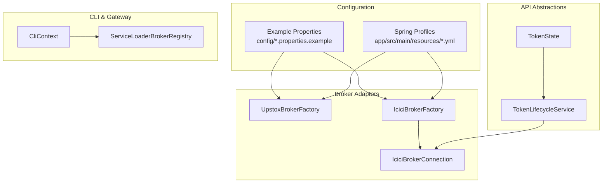
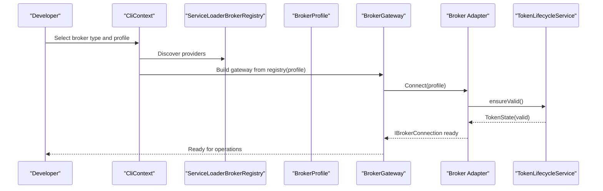
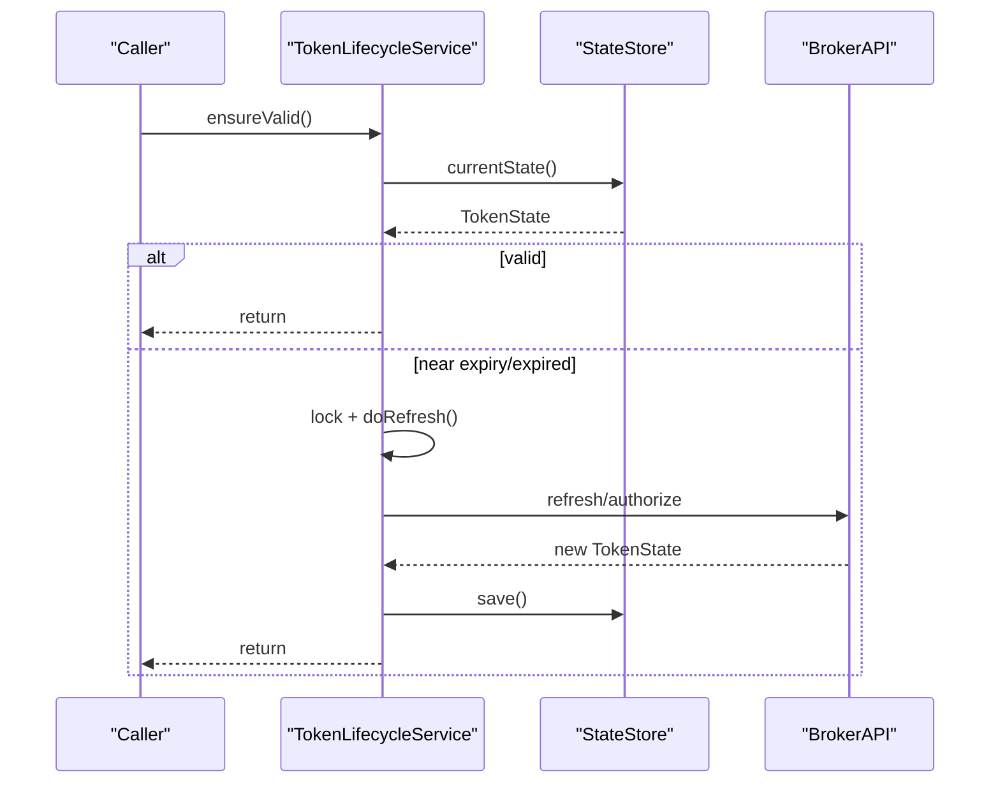
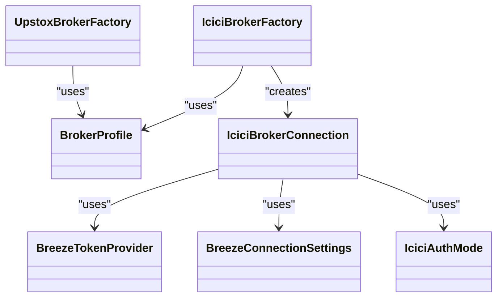
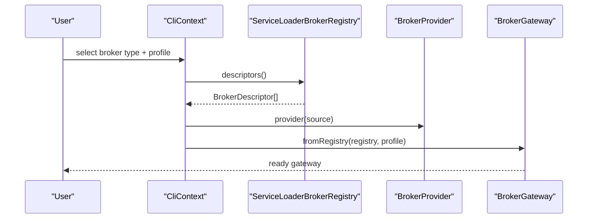
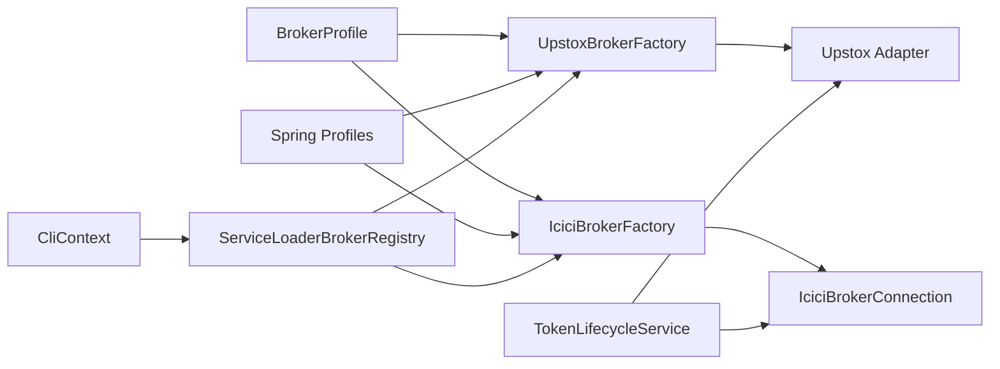

# Broker Configurations

<cite>
**Referenced Files in This Document**
- [dhan-local.properties.example](file://config/dhan-local.properties.example)
- [dhan-sandbox.properties.example](file://config/dhan-sandbox.properties.example)
- [upstox-live.properties.example](file://config/upstox-live.properties.example)
- [upstox-sandbox.properties.example](file://config/upstox-sandbox.properties.example)
- [icici-local.properties.example](file://config/icici-local.properties.example)
- [application.yml](file://app/src/main/resources/application.yml)
- [application-dev.yml](file://app/src/main/resources/application-dev.yml)
- [application-upstox-dev.yml](file://app/src/main/resources/application-upstox-dev.yml)
- [application-upstox-prod.yml](file://app/src/main/resources/application-upstox-prod.yml)
- [application-icici-prod.yml](file://app/src/main/resources/application-icici-prod.yml)
- [IciciConfiguration.java](file://app/src/main/java/com/tradej/app/config/IciciConfiguration.java)
- [TokenLifecycleService.java](file://broker/api/src/main/java/com/tradej/broker/api/auth/TokenLifecycleService.java)
- [TokenState.java](file://broker/api/src/main/java/com/tradej/broker/api/auth/TokenState.java)
- [BreezeTokenProvider.java](file://broker/icici/src/main/java/com/tradej/broker/icici/auth/BreezeTokenProvider.java)
- [BreezeConnectionSettings.java](file://broker/icici/src/main/java/com/tradej/broker/icici/config/BreezeConnectionSettings.java)
- [IciciAuthMode.java](file://broker/icici/src/main/java/com/tradej/broker/icici/config/IciciAuthMode.java)
- [IciciBrokerConnection.java](file://broker/icici/src/main/java/com/tradej/broker/icici/IciciBrokerConnection.java)
- [UpstoxBrokerFactory.java](file://composition/src/main/java/com/tradej/composition/UpstoxBrokerFactory.java)
- [IciciBrokerFactory.java](file://composition/src/main/java/com/tradej/composition/IciciBrokerFactory.java)
- [BrokerProfile.java](file://composition/src/main/java/com/tradej/composition/config/BrokerProfile.java)
- [ServiceLoaderBrokerRegistry.java](file://broker-gateway/src/test/java/com/tradej/brokergateway/spi/impl/ServiceLoaderBrokerRegistry.java)
- [BrokerProviderSpiTest.java](file://broker-gateway/src/test/java/com/tradej/brokergateway/spi/impl/BrokerProviderSpiTest.java)
- [CliContext.java](file://cli/src/main/java/com/tradej/cli/CliContext.java)
- [BrokerSession.java](file://cli/src/main/java/com/tradej/cli/standalone/BrokerSession.java)
- [BROKER_INTEGRATION_AUDIT_REPORT.md](file://docs/BROKER_INTEGRATION_AUDIT_REPORT.md)
</cite>

## Table of Contents
1. [Introduction](#introduction)
2. [Project Structure](#project-structure)
3. [Core Components](#core-components)
4. [Architecture Overview](#architecture-overview)
5. [Detailed Component Analysis](#detailed-component-analysis)
6. [Dependency Analysis](#dependency-analysis)
7. [Performance Considerations](#performance-considerations)
8. [Troubleshooting Guide](#troubleshooting-guide)
9. [Conclusion](#conclusion)
10. [Appendices](#appendices)

## Introduction
This document explains broker-specific configuration management in the system, focusing on the BrokerProfile system, credential management, and broker-specific settings. It documents configuration files for Dhan, Upstox, and ICICI Direct across local and sandbox environments, details property structures, authentication parameters, and connection settings. It also covers integration with broker adapters, token management, and connection pooling, along with secure credential storage and best practices.

## Project Structure
Broker configuration spans several areas:
- Example property files under config for Dhan, Upstox, and ICICI
- Spring Boot profiles under app/src/main/resources for environment-specific overrides
- Broker adapter configurations under composition for factory wiring
- Broker API abstractions for token lifecycle and state
- Broker-specific implementations for ICICI and Upstox
- CLI and gateway integration points for broker sessions and registry discovery

**Diagram sources**
- [dhan-local.properties.example](file://config/dhan-local.properties.example)
- [upstox-live.properties.example](file://config/upstox-live.properties.example)
- [icici-local.properties.example](file://config/icici-local.properties.example)
- [application.yml](file://app/src/main/resources/application.yml)
- [application-upstox-dev.yml](file://app/src/main/resources/application-upstox-dev.yml)
- [application-icici-prod.yml](file://app/src/main/resources/application-icici-prod.yml)
- [UpstoxBrokerFactory.java](file://composition/src/main/java/com/tradej/composition/UpstoxBrokerFactory.java)
- [IciciBrokerFactory.java](file://composition/src/main/java/com/tradej/composition/IciciBrokerFactory.java)
- [IciciBrokerConnection.java](file://broker/icici/src/main/java/com/tradej/broker/icici/IciciBrokerConnection.java)
- [TokenLifecycleService.java](file://broker/api/src/main/java/com/tradej/broker/api/auth/TokenLifecycleService.java)
- [TokenState.java](file://broker/api/src/main/java/com/tradej/broker/api/auth/TokenState.java)
- [CliContext.java](file://cli/src/main/java/com/tradej/cli/CliContext.java)
- [ServiceLoaderBrokerRegistry.java](file://broker-gateway/src/test/java/com/tradej/brokergateway/spi/impl/ServiceLoaderBrokerRegistry.java)

**Section sources**
- [dhan-local.properties.example](file://config/dhan-local.properties.example)
- [dhan-sandbox.properties.example](file://config/dhan-sandbox.properties.example)
- [upstox-live.properties.example](file://config/upstox-live.properties.example)
- [upstox-sandbox.properties.example](file://config/upstox-sandbox.properties.example)
- [icici-local.properties.example](file://config/icici-local.properties.example)
- [application.yml](file://app/src/main/resources/application.yml)
- [application-dev.yml](file://app/src/main/resources/application-dev.yml)
- [application-upstox-dev.yml](file://app/src/main/resources/application-upstox-dev.yml)
- [application-upstox-prod.yml](file://app/src/main/resources/application-upstox-prod.yml)
- [application-icici-prod.yml](file://app/src/main/resources/application-icici-prod.yml)

## Core Components
- BrokerProfile: Centralized broker configuration container used by factories and gateway to wire connections and settings.
- TokenLifecycleService and TokenState: Abstractions for acquiring, validating, and refreshing tokens per broker.
- Broker-specific adapters:
  - ICICI: BreezeTokenProvider, BreezeConnectionSettings, IciciAuthMode, IciciBrokerConnection
  - Upstox: UpstoxBrokerFactory (wired via Spring profiles)
- CLI and Registry: CliContext orchestrates broker sessions; ServiceLoaderBrokerRegistry discovers providers.

Key responsibilities:
- BrokerProfile encapsulates broker identity, environment, credentials, and connection parameters.
- TokenLifecycleService ensures threadsafe, validated access tokens before broker operations.
- Adapter implementations encapsulate broker-specific auth flows and connection settings.

**Section sources**
- [BrokerProfile.java](file://composition/src/main/java/com/tradej/composition/config/BrokerProfile.java)
- [TokenLifecycleService.java](file://broker/api/src/main/java/com/tradej/broker/api/auth/TokenLifecycleService.java)
- [TokenState.java](file://broker/api/src/main/java/com/tradej/broker/api/auth/TokenState.java)
- [IciciBrokerConnection.java](file://broker/icici/src/main/java/com/tradej/broker/icici/IciciBrokerConnection.java)
- [UpstoxBrokerFactory.java](file://composition/src/main/java/com/tradej/composition/UpstoxBrokerFactory.java)
- [CliContext.java](file://cli/src/main/java/com/tradej/cli/CliContext.java)
- [ServiceLoaderBrokerRegistry.java](file://broker-gateway/src/test/java/com/tradej/brokergateway/spi/impl/ServiceLoaderBrokerRegistry.java)

## Architecture Overview
The broker configuration architecture separates concerns:
- Configuration sources: example properties and Spring profiles
- Composition: factories and BrokerProfile
- Authentication: token lifecycle abstraction
- Transport: broker-specific connection implementations
- Orchestration: CLI and registry-driven provider discovery

**Diagram sources**
- [CliContext.java](file://cli/src/main/java/com/tradej/cli/CliContext.java)
- [ServiceLoaderBrokerRegistry.java](file://broker-gateway/src/test/java/com/tradej/brokergateway/spi/impl/ServiceLoaderBrokerRegistry.java)
- [BrokerProfile.java](file://composition/src/main/java/com/tradej/composition/config/BrokerProfile.java)
- [TokenLifecycleService.java](file://broker/api/src/main/java/com/tradej/broker/api/auth/TokenLifecycleService.java)

## Detailed Component Analysis

### BrokerProfile System
BrokerProfile is the central configuration container used by factories and gateway to establish broker connections. It carries:
- Broker identity and environment
- Credentials and secrets
- Connection parameters (URLs, timeouts, pools)
- Optional transport and capability flags

Integration points:
- Composition factories construct adapters using BrokerProfile
- CLI builds BrokerProfile from user selections and environment
- Gateway connects via registry using BrokerProfile

Practical usage:
- Create or load a BrokerProfile for the target broker and environment
- Pass it to BrokerGateway.fromRegistry(...) or factory constructors
- Ensure credentials are present and valid before connecting

**Section sources**
- [BrokerProfile.java](file://composition/src/main/java/com/tradej/composition/config/BrokerProfile.java)
- [CliContext.java](file://cli/src/main/java/com/tradej/cli/CliContext.java)
- [BrokerProviderSpiTest.java:110-117](file://broker-gateway/src/test/java/com/tradej/brokergateway/spi/impl/BrokerProviderSpiTest.java#L110-L117)

### Dhan Configuration
Dhan supports local and sandbox environments via example property files. Typical properties include:
- Application ID and client secret
- Base URLs for sandbox and production
- Token generation mode (e.g., TOTP-based)
- Connection pool sizing and timeouts
- WebSocket endpoints and subscription limits

Environment-specific configuration:
- Local vs sandbox toggles for base URLs and endpoints
- Sandbox-only features and capabilities

Best practices:
- Store secrets externally (e.g., environment variables or secure vaults)
- Keep example files under version control; maintain separate runtime files
- Validate base URLs and endpoints before connecting

**Section sources**
- [dhan-local.properties.example](file://config/dhan-local.properties.example)
- [dhan-sandbox.properties.example](file://config/dhan-sandbox.properties.example)

### Upstox Configuration
Upstox configuration is managed via example properties and Spring profiles:
- OAuth client credentials (client ID, client secret)
- Authorization and token endpoints
- Redirect URI and PKCE settings
- Sandbox/live toggles
- Connection pool and retry policies

Spring profile integration:
- application-upstox-dev.yml and application-upstox-prod.yml override defaults for dev/prod environments
- UpstoxBrokerFactory wires Upstox connections using BrokerProfile

Best practices:
- Use PKCE-compliant flows and short-lived tokens with refresh rotation
- Separate sandbox and production credentials
- Monitor rate limits and adjust pool sizes accordingly

**Section sources**
- [upstox-live.properties.example](file://config/upstox-live.properties.example)
- [upstox-sandbox.properties.example](file://config/upstox-sandbox.properties.example)
- [application-upstox-dev.yml](file://app/src/main/resources/application-upstox-dev.yml)
- [application-upstox-prod.yml](file://app/src/main/resources/application-upstox-prod.yml)
- [UpstoxBrokerFactory.java](file://composition/src/main/java/com/tradej/composition/UpstoxBrokerFactory.java)

### ICICI Direct Configuration
ICICI Direct configuration is driven by:
- Example properties for local and production
- BreezeTokenProvider for session/token management
- BreezeConnectionSettings for connection parameters
- IciciAuthMode for authentication mode selection
- IciciBrokerConnection for the transport layer

Key elements:
- Session-based authentication with token rotation
- Connection settings for endpoints, retries, and timeouts
- Capability flags and transport preferences

Spring integration:
- IciciConfiguration wires BreezeTokenProvider and IciciBrokerConnection
- application-icici-prod.yml sets production-specific overrides

Best practices:
- Securely store API keys and session tokens
- Validate session expiry and refresh proactively
- Use observability wrappers for monitoring and diagnostics

**Section sources**
- [icici-local.properties.example](file://config/icici-local.properties.example)
- [application-icici-prod.yml](file://app/src/main/resources/application-icici-prod.yml)
- [IciciConfiguration.java](file://app/src/main/java/com/tradej/app/config/IciciConfiguration.java)
- [BreezeTokenProvider.java](file://broker/icici/src/main/java/com/tradej/broker/icici/auth/BreezeTokenProvider.java)
- [BreezeConnectionSettings.java](file://broker/icici/src/main/java/com/tradej/broker/icici/config/BreezeConnectionSettings.java)
- [IciciAuthMode.java](file://broker/icici/src/main/java/com/tradej/broker/icici/config/IciciAuthMode.java)
- [IciciBrokerConnection.java](file://broker/icici/src/main/java/com/tradej/broker/icici/IciciBrokerConnection.java)

### Token Management and Lifecycle
TokenLifecycleService defines the contract for acquiring and maintaining valid tokens:
- acquireToken and acquireTokenAsync for initial acquisition
- currentState for non-blocking inspection
- ensureValid for pre-operation validation

TokenState captures:
- Access and refresh tokens
- Expiry and issuance timestamps
- Validation helpers (valid, refreshRecommended, remainingMs)

Token lifecycle sequence:
- Check current state
- If invalid or near expiry, lock and refresh
- Persist new state and notify observers
- Return validated token

**Diagram sources**
- [TokenLifecycleService.java](file://broker/api/src/main/java/com/tradej/broker/api/auth/TokenLifecycleService.java)
- [TokenState.java](file://broker/api/src/main/java/com/tradej/broker/api/auth/TokenState.java)
- [BROKER_INTEGRATION_AUDIT_REPORT.md:127-145](file://docs/BROKER_INTEGRATION_AUDIT_REPORT.md#L127-L145)

**Section sources**
- [TokenLifecycleService.java](file://broker/api/src/main/java/com/tradej/broker/api/auth/TokenLifecycleService.java)
- [TokenState.java](file://broker/api/src/main/java/com/tradej/broker/api/auth/TokenState.java)
- [BROKER_INTEGRATION_AUDIT_REPORT.md:127-145](file://docs/BROKER_INTEGRATION_AUDIT_REPORT.md#L127-L145)

### Broker Adapter Integration
- UpstoxBrokerFactory constructs Upstox connections using BrokerProfile and Spring profiles.
- IciciBrokerFactory and IciciConfiguration assemble BreezeTokenProvider, BreezeConnectionSettings, and IciciBrokerConnection.
- BrokerProfile is passed through to the adapter to configure endpoints, credentials, and capabilities.

**Diagram sources**
- [UpstoxBrokerFactory.java](file://composition/src/main/java/com/tradej/composition/UpstoxBrokerFactory.java)
- [IciciBrokerFactory.java](file://composition/src/main/java/com/tradej/composition/IciciBrokerFactory.java)
- [IciciBrokerConnection.java](file://broker/icici/src/main/java/com/tradej/broker/icici/IciciBrokerConnection.java)
- [BreezeTokenProvider.java](file://broker/icici/src/main/java/com/tradej/broker/icici/auth/BreezeTokenProvider.java)
- [BreezeConnectionSettings.java](file://broker/icici/src/main/java/com/tradej/broker/icici/config/BreezeConnectionSettings.java)
- [IciciAuthMode.java](file://broker/icici/src/main/java/com/tradej/broker/icici/config/IciciAuthMode.java)

**Section sources**
- [UpstoxBrokerFactory.java](file://composition/src/main/java/com/tradej/composition/UpstoxBrokerFactory.java)
- [IciciBrokerFactory.java](file://composition/src/main/java/com/tradej/composition/IciciBrokerFactory.java)
- [IciciBrokerConnection.java](file://broker/icici/src/main/java/com/tradej/broker/icici/IciciBrokerConnection.java)

### CLI and Registry Integration
- CliContext manages broker sessions, resolves BrokerSource, and builds BrokerGateway via registry.
- ServiceLoaderBrokerRegistry auto-discovers broker providers and exposes descriptors with rate-limit metadata.
- BrokerProviderSpiTest validates that providers reject null profiles and expose rate-limit info.

**Diagram sources**
- [CliContext.java](file://cli/src/main/java/com/tradej/cli/CliContext.java)
- [ServiceLoaderBrokerRegistry.java](file://broker-gateway/src/test/java/com/tradej/brokergateway/spi/impl/ServiceLoaderBrokerRegistry.java)
- [BrokerProviderSpiTest.java:100-117](file://broker-gateway/src/test/java/com/tradej/brokergateway/spi/impl/BrokerProviderSpiTest.java#L100-L117)

**Section sources**
- [CliContext.java](file://cli/src/main/java/com/tradej/cli/CliContext.java)
- [ServiceLoaderBrokerRegistry.java](file://broker-gateway/src/test/java/com/tradej/brokergateway/spi/impl/ServiceLoaderBrokerRegistry.java)
- [BrokerProviderSpiTest.java:100-117](file://broker-gateway/src/test/java/com/tradej/brokergateway/spi/impl/BrokerProviderSpiTest.java#L100-L117)

## Dependency Analysis
- BrokerProfile is consumed by factories and gateway to construct adapters.
- TokenLifecycleService is a dependency of broker adapters for token management.
- Spring profiles override default properties for Upstox and ICICI environments.
- CLI depends on registry discovery to resolve providers and build gateways.

**Diagram sources**
- [BrokerProfile.java](file://composition/src/main/java/com/tradej/composition/config/BrokerProfile.java)
- [UpstoxBrokerFactory.java](file://composition/src/main/java/com/tradej/composition/UpstoxBrokerFactory.java)
- [IciciBrokerFactory.java](file://composition/src/main/java/com/tradej/composition/IciciBrokerFactory.java)
- [IciciBrokerConnection.java](file://broker/icici/src/main/java/com/tradej/broker/icici/IciciBrokerConnection.java)
- [TokenLifecycleService.java](file://broker/api/src/main/java/com/tradej/broker/api/auth/TokenLifecycleService.java)
- [application-upstox-dev.yml](file://app/src/main/resources/application-upstox-dev.yml)
- [application-icici-prod.yml](file://app/src/main/resources/application-icici-prod.yml)
- [CliContext.java](file://cli/src/main/java/com/tradej/cli/CliContext.java)
- [ServiceLoaderBrokerRegistry.java](file://broker-gateway/src/test/java/com/tradej/brokergateway/spi/impl/ServiceLoaderBrokerRegistry.java)

**Section sources**
- [BrokerProfile.java](file://composition/src/main/java/com/tradej/composition/config/BrokerProfile.java)
- [TokenLifecycleService.java](file://broker/api/src/main/java/com/tradej/broker/api/auth/TokenLifecycleService.java)
- [application-upstox-dev.yml](file://app/src/main/resources/application-upstox-dev.yml)
- [application-icici-prod.yml](file://app/src/main/resources/application-icici-prod.yml)
- [CliContext.java](file://cli/src/main/java/com/tradej/cli/CliContext.java)
- [ServiceLoaderBrokerRegistry.java](file://broker-gateway/src/test/java/com/tradej/brokergateway/spi/impl/ServiceLoaderBrokerRegistry.java)

## Performance Considerations
- Connection pooling: Configure pool sizes per broker to match expected concurrency and rate limits.
- Token refresh cadence: Use TokenState.refreshRecommended to schedule proactive refreshes and avoid near-expiry calls.
- Retry and backoff: Apply exponential backoff for transient failures during token refresh and connection establishment.
- Observability: Wrap providers with observable decorators to track latency and failure rates.
- Environment tuning: Adjust timeouts and buffer sizes in Spring profiles for sandbox vs production.

[No sources needed since this section provides general guidance]

## Troubleshooting Guide
Common issues and resolutions:
- Null profile errors: BrokerProviderSpiTest demonstrates that providers reject null profiles; ensure BrokerProfile is constructed and passed.
- Token expiry: Use TokenState.valid and refreshRecommended to detect and mitigate expiry-related failures.
- Endpoint misconfiguration: Verify base URLs and endpoints in example properties and Spring overrides.
- Credential leakage: Avoid committing secrets; use externalized configuration and vaults.

**Section sources**
- [BrokerProviderSpiTest.java:110-117](file://broker-gateway/src/test/java/com/tradej/brokergateway/spi/impl/BrokerProviderSpiTest.java#L110-L117)
- [TokenState.java](file://broker/api/src/main/java/com/tradej/broker/api/auth/TokenState.java)
- [dhan-local.properties.example](file://config/dhan-local.properties.example)
- [upstox-live.properties.example](file://config/upstox-live.properties.example)
- [icici-local.properties.example](file://config/icici-local.properties.example)

## Conclusion
Broker configuration in this system is modeled around BrokerProfile and enforced through Spring profiles, adapter factories, and token lifecycle abstractions. By separating credentials, endpoints, and capabilities into structured profiles and leveraging token management primitives, the system supports secure, scalable, and maintainable broker integrations across Dhan, Upstox, and ICICI Direct.

[No sources needed since this section summarizes without analyzing specific files]

## Appendices

### Practical Examples

- Configuring Dhan credentials:
  - Copy the example property file to a runtime file and populate application ID, client secret, and base URLs for sandbox or production.
  - Reference the property file in BrokerProfile and pass it to the gateway or factory.

- Setting up Upstox authentication:
  - Populate OAuth client credentials and endpoints in the example properties.
  - Use Spring profiles to select dev or prod environments.
  - Ensure PKCE settings and redirect URIs align with broker requirements.

- Managing ICICI session tokens:
  - Provide API keys and session parameters in the example properties.
  - Use BreezeTokenProvider and BreezeConnectionSettings to manage token lifecycle and connection parameters.
  - Validate session expiry and refresh proactively.

- Secure credential storage:
  - Store secrets externally (environment variables, vaults).
  - Keep example property files under version control; maintain separate runtime files.
  - Limit access to configuration files and rotate credentials regularly.

[No sources needed since this section provides general guidance]