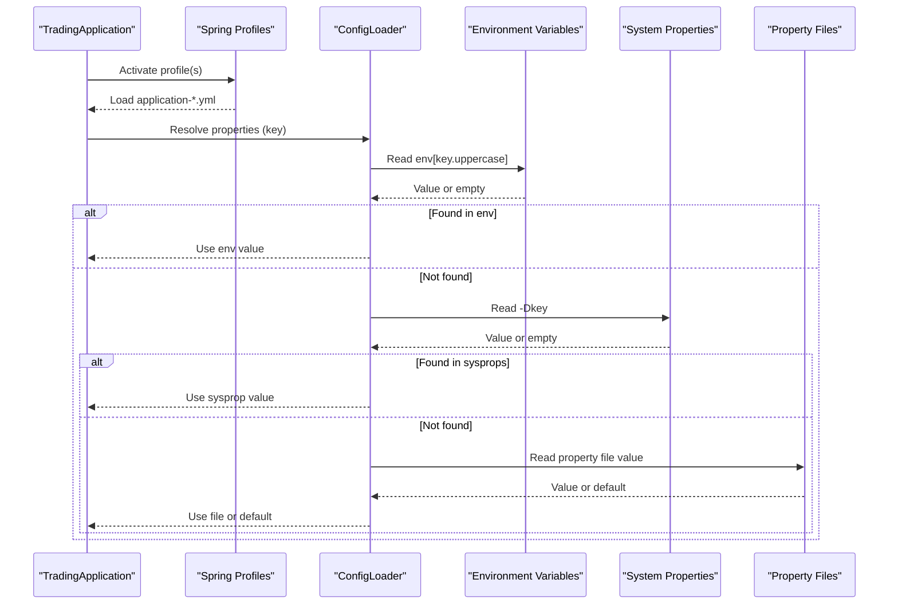
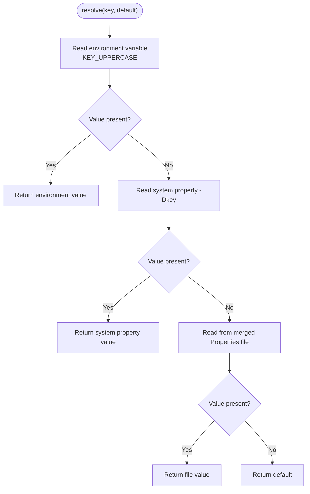
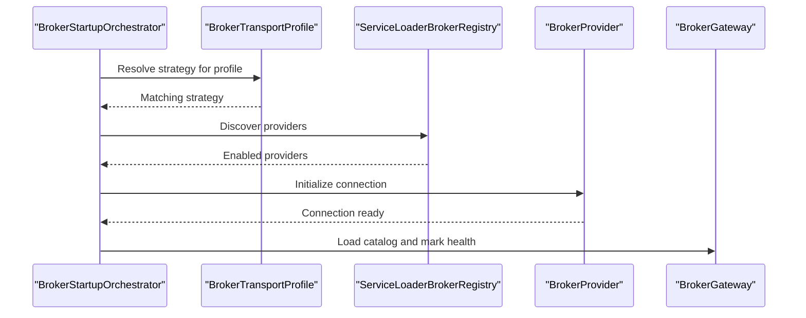
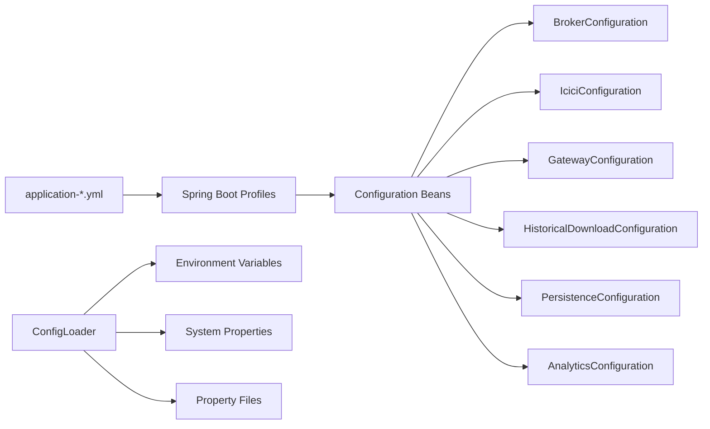

# Configuration Management

<cite>
**Referenced Files in This Document**
- [application.yml](file://app/src/main/resources/application.yml)
- [application-dev.yml](file://app/src/main/resources/application-dev.yml)
- [application-prod.yml](file://app/src/main/resources/application-prod.yml)
- [application-replay.yml](file://app/src/main/resources/application-replay.yml)
- [application-gateway.yml](file://app/src/main/resources/application-gateway.yml)
- [application-upstox-dev.yml](file://app/src/main/resources/application-upstox-dev.yml)
- [application-upstox-prod.yml](file://app/src/main/resources/application-upstox-prod.yml)
- [application-icici-prod.yml](file://app/src/main/resources/application-icici-prod.yml)
- [application-upstox-analytics.yml](file://app/src/main/resources/application-upstox-analytics.yml)
- [application-dev-live.yml](file://app/src/main/resources/application-dev-live.yml)
- [TradingApplication.java](file://app/src/main/java/com/tradej/app/TradingApplication.java)
- [ConfigLoader.java](file://composition/src/main/java/com/tradej/composition/config/ConfigLoader.java)
- [BrokerStartupOrchestrator.java](file://app/src/main/java/com/tradej/app/startup/BrokerStartupOrchestrator.java)
- [ServiceLoaderBrokerRegistry.java](file://broker-gateway/src/main/java/com/tradej/brokergateway/spi/ServiceLoaderBrokerRegistry.java)
- [PersistenceConfiguration.java](file://app/src/main/java/com/tradej/app/config/PersistenceConfiguration.java)
- [AnalyticsConfiguration.java](file://app/src/main/java/com/tradej/app/config/AnalyticsConfiguration.java)
- [BrokerConfiguration.java](file://app/src/main/java/com/tradej/app/config/BrokerConfiguration.java)
- [BrokerTransportProfile.java](file://app/src/main/java/com/tradej/app/config/BrokerTransportProfile.java)
- [GatewayConfiguration.java](file://app/src/main/java/com/tradej/app/config/GatewayConfiguration.java)
- [HistoricalDownloadConfiguration.java](file://app/src/main/java/com/tradej/app/config/HistoricalDownloadConfiguration.java)
- [IciciConfiguration.java](file://app/src/main/java/com/tradej/app/config/IciciConfiguration.java)
- [dhan-local.properties.example](file://config/dhan-local.properties.example)
- [icici-local.properties.example](file://config/icici-local.properties.example)
- [upstox-live.properties.example](file://config/upstox-live.properties.example)
- [upstox-sandbox.properties.example](file://config/upstox-sandbox.properties.example)
- [scan-profiles.json](file://config/scan-profiles.json)
</cite>

## Table of Contents
1. [Introduction](#introduction)
2. [Project Structure](#project-structure)
3. [Core Components](#core-components)
4. [Architecture Overview](#architecture-overview)
5. [Detailed Component Analysis](#detailed-component-analysis)
6. [Dependency Analysis](#dependency-analysis)
7. [Performance Considerations](#performance-considerations)
8. [Troubleshooting Guide](#troubleshooting-guide)
9. [Conclusion](#conclusion)
10. [Appendices](#appendices)

## Introduction
This document explains the configuration management system used across the TradeJ platform. It covers how properties are loaded and resolved, how environment-specific profiles are activated, and how runtime configuration updates are integrated with Spring Boot. It also documents broker-specific configurations, analytics settings, and persistence configuration, along with the configuration hierarchy, override mechanisms, validation processes, and best practices for setup and troubleshooting.

## Project Structure
Configuration is primarily managed through:
- Spring Boot YAML profiles under app/src/main/resources for application-wide settings
- Broker-specific Spring profiles for Upstox, ICICI, and gateway settings
- A framework-agnostic ConfigLoader for property resolution outside of Spring contexts
- Broker provider discovery via ServiceLoader for runtime broker selection
- Example property files for credentials and broker endpoints

```mermaid
graph TB
A["application.yml<br/>Base application settings"] --> B["application-dev.yml<br/>Dev overrides"]
A --> C["application-prod.yml<br/>Prod overrides"]
A --> D["application-replay.yml<br/>Replay mode"]
A --> E["application-gateway.yml<br/>Gateway settings"]
A --> F["application-upstox-dev.yml<br/>Upstox dev"]
A --> G["application-upstox-prod.yml<br/>Upstox prod"]
A --> H["application-icici-prod.yml<br/>ICICI prod"]
A --> I["application-upstox-analytics.yml<br/>Analytics overrides"]
A --> J["application-dev-live.yml<br/>Live dev overrides"]
K["ConfigLoader.java<br/>Framework-agnostic loader"] --> L["Environment variables"]
K --> M["System properties"]
K --> N["Property files"]
O["ServiceLoaderBrokerRegistry.java<br/>Broker discovery"] --> P["Broker providers"]
```

**Diagram sources**
- [application.yml](file://app/src/main/resources/application.yml)
- [application-dev.yml](file://app/src/main/resources/application-dev.yml)
- [application-prod.yml](file://app/src/main/resources/application-prod.yml)
- [application-replay.yml](file://app/src/main/resources/application-replay.yml)
- [application-gateway.yml](file://app/src/main/resources/application-gateway.yml)
- [application-upstox-dev.yml](file://app/src/main/resources/application-upstox-dev.yml)
- [application-upstox-prod.yml](file://app/src/main/resources/application-upstox-prod.yml)
- [application-icici-prod.yml](file://app/src/main/resources/application-icici-prod.yml)
- [application-upstox-analytics.yml](file://app/src/main/resources/application-upstox-analytics.yml)
- [application-dev-live.yml](file://app/src/main/resources/application-dev-live.yml)
- [ConfigLoader.java](file://composition/src/main/java/com/tradej/composition/config/ConfigLoader.java)
- [ServiceLoaderBrokerRegistry.java](file://broker-gateway/src/main/java/com/tradej/brokergateway/spi/ServiceLoaderBrokerRegistry.java)

**Section sources**
- [application.yml](file://app/src/main/resources/application.yml)
- [application-dev.yml](file://app/src/main/resources/application-dev.yml)
- [application-prod.yml](file://app/src/main/resources/application-prod.yml)
- [application-replay.yml](file://app/src/main/resources/application-replay.yml)
- [application-gateway.yml](file://app/src/main/resources/application-gateway.yml)
- [application-upstox-dev.yml](file://app/src/main/resources/application-upstox-dev.yml)
- [application-upstox-prod.yml](file://app/src/main/resources/application-upstox-prod.yml)
- [application-icici-prod.yml](file://app/src/main/resources/application-icici-prod.yml)
- [application-upstox-analytics.yml](file://app/src/main/resources/application-upstox-analytics.yml)
- [application-dev-live.yml](file://app/src/main/resources/application-dev-live.yml)
- [ConfigLoader.java](file://composition/src/main/java/com/tradej/composition/config/ConfigLoader.java)
- [ServiceLoaderBrokerRegistry.java](file://broker-gateway/src/main/java/com/tradej/brokergateway/spi/ServiceLoaderBrokerRegistry.java)

## Core Components
- Spring Boot application configuration via YAML profiles
- Broker-specific configuration beans and transport profiles
- Framework-agnostic property loader with environment variable and system property precedence
- Broker provider discovery via ServiceLoader for dynamic broker selection
- Persistence and analytics configuration beans

**Section sources**
- [TradingApplication.java](file://app/src/main/java/com/tradej/app/TradingApplication.java)
- [BrokerConfiguration.java](file://app/src/main/java/com/tradej/app/config/BrokerConfiguration.java)
- [BrokerTransportProfile.java](file://app/src/main/java/com/tradej/app/config/BrokerTransportProfile.java)
- [ConfigLoader.java](file://composition/src/main/java/com/tradej/composition/config/ConfigLoader.java)
- [ServiceLoaderBrokerRegistry.java](file://broker-gateway/src/main/java/com/tradej/brokergateway/spi/ServiceLoaderBrokerRegistry.java)
- [PersistenceConfiguration.java](file://app/src/main/java/com/tradej/app/config/PersistenceConfiguration.java)
- [AnalyticsConfiguration.java](file://app/src/main/java/com/tradej/app/config/AnalyticsConfiguration.java)

## Architecture Overview
The configuration system combines Spring Boot profiles with a custom property loader and broker provider discovery:

**Diagram sources**
- [TradingApplication.java](file://app/src/main/java/com/tradej/app/TradingApplication.java)
- [ConfigLoader.java](file://composition/src/main/java/com/tradej/composition/config/ConfigLoader.java)

## Detailed Component Analysis

### Property Loading and Resolution Mechanism
The framework-agnostic ConfigLoader resolves values using a strict precedence:
1. Environment variables (key normalized to uppercase, dots and hyphens to underscores)
2. System properties (-Dkey)
3. Property file values
4. Default fallback

It supports typed getters for strings, integers, longs, and booleans, and throws on required keys that are missing or blank.

**Diagram sources**
- [ConfigLoader.java](file://composition/src/main/java/com/tradej/composition/config/ConfigLoader.java)

**Section sources**
- [ConfigLoader.java](file://composition/src/main/java/com/tradej/composition/config/ConfigLoader.java)

### Environment-Specific Profiles
Profiles are defined in YAML files and activated via Spring Boot. Typical profiles include:
- Base: application.yml
- Dev: application-dev.yml, application-dev-live.yml
- Prod: application-prod.yml
- Replay: application-replay.yml
- Gateway: application-gateway.yml
- Broker-specific: application-upstox-dev.yml, application-upstox-prod.yml, application-icici-prod.yml
- Analytics: application-upstox-analytics.yml

Activation is handled by Spring Boot’s @SpringBootApplication and profile-specific tests that set profiles programmatically.

**Section sources**
- [application.yml](file://app/src/main/resources/application.yml)
- [application-dev.yml](file://app/src/main/resources/application-dev.yml)
- [application-prod.yml](file://app/src/main/resources/application-prod.yml)
- [application-replay.yml](file://app/src/main/resources/application-replay.yml)
- [application-gateway.yml](file://app/src/main/resources/application-gateway.yml)
- [application-upstox-dev.yml](file://app/src/main/resources/application-upstox-dev.yml)
- [application-upstox-prod.yml](file://app/src/main/resources/application-upstox-prod.yml)
- [application-icici-prod.yml](file://app/src/main/resources/application-icici-prod.yml)
- [application-upstox-analytics.yml](file://app/src/main/resources/application-upstox-analytics.yml)
- [application-dev-live.yml](file://app/src/main/resources/application-dev-live.yml)
- [TradingApplication.java](file://app/src/main/java/com/tradej/app/TradingApplication.java)

### Runtime Configuration Updates and Broker Routing
Broker routing and startup orchestration rely on:
- BrokerTransportProfile to select appropriate startup strategies
- BrokerStartupOrchestrator to load catalogs and manage health state
- ServiceLoaderBrokerRegistry to discover broker providers at runtime

**Diagram sources**
- [BrokerStartupOrchestrator.java](file://app/src/main/java/com/tradej/app/startup/BrokerStartupOrchestrator.java)
- [BrokerTransportProfile.java](file://app/src/main/java/com/tradej/app/config/BrokerTransportProfile.java)
- [ServiceLoaderBrokerRegistry.java](file://broker-gateway/src/main/java/com/tradej/brokergateway/spi/ServiceLoaderBrokerRegistry.java)

**Section sources**
- [BrokerStartupOrchestrator.java](file://app/src/main/java/com/tradej/app/startup/BrokerStartupOrchestrator.java)
- [BrokerTransportProfile.java](file://app/src/main/java/com/tradej/app/config/BrokerTransportProfile.java)
- [ServiceLoaderBrokerRegistry.java](file://broker-gateway/src/main/java/com/tradej/brokergateway/spi/ServiceLoaderBrokerRegistry.java)

### Broker-Specific Configurations
Broker configurations are encapsulated in dedicated Spring configuration classes:
- BrokerConfiguration: Centralizes broker-related settings
- IciciConfiguration: ICICI broker settings
- GatewayConfiguration: Gateway transport and routing settings
- HistoricalDownloadConfiguration: Historical data ingestion settings

These beans are loaded through Spring’s @Configuration and @EnableConfigurationProperties, and can be overridden by broker-specific profiles.

**Section sources**
- [BrokerConfiguration.java](file://app/src/main/java/com/tradej/app/config/BrokerConfiguration.java)
- [IciciConfiguration.java](file://app/src/main/java/com/tradej/app/config/IciciConfiguration.java)
- [GatewayConfiguration.java](file://app/src/main/java/com/tradej/app/config/GatewayConfiguration.java)
- [HistoricalDownloadConfiguration.java](file://app/src/main/java/com/tradej/app/config/HistoricalDownloadConfiguration.java)

### Analytics Settings
Analytics configuration is provided by AnalyticsConfiguration and can be further specialized via application-upstox-analytics.yml. This enables broker-specific analytics overrides and feature toggles.

**Section sources**
- [AnalyticsConfiguration.java](file://app/src/main/java/com/tradej/app/config/AnalyticsConfiguration.java)
- [application-upstox-analytics.yml](file://app/src/main/resources/application-upstox-analytics.yml)

### Persistence Configuration
Persistence settings are centralized in PersistenceConfiguration and can be tuned per environment via application-*.yml files. This includes storage backends, connection pools, and retention policies.

**Section sources**
- [PersistenceConfiguration.java](file://app/src/main/java/com/tradej/app/config/PersistenceConfiguration.java)

### Credential Management
Credentials and broker endpoints are provided via example property files:
- dhan-local.properties.example
- icici-local.properties.example
- upstox-live.properties.example
- upstox-sandbox.properties.example

These files demonstrate the expected keys and should be copied to local properties files and populated with real secrets. They are referenced by broker configuration classes and loaded by ConfigLoader when needed outside of Spring contexts.

**Section sources**
- [dhan-local.properties.example](file://config/dhan-local.properties.example)
- [icici-local.properties.example](file://config/icici-local.properties.example)
- [upstox-live.properties.example](file://config/upstox-live.properties.example)
- [upstox-sandbox.properties.example](file://config/upstox-sandbox.properties.example)
- [ConfigLoader.java](file://composition/src/main/java/com/tradej/composition/config/ConfigLoader.java)

### Configuration Hierarchy and Override Mechanisms
The effective configuration follows this precedence:
1. Environment variables (highest)
2. System properties
3. Broker-specific YAML profiles
4. Base YAML profile
5. Defaults in code

Spring Boot merges application-*.yml files, and broker-specific profiles further refine settings. Typed getters in ConfigLoader enforce validation and type conversion.

**Section sources**
- [application.yml](file://app/src/main/resources/application.yml)
- [application-upstox-dev.yml](file://app/src/main/resources/application-upstox-dev.yml)
- [application-upstox-prod.yml](file://app/src/main/resources/application-upstox-prod.yml)
- [application-icici-prod.yml](file://app/src/main/resources/application-icici-prod.yml)
- [ConfigLoader.java](file://composition/src/main/java/com/tradej/composition/config/ConfigLoader.java)

### Validation Processes
- Required keys: ConfigLoader.require throws if a key is missing or blank
- Type conversion: getInt/getLong/getBoolean parse and validate numeric/boolean values
- Broker profile validation: BrokerStartupOrchestrator ensures a matching startup strategy exists for the given profile

**Section sources**
- [ConfigLoader.java](file://composition/src/main/java/com/tradej/composition/config/ConfigLoader.java)
- [BrokerStartupOrchestrator.java](file://app/src/main/java/com/tradej/app/startup/BrokerStartupOrchestrator.java)

## Dependency Analysis
Configuration dependencies span Spring Boot profiles, broker configuration beans, and the ConfigLoader:

**Diagram sources**
- [application.yml](file://app/src/main/resources/application.yml)
- [BrokerConfiguration.java](file://app/src/main/java/com/tradej/app/config/BrokerConfiguration.java)
- [IciciConfiguration.java](file://app/src/main/java/com/tradej/app/config/IciciConfiguration.java)
- [GatewayConfiguration.java](file://app/src/main/java/com/tradej/app/config/GatewayConfiguration.java)
- [HistoricalDownloadConfiguration.java](file://app/src/main/java/com/tradej/app/config/HistoricalDownloadConfiguration.java)
- [PersistenceConfiguration.java](file://app/src/main/java/com/tradej/app/config/PersistenceConfiguration.java)
- [AnalyticsConfiguration.java](file://app/src/main/java/com/tradej/app/config/AnalyticsConfiguration.java)
- [ConfigLoader.java](file://composition/src/main/java/com/tradej/composition/config/ConfigLoader.java)

**Section sources**
- [application.yml](file://app/src/main/resources/application.yml)
- [BrokerConfiguration.java](file://app/src/main/java/com/tradej/app/config/BrokerConfiguration.java)
- [IciciConfiguration.java](file://app/src/main/java/com/tradej/app/config/IciciConfiguration.java)
- [GatewayConfiguration.java](file://app/src/main/java/com/tradej/app/config/GatewayConfiguration.java)
- [HistoricalDownloadConfiguration.java](file://app/src/main/java/com/tradej/app/config/HistoricalDownloadConfiguration.java)
- [PersistenceConfiguration.java](file://app/src/main/java/com/tradej/app/config/PersistenceConfiguration.java)
- [AnalyticsConfiguration.java](file://app/src/main/java/com/tradej/app/config/AnalyticsConfiguration.java)
- [ConfigLoader.java](file://composition/src/main/java/com/tradej/composition/config/ConfigLoader.java)

## Performance Considerations
- Prefer environment variables for high-frequency overrides to avoid repeated file reads
- Minimize the number of property files to reduce merge overhead
- Use broker-specific profiles to limit configuration surface area during runtime
- Cache resolved properties when using ConfigLoader in hot paths

## Troubleshooting Guide
Common issues and resolutions:
- Missing required configuration: Use ConfigLoader.require to identify missing keys; populate environment variables or property files accordingly
- Wrong type conversion: Ensure numeric/boolean values are correctly formatted in property files or environment variables
- Profile not activating: Verify the correct Spring profile is active and that the corresponding application-*.yml exists
- Broker not discovered: Confirm broker provider registration via ServiceLoader and that providers are enabled
- Analytics or persistence misconfiguration: Cross-check broker-specific YAML overrides and base YAML settings

**Section sources**
- [ConfigLoader.java](file://composition/src/main/java/com/tradej/composition/config/ConfigLoader.java)
- [ServiceLoaderBrokerRegistry.java](file://broker-gateway/src/main/java/com/tradej/brokergateway/spi/ServiceLoaderBrokerRegistry.java)
- [TradingApplication.java](file://app/src/main/java/com/tradej/app/TradingApplication.java)

## Conclusion
The TradeJ configuration system blends Spring Boot profiles with a robust, framework-agnostic property loader and dynamic broker provider discovery. By understanding the precedence, leveraging environment variables for runtime updates, and using broker-specific profiles, teams can maintain flexible, validated, and observable configurations across environments.

## Appendices

### Practical Examples

- Activating a profile
  - Use Spring Boot’s active profile to load application-*.yml
  - Example: application-prod.yml for production settings

- Setting credentials
  - Copy example property files to local properties and populate secrets
  - Keys are resolved via ConfigLoader with environment variable precedence

- Broker profile activation
  - Select a broker transport profile and ensure a matching startup strategy exists
  - Use ServiceLoaderBrokerRegistry to discover providers

- Analytics and persistence tuning
  - Override analytics and persistence settings via application-upstox-analytics.yml and base YAML files

**Section sources**
- [application-prod.yml](file://app/src/main/resources/application-prod.yml)
- [dhan-local.properties.example](file://config/dhan-local.properties.example)
- [icici-local.properties.example](file://config/icici-local.properties.example)
- [upstox-live.properties.example](file://config/upstox-live.properties.example)
- [upstox-sandbox.properties.example](file://config/upstox-sandbox.properties.example)
- [application-upstox-analytics.yml](file://app/src/main/resources/application-upstox-analytics.yml)
- [BrokerStartupOrchestrator.java](file://app/src/main/java/com/tradej/app/startup/BrokerStartupOrchestrator.java)
- [ServiceLoaderBrokerRegistry.java](file://broker-gateway/src/main/java/com/tradej/brokergateway/spi/ServiceLoaderBrokerRegistry.java)