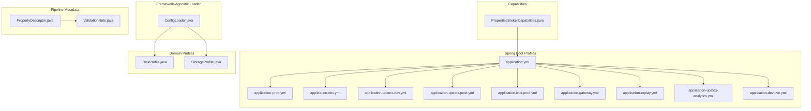
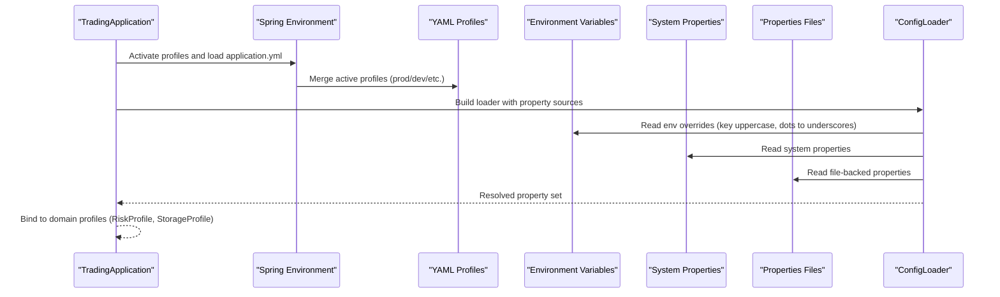
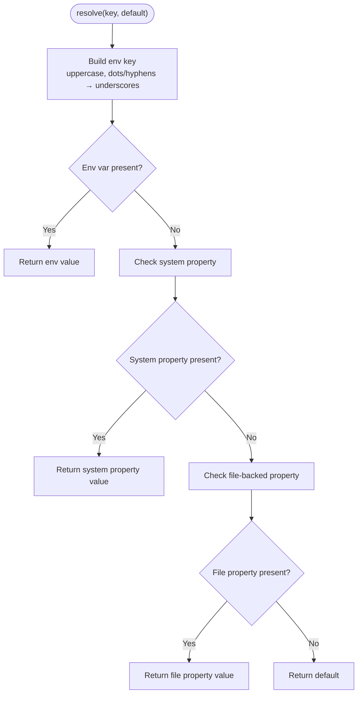
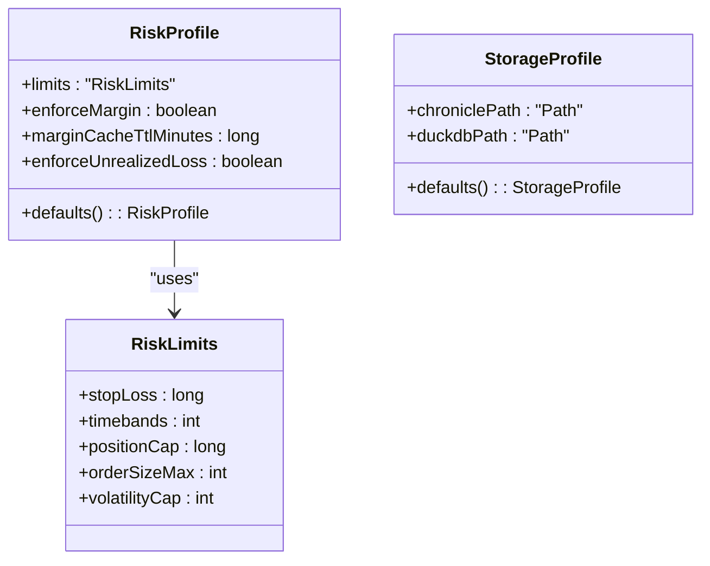
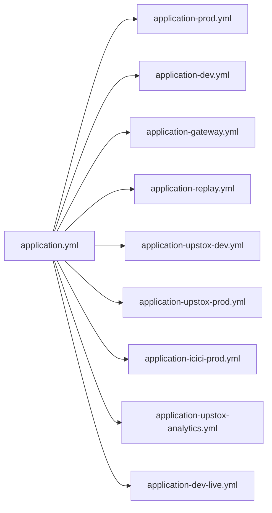
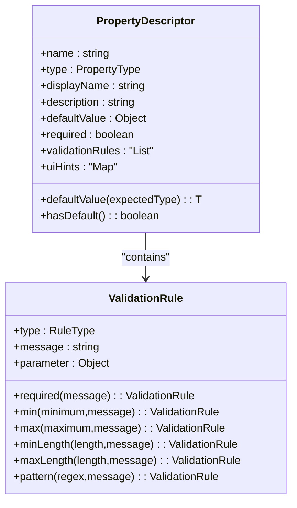
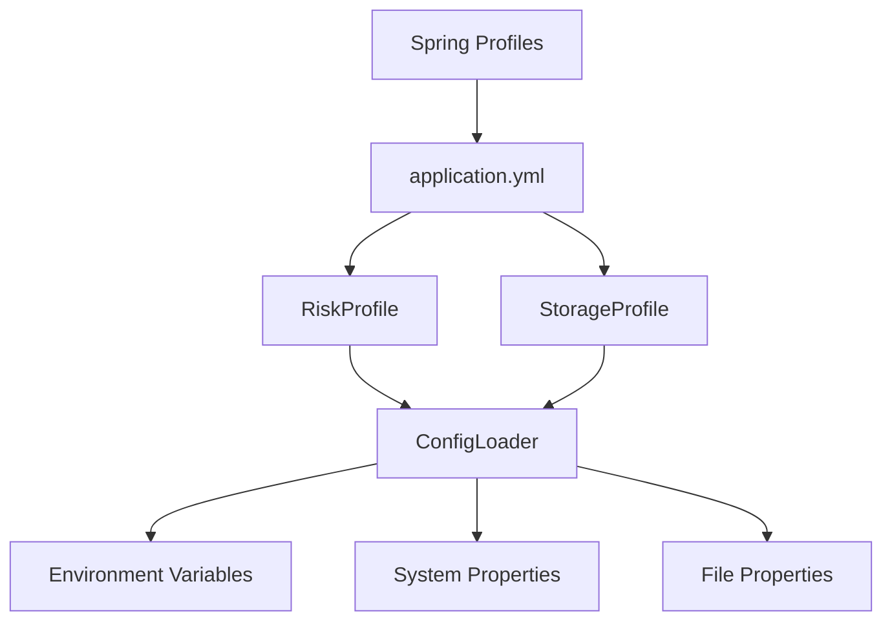

# Configuration System

<cite>
**Referenced Files in This Document**
- [ConfigLoader.java](file://composition/src/main/java/com/tradej/composition/config/ConfigLoader.java)
- [RiskProfile.java](file://composition/src/main/java/com/tradej/composition/config/RiskProfile.java)
- [StorageProfile.java](file://composition/src/main/java/com/tradej/composition/config/StorageProfile.java)
- [application.yml](file://app/src/main/resources/application.yml)
- [application-prod.yml](file://app/src/main/resources/application-prod.yml)
- [application-dev.yml](file://app/src/main/resources/application-dev.yml)
- [application-upstox-dev.yml](file://app/src/main/resources/application-upstox-dev.yml)
- [application-upstox-prod.yml](file://app/src/main/resources/application-upstox-prod.yml)
- [application-icici-prod.yml](file://app/src/main/resources/application-icici-prod.yml)
- [application-gateway.yml](file://app/src/main/resources/application-gateway.yml)
- [application-replay.yml](file://app/src/main/resources/application-replay.yml)
- [application-upstox-analytics.yml](file://app/src/main/resources/application-upstox-analytics.yml)
- [application-dev-live.yml](file://app/src/main/resources/application-dev-live.yml)
- [PropertiesBrokerCapabilities.java](file://app/src/main/java/com/tradej/app/config/PropertiesBrokerCapabilities.java)
- [GatewayProfileContextComponentTest.java](file://app/src/test/java/com/tradej/app/config/GatewayProfileContextComponentTest.java)
- [RuntimeConfigurationTest.java](file://app/src/test/java/com/tradej/app/config/RuntimeConfigurationTest.java)
- [LiveDhanTestSupport.java](file://app/src/test/java/com/tradej/app/integration/LiveDhanTestSupport.java)
- [LiveUpstoxTestSupport.java](file://app/src/test/java/com/tradej/app/integration/LiveUpstoxTestSupport.java)
- [LiveIciciTestSupport.java](file://app/src/test/java/com/tradej/app/integration/LiveIciciTestSupport.java)
- [GatewayLiveBenchmark.java](file://app/src/test/java/com/tradej/app/integration/GatewayLiveBenchmark.java)
- [PropertyDescriptor.java](file://pipeline/platform/trade-pipeline-platform/src/main/java/com/tradej/pipeline/platform/model/PropertyDescriptor.java)
- [ValidationRule.java](file://pipeline/platform/trade-pipeline-platform/src/main/java/com/tradej/pipeline/platform/model/ValidationRule.java)
</cite>

## Table of Contents
1. [Introduction](#introduction)
2. [Project Structure](#project-structure)
3. [Core Components](#core-components)
4. [Architecture Overview](#architecture-overview)
5. [Detailed Component Analysis](#detailed-component-analysis)
6. [Dependency Analysis](#dependency-analysis)
7. [Performance Considerations](#performance-considerations)
8. [Troubleshooting Guide](#troubleshooting-guide)
9. [Conclusion](#conclusion)
10. [Appendices](#appendices)

## Introduction
This document explains the core configuration system used across the TradeJ application. It covers how properties are loaded and resolved, the configuration hierarchy, validation mechanisms, and the integration with Spring Boot’s configuration management. It also documents the framework-agnostic ConfigLoader, the configuration classes RiskProfile and StorageProfile, and provides practical examples for setup, property binding, and runtime updates. Finally, it offers best practices and troubleshooting guidance.

## Project Structure
The configuration system spans several areas:
- Framework-agnostic property loading via ConfigLoader
- Spring Boot application configuration files (YAML profiles)
- Domain-specific configuration records (RiskProfile, StorageProfile)
- Broker capabilities derived from YAML
- Pipeline configuration metadata and validation rules
- Tests demonstrating profile activation and runtime configuration behavior

**Diagram sources**
- [ConfigLoader.java:1-105](file://composition/src/main/java/com/tradej/composition/config/ConfigLoader.java#L1-L105)
- [application.yml:1-200](file://app/src/main/resources/application.yml#L1-L200)
- [application-prod.yml:1-120](file://app/src/main/resources/application-prod.yml#L1-L120)
- [application-dev.yml:1-120](file://app/src/main/resources/application-dev.yml#L1-L120)
- [application-upstox-dev.yml:1-120](file://app/src/main/resources/application-upstox-dev.yml#L1-L120)
- [application-upstox-prod.yml:1-120](file://app/src/main/resources/application-upstox-prod.yml#L1-L120)
- [application-icici-prod.yml:1-120](file://app/src/main/resources/application-icici-prod.yml#L1-L120)
- [application-gateway.yml:1-120](file://app/src/main/resources/application-gateway.yml#L1-L120)
- [application-replay.yml:1-120](file://app/src/main/resources/application-replay.yml#L1-L120)
- [application-upstox-analytics.yml:1-120](file://app/src/main/resources/application-upstox-analytics.yml#L1-L120)
- [application-dev-live.yml:1-120](file://app/src/main/resources/application-dev-live.yml#L1-L120)
- [RiskProfile.java:1-17](file://composition/src/main/java/com/tradej/composition/config/RiskProfile.java#L1-L17)
- [StorageProfile.java:1-15](file://composition/src/main/java/com/tradej/composition/config/StorageProfile.java#L1-L15)
- [PropertiesBrokerCapabilities.java:1-35](file://app/src/main/java/com/tradej/app/config/PropertiesBrokerCapabilities.java#L1-L35)
- [PropertyDescriptor.java:1-64](file://pipeline/platform/trade-pipeline-platform/src/main/java/com/tradej/pipeline/platform/model/PropertyDescriptor.java#L1-L64)
- [ValidationRule.java:1-44](file://pipeline/platform/trade-pipeline-platform/src/main/java/com/tradej/pipeline/platform/model/ValidationRule.java#L1-L44)

**Section sources**
- [application.yml:1-200](file://app/src/main/resources/application.yml#L1-L200)
- [application-prod.yml:1-120](file://app/src/main/resources/application-prod.yml#L1-L120)
- [application-dev.yml:1-120](file://app/src/main/resources/application-dev.yml#L1-L120)
- [application-upstox-dev.yml:1-120](file://app/src/main/resources/application-upstox-dev.yml#L1-L120)
- [application-upstox-prod.yml:1-120](file://app/src/main/resources/application-upstox-prod.yml#L1-L120)
- [application-icici-prod.yml:1-120](file://app/src/main/resources/application-icici-prod.yml#L1-L120)
- [application-gateway.yml:1-120](file://app/src/main/resources/application-gateway.yml#L1-L120)
- [application-replay.yml:1-120](file://app/src/main/resources/application-replay.yml#L1-L120)
- [application-upstox-analytics.yml:1-120](file://app/src/main/resources/application-upstox-analytics.yml#L1-L120)
- [application-dev-live.yml:1-120](file://app/src/main/resources/application-dev-live.yml#L1-L120)

## Core Components
- ConfigLoader: A framework-agnostic property loader that merges properties from multiple sources and resolves values via environment variables, system properties, and file-backed properties. It supports typed getters and required-value validation.
- RiskProfile: A record encapsulating risk limits and enforcement flags, with sensible defaults.
- StorageProfile: A record defining storage locations for runtime artifacts, with defaults suitable for development and production.

Key responsibilities:
- Property precedence and resolution
- Typed property extraction
- Required property validation
- Domain-specific configuration modeling

**Section sources**
- [ConfigLoader.java:1-105](file://composition/src/main/java/com/tradej/composition/config/ConfigLoader.java#L1-L105)
- [RiskProfile.java:1-17](file://composition/src/main/java/com/tradej/composition/config/RiskProfile.java#L1-L17)
- [StorageProfile.java:1-15](file://composition/src/main/java/com/tradej/composition/config/StorageProfile.java#L1-L15)

## Architecture Overview
The configuration system blends a framework-agnostic loader with Spring Boot’s layered configuration. At runtime, Spring activates profiles and loads YAML files. The ConfigLoader complements this by reading additional property sources and environment variables, ensuring robust override semantics.

**Diagram sources**
- [ConfigLoader.java:89-104](file://composition/src/main/java/com/tradej/composition/config/ConfigLoader.java#L89-L104)
- [application.yml:1-200](file://app/src/main/resources/application.yml#L1-L200)

## Detailed Component Analysis

### ConfigLoader: Property Loading and Resolution
ConfigLoader reads properties from files and environment/system properties, merging them into a single in-memory store. Resolution follows a strict precedence:
1. Environment variables (uppercase key, dots and hyphens converted to underscores)
2. System properties
3. File-backed properties
4. Default value if none of the above match

It provides:
- Typed getters for String, int, long, boolean
- A require method for mandatory keys
- A snapshot of merged properties

**Diagram sources**
- [ConfigLoader.java:89-104](file://composition/src/main/java/com/tradej/composition/config/ConfigLoader.java#L89-L104)

Practical usage examples:
- Binding a broker capability map from YAML into a capabilities object
- Constructing RiskProfile and StorageProfile from merged properties
- Using require for mandatory keys during startup

**Section sources**
- [ConfigLoader.java:1-105](file://composition/src/main/java/com/tradej/composition/config/ConfigLoader.java#L1-L105)
- [PropertiesBrokerCapabilities.java:1-35](file://app/src/main/java/com/tradej/app/config/PropertiesBrokerCapabilities.java#L1-L35)

### RiskProfile and StorageProfile
These records encapsulate domain-specific configuration:
- RiskProfile: Holds risk limits, margin enforcement flags, cache TTL, and unrealized loss enforcement. Defaults are provided for safe operation.
- StorageProfile: Defines filesystem paths for Chronicle and DuckDB storage with sensible defaults.

**Diagram sources**
- [RiskProfile.java:1-17](file://composition/src/main/java/com/tradej/composition/config/RiskProfile.java#L1-L17)
- [StorageProfile.java:1-15](file://composition/src/main/java/com/tradej/composition/config/StorageProfile.java#L1-L15)

**Section sources**
- [RiskProfile.java:1-17](file://composition/src/main/java/com/tradej/composition/config/RiskProfile.java#L1-L17)
- [StorageProfile.java:1-15](file://composition/src/main/java/com/tradej/composition/config/StorageProfile.java#L1-L15)

### Spring Boot Configuration Hierarchy and Property Sources
Spring Boot activates profiles and merges YAML files. The hierarchy typically includes:
- Base application.yml
- Environment-specific overlays (prod, dev, gateway, replay, analytics)
- Broker-specific overlays (upstox, icici)
- Additional environment-specific files (dev-live)

Tests demonstrate activating specific profiles and initializing beans conditionally, indicating how runtime mode and broker selection influence configuration.

**Diagram sources**
- [application.yml:1-200](file://app/src/main/resources/application.yml#L1-L200)
- [application-prod.yml:1-120](file://app/src/main/resources/application-prod.yml#L1-L120)
- [application-dev.yml:1-120](file://app/src/main/resources/application-dev.yml#L1-L120)
- [application-gateway.yml:1-120](file://app/src/main/resources/application-gateway.yml#L1-L120)
- [application-replay.yml:1-120](file://app/src/main/resources/application-replay.yml#L1-L120)
- [application-upstox-dev.yml:1-120](file://app/src/main/resources/application-upstox-dev.yml#L1-L120)
- [application-upstox-prod.yml:1-120](file://app/src/main/resources/application-upstox-prod.yml#L1-L120)
- [application-icici-prod.yml:1-120](file://app/src/main/resources/application-icici-prod.yml#L1-L120)
- [application-upstox-analytics.yml:1-120](file://app/src/main/resources/application-upstox-analytics.yml#L1-L120)
- [application-dev-live.yml:1-120](file://app/src/main/resources/application-dev-live.yml#L1-L120)

**Section sources**
- [application.yml:1-200](file://app/src/main/resources/application.yml#L1-L200)
- [GatewayProfileContextComponentTest.java:1-200](file://app/src/test/java/com/tradej/app/config/GatewayProfileContextComponentTest.java#L1-L200)
- [RuntimeConfigurationTest.java:1-200](file://app/src/test/java/com/tradej/app/config/RuntimeConfigurationTest.java#L1-L200)
- [GatewayLiveBenchmark.java:49-65](file://app/src/test/java/com/tradej/app/integration/GatewayLiveBenchmark.java#L49-L65)

### Property Binding and Runtime Updates
- Broker capabilities are bound from YAML via PropertiesBrokerCapabilities, enabling dynamic configuration per venue without code changes.
- Tests show runtime configuration behavior and profile activation patterns, indicating that configuration can be influenced by active Spring profiles and environment variables.

Practical examples:
- Binding venue capabilities from application.yml → trade.venues
- Using environment variables to override keys (e.g., my.property becomes MY_PROPERTY)
- Leveraging system properties for JVM-level overrides

**Section sources**
- [PropertiesBrokerCapabilities.java:1-35](file://app/src/main/java/com/tradej/app/config/PropertiesBrokerCapabilities.java#L1-L35)
- [ConfigLoader.java:89-104](file://composition/src/main/java/com/tradej/composition/config/ConfigLoader.java#L89-L104)
- [LiveDhanTestSupport.java:215-248](file://app/src/test/java/com/tradej/app/integration/LiveDhanTestSupport.java#L215-L248)
- [LiveUpstoxTestSupport.java:169-199](file://app/src/test/java/com/tradej/app/integration/LiveUpstoxTestSupport.java#L169-L199)
- [LiveIciciTestSupport.java:150-175](file://app/src/test/java/com/tradej/app/integration/LiveIciciTestSupport.java#L150-L175)

### Pipeline Configuration Metadata and Validation
Pipeline nodes expose self-describing configuration via PropertyDescriptor and ValidationRule. These enable:
- Frontend rendering of configuration panels
- Server-side validation before accepting pipeline definitions

**Diagram sources**
- [PropertyDescriptor.java:1-64](file://pipeline/platform/trade-pipeline-platform/src/main/java/com/tradej/pipeline/platform/model/PropertyDescriptor.java#L1-L64)
- [ValidationRule.java:1-44](file://pipeline/platform/trade-pipeline-platform/src/main/java/com/tradej/pipeline/platform/model/ValidationRule.java#L1-L44)

**Section sources**
- [PropertyDescriptor.java:1-64](file://pipeline/platform/trade-pipeline-platform/src/main/java/com/tradej/pipeline/platform/model/PropertyDescriptor.java#L1-L64)
- [ValidationRule.java:1-44](file://pipeline/platform/trade-pipeline-platform/src/main/java/com/tradej/pipeline/platform/model/ValidationRule.java#L1-L44)

## Dependency Analysis
The configuration system exhibits low coupling and high cohesion:
- ConfigLoader depends only on Java standard library APIs and does not rely on Spring, enabling reuse outside of Spring contexts.
- RiskProfile and StorageProfile depend on domain types and are constructed from resolved properties.
- Spring Boot manages YAML profiles and property sources, while ConfigLoader handles environment/system overrides.

Potential circular dependencies:
- None observed among the analyzed components.

External dependencies:
- Spring Boot for profile activation and YAML parsing
- Java Properties and environment/system property APIs for overrides

**Diagram sources**
- [ConfigLoader.java:1-105](file://composition/src/main/java/com/tradej/composition/config/ConfigLoader.java#L1-L105)
- [application.yml:1-200](file://app/src/main/resources/application.yml#L1-L200)
- [RiskProfile.java:1-17](file://composition/src/main/java/com/tradej/composition/config/RiskProfile.java#L1-L17)
- [StorageProfile.java:1-15](file://composition/src/main/java/com/tradej/composition/config/StorageProfile.java#L1-L15)

**Section sources**
- [ConfigLoader.java:1-105](file://composition/src/main/java/com/tradej/composition/config/ConfigLoader.java#L1-L105)
- [application.yml:1-200](file://app/src/main/resources/application.yml#L1-L200)

## Performance Considerations
- Property resolution is O(1) per lookup due to in-memory Properties and environment/system property maps.
- Merging multiple property files is linear in the total number of entries.
- Environment variable lookups are fast but should avoid excessive use of deeply nested keys to prevent long environment variable names.
- Prefer default values to minimize repeated checks.

## Troubleshooting Guide
Common issues and resolutions:
- Missing required property: Use the require method to surface missing keys early. Verify environment variables and system properties are correctly named (uppercase, dots/hyphens converted to underscores).
- Wrong precedence: Confirm the intended override source. Environment variables take precedence over system properties, which take precedence over file-backed properties.
- YAML profile not applied: Ensure the correct Spring profile is active and that the overlay files exist and are properly formatted.
- Broker capability misconfiguration: Validate the venue configuration under the expected YAML path and confirm PropertiesBrokerCapabilities receives a non-empty map.

Evidence from tests:
- Profile activation and bean initialization patterns indicate that runtime mode and broker selection affect configuration availability.
- Property loading helpers demonstrate how properties are discovered and loaded from various locations.

**Section sources**
- [ConfigLoader.java:51-57](file://composition/src/main/java/com/tradej/composition/config/ConfigLoader.java#L51-L57)
- [ConfigLoader.java:89-104](file://composition/src/main/java/com/tradej/composition/config/ConfigLoader.java#L89-L104)
- [GatewayProfileContextComponentTest.java:1-200](file://app/src/test/java/com/tradej/app/config/GatewayProfileContextComponentTest.java#L1-L200)
- [RuntimeConfigurationTest.java:1-200](file://app/src/test/java/com/tradej/app/config/RuntimeConfigurationTest.java#L1-L200)
- [LiveDhanTestSupport.java:215-248](file://app/src/test/java/com/tradej/app/integration/LiveDhanTestSupport.java#L215-L248)
- [LiveUpstoxTestSupport.java:169-199](file://app/src/test/java/com/tradej/app/integration/LiveUpstoxTestSupport.java#L169-L199)
- [LiveIciciTestSupport.java:150-175](file://app/src/test/java/com/tradej/app/integration/LiveIciciTestSupport.java#L150-L175)

## Conclusion
The TradeJ configuration system combines a robust, framework-agnostic loader with Spring Boot’s layered YAML profiles. ConfigLoader ensures predictable precedence and typed access, while RiskProfile and StorageProfile provide domain-focused defaults. Together with pipeline metadata validation, this design enables safe, flexible, and observable configuration across environments and runtime modes.

## Appendices

### Property Precedence Rules
1. Environment variables (key normalized to uppercase, dots/hyphens to underscores)
2. System properties
3. File-backed properties
4. Default value

**Section sources**
- [ConfigLoader.java:89-104](file://composition/src/main/java/com/tradej/composition/config/ConfigLoader.java#L89-L104)

### Environment Variable Overrides
- Keys are uppercased and special characters converted to underscores.
- Example: my.property → MY_PROPERTY

**Section sources**
- [ConfigLoader.java:89-94](file://composition/src/main/java/com/tradej/composition/config/ConfigLoader.java#L89-L94)

### Practical Setup Examples
- Define broker capabilities in YAML under the expected venue path; PropertiesBrokerCapabilities constructs capabilities from this map.
- Use environment variables to override sensitive or environment-specific settings.
- Select Spring profiles via application arguments or environment to activate appropriate overlays.

**Section sources**
- [PropertiesBrokerCapabilities.java:1-35](file://app/src/main/java/com/tradej/app/config/PropertiesBrokerCapabilities.java#L1-L35)
- [application.yml:1-200](file://app/src/main/resources/application.yml#L1-L200)
- [GatewayLiveBenchmark.java:49-65](file://app/src/test/java/com/tradej/app/integration/GatewayLiveBenchmark.java#L49-L65)