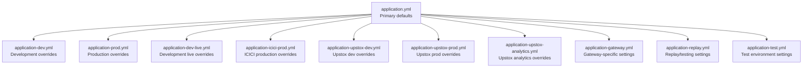
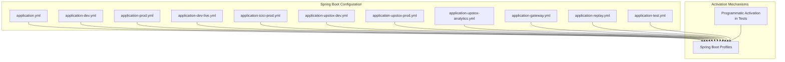
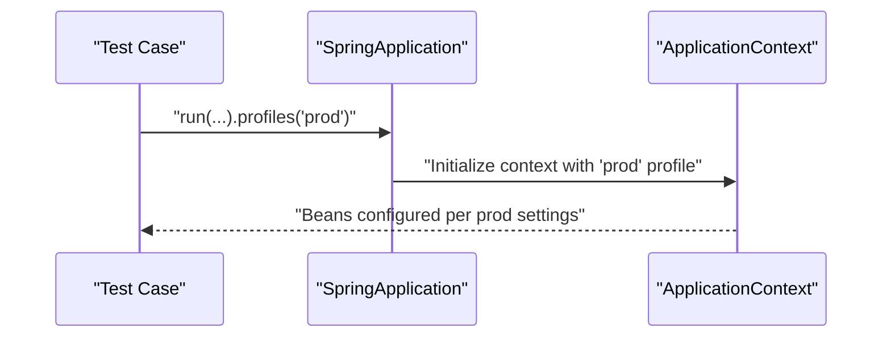
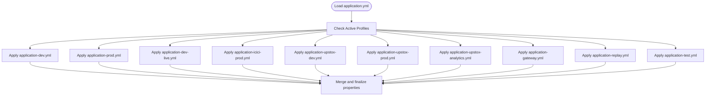
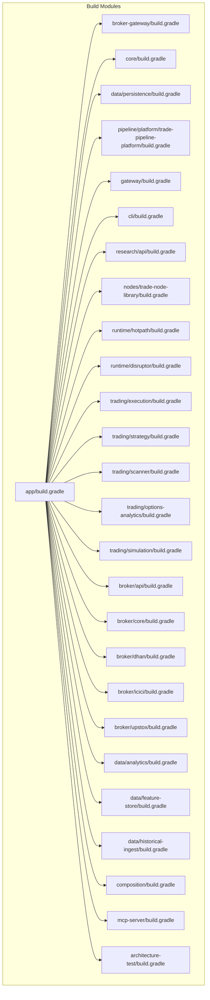

# Environment Profiles

<cite>
**Referenced Files in This Document**
- [application.yml](file://app/src/main/resources/application.yml)
- [application-dev.yml](file://app/src/main/resources/application-dev.yml)
- [application-dev-live.yml](file://app/src/main/resources/application-dev-live.yml)
- [application-prod.yml](file://app/src/main/resources/application-prod.yml)
- [application-icici-prod.yml](file://app/src/main/resources/application-icici-prod.yml)
- [application-upstox-dev.yml](file://app/src/main/resources/application-upstox-dev.yml)
- [application-upstox-prod.yml](file://app/src/main/resources/application-upstox-prod.yml)
- [application-upstox-analytics.yml](file://app/src/main/resources/application-upstox-analytics.yml)
- [application-gateway.yml](file://app/src/main/resources/application-gateway.yml)
- [application-replay.yml](file://app/src/main/resources/application-replay.yml)
- [application-test.yml](file://app/src/main/resources/application-test.yml)
- [TradingApplication.java](file://app/src/main/java/com/tradej/app/TradingApplication.java)
- [GatewayLiveBenchmark.java](file://app/src/test/java/com/tradej/app/integration/GatewayLiveBenchmark.java)
- [ConfigLoader.java](file://composition/src/main/java/com/tradej/composition/config/ConfigLoader.java)
- [build.gradle](file://app/build.gradle)
- [build.gradle](file://broker-gateway/build.gradle)
- [build.gradle](file://core/build.gradle)
- [build.gradle](file://data/persistence/build.gradle)
- [build.gradle](file://pipeline/platform/trade-pipeline-platform/build.gradle)
- [build.gradle](file://gateway/build.gradle)
- [build.gradle](file://cli/build.gradle)
- [build.gradle](file://research/api/build.gradle)
- [build.gradle](file://nodes/trade-node-library/build.gradle)
- [build.gradle](file://runtime/hotpath/build.gradle)
- [build.gradle](file://runtime/disruptor/build.gradle)
- [build.gradle](file://trading/execution/build.gradle)
- [build.gradle](file://trading/strategy/build.gradle)
- [build.gradle](file://trading/scanner/build.gradle)
- [build.gradle](file://trading/options-analytics/build.gradle)
- [build.gradle](file://trading/simulation/build.gradle)
- [build.gradle](file://broker/api/build.gradle)
- [build.gradle](file://broker/core/build.gradle)
- [build.gradle](file://broker/dhan/build.gradle)
- [build.gradle](file://broker/icici/build.gradle)
- [build.gradle](file://broker/upstox/build.gradle)
- [build.gradle](file://data/analytics/build.gradle)
- [build.gradle](file://data/feature-store/build.gradle)
- [build.gradle](file://data/historical-ingest/build.gradle)
- [build.gradle](file://composition/build.gradle)
- [build.gradle](file://mcp-server/build.gradle)
- [build.gradle](file://architecture-test/build.gradle)
</cite>

## Table of Contents
1. [Introduction](#introduction)
2. [Project Structure](#project-structure)
3. [Core Components](#core-components)
4. [Architecture Overview](#architecture-overview)
5. [Detailed Component Analysis](#detailed-component-analysis)
6. [Dependency Analysis](#dependency-analysis)
7. [Performance Considerations](#performance-considerations)
8. [Troubleshooting Guide](#troubleshooting-guide)
9. [Conclusion](#conclusion)
10. [Appendices](#appendices)

## Introduction
This document explains the environment-specific configuration profiles used in the system. It covers how Spring Boot profiles are implemented, how profiles are activated, and how properties are inherited and overridden across environments. It documents the development, production, and live profiles, along with broker-specific and analytics-related profiles. Practical guidance is provided for switching environments, managing environment-specific settings, and integrating with broker configurations and operational parameters.

## Project Structure
The configuration system is primarily driven by Spring Boot’s profile mechanism and YAML property files located under the application module’s resources. The primary application configuration file defines default properties and base profile behavior, while environment-specific files activate additional settings via Spring profile names.

**Diagram sources**
- [application.yml](file://app/src/main/resources/application.yml)
- [application-dev.yml](file://app/src/main/resources/application-dev.yml)
- [application-dev-live.yml](file://app/src/main/resources/application-dev-live.yml)
- [application-prod.yml](file://app/src/main/resources/application-prod.yml)
- [application-icici-prod.yml](file://app/src/main/resources/application-icici-prod.yml)
- [application-upstox-dev.yml](file://app/src/main/resources/application-upstox-dev.yml)
- [application-upstox-prod.yml](file://app/src/main/resources/application-upstox-prod.yml)
- [application-upstox-analytics.yml](file://app/src/main/resources/application-upstox-analytics.yml)
- [application-gateway.yml](file://app/src/main/resources/application-gateway.yml)
- [application-replay.yml](file://app/src/main/resources/application-replay.yml)
- [application-test.yml](file://app/src/main/resources/application-test.yml)

**Section sources**
- [application.yml](file://app/src/main/resources/application.yml)
- [application-dev.yml](file://app/src/main/resources/application-dev.yml)
- [application-dev-live.yml](file://app/src/main/resources/application-dev-live.yml)
- [application-prod.yml](file://app/src/main/resources/application-prod.yml)
- [application-icici-prod.yml](file://app/src/main/resources/application-icici-prod.yml)
- [application-upstox-dev.yml](file://app/src/main/resources/application-upstox-dev.yml)
- [application-upstox-prod.yml](file://app/src/main/resources/application-upstox-prod.yml)
- [application-upstox-analytics.yml](file://app/src/main/resources/application-upstox-analytics.yml)
- [application-gateway.yml](file://app/src/main/resources/application-gateway.yml)
- [application-replay.yml](file://app/src/main/resources/application-replay.yml)
- [application-test.yml](file://app/src/main/resources/application-test.yml)

## Core Components
- Application bootstrap and profile activation:
  - The main application class initializes the Spring Boot application context. Profiles are activated either programmatically during tests or via external configuration.
  - Example of programmatic profile activation appears in a benchmark test that activates the production profile during startup.

- Configuration loading:
  - A framework-agnostic configuration loader reads properties from files and environment variables without Spring dependency. This supports non-Spring components that still need to consume environment settings.

- Build-time profile integration:
  - The Gradle build files define tasks and plugins that integrate with Spring Boot’s profile system, enabling environment-specific builds and packaging.

Key implementation references:
- Programmatic profile activation in a test scenario.
- Framework-agnostic configuration loader for properties.
- Build configuration supporting Spring Boot profiles.

**Section sources**
- [TradingApplication.java](file://app/src/main/java/com/tradej/app/TradingApplication.java)
- [GatewayLiveBenchmark.java](file://app/src/test/java/com/tradej/app/integration/GatewayLiveBenchmark.java)
- [ConfigLoader.java](file://composition/src/main/java/com/tradej/composition/config/ConfigLoader.java)
- [build.gradle](file://app/build.gradle)

## Architecture Overview
The configuration architecture combines:
- Base application defaults in the primary YAML file.
- Environment-specific overlays via named Spring profiles.
- Broker-specific and analytics overlays for specialized integrations.
- Optional programmatic profile activation for testing and benchmarking.

**Diagram sources**
- [application.yml](file://app/src/main/resources/application.yml)
- [application-dev.yml](file://app/src/main/resources/application-dev.yml)
- [application-dev-live.yml](file://app/src/main/resources/application-dev-live.yml)
- [application-prod.yml](file://app/src/main/resources/application-prod.yml)
- [application-icici-prod.yml](file://app/src/main/resources/application-icici-prod.yml)
- [application-upstox-dev.yml](file://app/src/main/resources/application-upstox-dev.yml)
- [application-upstox-prod.yml](file://app/src/main/resources/application-upstox-prod.yml)
- [application-upstox-analytics.yml](file://app/src/main/resources/application-upstox-analytics.yml)
- [application-gateway.yml](file://app/src/main/resources/application-gateway.yml)
- [application-replay.yml](file://app/src/main/resources/application-replay.yml)
- [application-test.yml](file://app/src/main/resources/application-test.yml)
- [TradingApplication.java](file://app/src/main/java/com/tradej/app/TradingApplication.java)
- [GatewayLiveBenchmark.java](file://app/src/test/java/com/tradej/app/integration/GatewayLiveBenchmark.java)

## Detailed Component Analysis

### Profile Activation Mechanisms
- Default activation via external configuration:
  - Spring Boot loads properties from the primary YAML file and applies overlays based on active profiles. The presence of a specific profile file triggers its settings.
- Programmatic activation in tests:
  - Tests can programmatically set the active profile during application startup, ensuring environment-specific behavior is validated in isolation.

**Diagram sources**
- [GatewayLiveBenchmark.java](file://app/src/test/java/com/tradej/app/integration/GatewayLiveBenchmark.java)

**Section sources**
- [GatewayLiveBenchmark.java](file://app/src/test/java/com/tradej/app/integration/GatewayLiveBenchmark.java)

### Profile Hierarchy and Property Inheritance
- Base to environment-specific:
  - The primary YAML file establishes defaults. Environment-specific files inherit and override these defaults.
- Broker and analytics overlays:
  - Broker-specific files tailor behavior for Upstox and ICICI. Analytics-specific files adjust telemetry and reporting settings.
- Priority and override behavior:
  - Later-loaded properties override earlier ones. Profile-specific files loaded after the base YAML take precedence for overlapping keys.

**Diagram sources**
- [application.yml](file://app/src/main/resources/application.yml)
- [application-dev.yml](file://app/src/main/resources/application-dev.yml)
- [application-dev-live.yml](file://app/src/main/resources/application-dev-live.yml)
- [application-prod.yml](file://app/src/main/resources/application-prod.yml)
- [application-icici-prod.yml](file://app/src/main/resources/application-icici-prod.yml)
- [application-upstox-dev.yml](file://app/src/main/resources/application-upstox-dev.yml)
- [application-upstox-prod.yml](file://app/src/main/resources/application-upstox-prod.yml)
- [application-upstox-analytics.yml](file://app/src/main/resources/application-upstox-analytics.yml)
- [application-gateway.yml](file://app/src/main/resources/application-gateway.yml)
- [application-replay.yml](file://app/src/main/resources/application-replay.yml)
- [application-test.yml](file://app/src/main/resources/application-test.yml)

**Section sources**
- [application.yml](file://app/src/main/resources/application.yml)
- [application-dev.yml](file://app/src/main/resources/application-dev.yml)
- [application-dev-live.yml](file://app/src/main/resources/application-dev-live.yml)
- [application-prod.yml](file://app/src/main/resources/application-prod.yml)
- [application-icici-prod.yml](file://app/src/main/resources/application-icici-prod.yml)
- [application-upstox-dev.yml](file://app/src/main/resources/application-upstox-dev.yml)
- [application-upstox-prod.yml](file://app/src/main/resources/application-upstox-prod.yml)
- [application-upstox-analytics.yml](file://app/src/main/resources/application-upstox-analytics.yml)
- [application-gateway.yml](file://app/src/main/resources/application-gateway.yml)
- [application-replay.yml](file://app/src/main/resources/application-replay.yml)
- [application-test.yml](file://app/src/main/resources/application-test.yml)

### Environment Profiles: Development, Production, and Live
- Development profile:
  - Activated via the development YAML overlay. Suitable for local development and feature work.
- Production profile:
  - Activated via the production YAML overlay. Optimized for production runtime behavior.
- Live profile:
  - Activated via the development live overlay. Bridges development settings with live-like behavior for validation.

Practical activation examples:
- Using external configuration to enable a profile.
- Programmatic activation in a benchmark test.

**Section sources**
- [application-dev.yml](file://app/src/main/resources/application-dev.yml)
- [application-prod.yml](file://app/src/main/resources/application-prod.yml)
- [application-dev-live.yml](file://app/src/main/resources/application-dev-live.yml)
- [GatewayLiveBenchmark.java](file://app/src/test/java/com/tradej/app/integration/GatewayLiveBenchmark.java)

### Broker-Specific Profiles
- Upstox development and production:
  - Separate overlays tailor broker behavior for Upstox in sandbox and production contexts.
- ICICI production:
  - A dedicated overlay configures ICICI broker settings for production environments.

These profiles integrate with broker components and gateway wiring to ensure correct endpoint selection and operational parameters per broker.

**Section sources**
- [application-upstox-dev.yml](file://app/src/main/resources/application-upstox-dev.yml)
- [application-upstox-prod.yml](file://app/src/main/resources/application-upstox-prod.yml)
- [application-icici-prod.yml](file://app/src/main/resources/application-icici-prod.yml)

### Analytics Settings
- Upstox analytics:
  - An analytics-specific overlay adjusts telemetry, reporting, and observability settings for Upstox integrations.

**Section sources**
- [application-upstox-analytics.yml](file://app/src/main/resources/application-upstox-analytics.yml)

### Operational Parameters and Gateway/Replay/Test Profiles
- Gateway:
  - A gateway-specific overlay configures transport, routing, and bridge settings for the gateway subsystem.
- Replay:
  - A replay/testing overlay configures replay engines and related operational parameters for backtesting and validation.
- Test:
  - A test overlay configures lightweight settings for unit and integration tests.

**Section sources**
- [application-gateway.yml](file://app/src/main/resources/application-gateway.yml)
- [application-replay.yml](file://app/src/main/resources/application-replay.yml)
- [application-test.yml](file://app/src/main/resources/application-test.yml)

### Non-Spring Configuration Loader
- The configuration loader enables reading properties from files and environment variables without Spring dependency. This is useful for components outside the Spring context that still need environment-aware settings.

**Section sources**
- [ConfigLoader.java](file://composition/src/main/java/com/tradej/composition/config/ConfigLoader.java)

## Dependency Analysis
The configuration system spans multiple modules and relies on Gradle build configuration to integrate Spring Boot profiles. The build files define tasks and plugins that support environment-specific builds and packaging.

**Diagram sources**
- [build.gradle](file://app/build.gradle)
- [build.gradle](file://broker-gateway/build.gradle)
- [build.gradle](file://core/build.gradle)
- [build.gradle](file://data/persistence/build.gradle)
- [build.gradle](file://pipeline/platform/trade-pipeline-platform/build.gradle)
- [build.gradle](file://gateway/build.gradle)
- [build.gradle](file://cli/build.gradle)
- [build.gradle](file://research/api/build.gradle)
- [build.gradle](file://nodes/trade-node-library/build.gradle)
- [build.gradle](file://runtime/hotpath/build.gradle)
- [build.gradle](file://runtime/disruptor/build.gradle)
- [build.gradle](file://trading/execution/build.gradle)
- [build.gradle](file://trading/strategy/build.gradle)
- [build.gradle](file://trading/scanner/build.gradle)
- [build.gradle](file://trading/options-analytics/build.gradle)
- [build.gradle](file://trading/simulation/build.gradle)
- [build.gradle](file://broker/api/build.gradle)
- [build.gradle](file://broker/core/build.gradle)
- [build.gradle](file://broker/dhan/build.gradle)
- [build.gradle](file://broker/icici/build.gradle)
- [build.gradle](file://broker/upstox/build.gradle)
- [build.gradle](file://data/analytics/build.gradle)
- [build.gradle](file://data/feature-store/build.gradle)
- [build.gradle](file://data/historical-ingest/build.gradle)
- [build.gradle](file://composition/build.gradle)
- [build.gradle](file://mcp-server/build.gradle)
- [build.gradle](file://architecture-test/build.gradle)

**Section sources**
- [build.gradle](file://app/build.gradle)
- [build.gradle](file://broker-gateway/build.gradle)
- [build.gradle](file://core/build.gradle)
- [build.gradle](file://data/persistence/build.gradle)
- [build.gradle](file://pipeline/platform/trade-pipeline-platform/build.gradle)
- [build.gradle](file://gateway/build.gradle)
- [build.gradle](file://cli/build.gradle)
- [build.gradle](file://research/api/build.gradle)
- [build.gradle](file://nodes/trade-node-library/build.gradle)
- [build.gradle](file://runtime/hotpath/build.gradle)
- [build.gradle](file://runtime/disruptor/build.gradle)
- [build.gradle](file://trading/execution/build.gradle)
- [build.gradle](file://trading/strategy/build.gradle)
- [build.gradle](file://trading/scanner/build.gradle)
- [build.gradle](file://trading/options-analytics/build.gradle)
- [build.gradle](file://trading/simulation/build.gradle)
- [build.gradle](file://broker/api/build.gradle)
- [build.gradle](file://broker/core/build.gradle)
- [build.gradle](file://broker/dhan/build.gradle)
- [build.gradle](file://broker/icici/build.gradle)
- [build.gradle](file://broker/upstox/build.gradle)
- [build.gradle](file://data/analytics/build.gradle)
- [build.gradle](file://data/feature-store/build.gradle)
- [build.gradle](file://data/historical-ingest/build.gradle)
- [build.gradle](file://composition/build.gradle)
- [build.gradle](file://mcp-server/build.gradle)
- [build.gradle](file://architecture-test/build.gradle)

## Performance Considerations
- Keep environment-specific overlays minimal to reduce merge complexity.
- Prefer centralized defaults in the base YAML and small, focused overrides per profile.
- Use programmatic activation judiciously in tests to avoid unnecessary bean initialization overhead.

## Troubleshooting Guide
- Verify active profiles:
  - Confirm that the intended profile file is present and that the application recognizes the active profile.
- Check property resolution:
  - Ensure later-loaded properties are taking precedence as expected; overlapping keys in environment-specific files override base settings.
- Validate non-Spring components:
  - For components not managed by Spring, use the configuration loader to read environment settings consistently.

**Section sources**
- [application.yml](file://app/src/main/resources/application.yml)
- [application-dev.yml](file://app/src/main/resources/application-dev.yml)
- [application-prod.yml](file://app/src/main/resources/application-prod.yml)
- [ConfigLoader.java](file://composition/src/main/java/com/tradej/composition/config/ConfigLoader.java)

## Conclusion
The environment profile system leverages Spring Boot’s built-in mechanisms with targeted YAML overlays for development, production, and live scenarios. Broker-specific and analytics overlays further refine behavior for specialized integrations. Programmatic activation in tests ensures accurate environment validation. The Gradle build configuration integrates seamlessly with the profile system to support environment-specific builds.

## Appendices

### Practical Examples
- Activate a profile via external configuration:
  - Enable the production profile so that production-specific settings are applied.
- Switch environments in tests:
  - Programmatically activate a profile during test startup to validate environment-specific behavior.
- Manage broker and analytics settings:
  - Select the appropriate broker-specific and analytics overlays to align operational parameters with the target broker and telemetry needs.

**Section sources**
- [GatewayLiveBenchmark.java](file://app/src/test/java/com/tradej/app/integration/GatewayLiveBenchmark.java)
- [application-dev.yml](file://app/src/main/resources/application-dev.yml)
- [application-prod.yml](file://app/src/main/resources/application-prod.yml)
- [application-upstox-dev.yml](file://app/src/main/resources/application-upstox-dev.yml)
- [application-upstox-prod.yml](file://app/src/main/resources/application-upstox-prod.yml)
- [application-upstox-analytics.yml](file://app/src/main/resources/application-upstox-analytics.yml)
- [application-icici-prod.yml](file://app/src/main/resources/application-icici-prod.yml)