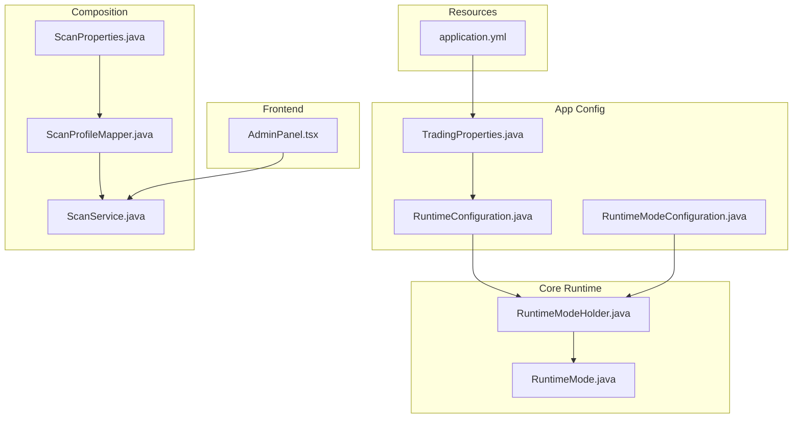
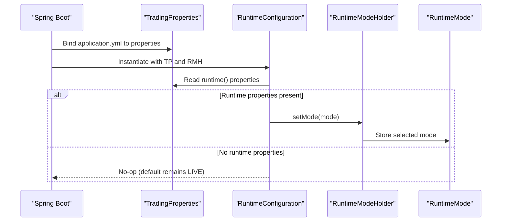
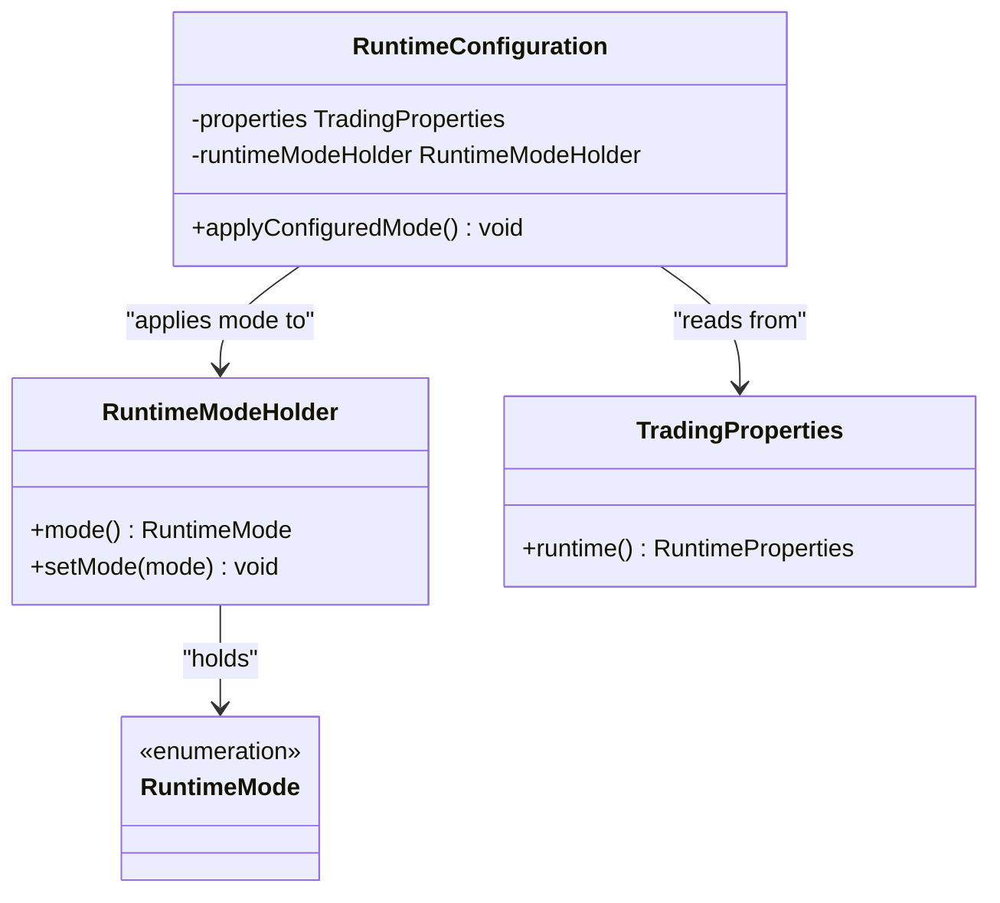
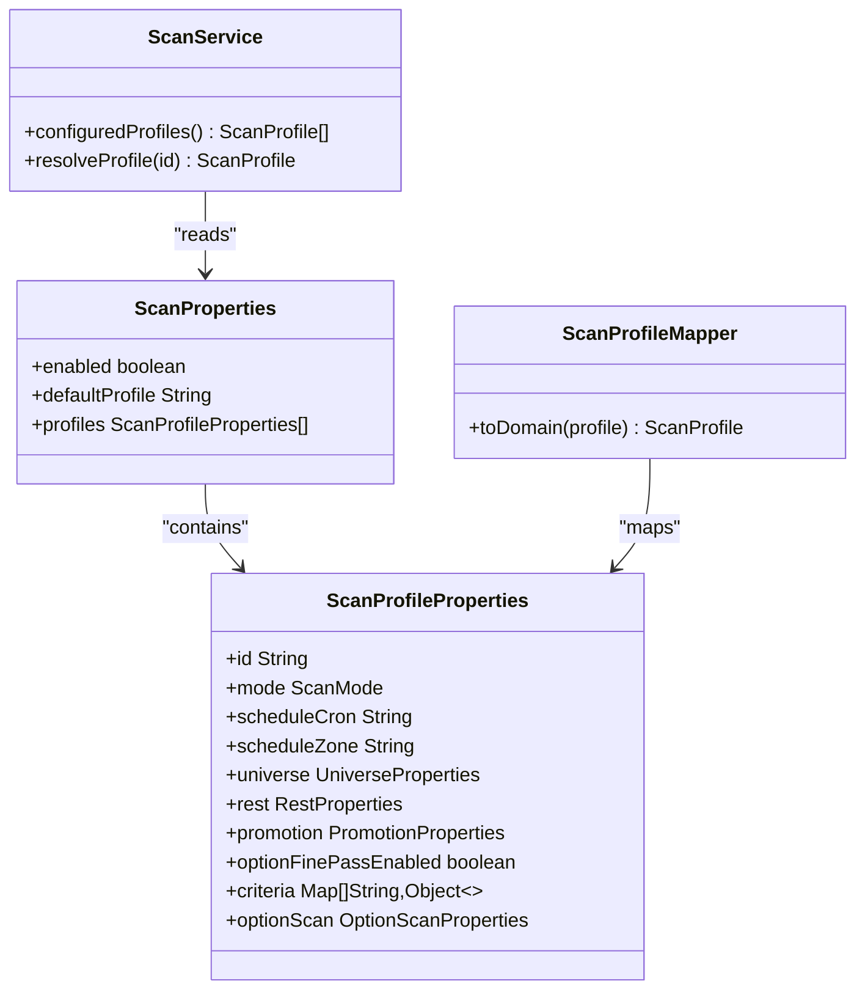
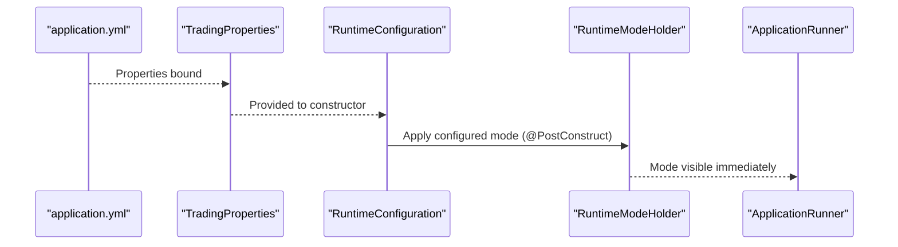
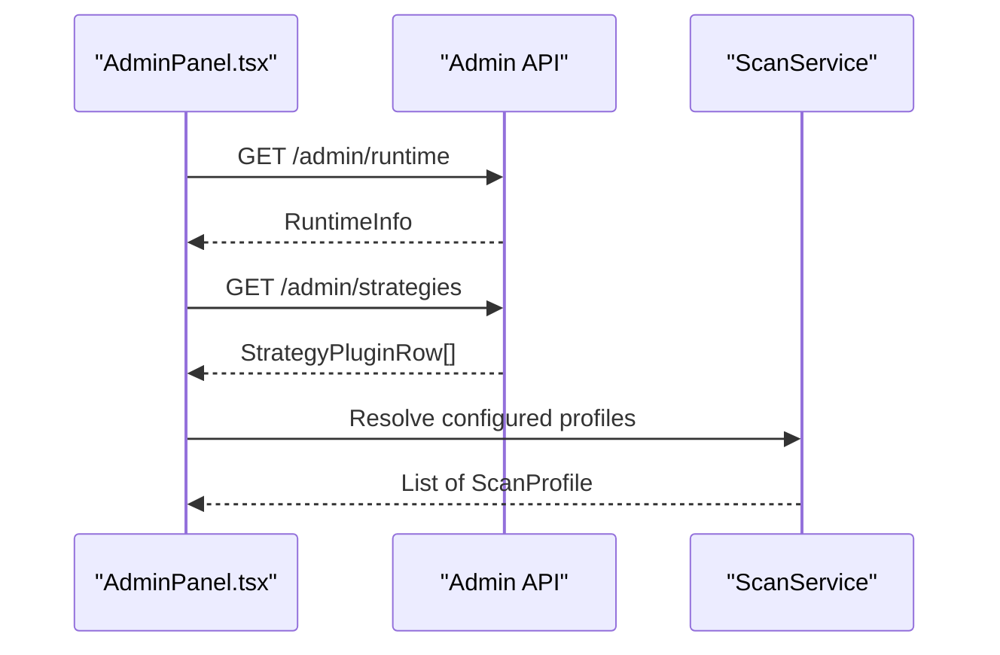
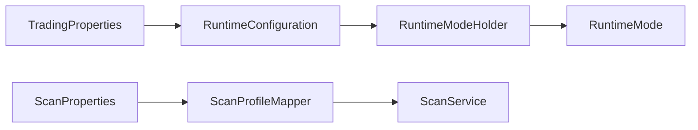

# Runtime Configuration

<cite>
**Referenced Files in This Document**
- [RuntimeConfiguration.java](file://app/src/main/java/com/tradej/app/config/RuntimeConfiguration.java)
- [RuntimeModeConfiguration.java](file://app/src/main/java/com/tradej/app/config/RuntimeModeConfiguration.java)
- [RuntimeMode.java](file://core/src/main/java/com/tradej/core/domain/runtime/RuntimeMode.java)
- [RuntimeModeHolder.java](file://core/src/main/java/com/tradej/core/domain/runtime/RuntimeModeHolder.java)
- [TradingProperties.java](file://app/src/main/java/com/tradej/app/config/TradingProperties.java)
- [ScanProperties.java](file://composition/src/main/java/com/tradej/composition/config/ScanProperties.java)
- [ScanProfileMapper.java](file://app/src/main/java/com/tradej/app/scanner/ScanProfileMapper.java)
- [ScanService.java](file://app/src/main/java/com/tradej/app/scanner/ScanService.java)
- [RuntimeConfigurationTest.java](file://app/src/test/java/com/tradej/app/config/RuntimeConfigurationTest.java)
- [RuntimeModeStartupOrderComponentTest.java](file://app/src/test/java/com/tradej/app/config/RuntimeModeStartupOrderComponentTest.java)
- [application.yml](file://app/src/main/resources/application.yml)
- [AdminPanel.tsx](file://archive/frontend/src/components/AdminPanel.tsx)
</cite>

## Table of Contents
1. [Introduction](#introduction)
2. [Project Structure](#project-structure)
3. [Core Components](#core-components)
4. [Architecture Overview](#architecture-overview)
5. [Detailed Component Analysis](#detailed-component-analysis)
6. [Dependency Analysis](#dependency-analysis)
7. [Performance Considerations](#performance-considerations)
8. [Troubleshooting Guide](#troubleshooting-guide)
9. [Conclusion](#conclusion)
10. [Appendices](#appendices)

## Introduction
This document explains the runtime configuration and dynamic settings system used to manage operational modes and scanning configurations at runtime. It covers:
- How runtime mode is detected and applied during startup
- How scanning profiles are loaded and resolved
- How configuration changes relate to system behavior and restart requirements
- Practical examples of updating runtime configuration and scanning parameters
- Guidelines for safe runtime modifications and monitoring configuration changes

## Project Structure
The runtime configuration system spans several modules:
- Application configuration beans and mode application
- Core runtime mode holder and enumeration
- Composition-level scanning configuration properties
- Frontend administration panel for runtime visibility

**Diagram sources**
- [RuntimeConfiguration.java:1-27](file://app/src/main/java/com/tradej/app/config/RuntimeConfiguration.java#L1-L27)
- [RuntimeModeConfiguration.java:1-14](file://app/src/main/java/com/tradej/app/config/RuntimeModeConfiguration.java#L1-L14)
- [RuntimeMode.java](file://core/src/main/java/com/tradej/core/domain/runtime/RuntimeMode.java)
- [RuntimeModeHolder.java](file://core/src/main/java/com/tradej/core/domain/runtime/RuntimeModeHolder.java)
- [TradingProperties.java](file://app/src/main/java/com/tradej/app/config/TradingProperties.java)
- [ScanProperties.java:1-35](file://composition/src/main/java/com/tradej/composition/config/ScanProperties.java#L1-L35)
- [ScanProfileMapper.java:1-17](file://app/src/main/java/com/tradej/app/scanner/ScanProfileMapper.java#L1-L17)
- [ScanService.java:137-165](file://app/src/main/java/com/tradej/app/scanner/ScanService.java#L137-L165)
- [application.yml](file://app/src/main/resources/application.yml)
- [AdminPanel.tsx:1-35](file://archive/frontend/src/components/AdminPanel.tsx#L1-L35)

**Section sources**
- [RuntimeConfiguration.java:1-27](file://app/src/main/java/com/tradej/app/config/RuntimeConfiguration.java#L1-L27)
- [RuntimeModeConfiguration.java:1-14](file://app/src/main/java/com/tradej/app/config/RuntimeModeConfiguration.java#L1-L14)
- [RuntimeMode.java](file://core/src/main/java/com/tradej/core/domain/runtime/RuntimeMode.java)
- [RuntimeModeHolder.java](file://core/src/main/java/com/tradej/core/domain/runtime/RuntimeModeHolder.java)
- [TradingProperties.java](file://app/src/main/java/com/tradej/app/config/TradingProperties.java)
- [ScanProperties.java:1-35](file://composition/src/main/java/com/tradej/composition/config/ScanProperties.java#L1-L35)
- [ScanProfileMapper.java:1-17](file://app/src/main/java/com/tradej/app/scanner/ScanProfileMapper.java#L1-L17)
- [ScanService.java:137-165](file://app/src/main/java/com/tradej/app/scanner/ScanService.java#L137-L165)
- [application.yml](file://app/src/main/resources/application.yml)
- [AdminPanel.tsx:1-35](file://archive/frontend/src/components/AdminPanel.tsx#L1-L35)

## Core Components
- RuntimeConfiguration: Applies configured runtime mode at startup via a constructor-injected holder.
- RuntimeModeConfiguration: Provides a Spring bean for the runtime mode holder.
- RuntimeModeHolder: Holds the current runtime mode value.
- RuntimeMode: Enumeration of supported runtime modes.
- TradingProperties: Root configuration object that exposes runtime properties.
- ScanProperties: Configuration properties for scanning, including profiles and scheduling.
- ScanProfileMapper and ScanService: Bridge between configuration and domain scanning constructs.

Key behaviors:
- Runtime mode is applied during bean initialization, ensuring downstream components see the correct mode immediately.
- Scanning configuration is loaded from application resources and mapped to domain models for execution.

**Section sources**
- [RuntimeConfiguration.java:1-27](file://app/src/main/java/com/tradej/app/config/RuntimeConfiguration.java#L1-L27)
- [RuntimeModeConfiguration.java:1-14](file://app/src/main/java/com/tradej/app/config/RuntimeModeConfiguration.java#L1-L14)
- [RuntimeMode.java](file://core/src/main/java/com/tradej/core/domain/runtime/RuntimeMode.java)
- [RuntimeModeHolder.java](file://core/src/main/java/com/tradej/core/domain/runtime/RuntimeModeHolder.java)
- [TradingProperties.java](file://app/src/main/java/com/tradej/app/config/TradingProperties.java)
- [ScanProperties.java:1-35](file://composition/src/main/java/com/tradej/composition/config/ScanProperties.java#L1-L35)
- [ScanProfileMapper.java:1-17](file://app/src/main/java/com/tradej/app/scanner/ScanProfileMapper.java#L1-L17)
- [ScanService.java:137-165](file://app/src/main/java/com/tradej/app/scanner/ScanService.java#L137-L165)

## Architecture Overview
The runtime configuration system integrates configuration loading, mode application, and scanning profile resolution.

**Diagram sources**
- [RuntimeConfiguration.java:21-26](file://app/src/main/java/com/tradej/app/config/RuntimeConfiguration.java#L21-L26)
- [TradingProperties.java](file://app/src/main/java/com/tradej/app/config/TradingProperties.java)
- [RuntimeModeHolder.java](file://core/src/main/java/com/tradej/core/domain/runtime/RuntimeModeHolder.java)
- [RuntimeMode.java](file://core/src/main/java/com/tradej/core/domain/runtime/RuntimeMode.java)
- [application.yml](file://app/src/main/resources/application.yml)

## Detailed Component Analysis

### Runtime Mode Management
Runtime mode is a single source of truth for system behavior. It is applied during bean initialization so downstream components observe the correct mode immediately.

**Diagram sources**
- [RuntimeConfiguration.java:1-27](file://app/src/main/java/com/tradej/app/config/RuntimeConfiguration.java#L1-L27)
- [RuntimeModeConfiguration.java:1-14](file://app/src/main/java/com/tradej/app/config/RuntimeModeConfiguration.java#L1-L14)
- [RuntimeMode.java](file://core/src/main/java/com/tradej/core/domain/runtime/RuntimeMode.java)
- [RuntimeModeHolder.java](file://core/src/main/java/com/tradej/core/domain/runtime/RuntimeModeHolder.java)
- [TradingProperties.java](file://app/src/main/java/com/tradej/app/config/TradingProperties.java)

Operational notes:
- Default mode is LIVE when no runtime properties are provided.
- Mode application occurs before any ApplicationRunner executes, preventing race conditions.

**Section sources**
- [RuntimeConfiguration.java:21-26](file://app/src/main/java/com/tradej/app/config/RuntimeConfiguration.java#L21-L26)
- [RuntimeModeStartupOrderComponentTest.java:12-37](file://app/src/test/java/com/tradej/app/config/RuntimeModeStartupOrderComponentTest.java#L12-L37)
- [RuntimeConfigurationTest.java:25-57](file://app/src/test/java/com/tradej/app/config/RuntimeConfigurationTest.java#L25-L57)

### Configuration Hot-Swapping and Validation
Hot-swapping runtime mode:
- Current implementation applies mode at startup via @PostConstruct. There is no dedicated endpoint to change mode dynamically.
- To switch modes, update application configuration and restart the service.

Validation:
- Tests verify that the configured mode is applied before downstream consumers read the holder.
- Missing runtime properties preserve the default LIVE mode.

Practical example:
- Update application.yml to set the runtime mode, then restart the service. After restart, downstream components observe the new mode immediately.

**Section sources**
- [RuntimeConfiguration.java:21-26](file://app/src/main/java/com/tradej/app/config/RuntimeConfiguration.java#L21-L26)
- [RuntimeConfigurationTest.java:25-57](file://app/src/test/java/com/tradej/app/config/RuntimeConfigurationTest.java#L25-L57)
- [RuntimeModeStartupOrderComponentTest.java:12-37](file://app/src/test/java/com/tradej/app/config/RuntimeModeStartupOrderComponentTest.java#L12-L37)

### ScanProperties Configuration
ScanProperties defines scanning behavior and profiles:
- enabled: toggles scanning globally
- defaultProfile: identifies the default profile ID
- profiles: list of profile definitions with scheduling, universes, criteria, and option scans

**Diagram sources**
- [ScanProperties.java:1-35](file://composition/src/main/java/com/tradej/composition/config/ScanProperties.java#L1-L35)
- [ScanProfileMapper.java:1-17](file://app/src/main/java/com/tradej/app/scanner/ScanProfileMapper.java#L1-L17)
- [ScanService.java:137-165](file://app/src/main/java/com/tradej/app/scanner/ScanService.java#L137-L165)

Operational notes:
- Profiles are validated by existence checks when resolving by ID.
- Domain mapping converts configuration records to scanning domain models.

**Section sources**
- [ScanProperties.java:1-35](file://composition/src/main/java/com/tradej/composition/config/ScanProperties.java#L1-L35)
- [ScanProfileMapper.java:1-17](file://app/src/main/java/com/tradej/app/scanner/ScanProfileMapper.java#L1-L17)
- [ScanService.java:137-165](file://app/src/main/java/com/tradej/app/scanner/ScanService.java#L137-L165)

### Integration with Startup Orchestration
- RuntimeConfiguration is constructed early in the container lifecycle.
- RuntimeModeHolder is a singleton bean, ensuring consistent mode across the application.
- Downstream components can safely read the mode immediately after startup.

**Diagram sources**
- [RuntimeConfiguration.java:21-26](file://app/src/main/java/com/tradej/app/config/RuntimeConfiguration.java#L21-L26)
- [RuntimeModeConfiguration.java:10-13](file://app/src/main/java/com/tradej/app/config/RuntimeModeConfiguration.java#L10-L13)
- [application.yml](file://app/src/main/resources/application.yml)

**Section sources**
- [RuntimeConfiguration.java:21-26](file://app/src/main/java/com/tradej/app/config/RuntimeConfiguration.java#L21-L26)
- [RuntimeModeConfiguration.java:10-13](file://app/src/main/java/com/tradej/app/config/RuntimeModeConfiguration.java#L10-L13)
- [RuntimeModeStartupOrderComponentTest.java:20-37](file://app/src/test/java/com/tradej/app/config/RuntimeModeStartupOrderComponentTest.java#L20-L37)

### Monitoring Configuration Changes
The frontend AdminPanel fetches runtime information and strategies, enabling operators to monitor current state and trigger actions like kill switches.

**Diagram sources**
- [AdminPanel.tsx:14-35](file://archive/frontend/src/components/AdminPanel.tsx#L14-L35)
- [ScanService.java:153-157](file://app/src/main/java/com/tradej/app/scanner/ScanService.java#L153-L157)

**Section sources**
- [AdminPanel.tsx:14-35](file://archive/frontend/src/components/AdminPanel.tsx#L14-L35)
- [ScanService.java:153-157](file://app/src/main/java/com/tradej/app/scanner/ScanService.java#L153-L157)

## Dependency Analysis
Runtime configuration depends on:
- TradingProperties for runtime mode configuration
- RuntimeModeHolder for storing the active mode
- RuntimeMode for the enumeration of supported modes

Scanning configuration depends on:
- ScanProperties for profile definitions
- ScanProfileMapper for domain conversion
- ScanService for profile resolution and listing

**Diagram sources**
- [TradingProperties.java](file://app/src/main/java/com/tradej/app/config/TradingProperties.java)
- [RuntimeConfiguration.java:1-27](file://app/src/main/java/com/tradej/app/config/RuntimeConfiguration.java#L1-L27)
- [RuntimeModeHolder.java](file://core/src/main/java/com/tradej/core/domain/runtime/RuntimeModeHolder.java)
- [RuntimeMode.java](file://core/src/main/java/com/tradej/core/domain/runtime/RuntimeMode.java)
- [ScanProperties.java:1-35](file://composition/src/main/java/com/tradej/composition/config/ScanProperties.java#L1-L35)
- [ScanProfileMapper.java:1-17](file://app/src/main/java/com/tradej/app/scanner/ScanProfileMapper.java#L1-L17)
- [ScanService.java:137-165](file://app/src/main/java/com/tradej/app/scanner/ScanService.java#L137-L165)

**Section sources**
- [RuntimeConfiguration.java:1-27](file://app/src/main/java/com/tradej/app/config/RuntimeConfiguration.java#L1-L27)
- [RuntimeModeConfiguration.java:1-14](file://app/src/main/java/com/tradej/app/config/RuntimeModeConfiguration.java#L1-L14)
- [ScanProperties.java:1-35](file://composition/src/main/java/com/tradej/composition/config/ScanProperties.java#L1-L35)
- [ScanProfileMapper.java:1-17](file://app/src/main/java/com/tradej/app/scanner/ScanProfileMapper.java#L1-L17)
- [ScanService.java:137-165](file://app/src/main/java/com/tradej/app/scanner/ScanService.java#L137-L165)

## Performance Considerations
- Runtime mode application is a lightweight operation performed once at startup.
- Scanning profile resolution is read-only and cached via immutable lists, minimizing overhead.
- Avoid frequent restarts for mode changes; plan maintenance windows for configuration updates.

## Troubleshooting Guide
Common issues and resolutions:
- Mode not changing after configuration update:
  - Verify the runtime property is present and correctly bound in application configuration.
  - Confirm the service was restarted to re-apply the mode.
- Unknown scan profile ID:
  - Ensure the profile ID exists in the configured profiles list.
  - Check cron schedule and zone settings for correctness.
- Mode visible before @PostConstruct:
  - Tests enforce that mode application happens before ApplicationRunner reads the holder.

Validation references:
- Startup order tests confirm mode availability before downstream consumers.
- Runtime configuration tests validate default and configured modes.

**Section sources**
- [RuntimeModeStartupOrderComponentTest.java:12-37](file://app/src/test/java/com/tradej/app/config/RuntimeModeStartupOrderComponentTest.java#L12-L37)
- [RuntimeConfigurationTest.java:25-57](file://app/src/test/java/com/tradej/app/config/RuntimeConfigurationTest.java#L25-L57)
- [ScanService.java:159-165](file://app/src/main/java/com/tradej/app/scanner/ScanService.java#L159-L165)

## Conclusion
The runtime configuration system centers on applying a single runtime mode at startup and loading scanning profiles from configuration. While dynamic mode changes are not currently supported, the design ensures deterministic startup behavior and clear separation between configuration and runtime state. Scanning configuration is robustly validated and mapped to domain models for reliable execution.

## Appendices

### Practical Examples

- Switching runtime mode:
  - Update application configuration to set the desired runtime mode.
  - Restart the service to apply the new mode.
  - Verify downstream components observe the updated mode immediately after startup.

- Adjusting scanning parameters:
  - Modify trade.scan.profiles entries in application configuration.
  - Ensure profile IDs match those referenced by the system.
  - Restart the service to reload profiles.

- Monitoring runtime state:
  - Use the AdminPanel to fetch runtime info and strategies.
  - Observe current mode and scanning profile status.

**Section sources**
- [application.yml](file://app/src/main/resources/application.yml)
- [RuntimeConfiguration.java:21-26](file://app/src/main/java/com/tradej/app/config/RuntimeConfiguration.java#L21-L26)
- [AdminPanel.tsx:14-35](file://archive/frontend/src/components/AdminPanel.tsx#L14-L35)
- [ScanService.java:153-157](file://app/src/main/java/com/tradej/app/scanner/ScanService.java#L153-L157)