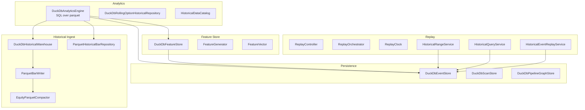
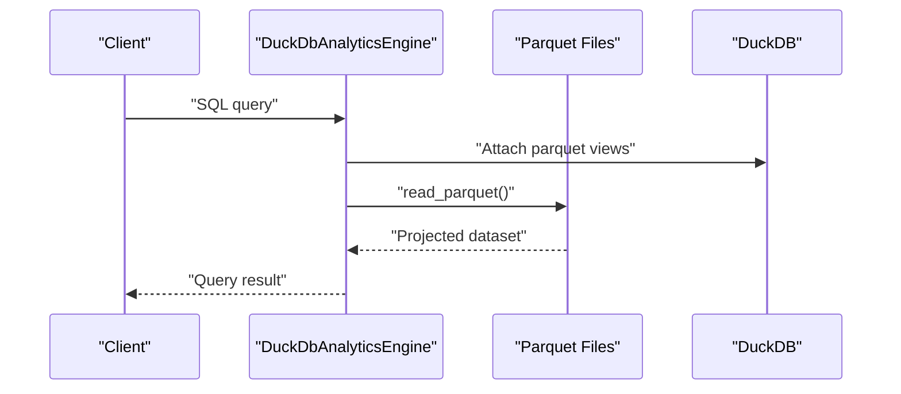
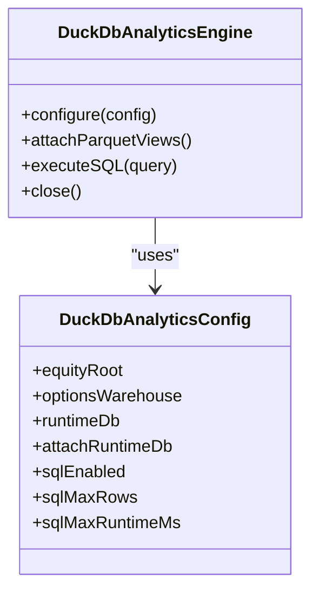
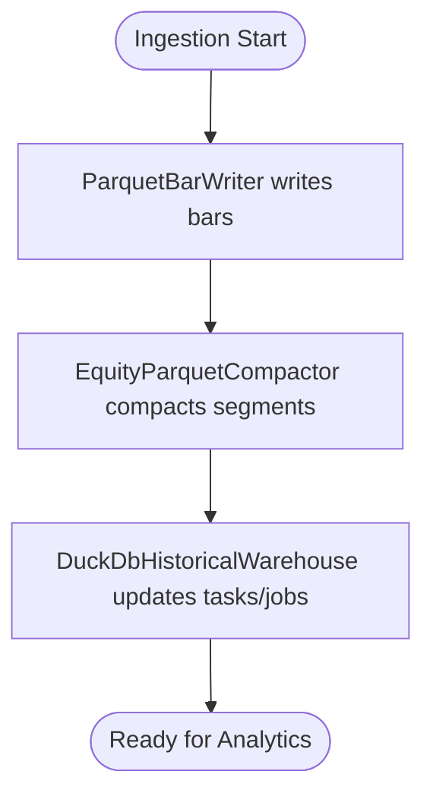
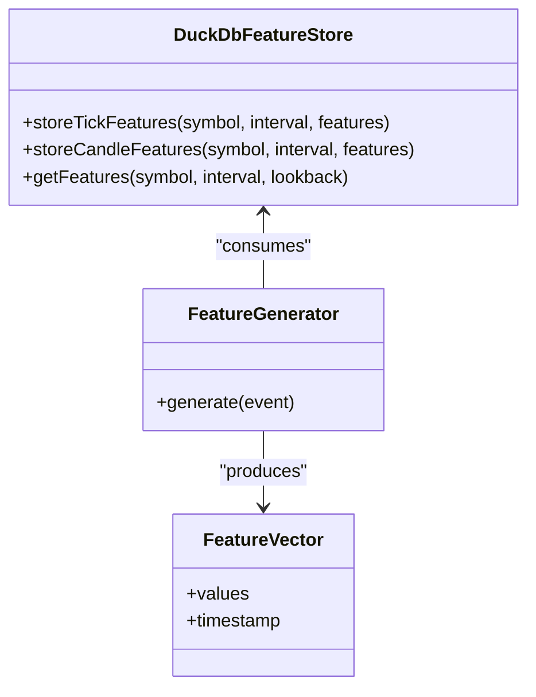
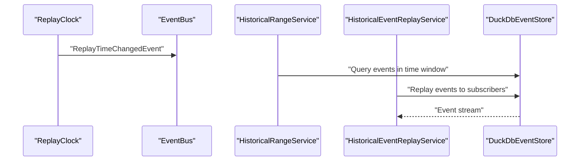
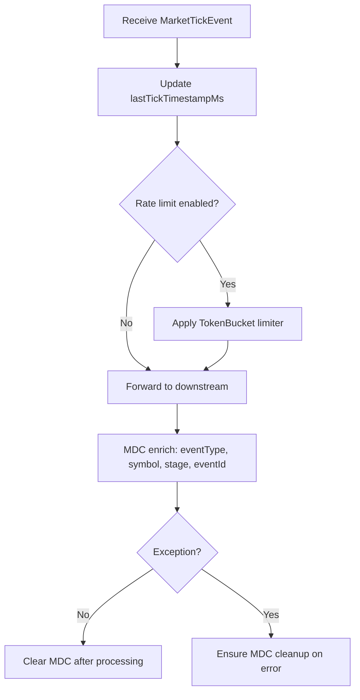
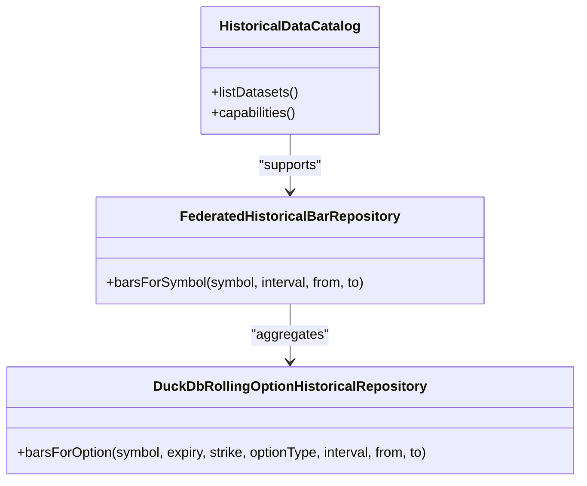
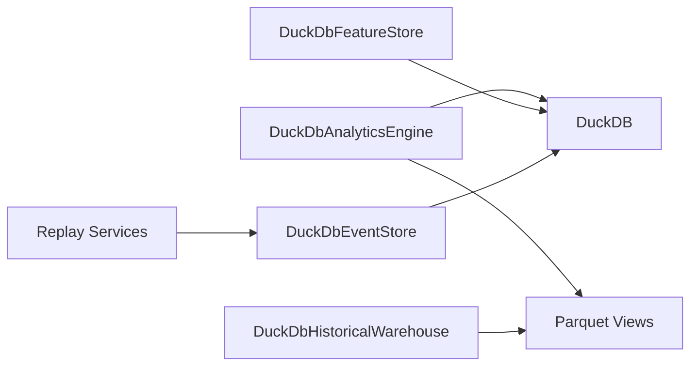

# Data Management and Analytics

<cite>
**Referenced Files in This Document**
- [DUCKDB_UNIFIED_ENGINE_PLAN.md](file://plans/DUCKDB_UNIFIED_ENGINE_PLAN.md)
- [AnalyticsConfiguration.java](file://app/src/main/java/com/tradej/app/config/AnalyticsConfiguration.java)
- [CliHistoricalCommands.java](file://cli/src/main/java/com/tradej/cli/command/CliHistoricalCommands.java)
- [AnalyticsFederationIntegrationTest.java](file://app/src/test/java/com/tradej/app/integration/AnalyticsFederationIntegrationTest.java)
- [DuckDbAnalyticsEngine.java](file://data/analytics/src/main/java/com/tradej/analytics/engine/DuckDbAnalyticsEngine.java)
- [DuckDbAnalyticsConfig.java](file://data/analytics/src/main/java/com/tradej/analytics/config/DuckDbAnalyticsConfig.java)
- [DuckDbRollingOptionHistoricalRepository.java](file://data/analytics/src/main/java/com/tradej/analytics/repository/DuckDbRollingOptionHistoricalRepository.java)
- [HistoricalDataCatalog.java](file://data/analytics/src/main/java/com/tradej/analytics/catalog/HistoricalDataCatalog.java)
- [DuckDbFeatureStore.java](file://data/feature-store/src/main/java/com/tradej/feature/store/DuckDbFeatureStore.java)
- [DuckDbEventStore.java](file://data/persistence/src/main/java/com/tradej/persistence/duckdb/DuckDbEventStore.java)
- [DuckDbHistoricalWarehouse.java](file://data/historical-ingest/src/main/java/com/tradej/historical/ingest/store/DuckDbHistoricalWarehouse.java)
- [HistoricalWarehouseQuery.java](file://data/historical-ingest/src/main/java/com/tradej/historical/ingest/query/HistoricalWarehouseQuery.java)
- [HistoricalEquityPaths.java](file://data/historical-ingest/src/main/java/com/tradej/historical/ingest/universe/HistoricalEquityPaths.java)
- [HistoricalRangeService.java](file://data/persistence/src/main/java/com/tradej/persistence/replay/HistoricalRangeService.java)
- [HistoricalQueryService.java](file://data/persistence/src/main/java/com/tradej/persistence/replay/HistoricalQueryService.java)
- [HistoricalEventReplayService.java](file://data/persistence/src/main/java/com/tradej/persistence/replay/HistoricalEventReplayService.java)
- [ReplayClock.java](file://data/persistence/src/main/java/com/tradej/persistence/replay/ReplayClock.java)
- [ReplayController.java](file://replay/engine/src/main/java/com/tradej/replay/engine/ReplayController.java)
- [ReplayOrchestrator.java](file://replay/engine/src/main/java/com/tradej/replay/engine/ReplayOrchestrator.java)
- [ReplayTimeChangedEvent.java](file://core/src/main/java/com/tradej/core/domain/event/ReplayTimeChangedEvent.java)
- [ReplayTradingClock.java](file://core/src/main/java/com/tradej/core/domain/time/ReplayTradingClock.java)
- [MarketDataPipeline.java](file://runtime/hotpath/src/main/java/com/tradej/hotpath/MarketDataPipeline.java)
- [MarketDataPipelineTest.java](file://runtime/hotpath/src/test/java/com/tradej/hotpath/MarketDataPipelineTest.java)
- [FeatureGenerator.java](file://core/src/main/java/com/tradej/core/domain/model/FeatureGenerator.java)
- [FeatureVector.java](file://core/src/main/java/com/tradej/core/domain/model/FeatureVector.java)
- [FeatureStore.java](file://core/src/main/java/com/tradej/core/domain/port/FeatureStore.java)
- [FeatureNode.java](file://nodes/trade-node-library/src/main/java/com/tradej/node/feature/FeatureNode.java)
- [FeaturePipeline.java](file://trading/institutional-scanner/src/main/java/com/tradej/institutional/features/FeaturePipeline.java)
- [AdminHistoricalQueryTest.java](file://app/src/test/java/com/tradej/app/integration/AdminHistoricalQueryTest.java)
- [HistoricalRangeIntegrationTest.java](file://app/src/test/java/com/tradej/app/integration/HistoricalRangeIntegrationTest.java)
- [OrderReplayIntegrationTest.java](file://app/src/test/java/com/tradej/app/integration/OrderReplayIntegrationTest.java)
- [ReplayEndToEndCertificationTest.java](file://app/src/test/java/com/tradej/app/integration/ReplayEndToEndCertificationTest.java)
- [AdminController.java](file://app/src/main/java/com/tradej/app/admin/AdminController.java)
- [HistoricalDownloadController.java](file://app/src/main/java/com/tradej/app/admin/HistoricalDownloadController.java)
- [HistoricalDownloadConfiguration.java](file://app/src/main/java/com/tradej/app/config/HistoricalDownloadConfiguration.java)
- [DuckDbQueryEngine.java](file://broker-gateway/src/main/java/com/tradej/brokergateway/query/DuckDbQueryEngine.java)
- [DuckDbQueryEngineTest.java](file://broker-gateway/src/test/java/com/tradej/brokergateway/query/DuckDbQueryEngineTest.java)
- [DuckDbQueryEngineTransactionalTest.java](file://broker-gateway/src/test/java/com/tradej/brokergateway/query/DuckDbQueryEngineTransactionalTest.java)
- [HistoricalDataService.java](file://core/src/main/java/com/tradej/core/service/HistoricalDataService.java)
- [HistoricalBarRepository.java](file://core/src/main/java/com/tradej/core/domain/port/HistoricalBarRepository.java)
- [HistoricalDataCapabilities.java](file://broker/api/src/main/java/com/tradej/broker/api/model/HistoricalDataCapabilities.java)
- [ParquetBarWriter.java](file://data/historical-ingest/src/main/java/com/tradej/historical/ingest/ParquetBarWriter.java)
- [EquityParquetCompactor.java](file://data/historical-ingest/src/main/java/com/tradej/historical/ingest/EquityParquetCompactor.java)
- [ParquetHistoricalBarRepository.java](file://data/historical-ingest/src/main/java/com/tradej/historical/ingest/ParquetHistoricalBarRepository.java)
- [FederatedHistoricalBarRepository.java](file://data/analytics/src/main/java/com/tradej/analytics/repository/FederatedHistoricalBarRepository.java)
- [DuckDbResearchStore.java](file://research/lab/src/main/java/com/tradej/research/lab/DuckDbResearchStore.java)
</cite>

## Table of Contents
1. [Introduction](#introduction)
2. [Project Structure](#project-structure)
3. [Core Components](#core-components)
4. [Architecture Overview](#architecture-overview)
5. [Detailed Component Analysis](#detailed-component-analysis)
6. [Dependency Analysis](#dependency-analysis)
7. [Performance Considerations](#performance-considerations)
8. [Troubleshooting Guide](#troubleshooting-guide)
9. [Conclusion](#conclusion)
10. [Appendices](#appendices)

## Introduction
This document explains the data management and analytics system built around DuckDB, covering the analytics engine, SQL-based analytics queries, and the historical data warehouse. It documents the event sourcing architecture, replay system, and time-based data access patterns. It also covers the data ingestion pipeline, market data processing, data quality validation, and feature store usage. Practical examples illustrate analytics queries, historical data retrieval, and integration with trading workflows and research capabilities. Finally, it provides guidelines for data modeling, query optimization, and storage management.

## Project Structure
The system is organized into modules that handle analytics, feature stores, historical ingestion, persistence, replay, and research. The analytics engine integrates with DuckDB and reads parquet files to support SQL-based analytics across equity and options data. Historical data is stored in parquet files and indexed in DuckDB for efficient querying. Event sourcing persists domain events in DuckDB for replay and audit.

**Diagram sources**
- [DuckDbAnalyticsEngine.java](file://data/analytics/src/main/java/com/tradej/analytics/engine/DuckDbAnalyticsEngine.java)
- [DuckDbRollingOptionHistoricalRepository.java](file://data/analytics/src/main/java/com/tradej/analytics/repository/DuckDbRollingOptionHistoricalRepository.java)
- [HistoricalDataCatalog.java](file://data/analytics/src/main/java/com/tradej/analytics/catalog/HistoricalDataCatalog.java)
- [DuckDbFeatureStore.java](file://data/feature-store/src/main/java/com/tradej/feature/store/DuckDbFeatureStore.java)
- [DuckDbEventStore.java](file://data/persistence/src/main/java/com/tradej/persistence/duckdb/DuckDbEventStore.java)
- [DuckDbHistoricalWarehouse.java](file://data/historical-ingest/src/main/java/com/tradej/historical/ingest/store/DuckDbHistoricalWarehouse.java)
- [ParquetBarWriter.java](file://data/historical-ingest/src/main/java/com/tradej/historical/ingest/ParquetBarWriter.java)
- [EquityParquetCompactor.java](file://data/historical-ingest/src/main/java/com/tradej/historical/ingest/EquityParquetCompactor.java)
- [ParquetHistoricalBarRepository.java](file://data/historical-ingest/src/main/java/com/tradej/historical/ingest/ParquetHistoricalBarRepository.java)
- [ReplayController.java](file://replay/engine/src/main/java/com/tradej/replay/engine/ReplayController.java)
- [ReplayOrchestrator.java](file://replay/engine/src/main/java/com/tradej/replay/engine/ReplayOrchestrator.java)
- [ReplayClock.java](file://data/persistence/src/main/java/com/tradej/persistence/replay/ReplayClock.java)
- [HistoricalRangeService.java](file://data/persistence/src/main/java/com/tradej/persistence/replay/HistoricalRangeService.java)
- [HistoricalQueryService.java](file://data/persistence/src/main/java/com/tradej/persistence/replay/HistoricalQueryService.java)
- [HistoricalEventReplayService.java](file://data/persistence/src/main/java/com/tradej/persistence/replay/HistoricalEventReplayService.java)

**Section sources**
- [DUCKDB_UNIFIED_ENGINE_PLAN.md](file://plans/DUCKDB_UNIFIED_ENGINE_PLAN.md)
- [AnalyticsConfiguration.java](file://app/src/main/java/com/tradej/app/config/AnalyticsConfiguration.java)

## Core Components
- DuckDB Analytics Engine: Provides SQL access over parquet-backed datasets and integrates with DuckDB for runtime and scan/pipeline graph storage.
- Feature Store: Stores computed features at tick and candle granularity, persisted via DuckDB for fast retrieval.
- Event Sourcing Store: Persists domain events (orders, fills, lifecycle) for replay and audit.
- Historical Warehouse: Manages parquet-based historical bar data and ingestion tasks.
- Replay Services: Enable time-based replay of events and historical ranges for backtesting and verification.
- Market Data Pipeline: Processes real-time ticks, maintains timestamps, and enforces rate limiting.

**Section sources**
- [DuckDbAnalyticsEngine.java](file://data/analytics/src/main/java/com/tradej/analytics/engine/DuckDbAnalyticsEngine.java)
- [DuckDbFeatureStore.java](file://data/feature-store/src/main/java/com/tradej/feature/store/DuckDbFeatureStore.java)
- [DuckDbEventStore.java](file://data/persistence/src/main/java/com/tradej/persistence/duckdb/DuckDbEventStore.java)
- [DuckDbHistoricalWarehouse.java](file://data/historical-ingest/src/main/java/com/tradej/historical/ingest/store/DuckDbHistoricalWarehouse.java)
- [HistoricalRangeService.java](file://data/persistence/src/main/java/com/tradej/persistence/replay/HistoricalRangeService.java)
- [MarketDataPipeline.java](file://runtime/hotpath/src/main/java/com/tradej/hotpath/MarketDataPipeline.java)

## Architecture Overview
The system combines DuckDB for analytics and persistence with parquet files for scalable historical storage. The analytics engine attaches parquet views and queries them via SQL. Events are persisted for replay and audit. The historical warehouse ingests and compacts parquet files. The replay engine orchestrates time-based simulations.

**Diagram sources**
- [DuckDbAnalyticsEngine.java](file://data/analytics/src/main/java/com/tradej/analytics/engine/DuckDbAnalyticsEngine.java)
- [DuckDbAnalyticsConfig.java](file://data/analytics/src/main/java/com/tradej/analytics/config/DuckDbAnalyticsConfig.java)

**Section sources**
- [AnalyticsFederationIntegrationTest.java](file://app/src/test/java/com/tradej/app/integration/AnalyticsFederationIntegrationTest.java)
- [AnalyticsConfiguration.java](file://app/src/main/java/com/tradej/app/config/AnalyticsConfiguration.java)

## Detailed Component Analysis

### DuckDB Analytics Engine
The analytics engine configures DuckDB paths for equity parquet roots, options warehouse, and runtime database. It supports attaching parquet views and enabling SQL execution with limits.

**Diagram sources**
- [DuckDbAnalyticsEngine.java](file://data/analytics/src/main/java/com/tradej/analytics/engine/DuckDbAnalyticsEngine.java)
- [DuckDbAnalyticsConfig.java](file://data/analytics/src/main/java/com/tradej/analytics/config/DuckDbAnalyticsConfig.java)

**Section sources**
- [AnalyticsConfiguration.java](file://app/src/main/java/com/tradej/app/config/AnalyticsConfiguration.java)
- [AnalyticsFederationIntegrationTest.java](file://app/src/test/java/com/tradej/app/integration/AnalyticsFederationIntegrationTest.java)

### Historical Data Warehouse
The historical warehouse manages ingestion jobs and tasks for rolling option bars and equity bars. It coordinates with parquet writers and compactors to maintain efficient storage.

**Diagram sources**
- [DuckDbHistoricalWarehouse.java](file://data/historical-ingest/src/main/java/com/tradej/historical/ingest/store/DuckDbHistoricalWarehouse.java)
- [ParquetBarWriter.java](file://data/historical-ingest/src/main/java/com/tradej/historical/ingest/ParquetBarWriter.java)
- [EquityParquetCompactor.java](file://data/historical-ingest/src/main/java/com/tradej/historical/ingest/EquityParquetCompactor.java)

**Section sources**
- [HistoricalWarehouseQuery.java](file://data/historical-ingest/src/main/java/com/tradej/historical/ingest/query/HistoricalWarehouseQuery.java)
- [HistoricalEquityPaths.java](file://data/historical-ingest/src/main/java/com/tradej/historical/ingest/universe/HistoricalEquityPaths.java)

### Feature Store
The feature store persists computed features for downstream use in strategies and research. Features are keyed by symbol, interval, and lookback windows.

**Diagram sources**
- [DuckDbFeatureStore.java](file://data/feature-store/src/main/java/com/tradej/feature/store/DuckDbFeatureStore.java)
- [FeatureGenerator.java](file://core/src/main/java/com/tradej/core/domain/model/FeatureGenerator.java)
- [FeatureVector.java](file://core/src/main/java/com/tradej/core/domain/model/FeatureVector.java)

**Section sources**
- [FeatureStore.java](file://core/src/main/java/com/tradej/core/domain/port/FeatureStore.java)
- [FeatureNode.java](file://nodes/trade-node-library/src/main/java/com/tradej/node/feature/FeatureNode.java)
- [FeaturePipeline.java](file://trading/institutional-scanner/src/main/java/com/tradej/institutional/features/FeaturePipeline.java)

### Event Sourcing and Replay
Events are persisted for replay and audit. The replay clock advances simulated time and publishes time-changed events. Historical range and query services enable time-based retrieval and replay orchestration.

**Diagram sources**
- [ReplayClock.java](file://data/persistence/src/main/java/com/tradej/persistence/replay/ReplayClock.java)
- [ReplayTimeChangedEvent.java](file://core/src/main/java/com/tradej/core/domain/event/ReplayTimeChangedEvent.java)
- [HistoricalRangeService.java](file://data/persistence/src/main/java/com/tradej/persistence/replay/HistoricalRangeService.java)
- [HistoricalEventReplayService.java](file://data/persistence/src/main/java/com/tradej/persistence/replay/HistoricalEventReplayService.java)
- [DuckDbEventStore.java](file://data/persistence/src/main/java/com/tradej/persistence/duckdb/DuckDbEventStore.java)

**Section sources**
- [ReplayController.java](file://replay/engine/src/main/java/com/tradej/replay/engine/ReplayController.java)
- [ReplayOrchestrator.java](file://replay/engine/src/main/java/com/tradej/replay/engine/ReplayOrchestrator.java)
- [ReplayTradingClock.java](file://core/src/main/java/com/tradej/core/domain/time/ReplayTradingClock.java)
- [OrderReplayIntegrationTest.java](file://app/src/test/java/com/tradej/app/integration/OrderReplayIntegrationTest.java)

### Market Data Processing
The market data pipeline processes ticks, maintains last tick timestamps, and enforces rate limiting. It enriches MDC for observability and ensures clean state after processing or exceptions.

**Diagram sources**
- [MarketDataPipeline.java](file://runtime/hotpath/src/main/java/com/tradej/hotpath/MarketDataPipeline.java)
- [MarketDataPipelineTest.java](file://runtime/hotpath/src/test/java/com/tradej/hotpath/MarketDataPipelineTest.java)

**Section sources**
- [MarketDataPipeline.java](file://runtime/hotpath/src/main/java/com/tradej/hotpath/MarketDataPipeline.java)
- [MarketDataPipelineTest.java](file://runtime/hotpath/src/test/java/com/tradej/hotpath/MarketDataPipelineTest.java)

### Historical Data Retrieval and Catalog
The historical data catalog exposes metadata and capabilities for historical datasets. The federated repository aggregates equity and options data for unified queries.

**Diagram sources**
- [HistoricalDataCatalog.java](file://data/analytics/src/main/java/com/tradej/analytics/catalog/HistoricalDataCatalog.java)
- [FederatedHistoricalBarRepository.java](file://data/analytics/src/main/java/com/tradej/analytics/repository/FederatedHistoricalBarRepository.java)
- [DuckDbRollingOptionHistoricalRepository.java](file://data/analytics/src/main/java/com/tradej/analytics/repository/DuckDbRollingOptionHistoricalRepository.java)

**Section sources**
- [AnalyticsFederationIntegrationTest.java](file://app/src/test/java/com/tradej/app/integration/AnalyticsFederationIntegrationTest.java)

## Dependency Analysis
The analytics engine depends on DuckDB for SQL execution and parquet views. The feature store and event store share the DuckDB connection pool. Historical ingestion writes to parquet and updates the warehouse. Replay services depend on the event store and clock.

**Diagram sources**
- [DuckDbAnalyticsEngine.java](file://data/analytics/src/main/java/com/tradej/analytics/engine/DuckDbAnalyticsEngine.java)
- [DuckDbFeatureStore.java](file://data/feature-store/src/main/java/com/tradej/feature/store/DuckDbFeatureStore.java)
- [DuckDbEventStore.java](file://data/persistence/src/main/java/com/tradej/persistence/duckdb/DuckDbEventStore.java)
- [DuckDbHistoricalWarehouse.java](file://data/historical-ingest/src/main/java/com/tradej/historical/ingest/store/DuckDbHistoricalWarehouse.java)

**Section sources**
- [DUCKDB_UNIFIED_ENGINE_PLAN.md](file://plans/DUCKDB_UNIFIED_ENGINE_PLAN.md)

## Performance Considerations
- DuckDB SQL limits: Configure max rows and runtime to prevent runaway queries.
- Parquet compaction: Use compactors to reduce file fragmentation and improve read performance.
- Rate limiting: Apply token bucket rate limiting in the market data pipeline to avoid overload.
- Time-based filtering: Ensure queries filter by domain event timestamps, not ingestion timestamps.
- Observability: Enforce MDC cleanup to avoid memory leaks and noisy logs.

[No sources needed since this section provides general guidance]

## Troubleshooting Guide
- Warehouse not found: The CLI expects a DuckDB warehouse at a default path; ensure historical downloads have completed.
- Missing equity parquet warehouse: Tests assume equity parquet directories exist; verify ingestion ran successfully.
- Replay orchestration: Admin endpoints allow replaying Chronicle audit logs; confirm event types implement the domain event interface.
- Historical queries: Validate time windows and event filters; historical queries must respect domain event timestamps.

**Section sources**
- [CliHistoricalCommands.java](file://cli/src/main/java/com/tradej/cli/command/CliHistoricalCommands.java)
- [HistoricalRangeIntegrationTest.java](file://app/src/test/java/com/tradej/app/integration/HistoricalRangeIntegrationTest.java)
- [AdminController.java](file://app/src/main/java/com/tradej/app/admin/AdminController.java)

## Conclusion
The system leverages DuckDB for analytics and SQL-based querying over parquet datasets while maintaining event sourcing for replay and audit. Historical data is efficiently ingested and stored in parquet, with the warehouse coordinating tasks and jobs. The feature store enables fast retrieval of computed features. Replay services and time-based access patterns support backtesting and verification. The architecture balances scalability, observability, and performance.

[No sources needed since this section summarizes without analyzing specific files]

## Appendices

### Practical Examples

- Analytics Queries
  - Federated equity and options queries against local warehouse are validated in integration tests.
  - Example path: [AnalyticsFederationIntegrationTest.java](file://app/src/test/java/com/tradej/app/integration/AnalyticsFederationIntegrationTest.java)

- Historical Data Retrieval
  - Historical range service supports time-windowed queries for orders and events.
  - Example path: [HistoricalRangeService.java](file://data/persistence/src/main/java/com/tradej/persistence/replay/HistoricalRangeService.java)

- Feature Store Usage
  - Feature vectors are retrieved by symbol, interval, and lookback window.
  - Example path: [FeatureStore.java](file://core/src/main/java/com/tradej/core/domain/port/FeatureStore.java)

- Integration with Trading Workflows
  - Market data pipeline enriches MDC and applies rate limiting for throughput control.
  - Example path: [MarketDataPipeline.java](file://runtime/hotpath/src/main/java/com/tradej/hotpath/MarketDataPipeline.java)

- Research Capabilities
  - DuckDB-backed research store supports ad-hoc analysis and experimentation.
  - Example path: [DuckDbResearchStore.java](file://research/lab/src/main/java/com/tradej/research/lab/DuckDbResearchStore.java)

### Guidelines

- Data Modeling
  - Model features with explicit intervals and lookbacks; persist at tick and candle granularity.
  - Example path: [DuckDbFeatureStore.java](file://data/feature-store/src/main/java/com/tradej/feature/store/DuckDbFeatureStore.java)

- Query Optimization
  - Use DuckDB SQL limits; prefer partitioned parquet layouts; leverage compaction.
  - Example path: [DuckDbAnalyticsEngine.java](file://data/analytics/src/main/java/com/tradej/analytics/engine/DuckDbAnalyticsEngine.java)

- Storage Management
  - Maintain separate DuckDB files for runtime, scan/pipeline graphs, and historical warehouse; plan migration to a unified engine.
  - Example path: [DUCKDB_UNIFIED_ENGINE_PLAN.md](file://plans/DUCKDB_UNIFIED_ENGINE_PLAN.md)