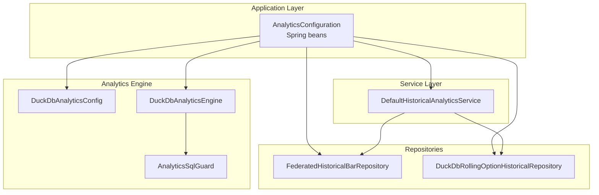
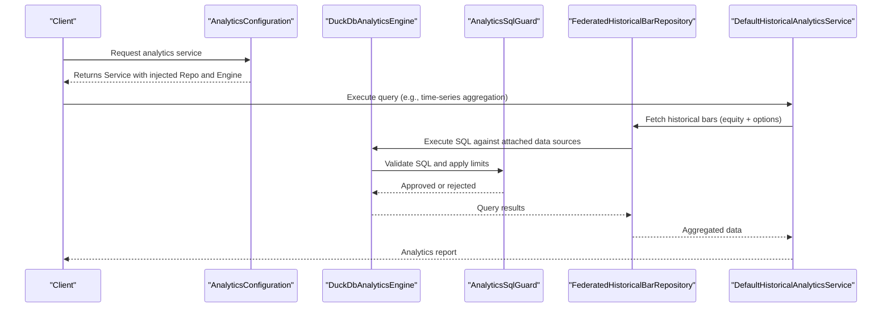
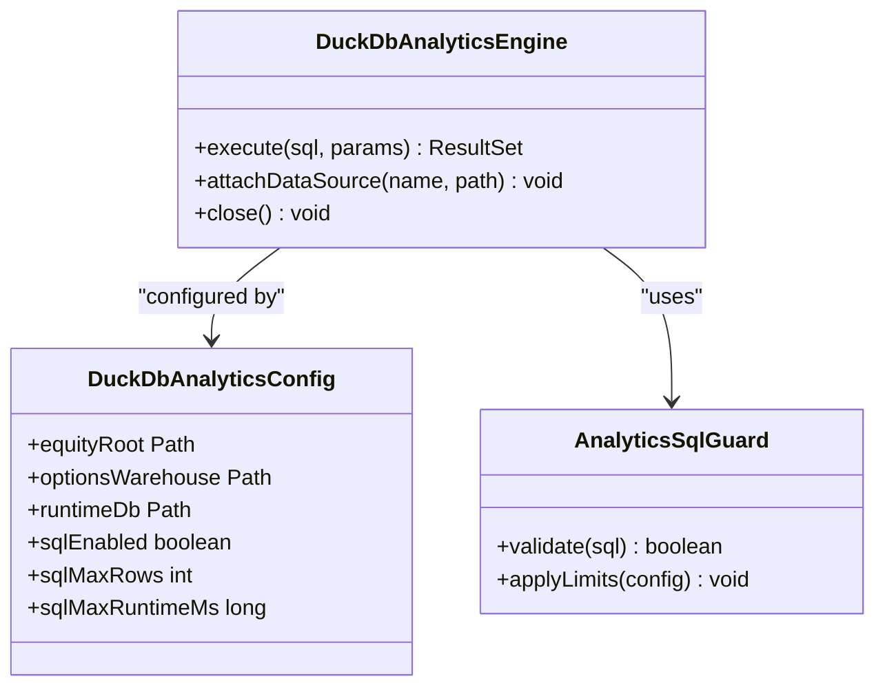
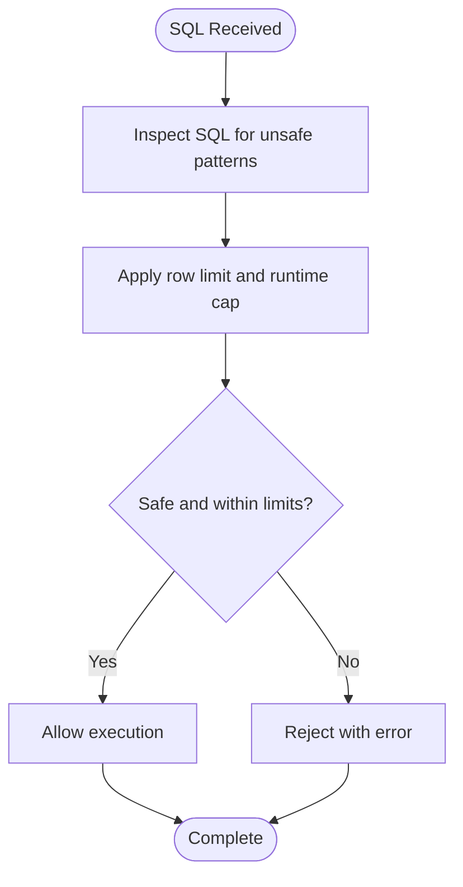
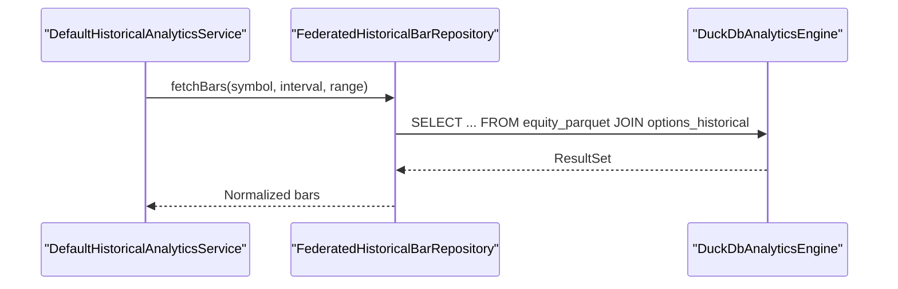
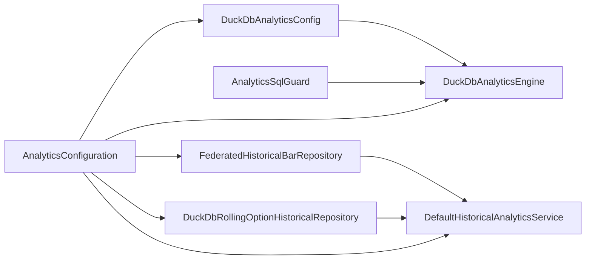

# DuckDB Analytics Engine

<cite>
**Referenced Files in This Document**
- [DuckDbAnalyticsConfig.java](file://data/analytics/src/main/java/com/tradej/analytics/config/DuckDbAnalyticsConfig.java)
- [DuckDbAnalyticsEngine.java](file://data/analytics/src/main/java/com/tradej/analytics/engine/DuckDbAnalyticsEngine.java)
- [AnalyticsSqlGuard.java](file://data/analytics/src/main/java/com/tradej/analytics/guard/AnalyticsSqlGuard.java)
- [FederatedHistoricalBarRepository.java](file://data/analytics/src/main/java/com/tradej/analytics/repository/FederatedHistoricalBarRepository.java)
- [DuckDbRollingOptionHistoricalRepository.java](file://data/analytics/src/main/java/com/tradej/analytics/repository/DuckDbRollingOptionHistoricalRepository.java)
- [DefaultHistoricalAnalyticsService.java](file://data/analytics/src/main/java/com/tradej/analytics/service/DefaultHistoricalAnalyticsService.java)
- [AnalyticsConfiguration.java](file://app/src/main/java/com/tradej/app/config/AnalyticsConfiguration.java)
- [AnalyticsFederationIntegrationTest.java](file://app/src/test/java/com/tradej/app/integration/AnalyticsFederationIntegrationTest.java)
- [DUCKDB_UNIFIED_ENGINE_PLAN.md](file://plans/DUCKDB_UNIFIED_ENGINE_PLAN.md)
</cite>

## Table of Contents
1. [Introduction](#introduction)
2. [Project Structure](#project-structure)
3. [Core Components](#core-components)
4. [Architecture Overview](#architecture-overview)
5. [Detailed Component Analysis](#detailed-component-analysis)
6. [Dependency Analysis](#dependency-analysis)
7. [Performance Considerations](#performance-considerations)
8. [Troubleshooting Guide](#troubleshooting-guide)
9. [Conclusion](#conclusion)

## Introduction
This document describes the DuckDB analytics engine that powers SQL-based analytics queries, historical market data federation, and analytical pipeline orchestration. It explains the configuration and optimization mechanisms, the federated historical bar repository implementation, the SQL guard for query safety, and practical patterns for time-series analysis and market data aggregation. The engine integrates with both equity parquet warehouses and options historical databases, enabling unified analytics across asset classes.

## Project Structure
The analytics engine resides primarily under the data/analytics module, with Spring configuration wiring in the app module and integration tests validating federated queries. The key areas include:
- Engine and configuration: DuckDbAnalyticsEngine and DuckDbAnalyticsConfig
- Safety guard: AnalyticsSqlGuard
- Repositories: FederatedHistoricalBarRepository and DuckDbRollingOptionHistoricalRepository
- Service layer: DefaultHistoricalAnalyticsService
- Application wiring: AnalyticsConfiguration
- Integration testing: AnalyticsFederationIntegrationTest
- Strategic plan: DUCKDB_UNIFIED_ENGINE_PLAN.md

**Diagram sources**
- [AnalyticsConfiguration.java:25-90](file://app/src/main/java/com/tradej/app/config/AnalyticsConfiguration.java#L25-L90)
- [DuckDbAnalyticsConfig.java](file://data/analytics/src/main/java/com/tradej/analytics/config/DuckDbAnalyticsConfig.java)
- [DuckDbAnalyticsEngine.java](file://data/analytics/src/main/java/com/tradej/analytics/engine/DuckDbAnalyticsEngine.java)
- [AnalyticsSqlGuard.java](file://data/analytics/src/main/java/com/tradej/analytics/guard/AnalyticsSqlGuard.java)
- [FederatedHistoricalBarRepository.java](file://data/analytics/src/main/java/com/tradej/analytics/repository/FederatedHistoricalBarRepository.java)
- [DuckDbRollingOptionHistoricalRepository.java](file://data/analytics/src/main/java/com/tradej/analytics/repository/DuckDbRollingOptionHistoricalRepository.java)
- [DefaultHistoricalAnalyticsService.java](file://data/analytics/src/main/java/com/tradej/analytics/service/DefaultHistoricalAnalyticsService.java)

**Section sources**
- [AnalyticsConfiguration.java:25-90](file://app/src/main/java/com/tradej/app/config/AnalyticsConfiguration.java#L25-L90)
- [DUCKDB_UNIFIED_ENGINE_PLAN.md:68-86](file://plans/DUCKDB_UNIFIED_ENGINE_PLAN.md#L68-L86)

## Core Components
- DuckDbAnalyticsEngine: Central engine managing DuckDB connections, SQL execution, and resource lifecycle. It enforces guardrails via AnalyticsSqlGuard and coordinates with repositories.
- DuckDbAnalyticsConfig: Encapsulates configuration for equity root, options warehouse, runtime database, and safety limits (row caps, max runtime).
- AnalyticsSqlGuard: Validates and constrains SQL queries to prevent long-running or unsafe operations.
- FederatedHistoricalBarRepository: Provides unified access to equity parquet bars and options historical data through the engine.
- DuckDbRollingOptionHistoricalRepository: Specialized repository for rolling options historical data backed by the engine.
- DefaultHistoricalAnalyticsService: Orchestrates analytics operations using repositories and catalog metadata.
- AnalyticsConfiguration: Spring bean wiring that constructs the engine, repositories, and shared pipeline state.

**Section sources**
- [DuckDbAnalyticsEngine.java](file://data/analytics/src/main/java/com/tradej/analytics/engine/DuckDbAnalyticsEngine.java)
- [DuckDbAnalyticsConfig.java](file://data/analytics/src/main/java/com/tradej/analytics/config/DuckDbAnalyticsConfig.java)
- [AnalyticsSqlGuard.java](file://data/analytics/src/main/java/com/tradej/analytics/guard/AnalyticsSqlGuard.java)
- [FederatedHistoricalBarRepository.java](file://data/analytics/src/main/java/com/tradej/analytics/repository/FederatedHistoricalBarRepository.java)
- [DuckDbRollingOptionHistoricalRepository.java](file://data/analytics/src/main/java/com/tradej/analytics/repository/DuckDbRollingOptionHistoricalRepository.java)
- [DefaultHistoricalAnalyticsService.java](file://data/analytics/src/main/java/com/tradej/analytics/service/DefaultHistoricalAnalyticsService.java)
- [AnalyticsConfiguration.java:25-90](file://app/src/main/java/com/tradej/app/config/AnalyticsConfiguration.java#L25-L90)

## Architecture Overview
The analytics engine follows a layered architecture:
- Configuration layer sets paths and limits.
- Engine layer manages DuckDB connections and executes SQL safely.
- Repository layer abstracts data access for equity bars and options.
- Service layer orchestrates analytics workflows.
- Application layer wires beans and exposes shared state for pipelines.

**Diagram sources**
- [AnalyticsConfiguration.java:50-90](file://app/src/main/java/com/tradej/app/config/AnalyticsConfiguration.java#L50-L90)
- [DuckDbAnalyticsEngine.java](file://data/analytics/src/main/java/com/tradej/analytics/engine/DuckDbAnalyticsEngine.java)
- [AnalyticsSqlGuard.java](file://data/analytics/src/main/java/com/tradej/analytics/guard/AnalyticsSqlGuard.java)
- [FederatedHistoricalBarRepository.java](file://data/analytics/src/main/java/com/tradej/analytics/repository/FederatedHistoricalBarRepository.java)
- [DefaultHistoricalAnalyticsService.java](file://data/analytics/src/main/java/com/tradej/analytics/service/DefaultHistoricalAnalyticsService.java)

## Detailed Component Analysis

### DuckDbAnalyticsEngine
Responsibilities:
- Manages DuckDB connection lifecycle and database attachments.
- Executes SQL statements with enforced row limits and runtime caps.
- Coordinates with repositories and catalogs for data access.

Key behaviors:
- Attaches external data sources (parquet equity warehouse and options warehouse) as views.
- Applies guardrail checks before executing queries.
- Ensures safe resource cleanup.

**Diagram sources**
- [DuckDbAnalyticsEngine.java](file://data/analytics/src/main/java/com/tradej/analytics/engine/DuckDbAnalyticsEngine.java)
- [DuckDbAnalyticsConfig.java](file://data/analytics/src/main/java/com/tradej/analytics/config/DuckDbAnalyticsConfig.java)
- [AnalyticsSqlGuard.java](file://data/analytics/src/main/java/com/tradej/analytics/guard/AnalyticsSqlGuard.java)

**Section sources**
- [DuckDbAnalyticsEngine.java](file://data/analytics/src/main/java/com/tradej/analytics/engine/DuckDbAnalyticsEngine.java)
- [DuckDbAnalyticsConfig.java](file://data/analytics/src/main/java/com/tradej/analytics/config/DuckDbAnalyticsConfig.java)

### AnalyticsSqlGuard
Responsibilities:
- Validates incoming SQL to prevent unsafe or overly expensive operations.
- Enforces row count and runtime limits based on configuration.

Processing logic:
- Parses and inspects SQL statements.
- Rejects queries exceeding configured thresholds.
- Logs violations and returns errors to callers.

**Diagram sources**
- [AnalyticsSqlGuard.java](file://data/analytics/src/main/java/com/tradej/analytics/guard/AnalyticsSqlGuard.java)
- [DuckDbAnalyticsConfig.java](file://data/analytics/src/main/java/com/tradej/analytics/config/DuckDbAnalyticsConfig.java)

**Section sources**
- [AnalyticsSqlGuard.java](file://data/analytics/src/main/java/com/tradej/analytics/guard/AnalyticsSqlGuard.java)
- [DuckDbAnalyticsConfig.java](file://data/analytics/src/main/java/com/tradej/analytics/config/DuckDbAnalyticsConfig.java)

### FederatedHistoricalBarRepository
Responsibilities:
- Unifies access to equity parquet bars and options historical data.
- Delegates query execution to the engine while maintaining a clean repository interface.

Integration pattern:
- Uses engine to execute SQL against attached equity and options datasets.
- Returns normalized results for downstream analytics.

**Diagram sources**
- [FederatedHistoricalBarRepository.java](file://data/analytics/src/main/java/com/tradej/analytics/repository/FederatedHistoricalBarRepository.java)
- [DuckDbAnalyticsEngine.java](file://data/analytics/src/main/java/com/tradej/analytics/engine/DuckDbAnalyticsEngine.java)

**Section sources**
- [FederatedHistoricalBarRepository.java](file://data/analytics/src/main/java/com/tradej/analytics/repository/FederatedHistoricalBarRepository.java)

### DuckDbRollingOptionHistoricalRepository
Responsibilities:
- Provides specialized access to rolling options historical data.
- Leverages the engine for efficient querying and aggregation.

**Section sources**
- [DuckDbRollingOptionHistoricalRepository.java](file://data/analytics/src/main/java/com/tradej/analytics/repository/DuckDbRollingOptionHistoricalRepository.java)

### DefaultHistoricalAnalyticsService
Responsibilities:
- Orchestrates analytics workflows using repositories and catalog metadata.
- Coordinates with shared pipeline state for consistent execution.

**Section sources**
- [DefaultHistoricalAnalyticsService.java](file://data/analytics/src/main/java/com/tradej/analytics/service/DefaultHistoricalAnalyticsService.java)

### AnalyticsConfiguration (Spring Wiring)
Responsibilities:
- Creates and wires DuckDbAnalyticsEngine, repositories, and shared pipeline state.
- Resolves absolute paths for equity root, options warehouse, and runtime database.
- Exposes beans for catalog and analytics service.

**Section sources**
- [AnalyticsConfiguration.java:25-90](file://app/src/main/java/com/tradej/app/config/AnalyticsConfiguration.java#L25-L90)

### Integration Testing: Federated Queries
The integration test demonstrates federated queries across equity and options data sources, validating that the engine can attach external databases and execute cross-source SQL.

**Section sources**
- [AnalyticsFederationIntegrationTest.java:29-46](file://app/src/test/java/com/tradej/app/integration/AnalyticsFederationIntegrationTest.java#L29-L46)

## Dependency Analysis
The engine depends on configuration for paths and limits, repositories for data access, and the guard for safety. The application wiring ensures proper initialization and lifecycle management.

**Diagram sources**
- [DuckDbAnalyticsConfig.java](file://data/analytics/src/main/java/com/tradej/analytics/config/DuckDbAnalyticsConfig.java)
- [DuckDbAnalyticsEngine.java](file://data/analytics/src/main/java/com/tradej/analytics/engine/DuckDbAnalyticsEngine.java)
- [AnalyticsSqlGuard.java](file://data/analytics/src/main/java/com/tradej/analytics/guard/AnalyticsSqlGuard.java)
- [FederatedHistoricalBarRepository.java](file://data/analytics/src/main/java/com/tradej/analytics/repository/FederatedHistoricalBarRepository.java)
- [DuckDbRollingOptionHistoricalRepository.java](file://data/analytics/src/main/java/com/tradej/analytics/repository/DuckDbRollingOptionHistoricalRepository.java)
- [DefaultHistoricalAnalyticsService.java](file://data/analytics/src/main/java/com/tradej/analytics/service/DefaultHistoricalAnalyticsService.java)
- [AnalyticsConfiguration.java:25-90](file://app/src/main/java/com/tradej/app/config/AnalyticsConfiguration.java#L25-L90)

**Section sources**
- [AnalyticsConfiguration.java:25-90](file://app/src/main/java/com/tradej/app/config/AnalyticsConfiguration.java#L25-L90)
- [DUCKDB_UNIFIED_ENGINE_PLAN.md:68-86](file://plans/DUCKDB_UNIFIED_ENGINE_PLAN.md#L68-L86)

## Performance Considerations
- DuckDB Attachments: Attach external parquet and options databases as views to avoid data duplication and enable push-down predicates.
- Row and Runtime Limits: Configure sqlMaxRows and sqlMaxRuntimeMs to prevent runaway queries.
- Indexing Strategies: While DuckDB does not require traditional B-trees, leverage columnar storage and partition pruning by organizing data by date/time and symbol.
- Query Patterns:
  - Use time bucketing and window functions for time-series aggregation.
  - Prefer WHERE clauses with date ranges and symbol filters to reduce scanned data.
  - Use LIMIT to cap result sizes for exploratory queries.
- Resource Management: Close engines and connections after use to free memory and file handles.

## Troubleshooting Guide
Common issues and resolutions:
- Query Timeout or Excessive Rows: Adjust sqlMaxRuntimeMs and sqlMaxRows in configuration to align with workload characteristics.
- Missing Data Sources: Verify equity root and options warehouse paths are correct and accessible.
- SQL Rejected by Guard: Simplify queries, add appropriate filters, or increase limits cautiously.
- Federation Errors: Ensure external databases are attached and accessible; confirm schema compatibility.

**Section sources**
- [DuckDbAnalyticsConfig.java](file://data/analytics/src/main/java/com/tradej/analytics/config/DuckDbAnalyticsConfig.java)
- [AnalyticsSqlGuard.java](file://data/analytics/src/main/java/com/tradej/analytics/guard/AnalyticsSqlGuard.java)

## Conclusion
The DuckDB analytics engine provides a robust, SQL-centric foundation for historical market data analytics. By combining a centralized engine, safety guardrails, federated repositories, and Spring-managed configuration, it enables scalable time-series analysis, cross-asset aggregation, and reliable analytical workflows. The strategic plan outlines further consolidation toward a unified engine, preserving correctness while enhancing maintainability and performance.