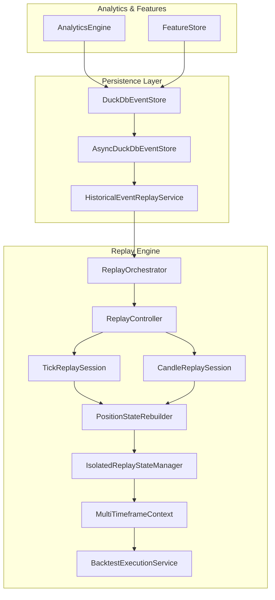
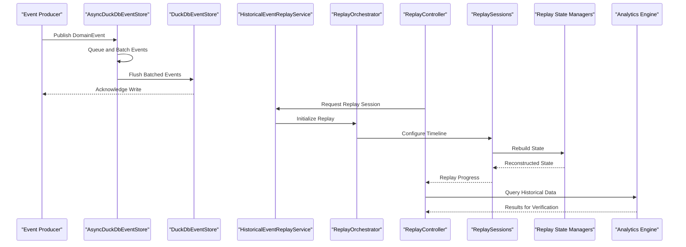
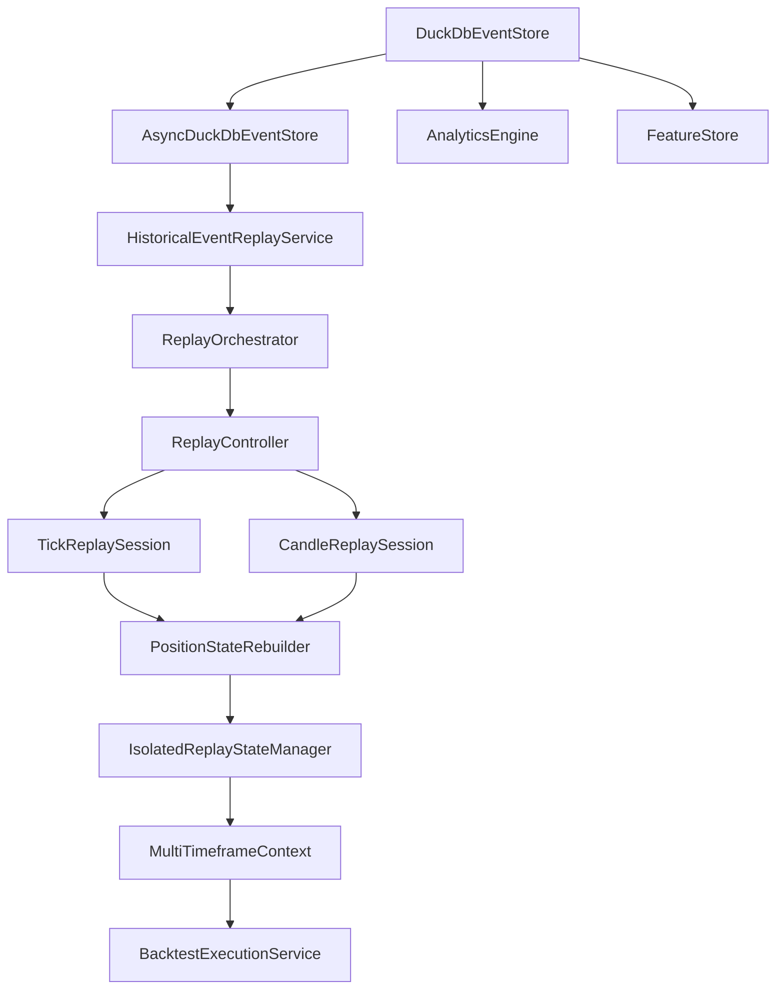

# Event Store and Replay System

<cite>
**Referenced Files in This Document**
- [DuckDbEventStore.java](file://data/persistence/src/main/java/com/tradej/persistence/duckdb/DuckDbEventStore.java)
- [AsyncDuckDbEventStore.java](file://data/persistence/src/main/java/com/tradej/persistence/duckdb/AsyncDuckDbEventStore.java)
- [HistoricalEventReplayService.java](file://data/persistence/src/main/java/com/tradej/persistence/replay/HistoricalEventReplayService.java)
- [ReplayOrchestrator.java](file://replay/engine/src/main/java/com/tradej/replay/engine/ReplayOrchestrator.java)
- [ReplayController.java](file://replay/engine/src/main/java/com/tradej/replay/engine/ReplayController.java)
- [TickReplaySession.java](file://replay/engine/src/main/java/com/tradej/replay/engine/TickReplaySession.java)
- [CandleReplaySession.java](file://replay/engine/src/main/java/com/tradej/replay/engine/CandleReplaySession.java)
- [PositionStateRebuilder.java](file://replay/engine/src/main/java/com/tradej/replay/engine/PositionStateRebuilder.java)
- [IsolatedReplayStateManager.java](file://replay/engine/src/main/java/com/tradej/replay/engine/IsolatedReplayStateManager.java)
- [MultiTimeframeContext.java](file://replay/engine/src/main/java/com/tradej/replay/engine/MultiTimeframeContext.java)
- [BacktestExecutionService.java](file://replay/engine/src/main/java/com/tradej/replay/engine/BacktestExecutionService.java)
- [DuckDbAnalyticsEngine.java](file://data/analytics/src/main/java/com/tradej/analytics/engine/DuckDbAnalyticsEngine.java)
- [DuckDbAnalyticsConfig.java](file://data/analytics/src/main/java/com/tradej/analytics/config/DuckDbAnalyticsConfig.java)
- [DuckDbFeatureStore.java](file://data/feature-store/src/main/java/com/tradej/feature/store/DuckDbFeatureStore.java)
- [ReplayEndToEndCertificationTest.java](file://app/src/test/java/com/tradej/app/integration/ReplayEndToEndCertificationTest.java)
</cite>

## Table of Contents
1. [Introduction](#introduction)
2. [Project Structure](#project-structure)
3. [Core Components](#core-components)
4. [Architecture Overview](#architecture-overview)
5. [Detailed Component Analysis](#detailed-component-analysis)
6. [Dependency Analysis](#dependency-analysis)
7. [Performance Considerations](#performance-considerations)
8. [Troubleshooting Guide](#troubleshooting-guide)
9. [Conclusion](#conclusion)
10. [Appendices](#appendices)

## Introduction
This document provides comprehensive documentation for the event store and replay system, focusing on the DuckDB-backed event store implementation, event sourcing architecture, and replay system functionality. It covers the historical event replay service, replay runner orchestration, replay state management, time-based data access patterns, event reconstruction, and replay validation processes. Practical examples demonstrate event replay execution, timeline manipulation, and replay verification, along with integration guidance for trading workflows, backtesting capabilities, and research applications. Guidelines for event storage optimization, replay performance tuning, and data integrity validation are included.

## Project Structure
The event store and replay system spans several modules:
- Persistence layer with DuckDB event store and async writer
- Replay engine orchestrating replay sessions and state management
- Analytics integration for time-series queries and research workloads
- Feature store for computed features and research datasets
- Integration tests validating end-to-end replay functionality

**Diagram sources**
- [DuckDbEventStore.java:1-200](file://data/persistence/src/main/java/com/tradej/persistence/duckdb/DuckDbEventStore.java#L1-L200)
- [AsyncDuckDbEventStore.java:1-120](file://data/persistence/src/main/java/com/tradej/persistence/duckdb/AsyncDuckDbEventStore.java#L1-L120)
- [HistoricalEventReplayService.java:1-200](file://data/persistence/src/main/java/com/tradej/persistence/replay/HistoricalEventReplayService.java#L1-L200)
- [ReplayOrchestrator.java:1-200](file://replay/engine/src/main/java/com/tradej/replay/engine/ReplayOrchestrator.java#L1-L200)
- [ReplayController.java:1-200](file://replay/engine/src/main/java/com/tradej/replay/engine/ReplayController.java#L1-L200)
- [TickReplaySession.java:1-200](file://replay/engine/src/main/java/com/tradej/replay/engine/TickReplaySession.java#L1-L200)
- [CandleReplaySession.java:1-200](file://replay/engine/src/main/java/com/tradej/replay/engine/CandleReplaySession.java#L1-L200)
- [PositionStateRebuilder.java:1-200](file://replay/engine/src/main/java/com/tradej/replay/engine/PositionStateRebuilder.java#L1-L200)
- [IsolatedReplayStateManager.java:1-200](file://replay/engine/src/main/java/com/tradej/replay/engine/IsolatedReplayStateManager.java#L1-L200)
- [MultiTimeframeContext.java:1-200](file://replay/engine/src/main/java/com/tradej/replay/engine/MultiTimeframeContext.java#L1-L200)
- [BacktestExecutionService.java:1-200](file://replay/engine/src/main/java/com/tradej/replay/engine/BacktestExecutionService.java#L1-L200)
- [DuckDbAnalyticsEngine.java:1-200](file://data/analytics/src/main/java/com/tradej/analytics/engine/DuckDbAnalyticsEngine.java#L1-L200)
- [DuckDbFeatureStore.java:1-200](file://data/feature-store/src/main/java/com/tradej/feature/store/DuckDbFeatureStore.java#L1-L200)

**Section sources**
- [DuckDbEventStore.java:1-200](file://data/persistence/src/main/java/com/tradej/persistence/duckdb/DuckDbEventStore.java#L1-L200)
- [AsyncDuckDbEventStore.java:1-120](file://data/persistence/src/main/java/com/tradej/persistence/duckdb/AsyncDuckDbEventStore.java#L1-L120)
- [HistoricalEventReplayService.java:1-200](file://data/persistence/src/main/java/com/tradej/persistence/replay/HistoricalEventReplayService.java#L1-L200)
- [ReplayOrchestrator.java:1-200](file://replay/engine/src/main/java/com/tradej/replay/engine/ReplayOrchestrator.java#L1-L200)
- [ReplayController.java:1-200](file://replay/engine/src/main/java/com/tradej/replay/engine/ReplayController.java#L1-L200)
- [DuckDbAnalyticsEngine.java:1-200](file://data/analytics/src/main/java/com/tradej/analytics/engine/DuckDbAnalyticsEngine.java#L1-L200)
- [DuckDbFeatureStore.java:1-200](file://data/feature-store/src/main/java/com/tradej/feature/store/DuckDbFeatureStore.java#L1-L200)

## Core Components
This section documents the primary components of the event store and replay system, including the DuckDB event store, asynchronous writer, historical replay service, and replay orchestration engine.

- DuckDB Event Store: Provides durable, append-only storage for domain events with efficient time-series queries and schema evolution support.
- Async DuckDB Event Store: Wraps the synchronous store to batch and flush events asynchronously, reducing latency on the event dispatch thread.
- Historical Event Replay Service: Executes replay sessions against historical event data, reconstructing state and validating parity with live systems.
- Replay Orchestrator: Coordinates replay execution, manages timelines, and orchestrates state rebuilders and execution services.
- Replay Controller: Manages user-driven replay actions, session lifecycle, and real-time controls during replay.
- Tick/Candle Replay Sessions: Specialized replay contexts for tick-level and candle-level data streams.
- Position State Rebuilder: Reconstructs portfolio and position state from historical events for accurate backtesting.
- Isolated Replay State Manager: Maintains replay-specific state isolation and deterministic execution environments.
- Multi-Timeframe Context: Enables cross-timeframe analysis and synchronization during replay.
- Backtest Execution Service: Drives backtesting workflows using reconstructed state and replayed market data.

**Section sources**
- [DuckDbEventStore.java:1-200](file://data/persistence/src/main/java/com/tradej/persistence/duckdb/DuckDbEventStore.java#L1-L200)
- [AsyncDuckDbEventStore.java:1-120](file://data/persistence/src/main/java/com/tradej/persistence/duckdb/AsyncDuckDbEventStore.java#L1-L120)
- [HistoricalEventReplayService.java:1-200](file://data/persistence/src/main/java/com/tradej/persistence/replay/HistoricalEventReplayService.java#L1-L200)
- [ReplayOrchestrator.java:1-200](file://replay/engine/src/main/java/com/tradej/replay/engine/ReplayOrchestrator.java#L1-L200)
- [ReplayController.java:1-200](file://replay/engine/src/main/java/com/tradej/replay/engine/ReplayController.java#L1-L200)
- [TickReplaySession.java:1-200](file://replay/engine/src/main/java/com/tradej/replay/engine/TickReplaySession.java#L1-L200)
- [CandleReplaySession.java:1-200](file://replay/engine/src/main/java/com/tradej/replay/engine/CandleReplaySession.java#L1-L200)
- [PositionStateRebuilder.java:1-200](file://replay/engine/src/main/java/com/tradej/replay/engine/PositionStateRebuilder.java#L1-L200)
- [IsolatedReplayStateManager.java:1-200](file://replay/engine/src/main/java/com/tradej/replay/engine/IsolatedReplayStateManager.java#L1-L200)
- [MultiTimeframeContext.java:1-200](file://replay/engine/src/main/java/com/tradej/replay/engine/MultiTimeframeContext.java#L1-L200)
- [BacktestExecutionService.java:1-200](file://replay/engine/src/main/java/com/tradej/replay/engine/BacktestExecutionService.java#L1-L200)

## Architecture Overview
The system follows an event-sourcing architecture where domain events are persisted in chronological order and replayed to reconstruct state for trading workflows, backtesting, and research. DuckDB serves as the primary event store, enabling efficient analytical queries and time-series operations. The replay engine orchestrates deterministic execution, while the async writer ensures high-throughput ingestion without blocking the event dispatch path.

**Diagram sources**
- [AsyncDuckDbEventStore.java:1-120](file://data/persistence/src/main/java/com/tradej/persistence/duckdb/AsyncDuckDbEventStore.java#L1-L120)
- [DuckDbEventStore.java:1-200](file://data/persistence/src/main/java/com/tradej/persistence/duckdb/DuckDbEventStore.java#L1-L200)
- [HistoricalEventReplayService.java:1-200](file://data/persistence/src/main/java/com/tradej/persistence/replay/HistoricalEventReplayService.java#L1-L200)
- [ReplayOrchestrator.java:1-200](file://replay/engine/src/main/java/com/tradej/replay/engine/ReplayOrchestrator.java#L1-L200)
- [ReplayController.java:1-200](file://replay/engine/src/main/java/com/tradej/replay/engine/ReplayController.java#L1-L200)
- [TickReplaySession.java:1-200](file://replay/engine/src/main/java/com/tradej/replay/engine/TickReplaySession.java#L1-L200)
- [CandleReplaySession.java:1-200](file://replay/engine/src/main/java/com/tradej/replay/engine/CandleReplaySession.java#L1-L200)
- [PositionStateRebuilder.java:1-200](file://replay/engine/src/main/java/com/tradej/replay/engine/PositionStateRebuilder.java#L1-L200)
- [IsolatedReplayStateManager.java:1-200](file://replay/engine/src/main/java/com/tradej/replay/engine/IsolatedReplayStateManager.java#L1-L200)
- [MultiTimeframeContext.java:1-200](file://replay/engine/src/main/java/com/tradej/replay/engine/MultiTimeframeContext.java#L1-L200)
- [BacktestExecutionService.java:1-200](file://replay/engine/src/main/java/com/tradej/replay/engine/BacktestExecutionService.java#L1-L200)
- [DuckDbAnalyticsEngine.java:1-200](file://data/analytics/src/main/java/com/tradej/analytics/engine/DuckDbAnalyticsEngine.java#L1-L200)

## Detailed Component Analysis

### DuckDB Event Store
The DuckDB event store provides durable, append-only storage for domain events with optimized time-series access patterns. It supports schema evolution, efficient range queries, and analytical operations crucial for replay and research.

Key characteristics:
- Append-only event table with timestamp-based ordering
- Schema evolution support for backward-compatible event evolution
- Efficient time-range queries for replay sessions
- Integration with DuckDB's analytical capabilities

Implementation highlights:
- Event metadata and payload persistence
- Transactional write guarantees
- Index-friendly schema for chronological access

**Section sources**
- [DuckDbEventStore.java:1-200](file://data/persistence/src/main/java/com/tradej/persistence/duckdb/DuckDbEventStore.java#L1-L200)

### Async DuckDB Event Store
The async event store wraps the synchronous store to move blocking JDBC writes off the event dispatch thread. It batches events and flushes them periodically, improving throughput and reducing latency spikes.

Key characteristics:
- Batching with configurable batch size and wait time
- Blocking queue for event buffering
- Poison pill mechanism for graceful shutdown
- Drop counters for overflow handling

Implementation highlights:
- Dedicated worker thread for flushing
- Configurable queue capacity and batch parameters
- Atomic state management for start/stop operations

**Section sources**
- [AsyncDuckDbEventStore.java:1-120](file://data/persistence/src/main/java/com/tradej/persistence/duckdb/AsyncDuckDbEventStore.java#L1-L120)

### Historical Event Replay Service
The historical event replay service executes replay sessions against stored events, reconstructing state and validating parity with live systems. It coordinates with the replay orchestrator and session managers to ensure deterministic execution.

Key characteristics:
- Session initialization and lifecycle management
- Timeline configuration and validation
- State reconstruction coordination
- Integration with query services for historical data

**Section sources**
- [HistoricalEventReplayService.java:1-200](file://data/persistence/src/main/java/com/tradej/persistence/replay/HistoricalEventReplayService.java#L1-L200)

### Replay Orchestrator
The replay orchestrator coordinates replay execution, managing timelines, session initialization, and state rebuilding. It integrates with replay sessions and state managers to ensure deterministic replay behavior.

Key characteristics:
- Timeline orchestration and validation
- Session coordination and lifecycle management
- State rebuilding coordination
- Multi-timeframe synchronization

**Section sources**
- [ReplayOrchestrator.java:1-200](file://replay/engine/src/main/java/com/tradej/replay/engine/ReplayOrchestrator.java#L1-L200)

### Replay Controller
The replay controller manages user-driven replay actions, session lifecycle, and real-time controls during replay. It provides an interface for starting, pausing, and manipulating replay timelines.

Key characteristics:
- User-driven replay controls
- Session lifecycle management
- Real-time timeline manipulation
- Integration with replay sessions

**Section sources**
- [ReplayController.java:1-200](file://replay/engine/src/main/java/com/tradej/replay/engine/ReplayController.java#L1-L200)

### Tick and Candle Replay Sessions
Specialized replay contexts for tick-level and candle-level data streams. These sessions handle different temporal granularities and provide appropriate state reconstruction for each timeframe.

Key characteristics:
- Tick-level session for high-frequency data
- Candle-level session for aggregated data
- Timeframe-specific state management
- Synchronization with multi-timeframe context

**Section sources**
- [TickReplaySession.java:1-200](file://replay/engine/src/main/java/com/tradej/replay/engine/TickReplaySession.java#L1-L200)
- [CandleReplaySession.java:1-200](file://replay/engine/src/main/java/com/tradej/replay/engine/CandleReplaySession.java#L1-L200)

### Position State Rebuilder
The position state rebuilder reconstructs portfolio and position state from historical events. It ensures accurate state reconstruction for backtesting and research workflows.

Key characteristics:
- State reconstruction from event streams
- Portfolio aggregation and position updates
- Risk and PnL computation during replay
- Integration with execution services

**Section sources**
- [PositionStateRebuilder.java:1-200](file://replay/engine/src/main/java/com/tradej/replay/engine/PositionStateRebuilder.java#L1-L200)

### Isolated Replay State Manager and Multi-Timeframe Context
These components maintain replay-specific state isolation and enable cross-timeframe analysis during replay. They ensure deterministic execution and proper synchronization across different temporal granularities.

Key characteristics:
- State isolation for replay determinism
- Cross-timeframe synchronization
- Multi-resolution state management
- Integration with backtest execution service

**Section sources**
- [IsolatedReplayStateManager.java:1-200](file://replay/engine/src/main/java/com/tradej/replay/engine/IsolatedReplayStateManager.java#L1-L200)
- [MultiTimeframeContext.java:1-200](file://replay/engine/src/main/java/com/tradej/replay/engine/MultiTimeframeContext.java#L1-L200)

### Backtest Execution Service
The backtest execution service drives backtesting workflows using reconstructed state and replayed market data. It integrates with replay sessions and state managers to execute trading strategies.

Key characteristics:
- Backtesting workflow orchestration
- Strategy execution using replayed state
- Integration with replay sessions
- Performance monitoring and reporting

**Section sources**
- [BacktestExecutionService.java:1-200](file://replay/engine/src/main/java/com/tradej/replay/engine/BacktestExecutionService.java#L1-L200)

### Analytics and Feature Store Integration
The system integrates with DuckDB analytics and feature stores to support research applications and data-driven insights. These components leverage the event store for analytical queries and feature computation.

Key characteristics:
- DuckDB analytics engine for time-series queries
- Feature store for computed datasets
- Research-friendly data access patterns
- Integration with event store for historical analysis

**Section sources**
- [DuckDbAnalyticsEngine.java:1-200](file://data/analytics/src/main/java/com/tradej/analytics/engine/DuckDbAnalyticsEngine.java#L1-L200)
- [DuckDbFeatureStore.java:1-200](file://data/feature-store/src/main/java/com/tradej/feature/store/DuckDbFeatureStore.java#L1-L200)

## Dependency Analysis
The event store and replay system exhibits strong cohesion within functional areas and clear separation of concerns across modules. Dependencies flow from the persistence layer upward through the replay engine to analytics and research components.

**Diagram sources**
- [DuckDbEventStore.java:1-200](file://data/persistence/src/main/java/com/tradej/persistence/duckdb/DuckDbEventStore.java#L1-L200)
- [AsyncDuckDbEventStore.java:1-120](file://data/persistence/src/main/java/com/tradej/persistence/duckdb/AsyncDuckDbEventStore.java#L1-L120)
- [HistoricalEventReplayService.java:1-200](file://data/persistence/src/main/java/com/tradej/persistence/replay/HistoricalEventReplayService.java#L1-L200)
- [ReplayOrchestrator.java:1-200](file://replay/engine/src/main/java/com/tradej/replay/engine/ReplayOrchestrator.java#L1-L200)
- [ReplayController.java:1-200](file://replay/engine/src/main/java/com/tradej/replay/engine/ReplayController.java#L1-L200)
- [TickReplaySession.java:1-200](file://replay/engine/src/main/java/com/tradej/replay/engine/TickReplaySession.java#L1-L200)
- [CandleReplaySession.java:1-200](file://replay/engine/src/main/java/com/tradej/replay/engine/CandleReplaySession.java#L1-L200)
- [PositionStateRebuilder.java:1-200](file://replay/engine/src/main/java/com/tradej/replay/engine/PositionStateRebuilder.java#L1-L200)
- [IsolatedReplayStateManager.java:1-200](file://replay/engine/src/main/java/com/tradej/replay/engine/IsolatedReplayStateManager.java#L1-L200)
- [MultiTimeframeContext.java:1-200](file://replay/engine/src/main/java/com/tradej/replay/engine/MultiTimeframeContext.java#L1-L200)
- [BacktestExecutionService.java:1-200](file://replay/engine/src/main/java/com/tradej/replay/engine/BacktestExecutionService.java#L1-L200)
- [DuckDbAnalyticsEngine.java:1-200](file://data/analytics/src/main/java/com/tradej/analytics/engine/DuckDbAnalyticsEngine.java#L1-L200)
- [DuckDbFeatureStore.java:1-200](file://data/feature-store/src/main/java/com/tradej/feature/store/DuckDbFeatureStore.java#L1-L200)

**Section sources**
- [DuckDbEventStore.java:1-200](file://data/persistence/src/main/java/com/tradej/persistence/duckdb/DuckDbEventStore.java#L1-L200)
- [AsyncDuckDbEventStore.java:1-120](file://data/persistence/src/main/java/com/tradej/persistence/duckdb/AsyncDuckDbEventStore.java#L1-L120)
- [HistoricalEventReplayService.java:1-200](file://data/persistence/src/main/java/com/tradej/persistence/replay/HistoricalEventReplayService.java#L1-L200)
- [ReplayOrchestrator.java:1-200](file://replay/engine/src/main/java/com/tradej/replay/engine/ReplayOrchestrator.java#L1-L200)
- [ReplayController.java:1-200](file://replay/engine/src/main/java/com/tradej/replay/engine/ReplayController.java#L1-L200)
- [DuckDbAnalyticsEngine.java:1-200](file://data/analytics/src/main/java/com/tradej/analytics/engine/DuckDbAnalyticsEngine.java#L1-L200)
- [DuckDbFeatureStore.java:1-200](file://data/feature-store/src/main/java/com/tradej/feature/store/DuckDbFeatureStore.java#L1-L200)

## Performance Considerations
Optimizing the event store and replay system involves balancing ingestion throughput, replay performance, and analytical query efficiency. Key considerations include:

- Asynchronous event writing: Use the async event store to batch and flush events, reducing latency on the event dispatch thread. Tune batch size and wait time based on workload characteristics.
- DuckDB configuration: Optimize DuckDB settings for analytical workloads, including memory allocation and compression settings.
- Replay session sizing: Control replay window sizes to balance memory usage and query performance during state reconstruction.
- Multi-timeframe synchronization: Minimize overhead in multi-timeframe contexts by optimizing synchronization points and state updates.
- Query optimization: Leverage DuckDB's analytical capabilities for efficient time-range queries and aggregations during replay validation.
- Storage layout: Consider partitioning strategies for large historical datasets to improve query performance and reduce I/O overhead.

[No sources needed since this section provides general guidance]

## Troubleshooting Guide
Common issues and resolutions for the event store and replay system:

- Event ingestion failures: Monitor async event store drop counts and adjust queue capacity or batch parameters. Verify database connectivity and transaction timeouts.
- Replay session errors: Validate timeline configurations and ensure proper state isolation. Check for missing events or gaps in the event stream that could cause reconstruction failures.
- Memory pressure during replay: Reduce replay window sizes or increase system memory. Monitor multi-timeframe context synchronization overhead.
- Query performance issues: Review DuckDB query plans and optimize time-range filters. Consider indexing strategies for frequently queried event types.
- State reconstruction inconsistencies: Verify event ordering and metadata consistency. Ensure schema evolution compatibility across event versions.
- Integration test failures: Use the provided end-to-end test framework to validate replay functionality and parity with live systems.

**Section sources**
- [AsyncDuckDbEventStore.java:1-120](file://data/persistence/src/main/java/com/tradej/persistence/duckdb/AsyncDuckDbEventStore.java#L1-L120)
- [HistoricalEventReplayService.java:1-200](file://data/persistence/src/main/java/com/tradej/persistence/replay/HistoricalEventReplayService.java#L1-L200)
- [ReplayEndToEndCertificationTest.java:66-88](file://app/src/test/java/com/tradej/app/integration/ReplayEndToEndCertificationTest.java#L66-L88)

## Conclusion
The event store and replay system provides a robust foundation for event-sourced trading workflows, enabling reliable replay, backtesting, and research applications. The DuckDB-backed event store delivers efficient time-series operations, while the replay engine ensures deterministic execution and state reconstruction. Integration with analytics and feature stores extends capabilities to research and data-driven insights. Proper tuning and monitoring of the async writer, replay sessions, and query performance are essential for optimal system operation.

[No sources needed since this section summarizes without analyzing specific files]

## Appendices

### Practical Examples

#### Event Replay Execution
- Initialize the async event store with appropriate batch parameters
- Configure replay sessions with desired time ranges
- Start replay controller and monitor progress
- Validate results using historical query service

#### Timeline Manipulation
- Adjust replay speed and pause/resume functionality
- Modify time windows for focused analysis
- Switch between tick and candle-level sessions
- Coordinate multi-timeframe contexts for synchronized analysis

#### Replay Verification
- Compare replayed state with live system snapshots
- Validate event reconstruction accuracy
- Execute parity checks against historical datasets
- Monitor performance metrics and resource utilization

**Section sources**
- [ReplayEndToEndCertificationTest.java:66-88](file://app/src/test/java/com/tradej/app/integration/ReplayEndToEndCertificationTest.java#L66-L88)
- [ReplayController.java:1-200](file://replay/engine/src/main/java/com/tradej/replay/engine/ReplayController.java#L1-L200)
- [HistoricalEventReplayService.java:1-200](file://data/persistence/src/main/java/com/tradej/persistence/replay/HistoricalEventReplayService.java#L1-L200)

### Integration Guidelines

#### Trading Workflows
- Use replay sessions to validate order lifecycle and execution fidelity
- Integrate with backtest execution service for strategy testing
- Leverage position state rebuilder for accurate PnL calculations

#### Backtesting Capabilities
- Configure replay windows aligned with strategy requirements
- Utilize multi-timeframe context for cross-resolution analysis
- Validate results against historical benchmarks and performance metrics

#### Research Applications
- Access historical events through DuckDB analytics engine
- Build feature stores for machine learning and statistical analysis
- Perform comparative studies across different time periods and market conditions

**Section sources**
- [BacktestExecutionService.java:1-200](file://replay/engine/src/main/java/com/tradej/replay/engine/BacktestExecutionService.java#L1-L200)
- [DuckDbAnalyticsEngine.java:1-200](file://data/analytics/src/main/java/com/tradej/analytics/engine/DuckDbAnalyticsEngine.java#L1-L200)
- [DuckDbFeatureStore.java:1-200](file://data/feature-store/src/main/java/com/tradej/feature/store/DuckDbFeatureStore.java#L1-L200)