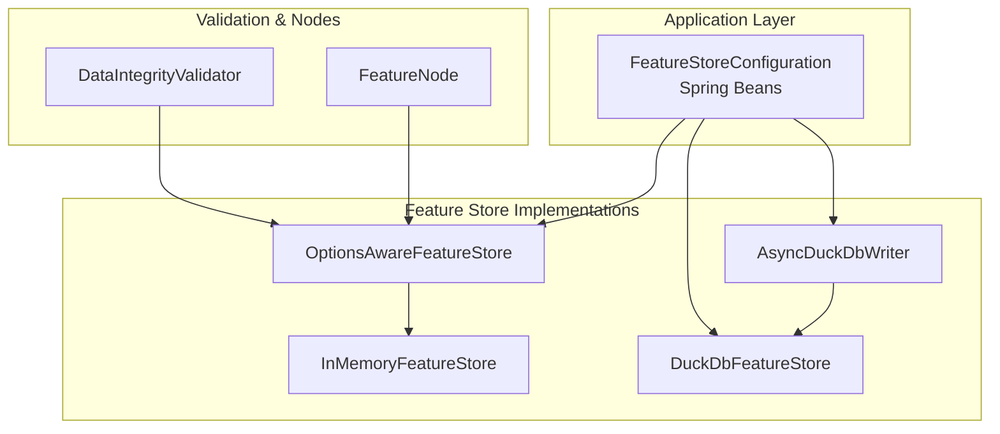
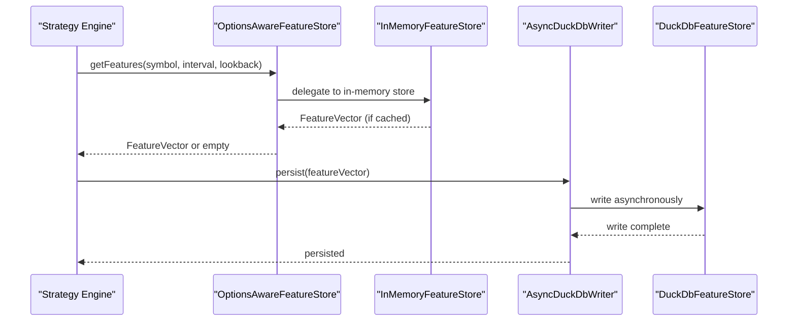
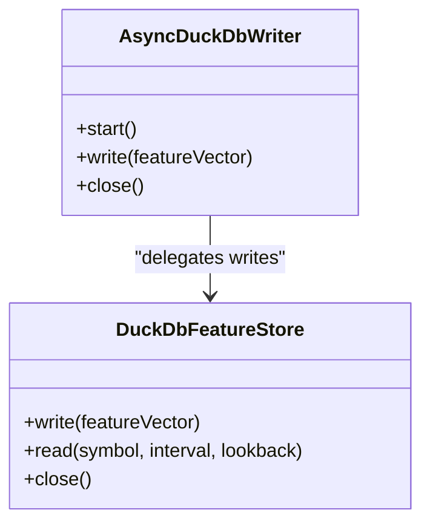
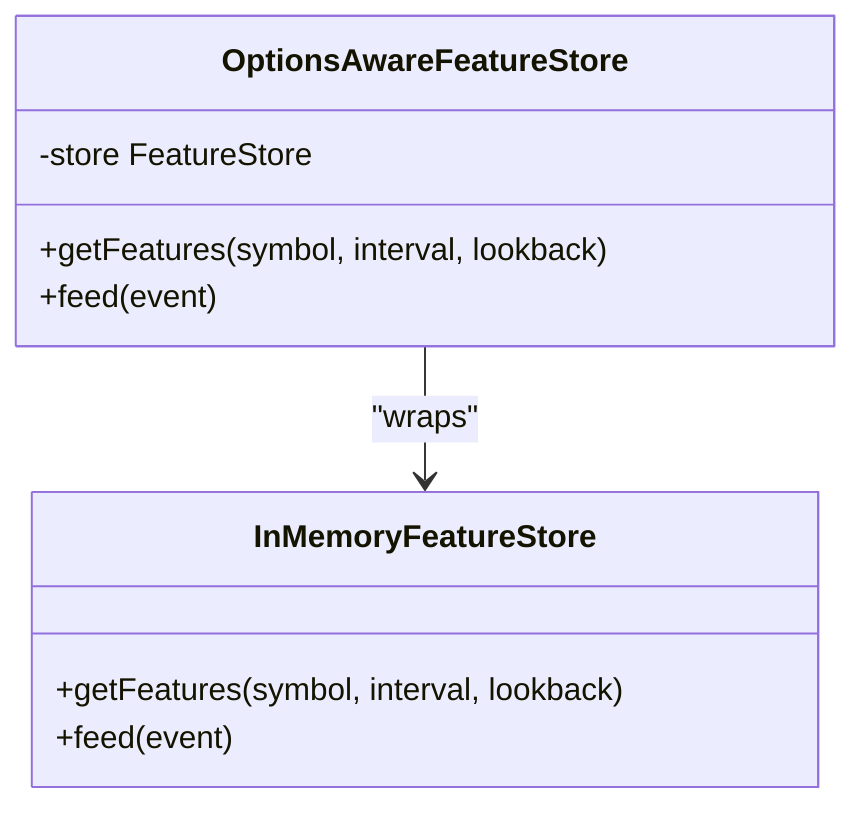
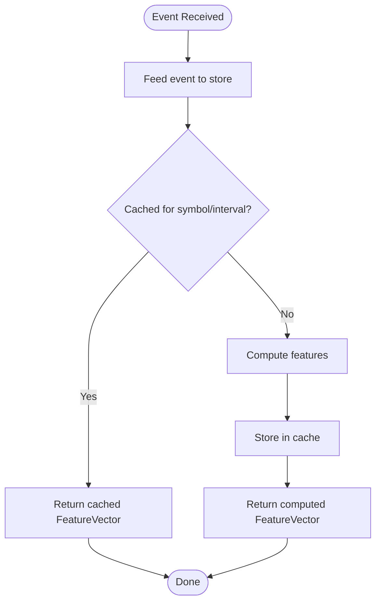
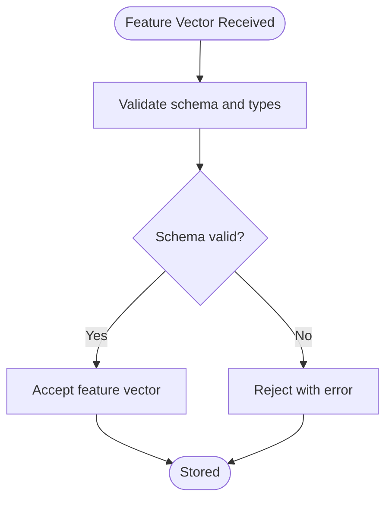
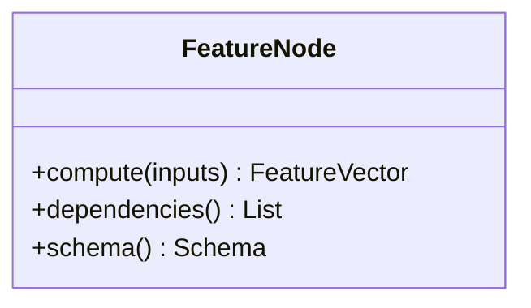
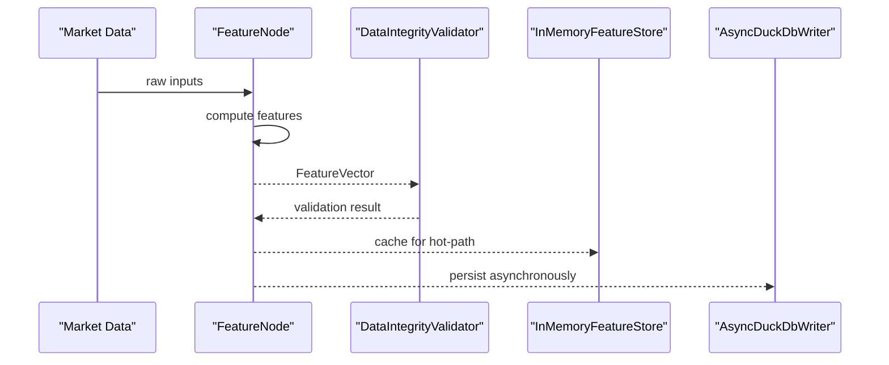
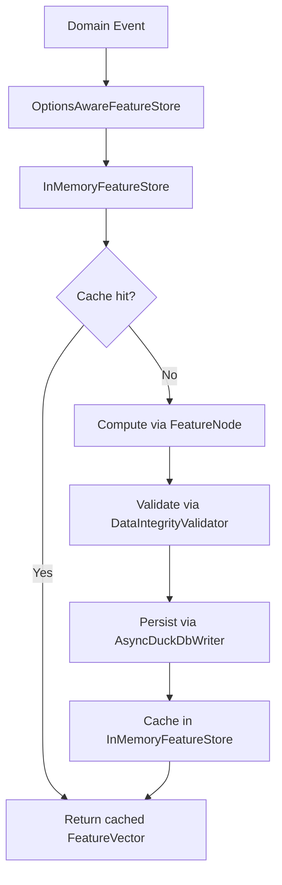
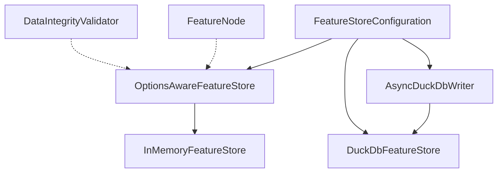

# Feature Store System

<cite>
**Referenced Files in This Document**
- [FeatureStoreConfiguration.java](file://app/src/main/java/com/tradej/app/config/FeatureStoreConfiguration.java)
- [DuckDbFeatureStore.java](file://data/feature-store/src/main/java/com/tradej/feature/store/DuckDbFeatureStore.java)
- [InMemoryFeatureStore.java](file://data/feature-store/src/main/java/com/tradej/feature/store/InMemoryFeatureStore.java)
- [OptionsAwareFeatureStore.java](file://data/feature-store/src/main/java/com/tradej/feature/store/OptionsAwareFeatureStore.java)
- [AsyncDuckDbWriter.java](file://data/feature-store/src/main/java/com/tradej/feature/store/AsyncDuckDbWriter.java)
- [FeatureNode.java](file://data/feature-store/src/main/java/com/tradej/feature/store/node/FeatureNode.java)
- [DataIntegrityValidator.java](file://data/feature-store/src/main/java/com/tradej/feature/store/validation/DataIntegrityValidator.java)
- [DuckDbFeatureStoreTest.java](file://data/feature-store/src/test/java/com/tradej/feature/store/DuckDbFeatureStoreTest.java)
- [InMemoryFeatureStoreTest.java](file://data/feature-store/src/test/java/com/tradej/feature/store/InMemoryFeatureStoreTest.java)
- [OptionsAwareFeatureStoreTest.java](file://data/feature-store/src/test/java/com/tradej/feature/store/OptionsAwareFeatureStoreTest.java)
- [DUCKDB_UNIFIED_ENGINE_PLAN.md](file://plans/DUCKDB_UNIFIED_ENGINE_PLAN.md)
</cite>

## Table of Contents
1. [Introduction](#introduction)
2. [Project Structure](#project-structure)
3. [Core Components](#core-components)
4. [Architecture Overview](#architecture-overview)
5. [Detailed Component Analysis](#detailed-component-analysis)
6. [Dependency Analysis](#dependency-analysis)
7. [Performance Considerations](#performance-considerations)
8. [Troubleshooting Guide](#troubleshooting-guide)
9. [Conclusion](#conclusion)
10. [Appendices](#appendices)

## Introduction
This document provides comprehensive documentation for the feature store system, focusing on the DuckDB-backed feature store implementation, options-aware feature store, and in-memory feature store variants. It explains data integrity validation, feature node architecture, and feature validation mechanisms. The document also details feature extraction processes, data transformation pipelines, and feature caching strategies, along with practical usage examples, integration points with machine learning pipelines, research applications, and trading analytics. Finally, it offers guidelines for optimization, data consistency maintenance, and feature versioning strategies.

## Project Structure
The feature store system resides primarily under the `data/feature-store` module and integrates with the application configuration via Spring beans. The system supports:
- In-memory feature store for fast, hot-path reads
- Options-aware feature store that wraps the in-memory store to provide conditional behavior
- DuckDB-backed feature store for durable persistence
- An asynchronous writer that offloads blocking database writes
- Validation and node components for integrity and feature computation

**Diagram sources**
- [FeatureStoreConfiguration.java:19-63](file://app/src/main/java/com/tradej/app/config/FeatureStoreConfiguration.java#L19-L63)
- [InMemoryFeatureStore.java](file://data/feature-store/src/main/java/com/tradej/feature/store/InMemoryFeatureStore.java)
- [OptionsAwareFeatureStore.java](file://data/feature-store/src/main/java/com/tradej/feature/store/OptionsAwareFeatureStore.java)
- [DuckDbFeatureStore.java](file://data/feature-store/src/main/java/com/tradej/feature/store/DuckDbFeatureStore.java)
- [AsyncDuckDbWriter.java](file://data/feature-store/src/main/java/com/tradej/feature/store/AsyncDuckDbWriter.java)
- [DataIntegrityValidator.java](file://data/feature-store/src/main/java/com/tradej/feature/store/validation/DataIntegrityValidator.java)
- [FeatureNode.java](file://data/feature-store/src/main/java/com/tradej/feature/store/node/FeatureNode.java)

**Section sources**
- [FeatureStoreConfiguration.java:19-63](file://app/src/main/java/com/tradej/app/config/FeatureStoreConfiguration.java#L19-L63)

## Core Components
This section outlines the primary components and their responsibilities:

- InMemoryFeatureStore: Provides fast, in-memory storage for feature vectors suitable for hot-path strategy reads. Supports feeding events and retrieving features by symbol, interval, and lookback window.
- OptionsAwareFeatureStore: Wraps another FeatureStore implementation (typically InMemoryFeatureStore) and adds conditional logic based on options to alter behavior during feature retrieval.
- DuckDbFeatureStore: Implements durable persistence using DuckDB for feature vectors, enabling long-term storage and batch operations.
- AsyncDuckDbWriter: Asynchronous wrapper around DuckDbFeatureStore that moves blocking JDBC writes off the event dispatch thread onto a dedicated background thread.
- DataIntegrityValidator: Validates feature data integrity and ensures consistent schemas and data types.
- FeatureNode: Represents a node in the feature computation graph, encapsulating feature extraction logic and dependencies.

**Section sources**
- [InMemoryFeatureStore.java](file://data/feature-store/src/main/java/com/tradej/feature/store/InMemoryFeatureStore.java)
- [OptionsAwareFeatureStore.java](file://data/feature-store/src/main/java/com/tradej/feature/store/OptionsAwareFeatureStore.java)
- [DuckDbFeatureStore.java](file://data/feature-store/src/main/java/com/tradej/feature/store/DuckDbFeatureStore.java)
- [AsyncDuckDbWriter.java](file://data/feature-store/src/main/java/com/tradej/feature/store/AsyncDuckDbWriter.java)
- [DataIntegrityValidator.java](file://data/feature-store/src/main/java/com/tradej/feature/store/validation/DataIntegrityValidator.java)
- [FeatureNode.java](file://data/feature-store/src/main/java/com/tradej/feature/store/node/FeatureNode.java)

## Architecture Overview
The feature store architecture combines hot-path in-memory access with asynchronous persistence. The Spring configuration wires the options-aware feature store as the primary feature store, while DuckDB-backed storage persists features asynchronously.

**Diagram sources**
- [FeatureStoreConfiguration.java:25-53](file://app/src/main/java/com/tradej/app/config/FeatureStoreConfiguration.java#L25-L53)
- [OptionsAwareFeatureStore.java](file://data/feature-store/src/main/java/com/tradej/feature/store/OptionsAwareFeatureStore.java)
- [InMemoryFeatureStore.java](file://data/feature-store/src/main/java/com/tradej/feature/store/InMemoryFeatureStore.java)
- [AsyncDuckDbWriter.java](file://data/feature-store/src/main/java/com/tradej/feature/store/AsyncDuckDbWriter.java)
- [DuckDbFeatureStore.java](file://data/feature-store/src/main/java/com/tradej/feature/store/DuckDbFeatureStore.java)

## Detailed Component Analysis

### DuckDB Feature Store Implementation
The DuckDB-backed feature store provides durable persistence for feature vectors. It is configured via Spring and resolves a separate DuckDB file for features based on the base storage path. The async writer delegates blocking writes to a background thread to avoid latency spikes on the event dispatch thread.

Key characteristics:
- Durable persistence using DuckDB
- Asynchronous write path via AsyncDuckDbWriter
- Path resolution for feature-specific DuckDB file derived from base storage path

**Diagram sources**
- [DuckDbFeatureStore.java](file://data/feature-store/src/main/java/com/tradej/feature/store/DuckDbFeatureStore.java)
- [AsyncDuckDbWriter.java](file://data/feature-store/src/main/java/com/tradej/feature/store/AsyncDuckDbWriter.java)

**Section sources**
- [FeatureStoreConfiguration.java:36-62](file://app/src/main/java/com/tradej/app/config/FeatureStoreConfiguration.java#L36-L62)
- [DuckDbFeatureStore.java](file://data/feature-store/src/main/java/com/tradej/feature/store/DuckDbFeatureStore.java)
- [AsyncDuckDbWriter.java](file://data/feature-store/src/main/java/com/tradej/feature/store/AsyncDuckDbWriter.java)

### Options-Aware Feature Store
The options-aware feature store wraps an underlying FeatureStore implementation (commonly InMemoryFeatureStore) and applies conditional logic based on options. This enables dynamic behavior such as enabling/disabling caching or altering feature retrieval semantics depending on runtime conditions.

**Diagram sources**
- [OptionsAwareFeatureStore.java](file://data/feature-store/src/main/java/com/tradej/feature/store/OptionsAwareFeatureStore.java)
- [InMemoryFeatureStore.java](file://data/feature-store/src/main/java/com/tradej/feature/store/InMemoryFeatureStore.java)

**Section sources**
- [FeatureStoreConfiguration.java:25-34](file://app/src/main/java/com/tradej/app/config/FeatureStoreConfiguration.java#L25-L34)
- [OptionsAwareFeatureStore.java](file://data/feature-store/src/main/java/com/tradej/feature/store/OptionsAwareFeatureStore.java)

### In-Memory Feature Store Variants
The in-memory feature store is optimized for fast reads during hot-path strategy execution. It supports feeding domain events and retrieving feature vectors by symbol, interval, and lookback window. Tests demonstrate its usage in strategy and research contexts.

**Diagram sources**
- [InMemoryFeatureStore.java](file://data/feature-store/src/main/java/com/tradej/feature/store/InMemoryFeatureStore.java)
- [InMemoryFeatureStoreTest.java](file://data/feature-store/src/test/java/com/tradej/feature/store/InMemoryFeatureStoreTest.java)

**Section sources**
- [InMemoryFeatureStore.java](file://data/feature-store/src/main/java/com/tradej/feature/store/InMemoryFeatureStore.java)
- [InMemoryFeatureStoreTest.java](file://data/feature-store/src/test/java/com/tradej/feature/store/InMemoryFeatureStoreTest.java)

### Data Integrity Validation
Data integrity validation ensures consistent schemas and data types for feature vectors. It validates incoming feature data against expected structures and raises errors on mismatches, preventing downstream pipeline corruption.

**Diagram sources**
- [DataIntegrityValidator.java](file://data/feature-store/src/main/java/com/tradej/feature/store/validation/DataIntegrityValidator.java)

**Section sources**
- [DataIntegrityValidator.java](file://data/feature-store/src/main/java/com/tradej/feature/store/validation/DataIntegrityValidator.java)

### Feature Node Architecture
Feature nodes represent units of computation in the feature graph. They encapsulate feature extraction logic, dependencies on upstream nodes, and output schemas. This architecture enables modular, composable feature computation pipelines.

**Diagram sources**
- [FeatureNode.java](file://data/feature-store/src/main/java/com/tradej/feature/store/node/FeatureNode.java)

**Section sources**
- [FeatureNode.java](file://data/feature-store/src/main/java/com/tradej/feature/store/node/FeatureNode.java)

### Feature Extraction and Transformation Pipelines
Feature extraction involves transforming raw market data and domain events into structured feature vectors. The pipeline typically includes:
- Data ingestion from market feeds and domain events
- Feature computation using FeatureNode instances
- Validation via DataIntegrityValidator
- Storage in InMemoryFeatureStore for hot-path reads and AsyncDuckDbWriter for asynchronous persistence

**Diagram sources**
- [FeatureNode.java](file://data/feature-store/src/main/java/com/tradej/feature/store/node/FeatureNode.java)
- [DataIntegrityValidator.java](file://data/feature-store/src/main/java/com/tradej/feature/store/validation/DataIntegrityValidator.java)
- [InMemoryFeatureStore.java](file://data/feature-store/src/main/java/com/tradej/feature/store/InMemoryFeatureStore.java)
- [AsyncDuckDbWriter.java](file://data/feature-store/src/main/java/com/tradej/feature/store/AsyncDuckDbWriter.java)

### Feature Caching Strategies
The system employs a layered caching strategy:
- Hot-path caching in InMemoryFeatureStore for immediate access during strategy execution
- Asynchronous persistence via AsyncDuckDbWriter to maintain durability without blocking event processing
- Options-aware behavior to enable/disable caching or alter retrieval semantics based on runtime conditions

**Diagram sources**
- [OptionsAwareFeatureStore.java](file://data/feature-store/src/main/java/com/tradej/feature/store/OptionsAwareFeatureStore.java)
- [InMemoryFeatureStore.java](file://data/feature-store/src/main/java/com/tradej/feature/store/InMemoryFeatureStore.java)
- [AsyncDuckDbWriter.java](file://data/feature-store/src/main/java/com/tradej/feature/store/AsyncDuckDbWriter.java)
- [DataIntegrityValidator.java](file://data/feature-store/src/main/java/com/tradej/feature/store/validation/DataIntegrityValidator.java)

**Section sources**
- [OptionsAwareFeatureStore.java](file://data/feature-store/src/main/java/com/tradej/feature/store/OptionsAwareFeatureStore.java)
- [InMemoryFeatureStore.java](file://data/feature-store/src/main/java/com/tradej/feature/store/InMemoryFeatureStore.java)
- [AsyncDuckDbWriter.java](file://data/feature-store/src/main/java/com/tradej/feature/store/AsyncDuckDbWriter.java)
- [DataIntegrityValidator.java](file://data/feature-store/src/main/java/com/tradej/feature/store/validation/DataIntegrityValidator.java)

## Dependency Analysis
The feature store system exhibits clear separation of concerns:
- Application configuration depends on feature store implementations
- OptionsAwareFeatureStore depends on InMemoryFeatureStore
- AsyncDuckDbWriter depends on DuckDbFeatureStore
- Validation and node components are independent but integrated into the pipeline

**Diagram sources**
- [FeatureStoreConfiguration.java:25-53](file://app/src/main/java/com/tradej/app/config/FeatureStoreConfiguration.java#L25-L53)
- [OptionsAwareFeatureStore.java](file://data/feature-store/src/main/java/com/tradej/feature/store/OptionsAwareFeatureStore.java)
- [InMemoryFeatureStore.java](file://data/feature-store/src/main/java/com/tradej/feature/store/InMemoryFeatureStore.java)
- [DuckDbFeatureStore.java](file://data/feature-store/src/main/java/com/tradej/feature/store/DuckDbFeatureStore.java)
- [AsyncDuckDbWriter.java](file://data/feature-store/src/main/java/com/tradej/feature/store/AsyncDuckDbWriter.java)
- [DataIntegrityValidator.java](file://data/feature-store/src/main/java/com/tradej/feature/store/validation/DataIntegrityValidator.java)
- [FeatureNode.java](file://data/feature-store/src/main/java/com/tradej/feature/store/node/FeatureNode.java)

**Section sources**
- [FeatureStoreConfiguration.java:25-53](file://app/src/main/java/com/tradej/app/config/FeatureStoreConfiguration.java#L25-L53)

## Performance Considerations
- Hot-path caching: Use InMemoryFeatureStore for low-latency feature retrieval during strategy execution.
- Asynchronous persistence: Offload blocking DuckDB writes to AsyncDuckDbWriter to prevent event dispatch thread contention.
- Path resolution: Ensure DuckDB feature database path resolution avoids filesystem contention and disk I/O bottlenecks.
- Validation overhead: Integrate DataIntegrityValidator early in the pipeline to fail fast on malformed inputs.
- FeatureNode composition: Keep nodes small and composable to optimize incremental recomputation and caching.

[No sources needed since this section provides general guidance]

## Troubleshooting Guide
Common issues and resolutions:
- Feature retrieval returns empty: Verify InMemoryFeatureStore caching and ensure FeatureNode computation completes successfully.
- Persistence failures: Check AsyncDuckDbWriter lifecycle and DuckDB connection state; confirm path resolution for feature database.
- Schema mismatches: Review DataIntegrityValidator logs to identify schema violations and adjust feature computation accordingly.
- Configuration errors: Confirm FeatureStoreConfiguration wiring and primary bean selection for OptionsAwareFeatureStore.

**Section sources**
- [FeatureStoreConfiguration.java:25-53](file://app/src/main/java/com/tradej/app/config/FeatureStoreConfiguration.java#L25-L53)
- [DuckDbFeatureStoreTest.java](file://data/feature-store/src/test/java/com/tradej/feature/store/DuckDbFeatureStoreTest.java)
- [InMemoryFeatureStoreTest.java](file://data/feature-store/src/test/java/com/tradej/feature/store/InMemoryFeatureStoreTest.java)
- [OptionsAwareFeatureStoreTest.java](file://data/feature-store/src/test/java/com/tradej/feature/store/OptionsAwareFeatureStoreTest.java)

## Conclusion
The feature store system provides a robust, layered architecture supporting fast in-memory feature access, durable asynchronous persistence, and configurable behavior through options-aware wrappers. Its integration with validation and node-based computation enables scalable feature pipelines for machine learning, research, and trading analytics. The upcoming unified DuckDB engine plan further consolidates persistence logic, streamlining maintenance and enhancing performance.

[No sources needed since this section summarizes without analyzing specific files]

## Appendices

### Practical Usage Examples
- Strategy feature retrieval: Use OptionsAwareFeatureStore.getFeatures to fetch cached or computed feature vectors for symbol, interval, and lookback window.
- Asynchronous persistence: Feed feature vectors to AsyncDuckDbWriter to persist to DuckDB without blocking event processing.
- Research and analytics: Combine FeatureNode computations with DataIntegrityValidator to produce validated feature datasets for backtesting and exploratory analysis.

**Section sources**
- [FeatureStoreConfiguration.java:25-53](file://app/src/main/java/com/tradej/app/config/FeatureStoreConfiguration.java#L25-L53)
- [OptionsAwareFeatureStore.java](file://data/feature-store/src/main/java/com/tradej/feature/store/OptionsAwareFeatureStore.java)
- [AsyncDuckDbWriter.java](file://data/feature-store/src/main/java/com/tradej/feature/store/AsyncDuckDbWriter.java)
- [DataIntegrityValidator.java](file://data/feature-store/src/main/java/com/tradej/feature/store/validation/DataIntegrityValidator.java)

### Integration Guidelines
- Machine learning pipelines: Use validated feature vectors from FeatureNode and DataIntegrityValidator to train models and score predictions.
- Research applications: Leverage in-memory caching for rapid iteration and asynchronous persistence for reproducible datasets.
- Trading analytics: Combine hot-path feature access with batch persistence to power real-time dashboards and historical analytics.

[No sources needed since this section provides general guidance]

### Optimization and Versioning Strategies
- Optimization: Minimize cache misses by aligning lookback windows with strategy requirements; batch writes via AsyncDuckDbWriter; pre-validate schemas to reduce runtime errors.
- Data consistency: Enforce schema versioning in DataIntegrityValidator; maintain feature metadata for provenance; use atomic writes to DuckDB.
- Feature versioning: Tag feature vectors with version identifiers; maintain backward-compatible schemas; migrate historical features during schema updates.

[No sources needed since this section provides general guidance]