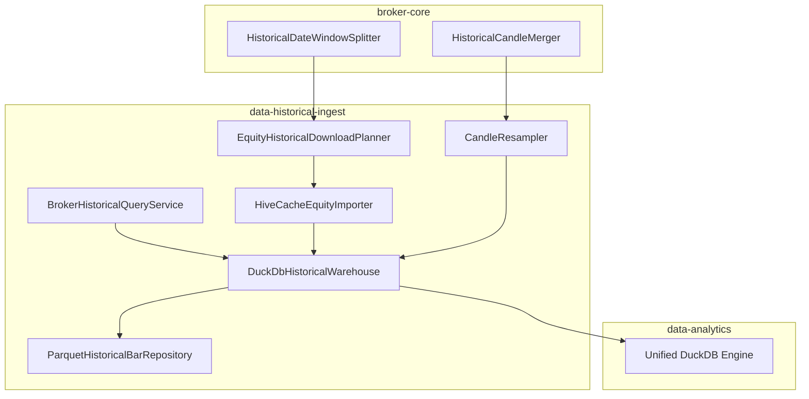
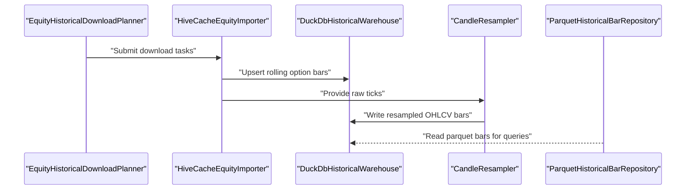
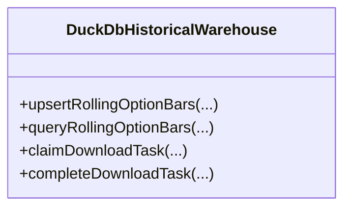
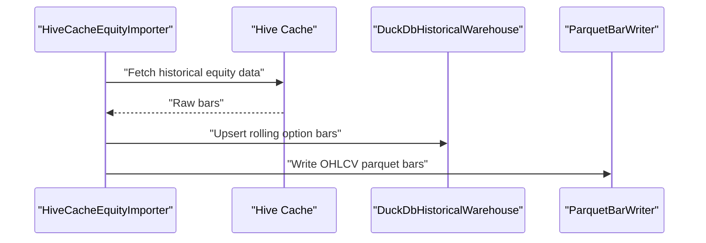
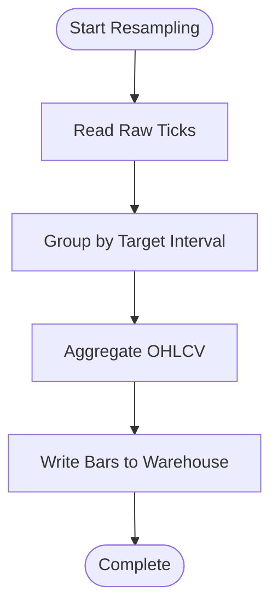
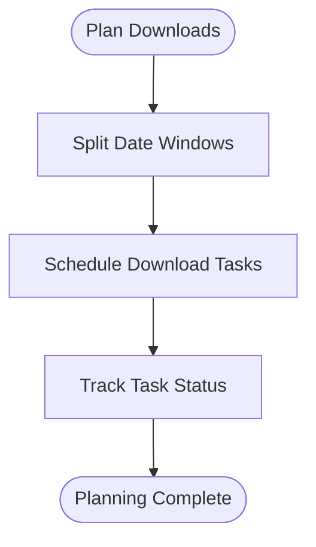
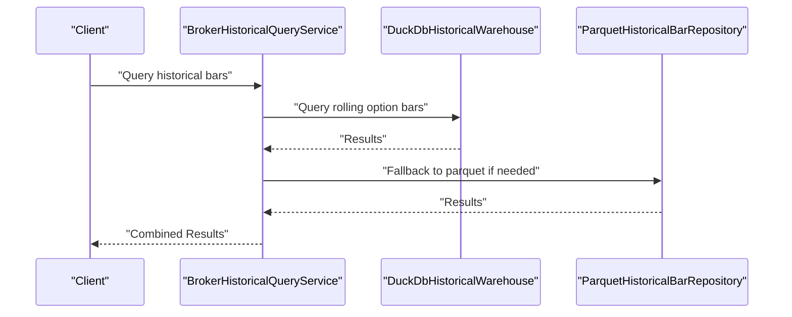
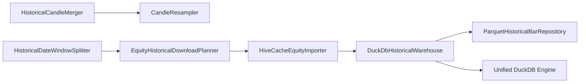

# Historical Data Ingestion

<cite>
**Referenced Files in This Document**
- [DuckDbHistoricalWarehouse.java](file://data/historical-ingest/src/main/java/com/tradej/historical/ingest/store/DuckDbHistoricalWarehouse.java)
- [HiveCacheEquityImporter.java](file://data/historical-ingest/src/main/java/com/tradej/historical/ingest/importing/HiveCacheEquityImporter.java)
- [CandleResampler.java](file://data/historical-ingest/src/main/java/com/tradej/historical/ingest/resample/CandleResampler.java)
- [EquityHistoricalDownloadPlanner.java](file://data/historical-ingest/src/main/java/com/tradej/historical/ingest/planner/EquityHistoricalDownloadPlanner.java)
- [HistoricalCandleMerger.java](file://broker/core/src/main/java/com/tradej/broker/core/historical/HistoricalCandleMerger.java)
- [HistoricalDateWindowSplitter.java](file://broker/core/src/main/java/com/tradej/broker/core/historical/HistoricalDateWindowSplitter.java)
- [BrokerHistoricalQueryService.java](file://data/historical-ingest/src/main/java/com/tradej/historical/service/BrokerHistoricalQueryService.java)
- [ParquetHistoricalBarRepository.java](file://data/historical-ingest/src/main/java/com/tradej/historical/ingest/query/ParquetHistoricalBarRepository.java)
- [DuckDbHistoricalWarehouseTest.java](file://data/historical-ingest/src/test/java/com/tradej/historical/ingest/store/DuckDbHistoricalWarehouseTest.java)
- [DUCKDB_UNIFIED_ENGINE_PLAN.md](file://plans/DUCKDB_UNIFIED_ENGINE_PLAN.md)
- [data/README.md](file://data/README.md)
</cite>

## Table of Contents
1. [Introduction](#introduction)
2. [Project Structure](#project-structure)
3. [Core Components](#core-components)
4. [Architecture Overview](#architecture-overview)
5. [Detailed Component Analysis](#detailed-component-analysis)
6. [Dependency Analysis](#dependency-analysis)
7. [Performance Considerations](#performance-considerations)
8. [Troubleshooting Guide](#troubleshooting-guide)
9. [Conclusion](#conclusion)
10. [Appendices](#appendices)

## Introduction
This document explains the historical data ingestion system, focusing on the DuckDB historical warehouse, broker historical query service, and data import mechanisms. It covers the equity importer with Hive cache integration, candle resampling functionality, and data transformation pipelines. It also documents ingestion planning, maintenance operations, and data quality validation processes, with practical examples of historical data loading, resampling operations, and data synchronization. Integration with multiple broker sources, data partitioning strategies, and performance optimization techniques for large-scale historical data processing are detailed.

## Project Structure
The historical data ingestion system spans several modules:
- data-historical-ingest: DuckDB historical warehouse, importers, resamplers, planners, and repositories
- broker-core: historical candle merging and date window splitting utilities
- data-analytics: analytics engine leveraging the unified DuckDB engine
- plans: strategic plan for consolidating stores into a unified DuckDB engine

**Diagram sources**
- [DuckDbHistoricalWarehouse.java](file://data/historical-ingest/src/main/java/com/tradej/historical/ingest/store/DuckDbHistoricalWarehouse.java)
- [HiveCacheEquityImporter.java](file://data/historical-ingest/src/main/java/com/tradej/historical/ingest/importing/HiveCacheEquityImporter.java)
- [CandleResampler.java](file://data/historical-ingest/src/main/java/com/tradej/historical/ingest/resample/CandleResampler.java)
- [EquityHistoricalDownloadPlanner.java](file://data/historical-ingest/src/main/java/com/tradej/historical/ingest/planner/EquityHistoricalDownloadPlanner.java)
- [ParquetHistoricalBarRepository.java](file://data/historical-ingest/src/main/java/com/tradej/historical/ingest/query/ParquetHistoricalBarRepository.java)
- [BrokerHistoricalQueryService.java](file://data/historical-ingest/src/main/java/com/tradej/historical/service/BrokerHistoricalQueryService.java)
- [HistoricalCandleMerger.java](file://broker/core/src/main/java/com/tradej/broker/core/historical/HistoricalCandleMerger.java)
- [HistoricalDateWindowSplitter.java](file://broker/core/src/main/java/com/tradej/broker/core/historical/HistoricalDateWindowSplitter.java)

**Section sources**
- [data/README.md:1-8](file://data/README.md#L1-L8)
- [DUCKDB_UNIFIED_ENGINE_PLAN.md:68-86](file://plans/DUCKDB_UNIFIED_ENGINE_PLAN.md#L68-L86)

## Core Components
- DuckDB Historical Warehouse: central store for rolling option bars and download task tracking; supports upserts and queries with canonical keys.
- Hive Cache Equity Importer: loads historical equity data from Hive cache into the warehouse and writes parquet bars.
- Candle Resampler: transforms raw ticks into OHLCV candles at target intervals.
- Equity Historical Download Planner: orchestrates download tasks for equities across date windows.
- Historical Candle Merger and Date Window Splitter: broker-side utilities for merging historical candles and splitting date ranges.
- Broker Historical Query Service: provides historical query interface backed by the warehouse and parquet repository.
- Parquet Historical Bar Repository: reads historical bars from parquet storage for analytics and downstream consumers.

**Section sources**
- [DuckDbHistoricalWarehouse.java](file://data/historical-ingest/src/main/java/com/tradej/historical/ingest/store/DuckDbHistoricalWarehouse.java)
- [HiveCacheEquityImporter.java](file://data/historical-ingest/src/main/java/com/tradej/historical/ingest/importing/HiveCacheEquityImporter.java)
- [CandleResampler.java](file://data/historical-ingest/src/main/java/com/tradej/historical/ingest/resample/CandleResampler.java)
- [EquityHistoricalDownloadPlanner.java](file://data/historical-ingest/src/main/java/com/tradej/historical/ingest/planner/EquityHistoricalDownloadPlanner.java)
- [HistoricalCandleMerger.java](file://broker/core/src/main/java/com/tradej/broker/core/historical/HistoricalCandleMerger.java)
- [HistoricalDateWindowSplitter.java](file://broker/core/src/main/java/com/tradej/broker/core/historical/HistoricalDateWindowSplitter.java)
- [BrokerHistoricalQueryService.java](file://data/historical-ingest/src/main/java/com/tradej/historical/service/BrokerHistoricalQueryService.java)
- [ParquetHistoricalBarRepository.java](file://data/historical-ingest/src/main/java/com/tradej/historical/ingest/query/ParquetHistoricalBarRepository.java)

## Architecture Overview
The system integrates broker historical feeds with a DuckDB-backed warehouse and parquet storage. The workflow includes:
- Planning downloads for equities and rolling options
- Importing from Hive cache into DuckDB
- Resampling raw ticks into OHLCV candles
- Writing parquet bars for analytics
- Querying via broker historical query service and parquet repository

**Diagram sources**
- [EquityHistoricalDownloadPlanner.java](file://data/historical-ingest/src/main/java/com/tradej/historical/ingest/planner/EquityHistoricalDownloadPlanner.java)
- [HiveCacheEquityImporter.java](file://data/historical-ingest/src/main/java/com/tradej/historical/ingest/importing/HiveCacheEquityImporter.java)
- [DuckDbHistoricalWarehouse.java](file://data/historical-ingest/src/main/java/com/tradej/historical/ingest/store/DuckDbHistoricalWarehouse.java)
- [CandleResampler.java](file://data/historical-ingest/src/main/java/com/tradej/historical/ingest/resample/CandleResampler.java)
- [ParquetHistoricalBarRepository.java](file://data/historical-ingest/src/main/java/com/tradej/historical/ingest/query/ParquetHistoricalBarRepository.java)

## Detailed Component Analysis

### DuckDB Historical Warehouse
The warehouse persists rolling option bars and tracks download tasks with canonical keys. It supports:
- Upsert operations for rolling option bars
- Querying within a time range with pagination
- Task tracking for ingestion jobs

**Diagram sources**
- [DuckDbHistoricalWarehouse.java](file://data/historical-ingest/src/main/java/com/tradej/historical/ingest/store/DuckDbHistoricalWarehouse.java)

**Section sources**
- [DuckDbHistoricalWarehouse.java](file://data/historical-ingest/src/main/java/com/tradej/historical/ingest/store/DuckDbHistoricalWarehouse.java)
- [DuckDbHistoricalWarehouseTest.java:33-57](file://data/historical-ingest/src/test/java/com/tradej/historical/ingest/store/DuckDbHistoricalWarehouseTest.java#L33-L57)

### Hive Cache Equity Importer
The importer synchronizes historical equity data from Hive cache into the warehouse and writes parquet bars. It coordinates:
- Fetching historical data from Hive cache
- Writing OHLCV bars to parquet
- Updating warehouse with rolling option bars

**Diagram sources**
- [HiveCacheEquityImporter.java](file://data/historical-ingest/src/main/java/com/tradej/historical/ingest/importing/HiveCacheEquityImporter.java)
- [DuckDbHistoricalWarehouse.java](file://data/historical-ingest/src/main/java/com/tradej/historical/ingest/store/DuckDbHistoricalWarehouse.java)

**Section sources**
- [HiveCacheEquityImporter.java](file://data/historical-ingest/src/main/java/com/tradej/historical/ingest/importing/HiveCacheEquityImporter.java)

### Candle Resampler
The resampler converts raw ticks into OHLCV candles at target intervals. It ensures:
- Correct aggregation boundaries per interval
- Efficient processing of large tick streams

**Diagram sources**
- [CandleResampler.java](file://data/historical-ingest/src/main/java/com/tradej/historical/ingest/resample/CandleResampler.java)
- [DuckDbHistoricalWarehouse.java](file://data/historical-ingest/src/main/java/com/tradej/historical/ingest/store/DuckDbHistoricalWarehouse.java)

**Section sources**
- [CandleResampler.java](file://data/historical-ingest/src/main/java/com/tradej/historical/ingest/resample/CandleResampler.java)

### Equity Historical Download Planner
The planner orchestrates download tasks for equities across date windows. It integrates with:
- Historical date window splitting
- Task scheduling and coordination

**Diagram sources**
- [EquityHistoricalDownloadPlanner.java](file://data/historical-ingest/src/main/java/com/tradej/historical/ingest/planner/EquityHistoricalDownloadPlanner.java)
- [HistoricalDateWindowSplitter.java](file://broker/core/src/main/java/com/tradej/broker/core/historical/HistoricalDateWindowSplitter.java)

**Section sources**
- [EquityHistoricalDownloadPlanner.java](file://data/historical-ingest/src/main/java/com/tradej/historical/ingest/planner/EquityHistoricalDownloadPlanner.java)
- [HistoricalDateWindowSplitter.java](file://broker/core/src/main/java/com/tradej/broker/core/historical/HistoricalDateWindowSplitter.java)

### Broker Historical Query Service
The service exposes historical queries backed by the warehouse and parquet repository. It enables:
- Range-based queries for rolling option bars
- Access to OHLCV bars via parquet repository

**Diagram sources**
- [BrokerHistoricalQueryService.java](file://data/historical-ingest/src/main/java/com/tradej/historical/service/BrokerHistoricalQueryService.java)
- [DuckDbHistoricalWarehouse.java](file://data/historical-ingest/src/main/java/com/tradej/historical/ingest/store/DuckDbHistoricalWarehouse.java)
- [ParquetHistoricalBarRepository.java](file://data/historical-ingest/src/main/java/com/tradej/historical/ingest/query/ParquetHistoricalBarRepository.java)

**Section sources**
- [BrokerHistoricalQueryService.java](file://data/historical-ingest/src/main/java/com/tradej/historical/service/BrokerHistoricalQueryService.java)
- [ParquetHistoricalBarRepository.java](file://data/historical-ingest/src/main/java/com/tradej/historical/ingest/query/ParquetHistoricalBarRepository.java)

### Historical Candle Merger (Broker Core)
Merges historical candles from multiple sources or sessions, ensuring continuity and correctness for downstream resampling and analysis.

**Section sources**
- [HistoricalCandleMerger.java](file://broker/core/src/main/java/com/tradej/broker/core/historical/HistoricalCandleMerger.java)

## Dependency Analysis
The historical ingestion system exhibits clear module boundaries and cross-module dependencies:
- data-historical-ingest depends on broker-core for historical candle merging and date window splitting
- data-analytics consumes the unified DuckDB engine and parquet repositories
- Strategic plan indicates consolidation of multiple DuckDB stores into a unified engine

**Diagram sources**
- [HistoricalCandleMerger.java](file://broker/core/src/main/java/com/tradej/broker/core/historical/HistoricalCandleMerger.java)
- [HistoricalDateWindowSplitter.java](file://broker/core/src/main/java/com/tradej/broker/core/historical/HistoricalDateWindowSplitter.java)
- [EquityHistoricalDownloadPlanner.java](file://data/historical-ingest/src/main/java/com/tradej/historical/ingest/planner/EquityHistoricalDownloadPlanner.java)
- [HiveCacheEquityImporter.java](file://data/historical-ingest/src/main/java/com/tradej/historical/ingest/importing/HiveCacheEquityImporter.java)
- [DuckDbHistoricalWarehouse.java](file://data/historical-ingest/src/main/java/com/tradej/historical/ingest/store/DuckDbHistoricalWarehouse.java)
- [ParquetHistoricalBarRepository.java](file://data/historical-ingest/src/main/java/com/tradej/historical/ingest/query/ParquetHistoricalBarRepository.java)

**Section sources**
- [DUCKDB_UNIFIED_ENGINE_PLAN.md:68-86](file://plans/DUCKDB_UNIFIED_ENGINE_PLAN.md#L68-L86)
- [data/README.md:1-8](file://data/README.md#L1-L8)

## Performance Considerations
- Unified DuckDB Engine: Consolidation of stores reduces duplication and improves query performance.
- Parquet Storage: Efficient columnar storage for OHLCV bars accelerates analytics queries.
- Batch Operations: Upserts and writes are optimized for bulk ingestion.
- Partitioning Strategies: Date-based partitioning and canonical keys improve lookup and update performance.
- Asynchronous Patterns: Async writers and resamplers minimize latency in high-throughput scenarios.

[No sources needed since this section provides general guidance]

## Troubleshooting Guide
Common issues and resolutions:
- Warehouse Upsert Failures: Verify canonical keys and ensure task claim/complete sequences are followed.
- Resampling Gaps: Confirm interval boundaries and tick continuity before resampling.
- Query Performance: Use appropriate date ranges and leverage parquet partition pruning.
- Import Errors: Validate Hive cache connectivity and bar schema alignment.

**Section sources**
- [DuckDbHistoricalWarehouseTest.java:33-57](file://data/historical-ingest/src/test/java/com/tradej/historical/ingest/store/DuckDbHistoricalWarehouseTest.java#L33-L57)

## Conclusion
The historical data ingestion system combines DuckDB storage, Hive cache integration, candle resampling, and robust planning/maintenance utilities. The strategic consolidation into a unified DuckDB engine enhances scalability and maintainability. The system supports multi-broker historical data processing with efficient partitioning and performance optimizations suitable for large-scale historical datasets.

[No sources needed since this section summarizes without analyzing specific files]

## Appendices

### Practical Examples

- Historical Data Loading
  - Use the importer to synchronize equity bars from Hive cache into the warehouse and write parquet bars for downstream consumption.
  - Reference: [HiveCacheEquityImporter.java](file://data/historical-ingest/src/main/java/com/tradej/historical/ingest/importing/HiveCacheEquityImporter.java)

- Resampling Operations
  - Feed raw ticks to the resampler to produce OHLCV bars at target intervals; confirm warehouse upserts for the resulting bars.
  - Reference: [CandleResampler.java](file://data/historical-ingest/src/main/java/com/tradej/historical/ingest/resample/CandleResampler.java), [DuckDbHistoricalWarehouse.java](file://data/historical-ingest/src/main/java/com/tradej/historical/ingest/store/DuckDbHistoricalWarehouse.java)

- Data Synchronization
  - Coordinate download planning, task claiming, completion, and warehouse updates to maintain data consistency.
  - Reference: [EquityHistoricalDownloadPlanner.java](file://data/historical-ingest/src/main/java/com/tradej/historical/ingest/planner/EquityHistoricalDownloadPlanner.java), [DuckDbHistoricalWarehouse.java](file://data/historical-ingest/src/main/java/com/tradej/historical/ingest/store/DuckDbHistoricalWarehouse.java)

- Querying Historical Data
  - Query rolling option bars via the warehouse and fallback to parquet repository for broader datasets.
  - Reference: [BrokerHistoricalQueryService.java](file://data/historical-ingest/src/main/java/com/tradej/historical/service/BrokerHistoricalQueryService.java), [ParquetHistoricalBarRepository.java](file://data/historical-ingest/src/main/java/com/tradej/historical/ingest/query/ParquetHistoricalBarRepository.java)

**Section sources**
- [HiveCacheEquityImporter.java](file://data/historical-ingest/src/main/java/com/tradej/historical/ingest/importing/HiveCacheEquityImporter.java)
- [CandleResampler.java](file://data/historical-ingest/src/main/java/com/tradej/historical/ingest/resample/CandleResampler.java)
- [DuckDbHistoricalWarehouse.java](file://data/historical-ingest/src/main/java/com/tradej/historical/ingest/store/DuckDbHistoricalWarehouse.java)
- [EquityHistoricalDownloadPlanner.java](file://data/historical-ingest/src/main/java/com/tradej/historical/ingest/planner/EquityHistoricalDownloadPlanner.java)
- [BrokerHistoricalQueryService.java](file://data/historical-ingest/src/main/java/com/tradej/historical/service/BrokerHistoricalQueryService.java)
- [ParquetHistoricalBarRepository.java](file://data/historical-ingest/src/main/java/com/tradej/historical/ingest/query/ParquetHistoricalBarRepository.java)