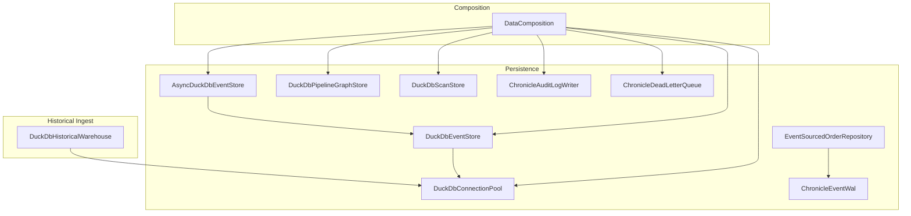
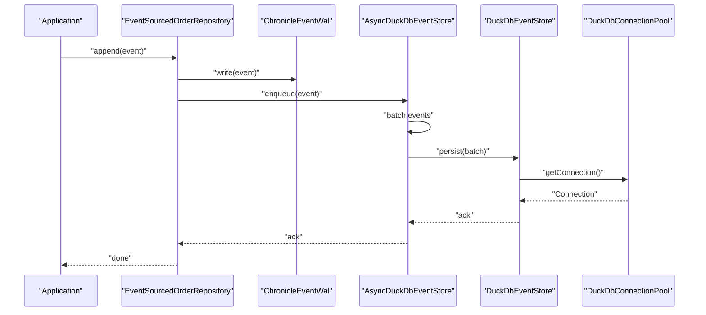
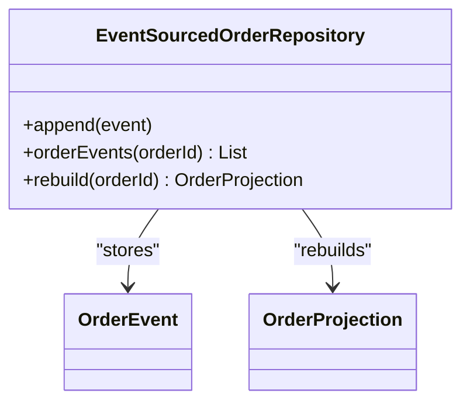
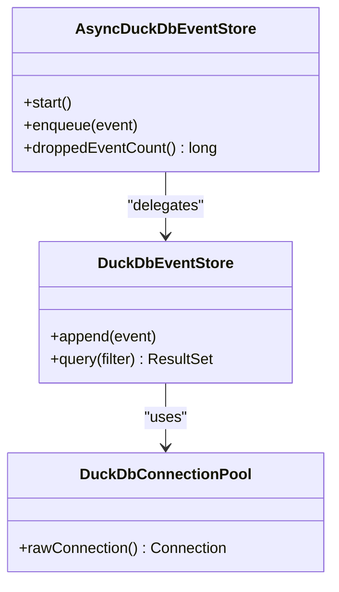
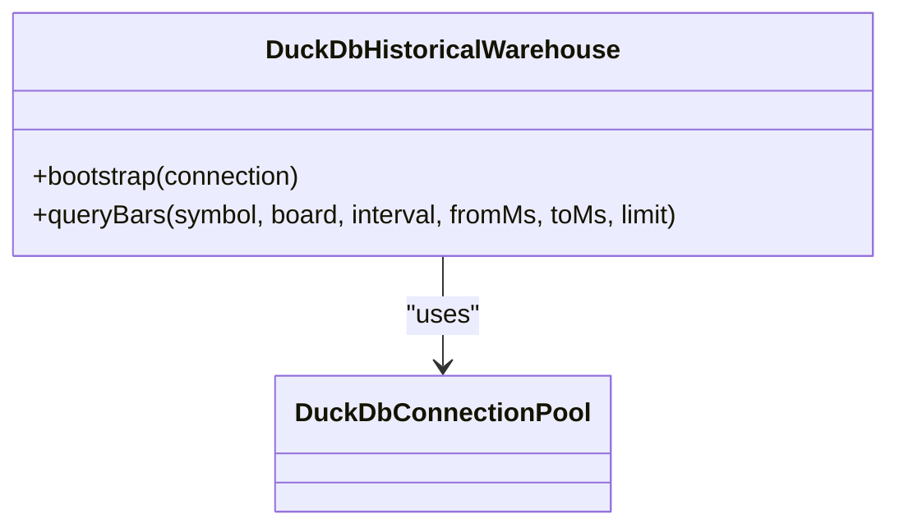
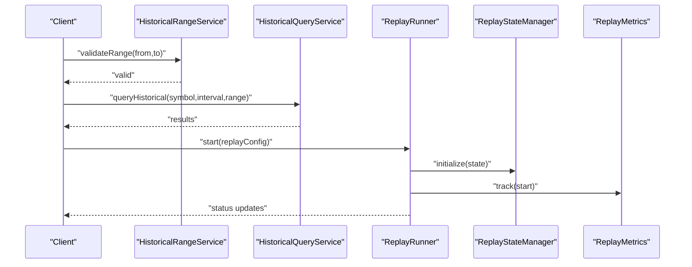
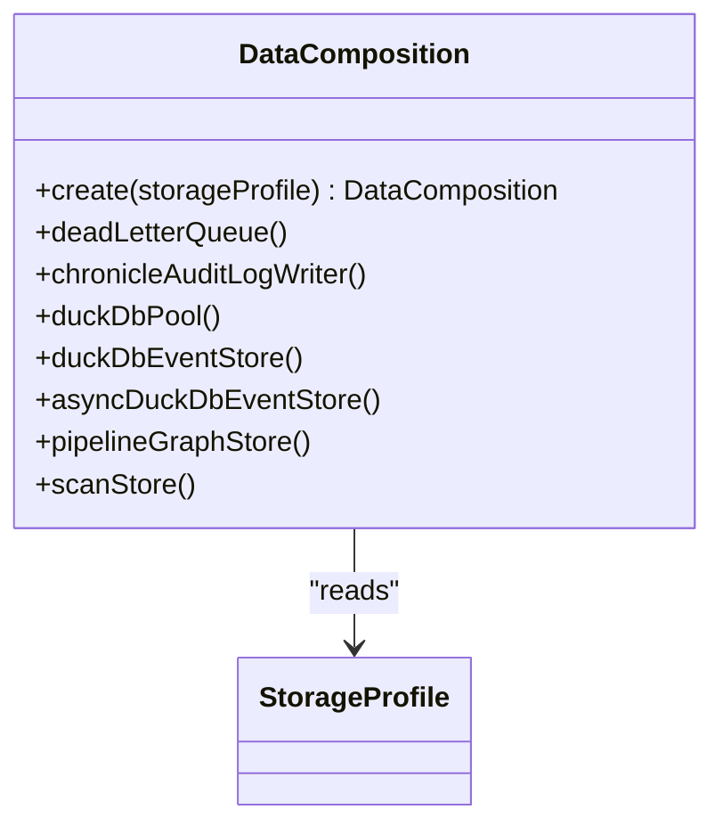
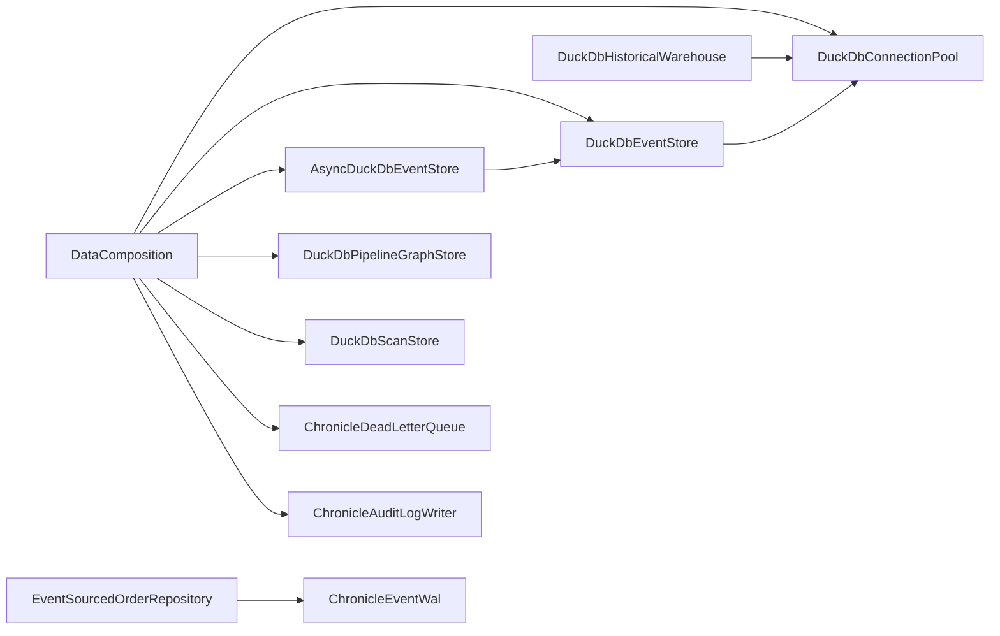

# Data Management

<cite>
**Referenced Files in This Document**
- [DataComposition.java](file://composition/src/main/java/com/tradej/composition/DataComposition.java)
- [AsyncDuckDbEventStore.java](file://data/persistence/src/main/java/com/tradej/persistence/duckdb/AsyncDuckDbEventStore.java)
- [DuckDbEventStore.java](file://data/persistence/src/main/java/com/tradej/persistence/duckdb/DuckDbEventStore.java)
- [DuckDbConnectionPool.java](file://data/persistence/src/main/java/com/tradej/persistence/duckdb/DuckDbConnectionPool.java)
- [EventSourcedOrderRepository.java](file://data/persistence/src/main/java/com/tradej/persistence/oms/EventSourcedOrderRepository.java)
- [DuckDbHistoricalWarehouse.java](file://data/historical-ingest/src/main/java/com/tradej/historical/ingest/store/DuckDbHistoricalWarehouse.java)
- [DuckDbPipelineGraphStore.java](file://data/persistence/src/main/java/com/tradej/persistence/pipeline/DuckDbPipelineGraphStore.java)
- [DuckDbScanStore.java](file://data/persistence/src/main/java/com/tradej/persistence/duckdb/DuckDbScanStore.java)
- [HistoricalDataServiceImpl.java](file://data/persistence/src/main/java/com/tradej/persistence/service/HistoricalDataServiceImpl.java)
- [HistoricalQueryService.java](file://data/persistence/src/main/java/com/tradej/persistence/replay/HistoricalQueryService.java)
- [HistoricalRangeService.java](file://data/persistence/src/main/java/com/tradej/persistence/replay/HistoricalRangeService.java)
- [HistoricalEventReplayService.java](file://data/persistence/src/main/java/com/tradej/persistence/replay/HistoricalEventReplayService.java)
- [ReplayRunner.java](file://data/persistence/src/main/java/com/tradej/persistence/replay/ReplayRunner.java)
- [ReplayStateManager.java](file://data/persistence/src/main/java/com/tradej/persistence/replay/ReplayStateManager.java)
- [ReplayMetrics.java](file://data/persistence/src/main/java/com/tradej/persistence/replay/ReplayMetrics.java)
- [ChronicleEventWal.java](file://data/persistence/src/main/java/com/tradej/persistence/chronicle/ChronicleEventWal.java)
- [ChronicleAuditLogWriter.java](file://data/persistence/src/main/java/com/tradej/persistence/chronicle/ChronicleAuditLogWriter.java)
- [ChronicleDeadLetterQueue.java](file://data/persistence/src/main/java/com/tradej/persistence/chronicle/ChronicleDeadLetterQueue.java)
- [DuckDbHistoricalWarehouseLegacyMigrationTest.java](file://data/persistence/src/test/java/com/tradej/persistence/replay/DuckDbHistoricalWarehouseLegacyMigrationTest.java)
- [DuckDbHistoricalWarehouseTaskClaimTest.java](file://data/persistence/src/test/java/com/tradej/persistence/replay/DuckDbHistoricalWarehouseTaskClaimTest.java)
- [DuckDbHistoricalWarehouseTest.java](file://data/persistence/src/test/java/com/tradej/persistence/replay/DuckDbHistoricalWarehouseTest.java)
- [EventSourcedOrderRepositoryTest.java](file://data/persistence/src/test/java/com/tradej/persistence/oms/EventSourcedOrderRepositoryTest.java)
- [EventSourcedOrderRepositoryStressTest.java](file://data/persistence/src/test/java/com/tradej/persistence/oms/EventSourcedOrderRepositoryStressTest.java)
- [DuckDbConnectionPoolTest.java](file://data/persistence/src/test/java/com/tradej/persistence/duckdb/DuckDbConnectionPoolTest.java)
- [DuckDbEventStoreTest.java](file://data/persistence/src/test/java/com/tradej/persistence/duckdb/DuckDbEventStoreTest.java)
- [DuckDbPipelineGraphStoreTest.java](file://data/persistence/src/test/java/com/tradej/persistence/pipeline/DuckDbPipelineGraphStoreTest.java)
- [ReplayRunnerTest.java](file://data/persistence/src/test/java/com/tradej/persistence/replay/ReplayRunnerTest.java)
- [ReplayRunnerVirtualClockTest.java](file://data/persistence/src/test/java/com/tradej/persistence/replay/ReplayRunnerVirtualClockTest.java)
- [ReplayMetricsTest.java](file://data/persistence/src/test/java/com/tradej/persistence/replay/ReplayMetricsTest.java)
- [DataPlatformCertificationTest.java](file://data/historical-ingest/src/test/java/com/tradej/historical/ingest/certification/DataPlatformCertificationTest.java)
- [EventFlowScanner.java](file://cli/src/main/java/com/tradej/cli/command/EventFlowScanner.java)
</cite>

## Table of Contents
1. [Introduction](#introduction)
2. [Project Structure](#project-structure)
3. [Core Components](#core-components)
4. [Architecture Overview](#architecture-overview)
5. [Detailed Component Analysis](#detailed-component-analysis)
6. [Dependency Analysis](#dependency-analysis)
7. [Performance Considerations](#performance-considerations)
8. [Troubleshooting Guide](#troubleshooting-guide)
9. [Conclusion](#conclusion)
10. [Appendices](#appendices)

## Introduction
This document describes TradeJ's data management systems with emphasis on event sourcing, DuckDB integration, and historical data storage. It explains the event store architecture, order repository patterns, and data lifecycle management. It also covers the historical data ingestion pipeline, feature store implementation, and data warehouse capabilities, along with data access patterns, query optimization, performance considerations, import/export functionality, backup strategies, data integrity measures, partitioning strategies, indexing approaches, and analytical query patterns.

## Project Structure
TradeJ organizes data management across several modules:
- data/persistence: event sourcing, DuckDB-backed stores, replay services, and Chronicle WAL/audit/DLQ
- data/historical-ingest: historical data ingestion, warehouse bootstrapping, and canonical bar processing
- data/feature-store: feature store implementation (module present)
- composition: wiring of storage profiles and store instances
- cli: event flow scanning and discovery utilities

**Diagram sources**
- [DataComposition.java:55-102](file://composition/src/main/java/com/tradej/composition/DataComposition.java#L55-L102)
- [DuckDbConnectionPool.java](file://data/persistence/src/main/java/com/tradej/persistence/duckdb/DuckDbConnectionPool.java)
- [DuckDbEventStore.java](file://data/persistence/src/main/java/com/tradej/persistence/duckdb/DuckDbEventStore.java)
- [AsyncDuckDbEventStore.java:50-73](file://data/persistence/src/main/java/com/tradej/persistence/duckdb/AsyncDuckDbEventStore.java#L50-L73)
- [EventSourcedOrderRepository.java](file://data/persistence/src/main/java/com/tradej/persistence/oms/EventSourcedOrderRepository.java)
- [DuckDbPipelineGraphStore.java](file://data/persistence/src/main/java/com/tradej/persistence/pipeline/DuckDbPipelineGraphStore.java)
- [DuckDbScanStore.java](file://data/persistence/src/main/java/com/tradej/persistence/duckdb/DuckDbScanStore.java)
- [ChronicleEventWal.java](file://data/persistence/src/main/java/com/tradej/persistence/chronicle/ChronicleEventWal.java)
- [ChronicleAuditLogWriter.java](file://data/persistence/src/main/java/com/tradej/persistence/chronicle/ChronicleAuditLogWriter.java)
- [ChronicleDeadLetterQueue.java](file://data/persistence/src/main/java/com/tradej/persistence/chronicle/ChronicleDeadLetterQueue.java)
- [DuckDbHistoricalWarehouse.java:34-68](file://data/historical-ingest/src/main/java/com/tradej/historical/ingest/store/DuckDbHistoricalWarehouse.java#L34-L68)

**Section sources**
- [DataComposition.java:55-102](file://composition/src/main/java/com/tradej/composition/DataComposition.java#L55-L102)

## Core Components
- Event Sourcing with Chronicle WAL and order repository
- DuckDB-backed event store and async batching
- Historical data warehouse bootstrapped via DuckDB
- Pipeline graph and scan stores backed by DuckDB
- Replay services for historical queries and deterministic runs
- Data composition factory wiring storage profiles and pools

Key responsibilities:
- EventSourcedOrderRepository: durable append-only order event storage with projection rebuild
- DuckDbEventStore: SQL-backed event persistence with DuckDB connection pooling
- AsyncDuckDbEventStore: asynchronous batching and throughput optimization
- DuckDbHistoricalWarehouse: canonical historical bar storage and query surface
- Replay services: historical query, range validation, and replay orchestration
- Chronicle audit/log/DLQ: operational durability and observability

**Section sources**
- [EventSourcedOrderRepository.java](file://data/persistence/src/main/java/com/tradej/persistence/oms/EventSourcedOrderRepository.java)
- [DuckDbEventStore.java](file://data/persistence/src/main/java/com/tradej/persistence/duckdb/DuckDbEventStore.java)
- [AsyncDuckDbEventStore.java:50-73](file://data/persistence/src/main/java/com/tradej/persistence/duckdb/AsyncDuckDbEventStore.java#L50-L73)
- [DuckDbHistoricalWarehouse.java:34-68](file://data/historical-ingest/src/main/java/com/tradej/historical/ingest/store/DuckDbHistoricalWarehouse.java#L34-L68)
- [DuckDbPipelineGraphStore.java](file://data/persistence/src/main/java/com/tradej/persistence/pipeline/DuckDbPipelineGraphStore.java)
- [DuckDbScanStore.java](file://data/persistence/src/main/java/com/tradej/persistence/duckdb/DuckDbScanStore.java)
- [HistoricalQueryService.java](file://data/persistence/src/main/java/com/tradej/persistence/replay/HistoricalQueryService.java)
- [HistoricalRangeService.java](file://data/persistence/src/main/java/com/tradej/persistence/replay/HistoricalRangeService.java)
- [HistoricalEventReplayService.java](file://data/persistence/src/main/java/com/tradej/persistence/replay/HistoricalEventReplayService.java)
- [ReplayRunner.java](file://data/persistence/src/main/java/com/tradej/persistence/replay/ReplayRunner.java)
- [ReplayStateManager.java](file://data/persistence/src/main/java/com/tradej/persistence/replay/ReplayStateManager.java)
- [ReplayMetrics.java](file://data/persistence/src/main/java/com/tradej/persistence/replay/ReplayMetrics.java)
- [ChronicleEventWal.java](file://data/persistence/src/main/java/com/tradej/persistence/chronicle/ChronicleEventWal.java)
- [ChronicleAuditLogWriter.java](file://data/persistence/src/main/java/com/tradej/persistence/chronicle/ChronicleAuditLogWriter.java)
- [ChronicleDeadLetterQueue.java](file://data/persistence/src/main/java/com/tradej/persistence/chronicle/ChronicleDeadLetterQueue.java)

## Architecture Overview
TradeJ employs a hybrid architecture:
- Event sourcing for order lifecycle with Chronicle WAL and order repository
- DuckDB as the primary relational store for events, historical bars, pipeline graphs, and scans
- Asynchronous event writing to improve throughput while preserving durability
- Dedicated historical warehouse for canonical OHLCV bars and time-series analytics
- Replay subsystem for historical queries and deterministic backtesting

**Diagram sources**
- [EventSourcedOrderRepository.java](file://data/persistence/src/main/java/com/tradej/persistence/oms/EventSourcedOrderRepository.java)
- [ChronicleEventWal.java](file://data/persistence/src/main/java/com/tradej/persistence/chronicle/ChronicleEventWal.java)
- [AsyncDuckDbEventStore.java:50-73](file://data/persistence/src/main/java/com/tradej/persistence/duckdb/AsyncDuckDbEventStore.java#L50-L73)
- [DuckDbEventStore.java](file://data/persistence/src/main/java/com/tradej/persistence/duckdb/DuckDbEventStore.java)
- [DuckDbConnectionPool.java](file://data/persistence/src/main/java/com/tradej/persistence/duckdb/DuckDbConnectionPool.java)

## Detailed Component Analysis

### Event Sourcing and Order Repository
The order repository persists order events in a durable append-only manner and supports rebuilding projections from stored events. Tests demonstrate persistence across sessions and concurrent append correctness.

**Diagram sources**
- [EventSourcedOrderRepository.java](file://data/persistence/src/main/java/com/tradej/persistence/oms/EventSourcedOrderRepository.java)
- [EventSourcedOrderRepositoryTest.java:180-196](file://data/persistence/src/test/java/com/tradej/persistence/oms/EventSourcedOrderRepositoryTest.java#L180-L196)
- [EventSourcedOrderRepositoryStressTest.java:28-46](file://data/persistence/src/test/java/com/tradej/persistence/oms/EventSourcedOrderRepositoryStressTest.java#L28-L46)

**Section sources**
- [EventSourcedOrderRepository.java](file://data/persistence/src/main/java/com/tradej/persistence/oms/EventSourcedOrderRepository.java)
- [EventSourcedOrderRepositoryTest.java:180-196](file://data/persistence/src/test/java/com/tradej/persistence/oms/EventSourcedOrderRepositoryTest.java#L180-L196)
- [EventSourcedOrderRepositoryStressTest.java:28-46](file://data/persistence/src/test/java/com/tradej/persistence/oms/EventSourcedOrderRepositoryStressTest.java#L28-L46)

### DuckDB Event Store and Async Batching
DuckDB-backed event persistence with connection pooling and asynchronous batching improves throughput. The async wrapper batches events and drains them to the synchronous store.

**Diagram sources**
- [DuckDbConnectionPool.java](file://data/persistence/src/main/java/com/tradej/persistence/duckdb/DuckDbConnectionPool.java)
- [DuckDbEventStore.java](file://data/persistence/src/main/java/com/tradej/persistence/duckdb/DuckDbEventStore.java)
- [AsyncDuckDbEventStore.java:50-73](file://data/persistence/src/main/java/com/tradej/persistence/duckdb/AsyncDuckDbEventStore.java#L50-L73)

**Section sources**
- [DuckDbEventStore.java](file://data/persistence/src/main/java/com/tradej/persistence/duckdb/DuckDbEventStore.java)
- [AsyncDuckDbEventStore.java:50-73](file://data/persistence/src/main/java/com/tradej/persistence/duckdb/AsyncDuckDbEventStore.java#L50-L73)
- [DuckDbConnectionPool.java](file://data/persistence/src/main/java/com/tradej/persistence/duckdb/DuckDbConnectionPool.java)
- [DuckDbEventStoreTest.java](file://data/persistence/src/test/java/com/tradej/persistence/duckdb/DuckDbEventStoreTest.java)
- [DuckDbConnectionPoolTest.java](file://data/persistence/src/test/java/com/tradej/persistence/duckdb/DuckDbConnectionPoolTest.java)

### Historical Data Warehouse
The historical warehouse initializes DuckDB tables and provides canonical bar queries. It supports ingestion from multiple sources and integrity testing across storage layers.

**Diagram sources**
- [DuckDbHistoricalWarehouse.java:34-68](file://data/historical-ingest/src/main/java/com/tradej/historical/ingest/store/DuckDbHistoricalWarehouse.java#L34-L68)

**Section sources**
- [DuckDbHistoricalWarehouse.java:34-68](file://data/historical-ingest/src/main/java/com/tradej/historical/ingest/store/DuckDbHistoricalWarehouse.java#L34-L68)
- [DataPlatformCertificationTest.java:155-180](file://data/historical-ingest/src/test/java/com/tradej/historical/ingest/certification/DataPlatformCertificationTest.java#L155-L180)

### Replay Services and Historical Queries
Historical replay services enable querying historical ranges, validating time windows, and orchestrating deterministic replays. Replay runner coordinates state and metrics.

**Diagram sources**
- [HistoricalRangeService.java](file://data/persistence/src/main/java/com/tradej/persistence/replay/HistoricalRangeService.java)
- [HistoricalQueryService.java](file://data/persistence/src/main/java/com/tradej/persistence/replay/HistoricalQueryService.java)
- [ReplayRunner.java](file://data/persistence/src/main/java/com/tradej/persistence/replay/ReplayRunner.java)
- [ReplayStateManager.java](file://data/persistence/src/main/java/com/tradej/persistence/replay/ReplayStateManager.java)
- [ReplayMetrics.java](file://data/persistence/src/main/java/com/tradej/persistence/replay/ReplayMetrics.java)

**Section sources**
- [HistoricalRangeService.java](file://data/persistence/src/main/java/com/tradej/persistence/replay/HistoricalRangeService.java)
- [HistoricalQueryService.java](file://data/persistence/src/main/java/com/tradej/persistence/replay/HistoricalQueryService.java)
- [HistoricalEventReplayService.java](file://data/persistence/src/main/java/com/tradej/persistence/replay/HistoricalEventReplayService.java)
- [ReplayRunner.java](file://data/persistence/src/main/java/com/tradej/persistence/replay/ReplayRunner.java)
- [ReplayRunnerTest.java](file://data/persistence/src/test/java/com/tradej/persistence/replay/ReplayRunnerTest.java)
- [ReplayRunnerVirtualClockTest.java](file://data/persistence/src/test/java/com/tradej/persistence/replay/ReplayRunnerVirtualClockTest.java)
- [ReplayMetricsTest.java](file://data/persistence/src/test/java/com/tradej/persistence/replay/ReplayMetricsTest.java)

### Data Composition and Storage Wiring
DataComposition wires storage profile, Chronicle DLQ/Audit/WAL, DuckDB connection pool, and DuckDB-backed stores. It centralizes initialization and exposes store instances.

**Diagram sources**
- [DataComposition.java:55-102](file://composition/src/main/java/com/tradej/composition/DataComposition.java#L55-L102)

**Section sources**
- [DataComposition.java:55-102](file://composition/src/main/java/com/tradej/composition/DataComposition.java#L55-L102)

### Feature Store Implementation
The feature-store module exists and is built, indicating planned or ongoing feature store capabilities. No specific implementation files are referenced here.

**Section sources**
- [DuckDbScanStore.java](file://data/persistence/src/main/java/com/tradej/persistence/duckdb/DuckDbScanStore.java)
- [DuckDbPipelineGraphStore.java](file://data/persistence/src/main/java/com/tradej/persistence/pipeline/DuckDbPipelineGraphStore.java)

## Dependency Analysis
The following diagram shows key dependencies among data management components:

**Diagram sources**
- [DataComposition.java:55-102](file://composition/src/main/java/com/tradej/composition/DataComposition.java#L55-L102)
- [DuckDbConnectionPool.java](file://data/persistence/src/main/java/com/tradej/persistence/duckdb/DuckDbConnectionPool.java)
- [DuckDbEventStore.java](file://data/persistence/src/main/java/com/tradej/persistence/duckdb/DuckDbEventStore.java)
- [AsyncDuckDbEventStore.java:50-73](file://data/persistence/src/main/java/com/tradej/persistence/duckdb/AsyncDuckDbEventStore.java#L50-L73)
- [EventSourcedOrderRepository.java](file://data/persistence/src/main/java/com/tradej/persistence/oms/EventSourcedOrderRepository.java)
- [DuckDbPipelineGraphStore.java](file://data/persistence/src/main/java/com/tradej/persistence/pipeline/DuckDbPipelineGraphStore.java)
- [DuckDbScanStore.java](file://data/persistence/src/main/java/com/tradej/persistence/duckdb/DuckDbScanStore.java)
- [DuckDbHistoricalWarehouse.java:34-68](file://data/historical-ingest/src/main/java/com/tradej/historical/ingest/store/DuckDbHistoricalWarehouse.java#L34-L68)

**Section sources**
- [DataComposition.java:55-102](file://composition/src/main/java/com/tradej/composition/DataComposition.java#L55-L102)

## Performance Considerations
- Asynchronous batching: AsyncDuckDbEventStore batches events and drains them periodically to reduce write overhead and increase throughput.
- Connection pooling: DuckDbConnectionPool reuses connections to minimize overhead and contention.
- Replay performance: ReplayRunner coordinates state transitions and metrics collection to monitor replay performance.
- Query optimization: HistoricalQueryService and HistoricalRangeService validate and constrain queries to efficient time ranges.
- Concurrency: EventSourcedOrderRepositoryStressTest validates concurrent appends for the same order ID under load.

Recommendations:
- Tune AsyncDuckDbEventStore batch size and wait intervals based on workload characteristics.
- Monitor droppedEventCount to detect saturation and adjust capacity.
- Use time-bound queries and appropriate limits in historical queries.
- Ensure adequate Chronicle disk space for WAL and DLQ.

**Section sources**
- [AsyncDuckDbEventStore.java:50-73](file://data/persistence/src/main/java/com/tradej/persistence/duckdb/AsyncDuckDbEventStore.java#L50-L73)
- [DuckDbConnectionPool.java](file://data/persistence/src/main/java/com/tradej/persistence/duckdb/DuckDbConnectionPool.java)
- [ReplayRunner.java](file://data/persistence/src/main/java/com/tradej/persistence/replay/ReplayRunner.java)
- [HistoricalQueryService.java](file://data/persistence/src/main/java/com/tradej/persistence/replay/HistoricalQueryService.java)
- [HistoricalRangeService.java](file://data/persistence/src/main/java/com/tradej/persistence/replay/HistoricalRangeService.java)
- [EventSourcedOrderRepositoryStressTest.java:28-46](file://data/persistence/src/test/java/com/tradej/persistence/oms/EventSourcedOrderRepositoryStressTest.java#L28-L46)

## Troubleshooting Guide
Common issues and remedies:
- Event persistence failures: Verify Chronicle WAL availability and AsyncDuckDbEventStore drain loop status.
- DuckDB connectivity: Confirm DuckDbConnectionPool initialization and database path accessibility.
- Historical query errors: Validate time range inputs via HistoricalRangeService and ensure warehouse bootstrap succeeded.
- Replay anomalies: Inspect ReplayRunner state transitions and ReplayMetrics for timing discrepancies.
- Data integrity: Use certification tests to validate cross-layer integrity and canonical bar queries.

Operational checks:
- Review droppedEventCount to detect backpressure.
- Confirm warehouse bootstrap executed successfully.
- Validate replay clock drift and state consistency.

**Section sources**
- [AsyncDuckDbEventStore.java:50-73](file://data/persistence/src/main/java/com/tradej/persistence/duckdb/AsyncDuckDbEventStore.java#L50-L73)
- [DuckDbHistoricalWarehouse.java:34-68](file://data/historical-ingest/src/main/java/com/tradej/historical/ingest/store/DuckDbHistoricalWarehouse.java#L34-L68)
- [HistoricalRangeService.java](file://data/persistence/src/main/java/com/tradej/persistence/replay/HistoricalRangeService.java)
- [ReplayRunner.java](file://data/persistence/src/main/java/com/tradej/persistence/replay/ReplayRunner.java)
- [ReplayMetricsTest.java](file://data/persistence/src/test/java/com/tradej/persistence/replay/ReplayMetricsTest.java)
- [DataPlatformCertificationTest.java:155-180](file://data/historical-ingest/src/test/java/com/tradej/historical/ingest/certification/DataPlatformCertificationTest.java#L155-L180)

## Conclusion
TradeJ’s data management stack combines event sourcing with DuckDB for scalable, durable persistence and fast analytical queries. The event store architecture leverages Chronicle for operational durability and DuckDB for SQL-friendly storage. Historical data is ingested into a dedicated warehouse with canonical bar support and integrity validation. Replay services enable robust historical analysis and deterministic backtesting. Performance is optimized through asynchronous batching, connection pooling, and careful query constraints.

## Appendices

### Data Lifecycle Management
- Event generation: Orders emit domain events captured by EventSourcedOrderRepository and ChronicleEventWal.
- Persistence: Events are asynchronously batched and persisted via AsyncDuckDbEventStore to DuckDbEventStore.
- Projection rebuild: Order projections are reconstructed from stored events.
- Historical ingestion: Canonical bars are written to DuckDbHistoricalWarehouse for analytics.
- Replay: HistoricalQueryService and ReplayRunner support time-bound queries and deterministic replays.

**Section sources**
- [EventSourcedOrderRepository.java](file://data/persistence/src/main/java/com/tradej/persistence/oms/EventSourcedOrderRepository.java)
- [ChronicleEventWal.java](file://data/persistence/src/main/java/com/tradej/persistence/chronicle/ChronicleEventWal.java)
- [AsyncDuckDbEventStore.java:50-73](file://data/persistence/src/main/java/com/tradej/persistence/duckdb/AsyncDuckDbEventStore.java#L50-L73)
- [DuckDbHistoricalWarehouse.java:34-68](file://data/historical-ingest/src/main/java/com/tradej/historical/ingest/store/DuckDbHistoricalWarehouse.java#L34-L68)
- [HistoricalQueryService.java](file://data/persistence/src/main/java/com/tradej/persistence/replay/HistoricalQueryService.java)
- [ReplayRunner.java](file://data/persistence/src/main/java/com/tradej/persistence/replay/ReplayRunner.java)

### Data Access Patterns and Query Optimization
- Time-bound queries: Use HistoricalRangeService to constrain queries to valid ranges.
- Limit results: Apply reasonable limits in HistoricalQueryService to avoid heavy scans.
- Partitioning: Historical warehouse supports symbol/board/intervals for efficient filtering.
- Indexing: DuckDB tables are bootstrapped for canonical bars; ensure appropriate columnar layout for analytical workloads.

**Section sources**
- [HistoricalRangeService.java](file://data/persistence/src/main/java/com/tradej/persistence/replay/HistoricalRangeService.java)
- [HistoricalQueryService.java](file://data/persistence/src/main/java/com/tradej/persistence/replay/HistoricalQueryService.java)
- [DuckDbHistoricalWarehouse.java:34-68](file://data/historical-ingest/src/main/java/com/tradej/historical/ingest/store/DuckDbHistoricalWarehouse.java#L34-L68)

### Import/Export Functionality and Backup Strategies
- Import: Historical ingestion writes canonical bars to DuckDbHistoricalWarehouse; ingestion tests validate integrity.
- Export: DuckDB tables can be queried for export; ensure time bounds and limits are applied.
- Backup: Chronicle DLQ and Audit Log provide operational backups; DuckDB database files serve as primary persistence backups.

**Section sources**
- [DuckDbHistoricalWarehouse.java:34-68](file://data/historical-ingest/src/main/java/com/tradej/historical/ingest/store/DuckDbHistoricalWarehouse.java#L34-L68)
- [ChronicleDeadLetterQueue.java](file://data/persistence/src/main/java/com/tradej/persistence/chronicle/ChronicleDeadLetterQueue.java)
- [ChronicleAuditLogWriter.java](file://data/persistence/src/main/java/com/tradej/persistence/chronicle/ChronicleAuditLogWriter.java)

### Data Integrity Measures
- Cross-layer validation: Certification tests compare canonical bar queries against ingestion sources.
- Legacy migration: Warehouse migration tests ensure backward compatibility.
- Task claim verification: Warehouse task claim tests validate ingestion coordination.

**Section sources**
- [DataPlatformCertificationTest.java:155-180](file://data/historical-ingest/src/test/java/com/tradej/historical/ingest/certification/DataPlatformCertificationTest.java#L155-L180)
- [DuckDbHistoricalWarehouseLegacyMigrationTest.java](file://data/persistence/src/test/java/com/tradej/persistence/replay/DuckDbHistoricalWarehouseLegacyMigrationTest.java)
- [DuckDbHistoricalWarehouseTaskClaimTest.java](file://data/persistence/src/test/java/com/tradej/persistence/replay/DuckDbHistoricalWarehouseTaskClaimTest.java)

### Partitioning Strategies and Indexing Approaches
- Partitioning: Historical warehouse partitions by symbol, board, and interval; ingestion tests demonstrate partition-aware queries.
- Indexing: DuckDB bootstrap creates tables optimized for OHLCV analytics; maintain columnar layout for analytical queries.

**Section sources**
- [DataPlatformCertificationTest.java:155-180](file://data/historical-ingest/src/test/java/com/tradej/historical/ingest/certification/DataPlatformCertificationTest.java#L155-L180)
- [DuckDbHistoricalWarehouse.java:34-68](file://data/historical-ingest/src/main/java/com/tradej/historical/ingest/store/DuckDbHistoricalWarehouse.java#L34-L68)

### Analytical Query Patterns
- Canonical OHLCV queries: HistoricalQueryService supports symbol/board/interval/time-range queries.
- Pipeline graph and scan stores: DuckDbPipelineGraphStore and DuckDbScanStore provide analytical surfaces for pipeline and scan results.

**Section sources**
- [HistoricalQueryService.java](file://data/persistence/src/main/java/com/tradej/persistence/replay/HistoricalQueryService.java)
- [DuckDbPipelineGraphStore.java](file://data/persistence/src/main/java/com/tradej/persistence/pipeline/DuckDbPipelineGraphStore.java)
- [DuckDbScanStore.java](file://data/persistence/src/main/java/com/tradej/persistence/duckdb/DuckDbScanStore.java)

### Event Flow Discovery
- EventFlowScanner identifies persisted events by scanning the event store source tree and enumerating event names.

**Section sources**
- [EventFlowScanner.java:118-140](file://cli/src/main/java/com/tradej/cli/command/EventFlowScanner.java#L118-L140)