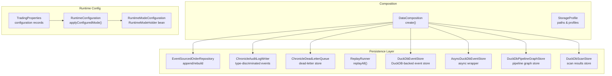
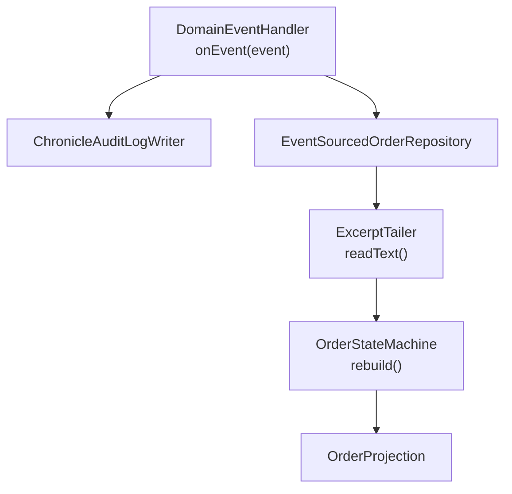
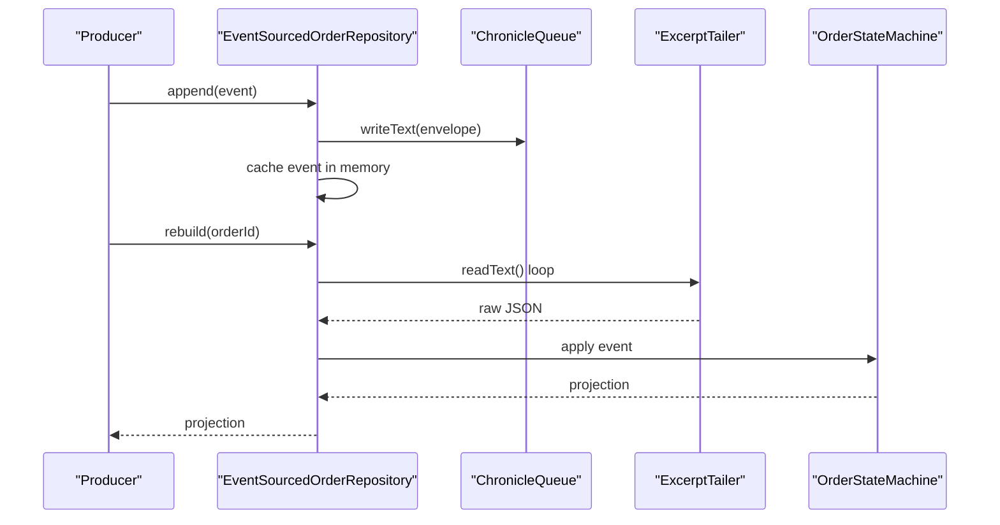
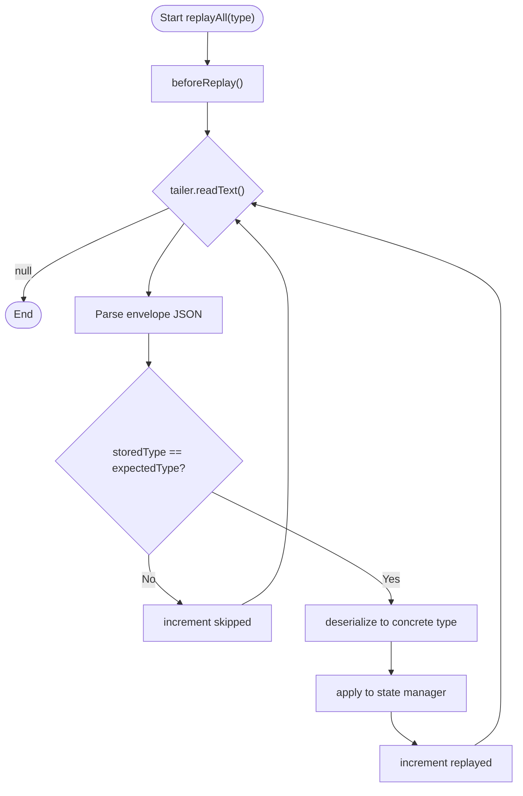
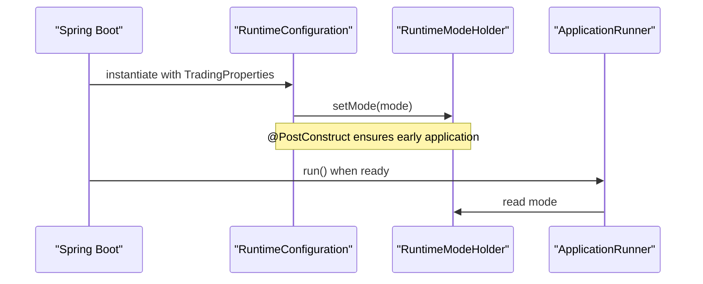
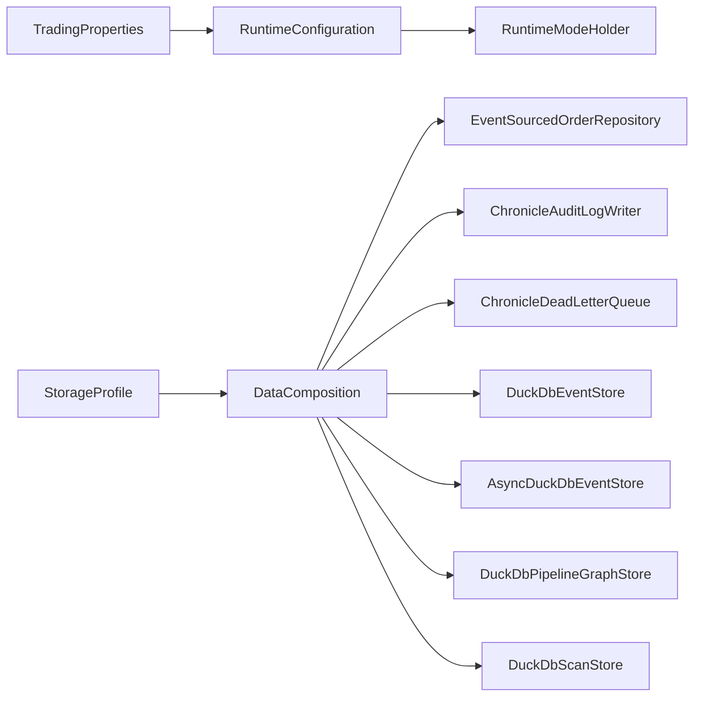

# Data Persistence

<cite>
**Referenced Files in This Document**
- [EventSourcedOrderRepository.java](file://data/persistence/src/main/java/com/tradej/persistence/oms/EventSourcedOrderRepository.java)
- [ChronicleAuditLogWriter.java](file://data/persistence/src/main/java/com/tradej/persistence/chronicle/ChronicleAuditLogWriter.java)
- [ChronicleDeadLetterQueue.java](file://data/persistence/src/main/java/com/tradej/persistence/chronicle/ChronicleDeadLetterQueue.java)
- [ReplayRunner.java](file://data/persistence/src/main/java/com/tradej/persistence/replay/ReplayRunner.java)
- [DataComposition.java](file://composition/src/main/java/com/tradej/composition/DataComposition.java)
- [RuntimeConfiguration.java](file://app/src/main/java/com/tradej/app/config/RuntimeConfiguration.java)
- [RuntimeModeConfiguration.java](file://app/src/main/java/com/tradej/app/config/RuntimeModeConfiguration.java)
- [TradingProperties.java](file://app/src/main/java/com/tradej/app/config/TradingProperties.java)
- [PropertiesBrokerCapabilities.java](file://app/src/main/java/com/tradej/app/config/PropertiesBrokerCapabilities.java)
- [application.yml](file://app/src/main/resources/application.yml)
- [application-replay.yml](file://app/src/main/resources/application-replay.yml)
- [application-dev.yml](file://app/src/main/resources/application-dev.yml)
- [application-prod.yml](file://app/src/main/resources/application-prod.yml)
- [application-upstox-dev.yml](file://app/src/main/resources/application-upstox-dev.yml)
- [application-upstox-prod.yml](file://app/src/main/resources/application-upstox-prod.yml)
- [application-icici-prod.yml](file://app/src/main/resources/application-icici-prod.yml)
- [application-gateway.yml](file://app/src/main/resources/application-gateway.yml)
- [application-upstox-analytics.yml](file://app/src/main/resources/application-upstox-analytics.yml)
- [application-dev-live.yml](file://app/src/main/resources/application-dev-live.yml)
- [application-test.yml](file://app/src/main/resources/application-test.yml)
- [StorageProfile.java](file://composition/src/main/java/com/tradej/composition/config/StorageProfile.java)
- [DuckDbEventStore.java](file://data/persistence/src/main/java/com/tradej/persistence/duckdb/DuckDbEventStore.java)
- [AsyncDuckDbEventStore.java](file://data/persistence/src/main/java/com/tradej/persistence/duckdb/AsyncDuckDbEventStore.java)
- [DuckDbPipelineGraphStore.java](file://data/persistence/src/main/java/com/tradej/persistence/pipeline/DuckDbPipelineGraphStore.java)
- [DuckDbScanStore.java](file://data/persistence/src/main/java/com/tradej/persistence/duckdb/DuckDbScanStore.java)
- [EventSourcedOrderRepositoryTest.java](file://data/persistence/src/test/java/com/tradej/persistence/oms/EventSourcedOrderRepositoryTest.java)
- [EventSourcedOrderRepositoryStressTest.java](file://data/persistence/src/test/java/com/tradej/persistence/oms/EventSourcedOrderRepositoryStressTest.java)
- [ReplayRunnerTest.java](file://data/persistence/src/test/java/com/tradej/persistence/replay/ReplayRunnerTest.java)
- [ReplayRunnerVirtualClockTest.java](file://data/persistence/src/test/java/com/tradej/persistence/replay/ReplayRunnerVirtualClockTest.java)
- [RuntimeConfigurationTest.java](file://app/src/test/java/com/tradej/app/config/RuntimeConfigurationTest.java)
- [RuntimeModeStartupOrderComponentTest.java](file://app/src/test/java/com/tradej/app/config/RuntimeModeStartupOrderComponentTest.java)
</cite>

## Table of Contents
1. [Introduction](#introduction)
2. [Project Structure](#project-structure)
3. [Core Components](#core-components)
4. [Architecture Overview](#architecture-overview)
5. [Detailed Component Analysis](#detailed-component-analysis)
6. [Dependency Analysis](#dependency-analysis)
7. [Performance Considerations](#performance-considerations)
8. [Troubleshooting Guide](#troubleshooting-guide)
9. [Conclusion](#conclusion)
10. [Appendices](#appendices)

## Introduction
This document describes the data persistence system with a focus on event sourcing, append-only logging, and state reconstruction. It explains how Chronicle Queue is integrated for durable event storage, how runtime configuration is managed, and how configuration profiles enable environment-specific behavior. It also covers the event store architecture, replay mechanisms, and operational concerns such as data lifecycle and retention.

## Project Structure
The data persistence system spans several modules:
- data/persistence: event sourcing, replay, Chronicle-backed stores, DuckDB-backed stores
- composition: wiring of storage profiles and components
- app: runtime configuration and profile-driven settings
- tests: coverage of event sourcing, replay, and runtime configuration behavior

**Diagram sources**
- [DataComposition.java:47-59](file://composition/src/main/java/com/tradej/composition/DataComposition.java#L47-L59)
- [EventSourcedOrderRepository.java:56-86](file://data/persistence/src/main/java/com/tradej/persistence/oms/EventSourcedOrderRepository.java#L56-L86)
- [ChronicleAuditLogWriter.java:21-45](file://data/persistence/src/main/java/com/tradej/persistence/chronicle/ChronicleAuditLogWriter.java#L21-L45)
- [ChronicleDeadLetterQueue.java:19-30](file://data/persistence/src/main/java/com/tradej/persistence/chronicle/ChronicleDeadLetterQueue.java#L19-L30)
- [ReplayRunner.java:47-72](file://data/persistence/src/main/java/com/tradej/persistence/replay/ReplayRunner.java#L47-L72)
- [DuckDbEventStore.java](file://data/persistence/src/main/java/com/tradej/persistence/duckdb/DuckDbEventStore.java)
- [AsyncDuckDbEventStore.java](file://data/persistence/src/main/java/com/tradej/persistence/duckdb/AsyncDuckDbEventStore.java)
- [DuckDbPipelineGraphStore.java](file://data/persistence/src/main/java/com/tradej/persistence/pipeline/DuckDbPipelineGraphStore.java)
- [DuckDbScanStore.java](file://data/persistence/src/main/java/com/tradej/persistence/duckdb/DuckDbScanStore.java)
- [RuntimeConfiguration.java:11-27](file://app/src/main/java/com/tradej/app/config/RuntimeConfiguration.java#L11-L27)
- [RuntimeModeConfiguration.java:8-14](file://app/src/main/java/com/tradej/app/config/RuntimeModeConfiguration.java#L8-L14)
- [TradingProperties.java:21-60](file://app/src/main/java/com/tradej/app/config/TradingProperties.java#L21-L60)

**Section sources**
- [DataComposition.java:47-59](file://composition/src/main/java/com/tradej/composition/DataComposition.java#L47-L59)
- [StorageProfile.java](file://composition/src/main/java/com/tradej/composition/config/StorageProfile.java)
- [TradingProperties.java:21-60](file://app/src/main/java/com/tradej/app/config/TradingProperties.java#L21-L60)

## Core Components
- EventSourcedOrderRepository: Append-only event persistence with in-memory caching and state reconstruction via replay.
- ChronicleAuditLogWriter: Type-discriminated event envelope for reliable replay.
- ChronicleDeadLetterQueue: Dead-letter store for events dropped from bounded queues.
- ReplayRunner: Controlled replay of events with counters and type filtering.
- DuckDB-backed stores: Persistent analytical stores for events, pipeline graphs, and scans.
- DataComposition: Factory that wires storage components based on StorageProfile.
- RuntimeConfiguration: Applies configured runtime mode at startup.

**Section sources**
- [EventSourcedOrderRepository.java:56-86](file://data/persistence/src/main/java/com/tradej/persistence/oms/EventSourcedOrderRepository.java#L56-L86)
- [ChronicleAuditLogWriter.java:21-45](file://data/persistence/src/main/java/com/tradej/persistence/chronicle/ChronicleAuditLogWriter.java#L21-L45)
- [ChronicleDeadLetterQueue.java:19-30](file://data/persistence/src/main/java/com/tradej/persistence/chronicle/ChronicleDeadLetterQueue.java#L19-L30)
- [ReplayRunner.java:47-72](file://data/persistence/src/main/java/com/tradej/persistence/replay/ReplayRunner.java#L47-L72)
- [DuckDbEventStore.java](file://data/persistence/src/main/java/com/tradej/persistence/duckdb/DuckDbEventStore.java)
- [AsyncDuckDbEventStore.java](file://data/persistence/src/main/java/com/tradej/persistence/duckdb/AsyncDuckDbEventStore.java)
- [DuckDbPipelineGraphStore.java](file://data/persistence/src/main/java/com/tradej/persistence/pipeline/DuckDbPipelineGraphStore.java)
- [DuckDbScanStore.java](file://data/persistence/src/main/java/com/tradej/persistence/duckdb/DuckDbScanStore.java)
- [DataComposition.java:47-59](file://composition/src/main/java/com/tradej/composition/DataComposition.java#L47-L59)
- [RuntimeConfiguration.java:11-27](file://app/src/main/java/com/tradej/app/config/RuntimeConfiguration.java#L11-L27)

## Architecture Overview
The system combines two complementary persistence strategies:
- Append-only event log (Chronicle Queue) for auditability and replay.
- Analytical stores (DuckDB) for efficient querying and reporting.

**Diagram sources**
- [ChronicleAuditLogWriter.java:29-44](file://data/persistence/src/main/java/com/tradej/persistence/chronicle/ChronicleAuditLogWriter.java#L29-L44)
- [EventSourcedOrderRepository.java:56-86](file://data/persistence/src/main/java/com/tradej/persistence/oms/EventSourcedOrderRepository.java#L56-L86)
- [ReplayRunner.java:47-72](file://data/persistence/src/main/java/com/tradej/persistence/replay/ReplayRunner.java#L47-L72)

## Detailed Component Analysis

### Event Sourcing with Append-Only Logging
- Append semantics: Each event is serialized and appended to Chronicle Queue; a JSON envelope includes a type discriminator to support safe replay.
- In-memory caching: Events are cached per order ID for fast rebuilds without scanning the entire queue.
- State reconstruction: Rebuild computes a projection by replaying an order’s events through a state machine.

**Diagram sources**
- [EventSourcedOrderRepository.java:56-86](file://data/persistence/src/main/java/com/tradej/persistence/oms/EventSourcedOrderRepository.java#L56-L86)
- [EventSourcedOrderRepository.java:163-195](file://data/persistence/src/main/java/com/tradej/persistence/oms/EventSourcedOrderRepository.java#L163-L195)
- [ChronicleAuditLogWriter.java:29-44](file://data/persistence/src/main/java/com/tradej/persistence/chronicle/ChronicleAuditLogWriter.java#L29-L44)

**Section sources**
- [EventSourcedOrderRepository.java:56-86](file://data/persistence/src/main/java/com/tradej/persistence/oms/EventSourcedOrderRepository.java#L56-L86)
- [EventSourcedOrderRepository.java:163-195](file://data/persistence/src/main/java/com/tradej/persistence/oms/EventSourcedOrderRepository.java#L163-L195)
- [ChronicleAuditLogWriter.java:21-45](file://data/persistence/src/main/java/com/tradej/persistence/chronicle/ChronicleAuditLogWriter.java#L21-L45)

### Replay Engine and Type-Discriminated Envelopes
- ReplayRunner iterates the queue, filters by expected event type using the envelope’s type field, and tracks totals and failures.
- This prevents deserialization errors where all events would otherwise be treated as the same concrete type.

**Diagram sources**
- [ReplayRunner.java:47-72](file://data/persistence/src/main/java/com/tradej/persistence/replay/ReplayRunner.java#L47-L72)

**Section sources**
- [ReplayRunner.java:47-72](file://data/persistence/src/main/java/com/tradej/persistence/replay/ReplayRunner.java#L47-L72)

### Dead Letter Queue
- ChronicleDeadLetterQueue persists events that could not be enqueued in bounded channels, ensuring no event loss and enabling later inspection and retry.

**Section sources**
- [ChronicleDeadLetterQueue.java:19-30](file://data/persistence/src/main/java/com/tradej/persistence/chronicle/ChronicleDeadLetterQueue.java#L19-L30)

### DuckDB Event Store and Asynchronous Wrapper
- DuckDbEventStore provides durable, analytical storage for events.
- AsyncDuckDbEventStore wraps the synchronous store to offload writes onto a separate executor, improving throughput.

**Section sources**
- [DuckDbEventStore.java](file://data/persistence/src/main/java/com/tradej/persistence/duckdb/DuckDbEventStore.java)
- [AsyncDuckDbEventStore.java](file://data/persistence/src/main/java/com/tradej/persistence/duckdb/AsyncDuckDbEventStore.java)

### Data Composition and Storage Profiles
- DataComposition creates and wires all data persistence components based on StorageProfile, including Chronicle paths and DuckDB locations.
- StorageProfile encapsulates environment-specific directories for queues and databases.

**Section sources**
- [DataComposition.java:47-59](file://composition/src/main/java/com/tradej/composition/DataComposition.java#L47-L59)
- [StorageProfile.java](file://composition/src/main/java/com/tradej/composition/config/StorageProfile.java)

### Runtime Configuration Management
- TradingProperties defines the configuration schema for runtime mode and other subsystems.
- RuntimeConfiguration applies the configured runtime mode at startup via @PostConstruct, ensuring downstream components see the correct mode before ApplicationRunner executes.
- RuntimeModeConfiguration exposes a RuntimeModeHolder bean for global access.

**Diagram sources**
- [RuntimeConfiguration.java:21-26](file://app/src/main/java/com/tradej/app/config/RuntimeConfiguration.java#L21-L26)
- [RuntimeModeConfiguration.java:10-13](file://app/src/main/java/com/tradej/app/config/RuntimeModeConfiguration.java#L10-L13)
- [RuntimeConfigurationTest.java:25-37](file://app/src/test/java/com/tradej/app/config/RuntimeConfigurationTest.java#L25-L37)
- [RuntimeModeStartupOrderComponentTest.java:20-37](file://app/src/test/java/com/tradej/app/config/RuntimeModeStartupOrderComponentTest.java#L20-L37)

**Section sources**
- [TradingProperties.java:21-60](file://app/src/main/java/com/tradej/app/config/TradingProperties.java#L21-L60)
- [RuntimeConfiguration.java:11-27](file://app/src/main/java/com/tradej/app/config/RuntimeConfiguration.java#L11-L27)
- [RuntimeModeConfiguration.java:8-14](file://app/src/main/java/com/tradej/app/config/RuntimeModeConfiguration.java#L8-L14)
- [RuntimeConfigurationTest.java:25-37](file://app/src/test/java/com/tradej/app/config/RuntimeConfigurationTest.java#L25-L37)
- [RuntimeModeStartupOrderComponentTest.java:20-37](file://app/src/test/java/com/tradej/app/config/RuntimeModeStartupOrderComponentTest.java#L20-L37)

### Profile-Based Configuration
- Multiple application-*.yml files define environment-specific settings for development, production, replay, analytics, and broker integrations.
- PropertiesBrokerCapabilities constructs broker capabilities from YAML-defined venue configurations, enabling OCP-style configuration updates.

**Section sources**
- [application.yml](file://app/src/main/resources/application.yml)
- [application-replay.yml](file://app/src/main/resources/application-replay.yml)
- [application-dev.yml](file://app/src/main/resources/application-dev.yml)
- [application-prod.yml](file://app/src/main/resources/application-prod.yml)
- [application-upstox-dev.yml](file://app/src/main/resources/application-upstox-dev.yml)
- [application-upstox-prod.yml](file://app/src/main/resources/application-upstox-prod.yml)
- [application-icici-prod.yml](file://app/src/main/resources/application-icici-prod.yml)
- [application-gateway.yml](file://app/src/main/resources/application-gateway.yml)
- [application-upstox-analytics.yml](file://app/src/main/resources/application-upstox-analytics.yml)
- [application-dev-live.yml](file://app/src/main/resources/application-dev-live.yml)
- [application-test.yml](file://app/src/main/resources/application-test.yml)
- [PropertiesBrokerCapabilities.java:20-35](file://app/src/main/java/com/tradej/app/config/PropertiesBrokerCapabilities.java#L20-L35)

## Dependency Analysis

**Diagram sources**
- [TradingProperties.java:21-60](file://app/src/main/java/com/tradej/app/config/TradingProperties.java#L21-L60)
- [RuntimeConfiguration.java:11-27](file://app/src/main/java/com/tradej/app/config/RuntimeConfiguration.java#L11-L27)
- [RuntimeModeConfiguration.java:8-14](file://app/src/main/java/com/tradej/app/config/RuntimeModeConfiguration.java#L8-L14)
- [StorageProfile.java](file://composition/src/main/java/com/tradej/composition/config/StorageProfile.java)
- [DataComposition.java:47-59](file://composition/src/main/java/com/tradej/composition/DataComposition.java#L47-L59)

**Section sources**
- [TradingProperties.java:21-60](file://app/src/main/java/com/tradej/app/config/TradingProperties.java#L21-L60)
- [RuntimeConfiguration.java:11-27](file://app/src/main/java/com/tradej/app/config/RuntimeConfiguration.java#L11-L27)
- [DataComposition.java:47-59](file://composition/src/main/java/com/tradej/composition/DataComposition.java#L47-L59)

## Performance Considerations
- Throughput: AsyncDuckDbEventStore offloads writes to reduce latency spikes in the hot path.
- Serialization: JSON serialization overhead is minimized by using compact envelopes and batching where appropriate.
- Concurrency: EventSourcedOrderRepository supports concurrent appends with per-call appenders and in-memory caches to avoid queue contention.
- Replay cost: Type-filtered replay reduces deserialization work by skipping mismatched entries.
- Disk IO: Chronicle Queue’s append-only nature and fixed-size rolling cycles improve sequential write performance.

[No sources needed since this section provides general guidance]

## Troubleshooting Guide
- Corrupted entries: EventSourcedOrderRepository counts and logs corrupt entries during startup; valid events remain loadable.
- Graceful replay: ReplayRunner increments counters for total, replayed, skipped, and failed entries; use these to detect silent data loss.
- Dead letter events: ChronicleDeadLetterQueue preserves events dropped from bounded queues; inspect and retry as needed.
- Mode visibility: Ensure runtime mode is applied before ApplicationRunner executes; tests verify startup ordering.

**Section sources**
- [EventSourcedOrderRepository.java:163-195](file://data/persistence/src/main/java/com/tradej/persistence/oms/EventSourcedOrderRepository.java#L163-L195)
- [ReplayRunner.java:47-72](file://data/persistence/src/main/java/com/tradej/persistence/replay/ReplayRunner.java#L47-L72)
- [ChronicleDeadLetterQueue.java:19-30](file://data/persistence/src/main/java/com/tradej/persistence/chronicle/ChronicleDeadLetterQueue.java#L19-L30)
- [RuntimeModeStartupOrderComponentTest.java:20-37](file://app/src/test/java/com/tradej/app/config/RuntimeModeStartupOrderComponentTest.java#L20-L37)

## Conclusion
The data persistence system leverages event sourcing with Chronicle Queue for durable, auditable logs and state reconstruction, complemented by DuckDB-backed stores for analytics. Runtime configuration and profile-driven settings enable flexible deployment across environments. The design emphasizes reliability, observability, and performance for high-throughput event processing.

[No sources needed since this section summarizes without analyzing specific files]

## Appendices

### Data Lifecycle and Retention Policies
- EventSourcedOrderRepository maintains in-memory caches per order and loads from Chronicle Queue on startup, skipping corrupt entries and counting them for diagnostics.
- ReplayRunner supports controlled replay with counters to detect anomalies.
- DuckDB stores persist analytical datasets; retention depends on external policies and cleanup procedures.

**Section sources**
- [EventSourcedOrderRepository.java:163-195](file://data/persistence/src/main/java/com/tradej/persistence/oms/EventSourcedOrderRepository.java#L163-L195)
- [ReplayRunner.java:47-72](file://data/persistence/src/main/java/com/tradej/persistence/replay/ReplayRunner.java#L47-L72)

### Test Coverage Highlights
- EventSourcedOrderRepository stress tests validate concurrent appends and rebuild correctness.
- ReplayRunner tests verify counters and virtual clock behavior.
- RuntimeConfiguration tests confirm startup ordering and mode propagation.

**Section sources**
- [EventSourcedOrderRepositoryTest.java](file://data/persistence/src/test/java/com/tradej/persistence/oms/EventSourcedOrderRepositoryTest.java)
- [EventSourcedOrderRepositoryStressTest.java:48-84](file://data/persistence/src/test/java/com/tradej/persistence/oms/EventSourcedOrderRepositoryStressTest.java#L48-L84)
- [ReplayRunnerTest.java](file://data/persistence/src/test/java/com/tradej/persistence/replay/ReplayRunnerTest.java)
- [ReplayRunnerVirtualClockTest.java](file://data/persistence/src/test/java/com/tradej/persistence/replay/ReplayRunnerVirtualClockTest.java)
- [RuntimeConfigurationTest.java:25-37](file://app/src/test/java/com/tradej/app/config/RuntimeConfigurationTest.java#L25-L37)