# Data Processing Pipeline

<cite>
**Referenced Files in This Document**
- [DagPipelineRuntimeService.java](file://pipeline/runtime/src/main/java/com/tradej/pipeline/service/DagPipelineRuntimeService.java)
- [PipelineRuntimeService.java](file://pipeline/runtime/src/main/java/com/tradej/pipeline/service/PipelineRuntimeService.java)
- [GraphCompiler.java](file://pipeline/core/src/main/java/com/tradej/pipeline/runtime/GraphCompiler.java)
- [ExecutionPlan.java](file://pipeline/core/src/main/java/com/tradej/pipeline/runtime/ExecutionPlan.java)
- [PipelineRuntime.java](file://pipeline/core/src/main/java/com/tradej/pipeline/runtime/PipelineRuntime.java)
- [PipelineNode.java](file://pipeline/core/src/main/java/com/tradej/pipeline/runtime/PipelineNode.java)
- [BasePipelineNode.java](file://pipeline/core/src/main/java/com/tradej/pipeline/runtime/BasePipelineNode.java)
- [PartitionedNode.java](file://pipeline/core/src/main/java/com/tradej/pipeline/runtime/PartitionedNode.java)
- [PipelineContext.java](file://pipeline/core/src/main/java/com/tradej/pipeline/runtime/PipelineContext.java)
- [PipelineGraph.java](file://pipeline/core/src/main/java/com/tradej/pipeline/graph/PipelineGraph.java)
- [PipelineGraphValidator.java](file://pipeline/core/src/main/java/com/tradej/pipeline/graph/PipelineGraphValidator.java)
- [PipelineNodeDef.java](file://pipeline/core/src/main/java/com/tradej/pipeline/graph/PipelineNodeDef.java)
- [PipelineEdgeDef.java](file://pipeline/core/src/main/java/com/tradej/pipeline/graph/PipelineEdgeDef.java)
- [PipelineExecutionMode.java](file://pipeline/core/src/main/java/com/tradej/pipeline/graph/PipelineExecutionMode.java)
- [IngressNodeConfig.java](file://pipeline/core/src/main/java/com/tradej/pipeline/graph/IngressNodeConfig.java)
- [NodeRegistry.java](file://pipeline/core/src/main/java/com/tradej/pipeline/registry/NodeRegistry.java)
- [NodeTypeDescriptor.java](file://pipeline/core/src/main/java/com/tradej/pipeline/registry/NodeTypeDescriptor.java)
- [DuckDbPipelineGraphStore.java](file://pipeline/platform/trade-pipeline-platform/src/main/java/com/tradej/pipeline/platform/catalog/DuckDbPipelineGraphStore.java)
- [PipelineTemplateService.java](file://pipeline/platform/trade-pipeline-platform/src/main/java/com/tradej/pipeline/platform/PipelineTemplateService.java)
- [PipelineTemplate.java](file://pipeline/platform/trade-pipeline-platform/src/main/java/com/tradej/pipeline/platform/PipelineTemplate.java)
- [PipelineDefinition.java](file://pipeline/platform/trade-pipeline-platform/src/main/java/com/tradej/pipeline/platform/PipelineDefinition.java)
- [PipelineSnapshot.java](file://pipeline/platform/trade-pipeline-platform/src/main/java/com/tradej/pipeline/platform/PipelineSnapshot.java)
- [PipelineVersion.java](file://pipeline/platform/trade-pipeline-platform/src/main/java/com/tradej/pipeline/platform/PipelineVersion.java)
- [DagPipelineInstance.java](file://pipeline/runtime/src/main/java/com/tradej/pipeline/service/DagPipelineInstance.java)
- [DagPipelineIngressBridge.java](file://pipeline/runtime/src/main/java/com/tradej/pipeline/service/DagPipelineIngressBridge.java)
- [PipelineCompileContexts.java](file://pipeline/runtime/src/main/java/com/tradej/pipeline/service/PipelineCompileContexts.java)
- [PipelineNodeFactory.java](file://pipeline/runtime/src/main/java/com/tradej/pipeline/service/PipelineNodeFactory.java)
- [NodeDescriptor.java](file://nodes/trade-node-library/src/main/java/com/tradej/node/NodeDescriptor.java)
- [NodeExecutor.java](file://nodes/trade-node-library/src/main/java/com/tradej/node/NodeExecutor.java)
- [NodeResult.java](file://nodes/trade-node-library/src/main/java/com/tradej/node/NodeResult.java)
- [NodeContext.java](file://nodes/trade-node-library/src/main/java/com/tradej/node/NodeContext.java)
- [FeatureNode.java](file://nodes/trade-node-library/src/main/java/com/tradej/node/feature/FeatureNode.java)
- [ScannerNode.java](file://nodes/trade-node-library/src/main/java/com/tradej/node/scanner/ScannerNode.java)
- [HistoricalDataNode.java](file://nodes/trade-node-library/src/main/java/com/tradej/node/data/HistoricalDataNode.java)
- [NodeAdapterFactory.java](file://nodes/trade-node-library/src/main/java/com/tradej/node/adapter/NodeAdapterFactory.java)
- [NodeCategory.java](file://nodes/trade-node-library/src/main/java/com/tradej/node/NodeCategory.java)
- [PortDescriptor.java](file://nodes/trade-node-library/src/main/java/com/tradej/node/PortDescriptor.java)
- [NodeMetrics.java](file://pipeline/core/src/main/java/com/tradej/pipeline/runtime/NodeMetrics.java)
- [NodeMetricsTracker.java](file://pipeline/core/src/main/java/com/tradej/pipeline/runtime/NodeMetricsTracker.java)
- [ReactorBridge.java](file://pipeline/core/src/main/java/com/tradej/pipeline/reactor/ReactorBridge.java)
- [ReactorBridgeMetrics.java](file://pipeline/runtime/src/main/java/com/tradej/pipeline/service/reactor/ReactorBridgeMetrics.java)
- [VirtualClock.java](file://pipeline/core/src/main/java/com/tradej/pipeline/clock/VirtualClock.java)
- [EventTimestamps.java](file://pipeline/core/src/main/java/com/tradej/pipeline/clock/EventTimestamps.java)
- [InMemoryStateStore.java](file://pipeline/core/src/main/java/com/tradej/pipeline/state/InMemoryStateStore.java)
- [BacktestFillModel.java](file://pipeline/core/src/main/java/com/tradej/pipeline/runtime/BacktestFillModel.java)
- [DefaultBacktestFillModel.java](file://pipeline/core/src/main/java/com/tradej/pipeline/runtime/DefaultBacktestFillModel.java)
- [PipelineNodeTypes.java](file://pipeline/core/src/main/java/com/tradej/pipeline/runtime/PipelineNodeTypes.java)
- [IngressNode.java](file://pipeline/core/src/main/java/com/tradej/pipeline/runtime/IngressNode.java)
- [ReactivePipelineNode.java](file://pipeline/core/src/main/java/com/tradej/pipeline/runtime/ReactivePipelineNode.java)
</cite>

## Table of Contents
1. [Introduction](#introduction)
2. [Project Structure](#project-structure)
3. [Core Components](#core-components)
4. [Architecture Overview](#architecture-overview)
5. [Detailed Component Analysis](#detailed-component-analysis)
6. [Dependency Analysis](#dependency-analysis)
7. [Performance Considerations](#performance-considerations)
8. [Troubleshooting Guide](#troubleshooting-guide)
9. [Conclusion](#conclusion)
10. [Appendices](#appendices)

## Introduction
This document describes TradeJ’s configurable, DAG-based data processing pipeline system. It explains how pipelines are modeled as directed acyclic graphs, how nodes are executed and routed, and how the system supports dynamic compilation, runtime orchestration, and observability. It also covers the node registry, template and catalog services, validation, error handling, and integration with market data, indicators, and analytics.

## Project Structure
The pipeline system spans several modules:
- pipeline/core: Graph modeling, compilation, runtime, registry, and metrics
- pipeline/runtime: Runtime services, ingress bridges, and compile contexts
- pipeline/platform: Catalog, templates, snapshots, and versioning
- nodes/trade-node-library: Built-in node implementations and adapters
- runtime modules: Disruptor, hot path, and replay integrations

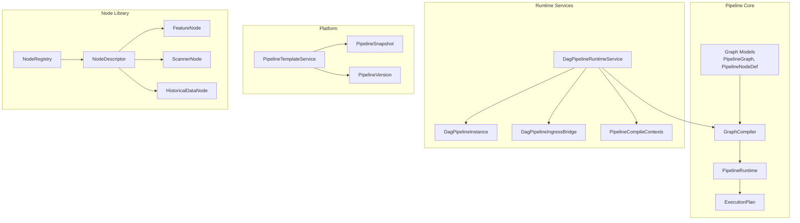

**Diagram sources**
- [GraphCompiler.java:104-175](file://pipeline/core/src/main/java/com/tradej/pipeline/runtime/GraphCompiler.java#L104-L175)
- [PipelineRuntime.java](file://pipeline/core/src/main/java/com/tradej/pipeline/runtime/PipelineRuntime.java)
- [ExecutionPlan.java:10-14](file://pipeline/core/src/main/java/com/tradej/pipeline/runtime/ExecutionPlan.java#L10-L14)
- [DagPipelineRuntimeService.java:55-71](file://pipeline/runtime/src/main/java/com/tradej/pipeline/service/DagPipelineRuntimeService.java#L55-L71)
- [DagPipelineInstance.java](file://pipeline/runtime/src/main/java/com/tradej/pipeline/service/DagPipelineInstance.java)
- [DagPipelineIngressBridge.java](file://pipeline/runtime/src/main/java/com/tradej/pipeline/service/DagPipelineIngressBridge.java)
- [PipelineCompileContexts.java](file://pipeline/runtime/src/main/java/com/tradej/pipeline/service/PipelineCompileContexts.java)
- [PipelineTemplateService.java](file://pipeline/platform/trade-pipeline-platform/src/main/java/com/tradej/pipeline/platform/PipelineTemplateService.java)
- [PipelineSnapshot.java](file://pipeline/platform/trade-pipeline-platform/src/main/java/com/tradej/pipeline/platform/PipelineSnapshot.java)
- [PipelineVersion.java](file://pipeline/platform/trade-pipeline-platform/src/main/java/com/tradej/pipeline/platform/PipelineVersion.java)
- [NodeRegistry.java](file://pipeline/core/src/main/java/com/tradej/pipeline/registry/NodeRegistry.java)
- [NodeDescriptor.java](file://nodes/trade-node-library/src/main/java/com/tradej/node/NodeDescriptor.java)
- [FeatureNode.java](file://nodes/trade-node-library/src/main/java/com/tradej/node/feature/FeatureNode.java)
- [ScannerNode.java](file://nodes/trade-node-library/src/main/java/com/tradej/node/scanner/ScannerNode.java)
- [HistoricalDataNode.java](file://nodes/trade-node-library/src/main/java/com/tradej/node/data/HistoricalDataNode.java)

**Section sources**
- [DagPipelineRuntimeService.java:28-71](file://pipeline/runtime/src/main/java/com/tradej/pipeline/service/DagPipelineRuntimeService.java#L28-L71)
- [GraphCompiler.java:104-175](file://pipeline/core/src/main/java/com/tradej/pipeline/runtime/GraphCompiler.java#L104-L175)
- [ExecutionPlan.java:10-14](file://pipeline/core/src/main/java/com/tradej/pipeline/runtime/ExecutionPlan.java#L10-L14)

## Core Components
- PipelineGraph and definitions: Directed edges define node connectivity; execution mode enforces DAG semantics.
- GraphCompiler: Topological sort, node instantiation (including partitioning), routing table construction, and node initialization with a per-node PipelineContext.
- PipelineRuntime: Deploys compiled graphs and manages runtime lifecycle.
- ExecutionPlan: Encapsulates sorted nodes, node lookup, and routing adjacency lists.
- Node types and registry: Built-in and custom nodes are registered and resolved via descriptors.
- Runtime services: Hot-path and DAG runtime services orchestrate compilation, persistence, and ingress binding.
- Catalog and templates: Versioned pipeline definitions, snapshots, and template management.

**Section sources**
- [PipelineGraph.java](file://pipeline/core/src/main/java/com/tradej/pipeline/graph/PipelineGraph.java)
- [PipelineNodeDef.java](file://pipeline/core/src/main/java/com/tradej/pipeline/graph/PipelineNodeDef.java)
- [PipelineEdgeDef.java](file://pipeline/core/src/main/java/com/tradej/pipeline/graph/PipelineEdgeDef.java)
- [PipelineExecutionMode.java](file://pipeline/core/src/main/java/com/tradej/pipeline/graph/PipelineExecutionMode.java)
- [GraphCompiler.java:104-175](file://pipeline/core/src/main/java/com/tradej/pipeline/runtime/GraphCompiler.java#L104-L175)
- [ExecutionPlan.java:10-14](file://pipeline/core/src/main/java/com/tradej/pipeline/runtime/ExecutionPlan.java#L10-L14)
- [PipelineRuntime.java](file://pipeline/core/src/main/java/com/tradej/pipeline/runtime/PipelineRuntime.java)
- [NodeRegistry.java](file://pipeline/core/src/main/java/com/tradej/pipeline/registry/NodeRegistry.java)
- [NodeTypeDescriptor.java](file://pipeline/core/src/main/java/com/tradej/pipeline/registry/NodeTypeDescriptor.java)

## Architecture Overview
The pipeline architecture centers on a DAG model with a compile-time planner and a runtime executor. Nodes receive events, process them, and publish downstream events to successor nodes. The runtime service validates, compiles, persists, and exposes ingress bindings.

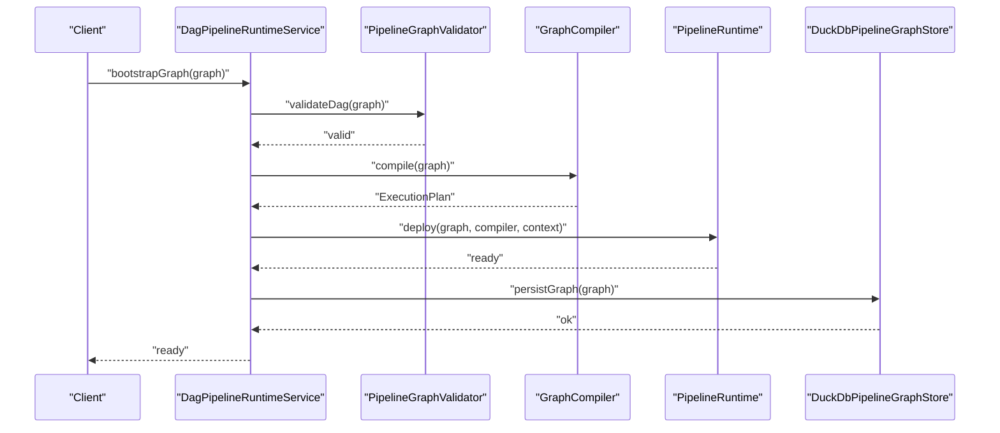

**Diagram sources**
- [DagPipelineRuntimeService.java:55-71](file://pipeline/runtime/src/main/java/com/tradej/pipeline/service/DagPipelineRuntimeService.java#L55-L71)
- [GraphCompiler.java:104-175](file://pipeline/core/src/main/java/com/tradej/pipeline/runtime/GraphCompiler.java#L104-L175)
- [PipelineRuntime.java](file://pipeline/core/src/main/java/com/tradej/pipeline/runtime/PipelineRuntime.java)
- [DuckDbPipelineGraphStore.java](file://pipeline/platform/trade-pipeline-platform/src/main/java/com/tradej/pipeline/platform/catalog/DuckDbPipelineGraphStore.java)

## Detailed Component Analysis

### Pipeline Engine and Execution Model
- Node interface: PipelineNode defines lifecycle and event handling.
- Base node: BasePipelineNode provides shared behaviors and defaults.
- Reactive node: ReactivePipelineNode integrates reactive patterns.
- Partitioned node: PartitionedNode shards workloads across partitions.
- Context: PipelineContext encapsulates publishing, timing, and service access for each node.

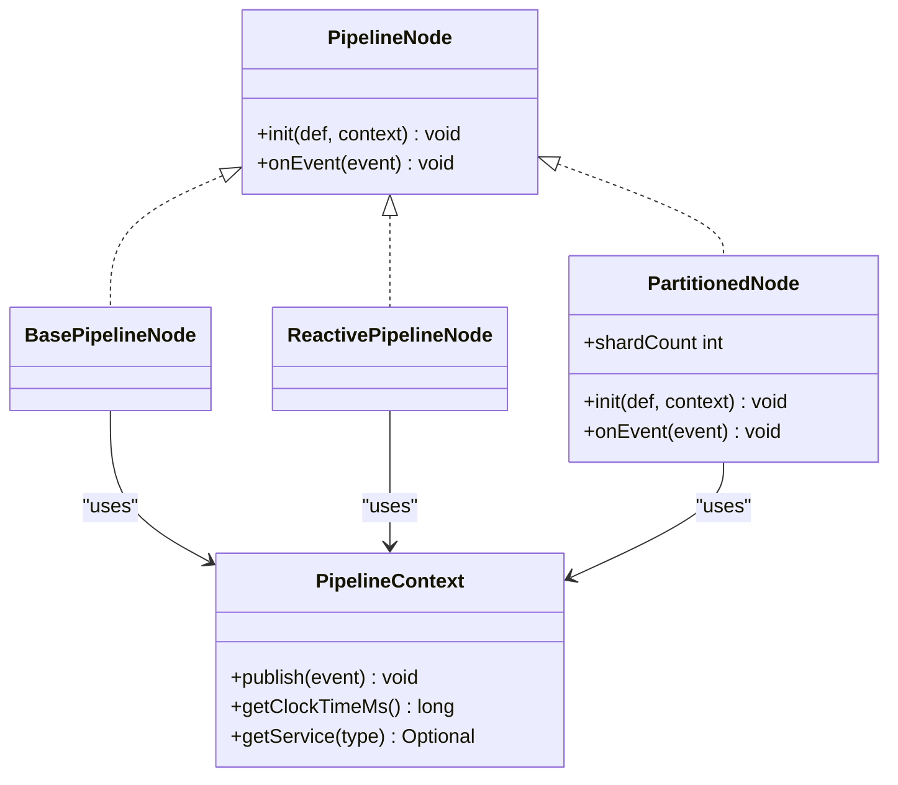

**Diagram sources**
- [PipelineNode.java](file://pipeline/core/src/main/java/com/tradej/pipeline/runtime/PipelineNode.java)
- [BasePipelineNode.java](file://pipeline/core/src/main/java/com/tradej/pipeline/runtime/BasePipelineNode.java)
- [ReactivePipelineNode.java](file://pipeline/core/src/main/java/com/tradej/pipeline/runtime/ReactivePipelineNode.java)
- [PartitionedNode.java](file://pipeline/core/src/main/java/com/tradej/pipeline/runtime/PartitionedNode.java)
- [PipelineContext.java](file://pipeline/core/src/main/java/com/tradej/pipeline/runtime/PipelineContext.java)

**Section sources**
- [PipelineNode.java](file://pipeline/core/src/main/java/com/tradej/pipeline/runtime/PipelineNode.java)
- [BasePipelineNode.java](file://pipeline/core/src/main/java/com/tradej/pipeline/runtime/BasePipelineNode.java)
- [ReactivePipelineNode.java](file://pipeline/core/src/main/java/com/tradej/pipeline/runtime/ReactivePipelineNode.java)
- [PartitionedNode.java](file://pipeline/core/src/main/java/com/tradej/pipeline/runtime/PartitionedNode.java)
- [PipelineContext.java](file://pipeline/core/src/main/java/com/tradej/pipeline/runtime/PipelineContext.java)

### Pipeline Compilation and Runtime Deployment
- Topological sorting ensures deterministic execution order.
- Node instantiation supports single or partitioned execution.
- Routing table maps upstream to downstream nodes.
- Node initialization injects a per-node PipelineContext with publishing and routing behavior.

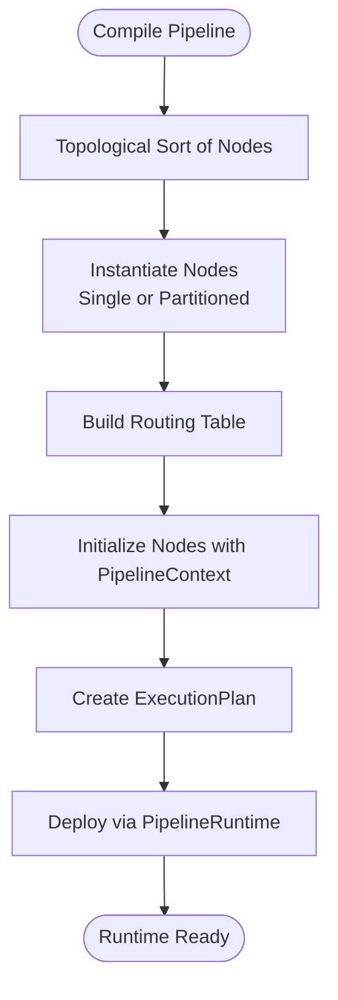

**Diagram sources**
- [GraphCompiler.java:104-175](file://pipeline/core/src/main/java/com/tradej/pipeline/runtime/GraphCompiler.java#L104-L175)
- [ExecutionPlan.java:10-14](file://pipeline/core/src/main/java/com/tradej/pipeline/runtime/ExecutionPlan.java#L10-L14)
- [PipelineRuntime.java](file://pipeline/core/src/main/java/com/tradej/pipeline/runtime/PipelineRuntime.java)

**Section sources**
- [GraphCompiler.java:104-175](file://pipeline/core/src/main/java/com/tradej/pipeline/runtime/GraphCompiler.java#L104-L175)
- [ExecutionPlan.java:10-14](file://pipeline/core/src/main/java/com/tradej/pipeline/runtime/ExecutionPlan.java#L10-L14)
- [PipelineRuntime.java](file://pipeline/core/src/main/java/com/tradej/pipeline/runtime/PipelineRuntime.java)

### Node Registry and Custom Node Development
- NodeRegistry maintains available node types and descriptors.
- NodeTypeDescriptor binds node identifiers to factories.
- NodeDescriptor defines metadata for built-in nodes (e.g., feature, scanner, historical data).
- NodeExecutor and NodeResult provide execution primitives and result contracts.
- NodeAdapterFactory adapts external systems to nodes.

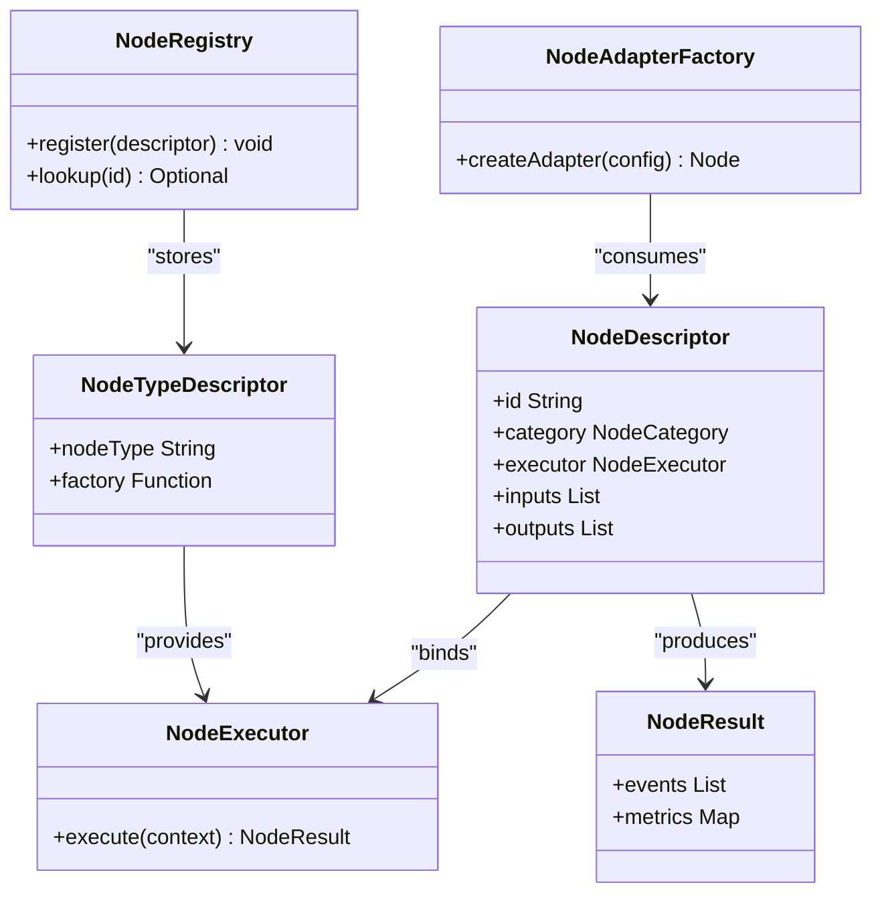

**Diagram sources**
- [NodeRegistry.java](file://pipeline/core/src/main/java/com/tradej/pipeline/registry/NodeRegistry.java)
- [NodeTypeDescriptor.java](file://pipeline/core/src/main/java/com/tradej/pipeline/registry/NodeTypeDescriptor.java)
- [NodeDescriptor.java](file://nodes/trade-node-library/src/main/java/com/tradej/node/NodeDescriptor.java)
- [NodeExecutor.java](file://nodes/trade-node-library/src/main/java/com/tradej/node/NodeExecutor.java)
- [NodeResult.java](file://nodes/trade-node-library/src/main/java/com/tradej/node/NodeResult.java)
- [NodeAdapterFactory.java](file://nodes/trade-node-library/src/main/java/com/tradej/node/adapter/NodeAdapterFactory.java)

**Section sources**
- [NodeRegistry.java](file://pipeline/core/src/main/java/com/tradej/pipeline/registry/NodeRegistry.java)
- [NodeTypeDescriptor.java](file://pipeline/core/src/main/java/com/tradej/pipeline/registry/NodeTypeDescriptor.java)
- [NodeDescriptor.java](file://nodes/trade-node-library/src/main/java/com/tradej/node/NodeDescriptor.java)
- [NodeExecutor.java](file://nodes/trade-node-library/src/main/java/com/tradej/node/NodeExecutor.java)
- [NodeResult.java](file://nodes/trade-node-library/src/main/java/com/tradej/node/NodeResult.java)
- [NodeAdapterFactory.java](file://nodes/trade-node-library/src/main/java/com/tradej/node/adapter/NodeAdapterFactory.java)

### Pipeline Catalog, Templates, and Version Control
- PipelineTemplateService manages templates and versions.
- PipelineTemplate defines reusable graph blueprints.
- PipelineDefinition stores concrete pipeline configurations.
- PipelineSnapshot captures runtime states for audits and rollbacks.
- PipelineVersion tracks semantic versions and compatibility.

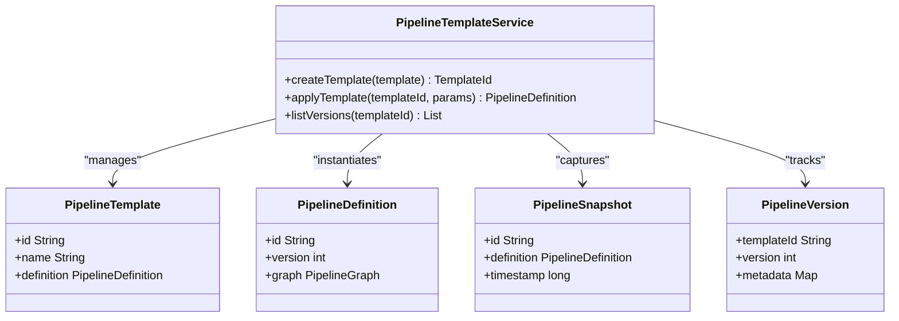

**Diagram sources**
- [PipelineTemplateService.java](file://pipeline/platform/trade-pipeline-platform/src/main/java/com/tradej/pipeline/platform/PipelineTemplateService.java)
- [PipelineTemplate.java](file://pipeline/platform/trade-pipeline-platform/src/main/java/com/tradej/pipeline/platform/PipelineTemplate.java)
- [PipelineDefinition.java](file://pipeline/platform/trade-pipeline-platform/src/main/java/com/tradej/pipeline/platform/PipelineDefinition.java)
- [PipelineSnapshot.java](file://pipeline/platform/trade-pipeline-platform/src/main/java/com/tradej/pipeline/platform/PipelineSnapshot.java)
- [PipelineVersion.java](file://pipeline/platform/trade-pipeline-platform/src/main/java/com/tradej/pipeline/platform/PipelineVersion.java)

**Section sources**
- [PipelineTemplateService.java](file://pipeline/platform/trade-pipeline-platform/src/main/java/com/tradej/pipeline/platform/PipelineTemplateService.java)
- [PipelineTemplate.java](file://pipeline/platform/trade-pipeline-platform/src/main/java/com/tradej/pipeline/platform/PipelineTemplate.java)
- [PipelineDefinition.java](file://pipeline/platform/trade-pipeline-platform/src/main/java/com/tradej/pipeline/platform/PipelineDefinition.java)
- [PipelineSnapshot.java](file://pipeline/platform/trade-pipeline-platform/src/main/java/com/tradej/pipeline/platform/PipelineSnapshot.java)
- [PipelineVersion.java](file://pipeline/platform/trade-pipeline-platform/src/main/java/com/tradej/pipeline/platform/PipelineVersion.java)

### Runtime Execution and Ingress Binding
- DagPipelineRuntimeService orchestrates DAG pipelines, validates graphs, compiles them, persists them, and exposes ingress bindings.
- DagPipelineInstance holds a compiled graph and its runtime.
- DagPipelineIngressBridge connects external inputs to ingress nodes.
- PipelineCompileContexts provides compile-time services and state.
- PipelineNodeFactory resolves node instances from definitions.

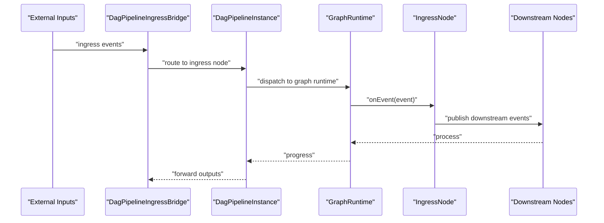

**Diagram sources**
- [DagPipelineRuntimeService.java:131-150](file://pipeline/runtime/src/main/java/com/tradej/pipeline/service/DagPipelineRuntimeService.java#L131-L150)
- [DagPipelineInstance.java](file://pipeline/runtime/src/main/java/com/tradej/pipeline/service/DagPipelineInstance.java)
- [DagPipelineIngressBridge.java](file://pipeline/runtime/src/main/java/com/tradej/pipeline/service/DagPipelineIngressBridge.java)
- [IngressNode.java](file://pipeline/core/src/main/java/com/tradej/pipeline/runtime/IngressNode.java)

**Section sources**
- [DagPipelineRuntimeService.java:131-150](file://pipeline/runtime/src/main/java/com/tradej/pipeline/service/DagPipelineRuntimeService.java#L131-L150)
- [DagPipelineInstance.java](file://pipeline/runtime/src/main/java/com/tradej/pipeline/service/DagPipelineInstance.java)
- [DagPipelineIngressBridge.java](file://pipeline/runtime/src/main/java/com/tradej/pipeline/service/DagPipelineIngressBridge.java)
- [PipelineCompileContexts.java](file://pipeline/runtime/src/main/java/com/tradej/pipeline/service/PipelineCompileContexts.java)
- [PipelineNodeFactory.java](file://pipeline/runtime/src/main/java/com/tradej/pipeline/service/PipelineNodeFactory.java)

### Node Types and Built-in Implementations
- FeatureNode: Computes features for downstream consumption.
- ScannerNode: Scans instruments or datasets to trigger actions.
- HistoricalDataNode: Loads historical market data for backtesting or replay.
- NodeCategory and PortDescriptor: Define categorization and I/O contracts.

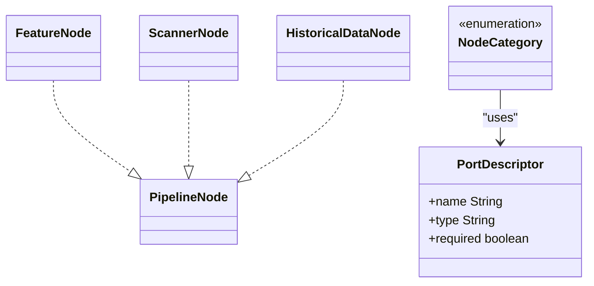

**Diagram sources**
- [FeatureNode.java](file://nodes/trade-node-library/src/main/java/com/tradej/node/feature/FeatureNode.java)
- [ScannerNode.java](file://nodes/trade-node-library/src/main/java/com/tradej/node/scanner/ScannerNode.java)
- [HistoricalDataNode.java](file://nodes/trade-node-library/src/main/java/com/tradej/node/data/HistoricalDataNode.java)
- [NodeCategory.java](file://nodes/trade-node-library/src/main/java/com/tradej/node/NodeCategory.java)
- [PortDescriptor.java](file://nodes/trade-node-library/src/main/java/com/tradej/node/PortDescriptor.java)

**Section sources**
- [FeatureNode.java](file://nodes/trade-node-library/src/main/java/com/tradej/node/feature/FeatureNode.java)
- [ScannerNode.java](file://nodes/trade-node-library/src/main/java/com/tradej/node/scanner/ScannerNode.java)
- [HistoricalDataNode.java](file://nodes/trade-node-library/src/main/java/com/tradej/node/data/HistoricalDataNode.java)
- [NodeCategory.java](file://nodes/trade-node-library/src/main/java/com/tradej/node/NodeCategory.java)
- [PortDescriptor.java](file://nodes/trade-node-library/src/main/java/com/tradej/node/PortDescriptor.java)

### Validation, Error Handling, and Monitoring
- PipelineGraphValidator enforces DAG constraints and structural validity.
- Node-level error isolation: GraphCompiler’s publish loop catches exceptions to prevent chain failures.
- NodeMetrics and NodeMetricsTracker collect per-node performance and error statistics.
- ReactorBridge and ReactorBridgeMetrics integrate reactive streams and expose metrics.

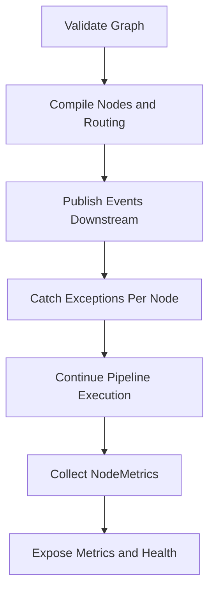

**Diagram sources**
- [PipelineGraphValidator.java](file://pipeline/core/src/main/java/com/tradej/pipeline/graph/PipelineGraphValidator.java)
- [GraphCompiler.java:140-158](file://pipeline/core/src/main/java/com/tradej/pipeline/runtime/GraphCompiler.java#L140-L158)
- [NodeMetrics.java](file://pipeline/core/src/main/java/com/tradej/pipeline/runtime/NodeMetrics.java)
- [NodeMetricsTracker.java](file://pipeline/core/src/main/java/com/tradej/pipeline/runtime/NodeMetricsTracker.java)
- [ReactorBridge.java](file://pipeline/core/src/main/java/com/tradej/pipeline/reactor/ReactorBridge.java)
- [ReactorBridgeMetrics.java](file://pipeline/runtime/src/main/java/com/tradej/pipeline/service/reactor/ReactorBridgeMetrics.java)

**Section sources**
- [PipelineGraphValidator.java](file://pipeline/core/src/main/java/com/tradej/pipeline/graph/PipelineGraphValidator.java)
- [GraphCompiler.java:140-158](file://pipeline/core/src/main/java/com/tradej/pipeline/runtime/GraphCompiler.java#L140-L158)
- [NodeMetrics.java](file://pipeline/core/src/main/java/com/tradej/pipeline/runtime/NodeMetrics.java)
- [NodeMetricsTracker.java](file://pipeline/core/src/main/java/com/tradej/pipeline/runtime/NodeMetricsTracker.java)
- [ReactorBridge.java](file://pipeline/core/src/main/java/com/tradej/pipeline/reactor/ReactorBridge.java)
- [ReactorBridgeMetrics.java](file://pipeline/runtime/src/main/java/com/tradej/pipeline/service/reactor/ReactorBridgeMetrics.java)

### Integration with Market Data, Indicators, and Analytics
- IngressNodeConfig enables mapping external inputs to pipeline ingress nodes.
- VirtualClock and EventTimestamps provide deterministic time control for replay/backtesting.
- InMemoryStateStore supports lightweight stateful nodes during execution.
- BacktestFillModel and DefaultBacktestFillModel simulate fills for strategy testing.
- PipelineNodeTypes enumerates supported node categories for routing and filtering.

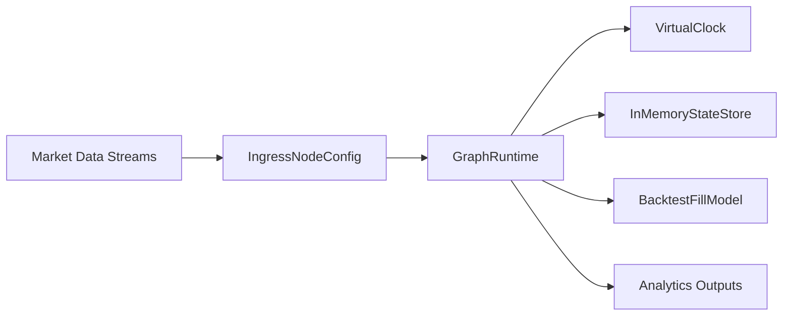

**Diagram sources**
- [IngressNodeConfig.java](file://pipeline/core/src/main/java/com/tradej/pipeline/graph/IngressNodeConfig.java)
- [VirtualClock.java](file://pipeline/core/src/main/java/com/tradej/pipeline/clock/VirtualClock.java)
- [EventTimestamps.java](file://pipeline/core/src/main/java/com/tradej/pipeline/clock/EventTimestamps.java)
- [InMemoryStateStore.java](file://pipeline/core/src/main/java/com/tradej/pipeline/state/InMemoryStateStore.java)
- [BacktestFillModel.java](file://pipeline/core/src/main/java/com/tradej/pipeline/runtime/BacktestFillModel.java)
- [DefaultBacktestFillModel.java](file://pipeline/core/src/main/java/com/tradej/pipeline/runtime/DefaultBacktestFillModel.java)
- [PipelineNodeTypes.java](file://pipeline/core/src/main/java/com/tradej/pipeline/runtime/PipelineNodeTypes.java)

**Section sources**
- [IngressNodeConfig.java](file://pipeline/core/src/main/java/com/tradej/pipeline/graph/IngressNodeConfig.java)
- [VirtualClock.java](file://pipeline/core/src/main/java/com/tradej/pipeline/clock/VirtualClock.java)
- [EventTimestamps.java](file://pipeline/core/src/main/java/com/tradej/pipeline/clock/EventTimestamps.java)
- [InMemoryStateStore.java](file://pipeline/core/src/main/java/com/tradej/pipeline/state/InMemoryStateStore.java)
- [BacktestFillModel.java](file://pipeline/core/src/main/java/com/tradej/pipeline/runtime/BacktestFillModel.java)
- [DefaultBacktestFillModel.java](file://pipeline/core/src/main/java/com/tradej/pipeline/runtime/DefaultBacktestFillModel.java)
- [PipelineNodeTypes.java](file://pipeline/core/src/main/java/com/tradej/pipeline/runtime/PipelineNodeTypes.java)

## Dependency Analysis
The pipeline system exhibits layered cohesion:
- Core graph and runtime depend on registry and node abstractions.
- Runtime services depend on storage and compile contexts.
- Platform services depend on core runtime and graph models.
- Node library depends on core node interfaces and registry.

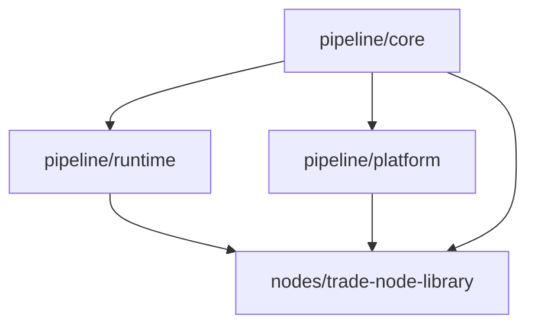

**Diagram sources**
- [GraphCompiler.java:104-175](file://pipeline/core/src/main/java/com/tradej/pipeline/runtime/GraphCompiler.java#L104-L175)
- [DagPipelineRuntimeService.java:55-71](file://pipeline/runtime/src/main/java/com/tradej/pipeline/service/DagPipelineRuntimeService.java#L55-L71)
- [PipelineTemplateService.java](file://pipeline/platform/trade-pipeline-platform/src/main/java/com/tradej/pipeline/platform/PipelineTemplateService.java)
- [NodeRegistry.java](file://pipeline/core/src/main/java/com/tradej/pipeline/registry/NodeRegistry.java)

**Section sources**
- [GraphCompiler.java:104-175](file://pipeline/core/src/main/java/com/tradej/pipeline/runtime/GraphCompiler.java#L104-L175)
- [DagPipelineRuntimeService.java:55-71](file://pipeline/runtime/src/main/java/com/tradej/pipeline/service/DagPipelineRuntimeService.java#L55-L71)
- [PipelineTemplateService.java](file://pipeline/platform/trade-pipeline-platform/src/main/java/com/tradej/pipeline/platform/PipelineTemplateService.java)

## Performance Considerations
- PartitionedNode: Distribute compute across shards to scale throughput.
- ReactivePipelineNode: Integrate reactive streams for non-blocking processing.
- NodeMetrics and NodeMetricsTracker: Monitor latency, error rates, and queue depths.
- VirtualClock: Enable deterministic replay and benchmarking.
- ReactorBridge: Optimize event bridging and backpressure handling.

[No sources needed since this section provides general guidance]

## Troubleshooting Guide
- Validation failures: Ensure graph is a DAG and all edges connect existing nodes.
- Node crashes: GraphCompiler’s publish loop isolates exceptions; inspect NodeMetrics for recurring errors.
- Ingress mismatches: Verify IngressNodeConfig against external input schemas.
- Persistence issues: Confirm DuckDbPipelineGraphStore connectivity and permissions.
- Template/version conflicts: Align template versions with PipelineVersion metadata.

**Section sources**
- [PipelineGraphValidator.java](file://pipeline/core/src/main/java/com/tradej/pipeline/graph/PipelineGraphValidator.java)
- [GraphCompiler.java:140-158](file://pipeline/core/src/main/java/com/tradej/pipeline/runtime/GraphCompiler.java#L140-L158)
- [IngressNodeConfig.java](file://pipeline/core/src/main/java/com/tradej/pipeline/graph/IngressNodeConfig.java)
- [DuckDbPipelineGraphStore.java](file://pipeline/platform/trade-pipeline-platform/src/main/java/com/tradej/pipeline/platform/catalog/DuckDbPipelineGraphStore.java)
- [PipelineVersion.java](file://pipeline/platform/trade-pipeline-platform/src/main/java/com/tradej/pipeline/platform/PipelineVersion.java)

## Conclusion
TradeJ’s pipeline system combines a robust DAG model, flexible node registry, and production-grade runtime services. It supports dynamic compilation, partitioned execution, and rich observability, enabling scalable market data processing, indicator computation, and analytics generation.

[No sources needed since this section summarizes without analyzing specific files]

## Appendices

### Building Custom Nodes
- Implement a NodeExecutor that produces NodeResult with downstream events and metrics.
- Register the node via NodeRegistry with a NodeTypeDescriptor.
- Use NodeDescriptor to declare ports and category.
- Integrate with PartitionedNode for horizontal scaling.

**Section sources**
- [NodeExecutor.java](file://nodes/trade-node-library/src/main/java/com/tradej/node/NodeExecutor.java)
- [NodeResult.java](file://nodes/trade-node-library/src/main/java/com/tradej/node/NodeResult.java)
- [NodeRegistry.java](file://pipeline/core/src/main/java/com/tradej/pipeline/registry/NodeRegistry.java)
- [NodeTypeDescriptor.java](file://pipeline/core/src/main/java/com/tradej/pipeline/registry/NodeTypeDescriptor.java)
- [NodeDescriptor.java](file://nodes/trade-node-library/src/main/java/com/tradej/node/NodeDescriptor.java)
- [PartitionedNode.java](file://pipeline/core/src/main/java/com/tradej/pipeline/runtime/PartitionedNode.java)

### Configuring Pipeline Graphs
- Define nodes and edges using PipelineGraph, PipelineNodeDef, and PipelineEdgeDef.
- Set PipelineExecutionMode to DAG.
- Use IngressNodeConfig to bind external inputs.
- Persist and reload graphs via DagPipelineRuntimeService.

**Section sources**
- [PipelineGraph.java](file://pipeline/core/src/main/java/com/tradej/pipeline/graph/PipelineGraph.java)
- [PipelineNodeDef.java](file://pipeline/core/src/main/java/com/tradej/pipeline/graph/PipelineNodeDef.java)
- [PipelineEdgeDef.java](file://pipeline/core/src/main/java/com/tradej/pipeline/graph/PipelineEdgeDef.java)
- [PipelineExecutionMode.java](file://pipeline/core/src/main/java/com/tradej/pipeline/graph/PipelineExecutionMode.java)
- [IngressNodeConfig.java](file://pipeline/core/src/main/java/com/tradej/pipeline/graph/IngressNodeConfig.java)
- [DagPipelineRuntimeService.java:55-71](file://pipeline/runtime/src/main/java/com/tradej/pipeline/service/DagPipelineRuntimeService.java#L55-L71)

### Optimizing Performance
- Prefer PartitionedNode for CPU-bound stages.
- Use ReactivePipelineNode for I/O-bound or streaming stages.
- Monitor NodeMetrics and adjust partition counts and buffer sizes.
- Employ VirtualClock for deterministic benchmarks and replay.

**Section sources**
- [PartitionedNode.java](file://pipeline/core/src/main/java/com/tradej/pipeline/runtime/PartitionedNode.java)
- [ReactivePipelineNode.java](file://pipeline/core/src/main/java/com/tradej/pipeline/runtime/ReactivePipelineNode.java)
- [NodeMetrics.java](file://pipeline/core/src/main/java/com/tradej/pipeline/runtime/NodeMetrics.java)
- [VirtualClock.java](file://pipeline/core/src/main/java/com/tradej/pipeline/clock/VirtualClock.java)