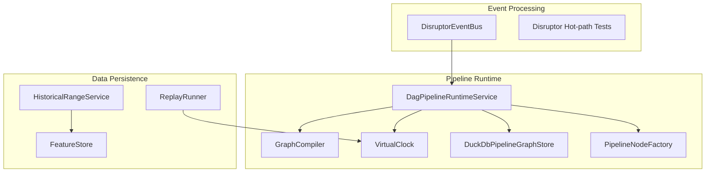
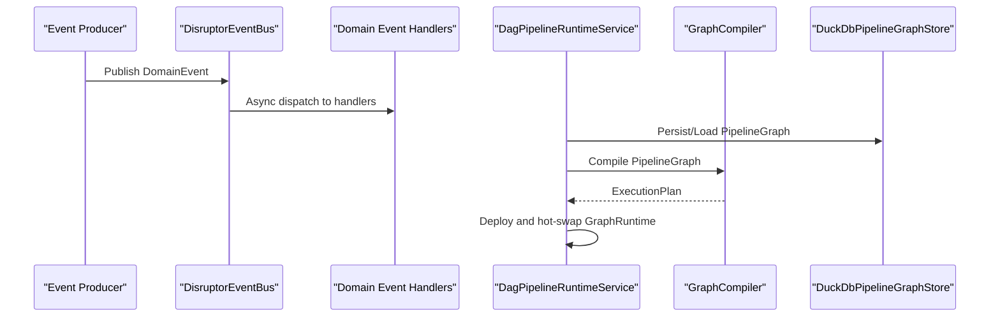
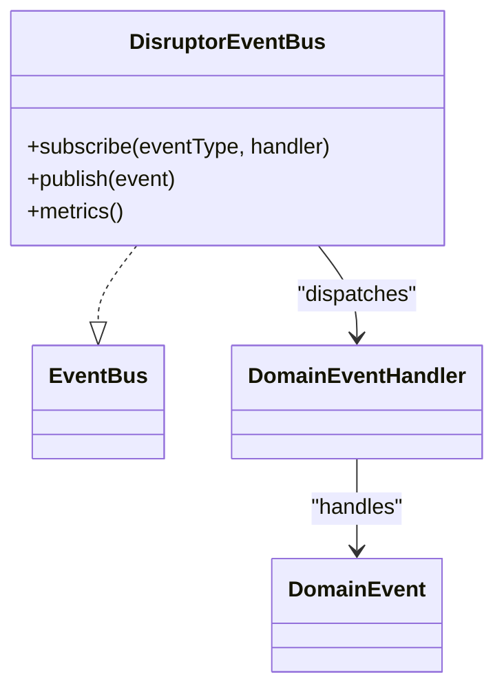
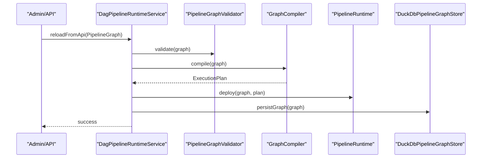
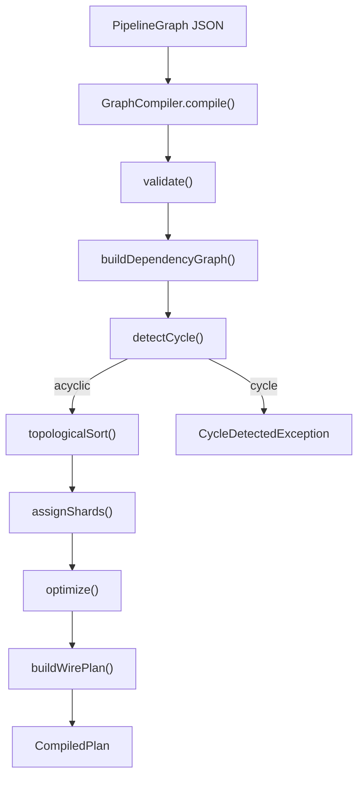
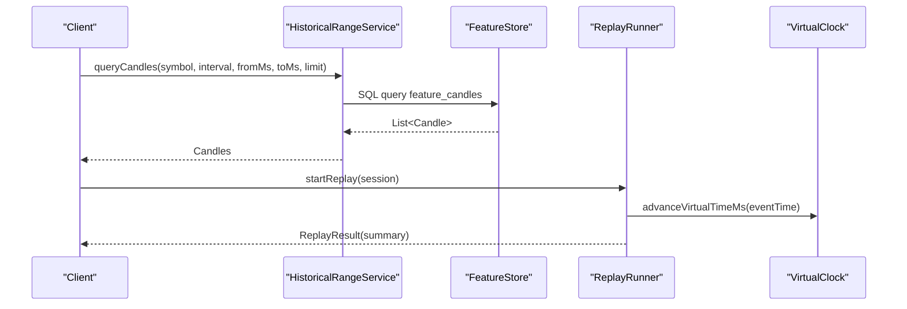
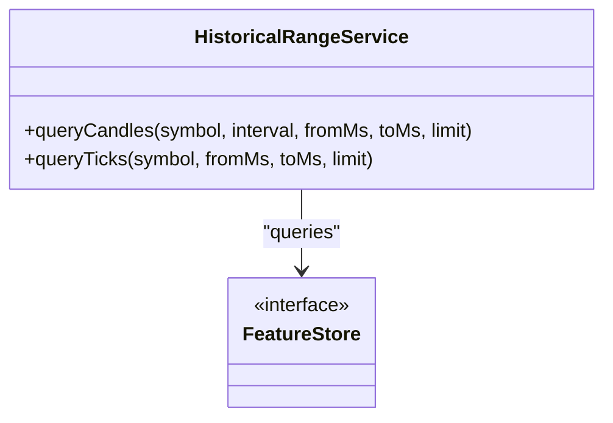
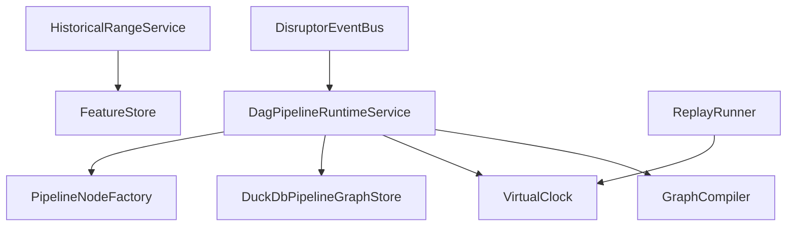

# Data Processing and Event System

<cite>
**Referenced Files in This Document**
- [DisruptorEventBus.java](file://runtime/disruptor/src/main/java/com/tradej/disruptor/DisruptorEventBus.java)
- [DagPipelineRuntimeService.java](file://pipeline/runtime/src/main/java/com/tradej/pipeline/service/DagPipelineRuntimeService.java)
- [GraphCompiler.java](file://docs/archive/ARCHITECTURE_EVOLUTION_PIPELINE_OS.md)
- [ARCHITECTURE_REPORT.md](file://docs/ARCHITECTURE_REPORT.md)
- [HistoricalRangeService.java](file://data/persistence/src/main/java/com/tradej/persistence/replay/HistoricalRangeService.java)
- [ReplayRunner.java](file://data/persistence/src/main/java/com/tradej/persistence/replay/ReplayRunner.java)
- [DisruptorHighThroughputStressTest.java](file://runtime/hotpath/src/test/java/com/tradej/hotpath/DisruptorHighThroughputStressTest.java)
- [DuckDbPipelineGraphStore.java](file://pipeline/runtime/src/main/java/com/tradej/pipeline/service/DuckDbPipelineGraphStore.java)
- [PipelineNodeFactory.java](file://pipeline/runtime/src/main/java/com/tradej/pipeline/service/PipelineNodeFactory.java)
- [VirtualClock.java](file://pipeline/clock/src/main/java/com/tradej/pipeline/clock/VirtualClock.java)
- [FeatureStore.java](file://core/src/main/java/com/tradej/core/domain/port/FeatureStore.java)
</cite>

## Table of Contents
1. [Introduction](#introduction)
2. [Project Structure](#project-structure)
3. [Core Components](#core-components)
4. [Architecture Overview](#architecture-overview)
5. [Detailed Component Analysis](#detailed-component-analysis)
6. [Dependency Analysis](#dependency-analysis)
7. [Performance Considerations](#performance-considerations)
8. [Troubleshooting Guide](#troubleshooting-guide)
9. [Conclusion](#conclusion)

## Introduction
This document explains the data processing and event system built on an event-driven architecture using LMAX Disruptor for high-throughput event processing, a DAG-based pipeline runtime for workflow execution, and a robust replay and state reconstruction framework. It covers event bus implementation, message routing, pipeline graph compilation, historical data processing, time series ingestion, and feature store integration. Performance monitoring and replay capabilities are documented alongside state reconstruction mechanisms.

## Project Structure
The system spans several modules:
- Event processing: LMAX Disruptor-backed event bus
- Pipeline runtime: DAG compilation, deployment, and execution orchestration
- Data persistence: Historical range queries, replay runner, and feature store integration
- Testing: High-throughput stress tests validating Disruptor performance

**Diagram sources**
- [DisruptorEventBus.java](file://runtime/disruptor/src/main/java/com/tradej/disruptor/DisruptorEventBus.java)
- [DagPipelineRuntimeService.java](file://pipeline/runtime/src/main/java/com/tradej/pipeline/service/DagPipelineRuntimeService.java)
- [GraphCompiler.java](file://docs/archive/ARCHITECTURE_EVOLUTION_PIPELINE_OS.md)
- [HistoricalRangeService.java](file://data/persistence/src/main/java/com/tradej/persistence/replay/HistoricalRangeService.java)
- [ReplayRunner.java](file://data/persistence/src/main/java/com/tradej/persistence/replay/ReplayRunner.java)
- [DisruptorHighThroughputStressTest.java](file://runtime/hotpath/src/test/java/com/tradej/hotpath/DisruptorHighThroughputStressTest.java)
- [DuckDbPipelineGraphStore.java](file://pipeline/runtime/src/main/java/com/tradej/pipeline/service/DuckDbPipelineGraphStore.java)
- [PipelineNodeFactory.java](file://pipeline/runtime/src/main/java/com/tradej/pipeline/service/PipelineNodeFactory.java)
- [VirtualClock.java](file://pipeline/clock/src/main/java/com/tradej/pipeline/clock/VirtualClock.java)
- [FeatureStore.java](file://core/src/main/java/com/tradej/core/domain/port/FeatureStore.java)

**Section sources**
- [DisruptorEventBus.java](file://runtime/disruptor/src/main/java/com/tradej/disruptor/DisruptorEventBus.java)
- [DagPipelineRuntimeService.java](file://pipeline/runtime/src/main/java/com/tradej/pipeline/service/DagPipelineRuntimeService.java)
- [GraphCompiler.java](file://docs/archive/ARCHITECTURE_EVOLUTION_PIPELINE_OS.md)
- [ARCHITECTURE_REPORT.md](file://docs/ARCHITECTURE_REPORT.md)
- [HistoricalRangeService.java](file://data/persistence/src/main/java/com/tradej/persistence/replay/HistoricalRangeService.java)
- [ReplayRunner.java](file://data/persistence/src/main/java/com/tradej/persistence/replay/ReplayRunner.java)
- [DisruptorHighThroughputStressTest.java](file://runtime/hotpath/src/test/java/com/tradej/hotpath/DisruptorHighThroughputStressTest.java)
- [DuckDbPipelineGraphStore.java](file://pipeline/runtime/src/main/java/com/tradej/pipeline/service/DuckDbPipelineGraphStore.java)
- [PipelineNodeFactory.java](file://pipeline/runtime/src/main/java/com/tradej/pipeline/service/PipelineNodeFactory.java)
- [VirtualClock.java](file://pipeline/clock/src/main/java/com/tradej/pipeline/clock/VirtualClock.java)
- [FeatureStore.java](file://core/src/main/java/com/tradej/core/domain/port/FeatureStore.java)

## Core Components
- DisruptorEventBus: An LMAX Disruptor-backed event bus implementing asynchronous event dispatch with subscriber registration and metrics collection.
- DagPipelineRuntimeService: Orchestrates DAG pipeline lifecycle, including graph validation, compilation, deployment, and runtime instance management.
- GraphCompiler: Compiles PipelineGraph JSON into an executable ExecutionPlan via dependency analysis, cycle detection, topological sorting, and shard assignment.
- HistoricalRangeService: Queries historical candles and ticks from the feature store within specified time ranges.
- ReplayRunner: Executes replay sessions, advances virtual clocks, and reports replay statistics.
- FeatureStore: Defines the feature store interface for time series and derived features.
- VirtualClock: Provides virtual time control for replay mode and deterministic execution.
- DuckDbPipelineGraphStore: Persists and retrieves pipeline graphs for runtime reloads.
- PipelineNodeFactory: Creates pipeline nodes for runtime execution.

**Section sources**
- [DisruptorEventBus.java](file://runtime/disruptor/src/main/java/com/tradej/disruptor/DisruptorEventBus.java)
- [DagPipelineRuntimeService.java](file://pipeline/runtime/src/main/java/com/tradej/pipeline/service/DagPipelineRuntimeService.java)
- [GraphCompiler.java](file://docs/archive/ARCHITECTURE_EVOLUTION_PIPELINE_OS.md)
- [HistoricalRangeService.java](file://data/persistence/src/main/java/com/tradej/persistence/replay/HistoricalRangeService.java)
- [ReplayRunner.java](file://data/persistence/src/main/java/com/tradej/persistence/replay/ReplayRunner.java)
- [FeatureStore.java](file://core/src/main/java/com/tradej/core/domain/port/FeatureStore.java)
- [VirtualClock.java](file://pipeline/clock/src/main/java/com/tradej/pipeline/clock/VirtualClock.java)
- [DuckDbPipelineGraphStore.java](file://pipeline/runtime/src/main/java/com/tradej/pipeline/service/DuckDbPipelineGraphStore.java)
- [PipelineNodeFactory.java](file://pipeline/runtime/src/main/java/com/tradej/pipeline/service/PipelineNodeFactory.java)

## Architecture Overview
The system employs an event-driven architecture with LMAX Disruptor for high-throughput event processing and a DAG-based pipeline runtime for workflow execution. Events are published to the Disruptor ring buffer and asynchronously dispatched to registered subscribers. The pipeline runtime compiles graph definitions into executable plans, manages deployments, and coordinates node execution.

**Diagram sources**
- [DisruptorEventBus.java](file://runtime/disruptor/src/main/java/com/tradej/disruptor/DisruptorEventBus.java)
- [DagPipelineRuntimeService.java](file://pipeline/runtime/src/main/java/com/tradej/pipeline/service/DagPipelineRuntimeService.java)
- [GraphCompiler.java](file://docs/archive/ARCHITECTURE_EVOLUTION_PIPELINE_OS.md)
- [DuckDbPipelineGraphStore.java](file://pipeline/runtime/src/main/java/com/tradej/pipeline/service/DuckDbPipelineGraphStore.java)

**Section sources**
- [ARCHITECTURE_REPORT.md](file://docs/ARCHITECTURE_REPORT.md)
- [DagPipelineRuntimeService.java](file://pipeline/runtime/src/main/java/com/tradej/pipeline/service/DagPipelineRuntimeService.java)

## Detailed Component Analysis

### DisruptorEventBus
- Implements an event bus backed by LMAX Disruptor with configurable queue capacities and subscriber management.
- Supports asynchronous dispatch to registered handlers per event type.
- Tracks metrics and maintains thread-safe subscriber lists.

**Diagram sources**
- [DisruptorEventBus.java](file://runtime/disruptor/src/main/java/com/tradej/disruptor/DisruptorEventBus.java)

**Section sources**
- [DisruptorEventBus.java](file://runtime/disruptor/src/main/java/com/tradej/disruptor/DisruptorEventBus.java)

### DagPipelineRuntimeService
- Manages DAG pipeline lifecycle: bootstrap, reload, and persistence.
- Validates graph execution mode and compiles graphs into executable plans.
- Exposes ingress bindings for runtime coordination and orchestrates node factory creation.

**Diagram sources**
- [DagPipelineRuntimeService.java](file://pipeline/runtime/src/main/java/com/tradej/pipeline/service/DagPipelineRuntimeService.java)
- [GraphCompiler.java](file://docs/archive/ARCHITECTURE_EVOLUTION_PIPELINE_OS.md)

**Section sources**
- [DagPipelineRuntimeService.java](file://pipeline/runtime/src/main/java/com/tradej/pipeline/service/DagPipelineRuntimeService.java)

### GraphCompiler (Compilation Pipeline)
- Validates graph structure, builds dependency maps, detects cycles, performs topological sort, assigns shards, optimizes execution order, and wires event filters per edge.

**Diagram sources**
- [GraphCompiler.java](file://docs/archive/ARCHITECTURE_EVOLUTION_PIPELINE_OS.md)

**Section sources**
- [GraphCompiler.java](file://docs/archive/ARCHITECTURE_EVOLUTION_PIPELINE_OS.md)

### Historical Range Service and Replay Runner
- HistoricalRangeService queries completed candles and reconstructed ticks from the feature store within specified time ranges.
- ReplayRunner executes replay sessions, advances virtual clocks during replay, and reports replay statistics.

**Diagram sources**
- [HistoricalRangeService.java](file://data/persistence/src/main/java/com/tradej/persistence/replay/HistoricalRangeService.java)
- [ReplayRunner.java](file://data/persistence/src/main/java/com/tradej/persistence/replay/ReplayRunner.java)
- [VirtualClock.java](file://pipeline/clock/src/main/java/com/tradej/pipeline/clock/VirtualClock.java)

**Section sources**
- [HistoricalRangeService.java](file://data/persistence/src/main/java/com/tradej/persistence/replay/HistoricalRangeService.java)
- [ReplayRunner.java](file://data/persistence/src/main/java/com/tradej/persistence/replay/ReplayRunner.java)
- [VirtualClock.java](file://pipeline/clock/src/main/java/com/tradej/pipeline/clock/VirtualClock.java)

### Feature Store Integration
- FeatureStore defines the interface for time series and derived features used by historical queries and pipeline nodes.
- HistoricalRangeService leverages prepared statements to query candles and ticks, ensuring chronological ordering and limits.

**Diagram sources**
- [FeatureStore.java](file://core/src/main/java/com/tradej/core/domain/port/FeatureStore.java)
- [HistoricalRangeService.java](file://data/persistence/src/main/java/com/tradej/persistence/replay/HistoricalRangeService.java)

**Section sources**
- [FeatureStore.java](file://core/src/main/java/com/tradej/core/domain/port/FeatureStore.java)
- [HistoricalRangeService.java](file://data/persistence/src/main/java/com/tradej/persistence/replay/HistoricalRangeService.java)

## Dependency Analysis
The runtime service depends on the graph compiler, virtual clock, and pipeline graph store. The event bus integrates with the runtime for hot-path publishing. Historical services rely on the feature store for data retrieval.

**Diagram sources**
- [DagPipelineRuntimeService.java](file://pipeline/runtime/src/main/java/com/tradej/pipeline/service/DagPipelineRuntimeService.java)
- [GraphCompiler.java](file://docs/archive/ARCHITECTURE_EVOLUTION_PIPELINE_OS.md)
- [VirtualClock.java](file://pipeline/clock/src/main/java/com/tradej/pipeline/clock/VirtualClock.java)
- [DuckDbPipelineGraphStore.java](file://pipeline/runtime/src/main/java/com/tradej/pipeline/service/DuckDbPipelineGraphStore.java)
- [PipelineNodeFactory.java](file://pipeline/runtime/src/main/java/com/tradej/pipeline/service/PipelineNodeFactory.java)
- [DisruptorEventBus.java](file://runtime/disruptor/src/main/java/com/tradej/disruptor/DisruptorEventBus.java)
- [HistoricalRangeService.java](file://data/persistence/src/main/java/com/tradej/persistence/replay/HistoricalRangeService.java)
- [FeatureStore.java](file://core/src/main/java/com/tradej/core/domain/port/FeatureStore.java)
- [ReplayRunner.java](file://data/persistence/src/main/java/com/tradej/persistence/replay/ReplayRunner.java)

**Section sources**
- [DagPipelineRuntimeService.java](file://pipeline/runtime/src/main/java/com/tradej/pipeline/service/DagPipelineRuntimeService.java)
- [DisruptorEventBus.java](file://runtime/disruptor/src/main/java/com/tradej/disruptor/DisruptorEventBus.java)
- [HistoricalRangeService.java](file://data/persistence/src/main/java/com/tradej/persistence/replay/HistoricalRangeService.java)
- [ReplayRunner.java](file://data/persistence/src/main/java/com/tradej/persistence/replay/ReplayRunner.java)

## Performance Considerations
- Disruptor-based event bus minimizes contention and enables high-throughput event dispatch with bounded queues and asynchronous handlers.
- Stress testing validates latency targets under sustained load, with retry logic for latency assertions.
- Pipeline compilation optimizes execution order and shard assignment to reduce cross-node synchronization overhead.

Recommendations:
- Monitor downstream queue capacities and adjust based on observed throughput and latency.
- Use topological sorting and shard assignment to balance workloads across nodes.
- Apply circuit breakers and backpressure mechanisms at ingress points to prevent overload.

**Section sources**
- [DisruptorHighThroughputStressTest.java](file://runtime/hotpath/src/test/java/com/tradej/hotpath/DisruptorHighThroughputStressTest.java)
- [DisruptorEventBus.java](file://runtime/disruptor/src/main/java/com/tradej/disruptor/DisruptorEventBus.java)
- [GraphCompiler.java](file://docs/archive/ARCHITECTURE_EVOLUTION_PIPELINE_OS.md)

## Troubleshooting Guide
Common issues and resolutions:
- Event bus throughput degradation: Verify queue capacities and handler thread counts; ensure subscribers are efficient and avoid blocking operations.
- Pipeline compilation failures: Validate graph structure and resolve cycles detected during compilation; confirm node configurations and dependencies.
- Replay clock drift: Ensure virtual clock is advanced consistently during replay; verify event timestamps and session boundaries.
- Historical query timeouts: Adjust query limits and indexes; validate feature store connectivity and database performance.

Operational checks:
- Confirm Disruptor ring buffer utilization and consumer lag.
- Validate DAG runtime hot-swap atomicity and rollback procedures.
- Review replay runner logs for skipped or failed events and reconcile discrepancies.

**Section sources**
- [DisruptorEventBus.java](file://runtime/disruptor/src/main/java/com/tradej/disruptor/DisruptorEventBus.java)
- [DagPipelineRuntimeService.java](file://pipeline/runtime/src/main/java/com/tradej/pipeline/service/DagPipelineRuntimeService.java)
- [ReplayRunner.java](file://data/persistence/src/main/java/com/tradej/persistence/replay/ReplayRunner.java)
- [HistoricalRangeService.java](file://data/persistence/src/main/java/com/tradej/persistence/replay/HistoricalRangeService.java)

## Conclusion
The system combines LMAX Disruptor for high-performance event processing with a DAG-based pipeline runtime for flexible workflow execution. Historical data processing, time series ingestion, and feature store integration enable robust replay and state reconstruction. Performance monitoring and replay capabilities ensure operational reliability and deterministic debugging.